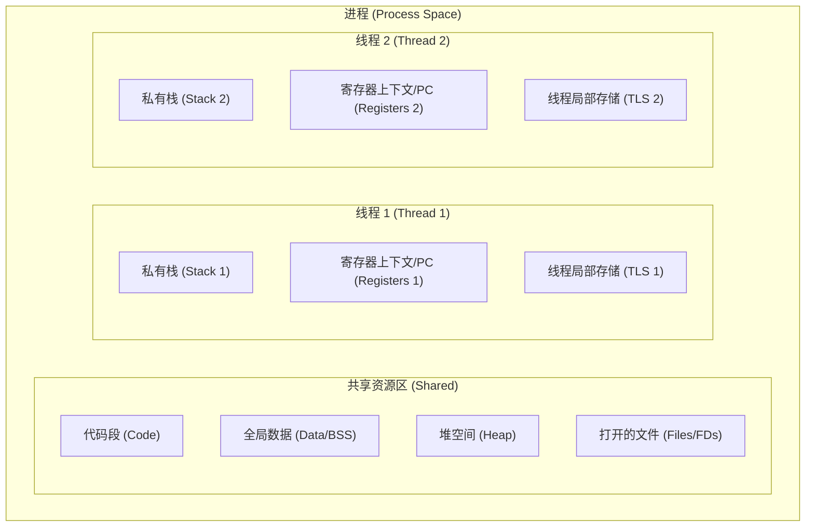
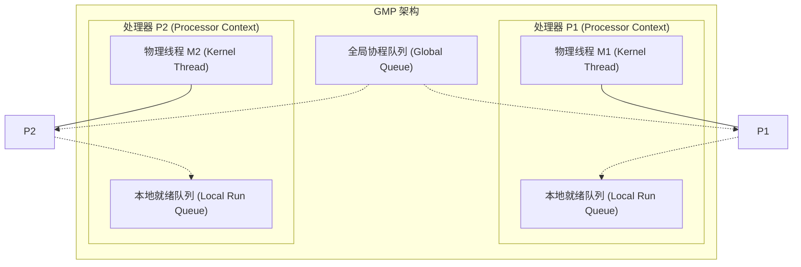

# 1.1.1.3 进程线程协程

在现代操作系统和并发编程领域，进程（Process）、线程（Thread）和协程（Coroutine）是实现多任务并发与并行处理的三种核心执行单元。它们从不同的抽象维度解决了算力分配、资源隔离、并发吞吐与开发复杂度的矛盾。本章将从通用的计算机科学视角，深度剖析这三者的资源模型、物理边界、硬件级与软件级调度机制，并对比其在实际系统设计中的权衡。

---

## 一、进程（Process）：资源隔离的物理世界

进程是操作系统进行资源分配和调度运行的最小独立单位。它的诞生是为了在多道程序并发环境下，为每个程序提供一个安全的、互不干扰的独立运行环境。

### 1.1 进程的内存布局与物理隔离机制
进程隔离的核心是**独立的虚拟地址空间**。每个进程都以为自己独占了整台计算机的物理内存。

```
                    ┌──────────────────────────┐  虚拟内存最大值 (如 0xFFFFFFFF)
                    │     内核虚拟内存空间      │  (所有进程通过页表共享该物理映射，
                    │  (Kernel Virtual Memory) │   但用户态无权访问)
                    ├──────────────────────────┤
                    │    用户栈 (Stack)        │  向下增长，存放局部变量、函数参数
                    │          │               │
                    │          ▼               │
                    │                          │
                    │          ▲               │
                    │          │               │
                    │    用户堆 (Heap)         │  向上增长，动态分配的内存 (malloc/new)
                    ├──────────────────────────┤
                    │   BSS段 (未初始化全局)   │
                    ├──────────────────────────┤
                    │   数据段 (已初始化全局)   │
                    ├──────────────────────────┤
                    │   代码段 (Text Segment)  │  只读，存放可执行机器指令
                    └──────────────────────────┘  虚拟内存 0x00000000
```

1. **代码段（Text Segment）**：存放 CPU 执行的机器指令。通常是只读的，防止程序意外或恶意篡改自身指令。
2. **数据段（Initialized Data Segment）**：存放程序中已初始化的全局变量和静态变量。
3. **BSS 段（Uninitialized Data Segment）**：存放未初始化的全局变量和静态变量，在程序加载时由内核清零。
4. **堆（Heap）**：用于动态内存分配（通过 `malloc` 或 `new` 申请）。堆的增长方向是由低地址向高地址方向增长。
5. **栈（Stack）**：用于存放函数调用的局部变量、函数参数、返回地址和寄存器上下文。栈的增长方向是由高地址向低地址方向增长。
6. **内核空间（Kernel Space）**：操作系统内核的代码、数据及内核栈映射区。虽然在每个进程的虚拟空间中都有映射，但在用户态（Ring 3 / EL0）下，硬件 MMU 会拦截对其的任何直接读写。

#### 物理隔离的实现：页表与 MMU
每个进程在内核中都拥有独立的**页表基址**。当系统发生进程切换时，CPU 的页表寄存器（如 x86 的 CR3 或 ARM 的 TTBR0_EL1）会被写入新进程的页表物理基地址。这使得两个不同进程中即使使用了完全相同的虚拟地址（例如 `0x00400000`），MMU 也会根据不同的页表将其翻译到完全不同的物理内存帧（Page Frame）上。

### 1.2 进程隔离的利弊权衡
* **优势：极高的稳定性与安全性**
  由于地址空间完全隔离，进程 A 的代码发生野指针崩溃、内存越界或段错误（Segment Fault）时，只会导致进程 A 自身崩溃，完全无法触及进程 B 的内存。这种强隔离非常适合运行不可信的三方应用，或者用于构建稳定性要求极高的系统。
  * *典型案例*：现代 Chromium 浏览器采用多进程架构。每个网页标签页、GPU 渲染组件和插件都运行在独立的 Sandbox 进程中。某个复杂的网页脚本触发崩溃时，仅该标签页显示“崩溃”，浏览器主框架与其他标签页依然可以流畅运行。
* **劣势：巨大的开销与通信门槛**
  * **创建/销毁成本高**：需要向操作系统申请空闲物理内存，为进程创建完整的页表描述符，初始化 PCB，加载代码段与数据段，开销巨大。
  * **通信成本高（IPC）**：进程间无法通过简单的全局变量共享数据，必须经历跨越内核边界的进程间通信。例如，通过管道（Pipe）或套接字（Socket）通信时，数据必须经历“用户栈 A $\to$ 内核缓冲区 $\to$ 用户栈 B”的两次特权级切换与数据拷贝。

---

## 二、线程（Thread）：并发设计的实体演进

随着计算机硬件向多核多处理器架构演进，进程过于笨重的缺陷显露无疑。为了提高程序内部的并发度，操作系统引入了**线程**。线程是 CPU 执行和调度的最小单位。

### 2.1 线程的资源模型：共享与私有的物理边界
线程不能独立存在，它必须属于某个特定的进程。一个进程可以包含多个线程，这些线程并发执行，共同完成进程的任务。



#### 2.1.1 线程共享的资源
属于同一个进程的所有线程共享该进程的以下资源：
* **虚拟地址空间**：所有线程使用同一张页表，虚拟地址翻译结果完全一致。
* **堆空间**：任何线程分配的内存（通过 `malloc` 等），其他线程只需持有指针即可直接读写。
* **全局变量与静态变量**：数据段和 BSS 段对所有线程完全开放。
* **文件描述符表 (FD Table)**：一个线程打开了某个文件或套接字，其他线程可以直接使用该文件描述符进行读写。
* **信号处理程序 (Signal Handlers)**：进程级别的信号配置对所有线程生效。

#### 2.1.2 线程私有的资源
为了保证线程能够独立被 CPU 调度运行，每个线程必须保留一份绝对私有的状态：
1. **程序计数器（PC, Program Counter）**：记录当前线程正在执行的指令地址。由于多线程交替在 CPU 上执行，当线程被换出时，必须记录下一次恢复执行时的指令断点。
2. **寄存器组上下文（Register Context）**：保存线程运行时的局部计算临时值（如通用寄存器、栈指针 SP、状态寄存器等）。
3. **独立的线程栈（Thread Stack）**：这是最核心的私有空间。线程栈在进程的虚拟地址空间内划拨（通常为几 MB），专门用于存放该线程内部函数调用的局部变量、参数和返回地址。防止多线程调用同一个函数时发生堆栈覆写混乱。
4. **线程局部存储（TLS, Thread Local Storage）**：一种特殊的内存区域。允许程序员定义全局变量，但每个线程都拥有该变量的独立副本，互不干扰。

### 2.2 线程的硬件与内核实现模型
线程在操作系统内部的实现通常分为三种模型：

#### 2.2.1 用户级线程模型 (ULT - User-Level Threads, M:1)
线程管理完全由用户空间的线程库（如早期的 Green Threads）负责，操作系统内核对此一无所知。内核只调度进程本身。
* **物理表现**：多个用户态线程映射到 1 个内核级线程/进程上。
* **优点**：线程切换完全在用户态完成，无需系统调用，速度极快。
* **缺点**：一旦某个用户线程执行了阻塞 I/O 操作（如 `read`），内核会将整个进程挂起，导致该进程内的所有其他用户线程全部处于停滞状态；无法利用多核 CPU 的并行计算优势。

#### 2.2.2 内核级线程模型 (KLT - Kernel-Level Threads, 1:1)
每个用户创建的线程都直接映射到一个独立的内核级线程（轻量级进程 LWP - Light Weight Process）上。线程的创建、销毁、调度和上下文切换完全由内核掌控。
* **物理实现**：现代主流操作系统（Linux、Windows、macOS）均采用 1:1 映射模型。在 Linux 中，通过带有特定参数（如 `CLONE_VM`, `CLONE_FS`, `CLONE_FILES`）的 `clone()` 系统调用来创建线程。
* **优点**：当一个线程阻塞时，内核可以独立调度其他线程运行；能完美利用多核 CPU 进行物理上的并行计算。
* **缺点**：线程的创建和上下文切换需要陷入内核，伴随着系统调用开销。

#### 2.2.3 混合线程模型 (M:N)
将用户级线程与内核级线程结合。用户态的调度器管理 $M$ 个用户线程，并将其复用到 $N$ 个内核线程上。实现极其复杂（需要解决内核线程阻塞时，用户态调度器如何感知并重新绑定等难题），目前仅在某些特定的语言运行时中存在。

---

## 三、协程（Coroutine）：用户态的并发革命

随着互联网高并发业务的发展，1:1 内核级线程模型遭遇了物理瓶颈：每个内核线程默认需要占用几 MB 的虚拟内存作为线程栈，且高频的内核态上下文切换（CPU Cache 污染、TLB 刷新）会耗尽 CPU 的运算性能。为了在单台机器上支撑百万级的并发，**协程**应运而生。

### 3.1 协程的本质：协作式与抢占式调度的差异
协程是用户态的并发实体。它也被称为“微线程”，但它与线程有着本质的区别：

| 维度对比 | 线程 (内核级 1:1) | 协程 (Coroutine) |
| :--- | :--- | :--- |
| **调度主体** | 操作系统内核（CFS 调度器） | 用户态运行时（Runtime / 编译器） |
| **调度哲学** | **抢占式调度** (Preemptive)。内核利用时钟中断，强制剥夺当前线程的 CPU 使用权。 | **协作式调度** (Cooperative)。必须由协程自身显式让出（Yield）控制权，其他协程才能运行。 |
| **切换开销** | 极高（约数微秒）。需要特权级切换、寄存器组备份、TLB/Cache 刷新。 | 极低（约数十纳秒）。仅需用户态寄存器切换，不改变特权级，Cache 友好。 |
| **内存占用** | 较大。每个内核线程需分配预留栈空间（如 Linux 默认 8MB，JVM 默认 1MB）。 | 极小。每个协程的栈空间按需分配（通常仅需几 KB，支持动态扩容）。 |

### 3.2 有栈协程与无栈协程的实现机制
在编程语言的演进中，协程的物理实现分为两大流派：

#### 3.2.1 有栈协程 (Stackful Coroutines)
每个协程在创建时，都在用户态堆上为其分配一个独立的虚拟栈空间（如 Go 语言中的 Goroutine，初始仅占用 2KB，由运行时动态按需扩容与收缩）。
* **工作机制**：协程在运行期间，所有的函数调用、局部变量都保存在这个独立的用户栈上。当协程需要挂起时，调度器将当前 CPU 的寄存器上下文（如栈指针 SP、指令指针 IP 等）保存到协程的结构体中，然后将 CPU 寄存器指向下一个协程的用户栈。
* **优势**：可以在**任意函数调用深度的子函数内部**被挂起，对开发者透明，编写体验与同步多线程完全一致。
* *典型代表*：Go 语言的 Goroutine、Lua Coroutines。

#### 3.2.2 无栈协程 (Stackless Coroutines)
无栈协程在创建时并不分配独立的用户栈。
* **工作机制**：协程的挂起与恢复依赖于**状态机（State Machine）**和**生成器（Generators）**。编译器在编译期间，将包含 `async/await` 或 `yield` 的异步函数拆解为一个状态机结构体。当遇到挂起点时，函数直接返回，状态机记录当前步骤与局部变量；恢复时，根据状态机重新进入执行。
* **运行物理**：无栈协程始终运行在宿主线程的系统栈上，挂起时仅保存一个极小的状态机状态（几十个字节），因而内存消耗低到了极致。
* **劣势**：只能在标记了 `async` 的顶层函数内部直接挂起，无法在普通的深层嵌套子函数中挂起（存在“异步传染性”）。
* *典型代表*：C++20 Coroutines、Python async/await、JavaScript ES6、Rust async/await。

---

## 四、内核调度器与用户态调度器的物理机制

并发实体的运行效率，极大程度上取决于其调度器的算法设计。

### 4.1 内核级调度：Linux 完全公平调度器 (CFS)
对于内核线程，Linux 采用 **CFS (Completely Fair Scheduler)** 调度算法。
* **设计目标**：在多任务下，尽可能公平地为所有进程/线程分配 CPU 时间。
* **核心指标：虚拟运行时间 (vruntime)**：
  每个线程在内核中由 `task_struct` 结构体表示，其中记录了该线程的 `vruntime`。线程实际执行的时间越长，其 `vruntime` 增长越快；高优先级（Nice值小）的线程，其 `vruntime` 增长相对较慢。
* **数据结构：红黑树 (Red-Black Tree)**：
  CFS 调度器将所有处于就绪状态的线程组织在一棵红黑树中，红黑树的键值即为每个线程的 `vruntime`。

```
                       [ CFS 调度器就绪队列 ]
                           (红黑树结构)
                              vruntime
                                 │
                               [ 40 ]
                              /      \
                           [ 20 ]   [ 60 ]
                           /    \
                       [ 10 ]  [ 30 ]
                         ▲
                         │ 每次调度选择最左侧子节点
                         └─(vruntime 最小，最欠调度)
```

* **调度执行**：
  每次时钟中断到来，或者 CPU 空闲时，调度器总是选择红黑树最左侧的叶子节点（即 `vruntime` 最小的线程，表示该线程最缺乏 CPU 算力滋养）上屏执行。线程运行期间，其 `vruntime` 不断累加，调度器会在合适时机将其重新插入红黑树中，重新平衡树结构。CFS 保证了 O(log N) 的调度复杂度。

### 4.2 用户态协程调度：Go GMP 调度器模型
对于有栈协程，经典的工业级调度器是 Go 语言的 **GMP 模型**。它是一个典型的 M:N 混合线程调度体系。



* **G (Goroutine)**：协程实体，包含协程栈、PC、寄存器及执行状态。
* **M (Machine)**：代表真实的操作系统内核物理线程。它是真正的 CPU 执行载体。
* **P (Processor)**：代表调度上下文/处理器资源。P 的数量默认等于 CPU 物理核心数。每个 P 维护着一个本地协程就绪队列（Local Run Queue）。
* **物理运行**：M 必须绑定一个 P，才能从 P 的本地队列中不断获取 G 并执行。

#### GMP 的核心高性能机制
1. **工作窃取 (Work Stealing)**：
   当某个 P 上的本地就绪队列被 M 消耗完毕后，M 会尝试从其他 P 的本地队列中“窃取”一半的协程过来运行，如果其他 P 也没有，则去全局队列（Global Queue）获取。这保证了多核 CPU 的负载极度均衡，防止“一核有难，多核围观”。
2. **利用内核线程的阻塞分离 (Hand Off)**：
   当 G1 正在 M1 上执行，并由于系统调用（如同步读文件）发生内核级阻塞时：
   * M1 线程会被操作系统内核挂起。
   * GMP 调度器会迅速将 P1 与 M1 脱离绑定，并创建一个新的物理线程 M3（或从空闲线程池中唤醒一个），将 P1 重新绑定到 M3 上，继续执行 P1 本地队列中的其他 G。这保证了用户态的协程调度不会因为某一个底层内核线程的阻塞而停滞。
3. **协作式与抢占的结合**：
   Go 早期采用纯协作式调度，只有当协程遇到主动让出、通道发送、函数调用等时机时才能切换，容易发生死循环独占 CPU。后期引入了基于信号的抢占式调度：调度监控线程（sysmon）若发现某个 G 运行超 10 毫秒，会向绑定该 G 的物理线程 M 发送特定 OS 信号，触发中断处理函数，强行在用户态保存 G 的上下文并将其放回队列，实现抢占。

---

## 五、进程、线程、协程的综合对比

在系统设计中，没有绝对优越的技术方案，只有在特定物理约束下的合理选择。

### 5.1 核心属性对比矩阵

| 对比维度 | 进程（Process） | 线程（Thread） | 协程（Coroutine） |
| :--- | :--- | :--- | :--- |
| **定义与本质** | 操作系统资源分配的最小单位 | CPU 调度的最小单位 | 用户态的轻量级并发单元 |
| **内存占用** | 极高（通常数十 MB 起，需加载代码段、页表等） | 适中（通常 1MB - 8MB，主要为系统栈开销） | 极低（通常仅需 2KB - 几 KB） |
| **创建/销毁开销** | 巨大（需内核分配内存、初始化页表、描述符表） | 适中（需要进入内核，但无需重新分配地址空间） | 极小（纯用户态内存分配与初始化，无需内核介入） |
| **上下文切换开销** | 极高（需刷新 TLB、刷新 Cache、切换页表寄存器） | 较小（不刷新 TLB，仅需内核寄存器组切换） | 微乎其微（纯用户态寄存器复原，Cache 友好） |
| **通信机制** | 复杂且慢（需利用内核 IPC，如管道、共享内存、套接字） | 简单且快（直接通过共享全局变量/堆内存进行通信） | 简单且快（共享内存或通过语言级通道 Channel 进行通信） |
| **调度主体** | 操作系统内核（CFS / 抢占式） | 操作系统内核（CFS / 抢占式） | 语言编译器/运行时系统（协作式为主，辅以用户抢占） |
| **多核并行能力** | 支持（可由内核分发到不同 CPU 核心并行） | 支持（可由内核分发到不同 CPU 核心并行） | 取决于底层调度器是否支持将协程复用到多个内核线程上 |
| **异常灾难影响** | 隔离度极高。一个进程崩溃绝不波及其他进程。 | 隔离度低。一个线程崩溃，整个进程及所有兄弟线程全部崩溃。 | 隔离度低。一个协程发生未捕获的严重运行时异常，会导致宿主线程及整个进程崩溃。 |

---

## 六、并发架构的设计选择

理解这三者的核心界限，有助于在构建大型分布式系统或高并发后端服务时做出正确的架构选择：

```
                              任务类型
                                 │
                   ┌─────────────┴─────────────┐
                I/O密集型                    CPU密集型
                   │                           │
         ┌─────────┴─────────┐        ┌────────┴────────┐
     并发数极高            并发数适中  多核并行需求强   强隔离安全性需求
         │                   │        │                 │
       [ 协程 ]            [ 线程 ]  [ 多线程/多进程 ]   [ 多进程 ]
  (如海量Web微服务)     (如常规应用)   (如音视频解码)   (如浏览器沙盒)
```

1. **多进程架构的选择**：
   适用于**安全性、稳定性和资源隔离性**要求高于一切的场景。例如：Web 浏览器的多标签页设计、数据库服务器的后台监听与工作进程划分、不稳定的第三方脚本执行沙盒。
2. **多线程架构的选择**：
   适用于**中等并发规模、多核计算密集型**的任务。例如：3D 游戏引擎的物理计算与渲染解耦、音视频多媒体解码、常规的桌面应用后台任务。
3. **协程架构的选择**：
   适用于**海量并发、高频 I/O 密集型**的网络服务。在处理高并发的网络连接（如 Web API 接口、即时通讯服务端）时，协程通过极低的内存占用和纳米级的切换速度，能够最大化榨干服务器的网络和 CPU 吞吐量。
