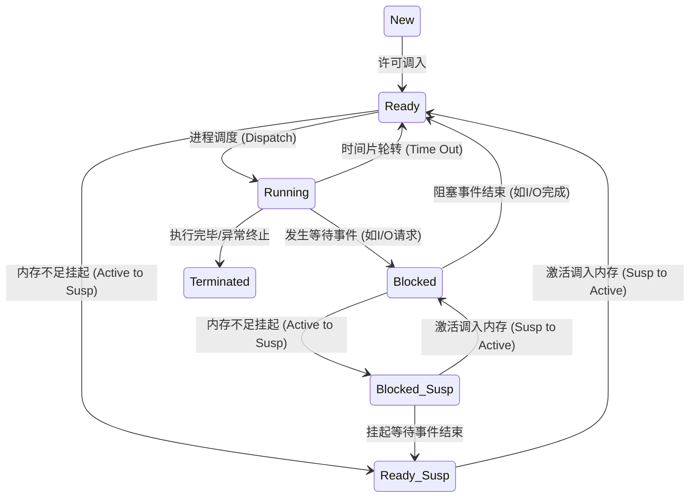
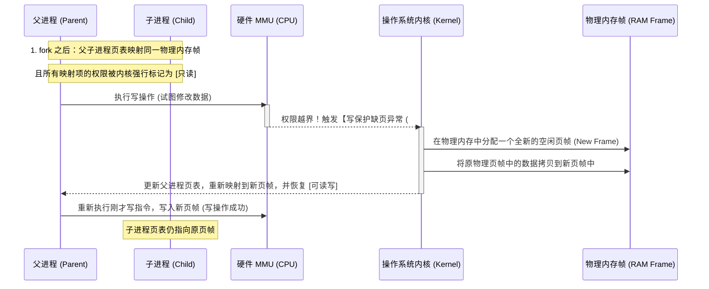

# 1.1.1.4 进程管理

进程是现代操作系统的灵魂。在多任务操作系统中，进程是资源分配的基本单位与资源保护的隔离屏障。如何精细地控制进程的创建、状态流转、生命周期终结以及高效安全的进程间通信，是操作系统的核心任务。本章将从进程的生命周期模型出发，结合操作系统内核实现（如 Linux 进程控制块），深度解析进程状态流转、写时复制（COW）的物理原理、僵尸与孤儿进程的生命周期收尾，以及进程间通信（IPC）的底层运行机制。

---

## 一、进程状态流转模型

在进程的生命周期中，随着处理机、内存及外部设备等资源的动态变化，进程的状态会在多个物理区间之间频繁流转。根据操作系统对系统物理资源的调度精细度，进程状态模型主要有三态、五态和七态模型。

### 1.1 三态模型与五态模型
* **三态模型**：最基础的模型，包含**运行态（Running）**、**就绪态（Ready）**和**阻塞态（Blocked/Waiting）**。
* **五态模型**：为了更精确地管理进程装载和销毁的过程，在三态模型的基础上引入了**创建态（Created/New）**和**终止态（Terminated/Exit）**。

### 1.2 七态挂起（Suspend）模型
在内存资源极其紧张的物理约束下，操作系统需要腾出物理内存给更紧急的进程，此时必须引入“挂起”机制。挂起状态是指将进程的代码、数据以及运行栈等从物理内存置换（Swap Out）到外存（如磁盘的对换区 Swap Area）中。由此，五态模型扩展为七态模型。



#### 七态模型的关键流转逻辑
1. **就绪挂起（Ready-Suspended）**：进程已具备运行条件，但其物理内存数据已被换出到外存对换区。一旦物理内存空闲，或者该进程优先级极高，系统会将其激活（Swap In），重新映射入物理内存，恢复为**就绪态**。
2. **阻塞挂起（Blocked-Suspended）**：进程既在等待某事件发生，其物理内存数据又被换出到了外存。
   * *转换分支*：当阻塞挂起进程等待的外部事件（如磁盘读写完成）发生时，即使其数据依然在外存中，状态也会转换为**就绪挂起态**。
3. **挂起（Suspend）的动因**：
   * **系统内存紧张**：为了装入更大或更高优先级的就绪进程，系统需要挪出空间。
   * **进程自身进入休眠**：长期不活跃的后台进程被系统决策换出，提高内存的有效吞吐。

---

## 二、进程控制块 (PCB) 内部结构深度剖析

操作系统在内核态管理成百上千个并发进程，唯一的物理依据是**进程控制块（PCB, Process Control Block）**。PCB 是进程存在的唯一标志，它记录了进程当前所有的运行状态与系统资源占有情况。在 Linux 内核中，PCB 对应 `struct task_struct` 这一庞大的结构体。

### 2.1 进程标识与权限 (Identifiers & Credentials)
PCB 内部首先保存了该进程的基本身份特征：
* **PID (Process ID)**：系统全局唯一的正整数，标识当前进程。
* **TGID (Thread Group ID)**：线程组 ID。在 Linux 中，多线程在内核中也是由独立的 `task_struct` 表示（轻量级进程），该线程组内的所有线程，其 TGID 都等于主线程的 PID。普通用户态调用 `getpid()` 实际上返回的是 TGID。
* **UID & GID (User ID & Group ID)**：标识创建并运行该进程的用户及用户组，决定了进程对文件系统及硬件的读写权限。

### 2.2 进程状态与调度信息 (State & Scheduling)
* **state**：内核级进程状态字。
  * `TASK_RUNNING`（可运行/正在运行态）。
  * `TASK_INTERRUPTIBLE`（可中断休眠态，可被信号唤醒）。
  * `TASK_UNINTERRUPTIBLE`（不可中断休眠态，通常在等待硬件 I/O，不响应任何信号，防止驱动进入未定义状态）。
  * `EXIT_ZOMBIE`（僵尸状态）。
* **prio & static_prio**：进程优先级。动态优先级由调度器实时计算，静态优先级由用户设定（Nice值）。
* **policy**：调度策略（如时间片轮转 `SCHED_RR`，先来先服务 `SCHED_FIFO`，完全公平调度 `SCHED_NORMAL`）。

### 2.3 内存描述信息 (Memory Descriptor)
PCB 中包含指向内存管理描述符的指针：
* **`struct mm_struct *mm`**：指向进程虚拟内存管理结构体的指针。它记录了：
  * **pgd**：进程一级全局页表的物理基地址。在进程切换时，内核将该值写入 CPU 的页表控制寄存器（如 CR3）。
  * **VMA 链表/红黑树 (`vm_area_struct`)**：记录进程当前已经分配的各个虚拟内存区间（如代码段、堆段、栈段、共享映射区映射范围）。

### 2.4 文件系统与描述符表 (File System & Files)
* **`struct files_struct *files`**：指向该进程打开的文件描述符表的指针。
  * 核心是一个描述符数组（`fd_array`），数组的索引即为用户态的 **文件描述符（FD, File Descriptor）**。每个数组元素指向一个全局的 `struct file` 文件对象，记录当前读写偏移量、打开标志等。
* **`struct fs_struct *fs`**：指向进程当前工作目录及根目录信息的指针。

### 2.5 信号处理信息 (Signals)
* **`pending`**：挂起信号队列，存储了已发送给该进程但尚未被处理的异步信号。
* **`sighand`**：指向信号处理程序表。记录了每个信号对应的自定义处理函数指针（Signal Handler）或系统默认处理动作。

---

## 三、进程创建：Fork 机制与写时复制 (COW)

在类 Unix 系统中，新进程的创建几乎都是通过 `fork()` 系统调用或其底层的 `clone()` 实现的。`fork()` 机制具有独特的“一次调用，两次返回”特征，并与虚拟内存管理精妙配合。

### 3.1 Fork 的执行时序与返回值
当进程调用 `fork()` 时，内核会复制父进程的绝大部分 PCB 状态来创建子进程。
* **双重返回机制**：
  * 在父进程中，`fork()` 返回新创建子进程的 PID。父进程可以通过该 PID 对子进程实施监控或销毁。
  * 在子进程中，`fork()` 返回 `0`。子进程借此得知自己是子进程，通常会随后调用 `execve()` 加载新的可执行文件。
  * 若创建失败，则在父进程中返回 `-1`。

### 3.2 写时复制 (COW, Copy-On-Write) 的物理原理
如果每次调用 `fork()`，系统都需要在物理内存中完整复制一份父进程的代码段、数据段、堆和栈，这将带来巨大的内存开销和漫长的拷贝耗时。尤其是在高频创建进程的场景下，子进程往往一出生就立刻调用 `execve()` 覆盖自己的地址空间，先前的内存复制就会变成彻底的无用功。

为了解决这一物理痛点，现代操作系统引入了**写时复制（COW）**技术。



#### COW 底层实现步骤解析
1. **页表复制与权限收紧**：
   当 `fork()` 发生时，内核仅复制父进程的页表结构体给子进程。子进程的页表项指向的物理页帧与父进程完全相同。同时，内核将父子进程所有页表项中的**读写标志（R/W Bit）全部修改为“只读”（Read-Only）**。
2. **触发写保护异常 (Page Fault)**：
   假设父进程试图修改变量 `x` 的值。CPU 译码器执行写指令时，MMU 硬件检测到目标虚拟地址对应的页表项 $R/W = 0$（只读）。MMU 立即终止该指令，抛出**写保护缺页异常**。
3. **内核介入与物理复制**：
   操作系统内核捕获到异常，检查发现该物理页的引用计数大于 1，确认这是一个 COW 共享页。内核从空闲物理帧队列中申请一个全新的物理页帧，并将原物理页帧中的数据完整复制（4KB 拷贝）到新页帧中。
4. **映射修正与权限放开**：
   内核修改触发异常进程的页表，将对应的虚拟页重新映射到这个新分配的物理页帧上，并将该页表项的权限修改为**可读写（R/W = 1）**。
5. **指令重执行**：
   内核返回用户态，指示 CPU 重新执行刚刚被中断的那条写指令。此时地址映射已经分流，写操作在各自独立的物理页上完成，父子进程实现了事实上的物理内存分裂。

---

## 四、进程生命周期终结与僵尸/孤儿进程

任何进程都有其终点。当进程执行完其核心逻辑，或者遭遇不可抗力时，其生命周期将终结。但进程的销毁是一个多阶段的系统清理过程。

### 4.1 进程销毁的系统级时序
1. **发起终止**：进程执行完 main 函数的最后一条指令，或者显式调用 `exit()` 系统调用；或者收到致命信号（如 `SIGKILL`, `SIGSEGV`）。
2. **资源初步回收**：内核将该进程的状态修改为 `EXIT_ZOMBIE`（僵尸状态）。内核释放该进程占有的物理内存（页表、堆、栈）、关闭所有打开的文件描述符、释放占用的系统信号量等。
3. **保留尸体 (PCB)**：虽然绝大部分资源已被回收，但进程的 **PCB（进程控制块）依然保留在内核的进程表项中**。里面存储了该进程的 PID、退出状态码（Exit Code）以及运行时间统计信息。
4. **父进程读取回收**：父进程调用 `wait()` 或 `waitpid()` 系统调用。内核收到请求后，将僵尸子进程的退出状态码传递给父进程，并彻底删除并注销子进程的 PCB，释放其 PID。子进程这才宣告在物理世界中彻底消亡。

### 4.2 僵尸进程（Zombie Process）的成因与治理
* **成因**：
  子进程已经终止，但其父进程**没有调用 `wait()` 或 `waitpid()`** 来读取它的退出状态。此时，该子进程的 PCB 将永久驻留在内核内存中，成为“僵尸”。
* **物理危害**：
  由于操作系统内核的进程表容量是有限的（PID 的数量有物理上限），如果程序中存在设计漏洞，导致大量僵尸进程堆积，就会**耗尽系统可用的 PID 资源**。此时，即使系统有充足的内存和 CPU，也无法再创建任何新进程，系统将处于不可用状态。
* **治理手段**：
  * **主动 wait 机制**：父进程在创建子进程时，注册 `SIGCHLD` 信号处理函数，在子进程退出时触发信号，异步调用 `wait` 进行回收。
  * **双 Fork 托管技术**：
    父进程先 `fork()` 出子进程 A，子进程 A 立即又 `fork()` 出孙子进程 B。随后子进程 A 立即主动退出，并由父进程回收。此时，孙子进程 B 变成了一个**孤儿进程**（其直接父进程 A 已退）。系统会将 B 自动托管给 `init` 进程，而 `init` 进程拥有自动、高频回收所有僵尸子进程的能力。

### 4.3 孤儿进程（Orphan Process）的收养机制
* **成因**：
  父进程在子进程尚未执行完毕之前，由于正常退出或异常崩溃而先一步消亡。此时，子进程仍在运行，它失去了“生父”。
* **收养机制**：
  操作系统为了保证系统中的每一个进程都有父进程可依（形成一棵完整的进程树），规定：当某个进程的父进程消亡时，操作系统内核会自动将该孤儿进程的父进程重定向为系统的 **`init` 进程（PID = 1，现代 Linux 系统中通常为 `systemd`）**。
* **物理运行**：
  `init` 进程是一个系统守护进程，它会周期性地、或在收到子进程信号时，循环调用 `wait()` 来回收其名下所有的孤儿进程。因此，孤儿进程在运行完毕后，**绝不会变成无人收尸的僵尸进程**。

---

## 五、进程间通信 (IPC) 的底层物理机制

由于虚拟内存隔离，进程间无法直接通过内存指针交换数据。操作系统提供了多种 IPC 机制，每种机制在内存拷贝次数和同步机制上有着截然不同的物理实现。

### 5.1 管道（Pipe）与 FIFO
* **物理本质**：
  管道是内核在物理内存中分配的一个**环形缓冲区（Ring Buffer）**，大小通常为 64KB。它被抽象为文件系统中的两个文件描述符：读端（read）和写端（write）。
* **同步机制**：
  管道自带锁与等待队列。当缓冲区写满时，写进程进入挂起队列，等待读进程消费；当缓冲区为空时，读进程阻塞挂起，等待写进程写入。
* **数据拷贝次数**：
  需要 **2次 CPU 拷贝**。数据先从写进程的用户栈拷贝到内核管道缓冲区，再从内核缓冲区拷贝到读进程的用户栈。

### 5.2 消息队列（Message Queue）
* **物理本质**：
  内核管理的一个消息链表，存储在系统内核空间。每个消息是一个格式化的结构体。
* **优势**：
  相比管道的无结构字节流，消息队列支持有格式的消息发送，且支持选择性接收（根据消息类型过滤）。
* **数据拷贝次数**：
  同样需要 **2次 CPU 拷贝**（用户栈 $\to$ 内核链表 $\to$ 用户栈）。

### 5.3 共享内存（Shared Memory）
* **物理本质**：
  这是**物理速度最快**的 IPC 机制。

```
进程 A 虚拟地址空间                     进程 B 虚拟地址空间
┌─────────────────┐                     ┌─────────────────┐
│ 用户空间         │                     │ 用户空间         │
│  页表映射 ───┐   │                     │   ┌─── 页表映射  │
└──────────────┼──┘                     └───┼──────────────┘
               │                            │
               ▼                            ▼
        ┌──────────────────────────────────────────┐
        │   共享物理内存帧 (Shared RAM Frame)      │
        │   (多进程的页表直接指向同一块物理内存)   │
        └──────────────────────────────────────────┘
```

* **实现原理**：
  操作系统从物理内存中划拨出一块空闲物理内存帧。随后，进程 A 和进程 B 分别修改自己的页表，将各自虚拟地址空间中的一段虚拟区间（VMA）映射到这块相同的物理页帧上。
* **拷贝次数**：
  **0次 CPU 数据拷贝**。进程 A 写入这块虚拟地址空间，物理内存数据立刻改变；进程 B 瞬间可以通过自己的虚拟地址读取到最新的物理数据，不需要任何内核态中介拷贝。
* **代价**：
  由于内核完全不参与数据读写的拦截，进程间必须自己使用信号量（Semaphore）或互斥锁来处理并发读写冲突，否则会出现严重的数据竞争混乱。

### 5.4 信号（Signal）
* **物理本质**：
  唯一的硬件与内核级异步通知机制。
* **发送与捕获**：
  当一个进程向另一个进程发送信号（或硬件出错抛出信号）时，内核将该信号写入接收进程 PCB 的 `pending` 信号队列中。
* **执行时机**：
  当 CPU 执行由于硬件中断或系统调用结束，准备从**内核态转换回用户态的前夕**，内核会检查当前进程的 `pending` 队列。若存在未处理信号，内核强行修改 CPU 的指令指针寄存器（RIP），使用户态控制流跳转到信号处理函数（Signal Handler）执行，执行完后再通过特殊调用返回原本的断点处。
