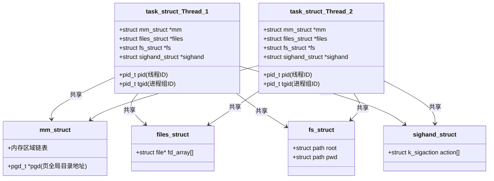
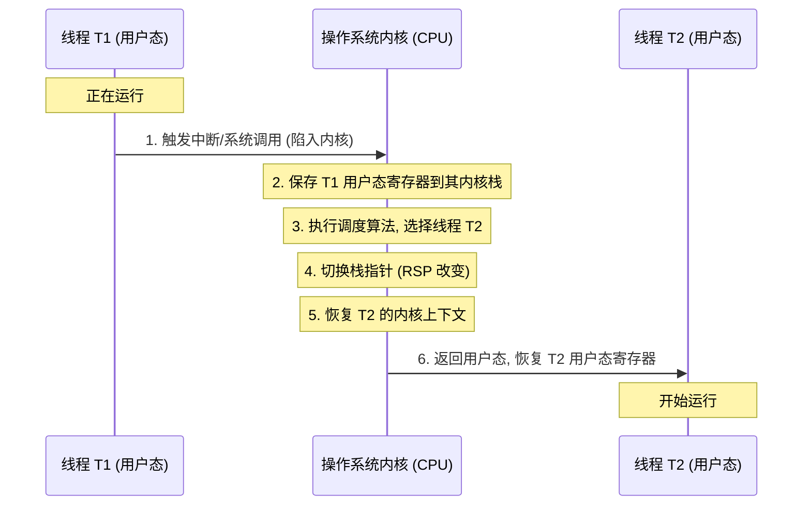
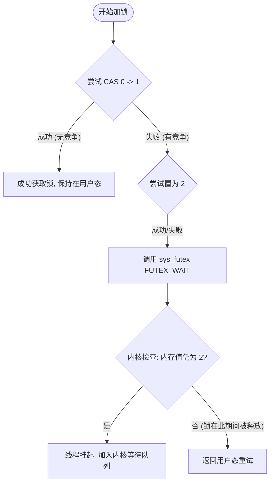
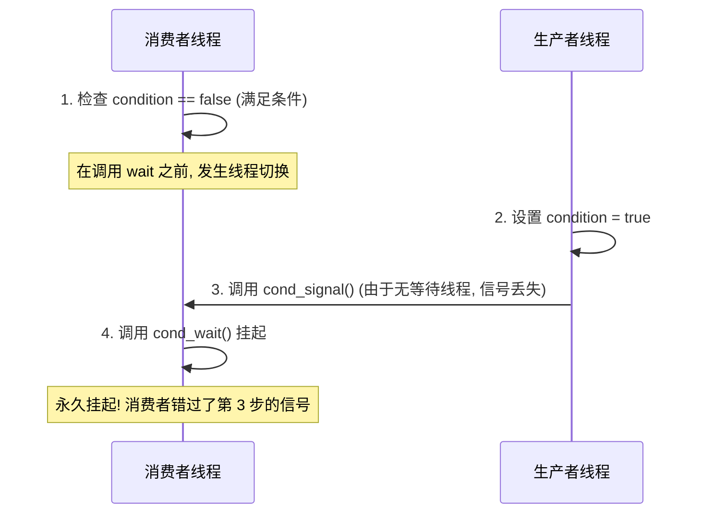
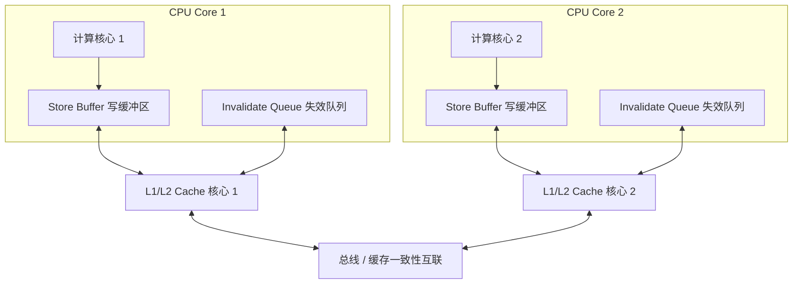
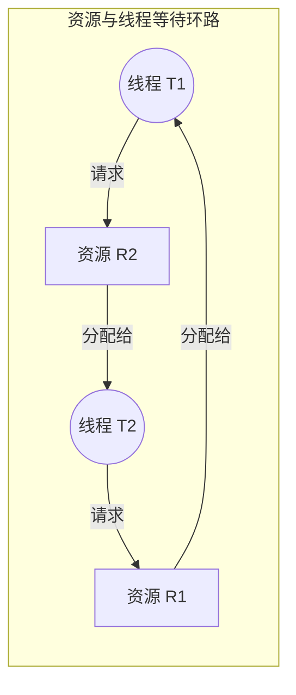

# 1.1.1.5 线程管理

线程作为现代多任务操作系统中独立调度和分派的基本单位，是构建高并发、高性能软件系统的基石。深入理解线程的底层实现模型、切换成本、同步机制与无锁并发原理，是掌握计算机系统设计的关键。本文将从操作系统内核设计、计算机组成原理以及处理器硬件特性的通用视角，对线程管理进行全方位的深度剖析。

---

## 一、 线程底层实现模型

线程的实现模型决定了线程在用户空间与内核空间之间的映射关系，直接影响到多线程程序的并发度、执行效率以及编程复杂度。根据线程管理机构所处的位置，主要分为三种经典的实现模型：用户级线程 (ULT)、内核级线程 (KLT) 以及混合模型 (M:N)。

### 1.1 用户级线程模型 (User-Level Thread, ULT)
用户级线程是指完全建立在用户空间的线程库之上，由用户程序创建、销毁、同步和调度的线程。在这种模型下，操作系统内核对用户级线程的存在一无所知，内核只以进程为单位进行资源分配 and CPU 调度。

```mermaid
graph TD
    subgraph 用户空间 (User Space)
        ThreadLibrary[线程库 / 运行时系统]
        ULT1[用户线程 1]
        ULT2[用户线程 2]
        ULT3[用户线程 3]
        ULT1 --> ThreadLibrary
        ULT2 --> ThreadLibrary
        ULT3 --> ThreadLibrary
    end
    subgraph 内核空间 (Kernel Space)
        KernelProcess[单内核进程 / 核心线程]
    end
    ThreadLibrary --> KernelProcess
```

#### 1.1.1 调度与运行机制
在 ULT 模型中，通常存在一个运行在用户态的**线程库/运行时系统 (Runtime System)**。该运行期系统维护着一个**用户态线程表 (User Thread Table)**，用于记录每个用户级线程的程序计数器 (PC)、寄存器上下文、执行状态（运行、就绪、阻塞）等元数据。
当需要进行线程切换时，由线程库的调度算法（如协作式调度、时间片轮转等）决定运行哪个就绪线程。整个调度和切换过程完全在用户态完成，本质上是一次用户态函数的调用和寄存器上下文的指针跳转，不涉及 CPU 特权级别的转换。

#### 1.1.2 优缺点与边界条件
*   **优势**：
    1.  **极高的切换效率**：线程的保存、恢复以及调度算法的执行完全在用户态进行，不需要触发 `int 0x80` 或 `syscall` 等系统调用，无模式切换（Mode Switch）开销。
    2.  **调度策略可高度定制**：用户程序可以根据应用场景（如 I/O 密集型或计算密集型）编写最适合的调度算法，而不受操作系统内核调度策略的限制。
    3.  **平台无关性**：只要目标平台上存在对应的用户态线程库，即使底层的操作系统不支持多线程，程序也能够实现逻辑上的多线程并发。
*   **劣势**：
    1.  **单点阻塞导致整体挂起（核心缺陷）**：由于内核只感知进程，当某一个用户级线程发起阻塞型系统调用（如同步磁盘 I/O 或网络读取）时，操作系统会将整个进程置于阻塞状态。这导致进程内的其他所有用户级线程都无法继续运行，即使它们处于就绪状态。
    2.  **无法利用多核 CPU 平行加速**：由于内核只调度单个进程到单颗处理器核心上，无论用户空间创建了多少个 ULT，它们在物理上都只能在同一个 CPU 核心上串行交替运行，无法享受到对称多处理 (SMP) 架构带来的物理并行优势。

---

### 1.2 内核级线程模型 (Kernel-Level Thread, KLT)
内核级线程（也被称为 1:1 线程模型）是指线程的创建、销毁、调度和同步完全由操作系统内核直接支持 and 管理。在用户空间，程序通过操作系统提供的系统调用接口（如 POSIX 线程库 `pthread` 的底层内核映射）来操作线程，每一个用户线程在内核中都对应着一个独立的内核调度实体。

```mermaid
graph TD
    subgraph 用户空间 (User Space)
        UT1[用户线程 1]
        UT2[用户线程 2]
        UT3[用户线程 3]
    end
    subgraph 内核空间 (Kernel Space)
        KSE1[内核调度实体 1]
        KSE2[内核调度实体 2]
        KSE3[内核调度实体 3]
    end
    UT1 --- KSE1
    UT2 --- KSE2
    UT3 --- KSE3
```

#### 1.2.1 Linux 中的轻量级进程 (LWP) 与 `clone()` 实现
在现代 Linux 操作系统中，内核并没有为“线程”设计专门的、完全独立的数据结构。在内核眼中，无论是进程还是线程，都统一使用**进程控制块 (Process Control Block, PCB)**——即 `struct task_struct` 来表示。Linux 下的线程被称为**轻量级进程 (Lightweight Process, LWP)**。

在创建线程时，POSIX 线程库（如基于 Linux 的 NPTL - Native POSIX Thread Library）在底层调用系统调用 `clone()`。`clone()` 允许创建者精细控制新创建的执行实体与父实体之间共享资源的程度。其核心参数标志 (Flags) 决定了线程模型的本质：

```c
int clone(int (*fn)(void *), void *child_stack, int flags, void *arg, ...);
```

-   **`CLONE_VM`**：子实体与父实体共享相同的虚拟内存地址空间。即它们的 `task_struct` 中的 `mm` 指针指向同一个 `struct mm_struct`，无需为新实体复制页表。
-   **`CLONE_FS`**：共享文件系统信息。子实体和父实体共享相同的根目录和当前工作目录。
-   **`CLONE_FILES`**：共享打开的文件描述符表（`struct files_struct`）。一个线程打开或关闭文件，另一个线程立刻感知。
-   **`CLONE_SIGHAND`**：共享信号处理函数表。任何一个线程对某类信号处理方式的更改都会影响其他线程。

以下是内核中 `task_struct` 在多线程环境下的共享关系示意图：



通过共享这些关键资源，新创建的实体就具备了“线程”的全部特征：共享全局数据、共享文件描述符，但拥有独立的执行序列和栈（由 `child_stack` 指定）。而在内核调度器（如 CFS - Completely Fair Scheduler）进行调度时，由于它们都有独立的 `task_struct` 和 `sched_entity`，内核可以把它们均匀地分配到不同的 CPU 核心上运行。

#### 1.2.2 优缺点与边界条件
*   **优势**：
    1.  **真正的多核并行**：内核可以同时将同一个进程内的多个线程分派到多颗 CPU 核心上，实现真正的物理并行计算。
    2.  **避免进程级单点阻塞**：如果一个 KLT 因为 I/O 系统调用而阻塞，内核调度器只会将这一个线程挂起，并能无缝切换到同一个进程下的其他 KLT 继续执行。
*   **劣势**：
    1.  **管理开销大**：线程的创建、销毁、同步都需要通过陷入内核来实现，导致系统调用频繁。
    2.  **上下文切换成本高**：每次线程切换都必须经历从用户态到内核态的特权级转换，并伴随内核栈和寄存器的保存与恢复（详见第二节）。

---

### 1.3 混合模型 (Hybrid Model, M:N)
混合模型旨在结合用户级线程的低成本切换优势与内核级线程的物理并行特性。在这种模型下，用户空间创建了 $M$ 个用户线程（通常称为协程或轻量级线程），这些用户线程被复用到内核空间的 $N$ 个内核线程（KLT）上运行，其中 $M \ge N$。

```mermaid
graph TD
    subgraph 用户空间 (User Space)
        UT1[用户级线程 1]
        UT2[用户级线程 2]
        UT3[用户级线程 3]
        UT4[用户级线程 4]
        UT1 & UT2 & UT3 & UT4 --> Scheduler[用户态复用调度器]
    end
    subgraph 内核空间 (Kernel Space)
        KLT1[内核级线程 1]
        KLT2[内核级线程 2]
        Scheduler -. 调度映射 .-> KLT1 & KLT2
    end
```

#### 1.3.1 调度与协同机制
混合模型的核心在于实现**两层调度器**的协同运作：
1.  **内核调度器**：负责将内核级线程（KLT）分派给物理 CPU。
2.  **用户态调度器**：运行在 KLT 之上，负责将大量用户级线程分派给已有的 KLT。

以现代并发模型（如 Go 语言的 GMP 模型）为例，其逻辑框架如下：
-   **G (Goroutine)**：用户级轻量线程，包含独立的栈、程序计数器 (PC) 和执行状态。
-   **M (Machine)**：内核级线程（KLT），真正执行代码的物理实体。
-   **P (Processor)**：逻辑处理器，代表执行 G 所需的上下文和局部调度队列。

为了防止一个用户线程由于同步阻塞（如同步系统调用）导致其所在的物理线程 M 阻塞，进而使绑定在 M 上的其他 G 也无法运行，混合模型通常采用**调度器激活 (Scheduler Activations)** 机制。当内核检测到某个 M 阻塞时，内核会通过一个**上行调用 (Upcall)** 通知用户态调度器。用户态调度器会迅速启动一个新的 M（或从空闲池中唤醒一个 M），并将受阻塞 M 上未完成的用户级线程队列转移到新的 M 上继续执行。

#### 1.3.2 优缺点与复杂性
*   **优势**：
    1.  **极高并发能力**：用户可以创建数十万个轻量级执行体，而无需担心耗尽内核线程资源。
    2.  **极低的轻量级切换成本**：在大多数非阻塞或非系统调用的场景下，用户级线程的切换不需要进入内核。
    3.  **多核并行与防阻塞**：在机制完善的运行时支持下，能自动将轻量级线程分派到多核上，且不会因单点系统调用而导致整体挂起。
*   **劣势**：
    1.  **极其复杂的运行时设计**：必须妥善解决用户态调度与内核调度之间的双向通信（如内核抢占机制与上行调用）。
    2.  **线程漂移与优先级反转**：用户线程在运行过程中可能会被调度到不同的 KLT 上执行，这导致 CPU 局部缓存失效（Thread Migration）。此外，如果用户级调度器没有妥善考虑优先级，可能会导致低优先级的用户线程占用了被高优先级 KLT 调度的物理线程，引起严重的优先级反转。

---

## 二、 线程切换过程与成本

为了深刻理解多线程系统的并发性能瓶颈，我们必须从计算机体系结构的底层硬件开销入手，量化分析线程切换与进程切换的物理成本差异。

### 2.1 进程切换 vs 线程切换：硬件状态对比
进程切换和线程切换在 CPU 硬件层面的关键区别在于**是否需要切换虚拟内存地址空间（即页表）**。

| 评估维度 | 进程切换 (Process Context Switch) | 同一进程内的线程切换 (Thread Context Switch) |
| :--- | :--- | :--- |
| **页表寄存器切换** | **必须切换**（x86 架构写入 `CR3` 寄存器；ARM 写入 `TTBR0/TTBR1`） | **无需切换**（共享相同的 `mm_struct`） |
| **TLB 刷新行为** | **全部/大部分清空**（除非使用 ASID 等硬件技术优化，但仍有巨大冲突开销） | **保持有效**（地址翻译缓存完全保留） |
| **CPU 缓存 (L1-L3 Cache)** | **大幅失效**（数据局部性完全改变，导致大量主存回访） | **基本保持**（共享大部分代码段与数据段，缓存命中率高） |
| **模式切换开销** | 必须通过内核模式进行 | 必须通过内核模式进行（KLT 模型下） |

#### 2.1.1 虚拟内存切换与 TLB 失效的深层原理
当进行进程切换时，操作系统必须更新 CPU 内的页表基地址寄存器，以便新进程的虚拟地址能够被正确翻译为它的物理地址。在 x86 处理器上，这意味着将新进程的页目录物理基地址载入到控制寄存器 `CR3` 中。
这一寄存器的更改会引发以下连锁反应：

1.  **TLB (Translation Lookaside Buffer) 硬件清空**：由于 TLB 缓存了虚拟地址到物理地址的映射，一旦页表基地址被更改，旧进程缓存在 TLB 中的所有虚拟-物理映射关系都变成了无效数据。为了防止地址空间混淆，处理器硬件在 `CR3` 写入时会自动清空 TLB。
2.  **TLB 抖动与流水线停顿**：当新进程开始执行时，CPU 试图访问其代码和数据。然而，由于 TLB 已被清空，每一次内存访问（如取指、读取操作数）都会发生 TLB Miss。CPU 的内存管理单元 (MMU) 必须启动慢速的**页表步进查询 (Page Table Walk)**，这在 64 位系统下通常需要访问 4-5 次物理内存。在这段时期内，CPU 核心的大量执行流水线会因为等待数据而彻底停顿。

相比之下，同一进程内的线程切换由于共享完全一致的虚拟内存地址空间，页表基地址寄存器保持不变，TLB 缓存的映射关系完全保留。新线程可以直接命中原有的 TLB项，消除了数以百计的时钟周期内存等待延迟。

#### 2.1.2 缓存一致性与数据局部性（Cache Locality）的打破
CPU 的 L1、L2 和 L3 缓存是基于数据访问的**时间局部性**和**空间局部性**工作的。
-   **进程切换**：新进程运行的代码和访问的数据与之前的进程往往毫无关系，这会导致原有的 Cache Line 几乎全部被换出，造成严重的 Cache Cold Start，程序在切换初期需要频繁向物理内存进行慢速的 Read/Write Allocation。
-   **线程切换**：同一进程下的线程经常并发处理同一批全局数据、配置参数或共享内存缓冲区，因此，L1-L3 缓存中的数据和指令大概率能被新线程复用，极大地提高了处理器的指令吞吐率。

---

### 2.2 线程切换的底层物理开销与步骤
即使是无需切换页表的线程切换，其上下文切换（Context Switch）的物理开销依然不容小觑。在硬件和内核层面，其执行流程可分为以下几个步骤：



#### 2.2.1 寄存器上下文的保存与恢复 (Context Saving & Restoring)
当内核调度器决定切换当前正在运行的线程 $T_1$ 并调度新线程 $T_2$ 时，CPU 必须将所有寄存器的当前值保存到内存中（通常是 $T_1$ 的内核栈中），以防状态丢失。在 x86-64 体系下，这包括：
-   **通用寄存器**：`rax`, `rbx`, `rcx`, `rdx`, `rsi`, `rdi`, `rbp` 等。
-   **栈指针与程序计数器**：`rsp`（保存当前栈顶）与 `rip`（保存当前指令地址）。
-   **控制与状态寄存器**：`rflags`（保存算术标志和中断使能标志）。

#### 2.2.2 浮点与向量寄存器的延迟保存策略 (Lazy FPU State Save)
随着现代 CPU 引入了巨大的向量寄存器组（如 Intel SSE 128位、AVX-256位、AVX-512位，每个核心可能包含几十个 512 位的寄存器），在线程切换时无脑保存和恢复这些寄存器的开销会变得不可接受。为了优化这一性能瓶颈，操作系统常采用**惰性保存 (Lazy FPU State Save)** 机制：
1.  在切换线程时，内核根本不保存也不恢复 FPU/MMX/AVX 寄存器的内容。
2.  内核将控制寄存器（如 x86 中的 `CR0`）中的“任务已切换”标志位 (`TS`) 置为 1。
3.  当新线程 $T_2$ 运行且完全不使用浮点或向量运算时，切换直接跳过这一巨大的硬件开销。
4.  一旦 $T_2$ 执行了第一条浮点或 AVX 指令，CPU 硬件在译码阶段发现 `TS` 标志为 1，会自动触发一个**“设备不可用”硬件中断 (Device Not Available, #NM 异常)**。
5.  操作系统内核捕获该异常，在中断处理函数中将旧线程的 FPU 寄存器状态保存，并将新线程 $T_2$ 的 FPU 状态载入，然后将 `TS` 标志清零，重新执行引发异常的指令。
这种方式将未采用浮点运算的线程的切换开销降到了最低。然而在现代很多图形处理、加密算法与音视频计算密集的场景中，几乎所有线程都涉及向量运算，因此内核往往会自动启用 **Eager FPU Save**，使用专门的 `XSAVE` 与 `XRSTOR` 指令以硬件硬件级的流水线形式完成快速存取。

#### 2.2.3 切换内核栈的汇编级实现
当寄存器状态在内核栈中保存妥当后，上下文切换的关键一步是**切换栈指针**。以下是 Linux 内核在 x86-64 下进行核心切换的简化伪汇编逻辑（模拟 `switch_to`）：

```assembly
# 伪汇编代码：由当前线程 prev 切换至 next 线程
# %rdi 传入 prev 线程 task_struct 的指针
# %rsi 传入 next 线程 task_struct 的指针

__switch_to_asm:
    # 1. 将 prev 线程被调用者保存寄存器压入自身的内核栈
    pushq   %rbp
    pushq   %rbx
    pushq   %r12
    pushq   %r13
    pushq   %r14
    pushq   %r15

    # 2. 将当前的栈指针 %rsp 保存到 prev->thread.sp 中
    # thread.sp 对应 task_struct 内存储内核栈顶偏移的字段
    movq    %rsp, (prev_thread_sp_offset)(%rdi)

    # 3. 将 next 线程之前保存的栈指针从 next->thread.sp 中载入到寄存器 %rsp
    # 这一步执行完，当前 CPU 的执行栈正式切换为 next 线程的栈！
    movq    (next_thread_sp_offset)(%rsi), %rsp

    # 4. 从新栈中恢复 next 线程之前压入的寄存器值
    popq    %r15
    popq    %r14
    popq    %r13
    popq    %r12
    popq    %rbx
    popq    %rbp

    # 5. 跳转回新线程被切换前保存的 rip 指令处继续执行
    jmp     __switch_to_kernel_return
```

#### 2.2.4 硬件微观性能惩罚
除了数据保存与指针跳转的软件动作，线程切换还会引发以下硬件微结构惩罚：
1.  **指令流水线清空 (Pipeline Flush)**：由于控制流突变，已经进入 CPU 流水线译码和执行阶段的旧线程指令必须被全部作废（Flush），CPU 必须从新线程的 `rip` 指向的地址重新取指。
2.  **分支预测器失效 (Branch Target Buffer, BTB Miss)**：CPU 内部的分支预测器（如 BTB）记录了历史跳转分支的规律。当线程改变，前者的跳转路径不再适用，会导致新线程在运行初期出现大量的分支预测失败，加剧流水线冒险。

---

## 三、 线程同步与底层锁实现原理

由于线程间共享同一进程的内存地址空间，多个线程同时对同一块内存区域进行非原子性的写操作或读写混合操作时，会产生数据不一致。为了保证并发的正确性，必须使用线程同步机制。

### 3.1 硬件级原子指令保障
软件层面的一切锁机制（自旋锁、互斥锁、读写锁），其底层无一例外都依赖于 CPU 提供的硬件级原子操作指令。

#### 3.1.1 多处理器环境下的缓存一致性与总线锁/缓存锁
在单核 CPU 上，原子性可以通过临时关闭中断来保证（防止时钟中断引发线程切换）。然而在多对称处理器 (SMP) 架构下，多颗核心并行执行，仅仅关闭单核的中断无法阻止其他核心并发访问相同的物理内存。
处理器提供了两种主要硬件技术来解决此问题：

1.  **总线锁定 (Bus Locking)**：当某个 CPU 核心执行一条带有 `LOCK` 前缀的汇编指令（如 `LOCK CMPXCHG`）时，该核心会在系统总线上拉低一条 `LOCK#` 信号线。此时，主存控制器会拒绝其他所有 CPU 核心对系统总线的请求，直到该原子指令执行完毕。总线锁的排他性是全局的，会显著降低整个系统的并发带宽。
2.  **缓存锁定 (Cache Locking)**：在现代处理器中，如果原子指令操作的内存地址已经被加载到了当前核心的 L1/L2 缓存中，且该缓存行（Cache Line）处于 MESI 协议的 **Modified (已修改)** 或 **Exclusive (独占)** 状态，CPU 就不需要锁定总线。相反，它会依靠 MESI 缓存一致性协议来保证操作的排他性。当其他核心尝试读取或写入同一缓存行时，它们必须等待当前核心执行完原子操作并将更新同步，或者等缓存行状态转换为 **Invalid (失效)**。缓存锁定将锁的粒度降低到了缓存行级别（通常为 64 字节），极大释放了多核性能。

#### 3.1.2 比较并交换 (Compare-and-Swap, CAS) 在 x86 中的实现
CAS 是无锁算法和轻量级自旋锁的基石。其硬件原语通常定义为：输入一个目标内存地址、预期的旧值和一个新值；如果内存地址中的当前值等于预期旧值，则将该地址更新为新值，并返回成功；否则拒绝更新，返回失败。

在 x86/x64 体系下，这一过程对应指令 `CMPXCHG`（Compare and Exchange）。在多核系统下，该指令前缀必须带有 `LOCK`：

```assembly
lock cmpxchg [destination], source
```

**ABA 问题及其硬件对策**：
CAS 最著名的问题是 ABA 问题：线程 1 读取内存值为 A，随后被挂起；线程 2 将该值改为 B，接着又改回了 A；当线程 1 恢复并执行 CAS 时，会误以为该值从未发生过变化。
为了防范这一缺陷，硬件级提供了**双字宽度 CAS (Double-Word CAS, DW-CAS)**，在 x86-64 上即 `CMPXCHG16B` 指令。该指令可以原子性地比较并交换 128 位的内存数据，使得程序可以将“数值”与“版本号/计数器”捆绑在一个结构体内进行 CAS，从而通过递增版本号彻底避免 ABA 竞态。

#### 3.1.3 链接加载/条件存储 (LL/SC) 原理
在精简指令集 (RISC) 架构（如 ARM、MIPS、PowerPC）中，由于设计理念强调指令集的简单性，通常没有像 x86 那样复杂的、能直接修改内存单元的 `CMPXCHG` 指令。RISC 采用**链接加载/条件存储 (Load-Link / Store-Conditional, LL/SC)** 这一更为优雅的机制：
-   **LL 指令（ARM 中为 `LDREX`）**：从目标内存地址中加载数据到寄存器，并在当前 CPU 核心的排他性监视器 (Exclusive Monitor) 中注册该内存地址的状态，标记其为“排他访问”。
-   **SC 指令（ARM 中为 `STREX`）**：尝试向刚才的内存地址写入一个新值。写入时，CPU 硬件会检查排他性监视器。如果自 LL 执行以来，没有任何其他核心对该内存地址进行过写入，SC 指令执行成功并返回 0；如果该地址已被其他核心污染，SC 指令会被硬件剥夺写入权，放弃更新并返回 1。

---

### 3.2 自旋锁机制 (Spinlock)
自旋锁是一种最基本的互斥锁，其核心特点是：当一个线程试图获取一个已被其他线程持有的锁时，该线程不会被挂起或让出 CPU，而是会在一个死循环中不断查询锁的标志位，直至锁被释放。

#### 3.2.1 自旋锁的基本代码与 CPU 耗能分析
以下是一个基于 CAS 编写的自旋锁加解锁逻辑：

```c
typedef struct {
    int locked;
} spinlock_t;

void spin_lock(spinlock_t *lock) {
    // 尝试将 locked 从 0 原子性地置为 1
    // 若返回 1，说明已被他人占用，进入循环忙等待
    while (__sync_val_compare_and_swap(&lock->locked, 0, 1) == 1) {
        #if defined(__x86_64__) || defined(_M_X64)
        __asm__ __volatile__("pause"); // 硬件级优化自旋
        #endif
    }
}

void spin_unlock(spinlock_t *lock) {
    // 释放锁，直接原子置 0 即可
    __sync_lock_release(&lock->locked);
}
```

#### 3.2.2 `PAUSE` 指令的物理作用
在没有优化的死循环自旋中，CPU 核心会以最快的速度疯狂执行比较和跳转指令。这会导致两个严重后果：
1.  **高功耗与发热**：核心全负荷运转，做无意义的空转。
2.  **流水线清空惩罚 (Pipeline Flush)**：当锁持有者释放锁并写入锁变量时，自旋 CPU 的流水线中早已推测执行（Speculative Execution）了大量的读取指令。这一写入动作会使流水线中的后续读取失效，迫使 CPU 必须清空整个执行管道（Pipeline Flush），带来巨大的时钟周期惩罚。

汇编指令 `PAUSE` 能够向 CPU 暗示当前处于自旋循环中。它的作用是：
-   短暂暂停 CPU 管道译码工作（通常为数十个时钟周期），极大降低自旋时的功耗。
-   在锁变量被修改时，避免触发因推测执行失效而导致的流水线清空惩罚，使 CPU 能在锁被释放时更快速地响应。

#### 3.2.3 局限性与单核灾难
自旋锁只适用于**多核处理器下，且锁的持有时间极短**的场景。在单核 CPU 上，如果内核不支持抢占，一个正在自旋的线程将永远霸占 CPU，而锁的持有者根本没有机会获得 CPU 去执行释放锁的代码，从而导致死锁。即便系统支持抢占，单核自旋也毫无意义，因为自旋期间唯一能释放锁的方法是发生时钟中断进行线程切换，这白白浪费了宝贵的 CPU 时间片。

---

### 3.3 互斥锁机制 (Mutex) 与内核 Futex 原理
互斥锁是一种“休眠锁”。当线程获取锁失败时，它不会盲目自旋，而是会主动将自己置于阻塞状态，让出 CPU，等待锁持有者在释放锁时将其唤醒。

#### 3.3.1 传统 Mutex 的系统调用瓶颈
在早期的类 Unix 操作系统中，互斥锁的每一次加锁和解锁都必须通过系统调用（如调用内核的信号量接口）陷入内核。即使在**完全没有锁竞争**的场景下，程序也必须进行两次特权级切换（用户态 -> 内核态 -> 用户态）。这种设计在多线程高并发下的开销异常巨大。

#### 3.3.2 Futex (Fast Userspace Mutex) 用户态/内核态混合锁设计
为了解决传统锁的系统调用瓶颈，Linux 在 2.6 版本引入了 **Futex (快速用户空间互斥体)** 机制。Futex 是一种用户态和内核态混合的同步原语。其核心思想是：**在没有锁竞争的情况下，完全在用户空间进行原子性操作；只有在出现竞争时，才陷入内核进行挂起或唤醒。**

在用户空间，Futex 锁的核心是一个 32 位的整型变量 `futex_val`。它的状态一般定义为：
-   `0`：无锁（Free）
-   `1`：已被持有，但没有其他线程在等待（Locked, no waiters）
-   `2`：已被持有，且有其他线程正在等待，必须进行内核唤醒（Locked, with waiters）

##### 3.3.2.1 竞争与无竞争的路径分水岭



1.  **无竞争加锁**：
    线程 $T_1$ 试图获取锁，执行 CAS 操作：如果 `futex_val` 当前为 `0`，则原子写入 `1`。操作成功，线程 $T_1$ 成功获取锁，整个过程不发生系统调用，开销近乎为 0。
2.  **有竞争加锁**：
    随后线程 $T_2$ 试图加锁，它执行 CAS 发现值不为 `0`（为 `1`），说明已被占用。此时，它会使用原子指令将 `futex_val` 强行设为 `2`（表示有等待者），并调用系统调用 `futex()`：
    ```c
    syscall(SYS_futex, &futex_val, FUTEX_WAIT, 2, NULL, NULL, 0);
    ```
    -   **FUTEX_WAIT 语义**：内核接收到该调用后，会首先读取用户空间的 `&futex_val` 的值，并与传入的第三个参数（此处为 `2`）进行比较。
    -   **双重校验防丢失信号 (Preventing Lost Wakeup)**：如果在 $T_2$ 陷入内核的短暂窗口期内，持有锁的 $T_1$ 已经把锁释放并将值设为了 `0`，内核会发现内存中的实际值（`0`）不等于预期值（`2`），调用会立刻返回失败（`EWOULDBLOCK`），避免了 $T_2$ 在锁已被释放的情况下盲目挂起。如果值确实为 `2`，内核便将 $T_2$ 挂起，放入该 Futex 对应的等待队列。
3.  **解锁流程**：
    当持有锁的 $T_1$ 准备释放锁时，它使用原子操作将锁值减 1。
    -   如果减 1 前的值为 `1`（无等待者），则直接变为 `0` 即可，无系统调用。
    -   如果减 1 前的值为 `2`（有等待者，或者减完后锁值不为 `0`），说明有等待线程在内核队列中。$T_1$ 会将锁值设为 `0`，然后调用系统调用通知内核：
    ```c
    syscall(SYS_futex, &futex_val, FUTEX_WAKE, 1, NULL, NULL, 0);
    ```
    -   **FUTEX_WAKE 语义**：内核被唤醒，从对应的内核等待队列中挑选一个线程（如 $T_2$）唤醒，使其重新变为可运行状态。

##### 3.3.2.2 内核中 Futex 队列的物理管理
在内核中，存在成千上万个用户态锁，内核不可能为每一个用户锁分配独立的队列。Linux 采用了一个巧妙的**全局哈希桶数组**来实现高效的队列管理：

```c
struct futex_hash_bucket {
    spinlock_t lock;             // 保护当前哈希桶的自旋锁
    struct plist_head chain;     // 当前桶内所有 futex_q 等待项的链表
};
static struct futex_hash_bucket futex_queues[FUTEX_CANVAS_SIZE];
```

-   **哈希 Key 的确定**：
    由于不同的线程可能使用相同的虚拟地址（例如共享内存中的多进程锁，或不同的进程），内核将**“虚拟地址对应的物理页地址 (Physical Page Address) + 页内偏移量 (Page Offset)”**作为哈希计算的 Key，从而保障了 Key 的全局唯一性和多进程可见性。
-   **等待节点 `struct futex_q`**：
    每个被挂起的线程都对应一个 `futex_q` 结构体，该结构体包含了当前线程的 `task_struct` 指针、对应的 Futex Key 以及等待优先级，它被插入到对应的 `futex_hash_bucket` 的链表中，直至被唤醒。

---

### 3.4 读写锁与条件变量

#### 3.4.1 读写锁 (Read-Write Lock) 的设计哲学与调度冲突
读写锁适用于“读多写少”的并发控制。其状态变量通常由一个**读者计数器 (Reader Count)** 和一个**写者锁定标志 (Writer Active Flag)** 组成。
-   **允许多个读者同时持有读锁。**
-   **写锁是排他的，同一时间只允许一个写者持有，且此时不允许任何读者进入。**

##### 读写锁的调度策略与写者饥饿问题
读写锁在设计上面临着严重的调度策略抉择：
1.  **读者优先 (Reader-Preferred)**：只要有读者持有锁，后续的新读者可以源源不断地进入。这会导致如果读操作极为频繁，写者会因为始终无法抢占锁而发生**写者饥饿 (Writer Starvation)**。
2.  **写者优先 (Writer-Preferred)**：一旦有写者在排队等待锁，后续到达的所有新读者都必须在队列中等待，直到写者完成。这虽然保护了写者，但若写者频繁到来，读者的并发性能会退化为彻底的串行化。

#### 3.4.2 条件变量 (Condition Variable) 与 Lost Wakeup 问题
条件变量用于线程间的同步通知：一个线程因某条件不满足而挂起，另一个线程在条件满足时唤醒它。

##### 为什么条件变量必须搭配互斥锁使用？
条件变量的使用模式总是如下：

```c
// 消费者线程
pthread_mutex_lock(&mutex);
while (condition == false) {
    pthread_cond_wait(&cond, &mutex);
}
// 执行后续操作
pthread_mutex_unlock(&mutex);

// 生产者线程
pthread_mutex_lock(&mutex);
condition = true;
pthread_cond_signal(&cond);
pthread_mutex_unlock(&mutex);
```

这里 `pthread_cond_wait` 的核心操作是：**将当前线程加入条件变量等待队列，并释放 `mutex` 锁，这两个动作在内核中必须是原子的。**
如果不需要互斥锁，单纯使用条件变量，就会产生 **Lost Wakeup (丢失信号) 竞态条件**：



有了互斥锁的保护，消费者检查条件和调用 `wait` 处于同一把锁的保护下。当消费者进入 `wait` 内部并将自己放入等待队列后，互斥锁才会被释放。这保证了生产者在修改条件并发送信号时，消费者必然已经在等待队列中了，从而彻底杜绝了信号丢失。

---

## 四、 线程安全与无锁并发编程基础

编写线程安全的程序，要求我们不仅要理解高层同步原语，更要清晰理解底层的指令重排以及 CPU 硬件的内存模型。

### 4.1 数据竞争与临界区
-   **数据竞争 (Data Race)**：在没有同步机制保护的前提下，两个或多个线程并发地访问同一个内存地址，且其中至少有一个访问是写入操作。
-   **临界区 (Critical Section)**：指访问共享资源的那部分代码区域。为了实现线程安全，我们必须确保临界区具有**互斥性 (Mutual Exclusion)**——即在任意时刻，只允许一个线程进入临界区执行。

---

### 4.2 指令重排与内存模型硬件原理
现代计算机为了追求极致的执行速度，抛弃了单纯的“按序执行”理念。这导致我们在高级语言中写下的代码顺序，在被 CPU 执行时可能会被彻底打乱。

#### 4.2.1 编译器重排 (Compiler Reordering)
编译器（如 GCC, Clang）在生成机器码时，会分析代码的控制流和数据流。为了让寄存器复用率最大化、减少内存加载延迟，编译器会在**不改变单线程语义**的前提下，调整汇编指令的生成顺序。

#### 4.2.2 CPU 乱序执行 (Out-of-Order Execution)
现代超标量（Superscalar）处理器拥有多个并行的执行单元（如 ALU、FPU、Load/Store Unit）。CPU 使用**重排序缓冲区 (Reorder Buffer, ROB)** 和**保留站 (Reservation Station)**：
1.  指令被顺序译码，但会被分配到各自执行单元的保留站中。
2.  只要指令所需的输入数据（操作数）准备就绪，执行单元就可以立即开始计算，而不用理会程序中它的先后顺序。
3.  计算结果被暂存到 ROB 中。
4.  ROB 强制将计算结果按原程序的顺序**顺序提交 (Commit)** 到 CPU 寄存器或缓存中，确保从单线程视角看，程序结果依然是正确的。

#### 4.2.3 内存系统重排：Store Buffer 与 Invalidate Queue
除了执行层面的乱序，更深层次且对多线程影响最大的是**物理内存系统的重排**。这是由 CPU 内的存储缓冲结构引起的。



由于写入 CPU 缓存（L1/L2）的速度仍然跟不上 CPU 的主频，CPU 在核心和 L1 缓存之间设计了 **Store Buffer (写缓冲区)**：
1.  当 Core 1 执行写指令（如 `x = 1`）时，为了不让 CPU 停顿等待缓存写入，Core 1 将 `x = 1` 写入其私有的 Store Buffer 中，然后直接去执行后续指令。
2.  Store Buffer 会在总线空闲时，以异步形式将数据刷入 L1 Cache。
3.  在此期间，如果 Core 1 执行读指令（如读取 `y`），而 `y` 的数据已经在缓存中，Core 1 会直接从缓存读取。
4.  从 Core 2 的视角来看，Core 2 已经读到了 `y` 的更新，但是由于 Core 1 的 `x = 1` 仍在 Store Buffer 中尚未刷入缓存，Core 2 此时读取 `x` 拿到的依然是旧值。
5.  这造成了物理上的 **Store-Load 重排（写读乱序）**。

为了加速 MESI 状态转换，硬件还引入了 **Invalidate Queue (失效队列)**：当 Core 1 向其他核心发送缓存行失效消息时，其他核心为了不让总线停顿，会先将失效消息丢入 Invalidate Queue 并立刻发送确认，随后再慢慢从 Cache Line 中标记失效。在此期间，其他核心读取对应的内存，依旧会读到过期的缓存行数据，从而导致了 **Load-Load 乱序**。

#### 4.2.4 强内存模型 vs 弱内存模型
不同架构的 CPU 在硬件设计上做出了不同的折中，从而形成了不同的**内存模型 (Memory Model)**：
-   **强内存模型（以 x86-64 / TSO模型 为代表）**：
    硬件保证了极强的顺序要求。它**不允许** Load-Load、Load-Store、Store-Store 重排。在 x86 上，**唯一允许的重排是 Store-Load（即写读重排）**。因此在 x86 下，无锁代码的硬件兼容性通常较好。
-   **弱内存模型（以 ARM, POWER, Alpha 为代表）**：
    为了追求极致的硬件性能和芯片能效，几乎**允许一切形式 of 重排**（Load-Load, Load-Store, Store-Store, Store-Load）。在 ARM 架构下，任何多线程共享的数据交互如果缺少明确的同步指令，都会因为硬件重排而导致意想不到的数据崩溃。

---

### 4.3 内存屏障 (Memory Barrier/Fence)
内存屏障是 CPU 硬件提供给软件的强制手段，用于约束屏障前后的内存访问指令执行顺序。

#### 4.3.1 屏障指令在硬件层面的行为
在 x86 架构中，主要存在三种硬件内存屏障指令：

1.  **`LFENCE` (Load Fence, 读屏障)**：
    强制等待 Invalidate Queue 中的所有失效消息被全部应用到当前核心的 Cache Line 中。它保证了 `LFENCE` 之后的读取指令一定能看到最新的物理内存数据，实现 **Acquire 语义**。
2.  **`SFENCE` (Store Fence, 写屏障)**：
    强制将当前核心 Store Buffer 中的所有待写入数据立即刷入 L1/L2 缓存。它保证了 `SFENCE` 之前的写入指令的结果在 `SFENCE` 之后的写入指令被执行前，已经被其他 CPU 核心感知，实现 **Release 语义**。
3.  **`MFENCE` (Memory Fence, 全屏障)**：
    同时具备 `LFENCE` 和 `SFENCE` 的功能。它不仅清空 Store Buffer，还清空 Invalidate Queue。在硬件层面，`MFENCE` 会锁定处理器核心的指令执行流水线，直至所有的读写指令全部提交。

在 C++11 等现代语言中，我们使用的 `std::memory_order_acquire` 和 `std::memory_order_release` 在编译为 x86 汇编时，很多时候因为 x86 的强内存模型而无需生成显式的屏障汇编指令（因为硬件本身就不允许这些重排）；但在编译为 ARM 汇编时，则必须被翻译为 `DMB` (Data Memory Barrier) 或 `DSB` (Data Synchronization Barrier) 指令，以保证多核并发的安全。

---

### 4.4 无锁并发编程 (Lock-Free Programming)

#### 4.4.1 无锁与无等待的严密定义
无锁并发不等于不使用同步，而是指**在底层不使用会让线程挂起的锁机制，完全依赖原子指令和乐观重试来保障并发安全**。
-   **无锁 (Lock-Free)**：系统级的并发保证。保证无论线程调度如何，整个系统中**至少有一个线程**能够在有限的步骤内向前推进。这避免了死锁，但个别线程可能会因为竞态激烈而发生饥饿。
-   **无等待 (Wait-Free)**：比无锁更强的保证。要求**每一个线程**都必须在有限的步骤内完成其操作，不论其他线程如何交替执行。无等待队列的实现极其复杂。

#### 4.4.2 Michael-Scott 队列的原子操作设计
Michael-Scott 队列是计算机科学中最经典的无锁并发队列（被广泛应用于各种高性能运行时的底层实现）。它使用头指针 `head` 和尾指针 `tail` 进行管理。其难点在于：入队需要更新两个指针：一个是尾节点的 `next` 指针，一个是全局的 `tail` 指针。

其无锁入队 (Enqueue) 的核心算法伪代码如下：

```c
void enqueue(Queue *queue, Value val) {
    Node *node = new_node(val);
    while (1) {
        Node *tail = queue->tail;
        Node *next = tail->next;
        // 校验 tail 是否处于一致状态
        if (tail == queue->tail) {
            if (next == NULL) { // 尾节点的 next 确实为空，处于稳定状态
                // 步骤 1：尝试原子地将新节点挂载到 tail->next
                if (CAS(&tail->next, NULL, node)) {
                    // 步骤 2：挂载成功，尝试将全局 tail 指针向前推进到 node
                    // 如果在此期间其他线程已经帮忙推进了，此 CAS 失败也无妨
                    CAS(&queue->tail, tail, node);
                    return; // 成功退出
                }
            } else {
                // 此时 next 不为空，说明其他线程执行了步骤 1，但还没来得及执行步骤 2
                // 当前线程“协助”那个线程将全局 tail 推进到 next，以维持队列的活性
                CAS(&queue->tail, tail, next);
            }
        }
    }
}
```

---

### 4.5 无锁编程中的内存回收难题
在无锁链表或队列中，当线程 $T_1$ 执行出队操作并“删除”了一个节点 $N$ 时，它无法立刻执行 `free(N)` 释放内存。因为此时，另一个并发执行的线程 $T_2$ 可能已经读取了 $N$ 的指针，并正准备访问 $N->next$。如果 $T_1$ 此时强行释放 $N$，会导致 $T_2$ 访问非法内存而发生 Segmentation Fault 崩溃。
为了解决这一无锁并发中的头号难题，工业界提出了两种主要方案：

#### 4.5.1 Hazard Pointer (危害指针)
-   每个读线程都持有一个全局可见的**危害指针 (Hazard Pointer)**。
-   当线程准备读取某个节点时，它会先把该节点的指针存入自己的 Hazard Pointer 中。
-   写线程在“删除”节点时，不会立刻释放它，而是将其放入一个待回收的私有列表中。
-   写线程会周期性地检查这个列表：只有当某个被删除节点的指针不存在于任何活跃线程的 Hazard Pointer 中时，该节点才能被安全释放。
该方案控制粒度极细，但每个读操作都需要一次写入 Hazard Pointer 并附带内存屏障的开销。

#### 4.5.2 Epoch-Based Reclamation (EBR, 基于代的内存回收)
EBR 是一种更为高效、开销极小的内存分代回收机制：
1.  **全局 Epoch**：系统维护一个全局的代数计数器（通常在 0、1、2 之间循环递增）。
2.  **线程 Epoch**：每个活跃线程在进入无锁数据结构操作前，将自己标记为“进入”并拷贝当前的全局 Epoch；退出操作时标记为“退出”。
3.  **垃圾分代队列**：被线程删除的节点不会被 free，而是根据删除时全局的 Epoch 值，挂载到对应 Epoch 的垃圾回收链表中（如 `retire_list[Epoch]`）。
4.  **Epoch 递增与安全回收**：当全局 Epoch 准备递增时（如从 0 变 1），垃圾收集器会检查所有线程当前的活动代数。如果**所有线程都不再处于代数 0 中**，说明属于代数 0 时期的所有内存读取引用都已结束，内核就可以安全地一次性释放整个 `retire_list[0]` 中的所有垃圾节点。

---

## 五、 系统级死锁 (Deadlock)

当两个或多个线程在执行过程中，因争夺资源而造成的一种互相等待的僵局，若无外力作用，它们都将无法向前推进，这种现象称为死锁。



### 5.1 死锁的四个必要条件
死锁的发生必须同时满足以下四个必要条件。只要破坏其中任意一个条件，死锁便不会发生。

1.  **互斥条件 (Mutual Exclusion)**：
    资源是排他性分配的。即任意时刻，某资源 $R$ 只能被一个线程占用。若有其他线程请求该资源，请求者只能等待。
2.  **占有且等待条件 (Hold and Wait)**：
    线程已经保持了至少一个资源，但又提出了新的资源请求，而该资源目前已被其他线程占有。此时请求线程被阻塞，但对其已经获得的资源保持不放。
3.  **不可剥夺条件 (No Preemption)**：
    线程已获得的资源在未使用完毕之前，不能被操作系统或其他线程强行夺走，只能由占有该资源的线程在用完后主动释放。
4.  **循环等待条件 (Circular Wait)**：
    存在一个线程与资源的环形链 $\{T_0, T_1, ..., T_n\}$。其中 $T_0$ 正在等待被 $T_1$ 占有的资源，$T_1$ 正在等待被 $T_2$ 占有的资源，……，$T_n$ 正在等待被 $T_0$ 占有的资源。

---

### 5.2 死锁预防 (Deadlock Prevention)
死锁预防是在程序**设计阶段**，通过施加严格的限制条件，静态地破坏死锁的四个必要条件之一。

-   **破坏“占有且等待”**：
    1.  **一次性分配法**：要求线程在开始运行前，必须一次性申请其生命周期所需的全部资源。如果某些资源无法满足，则一个资源也不分配给它，线程挂起。这会导致资源利用率极其低下，并可能引发低优先级线程长期拿不到全部资源而“饥饿”。
    2.  **动态释放法**：线程在申请新资源之前，必须先释放自己当前占有的所有资源。
-   **破坏“不可剥夺”**：
    当一个已经占有某些资源的线程在申请新资源被拒绝而发生阻塞时，系统强行剥夺它已占有的所有资源，将其释放给其他排队的线程。这只适用于易于保存和恢复状态的资源（如 CPU 寄存器、内存页），对于锁、打印机或数据库连接等资源则不适用。
-   **破坏“循环等待”（资源线性排序法）**：
    这是工业界最实用的死锁预防策略。系统将所有类型的资源进行全局线性编号，赋予一个唯一的整数 ID（如 $R_1 \to 1, R_2 \to 2$）。规定：**所有线程必须严格按照资源 ID 递增的顺序申请资源。**
    **数学证明**：
    假设存在循环等待环路。线程 $T_0$ 占有 $R_i$ 并申请 $R_j$（这意味着 $i < j$）；线程 $T_1$ 占有 $R_j$ 并申请 $R_i$（这意味着 $j < i$）。推导出 $i < j < i$，这在数学上显然是不成立的矛盾。因此，严格按序申请资源在数学逻辑上彻底斩断了环路形成的可能性。

---

### 5.3 死锁避免 (Deadlock Avoidance) 与银行家算法
与死锁预防的静态限制不同，死锁避免是在**动态分配资源的过程中**，由操作系统动态评估当前的资源分配请求。如果分配后系统会进入“不安全状态”，则拒绝分配，以确保系统永远保持在**安全状态 (Safe State)**。

-   **安全状态**：如果系统能够按某种顺序（如 $<T_1, T_0, T_2>$）为每个线程分配其所需资源，直至所有线程都能顺利完成，则称该序列为**安全序列 (Safe Sequence)**，此时系统处于安全状态。安全状态绝不会发生死锁。
-   **不安全状态**：如果系统不存在任何一个安全序列，则系统进入不安全状态。**注意：不安全状态不等于死锁；但一旦进入不安全状态，系统就面临发生死锁的风险。**

#### 5.3.1 银行家算法 (Banker's Algorithm)
银行家算法是经典的死锁避免算法，适用于多类资源分配场景。

##### 算法数据结构
设有 $n$ 个线程，$m$ 类资源：
-   `Available[m]`：长为 $m$ 的向量。`Available[j] = k` 表示当前系统中 $R_j$ 类可用资源为 $k$ 个。
-   `Max[n][m]`：$n \times m$ 矩阵。`Max[i][j] = k` 表示线程 $T_i$ 对 $R_j$ 类资源的最大需求数为 $k$。
-   `Allocation[n][m]`：$n \times m$ 矩阵。`Allocation[i][j] = k` 表示线程 $T_i$ 当前已分配到 $R_j$ 类资源的数量为 $k$。
-   `Need[n][m]`：$n \times m$ 矩阵。`Need[i][j] = Max[i][j] - Allocation[i][j]`，表示线程 $T_i$ 还需要 $R_j$ 类资源的数量。

##### 安全性检查算法 (Safety Algorithm)
1.  设置两个辅助向量：`Work[m]`（初始等于 `Available`）和 `Finish[n]`（初始全为 `false`）。
2.  在线程集合中寻找一个满足以下条件的线程 $T_i$：
    -   `Finish[i] == false`
    -   `Need[i] <= Work`（即 $T_i$ 的剩余需求可以被当前可用资源满足）
    若找到，执行步骤 3；否则执行步骤 4。
3.  假设将资源分配给 $T_i$，使其运行完毕并释放所有占有的资源：
    -   `Work = Work + Allocation[i]`
    -   `Finish[i] = true`
    返回步骤 2 继续寻找下一个线程。
4.  如果所有线程的 `Finish` 最终都为 `true`，则系统处于安全状态，得到的线程排列顺序即为一个**安全序列**；否则，系统处于不安全状态。

#### 5.3.2 银行家算法的推导模拟演算
设系统中有 3 个线程（$T_0, T_1, T_2$）和 3 种资源类（$A, B, C$）。
各资源类的总实例数分别为：$A = 10, B = 5, C = 7$。

##### $t_0$ 时刻的初始分配状态：

| 线程 | Max (最大需求) | Allocation (已分配) | Need (剩余需求) | Available (系统可用) |
| :--- | :---: | :---: | :---: | :---: |
| **$T_0$** | [7, 5, 3] | [0, 1, 0] | [7, 4, 3] | **[5, 4, 5]** |
| **$T_1$** | [3, 2, 2] | [2, 0, 0] | [1, 2, 2] | |
| **$T_2$** | [9, 0, 2] | [3, 0, 2] | [6, 0, 0] | |

*(注：$Available = [10-(0+2+3), 5-(1+0+0), 7-(0+0+2)] = [5, 4, 5]$)*

##### 安全性算法执行推导步骤：

1.  **初始化**：
    `Work = [5, 4, 5]`，`Finish = [false, false, false]`。
2.  **第一轮检索**：
    -   检查 $T_0$：`Need[0] = [7, 4, 3]`。由于 $7 > 5$（A类不足），`Need[0] <= Work` 不成立。
    -   检查 $T_1$：`Need[1] = [1, 2, 2]`。因为 $[1, 2, 2] \le [5, 4, 5]$，条件满足！
        -   更新 `Work = Work + Allocation[1] = [5, 4, 5] + [2, 0, 0] = [7, 4, 5]`。
        -   设置 `Finish[1] = true`。
3.  **第二轮检索**：
    当前 `Work = [7, 4, 5]`。
    -   检查 $T_0$：`Need[0] = [7, 4, 3]`。因为 $[7, 4, 3] \le [7, 4, 5]$，条件满足！
        -   更新 `Work = Work + Allocation[0] = [7, 4, 5] + [0, 1, 0] = [7, 5, 5]`。
        -   设置 `Finish[0] = true`。
4.  **第三轮检索**：
    当前 `Work = [7, 5, 5]`。
    -   检查 $T_2$：`Need[2] = [6, 0, 0]`。因为 $[6, 0, 0] \le [7, 5, 5]$，条件满足！
        -   更新 `Work = Work + Allocation[2] = [7, 5, 5] + [3, 0, 2] = [10, 5, 7]`。
        -   设置 `Finish[2] = true`。
5.  **结论**：
    因为 `Finish = [true, true, true]`，系统处于安全状态。
    推导出的安全序列为：**$<T_1, T_0, T_2>$**。系统可以在动态申请中安全通过。

---

### 5.4 死锁检测与解除
如果系统没有采用死锁预防或避免措施，死锁就可能发生。此时，系统必须具备**检测死锁**并将其**解除**的能力。

#### 5.4.1 资源分配图 (Resource Allocation Graph, RAG) 与简化算法
死锁检测的核心数学工具是**资源分配图**。它是一个有向图 $G = (V, E)$：
-   **线程节点 (P)**：用圆圈表示，代表系统中的执行实体。
-   **资源节点 (R)**：用方框表示，框内的点数代表该类资源的实例个数。
-   **请求边 (Request Edge)**：从线程 $P_i$ 指向资源 $R_j$ 的有向边，代表线程正在等待该资源。
-   **分配边 (Assignment Edge)**：从资源 $R_j$ 指向线程 $P_i$ 的有向边，代表资源已被该线程持有。

##### 资源分配图的简化算法（死锁检测定理）
判定当前系统是否发生死锁，可以通过**简化资源分配图**来完成：

```c
// 资源分配图简化算法伪代码
bool detect_deadlock(Graph G) {
    while (存在一个非孤立且非阻塞的线程节点 P_i) {
        // 非阻塞指：P_i 指出的所有请求边 P_i -> R_j, 
        // 都可以被当前系统中的空闲资源（R_j 的总实例数减去已分配数）所满足。
        
        // 模拟 P_i 运行结束，释放其持有的所有资源：
        将与 P_i 相连的所有请求边和分配边从图 G 中消去;
    }
    
    if (图 G 中仍残留有任何未被消去的边) {
        return true; // 残留边对应的线程处于死锁状态
    }
    return false; // 图被完全简化，无死锁
}
```

#### 5.4.2 死锁恢复与解除策略 (Deadlock Recovery)
一旦检测到死锁存在，操作系统或监控程序必须采取措施打破环路：

1.  **资源剥夺 (Resource Preemption)**：
    挂起某些死锁线程，强行夺走它们占有的资源，分配给其他死锁线程以打破僵局。被剥夺的线程需要实现状态回滚。
2.  **线程撤销 (Thread Termination)**：
    -   **一次性终止所有死锁线程**：代价极高，会导致之前所有线程的计算成果付诸东流。
    -   **逐个终止线程**：终止一个线程，运行一次死锁检测算法；如果死锁仍未消除，继续终止下一个，直到死锁环路被打破。选择终止对象的评估指标包括线程的优先级、已运行时间、持有的资源量等。
3.  **状态回滚 (Rollback/Checkpointing)**：
    在程序运行过程中定期保存**检查点 (Checkpoint)**（包括内存映像、寄存器状态和锁持有情况）。当检测到死锁时，将选定的线程回滚到最近的一个安全检查点，释放其在检查点之后获取的资源，并重新调度执行。这要求程序和操作系统在软件架构上对事务和状态保存有极强的内建支持。
