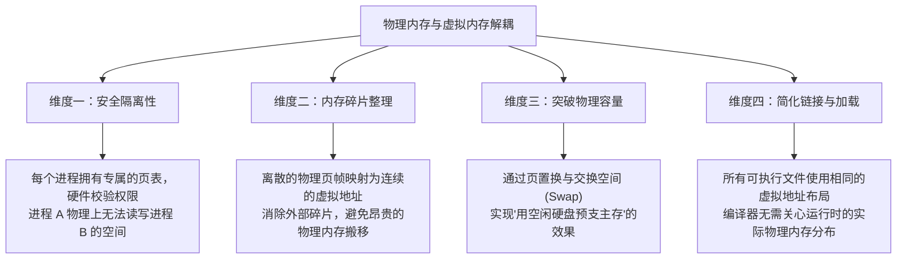
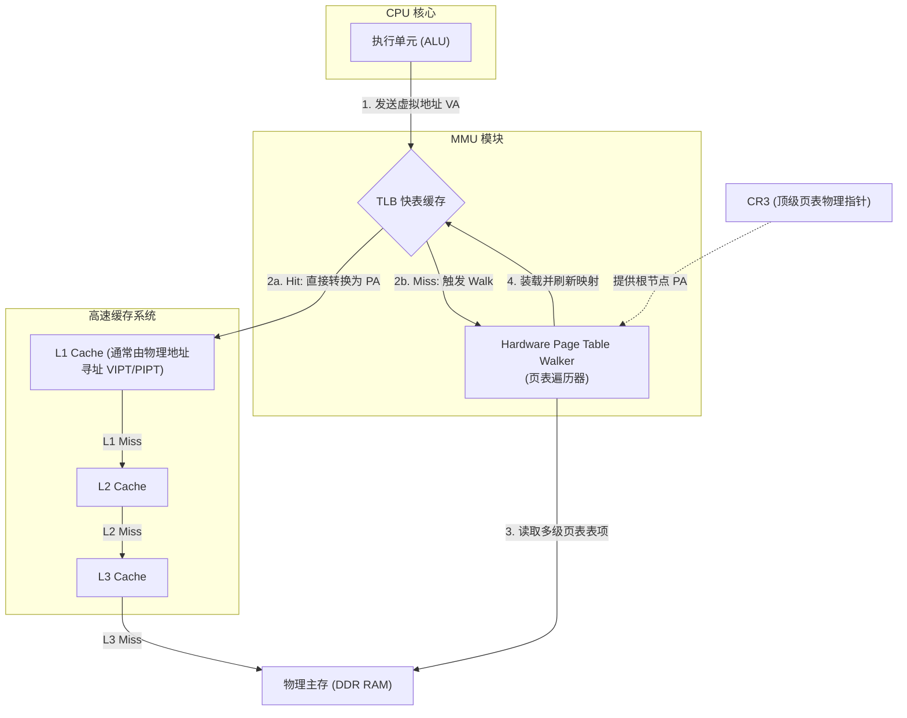
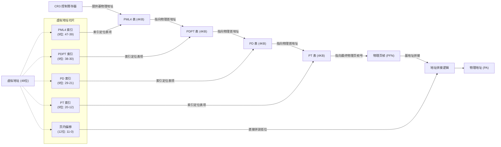
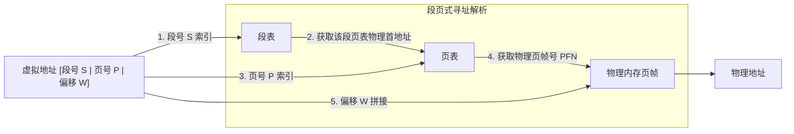
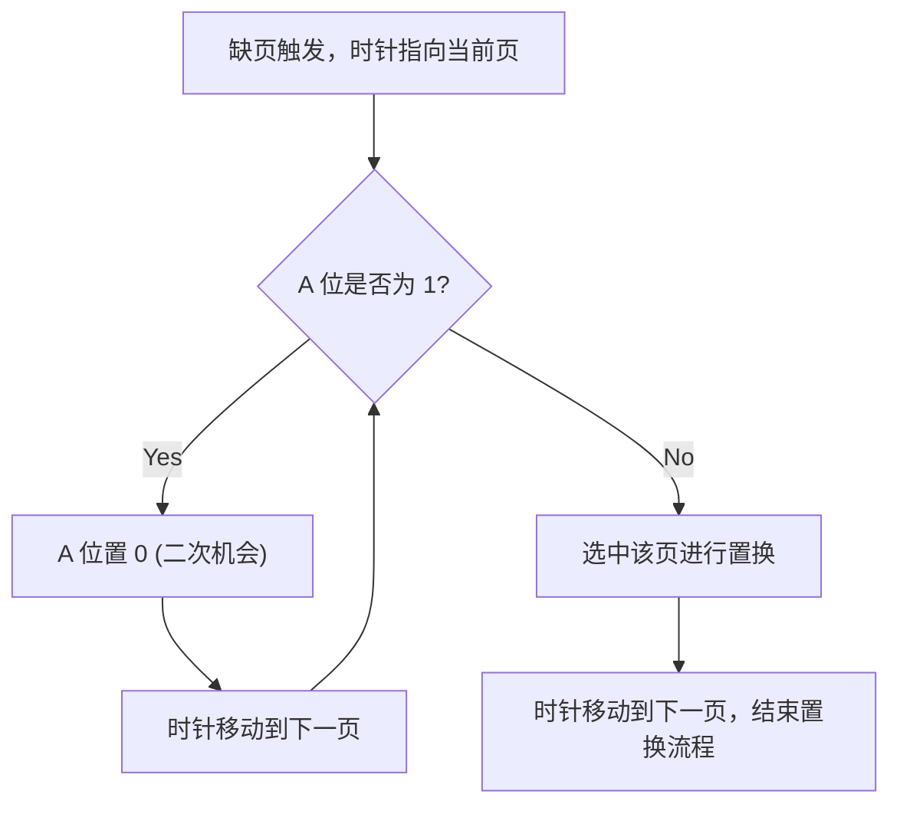
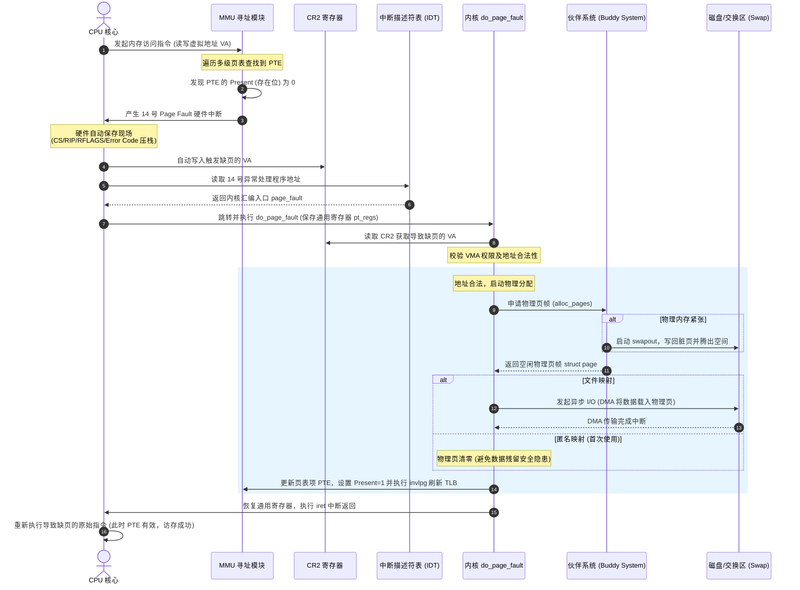
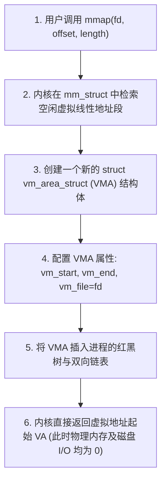

# 1.1.1.6 内存管理

## 目录
1. [虚拟内存管理架构的演进与硬件支撑](#1-虚拟内存管理架构的演进与硬件支撑)
   - 1.1 实地址模式与保护模式的硬件分水岭
   - 1.2 物理内存与虚拟内存解耦的核心动因
   - 1.3 内存管理单元 (MMU) 的物理定位与拓扑
2. [离散内存分区设计的技术演进与数学推导](#2-离散内存分区设计的技术演进与数学推导)
   - 2.1 分页机制与地址拆分
   - 2.2 多级页表解决空间灾难的数学推导与物理实现
   - 2.3 TLB 快表原理、刷新时机与开销
   - 2.4 分段机制的逻辑隔离与碎片困境
   - 2.5 段页式内存管理的融合设计
3. [页面置换算法的边界分析与系统抖动控制](#3-页面置换算法的边界分析与系统抖动控制)
   - 3.1 各种页面置换算法的深度解析
   - 3.2 系统抖动的动力学循环分析与多道程序度折线
   - 3.3 工作集模型与缺页率控制 (PFF)
4. [缺页中断 (Page Fault) 细节机制](#4-缺页中断-page-fault-细节机制)
   - 4.1 硬件与内核级微观协作时序
   - 4.2 缺页异常处理的内核核心逻辑与数据结构
5. [内存映射 (mmap) 原理与零拷贝物理机制](#5-内存映射-mmap-原理与零拷贝物理机制)
   - 5.1 mmap 物理映射机制与延迟分配
   - 5.2 零拷贝物理本质与性能对比
   - 5.3 Page Cache 与缺页异常的深度融合

---

## 1. 虚拟内存管理架构的演进与硬件支撑

### 1.1 实地址模式与保护模式的硬件分水岭

在计算机体系结构的演进中，内存寻址模式经历了一次决定性的范式转变，即从**实地址模式（Real Address Mode）**向**保护模式（Protected Mode）**的过渡。这一转变不仅是硬件设计的突破，更是操作系统能够实现稳定多任务运行的基石。

#### 1.1.1 实地址模式的寻址局限与无保护缺陷
以经典的 8086 处理器为例，其内部寄存器为 16 位，但拥有 20 位的外部物理地址总线。为了使 16 位的段寄存器和偏移寄存器能够寻址 20 位的物理空间（即 $2^{20} \text{ Bytes} = 1 \text{ MB}$），Intel 引入了“段基址 + 段内偏移量”的寻址机制：
$$\text{Physical Address} = \text{Segment Register} \times 16 + \text{Offset Register}$$
即段寄存器中的数值左移 4 位（相当于乘以 16）作为段基址，再加上 16 位的段内偏移量。

然而，实地址模式存在致命的安全与架构缺陷：
1. **零保护机制**：任何运行中的程序都可以访问 1MB 寻址空间内的任意物理内存。用户程序可以直接修改操作系统的中断向量表（IVT）、覆盖内核代码段，或者窃取、篡改其他程序的私有数据。
2. **地址冲突与多任务受限**：由于程序直接使用物理地址进行编译和重定位，多个程序同时装载运行时，必须在不同的物理内存区间进行手动或动态重定位。一旦两个程序试图访问相同的物理地址，系统便会彻底崩溃。

#### 1.1.2 保护模式的引入与硬件防护体系
从 80286 开始引入、并在 80386 中完善的 32 位保护模式（及后续的 64 位保护模式），彻底改变了内存访问规则。
1. **从“段基址”到“段选择子”与段描述符的跃升**：在保护模式下，段寄存器（如 CS, DS, SS）不再存放物理基地址，而是存放一个 16 位的**段选择子（Segment Selector）**。段选择子中包含一个 13 位的索引值，指向**全局描述符表（GDT, Global Descriptor Table）**或**局部描述符表（LDT, Local Descriptor Table）**。描述符表的每一项是一个 8 字节（64位）的**段描述符（Segment Descriptor）**。
   段描述符中包含了以下关键信息：
   - **Base Address**：32 位（或 64 位扩充）的段物理起始地址。
   - **Limit**：该段的边界大小，防止程序越界访问。
   - **Attribute**：控制该段的读、写、执行权限，以及描述符特权级（DPL）。
2. **特权级划分（Ring 0 - Ring 3）**：保护模式在硬件层面划分了四个特权级，现代操作系统一般仅使用 Ring 0（内核态）和 Ring 3（用户态）。CPU 在执行指令时，会对比当前特权级（CPL）与目标内存段的描述符特权级（DPL）。如果低特权级的用户程序（CPL=3）试图直接加载或写入高特权级（DPL=0）的内核段，CPU 硬件会立即抛出**通用保护异常（General Protection Fault, GPF）**。

#### 1.1.3 控制寄存器（CR0-CR4）的物理控制角色
控制寄存器是 CPU 内部用于配置和指示处理器当前状态的核心硬件资源：
* **CR0 寄存器**：包含两个至关重要的控制位：
  - **PE 位（Protection Enable，第0位）**：置 1 时，CPU 进入保护模式；置 0 时返回实模式。
  - **PG 位（Paging Enable，第31位）**：置 1 时，启用内存分页机制。只有在 PE 位为 1 的情况下，PG 位才能被置为 1。
* **CR2 寄存器（Page Fault Linear Address Register）**：专门用于保存触发缺页异常（Page Fault）时的那一刻所访问的**虚拟线性地址**。当缺页异常发生时，MMU 会自动将该地址写入 CR2，随后内核的缺页处理程序通过读取该寄存器，得知具体的缺页位置。
* **CR3 寄存器（Page Directory Base Register, PDBR）**：在分页开启后，CR3 寄存器存放当前活动进程的**顶级页表（如页目录表）的物理基地址**。每次操作系统进行进程上下文切换时，必须向 CR3 寄存器写入新进程的页表基地址，这会导致 MMU 寻址上下文的切换。
* **CR4 寄存器**：包含一系列架构扩展控制位，例如：
  - **PAE 位（Physical Address Extension，第5位）**：用于启用物理地址扩展，将 32 位处理器的物理寻址能力扩展至 36 位（64GB）。
  - **PCIDE 位（Process-Context Identifiers Enable，第17位）**：用于启用进程上下文标识符（PCID），这是优化 TLB 刷新开销的关键硬件开关。

---

### 1.2 物理内存与虚拟内存解耦的核心动因

在现代通用操作系统中，进程绝不能直接操作物理内存，而是运行在操作系统为其精心构建的**虚拟地址空间（Virtual Address Space）**中。物理内存与虚拟内存的完全解耦，是操作系统设计史上最重要的演进之一。其动因可归结为以下四个维度：



#### 1.2.1 维度一：安全隔离性与“主权独立”
每个进程在创建时，操作系统都会为其分配一套独立的页表。对于进程 A，其虚拟地址 `0x00400000` 映射到物理页帧 $X$；而进程 B 的虚拟地址 `0x00400000` 则被映射到物理页帧 $Y$。
由于进程在 Ring 3 下运行，其一切访存指令都必须经过页表转换。进程 A 没有任何手段能生成直接访问物理页帧 $Y$ 的指令，这实现了物理级的数据隔离。每个进程都仿佛“独占”了整个系统的物理内存，无法窥探或破坏其他进程的内存布局。

#### 1.2.2 维度二：内存碎片整理的高效化
如果没有虚拟内存，直接分配物理内存必须要求地址空间是**连续的**。当大量进程频繁创建、销毁或动态改变大小时，物理内存会被分割成无数不连续的小碎片。虽然碎片总和可能很大，但无法加载任何需要大块连续内存的新进程。
解耦后，物理内存的分配单位变成了离散的、固定大小的物理页帧（如 4KB）。MMU 可以将物理上极其分散的页帧，映射到进程中连续的虚拟地址段上。这使得操作系统在分配物理内存时无需进行耗时且容易死锁的“内存紧凑”（Memory Compaction）操作，彻底消除了外部碎片的困扰。

#### 1.2.3 维度三：突破物理内存容量的边界限制
虚拟内存的存在使得“内存大小”不再受物理内存条（DDR）容量的绝对限制。操作系统可以通过“延迟分配”和“换入换出”策略，将暂时不活跃的内存页数据转储到外部磁盘的交换分区（Swap Space）或文件中。
当进程试图访问已被换出的数据时，通过触发缺页异常，操作系统再将数据重新读入物理内存。这使系统能够以较低的磁盘 I/O 代价，运行内存需求远超物理内存容量的大型应用。

#### 1.2.4 维度四：简化编译、链接与程序加载的软件工程设计
在没有虚拟内存的系统里，编译器和链接器必须在生成目标代码时知晓程序将被加载到物理内存的哪一个确切段，或者生成大量的重定位表。
解耦后，编译器可以针对一个固定的、标准化的虚拟地址空间进行编译。例如，在 Linux x86-64 架构下，用户空间程序的代码段统一从 `0x400000` 附近开始，栈从 `0x7fffffffffff` 向低地址延伸。
加载器加载程序时，只需为程序各段分配虚拟内存区域并配置映射页表，无需修改程序内部的硬编码地址，极大简化了软件构建和运行的生命周期。

---

### 1.3 内存管理单元 (MMU) 的物理定位与拓扑

**MMU（Memory Management Unit）**是连接 CPU 执行核心与系统总线/主存之间的关键硬件桥梁。理解其物理定位与工作拓扑，有助于厘清硬件指令执行与访存翻译之间的微观延迟特征。

#### 1.3.1 物理位置与多级缓存的拓扑结构
在现代超大规模集成电路（VLSI）中，MMU 紧密集成在 CPU 核心（Core）内部。CPU 核心的算术逻辑单元（ALU）或浮点单元（FPU）在执行访存指令（如 `LDR`, `STR`, `MOV`）时，直接发出的是**虚拟地址（VA）**。
MMU 的物理定位处于 CPU 执行核心与 L1 缓存、外部总线之间。其典型寻址拓扑如下：



#### 1.3.2 VIPT 与 PIPT 的设计考量
在高速缓存（Cache）的设计中，为了进一步缩短 MMU 转换带来的时延，现代 CPU 常采用 **VIPT（Virtual Index Physical Tag，虚拟索引物理标记）** 或 **PIPT（Physical Index Physical Tag，物理索引物理标记）** 结构。
- **PIPT**：Cache 的索引（Index）和标记（Tag）均使用物理地址。这意味着 CPU 必须等待 MMU 将虚拟地址转换为物理地址后，才能开始去 Cache 中检索数据。这增加了访存的关键路径延迟。
- **VIPT**：Cache 查找的索引使用虚拟地址的低位，而标记使用物理地址的高位。由于在页面大小为 4KB 时，虚拟地址的低 12 位（Offset）与物理地址的低 12 位完全相同，因此 CPU 可以在 MMU 进行地址转换的同时，利用虚拟地址的低 12 位去 Cache 查找行索引；当 MMU 完成高位 VPN 到 PPN 的翻译后，Cache 刚好读出了 Tag，此时直接比对物理 Tag 即可。这实现了地址翻译与 Cache 检索的流水线并行化，极大提升了 CPU 执行效率。

---

## 2. 离散内存分区设计的技术演进与数学推导

### 2.1 分页机制与地址拆分

分页机制是现代操作系统离散内存管理的核心。它建立在将物理内存划分为固定长度的**页帧（Page Frame，或称物理页 PFN）**，将虚拟内存划分为同样大小的**页（Page，或称虚拟页 VPN）**的基础之上。

#### 2.1.1 经典 4KB 页下的地址结构拆分
在 32 位虚拟寻址下，若设置标准页大小为 $4 \text{ KB} = 4096 \text{ Bytes} = 2^{12} \text{ Bytes}$，则一个 32 位的虚拟地址被天然划分为两部分：
1. **页内偏移量（Offset）**：占用虚拟地址的低 12 位（第 0 至 11 位），因为 12 位二进制正好能寻址 4096 个字节位置。
2. **虚拟页号（VPN, Virtual Page Number）**：占用虚拟地址的高 20 位（第 12 至 31 位），对应最多 $2^{20} = 1,048,576$ 个虚拟页。

$$\text{Virtual Address (32-bit): } \underbrace{[\text{ Bit 31 } \cdots \cdots \text{ Bit 12 }]}_{\text{VPN (20 bits)}} \ \underbrace{[\text{ Bit 11 } \cdots \cdots \text{ Bit 0 }]}_{\text{Offset (12 bits)}}$$

在寻址时，MMU 的核心工作就是将 20 位的 VPN 转换为对应的物理页帧号（PPN/PFN），而低 12 位的 Offset 在转换前后保持不变，直接拼装为物理地址。

---

### 2.2 多级页表解决空间灾难的数学推导与物理实现

如果直接使用单级线性页表，在大地址空间下会引发严重的“页表自身占用过多物理内存”的空间灾难。多级页表（Multi-level Page Tables）的引入，在数学上和物理实现上优雅地解决了这一矛盾。

#### 2.2.1 单级页表的空间开销数学推导与物理破产
##### 1. 32位系统下的单级页表开销
假设 32 位系统的虚拟地址空间为 4GB，页大小为 4KB。
- 总虚拟页数：
  $$N_{\text{pages}} = \frac{4\text{ GB}}{4\text{ KB}} = \frac{2^{32}}{2^{12}} = 2^{20} = 1,048,576$$
- 单级页表中，必须为这 100 多万个虚拟页各保留一个页表项（PTE, Page Table Entry）。
- 假设每个 PTE 占用 4 字节（包含物理页帧号及 Present, R/W, U/S 等标志位）。
- 单个进程仅页表本身所占用的物理内存为：
  $$\text{Page Table Size} = 2^{20} \times 4\text{ Bytes} = 4\text{ MB}$$
- **关键痛点**：因为单级页表是一维数组结构，为了能够通过 VPN 快速定位（$\text{PTE\_Address} = \text{Table\_Base} + \text{VPN} \times 4$），这 4MB 的页表必须在物理内存中**连续存储**。这意味着系统每创建一个进程，即使它只是个只有几 KB 大小的简单的程序，操作系统也必须为其垫付 4MB 的连续物理内存作为页表开销。如果有 100 个进程，光是页表本身就要吞噬 400MB 内存，这在早期物理内存仅有 16MB 或 64MB 的系统里是无法接受的。

##### 2. 64位系统下的单级页表物理破产
现代 64 位系统通常实际使用 48 位虚拟地址空间（其高端和低端各 128TB 可用，中间为非规范区域）。
- 总虚拟页数：
  $$N_{\text{pages}} = \frac{2^{48}}{2^{12}} = 2^{36} \approx 6.87 \times 10^{10}$$
- 64 位下每个 PTE 占用 8 字节。
- 单进程页表所需物理内存：
  $$\text{Page Table Size} = 2^{36} \times 8\text{ Bytes} = 512\text{ GB}$$
这已经超越了绝大部分服务器 and 个人电脑的物理主存容量，单级页表在 64 位系统下在物理上彻底破产。

#### 2.2.2 多级页表节省空间的数学本质与证明
多级页表解决空间开销的秘密在于：**利用虚拟地址空间的极度稀疏性，结合按需延迟分配策略，使得绝大部分未分配的虚拟地址空间不需要分配对应的下级页表。**

以 32 位下的两级页表（页目录表 PD + 二级页表 PT）为例：
- 将 20 位的 VPN 进一步拆分为：
  - 10 位的页目录索引（PD Index）
  - 10 位的二级页表索引（PT Index）
- **页目录表（PD）**：包含 $2^{10} = 1024$ 个页目录项（PDE）。每个 PDE 对应一个二级页表（对应 4MB 的虚拟空间范围）。整个页目录表大小为 $1024 \times 4\ Bytes = 4\text{ KB}$（恰好占用一个物理页帧）。页目录表必须常驻物理内存，并由 CR3 寄存器指向。
- **二级页表（PT）**：每个二级页表包含 $2^{10} = 1024$ 个 PTE，大小也是 4KB。

##### 数学证明：
假设一个进程非常简单，其虚拟内存中只有两部分有效数据：
1. 低端代码段：占用虚拟地址 `0x00000000` 到 `0x00100000`（共 1MB 空间）。
2. 高端栈空间：占用虚拟地址 `0xFFF00000` 到 `0xFFFFFFFF`（共 1MB 空间）。
其余 3.998GB 的虚拟内存空间全部未被映射。

- **页表物理分配情况**：
  - **页目录表**：分配 1 个，常驻内存，占用 4KB。
  - **二级页表**：
    - 对应低端 1MB 空间：该区间对应的 PD Index 均落在第 0 个 PDE 内。因此，操作系统只需要为第 0 个 PDE 分配 1 个二级页表，占用 4KB。
    - 对应高端 1MB 空间：该区间对应的 PD Index 落在第 1023 个 PDE 内。操作系统只需为第 1023 个 PDE 分配 1 个二级页表，占用 4KB。
    - 中间的第 1 到第 1022 个 PDE，其 Present 标志位全部设为 0（指向 NULL）。**操作系统根本不需要为它们分配任何二级页表物理空间！**
  - **总物理开销**：
    $$\text{Total Size} = 4\text{ KB} (\text{PD}) + 4\text{ KB} (\text{PT}_0) + 4\text{ KB} (\text{PT}_{1023}) = 12\text{ KB}$$
  - **节省率对比**：
    与单级页表的 4MB（4096KB）相比，多级页表节省了：
    $$\text{Savings} = 1 - \frac{12\text{ KB}}{4096\text{ KB}} \approx 99.71\%$$
通过多级页表，我们将页表的内存消耗压缩了近三个数量级。虽然在最坏的情况下（即 4GB 虚拟内存被完全均匀映射，没有任何稀疏孔洞），多级页表需要 $4\text{ KB (PD)} + 1024 \times 4\text{ KB (PT)} = 4096\text{ KB} + 4\text{ KB} = 4100\text{ KB}$ 的内存（比单级多出 4KB 的 PD 开销），但在实际进程运行中，虚拟空间几乎都是稀疏分布的，因此多级页表能带来极具压倒性的空间优势。

#### 2.2.3 64位系统下的四级页表拓扑寻址
在 64 位 x86-64 体系下，标准的 48 位虚拟线性地址寻址架构通过四级页表实现地址翻译。其地址划分结构为：

$$\text{Address (48-bit): } \underbrace{[\text{ Bit 47:39 }]}_{\text{PML4 (9b)}} \ \underbrace{[\text{ Bit 38:30 }]}_{\text{PDPT (9b)}} \ \underbrace{[\text{ Bit 29:21 }]}_{\text{PD (9b)}} \ \underbrace{[\text{ Bit 20:12 }]}_{\text{PT (9b)}} \ \underbrace{[\text{ Bit 11:0 }]}_{\text{Offset (12b)}}$$

各级页表的功能与寻址拓扑如下：
1. **PML4 (Page Map Level 4)**：顶级页表，包含 512 个 PML4E。使用第 39-47 位共 9 位进行索引寻址（$2^{9} = 512$）。每个 PML4E 存储下一级 PDPT 的物理首地址。
2. **PDPT (Page Directory Pointer Table)**：第三级页表，包含 512 个 PDPTE。使用第 30-38 位共 9 位进行索引。指向下一级 PD 的物理首地址。
3. **PD (Page Directory)**：第二级页表，包含 512 个 PDE。使用第 21-29 位共 9 位进行索引。指向第一级 PT 的物理首地址。
4. **PT (Page Table)**：第一级页表，包含 512 个 PTE。使用第 12-20 位共 9 位进行索引。其中存储最终的物理页帧号（PPN）。
5. **对齐优化设计**：因为每级页表包含 512 个表项，在 64 位系统下每个表项占用 8 字节，所以每级页表的大小为 $512 \times 8\text{ Bytes} = 4\text{ KB}$，刚好完美占用并对齐一个物理内存页帧，便于内存管理分配。

以下是四级页表寻址的拓扑结构图：



---

### 2.3 TLB 快表原理、刷新时机与开销

多级页表虽然解决了空间灾难，但引入了严重的性能副作用：CPU 每发起一次内存访问，MMU 必须首先在物理内存中进行 4 次页表查询（PML4 -> PDPT -> PD -> PT），最后第 5 次才是真正访问目标数据的内存单元。这使得内存访问效率直接下降为单级页表无缓存状态下的 20%。
为了解决这一致命的访存惩罚，CPU 引入了 **TLB (Translation Lookaside Buffer，旁路转换缓冲/快表)**。

#### 2.3.1 TLB 的硬件结构与工作原理
TLB 是一种集成在 MMU 内部的高速静态随机存取存储器（SRAM）。由于其硬件成本极高，容量通常较小（从数十项到数千项不等）。
- **联想存储器寻址**：TLB 采用全相联（Fully Associative）或组相联（Set Associative）寻址。MMU 收到虚拟地址的高位 VPN 后，可以在一个时钟周期内，通过硬件比较电路，将 VPN 与 TLB 中存储的所有表项并行进行比对。
- **命中与缺失**：
  - **TLB Hit**：若找到匹配的 VPN 且有效位为 1，MMU 直接读出对应的 PPN，拼接 Offset 后送往 Cache/主存，省去了对多级页表的全部读取。
  - **TLB Miss**：若未命中，MMU 内部的 Hardware Page Table Walker 启动，遍历多级页表获取映射关系，并将其填入 TLB（可能会替换掉旧的 TLB 表项），然后再执行访存。

#### 2.3.2 TLB 的刷新时机与开销优化
随着系统运行状态的变化，TLB 缓存的映射关系必须保持精确的一致性。这就引入了 TLB 刷新的问题。

##### 1. 进程上下文切换与全局刷新
每个进程拥有独立的虚拟地址空间，意味着不同进程的相同虚拟地址映射不同的物理地址。
- **传统做法**：在进行进程切换并重写 CR3 寄存器时，CPU 会自动使整个 TLB 的所有表项失效（PGE 全局页除外）。
- **刷新开销**：当新进程开始运行时，TLB 处于“冷启动”状态。前几千次访存几乎全部会发生 TLB Miss，MMU 必须高频遍历多级页表。这会在高频进程切换的系统（如高并发微服务场景）中导致严重的性能衰退，这被称为 **TLB 抖动（TLB Thrashing）**。
- **PCID / ASID 优化**：
  为了规避每次切换进程都清空 TLB 的高昂代价，现代架构（如 x86 的 PCID，ARM 的 ASID）在 TLB 表项中引入了一个与进程 PID 关联的“空间标识符”。
  当 CPU 切换进程时，CR3 载入新页表的同时会将当前进程的 PCID 传入 MMU。MMU 在检索 TLB 时，不仅比对 VPN，还比对当前 PCID。这样，TLB 中可以同时容纳多个不同进程的映射表项，进程切换时无需进行全量 TLB 清空，极大地缓解了进程切换带来的冷启动延迟。

##### 2. 页表修改与局部刷新（TLB Shootdown）
当内核由于内存释放、页面置换或 `mmap` 解除映射而修改了某个页表项时，内核必须同步清除对应虚拟页在 TLB 中的缓存。
- **单核局部刷新**：x86 提供了 `invlpg`（Invalidate Page）指令，可以直接将某个特定虚拟地址对应的单条 TLB 表项废弃，开销较小。
- **多核一致性危机：TLB 射击 (TLB Shootdown)**：
  在对称多处理（SMP）架构下，同一个进程的线程可能在不同的 CPU 核心上并发运行，它们共享同一套页表。当核心 0 修改了某个 PTE 时，它必须保证运行在核心 1、核心 2 上的同进程线程不会读到旧的 TLB 缓存。
  - **射击时序流程**：
    1. 核心 0 修改 PTE 并执行 `invlpg` 刷新自身的 TLB。
    2. 核心 0 向所有运行该进程的其他核心发送**处理器间中断（IPI, Inter-Processor Interrupt）**。
    3. 其他核心接收到 IPI 后，暂停当前指令执行，进入中断服务程序，执行 `invlpg` 刷新各自的本地 TLB。
    4. 其他核心向核心 0 发送完成响应。
    5. 核心 0 在确认所有核心刷新完毕后，才允许修改操作最终返回。
  - **性能代价**：TLB Shootdown 涉及跨核中断、自旋锁等待以及指令流水线清空，是现代多核系统在大规模内存分配和释放（如频繁创建/销毁线程、大量小块内存映射）时的一个极其严重的性能瓶颈。

---

### 2.4 分段机制的逻辑隔离与碎片困境

分段机制（Segmentation）是一种更符合人类逻辑思维的内存分区技术。它将程序的地址空间划分为若干个逻辑段（如代码段、数据段、堆段、栈段），每个段具有特定属性和变长空间。

#### 2.4.1 分段机制下的寻址流程
在纯分段机制下，程序的逻辑地址由“段号 + 段内偏移（Offset）”组成。
- 操作系统维护一张**段表（Segment Table）**，段表的每个表项包含段的**物理基地址（Base）**以及**段界限（Limit）**。
- MMU 接收到逻辑地址后：
  1. 根据段号检索段表。
  2. 硬件自动校验：若 $\text{Offset} > \text{Limit}$，则触发越界异常（Segmentation Fault）。
  3. 将段基址与段内偏移相加，直接得到物理地址：
     $$\text{Physical Address} = \text{Base} + \text{Offset}$$

#### 2.4.2 外部碎片的数学成因与紧凑算法的昂贵成本
分段允许段的大小是动态变化的，但在物理内存中直接应用分段会导致严重的**外部碎片（External Fragmentation）**。

```
初始物理内存布局:
[ 进程 A: 100MB ] [ 进程 B: 50MB ] [ 进程 C: 80MB ] [ 空闲: 20MB ]

进程 B 退出后布局:
[ 进程 A: 100MB ] [ 空闲空间 1: 50MB ] [ 进程 C: 80MB ] [ 空闲空间 2: 20MB ]
```
此时系统虽然拥有总计 $50\text{MB} + 20\text{MB} = 70\text{MB}$ 的空闲物理内存，但由于空间是不连续的，任何新创建的需要 60MB 连续内存空间的进程都无法被装载。

- **消除碎片手段：内存紧凑（Memory Compaction）**：
  操作系统必须停止所有用户进程，在物理内存中将进程 C 整体“搬移”到进程 A 的屁股后面，把不连续的空闲空间合并成一个连续的 70MB 大空间。
- **性能代价**：
  内存紧凑需要在物理内存间进行极其庞大的数据拷贝。假设要移动 2GB 的内存数据，在 DDR 吞吐为 20GB/s 的系统下，至少需要阻塞系统运行 100ms 以上。这种停顿（Stop-the-world）对于任何实时性要求高的系统都是灾难性的。因此，纯分段机制早已淡出主流系统，仅保留在 CPU 引导阶段及兼容性架构中。

---

### 2.5 段页式内存管理的融合设计

为了同时获得分段机制的逻辑安全隔离优势与分页机制的离散分配优势，计算机体系结构引入了**段页式内存管理（Segmented Paging）**。

#### 2.5.1 段页式寻址的数学映射过程
在段页式系统中，进程的虚拟空间被划分为多个逻辑段，而每个段内部的虚拟空间再被划分为固定大小的页。
- **虚拟地址结构**：
  $$\text{Virtual Address: } [\text{ 段号 } S ] \ [\text{ 段内页号 } P ] \ [\text{ 页内偏移 } W ]$$

- **三级映射路径**：
  1. MMU 首先使用段号 $S$ 作为索引，查询当前进程的**段表**。
  2. 段表项中不再存储物理基地址，而是存储该段所对应的**页表的起始物理基地址**与**页表界限**。
  3. MMU 使用段内页号 $P$ 索引该段的页表，获取对应的**物理页帧号（PPN）**。
  4. 将物理页帧号与页内偏移 $W$ 组合，得到最终的物理地址。



#### 2.5.2 多次访存的惩罚与对策
在没有 TLB 的极端情况下，段页式系统每读取一次数据，需要发起 **3 次** 内存访问：
第一步读段表，第二步读页表，第三步读取实际数据。这使得性能大幅下降。
现代 CPU 通过在 TLB 中直接缓存“段+页 -> 物理页帧”的一体化转换结果，将平均访存次数压缩到 1 次以上，使得段页式能够在保证逻辑分段权限控制的同时，享受分页带来的高物理利用率。

---

## 3. 页面置换算法的边界分析与系统抖动控制

在物理内存供不应求时，操作系统必须将暂时不需要的物理页置换到外部磁盘的交换区中。页面置换算法（Page Replacement Algorithms）的设计优劣，直接决定了系统的吞吐上限。

### 3.1 各种页面置换算法的深度解析

#### 3.1.1 先进先出算法 (FIFO) 与 Belady 异常

FIFO 算法总是淘汰在内存中驻留时间最长的页面。它虽然极其容易实现（基于环形队列即可），但存在致命的 **Belady 异常**（分配更多页帧缺页率反而上升）。

##### Belady 异常的数学反例与完全推导：
假设进程页面访问的序列为：
$$\sigma = \{1, 2, 3, 4, 1, 2, 5, 1, 2, 3, 4, 5\}$$

###### 1. 当系统分配给该进程的物理页帧数为 $N=3$ 时：
我们用表格记录每一次页面访问及内存队列的变化（左侧为队列头部，最早进入；右侧为队列尾部）：

| 访问页面 | 是否缺页 | 内存物理页帧状态 (FIFO 队列) |
| :---: | :---: | :---: |
| **1** | 是 (1) | `[1]` |
| **2** | 是 (2) | `[1, 2]` |
| **3** | 是 (3) | `[1, 2, 3]` |
| **4** | 是 (4) | `[2, 3, 4]` (淘汰 1) |
| **1** | 是 (5) | `[3, 4, 1]` (淘汰 2) |
| **2** | 是 (6) | `[4, 1, 2]` (淘汰 3) |
| **5** | 是 (7) | `[1, 2, 5]` (淘汰 4) |
| **1** | 否 | `[1, 2, 5]` (命中) |
| **2** | 否 | `[1, 2, 5]` (命中) |
| **3** | 是 (8) | `[2, 5, 3]` (淘汰 1) |
| **4** | 是 (9) | `[5, 3, 4]` (淘汰 2) |
| **5** | 否 | `[5, 3, 4]` (命中) |

- **总缺页次数 ($N=3$)** = **9 次**。

###### 2. 当系统分配给该进程的物理页帧数增加到 $N=4$ 时：

| 访问页面 | 是否缺页 | 内存物理页帧状态 (FIFO 队列) |
| :---: | :---: | :---: |
| **1** | 是 (1) | `[1]` |
| **2** | 是 (2) | `[1, 2]` |
| **3** | 是 (3) | `[1, 2, 3]` |
| **4** | 是 (4) | `[1, 2, 3, 4]` |
| **1** | 否 | `[1, 2, 3, 4]` (命中) |
| **2** | 否 | `[1, 2, 3, 4]` (命中) |
| **5** | 是 (5) | `[2, 3, 4, 5]` (淘汰最早的 1) |
| **1** | 是 (6) | `[3, 4, 5, 1]` (淘汰最早的 2) |
| **2** | 是 (7) | `[4, 5, 1, 2]` (淘汰最早的 3) |
| **3** | 是 (8) | `[5, 1, 2, 3]` (淘汰最早的 4) |
| **4** | 是 (9) | `[1, 2, 3, 4]` (淘汰最早的 5) |
| **5** | 是 (10) | `[2, 3, 4, 5]` (淘汰最早的 1) |

- **总缺页次数 ($N=4$)** = **10 次**。

##### 数学本质剖析：
增加物理页帧后，缺页中断次数反而从 9 次上升到了 10 次。
其本质成因在于：**FIFO 算法的置换决策集不满足“栈性质（Stack Property）”。**
对于栈型置换算法（如 LRU、OPT），在任一时刻 $t$，物理页帧数为 $N$ 时常驻内存的页面集合 $M_t(N)$，必然是物理页帧数为 $N+1$ 时常驻内存的页面集合 $M_t(N+1)$ 的真子集：
$$M_t(N) \subset M_t(N+1)$$
这意味着增加页帧，之前能命中的页面在当前也必然能命中，因此缺页率绝不会上升。而 FIFO 的淘汰机制与页面的活跃局部性毫无关联，仅仅因为某个页面“年龄最大”就将其淘汰，导致新增加的页帧改变了队列的淘汰步调，使本可以在后续命中的热点数据提前被排挤出队列。

#### 3.1.2 最佳置换算法 (OPT)
OPT (Optimal Replacement) 算法的策略是：淘汰在未来最长时间内不再被访问的页面。
- **理论评估基准**：由于需要预知未来（即需要完整的程序未来访存序列），这在通用在线操作系统中是无法实现的。然而，它在学术上和离线分析中具有至关重要的作用，作为评估其他置换算法性能的数学上限 Baseline。

#### 3.1.3 最近最久未使用算法 (LRU)
LRU (Least Recently Used) 算法基于空间和时间局部性原理，淘汰在过去一段时间内最久未被访问的页面。

##### 1. 硬件级实现方案
- **逻辑计数器法**：CPU 为每个物理页帧分配一个 64 位的硬件计数器。每当某页被访问时，硬件自动将当前的系统时钟或逻辑计数器的值写入该页帧对应的硬件计数器中。置换时，MMU 通过硬件检索，寻找计数器值最小的物理页进行淘汰。其代价是每次访存都要执行额外的硬件写操作，且在大内存下检索最小值十分缓慢。
- **硬件栈法**：系统维护一个存储活动页帧号的硬件栈。每当访问一个页面时，硬件将其从栈的任意位置移出并压入栈顶。栈底的页帧始终是最近最久未使用的页面。由于需要动态调整栈中任意位置的数据项，在大容量内存下硬件连线的延迟开销难以忍受。

##### 2. 软件级模拟及其多核锁瓶颈
因为硬件直接支持 LRU 代价过大，内核通常采用双向链表（LRU 链表）与哈希表（Active/Inactive 链表）的结合体。
每当用户进程访问一个内存页时，内核需要将对应的页面节点从链表中移出并重新挂入活跃链表的表头。
- **多核锁瓶颈**：在对称多处理（SMP）系统下，多个 CPU 核心并发访问不同内存页时，都需要去争抢、修改同一个全局 LRU 链表的自旋锁（Spinlock），以调整链表结构。这会导致高并发场景下严重的 CPU 锁自旋等待，极大地消耗了总线带宽并阻碍了多核并行的吞吐性能。因此，现代内核（如 Linux）通常采用“双活跃链表”与“Per-CPU 页面缓存”来近似模拟 LRU，以减少全局自旋锁的竞争频率。

#### 3.1.4 最少使用算法 (LFU) 与老化衰减机制
LFU (Least Frequently Used) 算法淘汰在过去一段时间内累计访问频次最低的页面。

##### 历史冷数据高频驻留灾难：
LFU 存在一个经典的系统级缺陷。如果进程在启动初始化阶段，频繁读取了某一段配置或资源数据（例如计数器累加到了 50000），随后程序进入常规运转，该数据段便再也不会被访问。然而，因为其历史累计计数器值极高，普通的 LFU 算法在很长一段时间内都无法将其换出，导致这部分无用内存常年霸占物理内存空间。

##### 老化（Aging）衰减机制的数学解法：
为了消除历史高频但当前失效的“幽灵数据”影响，系统引入了**老化衰减（Aging）**算法。
在时钟中断（例如每 10ms）到来时，页面计数器会自动右移一位：
$$C_{\text{new}} = C_{\text{old}} \gg 1$$
或者，每次时钟周期时，将之前的频次乘以一个介于 0 到 1 之间的衰减因子 $\alpha$：
$$C(t) = \alpha \cdot C(t-1) + V(t)$$
其中 $V(t)$ 是在当前时间窗口内该页的实际被访问次数。
通过这种方式，久未被访问的页面的计数器值会随时间流逝呈指数级衰减，使 LFU 能够动态且精准地识别当下的真实活跃热点。

#### 3.1.5 时钟置换算法 (Clock) 及其改进型

由于 LRU 实现开销过高，现代操作系统通常采用**时钟置换算法（Clock，又称二次机会算法 Second Chance）**作为主力置换机制。

##### 1. 标准 Clock 算法工作原理
- **数据结构**：内存中的物理页帧被组织成一个环形链表，类似于时钟表盘。“时针”指向当前待检查的页面。
- **访问位（Access Bit，简写为 A）**：每个页面关联一个访问位。当进程访问该页时，MMU 硬件会自动将该页的 $A$ 位置 1，无需操作系统软件干预。
- **置换逻辑**：当缺页异常发生且需要淘汰页面时：
  1. 时针指向当前页面，检查其 $A$ 位。
  2. 若 $A = 1$，说明最近被访问过，内核将其清零（$A \to 0$），给予其“第二次机会”，并将时针移动到下一格。
  3. 若 $A = 0$，说明最近未被访问过，该页面被选中置换，时针移动到下一格，扫描结束。



##### 2. 改进型 Clock 算法：读写属性差异化对待
标准 Clock 算法将“读操作”和“写操作”等同视之。然而，被修改过（写过）的页面称为**脏页（Dirty Page）**，淘汰它需要将其同步写回磁盘（I/O 耗时通常在毫秒级）；而未被修改的页面称为**干净页（Clean Page）**，淘汰它只需直接清空映射即可，几乎零成本。
因此，**改进型 Clock 算法**增加了**修改位（Modified Bit，简写为 M，即脏位）**，并组合出四种页面状态，按优先级寻找置换目标：
1. **状态 0 `(A=0, M=0)`**：最近未被访问，且未被修改。**最佳置换对象**。
2. **状态 1 `(A=0, M=1)`**：最近未被访问，但已被修改。需要置换后进行写回。
3. **状态 2 `(A=1, M=0)`**：最近被访问过，但未被修改。
4. **状态 3 `(A=1, M=1)`**：最近被访问过，且已被修改。

##### 四轮扫描状态切换算法逻辑：
- **第一轮扫描**：
  从时针当前位置开始，扫描环形表盘，寻找状态为 `(0,0)` 的页面。在此轮扫描中，**不修改任何页面的 $A$ 位**。如果找到，直接置换，时针前移，结束。
- **第二轮扫描**：
  若第一轮未找到，则重新从起点开始，寻找状态为 `(0,1)` 的页面。在扫描过程中，**将所有跳过的页面的访问位 $A$ 置为 0**（由 `1` 变为 `0`）。如果找到 `(0,1)`，则置换之，结束。
- **第三轮扫描**：
  若第二轮仍未找到（此时所有页面的 $A$ 位均已被强制置 0），时针重新扫表，寻找第一个 `(0,0)`（即原来的 `(1,0)`）页面。如果找到，直接置换，结束。
- **第四轮扫描**：
  若仍未找到，则寻找第一个 `(0,1)`（即原来的 `(1,1)`）页面进行置换。此轮扫描必然能找到。

通过这套四级扫描机制，改进型 Clock 算法最大限度地保留了活跃的只读代码页，并优先淘汰干净页以避开磁盘写回 I/O，极大地提高了虚拟内存子系统的整体吞吐性能。

---

### 3.2 系统抖动的动力学循环分析与多道程序度折线

**系统抖动（Thrashing，又称系统颠簸）**是虚拟内存管理失控时的灾难性状态。

#### 3.2.1 抖动现象的动力学正反馈恶性循环
当并发运行的进程数增多时，每个进程所分配到的物理页帧数量被不断摊薄。一旦摊薄到无法支撑该进程运行所需的**工作集（Working Set）**时，进程将不可避免地陷入高频缺页的状态。其系统动力学反馈过程如下：

```
                    ┌────────────────────────┐
                    ▼                        │
【物理页帧严重不足】 ──> 【进程缺页率激增】          │
        ▲                                    │ (正反馈)
        │ (分配更少)                          │
【调入更多进程】   ──> 【CPU 利用率降为零】 <── 【进程被挂起以等待 I/O】
```

1. **缺页阻塞**：每个进程由于缺页而高频触发中断，被迫进入挂起等待队列，等待磁盘 I/O 将页面调入物理内存。
2. **利用率下降**：由于绝大部分进程都因缺页被挂起，CPU 的使用率会断崖式下跌，接近于零。
3. **恶性决策**：操作系统的长期调度程序（Long-term Scheduler）检测到 CPU 空闲率极高，误以为是系统负荷不够，决定从外存装载更多的新进程入内存以提高利用率。
4. **彻底颠簸**：新进程的加入进一步加剧了每个进程的物理页帧饥饿，导致全系统所有进程都陷入频繁的缺页置换和磁盘读写中，系统几乎所有的算力都被用来进行中断上下文切换和磁盘 DMA 数据搬移。系统陷入崩溃般的死机状态。

#### 3.2.2 多道程序度折线图分析
下图清晰展示了**多道程序度（Degree of Multiprogramming，即并发进程数）**与 CPU 利用率之间的物理关系。当并发进程数越过临界拐点（即物理内存总容量无法满足所有进程的工作集之和）后，CPU 利用率将瞬间发生崩塌。

```
CPU 利用率 (%)
100 |          /---\ 
    |         /     \  <-- 临界拐点 (Thrashing Point)
    |        /       \
 50 |       /         \
    |      /           \
    |     /             \__________
  0 +-------------------------------> 多道程序度 (并发进程数)
```

---

### 3.3 工作集模型与缺页率控制 (PFF)

为了彻底从根本上避免系统抖动，操作系统必须引入动态内存监控机制，其中最著名的当属**工作集（Working Set）**模型与**缺页率控制（PFF, Page Fault Frequency）**算法。

#### 3.3.1 工作集模型 (Working Set Model) 的数学与物理定义
工作集是指在某段特定的时间区间内，进程执行时实际频繁访问的页面的集合。它反映了程序的空间和时间局部性。

##### 数学描述：
定义一个参数 $\Delta$（称为工作集窗口大小，通常以 CPU 执行的指令数或时钟周期为量纲）。在时刻 $t$，进程 $i$ 的虚拟工作集 $W_i(t, \Delta)$ 定义为：
$$W_i(t, \Delta) = \{ \text{Page } p \mid \text{进程 } i \text{ 在时间区间 } [t-\Delta, t] \text{ 内访问过 } p \}$$

- **工作集大小 $D$ 的物理总和**：
  $$D = \sum_{i=1}^{M} |W_i(t, \Delta)|$$
  其中 $M$ 为当前系统运行的并发进程数，$|W_i|$ 为进程 $i$ 的工作集大小（即包含的不同页面的数量）。

- **预防抖动的准入机制**：
  设系统可供分配的物理内存总页帧数为 $S_{\text{total}}$。
  - 若 $D \le S_{\text{total}}$，说明当前物理内存完全能够容纳所有运行进程的核心热点工作集，系统运行平稳。
  - 若 $D > S_{\text{total}}$，系统必然会发生抖动。此时，操作系统必须执行**进程挂起策略**。操作系统会选择一个或多个不重要的进程（如后台守护进程、低优先级任务），将其强行挂起并从内存中完全换出（Swap Out），将其释放的所有物理页帧分配给正在运行的进程，直到 $D \le S_{\text{total}}$ 为止。

#### 3.3.2 缺页率控制算法 (PFF) 的动态调节
除了静态评估工作集，操作系统常通过**缺页率控制（PFF, Page Fault Frequency）**算法动态地为进程分配或收回物理页帧：
1. **缺页率上限 $F_{\text{high}}$**：如果一个进程的缺页率超过了 $F_{\text{high}}$，说明当前为其分配的物理页帧远小于其真实工作集，系统会为其追加物理页帧。
2. **缺页率下限 $F_{\text{low}}$**：如果一个进程的缺页率远低于 $F_{\text{low}}$，说明其物理页帧富余，系统会从中抽走部分富余页帧，分配给急需内存的其他进程。

---

## 4. 缺页中断 (Page Fault) 细节机制

缺页中断（Page Fault）并不是普通的软件错误，而是一次由 MMU 硬件与操作系统内核协同完成的、精密的微观时序流程。

### 4.1 硬件与内核级微观协作时序

当进程试图访问一个已被换出、或者尚未分配物理页帧的虚拟地址时，硬件与内核将按下图所示的时序流程进行密切协作：



#### 4.1.1 步骤详解：从硬件崩溃到中断返回
1. **CPU 指令执行**：CPU 执行类似 `mov eax, [rsi]` 访存指令，此时 `rsi` 寄存器存储虚拟地址 $V$。
2. **MMU 拦截**：MMU 解析 $V$ 对应的多级页表项（PTE），发现 Present（存在）位为 0。这说明物理页帧未驻留内存。
3. **硬件异常激发**：MMU 触发 CPU 硬件 14 号中断（Page Fault）。硬件自动将当前运行状态的 `CS`、`RIP`（指向导致缺页的**那一条**指令）、`RFLAGS` 以及 `Error Code`（表明是读/写、用户态/内核态引起的缺页）自动压入当前进程的内核栈中。
4. **记录缺页地址**：硬件将虚拟地址 $V$ 写入 CPU 内部的 **CR2 寄存器**。
5. **IDT 路由**：CPU 根据中断向量表（IDT）查找到 14 号中断的入口点，跳转执行内核汇编存根。
6. **内核上下文保存**：汇编层将通用的 CPU 寄存器压入内核栈，封装成 `struct pt_regs` 供 C 语言函数访问。接着，调用核心 C 处理函数 `do_page_fault()`。
7. **虚拟内存区域 (VMA) 检查**：
   - 操作系统读取 CR2 寄存器，获取缺页地址 $V$。
   - 检索当前进程的 `struct mm_struct` 中的 `mm_rb`（红黑树），查询是否包含地址 $V$ 的虚拟内存区域（VMA）。
   - **错误处理分支**：
     - 如果找不到对应的 VMA，或者虽然找到了 VMA 但本次访问超出了其权限限制（例如向只读的 VMA 区域执行写入指令），内核确认是非法越界，向进程发送 `SIGSEGV`（段错误）信号，若进程未捕获则直接中止该进程。
8. **物理页帧分配**：
   - 若地址和权限合法，确认这是一次常规缺页。内核调用 `handle_mm_fault()`，并向伙伴系统（Buddy System）申请一个物理页帧。
   - **内存回收机制**：若物理内存紧张，触发页面置换算法，将被选中的页面换出，如果该页已被修改（Dirty），则异步刷回磁盘。
9. **数据载入与清零**：
   - **匿名映射（堆、栈、BSS段等）**：由于这是该虚拟内存第一次分配，为了防止当前进程读取到前一个进程在内存中残留的敏感数据（如密码、私钥），内核会对物理页帧执行**全 0 初始化**。
   - **文件映射**：内核启动磁盘驱动程序，通过 DMA 方式将外部磁盘对应偏移的文件内容读入该物理页帧。
10. **页表同步与 TLB 局部刷新**：
    - 内核修改对应的 PTE，将其基地址指向分配的物理页帧，将 Present 位置 1，Dirty 位置 0。
    - 在当前 CPU 核心上执行 `invlpg` 指令，使 TLB 中过时的虚拟地址转换失效。
11. **恢复现场并重新执行指令**：
    - 内核恢复先前保存的通用寄存器。
    - 执行 `iret` 异常返回指令。CPU 弹出栈中保存的 `RIP`。
    - **关键机制**：普通的系统调用或中断返回，RIP 指向的是触发中断的**下一条**指令；而**缺页异常返回时，RIP 指向的仍然是触发缺页的那一条原始 mov 指令**。CPU 重新运行该指令，此时由于 PTE 映射已经建立，MMU 能够顺利完成地址翻译，程序继续正常执行。

---

### 4.2 缺页异常处理的内核核心逻辑与数据结构

在 Linux 等现代内核中，管理进程虚拟内存和缺页的核心数据结构是 `struct mm_struct`、`struct vm_area_struct` 以及 `struct page`。

```
 ┌────────────────────────────────────────────────────────┐
 │                      struct mm_struct                  │
 └──────────────────────────┬─────────────────────────────┘
                            │
              ┌─────────────┴─────────────┐
              ▼ (红黑树 mm_rb)              ▼ (链表 mmap)
 ┌──────────────────────────┐    ┌──────────────────────────┐
 │  struct vm_area_struct   │───>│  struct vm_area_struct   │
 │         (VMA 1)          │    │         (VMA 2)          │
 └──────────────────────────┘    └──────────────────────────┘
  [vm_start: 0x00400000]          [vm_start: 0x00600000]
  [vm_end:   0x00500000]          [vm_end:   0x00680000]
  [vm_flags: VM_READ|VM_EXEC]     [vm_flags: VM_READ|VM_WRITE]
```

- **`struct mm_struct`**：描述整个进程的内存描述符。它包含了该进程的顶级页表物理首地址（用于写 CR3 寄存器），以及所有虚拟内存区域的集合。
- **`struct vm_area_struct` (VMA)**：描述进程虚拟空间中的一段连续的、具有相同权限属性的虚拟内存区域（例如代码段 VMA、数据段 VMA）。
  - 内核将所有的 VMA 同时组织在一个**双向链表**中（方便顺序遍历）和一个**红黑树（Red-Black Tree）**中。
  - **红黑树的数学优势**：当缺页异常高频发生时，如果采用普通的链表检索 VMA，时间复杂度为 $O(N)$。若进程有上千个共享库及内存映射，这一检索将极其缓慢。红黑树能够以 $O(\log N)$ 的极佳时间复杂度，在微秒级时间内精确定位缺页地址是否合法，大幅度压缩了缺页异常在内核态的执行时延。

---

## 5. 内存映射 (mmap) 原理与零拷贝物理机制

`mmap` 是操作系统提供的一种极其高效的系统调用，它将一个文件或者其他对象直接映射到进程的虚拟地址空间，实现了用操作内存的方式来直接读写磁盘文件。

### 5.1 mmap 物理映射机制与延迟分配

当用户调用系统调用 `mmap(addr, length, prot, flags, fd, offset)` 时，内核的执行逻辑并非像传统认知中那样将文件从硬盘读取到内存中，而是执行以下两步轻量操作：



1. **VMA 的建立与属性绑定**：
   - 内核在进程的虚拟内存描述符 `mm_struct` 的红黑树中寻找一段足够长度的空闲虚拟地址区间 $[V_{\text{start}}, V_{\text{end}}]$。
   - 分配并新建一个 `struct vm_area_struct`（VMA），将其 `vm_start` 和 `vm_end` 指向这段虚拟区间，并将 `vm_flags` 设置为只读/读写属性，将成员指针 `vm_file` 指向被映射文件的文件结构体 `struct file`。
2. **挂入进程树并返回**：
   - 将该 VMA 结构体插入到进程的 VMA 双向链表和 VMA 红黑树中。
   - 内核直接将虚拟首地址 $V_{\text{start}}$ 返回给用户程序。
3. **延迟页分配的核心思想**：
   在 `mmap` 返回的那一刻，**操作系统完全没有分配任何物理页帧，也完全没有读取文件的任何字节到物理内存中**。所有的物理映射和读取，都推迟到该虚拟地址第一次发生读/写访问并触发缺页中断时才被动发生。这一设计在加载共享库时，能节省极其可观的内存开销和初始化耗时。

---

### 5.2 零拷贝物理本质与性能对比

为了深刻理解 `mmap` 的“零拷贝（Zero-Copy）”物理本质，我们必须将其与传统的 `read`/`write` 进行全链路数据拷贝路径的对比。

#### 5.2.1 传统 `read` 的寻址与拷贝灾难
传统文件读写流程需要多次在用户缓冲区和内核缓冲区之间拷贝数据：
1. **调用发起**：用户进程调用 `read(fd, buf, count)`。进程由用户态切换为内核态（第 1 次上下文切换）。
2. **磁盘 DMA**：内核首先查询 Page Cache，若未命中，向磁盘控制器发出指令，由 DMA 控制器将磁盘数据读入内核空间的 **Page Cache** 物理缓冲区中（第 1 次物理拷贝，DMA 拷贝）。
3. **CPU 拷贝**：内核将数据从内核空间的 **Page Cache** 缓冲区复制到用户空间提供的应用程序缓冲区 `buf` 中（**第 2 次物理拷贝，CPU 拷贝**）。
4. **调用返回**：`read` 系统调用返回，进程由内核态切换回用户态（第 2 次上下文切换）。

- **全链路代价**：共经历 **4 次上下文切换**，以及 **2 次数据拷贝**（1次 DMA，1次最耗费 CPU 周期的 CPU 拷贝）。

#### 5.2.2 `mmap` 零拷贝的物理精简
`mmap` 彻底改变了数据交互的拓扑结构，消除了用户空间与内核空间之间的 CPU 拷贝过程：
1. **建立映射**：用户调用 `mmap`，将用户空间的虚拟内存区间直接映射到内核 **Page Cache** 的物理页帧上。
2. **缺页触发与 DMA**：当用户直接读写这片虚拟地址时，触发缺页异常。内核在 Page Fault 处理中发现未命中 Page Cache，由 DMA 控制器将磁盘文件数据直接读入内核的 **Page Cache** 中（第 1 次物理拷贝，DMA 拷贝）。
3. **共享物理内存**：由于多级页表直接将用户虚拟空间指向了 Page Cache 所在的物理页帧，用户态的代码可以直接以指针解引用的方式读写该物理内存。

- **全链路代价**：零拷贝模式下，只发生 **2 次上下文切换**（mmap 建立时）和 **1 次 DMA 物理拷贝**。**最昂贵的“内核空间 -> 用户空间”的 CPU 数据拷贝在全链路中被彻底消除。**

下图展示了传统 `read` 与 `mmap` 零拷贝技术在物理架构层面的清晰对比：

```
====================== 传统 read/write 模式 ======================
用户空间:      [ 应用程序缓冲区 (buf) ]
                       ▲
                       │ (第2次拷贝: 昂贵的 CPU 拷贝)
                       ▼
内核空间:      [  内核缓冲 Page Cache  ]
                       ▲
                       │ (第1次拷贝: DMA 物理硬件拷贝)
                       ▼
外部硬件:      [       物理磁盘        ]


====================== mmap 零拷贝模式 ======================
用户空间:      [ 虚拟线性空间 (VMA) ]
                       │
                       │ (通过 MMU 页表直接建立硬件物理映射)
                       ▼
内核空间:      [  内核缓冲 Page Cache  ] (用户与内核完全共享物理页帧)
                       ▲
                       │ (仅需 1次: DMA 物理硬件拷贝)
                       ▼
外部硬件:      [       物理磁盘        ]
```

---

### 5.3 Page Cache 与缺页异常的深度融合

`mmap` 能够达到极致的性能，核心在于其与操作系统的 **Page Cache** 机制以及 **缺页异常处理程序（Page Fault Handler）** 达成了自然的融合。

#### 5.3.1 首次访存的微观融合逻辑
当进程初次读写通过 `mmap` 映射的虚拟地址 $V$ 时：
1. **未映射拦截**：MMU 发现该页对应的页表项 PTE 未建立，触发 14 号缺页异常，CPU 跳转至内核 `do_page_fault()`。
2. **定位文件偏移**：内核根据 $V$ 定位到所在的 VMA 结构体，根据偏移量计算出缺页处的**文件偏移量（File Offset）**。
3. **基数树检索**：内核使用这个文件偏移量去该文件的 `address_space` 中的**基数树（Radix Tree，一种用于快速检索文件块与 Page Cache 映射的多路查找树）**中检索，判断对应的文件数据页是否已经驻留在内核的 Page Cache 中。
4. **如果未命中 Page Cache**：
   - 内核在伙伴系统中申请一个空闲物理页帧，将其加入该文件的 Page Cache 中。
   - 向磁盘发起异步 I/O，通过 DMA 方式将文件块数据载入该物理页帧。此时进程挂起，等待磁盘中断通知。
5. **如果命中 Page Cache**（例如其他进程先前已经读取过该文件的这一部分）：
   - 内核无需发起任何磁盘 I/O，省去了全部等待开销。
6. **建立 PTE 引用**：
   - 内核在进程的二级页表中，将对应的 PTE 指向该 Page Cache 页帧的物理地址，设置 Present = 1，配置读写权限标志。
   - 执行 `invlpg` 局部刷新 TLB，异常返回。

#### 5.3.2 脏页写回（Dirty Page Writeback）与 msync 控制
当进程对该 `mmap` 共享的虚拟内存进行写操作时，数据直接写入了物理内存中的 Page Cache 页。
- **PTE 标记脏位**：CPU 硬件会自动将该映射对应的页表项 PTE 的 **Dirty 位（第6位）** 置 1。
- **内核异步写回**：内核的脏页刷新后台进程（如 Linux 的 `flusher` 线程）会周期性地扫描系统中 PTE Dirty 位为 1 的物理页，将其标记为脏页，并将这些页面重新写回到外部磁盘，以保证数据的持久化存储。
- **显式同步 `msync`**：如果用户进程需要立刻确保修改的数据落盘（类似于 `fsync`），可以显式调用 `msync(addr, length, MS_SYNC)` 系统调用。内核会立即同步遍历对应的 VMA，将所有 Dirty 位为 1 的物理页同步强制刷新写入磁盘，直到 I/O 彻底结束后调用才返回，从而确保了核心数据的一致性和安全边界。
