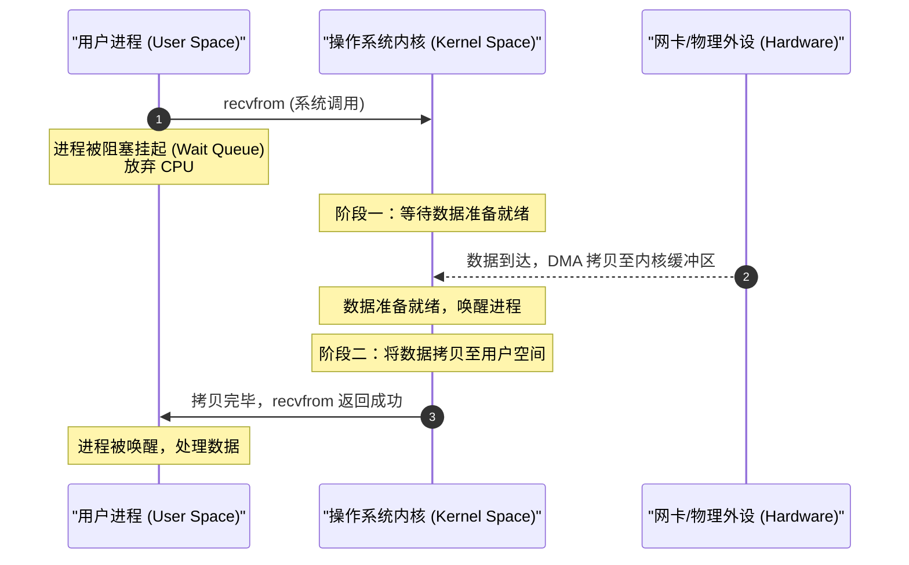
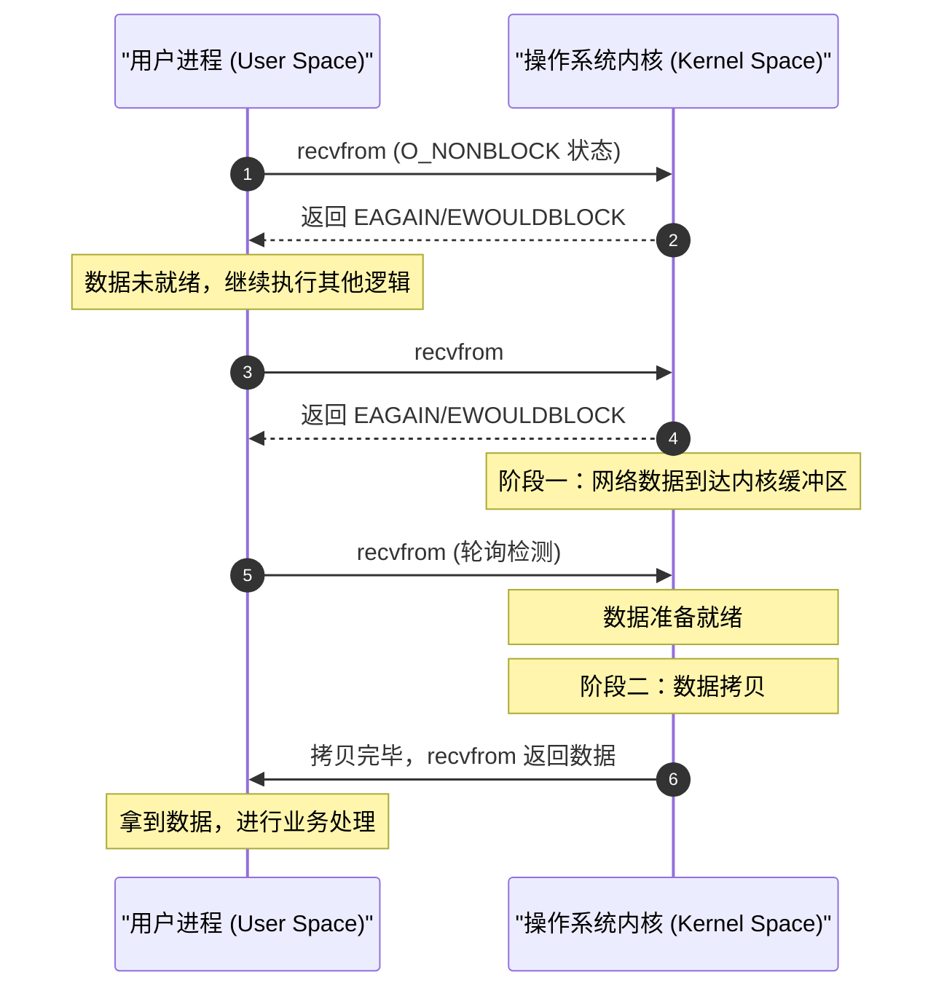
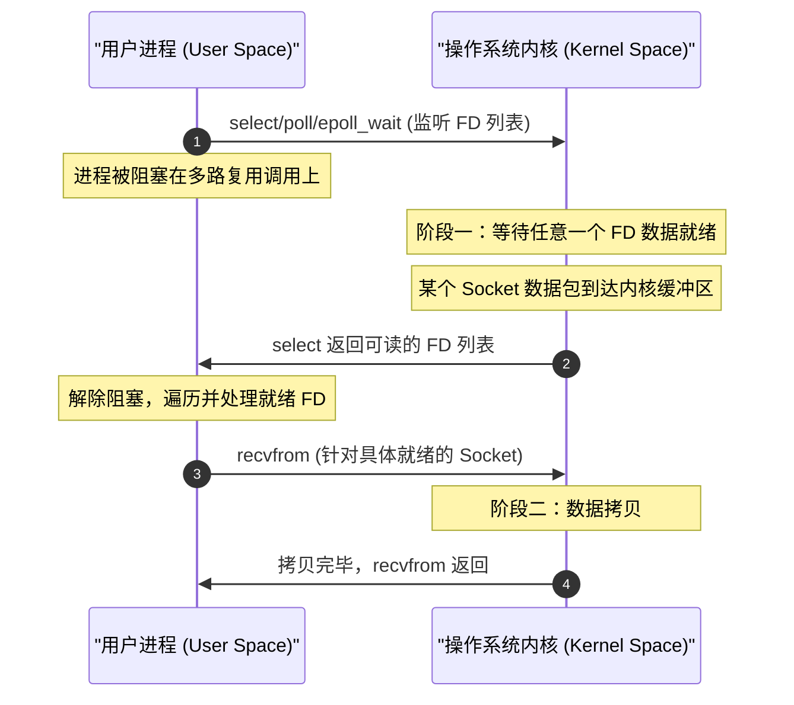
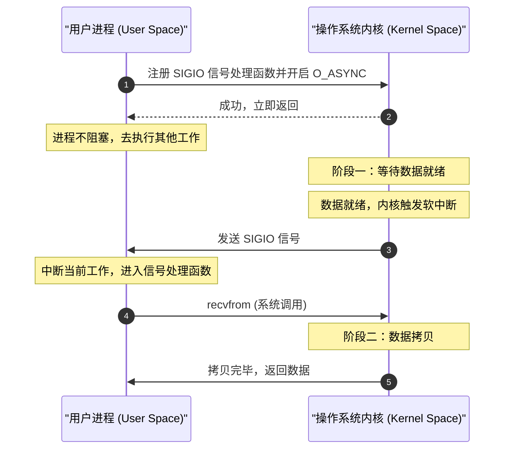
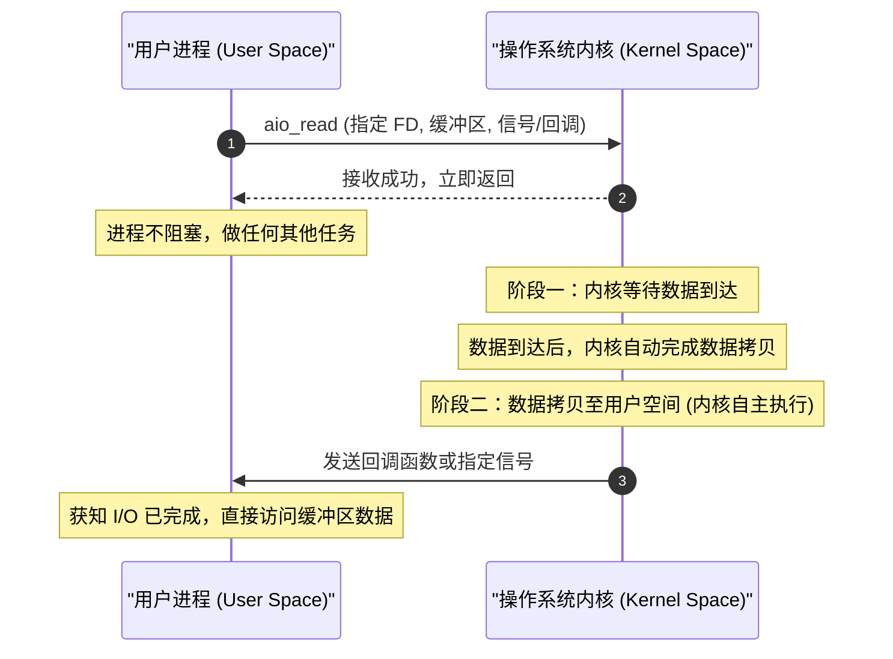

# 1.1.1.8 IO模型

I/O（Input/Output，输入/输出）是计算机系统与外部世界（磁盘、网络、键盘、显示器等）进行数据交互的基石。在当今的互联网高并发背景下，网络 I/O 模型的性能直接决定了整个服务架构的吞吐量与响应延迟。

为了从根本上理解为什么会有各种纷繁复杂的 I/O 模型，以及它们在 Linux 内核层面的具体演进，我们必须跳出单纯的 API 调用，从硬件物理限制、操作系统内核缓冲区、上下文切换开销等微观视角展开，全面剖析 I/O 的本质。

---

## 1. I/O 过程的物理瓶颈与内核缓冲

### 1.1 物理硬件的延迟鸿沟

在现代计算机体系结构中，CPU 拥有极高的运算速度，其寄存器与 L1/L2/L3 缓存的读写延迟均在纳秒（ns）级别。然而，外设（如磁盘、网卡、网线介质）的延迟则处于微秒（$\mu$s）甚至毫秒（ms）级别。

以下是典型硬件操作的时钟周期与时间延迟对比：

| 硬件操作 | 典型延迟时间 | 对应 CPU 时钟周期（以 3GHz 为例） | 数量级差距 |
| :--- | :--- | :--- | :--- |
| **CPU 寄存器读写** | $0.3\text{ ns}$ | $1$ 周期 | 基准 |
| **L1 高速缓存访问** | $1\text{ ns}$ | $3$ 周期 | $3$ 倍 |
| **L2 高速缓存访问** | $4\text{ ns}$ | $12$ 周期 | $12$ 倍 |
| **L3 高速缓存访问** | $15\text{ ns}$ | $45$ 周期 | $45$ 倍 |
| **主内存（DRAM）访问**| $60\text{ ns}$ | $180$ 周期 | $180$ 倍 |
| **固态硬盘（SSD）随机读**| $50\text{ }\mu\text{s}$| $150,000$ 周期 | $1.5 \times 10^5$ 倍 |
| **千兆网络单向延迟（LAN）**| $200\text{ }\mu\text{s}$| $600,000$ 周期 | $6.0 \times 10^5$ 倍 |
| **机械硬盘（HDD）寻道**| $10\text{ ms}$ | $30,000,000$ 周期 | $3.0 \times 10^7$ 倍 |
| **广域网传输（WAN）** | $50\text{ ms}$ | $150,000,000$ 周期 | $1.5 \times 10^8$ 倍 |

这种巨大的硬件速度差异意味着：**如果 CPU 在发起 I/O 请求后一直等待外设响应，绝大多数时钟周期将被白白浪费在空转中。**因此，操作系统的核心任务之一，就是屏蔽物理硬件的这种“极慢”特性，提供高效的抽象模型，使 CPU 能够最大化地处理计算任务。

### 1.2 操作系统的接口抽象：文件描述符（FD）

在 Linux 等类 Unix 操作系统中，贯彻了“一切皆文件”（Everything is a file）的设计哲学。不仅常规文件，就连网络套接字（Socket）、管道（Pipe）、字符设备、块设备等，在内核中都被抽象为**文件（File）**。

用户进程要与这些“文件”交互，必须通过内核分配的一个整数——**文件描述符（File Descriptor, FD）**。

#### FD 的微观对应关系
在进程的内核控制块（`task_struct`）中，包含一个指向文件描述符表（`files_struct`）的指针。该表是一个数组，数组的索引即为 FD，数组的每一项包含一个指向打开文件表项（`struct file`）的指针。而 `struct file` 则保存了该打开文件的各种状态（如读写位置、访问权限、操作函数集 `file_operations`，以及指向底层 inode 的指针）。

```
+--------------------------------------+
| 进程控制块 (task_struct)              |
|   +--------------------------------+ |
|   | 文件描述符表 (files_struct)     | |
|   |   [0] -> stdin                 | |
|   |   [1] -> stdout                | |
|   |   [2] -> stderr                | |
|   |   [3] -> struct file (Socket)  | |
|   +-----------------+--------------+ |
+---------------------|----------------+
                      v
            +-------------------+
            | 打开文件表项 file  |
            |   - f_pos         |
            |   - f_flags       |
            |   - f_op (函数集) |
            |   - f_inode       |
            +-------------------+
```

当程序执行 `read(fd, buf, size)` 时，内核通过该 FD 寻找到具体的 `struct file`，并调用其底层的读函数，从而与具体的物理硬件（网卡驱动或文件系统驱动）对接。

### 1.3 为什么要用内核缓冲区？

用户进程通常不能直接向硬件设备（如网卡、磁盘控制器）发起读写请求，甚至不能直接接触到硬件数据。这主要基于以下设计考量：

1. **内存安全与隔离**：用户进程运行在非特权的用户态（User Space），硬件设备由内核态（Kernel Space）的驱动程序统一调度。如果允许进程直接访问硬件，任何恶意或 Bug 行为都可能导致系统崩溃。
2. **硬件中断的限制**：当网卡收到报文时，触发物理中断，内核的中断处理程序（Interrupt Handler）负责将数据从网卡的 FIFO 缓存移入内存。中断必须极快响应，不能直接等待某个特定的用户进程做好接收准备。
3. **数据吞吐与解耦（页缓存 Page Cache）**：
   - 对于磁盘，内核通过 **Page Cache** 缓冲读写。由于磁盘读写以块（Sector/Block）为单位，如果不进行缓冲，每次几字节的读写都会触发磁盘物理寻道，性能将灾难性下降。页缓存还可以实现“预读”（Read-ahead）和“延迟写”（Write-back）策略。
   - 对于网络，内核为每个套接字分配了 **发送缓冲区（Send Buffer）** 和 **接收缓冲区（Receive Buffer）**。TCP 的滑动窗口（Sliding Window）、流量控制和拥塞控制，都极度依赖这两个缓冲区。

### 1.4 网络 I/O 过程的双阶段模型

网络数据包从发出到被应用程序完全处理，必然经历以下两个关键的物理与逻辑阶段：

#### 第一阶段：数据准备阶段 (Data Preparation Phase)
* **过程**：网络数据包从网线通过网卡（NIC）接收，网卡通过 DMA（Direct Memory Access，直接内存存取）技术将数据包写入主机物理内存中的环形缓冲区（Rx Ring Buffer）。网卡向 CPU 发送硬中断，内核中断处理逻辑触发软件中断（Softirq），协议栈（IP/TCP）对数据包进行校验、解析，并最终把有效载荷（Payload）追加到对应 Socket 的**内核接收缓冲区（Socket Receive Buffer）**中。
* **判定标志**：在这个阶段，系统等待数据到达。当 Socket 的内核接收缓冲区中积累的数据量达到设定的低水位线（Low Water Mark，通常为 1 字节）时，表示数据已准备就绪。

#### 第二阶段：数据拷贝阶段 (Data Copy Phase)
* **过程**：当数据已经在内核接收缓冲区中就绪后，内核需要将数据从**内核空间（Kernel Space）**的套接字缓冲区，拷贝到用户空间中由用户进程指定的**用户空间缓冲区（User Space Buffer）**（例如 `read(fd, buf, len)` 中的 `buf` 指向的地址）。
* **判定标志**：当数据拷贝完成，系统调用返回，用户进程可以安全地访问其局部变量 `buf`，此时该阶段宣告结束。

```
+---------------------------------------------------------------------------------+
|                                 双阶段 I/O 流程                                 |
+---------------------------------------------------------------------------------+

 阶段一：数据准备 (内核态)                       阶段二：数据拷贝 (内核 -> 用户)
+-----------------------+                    +------------------+
| 物理网卡 (NIC)        |                    | 内核接收缓冲区   |
|   |                   |                    | (Socket Buffer)  |
|   | DMA 传输          |                    |        |         |
|   v                   |                    |        |         |
| 主机内存 Ring Buffer  |                    |        | 内核拷贝 |
|   |                   |                    |        v         |
|   | 协议栈解析        |                    | 用户缓冲区       |
|   v                   |                    | (User Buffer)    |
| 内核接收缓冲区        |                    |        |         |
| (Socket Buffer)       |                    |        v         |
|   (数据准备就绪!)     |                    | 应用程序处理     |
+-----------------------+                    +------------------+
```

### 1.5 核心概念厘清：阻塞/非阻塞 与 同步/异步

在讨论具体 I/O 模型前，必须对“阻塞/非阻塞”和“同步/异步”这两对概念进行严谨界定：

1. **阻塞（Blocking） vs 非阻塞（Non-blocking）**
   - **阻塞**：指调用者（用户进程/线程）在调用 I/O 函数后，如果数据尚未准备就绪，**调用者是否会被挂起（放弃 CPU，进入睡眠/等待状态）**。被阻塞的进程会被放入对应等待队列中，直到条件满足，被内核唤醒重新进入就绪队列。
   - **非阻塞**：指调用者在调用 I/O 函数后，如果数据尚未准备就绪，**调用者不会被挂起，而是立即返回一个状态错误码**（如 `EAGAIN` 或 `EWOULDBLOCK`），允许调用者在此期间继续执行其他逻辑。

2. **同步（Synchronous） vs 异步（Asynchronous）**
   - **同步**：指**数据拷贝阶段（第二阶段）必须由调用者自身发起并阻塞参与**。无论是阻塞 I/O，非阻塞 I/O，还是 I/O 多路复用，在真正执行数据从内核拷贝到用户空间的过程中，用户线程都会被阻塞在 `read` 或 `recvfrom` 系统调用上。
   - **异步**：指**数据拷贝阶段由操作系统内核代为完成**。用户进程发起异步调用（例如指定一个缓冲区地址及回调函数）后，内核负责等待数据准备就绪，并直接把数据从内核拷贝到该指定的缓冲区，完毕后再向用户进程发送信号或执行回调。在此全程，用户进程完全不参与拷贝数据的物理动作，也不会在此过程中阻塞。

---

## 2. 五大 I/O 模型的动作流与时序

根据以上双阶段模型的不同表现，POSIX 规范定义了五种经典的 I/O 模型。

### 2.1 阻塞 I/O 模型 (Blocking I/O)

这是最传统的 I/O 模型。在用户进程调用 `recvfrom` 系统调用后，进入内核态。如果内核接收缓冲区中还没有数据，进程便会被剥夺 CPU 时间片，挂起在对应的等待队列中。

当网卡收到数据并经历 DMA、协议栈解析后，数据进入 Socket 缓冲区，内核检测到低水位满足，便唤醒该进程。进程状态由 TASK_INTERRUPTIBLE 转为 TASK_RUNNING。接着，内核将数据从内核接收缓冲区拷贝到用户空间，拷贝完成后 `recvfrom` 返回，进程继续在用户态运行。

#### 时序图 (Mermaid)



#### 优缺点与适用场景
* **优点**：编程模型极其简单，代码逻辑直观。在每个连接对应一个线程的模型（Thread-per-connection）中，开发非常容易。
* **缺点**：高并发场景下，如果需要监听数以万计的连接，需要创建等量线程。由于线程会阻塞在第一阶段，导致系统充斥大量处于休眠状态的线程，极大地浪费了线程栈内存（Linux 默认每个线程栈约 8MB，可以通过 ulimit 调整，但依然极其有限），并带来难以承受的上下文切换（Context Switch）开销。

---

### 2.2 非阻塞 I/O 模型 (Non-blocking I/O)

非阻塞 I/O 模式下，用户进程通过系统调用（如 `fcntl(fd, F_SETFL, O_NONBLOCK)`）将 Socket 设置为非阻塞。当用户进程发起 `recvfrom` 调用时，如果内核缓冲区尚未有数据，内核不会挂起该进程，而是立即返回 `EAGAIN` 或 `EWOULDBLOCK` 错误。

用户进程收到错误码后，可以做其他事情，但为了获取数据，必须不断地再次调用 `recvfrom`。这就是**忙轮询（Busy Polling）**。一旦某次调用时数据已准备就绪，进程在本次调用中依然要等待内核将数据从内核空间拷贝至用户空间（第二阶段同步阻塞），拷贝完成后返回。

#### 时序图 (Mermaid)



#### 优缺点与适用场景
* **优点**：避免了线程在第一阶段因无数据而被挂起，单个线程可以在轮询间隙处理其他任务。
* **缺点**：用户进程需要频繁进行系统调用以轮询状态。每次系统调用都涉及 **用户态-内核态的上下文切换**。如果数据长时间不来，这种无休止的“空转”轮询将消耗巨量的 CPU 资源。

---

### 2.3 I/O 多路复用模型 (I/O Multiplexing)

I/O 多路复用模型又称为事件驱动 I/O（Event-Driven I/O）。它的核心思想是：利用一个专门的系统调用（如 `select`、`poll` 或 `epoll`）来同时监听多个文件描述符（FD）。

用户进程会阻塞在 `select` 调用上，而不是阻塞在具体的 I/O（`recvfrom`）调用上。一旦内核检测到被监听的 FD 列表中有一个或多个 FD 数据就绪，`select` 调用就会返回。此时，用户进程再针对这些就绪的 FD 发起同步的 `recvfrom` 调用，将数据从内核拷贝到用户空间。

#### 时序图 (Mermaid)



#### 优缺点与适用场景
* **优点**：用极少（通常是一个）的线程，就能管理成千上万个网络连接，极大降低了系统线程开销。这是现代高性能网络编程（如 Nginx、Redis、Netty）的绝对基石。
* **缺点**：引入了多路复用器的系统调用，在连接数极少、数据交互频繁的场景下，性能可能反而不如直接的阻塞 I/O，因为多了一次 `select`/`epoll` 的系统调用开销。另外，编程复杂度显著上升。

---

### 2.4 信号驱动 I/O 模型 (Signal-Driven I/O)

信号驱动 I/O 是指用户进程利用内核的信号机制，让内核在数据就绪时主动通知进程。

首先，用户进程需要通过 `fcntl(fd, F_SETOWN, pid)` 将接收信号的进程绑定为自己，并通过 `fcntl(fd, F_SETFL, O_ASYNC)` 开启信号驱动 I/O。然后，为系统信号 `SIGIO` 注册信号处理函数（Signal Handler）。此时，系统调用立即返回，进程继续执行其他业务，第一阶段完全是非阻塞的。

当内核数据准备就绪时，内核会向用户进程发送 `SIGIO` 信号。进程中断当前执行流程，进入注册的信号处理函数，并在函数中发起同步的 `recvfrom` 调用进行数据拷贝（第二阶段依然是同步阻塞的）。

#### 时序图 (Mermaid)



#### 优缺点与适用场景
* **优点**：第一阶段无需阻塞，也无需轮询，被动接收信号通知，效率较高。
* **缺点**：
  * 在高并发、高吞吐的套接字网络 I/O 场景下，`SIGIO` 信号可能会极其频繁，由于信号处理会抢占主线程执行流，导致用户态的信号上下文切换开销急剧增大，系统性能严重退化。
  * `SIGIO` 是一种“非排他”的信号，如果多个 FD 同时产生信号，很难准确区分，需要额外进行非阻塞 `read` 尝试，这增加了编程和调优难度。

---

### 2.5 异步 I/O 模型 (Asynchronous I/O)

异步 I/O 模型（AIO）是真正意义上的异步。用户进程在调用异步读取函数（例如 POSIX 标准的 `aio_read`）时，需要将文件描述符、缓冲区地址、缓冲区大小以及通知方式（如信号或回调）封装进一个控制块（如 `struct aiocb`）传递给内核。

调用发出后立即返回，进程绝不阻塞。

内核接收到请求后，自动启动第一阶段（等待数据就绪）和第二阶段（将数据自动拷贝到用户指定的缓冲区中）。当这一切彻底完成后，内核通过指定的回调函数或信号通知用户进程：**“数据已经原封不动放入你给我的内存缓冲区了，可以直接使用了。”**

#### 时序图 (Mermaid)



#### 优缺点与适用场景
* **优点**：真正的全异步，CPU 利用率最高，两阶段均无阻塞。
* **缺点**：
  * 操作系统内核需要复杂的线程池或硬件支持来实现这种“代拷贝”逻辑。
  * 传统的 Linux AIO（POSIX AIO / Kernel AIO）存在严重的历史局限性，导致其应用范围窄（后文详述）。
  * 编程逻辑属于高度反直觉的“异步回调机制”，在排查崩溃和竞态条件时极为困难。

---

### 2.6 五种 I/O 模型的特征矩阵对比

| 比较维度 | 阻塞 I/O | 非阻塞 I/O | I/O 多路复用 | 信号驱动 I/O | 异步 I/O |
| :--- | :--- | :--- | :--- | :--- | :--- |
| **第一阶段（数据准备）** | 阻塞（等待队列） | 非阻塞（轮询 EAGAIN） | 阻塞在 select/poll 等调用上 | 非阻塞（信号通知） | 非阻塞 |
| **第二阶段（数据拷贝）** | 阻塞（内核->用户） | 阻塞（内核->用户） | 阻塞（内核->用户） | 阻塞（内核->用户） | **非阻塞（内核代劳）** |
| **数据拷贝的执行者** | 用户进程（同步） | 用户进程（同步） | 用户进程（同步） | 用户进程（同步） | **内核空间（异步）** |
| **系统调用次数** | 1 次（读取数据） | 很多次（轮询套接字） | 2 次（多路复用+读取） | 1 次（读取数据） | 1 次（只管发起） |
| **高并发适应性** | 极低（线程膨胀） | 低（CPU 忙轮询空转） | **极高（单线程监听万物）** | 中高（信号风暴瓶颈） | **极高（需要内核高效支持）** |
| **开发调试难度** | 极其简单 | 简单（注意 EAGAIN） | 较复杂（事件驱动循环） | 复杂（信号安全与抢占） | 极其复杂 |

---

## 3. I/O 多路复用演进史：select、poll、epoll

高并发网络服务的技术演进，核心就在于如何高效地实现 **I/O 多路复用**。Linux 下历经了三代方案的演进。

### 3.1 select 的物理痛点与工作机制

`select` 是 POSIX 规定的经典多路复用接口，其核心定义如下：

```c
int select(int nfds, fd_set *readfds, fd_set *writefds, fd_set *exceptfds, struct timeval *timeout);
```

#### fd_set 结构与位图限制
`fd_set` 实质上是一个固定长度的**二进制位图（Bitmap）**。其最大长度由内核宏 `FD_SETSIZE` 限制（在 Linux 系统中默认是 1024）。这意味着一个 `select` 调用最多只能监听 1024 个文件描述符。

#### select 的运行机制与三大开销：
1. **每次调用均需内存拷贝**：由于内核在检测事件时会修改传入的 `fd_set`（置位代表就绪），因此每一次调用 `select` 之前，用户程序必须在用户态重新初始化、设置位图，并将其**完整地从用户空间拷贝到内核空间**。这种频繁的内存拷贝在大规模 FD 场景下非常消耗 CPU。
2. **内核线性扫描的 $O(N)$ 痛点**：内核接到 `fd_set` 后，并不知道哪个描述符有数据，只能采用最原始的**遍历**方式。它遍历 $[0, \text{nfds})$ 范围内的所有 FD，一一调用对应驱动的 `poll` 方法，挂载等待队列，查看是否就绪。如果有就绪的，就把该位保留，否则清零。
3. **用户态的 $O(N)$ 二次线性扫描**：当 `select` 返回大于 0 的整数时，用户进程仅仅被告知“有 FD 就绪了”，但到底哪一个是就绪的，`select` 并未指出。用户进程必须再次以 $O(N)$ 的复杂度**遍历**所有 FD，用 `FD_ISSET` 逐个判断。

```
用户空间                        内核空间
  |                               |
  | -- 1. 拷贝 fd_set 位图 (O(N)) -> |
  |                               | -- 2. 线性遍历所有 FD (O(N))，查看就绪状态
  |                               |    (如果没有就绪，进程挂起)
  |                               |    ...
  |                               |    (当某个 FD 硬件中断触发就绪，唤醒)
  |                               | -- 3. 再次线性遍历所有 FD，修改位图状态
  | <- 4. 返回就绪数量 (O(1)) ------ |
  |                               |
  | -- 5. 再次遍历位图，找出就绪 FD -> | (用户态逻辑)
```

---

### 3.2 poll 的微调与局限性

`poll` 是为了解决 `select` 的一些明显缺陷而提出的，其核心结构如下：

```c
struct pollfd {
    int   fd;         /* file descriptor */
    short events;     /* requested events */
    short revents;    /* returned events */
};

int poll(struct pollfd *fds, nfds_t nfds, int timeout);
```

#### poll 的改进与未解决的痛点
* **改进**：`poll` 舍弃了位图，改用 `pollfd` 结构体数组。它把“要监听的事件 `events`”和“返回的事件 `revents`”分离。因此，下一次调用时，不需要用户程序重新初始化该数组。同时，因为数组可以无限扩展，它**打破了 1024 的 FD 数量限制**。
* **致命缺点**：`poll` 并没有改变 `select` 的底层算法本质。它依然需要把 `pollfd` 数组从用户态拷贝到内核态；内核依然需要 $O(N)$ 遍历所有传入的 FD 驱动；返回后用户态依然需要 $O(N)$ 遍历整个数组来找出活跃的 Socket。在监听数万连接而活跃连接极少时，其性能与 `select` 同样低下。

---

### 3.3 epoll 的革命性设计

为了彻底解决高并发网络服务下的“C10K问题”（单机一万并发），Linux 2.6 内核引入了全新的多路复用方案——`epoll`。

`epoll` 抛弃了传统的“单系统调用传递所有 FD”的设计思路，转而使用**内核常驻的数据结构**，并将其拆分为三个精细化的系统调用。

#### 3.3.1 接口三元组

```c
// 1. 创建一个 epoll 实例的句柄，返回一个代表该实例的 FD。
// size 参数在现代内核中已被忽略，只需大于 0 即可。
int epoll_create(int size);

// 2. 操纵指定的 epoll 实例，对其监听的红黑树进行增、删、改操作。
// op: EPOLL_CTL_ADD (注册), EPOLL_CTL_DEL (删除), EPOLL_CTL_MOD (修改)
int epoll_ctl(int epfd, int op, int fd, struct epoll_event *event);

// 3. 等待事件的产生。将就绪事件填入 events 数组中，返回就绪的事件个数。
// maxevents 限制本次返回的最大事件数，timeout 是超时时间。
int epoll_wait(int epfd, struct epoll_event *events, int maxevents, int timeout);
```

#### 3.3.2 epoll 的两大底层核心数据结构

当用户调用 `epoll_create` 时，内核会在内核空间创建一个 `struct eventpoll` 结构体。该结构体内主要维护了两个至关重要的数据结构：

```c
struct eventpoll {
    ...
    struct rb_root_cached rbr;      /* 红黑树的根节点，存储所有被监听的 fd */
    struct list_head rdllist;       /* 双向就绪链表，存储已经就绪的 fd 对应的 epitem */
    ...
};
```

1. **红黑树（Red-Black Tree - `rbr`）**
   - **作用**：用来存储和管理通过 `epoll_ctl` 注册进来的所有需要监听的文件描述符（封装为 `struct epitem` 节点）。
   - **优势**：红黑树是一棵自平衡的二叉查找树。其查找、插入、删除的时间复杂度均稳定在 $O(\log N)$。当用户执行 `epoll_ctl` 进行增删改时，内核可以极其高效地在内存中定位，防止重复添加。这彻底避免了每次 `select`/`poll` 调用时都将所有 FD 列表从用户态拷贝到内核态的物理开销。
2. **双向就绪链表（Ready List - `rdllist`）**
   - **作用**：用来存储已经有事件发生的（就绪的）`epitem` 结构体节点。
   - **优势**：当用户调用 `epoll_wait` 时，内核不需要去遍历所有的 FD，而是**直接检查这个双向就绪链表是否为空**。如果不为空，则直接拷贝链表中的就绪事件到用户态传入的 `events` 数组中。时间复杂度为 $O(1)$。

#### 3.3.3 事件驱动与内核回调机制

`epoll` 能够实现 $O(1)$ 返回就绪事件的根本原因，在于其核心的**内核回调机制**。

当用户通过 `epoll_ctl(ADD)` 注册一个 FD 到红黑树时，内核不仅会把节点挂载到红黑树，还会向该 FD 对应的底层设备驱动程序（如网卡驱动的 Socket）注册一个**事件回调函数**（在内核中即为 `ep_poll_callback`）。

其底层硬件到软件的触发时序如下：

1. **物理包到达**：网卡收到物理帧，触发硬件中断。
2. **DMA 传输**：网卡将数据包放入物理内存的 Socket 接收队列。
3. **软中断处理**：CPU 执行网络软中断，协议栈解析 TCP 数据包。
4. **触发回调**：当 TCP 协议栈发现某个 Socket 的缓冲区可读时，会唤醒挂载在该 Socket 等待队列上的项。在 `epoll` 机制下，该等待项对应的回调函数是 `ep_poll_callback`。
5. **挂载就绪链表**：`ep_poll_callback` 被触发执行。它将该 Socket 对应的红黑树节点（`struct epitem`）追加到 `eventpoll` 内部的**双向就绪链表（`rdllist`）**中。
6. **唤醒就绪进程**：如果此时有进程正阻塞在 `epoll_wait` 上，内核会立刻唤醒该进程，`epoll_wait` 解除阻塞，返回就绪链表中的数据。

#### epoll 内核架构与事件回调图示 (Mermaid)

```mermaid
graph TD
    subgraph user_space ["用户空间 (User Space)"]
        App[应用程序] -- 1. epoll_ctl (ADD) --> epoll_fd
        App -- 4. epoll_wait --> rdllist_read[读取就绪事件]
    end

    subgraph kernel_space ["内核空间 (Kernel Space)"]
        epoll_fd --> EvPoll[struct eventpoll]
        
        subgraph rbtree_mgr ["红黑树管理 (O(log N))"]
            EvPoll --> RBTree[红黑树 rbr]
            RBTree --> item1[epitem: FD 3 (Socket A)]
            RBTree --> item2[epitem: FD 4 (Socket B)]
            RBTree --> item3[epitem: FD 5 (Socket C)]
        end
        
        subgraph rdllist_mgr ["双向就绪链表 (O(1))"]
            EvPoll --> ReadyList[就绪链表 rdllist]
            ReadyList --> item2
        end

        subgraph device_cb ["设备驱动与回调"]
            SocketA[Socket A] -- 注册回调 --> cb1[ep_poll_callback]
            SocketB[Socket B] -- 注册回调 --> cb2[ep_poll_callback]
            
            NIC[网卡收到数据包] -->|触发中断| ProtocolStack[TCP/IP 协议栈]
            ProtocolStack -->|数据包放入 Socket B 缓冲区| SocketB
            SocketB -->|唤醒等待队列| cb2
            cb2 -->|执行回调: 将 item2 挂入| ReadyList
        end
    end

    rdllist_read <-->|5. 仅拷贝就绪事件 (O(1))| ReadyList
```

---

## 4. 水平触发 (LT) 与边缘触发 (ET) 机制

在 `epoll` 中，有两种非常核心的工作模式：**水平触发（Level Triggered, LT）** 和 **边缘触发（Edge Triggered, ET）**。

### 4.1 水平触发 (Level Triggered - LT)

* **定义与机制**：LT 是 `epoll` 的**默认工作模式**。只要被监听的文件描述符处于“就绪状态”（例如接收缓冲区中有可读数据，或者发送缓冲区有空余空间），每一次调用 `epoll_wait` 都会源源不断地向用户进程返回该 FD。
* **特点**：如果用户进程在收到 FD 就绪的通知后，没有把缓冲区中的数据全部读完（例如只读了部分数据），只要数据依然残留在内核缓冲区中，下一次执行 `epoll_wait` 时，内核仍会再次通知进程该 FD 就绪。
* **物理隐喻**：类似于“只要电压处于高电平，警报就一直响”。

### 4.2 边缘触发 (Edge Triggered - ET)

* **定义与机制**：ET 是 `epoll` 的**高性能工作模式**。它只在文件描述符的状态**发生变化**（即电平发生跳变）时，才通知一次。
* **具体触发时机**：
  1. 新的数据包到达 Socket 接收缓冲区（电平从低到高跳变）。
  2. 缓冲区数据被读取完毕后，又有新数据包到达。
  3. 套接字的发送缓冲区从满状态变成未满状态（可写空间增加）。
* **特点**：当 `epoll_wait` 探测到某 FD 就绪并通知用户后，**无论用户读了多少数据，哪怕只读了 1 个字节，甚至根本没读，内核都不会在下一次调用 `epoll_wait` 时再次通知**，直到下一次有新的数据包到达或者状态再次发生跳变。
* **物理隐喻**：类似于“只有在电压从低电平跳变到高电平的瞬间，警报才响一声”。

### 4.3 ET 模式下的编程实践与误区

由于 ET 模式极高的精简性（减少了系统调用次数），它是追求极致并发的服务器（如 Nginx）的首选。然而，这也对应用层程序员提出了极其苛刻的要求。如果使用不当，极易导致**数据丢失（饥饿）**或**连接挂起（死锁）**。

#### 误区一：在 ET 模式下使用阻塞 I/O
**这属于灾难性设计。** 
在 ET 模式下，由于内核只通知一次，为了把缓冲区中的数据全部读完，程序必须写一个循环不断进行 `read` / `recv`。
如果 Socket 是**阻塞**的，当缓冲区中的数据被全部读完后，下一次 `read` 系统调用就会因为缓冲区空了而**发生阻塞**，从而把当前线程挂起。这导致该线程无法继续执行事件循环，无法处理红黑树上的其他连接，最终引发系统全面死锁。

> [!IMPORTANT]
> **黄金法则一**：在 ET（边缘触发）模式下，所有被监听的文件描述符都**必须设置成非阻塞（Non-blocking）**。

#### 误区二：只读一次数据，未读尽缓冲区
在 LT 模式下，读一次没读完没关系，下次还会通知。但在 ET 模式下，如果不一次性读完，由于下一次 `epoll_wait` 不会再通知，残留的数据就再也没有机会被读取了，除非该 Socket 上又有新的数据到达。这会导致严重的协议报文丢失或响应迟滞。

> [!IMPORTANT]
> **黄金法则二**：在 ET 模式下，每当事件就绪，必须使用循环（`while`）不断调用读操作，直到 `read`/`recv` 返回小于 0 的值，且全局错误码 `errno` 显式等于 `EAGAIN` 或 `EWOULDBLOCK`。这代表内核缓冲区已彻底读空，可以安全退出循环，重新去挂载 `epoll_wait`。

#### 4.3.1 ET 模式下的典型网络编程范式 (C 语言伪代码)

```c
#include <sys/epoll.h>
#include <fcntl.h>
#include <errno.h>
#include <unistd.h>
#include <stdio.h>

// 将文件描述符设置为非阻塞模式
int set_nonblocking(int fd) {
    int flags = fcntl(fd, F_GETFL, 0);
    if (flags == -1) return -1;
    return fcntl(fd, F_SETFL, flags | O_NONBLOCK);
}

// ET 模式下的数据读取核心函数
void handle_read_et(int epoll_fd, int sock_fd) {
    char buf[512];
    while (1) {
        ssize_t bytes_read = recv(sock_fd, buf, sizeof(buf), 0);
        
        if (bytes_read > 0) {
            // 成功读到 bytes_read 字节数据，处理业务逻辑
            process_data(buf, bytes_read);
        } 
        else if (bytes_read == 0) {
            // 客户端主动关闭连接，进行清理
            printf("Connection closed by peer.\n");
            epoll_ctl(epoll_fd, EPOLL_CTL_DEL, sock_fd, NULL);
            close(sock_fd);
            break;
        } 
        else {
            if (errno == EAGAIN || errno == EWOULDBLOCK) {
                // 内核接收缓冲区已全部读空，安全退出循环
                printf("Read buffer empty, returning to event loop.\n");
                break;
            } 
            else if (errno == EINTR) {
                // 被系统中断信号打断，需要重试本次读取
                continue;
            } 
            else {
                // 发生真正的网络读取错误，关闭套接字
                perror("recv error");
                epoll_ctl(epoll_fd, EPOLL_CTL_DEL, sock_fd, NULL);
                close(sock_fd);
                break;
            }
        }
    }
}
```

#### 4.3.2 边缘触发写操作中的 `EPOLLOUT` 事件控制
当向套接字写入大文件时，内核发送缓冲区可能会被写满，此时 `write` 会返回 `EAGAIN`。
1. 在 **LT 模式**下，当写满返回 `EAGAIN` 时，我们需要注册 `EPOLLOUT` 事件。一旦 TCP 发送窗口挪动，缓冲区有剩余空间，`epoll_wait` 就会触发 `EPOLLOUT` 提示我们继续写。写完所有数据后，**必须手动注销 `EPOLLOUT`**，否则只要发送缓冲区有富余，`epoll_wait` 就会无限触发可写通知，造成 CPU 空转。
2. 在 **ET 模式**下，我们依然要先注册 `EPOLLOUT`。由于它是边缘触发，一旦写入直到返回 `EAGAIN`，当缓冲区空闲时，它只会通知一次。这意味着，只要我们在下一次通知中把数据写完了，即使我们不注销 `EPOLLOUT`，它也不会像 LT 那样反复触发。但从代码健壮性和跨平台移植性考虑，写完后注销 `EPOLLOUT` 依然是业界标准规范。

---

## 5. 异步 I/O 现代技术探索

前文所述的 `select`、`poll`、`epoll` 虽然被称为“异步事件驱动”，但在第二阶段“数据拷贝”中，应用程序依然会被阻塞。这并不是纯粹的异步 I/O。

### 5.1 Linux 传统 Native AIO 的局限与物理缺陷

在 Linux 中，早在 2.6 版本就引入了内核级异步 I/O 支持，即 **Linux AIO**（通过系统调用 `io_setup`、`io_submit`、`io_getevents` 等）。然而在过去的十几年中，各大网络库（如 libevent、libuv）均极力避免使用它，原因在于其致命的硬伤：

1. **只支持 `O_DIRECT`（直接无缓冲 I/O）**：
   Linux AIO 强制要求被操作的文件必须以 `O_DIRECT` 标志打开。这意味着所有的读写都会**绕过操作系统的 Page Cache**，直接与磁盘进行物理扇区交互。这对于需要极大利用内存缓存提升性能的通用应用程序是无法接受的。如果文件没有 `O_DIRECT`，`io_submit` 将退化为普通的同步阻塞调用。
2. **不支持网络套接字（Network Socket）**：
   Linux AIO 针对套接字网络读写基本处于不可用状态。它主要是为企业级数据库（如 Oracle DB）在文件系统上的随机裸 I/O 读写设计的，不适合构建高并发的网络 I/O 循环。
3. **系统调用本身依然可能发生阻塞**：
   在某些特定条件下，例如获取文件元数据（Metadata）或者在磁盘分配新块（Block Allocation）时，`io_submit` 在内核内部可能会发生同步等待，这破坏了“完全不阻塞”的承诺。

---

### 5.2 救世主：`io_uring` 的诞生背景

为了彻底解决 Linux 缺乏通用、高效、支持网络套接字的全异步 I/O 架构的窘境，Linux 内核自 5.1 版本引入了由 **Jens Axboe** 领衔设计的全新异步 I/O 框架：**`io_uring`**。

`io_uring` 的设计目标非常明确：
* 统一所有 I/O 操作（无论是网络 Socket、常规文件、还是各类设备驱动，全部支持异步化）。
* 无论何时何地，都绝不发生阻塞。
* **最大化减少甚至消除系统调用（System Call）的物理开销**，避免 CPU 在用户态和内核态之间频繁发生耗时的上下文切换。

---

### 5.3 提交队列 (SQ) 与完成队列 (CQ) 的双环设计

`io_uring` 的核心是一套基于**无锁循环缓冲区（Ring Buffer）**的生产者-消费者架构。

它在内核中创建了两个环形队列，这两个队列的物理内存通过 `mmap` 技术**直接映射**到用户空间和内核空间。这意味着，用户空间和内核空间可以**零拷贝、免系统调用**地共享这两块内存区域。

```
              用户空间 (User Space)                     内核空间 (Kernel Space)
      +-----------------------------------+     +-----------------------------------+
      | 提交队列 (SQ)                     |     | 提交队列 (SQ)                     |
      | +-------------------------------+ |     | +-------------------------------+ |
      | | sqe1 | sqe2 | sqe3 | ...      | |     | | sqe1 | sqe2 | sqe3 | ...      | |
      | +-------------------------------+ |     | +-------------------------------+ |
      |     | (写入/生产)                 |     |     | (读取/消费)                 |
      +-----|-----------------------------+     +-----|-----------------------------+
            |                                         |
            |                 共享内存 (mmap)          |
            +=========================================+
            |                                         |
      +-----|-----------------------------+     +-----|-----------------------------+
      | 完成队列 (CQ)                     |     | 完成队列 (CQ)                     |
      | +-------------------------------+ |     | +-------------------------------+ |
      | | cqe1 | cqe2 | cqe3 | ...      | |     | | cqe1 | cqe2 | cqe3 | ...      | |
      | +-------------------------------+ |     | +-------------------------------+ |
      |     ^ (读取/消费)                 |     |     ^ (写入/生产)                 |
      +-----+-----------------------------+     +-----+-----------------------------+
```

1. **提交队列 (Submission Queue, SQ)**
   - **数据单元**：提交队列项 `io_uring_sqe` (Submission Queue Entry)。它描述了具体的 I/O 请求（如：读哪个 FD、读到哪个用户内存、偏移量是多少、操作码是什么，例如 `IORING_OP_READV`）。
   - **角色关系**：**用户进程是生产者**（往 SQ 写入 SQE 并移动头部指针），**内核是消费者**（从 SQ 读取 SQE 并执行对应的物理 I/O）。
2. **完成队列 (Completion Queue, CQ)**
   - **数据单元**：完成队列项 `io_uring_cqe` (Completion Queue Entry)。它包含了 I/O 的执行结果（如：成功读取了多少字节、或者负数错误码）。
   - **角色关系**：**内核是生产者**（完成 I/O 后，往 CQ 写入 CQE 并移动头部指针），**用户进程是消费者**（从 CQ 读取 CQE 并处理结果）。

#### 双环的无锁操作设计
为了防止用户态与内核态在读写这两个队列指针时产生竞态冲突，`io_uring` 巧妙地设计了内存屏障（Memory Barrier）和头尾指针隔离。
* 对于 SQ，用户态更新 `tail` 指针，内核态更新 `head` 指针。
* 对于 CQ，内核态更新 `tail` 指针，用户态更新 `head` 指针。
利用无锁环形队列，双方仅需通过简单的原子变量读写，即可安全传递 I/O 任务。

---

### 5.4 `io_uring` 的零系统调用（Zero Syscall）高吞吐原理

传统的 I/O 模型，每一次读写操作都要发起一次 `read`/`write` 系统调用。即使是 `epoll`，也需要先 `epoll_wait`，再发起具体 FD 的读写，这就至少发生了 **2 次系统调用**。

系统调用涉及 CPU 寄存器保存、页表切换（在熔断/幽灵漏洞补丁 KPTI 开启后开销尤为高昂），大约需要数百纳秒。在高并发每秒百万次请求的场景下，这会白白烧掉大量的 CPU 资源。

`io_uring` 提出了三种运行模式，完美地解决了这一物理开销：

#### 1. 默认中断模式 (Interrupt Driven)
用户进程将多个 `sqe` 写入 SQ，然后执行一次 `io_uring_enter` 系统调用。内核接收到该调用后，一次性消费 SQ 中积压的所有任务。相比普通 I/O，它能够将几十个 I/O 系统调用**合并为单个系统调用**，大幅降低了上下文切换频率。

#### 2. 轮询模式 (Poll Mode)
针对高硬件性能的 NVMe 闪存设备，内核不采用中断通知，而是由内核线程直接在硬件驱动层对设备完成状态进行 Polling 轮询。这适用于对延迟有极致要求的场景。

#### 3. 内核线程轮询模式 (SQPOLL 模式) - **零系统调用**
这是 `io_uring` 最具革命性的运行模式。
当初始化 `io_uring` 时，传入 `IORING_SETUP_SQPOLL` 标志。
1. 内核会在后台启动一个名为 `io_uring-sq` 的**内核守护线程**。
2. 该内核线程会一直以极高的频率**轮询**共享内存中 SQ 的尾指针。
3. 当用户进程需要发起 I/O 时，它只需把 `sqe` 直接写入共享内存中的 SQ 队列，并更新尾指针。
4. 后台内核线程立刻检测到尾指针的变化，自动从共享内存中取出任务并分发执行，根本不需要用户进程调用 `io_uring_enter`。
5. 任务执行完成后，内核线程将结果填入 CQ。用户进程只需要在用户态轮询 CQ 队列，即可拿到数据。

> [!TIP]
> **在 SQPOLL 模式下，只要有源源不断的数据收发，用户进程从头到尾都在用户态操作内存队列，不需要执行任何一次系统调用（Syscall），即可驱动整个硬件完成成千上万次全异步 I/O。这是真正意义上的“零系统调用（Zero Syscall）”高并发模型。**

---

### 5.5 三代 I/O 多路复用与现代异步 I/O 对比总结

最后，我们通过对比多路复用演进史与现代异步 I/O 技术，展示在系统架构上的深层区别：

| 技术方案 | Linux 引入版本 | 底层数据结构 | 事件获取复杂度 | 是否需要用户与内核重复拷贝 FD | 是否需要系统调用执行读取/写入 | 异步化程度 |
| :--- | :--- | :--- | :--- | :--- | :--- | :--- |
| **`select`** | 2.0 之前 | 二进制位图 (fd_set) | $O(N)$ 线性遍历 | 是（每次调用都要拷贝整个位图） | 是 (同步 `read`/`recv`) | 同步阻塞 |
| **`poll`** | 2.1.23 | 结构体链表/数组 | $O(N)$ 线性遍历 | 是（每次调用都要拷贝数组） | 是 (同步 `read`/`recv`) | 同步阻塞 |
| **`epoll`** | 2.6 | 红黑树 + 双向链表 | $O(1)$ 直接读取就绪链表 | **否（红黑树保留在内核中）** | 是 (同步 `read`/`recv` 拷贝数据) | 同步阻塞（事件驱动） |
| **`io_uring`**| 5.1 | SQ/CQ 双环共享内存 | $O(1)$ 直接读取 CQ | **否（用户态/内核态共享内存）** | **否（内核在后台自动拷贝，支持 SQPOLL 零系统调用）**| **真正异步（AIO）** |

---

## 6. 总结

从阻塞 I/O 的“线程换并发”，到非阻塞 I/O 的“忙轮询”，再到 I/O 多路复用（`select`/`poll`/`epoll`）的“事件驱动”，操作系统的发展过程就是不断尝试让 CPU 摆脱外设低速瓶颈的过程。

* `epoll` 的红黑树与就绪链表配合内核回调，使多路复用性能达到 $O(1)$，成为过去十五年高并发网络架构统治级的内核利器。
* 水平触发 (LT) 和边缘触发 (ET) 为应用层提供了编程便利度与性能的权衡点，要求开发者对非阻塞 I/O 的物理状态有极高精度的掌控。
* 新一代 `io_uring` 则通过双环无锁共享内存（SQ/CQ）及内核轮询线程（SQPOLL），彻底打破了同步拷贝的束缚与系统调用的物理屏障，标志着 Linux 异步 I/O 时代迈入真正的零拷贝与零系统调用新纪元。

