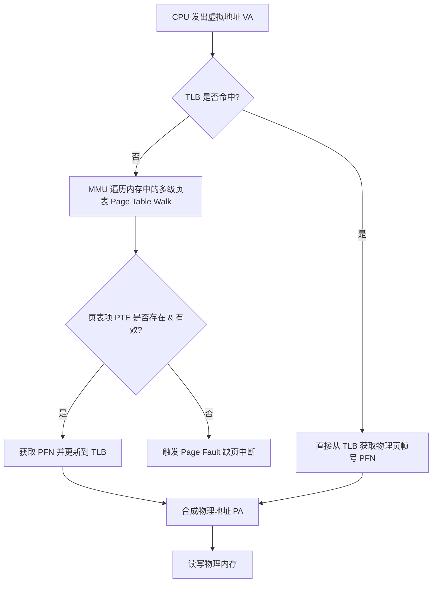
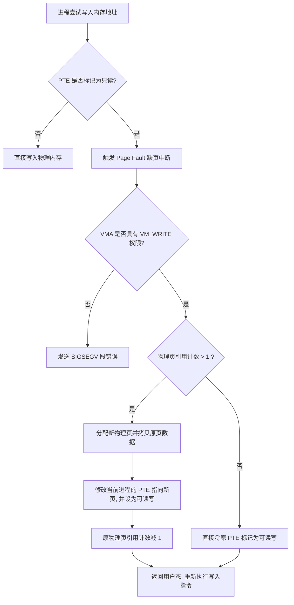
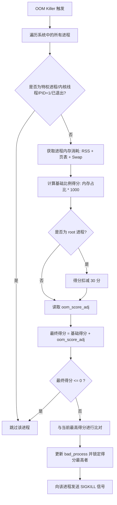

# Linux 内存管理架构与底层实现原理

Linux 内存管理是现代操作系统中最复杂、最核心的子系统之一。它负责协调硬件（CPU、MMU、物理内存、外部存储）与软件（用户态进程、内核子系统），以极高的吞吐量和极低的延迟提供内存分配、保护、共享和回收功能。本文将从底层的硬软件协同出发，深度剖析 Linux 内存管理的虚拟地址空间布局、`mmap` 机制的底层实现、匿名映射与文件映射的差异及反向映射设计，最后分析内核在面临物理内存耗尽时的 OOM (Out Of Memory) 机制和近年的演进。

---

## 1. 虚拟地址空间布局与划分

虚拟内存是现代操作系统的基石，它通过引入一个间接层，解耦了进程所看到的内存地址与实际的物理内存地址。

### 1.1 虚拟内存的引入与软硬件协同

在早期的实模式系统中，多任务并发面临严重的地址冲突和安全隐患：一个进程可以直接读写另一个进程的物理内存，甚至篡改内核的数据。此外，由于物理内存的碎片化，大程序经常因为找不到连续的物理内存而无法启动。

虚拟内存的引入解决了以下三大核心问题：
1. **地址空间隔离**：每个进程都拥有独立、连续且完整的虚拟地址空间，进程之间无法非法访问彼此的内存，保证了系统的安全性。
2. **内存保护**：通过页表项（Page Table Entry, PTE）的权限控制位（如只读、只写、可执行、禁止用户态访问等），在硬件级阻止了非法操作。
3. **超额分配与惰性加载**：进程申请的内存大小可以远超系统实际拥有的物理内存。内核采用“按需分配”和“延迟加载”的策略，只有在进程真正读写这片内存并触发缺页中断时，才分配物理页。

这一机制的实现依赖于**软件（内核）**与**硬件（CPU 中的 MMU 与 TLB）**的高效协同：
- **页表（Page Table）**：存放在物理内存中，记录了虚拟页号（Virtual Page Number, VPN）到物理页帧号（Physical Frame Number, PFN）的映射关系。
- **内存管理单元（MMU）**：CPU 内部的硬件单元。当 CPU 执行一条读写内存的机器指令时，MMU 会截获虚拟地址，并在硬件级自动检索页表，将其转换为物理地址。
- **旁路转换缓冲（TLB）**：由于页表存储在内存中，每次 MMU 检索页表（Page Table Walk）都需要多次访问物理内存，性能开销极大。TLB 作为 CPU 内部的高速缓存（快表），保存了最近转换过的虚拟页到物理页的映射关系。当 TLB 命中时，地址转换可在 1 个 CPU 时钟周期内完成；只有当 TLB 缺失（Miss）时，MMU 才会去遍历多级页表，并将新映射缓存到 TLB 中。



---

### 1.2 32位虚拟地址空间布局

在 32 位系统下，CPU 的寻址线为 32 根，最大寻址空间为 $2^{32}$ 字节，即 4GB。Linux 默认采用 **3:1 划分模式**，将这 4GB 的虚拟地址空间划分为两部分：

- **用户空间（User Space）**：`0x00000000` 至 `0xBFFFFFFF`（共 3GB）。每个进程都拥有自己独立的用户空间，在进程切换时，其对应的页表基地址（CR3 寄存器）会被更新。
- **内核空间（Kernel Space）**：`0xC0000000` 至 `0xFFFFFFFF`（共 1GB）。所有进程共享同一个内核空间，该空间对应的页表项在进程切换时保持一致。

#### 1.2.1 用户空间细分布局
用户空间自下而上（由低地址向高地址）通常划分为以下几个区域：
1. **代码段（Text Segment）**：存放编译后的可执行机器指令，通常是只读的，防止程序意外修改自身代码。
2. **数据段（Data Segment）**：存放已经初始化的全局变量和静态变量。
3. **BSS 段（Block Started by Symbol）**：存放未初始化的全局变量和静态变量，在进程启动时由内核统一清零。
4. **堆（Heap）**：用于动态内存分配。自低地址向高地址生长，由 `brk` 或 `sbrk` 系统调用控制其边界（Program Break）。
5. **内存映射区（Memory Mapping Segment）**：用于加载动态链接库（.so），以及存放通过 `mmap` 系统调用申请的匿名或文件映射区域。在经典布局中，该区域自高地址向低地址生长。
6. **栈（Stack）**：存放函数调用栈、局部变量、函数参数以及返回地址。自高地址向低地址生长，通常有最大容量限制（默认 8MB）。
7. **命令行参数与环境变量（Arguments & Environments）**：存放启动进程时传入的参数和全局环境变量。

#### 1.2.2 内核空间细分布局（以 32 位 x86 为例）
在 32 位模式下，内核空间仅有 1GB 的虚拟地址。如果系统物理内存大于 1GB（例如 4GB），由于内核空间虚拟地址的局限，内核将无法直接映射和访问这 1GB 之外的物理内存。为了解决这一问题，Linux 32 位内核将这 1GB 虚拟地址进行了精细的划分：

- **直接内存映射区（Direct Map Zone / Lowmem）**：大小为 896MB（`0xC0000000` 至 `0xF7FEFFFF`）。此区域的虚拟地址与物理内存的前 896MB 存在固定的线性偏移关系，即：
  $$\text{Physical Address} = \text{Virtual Address} - 0\text{xC}0000000$$
  因为映射是线性的，内核在这个区域分配物理内存（如通过 `kmalloc`）极其高效，不需要修改页表，只需直接计算地址。
- **高端内存区（High Memory / Highmem）**：大小为 128MB（`0xF8000000` 至 `0xFFFFFFFF`）。当系统物理内存大于 896MB 时，超出部分被称为高端内存，内核无法直接通过线性映射访问它们，必须通过这 128MB 的虚拟“窗口”进行动态、非线性的映射。高端内存区又被细分为三个部分：
  1. **非连续内存分配区（Vmalloc Zone）**：用于 `vmalloc` 系统调用。它在虚拟地址空间上是连续的，但在物理内存上可以是不连续的。内核通过修改页表，将离散的物理页帧拼凑到这一虚拟区间中。
  2. **永久内核映射区（Persistent Kernel Mappings / PKMAP）**：用于将高端物理内存页长期映射到内核空间。使用 `kmap` 函数进行映射，如果当前没有空闲的页表项，该函数可能会引起进程睡眠。
  3. **固定映射区（Fix-mapped Mappings / FIXMAP）**：这是一组特殊的虚拟地址，其对应的物理地址在编译时是未知的，但在运行时可以被临时指向任意的物理地址（例如通过 `kmap_atomic`）。因为映射是原子操作且不需要睡眠，它适用于中断处理程序等对时间敏感的上下文。

#### 1.2.3 32位模式的局限性
在 32 位系统下，128MB 的高端内存映射窗口是极大的瓶颈。当系统物理内存高达 64GB（通过 PAE 物理地址扩展技术）时，内核为了管理如此庞大的物理页，需要消耗大量的 `struct page` 描述符，而这些描述符必须存放在内核空间的 Lowmem 区域，这会导致 Lowmem 迅速枯竭，系统即使有大量空闲物理内存，也会因为内核虚拟空间不足而崩溃。

```
+-----------------------------------+ 0xFFFFFFFF (4GB)
| 固定映射区 (FIXMAP)                |
+-----------------------------------+
| 永久内核映射区 (PKMAP)             |  128MB 高端内存映射窗口
+-----------------------------------+
| 非连续内存分配区 (VMALLOC)          |
+-----------------------------------+ 0xF8000000
| 直接内存映射区 (Lowmem, 896MB)    |  线性物理映射 (0 ~ 896MB 物理内存)
+-----------------------------------+ 0xC0000000 (3GB)
| 栈 (Stack, 向下生长)              |
+-----------------------------------+
|          ↓↓↓ 增长                 |
|                                   |
| 内存映射区 (mmap, 共享库)           |
|                                   |
|          ↑↑↑ 增长                 |
+-----------------------------------+
| 堆 (Heap, 向上生长)               |
+-----------------------------------+
| BSS 段                            |
+-----------------------------------+
| 数据段 (Data)                      |
+-----------------------------------+
| 代码段 (Text)                      |
+-----------------------------------+ 0x00000000
```

---

### 1.3 64位虚拟地址空间布局

在 64 位系统下，虽然指针宽度为 64 位，但实际上目前的 CPU 硬件并没有实现完整的 64 位寻址（因为 $2^{64}$ 字节即 16EB 的地址空间在可预见的时期内根本无法被物理硬件填满，且维护如此巨大的页表会带来无法承受的内存消耗和硬件成本）。目前主流的 x86-64 架构和 ARM64 架构普遍采用 **48 位（4 级页表）**或 **57 位（5 级页表）**寻址。

#### 1.3.1 Canonical Address 规范与地址空洞

以 48 位寻址为例，有效的虚拟地址只有低 48 位。为了防止软件随意使用高 16 位而导致未来硬件升级时的兼容性问题，CPU 硬件引入了 **Canonical Address 规范**：
> **虚拟地址的第 47 位（从 0 开始计数）必须与第 48 位至第 63 位的值完全相同。**

这意味着，合法的虚拟地址被划分为两个对称的区间：
1. **用户空间地址（低区）**：第 47 位为 0，因此第 48 至 63 位也必须全为 0。地址范围是：
   `0x0000000000000000` 至 `0x00007FFFFFFFFFFF`（共 128TB）。
2. **内核空间地址（高区）**：第 47 位为 1，因此第 48 至 63 位也必须全为 1。地址范围是：
   `0xFFFF800000000000` 至 `0xFFFFFFFFFFFFFFFF`（共 128TB）。
3. **地址空洞（Canonical Hole / Non-canonical Space）**：
   位于 `0x0000800000000000` 至 `0xFFFF7FFFFFFFFFFF` 之间的这一大片空间是未定义的非法区域。如果进程尝试读写该区域的地址，CPU 会直接触发硬件级通用保护异常（#GP）。

#### 1.3.2 64位内核空间布局
由于 64 位内核空间拥有极其庞大的 128TB 空间，32 位时代的“高端内存（Highmem）”概念被彻底废弃。内核可以直接将系统所有的物理内存线性映射到内核虚拟地址空间中。以下是典型的 x86-64（48位寻址）Linux 内核空间布局：

- **物理内存直接映射区（Direct Map / PAGE_OFFSET）**：通常起始于 `0xffff888000000000`，大小为 64TB。所有的物理内存直接线性映射到这里，即：
  $$\text{Virtual Address} = \text{Physical Address} + 0\text{xffff}888000000000$$
  即使系统有数 TB 的物理内存，也能在内核空间一览无遗，且分配物理内存时只需简单的偏移计算即可获得其内核虚拟地址。
- **VMALLOC 映射区**：大小为 32TB，起始于 `0xffffc90000000000`。用于 `vmalloc` 分配，以及映射非连续的 I/O 设备物理空间。
- **VMEMMAP 区域**：大小为 1TB，起始于 `0xffffe90000000000`。由于系统物理页数量庞大，内核需要一个连续的虚拟地址区间来存放所有物理页的描述符 `struct page` 数组。vmemmap 区域就是这个数组的虚拟映射区，极大地加速了通过物理页帧号（PFN）查询其对应的 `struct page` 结构。
- **内核代码段/数据段映射区**：起始于 `0xffffffff80000000`，大小为 512MB。内核本身的 ELF 镜像（代码、初始化数据、BSS 等）被映射在此处。
- **内核模块区（Modules）**：起始于 `0xffffffffa0000000`，大小约为 1.5GB。用于动态加载的内核驱动模块所占用的空间。

#### 1.3.3 页表级数演进与多级页表寻址
随着内存容量的暴增，单级甚至双级页表已无法满足寻址要求。若采用单级页表，在 48 位寻址下，每个页大小为 4KB（$2^{12}$ 字节），则有 $2^{36}$ 个页。每个页表项（PTE）占用 8 字节，那么单级页表就需要 $2^{36} \times 8 = 512\text{GB}$ 的连续物理内存来存放页表本身。这显然是不可接受的。

为了解决这个问题，Linux 引入了多级页表机制，使得页表可以在物理内存中离散存放，并且只有当前已被映射的虚拟地址才需要建立对应的下级页表（稀疏内存表示）。在 48 位寻址下，Linux 采用 **四级页表（Four-Level Page Table）**：

1. **PGD（Page Global Directory，全局页目录）**：虚拟地址的第 47-39 位（9位），用于索引 PGD 中的 512 个表项。每个 PGD 表项指向一个 PUD。
2. **PUD（Page Upper Directory，上级页目录）**：第 38-30 位（9位），索引 PUD 中的 512 个表项。每个 PUD 表项指向一个 PMD。
3. **PMD（Page Middle Directory，中间页目录）**：第 29-21 位（9位），索引 PMD 中的 512 个表项。每个 PMD 表项指向一个 PTE 页表。
4. **PTE（Page Table Entry，页表项）**：第 20-12 位（9位），索引 PTE 页表中的 512 个页表项。每个 PTE 表项包含物理页帧号（PFN）以及读写控制、用户/内核权限、Dirty 位、Accessed 位等状态标志。
5. **Offset（页内偏移）**：最低 12 位（12位），对应 4KB 页内的偏移量。

```
48位虚拟地址结构：
 63          47      38      29      20      11       0
+----------+-------+-------+-------+-------+----------+
| Sign Ext |  PGD  |  PUD  |  PMD  |  PTE  |  Offset  |
+----------+-------+-------+-------+-------+----------+
             9 bits  9 bits  9 bits  9 bits   12 bits
```

多级页表在地址转换中的位移和屏蔽计算逻辑如下（以 x86-64 架构下，位移常量的内核定义为例）：

```c
#define PAGE_SHIFT      12
#define PMD_SHIFT       21
#define PUD_SHIFT       30
#define PGD_SHIFT       39
#define PTRS_PER_PTE    512
#define PTRS_PER_PMD    512
#define PTRS_PER_PUD    512
#define PTRS_PER_PGD    512

/* 从虚拟地址获取各级页表索引的计算公式 */
unsigned long pgd_index(unsigned long vaddr) {
    return (vaddr >> PGD_SHIFT) & (PTRS_PER_PGD - 1);
}
unsigned long pud_index(unsigned long vaddr) {
    return (vaddr >> PUD_SHIFT) & (PTRS_PER_PUD - 1);
}
unsigned long pmd_index(unsigned long vaddr) {
    return (vaddr >> PMD_SHIFT) & (PTRS_PER_PMD - 1);
}
unsigned long pte_index(unsigned long vaddr) {
    return (vaddr >> PAGE_SHIFT) & (PTRS_PER_PTE - 1);
}
unsigned long page_offset(unsigned long vaddr) {
    return vaddr & ~PAGE_MASK; // PAGE_MASK = ~0xFFFUL
}
```

##### 5级页表与大页（Huge Pages）优化
- **五级页表**：为了支持更大的物理内存（数 PB），Linux 4.14 引入了五级页表，在 PGD 和 PUD 之间增加了一层 **P4D**。虚拟地址有效位扩展到 57 位（9 + 9 + 9 + 9 + 9 + 12）。
- **大页（Huge Pages / HugeTLB）**：多级页表虽然节省了空间，但增加了地址转换的开销（Page Table Walk 此时需要 4 或 5 次内存访问）。为了优化这一性能，内核支持 2MB 甚至 1GB 的大页。对于 2MB 大页，内核直接跳过 PTE 级页表，让 PMD 表项直接指向一个 2MB 的连续物理页。这不仅减少了一级页表查询，而且一个 TLB 条目可以覆盖 2MB 内存，极大提升了 TLB 命中率，常用于数据库和高性能计算场景。

---

## 2. mmap 机制深度剖析

`mmap` 是 Linux 中极其高效的内存管理机制。它打破了传统文件 I/O 必须通过“用户空间-内核空间”双缓冲区拷贝的限制，将存储介质上的数据与进程虚拟地址空间直接进行了绑定。

### 2.1 虚拟内存区域：`vm_area_struct` (VMA)

在内核中，进程的虚拟地址空间是由 `mm_struct`（内存描述符）结构体管理的。该结构体内部维护了进程所有的虚拟内存区域（VMA），每个区域对应一个 `struct vm_area_struct` 结构体：

```c
struct vm_area_struct {
    unsigned long vm_start;         /* 区域的起始虚拟地址 */
    unsigned long vm_end;           /* 区域的结束虚拟地址 */
    struct vm_area_struct *vm_next; /* 进程 VMA 链表的下一个节点 */
    struct vm_area_struct *vm_prev; /* 进程 VMA 链表的前一个节点 */
    struct rb_node vm_rb;           /* 红黑树节点，用于快速检索 */
    
    struct mm_struct *vm_mm;        /* 指向进程的内存描述符 */
    pgprot_t vm_page_prot;          /* 页表项保护权限位 */
    unsigned long vm_flags;         /* VMA 属性标志，如 VM_READ, VM_WRITE, VM_SHARED */

    /* 用于关联文件映射的结构 */
    struct {
        struct rb_node rb;
        unsigned long rb_subtree_last;
    } shared;
    
    struct list_head anon_vma_chain; /* 匿名反向映射的链表头 */
    struct anon_vma *anon_vma;       /* 指向匿名反向映射结构 */

    const struct vm_operations_struct *vm_ops; /* 该 VMA 的操作函数集 */
    unsigned long vm_pgoff;         /* 映射文件在文件中的偏移量 (以页为单位) */
    struct file *vm_file;           /* 指向被映射的文件结构体 */
    void *vm_private_data;          /* 私有数据 */
} ____cacheline_aligned;
```

#### VMA 的组织方式
1. **双向链表**：进程的所有 VMA 按照虚拟地址从小到大的顺序通过 `vm_next` 和 `vm_prev` 连接。这方便了内核遍历所有虚拟内存区（例如统计内存使用、打印 `/proc/[pid]/maps`）。但当进程拥有成千上万个 VMA 时，链表检索的复杂度退化为 $O(N)$。
2. **红黑树**：为了解决检索效率问题，内核将同一个进程的所有 VMA 同时插入到一棵以虚拟地址区间为键值的红黑树中。这使得在海量 VMA 中检索某个特定虚拟地址所在的区域时，复杂度降低到了 $O(\log N)$。

#### VMA 的合并与分裂逻辑
- **合并（`vma_merge`）**：当进程多次调用 `mmap` 申请相邻的虚拟地址空间，且它们的属性（访问权限 `vm_flags`、映射文件 `vm_file`、文件偏移等）完全一致时，内核并不会创建多个 `vm_area_struct`，而是通过 `vma_merge()` 将新区域与相邻的旧区域合并为一个，从而降低红黑树的高度，节省内存。
- **分裂（`split_vma`）**：如果用户调用 `mprotect()` 修改了某个大 VMA 内部的一小块区域的权限，或者调用 `munmap()` 释放了其中一部分，内核就会执行 VMA 分裂，将一个 VMA 拆分为三个独立的 VMA。如果因为系统内存极度匮乏而无法为分裂出来的 VMA 分配 `vm_area_struct` 结构体，该系统调用将会失败并返回 `ENOMEM`。

---

### 2.2 mmap 映射过程的底层实现

调用 `mmap` 系统调用时，内核并不会立即将磁盘文件读入物理内存，也不会在页表中建立映射。这是一个纯粹的“惰性装载”过程，其底层实现可以分为以下三个步骤：

```c
void *mmap(void *addr, size_t length, int prot, int flags, int fd, off_t offset);
```

#### 步骤一：寻找虚拟地址空间空闲区
系统调用进入内核后，调用 `sys_mmap()` 并最终执行 `do_mmap()`。内核通过 `get_unmapped_area()` 函数在当前进程的虚拟地址空间中寻找一块满足长度要求且未被映射的空闲区间。如果用户传入了指定的 `addr`，内核会校验其是否合法及是否重叠，否则由内核根据底层的布局策略自动分配。

#### 步骤二：创建并初始化 VMA
内核从 slab 缓存中分配一个新的 `vm_area_struct` 结构，并配置其成员属性：
- `vm_start` 和 `vm_end` 标记申请的虚拟地址范围。
- `vm_flags` 初始化为相应的读写保护标志（如 `VM_READ`、`VM_WRITE`、`VM_SHARED`）。
- `vm_file` 增加对目标文件描述符的引用计数，并指向对应的 `struct file`。
- `vm_pgoff` 记下文件内的页偏移。

#### 步骤三：建立文件与 VMA 的绑定
内核调用该文件所属文件系统的 `mmap` 虚函数：`file->f_op->mmap(file, vma)`（对于大多数通用文件系统，这会调用到内核提供的 `generic_file_mmap`）。
该函数的主要任务是将该 VMA 的操作函数集 `vm_ops` 替换为特定文件系统的操作集（如 ext4 文件系统的 `ext4_file_vm_ops`）。这些操作集中包含了处理缺页中断的关键回调函数 `fault`。

完成上述步骤后，`mmap` 宣告成功并返回进程虚拟空间的起始地址。**此时页表中对应的页表项（PTE）全部为空，物理内存也未发生分配，磁盘数据更未加载。**

---

### 2.3 缺页中断（Page Fault）处理流程

当 `mmap` 返回后，进程第一次尝试访问这片虚拟内存（例如发起读操作），CPU 会在地址转换时发现对应的页表项（PTE）的 Present 位为 0，这会立即触发一个 **Page Fault 缺页异常**。

以下是内核处理该异常的详尽流程：

1. **硬件捕获与异常分流**：
   CPU 捕获到缺页异常，将引起异常的虚拟地址写入控制寄存器 `CR2`（在 x86 架构下），并将当前寄存器上下文保存到内核栈中。控制权转移至内核异常入口 `do_page_fault()`。
2. **定位 VMA 并校验权限**：
   `do_page_fault()` 调用 `find_vma()` 在当前进程的红黑树中查找包含该异常地址的 `vm_area_struct`。
   - 如果找不到对应的 VMA，或者异常地址不在 VMA 范围内，说明进程访问了野指针，内核向其发送 `SIGSEGV` 信号（段错误）。
   - 如果找到了 VMA，但引发异常的操作（读/写/执行）超出了该 VMA 的保护属性（例如尝试向只读区域写入），同样发送 `SIGSEGV`。
3. **调用核心缺页处理函数**：
   通过校验后，内核调用 `handle_mm_fault()`。它会检查并逐级分配页表（PGD -> PUD -> PMD）。如果中间的目录项不存在，内核会分配合适的物理页作为下级页表填入。最终，内核定位到叶子页表项（PTE）。
4. **触发 `handle_pte_fault()`**：
   内核检测 PTE 的状态，根据不同的状态分流处理：
   - **匿名页缺页**：PTE 为空且无文件关联，调用 `do_anonymous_page()`。
   - **写保护缺页 (COW)**：PTE 存在且 Present=1，但试图进行写操作且该页为只读，调用 `do_wp_page()`。
   - **交换页缺页**：PTE 存在但 Present=0，表示数据被置换到了 Swap 分区，调用 `do_swap_page()`。
   - **文件映射页缺页**：PTE 为空且有关联文件，调用 `do_fault()` 并进一步执行 `do_read_fault()`。
5. **加载文件数据（以文件映射为例）**：
   内核调用 `vma->vm_ops->fault` 对应的回调函数（如 ext4 的 `filemap_fault`）。
   - `filemap_fault` 首先利用文件偏移量在文件的 **页缓存（Page Cache）** 中查找对应的物理页。
   - **若命中页缓存**：直接获取该物理页的物理地址（PFN）。
   - **若未命中页缓存**：内核从伙伴系统中申请一个空闲的物理内存页，将其加入到 Page Cache 中。然后向文件系统的块设备驱动发起异步或同步 I/O 请求，从物理磁盘将对应的数据块读取到该物理页中。此时，发起请求的进程会被挂起，处于不可中断睡眠（D 状态），等待磁盘 I/O 结束。
6. **建立页表项并重试指令**：
   数据就绪后，内核将该物理页的物理页帧号（PFN）填入对应的 PTE 中，并设置 Present 属性以及权限位。
   清除物理页的锁定状态，唤醒睡眠中的进程。
   CPU 恢复现场并重新执行刚才被中断的写/读指令。此时 MMU 可以顺利地通过页表转换出物理地址，数据访问成功。

```
内核缺页异常函数调用栈:
do_page_fault()
  └── __do_page_fault()
        └── handle_mm_fault()
              └── __handle_mm_fault()
                    └── handle_pte_fault()
                          ├── PTE 为空 (匿名映射)  ==> do_anonymous_page()
                          ├── PTE 为空 (文件映射)  ==> do_fault()
                          │                             └── do_read_fault()
                          │                                   └── vm_ops->fault() (如 filemap_fault)
                          ├── PTE 存在且只读 (COW) ==> do_wp_page()
                          └── PTE 存在且置换 (Swap) ==> do_swap_page()
```

---

### 2.4 零拷贝（Zero-Copy）优势与页缓存（Page Cache）交互

传统的读写文件操作（通过 `read` 和 `write` 系统调用）伴随着较大的性能开销，这在处理大文件时尤为明显。

#### 2.4.1 传统 I/O 路径的拷贝瓶颈
当用户调用 `read(fd, buf, size)` 时，数据传输经历了以下路径：
1. **第一次拷贝（DMA 拷贝）**：数据从物理磁盘通过 DMA 引擎复制到内核空间的 **页缓存（Page Cache）** 中。
2. **第二次拷贝（CPU 拷贝）**：内核通过 CPU 将页缓存中的数据复制到用户空间的缓冲区 `buf` 中。
3. **上下文切换**：整个过程涉及两次 CPU 上下文切换（用户态 -> 内核态 -> 用户态）。
如果后续用户修改了数据并调用 `write(fd, buf, size)`，则需要经历相反的拷贝路径。一共产生 **4 次拷贝**和 **4 次上下文切换**。

#### 2.4.2 mmap 零拷贝的优势
而在 `mmap` 机制下，数据路径得到了极大的简化：
1. **共享物理地址**：`mmap` 建立的虚拟内存区域在发生缺页中断并加载数据后，其页表项（PTE）直接指向了内核中的 **Page Cache 物理页**。
2. **消除 CPU 拷贝**：用户程序可以直接通过指针（即映射的虚拟地址）读取或修改这片物理内存，无需经过“内核缓冲区 -> 用户缓冲区”的 CPU 复制步骤。数据在整个物理内存中只存在一份，这就是所谓的 **“零拷贝”（Zero-Copy）**。
3. **减少上下文切换**：除了建立映射时的 `mmap()` 以及可能主动调用的 `msync()` 之外，常规的内存读写不需要进行任何系统调用，消除了大量的上下文切换开销。

#### 2.4.3 脏页回写与页缓存同步
当用户修改了通过 `mmap(..., MAP_SHARED, ...)` 映射的文件内存时，数据回写的底层逻辑如下：
- **硬件标记**：写入操作发生时，CPU MMU 自动将对应 PTE 的 **Dirty 标志位**置为 1。
- **后台异步回写**：内核的后台回写线程（如 `writeback`）会定期扫描系统的 Page Cache。一旦发现某些物理页被标记为 Dirty，并且脏页驻留时间超过了阈值（默认由 `/proc/sys/vm/dirty_expire_centisecs` 控制，通常为 30 秒），或者系统总脏页比例超过了上限（由 `/proc/sys/vm/dirty_background_ratio` 决定），后台线程就会被唤醒，把脏页数据通过块设备驱动写入磁盘，并清除 PTE 的 Dirty 位。
- **主动同步**：如果应用程序需要强制数据立即落盘，避免系统断电导致数据丢失，可以显式调用 `msync()` 系统调用。`msync` 提供两个标志：
  - `MS_ASYNC`：仅调度写操作，不等写完就立即返回。
  - `MS_SYNC`：阻塞等待，直到所有的脏页数据安全地写入物理磁盘后才返回。

---

## 3. 匿名映射与文件映射的实现细节与区别

在 Linux 内存管理中，`mmap` 的具体行为由映射源（是否关联文件）以及共享标志（`MAP_SHARED` / `MAP_PRIVATE`）共同决定。这构成了四种基本的映射模式，每种模式在内核底层的实现细节和生命周期管理上都有着本质的不同。

### 3.1 映射模式的矩阵组合

- **共享文件映射（`MAP_SHARED` + 文件映射）**：
  - **特点**：多个进程映射同一个文件时，它们的虚拟地址最终都映射到同一个物理 Page Cache 页。对内存的修改会直接反映到物理文件上，是最高效的共享内存 IPC 手段。
- **私有文件映射（`MAP_PRIVATE` + 文件映射）**：
  - **特点**：多用于加载动态库（.so）。进程以只读方式共享文件页，当某个进程试图写入时，内核会触发写时复制（COW），为该进程分配独立的物理页，对内存的修改不会写回文件。
- **共享匿名映射（`MAP_SHARED` + 匿名映射）**：
  - **特点**：常用于父子进程间的共享内存。因为没有具体的磁盘文件，内核在内部隐式地创建了一个虚拟文件系统（`tmpfs` / `shmem`）的临时文件，各进程映射该文件对应的 Page Cache，从而实现共享。
- **私有匿名映射（`MAP_PRIVATE` + 匿名映射）**：
  - **特点**：最常见的内存分配方式。当 C 库的 `malloc` 申请大块内存时使用。缺页时内核分配一个用 0 填充的物理页。

---

### 3.2 反向映射（Reverse Mapping, RMAP）的核心作用

当操作系统物理内存不足，需要将某些物理页（Page Frame）回收以腾出空间时，面临一个巨大的挑战：**如何找到所有映射了该物理页的虚拟地址（PTE），并将其清空或设为无效？**

如果在早期的 Linux（Linux 2.4 之前）中，这需要遍历所有进程的页表，这在多任务系统中是灾难性的开销。为此，Linux 内核设计了 **反向映射（RMAP）** 机制。

#### 3.2.1 匿名页反向映射（Anon RMAP）
匿名页没有物理文件关联，为了实现反向映射，内核引入了 `anon_vma` 和 `anon_vma_chain` 结构体：
1. **多对多关系的挑战**：
   在没有 `fork` 之前，一个物理页（`struct page`）只被一个进程的一个 VMA 映射，关系很简单。但是当进程 `fork` 时，子进程会继承父进程的 VMA 并复制页表，此时一个物理页就会被父子两个进程的两个 VMA 共同映射。随着 fork 的多代繁衍，一个匿名物理页可能被数十个进程的多个 VMA 共同映射。
2. **`anon_vma` 结构**：
   每一个进程的 VMA 中都有一个 `anon_vma` 指针，指向一个控制结构。该结构中维护了一个红黑树（早期版本是链表），红黑树的节点是所有映射了该匿名区域的 VMA 节点。
3. **`anon_vma_chain` 桥梁**：
   用来连接 VMA 和 `anon_vma` 的中介结构。一个 VMA 可以通过 `anon_vma_chain` 加入到多个 `anon_vma` 关系网中。
4. **反向查找路径**：
   当内核需要将某个匿名物理页 Swap 到磁盘时，它通过物理页描述符 `struct page` 里的 `mapping` 属性找到其对应的 `anon_vma` 结构。然后遍历 `anon_vma` 下的所有 VMA，再通过 VMA 对应的 `mm_struct` 找到对应的页表基地址（PGD），计算出对应的 PTE 并将其修改为 Swap 格式（Present 位置 0，并记录 Swap Area 索引和偏移量）。

#### 3.2.2 文件页反向映射（File RMAP）
文件页的反向映射相对直观，因为文件映射的物理页是直接属于文件 Page Cache 的：
1. `struct page` 中的 `mapping` 成员指向该文件对应的 `struct address_space` 结构。
2. `address_space` 中维护了一个高效的区间树（Interval Tree，在旧版本中为 Radix Tree 基数树，在现代内核中演进为 Maple Tree）。这棵树以文件的字节偏移量为键，存储了所有映射了该文件特定区间的 VMA。
3. 内核要回收某个文件物理页时，只需先通过 `page->mapping` 找到 `address_space`，再根据该物理页在文件中的偏移量（`page->index`）在区间树中检索，就能瞬间找出所有映射了该物理页的 VMA，进而修改对应的 PTE 并回收物理页。

---

### 3.3 写时复制（Copy-on-Write, COW）深度剖析

写时复制（COW）是现代操作系统最核心的优化策略之一，它在进程 `fork` 以及 `MAP_PRIVATE` 文件映射中被广泛运用。

#### 3.3.1 COW 的核心步骤
以进程 `fork` 为例，如果子进程在创建时立即全盘复制父进程的所有物理内存，会导致极大的性能损耗和内存浪费。而且，很多子进程在 `fork` 后会立即调用 `exec()` 加载新程序，这会把刚刚复制的所有物理内存瞬间丢弃。
因此，Linux `fork` 实现了以下 COW 机制：

1. **页表复制与只读标记**：
   当父进程调用 `fork` 时，内核只为子进程创建新的 `mm_struct` 和页表，然后将父进程页表中的所有表项（PTE）原封不动地复制到子进程页表中。
   **在复制的过程中，内核会清除父子两边页表项中的“可写”（Write）权限位，将其标记为“只读”（Read-Only），即使原本它们在 VMA 中是可读写的。**
2. **引用计数加 1**：
   内核将这些共享物理页对应的 `struct page` 描述符中的引用计数（`_refcount` / `_mapcount`）均加 1。
3. **写异常触发**：
   `fork` 返回后，父子进程并发运行。一旦任意一个进程（例如子进程）尝试修改某片内存（例如执行写操作 `*p = 100`）：
   CPU MMU 检查对应的 PTE，发现该物理页是只读的，立即抛出缺页异常（Page Fault）。
4. **内核写时复制判定**：
   控制权转移给内核 `do_page_fault()`。内核执行以下校验：
   - 检查页表，确认 Present=1，但 Write 标志为 0。
   - 检查物理页，确认其处于共享状态（引用计数大于 1）。
   - 检查该虚拟地址所在的 VMA，其属性包含 `VM_WRITE` 且映射为私有（`MAP_PRIVATE`，`fork` 复制出来的都是私有映射）。
   - 内核判定这符合“写时复制”的条件，进入 `do_wp_page()` 处理函数。
5. **内存分裂与拷贝**：
   - 检查原物理页的引用计数：
     - 如果引用计数**大于 1**（说明还有其它进程共享此页）：
       内核从伙伴系统中申请一个新的空闲物理页，将原物理页的内容整页复制到新物理页中。
       修改触发写操作进程（子进程）的页表，将对应的 PTE 指向新物理页，并重新开启“可写”（Write）权限位。
       原物理页的引用计数递减 1。
     - 如果引用计数**等于 1**（说明此时已无其它进程共享此物理页，可能其他进程已经退出了或者发生了写时复制）：
       内核无需分配新物理页，直接修改原页表项，将其重新标记为“可写”即可。
6. **指令重试**：
   内核处理完 COW 后，恢复现场。CPU 重新执行刚才写失败的指令，写入成功，父子进程在此物理页上彻底分道扬镳。



---

## 4. OOM (Out Of Memory) 机制与内核演进

随着进程的运行，物理内存可能会被逐渐耗尽。在极端的物理内存和交换空间不足情况下，Linux 内核会启动 **OOM（Out Of Memory）** 机制。

### 4.1 OOM Killer 的触发路径与物理内存水位线

Linux 内核将物理内存划分为不同的管理区（Zone，如 Zone DMA、Zone DMA32、Zone Normal）。每个 Zone 都维护着三个内存水位线（Watermark）：
- **High 水位**：物理内存极其充裕。
- **Low 水位**：系统物理内存开始紧张。一旦 Zone 中的空闲物理页降到 Low 水位以下，内核的后台垃圾回收线程 `kswapd` 就会被唤醒，开始异步回收内存（释放 Page Cache 脏页、将匿名页写入 Swap 等），直到空闲内存回升到 High 水位以上。
- **Min 水位**：系统的警戒底线。如果空闲内存跌破了 Min 水位，说明情况已经万分危急。此时，普通进程的同步内存分配请求会被阻塞，内核进入**慢速路径（Slow Path）**。

#### 慢速路径与 OOM Killer 的唤醒步骤
当进程请求分配内存，且空闲内存跌破 Min 水位时，内核会在分配器底层执行以下动作：
1. **直接内存回收（Direct Reclaim）**：在分配上下文（也就是申请内存的当前进程）中同步进行内存回收。进程会被强制停下来去清理页缓存、收缩内存页。这会导致进程响应变慢。
2. **内存紧缩（Compaction）**：如果是因为申请连续大内存页（如 Huge Pages）而失败，内核会尝试进行物理页整理，将离散的空闲页拼凑成连续的大页。
3. **内存交换（Swap）**：如果系统配置了 Swap 分区，内核会尝试将不常用的进程匿名页换出到磁盘的 Swap 空间。
4. **判定分配彻底失败**：如果经历了上述直接回收和紧缩后，内核依然无法凑出足够的物理内存页满足此次申请，且空闲内存依然处于 Min 水位之下，内核调用分配器核心的 `out_of_memory()` 函数，正式触发 **OOM Killer**。

---

### 4.2 oom_score（OOM 评分）的计算模型与内核演进

一旦触发了 OOM 机制，内核的目标是：**选出一个“最坏的”进程杀掉，以释放尽可能多的物理内存，同时将对系统整体稳定性的破坏降到最低**。
内核通过 `select_bad_process()` 遍历系统中的所有进程，并调用 `oom_evaluate_task()` 评估每个进程的“坏人得分”（`oom_score`）。最终得分最高的进程会被执行 `SIGKILL` 强制终结。

#### 4.2.1 现代 Linux 内核的 oom_score 计算算法
在现代 Linux 内核（Linux 3.x 及之后的版本）中，为了提高计算效率并减少锁占用，OOM 分数计算模型进行了极简设计。其核心计算逻辑如下：

1. **基础得分计算（根据内存占用量）**：
   进程占用的物理内存越多，得分越高。
   计算单位是页数（Pages），计算公式的核心是：
   $$\text{Points} = \frac{\text{process\_memory\_usage}}{\text{total\_system\_allocatable\_memory}} \times 1000$$
   其中，`process_memory_usage` 包括：
   - 进程实际占用的物理内存页数（RSS，Resident Set Size）。
   - 进程拥有的页表所占用的物理内存页数（PTE Pages）。
   - 进程已被换出到磁盘 Swap 分区的内存页数（Swap Usage）。
   *注意：这里不计算进程的虚拟内存大小（VSZ），因为有些进程虚拟内存很大（例如使用 mmap 映射了大量文件），但实际并没怎么消耗物理内存，杀掉它们无法释放物理内存。*
   通过这个公式，一个消耗了系统 50% 物理内存的进程，其基础得分就是 500 分。

2. **特权进程减免**：
   如果进程以 root 用户权限运行（或者拥有 `CAP_SYS_ADMIN` 能力），其最终得分会微弱扣减 30 分（即 $\text{Points} = \text{Points} - 30$）。
   这是因为 root 用户运行的通常是系统核心守护进程，尽量避免杀掉它们。但在内存极度匮乏时，这 30 分的优势微乎其微。

3. **OOM 调整因子（`oom_score_adj`）干预**：
   每个进程对应的 `/proc/[pid]/oom_score_adj` 值可以直接加减到最终得分中。
   其取值范围是 `[-1000, 1000]`。
   计算公式为：
   $$\text{Final Points} = \text{Points} + \text{oom\_score\_adj}$$
   - 若 `oom_score_adj` 设置为 `1000`，则该进程的最终得分会被强行加满，这意味着它将立刻成为最优先被杀的对象。
   - 若 `oom_score_adj` 设置为 `-1000`（即常量 `OOM_SCORE_ADJ_MIN`），系统会将该进程排除在 OOM 候选人之外，即使它吃光了所有内存，OOM Killer 也绝对不会碰它。

4. **安全过滤**：
   以下进程在 OOM 遍历时会被自动忽略，绝对不会被杀：
   - PID 为 1 的初始化进程（`init` / `systemd`）。
   - 所有的内核线程（Kernel Threads）。
   - 已经处于退出状态（`PF_EXITING`）的进程。



---

### 4.3 OOM Killer 相关内核配置参数

系统管理员可以通过 `/proc` 文件系统中的多组参数来监控和微调 OOM 的行为。

#### 1. 单个进程配置
- `/proc/[pid]/oom_score`：
  系统动态计算出的该进程的当前 OOM 得分，是一个只读属性文件。其值在 `0` 到 `1000` 之间，方便监控脚本查询哪个进程最危险。
- `/proc/[pid]/oom_score_adj`：
  用于调整当前进程被杀的优先级。
  - 取值范围为 `-1000`（绝不杀）到 `1000`（最先杀）。
  - 该值可以被子进程继承。例如容器运行时（如 Docker、Containerd）在拉起容器内的初始化进程时，通常会修改此值以防止容器内的服务意外被宿主机 OOM。
- `/proc/[pid]/oom_adj`：
  这是旧版本 Linux 内核提供的配置接口，取值范围是 `-16` 到 `15`，其中 `-17` 表示禁用 OOM。
  *注意：虽然现代内核依然保留了该接口用于向后兼容，但其底层读写均已自动折算并映射到 `oom_score_adj` 上。建议在新系统上完全采用 `oom_score_adj`。*

#### 2. 系统全局配置
- `/proc/sys/vm/panic_on_oom`：
  控制发生 OOM 时系统是选择“自动杀进程”还是“彻底崩溃”。
  - `0`（默认值）：内核将启动 OOM Killer 机制，计算分数并杀掉某个进程。
  - `1`：当发生 OOM 时，内核直接触发 Kernel Panic（系统蓝屏崩溃）。这通常用于高可用集群环境中。在主备集群中，如果一台机器物理内存耗尽，杀掉单个进程可能导致业务逻辑不完整，不如直接 Panic 让集群心跳检测感知到并快速切换到备份节点。
  - `2`：强行触发 Panic，即使对于配置了 OOM 豁免（如 `oom_score_adj = -1000`）的进程，只要发生 OOM 依然崩溃。
- `/proc/sys/vm/oom_kill_allocating_task`：
  控制 OOM 发生时杀哪个进程。
  - `0`（默认值）：内核会遍历所有进程，计算 `oom_score`，选出得分最高的杀掉。
  - `1`：内核不进行全盘遍历和分数计算，而是直接杀掉“当前正在申请内存并触发了此次 OOM 的进程”。这种方式开销极低，但缺乏公平性，因为触发 OOM 的进程往往只是压死骆驼的最后一根稻草，它可能只申请了几个字节，而真正的“内存大户”却安然无恙。
- `/proc/sys/vm/oom_dump_tasks`：
  - `0`：禁用详细信息转储。
  - `1`（默认值）：当 OOM 杀掉进程时，将整个系统的内存状态、所有进程的 PID、虚拟内存大小、物理内存占用、`oom_score_adj` 等关键元数据全部输出到内核日志（通过 `dmesg` 或 `/var/log/messages` 查看），便于管理员排查是哪个进程导致的内存泄露。

---

### 4.4 现代 Linux 内核对 OOM 机制的优化与演进

早期的 OOM 机制设计相对粗放，在面对现代海量物理内存和复杂云原生环境时暴露出许多缺陷。例如，当一个高内存占用进程被 OOM 杀掉后，它在释放内存的过程中由于需要执行析构、关闭文件等操作，可能会陷入 D 状态（不可中断睡眠）。在此期间，内存并没有被释放，而系统又在持续触发 OOM，导致 OOM 机制反复被唤醒并杀死其它无辜进程，最终导致系统崩溃。

为了解决这些痛点，Linux 内核近年来引入了一系列演进：

#### 1. OOM Reaper 机制（内核态异步释放）
为了防止被杀进程“赖着不死”导致内存迟迟得不到释放，Linux 4.6 引入了 **OOM Reaper** 机制。
- 当 OOM 决定杀死某个进程并向其发送 `SIGKILL` 信号时，内核会将该进程注册到 OOM Reaper 的全局任务队列中。
- 一个专门的内核线程 `oom_reaper` 会在后台被唤醒。它不需要等待被杀进程响应信号并执行退出，而是直接强行“接管”该进程的虚拟内存空间。
- `oom_reaper` 遍历被杀进程的 VMA，对于其中所有可以被安全回收的页面（主要是**匿名物理页**，因为它们不关联文件，可以直接释放；而文件映射页不能强行释放，否则会破坏一致性），直接将其页表项（PTE）解除映射（Unmap）并将对应的物理内存退还给伙伴系统。
- 这样，即使被杀进程因为某些锁冲突或磁盘 I/O 处于不可中断的 D 状态，其绝大部分内存也已经瞬间被回收，极大地缓解了系统的内存饥饿，避免了连锁杀死其它进程。

#### 2. cgroup 限制下的 MemCG OOM
在容器化技术大行其道的今天，各个服务被限制在各自的 Cgroup 容器中运行。如果某个容器内的服务耗尽了其被分配的内存上限，会发生什么？
- **局部 OOM**：Linux 内核支持 **MemCG（Memory Control Group）OOM**。当一个 cgroup 的内存用量达到其设置的上限（如 `memory.max` 或旧版的 `memory.limit_in_bytes`）且无法回收时，内核不会在全局范围内触发 OOM。
- **精准狙击**：内核会且仅会遍历该 Cgroup 内部的所有子进程，计算它们在容器内的得分，并杀掉该容器内得分最高的进程。这实现了容器间的故障隔离，宿主机和其他容器完全不受影响。

#### 3. PSI (Pressure Stall Information) 与用户态 OOMD
尽管内核 OOM Killer 可以在内存完全耗尽时力挽狂澜，但它的代价依然是惨痛的：业务被暴力中断，且在触发 OOM 之前的“直接内存回收”阶段，系统性能会发生断崖式下跌（因为大量进程在同步回收内存、等待磁盘 Swap，导致 CPU 负载极高而吞吐量极低）。

为了能在系统崩溃前进行优雅地预警和处理，现代 Linux 内核（Linux 4.20+）引入了 **PSI（Pressure Stall Information，压力停顿信息）** 指标。
- PSI 能够精确量化由于内存（Memory）、CPU、I/O 等关键资源的不足导致进程陷入等待的时间比例（`some` 和 `full` 指标）。
- **用户态 OOM 守护进程（如 systemd-oomd）** 会利用 `inotify` 监听 `/proc/pressure/memory` 文件的压力事件。
- 当内存压力（如 `some` 达到 20%，表示 20% 的进程因为等待内存而停顿）持续超过一定阈值时，用户态守护进程可以在内核真正发生物理 OOM（自动触发 OOM 机制）之前，及早介入。它可以通过 cgroup 优雅地重启容器、发送告警邮件或通过 SIGTERM 信号让服务有尊严地保存现场并主动退出。

---

### 4.5 监控实战：用户态通过 PSI 监听内存压力示例

下面是一段 C 语言代码示例，演示如何利用 PSI 机制在用户态异步监听系统的内存压力。该机制允许我们在物理内存彻底耗尽、内核 OOM 发生前，接收到系统通知并执行优雅的降级操作（如清理应用内缓存、限制新连接等）。

```c
#include <stdio.h>
#include <stdlib.h>
#include <unistd.h>
#include <fcntl.h>
#include <sys/epoll.h>
#include <string.h>
#include <errno.h>

#define PSI_PATH "/proc/pressure/memory"
#define EPOLL_MAX_EVENTS 1

int main() {
    int psi_fd = open(PSI_PATH, O_RDWR | O_CLOEXEC);
    if (psi_fd < 0) {
        perror("Failed to open " PSI_PATH);
        return EXIT_FAILURE;
    }

    /* 
     * 触发阈值定义: 
     * 在 10 秒 (10000000 微秒) 的滑动窗口内，
     * 如果进程因为内存不足陷入停顿 (some) 的累积时间超过 150 毫秒 (150000 微秒)，
     * 则触发 epoll 读事件。
     */
    const char *trigger_cfg = "some 150000 10000000";
    if (write(psi_fd, trigger_cfg, strlen(trigger_cfg)) < 0) {
        perror("Failed to write trigger configuration to " PSI_PATH);
        close(psi_fd);
        return EXIT_FAILURE;
    }

    int epoll_fd = epoll_create1(EPOLL_CLOEXEC);
    if (epoll_fd < 0) {
        perror("Failed to create epoll instance");
        close(psi_fd);
        return EXIT_FAILURE;
    }

    struct epoll_event ev;
    ev.events = EPOLLPRI; // PSI 触发事件会以带外优先数据形式送达
    ev.data.fd = psi_fd;

    if (epoll_ctl(epoll_fd, EPOLL_CTL_ADD, psi_fd, &ev) < 0) {
        perror("Failed to add PSI fd to epoll");
        close(epoll_fd);
        close(psi_fd);
        return EXIT_FAILURE;
    }

    printf("Successfully registered PSI memory pressure monitor. Waiting for events...\n");

    struct epoll_event events[EPOLL_MAX_EVENTS];
    while (1) {
        int nfds = epoll_wait(epoll_fd, events, EPOLL_MAX_EVENTS, -1);
        if (nfds < 0) {
            if (errno == EINTR) continue;
            perror("epoll_wait failed");
            break;
        }

        for (int i = 0; i < nfds; i++) {
            if (events[i].data.fd == psi_fd) {
                printf("[WARNING] High memory pressure detected! Executing self-reclaim...\n");
                
                /* 
                 * TODO: 在此处调用应用程序本身的内存优化逻辑，例如:
                 * 1. 释放非必要的本地缓存 (Cache Eviction)
                 * 2. 垃圾回收 (触发 VM GC)
                 * 3. 拒绝部分非核心的并发请求
                 */
                
                // 模拟内存清理延迟
                sleep(1);
            }
        }
    }

    close(epoll_fd);
    close(psi_fd);
    return EXIT_SUCCESS;
}
```

---

## 5. 核心对比与总结

为了方便理解与复习，以下将本文的核心概念进行归纳总结。

### 5.1 匿名映射与文件映射对比

| 特性维度 | 匿名映射 (Anonymous Mapping) | 文件映射 (File-backed Mapping) |
| :--- | :--- | :--- |
| **底层关联** | 无具体物理文件，背后映射到“零页”或虚拟的 `tmpfs` | 关联具体的物理磁盘文件，直接映射到内核的 **Page Cache** |
| **PTE 初始状态** | 映射到全局的只读零页（Zero Page） | 页表项为空（Present = 0） |
| **首次写操作 (COW)** | 触发缺页，内核分配物理内存页并清零，修改 PTE 指向新页 | 触发缺页，若 Page Cache 中没有数据，则发起磁盘 I/O 读入 |
| **数据回写 (Dirty)** | 数据仅在内存中，系统关闭或进程退出后消失（无回写） | 脏页会被内核异步 `writeback` 或通过 `msync` 同步回写磁盘 |
| **典型应用场景** | 1. 进程动态大内存分配 (`malloc` 底层的 `mmap`) <br>2. 父子进程 IPC (`MAP_SHARED`) | 1. 动态链接库（.so 文件）的加载 <br>2. 高性能大文件随机读写 |
| **反向映射检索** | 通过 `anon_vma` 和 `anon_vma_chain` 红黑树查找 VMA | 通过文件 `address_space` 中的区间树（Interval Tree）查找 VMA |

### 5.2 Linux 内存分配与回收的典型生命周期

当一个用户态进程申请并使用内存时，Linux 内核的软硬件协同处理路径如下：

```
+-------------------------------------------------------+
|  步骤 1: 内存申请                                      |
|  用户调用 malloc() -> 申请大内存 -> 调用 mmap()         |
|  内核仅在进程的红黑树中创建/合并 VMA (此时无物理内存分配)  |
+-------------------------------------------------------+
                           ||
                           \/
+-------------------------------------------------------+
|  步骤 2: 内存访问                                      |
|  进程首次读写该虚拟地址 -> 触发 CPU Page Fault 缺页异常  |
|  内核 handle_mm_fault() 逐级建立 PGD/PUD/PMD/PTE 页表  |
+-------------------------------------------------------+
                           ||
                           \/
+-------------------------------------------------------+
|  步骤 3: 物理页分配                                    |
|  若是匿名映射: 分配物理页并清零;                       |
|  若是文件映射: 从 Page Cache 查找, 缺失则读磁盘并挂载    |
+-------------------------------------------------------+
                           ||
                           \/
+-------------------------------------------------------+
|  步骤 4: 内存紧张 (Watermark 跌破 Low 水位)            |
|  后台线程 kswapd 唤醒, 异步回收 Page Cache, 写入 Swap   |
+-------------------------------------------------------+
                           ||
                           \/
+-------------------------------------------------------+
|  步骤 5: 内存耗尽 (Watermark 跌破 Min 水位)            |
|  同步直接内存回收失败 -> 触发 OOM Killer                |
|  计算 oom_score, 选出得分最高进程发送 SIGKILL            |
|  OOM Reaper 异步清理进程内存，系统恢复供水              |
+-------------------------------------------------------+
```

Linux 内存管理设计极其精妙。它将惰性分配与物理硬件特性完美结合，通过 `mmap` 的零拷贝、写时复制（COW）以及基于反向映射（RMAP）的高效内存回收，最大化地利用了计算机的物理内存资源。在内存耗尽的极端场景下，其 OOM 机制历经多年演进，推出了 OOM Reaper、MemCG 隔离以及 PSI 压力停顿信息等现代化特性，保障了整个系统的可靠性与灵活性。

