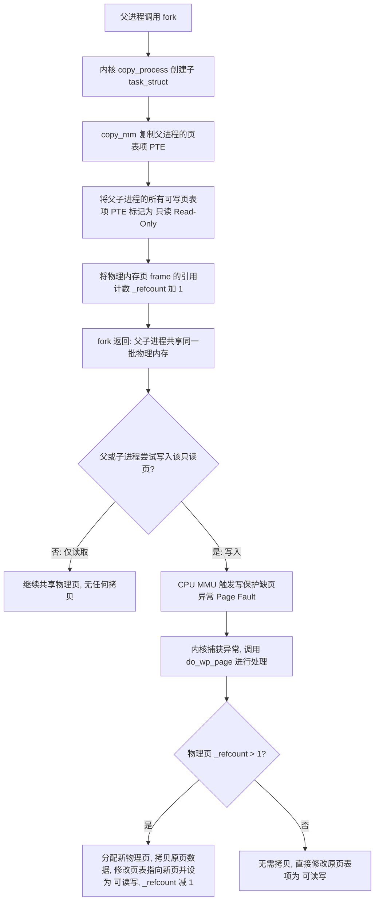
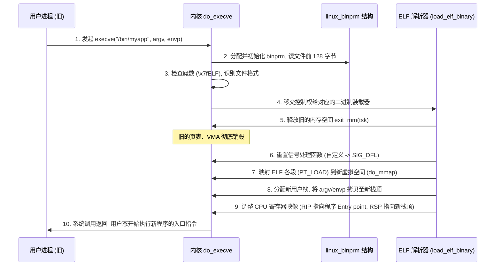
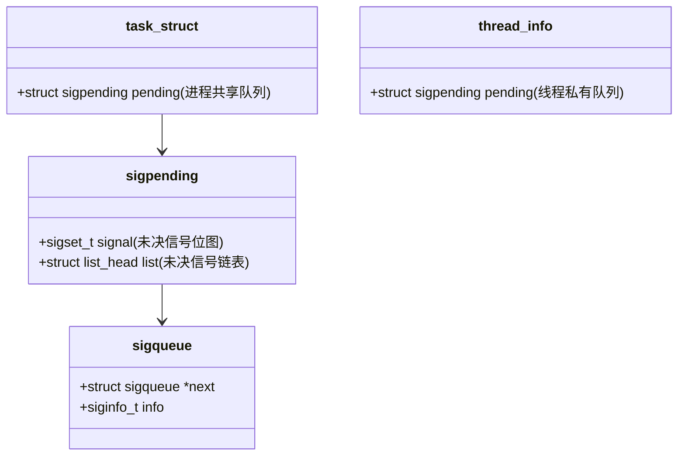

# 1.1.2.2 Linux进程管理

在现代操作系统中，进程是资源分配和调度的基本单位。Linux 作为一款开源的类 Unix 操作系统，其进程管理机制设计精妙且高效。本文将从 Linux 内核底层视角出发，深入剖析进程的创建与执行机制（包括写时复制 COW 的硬件与软件协同、`exec` 系统调用链的虚拟地址重构、以及 `vfork` 与 `clone` 的差异）、父子进程同步与资源回收（等待队列机制、僵尸进程与孤儿进程的成因与处置）、Linux 信号机制的微观路径（未决与阻塞的转换、用户态与内核态的信号栈切换、异步信号安全），以及多进程的组织拓扑（进程组、会话 Session 的演进及终端控制）。

---

## 1. Linux 进程与线程的内核统一抽象

在传统的计算机科学教材中，进程和线程被定义为两个截然不同的概念：进程是资源分配的最小单位，线程是 CPU 调度的最小单位。然而，在 Linux 内核的设计哲学中，这种物理边界是被有意模糊的。

### 1.1 轻量级进程 (LWP) 与 `task_struct`

Linux 内核在底层并没有为进程和线程分别设计不同的数据结构。无论是单线程进程、多线程进程中的某一个线程，还是内核线程，在内核中均被统一抽象为**任务（Task）**，由一个庞大的结构体 `struct task_struct`（定义于内核源码 `include/linux/sched.h` 中）来表示。这种统一的执行实体在 Linux 中被称为**轻量级进程（Lightweight Process, LWP）**。

`task_struct` 是 Linux 内核中最核心的数据结构之一，包含了描述一个执行实体所需的全部元数据。其关键成员可以划分为以下几个维度：

*   **进程标识符（PID 与 TGID）**：
    *   `pid_t pid`：内核中每个独立调度实体的唯一标识符。这意味着在一个多线程进程中，每个线程在内核中其实都有一个独立的 `pid`。
    *   `pid_t tgid`（Thread Group ID，线程组 ID）：这是为了兼容 POSIX 线程标准而引入的。当一个新进程（主线程）创建时，它的 `tgid` 等于其 `pid`。如果该进程随后创建了多个线程，这些子线程的 `tgid` 都会被设置为与主线程相同的 `tgid`。
    *   当用户态程序调用 `getpid()` 系统调用时，内核返回的是该任务的 `tgid`；而只有通过 `syscall(SYS_gettid)` 才能获取内核中真实的、唯一的 `pid`。

*   **内存描述符（`struct mm_struct *mm`）**：
    *   指向进程的虚拟内存空间描述符。对于同一个进程内的所有线程，它们的 `task_struct` 中的 `mm` 指针都指向内核中同一个 `mm_struct` 实例，从而实现了多线程之间共享代码段、数据段、堆和页表。
    *   如果是内核线程（Kernel Thread），由于其只在内核空间运行，没有用户空间，其 `mm` 指针为 `NULL`，但它在运行时会借用上一个用户进程的 `active_mm`。

*   **文件描述符表（`struct files_struct *files`）**：
    *   指向该任务打开的文件描述符表。多线程进程中的所有线程共享同一个 `files_struct`。

*   **信号处理描述符（`struct sighand_struct *sighand` 与 `struct sigpending pending`）**：
    *   `sighand` 指向信号处理函数表，同一个线程组中的线程共享该表。
    *   `pending` 则是每个线程私有的未决信号队列。

*   **任务状态（`volatile long state`）**：
    *   `TASK_RUNNING`：就绪或正在运行状态。
    *   `TASK_INTERRUPTIBLE`：可中断的睡眠状态，可以被信号唤醒。
    *   `TASK_UNINTERRUPTIBLE`：不可中断的睡眠状态，通常在等待硬件 I/O 时使用，不受任何信号干扰，即使是 `SIGKILL` 也无法将其唤醒。
    *   `__TASK_STOPPED`：暂停状态，通常在收到 `SIGSTOP` 等信号后进入。
    *   `EXIT_ZOMBIE`：僵尸状态，进程已退出，但父进程尚未对其进行资源回收。

---

## 2. 进程创建与执行的深层轨迹

Linux 进程的创建与执行遵循“分步演进”的原则，主要通过 `fork()`、`vfork()` 或 `clone()` 系统调用创建子进程，再通过 `exec` 系列系统调用重构进程空间并装载新程序。

### 2.1 fork() 与写时复制 (COW) 的硬件与软件协同

传统的 Unix 系统在执行 `fork()` 时，会将父进程的整个虚拟内存和物理内存空间完整拷贝一份给子进程。如果父进程占用了几吉字节的内存，那么这种全量拷贝的代价将是灾难性的，且极大地浪费了物理内存。

为了彻底解决这一痛点，Linux 引入了**写时复制（Copy-On-Write, COW）**机制。这一机制并非纯软件的实现，而是 **CPU 硬件（内存管理单元 MMU）与内核虚拟内存管理器深度协同**的产物。

#### 2.1.1 写时复制的内核实现细节

当用户态程序调用 `fork()` 时，内核会通过 `sys_clone` 最终调用到内核函数 `kernel_clone()`（在较旧的内核版本中为 `_do_fork` 或 `do_fork`），进而执行 `copy_process`。

写时复制的具体实现步骤如下：



1.  **复制页表，而非物理内存**：
    在 `copy_process` 的子函数 `copy_mm` 中，内核检测到创建子进程时并未携带 `CLONE_VM` 标志（说明是进程而非线程）。内核会为子进程分配一个新的 `mm_struct` 和一套新的页表。接着，内核开始逐级遍历父进程的页表（从 PML4、PDPT、PD 到 PT），将父进程的页表项（Page Table Entry, PTE）复制到子进程的对应页表项中。此时，**父子进程的虚拟地址映射到了完全相同的物理内存页上**。
2.  **修改页表项权限为只读**：
    内核在复制页表项时，会检查每一页的权限。如果该页是可写的（例如用户栈、堆、数据段），内核会将父进程和子进程的页表项中的 **Read/Write (R/W) 标志位置为 0（即只读）**。为了标识该页原本是可写的，内核会在页面的控制结构 `struct page` 的标志位中打上 `COW` 的标记，并将物理页的引用计数 `_refcount` 递增 1。
3.  **触发缺页异常（Page Fault）**：
    一旦 `fork` 完成，父子进程开始并发运行。如果它们只对内存执行读操作，两者的虚拟内存将一直安全地映射到同一物理页。
    然而，当其中某一个进程（例如子进程）试图修改某个变量（即向该只读物理页执行写入指令）时，CPU 的内存管理单元（MMU）在进行地址转换时，检测到指令是“写操作”，但页表项中的 R/W 标志为 0（只读）。MMU 判定这是一次违规操作，立即生成一个 **Page Fault（写保护中断/缺页异常）**，并把发生异常的虚拟地址记录在 CPU 的控制寄存器（如 x86 架构下的 `CR2` 寄存器）中。
4.  **内核缺页异常处理函数 `do_wp_page()`**：
    CPU 挂起当前进程的执行，转而陷入内核态，进入缺页异常处理程序（对于写保护异常，入口为 `do_page_fault` -> `handle_mm_fault` -> `do_wp_page`）。
    内核在 `do_wp_page` 中执行如下判定与操作：
    *   通过异常虚拟地址找到对应的虚拟内存区域（`vm_area_struct`，简称 VMA）。
    *   检查该 VMA 的权限属性（`vm_flags`）。如果该 VMA 的 `vm_flags` 包含可写属性 `VM_WRITE`，但实际页表项（PTE）是只读的，内核即确信这是一次**合法的写时复制操作**（而不是程序越界或向只读代码段写入导致的真正非法操作）。
    *   检查该物理页的 `_refcount`。
        *   若 `_refcount > 1`：说明该物理页确实处于多进程共享状态。内核会从物理内存分配器（伙伴系统）中申请一个**全新的物理页帧**。然后，将原共享物理页的数据完整拷贝到这个新物理页中。接着，修改当前触发异常进程的页表项，使其指向这个新物理页，并将该页表项的属性改回“可读写”（R/W 置 1）。最后，将原物理页的引用计数 `_refcount` 减 1。
        *   若 `_refcount == 1`：说明其他共享该页的进程在之前已经通过 COW 机制分裂出去了，当前只有这一个进程在映射该物理页。此时，内核不需要分配新页，也不需要进行数据拷贝，直接在原页表项上将 R/W 标志位置 1，将其恢复为可读写属性即可。
5.  **异常返回**：
    内核完成物理页的分配与页表项重写后，退出缺页异常。CPU 重新执行刚才触发异常的那条写指令，此时写操作顺利通过。

#### 2.1.2 硬件与软件协同下的页表项（PTE）微观结构

以常见的 x86_64 架构下 4KB 物理页的页表项（PTE）为例，其包含 64 个 bit 位，其中有几位在 COW 的实现中扮演着决定性角色：

*   **Bit 0 (P - Present)**：该物理页是否在物理内存中。如果为 0，说明页面已被交换（Swap）到磁盘上，或者尚未分配。
*   **Bit 1 (R/W - Read/Write)**：为 1 表示可读写，为 0 表示只读。在 `fork()` 时，即使 VMA 标记了可写，此 Bit 也会被内核强制清零。
*   **Bit 2 (U/S - User/Supervisor)**：为 1 表示用户态可访问，为 0 表示仅内核态可访问。
*   **Bit 5 (A - Accessed)**：当 CPU 读或写该页时，由硬件自动将其置 1，常用于页面置换算法（如 LRU）。
*   **Bit 6 (D - Dirty)**：当 CPU 写入该页时，由硬件自动置 1。

#### 2.1.3 写时复制的隐形开销

虽然 COW 避免了无意义的物理内存全量拷贝，但它引入了另外两项不可忽视的系统开销：

1.  **TLB（页表缓存）失效与刷新**：
    当内核修改了页表项的 R/W 属性或者将页表项指向新的物理地址时，CPU 内部的高速页表缓存（Translation Lookaside Buffer, TLB）中旧的映射关系就失效了。内核必须显式发出指令刷新该虚拟地址对应的 TLB 缓存。在多核（SMP）系统中，还需要通过处理器间中断（Inter-Processor Interrupt, IPI）发送“TLB 广播”，通知其他正在运行该进程相关线程的 CPU 核心同步刷新 TLB，这会造成可观的 CPU 周期损耗。
2.  **持续的 Page Fault 硬件中断**：
    如果子进程被创建后，父子进程都要对内存进行大量的写操作，那么系统会在短时间内爆发大量的 Page Fault。每次缺页异常都伴随着用户态与内核态的上下文切换，导致 CPU 效率在这一阶段出现波动。

---

### 2.2 exec() 系统调用链与进程虚拟地址空间重构

`fork()` 的职责是“繁衍”进程，而要让子进程去执行与父进程完全不同的新程序，则必须依靠 `exec` 系统调用族。

#### 2.2.1 唯一的真实系统调用：`sys_execve`

在 C 语言标准库中，提供了 6 个不同的 `exec` 函数（如 `execl`、`execp`、`execle`、`execv` 等），它们的区别仅在于参数传递的方式（列表形式还是数组形式）以及是否自动搜索 `PATH` 环境变量。

在 Linux 内核层面，这些库函数在经过标准库的封装后，最终都指向同一个系统调用入口：`sys_execve`。在 x86_64 架构下，其内核入口函数为 `do_execve()`。

#### 2.2.2 进程地址空间重构的内核处理路径

当进程调用 `execve(const char *pathname, char *const argv[], char *const envp[])` 时，内核会经历一次彻底的“换血”过程。其详细的执行路径如下：



1.  **装载上下文的构建（`struct linux_binprm`）**：
    内核首先分配一个 `linux_binprm` 结构体。该结构体用于临时保存加载新程序所需的全部数据。内核会把用户态传入的命令行参数（`argv`）和环境变量（`envp`）拷贝到该结构体的临时缓冲区中。
2.  **文件读取与格式识别**：
    内核打开目标可执行文件，将其前 128 字节读取到 `binprm->buf` 中。内核通过文件开头的“魔数（Magic Number）”来识别其格式。
    *   如果是 `\x7fELF`：说明是标准的 ELF 可执行文件，调用 ELF 格式解析器 `load_elf_binary()`。
    *   如果是 `#!`：说明是脚本文件，内核会读取 `#!` 后面的解释器路径（如 `/bin/sh`），并将解释器作为新的目标文件重新执行装载流程。
3.  **销毁旧的虚拟地址空间**：
    确定可以装载后，内核调用 `exit_mm(current)`。这一步是不可逆的。内核会释放当前进程所拥有的旧的 `mm_struct`、页表、所有的 VMA 以及对应的物理内存映射。此时，进程的旧代码和旧数据在物理上已不复存在。
4.  **映射新程序段（装载 ELF）**：
    ELF 解析器 `load_elf_binary()` 读取 ELF 文件的“程序头表（Program Header Table）”，寻找所有类型为 `PT_LOAD` 的段（Segment）。这些段包含了程序的代码、只读数据（`.text`、`.rodata`）和可读写数据（`.data`、`.bss`）。
    内核调用 `do_mmap()`，将这些段映射到进程的新虚拟地址空间中。**注意：此时同样没有真正的物理内存拷贝**，内核只是在进程的新 `mm_struct` 中建立了若干个虚拟内存区域（VMA），并将其与 ELF 文件建立映射。当程序运行起来后，CPU 首次访问这些虚拟地址时，会通过缺页异常将 ELF 文件的内容按需从磁盘载入物理内存。
5.  **动态链接器（Interpreter）的引入**：
    如果可执行文件是动态链接的（绝大多数程序都是如此），ELF 文件中会包含一个 `PT_INTERP` 段，指定了动态链接器的路径（例如 `/lib64/ld-linux-x86-64.so.2`）。
    此时，内核除了映射可执行文件本身外，还会将动态链接器映射到进程的虚拟地址空间。内核会将最终返回用户态的入口地址（RIP 寄存器值）设为**动态链接器的入口点**，而不是可执行文件本身的入口点。动态链接器会在用户态首先运行，负责解析、加载该程序依赖的所有共享库（`.so`），完成符号的重定位，最后才跳转到可执行文件本身的 `main` 函数执行。
6.  **用户栈的构建与参数传递**：
    内核在虚拟内存空间的顶部（高地址处）为进程分配全新的用户栈。内核将缓存在 `linux_binprm` 中的命令行参数和环境变量依次压入新栈的顶部，并为新程序设置好栈指针寄存器（如 x86_64 的 `%rsp`）。
7.  **信号与文件描述符的重置**：
    *   **信号重置**：由于旧的信号处理函数代码已被销毁，内核会将所有原本被设置为自定义处理函数（Signal Handler）的信号，全部重置为默认动作（`SIG_DFL`）。而被设置为忽略（`SIG_IGN`）的信号和信号屏蔽字则保留，不受 `exec` 影响。
    *   **文件描述符与 `FD_CLOEXEC`**：进程原先打开的所有文件描述符在 `exec` 后默认保持打开。但是，如果在打开文件时设置了 `FD_CLOEXEC`（Close-on-Exec）标志，内核会在此时自动关闭这些文件描述符，防止敏感的内部文件句柄泄露给新装载的外部程序。
8.  **寄存器设置与返回**：
    内核修改保存在内核栈上的寄存器映像。将指令指针（如 `%rip`）设为 ELF 的 Entry Point（或动态链接器入口），将栈指针（如 `%rsp`）设为新栈顶。当系统调用返回时，CPU 切换回用户态，新程序开始正式运行。

---

### 2.3 fork、vfork、clone 的底层对比与场景选择

在 Linux 编程中，`fork()`、`vfork()` 和 `clone()` 都是创建新执行实体的手段。它们在内核中统一由 `kernel_clone` 这一函数实现，但由于传入的 Flags（标志）不同，表现出完全不同的共享特性。

#### 2.3.1 三种系统调用的核心差异

1.  **`fork()`**：
    *   **标志位**：不带任何特殊共享标志。
    *   **特性**：采用写时复制（COW）机制。子进程拥有自己独立的 `mm_struct` 和页表，初时与父进程共享物理内存，发生写操作时进行物理页面分裂。
2.  **`vfork()`**：
    *   **标志位**：传递 `CLONE_VFORK | CLONE_VM`。
    *   **特性**：子进程与父进程**完全共享**虚拟内存地址空间（包括页表和物理内存）。在子进程调用 `exec` 或 `_exit` 之前，**父进程会被强制挂起（阻塞）**。
    *   **设计初衷与危险性**：在 Linux 尚未实现 COW 机制的早期，`fork()` 的全量拷贝开销巨大，而很多程序在 `fork` 后会立即调用 `exec`。为了避免这无意义的内存拷贝，设计了 `vfork`。由于子进程在父进程的栈上运行，如果子进程没有立即调用 `exec` 或 `_exit`，而是从当前函数返回（`return`），就会破坏父进程的栈帧，导致父进程恢复运行后遭遇崩溃或死锁。现代 Linux 的 COW 机制已经极度优化，`vfork` 的性能优势已微乎其微，因此**在现代开发中不应再被使用**。
3.  **`clone()`**：
    *   **标志位**：由调用者自由组合各种 `CLONE_*` 标志。
    *   **特性**：提供极高的可定制性。调用者可以指定子任务与父任务共享哪些资源。它是 Linux 下创建多线程和实现容器命名空间隔离的核心系统调用。

#### 2.3.2 内核资源共享的微观拓扑

我们可以通过 `CLONE_VM`、`CLONE_FS`、`CLONE_FILES` 和 `CLONE_SIGHAND` 四个核心标志，透视它们在内核数据结构指针上的共享行为：

```mermaid
graph TD
    subgraph task_struct A (父任务)
        mmA[mm_struct A]
        fsA[fs_struct A]
        filesA[files_struct A]
        sighandA[sighand_struct A]
    end

    subgraph task_struct B (由 fork 创建)
        mmB[mm_struct B - 复制的页表]
        fsB[fs_struct B - 独立复制]
        filesB[files_struct B - 独立复制]
        sighandB[sighand_struct B - 独立复制]
    end

    subgraph task_struct C (由 clone 线程创建)
        mmA -.-> |CLONE_VM| mmC[共享 mm_struct A]
        fsA -.-> |CLONE_FS| fsC[共享 fs_struct A]
        filesA -.-> |CLONE_FILES| filesC[共享 files_struct A]
        sighandA -.-> |CLONE_SIGHAND| sighandC[共享 sighand_struct A]
    end
```

*   **`CLONE_VM`**：若设置，父子任务共享同一个 `mm_struct`。这意味着一个任务对内存的修改会立刻被另一个任务感知，这是“线程”的根本特征。
*   **`CLONE_FS`**：若设置，共享文件系统信息（如当前工作目录、文件创建掩码 umask）。一个任务调用 `chdir`，另一个任务的当前工作目录也会随之改变。
*   **`CLONE_FILES`**：若设置，共享同一个文件描述符表。一个任务 `close(fd)`，另一个任务的该文件也被关闭；一个任务 `open` 产生的新 `fd`，另一个任务可以直接读写。
*   **`CLONE_SIGHAND`**：若设置，共享同一个信号处理表。一个任务使用 `sigaction` 改变了某个信号的 Handler，另一个任务对应的信号处理行为也随之改变。

---

## 3. 父子进程同步与资源回收

当一个进程结束时，它的生命并没有彻底终结。Linux 设计了一套严密的机制，确保进程的退出状态能够安全地传递给其父进程。

### 3.1 僵尸进程与孤儿进程的成因及处理

#### 3.1.1 僵尸进程（Zombie Process）

*   **成因**：当子进程调用 `exit()` 退出时，内核会释放它的绝大部分资源（如物理内存、打开的文件描述符、工作目录等），但会故意保留它的 `task_struct` 结构体，并将其状态设置为 `EXIT_ZOMBIE`。
    内核之所以保留这一结构体，是为了让父进程能够通过 `wait` 族调用获取到子进程的终结信息（包括 PID、退出码、是否被信号杀死等）。**只要父进程没有调用 `wait`/`waitpid` 来读取这些信息，该进程的 `task_struct` 就无法被销毁，其占用的 PID 也无法被回收。**
*   **危害**：系统可分配的 PID 数量是有限的（默认为 32768，由 `/proc/sys/kernel/pid_max` 决定）。如果有大量的僵尸进程积压，会迅速耗尽系统的 PID 资源，导致系统无法创建任何新进程，服务陷入瘫痪。
*   **系统级防范与处理**：
    1.  **显式忽略 `SIGCHLD`**：
        如果父进程完全不需要知道子进程的退出状态，可以在创建子进程前，显式调用：
        ```c
        signal(SIGCHLD, SIG_IGN);
        ```
        或者通过 `sigaction` 设置 `SA_NOCLDWAIT` 标志。这样，子进程在退出时，内核检测到父进程对其状态不感兴趣，会**直接绕过僵尸状态**，直接调用 `release_task()` 彻底回收其 `task_struct`，释放 PID。
    2.  **异步信号回收**：
        父进程注册 `SIGCHLD` 信号处理函数，在处理函数中非阻塞地循环调用 `waitpid`。
        由于 `SIGCHLD` 属于不可靠信号，当多个子进程同时退出时，发送给父进程的多个 `SIGCHLD` 信号可能会在未决信号集中被合并为一个。因此，**在信号处理函数中必须使用 `while` 循环加上 `WNOHANG` 选项**，直到 `waitpid` 返回 0 或 -1，才能保证所有退出的子进程都被妥善回收。
    3.  **双重 fork 技术**：
        如前文所述，通过让子进程再次 `fork` 并立即退出，使真正的业务孙子进程变为孤儿进程，交由 1 号进程自动回收。

#### 3.1.2 孤儿进程（Orphan Process）

*   **成因**：父进程在子进程退出之前就已经结束了，此时子进程就成了无依无靠的“孤儿进程”。
*   **收养与托管机制**：
    Linux 规定每个进程必须有一个父进程。当一个进程退出时，内核会遍历它旗下的所有子进程，并将这些子进程的父进程指针重新指向系统的 1 号进程（`init`，在现代 Linux 中通常是 `systemd`）。
    如果系统存在 `PR_SET_CHILD_SUBREAPER` 机制，进程可以通过以下系统调用将自己声明为 `subreaper`（子收养器）：
    ```c
    prctl(PR_SET_CHILD_SUBREAPER, 1, 0, 0, 0);
    ```
    这样，当其后代进程中发生父进程提前退出的情况时，孤儿进程会被离它最近的 `subreaper` 进程收养，而不会直接上报给系统的 1 号进程。这是现代容器（如 Docker、Containerd）实现容器内进程隔离和生命周期管理的关键技术。
*   因为 1 号进程（或 `subreaper`）内部实现了一个无限循环的 `wait()` 回收机制，所以**孤儿进程在退出时会被收养者自动且及时地回收，不会在系统中产生僵尸进程**。

---

### 3.2 wait/waitpid 系统调用详解

`wait` 族系统调用是父进程主动获取子进程退出状态、同步子进程执行周期的法定工具。

#### 3.2.1 `waitpid` 的参数与控制

*   **函数原型**：
    ```c
    pid_t waitpid(pid_t pid, int *status, int options);
    ```
*   **`pid` 参数的精细控制**：
    *   `pid > 0`：等待 PID 刚好等于该值的特定子进程。
    *   `pid == -1`：等待任意子进程，此时 `waitpid` 退化为与 `wait` 等价。
    *   `pid == 0`：等待与调用者处于同一个进程组中的任意子进程。
    *   `pid < -1`：等待进程组 ID（PGID）等于 `|pid|`（绝对值）的任意子进程。
*   **`options` 参数的可选控制位**：
    *   `WNOHANG`：非阻塞标志。如果指定的子进程尚未退出，函数立即返回 0，不阻塞调用者。
    *   `WUNTRACED`：若子进程收到暂停信号（如 `SIGSTOP`）进入暂停状态，也立即返回该状态。
    *   `WCONTINUED`：若被暂停的子进程收到 `SIGCONT` 信号恢复运行，也立即返回该状态。

#### 3.2.2 状态解析宏的微观判定

`status` 整数是一个位掩码，不能直接使用其值，而必须通过内核提供的宏进行解析：

*   **`WIFEXITED(status)` / `WEXITSTATUS(status)`**：
    *   若 `WIFEXITED` 为真，说明子进程是通过 `exit()` 或在 `main` 函数中 `return` 正常退出的。
    *   此时可以通过 `WEXITSTATUS` 获取子进程的退出状态码（通常是退出码的低 8 位）。
*   **`WIFSIGNALED(status)` / `WTERMSIG(status)` / `WCOREDUMP(status)`**：
    *   若 `WIFSIGNALED` 为真，说明子进程是被某一个未捕获的信号强制终止的。
    *   此时通过 `WTERMSIG` 可以获知是几号信号杀死了子进程。
    *   若 `WCOREDUMP` 为真，说明子进程在被杀死时产生了 Core Dump 文件（如发生段错误）。
*   **`WIFSTOPPED(status)` / `WSTOPSIG(status)`**：
    *   若 `WIFSTOPPED` 为真，说明子进程目前处于暂停状态，可通过 `WSTOPSIG` 获取引起暂停的信号值。

#### 3.2.3 内核等待队列的挂起与唤醒机制

当父进程调用 `waitpid`（未设置 `WNOHANG`）且此时没有任何子进程退出时，父进程会被内核挂起。其底层的执行过程如下：

```
父进程 (TASK_RUNNING) 
      |
调用 waitpid 阻塞
      |
内核将父进程状态设为 TASK_INTERRUPTIBLE
      |
内核将父进程的 task_struct 加入其专属的 wait_chldexit 等待队列
      |
调用 schedule() 让出 CPU ---> 父进程挂起 (不占用 CPU 周期)
                                      .
                                      . (时间推移)
                                      .
子进程退出 (调用 do_exit)
      |
进入 exit_notify() 阶段
      |
1. 向父进程发送 SIGCHLD 信号
2. 调用 wake_up_interruptible(&parent->wait_chldexit)
                                      |
                      内核将父进程从等待队列中移出
                      将父进程状态置为 TASK_RUNNING
                                      |
                      父进程重新获得 CPU 调度
                                      |
                      父进程在内核中重新遍历子进程链表
                      提取子进程状态, 释放子进程 task_struct
                      waitpid 系统调用成功返回
```

---

## 4. Linux 信号机制

信号是 Linux 操作系统中唯一的**异步**通信机制。它允许内核或用户进程在任意时刻打断目标进程，迫使其处理某个紧急事件。

### 4.1 信号的分类与本质：标准信号 vs 实时信号

Linux 信号分为**标准信号（1 ~ 31）**和**实时信号（34 ~ 64）**。它们在内核底层的处理逻辑有着本质的区别：



*   **标准信号（不可靠信号）**：
    在内核中，传统信号是用一个 `sigset_t` 结构体（本质上是一个位图，每个 bit 代表一个信号）来标记是否处于未决（Pending）状态的。
    如果内核向进程发送一个标准信号（如 `SIGINT`），内核会把该信号在位图中的对应位置为 1。如果进程由于被阻塞而尚未处理该信号，此时若内核再次向该进程发送相同的信号，内核只会检测到位图中该位已为 1，便不再做任何操作。这就导致**在未决期间，第二次及以后的相同信号被直接覆盖，信号发生了丢失**。
*   **实时信号（可靠信号）**：
    实时信号支持**排队**。当内核发送一个实时信号时，除了将位图中对应位置 1 外，还会为其分配一个 `struct sigqueue` 结构，将信号的详细伴随信息（如发送者 PID、发送的值等）填入，并将其挂入未决信号链表 `list` 中。如果同一个实时信号重复到达，内核会为它们分配多个 `sigqueue` 节点并依次排入链表。只要系统内存未耗尽，**实时信号绝不会发生丢失，并且严格保证按照发送顺序递达**。

---

### 4.2 信号的发送、注册与挂起状态

*   **发送阶段**：
    当一个进程调用 `kill` 发送信号，或者硬件异常触发信号时，内核会进行权限检查。如果通过，内核会找到目标进程的 `task_struct`。
*   **注册阶段（未决状态 Pending）**：
    内核将该信号添加到目标进程（或特定线程）的未决信号集中。
    此时，信号仅仅是“登记在案”，并没有被立刻执行，这种**信号已被生成但尚未被处理的状态称为“未决状态（Pending）”**。
*   **阻塞阶段（Blocked）**：
    进程可以通过修改信号屏蔽字（Signal Mask）来阻塞某些信号。
    如果一个信号在屏蔽字中被置为 1，说明该信号当前被进程阻塞。当该信号到达时，它会**一直停留在未决（Pending）状态**，直到进程解除对该信号的阻塞，内核才会将其递达给进程处理。
*   **递达阶段（Delivered）**：
    当信号解除阻塞，或者没有被阻塞的信号被进程正式处理时，称为“递达”。

---

### 4.3 信号处理的微观路径与执行栈切换

信号处理函数的执行是整个信号机制中设计最复杂、开销最大的一环。它要求 CPU 在用户态和内核态之间完成多次精妙的“横跨”。

#### 4.3.1 信号检查的时机

内核并不会在信号产生的瞬间立即打断用户程序，真正的递达检查只发生在**当前进程从内核态返回用户态的临界路径上**。这包括：
1.  **系统调用返回**：进程调用 `read`、`write` 等系统调用完毕，准备返回用户空间前夕。
2.  **中断返回**：硬件中断（如时钟中断）处理完毕，准备恢复执行用户程序前夕。
3.  **异常返回**：异常处理程序执行完毕，准备返回用户空间前夕。

在这些临界点，内核会检查当前线程的 `thread_info` 中的 `flags` 标志。如果包含 `TIF_SIGPENDING`，则说明有未决且未被阻塞的信号，内核将调用 `do_signal()` 开始处理。

#### 4.3.2 信号上下文帧与 `sigreturn` 的内核魔术

如果信号的处理方式是用户注册的自定义处理函数（Signal Handler），由于该函数运行在用户态，内核不能直接在内核态执行它，否则会带来毁灭性的安全漏洞。内核必须暂时切换回用户态来执行该函数。

然而，信号处理函数执行完后，如何安全地回到主程序原来被打断的地方？内核在此处完成了一个精妙的闭环设计：

```
                    [ 进程在用户态正常运行 ]
                             |
                   ( 发生硬件中断/系统调用 )
                             |
                             v
                    [ 进程陷入内核态 ]
                             |
                     内核执行 do_signal()
                  发现有未决未阻塞的自定义信号
                             |
        +--------------------+--------------------+
        |                                         |
        v (1. 备份主上下文)                         v (2. 篡改返回目标)
在当前进程用户栈                        将内核栈中保存的返回
(User Stack) 上强制                     地址 %rip 篡改为信号处理
压入 Signal Frame                       函数的入口地址;
(保存原 %rip, %rsp,                    将返回地址寄存器指向
 信号屏蔽字等)                          sigreturn 跳板代码
        |                                         |
        +--------------------+--------------------+
                             |
                             v
                 [ 执行中断/系统调用返回 ]
                             |
                             v
             [ 进程回到用户态, 进入 Handler ]
                      (执行用户自定义逻辑)
                             |
                   (Handler 函数执行 return)
                             |
                             v
                [ 跳转至 sigreturn 跳板代码 ]
                             |
                             v
                [ 自动发起 sys_sigreturn 系统调用 ]
                             |
                             v
                    [ 再次陷入内核态 ]
                             |
                   内核解析 Signal Frame
                   恢复原 %rip, %rsp, 信号屏蔽字
                             |
                             v
                    [ 再次返回用户态 ]
                             |
                             v
           [ 进程在主程序被打断处无缝继续运行 ]
```

1.  **备份主程序上下文（Signal Frame 压栈）**：
    内核在当前进程的**用户栈**（User Stack，除非设置了备用栈）上强制压入一个名为 **`rt_sigframe`（信号上下文帧）** 的结构体。这个帧里完整保存了主程序被打断那一刻的所有 CPU 寄存器映像（如 `%rip`、`%rsp`、`%rflags` 等）以及当前的信号屏蔽字。
2.  **篡改返回地址**：
    内核修改保存在内核栈中的寄存器映像。
    *   将返回用户态的指令指针 `%rip` 修改为**信号处理函数的入口地址**。
    *   将栈指针 `%rsp` 修改为刚才在用户栈上压入 `rt_sigframe` 之后的栈顶。
    *   将用户态执行完信号处理函数后的返回地址（即函数返回时会跳转到的地址）设为一段名为 **`sigreturn` 的跳板指令代码** 的地址。这段跳板代码通常由 GLIBC 库在初始化时映射到进程的地址空间中。
3.  **返回用户态，执行 Handler**：
    内核执行返回用户态的指令（如 `sysret`）。由于寄存器被篡改，CPU 返回用户态后，直接跳进了用户编写的信号处理函数中开始运行，且其栈指针正指向一个干净的栈空间（在 Signal Frame 下方）。
4.  **Handler 执行结束，跳转跳板**：
    信号处理函数执行完毕，执行 `return` 指令。此时，CPU 从栈中弹出返回地址，这个返回地址正是之前内核设置的 `sigreturn` 跳板代码地址。
5.  **调用 `sys_sigreturn` 恢复上下文**：
    CPU 执行这段跳板指令。跳板代码非常简单，它只包含一个动作：**发起 `sys_sigreturn` 系统调用**。
    进程再次陷入内核态，进入内核的 `sys_sigreturn()` 函数。该函数会从进程的用户栈上读取刚才备份的 `rt_sigframe`，将其中保存的所有 CPU 寄存器状态和信号屏蔽字重新写回 CPU 和当前任务结构体中。
6.  **二次返回，主程序复原**：
    内核完成上下文恢复后，退出系统调用。CPU 再次返回用户态，此时指令指针 `%rip` 和栈指针 `%rsp` 已经完全复原为最初主程序被打断时的状态，主程序毫无感知地继续执行。

#### 4.3.3 备用信号栈（`sigaltstack`）防范栈溢出

在系统运行过程中，如果进程遭遇了**栈溢出（Stack Overflow）**，即用户栈的边界超出了物理内存映射或者触碰到了只读保护页，CPU 会立即触发 `SIGSEGV`（段错误）。

如果用户希望在 `SIGSEGV` 信号处理函数中打印出堆栈调用链或者执行一些紧急的资源释放，就会面临一个死锁般的困境：
*   用户栈已满，且已触发写保护中断。
*   内核处理 `SIGSEGV`，准备将 `rt_sigframe` 压入当前进程的用户栈。
*   由于用户栈已经溢出，压栈操作再次触发缺页和写保护错误。
*   内核检测到在处理信号的过程中发生双重故障（Double Fault），只能放弃信号处理，直接强行将进程杀死。

为了打破这一僵局，Linux 提供了**备用信号栈（Alternate Signal Stack）**机制：

```c
#include <stdio.h>
#include <stdlib.h>
#include <unistd.h>
#include <signal.h>

void sigsegv_handler(int sig) {
    // 此时运行在备用信号栈上，可以安全执行代码
    char msg[] = "Caught SIGSEGV! Stack overflow recovered.\n";
    write(STDERR_FILENO, msg, sizeof(msg) - 1);
    _exit(EXIT_FAILURE); // 安全退出，不刷新 stdio 缓冲区防止二次死锁
}

int main() {
    stack_t ss;
    struct sigaction sa;

    // 1. 在堆上分配一块独立的内存作为备用栈
    ss.ss_sp = malloc(SIGSTKSZ); 
    if (ss.ss_sp == NULL) {
        perror("malloc");
        exit(EXIT_FAILURE);
    }
    ss.ss_size = SIGSTKSZ; // 备用栈大小
    ss.ss_flags = 0;

    // 2. 注册备用栈到内核中
    if (sigaltstack(&ss, NULL) == -1) {
        perror("sigaltstack");
        exit(EXIT_FAILURE);
    }

    // 3. 注册信号处理函数，显式指定 SA_ONSTACK 标志
    sa.sa_handler = sigsegv_handler;
    sigemptyset(&sa.sa_mask);
    sa.sa_flags = SA_ONSTACK; // 告诉内核在此信号发生时切换到备用栈

    if (sigaction(SIGSEGV, &sa, NULL) == -1) {
        perror("sigaction");
        exit(EXIT_FAILURE);
    }

    // 4. 模拟栈溢出
    // 执行无限递归导致栈溢出
    main(); 

    return 0;
}
```

**备用栈切换的微观内核行为**：
当 `SIGSEGV` 发生时，内核在 `do_signal` 中检测到该信号注册了 `SA_ONSTACK` 标志，并且进程已经通过 `sigaltstack` 注册了有效的备用栈。内核会**忽略当前受损的 `%rsp`**，直接将信号处理函数的执行栈指针 `%rsp` 设为备用栈的基地址，并在备用栈上构建 `rt_sigframe`。这使得信号处理函数能够在完全隔离、干净的栈空间中运行，保障了系统容错和诊断代码的执行。

---

### 4.4 异步信号安全与可重入函数陷阱

信号处理函数是**异步**执行的，它可以打断进程主执行流中的任何一条指令。这种异步性带来了一个极具破坏性的隐患：**非异步信号安全（Async-Signal-Safe）函数的调用冲突**。

#### 4.4.1 可重入与不可重入的定义

*   **可重入函数（Reentrant Function）**：
    一个可以被安全地“并发调用”或“在打断后再次进入”的函数。其核心特征是：**不使用任何全局变量或静态非 const 变量，不调用任何不可重入的库函数，所有的操作都基于栈上的局部变量或调用者传入的参数**。
*   **不可重入函数（Non-reentrant Function）**：
    内部使用了全局变量、静态变量，或者调用了需要获取内部锁的系统资源分配函数（如 `malloc`、`free`、`printf`）。

#### 4.4.2 信号打断与单线程死锁的微观分析

```
进程主程序                                信号处理函数 (Handler)
   |
调用 malloc(100)
   |
获取全局内存分配器锁 (Lock)
   |
正在修改内存块链表 (临界区) 
   |
=====> 此时发生时钟中断，进程陷入内核，内核检查并递达 SIGINT
                                                |
                                                v
                                        调用 printf("Allocated\n")
                                                |
                                        printf 内部需要调用 malloc
                                                |
                                        尝试获取同一个全局锁 (Lock)
                                                |
                                        [ 阻塞等待 Lock 释放 ] 
                                                |
                                                v
                                            永久死锁 !
                                     (主程序被挂起无法释锁，
                                      Handler 等待主程序释锁)
```

假设主程序正在调用 `malloc()`。为了保证多线程安全，`malloc()` 内部维护着一个全局的内存分配链表，并在操作链表前获取了一把全局互斥锁。
就在主程序刚刚获取锁、正在链表上挂载新内存块的临界区时，一个时钟中断或硬件中断发生，进程被迫陷入内核。内核在返回用户态前检测到有 `SIGINT` 信号，于是跳转到用户注册的信号处理函数中运行。
如果在该信号处理函数内部，用户调用了 `printf()` 或 `malloc()`：
1.  `printf()` 内部同样需要申请内存以格式化字符串，它会尝试去获取那把全局内存分配锁。
2.  然而，该锁此时正被**同一个线程**的主程序持有。
3.  主程序因为信号处理函数的运行而被挂起，只有信号处理函数返回后，主程序才能继续运行并释放该锁。
4.  信号处理函数因为拿不到锁而一直阻塞在 `malloc` 的锁申请上。
这便在**单个线程内部形成了一个完美的死锁闭环**，进程将永久卡死。

#### 4.4.3 异步信号安全准则

为了杜绝此类问题，POSIX 标准明确定义了一组**异步信号安全（Async-Signal-Safe）**的函数列表（如 `write()`、`read()`、`_exit()`、`open()`、`close()` 等）。在编写信号处理函数时，必须严格遵守以下规范：

1.  **绝对不要在信号处理函数中调用 `printf`、`malloc`、`free` 等标准库函数**。如果需要输出调试信息，应直接使用异步信号安全的 `write()` 系统调用。
2.  **绝对不要使用 `exit()` 退出**。`exit()` 会在用户态刷新并关闭所有标准 I/O 流的缓冲区，这同样会引发死锁。应改用直接陷入内核的 `_exit()` 系统调用。
3.  **注意保护 `errno`**：信号处理函数内部调用的系统调用可能会修改全局变量 `errno`。如果主程序刚好在某个系统调用失败后准备读取 `errno`，而被信号处理函数篡改了，会导致主程序逻辑出错。因此，信号处理函数的入口和出口处必须手动备份和恢复 `errno`：
    ```c
    void handler(int sig) {
        int saved_errno = errno;
        // 执行信号处理逻辑
        write(STDOUT_FILENO, "handled\n", 8);
        errno = saved_errno;
    }
    ```

---

## 5. 多进程的组织拓扑：进程组、会话与终端控制

在 Linux 系统中，进程并非沙盒中孤立的执行单元。它们通过**进程组（Process Group）**和**会话（Session）**等拓扑结构紧密地组织在一起，这对于多作业控制（Job Control）和终端管理至关重要。

### 5.1 进程组（Process Group）与组长进程

*   **概念**：进程组是一个或多个进程的集合。这组进程通常是为了完成某项关联任务（如 Shell 中的管道线命令 `cat file | grep key | wc -l`）而协同工作的。引入进程组是为了方便对一组相关进程进行统一的信号分发。
*   **进程组 ID (PGID)**：每个进程组都有一个唯一的 ID。
*   **组长进程（Process Group Leader）**：
    *   进程组的创建者，其进程 ID（PID）等于其进程组 ID（PGID）。
    *   **生命周期**：只要该进程组内还有一个进程存在，该进程组就依然存在。即使组长进程先于其他成员退出，该进程组的 PGID 也保持不变，直到组内最后一个进程彻底消亡。

---

### 5.2 会话（Session）与守护进程（Daemon）的深度构建

*   **概念**：会话是一个或多个进程组的集合。通常，当用户登录系统时，系统会为该登录终端创建一个会话。
*   **会话首进程（Session Leader）**：创建会话的进程，其 PID 等于会话 ID（SID）。通常是用户的登录 Shell（如 `bash`）。

#### 5.2.1 `setsid()` 系统调用的微观限制

要让一个进程脱离原有的控制终端，独立在后台运行，必须调用 `setsid()` 系统调用。
*   **函数原型**：`pid_t setsid(void);`
*   **前置硬性限制**：**调用 `setsid()` 的进程不能是当前进程组的组长**。如果组长进程调用它，会立即返回 -1，并设置 `errno` 为 `EPERM`。
*   **为什么不能是组长？**
    如果允许组长进程脱离原会话创建新会话，由于组长的 PID 与其当前进程组的 PGID 相同，一旦它创建新会话，它会把同组的其他子进程留在旧会话中，而自己带着相同的 PGID 去了新会话。这会导致系统在不同的会话中出现相同的进程组 ID（PGID），彻底破坏作业控制的逻辑，导致内核在分发进程组信号时发生混乱。

#### 5.2.2 守护进程创建的“双重 fork”机制剖析

为了完美创建守护进程，Linux 编程中形成了一套经典的“双重 fork”设计：

```
                    [ 1. 第一次 fork() ]
                             |
         +-------------------+-------------------+
         |                                       |
  [ 父进程退出 ]                           [ 子进程运行 ]
(让 Shell 重新弹出提示符)             (继承了父进程的 PGID, 
                                       但 PID 是新分配的，
                                       因此它 必然不是 组长)
                                                 |
                                                 v
                                        [ 2. 调用 setsid() ]
                                      (1. 成为新会话首进程
                                       2. 成为新进程组组长
                                       3. 脱离原控制终端)
                                                 |
                                                 v
                                    [ 3. 第二次 fork() 并退出父进程 ]
                                      (孙子进程成为孤儿进程，
                                       由 1 号进程收养。它继承
                                       了 SID，但它 不是 会话首进程，
                                       永远无法 重新申请控制终端)
                                                 |
                                                 v
                                        [ 4. 彻底脱离终端 ]
                                      (umask(0), chdir("/"),
                                       关闭并重定向 0,1,2 到 /dev/null)
```

1.  **第一次 `fork()`，父进程退出**：
    *   **原因一**：子进程继承了父进程的进程组 ID（PGID），但获得了一个全新的 PID。这确保了**子进程绝对不会是进程组组长**，从而为下一步调用 `setsid()` 扫平了障碍。
    *   **原因二**：如果该进程是从 Shell 命令行启动的，父进程退出会让 Shell 误以为该命令已执行结束，Shell 会立即重新打印提示符，并将控制权交还给用户，而子进程则在后台继续默默运行。
2.  **子进程调用 `setsid()`**：
    *   子进程脱离原有的会话和控制终端，并在内核中成为一个全新会话的首进程，同时成为一个全新进程组的组长。
3.  **第二次 `fork()`，父进程退出**：
    *   **最核心的原因**：在 System V 风格的 Unix 操作系统中，一个**会话首进程**在打开一个终端设备文件（如 `/dev/tty`）时，如果未指定 `O_NOCTTY` 标志，内核会**自动将该终端分配给该会话作为控制终端**。
    *   为了彻底剥夺守护进程在未来重新获取控制终端的可能，我们再次进行 `fork`。
    *   产生的孙子进程继承了会话 ID（SID），但因为它的 PID 不等于 SID，所以**它不是会话首进程**。这意味着在未来的运行中，该孙子进程即便打开任何终端设备，也**永远无法将其绑定为控制终端**。随后让第一次 `fork` 的子进程退出，只留下孙子进程作为最终的守护进程运行。
4.  **环境清理（`umask`、`chdir`、重定向 0, 1, 2）**：
    *   **`umask(0)`**：清空文件权限掩码，防止继承的掩码导致守护进程无法创建特定权限的文件。
    *   **`chdir("/")`**：将工作目录切换到根目录。如果不切换，若守护进程在某个挂载的分区（如 `/mnt/usb`）启动，该分区将因为有活动进程占用而无法被卸载（umount）。
    *   **关闭文件描述符并重定向**：由于已无终端，继承自父进程的标准输入（0）、标准输出（1）、标准错误（2）已无意义且有安全隐患。我们需要将它们关闭，并使用 `dup2` 重定向到黑洞设备 `/dev/null`。

---

### 5.3 控制终端与前后台进程组的信号交互

会话可以拥有一个**控制终端（Controlling Terminal）**。在拥有控制终端的会话中，进程被划分为**前台进程组**和**后台进程组**。

*   **前台进程组（Foreground Process Group）**：
    *   在任意时刻，一个会话中**有且仅有一个**前台进程组。
    *   只有前台进程组可以直接从控制终端读取输入（键盘键入的数据）。
    *   当用户在终端按下中断键（如 Ctrl+C、Ctrl+\、Ctrl+Z）时，终端驱动程序会拦截该输入，并将对应的信号（`SIGINT`、`SIGQUIT`、`SIGTSTP`）**发送给前台进程组中的所有进程**。
*   **后台进程组（Background Process Group）**：
    *   一个会话可以同时存在多个后台进程组。
    *   **后台进程读终端限制**：如果一个后台进程试图从控制终端读取数据（例如执行 `read(0, ...)`），终端驱动程序检测到该进程属于后台进程组，会立即向其发送 **`SIGTTIN` 信号**。该信号的默认动作是**暂停（Stop）**整个后台进程组，直到用户将其切换到前台。
    *   **后台进程写终端限制**：如果后台进程尝试向控制终端输出（如 `printf`），默认是允许的（这会导致后台输出杂糅在前台屏幕上）。但如果用户通过 `stty tostop` 命令或程序在控制终端上设置了 `TOSTOP` 属性，那么后台进程写终端时，终端驱动程序会向该进程组发送 **`SIGTTOU` 信号**，其默认动作同样是**暂停**进程。

这种巧妙的设计保证了在多作业管理的控制终端下，多进程之间能够井然有序地共享同一个输入输出终端，不会发生数据抢夺与显示混乱。

---

## 6. 常见误区与避坑指南

### 6.1 多线程程序中 `fork` 的安全陷阱 (Fork-Unsafe)

在多线程程序中调用 `fork()` 是一项极易引发灾难性 Bug 的行为。

**陷阱本质**：
当一个多线程程序调用 `fork()` 时，内核只为子进程复制**调用 `fork()` 的那一个线程**，而父进程中的其他线程在子进程中都**直接消失了**。
如果父进程中的某个线程在 `fork()` 发生前，刚刚获取了一个互斥锁（Mutex），并在临界区中工作。此时调用 `fork()`，子进程的内存副本中：
1.  该互斥锁的状态依然被标记为“已锁定（Locked）”。
2.  然而，在子进程中，**持有该锁的线程根本不存在了**（因为它不是调用 fork 的那个线程，没有被复制过来）。
3.  这导致子进程如果尝试去获取该互斥锁，将因为该锁永远无法被释放而陷入**永久死锁**。

**解决方案**：
1.  尽量避免在多线程程序中调用 `fork`。如果必须创建新进程，应立即在 `fork` 后调用 `exec`，因为 `exec` 会重新装载整个内存空间，清除所有的锁状态。
2.  如果无法立即 `exec`，必须在 `fork` 之前使用 `pthread_atfork(prepare, parent, child)` 注册钩子函数，在 `prepare` 阶段将所有的锁全部获取，在 `parent` 和 `child` 阶段分别释放，以确保子进程在诞生时，所有的锁都处于干净的释放状态。

### 6.2 忽略信号不排队导致僵尸进程积压

许多开发者在处理 `SIGCHLD` 回收子进程时，只在 Handler 中调用了一次 `waitpid`：
```c
void bad_handler(int sig) {
    waitpid(-1, NULL, WNOHANG); // 错误：可能会漏掉子进程的回收
}
```
**避坑建议**：
如果 5 个子进程同时退出，内核向父进程发送 5 个 `SIGCHLD` 信号。由于标准信号在未决信号位图中只能记录一次，父进程的信号处理函数可能只会执行 1 次或 2 次。如果只调用一次 `waitpid`，剩下的几个子进程将永远无法被回收，沦为僵尸进程。
必须在 Handler 中使用 `while` 循环进行非阻塞等待：
```c
void good_handler(int sig) {
    int saved_errno = errno;
    while (waitpid(-1, NULL, WNOHANG) > 0); // 循环回收所有已退出的子进程
    errno = saved_errno;
}
```

---

## 7. 结语

Linux 的进程管理机制是计算机底座原理的经典范式。从 `task_struct` 构筑的统一任务抽象，到写时复制与虚拟内存重构的软硬件协同，再到信号的异步中断响应及多进程的组织拓扑，无一不彰显了 Unix 体系化设计的精妙与严谨。深入理解这些底层原理，不仅是构建高并发、高可用系统级应用的核心前提，更是攻关复杂系统死锁、资源泄露等疑难故障的科学利器。

