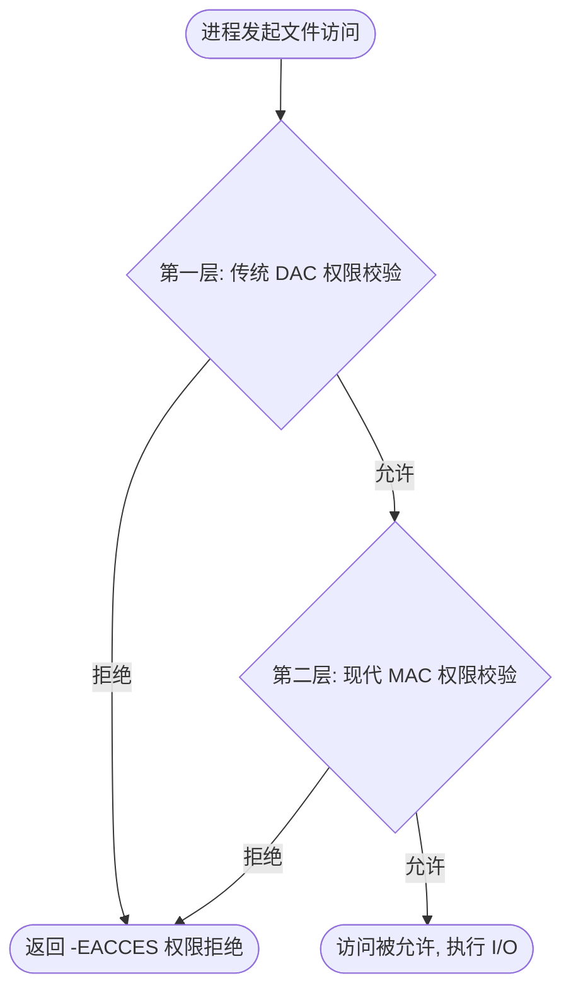

# 1.1.2.4 Linux文件系统

在操作系统中，文件系统是用于组织、存储、检索和管理持久化数据的核心系统组件。Linux 作为一个通用且高性能的类 Unix 操作系统，其文件系统设计在业界享有盛誉。Linux 不仅支持多种多样的物理文件系统（如 Ext4、XFS、Btrfs 等），还能无缝整合网络文件系统（如 NFS、CIFS）以及各类特殊或伪文件系统（如 procfs、sysfs、devtmpfs 等）。

本文将从最底层的物理磁盘存储、虚拟文件系统的抽象架构、路径解析的缓存优化、进程级文件描述符的映射关系，直至上层的安全权限模型，对 Linux 文件系统进行全方位的深度剖析。

---

## 1. 虚拟文件系统（VFS）的架构与设计哲学

### 1.1 诞生背景与演进
在计算机技术早期，每一种存储介质和每一种物理文件系统的读写逻辑都是高度特异化的。如果应用程序需要访问一个驻留在 FAT 文件系统上的文件，开发人员必须调用专属于 FAT 的操作接口；如果需要访问 ext2 上的文件，则又需要另一套接口。这种对底层数据排布细节的直接依赖，导致应用程序的可移植性极差，操作系统的内核也极其庞大且难以维护。

为了打破这种混乱，Linux 引入了 **虚拟文件系统（Virtual File System，简称 VFS）**。VFS 位于用户空间系统调用与具体物理文件系统实现之间，作为一个中间抽象层，它定义了所有文件系统必须实现的通用数据结构和接口规范。有了 VFS，无论底层的物理介质是机械硬盘、固态硬盘、网络存储还是内存，用户空间的应用程序都只需要调用统一的 POSIX 标准系统调用（如 `open`、`read`、`write`、`close`）即可实现无差别的读写。

### 1.2 VFS 的设计哲学：“一切皆文件”
Linux 最具代表性的设计哲学就是“一切皆文件”（Everything is a file）。在 Linux 系统中，不仅传统的文本文件和二进制程序是文件，目录（Directory）、硬设备（如磁盘 `/dev/sda`、终端 `/dev/tty`）、进程间通信的管道（Pipe）、网络套接字（Socket）、甚至是进程的运行状态信息（通过 `/proc` 呈现）都被统一抽象成了文件。

这一设计哲学的基石正是 VFS。VFS 为这些完全不同的实体规定了统一的软件接口。对于内核而言，任何能支持读取、写入、寻址等操作的实体，都可以注册为一个文件系统，并向 VFS 提供相应的操作函数集。这种高度统一的抽象使得系统内的各种资源能够以极简、优雅的方式进行交互。

### 1.3 VFS 的多层软件架构模型
在 Linux 的整个 I/O 路径中，VFS 起到了承上启下的纽带作用。从应用发起请求到磁盘响应，其软件栈的多层架构模型如下：

1. **应用层（User Space）**：用户进程通过标准的 POSIX API（如 `read(fd, buf, count)`）发起文件读写请求。
2. **系统调用层（System Call Interface, SCI）**：通过软中断或 CPU 架构的专用系统调用指令（如 `syscall`）陷入内核空间，将请求路由到内核的统一入口（如 `sys_read`）。
3. **虚拟文件系统层（VFS）**：内核的 VFS 模块接管请求，处理通用的路径解析、权限校验和文件锁管理，根据传入的文件描述符定位到代表该文件的内核对象。
4. **具体文件系统层（Concrete Filesystem）**：VFS 根据文件对象所属的文件系统类型（如 Ext4、XFS），将通用操作路由到具体的物理文件系统驱动。例如，调用 Ext4 专有的数据读取函数。
5. **页缓存层（Page Cache）**：为了提升性能，内核在内存中维护了一个高速页缓存。具体文件系统会优先在页缓存中检索数据，若命中则直接返回，无需发起物理 I/O。
6. **通用块设备层（Generic Block Layer）**：如果缓存未命中，请求将被转化为块 I/O 请求（使用 `struct bio` 描述），屏蔽了底层不同块设备的具体硬件细节。
7. **I/O 调度层（I/O Scheduler）**：对排队的 `bio` 请求进行合并与排序（如 BFQ、Kyber、DeadLine 算法），以最大化减少机械硬盘的磁头寻道时间，或优化固态硬盘的并发写入。
8. **设备驱动程序层（Device Driver）**：具体的控制器驱动（如 NVMe、SATA 驱动）通过总线（PCIe、SAS）与物理存储硬件通信，完成数据的实际读取或写入。

---

### 1.4 VFS 四大核心对象深度剖析
VFS 采用面向对象的设计思想（在 C 语言中通过“结构体 + 函数指针”来模拟多态）。VFS 定义了四个最核心的数据结构，被称为 VFS 的“四大核心对象”：

#### 1.4.1 超级块对象（`struct super_block`）
超级块代表一个已安装（Mounted）的具体物理文件系统的元数据。它描述了整个文件系统的全局配置、容量限制、块大小以及文件的管理结构。
- **生命周期**：在文件系统被 `mount` 挂载时，由内核从物理磁盘的特定扇区读取并常驻内存；当文件系统被 `umount` 卸载时，对应的超级块对象在内存中被销毁。
- **关键字段**（简化版定义）：
  ```c
  struct super_block {
      struct list_head    s_list;         /* 指向所有超级块的全局双向链表 */
      dev_t               s_dev;          /* 物理设备标识符 */
      unsigned long       s_blocksize;    /* 以字节为单位的逻辑块大小（如 4096） */
      unsigned char       s_blocksize_bits; /* 块大小的二进制位数（如 12） */
      loff_t              s_maxbytes;     /* 该文件系统支持的最大文件长度 */
      struct file_system_type *s_type;    /* 指向具体文件系统类型结构体 */
      const struct super_operations *s_op; /* 指向该超级块的操作方法集 */
      struct dentry       *s_root;        /* 该文件系统根目录的目录项对象 */
      struct list_head    s_inodes;       /* 属于该文件系统的所有内存 inode 链表 */
      void                *s_fs_info;     /* 指向具体文件系统的私有元数据（如 ext4_sb_info） */
  };
  ```
- **超级块操作方法集（`struct super_operations`）**：
  定义了针对该文件系统的全局操作，比如分配一个新的 inode、回收一个旧的 inode、将脏 inode 回写磁盘以及同步文件系统等：
  ```c
  struct super_operations {
      struct inode *(*alloc_inode)(struct super_block *sb);
      void (*destroy_inode)(struct inode *);
      void (*dirty_inode) (struct inode *, int flags);
      int (*write_inode) (struct inode *, struct writeback_control *wbc);
      void (*drop_inode) (struct inode *);
      void (*evict_inode) (struct inode *);
      int (*sync_fs)(struct super_block *sb, int wait);
      ...
  };
  ```

#### 1.4.2 索引节点对象（`struct inode`）
索引节点代表文件系统中的一个具体文件（或目录、软链接等）的元数据实体。**请注意，在 Linux 中，文件的物理元数据与文件名是完全分离的，inode 中绝不包含文件名。**
- **生命周期**：当某个文件被访问时，其 inode 从磁盘的 inode table 中被读取并加载到内存；当文件的引用计数归零且内存紧张时，其在内存中的 inode 可能会被销毁。
- **关键字段**：
  ```c
  struct inode {
      umode_t             i_mode;         /* 文件的类型与访问权限掩码 */
      unsigned short      i_opflags;
      uid_t               i_uid;          /* 文件所有者的用户 ID */
      gid_t               i_gid;          /* 文件所属用户组的组 ID */
      unsigned int        i_flags;
      const struct inode_operations *i_op; /* 索引节点操作方法集 */
      struct super_block  *i_sb;          /* 指向所属的超级块对象 */
      unsigned long       i_ino;          /* 在当前文件系统内唯一的 inode 号 */
      atomic_t            i_count;        /* 内存中该 inode 的引用计数 */
      unsigned int        i_nlink;        /* 磁盘上指向该 inode 的硬链接计数 */
      loff_t              i_size;         /* 以字节为单位的文件长度 */
      struct timespec64   i_atime;        /* 最后访问时间 (Access Time) */
      struct timespec64   i_mtime;        /* 最后修改内容时间 (Modify Time) */
      struct timespec64   i_ctime;        /* 最后修改元数据时间 (Change Time) */
      const struct file_operations *i_fop; /* 默认的文件操作方法集 */
      struct list_head    i_dentry;       /* 指向所有与该 inode 关联的 dentry 链表表头 */
      union {
          struct block_device *i_bdev;    /* 若是块设备文件，指向对应的块设备 */
          struct cdev         *i_cdev;    /* 若是字符设备文件，指向对应的字符设备 */
      };
      void                *i_private;     /* 具体文件系统的私有数据 */
  };
  ```
- **索引节点操作方法集（`struct inode_operations`）**：
  它主要定义了对文件元数据（比如创建、删除、重命名文件，以及读取符号链接等）的操作：
  ```c
  struct inode_operations {
      struct dentry * (*lookup) (struct inode *,struct dentry *, unsigned int);
      int (*create) (struct inode *,struct dentry *, umode_t, bool);
      int (*link) (struct dentry *,struct inode *,struct dentry *);
      int (*unlink) (struct inode *,struct dentry *);
      int (*symlink) (struct inode *,struct dentry *,const char *);
      int (*mkdir) (struct inode *,struct dentry *,umode_t);
      int (*rmdir) (struct inode *,struct dentry *);
      int (*rename) (struct inode *, struct dentry *, struct inode *, struct dentry *);
      int (*setattr) (struct dentry *, struct iattr *);
      int (*getattr) (const struct path *, struct kstat *, u32, unsigned int);
      ...
  };
  ```

#### 1.4.3 目录项对象（`struct dentry`）
目录项代表文件路径中的一个分量（Component）。例如路径 `/usr/bin/python`，其中 `/`、`usr`、`bin`、`python` 分别对应一个 `struct dentry` 对象。
- **设计目的**：目录项在物理磁盘上并没有直接对应的连续存储结构，它完全是内核为了加速路径解析而在内存中动态构建的一种**路径缓存**。通过将文件名与它的 inode 绑定，VFS 可以快速沿着目录树进行向下索引。
- **关键字段**：
  ```c
  struct dentry {
      unsigned int d_flags;
      seqcount_t d_seq;               /* 目录项序列号，用于无锁 RCU 路径解析 */
      struct hlist_node d_hash;       /* 挂载到全局 Dcache 哈希表的节点 */
      struct dentry *d_parent;        /* 指向父目录的 dentry 实例 */
      struct qstr d_name;             /* 目录分量的名称（含 Hash 值与字符串内容） */
      struct inode *d_inode;          /* 指向该目录项对应的 inode。如果是负状态，则为 NULL */
      unsigned char d_iname[DNAME_INLINE_LEN]; /* 短文件名存放的缓冲区，避免小内存分配 */
      struct lockref d_lockref;       /* 结合了自旋锁与引用计数的复合变量 */
      const struct dentry_operations *d_op; /* 目录项操作集 */
      struct super_block *d_sb;       /* 指向文件系统超级块 */
      struct list_head d_lru;         /* 挂载到全局最近最少使用 (LRU) 链表的节点 */
      struct list_head d_subdirs;     /* 挂载所有子目录项的链表表头 */
      struct list_head d_child;       /* 挂载到父目录的 d_subdirs 链表中的节点 */
      struct hlist_node d_alias;      /* 挂载到同一 inode 的 dentry 别名链表中的节点 */
  };
  ```
- **目录项的三种状态**：
  1. **活跃状态（Active）**：对应的 `d_inode` 指向一个有效的 `inode`，且该目录项的内存引用计数大于 0。此时该目录项不能被释放，且正在被系统所使用。
  2. **未使用状态（Unused）**：对应的 `d_inode` 指向一个有效的 `inode`，但引用计数为 0。这意味着当前没有进程在访问该路径分量，但内核将其保留在高速缓存中，随时准备被后续请求复用。当系统发生严重的内存不足时，LRU 回收机制会清理这类目录项。
  3. **负状态（Negative）**：对应的 `d_inode` 为 `NULL`。这代表在查找过程中，该路径分量对应的物理文件在磁盘上确定不存在。内核缓存负状态目录项的目的是为了快速拒绝后续对该不存在路径的重复请求，从而避免触发昂贵的磁盘搜索操作。

#### 1.4.4 文件对象（`struct file`）
文件对象代表进程打开的一个文件实例。它只存在于内存中，是在进程调用 `open` 系统调用时由内核动态创建的。
- **设计目的**：记录进程与该文件交互的所有动态上下文信息。如果一个文件被同一个进程打开了三次，或者被三个不同的进程分别打开，内核中会产生三个完全独立的 `struct file` 对象，但它们内部的 `f_path.dentry` 指向的都是同一个 `struct dentry`（进而指向同一个 `struct inode`）。
- **关键字段**：
  ```c
  struct file {
      union {
          struct llist_node   fu_llist;   /* 挂载到内核文件对象回收链表 */
          struct rcu_head     fu_rcuhead; /* 用于 RCU 垃圾回收 */
      } f_u;
      struct path             f_path;     /* 包含该文件的 dentry 以及挂载点 (vfsmount) */
      struct inode            *f_inode;   /* 缓存指向 f_path.dentry->d_inode 的指针 */
      const struct file_operations *f_op; /* 指向文件操作方法集 */
      spinlock_t              f_lock;     /* 保护 f_pos 等字段的自旋锁 */
      atomic_long_t           f_count;    /* 文件对象的引用计数 */
      unsigned int            f_flags;    /* 打开时的标志位（如 O_NONBLOCK, O_APPEND） */
      fmode_t                 f_mode;     /* 打开模式（如 FMODE_READ, FMODE_WRITE） */
      loff_t                  f_pos;      /* 当前文件的读写偏移量 (File Offset) */
      struct fown_struct      f_owner;    /* 接收文件 I/O 信号的进程上下文 */
      void                    *private_data; /* 具体文件系统或字符设备的私有指针 */
      ...
  };
  ```
- **文件操作方法集（`struct file_operations`）**：
  这是内核中与应用层系统调用最紧密相连的一组接口，也是设备驱动开发和物理文件系统实现的最核心接口：
  ```c
  struct file_operations {
      struct module *owner;
      loff_t (*llseek) (struct file *, loff_t, int);
      ssize_t (*read) (struct file *, char __user *, size_t, loff_t *);
      ssize_t (*write) (struct file *, const char __user *, size_t, loff_t *);
      int (*mmap) (struct file *, struct vm_area_struct *);
      int (*open) (struct inode *, struct file *);
      int (*flush) (struct file *, fl_owner_t id);
      int (*release) (struct inode *, struct file *);
      int (*fsync) (struct file *, loff_t, loff_t, int datasync);
      long (*unlocked_ioctl) (struct file *, unsigned int, unsigned long);
      ...
  };
  ```

---

## 2. inode 的底层设计与磁盘存储

### 2.1 磁盘物理结构与逻辑格式化
外部存储介质（如 HDD 机械硬盘）的最小物理读写单位是扇区（Sector），传统大小为 512 字节，现代高级格式化（AF）硬盘通常为 4KB。固态硬盘（SSD）的物理读写基本单位则是页（Page，如 4KB/8KB），而擦除单位则是块（Block，如数 MB）。

为了提升 I/O 效率并与操作系统的虚拟内存分页机制（Page Frame，通常为 4KB）对齐，文件系统在逻辑上将连续的物理扇区划分为**文件系统块（File System Block）**。在 Linux 常见的 Ext4 文件系统中，默认的块大小被设置为 4KB。

当我们对一个磁盘分区进行 Ext4 格式化时，整个分区会被划分成许多个相互独立的**块组（Block Group）**。块组的设计主要是为了增强空间局部性：尽量将同一个文件的元数据（inode）与其具体的数据块（Data Blocks）存放在相同的块组内，从而极大缩短机械硬盘磁头的移动距离，提高寻道效率。

Ext4 单个块组的逻辑排布示意图如下：

| Boot Block (启动块，仅分区首块) | Super Block (超级块副本) | Group Descriptors (组描述符表) | Block Bitmap (块位图) | inode Bitmap (inode 位图) | inode Table (inode 节点表) | Data Blocks (数据块区域) |
| :--- | :--- | :--- | :--- | :--- | :--- | :--- |

1. **启动块（Boot Block）**：占用分区的最前 1KB 空间，专用于存放引导加载程序（如 GRUB），VFS 并不对其进行数据管理。
2. **超级块（Super Block）**：保存当前文件系统的全局元数据。为了防止硬件故障导致整个文件系统损坏，超级块会在多个块组中存放冗余的备份。
3. **组描述符表（Group Descriptor Table, GDT）**：用于描述当前分区所有块组的参数信息（如该块组的块位图、inode 位图、inode 表的起始物理位置）。
4. **块位图（Block Bitmap）**：占用 1 个块的空间。每一位（bit）对应一个数据块的占用状态。如果块大小为 4KB，则 1 块大小的块位图能管理 $4096 \times 8 = 32768$ 个块。
5. **inode 位图（inode Bitmap）**：占用 1 个块的空间。每一位代表 inode 表中对应位置的 inode 号是否已被分配。
6. **inode 节点表（inode Table）**：用于存放该块组包含的所有 `struct ext4_inode` 实体。在 Ext4 中，每个磁盘 inode 默认占用 256 字节。
7. **数据块区域（Data Blocks）**：存放文件的真实内容数据，或者是存放目录项的目录文件块。

---

### 2.2 inode 磁盘与内存映射
在磁盘上的 inode 表中，每个 inode 拥有固定的大小且连续排布。因此，内核只需要知道 inode 的编号（inode Number）以及该分区 block 0 的偏移量，就能通过简单的代数计算，定位到该 inode 在磁盘上的确切物理扇区地址。

当应用程序需要读写文件时，内核首先根据 inode 编号定位到对应的磁盘块，将其读入内存，并把这些物理数据填充到 VFS 的 `struct inode` 内存结构体中。

在磁盘上，`struct ext4_inode` 主要包含如下关键属性：
- **`i_mode`**：16 位的字段，标识文件类型（普通文件、目录、符号链接、管道等）以及 UGO 访问权限。
- **`i_uid` / `i_gid`**：所有者与组的所有权数值。
- **`i_size`**：表示文件的实际大小（字节数）。
- **`i_links_count`**：硬链接数。
- **`i_blocks`**：该文件当前所占用的 512 字节物理扇区总数。
- **`i_block[EXT4_N_BLOCKS]`**：共 60 字节的区域，它是决定如何定位文件数据块的关键。在早期的 Ext2/Ext3 中，它充当多级块映射表；在 Ext4 中，它被重新解释为 Extents（区段）树的根节点。

---

### 2.3 数据块寻址机制的演进

#### 2.3.1 传统的多级块映射（Block Mapping）
在早期的 Ext2/Ext3 文件系统中，`i_block[15]` 数组（15 个整型元素，每个占 4 字节）被用作直接和间接块指针表。其寻址体系设计如下：

- **前 12 个指针（`i_block[0]` 至 `i_block[11]`）**：**直接索引**。它们的值直接就是存放文件内容的数据块物理块号。如果文件系统逻辑块大小为 4KB，那么直接索引最多能寻址 $12 \times 4\text{KB} = 48\text{KB}$ 的文件。
- **第 13 个指针（`i_block[12]`）**：**一级间接索引**。它指向一个“索引块”，这个索引块内部存放的全部是 4 字节的块指针。对于 4KB 大小的索引块，它可以存放 $4096 / 4 = 1024$ 个块指针。因此，一级间接索引可以寻址额外 $1024 \times 4\text{KB} = 4\text{MB}$ 的文件大小。
- **第 14 个指针（`i_block[13]`）**：**二级间接索引**。它指向一个一级间接索引块，进而再指向实际的数据块。因此，二级间接索引能额外寻址 $1024 \times 1024 \times 4\text{KB} = 4\text{GB}$ 的容量。
- **第 15 个指针（`i_block[14]`）**：**三级间接索引**。它通过三层索引关系最终指向数据块。其最大寻址范围为 $1024 \times 1024 \times 1024 \times 4\text{KB} = 4\text{TB}$ 的容量。

通过上述多级间接块的组合，该文件系统支持的单文件理论最大容量为：
$$\text{Max File Size} = 48\text{KB} + 4\text{MB} + 4\text{GB} + 4\text{TB} \approx 4.004\text{TB}$$

##### 💡 传统多级块映射的缺陷：
1. **大文件访问的高 I/O 延迟**：当读写一个数十 GB 的大文件，且访问的偏移量较大时，内核必须先读取多级间接索引块才能知道目标数据块的物理位置。虽然内存中有缓存，但解引用深度过大依然会带来 CPU 开销，并且如果缓存失效，将带来多次额外的随机磁盘 I/O。
2. **碎片化严重**：在写入大文件时，内核每次只能以 4KB 块为单位分配空间。如果磁盘空间不够连续，或者系统运行时间过长，物理块的分配将极度零碎。这会导致文件的连续读取退化为随机读取，对机械硬盘的性能是毁灭性的打击。

---

#### 2.3.2 现代的 Extents（区段）机制
为了彻底克服多级块映射的缺陷，Ext4 文件系统引入了 **Extents（区段）** 机制。其核心思想是：**不要用无数个零碎的指针去一对一记录每个 4KB 数据块，而是用一段连续的物理空间来描述一块连续写入的文件数据。**

一个 Extent 能够用一个简单的三元组表示：`(起始逻辑块号, 连续的物理块个数, 起始物理块号)`。
例如，一个大小为 100MB 且连续写入磁盘的文件，在多级映射下需要记录 25,600 个块指针；而在 Extents 机制下，只需要 1 个 Extent 条目即可完成寻址。

在内核中，Extents 被组织为一棵红黑树状的区段树。树的每一个节点都以一个通用的头部结构 `ext4_extent_header` 开始：
```c
struct ext4_extent_header {
    __le16  eh_magic;       /* 魔法值，固定为 0xF30A */
    __le16  eh_entries;     /* 当前节点中实际包含的有效条目数 */
    __le16  eh_max;         /* 当前节点能容纳的最大条目数 */
    __le16  eh_depth;       /* 树的深度。若是叶子节点则为 0；若是索引节点则大于 0 */
    __le32  eh_generation;  /* 文件系统代数 */
};
```
当 `eh_depth == 0` 时，说明当前节点是**叶子节点**。头部后面紧跟的是一组区段描述符 `struct ext4_extent`，直接描述物理块映射：
```c
struct ext4_extent {
    __le32  ee_block;       /* 当前区段所覆盖的文件起始逻辑块号 */
    __le16  ee_len;         /* 连续物理块的个数（最高位为 1 代表未初始化，最长 32768 个块） */
    __le16  ee_start_hi;    /* 连续物理块起始地址的高 16 位 */
    __le32  ee_start_lo;    /* 连续物理块起始地址的低 32 位 */
};
```
当 `eh_depth > 0` 时，说明当前节点是**内部索引节点**。头部后面紧跟的是一组索引条目 `struct ext4_extent_idx`，指向下一层的 Extents 树节点：
```c
struct ext4_extent_idx {
    __le32  ei_block;       /* 该索引项所覆盖的文件起始逻辑块号 */
    __le32  ei_leaf_lo;     /* 下一层叶子或索引节点的物理块号的低 32 位 */
    __le16  ei_leaf_hi;     /* 下一层叶子或索引节点的物理块号的高 16 位 */
    __le16  ei_unused;
};
```

##### 🌟 Extents 的物理排布与树的分裂
在 Ext4 inode 中，原先存放 15 个块指针的 `i_block` 数组（共 60 字节）被用来存放这棵 Extents 树的根节点。
- **浅树高度**：根节点空间可容纳 1 个 `ext4_extent_header`（12 字节）和最多 4 个 `ext4_extent` 或 `ext4_extent_idx` 条目（每个 12 字节）。如果文件的区段数小于等于 4，整棵树完全内置在 inode 中，不需要分配额外的物理块来存放树节点，解析时间复杂度为 $O(1)$。
- **分裂与增高**：如果文件的连续性较差，产生了第 5 个区段，内核会在磁盘上分配一个新的 4KB 物理块，将根节点转换为索引节点（`eh_depth` 变为 1），并将 4 个区段数据移动到新分配的物理块中（该物理块作为叶子节点，可以容纳大约 340 个区段条目），而根节点只保留 1 个指向该叶子节点的索引条目。

##### 🚀 性能优势：
1. **I/O 寻址开销骤降**：对于高度连续的大文件，树的深度几乎总是 0 或 1。即使是 TB 级的大文件，其物理块解析也只需 1 到 2 次内存寻址。
2. **极佳的物理连续性**：Extents 机制鼓励物理文件系统在分配磁盘空间时使用“多块分配器”（Multi-Block Allocator, mballoc）和“延迟分配”（Delayed Allocation）技术，最大化保障数据的连续写入，提升机械磁盘的顺序读写效率，并减轻 SSD 内部的垃圾回收（GC）压力。

---

### 2.4 硬链接与软链接的内核级对比

#### 2.4.1 硬链接（Hard Link）
- **内核实现**：硬链接是直接在文件所在目录的数据块中新建一个目录项（dentry），这个新目录项的文件名与原文件名不同，但是它们内部的 `d_inode` 指针都指向**同一个物理 inode 号**。
- **引用计数机制**：创建硬链接时，该物理 inode 中的链接计数 `i_nlink` 会递增 1。
- **特征与硬约束**：
  - **不能跨物理分区**：不同的文件系统分区拥有各自独立的 inode 空间，如果在另一个分区创建硬链接，会导致 inode 编号的语义发生冲突。
  - **不允许目录硬链接**：如果允许对目录进行硬链接，那么文件系统的目录树可能形成环路（Loop）。这会导致在执行深度的目录递归搜索（如 `find`）时发生死循环，且垃圾回收机制也将难以处理环中的孤立节点。

#### 2.4.2 软链接（Symbolic Link / 符号链接）
- **内核实现**：软链接是一个**完全独立的新文件**，内核会为其分配一个全新的物理 inode 号。
- **内容数据**：该软链接文件的数据块中存储的内容是目标文件的**路径字符串**（如 `/usr/bin/python`）。
- **快速符号链接（Fast Symbolic Link）优化**：为了避免为一个小小的路径名单独在磁盘上分配一个 4KB 的数据块，内核做了一个极具智慧的优化：如果路径字符串长度小于 60 字节，内核会直接将这个字符串写入该软链接 inode 内部的 `i_block[15]` 数组区域。由于免去了对物理块的分配和读取，这种软链接的加载速度几乎与硬链接无异。
- **特征与硬约束**：
  - **支持跨分区**：由于它只保存了目标路径的字符串，因此可以穿透不同的物理设备和挂载点。
  - **允许对目录创建**。
  - **断链隐患**：如果目标文件被删除或重命名，软链接文件的内容不会自动更新，它会指向一个空地址，成为悬空的“断链”。

---

### 2.5 元数据一致性与日志机制（Journaling）
在传统的非日志文件系统（如 Ext2）中，对文件进行写操作可能需要更新多个元数据区域（例如：在向文件追加数据时，必须同时修改：1. 块位图以分配新块；2. inode 结构中的文件大小和时间戳；3. 实际的数据块）。如果系统在写入这三个区域的中间过程因断电或内核崩溃而终止，就会发生文件系统的元数据状态不一致（例如块位图标记已被占用，但 inode 却并没有指向这个块）。

为了解决该一致性隐患，老一代系统在启动时必须运行 `fsck`（File System Check）。它需要扫描整个磁盘的 inode 表和位图，重新校验一致性。对于现代 TB 甚至 PB 级的磁盘，这一全盘扫描过程需要数小时乃至数天，是生产环境无法承受的。

为此，现代 Linux 文件系统（如 Ext4）引入了 **日志（Journaling）** 机制。即在磁盘上开辟出一块连续的闭环区域（Journal 区）。在修改任何元数据前，先将这些修改操作顺序写入日志区，称为“预写日志”（Write-Ahead Logging）。一旦日志写入成功（称该事务已提交），即使后续向真实数据区写入时发生断电，系统在重新启动时也只需要扫描并重放（Redo）极小的日志事务即可，时间通常在秒级。

Ext4 支持以下三种日志模式（可在挂载时通过 `data=` 参数指定）：

1. **`data=journal`**：
   - **机制**：文件的元数据和实际数据都会被首先写入日志区，然后再写入最终的数据块。
   - **优缺点**：最安全，断电绝不会丢失任何数据和元数据一致性；但是性能最差，因为所有数据都在磁盘上被写入了两次。
2. **`data=ordered`（默认模式）**：
   - **机制**：内核保证在将文件的元数据提交到日志区之前，其对应的真实文件数据已经成功写入了对应的数据块。
   - **优缺点**：性能与安全的折中选择。既能防止因突然断电导致旧元数据指向垃圾数据的风险，性能又大幅优于 `journal` 模式。
3. **`data=writeback`**：
   - **机制**：元数据写入日志和实际数据写入最终数据块之间没有任何顺序约束。
   - **优缺点**：性能最高；但是一旦突然断电，虽然元数据一致性可以通过日志得以保全，但刚刚写入的文件尾部可能会暴露出其他文件留下的敏感旧数据。

---

## 3. dentry 目录项缓存（Dcache）与路径解析流程

### 3.1 Dcache 的引入动机
路径名解析（Pathname Lookup）是文件系统中最频繁被触发的操作之一。例如在运行一个程序时，内核必须沿路查找所有的目录。如果每次查找分量都需要访问磁盘，由于磁盘的物理寻道延迟与内存操作有多个数量级的鸿沟，系统性能将会极其低下。

为了彻底解决这一性能瓶颈，VFS 引入了 **dentry 目录项缓存（简称 Dcache）**。Dcache 将整个路径解析的分量以树状图的形式缓存在 RAM 中。后续的路径访问几乎可以 $100\%$ 在 Dcache 中通过无锁的哈希表查找快速完成，使得整体查找效率从磁盘级的毫秒级直接降至内存纳秒级。

---

### 3.2 Dcache 的核心三驾马车
Dcache 本质上是由三个相互配合的底层数据结构组成的复合缓存体系：

#### 3.2.1 全局哈希表 `dentry_hashtable`
- 为了达到 $O(1)$ 的时间复杂度，VFS 在内存中维护了一个巨大的 `dentry_hashtable`。
- 哈希的 Key 是由 **父目录的 `struct dentry` 指针** 与 **当前分量的文件名字符串**（例如 `"bin"`）共同进行 hash 计算得到的。
- 通过这套哈希表，内核可以省去对父目录 inode 下所有子目录的线性搜索，直接通过父 dentry 和子文件名秒级定位子 dentry 的地址。

#### 3.2.2 全局 LRU 链表
- 那些没有被任何进程占用（即引用计数归零）但依然代表真实物理文件的 dentry，会被挂载到全局的最近最少使用（LRU）双向链表中。
- 当操作系统面临物理内存耗尽，触发内存回收机制（Shrinker）时，回收线程会从该 LRU 链表的尾部开始剥离这些 dentry，断开它们与对应 inode 的关联，并释放其占用的物理内存。

#### 3.2.3 inode 关联别名链表
- 由于硬链接的存在，同一个 `struct inode` 在不同路径下可以有不同的名称，也就是说可以有多个不同的 dentry 指向同一个 inode。
- 为了能够高效管理这些关系，`struct inode` 内部拥有一个双向链表表头 `i_dentry`，所有指向这个 inode 的 dentry 实例都会通过其 `d_alias` 字段连接到这个链表上。当 inode 被修改或被物理删除时，内核可以快速通知并失效所有关联的 dentry 高速缓存。

---

### 3.3 路径解析（Path Lookup）的核心流程

当进程执行 `open("/var/log/syslog", O_RDONLY)` 时，内核如何定位最终的 dentry？以下是其核心解析流程：

#### 步骤 1：解析初始化
- 内核在内部为路径查找初始化一个 `struct nameidata` 结构体，用于记录当前的解析进度。
- 判断路径开头字符：
  - 如果是 `/`，代表是绝对路径，查找的起点被设定为当前进程的 `task_struct->fs->root`（根目录的 dentry 及其挂载点信息）。
  - 如果不是 `/`，代表是相对路径，起点则被设定为当前进程的当前工作目录 `task_struct->fs->pwd`。

#### 步骤 2：逐级遍历分量
内核开始将完整的路径字符串拆分成独立的目录分量，并从起点开始一级一级向下查找。假设当前查找到 `/var`（对应的 dentry 为 `d_var`），接下来需要解析它的子项 `log`：
1. **快速查找路径（Fast Path）**：
   内核首先计算 `(d_var, "log")` 的哈希值，并在全局的 `dentry_hashtable` 中查找。
   - **如果命中**：获取到 `d_log` 指针。接着检查其状态。如果它是一个负状态的 dentry，直接终止解析并返回文件不存在的错误 `-ENOENT`；如果是一个正常的活跃 dentry，且经过了安全权限检查，则将当前处理指针移动到 `d_log`，继续解析下一级。
   - **如果未命中**：进入慢速查找路径。
2. **慢速查找路径（Slow Path）**：
   当 Dcache 中不存在子项的缓存时，内核必须发起对真实文件系统的读取：
   - 首先锁定父目录 `var` 的 inode。
   - 调用该 inode 的具体查找操作函数（如 `d_var->d_inode->i_op->lookup`）。
   - 该物理文件系统驱动会读取磁盘上 `var` 目录的数据块，在其中逐条比对文件名以找到 `"log"` 对应的 inode 号。
   - **如果存在**：从磁盘读取该 inode 的元数据，在内存中实例化 `struct inode`，并创建一个新的 `struct dentry` 实例，将两者绑定，然后插入到全局的 `dentry_hashtable` 中，供下次复用。
   - **如果不存在**：内核同样会创建一个特殊的 Negative dentry，其指向的 `d_inode` 为 `NULL`，并存入哈希表中，这样下次再访问这个不存在的路径时，就可以在 Fast Path 中被直接拦截。

#### 步骤 3：处理边界与重解析
- **挂载点穿透（Follow Mount）**：
  如果解析出的 dentry 是一个挂载点（例如 `/mnt/usb`，它被标记了 `d_managed` 标志），内核在继续解析之前，必须通过全局的挂载哈希表找到该挂载点对应的被挂载文件系统的根目录 dentry（即挂载文件系统的 `struct vfsmount` 对应的 root dentry）。此时，路径解析的上下文会无缝切换到新文件系统的虚拟根目录上。
- **符号链接解析（Symlinks）**：
  如果在路径解析的中途遇到了一个软链接文件，内核必须读取其中的路径字符串，并用其覆盖后续的解析流。为了防范恶意的嵌套循环软链接耗尽系统栈资源，Linux 内核对符号链接的嵌套递归深度有着极硬的防御上限：单个路径解析中符号链接的嵌套深度不能超过 32，总体的符号链接解析次数不得超过 40，否则直接返回 `-ELOOP` 错误。

---

### 3.4 路径解析中的高并发优化：RCU-walk 机制
在多核服务器环境下，大量的线程可能同时发起对公共文件（如动态链接库、配置文件）的查找和读取。在传统的路径解析中，每一次找到一个 dentry，都必须对其引用计数（Refcount）执行原子加操作，释放时执行原子减操作。

虽然单次原子操作开销不大，但在 128 核乃至更高级别的服务器上，成百上千个 CPU 核心对同一个 dentry 的引用计数进行频繁修改，会导致承载该计数的内存 Cacheline 在不同的 CPU Cache 之间反复失效和转移（这种现象被称为 **Cacheline Bouncing**），造成极大的多核总线延迟。

为了解决多核扩展性瓶颈，从 Linux 3.1 内核开始，引入了极致优化的 **RCU-walk** 路径查找模式。

#### 3.4.1 RCU-walk 与 Ref-walk 的对比

| 维度 | RCU-walk 模式 (高效只读通道) | Ref-walk 模式 (经典安全通道) |
| :--- | :--- | :--- |
| **锁机制** | 完全无锁，不获取任何锁，依赖 `rcu_read_lock()`。 | 依赖自旋锁或信号量，获取目录或 dentry 的读写锁。 |
| **引用计数** | **不增加**任何 dentry 的引用计数，只读不写。 | 每次查找命中都通过原子操作**递增**引用计数 `dget()`。 |
| **执行约束** | **严禁睡眠、阻塞**。一旦发生睡眠，系统将发生严重奔溃。 | 允许睡眠和阻塞，可以执行复杂的磁盘 I/O。 |
| **应对未命中** | 无法处理 Dcache 未命中，遇到未命中必须退化。 | 允许通过发起磁盘 I/O 完成慢速加载。 |

#### 3.4.2 RCU-walk 的运行流程与退化保护
1. **启动阶段**：默认情况下，路径解析一律以 RCU-walk 模式启动。在此期间，整个查找路径受到 `rcu_read_lock()` 的保护。这确保了在解析进行时，即使其他线程删除了当前的目录树分量，其占用的 dentry 和 inode 内存也不会被立刻释放，而是会延迟到 RCU 宽限期（Grace Period）结束后再进行物理回收。
2. **安全性校验（Sequence Lock）**：为了防止在查找的瞬间，其他线程对该 dentry 的名字或父子关系进行修改（如重命名 `rename` 导致拓扑错乱），内核引入了顺序锁机制。在读取 dentry 信息前后，会比对 `d_seq`。如果检测到顺序号发生改变，说明数据被并发修改，当前查找结果失效。
3. **安全退化（Fallback）**：如果在 RCU-walk 解析中遇到了特殊情况，例如：
   - Dcache 未命中，必须读取磁盘。
   - 遇到了需要睡眠的软链接文件。
   - 检测到并发修改（`d_seq` 校验失败）。
   
   此时，解析线程会执行 `unlazy_walk()`，优雅地退出 RCU-walk，回退到经典的 Ref-walk 模式。它会为当前已经找到的 dentry 补上引用计数，然后获取相应的自旋锁，允许线程进入睡眠并安全地执行磁盘 I/O 操作。

---

## 4. 文件描述符表（FD Table）与内核映射关系

对于用户空间的进程，操作一个打开文件的唯一句柄就是非负整数——文件描述符（fd）。而在 Linux 内核内部，这个 fd 最终需要与超级块、inode、dentry 等复杂的 VFS 实体建立起稳固且一致的级联映射。

### 4.1 进程级联结构：`task_struct` 到底层 VFS 的寻址链
在 Linux 内核中，每个进程都有一个进程控制块 `struct task_struct`。该结构体中包含一个指向文件信息表的指针 `files`：


1. **`struct task_struct`**：代表进程主体，包含执行状态、调度参数、内存控制块、信号处理等。
2. **`struct files_struct`**：管理该进程打开的所有文件。
3. **`struct fdtable`**：核心的文件描述符表，其中包含：
   - `max_fds`：当前允许打开的最大描述符上限。
   - `open_fds`：位图，每一位表示对应数字的 fd 是否已被占用。
   - `fd`：指向一个动态分配的 `struct file *` 指针数组的指针。
4. **文件描述符（fd）的本质**：文件描述符只是一个整型数字，其本质就是进程级指针数组 `fdtable->fd` 的 **数组下标**！例如，当你的代码调用 `read(3, buf, size)` 时，内核便会直接获取 `fdtable->fd[3]` 指针所指向的 `struct file`。

---

### 4.2 深入多进程视角下的文件共享机制
进程之间的文件共享非常普遍，得益于“进程描述符表 $\rightarrow$ 系统打开文件表 $\rightarrow$ 物理 inode”的三层解耦架构，Linux 能够清晰地划分为两类不同的共享模型。

#### 4.2.1 模式一：两个独立的进程打开同一个文件
如果进程 A 和进程 B 在各自的代码中都调用了 `open("/data.txt", O_RDWR)`。
- **内核数据结构分布**：
  - 进程 A 的 fd 数组中某个位置（如 fd = 3）指向一个独立的 `struct file (实例 A)`。
  - 进程 B 的 fd 数组中某个位置（如 fd = 3）指向另一个完全独立的 `struct file (实例 B)`。
  - **关键点**：这两个 `struct file` 拥有**各自独立的文件读写偏移量（`f_pos`）**。
  - **指向的底层**：这两个独立的 `file` 实例的 `f_path.dentry` 指向同一个 `struct dentry`，进而指向同一个 `struct inode`。
- **行为表现**：
  - 进程 A 和进程 B 的读写操作是互不干扰的。例如进程 A 写入了 10 字节，其偏移量变为 10，进程 B 的读取偏移量依然是 0。这种行为适合进程之间各自独立读写公共配置或数据的场景。

#### 4.2.2 模式二：`fork` 派生或 `dup` 拷贝后的描述符共享
如果父进程已经打开了文件并获得 `fd = 3`，随后调用 `fork()` 产生子进程，或者在进程内执行 `dup2(3, 4)` 复制描述符。
- **内核数据结构分布**：
  - 对于 `fork`：子进程直接拷贝了父进程的 `files_struct`，子进程的 `fdtable->fd[3]` 与父进程的 `fdtable->fd[3]` **指向同一个系统级 `struct file` 实例**。
  - 对于 `dup`：同一个进程的 `fdtable->fd[3]` 和 `fdtable->fd[4]` **指向同一个系统级 `struct file` 实例**。
  - 此时，该 `struct file` 结构体内部的引用计数 `f_count` 会递增。
- **行为表现**：
  - **共享文件读写偏移量（`f_pos`）**！如果父进程通过 `fd = 3` 读取了文件的前 100 个字节，文件的偏移量 `f_pos` 变成了 100；此时子进程或通过 `fd = 4` 读取数据，将直接从第 101 个字节开始读取。
  - 这种机制是 Unix Shell 管道线和标准输入输出重定向能正常工作的底层基石。

---

### 4.3 `close-on-exec`（O_CLOEXEC）的核心价值与并发安全
在多线程环境下，进程间的文件描述符泄漏是一个严重的安全与资源问题。

#### 4.3.1 经典场景下的竞态条件
假设在一个多线程服务器进程中，线程甲打开了一个存放敏感私钥的文件，获得了 `fd = 5`。在此瞬间，另一个线程乙恰好执行了 `fork()` 并接着执行了 `execve()` 来启动一个外部的辅助日志收集程序。
- **问题**：在 `fork()` 时，子进程会自动拷贝父进程的所有文件描述符。这意味着启动的外部日志收集程序（其可能由第三方不受信任的脚本编写）继承了 `fd = 5`。
- **泄漏**：由于该外部程序没有被显式地关闭 `fd = 5`，它可以直接通过读取 `fd = 5` 来窃取敏感的私钥数据。

#### 4.3.2 O_CLOEXEC 的优雅解决方案
传统的做法是在 `fork()` 之后、`execve()` 之前，在子进程中显式调用 `close(5)`。但这在多线程环境中存在天然的竞态条件（Race Condition），因为 `fork` 与 `exec` 之间有一个时间空窗期，在此期间其他线程可能又打开了新的敏感文件。

为此，现代 Linux 引入了 `O_CLOEXEC` 打开标志（或通过 `fcntl` 设置 `FD_CLOEXEC` 位）：
- **底层机制**：在 `fdtable` 结构体中，有一个专门的 `close_on_exec` 位图。当给某个 fd 设置了 `O_CLOEXEC` 时，该位图中对应的 bit 会被置 1。
- **效果**：在子进程调用 `execve()` 载入新程序的瞬间，内核在清除当前进程用户空间内存之前，会自动扫描并检查 `close_on_exec` 位图，将所有置为 1 的文件描述符自动关闭。这种关闭是在内核的进程转换过程中原子执行的，彻底杜绝了敏感描述符泄漏的安全隐患。

---

## 5. Linux 文件系统权限模型

Linux 的权限管理体系是一个多层次、逐步收紧的防护网。当一个进程尝试读、写或执行一个文件时，内核会对其发起层层盘查。



---

### 5.1 经典的 UGO 权限模型与 DAC 自主访问控制
在 Linux 中，最基础的权限检查是**自主访问控制（Discretionary Access Control, DAC）**，其主要表现形式就是传统的 UGO（User、Group、Others）权限掩码。

#### 5.1.1 权限三原色（r, w, x）与数值表示
Linux 将文件的访问操作抽象为三种权限，以二进制的三位来表示：
- **读（r / Read）**：数值为 **4**（二进制 `100`）。
- **写（w / Write）**：数值为 **2**（二进制 `010`）。
- **执行（x / Execute）**：数值为 **1**（二进制 `001`）。

这三位被分别授予三类不同的社会主体：
1. **Owner (u)**：文件的所有者。
2. **Group (g)**：文件所属的用户组。
3. **Others (o)**：系统中的其他所有人。

组合起来就构成了经典的 9 位权限字符（如 `rwxr-xr-x`，对应八进制数 `755`）。

#### 5.1.2 普通文件与目录在权限定义上的本质差别
新手甚至有经验的开发人员都常常混淆目录和普通文件对这三个权限位的解释。内核在解析这三个权限位时，针对文件和目录的行为逻辑有着巨大的差别：

| 权限位 | 对普通文件的物理含义 | 对目录的物理含义 |
| :--- | :--- | :--- |
| **读（r）** | 允许读取文件的实际内容数据（如使用 `cat` 或读取文件流）。 | 允许**读取该目录下的文件列表**（如使用 `ls` 命令，查看有哪些子文件名）。 |
| **写（w）** | 允许修改文件的实际内容数据，但**不能删除或重命名该文件本身**。 | 允许**在该目录下新建、删除、重命名文件或子目录**，无论用户对那些子文件自身是否拥有写权限。 |
| **执行（x）** | 允许将该文件作为二进制程序或脚本放入内存并启动进程执行。 | 允许**穿透（进入）该目录**（如使用 `cd`），允许读取其下所有子文件的元数据（inode 属性）。**若没有 x 权限，即使有 r 权限，用户也仅能列出文件名，无法获取其大小、时间戳，更无法读取其内容。** |

#### 5.1.3 鉴权优先匹配机制（First Match Wins）
当一个进程尝试读写某个文件时，内核会将进程的有效用户 ID（EUID）和组 ID（EGID）与文件的所有权进行比对，比对严格按照以下顺序进行，且**一旦匹配就立刻中止判断**：
1. **第一步**：如果进程的 EUID 等于文件的 `inode->i_uid`，则内核只使用该文件所有者（Owner）的权限位进行校验。如果所有者权限中没有写权限（例如权限为 `r-x-rwx`，虽然他人有写权限，但所有者没有），写操作将被**立刻拒绝**。
2. **第二步**：如果 EUID 不匹配，但进程的 EGID（或辅助组 ID 列表中的任何一个）等于文件的 `inode->i_gid`，则内核只使用该文件所属组（Group）的权限位进行校验。
3. **第三步**：如果前两步均未匹配，内核使用其他人（Others）的权限位进行校验。

---

### 5.2 特殊权限位（SUID, SGID, SBIT）
除了基础的 9 位 UGO 权限，Linux 还提供了三个高位特殊权限位（SUID、SGID、SBIT），用于处理高权限提权、团队目录协作及公共目录防删除等边缘场景。

#### 5.2.1 SUID (Set User ID)
- **数值与表示**：八进制值为 **4000**。当被设置时，文件的所有者执行位会从 `x` 变为 `s`（若原本无执行权限则显示为大写 `S`）。
- **工作机制**：如果一个二进制可执行文件被设置了 SUID 权限，当任何普通用户运行该程序时，新启动的进程其**有效用户 ID（EUID）会被设置为该可执行文件的所有者的 UID**，而不仅仅是运行该程序的用户的 UID。
- **典型范例**：密码修改工具 `/usr/bin/passwd`。
  普通用户修改密码需要改动只允许 root 写入的超级敏感文件 `/etc/shadow`。因为 `/usr/bin/passwd` 的所有者是 `root`，且被赋予了 SUID，普通用户在运行它的瞬间，该进程拥有了 `root` 的有效权限，从而能够安全地将新密码写入 shadow 文件。
- **安全红线**：绝不能对解释型脚本（如 bash、python）设置 SUID，因为解释器本身的安全性缺陷会导致黑客轻松通过注入参数实现越权提权。

#### 5.2.2 SGID (Set Group ID)
- **数值与表示**：八进制值为 **2000**。在所属组执行位上显示为 `s` 或 `S`。
- **工作机制**：
  - **对可执行文件**：执行该程序的进程会临时获得该可执行文件所属用户组的权限。
  - **对目录（核心协作模式）**：当一个共享目录被设置了 SGID 后，任何有权限的用户在该目录下**创建的新文件或新子目录，其所属用户组会自动继承父目录的组**，而不是自动设为该创建者的主用户组。
- **典型范例**：研发团队共享项目目录。所有开发人员向项目目录写入代码时，创建的文件都自动属于 `dev_group`，使得组内其他成员能够持续修改，而不会因为创建者个人的私有属组而导致权限冲突。

#### 5.2.3 SBIT (Sticky Bit / 粘滞位)
- **数值与表示**：八进制值为 **1000**。在其他人执行位上显示为 `t` 或 `T`。
- **工作机制**：主要用于公共目录。当一个目录被设置了 SBIT 权限后，**只有文件的所有者、该目录的所有者、或者是 root 用户**，才被允许重命名或删除该目录下的文件。
- **典型范例**：系统临时目录 `/tmp`。
  所有用户都有权限在该目录下写入和删除（权限为 `drwxrwxrwt`）。如果没有 SBIT 保护，恶意用户可以直接通过 `rm -rf /tmp/*` 把其他用户正在使用的临时数据全盘抹去。SBIT 使得大家可以共享同一个临时文件夹，却绝无权干涉他人的文件。

---

### 5.3 POSIX Access Control Lists (ACL)

#### 5.3.1 经典 UGO 模型的局限性
在企业级多租户或多部门协作场景下，UGO 模型显得十分简陋。
例如，一个项目的核心文档 `report.pdf`，其所有者为 `project_lead`，所属组为 `lead_group`。现在，项目组需要将这个文档共享给审计部的特定审计员 `bob` 进行只读检查，但是不能让审计部的其他员工访问，更不能向外公开。
如果将 `bob` 加入 `lead_group`，他将获得项目组的写权限；如果把 `report.pdf` 的 Others 设为只读，那公司所有的普通员工又都能读取。UGO 模型根本无法实现这种针对“单一特定用户或特定组”的差异化授权。

#### 5.3.2 ACL 的精细化控制
为了提供更细粒度的控制能力，Linux 引入了符合 POSIX 标准的 **访问控制列表（Access Control Lists, ACL）**。ACL 允许系统管理员为任何特定的用户、特定的用户组，单独指定读、写、执行权限。

- **获取文件的 ACL 状态（`getfacl`）**：
  ```bash
  $ getfacl report.pdf
  # file: report.pdf
  # owner: project_lead
  # group: lead_group
  user::rw-
  group::r--
  other::---
  ```
- **为特定用户设置 ACL 权限（`setfacl`）**：
  给用户 `bob` 单独授予对该文件的只读（`r--`）权限：
  ```bash
  $ setfacl -m u:bob:r-- report.pdf
  ```
  再次使用 `getfacl` 查看，会发现文件权限结构中多出了个性化定制行：
  ```bash
  $ getfacl report.pdf
  # file: report.pdf
  # owner: project_lead
  # group: lead_group
  user::rw-
  user:bob:r--      # 针对特定用户的精细授权！
  group::r--
  mask::r--         # 权限掩码，限定除所有者之外的最大可能权限
  other::---
  ```
  如果使用传统的 `ls -l` 观察该文件，会发现其权限字符的末尾多出了一个加号 `+`（如 `-rw-r--r--+`），这代表该文件已经被应用了额外的 ACL 策略。

#### 5.3.3 底层磁盘存储：扩展属性（Extended Attributes）
由于 ACL 的条目数量是不可预测的，物理磁盘上固定大小（128/256 字节）的 inode 结构无法存放这一长串规则。
因此，文件系统利用了 **扩展属性（Extended Attributes, xattr）** 来存储 ACL。

- 扩展属性是文件系统提供的一种在文件内容（Data）与元数据（inode）之外，存放键值对 `(Name, Value)` 的机制。
- xattr 包含了四个主要命名空间：
  - `system.*`：内核内部使用，比如 `system.posix_acl_access` 用于存放当前文件的 ACL 访问控制表，`system.posix_acl_default` 用于目录的默认继承 ACL。
  - `security.*`：用于安全模块，例如存放 SELinux 的安全上下文标签。
  - `user.*`：供普通用户空间程序存储任意自定义元数据。
  - `trusted.*`：仅对拥有 `CAP_SYS_ADMIN` 能力的特权进程可见。
- **存储优化**：在 Ext4 中，如果扩展属性的总长度比较小，它会被直接塞入 inode 结构体内部多余的空闲空间中（称为 In-inode xattr），零延迟读取；如果内容过多，文件系统会单独分配一个物理块（EA Block）来存放这些属性。

---

### 5.4 安全上下文简述（LSM / DAC 与 MAC）
尽管 ACL 增强了权限管理的灵活性，但它依然基于 DAC 自主访问控制的架构体系。这意味着如果一个进程是以 `root` 用户的身份运行，那么它可以绕过所有的 DAC 校验，直接对系统内的所有文件进行不受限的读写。这就是“特权用户”的后门。

为了防止特权账户被劫持导致系统全面崩溃，Linux 引入了**强制访问控制（Mandatory Access Control, MAC）**。MAC 的运行基于内核的 **LSM（Linux Security Modules，Linux 安全模块）** 框架，其典型代表有 **SELinux** 和 **AppArmor**。

在 MAC 模式下，系统内的所有实体都被赋予了安全标记：
- **主体（Subject）**：正在运行的进程，会被贴上进程安全上下文（如 `system_u:system_r:httpd_t:s0`）。
- **客体（Object）**：系统内的所有物理文件、目录、套接字等，其 inode 会通过扩展属性（`security.selinux`）存储文件安全上下文。

无论发起请求的用户是谁（即使是超级用户 `root`），一旦其运行的进程不符合预先定义的 MAC 策略规则（Policy），任何越权访问都会被内核在 LSM 钩子函数（Hook）层面强行拦截并记录审计日志。这种双层校验极大地增强了现代 Linux 操作系统的内生安全性。

