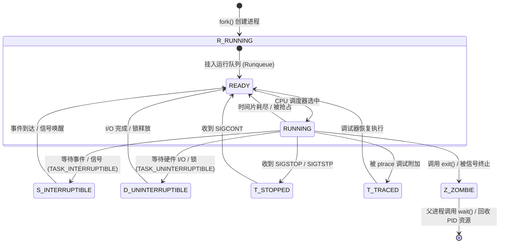
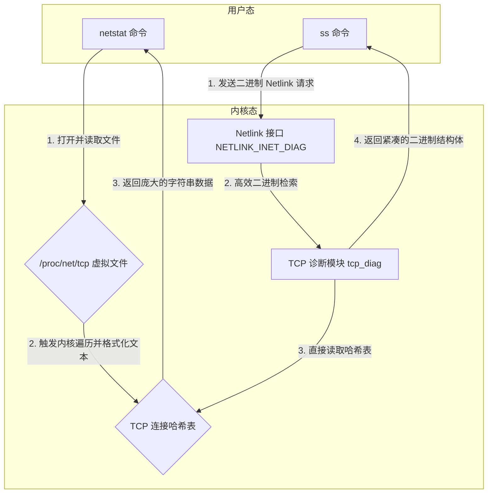
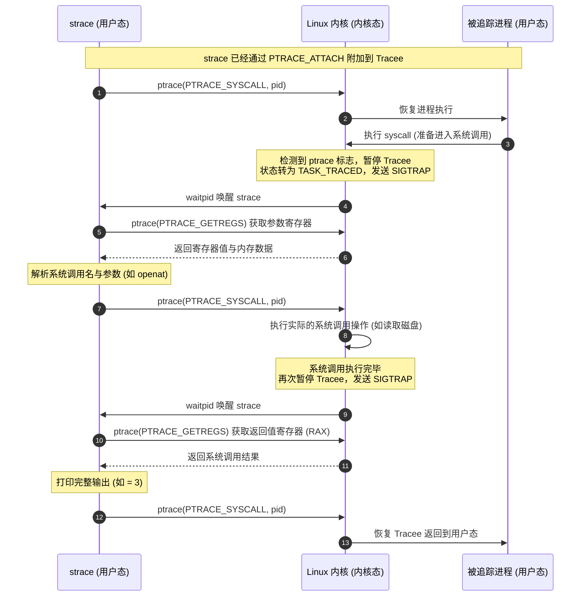
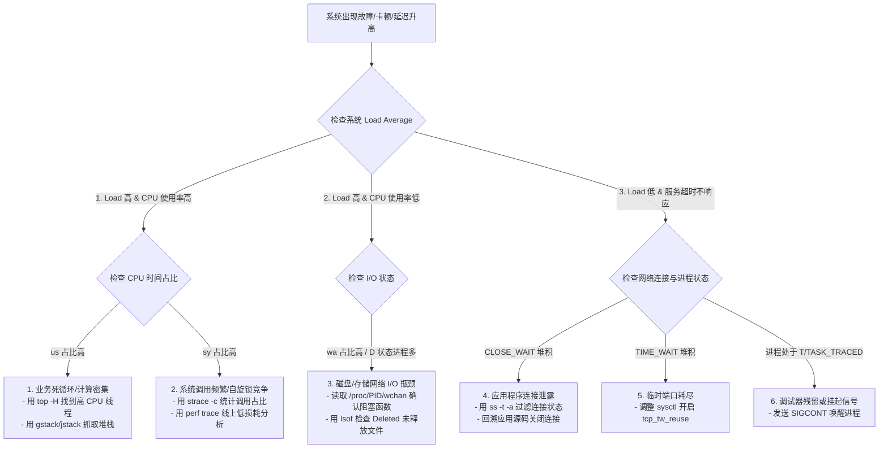

# 1.1.2.5 Linux常见命令

在 UNIX/Linux 系统的工程实践中，观测与调试命令是连接用户态应用与内核态底座的桥梁。理解命令的运行表现仅仅是第一步，能够透视这些命令底层的内核数据结构、文件系统机制以及匹配算法，才是系统工程师与架构师解决复杂生产故障的必备素养。本文将围绕“进程/线程查看”、“文件/网络连接”、“系统调用追踪”以及“文本处理三剑客”四大核心维度，深入解构 ps、top、htop、lsof、netstat、ss、strace、grep、sed、awk 等常见命令的内核级实现原理，并结合真实的生产排障场景，推演其排查路径与优化决策。

---

## 一、 进程与线程查看：ps 与 top/htop

### 1.1 ps 命令：进程状态的静态内核透视镜
`ps`（Process Status）命令是 Linux 系统中获取进程静态状态快照的首选工具。尽管其日常使用简单，但其参数设计的历史演进和输出中状态的内核本质，却蕴含着丰富的操作系统原理。

#### 1.1.1 命令行参数的历史演进与三大格式体系
`ps` 命令的参数解析机制是多重标准演进的产物，通常可以划分为以下三大格式体系：
1. **System V（SysV）风格**：参数前必须带有单连字符 `-`，例如 `ps -ef`、`ps -eLf`。这种风格来源于早期的 System V UNIX 操作系统，输出信息较为紧凑，侧重于系统管理属性。
2. **BSD 风格**：参数前绝对不能带有连字符，例如 `ps aux`、`ps ax`。这种风格来源于 Berkeley Software Distribution (BSD)，其输出默认包含资源消耗比例（如 `%CPU`、`%MEM`），并且状态列（`STAT`）有复杂的修饰符。
3. **GNU 风格**：参数前带有双连字符 `--`，例如 `ps --pid <PID>`。这是 GNU 对命令标准化的产物，提供了长参数的可读性。

在终端中执行 `ps -ef` 与 `ps aux` 时，其底层的行为解析完全不同：
* `ps -ef` 偏向于展示进程的世系关系（Parenthood），输出字段主要为 `UID`（用户 ID）、`PID`（进程 ID）、`PPID`（父进程 ID）、`C`（CPU 使用率近似值）、`STIME`（启动时间）、`TTY`（终端号）、`TIME`（累计 CPU 占用时间）、`CMD`（启动命令）。
* `ps aux` 偏向于展示进程的资源占用（Resources），输出字段主要为 `USER`、`PID`、`%CPU`、`%MEM`、`VSZ`（虚拟内存大小）、`RSS`（物理常驻内存大小）、`TTY`、`STAT`（进程状态）、`START`、`TIME`、`COMMAND`。

从内核实现角度看，无论是哪种风格，`ps` 工具最终都是通过遍历读取进程相关的虚拟文件系统 `/proc` 来获取数据的。例如读取 `/proc/[pid]/cmdline` 获取命令行参数，读取 `/proc/[pid]/stat` 和 `/proc/[pid]/status` 获取进程状态及资源标识。内核为每个进程在 `/proc` 目录下建立对应 PID 的目录，并在每次用户态发起读取时，通过 VFS（虚拟文件系统）将内核中进程控制块（PCB，即 `task_struct`）的信息动态转化为文本数据返回。

#### 1.1.2 进程状态在内核中的定义与转换机制（D/R/S/Z/T）
在 Linux 内核的定义中，每一个执行实体都对应一个 `task_struct` 结构体（定义在内核源码的 `include/linux/sched.h` 中）。其中，进程的运行状态存放在其 `__state` 字段（旧版本内核为 `state`）中。`ps` 状态列（`STAT`）所体现的字母，正对应了这些内核状态码。



##### 1.  R (TASK_RUNNING - 运行与就绪状态)
在内核中，`TASK_RUNNING` 状态表示进程正处于“可运行”状态。它包含两种物理情况：
* 进程当前正独占某个 CPU 核心执行其指令（运行态）。
* 进程已被唤醒，其 `task_struct` 挂载在某个 CPU 核心的 CFS 调度运行队列（Runqueue）中，正等待 CFS 调度器根据其虚拟运行时间（`vruntime`）分配 CPU 时间片（就绪态）。

对于处于 `TASK_RUNNING` 的就绪进程，内核并不会对其状态字段做进一步区分。它随时可以被调度器恢复现场并运行。

##### 2.  S (TASK_INTERRUPTIBLE - 可中断睡眠状态)
这是一种进程由于等待某种资源或事件而被阻塞的状态。例如，当进程尝试读取一个空的管道、等待网卡接收数据包、或者调用 `sleep` 系统调用等待定时器超时时，进程会主动调用调度函数 `schedule()`，将其 `__state` 修改为 `TASK_INTERRUPTIBLE`。
* **内核机制**：内核会把该进程的 `task_struct` 从 CPU 运行队列中移除，挂入与目标事件相关联的等待队列（Wait Queue）中，让出 CPU。
* **唤醒路径**：当等待的事件发生时（如数据到达产生中断，唤醒等待队列上的进程），或者当进程接收到任何系统信号（如 `SIGINT`、`SIGTERM`）时，内核会迅速将其唤醒，移回 CPU 运行队列，状态重新置为 `TASK_RUNNING`。

##### 3.  D (TASK_UNINTERRUPTIBLE - 不可中断睡眠状态)
处于该状态的进程通常正在与物理硬件设备进行直接交互，或者正在执行内核级临界区的排他性操作。最典型的场景是等待磁盘驱动器的 DMA 数据写入、等待 NFS（网络文件系统）的应答，或者是持有内核读写信号量（如进程的内存页表写锁）。
* **为何“不可中断”**：内核需要确保在此期间进程的执行流不会被任何外部信号打断。如果在进程进行关键的物理磁盘扇区写入或硬件寄存器配置时，突然被 `SIGKILL` 信号强行打断退出，将会导致底层文件系统元数据损毁、硬件设备状态机失控，甚至引起内核崩溃（Kernel Panic）。
* **为什么 `kill -9` 对其无效**：内核在调度处于 `TASK_UNINTERRUPTIBLE` 的进程时，完全屏蔽了信号检查机制。该进程对挂起在它的信号队列（Pending Signal Queue）中的所有信号均视而不见。只有当它所等待的硬件 I/O 完毕、或者持有的内核锁被释放，被内核调度代码显式调用 `wake_up()` 重新放回运行队列后，进程才能在返回用户态的过程中检测并响应 `SIGKILL` 信号。
* **排障切入点**：如果系统内产生大量 D 状态进程，通常意味着磁盘 I/O 硬件故障、存储网络（SAN/NAS）中断、或是内存资源极度紧张导致疯狂进行 Swap 换入换出。我们可以通过读取 `/proc/[pid]/wchan` 确认进程阻塞在哪个内核函数中。例如，看到 `nfs_wait_bit_uninterruptible` 则说明 NFS 服务端无响应；若看到 `rwsem_down_write_slowpath` 则说明进程卡在内核读写锁竞争中。进一步读取 `/proc/[pid]/stack` 可以直接提取该进程当前的内核调用栈（Call Stack），实现精确诊断。

##### 4.  Z (EXIT_ZOMBIE - 僵尸状态)
当一个进程通过 `exit()` 系统调用主动退出，或由于接收到致命信号被内核强行终止时，它会进入退出流程（`do_exit`）。
* **内核残留物**：内核会释放该进程所占用的几乎所有物理资源，包括其虚拟内存页表、打开的文件描述符、信号处理表以及拥有的命名空间等。但是，内核必须保留其 `task_struct` 结构体，以及进程表中的一个槽位。此时进程状态被标记为 `EXIT_ZOMBIE`。
* **保留目的**：保存进程的“遗言”——退出状态码（Exit Code）以及 CPU 时间统计信息。父进程需要通过调用 `wait()` 或 `waitpid()` 系统调用来读取这一状态。一旦父进程读取完毕，内核才会调用 `release_task()` 将残留的 `task_struct` 彻底从内存中销毁，并将对应的 PID 归还给系统。
* **危害与处理机制**：僵尸进程不消耗 CPU，也不消耗物理内存，但它占用了 PID。Linux 系统的最大 PID 数量是受限的（由 `/proc/sys/kernel/pid_max` 定义）。当僵尸进程不断堆积，会导致系统无法为新进程分配 PID。如果父进程在子进程结束前退出，子进程会被收养（Reparent）给 `init` 进程（PID 1，在现代 Linux 上通常是 `systemd`），`init` 进程内部有高效的循环 `wait()` 机制，会自动负责收尸。如果父进程仍在运行但未执行 `wait()`，排障时必须强制杀死父进程，使僵尸子进程被 PID 1 接管并清除。

##### 5.  T (TASK_STOPPED / TASK_TRACED - 暂停或被追踪状态)
* **TASK_STOPPED**：进程收到了挂起信号（如 `SIGSTOP`、`SIGTSTP`、`SIGTTIN`、`SIGTTOU`）。例如，用户在 Shell 中按下 `Ctrl+Z` 发送了 `SIGTSTP`，进程会释放 CPU 挂起，直到收到 `SIGCONT` 信号才会转为 `TASK_RUNNING`。
* **TASK_TRACED**：当进程被调试器（如 GDB）或 `strace` 通过 `ptrace` 机制附加监控时。每次 Tracee 进程进入或退出系统调用，或者接收到信号，内核都会将其强行暂停，将其状态置为 `TASK_TRACED`，以便 Tracer 进程读取或修改其内存与寄存器。

#### 1.1.3 线程查看与轻量级进程（LWP）
Linux 内核在设计上并没有一个与进程完全独立的“线程”结构。所有执行体在内核态一律通过 `task_struct` 表示。
* **NPTL 模型**：Linux 采用 1:1 的线程模型（Native POSIX Thread Library）。每一个用户态的线程，在内核中都对应一个轻量级进程（Light Weight Process, LWP）。
* **资源共享机制**：通过 `clone()` 系统调用创建 LWP 时，会传递一组共享标志，包括 `CLONE_VM`（共享同一虚拟内存页表）、`CLONE_FS`（共享文件系统信息）、`CLONE_FILES`（共享打开的文件描述符表）、`CLONE_SIGHAND`（共享信号处理程序）。
* **标识定义**：内核中的 `task_struct` 包含两个关键 ID 字段：
  * `pid`：在内核视角代表该轻量级进程的唯一标识（用户态表现为线程 ID，即 `TID`）。
  * `tgid`（Thread Group ID）：代表该线程组组长的 `pid`（用户态表现为进程 ID，即 `PID`）。
  
在排障中，如果某个多线程程序（如数据库或应用服务器）出现了高 CPU 占用，使用 `ps -eLf` 或 `ps -T -p <PID>` 可以列出所有的轻量级进程（LWP）信息。通过比对 LWP 的 CPU 耗时，可以迅速揪出是哪一个特定的线程在疯狂执行死循环。

---

### 1.2 top 与 htop命令：系统性能的动态扫描仪
`top` 和 `htop` 提供了系统级和进程级资源消耗的动态、实时观测界面。理解其各项指标背后的内核计算，是性能调优的关键。

#### 1.2.1 系统负载均值（Load Average）的指数加权移动平均（EWMA）算法
系统负载均值（展示为 1 分钟、5 分钟、15 分钟的值）是衡量系统繁忙程度的最核心指标。
* **定义与内核统计**：在内核调度器（Scheduler）中，系统负载代表了处于 `TASK_RUNNING`（就绪与运行）和 `TASK_UNINTERRUPTIBLE`（不可中断睡眠）状态的平均活动进程数。
* **定点数数学计算**：为了避免在内核态执行昂贵的浮点数运算，Linux 内核采用定点数（Fixed-point arithmetic）进行计算。内核将低 11 位用作小数部分，定点因子为 $2^{11} = 2048$。
  内核定时器每隔 5 秒计算一次当前活跃的进程数 $active$，并采用指数加权移动平均（EWMA）算法更新负载：
  $$load(t) = load(t-1) \cdot e^{-\Delta t / \tau} + active \cdot (1 - e^{-\Delta t / \tau})$$
  其中，$\Delta t = 5$ 秒，$\tau$ 是时间常数（1分钟、5分钟、15分钟）。
  在内核源码 `kernel/sched/loadavg.c` 中，对应的衰减系数被预先计算并定义为定点数常数：
  * 1分钟系数：`EXP_1 = 1884` （对应 $e^{-5/60} \times 2048$）
  * 5分钟系数：`EXP_5 = 2014` （对应 $e^{-5/300} \times 2048$）
  * 15分钟系数：`EXP_15 = 2037` （对应 $e^{-5/900} \times 2048$）
  
  内核计算更新公式表现为：
  ```c
  unsigned long calc_load(unsigned long load, unsigned long exp, unsigned long active) {
      unsigned long newload;
      newload = load * exp + active * (2048 - exp);
      return (newload + 1024) >> 11;
  }
  ```
*   **指标分析**：由于 Load Average 引入了 `TASK_UNINTERRUPTIBLE` 状态，因此如果系统发生严重的磁盘挂载点丢失、硬件故障等引发的 I/O 阻塞，虽然 CPU 的实际计算资源非常空闲，但系统的 Load Average 会持续攀升。这代表着“系统吞吐能力受阻”，而非单纯的“CPU 算力不足”。

#### 1.2.2 CPU 时间占比（us/sy/id/wa/si/st）的深刻含义与分析
在 `top` 输出中，`Cpu(s)` 列给出了详细的时间占比，它们均是由内核定时器中断累加各个 CPU 核心的 CPU 滴答数（Jiffies）得出的：
*   **`us` (user)**：执行用户态非 nice 值进程的时间比例。这代表应用本身的业务逻辑计算损耗。
*   **`sy` (system)**：执行内核态代码的时间比例。高 `sy` 往往代表系统级瓶颈。主要成因包括：进程频繁发起系统调用（如频繁的 socket 读写、小文件读写）；大量的线程上下文切换；内核自旋锁锁竞争激烈。
*   **`id` (idle)**：CPU 处于完全空闲状态的时间比例。
*   **`wa` (iowait)**：**这是一种特殊的 Idle 状态**。当某个 CPU 核心处于空闲，但此时系统中仍有至少一个进程在等待磁盘 I/O 或存储网络 I/O 时，该空闲时间被归类为 `wa`。如果系统的 `wa` 持续偏高，必须配合 `iostat`、`iotop` 工具排查磁盘硬件的读写吞吐上限与响应延迟。
*   **`si` (softirq)**：处理软中断所消耗的 CPU 时间。在高并发网络收发包的服务器上，网卡驱动（通过 NAPI 机制）会产生海量的软中断（如 `NET_RX_SOFTIRQ`），通常会导致某些 CPU 核心的 `si` 占比爆满，从而引发收包丢包故障。
*   **`st` (steal)**：在虚拟化环境（如 KVM、Xen）下，当前虚拟机分配的物理 CPU 资源被宿主机（Hypervisor）强占去调度其他虚拟机的时间。高 `st` 说明宿主机发生了严重的 CPU 超卖，需调整虚拟机密度。

#### 1.2.3 数据的内核读取路径与计算延迟
`top` 每次刷新的统计数据，来自于对 `/proc/stat` 文件的解析。内核在此文件中输出自系统启动以来，各个 CPU 累积在各种模式下的滴答计数器：
```text
cpu  2255 34 2290 22625563 6290 127 191 0 0 0
```
`top` 读取该快照，并等待设定的间隔时间（如 3 秒），再次读取该文件。两次读取的差值计算为：
$$\Delta Total = \Delta us + \Delta sy + \Delta id + \Delta wa + \Delta si + \Delta st$$
最终各项占比即为该状态下的差值除以 $\Delta Total$。因此，`top` 的百分比表现具有一定的区间平滑性，并不能反映毫秒级的尖峰抖动。

`htop` 工具在此基础上进行了增强，其内存条展示用颜色清晰区分了内核对物理内存的物理管理机制：
* **绿色**：真正被用户态进程匿名映射和常驻的内存（Used）。
* **蓝色**：缓冲内存（Buffers），主要用于存放原始磁盘块的临时读写数据。
* **黄色**：页面缓存（Cache），主要用于存放文件系统读写的文件内容页（Page Cache）。
从内核角度看，在系统内存紧张时，内核的页面回收机制（Page Reclaim）会优先将 Buffers 和 Cache 中的干净页（Clean Pages）直接释放或刷盘，因此它们不属于内存瓶颈，在计算可用内存时应将其计入空闲空间。

---

## 二、 文件与网络连接：lsof 与 netstat/ss

### 2.1 lsof 命令：一切皆文件的底座
Linux 系统的核心哲学是“一切皆文件”。进程与文件描述符、网络套接字的交互是系统排障中最频发的领域。

#### 2.1.1 进程文件描述符的内核数据结构关联
当一个进程打开一个文件或创建一个 Socket 时，内核会通过以下数据结构链条进行管理：

```text
task_struct (进程控制块)
  └── files (指向 files_struct)
        └── fd_array (文件描述符数组，FD 即为索引)
              └── file (内核文件对象)
                    ├── f_pos (当前文件读写偏移量)
                    ├── f_flags (打开时的 flags，如 O_RDONLY, O_NONBLOCK)
                    └── f_path (路径对象)
                          └── dentry (目录项)
                                └── inode (文件系统索引节点)
```

`lsof`（LiSt Open Files）通过遍历 `/proc/[pid]/` 目录来拼接并复现这一内核关联。它会逐一扫描 `/proc/[pid]/fd/` 下的所有软链接（获取 FD 关联的路径名），读取 `/proc/[pid]/fdinfo/[fd]` 获取文件偏置量与锁状态，读取 `/proc/[pid]/maps` 获取被进程映射的动态库和共享内存，以及读取 `/proc/[pid]/cwd`（当前工作目录）和 `/proc/[pid]/root`（根目录），最终在用户态格式化输出。

#### 2.1.2 实战排障场景一：列出特定文件与套接字句柄
* `lsof -u <username>`：列出指定系统用户打开的所有文件与连接。
* `lsof -p <PID>`：列出目标进程持有的所有句柄。如果一个进程因某些原因无法被杀死，通过该命令可以观察它当前正阻塞在哪个文件或网络连接上。
* `lsof -i :<Port>`：快速查询当前占用特定端口的进程。它会解析 `/proc/net/tcp` 中十六进制的套接字节点，并通过 inode 匹配到具体的 PID。

#### 2.1.3 实战排障场景二：解决“文件已被删除但空间未释放”问题（Deleted File Space Leak）
* **故障表现**：磁盘满额报警（`df -h` 达到 100%），但使用 `du -sh` 扫描分区下的所有目录，却发现物理文件大小总和远小于 `df` 的数值，系统产生了大量“幽灵空间”。
* **内核机制推演**：
  在 Linux 磁盘文件系统中，一个文件在逻辑上分为 `dentry`（目录项，包含文件名到 inode 的映射）和 `inode`（索引节点，包含文件的元数据与数据块指针）。
  内核中对 inode 的销毁依赖两个计数器：
  1. `i_nlink`（硬链接计数）：磁盘上的文件被多少个文件名所引用。执行 `rm` 会将其递减。
  2. `i_count`（文件被引用计数）：内存中当前有多少个运行中的进程持有了该文件的文件描述符（内核 `file` 结构体的引用计数）。
  
  当用户执行 `rm /path/to/app.log` 时，内核移除该 `dentry`，并将 `i_nlink` 减至 0。但如果此时一个应用进程正打开着该日志文件进行持续写操作，该文件的 `i_count` 依然大于 0。
  
  内核的安全设计规定：**只有当 `i_nlink == 0` 且 `i_count == 0` 时，该 inode 指向的磁盘物理数据块才会被标记为“空闲”，归还给文件系统。**
  
  因此，在进程未关闭该句柄前，`du` 无法通过目录树遍历找到该文件（因为 dentry 已被删），而 `df` 通过超级块直接读取空闲块计数，会发现该数据块依然被占用。
* **排障与清理方案**：
  1. 执行 `lsof | grep deleted`，列出所有被标记为 `(deleted)` 的打开文件。
  2. 找出占用空间巨大的文件对应的 PID 以及文件描述符数字（FD）。
  3. **在线安全清理**：若该应用无法立即重启，直接删除进程对应的软链接是无效的。正确的操作是利用重定向清空文件内容：
     ```bash
     > /proc/<PID>/fd/<FD>
     ```
     （例如：`> /proc/8271/fd/4`）
     这会向内核发起写截断（Truncate）操作，将文件的 `i_size` 修改为 0，使内核瞬间释放底层数据块并回收磁盘空间，且该进程不会受到任何负面影响。

#### 2.1.4 实战排障场景三：FD 泄露（Too many open files）
* **故障诱因**：程序在循环中执行了打开文件、建立 TCP 连接、或调用 `pipe` 操作，但在异常分支中遗漏了 `close()` 调用。随着程序的运行，该进程持有的文件描述符逐渐逼近系统限制。
* **内核限制**：系统级最大限制位于 `/proc/sys/fs/file-max`。进程级限制由 `ulimit -n`（或系统的 `/etc/security/limits.conf`）定义。
* **排查方法**：
  1. 监控进程当前 FD 消耗：`lsof -p <PID> | wc -l`，或 `ls -l /proc/<PID>/fd | wc -l`。若数值持续单调递增，则确定存在泄露。
  2. 运行 `lsof -p <PID>` 检查输出中排在前面的 FD 类型。如果看到大量的 `sock`、`anon_inode` 或指向同一个临时日志文件的 FD，表明对应的连接池未释放，或文件流未正确执行 `close`。

---

### 2.2 netstat 与 ss：网络栈的状态快照
网络排障是系统运维中最核心的环节，而 `ss` 与 `netstat` 则是最基础的网络状态提取工具。

#### 2.2.1 TCP 状态变化排查与常见异常状态解析
在进行高并发服务性能调优时，网络连接的状态分布起着风向标的作用。
*   **TIME_WAIT 过多**：
    *   *成因*：由主动关闭 TCP 连接的一方在发送完最后一个 ACK 报文后进入，在内核中会停留 2 MSL（通常为 60 秒）时间。
    *   *危害*：每个 `TIME_WAIT` 连接都会持有一个本地端口（被内核的套接字查找哈希表所记录）。当本地作为客户端向外发起连接时，会导致可用临时端口（由 `/proc/sys/net/ipv4/ip_local_port_range` 限制）在短时间内耗尽，抛出 `Cannot assign requested address` 错误。
    *   *调优*：通过配置 `/etc/sysctl.conf` 开启 `net.ipv4.tcp_tw_reuse = 1`。该参数依赖于 TCP 时间戳（`net.ipv4.tcp_timestamps = 1`），内核会利用时间戳（PAWS 机制）来确保重用该处于 `TIME_WAIT` 端口建立的新连接不会发生序列号混乱。
*   **CLOSE_WAIT 过多**：
    *   *成因*：被动关闭连接的一方收到对方的 FIN 报文并回应 ACK 后进入该状态。此时，内核正在等待用户态应用程序发起 `close()` 系统调用。
    *   *核心症结*：**这是应用层程序的代码 Bug**。通常是由于连接池泄露、网络接收超时未正确处理、或者没有在 finally 块中释放 Socket 导致。如果 `CLOSE_WAIT` 持续堆积，最终会耗尽进程的 FD 上限。

#### 2.2.2 netstat 与 ss 的内核读取原理差异（核心深度剖析）
在千万级高并发的服务器上，使用 `netstat` 时常会导致终端卡死，而使用 `ss` 却能瞬间返回。这源于它们在内核交互机制上的巨大差异：

##### 1. `netstat` 的拉取模式与局限性
`netstat` 通过读取 `/proc/net/tcp`、`/proc/net/udp` 等虚拟文件来获取套接字状态。
*   **内核处理逻辑**：当进程读取该文件时，虚拟文件系统（VFS）会触发内核中 `tcp4_seq_show` 等函数的执行。
*   **全局锁竞争**：为了保证生成的文件内容自洽且不会发生竞态冲突，内核不得不获取读自旋锁（`tcp_hashinfo.ehash_locks`），并在此期间**遍历整个 TCP 建立连接哈希表**（Established Hash Table 以及 Bind Hash Table）。
*   **字符串转换开销**：内核需要在内核空间将每一个 socket 结构体的元数据转换为十六进制的 ASCII 格式化字符串，然后拷贝到用户空间。
*   在大规模高并发（如几十万连接）的场景下，遍历哈希表和格式化数十兆的字符串数据不仅极度消耗 CPU，而且持有内核自旋锁的时间过长，会直接阻塞内核网络协议栈对正常数据包的调度与处理。

##### 2. `ss` 的 Netlink 机制与高性能表现
`ss`（Socket Statistics）默认采用 Linux 的 **Netlink 通信机制**（特别是 `NETLINK_INET_DIAG`）向内核请求数据。
*   **内核处理逻辑**：`ss` 运行后，在用户态创建一个 Netlink 套接字，向内核发送一个 `inet_diag_req_v2` 结构体请求。该请求包含状态过滤器（如只要 `ESTABLISHED` 状态）和网络协议类型。
*   **按需提取与二进制传输**：内核中的诊断模块（`tcp_diag`/`udp_diag`）在内核态直接根据请求条件快速过滤出匹配的 socket 节点，不需要格式化为文本，直接以**二进制结构体**（`inet_diag_msg`）的形式拷贝回用户态。
*   由于避免了全局锁的长时间持有和繁重的文本转换，`ss` 的执行效率是 `netstat` 的数十倍，并且在极高连接数下对网络吞吐几乎不产生负面干扰。



---

## 三、 系统调用追踪：strace

在排查无源码程序的异常挂死、外部配置文件加载失败、权限受限等问题时，`strace` 是不可替代的利器。然而，其强大的追踪能力也伴随着极大的性能代价。

### 3.1 ptrace 系统调用的底层实现原理
`strace` 的核心完全构建在 Linux 的 `ptrace`（Process Trace）系统调用之上。`ptrace` 允许一个进程（Tracer，即 `strace`）对另一个进程（Tracee，即被调试进程）进行控制、读取内存以及拦截系统调用。

其拦截系统调用的完整流程遵循**双断点机制**：



1.  **断点一：进入系统调用（Syscall Entry）**：
    * 当 Tracee 进程在执行流中发起系统调用指令（如 x86 架构下的 `syscall`）时，CPU 从用户态陷入内核态。
    * 内核在执行具体的系统调用处理程序（如 `entry_SYSCALL_64`）之前，会检查当前进程 `task_struct` 中的 `ptrace` 字段是否设置了追踪标志。
    * 若有，内核会阻断 Tracee 的执行，将其状态置为 `TASK_TRACED`，向其发送虚拟的 `SIGTRAP` 信号，同时向 Tracer 发送 `SIGCHLD` 并将其唤醒。
    * Tracer 从 `waitpid()` 调用中醒来，通过 `ptrace(PTRACE_GETREGS, pid, ...)` 读取 Tracee 此时的寄存器。在 x86_64 下，`rax` 存放系统调用号，`rdi`、`rsi`、`rdx`、`r10`、`r8`、`r9` 分别存放前 6 个参数。如果参数是内存指针，Tracer 还需通过 `PTRACE_PEEKTEXT` 跨进程拷贝 Tracee 的内存空间以解析字符串（如文件名）。
2.  **断点二：退出系统调用（Syscall Exit）**：
    * Tracer 打印完前半部分调用信息后，调用 `ptrace(PTRACE_SYSCALL, pid, ...)` 恢复 Tracee 运行。
    * 内核执行具体的系统调用函数。
    * 在系统调用即将返回用户态的前一瞬间，内核**第二次**拦截 Tracee，再次将其置为 `TASK_TRACED` 并唤醒 Tracer。
    * Tracer 读取返回值寄存器（`rax`），如果为负数，则将其转换为具体的错误码（如 `ENOENT`），最后输出完整的信息。
    * Tracer 再次发出 `PTRACE_SYSCALL`，Tracee 最终返回用户态执行下一条指令。

### 3.2 性能损耗分析与线上警示
在享受 `strace` 精细观测的同时，必须清醒地认识到其对生产系统的致命杀伤力。
*   **上下文切换灾难**：在正常状态下，一次系统调用仅需进行两次 CPU 特权级切换（`Ring 3 -> Ring 0 -> Ring 3`），其开销通常仅为几十纳秒，不涉及进程的重新调度。然而在 `strace` 运行下，一次系统调用被强行切碎，产生了 **4 次进程级的上下文切换**（Tracee 到 Tracer，Tracer 到 Tracee，再 Tracee 到 Tracer，最后 Tracer 到 Tracee）。
*   进程上下文切换需要重新加载 CPU 的 `CR3` 寄存器（页表切换）、导致 CPU 的 TLB 缓存全面失效、引起 L1/L2 Cache 污染，并引发内核调度器算法的调度损耗。
*   **生产隐患**：如果一个进程是高并发的 I/O 密集型服务，它每秒发起数万次系统调用。一旦对其挂载 `strace`，该进程的吞吐量可能断崖式下跌 90% 以上，CPU 使用率瞬间暴涨，并可能因为处理延时增加导致上游调用堆积，引发服务雪崩。因此，**绝对禁止直接在生产高并发核心进程上运行未经过滤的 `strace`**。

#### 线上替代观测方案
为了在生产环境中安全地获取系统调用统计，推荐使用现代化的非侵入式观测技术：
1.  **eBPF（Extended Berkeley Packet Filter）**：通过编写轻量级内核探针（如利用 `bcc` 或 `bpftrace` 挂载到内核的 `tracepoints/raw_syscalls/sys_enter`）。所有过滤和计数操作直接在内核态完成，数据以 Ring Buffer 形式定期汇总上报给用户态，性能损耗通常低于 1%。
2.  **perf trace**：利用内核的 Performance Counter 机制，避免了 `ptrace` 暂停进程的阻塞行为，能更安全地展示系统调用流。

### 3.3 实战排障应用
#### 场景一：排查进程莫名挂死（Hang）
*   **排查手段**：`strace -T -p <PID>`
    其中 `-T` 代表在输出的每一行尾部，打印该系统调用在内核中实际消耗的时间。
*   **排查逻辑**：
    如果输出一直停滞在：
    ```text
    futex(0x7f1a300d8b40, FUTEX_WAIT_PRIVATE, 2, NULL ...
    ```
    说明该进程（或线程）由于等待用户态互斥锁而被内核挂起，且由于第四个参数 `timeout` 为 `NULL`，该锁发生了死锁，正无限期等待。
    如果卡在：
    ```text
    epoll_wait(3, [], 1024, -1)
    ```
    说明进程卡在事件循环中，第四个参数为 `-1`（无限等待），而此时没有网络包触发该 epoll FD。

#### 场景二：排查“找不到文件”或权限故障
*   **排查手段**：只追踪文件相关的系统调用，并跟随子进程：
    ```bash
    strace -f -e trace=openat,open,stat,access -p <PID>
    ```
*   **排查逻辑**：
    如果发现输出如下：
    ```text
    [pid  8911] openat(AT_FDCWD, "/usr/lib64/libmysqlclient.so.18", O_RDONLY|O_CLOEXEC) = -1 ENOENT (No such file or directory)
    [pid  8911] openat(AT_FDCWD, "/etc/app/config.json", O_RDONLY) = -1 EACCES (Permission denied)
    ```
    能够直观地看到：第一个调用表明程序在动态库搜索路径下找不到目标共享库；第二个调用说明配置文件确实存在，但是当前进程运行用户没有读取权限（`EACCES`）。这比查看应用层模糊的“Initialize failed”日志要高效得多。

---

## 四、 文本处理三剑客：grep、sed 与 awk

在 Linux 系统日志分析和故障排查中，`grep`、`sed` 和 `awk` 构成了文本处理的完整武器库。它们的设计哲学与底层算法决定了其强大的文本流转效率。

### 4.1 grep：高效率文本检索的引擎
`grep`（Globally search a Regular Expression and Print）是专门用于行过滤的高性能工具。

#### 4.1.1 正则表达式匹配算法：DFA 与 NFA 的物理机理
正则表达式匹配引擎在理论上分为两大流派：
*   **DFA（Deterministic Finite Automaton，确定性有限自动机）**：
    * **机理**：在匹配过程中，输入文本的每一个字符只会被扫描一次。自动机在接收该字符后，其状态迁移路径是唯一的。因此，DFA 的匹配时间复杂度与文本长度呈线性关系，即 $O(N)$。
    * **优缺点**：性能极度稳定，不会因为正则表达式复杂而恶化。但 DFA 无法支持“反向引用”（Backreference，如 `\(a\)\1`）这种需要记录历史状态的正则特性。
*   **NFA（Non-deterministic Finite Automaton，非确定性有限自动机）**：
    * **机理**：在遇到正则的分支（如 `a|b`）时，自动机会尝试其中一条路径，如果失败，会通过“回溯”（Backtracking）退回到分支点尝试另一条路径。
    * **优缺点**：表达力强，支持反向引用、环视等高级语法。但在极端的不良正则下，会发生“灾难性回溯”，匹配时间退化为 $O(2^N)$，导致 CPU 被吃满。

##### GNU grep 的混合匹配优化
GNU `grep` 之所以速度极快，主要是因为其在底层巧妙融合了这两种引擎：
1. 它在内部默认采用高性能的 DFA 引擎。
2. 只有当用户输入了带有反向引用等非 DFA 能处理的正则表达式时，它才会在 DFA 粗筛出可能匹配的行后，局部启动 NFA 引擎对这些行进行深度校验。这种分层过滤架构极大地避开了 NFA 的高昂开销。

#### 4.1.2 GNU grep 的底层优化艺术
除了算法优化，GNU `grep` 还进行了极致的系统级调优：
*   **Boyer-Moore 算法的应用**：
    在检索静态字符串或简单正则时，`grep` 采用 Boyer-Moore 算法。该算法通过计算“坏字符表”（Bad Character Shift）和“好后缀表”（Good Suffix Shift）实现跳跃匹配。
    *坏字符位移公式*：
    $$Shift_{bad} = max(1, j - last(T[i]))$$
    当文本字符 $T[i]$ 在模式串中不存在时，匹配窗口可以直接跳过整个模式串长度，避免了逐个字符比对的无效 CPU 浪费。
*   **超大缓冲区与零拷贝**：
    传统的文本过滤工具按行读取（先用 `fgets` 读到换行符，再进行处理）。GNU `grep` 则是申请一个极大的缓冲区（如数 MB），直接通过 `read` 系统调用将文件数据大块灌入内存，并直接在缓冲区内部查找换行符和执行匹配指针移动，极大地减少了系统调用开销。
*   **`mmap` 直接物理映射**：
    对于超大文件检索，`grep` 会调用 `mmap` 将文件直接映射为进程的虚拟内存空间，使得 CPU 可以通过指针直接读取磁盘物理 Page Cache 里的数据，完全省去了数据从内核态拷贝到用户态缓冲区的开销。

---

### 4.2 sed：非交互式流式编辑器
`sed`（Stream Editor）是一个非交互式的面向行处理的流编辑器，特别适合于配置文件的自动化修改和批量文本转换。

#### 4.2.1 模式空间（Pattern Space）与保持空间（Hold Space）的交互流程
`sed` 能够实现复杂的文本控制逻辑，完全依赖于其内部设计的两个核心缓冲区：
1.  **模式空间（Pattern Space）**：
    `sed` 的工作车间。`sed` 逐行读取输入流，剥离末尾换行符后存入模式空间。随后，所有编辑命令（如替换 `s`、删除 `d`）均在此空间中对文本副本进行修改。最后默认将修改后的内容输出，并**自动清空模式空间**，循环此过程。
2.  **保持空间（Hold Space）**：
    `sed` 的剪贴板或临时暂存区。它默认仅包含一个空的换行符，且不会被自动输出和清空。

`sed` 的高级操作（如多行合并、颠倒行序）就是通过控制命令在两个空间中移动数据实现的：

| 命令 | 英文全称 | 行为描述 |
| :--- | :--- | :--- |
| `h` | hold | 将模式空间的内容**复制并覆盖**到保持空间。 |
| `H` | Hold | 将模式空间的内容**追加**到保持空间的末尾。 |
| `g` | get | 将保持空间的内容**复制并覆盖**到模式空间。 |
| `G` | Get | 将保持空间的内容**追加**到模式空间的末尾。 |
| `x` | exchange | **互换**模式空间与保持空间的内容。 |

##### 经典案例推演：利用 sed 实现文件行逆序输出（类似 `tac`）
命令如下：
```bash
sed '1!G;h;$!d' input.txt
```
我们以一个包含三行（A、B、C）的文件为例，推演其内部空间的状态转移：

```text
第一行 (A) 处理：
1. 模式空间读入 "A"。
2. 触发 `1!G`：当前是第一行，不执行 G。模式空间依然为 "A"。
3. 触发 `h`：模式空间内容复制到保持空间。此时保持空间为 "A"。
4. 触发 `$!d`：不是最后一行，执行删除模式空间。模式空间清空，不再输出，直接进入下一行。

第二行 (B) 处理：
1. 模式空间读入 "B"。
2. 触发 `1!G`：不是第一行，执行 G。把保持空间的内容 ("A") 追加到模式空间。
   此时模式空间变为 "B\nA"。
3. 触发 `h`：将模式空间内容复制覆盖到保持空间。此时保持空间变为 "B\nA"。
4. 触发 `$!d`：不是最后一行，执行删除模式空间。模式空间清空，进入下一行。

第三行 (C) 处理：
1. 模式空间读入 "C"。
2. 触发 `1!G`：不是第一行，执行 G。把保持空间的内容 ("B\nA") 追加到模式空间。
   此时模式空间变为 "C\nB\nA"。
3. 触发 `h`：复制覆盖到保持空间。此时保持空间为 "C\nB\nA"。
4. 触发 `$!d`：当前是最后一行，不执行删除。
5. 循环结束，sed 默认将模式空间的内容打印输出。最终屏幕输出 C, B, A，完成逆序。
```

#### 4.2.2 高级替换与插入机制的实战技巧
*   **反向引用与正则分组**：
    在进行系统配置维护时，常需精确修改某些字段。例如修改 `/etc/ssh/sshd_config` 中的端口号：
    ```bash
    sed -i 's/^\(Port \).*/\12222/' /etc/ssh/sshd_config
    ```
    这里用 `\(Port \)` 建立分组 1，在替换区使用 `\1` 引入该内容，后面直接跟上新值，避免了写死前缀的繁琐，保证了对非匹配行的零干扰。
*   **范围匹配与文本块删除**：
    删除两个标记行之间的所有内容：
    ```bash
    sed '/^#---START---$/,/^#---END---$/d' config.ini
    ```
    内核在执行此命令时，会维护一个布尔触发状态（Range State），一旦匹配到 `START` 则进入删除状态，直到匹配到 `END` 才退出删除，这在清理臃肿的配置文件时极为高效。

---

### 4.3 awk：强类型文本分析结构化语言
`awk`（取名自三位创始人 Aho, Weinberger, Kernighan）是一个图灵完备的、专门用于模式扫描和结构化文本处理的编程语言。

#### 4.3.1 awk 语言的事件驱动工作循环
`awk` 的执行逻辑是典型的**事件驱动行处理循环**，其生命周期划分为三个严格的执行阶段：
1.  **`BEGIN` 阶段**：
    执行 `BEGIN { ... }` 中的初始化指令。此时 `awk` 尚未打开任何输入流，常用于配置内建的分隔符变量（如 `FS=":"`），或者输出表格的第一行标题头。
2.  **行迭代阶段（核心循环）**：
    * `awk` 从文件或标准输入中按行（确切地说是按记录分隔符 `RS`，默认是换行符）读取数据。
    * 每读入一行，`awk` 自动用字段分隔符 `FS`（默认是空格或制表符）将其切分成若干个字段。切分后的第一个字段被赋值给 `$1`，第二个为 `$2`，以此类推。整行文本存储在 `$0` 中。
    * 对该行文本，`awk` 会自上而下匹配脚本中声明的所有 `Pattern`（可以是正则、数值比较、逻辑组合）。若当前行匹配成功，则执行对应的 `{ Action }` 动作。若未指定 `Pattern`，则默认对所有行执行 `Action`。
3.  **`END` 阶段**：
    当输入流读取到 EOF 后，执行 `END { ... }` 块。常用于对在行处理阶段累加的变量或数组进行最终计算与格式化输出。

#### 4.3.2 内置变量与内核信息提取
`awk` 的表达效率很大程度上依赖于其内建的系统级变量：
*   `FS`（Field Separator）：输入字段分隔符。
*   `OFS`（Output Field Separator）：输出字段分隔符。
*   `RS`（Record Separator）：输入记录分隔符。**高级技巧**：若将 `RS` 设置为 `""`（空字符串），`awk` 会转入“段落模式”，即遇到连续的空行时才认为是一条记录的结束。这在处理形如 `/proc` 文件系统中段落式排版的系统配置时极有用。
*   `NF`（Number of Fields）：当前记录的字段总数。例如，提取日志的最后一列，直接使用 `$NF`，无需计算列数。
*   `NR`（Number of Records）：已读取的累计记录数（即当前行号）。
*   `FNR`（File Number of Records）：当前处理的文件中的记录数。

##### 多文件关联排障实战
在排障中，如果需要关联比对两个文件（例如：从 `whitelist.txt` 过滤 `access.log` 中的请求），可以使用如下经典命令：
```bash
awk 'NR==FNR {white[$1]=1; next} !($1 in white)' whitelist.txt access.log
```
*内核原理解释*：
当处理第一个文件 `whitelist.txt` 时，因为 `NR`（累计行数）等于 `FNR`（当前文件行数），`awk` 执行第一个花括号。它把白名单 IP（第一列）存入哈希数组 `white` 中，并用 `next` 阻断后面的命令，直接读取下一行。
当开始读取第二个文件 `access.log` 时，由于换了文件，`FNR` 重新从 1 开始计，而 `NR` 继续累加，导致 `NR==FNR` 条件失效。`awk` 于是执行后面的指令 `!($1 in white)`，即检测当前访问日志的 IP（第一列）是否存在于白名单哈希表中。如果不存在，则触发默认的打印动作。整个过程完全在内存中基于高效哈希表实现，可轻松处理百万级行的大文件过滤。

#### 4.3.3 高级数据结构：关联数组的哈希实现与内存优化
`awk` 中的所有数组本质上都是**关联数组（Associative Arrays）**。
*   **哈希表底层**：`awk` 的数组内部是通过哈希表（Hash Table）实现的，键（Key）一律被转换为字符串。因此其检索和插入的时间复杂度平均为 $O(1)$。
*   **内存优化警示**：当使用 `awk` 对海量独立的 Key 进行分组统计时（如统计几十G日志中所有独立 IP 的出现次数，比如几百万个不同的 IP），`awk` 会在堆内存中维护一个庞大的哈希桶链表结构。若 Key 数量过多，会导致 `awk` 占用物理内存飙升，引发系统的 OOM Killer。
*   为了防止内存暴涨，在编写长时间运行或处理超大数据的 `awk` 脚本时，对于处理完的区间段数据，应及时执行：
    ```awk
    delete array[key]
    ```
    以手动指示垃圾回收器释放该哈希节点对应的堆内存空间。

##### 实战案例：统计 Nginx 访问日志中各 IP 的 QPS 峰值并输出前 5 名
假设 Nginx 日志中第四列为时间格式 `[14/Jun/2026:12:08:30 +0800]`，我们可以精确截取到秒级进行统计：
```bash
awk -F'[' '{print $2}' access.log | awk '{print $1}' | awk -F':' '{print $2":"$3":"$4}' | awk '{qps[$1]++} END {for (time in qps) print qps[time], time}' | sort -rn | head -n 5
```
这一连串管道完美体现了文本流式处理的威力：
1. 提取出包含时间戳的片段。
2. 过滤得到纯粹的时间戳字符串。
3. 按照 `:` 切分，提取出 `时:分:秒` 作为 QPS 的秒级时间点。
4. 使用 `awk` 关联数组 `qps` 以秒级时间为 Key 累加请求次数。
5. 最终在 `END` 块中输出所有的 QPS 数据，并结合系统的 `sort` 和 `head` 快速定位出整个系统 QPS 最高的 5 个峰值点，协助分析服务过载的原因。

---

## 五、 Linux 系统排障命令决策指南

在遇到复杂的系统故障时，不应盲目使用命令，而应根据系统观测的因果链条，遵循自顶向下的诊断逻辑。以下提供一张系统级排障的命令决策图，帮助在实战中精准定位问题：



通过将上述命令决策链与各命令底层原理相结合，开发者能够迅速透过系统表象直达内核机制，高效、安全地化解系统层面的各种突发故障。
