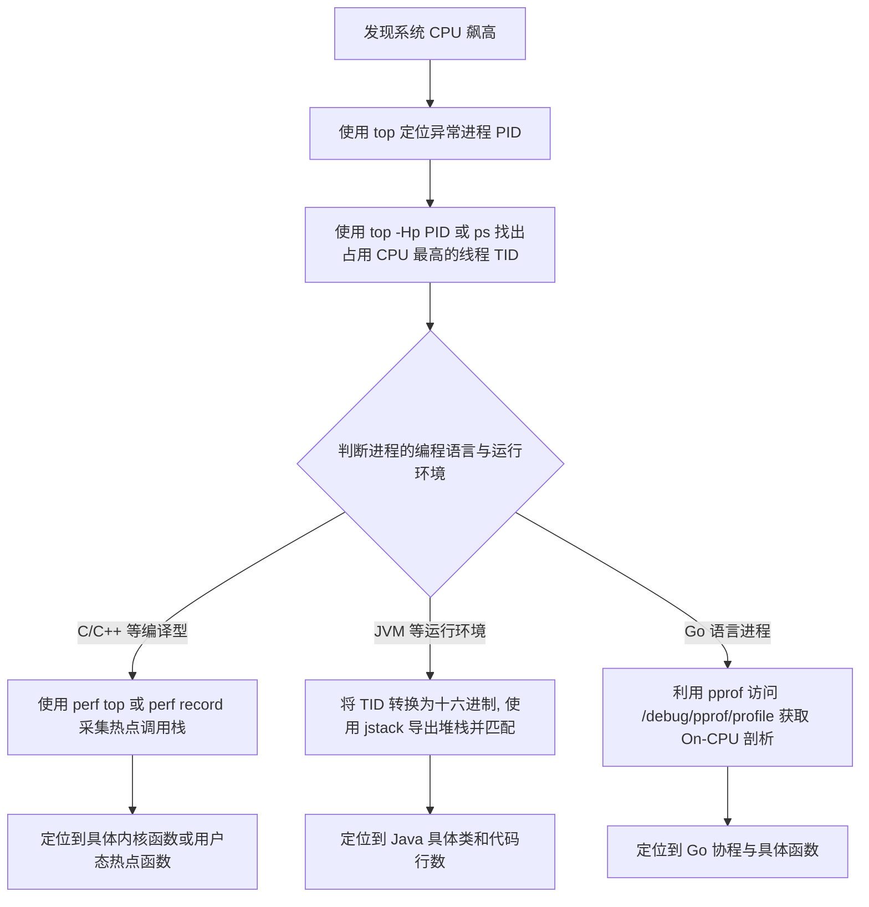
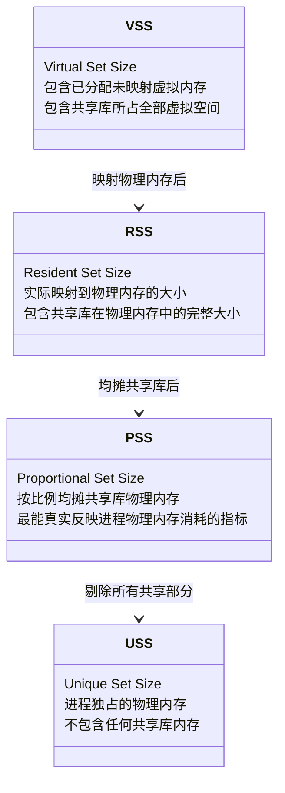
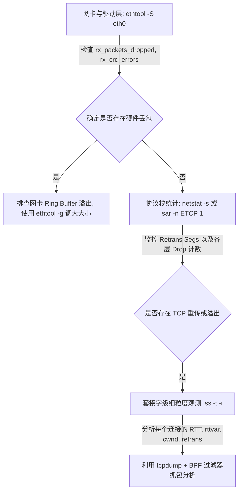
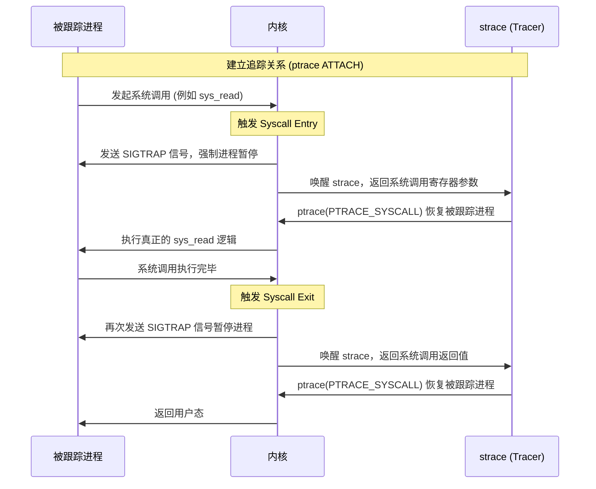

# 1.1.2.6 Linux性能观测

在现代复杂的大规模分布式系统与高并发服务器架构中，性能观测（Performance Observability）是确保系统稳定性、排查疑难故障以及进行容量规划的核心底座。Linux 作为一个通用、多任务、分时的操作系统，其内部维护了极其复杂的内核状态与数据流。

传统的“黑盒式”盲目猜测或单一指标拼贴，已无法应对如今高度复杂的性能瓶颈。本文将以底层的内核实现机制为切入点，从 CPU、内存、I/O、网络以及高级动态追踪技术等五个维度，深入剖析 Linux 性能观测的理论体系、指标推导、工具链及实战排查思路。

---

## 一、 系统性能观测哲学与方法论

在展开具体指标前，必须建立科学的性能观测方法论。盲目的工具堆砌往往会导致“数据丰富而信息贫乏”的窘境。

### 1. USE 方法与 RED 方法的对比与结合

在观测体系中，主要存在两种经典的观测模式：

*   **USE 方法（Utilization, Saturation, Errors）**：
    *   **适用对象**：系统级物理资源（CPU、内存、磁盘、网卡等）。
    *   **利用率（Utilization）**：资源在采样周期内繁忙的时间占比（如 CPU 使用率，网卡带宽占比）。
    *   **饱和度（Saturation）**：资源因供不应求而产生的排队等待程度（如 CPU 运行队列长度、内存 Swap 换出速度、磁盘 I/O 等待队列）。**饱和度是性能瓶颈最敏感的预警指标。**
    *   **错误（Errors）**：设备或驱动层报告的错误事件数量（如网卡丢包、磁盘扇区损坏错误）。
*   **RED 方法（Rate, Errors, Duration）**：
    *   **适用对象**：服务、接口或软件应用层面。
    *   **吞吐率（Rate）**：服务每秒处理的请求数（如 QPS/TPS）。
    *   **错误率（Errors）**：失败的请求数量或比例。
    *   **持续时间（Duration）**：请求处理的平均响应时间或延迟分布（如 P99 延迟）。

在实际观测中，**RED 方法用于暴露问题**（即服务是否变慢、是否出错），而 **USE 方法用于定位问题根因**（即是否因为底层某种硬件资源达到极限导致了服务变慢）。两者互为表里，共同构成了全栈观测的基石。

### 2. 观察者效应（Observer Effect）与观测开销

任何性能观测手段都会或多或少地干扰被观测系统的运行状态，这就是性能观测中的**观察者效应**。
*   静态计数器（如 `/proc` 接口）通常开销极小，因为它们仅读取内核在运行过程中顺便累加的全局变量。
*   动态追踪（如 `strace`）由于频繁挂钩系统调用并触发上下文切换，会引入数倍的性能损耗。
*   因此，在生产环境进行性能观测时，必须在**观测的精确度（Precision）**与**系统开销（Overhead）**之间进行权衡，优先选择无损或低开销的观测技术。

---

## 二、 CPU 性能分析：时间分片与算力饱和度

CPU 是系统最核心的算力来源。观测 CPU 性能不仅要看其“忙不忙”，更要看其“为什么忙”以及“想忙的进程是否能及时得到调度”。

### 1. 平均负载（Load Average）的内核实现与推导

在 `top` 或 `uptime` 命令中，我们经常能看到形如 `load average: 0.15, 0.08, 0.23` 的输出，分别代表 1 分钟、5 分钟和 15 分钟的系统平均负载。许多开发者简单地将平均负载等同于 CPU 使用率，这在 Linux 系统中是一个严重的误区。

#### 概念定义与 Linux 的特色
在经典的 Unix 系统中，平均负载仅统计处于就绪队列中等待运行或正在运行的进程数。然而，Linux 的创造者 Linus Torvalds 认为，当进程在等待磁盘 I/O（如等待读取文件数据）时，虽然它没有占用 CPU，但它同样代表了系统繁忙、任务被阻塞的状态。

因此，Linux 系统中的平均负载被定义为：**系统处于可运行状态（`TASK_RUNNING`）和不可中断等待状态（`TASK_UNINTERRUPTIBLE`）的平均活跃进程数。**
*   `TASK_RUNNING`：进程正在 CPU 上运行，或者在 CPU 运行队列（Run Queue）中排队等待调度。
*   `TASK_UNINTERRUPTIBLE`：通常处于内核态关键路径中，正在等待硬件资源（如磁盘 I/O、网络应答或硬件锁）。此时进程不响应任何信号（包括 `SIGKILL`），其本意是保护内核数据结构的一致性。

#### 内核源码级 EWMA 算法实现
Linux 内核采用**指数加权移动平均（EWMA，Exponentially Weighted Moving Average）**算法来计算平均负载。由于内核中无法使用浮点数运算（避免浮点协处理器上下文保存的开销），内核设计者巧妙地利用了**定点数（Fixed Point Arithmetic）**来模拟浮点计算。

在内核源文件 `include/linux/sched/loadavg.h` 中，定义了定点数的精度与衰减系数：

```c
#define FSHIFT      11          /* 11位精度，即二进制定点数的小数部分占 11 位 */
#define FIXED_1     (1<<FSHIFT) /* 1.0 的定点数表示，值为 2048 */

#define EXP_1       1884        /* 1分钟衰减系数的定点数表示：1/exp(5s/1min) * 2048 */
#define EXP_5       2014        /* 5分钟衰减系数的定点数表示：1/exp(5s/5min) * 2048 */
#define EXP_15      2037        /* 15分钟衰减系数的定点数表示：1/exp(5s/15min) * 2048 */
```

**数学推导过程**：
为了计算 1 分钟的负载，设采样时间间隔 $\Delta t = 5$ 秒，衰减常数 $\tau = 60$ 秒。其衰减因子为：
$$e^{-\Delta t / \tau} = e^{-5/60} \approx 0.9200444$$
将其转换为 11 位定点数表示：
$$0.9200444 \times 2^{11} = 0.9200444 \times 2048 \approx 1884.25 \xrightarrow{\text{取整}} 1884$$
这正是 `EXP_1` 的来源。同理，5 分钟对应的衰减因子为 $e^{-5/300} \approx 0.983471$，对应定点数为 `2014`；15 分钟对应的衰减因子为 $e^{-5/900} \approx 0.994460$，对应定点数为 `2037`。

内核在每次定时器中断检查时（每 5 秒，即 `LOAD_FREQ` 周期），会在 `kernel/sched/loadavg.c` 中调用 `calc_global_load` 更新负载：
$$load_{t} = load_{t-1} \times \frac{exp}{2048} + active \times \left(1 - \frac{exp}{2048}\right)$$
在定点数运算下，乘法和除法被转换为位移操作，代码片段逻辑如下：

```c
unsigned long calc_load(unsigned long load, unsigned long exp, unsigned long active)
{
    unsigned long newload;

    newload = load * exp + active * (FIXED_1 - exp);
    if (active >= load)
        newload += FIXED_1 - 1; // 向上取整补偿
    return newload >> FSHIFT;   // 右移 11 位，相当于除以 2048
}
```

#### 负载指标分析方法与常见误区
结合上述内核机制，可以得出以下诊断结论：
1.  **高 Load，低 CPU 使用率**：代表系统中有大量处于 `TASK_UNINTERRUPTIBLE` 状态的进程。最典型的是 **I/O 瓶颈**（如大量写操作导致页缓存积压，或机械硬盘随机读写过高导致排队），或者网络挂载的文件系统（如 NFS）无响应，进程陷入 D 状态。
2.  **低 Load，高 CPU 使用率**：说明 CPU 正在全力运转，但几乎没有排队。如果这种情况突然发生，可能是运行了单个极度消耗 CPU 的死循环进程。
3.  **短寿命进程的“观测漏洞”**：因为内核更新负载的周期是 5 秒（严格来说是 `5*HZ+1` 个 tick，以避免与进程调度周期同步导致共振），如果系统频繁产生大量生命周期仅几十毫秒的短生命进程（例如 shell 脚本中频繁调用 `awk` 或 `sed`），虽然 CPU 使用率会飙升到 100%，但平均负载指标可能反应非常迟钝，甚至保持在极低水平。

### 2. CPU 占用分类的微观视角

我们通过 `top`、`vmstat` 或 `mpstat` 观测到的 CPU 使用率，是由内核时钟中断周期性采样并统计得出的。内核将 CPU 时间划分为以下微观视角：

| 指标 | 英文全称 | 内核态/用户态 | 描述与微观成因 |
| :--- | :--- | :--- | :--- |
| **us** | User Time | 用户态 | 运行普通用户态进程所消耗的 CPU 时间。 |
| **ni** | Nice Time | 用户态 | 运行通过 `nice` 命令调整过优先级（Nice 值为正数，即低优先级）的进程所消耗的用户态时间。 |
| **sy** | System Time | 内核态 | 运行内核代码所消耗的 CPU 时间。包括系统调用（Syscalls）、异常处理（如缺页异常）、内核线程（如 kswapd）。 |
| **id** | Idle Time | - | CPU 处于空闲状态，且系统没有未完成的 I/O 请求。 |
| **wa** | I/O Wait Time | - | **本质上是空闲时间。** 代表 CPU 处于空闲状态，但此时系统中有进程因为等待磁盘/块设备 I/O 而被阻塞。 |
| **hi** | Hardware IRQ | 内核态 | 处理硬件中断（如网卡接收数据包、磁盘数据就绪）所消耗的 CPU 时间。 |
| **si** | Software IRQ | 内核态 | 处理软中断（如网络协议栈下半部、内核定时器）所消耗的 CPU 时间。 |
| **st** | Steal Time | - | 虚拟化环境下，当前虚拟机想运行，但由于物理 CPU 被 Hypervisor 分配给其他虚拟机而“被偷走”的时间。 |

#### 关键指标深度解析：
*   **System Time (sy) 飙高的原因**：通常由**高频系统调用**（如无缓冲的磁盘读写、频繁的 `select/poll/epoll`）、**频繁的上下文切换**（进程/线程数过多，导致 CPU 调度开销占主要比重）或**大量缺页异常**引起。
*   **I/O Wait (wa) 的计算谬误**：`iowait` 并不代表 CPU 本身在“辛勤工作”，它只是一种特殊的 `idle`。如果一个核心的 `iowait` 为 100%，说明这个核心在这段时间内完全可以运行其他就绪进程，但因为没有就绪进程，它只能干等 I/O 完成。因此，不能单纯通过 `iowait` 高就判定 CPU 算力不足，其根因在 I/O 设备。
*   **Soft IRQ (si) 与 CPU 绑核**：在网络吞吐极高的场景下，单一核心的 `si` 达到 100% 会导致网卡丢包。这是因为默认情况下，某个特定网卡队列的硬中断及其关联的软中断只会在固定的 CPU 核心上处理。此时需要通过配置 `irqbalance` 或手动修改 `/proc/irq/` 目录下的绑定关系（Affinity）来分散网络中断压力。

### 3. CPU 饱和度与运行队列排队指标

当 CPU 使用率逼近 100% 时，我们需要衡量 CPU 的**饱和度（Saturation）**。

#### 运行队列长度与调度延迟
在 Linux 的 CFS（Completely Fair Scheduler）调度器中，每个 CPU 核心都有一个就绪队列（`runqueue`），由红黑树维护所有处于 `TASK_RUNNING` 状态的进程。
*   **运行队列长度（Run Queue Length）**：即就绪队列中等待被调度的进程数。当该数值长期大于系统的物理 CPU 核心总数时，说明 CPU 资源已经严重超载。
*   **调度延迟（Scheduling Latency）**：一个进程从进入就绪队列开始，到真正被调度到物理 CPU 上执行之间所等待的时间。这是最能直接体现 CPU 算力匮乏对应用延迟产生影响的指标。

可以通过查看 `/proc/schedstat` 获取 CPU 调度的统计信息。例如，对于每个 CPU 核心，输出的第二行包含三个重要字段：
1.  该 CPU 运行所有进程的总时间（纳秒）。
2.  进程在就绪队列中等待调度的总时间（纳秒，即调度延迟的累加）。
3.  该 CPU 发生进程切换的总次数。

#### 压力阻塞指标（PSI，Pressure Stall Information）
为了更科学、无损地量化包括 CPU、内存和 I/O 在内的系统资源短缺，Linux 4.20 引入了 PSI 机制。它直接暴露了资源匮乏对应用运行造成的“停顿时间”。

在 `/proc/pressure/cpu` 中，提供类似如下的指标：
```text
some avg10=2.50 avg60=1.20 avg300=0.50 total=12560300
```
*   `some`：表示在过去的 10秒、60秒、300秒内，系统中有**至少一个任务**因为等待 CPU 资源而被阻塞的时间占比。
*   对于 CPU 资源，PSI 只有 `some` 指标，没有 `full` 指标。因为任何时候，只要有任务在等 CPU，就说明必定有另一个任务正在占用 CPU 运行，因此 CPU 不可能发生“所有任务都被阻塞且没有任何任务在跑”的 `full` 状态。
*   **意义**：PSI 相比 Load Average 能提供更实时、精度更高的饱和度反馈，已成为现代化容器调度与容量监控的核心指标。

### 4. 进程 CPU 飙高排查思路

当发生进程 CPU 使用率飙高（如单个进程占用 100% 或数倍 CPU）时，排查应遵循以下严密的诊断漏斗：



#### 关键排查技巧与边缘案例：
*   **上下文切换频繁（sys 高，cs 指标高）**：
    如果通过 `vmstat 1` 发现 `cs`（Context Switch）达到数十万，且 `sy` 占比极高，说明线程间在进行激烈的锁竞争或线程数设置过大。
    使用 `pidstat -w 1` 可以监控每个进程的上下文切换情况：
    *   `cswch/s`（Voluntary Context Switch）：自愿上下文切换，指进程由于等待某些资源（如锁、I/O、信号量）主动让出 CPU。数值高说明进程在进行大量的同步等待。
    *   `nvcswch/s`（Non-voluntary Context Switch）：非自愿上下文切换，指进程时间片用完，被调度器强制剥夺 CPU。数值高说明系统 CPU 算力竞争极其激烈，线程在抢占 CPU。

---

## 三、 内存性能观测：寻址空间与页缓存机制

内存管理是 Linux 内核中最复杂的模块之一。观测内存性能，绝不能只看 `free` 命令输出中的“空闲内存有多少”。

### 1. 物理内存与虚拟内存指标关系

Linux 的每个用户态进程都拥有独立的虚拟地址空间（Virtual Address Space）。在 64 位系统上，这通常是高达 256TB 的虚拟寻址空间。进程看到的都是虚拟内存，只有当真正发起写入或读取时，内核才通过页表将虚拟内存映射到物理内存上。

#### 寻址空间指标的严格定义
在进行进程级内存观测时，需要理清以下四个最关键的指标：



1.  **VSS / VSZ (Virtual Set Size / Virtual Size)**：
    进程申请的全部虚拟地址空间大小。包括了进程代码段、已分配但尚未物理映射的内存、通过 `mmap` 映射的文件、以及链接的共享库所占用的全部虚拟空间。
2.  **RSS (Resident Set Size)**：
    进程当前实际占用的物理内存大小（驻留内存）。
    *   **缺点**：如果多个进程链接了同一个共享库（如 `libc.so`），该共享库的物理内存会被重复计算进每一个进程的 RSS 中。因此，所有进程的 RSS 之和会远远大于系统实际已用的物理内存。
3.  **PSS (Proportional Set Size)**：
    比例分配内存。它是将共享库占用的物理内存按照共享进程的数量进行均摊。
    *   **公式**：若共享库 A 在物理内存中占用 10MB，当前有 5 个进程链接并使用了它，则 A 对每个进程的 PSS 贡献为 2MB。
    *   **应用**：PSS 能够极好地在宏观上把进程的内存占用进行累加，不会产生重复计算，是分析系统内存紧张时进程真实消耗的黄金指标。
4.  **USS (Unique Set Size)**：
    进程独占的物理内存大小。这是完全属于该进程私有、不与任何其他进程共享的物理内存。如果该进程被 `kill`，USS 就是系统能立刻收回的物理内存大小。他是**排查应用内存泄漏最准确的观测指标**。

#### 缺页中断（Page Fault）分类与内核路径
当进程访问一个尚未建立物理映射的虚拟地址时，CPU 的 MMU（内存管理单元）会触发缺页异常，跳转到内核的 `do_page_fault` 函数：
*   **次缺页中断（Minor Page Fault / Page Reclaim）**：
    该虚拟页对应的数据已经在物理内存中（例如：由于其他进程已经将其从磁盘读入 Page Cache，或者该页刚刚被释放但尚未清零）。此时内核只需在当前进程的页表中新建映射关系即可，**不产生任何磁盘 I/O**。
*   **主缺页中断（Major Page Fault）**：
    该虚拟页的数据在物理磁盘上（如尚未加载的代码段，或者已被换出到 Swap 分区的匿名内存页）。内核必须暂停进程，发起块设备 I/O 将数据读入物理内存，然后再建立映射。**主缺页中断会导致进程发生显著的延迟。**

#### 内存分配的内核行为：`brk` 与 `mmap`
用户态调用 `malloc` 申请内存时，glibc 会根据申请空间的大小决定底层的系统调用：
*   **小于 128KB**：调用 `brk()`。通过移动进程堆区的上限指针（`program break`）来分配虚拟内存。这部分内存释放后并不会立刻交还给内核，而是缓存在内存池中以备复用，容易产生**外部内存碎片**。
*   **大于 128KB**：调用 `mmap()`。在进程的映射区（Memory Mapping Segment）找一块空闲的虚拟内存并映射。释放时调用 `munmap()`，内存会立即交还给内核，但每次分配和释放都会触发完整的缺页中断和页表更新，开销较大。

### 2. 页缓存与缓冲区的内核角色（Cache vs Buffer）

在 `free` 命令中，`buff/cache` 往往占据了很大的内存比例。

#### 历史演进与现代定义
*   **历史定义**：在早期 Linux 内核中，Buffer（缓冲区）与 Cache（缓存）是完全独立管理的。Buffer 用于缓存块设备（磁盘扇区）的原始数据（按磁盘块读写），而 Cache 用于缓存文件系统中的文件数据（按内存页读写）。
*   **现代实现**：从 Linux 2.4 内核起，两者的底层结构被统一为了**页缓存（Page Cache）**。
    *   **Buffers**：本质上也是 Page Cache 中的页，但它们是**块设备文件页**，用于存放裸磁盘块数据、文件系统元数据（如目录项 dentry、索引节点 inode 的结构体信息）。
    *   **Cache / Cached**：普通的**文件缓存页**，用于存放用户读写文件时的实际内容。

#### 内核读写流设计：写回（Write-back）机制与脏页
Linux 默认采用异步写回机制。当应用调用 `write()` 时，数据仅被拷贝到 Page Cache 中，对应的物理页被标记为“脏页（Dirty Page）”，然后 `write()` 立即返回，应用可以继续执行。

脏页的刷盘（Sync）由内核后台线程 `bdi_writeback` 自动控制：
*   `/proc/sys/vm/dirty_background_ratio`（默认 10%）：当系统脏页占总内存的比例达到此阈值时，内核启动后台线程异步将脏页写入磁盘。
*   `/proc/sys/vm/dirty_ratio`（默认 20%）：当系统脏页占比达到此严重阈值时，为了防止内存耗尽，所有新发起写操作的**进程都会被强制阻塞**，必须协助内核同步将脏页写入磁盘，直到脏页比例降下来。这在写密集型应用中是导致延迟抖动的隐形杀手。

#### 物理内存回收机制与水位线（Watermarks）
内核为每个内存管理区（Zone，如 Zone Normal, Zone DMA32）定义了三条核心水位线：`min`、`low`、`high`。

```text
  ▲ 物理内存容量
  │
  ├─ [high] ─────── 物理内存极度充裕，无需任何回收
  │
  ├─ [low]  ─────── 触发 kswapd 后台进程，开始异步回收内存，直到回升至 high 水位
  │
  ├─ [min]  ─────── 触发直接内存回收（Direct Reclaim）。所有进程分配请求被阻塞，
  │                 强制参与同步内存回收；若依然无法分配，则触发 OOM Killer。
  ▼ 0
```

*   **kswapd 后台回收**：当空闲内存低于 `low` 水位时，`kswapd` 守护进程被唤醒，它会扫描内存，回收干净的文件页，或将不常用的匿名页换出到 Swap。
*   **直接内存回收（Direct Reclaim）**：若内存消耗速度远快于 `kswapd` 的回收速度，导致空闲内存跌破 `min` 水位，系统将陷入“直接内存回收”状态。所有正在申请内存的进程都会被强制阻塞，并同步执行内存回收逻辑。此时应用性能会发生断崖式下跌。
*   **OOM Killer（Out of Memory）**：如果在跌破 `min` 水位并执行直接内存回收后，系统依然无法腾出足够的连续物理内存，内核将调用 `oom_badness()` 算法计算所有进程的得分，强制杀掉得分最高的进程以释放空间。

### 3. Swap 监控与内存交换机制

Swap 允许系统将物理内存中暂时不常用的数据转移到磁盘上的交换分区，从而腾出物理内存给更急需的进程。

#### 匿名页与文件页的回收区别
*   **文件页（File-backed Pages）**：Page Cache 中的文件数据页。如果是干净的（未被修改），内核可以直接将其从内存中释放掉（丢弃）。如果下次进程又需要访问，再通过主缺页中断从磁盘中读取。
*   **匿名页（Anonymous Pages）**：没有文件相对应的内存页，如堆、栈、数据段、数据共享区等。匿名页无法被直接丢弃，如果要回收它们，必须将它们的内容先写入到磁盘的 Swap 分区，这个过程称为 **Swap Out（换出）**；当进程再次访问这些页时，再从 Swap 读入物理内存，称为 **Swap In（换入）**。

#### `swappiness` 的精确控制公式
许多技术文档声称 `swappiness = 60` 表示“当物理内存用到 40% 时开始使用 Swap”，这完全是错误的。`swappiness` 调节的是**内核回收文件页与回收匿名页的倾向性（积极度）**。

内核在决定回收内存时，会分别计算文件页和匿名页的回收成本估值：
$$\text{Cost}_{anon} \propto \frac{\text{swappiness}}{\text{scan\_cost}}$$
$$\text{Cost}_{file} \propto \frac{200 - \text{swappiness}}{\text{scan\_cost}}$$
*   当 `swappiness = 0` 时：内核会尽可能避免换出匿名页，优先回收文件页（除非空闲内存低于 `min` 水位不得不进行强制 Swap 换出）。
*   当 `swappiness = 100` 时：内核回收文件页与换出匿名页的积极性完全相同。
*   默认值 `60` 是一种平衡设计，倾向于保留文件页缓存（以提升文件 I/O 速度），但同时允许适度换出不活跃的匿名页。

#### 内存交换抖动（Swap Thrashing）的检测
如果物理内存严重不足，且 `swappiness` 允许频繁使用 Swap，可能会发生一种灾难性的状况：进程刚被换入的内存页又立刻被换出，或者不同进程在交替换入换出。因为磁盘/SSD 的读写速度相比物理内存慢了数千倍，系统的大部分 CPU 算力和磁盘带宽都将被“内存交换”本身所榨干，表现为系统完全卡死。

**检测方法**：使用 `vmstat 1` 命令，重点观察 `si`（Swap In，每秒从磁盘换入内存的大小）和 `so`（Swap Out，每秒从内存换出磁盘的大小）。若 `si` 和 `so` 持续高于数十兆字节（MB/s），且伴随着 CPU 的 `iowait` 飙升，则说明系统已发生严重的 Swap 抖动，必须立刻进行扩容或进程内存治理。

### 4. 内存泄漏与内存碎片分析

#### 内存泄漏的微观现象
对于长期运行的后台进程，如果其虚拟内存（VSS）与驻留内存（RSS、PSS）呈现单调递增，且释放后依然无法回落，基本可以断定存在内存泄漏。
*   在用户态，可以使用 eBPF 工具集中的 `memleak`。它通过追踪 `malloc` 和 `free` 的调用栈，统计只有分配没有释放的内存地址。
*   其原理是插桩 `libc` 中的 `malloc/calloc/realloc`（作为 uprobe）和 `free`（作为 uretprobe），并在内核 Map 中记录所有未配对的指针及其分配栈。

#### 内存碎片化分析：伙伴系统（Buddy System）
Linux 物理内存以“页”（Page，通常为 4KB）为基本单位进行管理。内核使用**伙伴系统**来分配连续的物理内存页。伙伴系统将物理页划分为 11 个阶（Order），分别对应 $2^0, 2^1, 2^2, ..., 2^{10}$ 个连续物理页（即 4KB, 8KB, 16KB ... 至 4MB 的连续内存块）。

*   **外部碎片（External Fragmentation）**：
    系统空闲内存的总量虽然足够，但是分配在物理空间上零零散散，无法凑出连续的、满足特定阶大小的内存块。例如，系统有 100MB 空闲内存，但全都是零碎的 4KB 单页，此时若驱动程序尝试分配一个 64KB（16个连续页）的 DMA 缓冲区，就会因为外部碎片导致分配失败。
*   **内存碎片的观测方法**：
    阅读 `/proc/buddyinfo`。其输出展示了每个 Zone 下各个 Order 剩余的空闲块数量。
    ```text
    Node 0, zone   Normal    112    43     5     2     0     0     0     0     0     0     0
    ```
    *   上述输出表明，Normal Zone 在 Order 0（4KB）还有 112 个空闲块，但从 Order 4 往后的高阶空闲块几乎为 0。这说明外部碎片极度严重，无法满足任何大于 16KB 的连续物理内存分配请求。
*   **内存紧缩（Memory Compaction）的代价**：
    当内核由于碎片问题无法为高阶分配请求找到合适的连续页时，会触发**内存紧缩**。内核在后台扫描物理页，将正在被使用的“可移动”物理页拷贝到另一端，从而将零散的空闲空间拼接为连续大块。
    *   **代价**：内存紧缩会带来高昂的 CPU 开销和系统级停顿。可以通过监控 `/proc/vmstat` 中的 `compact_stall` 和 `compact_fail` 指标来观测碎片紧缩对性能的影响。

---

## 四、 I/O 性能分析：数据流与物理存储的妥协

磁盘存储是系统性能中最容易产生瓶颈的“木桶短板”。从纳秒级的内存访问到微秒甚至毫秒级的磁盘 I/O，其速度跨度达数万倍。

### 1. 核心指标解释与排查技巧

当我们使用 `iostat -xz 1` 进行观测时，需要深入理解以下指标的物理意义与计算逻辑：

```mermaid
gantt
    title 单次 I/O 请求的生命周期与延迟构成
    dateFormat  X
    axisFormat %s
    section 内核态队列
    I/O 发起并在队列中排队 (Queue Delay) :active, 0, 10
    section 块设备/硬件
    设备服务时间 (Service Time) :crit, 10, 15
```



*   **IOPS（Input/Output Operations Per Second）**：
    每秒进行的读写操作次数。在 `iostat` 中对应 `r/s`（每秒读次数）和 `w/s`（每秒写次数）。
*   **吞吐量（Throughput / Bandwidth）**：
    每秒读写的数据量。对应 `rkB/s` 和 `wkB/s`。
    *   **两者折算关系**：$\text{Throughput} = \text{IOPS} \times \text{Average I/O Size}$（对应 `rareq-sz` 和 `wareq-sz`）。
    *   **排查技巧**：如果系统的 IOPS 极高，但吞吐量极低，通常说明应用在进行**高频的随机小 I/O**（如传统关系型数据库未命中缓存的索引检索）；如果 IOPS 较低，但吞吐量极高，则是**大块顺序 I/O**（如媒体流写入或日志追加）。
*   **I/O 延迟（Await / Latency）**：
    单次 I/O 请求的平均响应时间（毫秒）。在 `iostat` 中对应 `r_await` 和 `w_await`。
    *   **构成**：$\text{Await} = \text{Queue Delay（队列等待时间）} + \text{Service Time（设备实际服务时间）}$。
    *   如果 `await` 远大于物理介质的正常响应水平（如高速 NVMe SSD 通常 `< 0.5ms`，而机械硬盘通常为 `5ms ~ 15ms`），且 `aqu-sz`（平均队列长度）显著大于 1，说明磁盘已经超载，请求在块设备队列中产生了严重积压。
*   **磁盘饱和度（Util %）**：
    在采样周期内，磁盘有 I/O 请求活动的时间占比。
    *   **核心误区**：许多监控系统在 `%util` 达到 100% 时报警。但这**并不意味着磁盘已经达到了处理能力的极限**。
    *   对于传统的机械硬盘，由于单磁头物理结构的局限，同一时间只能处理一个请求，因此 `%util = 100%` 确实代表磁盘饱和。
    *   但对于**现代固态硬盘（SSD）或 RAID 阵列**，它们内部拥有数十个通道，可以并发处理多个请求。即使磁盘有 100% 的时间在处理 I/O（`%util = 100%`），它可能依然能够承载更高的并发请求。
    *   **正确评估饱和度的指标**：应该重点看 **`aqu-sz`（队列深度）** 和 **`await`（响应时间）**。如果 `await` 依然维持在极低水准（如 `< 1ms`），即使 `%util = 100%`，也说明磁盘没有成为瓶颈。

### 2. I/O 调度器与队列机制：单队列与多队列（blk-mq）

#### 经典内核 I/O 栈架构
数据从应用程序落盘，经历了极其复杂的软件栈流转：

```text
  [ 应用程序 ] (用户态)
       │ write() / fsync()
  ─────┼───────────────────────────────────
       ▼ (内核态)
  [ VFS (虚拟文件系统) ]
       │
       ▼
  [ Page Cache (页缓存) ] (标记脏页)
       │
       ▼
  [ 文件系统层 (如 EXT4, XFS) ] (将逻辑偏移转换为块地址)
       │
       ▼
  [ 通用块层 (Generic Block Layer) ] (构造 bio 结构体)
       │
       ▼
  [ I/O 调度层 (I/O Scheduler) ] (合并/排序请求，如 mq-deadline, bfq)
       │
       ▼
  [ 设备驱动层 (Device Driver) ]
       │ DMA 传输
  ─────┼───────────────────────────────────
       ▼ (硬件)
  [ 物理磁盘 (SSD / NVMe / HDD) ]
```

#### 从单队列到多队列（blk-mq）的演进
在 Linux 3.13 之前，通用块层采用的是**单队列（Single Queue）**架构。所有 CPU 核心发起的所有 I/O 请求，最终都要汇聚到同一个全局请求队列（Request Queue）中。
*   **瓶颈**：随着多核 CPU 的普及以及高速固态硬盘（如 NVMe SSD，IOPS 可达数十万甚至百万级）的发展，单队列架构中为了保护全局队列而引入的**锁竞争（Request Queue Lock）**成为了严重的性能杀手。多核 CPU 在这里会产生剧烈的锁冲突，白白浪费了处理器的算力。
*   **多队列（blk-mq，Multi-Queue Block Layer）机制**：
    Linux 引入了 blk-mq 框架，将队列划分为两层：
    1.  **软件分发队列（Software Staging Queues）**：通常与 CPU 核心一对一绑定（Per-CPU Queue）。当 CPU 发起 I/O 时，直接写入自己核心对应的本地软件队列，完全避免了锁竞争。
    2.  **硬件派遣队列（Hardware Dispatch Queues）**：与块设备底层的硬件队列数映射。由内核自动将软件队列的数据汇总调度到硬件队列中，充分释放了现代 SSD 并发处理的吞吐潜力。

#### 现代 I/O 调度器的选择
在多队列（blk-mq）架构下，传统的 `noop`、`cfq` 调度器已不复存在，取而代之的是：
*   **none**：不进行任何调度。直接将请求提交给设备驱动。适用于**极高速的 NVMe SSD**，因为闪存颗粒不需要“寻道时间”，由设备自身的固件控制并发读写比内核调度更高效。
*   **mq-deadline**：多队列版本的期限调度器。引入了读写两个方向的超时限制，优先保证读请求，防止写请求将读请求饿死。适用于**普通 SSD 或机械硬盘**。
*   **bfq (Budget Fair Queueing)**：预算公平队列调度器。适合在吞吐要求高、但同时需要保证桌面交互或关键任务超低延迟的**慢速块设备**上使用。

---

## 五、 网络性能观测：协议栈流转与包级统计

网络观测不仅涉及吞吐率与带宽，更涉及内核网络协议栈在应对高并发连接时的复杂排队与丢包机制。

### 1. 网络性能核心指标与丢包原因分析

网络性能主要通过四个黄金指标衡量：
*   **吞吐量（Throughput）与 PPS（Packets Per Second）**：
    *   高 PPS 小包（如 64 字节网络控制包）：对内核协议栈的 CPU 消耗极大，因为每个包都会触发硬件中断和软中断。
    *   低 PPS 大包（如 1500 字节的 MTU 数据包）：主要消耗物理网卡的带宽，协议栈处理开销相对较小。
*   **丢包率（Packet Loss Rate）**：
    网络包在传输或接收过程中被丢弃的比例。丢包可能会发生以下系统层级：

```text
               ┌───────────────────────┐
               │    物理网络链路丢包    │ (光纤折损、交换机拥堵)
               └──────────┬────────────┘
                          ▼
               ┌───────────────────────┐
               │    网卡驱动层丢包    │ (Ring Buffer 溢出、网卡缓存满)
               └──────────┬────────────┘
                          ▼
               ┌───────────────────────┐
               │   网络协议栈内核丢包  │ (防火墙 iptables、半/全连接队列溢出)
               └──────────┬────────────┘
                          ▼
               ┌───────────────────────┐
               │  应用套接字缓冲区溢出 │ (应用进程读取太慢)
               └───────────────────────┘
```

### 2. 网络协议栈性能统计与连接队列

网络问题的排查往往需要深入到 TCP 协议栈的内部连接状态。

#### TCP 半连接队列与全连接队列的内核源码机制
在 TCP 三次握手过程中，内核维护了两个极其关键的队列：

```text
 客户端                    服务器 (LISTEN 状态)
   │                           │
   │ ──── [1] SYN ───────────> │ ─► 放入半连接队列 (SYN Queue)
   │                           │    限制参数: tcp_max_syn_backlog
   │ <─── [2] SYN + ACK ────── │
   │                           │
   │ ──── [3] ACK ───────────> │ ─► 从半连接队列移出
   │                           │    放入全连接队列 (Accept Queue)
   │                           │    限制参数: min(somaxconn, backlog)
   ▼                           ▼
                           [应用层] 调用 accept() 消费连接
```

1.  **半连接队列（SYN Queue）**：
    *   **状态**：当服务器收到客户端的 `SYN` 请求，回复 `SYN+ACK` 但尚未收到客户端的最终确认 `ACK` 时，该连接处于 `SYN_RECV` 状态，并被放入半连接队列。
    *   **限制参数**：受内核参数 `/proc/sys/net/ipv4/tcp_max_syn_backlog` 的控制。
    *   **攻击与防御**：在遭受 SYN Flood 恶意攻击时，半连接队列会被迅速占满，导致正常连接被拒绝。可以通过将 `/proc/sys/net/ipv4/tcp_syncookies` 设为 `1`，使得内核在半连接队列满时不分配队列槽位，而是通过特殊的 TCP 序号算法直接回复 `SYN+ACK`，在客户端确认 `ACK` 时再重建连接。
2.  **全连接队列（Accept Queue）**：
    *   **状态**：当客户端回复了最后的 `ACK`，三次握手完全建立，连接变为 `ESTABLISHED` 状态，并从半连接队列中移出，放入全连接队列，等待应用程序通过调用 `accept()` 将其取走。
    *   **限制参数**：全连接队列的最大长度上限由两个值的最小值决定：
        $$\text{Limit} = \min(\text{net.core.somaxconn}, \text{backlog})$$
        其中 `somaxconn` 是全局的系统限制，而 `backlog` 是应用程序在调用 `listen(sockfd, backlog)` 函数时传入的参数。

#### 如何精准观测全连接队列溢出？
全连接队列的溢出是导致高并发网络应用响应突然变慢或超时重传的最常见根因。

可以通过 `ss -lnt` 命令实时观测监听状态下的套接字队列情况：
```text
State      Recv-Q Send-Q  Local Address:Port
LISTEN     50     128     0.0.0.0:80
```
*   **注意**：在 `LISTEN` 状态下，`Recv-Q` 和 `Send-Q` 具有特殊的定义：
    *   **`Send-Q`**：当前套接字全连接队列的最大容量上限（如上述的 128）。
    *   **`Recv-Q`**：当前全连接队列中已经完成三次握手、正在等待应用程序调用 `accept()` 获取的已建连套接字数量（如上述的 50）。
*   **诊断**：如果看到 `Recv-Q` 长期接近或等于 `Send-Q`，说明应用程序（如 Web 服务器）的处理速度变慢，或者其工作线程池被占满，无法及时调用 `accept()`。这会导致新建立的连接在全连接队列中积压。
*   **溢出后果**：一旦全连接队列溢出，内核会根据参数 `/proc/sys/net/ipv4/tcp_abort_on_overflow` 的配置做出反应：
    *   `tcp_abort_on_overflow = 0`（默认）：内核会直接**丢弃该 ACK**，假装没收到。客户端在超时后会重新发送 `ACK`，或者触发 `SYN+ACK` 重传。这种设计给应用留了一线生机，但会导致客户端感知的建连时延暴增。
    *   `tcp_abort_on_overflow = 1`：内核会向客户端**发送一个 RST 报文**，直接拒绝并关闭此连接。
*   **确认命令**：可以通过 `netstat -s | grep -i "listen"` 命令确认是否发生过全连接队列溢出：
    ```text
    1240 times the listen queue of a socket overflowed
    1240 SYNs to LISTEN sockets dropped
    ```

### 3. 网络排查实战：自底向上的观测链条

当网络发生异常时，应遵循自底向上的观测方法：



---

## 六、 高级观测技术：动态追踪与无损诊断

在复杂的线上系统排查中，静态计数器（如 `/proc` 接口的聚合数据）往往只能提供“系统生病了”的宏观警示，无法指出“病根在哪里”。为此，我们需要借助高级动态追踪技术。

### 1. 火焰图（Flame Graphs）的采样原理与生成

火焰图是由 Brendan Gregg 创造的、用于可视化调用栈采样数据的强大工具，能帮助开发者一眼识破系统的性能热点。

#### On-CPU 采样 vs Off-CPU 采样

| 维度 | On-CPU 火焰图 | Off-CPU 火焰图 |
| :--- | :--- | :--- |
| **关注状态** | 处于 `TASK_RUNNING` 状态的进程 | 处于阻塞、睡眠、等待（非运行）状态的进程 |
| **采样机制** | **定时轮询采样**。由内核定时中断或 PMU（性能监控单元）硬件事件触发，定时（如 99Hz）抓取 CPU 上的指令指针和调用栈。 | **事件触发插桩**。挂钩到内核的调度器切换点 `context_switch`（或 `sched_switch` 追踪点），记录进程切出和唤醒的时间戳与调用栈。 |
| **解决问题** | **谁在疯狂消耗 CPU？** 用于解决死循环、计算密集型热点、垃圾回收（GC）开销等。 | **应用没怎么消耗 CPU，但为什么响应这么慢？** 用于排查磁盘 I/O 阻塞、锁竞争（如 Mutex 等待）、系统调用阻塞（如 `nanosleep`）或网络等待。 |

#### 火焰图的生成原理与工具链
我们以最常见的 `perf` 工具为例，展示 On-CPU 火焰图的生成逻辑：

1.  **采样（Capture）**：
    ```bash
    perf record -F 99 -a -g -- sleep 60
    ```
    *   `-F 99`：设置采样频率为 99Hz（每秒采样 99 次）。**为什么不是 100Hz？** 避免采样频率与系统中的某些 100Hz 周期性时钟中断发生共振，导致采样偏差。
    *   `-a`：对系统中的所有 CPU 核心进行全局采样。
    *   `-g`：开启调用栈追踪（Call Graph），以便获取完整的调用上下文。
2.  **堆栈折叠（Stack Collapse）**：
    由于原始的 `perf.data` 文件包含成千上万条零散的、带时间戳的采样记录，我们必须将其折叠成便于统计的文本形式。使用 `stackcollapse-perf.pl` 处理后，格式会转换为：
    ```text
    nginx;ngx_http_handler;ngx_http_core_run_phases 12
    nginx;ngx_http_handler;ngx_http_read_request_body 45
    ```
    表示对应的调用路径在整个采样中被命中了多少次。
3.  **渲染（Render）**：
    利用 `flamegraph.pl` 将折叠后的数据渲染为交互式的 `.svg` 矢量图：
    ```bash
    ./flamegraph.pl out.perf-folded > flamegraph.svg
    ```

#### 火焰图阅读技巧
阅读火焰图时，必须牢记其核心规则：
*   **纵轴（Y轴）**：代表**调用栈的深度**。最底层是调用链的起点（如系统的内核入口或 `main` 函数），最顶层是当前正在被 CPU 执行的叶子函数。
*   **横轴（X轴）**：**并不代表时间轴**。横轴上的宽度代表该函数（及其子函数）在所有采样样本中被命中的次数占比。**宽度越宽，说明该调用栈消耗的 CPU 时间越多**。
*   **寻找“平顶”（Flat Top）**：如果在火焰图的顶部，出现了一个跨度非常宽的矩形平台，且平台上方没有更深层的调用，说明该函数自身（不含其子函数）正在消耗大量的 CPU 算力。这通常是性能优化的第一突破口。

### 2. 系统调用跟踪：strace 原理与 ptrace 的内核关联

`strace` 是我们排查进程异常（如“进程卡死在什么地方”、“找不到某个配置文件”）的常用利器，能让我们清晰地看到进程发起的所有系统调用。然而，`strace` 并不适合在生产高并发环境中进行高吞吐观测，这与其底层的实现机制有直接关系。

#### `strace` 的底层工作原理与 ptrace
`strace` 是基于 Linux 的 **`ptrace(2)`** 系统调用实现的。



1.  当 `strace` 挂载（Attach）到一个目标进程后，内核会将该进程标记为被跟踪状态（`PT_PTRACED`）。
2.  在随后的运行过程中，每当被跟踪进程即将发起系统调用时，在**进入系统调用入口（Syscall Entry）**的瞬间，内核会强行向该进程发送一个 `SIGTRAP` 信号，将其暂停。
3.  内核将控制权移交给追踪进程 `strace`。`strace` 此时被唤醒，读取被跟踪进程的寄存器，解析出系统调用的名称及参数，打印输出。
4.  解析完成后，`strace` 调用 `ptrace(PTRACE_SYSCALL, ...)` 恢复被跟踪进程的运行。
5.  在系统调用执行完毕、**准备返回用户态（Syscall Exit）**的瞬间，内核会**再次**向进程发送 `SIGTRAP` 信号将其暂停，并交由 `strace` 获取系统调用的返回值。
6.  `strace` 再次调用 `ptrace` 恢复进程。

#### 巨大的上下文切换开销
从上述流程可以看出，在被跟踪进程的每一次系统调用的生命周期中，都会引入**4 次上下文切换（Context Switches）**：
1.  被跟踪进程 $\rightarrow$ 内核 $\rightarrow$ `strace` （挂起被跟踪进程，唤醒 `strace` 打印参数）
2.  `strace` $\rightarrow$ 内核 $\rightarrow$ 被跟踪进程 （恢复运行，执行内核调用）
3.  被跟踪进程 $\rightarrow$ 内核 $\rightarrow$ `strace` （挂起被跟踪进程，唤醒 `strace` 打印返回值）
4.  `strace` $\rightarrow$ 内核 $\rightarrow$ 被跟踪进程 （恢复运行，返回用户态）

**后果**：对于一个每秒发起上万次系统调用（如频繁读写网络套接字或小文件）的高并发服务，使用 `strace` 会导致应用的运行速度下降 **10 倍至数十倍**。甚至可能因为信号处理积压而直接把进程压垮。因此，**线上生产环境严禁直接对高负载服务使用 `strace`**。

### 3. 基于 eBPF/BCC 的现代化无损动态观测原理

为了克服传统观测技术（如 ptrace 挂钩导致的严重损耗、或者修改内核重新编译的低效）的弊端，Linux 引入了 **eBPF（Extended Berkeley Packet Filter）** 动态追踪革命。

#### eBPF 的安全沙箱与 JIT 机制
eBPF 允许开发者在不修改内核源码、不重新加载内核模块的情况下，在内核空间中运行自定义的安全程序。
*   **Verifier（校验器）**：当用户态将 eBPF 字节码加载到内核时，Verifier 会对其进行严格的静态安全分析。确保程序**没有无限循环**（保证在有限步内退出）、**不会发生越界访问内存**、**不会发生死锁**。这彻底避免了传统内核模块崩溃导致系统蓝屏（Oops）的灾难。
*   **JIT 编译（Just-In-Time Compiler）**：通过校验后，JIT 编译器会直接将 eBPF 字节码编译为底层物理 CPU 的本地机器码，使其运行速度达到原生的内核级别。

#### 统一插桩接口体系（Probes）
eBPF 能够通过以下多种形式挂钩到系统的任意角落，实现多维度观测：

```text
               ┌───────────────────────┐
               │    用户空间观测对象   │
               └──────────┬────────────┘
             uprobe ┌─────┴─────┐ USDT
                    ▼           ▼
             [ 用户态函数 ]   [ 静态埋点 ]
                    │           │
  ─────── 边界 ──────┼───────────┼───────────────────────────────
                    ▼           ▼
             [ 内核函数 ]     [ 内核静态追踪点 ]
             kprobe ▲           ▲ tracepoint
                    └─────┬─────┘
               ┌──────────┴────────────┐
               │    内核空间观测对象   │
               └───────────────────────┘
```

1.  **kprobe / kretprobe**：
    内核动态探针。可以在系统运行中，动态地挂钩到内核中**几乎任意**一个函数的入口（kprobe）和返回处（kretprobe）。
    *   *缺点*：内核函数是非公开接口，其名称和内部结构在不同内核版本间可能会发生改变，因此基于 kprobe 的工具缺乏跨内核版本的兼容性。
2.  **tracepoint**：
    内核静态跟踪点。由内核开发者在内核关键路径中显式定义好的稳定埋点（如 `sched_switch`，`sys_enter_read`）。
    *   *优点*：接口稳定，具有优秀的跨内核版本兼容性。
3.  **uprobe / uretprobe**：
    用户态动态探针。可以挂钩到用户态应用程序的可执行文件或共享链接库中的任意函数。例如，可以通过 uprobe 挂钩到 `libc.so` 中的 `malloc` 以观测内存分配。
4.  **USDT（Userland Statically Defined Tracing）**：
    用户态静态跟踪点。在应用程序中硬编码的静态探测点（如 MySQL 中的查询开始点）。

#### 为什么 eBPF 是“无损、超低开销”的？
我们可以通过对比 `strace` 和基于 eBPF 的系统调用观测（如 BCC 工具集中的 `syscount`）来解释其低开销原理：

```text
【传统方式 (strace / ptrace)】
  内核事件触发 ──► 发送信号 ──► 上下文切换 ──► 拷贝全部数据到用户态 ──► 用户态过滤/统计
  (开销极大，上下文切换频繁)

【eBPF 方式】
  内核事件触发 ──► 执行内核级 eBPF 程序 ──► 在内核态直接过滤/按哈希表累加 (eBPF Maps)
                 ──► 用户态仅定期读取统计后的聚合数据
  (几乎无上下文切换，开销极低)
```

1.  **内核态就地处理**：
    在 `strace` 中，每次系统调用都需要暂停进程并把数据传递给用户态。而使用 eBPF，当系统调用触发时，仅在内核态执行一小段 eBPF 机器码，记录当前的耗时或参数。
2.  **通过 eBPF Maps 聚合数据**：
    eBPF 程序在内核态通过 **eBPF Maps**（如哈希表、柱状图等内存数据结构）直接完成数据的统计与聚合。例如，它可以直接把“各系统调用的调用次数”在内核态存入一个 Hash Map 中。
3.  **极低的数据拷贝开销**：
    用户态的控制程序（如 BCC 脚本）不需要接收每次系统调用发生的事件，而是只需要每秒或在结束时，去读取内核态的这个 Map 的汇总结果。这**完全消除了频繁的上下文切换和庞大的包级别数据拷贝**，将观测开销控制在 1% 以内，极其适合线上系统的实时常态化观测。

---

## 七、 总结：构建系统性能观测全景图谱

为了让性能观测从散乱的工具使用跃升为系统化的排查能力，下表整理了系统核心资源在发生瓶颈时的现象、观测重点以及推荐使用的工具层次：

| 资源类型 | 观测重点 (饱和度/错误) | 静态/低开销工具 (`/proc` 级) | 进程/系统级剖析工具 | 高级/无损动态追踪工具 |
| :--- | :--- | :--- | :--- | :--- |
| **CPU** | 运行队列排队、调度延迟、上下文切换 | `vmstat`, `uptime` | `top`, `mpstat`, `pidstat` | `perf` (火焰图), `BCC` (`runqlat`, `runqlen`) |
| **内存** | 主缺页中断、Swap 抖动、物理页碎片 | `free`, `/proc/buddyinfo` | `vmstat`, `/proc/meminfo` | `BCC` (`memleak`, `oomkill`) |
| **I/O** | 队列积压（aqu-sz）、await 延迟、脏页水位 | `/proc/diskstats` | `iostat`, `iotop`, `pidstat -d` | `BCC` (`biolatency`, `biosnoop`) |
| **网络** | 全连接队列溢出（Send-Q/Recv-Q）、丢包、重传 | `/proc/net/snmp` | `ss`, `netstat`, `sar -n` | `BCC` (`tcptop`, `tcpdrop`), `tcpdump` |

性能观测绝非一朝一夕之功。掌握从系统硬件资源的“USE”指标，到应用服务层面的“RED”指标；理解从底层的平均负载定点数推导、缺页异常内核路径，到现代化的多队列 I/O 架构与 eBPF 无损追踪技术，方能在面对瞬息万变、极其复杂的线上系统故障时，做到“手中有镜，心中有数”，快速指明优化的方向。
