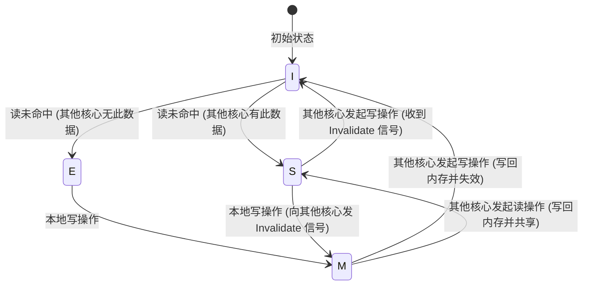
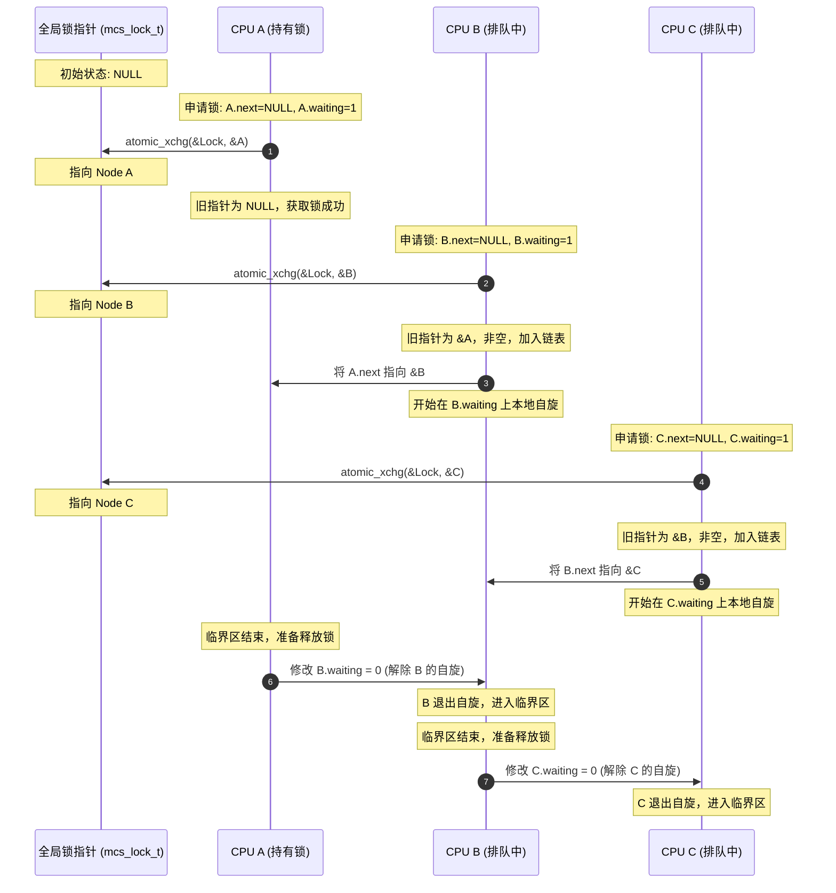
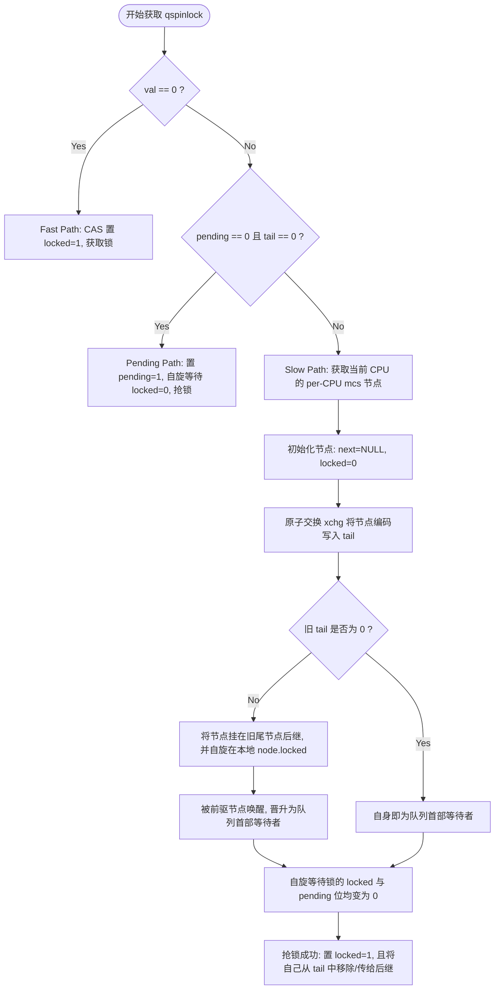

# 自旋锁 (Spinlock) 的底层原理与现代演进

在多核对称多处理（SMP, Symmetric Multiprocessing）系统与现代操作系统内核设计中，并发控制是保障数据一致性与系统稳定性的基石。在林林总总的同步原语中，**自旋锁（Spinlock）**因其简单高效而处于核心地位。本文将从设计初衷出发，由浅入深地剖析自旋锁的硬件支撑、软件实现，并重点追踪 Linux 内核自旋锁从早期 Wild Spinlock、Ticket Spinlock，到现代 Queued Spinlock（qspinlock）的演进历程，最后对自旋锁的忙等成本、系统副作用以及与互斥锁（Mutex）的多维度差异进行全面且深度的数据化对比。

---

## 1. 核心定义与设计初衷

### 1.1 什么是自旋锁？
自旋锁是一种互斥同步机制。当一个执行线程（在内核态表现为控制路径，在用户态表现为线程）尝试获取一个已被其他线程持有的自旋锁时，它不会进入睡眠或释放 CPU 执行权，而是处于一个紧凑的循环中，反复查询锁变量的状态，直到锁被释放。这种“在原地打转”等待锁的行为被称为**自旋（Spinning）**或**忙等待（Busy-waiting）**。

自旋锁的逻辑可以用以下通用的概念性伪代码表示：

```c
// 概念性自旋锁获取
void spin_lock(spinlock_t *lock) {
    while (lock->is_locked == true) {
        // 忙等待，不断检测锁状态
    }
    lock->is_locked = true; // 抢占锁
}
```

当然，上述伪代码在并发环境下是极不安全的（存在“读-改-写”的竞态条件），但它直观地展现了自旋锁的运行特征：**不主动挂起，持续占用 CPU 资源进行轮询**。

---

### 1.2 为什么需要自旋锁？
在理解自旋锁之前，我们首先需要对比另一种经典的锁机制——**阻塞/休眠锁（如 Mutex 或 Semaphore）**。当线程无法获取阻塞锁时，操作系统会将该线程置为“睡眠”状态，并将其移入锁的等待队列中，同时调用调度器执行一次**进程/线程上下文切换（Context Switch）**，让出 CPU 给其他可运行的线程。

然而，上下文切换并非免费的午餐，它包含巨大的间接开销：

1. **保存与加载 CPU 上下文**：必须将当前 CPU 寄存器（如通用寄存器、程序计数器 PC、栈指针 SP、段寄存器等）写入线程控制块（TCB），并从目标线程的 TCB 中加载新的寄存器状态。
2. **虚拟内存空间切换（如果是进程切换）**：需要重新加载页表基址寄存器（如 x86 的 CR3 寄存器，ARM 的 TTBR0/TTBR1 寄存器）。这会导致硬件 **TLB（Translation Lookaside Buffer，旁路转换缓冲）** 失效。尽管现代 CPU 支持 PCID（Process Context Identifier）或 ASID（Address Space Identifier）来部分避免 TLB 的全量刷新，但地址映射缓存的抖动依然不可避免。
3. **缓存冷启动与污染（Cache Pollution）**：新线程在运行过程中会逐步将旧线程缓存在 L1/L2 Cache 中的热数据“冲刷”掉。当旧线程被重新唤醒执行时，将面临大量的 **Cache Miss**（缓存未命中），必须重新从速度极慢的物理内存或 L3 Cache 中读取数据，导致严重的运行延迟。

根据现代操作系统的实测，一次完整的上下文切换及其引起的缓存抖动开销，通常在 **数微秒（$\mu s$）到数十微秒** 级别（相当于数千甚至数万个 CPU 时钟周期）。

如果临界区（Critical Section）的代码执行非常简单——例如仅仅是递增一个全局计数器、向一个双向链表中插入一个节点，或者修改一个状态标志——其执行时间可能只有 **几纳秒（$ns$）到几十纳秒**。如果为了等待一个执行时间仅需 20ns 的临界区，而让线程去睡眠并经历一次 5000ns 的上下文切换，其系统开销的倒挂是极其荒谬的。

自旋锁正是为了解决这一痛点而设计的。**与其通过昂贵的上下文切换让出 CPU，不如让 CPU 在原地自旋数十个时钟周期。一旦持有锁的 CPU 核心退出临界区并释放锁，当前 CPU 核心即可瞬间获取锁并开始执行，从而省去了所有的上下文切换和缓存污染开销**。

---

### 1.3 临界区时长的量化盈亏平衡点
为了更科学地决策在何种情况下使用自旋锁或互斥锁，我们可以构建一个简单的数学盈亏平衡模型（Break-even Model）。

设：
* $C_{\text{switch}}$ 为线程在睡眠与唤醒过程中两次上下文切换的总时间开销（包括寄存器状态保存、调度算法开销、TLB 刷新以及由此带来的 Cache Miss 性能损失罚分）。
* $T_{\text{critical}}$ 为临界区代码在无冲突情况下的实际执行时间。
* $N_{\text{spin}}$ 为自旋锁在获取成功前，平均需要等待的自旋时钟周期数。
* $f_{\text{cpu}}$ 为当前 CPU 的主频，则自旋等待的时间为 $T_{\text{spin}} = \frac{N_{\text{spin}}}{f_{\text{cpu}}}$。

在单次锁竞争中：
* 如果采用阻塞锁，总开销（从尝试加锁到临界区执行完毕）为：
  $$E_{\text{block}} \approx C_{\text{switch}} + T_{\text{critical}}$$
* 如果采用自旋锁，总开销（包括自旋忙等与临界区执行时间）为：
  $$E_{\text{spin}} \approx T_{\text{spin}} + T_{\text{critical}}$$

若要使自旋锁的性能超越阻塞锁，必须满足：
  $$E_{\text{spin}} < E_{\text{block}} \implies T_{\text{spin}} < C_{\text{switch}}$$

这表明：**只要自旋等待的期望时长小于一次上下文切换的综合开销，自旋锁就是最优选择**。通常，在现代多核服务器架构下，这个临界区时长的临界阈值在 **1 微秒** 左右。

```
临界区时长 (T_critical) 与等待时间 (T_wait)
0 --------------------- 100ns --------------------- 1us --------------------- 100us ---->
|---- 极短临界区 ----|                    |------ 较长临界区 / 涉及 I/O 或休眠 ------|
|  [自旋锁 Spinlock 极佳]  |                    |            [互斥锁 Mutex 占优]           |
```

> [!IMPORTANT]
> 自旋锁绝对不适用于保护包含可能引起主动睡眠、阻塞或 I/O 操作的临界区。如果自旋锁保护的临界区内发生阻塞，当前核心将长时间自旋，而其他尝试获取该锁的核心也将陷入无限期忙等，导致整个系统迅速瘫痪。

---

## 2. 底层硬件支撑：原子操作与缓存一致性

自旋锁的“自旋”和“获取”是一个涉及多核竞争的物理过程，软件层面的控制逻辑必须有底层硬件指令集的物理级原子性保障。

### 2.1 硬件原子性保障的演进：总线锁与缓存锁
在单核 CPU 时代，保证代码段原子性可以通过简单地**屏蔽中断**来实现。但在多核（SMP）架构下，各 CPU 核心独立运行，屏蔽当前核心的中断无法阻止其他核心并发修改相同的物理内存。因此，硬件层面必须提供对特定内存地址的**原子性读-修改-写（Read-Modify-Write, RMW）**操作。

#### 2.1.1 总线锁（Bus Locking）
在早期的多处理器系统中，硬件通过拉低 CPU 芯片管脚上的 `LOCK#` 信号来锁定系统总线（System Bus）。当某个 CPU 核心发起带有 `LOCK#` 的操作时，北桥芯片（或总线控制器）会拦截其他所有核心（以及 DMA 控制器）对物理内存的访问请求。

总线锁的代价是极其高昂的：它会让一个多核系统在锁定时退化为单核系统，甚至阻塞了与锁无关的其他核心的正常内存读写，这在现代多核 CPU 中是无法接受的。

#### 2.1.2 缓存锁（Cache Locking）
为了降低总线锁定的频率，现代 CPU 引入了缓存锁。如果被原子操作的目标物理地址已经缓存在当前 CPU 核心的 L1/L2 Cache 中，且该缓存行（Cache Line）的状态允许对其进行独占写（即 MESI 协议中的 Modified 或 Exclusive 状态），那么该 CPU 核心就不需要向系统总线发送 `LOCK#` 信号。

相反，它会直接锁定自己内部的缓存行，并通过**缓存一致性协议（Cache Coherency Protocol）**来确保该操作的原子性。当其他核心尝试读取或修改该物理地址时，缓存一致性协议会延迟或拦截这些请求，直到原子操作结束。

---

### 2.2 主流 CPU 架构的原子指令

不同处理器架构在硬件指令层面支持原子操作的方式各有千秋，主要分为两大阵营：x86 架构的“原子指令前缀”与 ARM 等 RISC 架构的“链接加载/条件存储”机制。

#### 2.2.1 x86 架构：LOCK 指令前缀
x86 架构是一种 CISC（复杂指令集）架构，它允许直接对内存地址执行 RMW 操作。为了确保这些多步操作的原子性，x86 提供了 `LOCK` 指令前缀。常见的原子指令包括：

* `LOCK CMPXCHG dest, src`（Compare and Swap, 比较并交换）：
  将累加器（`AL/AX/EAX/RAX`）中的值与 `dest` 进行比较。如果相等，则将 `src` 写入 `dest`；如果不相等，则将 `dest` 的当前值载入累加器。
* `LOCK XCHG dest, src`（Atomic Exchange, 原子交换）：
  无条件地交换 `dest` 与 `src` 的内容。需要注意的是，在 x86 汇编中，`XCHG` 指令即使没有显式加上 `LOCK` 前缀，只要其操作数之一是内存地址，硬件也会默认对其施加总线/缓存锁定。
* `LOCK BTS dest, bit_offset`（Bit Test and Set, 测试并设置位）：
  将 `dest` 的第 `bit_offset` 位的值拷贝到携带标志位（CF），并将该位置为 1。

#### 2.2.2 ARM 架构：LL/SC（Load-Link / Store-Conditional）
ARM 作为 RISC（精简指令集）架构，遵循严格的 Load-Store 内存访问模型，不允许直接对内存数据执行复杂的运算操作。因此，ARM 无法直接实现像 x86 那样单条指令的 `CMPXCHG`。

ARM 采用独占监视器（Exclusive Monitor）配合 `LDREX`（Load Register Exclusive）与 `STREX`（Store Register Exclusive）指令对来实现原子操作：

* `LDREX R1, [R0]`：从内存地址 `R0` 加载数据到寄存器 `R1`，并指示本地与全局独占监视器将该内存地址标记为“由当前核心独占”。
* `STREX R2, R3, [R0]`：尝试将寄存器 `R3` 的值写入内存地址 `R0`。
  * 如果自上次执行 `LDREX` 以来，该内存地址没有被其他 CPU 核心写入过，则写入成功，并将寄存器 `R2` 置为 0。
  * 如果在这期间，有其他核心修改了该地址，独占标记失效，则写入失败，将寄存器 `R2` 置为 1。

利用这一对指令，可以通过软件循环实现一个完整的 CAS 原子操作：

```assembly
// ARMv7-A 汇编下的 CAS 实现示例
// R0: 目标内存地址，R1: 期望的旧值，R2: 准备写入的新值，R3: 返回结果
.L_cas_loop:
    LDREX   R3, [R0]        ; 独占加载内存值到 R3
    CMP     R3, R1          ; 比较是否与期望的旧值相等
    BNE     .L_cas_fail     ; 若不相等，跳转至失败分支
    STREX   R4, R2, [R0]    ; 尝试独占写入新值，结果存入 R4
    CMP     R4, #0          ; 检查写入是否成功 (0 表示成功)
    BNE     .L_cas_loop     ; 若写入失败（由于其他核心抢先修改），重新循环
    MOV     R3, #1          ; 标记 CAS 成功
    BX      LR
.L_cas_fail:
    CLREX                   ; 清除独占监视器状态
    MOV     R3, #0          ; 标记 CAS 失败
    BX      LR
```

---

### 2.3 缓存一致性协议（MESI）对锁的影响
在多核处理器中，为了减少内存访问延迟，每个 CPU 核心都有自己的独立 L1/L2 缓存。缓存一致性协议（如 Intel 广泛采用的 MESI 协议）通过监控各个核心的读写行为，确保各级缓存的数据一致性。

MESI 协议定义了缓存行（Cache Line，通常为 64 字节）的四种状态：
1. **M（Modified，已修改）**：该缓存行的数据已被当前核心修改，与主内存不一致，且该数据仅缓存在当前核心中。
2. **E（Exclusive，独占）**：该缓存行的数据与主内存一致，且仅缓存在当前核心中。
3. **S（Shared，共享）**：该缓存行的数据与主内存一致，且同时缓存在多个核心中。
4. **I（Invalid，已失效）**：该缓存行的数据已失效，不可读取。



当我们使用自旋锁时，锁变量所驻留的缓存行在各核心之间的流转过程如下：

1. **共享读阶段**：当多个 CPU 核心同时尝试获取锁而进行自旋读取时，锁变量所在的 Cache Line 会在这些核心的 L1/L2 Cache 中均处于 **Shared (S)** 状态。此时，各个核心的读操作可以直接命中本地 Cache，不需要产生任何总线事务。
2. **状态失效与冲突**：一旦持有锁的核心释放了锁（例如执行了写操作 `lock = 0`），或者某个核心通过原子指令写入新值尝试加锁，该核心的 Cache 控制器就必须通过总线向其他所有核心发送 **Invalidate（失效）** 信号。
3. **总线风暴与重载**：其他核心收到失效信号后，必须将自己本地对应的 Cache Line 状态置为 **Invalid (I)**。接下来，这些自旋核心由于检测到 Cache Line 失效，会重新发起读操作以重新获取锁的最新值。此时，锁所在的 Cache Line 会在各个核心的 Cache 之间疯狂弹跳（**Cache Line Bounce**），并伴随着大量的总线读取请求，这被称为**缓存一致性风暴（Cache Coherency Storm）**。

---

## 3. 软件实现：从经典原子指令到简易自旋锁

了解了底层的原子指令与缓存一致性原理后，我们来看看在软件层面，如何一步步利用这些硬件武器构建起一个自旋锁。

### 3.1 利用 Test-and-Set (TAS) 实现自旋锁
**Test-and-Set（测试并设置）**是最早也是最简单的自旋锁实现思路。我们使用原子交换操作 `xchg` 来代表测试并设置过程。

#### 3.1.1 伪代码实现
```c
typedef struct {
    volatile int lock_state; // 0 代表未锁，1 代表已被锁
} spinlock_tas_t;

void spin_lock_tas(spinlock_tas_t *lock) {
    // atomic_xchg 是一个原子操作，它将 lock->lock_state 的值设为 1，
    // 并返回 lock->lock_state 的旧值。
    while (atomic_xchg(&lock->lock_state, 1) == 1) {
        // 自旋等待。如果返回 1，说明锁原先就被占着，我们继续自旋；
        // 如果返回 0，说明成功将 0 修改为 1，即成功抢占了锁，退出循环。
    }
}

void spin_unlock_tas(spinlock_tas_t *lock) {
    // 释放锁只需要将其无条件置为 0
    lock->lock_state = 0; 
}
```

#### 3.1.2 TAS 锁的致命缺陷
在 TAS 锁的自旋等待中，自旋核心在 `while` 循环里不断地执行 `atomic_xchg` 指令。
需要注意的是，**`atomic_xchg` 是一个写操作**。

即使锁的持有者还没有释放锁（`lock_state` 已经是 1），自旋核心执行 `atomic_xchg(&lock->lock_state, 1)` 依然会不断地将 1 写回内存/缓存。这迫使 CPU 核心不断向总线发送写请求，使其他所有同样在执行 `atomic_xchg` 自旋的核心的 Cache Line 频繁失效。

如果有 8 个 CPU 核心在自旋等待这把锁，它们会以极高的频率互相将对方的 Cache Line 刷成 Invalid 状态，导致系统总线带宽被这些无效的写操作和缓存行重载请求完全占满。这种现象称为**总线风暴（Bus Storm）**，会使整个多核系统的外部设备通信、内存访问性能产生断崖式下跌。

---

### 3.2 利用 Test and Test-and-Set (TTAS) 进行优化
为了解决 TAS 锁由于“在自旋时执行写原子指令”而引发的灾难，计算机科学家设计了 **Test and Test-and-Set (TTAS)** 锁。

#### 3.2.1 优化机制：读自旋与写尝试的分离
TTAS 锁的核心理念非常朴素：**在锁被占用时，我只进行普通的“读”操作；只有当普通读操作发现锁变为空闲（0）时，我才发起一次昂贵的原子“写”操作（`atomic_xchg`）去抢锁**。

#### 3.2.2 伪代码实现
```c
void spin_lock_ttas(spinlock_tas_t *lock) {
    while (1) {
        // 1. 读自旋阶段：只进行普通读取（Load），不需要执行写操作。
        // 这时锁变量的 Cache Line 在所有自旋核心的缓存中都是 Shared (S) 状态。
        // 读操作直接在核心的 L1 缓存中完成，不产生任何总线流量。
        while (lock->lock_state == 1) {
            // 可以在此插入 cpu_relax() 优化自旋开销
        }

        // 2. 抢锁阶段：当读自旋发现锁状态变为 0 时，尝试执行一次原子交换抢锁。
        if (atomic_xchg(&lock->lock_state, 1) == 0) {
            return; // 抢锁成功，返回
        }
        
        // 如果抢锁失败（被其他核心抢先了），重新进入外层循环进行读自旋
    }
}
```

#### 3.2.3 TTAS 的局限性与惊群效应
TTAS 在锁被持有期间的表现确实非常优秀（总线流量接近于零）。但是，**在锁被释放的那一瞬间，系统依然会发生严重的崩溃**：

1. 持有锁的 CPU 执行 `lock->lock_state = 0`，向总线发送 Invalidate 信号。
2. 所有等待抢锁的 CPU 核心的 Cache Line 瞬间变为 Invalid。
3. 所有核心检测到变量改变，同时跳出内层的 `lock_state == 1` 循环。
4. 紧接着，**所有核心在几乎同一微秒内，并发执行 `atomic_xchg(&lock->lock_state, 1)` 原子写指令**。
5. 这将导致原本安静的总线瞬间爆发大量的写冲突，锁变量所在的 Cache Line 在所有核心之间疯狂弹跳，产生严重的“惊群效应（Thundering Herd）”。

为了彻底解决这种由于“多个核心同时监视并争抢同一个单变量锁”而带来的物理限制，必须引入更高级的软件排队机制。

---

## 4. Linux 内核自旋锁的演进之路

Linux 内核作为支撑高并发、超大规模服务器的核心，其自旋锁机制经历了几代重大的架构重构，生动地展示了软件设计如何与现代处理器硬件特性进行协同演进。

```
Linux 自旋锁技术演进脉络
[早期 Wild Spinlock] (简单 0/1 标记)
      │
      ▼ (解决公平性与锁饥饿问题)
[Ticket Spinlock] (叫号排队机制，类似银行排队)
      │
      ▼ (解决 Ticket 锁在多核下的 Cache Line Bounce 问题)
[MCS Lock] (链表式排队，每个 CPU 在独立的本地变量上自旋。局限：体积大、破坏签名)
      │
      ▼ (完美融合：将 MCS 思想缩减至 4 字节，保持 API 兼容)
[现代 Queued Spinlock (qspinlock)] (Fast path/Pending path/Slow path 三阶段演进)
```

---

### 4.1 早期 Wild Spinlock (未排队自旋锁)
在 Linux 2.6.25 之前，内核采用的自旋锁就是一种类似 TAS/TTAS 的无序自旋锁，被后人统称为 **Wild Spinlock**。

它在底层数据结构中只包含一个简单的计数器（例如 1 表示未锁，0 或负数表示已锁）。其最大的弊端可以概括为两点：

1. **不公平性（Unfairness）与锁饥饿（Starvation）**：
   当锁释放时，谁能抢到锁完全是无序的。在 NUMA（非一致性内存访问）架构下，与锁所在的物理内存在同一个 CPU 插槽（Socket）上的核心，由于访问延迟低，能以更快的速度发起原子操作，因而几乎总是能抢先拿到锁。而跨 Socket、物理距离较远的核心则可能长期处于饥饿状态，导致系统吞吐量严重抖动。
2. **总线风暴与缓存弹跳**：
   前文所述的惊群效应在 Wild Spinlock 下极为严重，限制了内核在 8 核以上的扩展能力。

---

### 4.2 Ticket Spinlock (排队自旋锁)
为了打破 Wild Spinlock 的不公平僵局，内核开发者 Nick Piggin 在 Linux 2.6.25 中引入了 **Ticket Spinlock**。它的设计灵感来源于银行的“叫号机”排队机制。

#### 4.2.1 设计原理
Ticket Spinlock 将锁变量分为两个部分：`owner`（当前正在服务的号码）和 `next`（下一个准备发放的号码）。

* **领号（加锁）**：当一个 CPU 核心想要获取锁时，它使用原子加法指令将 `next` 递增 1，并将递增前的旧 `next` 值作为自己的“排队票号（Ticket）”。接着，该核心自旋等待，直到 `owner` 的值等于自己的票号。
* **叫号（释放锁）**：当锁持有者完成临界区操作后，它只需要将 `owner` 的值递增 1。此时，票号等于新 `owner` 值的那个 CPU 核心就会立即结束自旋，进入临界区。

#### 4.2.2 数据结构
在 x86 架构下，Ticket Spinlock 利用联合体（Union）实现了精妙的空间压缩：

```c
// Linux 内核 x86 架构下的 Ticket Spinlock 示意
typedef struct arch_spinlock {
    union {
        u32 val;
        struct {
            u16 owner; // 当前持有锁的 Ticket 号
            u16 next;  // 下一个待分发的 Ticket 号
        };
    };
} arch_spinlock_t;
```

#### 4.2.3 伪代码实现
```c
void arch_spin_lock(arch_spinlock_t *lock) {
    // 1. 原子递增 next，并获取当前核心的票号
    // x86 下通过 lock xadd 指令实现
    u32 ticket = atomic_xadd(&lock->next, 1); 
    
    // 2. 自旋等待，直到自己的票号被“叫到”
    while (ACCESS_ONCE(lock->owner) != ticket) {
        cpu_relax(); // 提示 CPU 自旋
    }
}

void arch_spin_unlock(arch_spinlock_t *lock) {
    // 释放锁只需要将 owner 递增 1。由于只有锁持有者能释放锁，
    // 因此这里是单写者场景，普通的写指令即可，不需要原子锁总线。
    lock->owner++;
}
```

#### 4.2.4 Ticket Spinlock 的遗留痛点
Ticket Spinlock 完美实现了 FIFO（先进先出）的公平排队机制，彻底消除了锁饥饿问题。然而，在超多核（超过 16 核，甚至达到上百核）的现代系统上，它暴露了严重的硬件不友好特性：

* **全局缓存行弹跳（Global Cache Line Bounce）**：
  虽然每个自旋的核心等待的票号不同，但它们都在轮询同一个结构体中的 `owner` 变量。
  当持有锁的核心释放锁并执行 `owner++` 时，这个结构体所在的整个 Cache Line 在所有其他自旋核心的缓存中都会被置为 **Invalid**。
  哪怕是排在队列最后面（可能还需要等待几十轮）的核心，其缓存行也会无条件失效，并被迫向总线发送读请求来获取最新的 `owner` 值。
  这引发了随着核心数增加而呈指数级上升的总线无效化流量，使得 Ticket Spinlock 的可扩展性（Scalability）存在明显的物理上限。

---

### 4.3 MCS Lock (基于链表的自旋锁原型)
为了解决 Ticket Spinlock 对全局变量自旋导致的 Cache Line Bounce，John Mellor-Crummey 和 Michael Scott 提出了 **MCS Lock**。

#### 4.3.1 设计哲学：本地自旋（Spinning on Local Variable）
MCS Lock 的核心思想是：**绝不让多个 CPU 核心在同一个全局共享变量上自旋，而是让每个核心在自己私有的、位于自己本地内存（或本地缓存行）中的节点变量上进行自旋**。

每个尝试加锁的核心，都会把自己的一个私有节点挂入到锁的链表中，形成一个显式的排队队列。

#### 4.3.2 数据结构
```c
typedef struct mcs_lock_node {
    struct mcs_lock_node *next; // 指向队列中下一个等待着的节点
    volatile int waiting;       // 1 代表正在等待锁，0 代表已获得锁
} mcs_lock_node_t;

// 锁本身仅仅是一个指向队列尾部节点的指针
typedef mcs_lock_node_t *mcs_lock_t; 
```

#### 4.3.3 加锁与解锁的时序推导

我们通过以下时序图来演示三个 CPU 核心（CPU A、CPU B、CPU C）争抢同一个 MCS 锁的过程：



#### 4.3.4 MCS Lock 伪代码实现
```c
// 加锁：传入全局锁指针 lock 和当前核心的本地节点 node
void mcs_spin_lock(mcs_lock_t *lock, mcs_lock_node_t *node) {
    node->next = NULL;
    node->waiting = 1; // 默认需要等待

    // 原子交换：将全局锁指向当前 node，并返回旧的尾节点 prev
    mcs_lock_node_t *prev = atomic_xchg(lock, node);
    if (prev == NULL) {
        // 队列原先为空，说明锁处于空闲状态，当前核心直接获得锁
        node->waiting = 0;
        return;
    }

    // 队列非空，说明有核心在持有锁或排队。
    // 将前驱节点的 next 指向自己，把当前节点链入队列尾部。
    ACCESS_ONCE(prev->next) = node;

    // 本地自旋：当前核心只自旋在自己本地节点的 waiting 变量上！
    // 此时只有当前核心在读取该变量，其 Cache Line 处于 Exclusive 状态，
    // 不会与其他核心发生冲突，无任何总线流量。
    while (ACCESS_ONCE(node->waiting) == 1) {
        cpu_relax();
    }
}

// 释放锁：传入全局锁指针 lock 和当前核心的本地节点 node
void mcs_spin_unlock(mcs_lock_t *lock, mcs_lock_node_t *node) {
    // 1. 如果当前节点后面没有紧跟的排队者
    if (ACCESS_ONCE(node->next) == NULL) {
        // 尝试原子地将锁指针从指向自己重置为 NULL
        if (atomic_cmpxchg(lock, node, NULL) == node) {
            return; // 成功重置，说明确实没有排队者，释放锁结束
        }
        // 如果 cmpxchg 失败，说明就在刚刚那一瞬间，有新的核心在并发执行加锁，
        // 并且已经修改了全局 lock 指针，但尚未完成将 node->next 指向新节点的操作。
        // 此时，我们必须自旋等待其完成挂载。
        while (ACCESS_ONCE(node->next) == NULL) {
            cpu_relax();
        }
    }

    // 2. 释放锁给后继节点：直接修改后继节点的 waiting 状态
    // 这只会使后继节点所在的缓存行失效，产生精准且唯一的缓存行迁移。
    mcs_lock_node_t *next = node->next;
    ACCESS_ONCE(next->waiting) = 0; 
}
```

#### 4.3.5 为什么标准的 MCS Lock 无法直接引入 Linux 内核？
尽管 MCS Lock 从根本上消除了多核自旋锁的 Cache Line Bounce 痛点，但它在工程落地上面临两个致命的制约：

1. **结构体体积过大**：
   一个标准的 MCS 节点包含一个指针和一个整型，在 64 位系统上至少占用 12~16 字节。在 Linux 内核中，大量的核心数据结构（如进程描述符 `task_struct`、文件节点 `inode`、页结构体 `page` 等）内部都嵌入了自旋锁。如果每个自旋锁都膨胀到 16 字节甚至更多，会直接导致内核整体内存开销的剧烈增加。
2. **破坏了自旋锁的标准 API 签名**：
   Linux 内核标准的自旋锁 API 是 `spin_lock(spinlock_t *lock)`。而 MCS Lock 由于需要传递一个本地节点指针，API 必须改为 `mcs_spin_lock(mcs_lock_t *lock, mcs_lock_node_t *node)`。
   这意味着需要对内核数万处调用自旋锁的地方进行重构，且调用者必须在栈上维护一个临时节点变量，对开发者的心智负担极大。

---

### 4.4 现代 Queued Spinlock (qspinlock)
为了克服 MCS Lock 的内存和 API 缺陷，同时完美继承其本地自旋的优异性能，Linux 4.2 引入了 **Queued Spinlock（简称 qspinlock）**，并在目前的主流架构（x86、ARM64）中全面取代了 Ticket Spinlock。

qspinlock 实现了近乎艺术的设计：**将 MCS 锁的排队思想完全压缩进一个与 Ticket Spinlock 大小完全一致的 4 字节（32 位）整型空间中，同时完全兼容现有的 `spin_lock(lock)` 接口**。

#### 4.4.1 4 字节（32 位）空间布局的极致压缩
qspinlock 的底层数据结构只有一个 32 位的成员变量 `val`，它的内部位域划分如下：

```
+------------------------------------+-----------+-------------+
|        tail (23 bits)              | pending(1)|  locked(8)  |
+------------------------------------+-----------+-------------+
31                                  9     8     7             0
```

* **`locked` (第 0 - 7 位，共 8 位)**：
  锁持有状态。0x00 表示锁空闲；0x01 表示锁已被持有。
* **`pending` (第 8 位，共 1 位)**：
  单挂起等待位。用于优化轻度竞争的特殊机制（下文详述）。
* **`tail` (第 9 - 31 位，共 23 位)**：
  指向 MCS 队列尾部节点的编码指针（Tail Code）。
  23 位的 `tail` 无法存放完整的 64 位虚拟内存地址。那么它是如何寻址的呢？
  内核巧妙地利用了**“每 CPU 变量（per-CPU Variables）”**进行编码。

#### 4.4.2 per-CPU 节点的设计与中断嵌套处理
Linux 内核在每个 CPU 核心上预先分配了一组静态的 MCS 节点。由于同一个 CPU 在执行过程中可能会被不同优先级的中断打断，从而在同个核心上嵌套申请不同的自旋锁，如果只有一个全局节点，就会发生数据覆盖。

为此，Linux 为每个 CPU 声明了一个包含 4 个节点的数组，分别对应 4 种不同的中断/执行上下文：

1. **Task（进程上下文，索引 0）**
2. **SoftIRQ（软中断上下文，索引 1）**
3. **HardIRQ（硬中断上下文，索引 2）**
4. **NMI（不可屏蔽中断上下文，索引 3）**

```c
// Linux 内核中 per-CPU mcs 节点的内部定义示意
struct qnode {
    struct mcs_lock_node mcs;
};
static DEFINE_PER_CPU(struct qnode, qnodes[4]);
```

这 4 个上下文的嵌套层级是严格单调递增且排他的。因此，在任何时候，一个 CPU 最多只会在这 4 种上下文中各自占用一个节点。

基于此，`tail` 的 23 位被进一步划分为两个编码字段：
* **`tail_cpu`**：CPU 编号（例如支持多达 16384 个核心）。
* **`tail_idx`**：嵌套上下文索引（0 ~ 3，占用 2 位）。

有了 `tail_cpu` 和 `tail_idx`，我们就可以在运行时通过简单的数学计算，瞬间定位到对应的 `qnode` 内存地址，完成了从 23 位编码到 64 位指针的转换：

```c
struct qnode *decode_tail(u32 tail) {
    int cpu = (tail >> 2) - 1; // 解码 CPU 编号
    int idx = tail & 3;        // 解码嵌套索引
    return per_cpu_ptr(&qnodes[idx], cpu);
}
```

---

#### 4.4.3 qspinlock 的三大加锁路径分析

qspinlock 的获取逻辑非常精妙，它会根据当前锁的竞争激烈程度，在以下三个路径中自动进行跃迁：

##### 1. 无竞争快速路径（Fast Path）
当锁处于完全空闲状态（`val == 0`）时，当前 CPU 直接通过原子 CAS（如 `cmpxchg`）将 `locked` 位置为 1。

```c
// Fast Path 示意
if (atomic_cmpxchg(&lock->val, 0, 1) == 0) {
    return; // 抢锁成功，瞬间退出
}
```
此时，不涉及任何排队和 per-CPU 节点的处理，效率与经典的简单自旋锁无异。

##### 2. 轻度竞争挂起路径（Pending Path）
如果锁已被占（`locked == 1`），但此时没有其他人排队（`tail == 0`，且 `pending == 0`）。这意味着这把锁当前只被一个 CPU 持有，竞争非常轻微。

此时，新来的 CPU 核心不需要去走复杂的 MCS 链表排队逻辑。它直接执行原子操作将锁的 `pending` 位置为 1，然后**自旋在本地的 `pending` 位上**，等待 `locked` 变为 0。

一旦旧锁持有者释放了锁（`locked` 变为 0），该自旋核心将 `pending` 重置为 0，并将 `locked` 置为 1，直接接管锁。

```
[锁当前状态]: val = { locked=1, pending=0, tail=0 }
                     │
                     ▼ (CPU B 尝试获取，设置 pending=1)
[锁转换状态]: val = { locked=1, pending=1, tail=0 }
                     │
                     ▼ (CPU B 在 pending 位上自旋等待 locked 变为 0)
                     ▼ (CPU A 释放锁，locked=0)
[锁转换状态]: val = { locked=0, pending=1, tail=0 }
                     │
                     ▼ (CPU B 抢占成功，清零 pending，置 locked=1)
[锁最终状态]: val = { locked=1, pending=0, tail=0 }
```

*设计优势*：`pending` 机制使得在仅有两个 CPU 竞争的情况下，完全避免了读写 per-CPU 节点和操作链表指针的软件开销，性能极佳。

##### 3. 中/重度竞争慢速路径（Slow Path）
如果锁已被占用，且 `pending` 也已被设置，或者已经有核心在 `tail` 队列中排队（`tail != 0`）。这说明锁竞争非常激烈，当前 CPU 必须进入 MCS 队列排队阶段。



我们对慢速路径的执行细节做进一步推导：

1. **获取并初始化本地节点**：
   当前 CPU 根据当前的上下文获取对应的 `qnode[idx]`，初始化其成员 `next = NULL`，`mcs.locked = 0`。
2. **入队**：
   通过 `xchg` 指令将当前节点的编码 `tail_code` 写入锁的 `tail` 字段，并返回旧的 `tail` 值 `old_tail`。
3. **本地自旋（MCS 队列排队）**：
   * 如果 `old_tail` 不为 0，说明前面有人在排队。当前 CPU 将自己的节点地址写入前驱节点的 `next` 指针中，随后当前 CPU 开始在本地节点的 `mcs.locked` 字段上进行**只读自旋**，直到前驱节点将该字段写为 1。
   * 如果 `old_tail` 为 0，说明前面没有人在队列中排队（但可能有核心持有锁，或者有核心在 `pending` 状态）。当前 CPU 不需要自旋等待前驱，它直接晋升为**队列首部等待者（Queue Head）**。
4. **队列首部等待者抢锁**：
   晋升为队列首部等待者的核心，将开始自旋等待锁的 `locked` 和 `pending` 位。只有当这两个位同时变为 0 时，该核心才可以通过原子 CAS 指令将其置为 `locked = 1`。
5. **传递锁与出队**：
   当队列首部等待者抢锁成功后：
   * 如果它的 `next` 指针不为空（说明后面还有人排队），它会直接将后继节点的 `mcs.locked` 设为 1，唤醒后继核心，使其成为新的队列首部。
   * 如果它的 `next` 指针为空，它会尝试用 `cmpxchg` 将整个锁的 `tail` 重置为 0（出队）。如果失败，说明有核心正在并发入队，它会通过自旋等待后继节点挂载完毕，然后将其唤醒。

qspinlock 凭借这套极其复杂的动态升级策略，完美地将自旋锁的空闲开销（4字节）、双核争抢开销（Pending 机制）与多核并发风暴（MCS 机制）有机地结合在了一起，达成了结构紧凑性与运行扩展性的极致平衡。

---

## 5. 忙等成本与性能副作用

自旋锁虽然消除了进程上下文切换的开销，但在硬件与体系结构层面上，其付出的“忙等成本”在特定场景下是极其昂贵甚至是灾难性的。

### 5.1 忙等对 CPU 微架构的损耗
自旋锁的“自旋”在 CPU 微观层面并不是无代价的：

* **功耗与发热拉满**：
  在自旋期间，CPU 核心会以最高频率执行密集的循环跳转和读取指令，这导致执行部件（如 ALU、译码器）处于 100% 的满载工作状态，芯片温度和功耗甚至会高于正常计算任务。
* **乱序执行与流水线清空惩罚（Pipeline Flush）**：
  现代超标量处理器采用**分支预测（Branch Prediction）**和**投机乱序执行（Speculative Execution）**技术。在紧凑的 `while (lock->val == 1)` 循环中，处理器会预测分支将一直成立，并大量提前读取未来的指令。
  当持有锁的核心释放锁并修改 `lock->val` 时，处理器的预测瞬间失效。这迫使 CPU 必须丢弃所有已经投机执行完毕的指令，彻底清空整个指令流水线（Pipeline Flush），造成约 **30~40 个时钟周期** 的严重执行停顿。

#### 解决方案：PAUSE 与 YIELD 指令
为了在自旋时拯救 CPU，主流架构都引入了特殊的空转辅助指令：

* **x86 的 `PAUSE` 指令**：
  `PAUSE` 指令在 x86 架构下被当作一个特殊的 `NOP` 占用。它的底层作用是：
  1. 提示 CPU 当前处于自旋等待循环，CPU 会适当延迟下一次指令执行，从而大幅降低自旋时的处理器功耗（可降低多达 70% 左右）。
  2. 显式告知分支预测器不要进行过度的投机执行，避免在退出自旋锁时触发昂贵的流水线清空惩罚。
* **ARM 的 `YIELD` 指令**：
  `YIELD` 指令向 CPU 核心发送一个提示，表明当前线程正在执行没有实质性进展的工作（如自旋）。在超线程（SMT）或虚拟机（VM）环境下，这可以让物理核心将执行资源优先分配给同一个物理核心上的其他逻辑线程，从而提升多系统并行的整体吞吐。

---

### 5.2 单核系统（UP, Uniprocessor）上的自旋锁死锁与优先级反转
在单 CPU 核心系统上，自旋锁的运行逻辑会发生根本性的异变。

#### 5.2.1 永久死锁灾难
假设在一个单核系统上，内核支持抢占。
1. 进程 A 运行在内核态，获取了自旋锁 `L`。
2. 此时，一个高优先级的进程 B 被唤醒并抢占了进程 A，进程 B 开始执行。
3. 进程 B 尝试获取同一个自旋锁 `L`，因为锁已被占，B 进入自旋等待。
4. **致命问题发生**：由于进程 B 处于高优先级且一直在 CPU 上自旋，进程 A 根本无法获得任何 CPU 时间片来继续运行并释放锁 `L`。
5. 系统陷入永久死锁（Livelock/Deadlock）。

#### 5.2.2 解决方案：单核上的锁退化
正是因为单核系统上不可能存在“两个核心同时执行，其中一个自旋，另一个在临界区”的物理基础，**在单处理器（UP）环境下，自旋锁在编译期会直接退化**：

```c
// 单核系统下的自旋锁退化示意
void spin_lock(spinlock_t *lock) {
    // 仅仅禁止内核抢占，不执行任何底层的原子自旋指令！
    preempt_disable(); 
}

void spin_unlock(spinlock_t *lock) {
    preempt_enable();
}
```
通过禁止内核抢占，确保了持有锁的进程在临界区内绝对不会被其他进程打断，从而自然消除了数据竞争，同时也避免了无意义的忙等。

---

### 5.3 多核锁竞争对系统性能的边际效应
随着系统 CPU 核心数量的线性增长，自旋锁的竞争开销呈**超线性（非线性）**增长。这被称为多核的可伸缩性崩塌。

根据阿姆达尔定律（Amdahl's law）：
$$S = \frac{1}{(1 - p) + \frac{p}{s}}$$
其中 $p$ 为程序中可并行的比例，$s$ 为加速比。

当自旋锁竞争加剧时，临界区的同步开销（即不可并行的串行部分）占比 $1-p$ 会急剧膨胀，因为大量的核心被强制在串行通道前排队。

更糟糕的是，多核下的锁竞争会带来严重的**延迟不均等性**。例如在大型 NUMA 拓扑中，越过物理 Socket 传输缓存失效信号的延迟可能是本地 Socket 传输的 3 到 5 倍。当高竞争的自旋锁在不同的 Socket 之间切换时，硬件层面的缓存一致性开销将成为整个系统性能的“天花板”。

---

## 6. 与互斥锁 (Mutex) 的多维度对比与工程实践

在实际操作系统内核或系统级开发中，合理选择自旋锁与互斥锁是保障系统性能的必修课。

### 6.1 对比维度一览表

| 对比维度 | 自旋锁 (Spinlock) | 互斥锁 (Mutex) |
| :--- | :--- | :--- |
| **等待行为** | 忙等待 (自旋，不释放 CPU) | 阻塞挂起 (进入睡眠，释放 CPU) |
| **上下文切换成本** | 无（原地转圈） | 极高（涉及寄存器保存、调度器运行、TLB 刷新等） |
| **临界区执行时长** | 必须极短 (纳秒级别) | 可长可短 (允许进行 I/O 或大块计算) |
| **中断上下文支持** | **支持** (能安全地在硬中断/软中断中使用) | **绝对禁止** (会导致系统崩溃崩溃/死锁) |
| **单核退化** | 退化为禁止抢占/中断 | 依然需要维护休眠队列与调度 |
| **CPU 资源开销** | 等待期间 CPU 占用率 100% (耗电发热高) | 等待期间不占用 CPU 算力 (挂起状态) |

---

### 6.2 为什么中断上下文不能使用互斥锁？
这是操作系统设计中的一条“高压线”：**中断处理程序（Interrupt Service Routine, ISR）中绝对不允许使用互斥锁（或任何可能导致休眠的同步原语）**。

其背后的深层物理原因是：

1. **没有独立的进程上下文**：
   中断是硬件强制触发的异步事件。当硬中断发生时，CPU 会暂停当前正在运行的进程，并跳转到中断向量表执行中断处理程序。此时，中断处理程序是**借用**被中断进程的内核栈来执行的，它本身并不是一个在操作系统调度器中注册的、可以独立调度的“实体”（没有对应的 `task_struct` 或线程控制块）。
2. **无法被重新调度唤醒**：
   互斥锁在获取失败时，会调用调度器 `schedule()` 将当前控制路径切走。但由于中断没有自己的 TCB，调度器根本无法保存中断处理程序的执行上下文。一旦切走，中断处理程序将永远失去被调度器唤醒的可能，系统直接进入瘫痪状态（在 Linux 中会触发 `Scheduling while atomic` 的内核 Panic 崩溃）。

因此，当中断上下文与进程上下文之间存在共享数据竞争时，**自旋锁是唯一的选择**。

---

### 6.3 保护中断上下文的自旋锁变体
为了在中断上下文中使用自旋锁，且同时防止由于中断重入引发的死锁，操作系统提供了一系列与“中断屏蔽”绑定的自旋锁变体。

#### 6.3.1 中断重入死锁场景剖析
考虑以下糟糕的执行路径：

```mermaid
gantt
    title 中断重入死锁时序
    dateFormat  s
    axisFormat %S
    section CPU 核心 0
    进程 A 获取锁 L & 执行中     :active, a1, 0, 4s
    硬件中断触发               :crit, a2, 4s, 5s
    中断处理程序运行并尝试获取锁 L :crit, active, a3, 5s, 10s
```

1. 进程 A 运行在 CPU 0 的进程上下文中，成功获取了自旋锁 `L`。
2. 进程 A 正在临界区内执行，此时 CPU 0 收到一个硬件中断请求。
3. CPU 0 暂停进程 A，跳转执行中断处理程序（ISR）。
4. ISR 在执行过程中，也尝试获取自旋锁 `L`。
5. **陷入死锁**：ISR 由于拿不到锁 `L`，在 CPU 0 上开始自旋等待。然而，锁 `L` 的持有者（进程 A）已经被该中断打断，在同一个 CPU 核心上根本没有机会被执行，因此永远无法释放锁。CPU 0 将在 ISR 的自旋中永久空转，系统死锁。

#### 6.3.2 解决方案：锁变体设计

为了防御上述重入死锁，Linux 内核设计了以下四种自旋锁的使用变体，开发者必须根据临界区的使用场景进行严格的挑选：

##### 1. `spin_lock` 与 `spin_unlock`
* **机制**：仅进行纯粹的原子锁获取，不改变本地 CPU 的中断状态。
* **适用场景**：临界区的数据**绝对不会**被任何中断处理程序（包括软中断）访问。它仅用于防范来自其他 CPU 核心的并发访问。

##### 2. `spin_lock_irq` 与 `spin_unlock_irq`
* **机制**：在加锁前，**无条件禁用本地 CPU 的硬件中断**（如 x86 的 `CLI` 指令）；释放锁时，无条件开启中断（`STI` 指令）。
* **适用场景**：临界区的数据会被硬中断处理程序访问，且你**百分之百确定**在调用此函数前，系统中断是处于开启状态的。

##### 3. `spin_lock_irqsave` 与 `spin_unlock_irqrestore`
* **机制**：加锁前，**首先保存当前 CPU 的中断使能状态寄存器（如 `FLAGS`）到一个变量中，然后禁用本地中断**；释放锁时，将保存的寄存器状态**恢复**回去。
* **适用场景**：最安全、最通用的变体。适用于临界区数据与硬中断共享，且你**不确定**当前上下文是否已经禁用了中断的场景（例如该函数可能被已禁用中断的其他函数嵌套调用）。

##### 4. `spin_lock_bh` 与 `spin_unlock_bh`
* **机制**：加锁前，**禁用本地 CPU 的下半部（Bottom Half，即软中断/Tasklet）**，但允许响应硬件中断。
* **适用场景**：临界区的数据仅与软中断（例如网络协议栈、定时器）共享，而不会与硬中断共享。这允许硬中断正常响应，从而最大程度降低了硬件中断的响应延迟。

---

## 7. 总结与现代并发趋势

自旋锁作为计算机体系结构和操作系统深度耦合的产物，历经了从无序到有序、从全局共享到本地自旋的演进过程。

在现代高吞吐系统设计中，虽然 qspinlock 已经将自旋锁的硬件开销压制到了极致，但自旋锁对 CPU 核心的强占和对总线的敏感性依然是系统扩展性（Scalability）瓶颈的根源。因此，现代操作系统的并发设计呈现出以下两个明显的趋势：

1. **无锁化数据结构（Lock-Free Programming）**：
   利用原子的单步 CAS 操作实现无锁队列（Ring Buffer）、无锁链表，避免任何自旋或休眠开销。
2. **读写分离与 RCU（Read-Copy Update）机制**：
   通过延迟释放、宽限期（Grace Period）等机制，使得读操作不需要加任何锁，直接读取数据；写操作通过复制新副本并在安全期替换指针来实现。在读多写极少的场景下，RCU 机制能彻底释放多核系统的并发威力。

即便如此，在底层内存管理、调度器核心队列以及设备驱动开发中，自旋锁依然是无可替代的坚实基石。理解自旋锁的物理本质与硬件细节，是每一位追求极致性能的系统工程师的必修功课。
