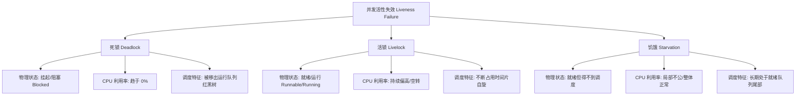
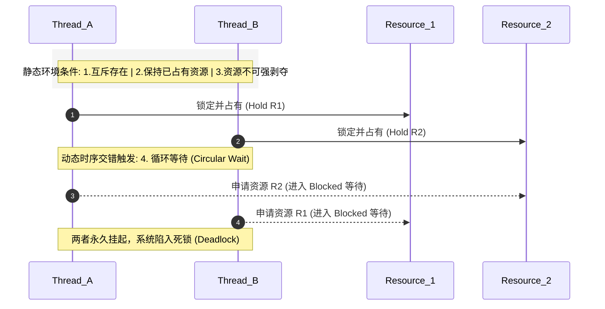
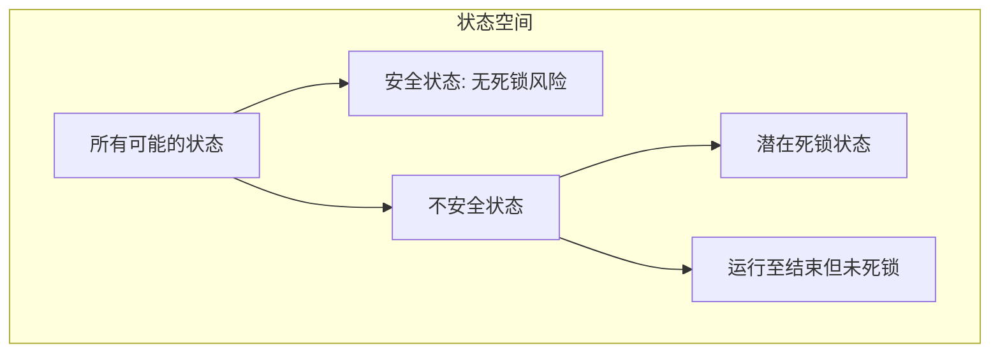

# 1.1.3.10 死锁与活锁

在多任务操作系统、高并发多线程软件架构与分布式系统的体系中，并发控制（Concurrency Control）是确保数据一致性、系统正确性与运行效率的核心基石。随着硬件向多核、众核以及分布式计算网络方向演进，如何协调多个执行流（进程、线程或协程）安全、高吞吐地共享临界资源（Critical Resources），成为了系统设计者必须面对的技术挑战。当多个执行流在交互过程中，由于对资源的竞争或不恰当的协调机制，导致系统整体或部分执行流陷入无法实质性向前推进的状态时，便发生了**活性失效（Liveness Failure）**。

在活性失效的理论谱系中，**死锁（Deadlock）**、**活锁（Livelock）**与**饥饿（Starvation）**是最具代表性也是最具危害性的三种病态运行状态。本文将从操作系统底座、内核调度器、事务并发以及网络通信的视角，深入剖析这三种状态的物理本质差异，详述死锁产生的四大必要条件，构建死锁预防、避免、检测与恢复的完整策略体系，并深入探究活锁的成因以及现代退避算法的数学原理。

---

## 1. 核心概念对比辨析

准确识别和定位系统的活性失效问题，需要我们跨越应用层的表象，深入操作系统的进程/线程管理机制与调度机制，从物理本质、内核调度视角、系统资源占用等维度对死锁、活锁与饥饿进行严格的物理定义与界定。



### 1.1 死锁的物理本质：内核挂起与事件阻断
**死锁（Deadlock）**是指两个或两个以上的执行流，在执行过程中因争夺相同资源而造成的一种互相等待的僵局。在没有外部干优的情况下，参与死锁的执行流都将永久无法向前推进。

*   **内核层面的物理状态**：在现代多任务操作系统中，每个执行流都有一个对应的内核数据结构，如 Linux 内核中的进程描述符 `task_struct`（即进程/线程控制块 PCB/TCB）。当发生死锁时，死锁执行流的状态在内核中被变更为阻塞状态。在 Linux 内核中，这对应于 `TASK_UNINTERRUPTIBLE`（不可中断的等待状态，不响应外部信号唤醒，通常用于等待硬件 I/O）或 `TASK_INTERRUPTIBLE`（可中断的等待状态，可被信号唤醒，通常用于等待互斥锁、信号量或条件变量）。
*   **内核调度器的运行行为**：处于这些状态的执行流，会被内核调度器（如 Linux 的 CFS 调度器）从可运行的红黑树（CFS Runqueue）中移除。调度器将其插入到所等待资源的特定等待队列（Wait Queue）中。因为这些执行流已不在调度器的就绪队列中，它们不会分配到任何 CPU 时间片。这解释了为什么死锁进程的 CPU 使用率在操作系统监控中表现为 **0%**。
*   **唤醒逻辑的断裂**：被挂起的执行流要重新变更为 `TASK_RUNNING` 状态，必须由持有该资源的另一方执行释放资源并唤醒等待队列的操作（如通过内核的 `wake_up()` 宏或 `pthread_mutex_unlock` 系统调用）。然而，持有资源的另一方由于也在等待其他资源而被挂起，导致唤醒事件序列在逻辑上断联。这种在内核层面表现为“等待事件永远不会发生”的现象，就是死锁的物理本质。

### 1.2 活锁的物理本质：状态持续改变与 CPU 空转
**活锁（Livelock）**是指执行流在宏观上并未被阻塞，仍然在积极改变自身的状态并执行指令，但由于彼此之间不恰当的冲突规避逻辑，导致系统整体无法推进实质性的业务逻辑。

*   **内核层面的物理状态**：处于活锁状态的执行流，其在内核中的状态始终是 `TASK_RUNNING`。在 CPU 调度器看来，它们是处于就绪或正在运行状态的健康任务。它们始终常驻于调度器的就绪队列中，随时准备或正在获取 CPU 执行权。
*   **内核调度器的运行行为**：调度器会根据时间片轮转（RR）、多级反馈队列（MLFQ）或完全公平调度（CFS）算法，源源不断地将 CPU 时间片分配给这些活跃的活锁任务。这些执行流在 CPU 上高速运行，反复执行诸如“检测冲突 -> 主动释放已持有的部分资源 -> 避让等待 -> 重新抢占资源”的动作。这导致活锁在宏观上表现为**极高的 CPU 利用率（通常在单核或多核上达到 100% 的单核或多核满载空转）**，但系统的吞吐量却为零。
*   **物理本质**：活锁的物理本质在于系统状态空间（State Space）的动态震荡。两个或多个执行流的局部状态组合，在不包含任何死锁阻塞状态的情况下，形成了一个确定的、不含有“成功出口”的封闭状态转移环路。

### 1.3 饥饿的物理本质：调度分配的局部极度不公
**饥饿（Starvation）**是指一个或多个执行流，由于系统调度算法的不公、资源分配策略的缺陷，导致在极长的时间内（甚至是无限期地）无法获取运行所需的 CPU 时间片或关键临界资源。

*   **内核层面的物理状态**：处于饥饿状态的执行流通常为 `TASK_RUNNING`（就绪状态）。它们完全具备运行的所有物理前提，只缺 CPU 时间片或锁。
*   **内核调度器的运行行为**：调度器并非停滞，而是在高效地调度其他执行流运行。这表明系统**整体**的吞吐量可能是正常甚至极高的。然而，由于特定的优先级偏好或调度漏洞，处于饥饿的执行流长期被调度器“降级”或“插队”，从而无法从就绪队列移入 CPU 物理核心执行。
*   **优先级反转（Priority Inversion）与防范协议**：这是导致饥饿的一种极其经典的内核调度故障。在基于实时抢占式优先级的调度系统中，若有三个优先级不同的线程 $P_H$（高）、$P_M$（中）、$P_L$（低）。若 $P_L$ 持有了某临界资源（如一个 Mutex），$P_H$ 因请求该 Mutex 而被挂起。此时，不依赖该 Mutex 的中优先级线程 $P_M$ 处于就绪状态，由于 $P_M$ 优先级高于 $P_L$，调度器会剥夺 $P_L$ 的 CPU 时间片分配给 $P_M$。由于 $P_L$ 得不到 CPU 时间，无法完成临界区以释放 Mutex，导致高优先级的 $P_H$ 长期处于等待状态。在这个过程中，$P_H$ 实际上被中优先级的 $P_M$ 间接阻碍，产生了优先级反转，使得高优先级任务发生“饥饿”。为了化解饥饿与随之而来的死锁风险，操作系统的调度系统通常支持以下两种并发协议：
    *   **优先级继承协议（Priority Inheritance Protocol, PIP）**：当高优先级线程 $P_H$ 阻塞在 $P_L$ 持有的锁上时，系统动态地将 $P_L$ 的优先级提升至与 $P_H$ 相同。这样 $P_L$ 就能快速抢占中优先级的 $P_M$ 并获得 CPU 运行，释放锁后，优先级再恢复原状，从而解除了 $P_H$ 的饥饿。
    *   **优先级天花板协议（Priority Ceiling Protocol, PCP）**：在系统设计时，为每个锁关联一个“天花板优先级”，该优先级等于所有可能申请该锁的线程中的最高优先级。当任何线程获得该锁时，系统立刻将其优先级提升到该天花板优先级，从根本上杜绝了优先级被中等任务反转的可能，从而彻底规避了优先级反转和随之引发的锁等待饥饿。

### 1.4 三者的多维度对比分析

| 维度 | 死锁 (Deadlock) | 活锁 (Livelock) | 饥饿 (Starvation) |
| :--- | :--- | :--- | :--- |
| **执行流物理状态** | 阻塞/挂起 (Blocked / Waiting) | 就绪/运行 (Runnable / Running) | 就绪 (Runnable) |
| **CPU 资源占用** | 接近 0% (不占用 CPU 时间片) | 极高 (通常 100% 满载空转) | 正常 (被其他执行流占用) |
| **系统宏观表现** | 永久停滞，毫无状态变化 | 持续震荡，有状态变化但无实质进展 | 系统整体可推进，但特定执行流被无限延迟 |
| **产生原因** | 静态的、循环的互斥资源竞争 | 动态的、同步的规避机制冲突 | 资源分配算法的不公平或优先级缺陷 |
| **判定标准** | 有向资源分配图（RAG）存在死锁环路 | 状态轨迹呈现周期性环路且无业务产出 | 线程在就绪队列中等待时间超过设定的阀值 |
| **解耦策略** | 破坏 Coffman 条件 / 银行家算法 / 进程终止 | 引入随机退避时间 / 去同步化 | 引入老化机制 (Aging) / 强公平调度 (CFS) |

---

## 2. 死锁产生的四大必要条件（Coffman 条件）

1971 年，Edward G. Coffman Jr. 首次明确提出了死锁产生的四个必要条件。只有这四个条件**同时成立**，系统才会发生死锁。



### 2.1 互斥条件 (Mutual Exclusion)
*   **物理内涵**：系统中至少存在一种资源，在任一时刻只能被一个执行流独占。如果有其他执行流请求该资源，它们必须等待，直到当前占有者释放。
*   **深度剖析**：互斥通常是由资源的物理属性（如硬件寄存器、打印机、写 I/O 通道）或业务逻辑的原子性（如写屏障、共享内存段）决定的。如果资源天然支持无锁共享（如只读内存页），则不会在此资源上发生死锁。

### 2.2 占有且等待条件 (Hold and Wait)
*   **物理内涵**：执行流已经至少持有了某一个资源，但在运行过程中又提出了新的资源申请，而该新资源已被其他执行流占用。此时，该执行流被阻塞，但在等待新资源的同时，对自己已持有的资源保持“占有”状态，绝不主动释放。
*   **深度剖析**：这是一种**渐进式**资源分配模式的产物。如果系统强制要求所有执行流必须在获取了全部资源后才开始运行，或者在等待新资源时必须放弃已占有的资源，该条件便无法满足。

### 2.3 不可剥夺条件 (No Preemption)
*   **物理内涵**：执行流所获取 of resources in use cannot be preempted. 在未使用完毕之前，不能被外界（如操作系统内核或其他执行流）强行夺走，只能由占有该资源的执行流在完成任务后主动释放。
*   **深度剖析**：不可剥夺保证了执行流运行的连续性与数据的完整性。若操作系统允许任意剥夺一个正在写入文件的进程的互斥锁，会导致文件数据结构彻底损坏。

### 2.4 循环等待条件 (Circular Wait)
*   **物理内涵**：在资源竞争的拓扑网中，存在一个由执行流和资源组成的封闭环路。即存在执行流集合 $\{P_0, P_1, \dots, P_n\}$，其中 $P_0$ 正在等待 $P_1$ 持有的资源，$P_1$ 正在等待 $P_2$ 持有的资源，……，$P_n$ 正在等待 $P_0$ 持有的资源。
*   **时序与依赖**：
    *   互斥、占有且等待、不可剥夺这三个条件是系统的**静态属性**，是由资源类型和系统分配机制决定的。它们只提供了死锁发生的可能性。
    *   循环等待条件则是系统在动态运行过程中，由于多个执行流在**时序上的不良交叉（Interleaving）**而产生的动态环路。

#### 哲学家就餐问题中的时序交错与死锁动力学
考虑 5 个哲学家（执行流）和 5 根筷子（资源）的经典场景。设筷子编号为 $C_0, C_1, C_2, C_3, C_4$，哲学家编号为 $P_0, P_1, P_2, P_3, P_4$。哲学家 $P_i$ 需要左手筷子 $C_i$ 和右手筷子 $C_{(i+1)\%5}$ 才能就餐。
如果时序交错如下：
1.  时刻 $t_0$：所有哲学家同时饥饿，同时拿起左手的筷子。此时，每个哲学家 $P_i$ 都持有了 $C_i$（满足了占有且等待）。
2.  时刻 $t_1$：所有哲学家尝试去拿右手的筷子 $C_{(i+1)\%5}$。由于筷子已被右侧邻座哲学家持有，且不可剥夺（不可抢占），所有哲学家同时陷入阻塞状态。
3.  依赖关系构成了环路：$P_0 \to C_1 \to P_1 \to C_2 \to P_2 \to C_3 \to P_3 \to C_4 \to P_4 \to C_0 \to P_0$。
系统自此陷入永久死锁。在此案例中，如果没有 $t_0$ 时刻所有哲学家同时拿左手筷子的“时序交错同步性”，死锁便不会发生。这表明第四个条件是时序高度敏感的，系统设计中需要通过各种机制打破这种危险的并发交错。

---

## 3. 死锁的处理策略体系与底层机制

面对死锁，计算机科学演进出了多层次的处理策略，从设计期的强规约，到运行时的动态规避，再到事后的检测清除，形成了一套完整的工程方法学。

### 3.1 鸵鸟算法（Ostrich Algorithm）的工程妥协
鸵鸟算法是指像鸵鸟一样，在遇到死锁可能时直接忽略它，假设死锁永远不会发生，或者即使发生也无伤大雅。
*   **合理性根源**：这是通用桌面与服务器操作系统（如 Linux、macOS、Windows）的默认选择。在这些系统中，引起死锁的代码组合往往是极罕见的边界情况（Edge Case）。如果要在内核层面部署完备的防死锁机制，会引入昂贵的性能开销（例如，每次资源分配都要运行复杂的安全性判定算法，或对所有互斥加锁动作实施严格的排序校验）。
*   **工程权衡**：与其为了防范万分之一概率的死锁而使系统整体运行速度变慢 10%，不如将死锁的解决留给上层应用（如进程看门狗机制）或直接重启。

---

### 3.2 死锁预防 (Prevention)
死锁预防的核心思想是通过在**编译期或架构设计阶段**设定极其严苛的规则，破坏 Coffman 四个必要条件中的一个或多个，从而在数学逻辑上使死锁永远无法产生。

#### 3.2.1 破坏“互斥条件”
*   **机制**：通过物理或逻辑改造，使资源可以被多个执行流共享。例如，打印机等独占型物理设备可以通过 **Spooling（假脱机）**技术进行虚拟化。当进程发出打印请求时，系统并不直接把物理打印机锁给该进程，而是由打印假脱机守护进程将打印内容写入磁盘上的特定排队文件。物理打印机只被该守护进程独占，其他进程与物理设备解耦。
*   **代价与局限**：许多底层系统资源（如内存写地址、硬件控制寄存器、临界区互斥锁）在物理和逻辑上具有不可磨灭的排他性，不可能进行共享改造。

#### 3.2.2 破坏“占有且等待条件”
*   **方案一：静态全分配协议（All-or-Nothing Protocol）**
    *   **实现**：进程在其生命周期开始或进入特定大任务前，必须一次性向系统申请它所需要的**全部**资源。如果系统无法完全满足其所有需求，则不分配任何资源给该进程，使其挂起等待。在运行期间，进程因为已经持有全部资源，绝不会再发出新的资源请求。
    *   **缺陷**：资源利用率极低。一些仅在进程运行后期短暂使用的资源，在进程启动时就会被锁定，导致其他进程长期无法使用。同时，这也可能引发大进程的长期**饥饿**。
*   **方案二：空闲重申请协议**
    *   **实现**：允许进程只持有部分资源开始运行，但在它申请新资源前，必须先释放当前所持有的所有资源。原先持有的锁将被放弃，并在重新申请时一起和新锁竞争。
    *   **缺陷**：频繁的锁释放与重新竞争会引发严重的 CPU 上下文切换开销与总线锁风暴。

#### 3.2.3 破坏“不可剥夺条件”
*   **机制**：当一个已经占有某些资源的进程在申请新资源被拒绝而进入阻塞时，系统强行剥夺其当前持有的所有资源，将其收回并放入可分配资源池中。只有当该进程能够同时重新获取被剥夺的旧资源与所请求的新资源时，才允许重新运行。
*   **缺陷**：该方案的适用范围窄。它只适用于物理状态容易保存和恢复的资源（如 CPU 寄存器上下文可以通过换栈保存，内存页可以通过置换写回磁盘）。对于涉及文件写入句柄、套接字（Socket）连接、硬件 DMA 控制器的资源，一旦剥夺，会导致进程状态彻底损坏，无法恢复。

#### 3.2.4 破坏“循环等待条件”：资源线性编号顺序申请法
这是在现代复杂多线程软件开发中**最实用、开销最小**的死锁预防方案。

##### 1. 数学证明与理论推导
设系统中所有可分配的临界资源构成集合 $R = \{r_1, r_2, \dots, r_m\}$。
我们定义一个全局唯一的单调递增映射函数 $F: R \to \mathbb{N}$，为每一类资源分配一个唯一的正整数编号。

**加锁规范约束**：系统规定，任何执行流在任何时刻申请多个资源时，必须严格按照资源编号递增的顺序进行申请。即，若一个执行流当前持有了资源 $r_a$，它若想继续申请资源 $r_b$，必须满足：
$$F(r_b) > F(r_a)$$

> **定理**：若所有执行流严格遵守资源线性编号顺序申请规范，则系统绝不会产生循环等待环路。

**反证法证明**：
假设系统在运行过程中产生了一个死锁环路。
设死锁进程环路为 $\{P_0, P_1, \dots, P_k\}$，涉及的资源分配关系如下：
*   $P_0$ 占有了资源 $R_0$，正在等待 $P_1$ 占有的资源 $R_1$；
*   $P_1$ 占有了资源 $R_1$，正在等待 $P_2$ 占有的资源 $R_2$；
*   ……
*   $P_k$ 占有了资源 $R_k$，正在等待 $P_0$ 占有的资源 $R_0$。

依据我们制定的资源线性编号申请规范：
*   因为 $P_0$ 持有 $R_0$ 去申请 $R_1$，必须有：$F(R_0) < F(R_1)$
*   因为 $P_1$ 持有 $R_1$ 去申请 $R_2$，必须有：$F(R_1) < F(R_2)$
*   ……
*   因为 $P_k$ 持有 $R_k$ 去申请 $R_0$，必须有：$F(R_k) < F(R_0)$

将所有不等式组合联立：
$$F(R_0) < F(R_1) < F(R_2) < \dots < F(R_k) < F(R_0)$$

由不等式的传递性（Transitivity）可得：
$$F(R_0) < F(R_0)$$

显然，任何实数或自然数都不可能严格小于其自身。这是一个由于假设“存在死锁环路”而导致的必然数学矛盾。因此，该系统绝对不可能产生循环等待环路。**证毕。**

##### 2. 软件设计中的代码演示
以下是使用 C++11 标准库实现的一个典型案例。我们展示了在没有顺序规范下的死锁场景，以及通过对锁进行线性编号排序申请来预防死锁的正确实现。

```cpp
#include <iostream>
#include <thread>
#include <mutex>
#include <vector>
#include <algorithm>
#include <cassert>

// 定义一个带唯一 ID 编号的包装锁
class OrderedMutex {
public:
    const int id;
    std::mutex mtx;

    explicit OrderedMutex(int unique_id) : id(unique_id) {}
};

// 错误的申请方式：未定义加锁顺序，容易产生死锁
void bad_transfer(OrderedMutex& from, OrderedMutex& to, double amount) {
    // 如果没有规范约束，线程A执行bad_transfer(mutex1, mutex2)
    // 线程B执行bad_transfer(mutex2, mutex1)，便会在高并发下产生死锁
    from.mtx.lock();
    // 模拟时序交错，增大死锁概率
    std::this_thread::sleep_for(std::chrono::milliseconds(10));
    to.mtx.lock();

    std::cout << "Transfer " << amount << " completed." << std::endl;

    to.mtx.unlock();
    from.mtx.unlock();
}

// 正确的预防死锁加锁设计：根据资源 ID 的线性顺序进行加锁
void safe_transfer(OrderedMutex& from, OrderedMutex& to, double amount) {
    // 确保加锁顺序由小到大
    OrderedMutex* first = &from;
    OrderedMutex* second = &to;

    if (from.id == to.id) {
        return; // 避免自锁
    }

    if (first->id > second->id) {
        std::swap(first, second); // 强制线性排序
    }

    // 严格按照 ID 递增的顺序获取锁，完全破坏循环等待条件
    first->mtx.lock();
    std::this_thread::sleep_for(std::chrono::milliseconds(10));
    second->mtx.lock();

    std::cout << "Safe Transfer " << amount << " completed under ordered locks." << std::endl;

    second->mtx.unlock();
    first->mtx.unlock();
}

int main() {
    OrderedMutex accountA(101); // 资源编号 101
    OrderedMutex accountB(202); // 资源编号 202

    // 启动两个线程，以相反的方向互锁调用
    std::thread t1(safe_transfer, std::ref(accountA), std::ref(accountB), 100.0);
    std::thread t2(safe_transfer, std::ref(accountB), std::ref(accountA), 50.0);

    t1.join();
    t2.join();

    return 0;
}
```

---

### 3.3 死锁避免 (Avoidance)
死锁避免与死锁预防不同，它并不通过强加约束来破坏 Coffman 必要条件，从而允许进程以任意的顺序动态申请资源。但在**运行时**，系统的资源管理器在每次处理资源请求时，都会执行复杂的动态评估计算，预测此次分配是否会导致系统进入“不安全状态”，若会，则拒绝分配并使请求进程等待。

#### 3.3.1 安全状态（Safe State）与不安全状态（Unsafe State）的数学界定
死锁避免的核心理论基石是对系统当前状态的安全性进行数学判断。
*   **安全状态（Safe State）**：如果存在一个全排列的进程执行序列 $P = \langle P_1, P_2, \dots, P_n \rangle$（称为**安全序列**），使得对于每一个进程 $P_i$，它在未来能够申请的最大资源额度，都不超过系统当前可用空闲资源量与所有排在它之前的进程 $\langle P_1, \dots, P_{i-1} \rangle$ 当前已占有资源量的总和，则称系统状态是安全的。
    *   **数学表达式**：
        $$\forall i \in [1, n], \quad Need[i] \le Available + \sum_{j=1}^{i-1} Allocation[j]$$
*   **不安全状态（Unsafe State）**：如果系统不存在任何一个安全序列，则系统处于不安全状态。
*   **两者与死锁的关系**：
    *   安全状态 $\implies$ 绝对无死锁风险。
    *   不安全状态 $\implies$ 潜在死锁风险。若后续运行中所有进程同时申请最大需求，系统必定发生死锁；若部分进程未申请最大需求即结束并释放了资源，系统仍可能安全度过。
    *   死锁状态是不安全状态的**真子集**。



#### 3.3.2 银行家算法（Banker's Algorithm）的详细状态推导
银行家算法是经典的死锁避免多维资源调度算法。其名字源于银行在发放贷款时，为防范所有客户同时提款而采取的动态授信额度控制。

##### 1. 数据结构定义
设系统中有 $n$ 个进程， $m$ 类不同的资源。定义以下五元组：
1.  **可用资源向量 $Available[m]$**：长度为 $m$ 的向量。$Available[j] = K$ 表示当前系统中有 $K$ 个第 $j$ 类资源的空闲实例。
2.  **最大需求矩阵 $Max[n][m]$**：$n \times m$ 矩阵。$Max[i][j] = K$ 表示进程 $P_i$ 对第 $j$ 类资源的最大宣告需求量为 $K$。
3.  **分配矩阵 $Allocation[n][m]$**：$n \times m$ 矩阵。$Allocation[i][j] = K$ 表示进程 $P_i$ 当前已实际分配到了 $K$ 个第 $j$ 类资源的实例。
4.  **需求矩阵 $Need[n][m]$**：$n \times m$ 矩阵。表示每个进程未来还需要每类资源数量。关系为：
    $$Need[i][j] = Max[i][j] - Allocation[i][j]$$
5.  **请求向量 $Request_i[m]$**：表示进程 $P_i$ 当前单次发出的每类资源申请量。

##### 2. 资源分配评估算法（Resource-Request Algorithm）
当进程 $P_i$ 发出资源请求向量 $Request_i$ 时，操作系统将按以下步骤进行评估判定：

1.  **越界检查**：如果 $\exists j \in [0, m-1], Request_i[j] > Need[i][j]$，则抛出异常或拒绝申请。因为进程请求的资源超过了它之前声明的最大需求。
2.  **阻塞检查**：如果 $\exists j \in [0, m-1], Request_i[j] > Available[j]$，表示当前空闲资源不足，进程 $P_i$ 必须阻塞等待。
3.  **模拟试分配**：系统假设批准该请求，并修改相关状态矩阵：
    $$Available = Available - Request_i$$
    $$Allocation[i] = Allocation[i] + Request_i$$
    $$Need[i] = Need[i] - Request_i$$
4.  **运行安全性算法（Safety Algorithm）**：计算试分配后的状态是否为安全状态。
    *   **若安全**：正式批准分配，进程继续运行。
    *   **若不安全**：撤销试分配，将状态恢复为原样，并让进程 $P_i$ 阻塞等待。

##### 3. 安全性算法（Safety Algorithm）
用于检测当前状态是否安全。步骤如下：
1.  初始化两个辅助工作向量：
    *   **$Work[m] = Available$**：表示模拟执行过程中，系统动态可支配的空闲资源。
    *   **$Finish[n] = \{false, false, \dots, false\}$**：表示每个进程是否被推导完成。
2.  在进程集合中，寻找一个满足以下两个条件的进程 $P_i$：
    *   $Finish[i] == false$
    *   $\forall j \in [0, m-1], Need[i][j] \le Work[j]$
    *   如果找不到这样的进程，直接跳到步骤 4。
3.  若找到了 $P_i$，假设它获得了所需的全部资源并顺利完成任务。它在运行结束后会释放其占有的所有资源。因此，更新工作状态：
    $$Work = Work + Allocation[i]$$
    $$Finish[i] = true$$
    返回步骤 2 继续循环寻找下一个可推进的进程。
4.  判断终态：
    *   若对于所有的 $i \in [0, n-1]$，均满足 $Finish[i] == true$，则系统处于**安全状态**，计算得到的安全序列即为 $Finish$ 变为 $true$ 的进程顺序。
    *   若存在某个 $Finish[i] == false$，则说明系统处于**不安全状态**。

---

##### 4. 复杂多维状态转移矩阵的推导过程实例
下面我们设计一个包含 **5 个进程（$P_0$ 到 $P_4$）**以及 **3 类资源（$A, B, C$）**的系统，演示多步骤的状态转移与安全性判定过程。

###### 初始状态设定
*   **总资源向量（Total）**：$Total = [10, 5, 7]$
*   **最大需求矩阵（Max）**与**已分配矩阵（Allocation）**：

$$Max = \begin{bmatrix} 7 & 5 & 3 \\ 3 & 2 & 2 \\ 9 & 0 & 2 \\ 2 & 2 & 2 \\ 4 & 3 & 3 \end{bmatrix} \quad 
Allocation = \begin{bmatrix} 0 & 1 & 0 \\ 2 & 0 & 0 \\ 3 & 0 & 2 \\ 2 & 1 & 1 \\ 0 & 0 & 2 \end{bmatrix}$$

根据已分配矩阵，各资源已被占用的总量为：
$$\sum Allocation = [0+2+3+2+0, \,\, 1+0+0+1+0, \,\, 0+0+2+1+2] = [7, 2, 5]$$

由此推算出系统当前可用的空闲资源向量：
$$Available = Total - \sum Allocation = [10-7, 5-2, 7-5] = [3, 3, 2]$$

根据 $Need = Max - Allocation$，计算出未来还需的需求矩阵：
$$Need = \begin{bmatrix} 7 & 4 & 3 \\ 1 & 2 & 2 \\ 6 & 0 & 0 \\ 0 & 1 & 1 \\ 4 & 3 & 1 \end{bmatrix}$$

---

###### 步骤一：初始状态安全性评估
我们运行安全性算法检验初始状态：
1.  初始化：$Work = [3, 3, 2]$, $Finish = [false, false, false, false, false]$。
2.  **第一轮搜索**：
    *   $P_0$: $Need_0 = [7, 4, 3] \le Work$ 不成立。
    *   $P_1$: $Need_1 = [1, 2, 2] \le Work = [3, 3, 2]$ 成立。
        *   模拟运行 $P_1$，完成后释放资源：
            $$Work = Work + Allocation_1 = [3, 3, 2] + [2, 0, 0] = [5, 3, 2]$$
            $$Finish[1] = true$$
3.  **第二轮搜索**：此时 $Work = [5, 3, 2]$。未完成集合 $\{P_0, P_2, P_3, P_4\}$。
    *   $P_3$: $Need_3 = [0, 1, 1] \le Work = [5, 3, 2]$ 成立。
        *   模拟运行 $P_3$，完成后释放资源：
            $$Work = Work + Allocation_3 = [5, 3, 2] + [2, 1, 1] = [7, 4, 3]$$
            $$Finish[3] = true$$
4.  **第三轮搜索**：此时 $Work = [7, 4, 3]$。未完成集合 $\{P_0, P_2, P_4\}$。
    *   $P_4$: $Need_4 = [4, 3, 1] \le Work = [7, 4, 3]$ 成立。
        *   模拟运行 $P_4$，完成后释放资源：
            $$Work = Work + Allocation_4 = [7, 4, 3] + [0, 0, 2] = [7, 4, 5]$$
            $$Finish[4] = true$$
5.  **第四轮搜索**：此时 $Work = [7, 4, 5]$。未完成集合 $\{P_0, P_2\}$。
    *   $P_0$: $Need_0 = [7, 4, 3] \le Work = [7, 4, 5]$ 成立。
        *   模拟运行 $P_0$，完成后释放资源：
            $$Work = Work + Allocation_0 = [7, 4, 5] + [0, 1, 0] = [7, 5, 5]$$
            $$Finish[0] = true$$
6.  **第五轮搜索**：此时 $Work = [7, 5, 5]$。未完成集合 $\{P_2\}$。
    *   $P_2$: $Need_2 = [6, 0, 0] \le Work = [7, 5, 5]$ 成立。
        *   模拟运行 $P_2$，完成后释放资源：
            $$Work = Work + Allocation_2 = [7, 5, 5] + [3, 0, 2] = [10, 5, 7]$$
            $$Finish[2] = true$$
7.  **判定**：所有进程的 $Finish$ 均变为 $true$。系统处于安全状态。安全序列为 $\langle P_1, P_3, P_4, P_0, P_2 \rangle$。

---

###### 步骤二：发生资源请求 $Request_1 = [1, 0, 2]$
此时，进程 $P_1$ 提出资源请求向量：$Request_1 = [1, 0, 2]$。我们执行分配算法进行评估：

1.  **检查越界**：$Request_1 = [1, 0, 2] \le Need_1 = [1, 2, 2]$，成立。
2.  **检查阻塞**：$Request_1 = [1, 0, 2] \le Available = [3, 3, 2]$，成立。
3.  **系统尝试修改状态（模拟分配）**：
    *   $Available = Available - Request_1 = [3, 3, 2] - [1, 0, 2] = [2, 3, 0]$
    *   $Allocation_1 = Allocation_1 + Request_1 = [2, 0, 0] + [1, 0, 2] = [3, 0, 2]$
    *   $Need_1 = Need_1 - Request_1 = [1, 2, 2] - [1, 0, 2] = [0, 2, 0]$

4.  **对试分配后的新状态运行安全性算法**：
    *   初始化：$Work = [2, 3, 0]$，$Finish = [false, false, false, false, false]$。
    *   **第一轮搜索**：
        *   $P_0$: $Need_0 = [7, 4, 3] \le Work$ 不成立。
        *   $P_1$: $Need_1 = [0, 2, 0] \le Work = [2, 3, 0]$ 成立。
            *   $Work = Work + Allocation_1 = [2, 3, 0] + [3, 0, 2] = [5, 3, 2]$。
            *   $Finish[1] = true$。
    *   **第二轮搜索**：此时 $Work = [5, 3, 2]$。未完成集合 $\{P_0, P_2, P_3, P_4\}$。
        *   $P_3$: $Need_3 = [0, 1, 1] \le Work = [5, 3, 2]$ 成立。
            *   $Work = Work + Allocation_3 = [5, 3, 2] + [2, 1, 1] = [7, 4, 3]$。
            *   $Finish[3] = true$。
    *   **第三轮搜索**：此时 $Work = [7, 4, 3]$。未完成集合 $\{P_0, P_2, P_4\}$。
        *   $P_4$: $Need_4 = [4, 3, 1] \le Work = [7, 4, 3]$ 成立。
            *   $Work = Work + Allocation_4 = [7, 4, 3] + [0, 0, 2] = [7, 4, 5]$。
            *   $Finish[4] = true$。
    *   **第四轮搜索**：此时 $Work = [7, 4, 5]$。
        *   $P_0$: $Need_0 = [7, 4, 3] \le Work = [7, 4, 5]$ 成立。
            *   $Work = Work + Allocation_0 = [7, 4, 5] + [0, 1, 0] = [7, 5, 5]$。
            *   $Finish[0] = true$。
    *   **第五轮搜索**：此时 $Work = [7, 5, 5]$。
        *   $P_2$: $Need_2 = [6, 0, 0] \le Work = [7, 5, 5]$ 成立。
            *   $Work = Work + Allocation_2 = [7, 5, 5] + [3, 0, 2] = [10, 5, 7]$。
            *   $Finish[2] = true$。
    *   **结论**：新状态安全，安全序列为 $\langle P_1, P_3, P_4, P_0, P_2 \rangle$。
    *   **系统决策**：**批准分配，更新系统状态。**

---

###### 步骤三：发生资源请求 $Request_4 = [3, 3, 0]$
在步骤二的分配完成后，系统当前状态为：
*   $Available = [2, 3, 0]$
*   $Need_4 = [4, 3, 1]$
*   $Allocation_4 = [0, 0, 2]$

此时，进程 $P_4$ 发起请求：$Request_4 = [3, 3, 0]$。

1.  **检查越界**：$Request_4 = [3, 3, 0] \le Need_4 = [4, 3, 1]$，成立。
2.  **检查阻塞**：$Request_4 = [3, 3, 0] \le Available = [2, 3, 0]$ 不成立（因为申请的 $A$ 类资源 3 个大于空闲量 2 个）。
3.  **系统决策**：**拒绝分配， $P_4$ 挂起等待。系统保持当前状态不变。**

---

###### 步骤四：发生不安全资源请求 $Request_0 = [0, 2, 0]$
假设当前状态依旧为步骤二分配完成后的状态：
*   $Available = [2, 3, 0]$
*   $Need_0 = [7, 4, 3]$
*   $Allocation_0 = [0, 1, 0]$

此时进程 $P_0$ 提出请求：$Request_0 = [0, 2, 0]$。

1.  **检查越界**：$Request_0 = [0, 2, 0] \le Need_0 = [7, 4, 3]$，成立。
2.  **检查阻塞**：$Request_0 = [0, 2, 0] \le Available = [2, 3, 0]$，成立。
3.  **系统尝试修改状态（模拟分配）**：
    *   $Available = Available - Request_0 = [2, 3, 0] - [0, 2, 0] = [2, 1, 0]$
    *   $Allocation_0 = Allocation_0 + Request_0 = [0, 1, 0] + [0, 2, 0] = [0, 3, 0]$
    *   $Need_0 = Need_0 - Request_0 = [7, 4, 3] - [0, 2, 0] = [7, 2, 3]$

4.  **对试分配后的新状态运行安全性算法**：
    *   初始化：$Work = [2, 1, 0]$，$Finish = [false, false, false, false, false]$。
    *   **寻找可用进程**：
        *   $P_0$: $Need_0 = [7, 2, 3] \le Work$ 不成立。
        *   $P_1$: $Need_1 = [0, 2, 0] \le Work = [2, 1, 0]$ 不成立（需要 2 个 $B$，系统只有 1 个 $B$）。
        *   $P_2$: $Need_2 = [6, 0, 0] \le Work$ 不成立。
        *   $P_3$: $Need_3 = [0, 1, 1] \le Work = [2, 1, 0]$ 不成立（需要 1 个 $C$，系统只有 0 个 $C$）。
        *   $P_4$: $Need_4 = [4, 3, 1] \le Work$ 不成立。
    *   **结论**：在第一轮中，没有任何进程能够被满足推进。系统陷入无法消除所有 $Finish$ 状态的窘境，即**新状态是不安全状态**。
    *   **系统决策**：**拒绝本次分配，撤销模拟分配的状态，将进程 $P_0$ 阻塞挂起。系统回滚。**

---

### 3.4 死锁检测与恢复 (Detection and Recovery)
在许多大型并发系统或高性能数据库集群中，死锁避免（如银行家算法）的代价过大，因为它要求进程提前声明最大资源量，这在很多动态任务中是无法实现的。因此，**死锁检测与恢复**策略成为主流选择：系统不限制进程的资源申请，允许死锁发生，但定期运行检测程序来识别死锁。

#### 3.4.1 有向资源分配图（Resource Allocation Graph, RAG）的规约判定
为了判定死锁，如果系统中仅包含**单实例（Single-Unit）**资源，可以通过“消去分配边和请求边”的规约方法，将有向资源分配图（RAG）规约为**进程等待图（Wait-For Graph, WFG）**。
*   **规约步骤**：如果在 RAG 中，存在边 $P_i \to R_a$（请求边）且 $R_a \to P_j$（分配边），并且 $R_a$ 是单实例资源，那么可以直接消去中间节点 $R_a$，画出有向边 $P_i \to P_j$。
*   一旦规约完成，整个有向图中只剩下进程节点。死锁判定等价于**判定该有向图中是否存在有向环路**。

---

#### 3.4.2 Tarjan 强连通分量算法判定环路的图论推导
对于进程等待图 $G = (V, E)$，在图论中，环路的存在对应于图的**强连通分量（Strongly Connected Components, SCC）**。如果一个 SCC 中包含的顶点数大于 1，则必定存在有向环。Tarjan 算法是基于深度优先搜索（DFS）在线性时间 $O(|V| + |E|)$ 内检测 SCC 的高效算法。

##### 1. 数学定义与 DFS 树结构
在 DFS 遍历 WFG 时，会生成一棵或多棵 DFS 搜索树。图中的有向边可以被划分为四类：
1.  **树边（Tree Edge）**：DFS 搜索树上的直接父子边，即通过此边访问到了未曾访问的节点。
2.  **后向边（Back Edge）**：指向 DFS 树中其自身祖先节点的边。**后向边的存在是环路产生的决定性标志。**
3.  **前向边（Forward Edge）**：指向 DFS 树中其子孙非直系后代的边。
4.  **横叉边（Cross Edge）**：指向其他已访问完毕的分支节点的边。

为了追踪节点之间的连通性，Tarjan 算法定义了两个时间戳数组：
*   `dfn[u]`：节点 $u$ 在 DFS 遍历过程中被访问到的单调递增时间戳（每个节点唯一且不重复）。
*   `low[u]`：从节点 $u$ 出发，通过 DFS 搜索树的子孙节点，或者通过一条非树边（如后向边），能够到达的 DFS 栈中节点的最小时间戳 `dfn`。

##### 2. 状态更新方程与回溯公式
在 DFS 遍历节点 $u$ 时，首先将其压入辅助栈，并初始化其 `dfn[u] = low[u] = ++timestamp`。对于 $u$ 的每一个邻接节点 $v$，根据其访问状态，`low[u]` 按照如下数学递推公式进行更新：

$$low[u] = \min \begin{cases} 
low[u], & \\
low[v], & \text{若边 } (u, v) \text{ 为树边（} v \text{ 未被访问过，先递归执行 } DFS(v) \text{）} \\
dfn[v], & \text{若边 } (u, v) \text{ 为后向边（} v \text{ 已被访问过，且当前仍在辅助栈中）}
\end{cases}$$

当 $u$ 的所有邻接边都遍历完成后，系统开始回溯。
*   **强连通分量的根（Root of SCC）判定**：若回溯时发现 `low[u] == dfn[u]`，表示在以 $u$ 为根的 DFS 子树中，没有任何节点能够通过后向边连接到比 $u$ 还要早被访问的祖先节点。
*   此时，以 $u$ 为根的强连通分量已经完全识别。我们将辅助栈中的节点弹出，直到弹出 $u$。所有弹出的节点合集即为一个强连通分量。
*   **死锁诊断**：如果弹出的强连通分量集合大小大于 1，则代表这组进程在运行时相互循环等待，**已被判定为死锁进程组**。

以下是 Tarjan 算法检测死锁环路的完整算法实现伪代码：

```python
# Tarjan 强连通分量算法伪代码

def find_deadlocked_components(graph):
    # graph 为邻接表表示的 Wait-For Graph
    # graph = { pid: [neighbor_pid1, neighbor_pid2] }
    
    n = len(graph)
    dfn = {}
    low = {}
    stack = []
    in_stack = set()
    timer = 0
    sccs = []  # 存放所有强连通分量
    
    def dfs(u):
        nonlocal timer
        timer += 1
        dfn[u] = timer
        low[u] = timer
        stack.append(u)
        in_stack.add(u)
        
        for v in graph.get(u, []):
            if v not in dfn:
                # v 尚未被访问，递归访问之
                dfs(v)
                low[u] = min(low[u], low[v])
            elif v in in_stack:
                # v 已经在栈中，更新 low 值
                low[u] = min(low[u], dfn[v])
                
        # 如果当前节点是强连通分量的根节点
        if low[u] == dfn[u]:
            scc = []
            while True:
                node = stack.pop()
                in_stack.remove(node)
                scc.append(node)
                if node == u:
                    break
            sccs.append(scc)

    # 遍历图中所有节点，防范图不连通的情况
    for node in graph:
        if node not in dfn:
            dfs(node)
            
    # 筛选出长度大于1的强连通分量（即构成死锁环路的节点）
    deadlocks = [scc for scc in sccs if len(scc) > 1]
    return deadlocks
```

---

#### 3.4.3 死锁恢复机制
一旦检测到死锁，系统必须做出破坏环路的决策。

##### 1. 进程终止策略与多指标代价函数
终止进程是打断死锁环的常用手段，包含“全部杀死”和“逐个杀死并重新检测”两种方案。为了将系统的综合损失降到最低，需要构建一个精密的**代价决策函数 $Cost(P_i)$**。系统会优先终止代价值最小的进程。

设进程 $P_i$ 的代价函数为：

$$Cost(P_i) = w_p \cdot Priority(P_i) + w_e \cdot T_{elapsed}(P_i) + w_l \cdot \frac{1}{Locked(P_i)} - w_r \cdot T_{remain}(P_i)$$

其中：
*   $Priority(P_i)$：进程 $P_i$ 的静态和动态优先级。值越高，代价值越高。
*   $T_{elapsed}(P_i)$：进程已经运行的累计 CPU 时间。运行时间越长，终止它带来的重复计算浪费越严重，因而代价值越高。
*   $Locked(P_i)$：进程当前持有的锁及资源实例个数。持有锁越多的进程，被杀掉后能释放出越多的资源，有利于解除大面积死锁，因而其代价值与锁持有量呈反比（故在代价函数中作为分母或取负相关）。
*   $T_{remain}(P_i)$：进程预计还需要多少时间运行完成。越接近完成 the process, the higher the cost.
*   $w_p, w_e, w_l, w_r$：系统设计师根据业务场景设定的正数加权系数。

##### 2. 资源剥夺与状态回滚机制
相较于毁灭性的进程终止，资源剥夺更加平滑，但这也对底层的状态保存提出了极高要求。
*   **状态检查点（Checkpointing）**：系统在不影响进程正常运行的前提下，定期将进程的用户态虚拟内存数据段、内核态堆栈、寄存器上下文、持锁列表等核心状态序列化并写入持久化文件系统（WAL 日志或检查点映像）。
*   **状态回滚（Rollback）**：死锁发生后，检测程序强行夺走某个进程持有的资源，将其分配给另一个亟需运行的进程。同时，利用最近的一个安全检查点映像，将该被夺走资源的进程状态倒流回当时的状态，令其在资源被释放后再重新向后执行。
*   **级联回滚的防范**：回滚最大的技术挑战是防范由于多任务数据读写依赖产生的级联回滚（Cascading Rollback）。例如，进程 $P_A$ 在回滚前向共享内存段写入了数据，而进程 $P_B$ 读取了该数据。一旦 $P_A$ 回滚，它写入的数据被判定为“无效脏数据”，从而导致 $P_B$ 也不得不回滚。为避免级联回滚，系统需要配合严格的并发隔离级别（如数据库事务的串行化），并在写操作前通过 Write-Ahead Logging (WAL) 对每次共享状态改变做记录。

---

## 4. 活锁成因与化解艺术

活锁（Livelock）作为活性失效谱系中的另一个极端，在多核处理器自旋锁竞争、高并发乐观锁系统以及共享介质通信中极其常见。由于活锁线程始终处于可运行状态（`TASK_RUNNING`），它们会持续消耗 CPU 时间片，导致系统在物理资源被耗尽的同时却无法向前推进实质性业务。

### 4.1 典型活锁场景剖析

#### 4.1.1 窄道避让（The Path-Yielding Problem）
两个执行流在共享状态空间中迎面相遇，其行为是完全对称且无差别的。为了规避冲突，两者同时执行避让算法：
1. 检测到前方被占；
2. 同时向左移动一个身位（状态转移 $S \to S_{left}$）；
3. 发现依然被阻挡；
4. 同时向右移动一个身位（状态转移 $S_{left} \to S_{right}$）；
5. 再次被阻；
6. 返回步骤 2。
这种因为交互协议完全对称而产生的无限循环，使得两者的状态一直在 $S_{left}$ 和 $S_{right}$ 之间反复横跳，系统整体吞吐为零。

#### 4.1.2 乐观锁与分布式事务重试惊群（Database Retry Livelock）
在现代使用乐观并发控制（OCC / MVCC）的数据库与分布式服务中，为了避免悲观锁带来的挂起开销，系统在检测到行版本冲突时通常会让事务重试。
*   **活锁交错时序**：
    *   时刻 $t_0$：事务 $T_1$ 和 $T_2$ 并发读取数据行 $D$（版本 $v_1$）。
    *   时刻 $t_1$：$T_1$ 提交，发现版本未变，成功将 $D$ 更新为 $v_2$。
    *   时刻 $t_2$：$T_2$ 尝试提交，发现版本已变为 $v_2$。$T_2$ 提交失败，捕获异常后立即触发重试。
    *   时刻 $t_3$：重试中的 $T_2$ 与新到来的 $T_3$ 同时读取 $D$（版本 $v_2$），且它们在极小的确定性延迟（如固定休眠 10ms）后再次并发提交。
    *   时刻 $t_4$：由于重试时序高度重叠，它们在提交阶段再次产生锁碰撞，导致大部分事务失败并一起触发重试。
    *   时刻 $t_5$：新一轮的并发碰撞重试开始，流量发生周期性脉冲（Traffic Spikes），系统陷入无尽的重试回滚活锁，CPU 利用率飙升至 100%。

#### 4.1.3 自旋锁的高速冲突与缓存一致性风暴（Cache Coherency Storm）
在对称多处理器（SMP）架构中，多个 CPU 核心尝试通过自旋锁（Spinlock）竞争同一个互斥变量。
*   **硬件成因**：当多个核心同时在 CPU 缓存中自旋，使用类似于 `test_and_set` 的原子指令写同一个内存地址时，会触发**缓存一致性协议（如 MESI 协议）**的级联失效。
*   **缓存抖动（Cache Thrashing）**：核心 $C_1$ 修改了锁变量，导致核心 $C_2, C_3, \dots, C_n$ 的对应缓存行（Cache Line）全部变为 `Invalid`（无效）状态。其他核心为了继续自旋，必须通过总线发起内存读取请求。这种高频的无效化与读取操作迅速占满了处理器间总线带宽，引发“总线锁风暴”与“缓存一致性风暴”。此时，虽然所有 CPU 核心都在全速运转，但由于总线带宽被缓存一致性同步报文占满，持有锁的核心也无法获得足够的内存访问时间片来完成临界区计算以释放锁，系统整体被拖垮进入硬件级活锁。

---

### 4.2 解决活锁的数学防线：随机退避与对称破缺

消除活锁的核心切入点是破坏系统交互的**确定性对称性（Deterministic Symmetry）**。在概率论中，引入随机过程是实现**对称破缺（Symmetry Breaking）**最强有力的数学工具。

#### 对称破缺的概率论推导
设定有两个并发竞争节点 $A$ 和 $B$。如果它们在冲突后，各自独立地在时间轴上的 $N$ 个离散槽位（Slots）中随机选择一个进行重试，且每次选择是互不相关的独立事件。
*   **单次碰撞概率**：
    $$P(Collision) = \sum_{i=1}^{N} P(A \text{ 选择槽 } i \cap B \text{ 选择槽 } i) = N \cdot \left(\frac{1}{N}\right)^2 = \frac{1}{N}$$
*   **单次避让成功（即时序错开）概率**：
    $$P(Success) = 1 - P(Collision) = 1 - \frac{1}{N}$$
*   **连续 $k$ 次碰撞的概率**：
    $$P(Collision\_k) = \left(\frac{1}{N}\right)^k$$
*   **避让成功的平均期望尝试次数 $E(X)$**（服从几何分布 $\text{Geom}(p)$，其中 $p = 1 - \frac{1}{N}$）：
    $$E(X) = \frac{1}{1 - \frac{1}{N}} = \frac{N}{N - 1}$$
    当 $N \ge 2$ 时，期望次数 $E(X)$ 处于 $(1, 2]$ 区间。这意味着，只要引入随机概率，系统在期望上最多只需重试 2 次便能彻底打破对称性，解除活锁。

---

### 4.3 二进制指数退避（Exponential Backoff）算法与收敛性分析

在海量节点（如分布式微服务集群）的并发竞争中，如果退避的时间窗口上限 $N$ 固定，当瞬时竞争节点数 $M \gg N$ 时，单次成功避让的概率将急剧下降。二进制指数退避算法（Truncated Binary Exponential Backoff）通过将退避时间窗口随着冲突次数呈指数级扩展，动态适应并发压力。

#### 1. CSMA/CD 碰撞退避模型
设 $c$ 为连续发生冲突的次数。节点在发生第 $c$ 次冲突后，选择挂起的时间 $T_{wait}$ 为：
$$T_{wait} = r \cdot SlotTime$$
*   $SlotTime$：基础退避时隙（基本时间单位）；
*   $r$：离散型随机数，其生成区间为均匀分布：
    $$r \sim U\big(0, \,\, 2^k - 1\big)$$
*   为了防止窗口无限膨胀，设定截断上限 $K_{max}$：
    $$k = \min(c, \,\, K_{max})$$

#### 2. 收敛性证明（马尔可夫链退避模型简析）
我们将连续碰撞次数 $c$ 作为系统的状态空间 $S = \{0, 1, 2, \dots, K_{max}\}$，建立一维马尔可夫链。
假定在第 $c$ 次重试时，系统的总槽数 $W_c = 2^c$。若有 $M$ 个节点在同时竞争：
*   特定节点单次成功抢占槽位的概率为：
    $$P_{succ}(M, c) = M \cdot \frac{1}{2^c} \cdot \left(1 - \frac{1}{2^c}\right)^{M-1}$$
*   当连续冲突次数 $c$ 单调递增时，由于 $W_c = 2^c$ 呈几何级数膨胀：
    $$\lim_{c \to \infty} P_{succ}(M, c) = \lim_{c \to \infty} M \cdot \frac{1}{2^c} \cdot e^{-\frac{M-1}{2^c}} = 0 \quad (\text{单个时隙的吞吐量趋于 0})$$
    但是，在连续的时间轴上，由于 $W_c$ 的指数膨胀，导致不同节点在 $[0, 2^c-1]$ 范围内挑选到相同槽的重叠概率：
    $$P(Collision\_M) \approx 1 - e^{-\frac{M^2}{2 \cdot 2^c}}$$
    当 $c \to \infty$ 时：
    $$\lim_{c \to \infty} P(Collision\_M) = 1 - e^0 = 0$$
这证明了随着冲突次数的增加，重试碰撞概率呈指数级收敛于 0。系统迅速从冲突状态恢复为有序状态。

---

### 4.4 引入抖动（Jitter）技术平滑高并发流量

在超大型分布式服务中，经典的离散二进制指数退避算法仍然可能引发流量同步。因为如果多个客户端的重试计数器 $c$同步增长，即使平均延迟增加了，重试请求在微观时间轴上依然会聚集在特定的“槽位”边缘，形成锯齿状的流量峰值。
为了彻底平滑重试流量，需要在退避时间中引入连续型概率扰动——**抖动（Jitter）**。

我们对比以下三种主流抖动模式：

#### 1. Full Jitter（完全抖动）
在每次重试时，根据当前指数上限计算出一个最大延迟，然后在此范围的连续区间内进行均匀随机取值。
$$\text{Temp} = \min\big(t_{max}, \,\, t_{base} \cdot Factor^c\big)$$
$$t_{wait} = \text{random}\big(0, \,\, \text{Temp}\big)$$
*   **数学方差分析**：
    由于 $t_{wait}$ 服从均匀分布 $U(0, \text{Temp})$：
    *   期望值（Mean）：$E(T) = \frac{\text{Temp}}{2}$
    *   方差（Variance）：$Var(T) = \frac{\text{Temp}^2}{12}$
*   **工程优势**：Full Jitter 的方差是三种策略中最大的。超大的方差意味着重试流量在时间轴上被稀释得最均匀，防范并发惊群效果最好。

#### 2. Equal Jitter（等分抖动）
将当前延迟上限对半分，一半作为固定的延迟基底，另一半进行随机抖动。
$$\text{Temp} = \min\big(t_{max}, \,\, t_{base} \cdot Factor^c\big)$$
$$t_{wait} = \frac{\text{Temp}}{2} + \text{random}\left(0, \,\, \frac{\text{Temp}}{2}\right)$$
*   **期望与方差**：
    *   $E(T) = \frac{3 \cdot \text{Temp}}{4}$
    *   $Var(T) = \frac{\text{Temp}^2}{48}$
*   **特征**：虽然限制了最小退避时间，避免了过快的重试，但在极端高并发下的抗峰值能力不如 Full Jitter。

#### 3. Decorrelated Jitter（解相关抖动）
利用前一次的实际等待时间 $t_{prev}$ 来计算下一次的延迟，不依赖重试次数 $c$。
$$t_{wait} = \min\Big(t_{max}, \,\, \text{random}\big(t_{base}, \,\, t_{prev} \cdot 3\big)\Big)$$
*   **特征**：由于打破了重试次数的同步，使得即使多个节点的重试次数相同，其未来的等待路径也会彻底解连通，表现出优异的随机离散性。

---

### 4.5 退避与抖动重试控制器的工业级 Go 代码实现

以下是在工业级高并发 RPC 框架与分布式客户端设计中，为了彻底规避重试活锁而编写的线程安全、支持 Context 的退避抖动重试控制器实现。

```go
package retry

import (
	"context"
	"errors"
	"math/rand"
	"sync"
	"time"
)

// JitterStrategy 定义抖动策略枚举
type JitterStrategy int

const (
	JitterFull JitterStrategy = iota
	JitterEqual
	JitterNone
)

// RetryConfig 承载指数退避与抖动的参数配置
type RetryConfig struct {
	BaseDelay  time.Duration  // 基础退避延迟（槽时间）
	MaxDelay   time.Duration  // 最大退避天花板
	Factor     float64        // 指数膨胀因子，通常推荐为 2.0
	Jitter     JitterStrategy // 抖动机制选择
}

// BackoffRetryController 高并发安全的重试控制器
type BackoffRetryController struct {
	config RetryConfig
	rngMu  sync.Mutex
	rng    *rand.Rand
}

// NewBackoffRetryController 初始化重试控制器
func NewBackoffRetryController(cfg RetryConfig) *BackoffRetryController {
	if cfg.Factor <= 1.0 {
		cfg.Factor = 2.0
	}
	if cfg.BaseDelay <= 0 {
		cfg.BaseDelay = 100 * time.Millisecond
	}
	if cfg.MaxDelay <= cfg.BaseDelay {
		cfg.MaxDelay = 10 * time.Second
	}

	return &BackoffRetryController{
		config: cfg,
		rng:    rand.New(rand.NewSource(time.Now().UnixNano())),
	}
}

// CalculateDelay 根据冲突（重试）次数计算带抖动的退避时间
func (brc *BackoffRetryController) CalculateDelay(attempt int) time.Duration {
	brc.rngMu.Lock()
	defer brc.rngMu.Unlock()

	if attempt < 0 {
		attempt = 0
	}

	// 1. 计算纯指数延迟，使用 float64 规避大指数情况下的溢出
	tempDelay := float64(brc.config.BaseDelay)
	for i := 0; i < attempt; i++ {
		tempDelay *= brc.config.Factor
		if tempDelay >= float64(brc.config.MaxDelay) {
			tempDelay = float64(brc.config.MaxDelay)
			break
		}
	}

	currentMax := time.Duration(tempDelay)
	if currentMax > brc.config.MaxDelay {
		currentMax = brc.config.MaxDelay
	}

	// 2. 依据抖动机制计算等待时间
	switch brc.config.Jitter {
	case JitterFull:
		// Full Jitter: 在 [0, currentMax] 区间进行均匀连续随机化
		return time.Duration(brc.rng.Int63n(int64(currentMax)))
	case JitterEqual:
		// Equal Jitter: 保证基础时延为 currentMax/2，剩余一半进行随机化
		half := currentMax / 2
		if half <= 0 {
			return currentMax
		}
		return half + time.Duration(brc.rng.Int63n(int64(half)))
	default:
		// JitterNone: 无随机化，直接返回纯指数上限
		return currentMax
	}
}

// ExecuteWithRetry 执行具体的操作闭包，发生失败则自动指数退避重试，支持 Context 取消与超时控制
func (brc *BackoffRetryController) ExecuteWithRetry(ctx context.Context, operation func() error) error {
	var attempt int
	for {
		err := operation()
		if err == nil {
			return nil // 执行成功，退出重试
		}

		// 检查 context 是否已取消或超时
		if err := ctx.Err(); err != nil {
			return errors.Join(err, errors.New("retry cancelled by context"))
		}

		// 计算下一次退避等待延迟
		sleepTime := brc.CalculateDelay(attempt)
		attempt++

		// 进入定时等待
		select {
		case <-time.After(sleepTime):
			// 等待槽结束，进入下一轮循环重试
		case <-ctx.Done():
			return errors.Join(ctx.Err(), errors.New("retry interrupted during sleep"))
		}
	}
}
```

---

## 5. 总结

死锁与活锁是并发控制理论中必须重点防范与攻克的活性失效现象。

1.  **死锁（Deadlock）**的物理本质是执行流由于循环等待互斥资源而被操作系统调度器从就绪红黑树中剥离，挂载到阻塞队列上，CPU 占用率表现为 **0%**。治理死锁需要在系统设计期使用**资源线性编号顺序申请法**破坏循环等待条件，或在运行期通过**银行家算法**模拟分配并评估安全性，还可以采用 **Tarjan 强连通分量算法**在进程等待图（WFG）中检测环路，并通过代价函数判定和检查点回滚（Rollback）进行恢复。
2.  **活锁（Livelock）**则是一种动态的空转失效，执行流状态在 `TASK_RUNNING` 之下频繁变动，占用大量的 CPU 时间片（通常满载），但系统没有任何业务产出。化解活锁需要通过引入概率机制来打破状态交互的对称性（**对称破缺**），在重试设计中应用**随机退避**与**带抖动（Jitter）的二进制指数退避算法**，将并发重试请求平滑地稀释在时间轴上，从而引导并发系统快速收敛至正常吞吐区间。

在高并发、分布式、高吞吐的软件架构设计中，深刻理解死锁与活锁的底层机理、数学判定模型及演进方案，是系统工程师保障系统安全与吞吐性能的核心基石。
