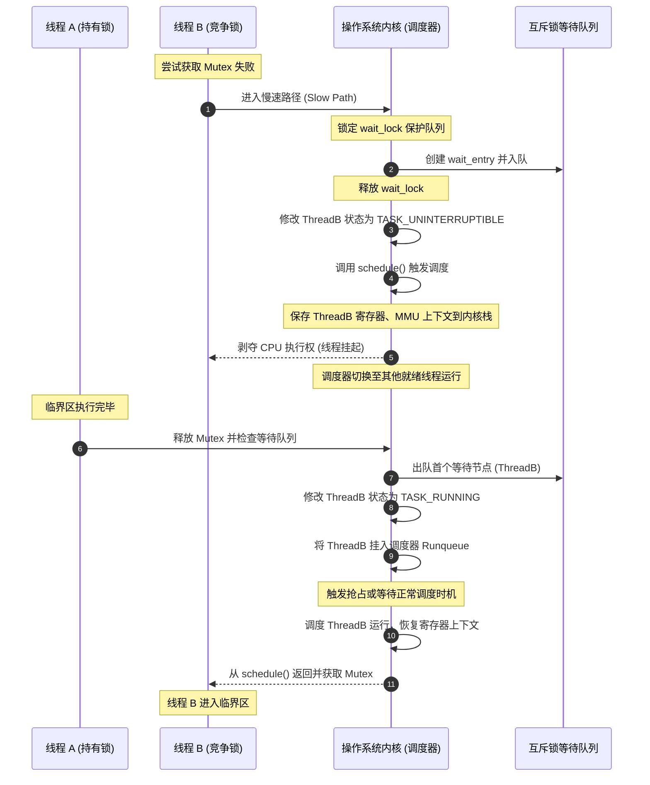
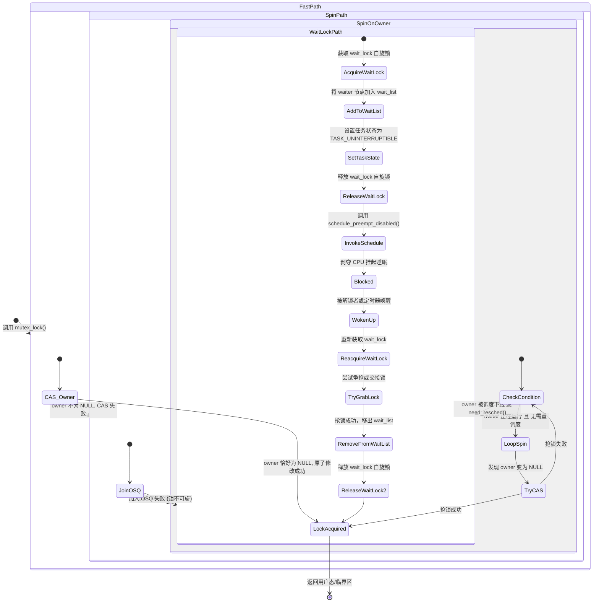
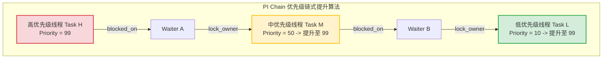
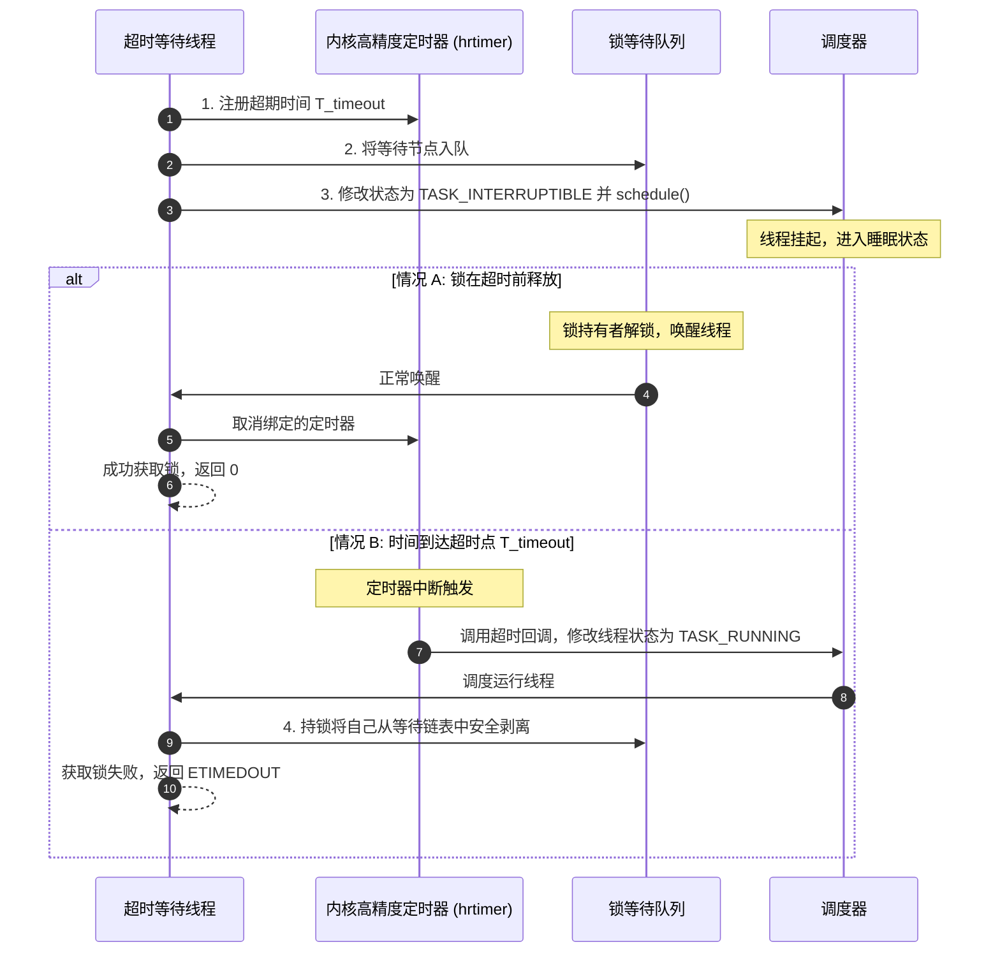

# 1.1.3.2 互斥锁

互斥锁（Mutex，全称 Mutual Exclusion Lock）是多任务操作系统中用于协调多个执行流（线程或进程）共享资源访问的最基本、最核心的同步原语。在多核（SMP）及多线程并发环境下，如何高效、安全地保护临界区（Critical Section）是操作系统内核设计的重中之重。本文将从底层的物理机制、操作系统的调度理论、Linux 内核源码实现以及现代优化技术等多个维度，对互斥锁进行深度的剖析。

---

## 1. 核心定义与设计理念

### 1.1 互斥锁的物理意义与设计初衷
在单处理器或对称多处理器（SMP）系统中，并发执行的多个线程如果同时读写同一块共享内存，就会因为指令交错执行而产生竞态条件（Race Condition），导致数据一致性被破坏。互斥锁的物理意义，就是要在软件层面上强行将并发的执行流在临界区内进行**串行化（Serialization）**。

在硬件层面，互斥的本质依赖于多核缓存一致性协议（如 MESI 协议）以及总线锁（Bus Lock）与缓存锁（Cache Lock）。
当一个 CPU 核心尝试通过原子指令（如 x86 上的 `LOCK CMPXCHG`）修改锁变量时，它会向总线发送“获取所有权”（Read For Ownership, RFO）请求：
1. **总线锁（Bus Lock）**：早期处理器通过拉低 CPU 管脚上的 `LOCK#` 信号线，将共享总线独占，阻止其他 CPU 核心访问系统内存。这种方式开销极大，会使所有核心的内存访问陷入停顿。
2. **缓存锁（Cache Lock）**：现代 CPU 采用缓存一致性协议来保证原子性。如果锁变量所在的内存行（Cache Line）已经缓存在当前核心的 L1/L2 Cache 中，CPU 只需要利用缓存一致性协议将其他核心对应的缓存行置为“无效（Invalid）”状态，并在本地独占修改。这避免了锁定整条总线，极大地提升了并发性能。

互斥锁的设计初衷，就是在这种底层硬件原子操作的基础上，为用户空间和内核空间提供一种可以承载复杂业务逻辑的独占锁原语。

---

### 1.2 互斥锁与自旋锁的对比及临界区抉择
在操作系统中，保护临界区的两大主力是**自旋锁（Spinlock）**与**互斥锁（Mutex）**。它们的根本区别在于“竞争失败时线程的行为”：

| 维度 | 自旋锁 (Spinlock) | 互斥锁 (Mutex) |
| :--- | :--- | :--- |
| **等待行为** | 忙等待（Busy Waiting），在 CPU 上不断循环轮询锁变量 | 挂起（Blocking），让出 CPU 资源，线程进入睡眠状态 |
| **CPU 占用** | 持续占用 CPU 核心，消耗 100% 的 CPU 时间片 | 不占用 CPU 核心，由内核调度器调度其他任务运行 |
| **上下文切换** | 无上下文切换开销 | 包含两次完整的上下文切换（挂起与唤醒） |
| **响应延迟** | 极低，一旦锁释放，自旋线程立即可夺取锁 | 较高，需要等待调度器重新调度该线程运行 |
| **适用场景** | 临界区极短、执行时间确定、中断上下文 | 临界区较长、包含 I/O、内存分配或可能阻塞的操作 |
| **嵌套性** | 不允许在持锁期间发生睡眠（可能导致死锁） | 允许在持锁期间发生睡眠或阻塞操作 |

#### 临界区开销的定量分析
我们可以通过数学模型来定量评估在什么情况下应该选择自旋锁，什么情况下应该选择互斥锁。

设：
- $T_{cs}$ 为临界区（Critical Section）的实际执行时间。
- $C_{spin}$ 为自旋锁在单位时间内的 CPU 资源消耗成本（通常表现为核心满载功耗与总线占用）。
- $C_{ctx}$ 为单次 CPU 上下文切换（Context Switch）的系统开销（包括内核代码执行、寄存器暂存、TLB 刷新以及 Cache 局部性失效造成的间接惩罚）。
- $T_{ctx}$ 为进行一次完整上下文切换所消耗的时间。
- $P_{idle}$ 为线程睡眠挂起后，该 CPU 核心切换运行其他有用任务或进入低功耗状态的系统收益（若系统无其他任务，则仅为 CPU 空闲功耗）。

当一个线程竞争锁失败时：
*   **采用自旋锁的代价**：
    $$E_{spin} = C_{spin} \times T_{cs}$$
    自旋锁的开销随着临界区执行时间 $T_{cs}$ 的增加呈线性增长。

*   **采用互斥锁的代价**：
    假设线程竞争失败被挂起，随后锁释放被唤醒，这涉及两次上下文切换（挂起一次，唤醒一次）：
    $$E_{mutex} = 2 \times C_{ctx} + P_{idle} \times T_{cs}$$

当 $E_{spin} > E_{mutex}$ 时，互斥锁的性能表现优于自旋锁。忽略挂起期间极低的空闲功耗（令 $P_{idle} \approx 0$），我们可以推导出转折点阈值：
$$T_{cs} > \frac{2 \times C_{ctx}}{C_{spin}}$$

在现代通用处理器（如 Intel Xeon 或 ARM Cortex-A 系列）运行 Linux 系统时，一次完整的进程上下文切换时间 $T_{ctx}$ 大致在 **1 微秒到 5 微秒** 之间，折合数千到上万个时钟周期。因此，如果临界区的执行时间长于数微秒，或者临界区内部包含磁盘 I/O、网络请求、互斥等待其他锁等可能引发阻塞的行为，自旋锁会造成灾难性的 CPU 浪费，此时必须使用互斥锁。

---

### 1.3 竞争失败线程挂起与唤醒的全流程
当线程尝试获取互斥锁但锁已被占用时，操作系统会启动一个复杂的流程将该线程从 CPU 上剥离并挂起，直到后续被唤醒。其在内核中的标准时序如下：



#### 详细步骤剖析：
1.  **慢速路径入口**：线程通过原子操作判断锁已被占用，无法在用户态或快速路径下直接获取，于是发起系统调用（对于用户态锁）或直接调用内核互斥体函数（对于内核锁），进入慢速路径（Slow Path）。
2.  **构建等待节点**：内核在当前线程的内核栈上或者通过动态分配构建一个等待队列节点（如 `struct mutex_waiter`）。
3.  **入队与状态修改**：
    *   内核获取保护该锁等待队列的自旋锁（`wait_lock`），将等待节点挂入锁的双向链表 `wait_list`。
    - 将当前线程的 `task_struct->state` 状态字段从 `TASK_RUNNING`（就绪/运行）修改为 `TASK_UNINTERRUPTIBLE`（不可中断睡眠）或 `TASK_INTERRUPTIBLE`（可中断睡眠）。不可中断状态能保证线程在等待锁的过程中不会被用户态发送的常规信号（如 `SIGINT`）强行打断，从而避免产生复杂的局部加锁状态。
4.  **让出 CPU（主动调度）**：
    *   内核调用调度核心函数 `schedule()`。
    - 调度器执行 CPU 上下文切换：将当前 CPU 寄存器组（包括通用寄存器、程序计数器 PC、堆栈指针 SP 等）压入该线程的内核栈，切换 MMU 的页表基地址（CR3 寄存器），然后加载下一个就绪线程的上下文。
    *   此时，当前线程失去 CPU 执行权，处于挂起状态。
5.  **唤醒时序**：
    *   锁持有者执行完毕，释放锁。解锁代码检测到等待队列不为空，便会获取 `wait_lock`，从 `wait_list` 中取出头节点。
    - 解锁者调用 `wake_up_process()`。内核将目标线程的状态置为 `TASK_RUNNING`，并将其插入到当前或某个 CPU 的就绪队列（Runqueue）中。
    *   在下一次调度时机（或通过抢占机制），目标线程被选中，其寄存器上下文被重新加载回 CPU，线程从 `schedule()` 调用处恢复执行，并正式接管互斥锁。

---

## 2. Linux Futex (Fast Userspace Mutex) 原理

### 2.1 传统进程间/线程间同步的痛点
在早期的 Linux 内核（Linux 2.5 之前）及传统的 UNIX 系统中，所有的同步原语（如 System V 信号量、内核锁）都完全驻留在内核中。这意味着：
*   **每一次加锁与释放锁，都必须发起系统调用（Syscall）陷入内核**。
*   即使在**完全没有竞争**的场景下，用户态线程也必须付出特权级切换（用户态 $\leftrightarrow$ 内核态）的昂贵代价。系统调用涉及到保存用户态寄存器、切换内核栈、验证系统调用号、安全检查等，其开销通常在数百个时钟周期以上。
*   统计表明，在设计良好的软件中，**80% 以上的锁获取是在无竞争状态下发生的**。每次加锁都陷入内核的设计成了限制多线程并发性能的严重瓶颈。

---

### 2.2 Futex 的诞生背景与核心思想
为了彻底解决上述痛点，Linux 引入了 **Futex (Fast Userspace Mutex)** 机制。它的核心设计哲学非常简单而精妙：
> **在无竞争的快速路径下，同步操作完全在用户空间通过原子指令完成，不需要任何系统调用；只有在发生锁竞争的慢速路径下，线程才通过系统调用陷入内核进行挂起或唤醒。**

---

### 2.3 用户态快速路径 (Fast Path) 机制
在用户空间，一个基于 Futex 的互斥锁通常表现为一个 32 位的整型变量（我们称之为 `val` 或 `futex_val`）。
*   `val = 1`：表示锁处于闲置（Unlocked）状态。
*   `val = 0`：表示锁已被持有，但暂时没有其他线程在排队等待（Locked, no waiters）。
*   `val < 0`（通常为 -1）：表示锁已被持有，且有其他线程正在内核中排队等待（Locked, with waiters）。

#### 快速路径加锁 (Lock Fast Path)
当线程 A 尝试加锁时，它在用户空间执行一个原子的比较并交换（Compare-and-Swap, CAS）指令：

```cpp
#include <atomic>

struct userspace_mutex {
    std::atomic<int> futex_val{1}; // 1 代表空闲
};

bool mutex_lock_fast(userspace_mutex* mutex) {
    int expected = 1;
    // 尝试将 1 原子地修改为 0
    return mutex->futex_val.compare_exchange_strong(
        expected, 
        0, 
        std::memory_order_acquire, 
        std::memory_order_relaxed
    );
}
```

如果 `compare_exchange_strong` 返回 `true`，说明锁当时处于闲置状态且已被线程 A 成功获取。整个过程仅耗时几个纳秒，**完全没有陷入内核**。

---

### 2.4 内核态慢速路径 (Slow Path) 与 `sys_futex` 调用
当上述 CAS 操作失败时（即 `expected` 不等于 1，说明锁已被占用），线程必须走慢速路径。此时，它需要发起 `sys_futex` 系统调用，将自己挂起。

#### 慢速路径的底层系统调用接口
Linux 提供的 `sys_futex` 系统调用原型如下：

```c
#include <linux/futex.h>
#include <sys/syscall.h>
#include <unistd.h>

long syscall(SYS_futex, uint32_t *uaddr, int op, uint32_t val,
             const struct timespec *timeout, uint32_t *uaddr2, uint32_t val3);
```

对于基础的互斥锁挂起与唤醒，主要使用 `FUTEX_WAIT` 和 `FUTEX_WAKE` 两个操作码（`op`）。

#### 1. FUTEX_WAIT 的内核执行逻辑
当线程调用 `syscall(SYS_futex, uaddr, FUTEX_WAIT, val, timeout, NULL, 0)` 时，内核会在内核态执行以下关键步骤：

1.  **用户态地址读安全检查**：内核通过 `get_user()` 等安全机制，读取用户空间地址 `uaddr` 处的当前值。
2.  **防范 Race Condition（核心双重检查）**：
    内核比对读取到的当前值与传入的参数 `val`（即线程在用户态抢锁失败时读取到的锁状态值）：
    *   如果 `*uaddr != val`，说明在线程从用户态发起系统调用、拷贝参数到内核态的这几个微秒内，锁的所有者已经在用户态释放了锁。此时，内核会**立即返回 `-EWOULDBLOCK` (或 `-EAGAIN`)**。线程回到用户态重新尝试快速路径抢锁。这避免了线程因时序差异白白进入睡眠而造成“死锁/永久挂起”的 Race Condition。
    *   如果 `*uaddr == val`，说明锁依然被占用，线程安全地准备进入挂起。
3.  **入队与挂起**：内核将线程包装成等待节点，挂入哈希表中对应的 Futex 等待队列，并将任务状态设置为 `TASK_INTERRUPTIBLE` / `TASK_UNINTERRUPTIBLE`，随后触发调度器 `schedule()` 挂起线程。

#### 2. FUTEX_WAKE 的内核执行逻辑
当锁持有者在用户态完成临界区操作准备解锁时，它执行原子指令将 `futex_val` 从 0 或 -1 修改为 1。如果修改前的旧值是负数（即有等待者），它必须调用 `syscall(SYS_futex, uaddr, FUTEX_WAKE, 1, NULL, NULL, 0)` 唤醒排队线程。
内核接收到请求后：
1.  根据 `uaddr` 计算出哈希键值。
2.  找到全局哈希表对应的桶（Bucket）。
3.  遍历等待链表，唤醒最多 `val`（此处传入 1）个正在该地址上等待的线程。

---

### 2.5 Futex 内核数据结构设计
为了在大规模并发下快速定位和管理等待锁的线程，Linux 内核设计了基于哈希表的 Futex 架构。

#### 2.5.1 全局哈希表 `futex_queues`
内核中所有线程的 Futex 等待节点都统一存放在一个全局哈希表中：
```c
static struct futex_hash_bucket futex_queues[1 << futex_shift];
```
每个哈希桶 `struct futex_hash_bucket` 的定义如下：
```c
struct futex_hash_bucket {
    spinlock_t lock;                 /* 保护该桶内链表的自旋锁 */
    struct plist_head chain;         /* 优先级链表，按线程优先级排序保存等待节点 */
};
```

#### 2.5.2 核心等待节点 `struct futex_q`
每个因为 Futex 挂起的线程在内核中都对应一个 `struct futex_q` 结构：
```c
struct futex_q {
    struct plist_node list;          /* 挂入 futex_hash_bucket 的链表节点 */
    struct task_struct *task;        /* 指向被挂起线程的 task_struct */
    union futex_key key;             /* 该锁的唯一标识键（基于物理地址或虚拟地址） */
    // ... 包含优先级继承（PI）相关指针
};
```

#### 2.5.3 物理地址敏感的哈希键 `union futex_key`
如何利用一个用户态虚拟地址 `uaddr` 唯一地标识一个锁？如果仅仅使用 `uaddr`（指针数值），会遇到以下严重问题：
*   **进程间共享锁（Shared Mutex）**：当锁位于共享内存（通过 `shm_open` 或文件 `mmap`）中时，同一个物理内存页在不同的进程中，其虚拟地址空间（`uaddr`）可能是完全不同的。如果以虚拟地址为 Key，不同进程的线程将定位到不同的哈希桶，导致无法互相唤醒。
*   **进程私有锁（Private Mutex）**：同一进程的不同线程虚拟地址空间相同，因此可以直接用虚拟地址。

内核通过 `union futex_key` 完美地解决了这一问题：

```c
union futex_key {
    struct {
        unsigned long address;       /* 虚拟地址（最低位标识是否为共享） */
        struct mm_struct *mm;        /* 对应进程的内存描述符指针 */
        int offset;
    } private;                       /* 进程私有锁的 Key 构成 */
    struct {
        unsigned long pgoff;         /* 物理页在文件/映射中的偏移量 */
        struct address_space *mapping; /* 物理页关联的地址空间（指向 inode） */
        int offset;                  /* 页内偏移 */
    } shared;                        /* 共享锁的 Key 构成，基于底层物理页和映射 */
};
```

*   对于**进程私有锁**：`futex_key` 绑定虚拟地址和当前进程的 `mm_struct`。
*   对于**进程间共享锁**：内核在慢速路径中会通过页表查询（Page Table Walk）获取该用户态虚拟地址对应的底层**物理页（Page Frame）**，用物理页的映射关系 `mapping` 和偏移量 `pgoff` 来构建 Key。这样，无论各进程的虚拟地址如何不同，只要它们物理上指向同一个内存位置，生成的 `futex_key` 就是绝对一致的。

---

### 2.6 唤醒时序与惊群效应（Thundering Herd）规避
在多线程高并发争抢同一个互斥锁时，如果处理不当，极易引发**惊群效应**。

#### 1. 锁唤醒的精准控制
在 Futex 机制中，当调用 `FUTEX_WAKE` 时，参数 `val` 被设置为 `1`。这意味着内核在哈希桶的等待队列中**仅仅唤醒队列头部的第一个线程**。
由于只有一个线程被唤醒，它在返回用户态后可以直接承接或夺取该锁，没有其他线程并发与之竞争，从而彻底避免了“唤醒一大群，只有一个抢到，其余再次被迫睡眠”的惊群效应，极大地节省了 CPU 调度开销。

#### 2. 条件变量下的 `FUTEX_CMP_REQUEUE` 优化
在条件变量（Condition Variable，如 `pthread_cond_t`）与互斥锁配合使用的场景中，当调用 `pthread_cond_broadcast` 时，理论上需要唤醒所有等待在条件变量上的线程。
然而，这些线程被唤醒后，返回用户空间的第一件事就是尝试去获取与之关联的互斥锁（Mutex）。因为同一时刻只能有一个线程获取互斥锁，所以除了那一个幸运儿之外，其余被唤醒的几十甚至上百个线程又会在抢锁失败后重新发起系统调用，再次陷入内核挂起。这是一种极其典型的惊群效应。

Linux Futex 引入了 `FUTEX_CMP_REQUEUE` 操作来完美化解这一问题：
*   当执行广播唤醒时，内核不会直接将等待在条件变量 A 的 Futex 队列上的所有线程唤醒。
*   内核只会唤醒其中 1 个线程（通常是队列首部线程）。
*   对于其余的 $N-1$ 个线程，内核通过直接修改双向链表指针，**将它们从条件变量 A 的 Futex 等待队列，转移（Requeue）到互斥锁 B 的 Futex 等待队列中**。整个转移过程完全在内核态以极高效率完成。
*   被转移的线程继续保持睡眠状态，直到它们在锁 B 的等待队列中被正常地、逐个唤醒，从而彻底消除了用户态与内核态之间无谓的往返震荡。

---

## 3. Linux 内核 mutex 数据结构与优化

不仅用户空间的多线程需要互斥锁，Linux 内核自身在执行各种系统调用、驱动程序和子系统控制时，也需要高效的内核级互斥体。在 Linux 内核中，这个数据结构就是 `struct mutex`。

### 3.1 Linux 内核 `struct mutex` 的核心字段解析
在较新的 Linux 内核源码中，`struct mutex` 的定义（精简版）如下：

```c
struct mutex {
    atomic_long_t        owner;      /* 核心字段：既存储锁持有者，也编码锁状态 */
    raw_spinlock_t       wait_lock;  /* 保护 wait_list 的原始自旋锁 */
    struct list_head     wait_list;  /* 互斥锁的等待队列链表 */
#ifdef CONFIG_MUTEX_SPIN_ON_OWNER
    struct optimistic_spin_queue osq; /* 乐观自旋排队队列（MCS 锁） */
#endif
};
```

#### `owner` 字段的移位/低位标记技巧
`owner` 字段是整个内核互斥体设计的精妙所在。在 64 位系统上，一个 `struct task_struct *`（进程控制块）指针的大小是 8 字节。因为内存对齐原因，所有合法的 `task_struct` 结构体指针的地址，其**最低的 3 位（Bit 0, Bit 1, Bit 2）在数学上必然为 0**（因为地址是 8 字节对齐，即是 8 的整数倍，二进制表示最后三位为 `000`）。

内核开发者充分利用了这闲置的 3 位，将锁的运行状态编码进指针的低位中：

| 状态标志位 | 十六进制值 | 二进制位 | 物理意义 |
| :--- | :--- | :--- | :--- |
| `MUTEX_FLAG_WAITERS` | `0x01` | `...001` | 表示当前锁的等待队列 `wait_list` 中有其他线程在排队等待，解锁时**必须**走慢速路径执行唤醒。 |
| `MUTEX_FLAG_HANDOFF` | `0x02` | `...010` | 锁交接标志。强制下一个获取锁的线程直接“接管”锁，防止后来者通过乐观自旋无限抢占锁导致队列中的 waiter 饥饿。 |
| `MUTEX_FLAG_PICKUP` | `0x04` | `...100` | 表示排在队首的 waiter 已经准备好接管该锁。 |

通过这种紧凑的编码方式，内核仅用一个原子的 64 位变量，就同时保存了“当前谁持有锁”以及“当前锁处于什么管理状态”两个关键信息。
*   **获取当前持有锁的 Task 指针**：
    ```c
    struct task_struct *owner_task = (struct task_struct *)(
        atomic_long_read(&lock->owner) & ~MUTEX_FLAG_ALL
    ); // 屏蔽低3位状态位，还原真实指针地址
    ```
*   **无竞争快速解锁**：
    如果 `owner` 的值恰好等于当前运行线程的 `task_struct *` 指针，且没有设置任何标志位（即低 3 位全为 0），解锁操作只需要一步简单的原子 CAS 操作，将 `owner` 重置为 `NULL` 即可，完全不需要去碰 `wait_lock` 和 `wait_list`。

---

### 3.2 乐观自旋（Optimistic Spinning）优化机制
在 SMP 多核架构下，传统的互斥锁只要一抢不到锁，就立刻把线程投入挂起状态。然而，研究表明，很多内核临界区的持有时间非常短。如果持有锁的那个线程此刻正在另一个 CPU 核心上运行，它大概率在几百个时钟周期内就会释放锁。
如果当前线程能够稍微“等一会儿”（自旋轮询），极有可能直接拿到锁，从而避免昂贵的上下文切换。这种优化技术被称为 **乐观自旋 (Optimistic Spinning)**。

#### 3.2.1 触发与维持乐观自旋的三个严苛条件
自旋虽然能规避上下文切换，但它是需要消耗 CPU 算力的忙等待。因此，内核在 `mutex_spin_on_owner` 中设定了极为苛刻的自旋中止条件：

1.  **持有者必须在运行（`owner->on_cpu == 1`）**：
    当前线程在自旋时，会实时读取 `lock->owner` 得到持有者的 `task_struct` 指针。如果发现该持有者此时处于睡眠状态，或者已经被调度下线（即 `owner->on_cpu == 0`），自旋线程会**立刻退出自旋，准备挂起**。因为持有者都不在运行，说明它不可能在短期内释放锁，继续自旋纯属浪费 CPU。
2.  **当前 CPU 没有抢占请求（`!need_resched()`）**：
    当前自旋线程所在的 CPU 如果有更高优先级（如实时任务、中断下半部）的任务急需运行（即调度器设置了 `TIF_NEED_RESCHED` 标志），自旋线程必须**立刻放弃自旋，让出 CPU**。
3.  **OSQ 队列未被排满**：
    乐观自旋的线程不能杂乱无章地轰炸 `lock->owner`，必须在 OSQ（Optimistic Spinning Queue）中排队自旋，防止总线过载。

#### 3.2.2 MCS 锁与 OSQ 机制防止 Cache Line Bouncing
当有几十个 CPU 核心上的线程同时尝试抢夺同一个内核互斥锁并进入乐观自旋时，如果所有线程都在循环读取和检测 `lock->owner` 这个共享变量，会发生什么？

在多核架构中，这一块共享内存对应的 Cache Line 会在所有相关的 CPU L1/L2 缓存中被标记为共享（Shared）。一旦锁持有者释放锁，原子的修改操作会将该 Cache Line 标记为失效，导致所有自旋的 CPU 核心必须同时通过系统总线向内存或 L3 缓存发起重新读取请求。这种现象被称为 **Cache Line Bouncing（缓存行颠簸）**。它会瞬间占满内存总线带宽，导致系统整体性能出现雪崩式下滑。

为了消除缓存行颠簸，Linux 互斥锁引入了 **OSQ（Optimistic Spinning Queue）**，它本质上是一个轻量级的、无锁的 **MCS 锁（Mellor-Crummey and Scott lock）** 变体。

```mermaid
graph TD
    subgraph OSQ (Optimistic Spinning Queue) 排队机制
        Node1[OSQ 队首节点 CPU 0]
        Node2[OSQ 中间节点 CPU 1]
        Node3[OSQ 队尾节点 CPU 2]
        Node1 -->|轮询检测| MutexOwner[lock->owner 字段]
        Node2 -->|轮询检测| PrevNode1[前驱节点 Node1 的状态]
        Node3 -->|轮询检测| PrevNode2[前驱节点 Node2 的状态]
    end
    
    style Node1 fill:#d4edda,stroke:#28a745,stroke-width:2px
    style Node2 fill:#fff3cd,stroke:#ffc107,stroke-width:2px
    style Node3 fill:#fff3cd,stroke:#ffc107,stroke-width:2px
    style MutexOwner fill:#f8d7da,stroke:#dc3545,stroke-width:2px
```

*   **排队自旋**：所有进入乐观自旋的线程，在尝试抢锁前，必须先将自己包装成一个 `osq_node`，加入到该互斥锁的 `lock->osq` 队列中。
*   **局部变量轮询**：
    *   **只有处于 OSQ 队列头部（队首）的那个 CPU 核心**，才有特权去循环读取和轮询全局的 `lock->owner` 字段。
    *   处于队列后面的其他核心，只在它们**各自本地的、私有的 `osq_node` 状态变量上自旋**。
*   **链式唤醒与退出**：当队首的核心抢到锁退出 OSQ 时，它会主动修改下一个核心所轮询的本地变量，将所有权递补。
*   这种设计将全局变量的无序并发轮询，转换成了局部的、分布式的 Cache 链表轮询，将总线冲突降到了最底线。

---

### 3.3 互斥锁慢速路径状态机与核心算法推演
我们可以将 Linux 内核 `struct mutex` 的加锁全过程整理为一个多阶段演进的状态机。



---

## 4. 锁竞争的开销与副作用

尽管互斥锁是多线程安全的避风港，但频繁的锁竞争（Lock Contention）会引入严重的性能惩罚。

### 4.1 完整的 CPU 上下文切换（Context Switch）损耗分析
当互斥锁竞争失败，线程从运行状态被投入睡眠挂起，随后的唤醒过程会触发两次完整的 CPU 上下文切换。这一过程不仅包含了软件逻辑的执行，更伴随着微处理器硬件性能的严重衰退。

#### 1. 软件层面的寄存器与栈上下文切换
内核在进行进程/线程切换时，必须执行以下底层操作：
*   **通用寄存器暂存**：将当前 CPU 物理寄存器（如 x86_64 上的 RAX, RBX, RCX, RDX, RSI, RDI, RBP 以及 R8-R15 等，或者 ARM 的 R0-R12）全部压入当前线程的内核栈（Kernel Stack）。
*   **特殊寄存器保存**：保存程序计数器 RIP（指向当前执行的下一条指令地址）和堆栈指针 RSP（指向当前内核栈顶）。
*   **硬件上下文重载**：将目标线程之前保存在其内核栈上的寄存器状态，逆向弹回 CPU 的物理寄存器中，并更新 RSP 和 RIP。
*   **高级浮点/向量状态保存（延迟保存）**：若线程使用了 AVX-512、SSE 或 ARM Neon 等浮点和向量扩展，这些庞大（可能达数 KB）的寄存器状态也必须进行保存与重载。

#### 2. 页表切换与 TLB（Translation Lookaside Buffer）失效
如果是**不同进程**之间的线程切换，由于它们拥有独立的虚拟地址空间，内核必须修改控制寄存器（如 x86 上的 CR3 寄存器），指向新进程的页目录物理基地址（Page Directory Base Address）。
这一步会导致严重的硬件性能惩罚：
*   **TLB 刷新**：修改 CR3 寄存器会导致 CPU 内部的高速页表缓存（TLB）中所有非全局（Non-Global）的虚拟到物理地址映射项全部失效。
*   **页表查找延迟（Page Table Walk）**：在新进程运行后，由于 TLB 被清空，接下来的绝大多数内存访问都会面临 TLB Miss。CPU 的硬件 MMU 必须强行通过多级页表（在 64 位系统上通常是 4 级或 5 级页表）进行逐级内存查询，每一次内存寻址都会被放大成 4 到 5 次慢速的物理内存访问，极大降低了指令执行流水线效率。
*   *注：现代 CPU 引入了 PCID（Process Context Identifier）或 ASID 机制，允许 TLB 中共存多个进程的映射并进行 ID 匹配，但由于 TLB 物理容量极其有限，新进程运行产生的映射依然会迅速将旧进程的映射挤出缓存。*

#### 3. CPU 缓存“冷启动”效应（Cold Cache Effect）
这是上下文切换带来最隐蔽、最持久的开销：
*   在被挂起前，线程 A 正在高频访问它的局部变量、临界区共享数据。这些数据已经被加载并热化在 CPU 核心的 L1 Data Cache 和 L2 Cache 中（访问延迟通常仅为 1 ~ 4 个时钟周期）。
*   当线程 A 被挂起，另一个线程 B 被调度到该核心上运行。线程 B 运行期间，其读写操作会逐步将原本属于线程 A 的缓存行（Cache Lines）驱逐出缓存。
*   当线程 A 被唤醒并在该核心上重新开始运行时，原先热化的缓存已经变“冷”。由于大面积的 Cache Miss，CPU 必须频繁向慢速的 L3 Cache 或系统主内存拉取数据，导致处理器流水线产生大量的空转停顿（Stalls）。
*   若线程 A 被唤醒后，被调度到了**另一个物理 CPU 核心**甚至**跨越了 NUMA 节点**，它将面临更加高昂的跨核缓存行迁移与远程内存读取开销。

---

### 4.2 优先级反转（Priority Inversion）的成因与危害
优先级反转是实时多任务操作系统（RTOS）以及通用操作系统（如 Linux）中，因互斥锁竞争引发的极具破坏性的副作用。

#### 4.2.1 经典三线程模型成因推导
假设系统中有三个线程，优先级高低关系为：**Task H (高) > Task M (中) > Task L (低)**。
这三个线程的并发执行路径如下：

```mermaid
gantt
    title 优先级反转时序演进图
    dateFormat  X
    axisFormat %s

    section Task L (低)
    运行并获取锁 A       :active, l1, 0, 3
    被 Task H 抢占并挂起 :l2, 3, 5
    被 Task M 抢占且无限期挂起 :crit, l3, 5, 12
    重新运行并释放锁 A   :l4, 12, 14

    section Task M (中)
    处于就绪状态并启动 :active, m1, 5, 10
    持续占用 CPU 运行 :active, m2, 10, 12

    section Task H (高)
    就绪启动并尝试抢占 :active, h1, 3, 4
    尝试获取锁 A 失败而挂起(阻塞) :h2, 4, 12
    被唤醒并成功持有锁 A 运行 :active, h3, 12, 15
```



1.  **阶段一**：低优先级线程 Task L 首先启动，并成功获取了互斥锁 $Lock_A$，进入临界区执行。
2.  **阶段二**：高优先级线程 Task H 随后被唤醒。由于其优先级高于 Task L，它立即抢占了 Task L 并开始运行。
3.  **阶段三**：Task H 运行过程中，尝试去获取互斥锁 $Lock_A$。由于该锁正被 Task L 持有，Task H 获取锁失败，被迫进入挂起状态，等待 Task L 释放锁。此时，CPU 控制权回落到 Task L。
4.  **阶段四（致命反转发生）**：在中途，不需要锁的中优先级的线程 Task M 突然被唤醒。因为 Task M 的优先级高于当前正在运行的 Task L，Task M 毫不客气地抢占了 Task L 的 CPU 资源，开始大摇大摆地运行。
5.  **最终危害**：由于 Task M 持续占用 CPU，导致低优先级的 Task L 根本没有机会运行，因而**无法释放锁 $Lock_A$**。这间接导致了最急需 CPU 资源的高优先级线程 Task H 被中优先级的 Task M 无限期地阻塞！

#### 4.2.2 历史经典案例
这一经典问题最著名的受害者是 1997 年美国宇航局（NASA）的**火星探路者号（Mars Pathfinder）**。当时，火星车在运行过程中频繁发生无故死锁复位，导致数据丢失。
经排查，其底层原因就是：VxWorks 操作系统中，负责信息分发的高优先级线程因为等待一个互斥锁，被正在进行大量气象数据处理的中优先级线程间接阻塞，导致低优先级的锁持有者迟迟无法释放锁。最终，系统的看门狗定时器（Watchdog Timer）检测到高优先级线程长时间不工作，判定系统崩溃，强行执行了硬件复位。

---

### 4.3 优先级继承（Priority Inheritance, PI）协议的设计与实现
为了预防和消除优先级反转，计算机科学家提出了**优先级继承（Priority Inheritance）**协议。

#### 4.3.1 协议核心法则
当高优先级线程 Task H 被低优先级线程 Task L 持有的锁阻塞时：
> **系统内核会自动、动态地将 Task L 的运行优先级临时提升到与 Task H 相同的级别，防止任何中等优先级的 Task M 抢占 Task L。一旦 Task L 完成临界区操作并释放锁，它的优先级会立刻恢复为原先的低优先级状态。**

#### 4.3.2 优先级链（PI Chain）传递机制
在复杂的嵌套加锁场景下，可能会形成链式的依赖关系：
$$Task\ H \rightarrow 等待锁\ A \rightarrow 被\ Task\ M\ 持有 \rightarrow 等待锁\ B \rightarrow 被\ Task\ L\ 持有$$
此时，优先级继承协议必须支持**传递性（Transitivity）**：
内核必须沿着这条阻碍关系链条，递归地将 Task H 的优先级传递给 Task M，再传递给 Task L。确保整条链路上的所有锁持有者都以 $Task\ H$ 的优先级快速运行并释放锁，从而打破死锁链。

#### 4.3.3 Linux 内核中的 `rt_mutex` 优先级继承实现
由于普通的 `struct mutex` 为了追求极致的轻量化，默认**不支持**优先级继承。Linux 内核专门开发了实时互斥体 `struct rt_mutex` 用于硬实时场景。

```c
struct rt_mutex {
    raw_spinlock_t        wait_lock;
    struct rb_root_cached waiters;    /* 缓存的红黑树，按优先级保存等待者 */
    struct task_struct   *owner;      /* 指向锁持有者 */
};
```

当一个线程准备挂入 `rt_mutex` 的等待队列时，内核调度器会启动以下复杂的 PI Chain 调整逻辑：



1.  **挂载 blocked_on**：将当前线程的 `task_struct->pi_blocked_on` 指针指向对应的 `rt_mutex_waiter`。
2.  **查找 Owner**：顺着 `waiter->lock->owner` 找到持有该锁的 Task。
3.  **优先级比较与提升**：
    *   比较当前线程与 Owner 的优先级。如果当前线程的优先级高于 Owner，则将 Owner 的临时优先级（`prio`）提升至当前线程级别。
    *   由于 Owner 优先级发生改变，它的 `task_struct` 必须被移出原本的调度运行队列，并按照新的优先级重新插入到调度器的 Runqueue 中，以保证其能够立刻抢占其他任务。
4.  **递归传播**：接着检查被提升的 Owner 是否也处于 `pi_blocked_on`（即在等待另一个锁）。如果是，沿着链条继续向上重复该步骤，直至链条结束。
5.  **释放与回退**：当锁被释放时，内核会逆向遍历此链表，将所有继承得到的优先级扣除，恢复每个 Task 正常的静态/动态优先级。

---

## 5. 锁的扩展机制与变体

为了适应不同场景下的并发开发，在基本互斥锁之上，衍生出了多种扩展机制与锁的变体。

### 5.1 重入锁 (Recursive Mutex / Reentrant Lock)
在标准的互斥锁实现中，**锁是不允许重入的**。如果一个线程在持有某个互斥锁的情况下，由于代码嵌套调用或递归执行，再次尝试去获取这个锁，就会引发自锁死锁（Self-Deadlock）：线程将自己挂起等待自己释放锁，但因为自己已被挂起，所以锁永远无法释放。

为了解决递归调用的并发安全问题，**重入锁 (Recursive Mutex)** 应运而生。

#### 5.1.1 计数器与所有权判定实现原理
重入锁在内部引入了两个关键的信息字段：
1.  `owner_thread`：保存当前持有锁的线程 ID / 句柄。
2.  `recursion_count`：整型的重入计数器。

其底层的加锁与解锁逻辑伪代码如下：

```cpp
#include <thread>
#include <mutex>
#include <system_error>

class RecursiveMutex {
private:
    std::mutex base_lock;                      /* 底层的基础不可重入锁 */
    std::thread::id owner_id;                  /* 持有者线程ID */
    uint32_t recursion_count = 0;             /* 重入计数器 */

public:
    void lock() {
        auto current_thread = std::this_thread::get_id();

        // 核心判定：当前线程是否就是锁的持有者？
        if (owner_id == current_thread) {
            // 是，则仅递增计数器，直接返回，不触发底层互斥竞争
            recursion_count++;
            return;
        }

        // 否，说明锁空闲或被他人持有，调用底层锁进行标准的物理争抢
        base_lock.lock();
        
        // 夺锁成功，确立所有权，计数器置为 1
        owner_id = current_thread;
        recursion_count = 1;
    }

    void unlock() {
        auto current_thread = std::this_thread::get_id();

        // 安全检查：防止未持锁的线程恶意调用解锁
        if (owner_id != current_thread) {
            throw std::system_error(
                std::make_error_code(std::errc::operation_not_permitted)
            );
        }

        recursion_count--;
        
        // 只有当重入计数器归零时，才说明最外层临界区已退出
        if (recursion_count == 0) {
            owner_id = std::thread::id();      /* 清空持有者标记 */
            base_lock.unlock();                /* 真正释放底层锁，允许他人争抢 */
        }
    }
};
```

#### 5.1.2 优缺点分析与设计误区
*   **优点**：极大地简化了递归算法或复杂多层级面向对象 API 内部的同步设计，避免了因为重复调用同一类的方法而导致的自锁。
*   **缺点**：
    *   **掩盖了糟糕的架构设计**：频繁使用重入锁往往意味着代码的模块化和临界区划分不够清晰，使得开发者忽视了锁持有的真正生命周期。
    *   **破坏临界区封装性**：在深层重入中，一旦某些数据状态不一致，外部很难察觉，且调试极其困难。

---

### 5.2 非阻塞尝试锁 (try_lock)
在许多高性能多线程网络框架中，线程不希望在拿不到锁时被挂起，因为睡眠挂起的开销过大且响应延迟不确定。为了提供更灵活的同步语义，所有的现代锁 API（如 `pthread_mutex_trylock` 或 `std::unique_lock::try_lock`）都提供了非阻塞争锁的机制。

#### 5.2.1 try_lock 的实现机制与状态机
`try_lock` 的底层非常简洁：**它摒弃了所有的慢速路径**。

*   当线程调用 `try_lock` 时，它直接在用户态（或内核态）执行一次原子的 CAS 操作。
*   **CAS 成功**：直接改变锁状态为占用，确立所有权，并返回 `true`。
*   **CAS 失败**：不进行自旋，不创建等待节点，不调用内核系统调用挂起，而是**立刻放弃并返回 `false`**。

#### 5.2.2 典型应用场景：死锁预防（Deadlock Avoidance）
在需要同时获取多个锁（锁 A 和锁 B）的复杂场景下，如果使用阻塞锁，容易因为线程间交叉抢锁（线程 1 持有 A 抢 B，线程 2 持有 B 抢 A）导致死锁。使用 `try_lock` 可以优雅地解决：

```cpp
#include <mutex>
#include <chrono>
#include <thread>

std::mutex lock_A;
std::mutex lock_B;

void acquire_resources_safe() {
    while (true) {
        // 先锁定 A
        lock_A.lock();
        
        // 尝试非阻塞获取 B
        if (lock_B.try_lock()) {
            // 双锁获取成功，安全进入临界区
            break;
        }
        
        // 获取 B 失败，必须立刻释放持有的 A，避免霸占导致死锁，并稍后重试
        lock_A.unlock();
        std::this_thread::sleep_for(std::chrono::microseconds(10));
    }
}
```

---

### 5.3 超时等待锁 (Timed Lock)
为了应对外部请求的时延敏感性，防止线程因为永久死锁或锁持有者崩溃而无限期卡死在等待队列中，现代互斥锁提供了超时等待锁（如 `pthread_mutex_timedlock` 或 `std::timed_mutex`）。

#### 5.3.1 底层定时器挂载机制
在内核中，超时锁的等待是利用高精度定时器（`hrtimer`）与进程挂起等待队列的紧密协作来实现的。



#### 5.3.2 详细步骤推演
1.  **绝对时间转换**：用户传入的相对超时时间（如 500 毫秒）在进入内核后，会被转换为基于单调时钟（Monotonic Clock）的绝对时间点：
    $$T_{absolute} = T_{current} + T_{timeout}$$
2.  **注册定时器（hrtimer）**：
    内核在当前线程的内核栈上初始化一个高精度定时器结构 `struct hrtimer`，并配置其超期回调函数（通常为 `futex_wait_timeout` 的中断处理器）。定时器节点被插入到当前 CPU 维护的高精度定时器红黑树中。
3.  **双源挂起**：
    线程挂入互斥锁的等待队列并调用调度器挂起。此时，它同时被关联到了两个唤醒源：
    *   **唤醒源 1**：锁被释放时的正常入队唤醒。
    *   **唤醒源 2**：定时器到期时的高精度硬件定时器中断唤醒。
4.  **超时撤销与退出安全**：
    *   **若锁先释放**：线程被正常唤醒，它会立即调用 `hrtimer_try_to_cancel()` 取消刚才注册的定时器，避免后续产生无谓的硬件中断。然后拿到锁返回成功。
    *   **若定时器先超期**：硬件定时器中断被触发，中断处理程序在超级上下文中执行该定时器的超期回调。回调函数中会调用 `wake_up_process()` 将处于锁等待队列中的线程状态修改为 `TASK_RUNNING`。
        线程醒来后，检测到唤醒原因为超时。为了保证数据结构安全，它**必须首先获取锁的 `wait_lock` 自旋锁，然后将自己的等待节点从互斥锁的等待队列 `wait_list` 中彻底删除**。这防止了解锁者后续重复向一个已经超时退出的线程发送无意义的唤醒信号。最后，向用户空间返回错误码 `ETIMEDOUT`。

---

## 6. 总结与最佳实践

互斥锁作为并发控制的基础设施，经历了从早期“每次加锁均陷入内核”的低效设计，到现代“基于用户态 Futex 快速路径与内核态慢速路径相结合”的高效演进。在 SMP 多核系统的内核中，乐观自旋、MCS/OSQ 队列等技术将锁竞争带来的总线颠簸和上下文切换开销降到了极致。

但在应用开发中，依然需要遵循以下最佳实践以规避其固有的开销与副作用：
1.  **缩短临界区**：只在必须要保护的共享数据访问代码周围加锁。在临界区内，绝对不要执行任何 I/O 操作、高延迟的网络访问或复杂的系统调用。
2.  **避免死锁与反转**：在多锁嵌套的场景下，必须保证所有线程以绝对一致的顺序获取锁，或者采用 `try_lock` 机制进行死锁预防。在实时要求极高的系统里，应当显式配置并使用支持优先级继承协议的互斥锁（如 `rt_mutex`）。
3.  **考量并发粒度**：在高并发写、低写高读的场景下，可以考虑将互斥锁升级为读写锁（Shared-Exclusive Lock）或无锁设计（Lock-Free），进一步压榨处理器的并行计算红利。

