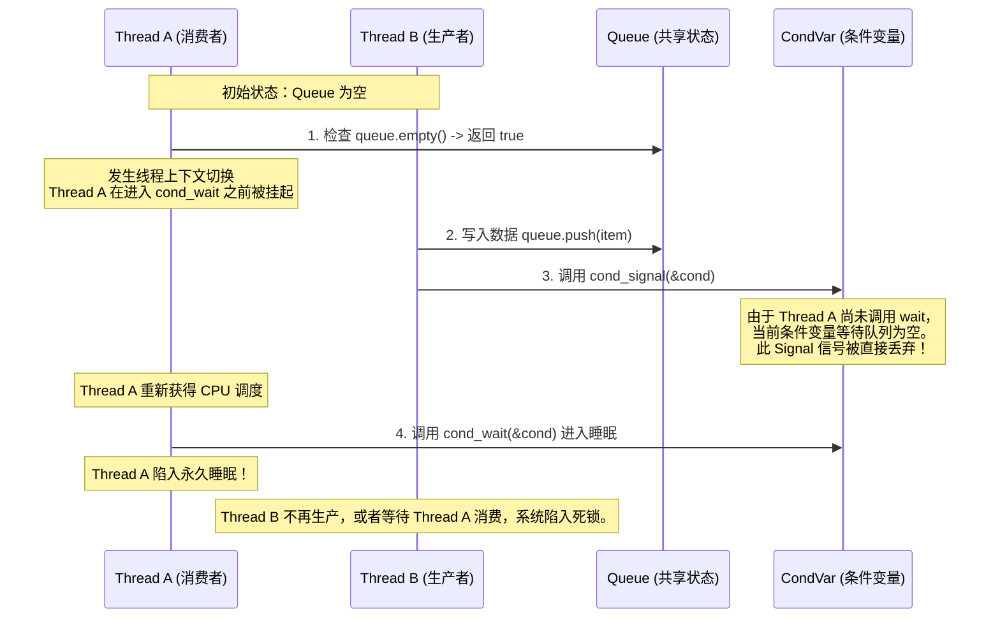
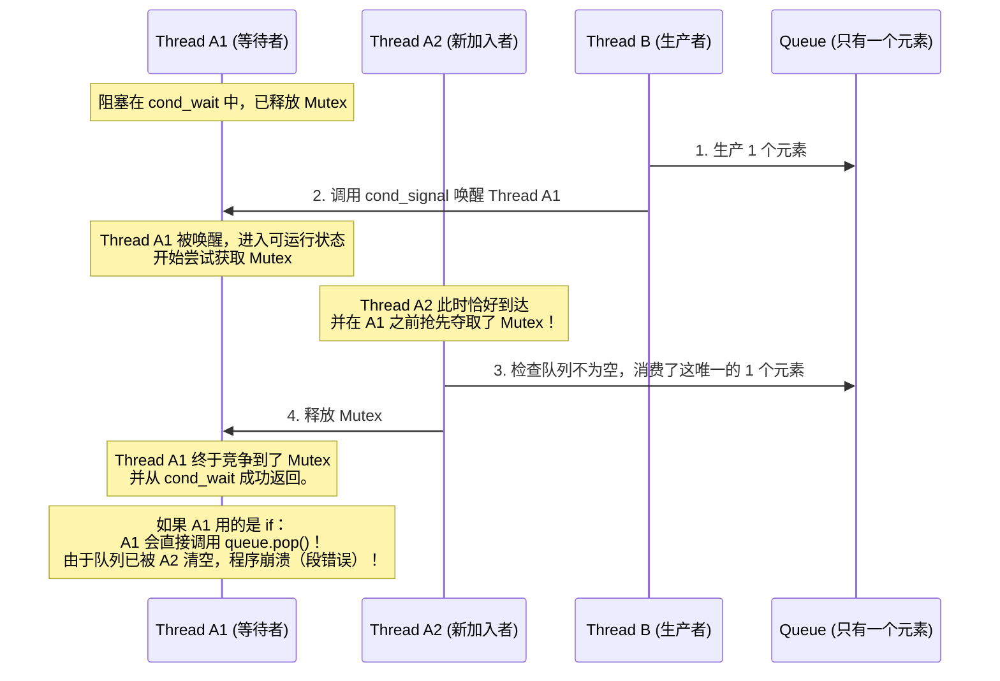
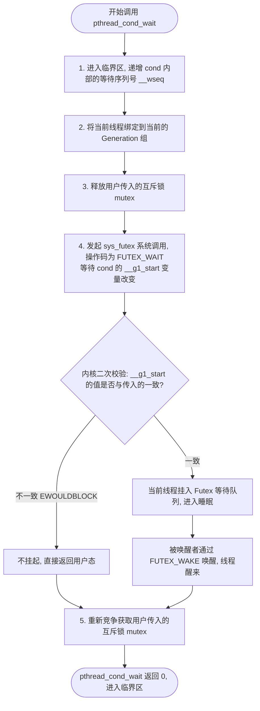
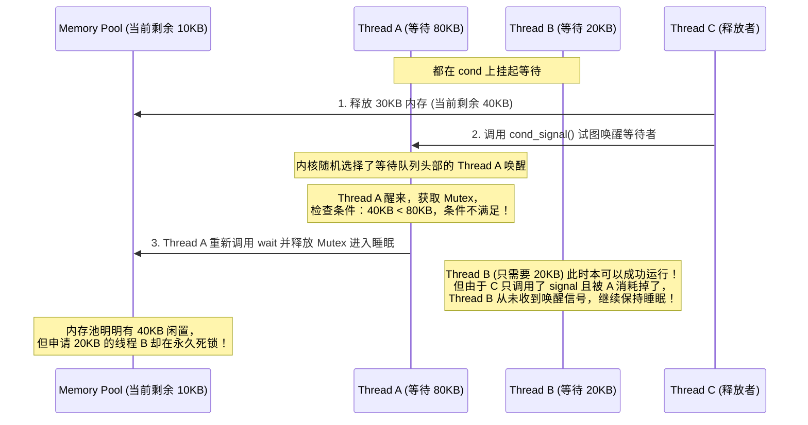

# 1.1.3.4 条件变量 (Condition Variable)

在现代并发计算与多核操作系统内核设计中，如何协调多个执行流对共享状态的安全访问及深度协作，是系统编程的核心课题。**条件变量（Condition Variable）** 作为一种经典的同步原语，提供了线程之间“等待-通知”的通信机制。与偏重于“排他性资源占用”的互斥锁（Mutex）不同，条件变量专注于“线程间的状态协同”。

本文将从操作系统物理底层、多核处理器微架构、内核页表与调度器交互、Linux 内核 Futex 机制、NPTL（Native POSIX Thread Library）源码级实现等维度，深度剖析条件变量的核心设计初衷、底层交互细节、虚假唤醒的物理本质、唤醒策略的性能权衡以及经典的工业级设计模式，帮助读者建立对条件变量底层运行机制的深刻认知。

---

## 一、 多线程同步机制的演进与设计初衷

在探讨条件变量之前，我们首先需要理解在多线程并发协作中，为什么要引入这一同步机制，以及它是如何解决传统同步方案的物理局限性的。

### 1. 并发协作的本质：状态协调

多线程程序不仅仅是多个相互独立的执行流在并行计算，它们往往需要围绕共享数据进行协同工作。最典型的场景是“生产者-消费者”模型：消费者线程需要等待队列中出现新的数据才能进行处理。

在这一场景下，核心问题是：**当一个线程所依赖的某种“状态条件”不满足时，该线程应当如何妥善地等待，直到该状态条件被其他线程改变？**

### 2. 传统方案的局限与物理瓶颈

在早期多线程编程中，解决此类状态协调问题主要有以下两种思路：

#### 方案一：忙等待（Busy Waiting）与自旋锁（Spinlock）

最朴素的想法是让消费者线程在一个循环中不断查询共享状态：

```c
// 消费者线程的忙等待示意
while (queue.empty()) {
    // 持续轮询，不释放 CPU
}
// 消费数据
auto item = queue.pop();
```

这种方案在物理层面面临着毁灭性的性能惩罚：
1. **CPU 资源的极度浪费**：等待线程在不满足条件时，依然占用 CPU 核心进行无意义的跳转指令计算，使得 CPU 占用率飙升至 100%。这不仅浪费了宝贵的算力，还导致系统整体吞吐量下降。
2. **总线风暴（Bus Storm）**：在对称多处理（SMP）架构中，各个核心通过高速缓存一致性协议（如 MESI 协议）维护共享内存的视图。当一个核心在循环中不断读取共享变量 `queue.empty()`，而另一个核心试图写入该变量时，对应的缓存行（Cache Line）会在 `Invalid`（无效）、`Shared`（共享）和 `Modified`（修改）状态之间频繁切换。这会引发大量的总线事务（Bus Transactions），迅速耗尽 CPU 的 QPI/UPI 总线带宽，进而拖慢整个系统的所有内存访问速度。

#### 方案二：基于信号量（Semaphore）的硬同步

信号量（Semaphore）是由 Edsger Dijkstra 提出的有状态同步原语，它内部维护一个整型计数器。线程通过 $P$ 操作（Wait/Decrement）减少计数器，通过 $V$ 操作（Signal/Increment）增加计数器。

虽然信号量可以实现非忙等待的阻塞，但它在处理**复杂的、非计数型的复合逻辑条件**时显得力不从心。例如，如果线程需要等待的条件是：`(queue.size() > 10 && queue.is_writable()) || system_shutdown == true`。

信号量无法直接表达这种逻辑“与/或”的复合条件。如果尝试用多个信号量去拼凑这种复杂条件，极易引发锁顺序错乱，导致死锁。此外，信号量是“有状态的”（Stateful），即即便先执行 $V$ 操作，后执行 $P$ 操作，线程也不会阻塞。但在很多同步场景中，我们需要的是“无状态的事件通知”，即只通知当前正在等待的线程，若当前没有等待者，通知直接失效。

### 3. 条件变量的诞生

为了彻底解耦“状态的互斥访问”与“状态改变的事件通知”，计算机科学家引入了**条件变量（Condition Variable）**。

条件变量本身是**无状态的（Stateless）**。它不保存任何关于业务条件的布尔值，也不保存历史通知的计数。它仅仅充当一个“线程挂起队列”与“事件通知通道”的物理中介。

因为条件变量本身没有状态，所以它必须依赖外部的共享变量来表示业务状态（如队列是否为空）。而为了安全地读写这些共享变量，就必须引入互斥锁（Mutex）。因此，**条件变量在设计上天生就必须与互斥锁绑定使用**。这种设计精美地实现了职责分离：
* **互斥锁（Mutex）**：用于保护共享状态的数据完整性（提供排他性访问）。
* **条件变量（Condition Variable）**：用于协调线程对状态改变的响应（提供阻塞与唤醒通道）。

---

## 二、 为什么条件变量必须与互斥锁（Mutex）成对绑定？

在所有符合 POSIX 规范的线程库中，调用条件变量的等待方法（如 `pthread_cond_wait`）都必须传入一个互斥锁。许多初学者常有疑问：既然条件变量是用来等待的，为什么不直接调用 `wait(cond)`，而必须调用 `wait(cond, mutex)`？

这背后的深层物理原因是为了**避免 Lost Wakeup（信号丢失）竞态条件**。

### 1. 什么是 Lost Wakeup（信号丢失）？

假设我们设计了一个“不加锁”或“不绑定互斥锁”的条件变量等待机制。我们用以下伪代码展示消费者线程（Thread A）与生产者线程（Thread B）的交互：

```c
// 极其危险的假设：条件变量不与 Mutex 绑定

// Thread A - 消费者
void consume() {
    if (queue.empty()) {            // (步骤 1) 检查条件
        // ---> 此时发生线程切换，Thread B 抢占 CPU
        cond_wait(&cond);           // (步骤 2) 挂起等待
    }
    auto item = queue.pop();
}

// Thread B - 生产者
void produce() {
    queue.push(item);               // (步骤 3) 生产数据
    cond_signal(&cond);             // (步骤 4) 发送通知
}
```

在多核 CPU 或单核抢占式调度下，上述代码会引发以下致命的时序交错：



在这个时序中，**消费者线程 A 的“检查条件”与“进入睡眠”这两个操作不是原子的**。在这两个步骤之间存在一个时间空隙（Gap）。生产者线程 B 恰好在这个空隙中修改了条件并发送了通知。由于条件变量本身是无状态的，它不会记住这个刚刚发生的通知。当线程 A 随后调用 `cond_wait` 时，它会永远等待一个已经发生过的通知，这便是典型的 **Lost Wakeup（信号丢失）**。

### 2. 互斥锁如何解决 Lost Wakeup？

为了消除上述时间空隙，我们必须保证：**“检查条件”与“将线程置入睡眠队列”这两个步骤，相对于生产者的“修改条件”和“发送通知”操作，必须是互斥的。**

这就是互斥锁介入的物理原因。正确的条件变量使用方式如下：

```c
// 正确的使用方式
pthread_mutex_t mutex = PTHREAD_MUTEX_INITIALIZER;
pthread_cond_t cond = PTHREAD_COND_INITIALIZER;

// Thread A - 消费者
pthread_mutex_lock(&mutex);
while (queue.empty()) {
    // pthread_cond_wait 内部会：
    // 1. 释放 &mutex
    // 2. 将当前线程放入 cond 的等待队列中并挂起
    // 这两个步骤必须是原子的！
    pthread_cond_wait(&cond, &mutex);
}
auto item = queue.pop();
pthread_mutex_unlock(&mutex);

// Thread B - 生产者
pthread_mutex_lock(&mutex);
queue.push(item);
pthread_cond_signal(&cond); // 可以在锁内，也可以在锁外，后续会深入讨论
pthread_mutex_unlock(&mutex);
```

在这个正确的逻辑中，互斥锁 `mutex` 充当了“条件检查”与“状态改变”之间的屏障：
1. 线程 A 在检查 `queue.empty()` 之前，必须先获取 `mutex`。
2. 线程 B 在修改 `queue.push()` 之前，也必须先获取 `mutex`。因此，只要线程 A 持有 `mutex`，线程 B 就绝对不可能修改队列状态，更不可能发送通知。
3. 当线程 A 决定调用 `pthread_cond_wait` 时，它必须通过系统调用释放 `mutex`，以便让线程 B 能够获取锁并修改状态。
4. **最关键的底层细节**：`pthread_cond_wait` 必须在内部实现“**将自己挂入条件变量的等待队列**”与“**释放互斥锁**”的原子性。如果这两个步骤不原子，例如先释放锁，再挂入等待队列，依然会在释放锁后、挂起前的空隙中发生 Lost Wakeup。

内核是如何确保这个“释放锁 + 投入睡眠”的原子性的？我们将在第四部分中结合 Linux Futex 机制进行微观剖析。

---

## 三、 虚假唤醒（Spurious Wakeup）深度解析

在多线程编程中，有一条被奉为铁律的代码规范：**在等待条件变量时，必须使用 `while` 循环而非 `if` 来判断等待条件。**

```c
// 绝对正确的写法
while (!condition) {
    pthread_cond_wait(&cond, &mutex);
}

// 极其危险的写法
if (!condition) {
    pthread_cond_wait(&cond, &mutex);
}
```

为什么要如此谨慎地防御？因为在多线程环境下，存在一种被称为**虚假唤醒（Spurious Wakeup）**的物理现象。

### 1. 什么是虚假唤醒？

虚假唤醒是指：**处于等待状态的线程，在没有任何其他线程调用 `signal` 或 `broadcast` 的情况下，或者虽然被唤醒了，但醒来后发现依赖的条件依然不满足。**

这并非程序逻辑上的 Bug，而是由操作系统底层的多核调度机制、信号处理机制以及底层同步原语的实现局限性共同决定的物理现象。

### 2. 虚假唤醒的物理与底层成因

我们可以将虚假唤醒的成因归纳为以下三类底层原因：

#### 成因一：多核 CPU 并发抢占（Race to the Mutex）

这是最常见、在逻辑上也最容易理解的“虚假唤醒”。

假设我们有一个生产者线程 B，以及两个消费者线程 A1 和 A2。它们都在等待同一个条件变量（例如，队列中有数据）。



在这个场景中：
1. 线程 A1 确实是因为生产者 B 的 `signal` 信号而被合法地唤醒的。
2. 但是，从“被唤醒”到“重新竞争到 Mutex 并实际执行”这段时间内，存在一个物理时间差。
3. 线程 A2 在这个时间差内，利用多核并行的优势抢先夺走了 Mutex，并消费了队列中的数据。
4. 当 A1 终于拿到锁并从 `wait` 返回时，它所期待的条件（队列不为空）已经再次失效了。对于 A1 而言，这次醒来就是一次“虚假唤醒”。

#### 成因二：Unix 信号处理与中断机制（Interrupted System Calls）

在 Linux 等类 Unix 操作系统中，线程挂起是通过系统调用（如 `sys_futex`）陷入内核实现的。当线程阻塞在内核态时，如果该进程接收到了一个外部信号（如 `SIGINT`、`SIGALRM`、`SIGUSR1`），内核会强行中断当前的系统调用，以优先执行用户注册的信号处理函数（Signal Handler）。

当信号处理函数执行完毕返回时，被中断的系统调用可能会返回一个特定的错误码 `EINTR`。

对于 `pthread_cond_wait` 这一类阻塞函数，底层的系统调用在遇到 `EINTR` 时，如果选择自动重启，可能会增加实现逻辑的复杂度，甚至引入死锁的风险。为了保证系统的健壮性和实时响应能力，POSIX 标准允许 `pthread_cond_wait` 直接返回 0 并成功苏醒，将条件的验证工作交回给用户态。

此时，线程醒来并不是因为有数据被生产，而是因为被外部信号中断了内核阻塞。

#### 成因三：Linux 内核 Futex 哈希槽的模糊唤醒（Fuzzy Wakeup）

这涉及到 Linux 内核管理同步等待队列的具体实现。

Linux 内核中的 `Futex` 机制（Fast Userspace Mutex）并不为每一个用户态的条件变量或互斥锁单独维护一个内核等待队列。相反，为了节省内存并提高响应效率，内核维护了一个全局的哈希表 `futex_queues`，它包含固定数量的哈希桶（Hash Buckets）。

```
用户态 CondVar 地址 ──> Hash 函数 ──> Hash Bucket (哈希桶)
                                           │
                                           ├─ 线程 A 的等待节点 (Key = CondVar 地址)
                                           ├─ 线程 X 的等待节点 (Key = 另一个无关变量地址)
                                           └─ 线程 Y 的等待节点 (Key = 又一个无关变量地址)
```

当多个线程在不同的条件变量或互斥锁上等待时，它们的物理内存虚拟地址在通过哈希函数计算后，极有可能会落入同一个哈希桶中，形成哈希冲突。

当内核执行 `FUTEX_WAKE` 尝试唤醒某一个特定的条件变量时，它必须遍历对应的哈希桶链表。在某些高并发的内核演进版本中，出于对锁竞争优化或复杂清理逻辑的考虑，内核在解除阻塞时可能会表现出一定的“模糊性”，从而顺带唤醒了同一个哈希桶中等待在其他地址上的线程。

为了保证多线程系统的绝对安全，操作系统的底线是：**宁可多唤醒（导致虚假唤醒，但可以通过用户态循环校验解决），也绝不能漏掉唤醒（这会导致线程永久死锁）**。

### 3. 双重检查锁定的设计美学

基于上述三种无法从操作系统层面完全消除的物理因果，用户态代码必须在逻辑上自我防御。这就是为什么要使用 `while` 循环：

* **防御虚假唤醒**：不管线程是因为竞争锁失败被抢占、因为收到 UNIX 信号、还是因为内核哈希冲突而提前醒来，`while` 循环都会在线程重新拿到 Mutex 之后，**第一时间重新检查业务条件**。如果条件依然不满足，线程会毫无悬念地再次调用 `wait` 陷入睡眠。
* **不变式（Invariant）的守护**：在进入临界区执行实质性业务逻辑（如 `queue.pop()`）之前，必须确保业务不变式（如 `!queue.empty()`）绝对成立。`while` 循环是多线程并发环境中维持该不变式的唯一铁闸。

---

## 四、 挂起与唤醒的原子性底层细节：NPTL 与 Linux Futex 深度分析

为了真正理解条件变量是如何在底层运转的，我们必须穿透用户态的包装（`pthread` 库），深入到 Linux 内核态，探寻 **NPTL** 与 **Futex** 的交互机制。

### 1. 核心难题：如何原子化地“释放锁 + 睡眠”？

在前面的分析中，我们得知 `pthread_cond_wait` 必须原子的执行“释放互斥锁”与“将线程挂入条件变量等待队列”这两个动作。

在传统的两阶段设计中：
1. 步骤一：用户态释放 Mutex（如通过修改一个内存标志位）。
2. 步骤二：用户态调用系统调用，请求内核将自己挂起。

然而，在步骤一与步骤二之间，CPU 的流水线可能会被无情地打断。如果另一个 CPU 核心上的线程在这两个步骤的间隙中修改了状态并发送了唤醒信号，这个信号对于即将挂起的线程而言就是不可见的，从而发生 Lost Wakeup。

为了解决这一矛盾，Linux 在 2.6 内核中引入了 **Futex（Fast Userspace Mutex，快速用户态互斥锁）** 机制。

### 2. Linux Futex 机制原理

Futex 的核心思想是：**在没有锁竞争的情况下，所有的同步操作都在用户态快速完成（利用原子 CPU 指令如 CAS）；只有在存在锁竞争、需要将线程挂起或唤醒时，才通过系统调用陷入内核。**

Futex 对应的系统调用为 `sys_futex`，其原型如下：

```c
long sys_futex(void *uaddr, int op, int val, const struct timespec *timeout, void *uaddr2, int val3);
```

* `uaddr`：指向一个用户态的 32 位整型变量，用于表示同步状态。
* `op`：操作类型。最常用的两个操作是：
  * `FUTEX_WAIT`：如果 `*uaddr == val`，则将当前线程挂起，直到被 `FUTEX_WAKE` 唤醒或超时。
  * `FUTEX_WAKE`：唤醒最多 `val` 个等待在 `uaddr` 上的线程。

#### `FUTEX_WAIT` 的内核防竞态设计

当线程调用 `FUTEX_WAIT` 陷入内核后，内核会执行以下关键步骤来保证“检查与挂起”的原子性：

1. **计算 Key 并锁定哈希桶**：内核根据用户态传入的虚拟地址 `uaddr`，结合该进程的内存描述符（`mm_struct`），计算出一个全局唯一的 `futex_key`。然后，利用该 Key 找到对应的 `futex_hash_bucket`，并对该桶加自旋锁（Spinlock）。
2. **二次校验（Value Comparison）**：在持有哈希桶自旋锁的情况下，内核会安全地读取用户态地址 `uaddr` 处的值。
   * 如果 `*uaddr != val`，说明在当前线程尝试挂起的这段极短时间内，用户态的值已经被其他线程改变了（表明有事件发生）。此时，内核会**立即释放桶锁，并返回 `EWOULDBLOCK` 错误**，拒绝让当前线程挂起。
   * 如果 `*uaddr == val`，说明值未发生改变，当前线程被安全地挂入该桶的等待队列中（即分配并初始化一个 `struct futex_q` 节点，并插入链表）。
3. **设置状态与调度**：将当前线程的 `task_struct` 状态设置为 `TASK_INTERRUPTIBLE` 或 `TASK_UNINTERRUPTIBLE`。然后释放桶锁，调用内核调度器 `schedule()` 让出 CPU。线程正式进入休眠。

通过在内核中持有“哈希桶自旋锁”来执行“读取并校验用户态值”与“挂入队列”这两步，内核完美地消除了用户态释放锁到内核态挂起之间的竞态条件。

### 3. NPTL 中 `pthread_cond_wait` 的内部精细步骤

在 Linux 系统中，NPTL 是 POSIX 线程库的官方实现。我们以 NPTL 源码逻辑为参考，拆解 `pthread_cond_wait` 的内部执行流程。

在 NPTL 的较新版本中，条件变量内部维护了两个关键的 64 位计数器：
* `__wseq`（Wait Sequence）：等待序列号。每当有新线程进入 `wait` 时，该值会递增。
* `__g1_start`（Generation 1 Start）：当前正在被唤醒的组（Generation）的 Futex 变量地址。

当一个线程调用 `pthread_cond_wait(cond, mutex)` 时，执行流程如下：



1. **注册等待信息**：在持有条件变量内部自旋锁的前提下，递增 `__wseq`。这相当于在条件变量内部登记了“这里有一个新的等待者”。
2. **释放外部 Mutex**：调用 `pthread_mutex_unlock(mutex)`。
3. **陷入内核等待**：调用 `sys_futex(&cond->data.__g1_start, FUTEX_WAIT_PRIVATE, g1_val, ...)`。这里的 `g1_val` 是进入等待前读取的组序列号。
4. **内核原子校验**：内核执行前述的 `FUTEX_WAIT` 流程。如果在此期间生产者改变了 `__g1_start` 试图唤醒它，`FUTEX_WAIT` 会因为值校验失败直接返回，从而避免了 Lost Wakeup。
5. **苏醒与重夺 Mutex**：当线程被 `signal` 唤醒或虚假唤醒从内核返回用户态后，它必须首先调用 `pthread_mutex_lock(mutex)` 重新夺回外部锁。只有在夺回锁之后，`pthread_cond_wait` 才能真正返回。

### 4. 唤醒机制的极致优化：Requeue（重新排队）技术

在条件变量唤醒所有线程（即调用 `pthread_cond_broadcast`）的场景下，传统的设计会导致灾难性的“惊群”和严重的性能损耗。

#### 传统的广播唤醒灾难

假设有 100 个线程正阻塞在同一个条件变量 `cond` 上，它们在内核中都挂载在 `cond` 的 Futex 等待队列中。
1. 生产者线程调用 `pthread_cond_broadcast`。
2. 传统的内核逻辑会直接唤醒这 100 个线程，将它们全部移入操作系统的可运行队列（Runnable Queue）。
3. 这 100 个线程在不同的 CPU 核心上被调度运行。由于 `pthread_cond_wait` 要求醒来前必须先获取外部的 `mutex`，这 100 个线程会瞬间发起对 `mutex` 的竞争。
4. **残酷的现实**：只有一个线程能幸运地夺得 `mutex`，另外 99 个线程全部抢占失败。
5. 这 99 个抢占失败的线程别无选择，只能再次发起系统调用陷入内核，挂载到 `mutex` 的 Futex 等待队列中重新睡去。

在这个过程中，系统发生了 **100 次线程苏醒 -> 99 次锁竞争冲突 -> 99 次重新挂起**，这带来了极度昂贵的上下文切换（Context Switch）开销，以及剧烈的 CPU 缓存失效与内存总线冲突。

#### 内核的救星：`FUTEX_CMP_REQUEUE`

为了彻底解决这一痛点，Linux 内核引入了 `FUTEX_CMP_REQUEUE`（比较并重新排队）系统调用。

```c
sys_futex(uaddr1, FUTEX_CMP_REQUEUE, val, val2, uaddr2, val3);
```

* `uaddr1`：条件变量的 Futex 地址。
* `uaddr2`：外部互斥锁的 Futex 地址。
* `val`：直接唤醒的线程最大数量（通常设为 1）。
* `val2`：需要重新排队的线程最大数量（通常设为极其巨大值，如 `INT_MAX`）。

当调用 `pthread_cond_broadcast` 时，NPTL 不再单纯发起 `FUTEX_WAKE`，而是调用 `FUTEX_CMP_REQUEUE`。内核在接收到该调用后，会执行以下优化操作：

```
                    ┌─────── FUTEX_CMP_REQUEUE ───────┐
                    │                                 │
     CondVar 等待队列 [uaddr1]                  Mutex 等待队列 [uaddr2]
  ┌───────────────────────────┐             ┌───────────────────────────┐
  │ 线程 1  (直接被唤醒)       │             │                           │
  │                           │             │                           │
  │ 线程 2 ───────────────────┼────────────>│ 线程 2  (直接在内核态转移)  │
  │ 线程 3 ───────────────────┼────────────>│ 线程 3  (直接在内核态转移)  │
  │ ...                       │             │ ...                       │
  └───────────────────────────┘             └───────────────────────────┘
```

1. **直接唤醒 1 个线程**：内核只唤醒等待在条件变量 `uaddr1` 队列头部的 **1 个** 线程（让它去争抢锁并准备执行）。
2. **内核态重新排队**：对于队列中剩下的 99 个线程，内核**绝对不唤醒它们**。内核直接在内部将它们的等待节点（`struct futex_q`）从 `uaddr1`（条件变量）的等待队列中剥离，转移并挂载到 `uaddr2`（Mutex）的内核等待队列中。
3. **优雅的依次递补**：由于这 99 个线程从未被唤醒，因此不产生任何用户态上下文切换。当那 1 个被唤醒的线程执行完毕并释放 Mutex 时，内核会顺理成章地唤醒 Mutex 队列头部的下一个线程。

通过 `Requeue` 技术，100 次广播唤醒的开销被近乎完美地压缩为：**1 次真正的线程唤醒 + 内核态极其轻量的指针移动操作**，彻底消除了惊群效应对 CPU 性能的毁灭性打击。

---

## 五、 惊群效应（Thundering Herd）与唤醒策略选择

在实际开发中，我们有两个唤醒 API 可供选择：
* `pthread_cond_signal`：唤醒至少一个等待线程。
* `pthread_cond_broadcast`：唤醒所有等待线程。

我们应该在什么时候使用 `signal`？又在什么时候**必须**使用 `broadcast`？这背后涉及对“惊群效应”与“唤醒覆盖”的深度权衡。

### 1. 惊群效应的性能隐患

尽管有内核的 `Requeue` 优化，`broadcast` 依然存在不可忽视的性能开销：
* **调度开销**：将大量线程在内核中进行队列转移，需要长时间持有哈希桶的自旋锁，这在高并发下会造成其他线程的 Futex 调用延迟。
* **锁总线风暴**：一旦拿到 Mutex 的线程很快执行完毕并释锁，紧接着的线程会依次醒来。如果临界区非常短，这会导致短时间内产生大量的上下文切换和锁总线冲突。

因此，追求极致性能的并发程序，应当在满足条件的情况下，优先使用精确的 `pthread_cond_signal`。

### 2. 什么时候可以安全地使用 `pthread_cond_signal`？

要安全地使用 `signal`，必须**同时满足**以下两个极其苛刻的物理条件：

#### 条件一：均等性（Uniform Waiters）
所有等待在同一个条件变量上的线程，它们所期待的业务条件（Invariant）必须是**完全相同且单一**的。也就是说，任何一个等待线程被唤醒后，都能正确地消费这个状态改变。

#### 条件二：单一消费性（One-to-One Mapping）
一次状态改变（例如，生产者放入了 1 个元素）只需要、且只能被 1 个等待线程处理。多余的唤醒是没有意义的。

典型的例子就是：一个均等线程池中的任务队列。所有的工作线程都执行完全相同的 `work_loop`，且每个任务只需分配给一个线程执行。此时，使用 `pthread_cond_signal` 唤醒一个线程处理任务是最高效的选择。

### 3. 什么时候必须使用 `pthread_cond_broadcast`？

如果上述两个条件有任何一个不满足，使用 `signal` 极易引发**信号覆盖错误与线程永久挂起（死锁）**。

#### 案例剖析：多条件等待下的唤醒覆盖问题

假设我们实现了一个自定义的内存分配器，所有线程共享一个总大小为 100KB 的内存缓冲池。
* 线程 A 正在等待申请 **80KB** 的连续内存。
* 线程 B 正在等待申请 **20KB** 的连续内存。
* 由于此时内存不足，线程 A 和线程 B 都调用了 `wait`，挂在同一个条件变量 `cond` 上。



在这个案例中：
1. 线程 A 和 B 等待的条件不均等（一个需要 80KB，一个需要 20KB）。
2. 当释放 30KB 内存时，释放者调用了 `cond_signal`。
3. 操作系统可能随机唤醒了线程 A（需要 80KB）。
4. 线程 A 醒来，获取锁，发现 40KB 不够自己用，于是重新调用 `wait` 睡下。
5. 悲剧发生：线程 B（只需要 20KB，本可以完美运行）因为没有收到任何信号，继续在内核中沉睡。
6. 这就是 **唤醒覆盖（Wakeup Obscuring）**。

#### 如何修复？
在这种“等待者条件不均等”的场景下，我们必须使用 `pthread_cond_broadcast`。
* 广播唤醒后，线程 A 和 B 都会被移入 Mutex 队列。
* 线程 A 拿到锁，检查发现不够，继续睡。
* 随后线程 B 拿到锁，检查发现 40KB 足够自己申请 20KB，成功消费并退出，系统正常运转。

---

## 六、 典型设计模式与性能优化思考

在工业界，条件变量最经典的应用是构建**线程安全阻塞队列（Blocking Queue）**。同时，围绕“在哪里发送信号”这一话题，存在长期的性能争论。

### 1. 工业级阻塞队列（C++11 风格）实现

下面是一个高健壮性、防死锁、支持优雅退出的多消费者多生产者阻塞队列通用实现：

```cpp
#include <mutex>
#include <condition_variable>
#include <queue>
#include <optional>

template <typename T>
class BlockQueue {
public:
    explicit BlockQueue(size_t max_capacity) 
        : max_capacity_(max_capacity), is_shutdown_(false) {}

    // 生产者放入元素
    bool Push(const T& item) {
        std::unique_lock<std::mutex> lock(mutex_);
        
        // 用 while 循环防御虚假唤醒
        while (queue_.size() >= max_capacity_ && !is_shutdown_) {
            not_full_cv_.wait(lock);
        }

        if (is_shutdown_) {
            return false;
        }

        queue_.push(item);
        
        // 唤醒可能正在等待的消费者线程 (用 notify_one 避免惊群)
        not_empty_cv_.notify_one();
        return true;
    }

    // 消费者取出元素
    std::optional<T> Pop() {
        std::unique_lock<std::mutex> lock(mutex_);

        while (queue_.empty() && !is_shutdown_) {
            not_empty_cv_.wait(lock);
        }

        if (is_shutdown_ && queue_.empty()) {
            return std::nullopt; // 返回空表示队列已关闭且数据消费完毕
        }

        T item = std::move(queue_.front());
        queue_.pop();

        // 唤醒可能正在等待的生产者线程
        not_full_cv_.notify_one();
        return item;
    }

    // 关闭队列，释放所有等待线程
    void Shutdown() {
        std::unique_lock<std::mutex> lock(mutex_);
        is_shutdown_ = true;
        
        // 必须用 notify_all (broadcast) 唤醒所有阻塞在 push/pop 的线程让他们退出
        not_empty_cv_.notify_all();
        not_full_cv_.notify_all();
    }

private:
    std::mutex mutex_;
    std::condition_variable not_empty_cv_;
    std::condition_variable not_full_cv_;
    std::queue<T> queue_;
    size_t max_capacity_;
    bool is_shutdown_;
};
```

### 2. 信号通知的性能权衡：锁内通知 vs 锁外通知

在前面的代码中，我们把唤醒操作（`cv.notify_one()`）放在了临界区之内（即释放锁之前）。这引发了一个经典的架构设计争论：**到底是应该在锁内通知，还是在锁外通知？**

#### 抉择一：Signal-Inside-Lock（锁内通知）

```cpp
{
    std::lock_guard<std::mutex> lock(mtx);
    queue.push(item);
    cv.notify_one(); // 锁内通知
} // 锁在此处释放
```

* **执行流分析**：
  1. 当前线程持有 `mtx`，向队列添加数据。
  2. 调用 `notify_one`，操作系统唤醒等待线程。
  3. **尴尬的物理碰撞**：被唤醒的线程醒来后，第一件事是尝试获取 `mtx`。然而，当前线程此时**尚未退出临界区，依然占有着 `mtx`**。
  4. 被唤醒的线程获取锁失败，被迫再次在用户态自旋或在内核中短暂挂起，等待当前线程退出花括号释放锁。
* **现代优化**：在现代 Linux NPTL 实现中，内核的 `Requeue` 优化会自动检测到这种冲突。如果检测到锁内通知，内核会倾向于延迟唤醒操作，或者直接将线程重排队到 Mutex 队列，使得性能退化并不明显。

#### 抉择二：Signal-Outside-Lock（锁外通知）

```cpp
{
    std::lock_guard<std::mutex> lock(mtx);
    queue.push(item);
} // 锁在此处释放
cv.notify_one(); // 锁外通知
```

* **执行流分析**：
  1. 当前线程持有 `mtx`，添加数据。
  2. 退出花括号，`mtx` 被安全释放。
  3. 调用 `notify_one`。
  4. 被唤醒的线程醒来后尝试获取 `mtx`，此时 `mtx` 已经处于空闲状态，被唤醒线程可以一气呵成地拿到锁并执行，避免了锁竞争导致的额外上下文切换。
* **致命隐患**：锁外通知并非百利而无一害。在特定的实时操作系统中，或者在复杂的动态内存管理中，可能会引发**悬空指针与生命周期崩溃**：

```cpp
// 致命崩溃案例（锁外通知的风险）
void thread_worker() {
    auto* cv = new std::condition_variable();
    auto* mtx = new std::mutex();
    bool ready = false;

    // 线程 A
    std::thread t1([&]() {
        std::unique_lock<std::mutex> lock(*mtx);
        ready = true;
        lock.unlock(); // 提前释锁
        // ---> 此时发生线程切换，线程 B 抢占 CPU
        cv->notify_one(); // 锁外通知，引发崩溃！
    });

    // 线程 B
    std::thread t2([&]() {
        std::unique_lock<std::mutex> lock(*mtx);
        while (!ready) {
            cv->wait(lock);
        }
        // 执行完毕后，销毁所有资源
        delete cv;
        delete mtx;
    });
}
```

在上述逻辑中：
1. 线程 A 在锁外调用 `cv->notify_one()`。
2. 如果线程 B 在线程 A 执行 `notify_one` 之前就已经被调度，检查到 `ready == true`，直接往下执行并销毁了 `cv` 对象。
3. 当线程 A 重新获取 CPU 执行 `cv->notify_one()` 时，它访问的是一个已被销毁的悬空指针，直接导致程序发生段错误（Segmentation Fault）崩溃。

#### 工业实践抉择建议

1. **安全性第一**：如果条件变量或互斥锁的生命周期存在被动态销毁的可能，**必须使用锁内通知**。
2. **性能与上下文切换敏感**：在生命周期绝对安全的全局组件（如静态线程池）中，为了在不支持 `Requeue` 的旧系统上获得极限性能，可以考虑使用**锁外通知**。
3. **现代系统**：在当今主流的 Linux 系统（搭载 NPTL）中，由于内核对 `FUTEX_CMP_REQUEUE` 的高度优化，锁内与锁外的性能差异已经极其微弱。**出于防御性编程的稳妥考虑，默认推荐使用“锁内通知”**。

---

## 七、 常见误区与总结

### 1. 常见同步原语对比表

为了直观地展示条件变量在多线程同步版图中的位置，我们将它与互斥锁、自旋锁以及信号量进行对比：

| 同步原语 | 物理机制 | 状态特征 | CPU 消耗方式 | 最佳应用场景 |
| :--- | :--- | :--- | :--- | :--- |
| **自旋锁 (Spinlock)** | 多核 CPU 自旋轮询 (CAS) | 有状态 (锁标志) | 100% 忙等待，消耗 CPU | 临界区极短、等待时间极低的多核同步 |
| **互斥锁 (Mutex)** | 无法获取时通过 Futex 挂起 | 有状态 (独占标志) | 非忙等待，线程休眠 | 保护临界区数据，防止并发冲突 |
| **信号量 (Semaphore)** | 计数器自减与线程挂起 | 有状态 (计数器) | 非忙等待，线程休眠 | 计数型资源分配，或简单的事件通知 |
| **条件变量 (CondVar)** | Futex 挂起与定向/广播唤醒 | **无状态** (纯通道) | 非忙等待，线程休眠 | **复杂的线程状态协同与复杂条件等待** |

### 2. 条件变量核心研发防错清单

在日常工程实践中，为了避免写出含有竞态条件的代码，建议时刻核对以下清单：

* [ ] **Mutex 保护**：是否为每个条件变量都绑定了一个唯一的互斥锁？
* [ ] **While 防御**：检查条件的语句是否使用了 `while` 循环？绝对不允许使用 `if`。
* [ ] **原子性等待**：在调用等待方法时，是否持有对应的 Mutex 锁？（以保证释放锁与挂起的原子性）。
* [ ] **唤醒策略选择**：仔细评估了唤醒场景。当且仅当等待者均等且单次消费时才使用 `signal`，其余情况一律使用 `broadcast`。
* [ ] **生命周期安全**：如果使用了锁外通知，是否确保了条件变量对象本身在通知完成前绝不会被销毁？

