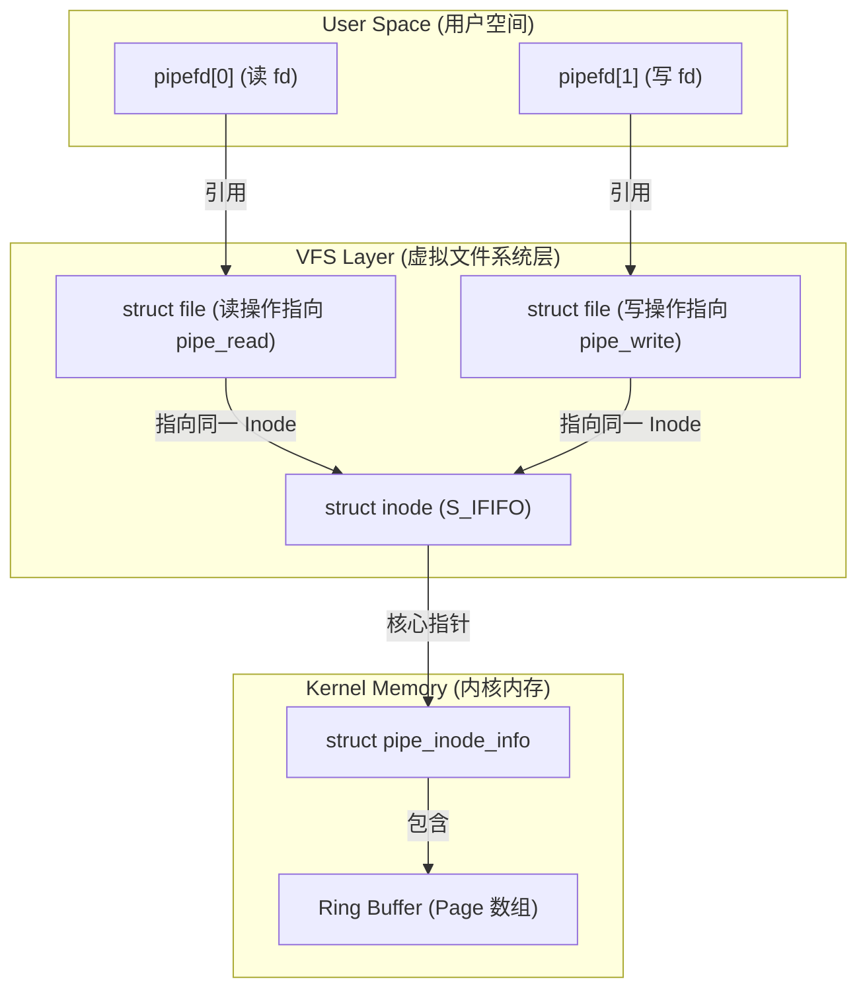
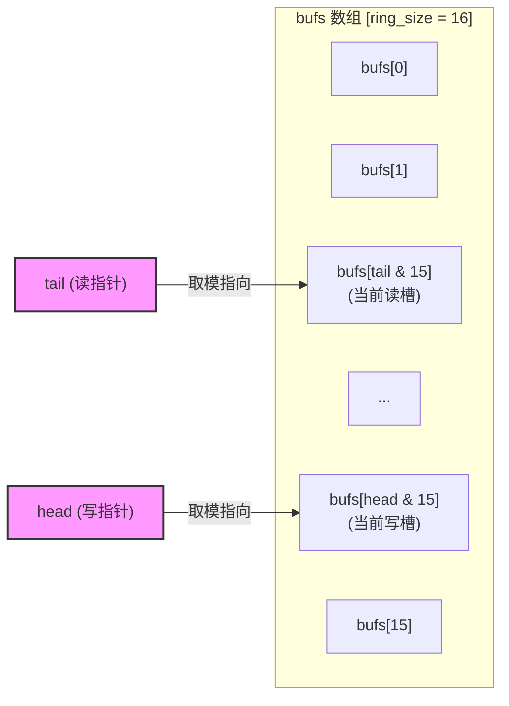
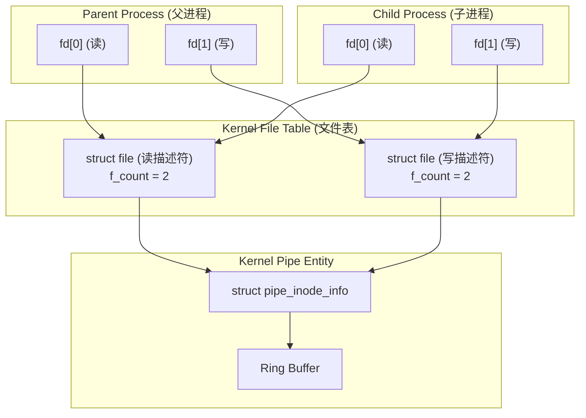
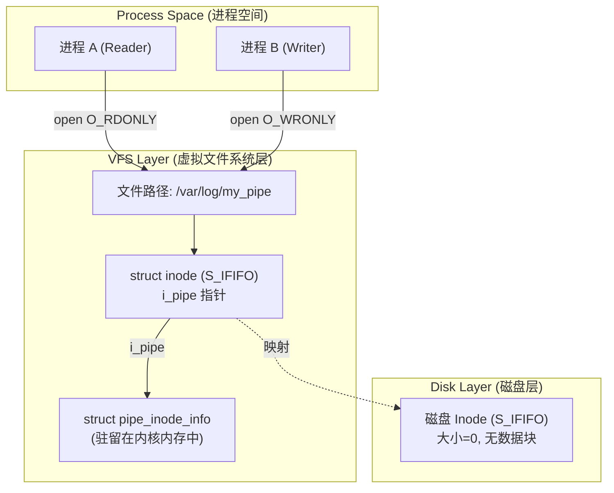
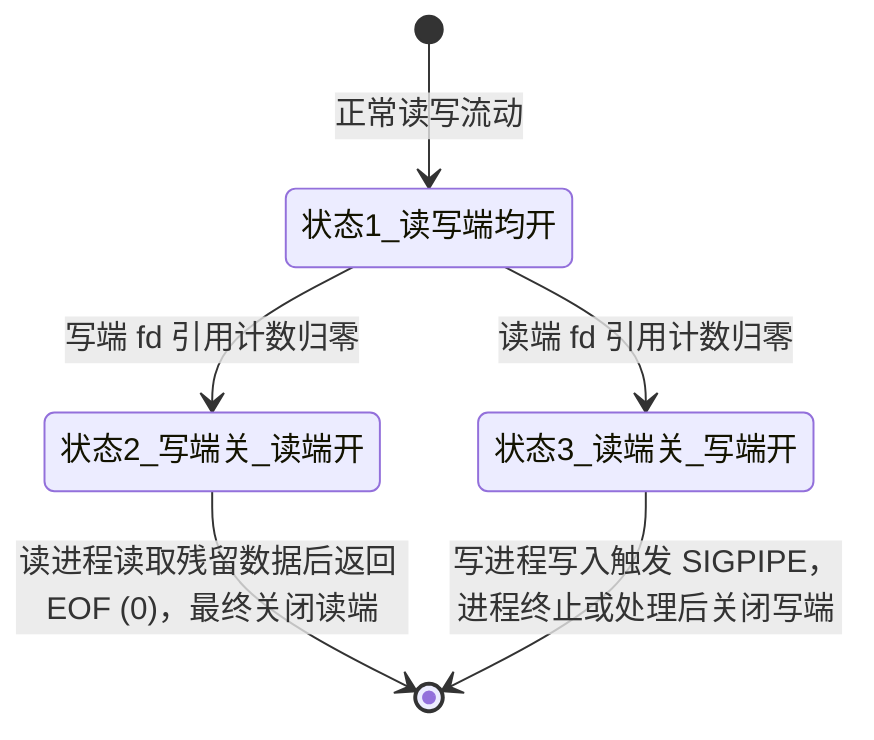
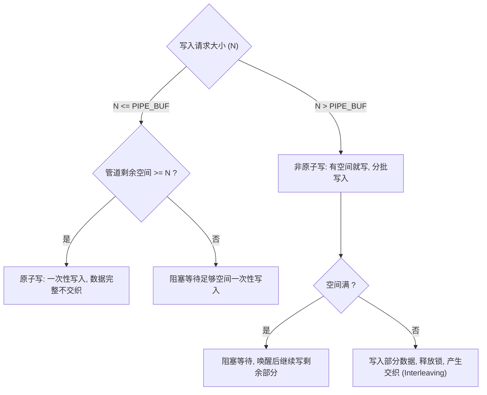

# 1.1.3.7 管道

## 引言

管道是类 Unix 操作系统中最古老、最经典的进程间通信（IPC，Inter-Process Communication）机制之一。由 Unix 先驱 Ken Thompson 引入的管道机制，完美契合了“万物皆文件”以及“通过管道将单一职责的小工具组合起来解决复杂问题”的 Unix 哲学模式。

然而，在应用层简单的 `|` 符号或 `pipe()` 系统调用的背后，隐藏着操作系统底座的一系列复杂而精致的控制逻辑。管道在底层究竟是如何被操作系统内核调度和控制的？为什么它能保证字节流的顺序性？为什么匿名管道不能在无亲缘关系的进程间共享，而命名管道可以？当管道读写遇到边界时，内核是如何通过信号、锁和等待队列进行精细调制的？本文将从操作系统内核与 VFS（虚拟文件系统）底座的源码级逻辑出发，为您深度剥离管道的物理图景与运行机制。

---

## 一、 管道的核心分类与物理概念

从系统架构与文件系统的视角来看，管道可以分为两类：**匿名管道（Anonymous Pipe）** 与 **命名管道（Named Pipe / FIFO）**。它们在内核中共享相同的环形缓冲区传输机制，但在生命周期、命名空间以及文件系统关联性上存在本质性的差异。

### 1.1 匿名管道（Anonymous Pipe）
匿名管道是一种只存在于内存中的、临时性的单向数据通道。
* **生命周期**：匿名管道的生命周期与持有其读写端文件描述符（File Descriptor）的进程生命周期紧密绑定。当所有引用该管道描述符的进程均关闭了对应的 fd，或者这些进程由于异常、正常原因退出时，内核会自动回收该管道的所有物理内存页面，并在 `pipefs` 伪文件系统中销毁对应的元数据。
* **文件系统关联**：匿名管道在磁盘上**没有任何实体文件**。它仅存在于内核所管理的内存中，其对应的 inode 是在 `pipefs`（Linux 内核中的一个内存伪文件系统）中动态分配的。这意味着，外部非亲缘进程无法通过任何文件系统路径来寻址并打开该管道。
* **通信方向**：单向（半双工）。如果需要双向通信，必须建立两个管道。

### 1.2 命名管道（Named Pipe / FIFO）
命名管道为了解决匿名管道无法在无亲缘关系的进程间通信的局限性而诞生，它引入了文件系统路径的概念。
* **生命周期**：命名管道在文件系统中有一个具名的入口（即路径，例如 `/tmp/my_fifo`）。它是由系统调用 `mkfifo()` 或 `mknod()` 显式创建的。只要没有被主动删除（例如通过 `unlink()` 系统调用或 `rm` 命令），它的元数据就会一直保留在文件系统中，即使系统重启，其目录项和 inode 也依然存在。因此，其生命周期是持久的。
* **文件系统关联**：命名管道在磁盘上**占有一个目录项（Dentry）和一个 inode**。但是，需要强调的是，命名管道在磁盘上**不占用任何数据块（Data Block）**。当你查看一个 FIFO 文件的大小时，它始终显示为 0 字节。它在磁盘上的 inode 仅仅是作为一个“门牌号”或“寻址媒介”，用来让不相关的进程通过 VFS（虚拟文件系统）的路径解析机制，寻址到同一个位于内核内存中的环形缓冲区（Ring Buffer）。
* **物理存储**：与匿名管道完全一致，命名管道在传输数据时，数据同样完全在内核内存的环形缓冲区中流动，绝不会被写入磁盘。

### 1.3 匿名管道与命名管道对比
为了更直观地理解二者的异同，以下是它们在操作系统底座维度的多维度对比：

| 对比维度 | 匿名管道 (Anonymous Pipe) | 命名管道 (FIFO) |
| :--- | :--- | :--- |
| **创建方式** | `pipe()` 或 `pipe2()` 系统调用 | `mkfifo()` 或 `mknod()` 系统调用 |
| **磁盘实体** | 无（仅在内存伪文件系统 `pipefs` 中） | 有（磁盘文件系统中有特殊的 inode 和 dentry） |
| **磁盘空间占用** | 0 字节 | 0 字节（仅占用 inode 元数据，不占数据块） |
| **生命周期** | 随进程的销毁而销毁（引用计数归零） | 持久（除非显式 `unlink` 或删除） |
| **寻址方式** | 无法通过路径打开，通过 `fork` 继承 fd 共享 | 通过文件系统路径（如 `/var/run/my.fifo`）打开 |
| **适用范围** | 仅限具有亲缘关系的进程（父子、兄弟进程） | 任意拥有该文件访问权限的进程 |
| **底层缓冲区** | 内核环形缓冲区（Ring Buffer） | 内核环形缓冲区（Ring Buffer） |

---

## 二、 匿名管道底层数据结构与 Fork 共享机制

要透彻理解匿名管道的工作机制，必须深入到虚拟文件系统（VFS）的底层数据结构中。

### 2.1 `pipe()` 系统调用的内核映射图景
当用户程序调用 `pipe(int pipefd[2])` 时，内核在底层经历了一系列复杂的文件对象分配与映射操作：
1. **伪文件系统挂载点分配**：内核会在 `pipefs`（这是一个不可见的、挂载在内核内部的内存伪文件系统）中创建一个新的 `inode`。这个 inode 标志着管道的物理本质，它的文件类型被标记为 `S_IFIFO`。
2. **内核结构初始化**：内核为这个 `inode` 分配并初始化一个特殊的结构体 `struct pipe_inode_info`。这是管理管道缓冲区的核心枢纽。
3. **分配文件对象（struct file）**：内核创建两个 `struct file` 实例，分别代表管道的读端（Read End）和写端（Write End）。
   - 读端文件对象的 `f_op`（文件操作表）被设置为只读操作集（通常包含 `pipe_read`）。
   - 写端文件对象的 `f_op` 被设置为只写操作集（通常包含 `pipe_write`）。
   - 这两个 `struct file` 对象的 `f_path.dentry` 和 `f_path.mnt` 均指向同一个位于 `pipefs` 中的 inode 节点。
4. **分配文件描述符（fd）**：内核在当前进程的打开文件描述符表（`fdtable`）中，检索两个数值最小的空闲 fd。将这两个 fd 分别关联到刚才创建的读端和写端 `struct file` 对象上。
5. **返回给用户空间**：将这两个 fd 写入用户传入的数组 `pipefd` 中（`pipefd[0]` 为读端，`pipefd[1]` 为写端）。



### 2.2 环形缓冲区（Ring Buffer / Pipe Buffer）的设计细节
管道中流动的字节数据，在内核中是通过一个精致的环形缓冲区（Ring Buffer）来管理的。在 Linux 内核中，这个环形缓冲区由 `struct pipe_inode_info` 和一组成员 `struct pipe_buffer` 共同实现。

我们来看一下 Linux 内核中这两个结构体的核心定义：

```c
struct pipe_buffer {
    struct page *page;           // 指向存储数据的物理页的指针
    unsigned int offset;         // 管道中数据在该页面的起始偏移量
    unsigned int len;            // 该页面中未读数据的有效长度
    const struct pipe_buf_operations *ops; // 页面释放、复制等操作的函数指针表
    unsigned int flags;          // 缓冲区标志位（如 PIPE_BUF_FLAG_CAN_MERGE）
    unsigned long private;       // 私有数据
};

struct pipe_inode_info {
    struct mutex mutex;          // 互斥锁，保证管道并发读写的线程安全
    wait_queue_head_t rd_wait;   // 读等待队列（读空挂起时，进程在此等待）
    wait_queue_head_t wr_wait;   // 写等待队列（写满阻塞时，进程在此等待）
    unsigned int head;           // 写入指针的生产序列号（无限递增）
    unsigned int tail;           // 读取指针的消费序列号（无限递增）
    unsigned int max_usage;      // 当前管道允许使用的最大页数
    unsigned int ring_size;      // 环形缓冲区中的总页槽数（必须是 2 的幂）
    unsigned int readers;        // 当前活跃的读端计数
    unsigned int writers;        // 当前活跃的写端计数
    ...
    struct pipe_buffer *bufs;    // 指向 pipe_buffer 动态数组的指针
};
```

#### 2.2.1 物理页的管理与合并优化
与普通的循环队列（分配一块连续的内存空间）不同，内核管道使用的是**物理页面数组**。
* `bufs` 数组的长度通常为 `ring_size`（默认是 16 个槽位）。每个槽位对应一个 `struct pipe_buffer`，它管理一个具体的物理内存页（`struct page`）。
* **按需分配**：初始状态下，物理页并没有完全分配。当写进程写入数据时，内核会动态分配一个 4KB 的物理页面，并将其挂载在 `pipe_buffer->page` 上。
* **数据合并（Merge）**：如果上一次写入的物理页还有剩余空间，且本次写入允许合并（即设置了 `PIPE_BUF_FLAG_CAN_MERGE` 标志），内核会将新数据直接追加到当前的物理页中，更新 `len`，而不需要重新分配页面。这极大地优化了零碎数据频繁写入时的内存使用效率。

### 2.3 读写头指针移动算法与缓冲区容量控制
在 `pipe_inode_info` 中，`head` 和 `tail` 的递增和边界处理非常巧妙。
* **无限递增与快速取模**：`head` 代表“写入的累积页面槽次数”，`tail` 代表“读取的累积页面槽次数”。它们在读写过程中是**无限制地向前递增**的，而不是在 `[0, ring_size-1]` 范围循环。这种设计避免了在读写端并发移动指针时，繁琐的环形回绕边界判定。
* **寻址定位**：当需要定位具体的 `pipe_buffer` 槽位时，内核使用位与操作（Bitwise AND）来进行快速求余：
  $$\text{Index}_{\text{write}} = \text{head} \& (\text{ring\_size} - 1)$$
  $$\text{Index}_{\text{read}} = \text{tail} \& (\text{ring\_size} - 1)$$
  由于 `ring_size` 必须被设定为 2 的幂（例如默认的 16，二进制为 `0001 0000`），那么 `ring_size - 1` 就是一个低位全为 1 的掩码（例如 15，二进制 `0000 1111`）。利用 `head & 15` 代替 `head % 16`，避开了高昂的 CPU 除法指令，实现了极高的运算性能。
* **空满判断**：
  * **管道为空**的条件是：`head == tail`。
  * **管道已满**的条件是：`head - tail >= ring_size`。



* **大小限制与 `F_SETPIPE_SZ`**：
  在早期的 Linux 内核中，管道的总容量是固定的（一般是 64KB，即 16 个 4KB 页）。现代 Linux 内核允许用户通过 `fcntl(fd, F_SETPIPE_SZ, size)` 动态调整管道环形缓冲区的大小：
  - 非特权用户可以将管道容量设置为 `4096` 字节到 `/proc/sys/fs/pipe-max-size`（默认通常是 1MB）之间的任意值。内核在调整大小时，会自动将 `size` 向上对齐到最近的 2 的幂次数的页面大小。
  - 特权用户（具有 `CAP_SYS_RESOURCE` 权限）可以无视 `pipe-max-size` 的上限。

### 2.4 Fork 共享与文件描述符引用计数
匿名管道之所以被称为“匿名”，是因为它在进程外部没有全局命名标识。要想让两个不同的进程共享同一个匿名管道，必须利用进程派生时文件描述符的继承机制。

#### 2.4.1 Fork 继承 fd 的底层原理
当一个父进程调用 `pipe()` 后，它的文件描述符表中有了 `fd[0]` 和 `fd[1]`，它们分别指向内核中的两个 `struct file`。随后父进程调用 `fork()` 创建子进程。
在 `fork()` 的执行过程中，内核会复制父进程的进程控制块（PCB）和打开文件描述符表（`fdtable`）。
* **引用计数自增**：子进程复制了描述符表后，子进程的 `fd[0]` 和 `fd[1]` 指向了与父进程**完全相同**的两个 `struct file` 实例。这会导致这两个 `struct file` 结构体中的引用计数器 `f_count` 各自增加 1。
* **共享底层管道**：因为两个进程的 `struct file` 都指向同一个内核 `inode`，也就指向了同一个 `struct pipe_inode_info` 结构，因此它们物理上共享了同一个内存环形缓冲区。



### 2.5 管道单向流动范式：为什么必须关闭不需要方向的描述符？
在经典的父子进程管道通信中，存在一个铁律：**必须在父子进程中关闭不需要的管道描述符**。
例如，如果我们要实现“父进程写入数据，子进程读取数据”的单向通信模式：
- 父进程必须执行 `close(pipefd[0])`（关闭读端）。
- 子进程必须执行 `close(pipefd[1])`（关闭写端）。

这并非只是为了节省文件描述符，而是确保管道生命周期与信号机制正常运转的决定性物理防线。

#### 2.5.1 防止读端“无法返回 EOF”导致死锁
如果子进程在循环读取管道数据，它判断读取结束的标准是：`read()` 返回 `0`（代表 End-Of-File）。
内核向读进程返回 `0` 的条件是：**当前管道的写端引用计数（`writers`）为 0，并且管道环形缓冲区内的数据已经被全部读空**。
* **不关闭写端的后果**：如果子进程没有调用 `close(pipefd[1])` 来关闭自己继承的写端，那么即使父进程完成了所有数据写入并调用了 `close(pipefd[1])`，内核在检查时，仍然会发现子进程自己还持有一个写端 fd。这意味着管道的写端引用计数 `writers` 至少为 1（子进程自己）。
* **后果**：子进程在读完所有父进程发送的数据后，再次调用 `read()` 时，内核检测到依然有潜在的写端（子进程自己），因此不会返回 0 (EOF)，而是会将子进程挂起在 `rd_wait` 队列中，导致子进程永久阻塞。

#### 2.5.2 防止写端“无法触发 SIGPIPE”导致异常阻塞/僵尸进程
如果子进程（读端）因为某些错误提前退出了，或者关闭了它的读端 fd。此时父进程（写端）如果还在继续往管道里写数据，它应该立刻得到通知并停止运行，避免浪费系统资源。
* **不关闭读端的后果**：如果父进程没有调用 `close(pipefd[0])` 关闭它自己的读端，那么当子进程退出后，内核在写端写入时检查读端引用计数。由于父进程自己还持有 `pipefd[0]`，读端计数 `readers` 仍然大于 0。
* **后果**：内核不会向写进程发送 `SIGPIPE` 信号，也不会让写操作返回 `EPIPE` 错误。相反，如果父进程写入的数据量超过了缓冲区大小，父进程会直接被阻塞挂起在 `wr_wait` 队列上，永远无法唤醒，形成实质上的挂死状态。

### 2.6 为什么匿名管道只适用于亲缘进程通信？
通过上述分析，我们可以得出匿名管道只适用于亲缘进程（具有共同祖先的进程）的本质原因：
匿名管道在创建时，内核仅在 `pipefs` 内存文件系统中生成了 inode，该 inode **不具备任何外部可见的路径名**。外部的其他进程在文件系统的全局命名空间中，根本无法通过 `open("/path/to/pipe", ...)` 的方式寻址到这个 inode。
唯一的寻址和共享渠道，就是通过 `fork()` 系统调用时，子进程直接复制父进程的打开文件描述符表。只有这样，不同进程的文件描述符才能指向内核中同一个 `struct file`，进而访问同一个 `struct pipe_inode_info`。因此，其物理特性限制了它只能用于有亲缘关系的进程间。

---

## 三、 命名管道（FIFO）实现特征与文件系统映射

命名管道（FIFO）打破了亲缘进程的魔咒，其核心在于它将内核中的环形缓冲区与文件系统目录树中的一个实际路径进行了绑定。

### 3.1 `mkfifo` / `mknod` 的物理行为
当用户调用 `mkfifo("/var/log/my_pipe", 0666)` 时，操作系统底座中发生的事情如下：
1. **磁盘 Metadata 写入**：内核会在目标文件系统（如 Ext4）的指定目录下创建一个新的目录项（dentry），并在 inode 区域分配一个空闲的 inode 块。
2. **特殊文件标记**：这个 inode 的文件模式字段 `i_mode` 被打上 `S_IFIFO` 标识，表示它是一个 FIFO 类型的特殊文件。同时，它的文件大小（`i_size`）被设定为 0，并且**不会为它分配任何磁盘数据块（Data Block）**。
3. **元数据持久化**：磁盘上只保存这个文件的属性、权限、创建时间和路径关系。这个文件物理上没有对应的数据块，因此它完全是一个位于文件系统上的逻辑寻址标志。

### 3.2 命名管道在 VFS 中的对象映射与挂载
虽然 FIFO 的 inode 存在于常规文件系统（磁盘）中，但当进程真正打开它时，内核会对其进行“重定向”：
* **打开劫持**：当一个进程调用 `open("/var/log/my_pipe", O_RDONLY)` 时，内核通过 VFS 的路径检索找到该 inode。内核一看来文件的类型是 `S_IFIFO`，就会将该 `struct file` 的操作函数集（`f_op`）重定向为 `def_fifo_fops`，并执行其特殊的 `open` 函数（内核中的 `fifo_open`）。
* **内核缓冲区关联**：在 `fifo_open` 内部，内核会检查该 inode 的 `i_pipe` 指针：
  - 如果 `i_pipe` 为空（NULL），说明该 FIFO 目前是第一次被进程打开。内核就会在内存中分配一个新的 `struct pipe_inode_info`，对其进行初始化，并分配环形缓冲区页面，然后将 `i_pipe` 指针指向这个结构。
  - 如果 `i_pipe` 不为空，说明之前已经有进程打开了该 FIFO，内核会直接使用已有的 `struct pipe_inode_info`。
* **物理统一**：通过这种方式，后续无论有多少个完全不相干的进程通过各自的路径打开这个 FIFO，它们在 VFS 层的 `struct file` 最终都会指向同一个内存中的 `struct pipe_inode_info`。这就实现了非亲缘进程通过该 FIFO 文件路径共享同一个环形缓冲区。



### 3.3 读写进程打开（`open`）命名管道的同步挂起机制
为了避免无用的 CPU 循环和写入丢失，命名管道在打开时设计了一套精妙的**同步挂起机制**。
在默认的**阻塞模式**（不带 `O_NONBLOCK` 标志）下，`open` 调用会表现出极强的同步控制特征：

1. **只读打开挂起**：若一个进程以只读方式（`O_RDONLY`）打开 FIFO，而在此时没有任何进程以写方式（`O_WRONLY` 或 `O_RDWR`）打开该 FIFO，则该 `open` 系统调用**不会返回**。该读进程会被立刻放入等待队列中挂起，并进入可中断的睡眠状态。
2. **只写打开挂起**：同理，若一个进程以只写方式（`O_WRONLY`）打开 FIFO，而在此时没有任何进程以读方式打开该 FIFO，该写进程的 `open` 调用也会被挂起。
3. **两端相遇唤醒**：一旦读端和写端都到达，即两个 `open` 调用都已发出，内核会分别唤醒挂起的读、写进程。此时，两个 `open` 都会成功返回，后续的读写就可以开始了。
4. **读写方式打开（O_RDWR）**：在 Linux 操作系统中，以 `O_RDWR` 方式打开 FIFO 会**立即成功返回**，且绝不会被阻塞。因为此时该进程自己既扮演了读者也扮演了作者，已经满足了“两端相遇”的底线。然而，这在实际开发中很少使用，因为容易造成自己写、自己读的混乱局面。

#### 3.3.1 非阻塞模式（`O_NONBLOCK`）下的 `open` 语义矩阵
如果我们在 `open` 时传入了 `O_NONBLOCK` 标志，内核的挂起机制将被打破。此时的语义规则如下表所示，这是编写健壮 IPC 架构时必须遵循的物理准则：

| 打开模式（Open Flags） | 此时是否有对端存在 | 系统调用返回值与错误码（errno） | 行为解释 |
| :--- | :--- | :--- | :--- |
| **`O_RDONLY \| O_NONBLOCK`** | 无写端打开 | **成功返回**，非阻塞 | 读进程立即获取文件描述符，后续 read 会因无数据返回 EAGAIN 或 0 |
| **`O_RDONLY \| O_NONBLOCK`** | 有写端打开 | **成功返回**，非阻塞 | 正常打开 |
| **`O_WRONLY \| O_NONBLOCK`** | 无读端打开 | **失败返回 -1**，`errno = ENXIO` | **防崩策略**：内核拒绝让写端在没有读端的情况下单独存在，直接报错，防止后续写入的数据无处安放导致信号崩溃 |
| **`O_WRONLY \| O_NONBLOCK`** | 有读端打开 | **成功返回**，非阻塞 | 正常打开 |

> [!IMPORTANT]
> 在编写服务端-客户端架构的 FIFO 通信时，写客户端必须时刻小心 `O_WRONLY | O_NONBLOCK` 返回 `ENXIO` 错误的情况。如果服务端（读端）尚未运行或者崩溃退出，写客户端是无法单独非阻塞打开管道的。

### 3.4 命名管道的多进程交互与死锁规避
当多个进程并发访问同一个命名管道时，极易由于打开顺序不当或者读写阻塞而发生死锁。
* **死锁场景**：若进程 A 以只读阻塞方式打开 FIFO1，再以只写阻塞方式打开 FIFO2；同时进程 B 以只读阻塞方式打开 FIFO2，再以只写阻塞方式打开 FIFO1。
  - 进程 A 在第一步打开 FIFO1 读端时被挂起，等待 FIFO1 的写端。
  - 进程 B 在第一步打开 FIFO2 读端时被挂起，等待 FIFO2 的写端。
  - 两个进程互相等待对端打开对应的写端，导致永久死锁。
* **死锁规避**：
  1. **严格的顺序控制**：所有参与通信的进程，必须以完全相同的物理顺序打开管道。例如，大家都先打开读端，再打开写端；或者相反。
  2. **引入非阻塞标志**：在 `open` 时使用 `O_NONBLOCK`，若打开失败（如返回 `ENXIO`）或无法继续，则释放已占有的资源，进行重试或退避。

---

## 四、 管道读写的边界模型、内核控制与信号交互

管道在读写时的边界状态（读空、写满、关闭、并发）是操作系统的并发调度核心体现。

### 4.1 管道的四种基本读写状态及其内核状态机转移
任何一个管道，其读写端的开启和关闭状态可以形成一张四元状态机转换图。



我们来详细解剖当读写操作到达边界时，内核底层是如何进行精确控制的。

### 4.2 写满阻塞（Write Blocked）与读空挂起（Read Blocked）的内核等待队列机制
当进程调用系统调用 `read()` 或 `write()` 对管道进行操作时，内核会在 `pipe_read()` 和 `pipe_write()` 函数中进行如下细致的判断：

#### 4.2.1 读操作 `pipe_read` 边界机制
1. **加锁**：获取管道内部的互斥锁 `mutex`，确保单进程排他性访问。
2. **环形缓冲区空状态判定**：检查 `head == tail`。
3. **如果缓冲区为空**：
   - **检查写端**：如果 `writers == 0`（即所有写端均已关闭），说明管道已经不可能再有新数据进来。内核会**释放互斥锁**，并直接返回 `0`。在用户空间看来，这就是读取到了文件结束符（EOF）。
   - **非阻塞模式**：如果设置了 `O_NONBLOCK` 标志，内核会**释放锁**，并立即返回 `-1`，同时将全局错误码 `errno` 设为 `EAGAIN`。
   - **阻塞模式**：如果处于默认的阻塞模式，内核会：
     - 将当前进程的等待节点（`wait_queue_entry`）加入到 `pipe_inode_info->rd_wait` 等待队列中。
     - 将当前进程的状态从 `TASK_RUNNING` 改为 `TASK_INTERRUPTIBLE`（可中断睡眠）。
     - **释放管道互斥锁**（这是关键！否则写进程无法获取锁来写入数据）。
     - 调用内核调度器 `schedule()`，主动让出 CPU 资源。
     - **被唤醒后的逻辑**：当有写进程向管道写入数据并唤醒该进程后，该进程会重新竞争获取管道的互斥锁。一旦获取锁，它会从上次中断的地方继续执行，重新判定缓冲区是否为空。
4. **如果缓冲区不为空**：
   - 内核会定位到 `tail` 对应的物理页面，将数据通过 `copy_to_user()` 复制到用户空间缓冲区。
   - 读取完毕后，释放已经读空的物理页，并递增 `tail` 指针。
   - **唤醒写者**：调用 `wake_up_interruptible(&pipe->wr_wait)`，唤醒可能因为管道已满而阻塞的写进程。
   - 释放互斥锁，返回实际读取的字节数。

#### 4.2.2 写操作 `pipe_write` 边界机制
1. **加锁**：获取管道的互斥锁 `mutex`。
2. **检查读端活性**：首先检查 `readers == 0`。如果当前读端已经全部关闭，意味着写进去的数据永远不可能被读取。
   - **动作**：内核直接向当前写进程发送 `SIGPIPE` 信号。然后释放锁，返回错误 `-EPIPE`。
3. **空间容量判定**：检查当前已占用的页面数是否达到了限制 `max_usage`。
4. **如果管道已满**：
   - **非阻塞模式**：内核释放锁，立即返回 `-1`，并将 `errno` 设为 `EAGAIN`。
   - **阻塞模式**：内核将当前进程挂载到 `pipe_inode_info->wr_wait` 等待队列上，置状态为 `TASK_INTERRUPTIBLE`，释放互斥锁，让出 CPU 挂起。
5. **如果管道未满（有空闲空间）**：
   - 分配新的物理页面（若需要），挂载到 `bufs[head & (ring_size - 1)]`。
   - 将用户空间数据通过 `copy_from_user()` 复制到内核的物理页中。
   - 递增 `head` 指针。
   - **唤醒读者**：调用 `wake_up_interruptible(&pipe->rd_wait)`，唤醒可能因读空而挂起的读进程。
   - 释放锁，返回实际写入的字节数。

---

### 4.3 读写端关闭的生命周期行为与 `SIGPIPE` 信号机制
在管道的使用过程中，两端生命周期的突然终结，会引发内核采取不同的应急策略。

#### 4.3.1 写端全关 -> 读端 EOF
* **物理过程**：当所有写进程关闭了管道的写端描述符时，内核中对应的 `writers` 计数器降为 0。
* **读端表现**：此时读进程仍在读取。如果管道内还有残留数据，读进程会继续成功读取，直到把环形缓冲区内 `head` 和 `tail` 之间的数据全部消耗完毕。
* **触发 EOF**：在数据读完后的下一次 `read()` 系统调用中，内核检测到 `head == tail` 且 `writers == 0`，于是直接返回 `0`。这在标准的 I/O 库中会被解释为 EOF（`0` 字节读取），从而让读进程优雅地结束读取循环。

#### 4.3.2 读端全关 -> 写端被 `SIGPIPE` 终止
* **物理过程**：当所有读进程关闭了读端描述符时，内核中对应的 `readers` 计数器归 0。
* **写端表现**：此时如果写进程继续调用 `write()` 尝试向管道写入数据，内核的 `pipe_write` 函数会判定 `readers == 0`。
* **信号交互**：
  - 内核会立即向当前写进程发送一个 `SIGPIPE` 信号（Signal 13）。
  - **默认行为**：`SIGPIPE` 信号的默认处理动作是**终止进程**。如果写进程没有对此信号做特殊处理，进程会直接异常退出。
  - **捕获或忽略信号**：如果写进程在代码中屏蔽了该信号（如使用 `signal(SIGPIPE, SIG_IGN)`），或者自定义了信号处理函数并从中返回，那么 `write` 系统调用将不会被卡死，而是会宣告失败，返回 `-1`，并把全局变量 `errno` 设为 `EPIPE`（Broken Pipe，管道破裂）。

#### 4.3.3 为什么 Unix 要设计 `SIGPIPE` 机制？
这是 Unix 过滤器（Filters）架构的重要物理支撑。在 Unix 命令行中，我们经常使用管道连接多个进程：
```bash
cat large_file.txt | head -n 10
```
在这个例子中，`cat` 会输出大量的数据，而下游的 `head` 只需要读取前 10 行。
- 当 `head` 读取完 10 行数据后，它会主动调用 `exit()` 退出。
- 随着 `head` 的退出，它的读端 fd 被关闭，导致管道的读端全部关闭。
- 此时，上游的 `cat` 进程仍在源源不断地向管道写入剩余的几百兆数据。由于下游读端已死，`cat` 继续写入是没有任何物理意义的。
- 内核通过向 `cat` 发送 `SIGPIPE` 信号，迫使 `cat` 立即退出，从而避免了无效的磁盘 I/O 读操作和 CPU 密集型写入操作，极大地节省了系统整体的计算资源。

---

### 4.4 原子写限制与 `PIPE_BUF`
当多个进程并发向同一个管道写入数据时，如何保证数据不会互相穿插乱序？这就引入了 `PIPE_BUF` 的物理限制。

#### 4.4.1 POSIX 标准与 Linux 的 `PIPE_BUF` 定义
* **原子性定义**：根据 POSIX 标准的规定，如果写入的数据字节数**小于或等于 `PIPE_BUF`**，那么该 `write` 操作必须是**原子的**。
* **含义**：即内核必须保证这笔数据作为一个连续的整体写入管道。即使有多个进程同时并发写入，内核也会用互斥锁保证它们排队写入，绝对不会出现“进程 A 写了前一半，被进程 B 插队写入，然后进程 A再写后一半”的数据交织现象。
* **限制值**：
  - 在 POSIX 标准中，`PIPE_BUF` 的最小限制要求是 `512` 字节。
  - 在 Linux 操作系统中，`PIPE_BUF` 的大小被硬编码为 **`4096` 字节**（即一个物理内存页大小）。

#### 4.4.2 并发写（Multiple Writers）下的数据乱序交织原理
当写入的数据长度与 `PIPE_BUF` 的关系不同时，内核在加锁和写入时的行为有着本质的不同。我们可以归纳为以下四种物理边界模型：



##### 1. 写入大小 $\le PIPE\_BUF$
* **原子写入保障**：内核会尝试在一个互斥锁周期内完成全部数据的写入。
* **空间充足**：如果管道当前剩余的空闲空间大于或等于写入字节数，内核获取锁后，一次性将这笔数据复制进缓冲区，释放锁。写入是原子的。
* **空间不足**：如果管道当前的空闲空间小于写入字节数，写进程**不会**选择“先写入一部分”，而是会释放信号量或互斥锁，并将自身挂起在 `wr_wait` 等待队列中。直到管道内被读进程清理出**足够一次性容纳该数据**的空间时，写进程才会被唤醒，重新获取锁并一次性写入。这彻底杜绝了并发写时的数据交织。

##### 2. 写入大小 $> PIPE\_BUF$
* **非原子写入**：内核不再对这笔写入的完整性做排他性保障。
* **逐步写入与锁释放**：写进程获取锁后，有多少空闲空间就写入多少数据。如果写满后仍有剩余数据未写完，写进程会更新已写入字节数，然后释放互斥锁，将自己挂起等待。
* **交织发生**：当写进程释放锁并挂起后，其他并发写入的进程（可能写入小于或大于 `PIPE_BUF` 的数据）就会趁机获取互斥锁并开始写入。一旦空闲空间再次产生，原写进程被唤醒继续写剩余部分。最终，该进程的大数据块中就会被穿插夹杂着其他进程写入的数据。

> [!WARNING]
> 在多客户端并发向单一服务端管道发送消息的场景下（例如并发日志收集），每个客户端发送的单条消息大小必须严格控制在 `PIPE_BUF`（Linux 下为 4096 字节）以内。一旦超过这个界限，多进程并发写入时就会在服务端接收端产生严重的数据错乱与交织。

---

## 五、 典型代码范式与工程实践

为了深入理解管道在实际工程中的运作，下面给出基于通用 C 语言的严谨工程代码示例，涵盖了边界处理与信号防御。

### 5.1 匿名管道：父子进程全双工通信典型范式
由于单个管道是半双工（单向）的，如果我们要实现父子进程之间地位对等的全双工通信，必须创建两个管道。

```c
#include <stdio.h>
#include <stdlib.h>
#include <unistd.h>
#include <string.h>
#include <sys/types.h>
#include <sys/wait.h>

#define MSG_LIMIT 1024

int main() {
    int pipe_parent_to_child[2]; // 父写子读
    int pipe_child_to_parent[2]; // 子写父读

    if (pipe(pipe_parent_to_child) == -1 || pipe(pipe_child_to_parent) == -1) {
        perror("pipe creation failed");
        exit(EXIT_FAILURE);
    }

    pid_t pid = fork();
    if (pid < 0) {
        perror("fork failed");
        exit(EXIT_FAILURE);
    }

    if (pid > 0) {
        /* 父进程逻辑 */
        // 1. 关闭不需要的端：关闭父写子读的读端，关闭子写父读的写端
        close(pipe_parent_to_child[0]);
        close(pipe_child_to_parent[1]);

        const char *parent_msg = "Hello Child, I am your parent.";
        printf("[Parent] Sending message to child...\n");
        if (write(pipe_parent_to_child[1], parent_msg, strlen(parent_msg) + 1) == -1) {
            perror("Parent write failed");
        }

        // 2. 阻塞读取子进程的响应
        char buf[MSG_LIMIT];
        ssize_t bytes_read = read(pipe_child_to_parent[0], buf, sizeof(buf));
        if (bytes_read > 0) {
            printf("[Parent] Received from child: %s\n", buf);
        } else if (bytes_read == 0) {
            printf("[Parent] Child closed connection (EOF)\n");
        } else {
            perror("Parent read failed");
        }

        // 3. 干净地关闭剩下的描述符，触发对端的 EOF
        close(pipe_parent_to_child[1]);
        close(pipe_child_to_parent[0]);

        wait(NULL); // 回收子进程
        printf("[Parent] Parent exiting safely.\n");
    } else {
        /* 子进程逻辑 */
        // 1. 关闭不需要的端：关闭父写子读的写端，关闭子写父读的读端
        close(pipe_parent_to_child[1]);
        close(pipe_child_to_parent[0]);

        // 2. 阻塞读取父进程的数据
        char buf[MSG_LIMIT];
        ssize_t bytes_read = read(pipe_parent_to_child[0], buf, sizeof(buf));
        if (bytes_read > 0) {
            printf("[Child] Received from parent: %s\n", buf);
            
            // 3. 回应父进程
            const char *child_reply = "Hello Parent, message received.";
            printf("[Child] Replying to parent...\n");
            if (write(pipe_child_to_parent[1], child_reply, strlen(child_reply) + 1) == -1) {
                perror("Child write failed");
            }
        } else if (bytes_read == 0) {
            printf("[Child] Parent closed connection (EOF) early\n");
        } else {
            perror("Child read failed");
        }

        // 4. 清理资源并退出
        close(pipe_parent_to_child[0]);
        close(pipe_child_to_parent[1]);
        printf("[Child] Child exiting safely.\n");
        exit(EXIT_SUCCESS);
    }

    return 0;
}
```

---

### 5.2 命名管道：多客户端向单一服务端并发原子写实践
本例展示如何利用命名管道（FIFO）建立一个简单的日志收集服务器，多个写客户端并发写入，并保证数据小于 `PIPE_BUF` 以防乱序。

#### 5.2.1 服务端代码（Server）
服务端负责创建 FIFO，并以只读方式循环监听。

```c
#include <stdio.h>
#include <stdlib.h>
#include <unistd.h>
#include <fcntl.h>
#include <sys/types.h>
#include <sys/stat.h>
#include <errno.h>

#define FIFO_PATH "/tmp/demo_log_fifo"
#define BUFFER_SIZE 512

int main() {
    // 1. 创建命名管道
    if (mkfifo(FIFO_PATH, 0666) == -1) {
        if (errno != EEXIST) { // 如果已存在则忽略
            perror("mkfifo failed");
            exit(EXIT_FAILURE);
        }
    }

    printf("[Server] FIFO created at %s. Waiting for clients to open...\n", FIFO_PATH);

    // 2. 阻塞打开只读端，直到有至少一个写端打开
    int fd = open(FIFO_PATH, O_RDONLY);
    if (fd == -1) {
        perror("open FIFO failed");
        exit(EXIT_FAILURE);
    }
    printf("[Server] FIFO opened successfully. Listening for logs...\n");

    char buffer[BUFFER_SIZE];
    while (1) {
        // 读取流数据
        ssize_t bytes_read = read(fd, buffer, sizeof(buffer) - 1);
        if (bytes_read > 0) {
            buffer[bytes_read] = '\0';
            printf("[Server Log]: %s", buffer);
        } else if (bytes_read == 0) {
            // 所有的写端都关闭了。为了防止服务端陷入死循环忙等待，
            // 我们可以选择重新打开，或者退出。这里我们选择重新等待写端。
            printf("[Server] All clients disconnected. Re-opening FIFO...\n");
            close(fd);
            fd = open(FIFO_PATH, O_RDONLY);
            if (fd == -1) {
                perror("re-open FIFO failed");
                break;
            }
        } else {
            if (errno == EINTR) continue;
            perror("read failed");
            break;
        }
    }

    close(fd);
    unlink(FIFO_PATH); // 销毁命名管道实体
    return 0;
}
```

#### 5.2.2 客户端代码（Client）
客户端以只写方式打开，并发往管道写入日志。每个写入的消息都控制在 `PIPE_BUF`（4096 字节）以内。

```c
#include <stdio.h>
#include <stdlib.h>
#include <unistd.h>
#include <fcntl.h>
#include <string.h>
#include <sys/types.h>
#include <sys/stat.h>
#include <time.h>

#define FIFO_PATH "/tmp/demo_log_fifo"

int main(int argc, char *argv[]) {
    if (argc < 2) {
        fprintf(stderr, "Usage: %s <client_name>\n", argv[0]);
        exit(EXIT_FAILURE);
    }

    const char *name = argv[1];
    printf("[%s] Opening FIFO...\n", name);

    // 以只写、阻塞方式打开命名管道
    int fd = open(FIFO_PATH, O_WRONLY);
    if (fd == -1) {
        perror("open failed");
        exit(EXIT_FAILURE);
    }

    printf("[%s] FIFO opened. Sending messages...\n", name);

    char payload[256];
    for (int i = 0; i < 5; i++) {
        // 构造小于 PIPE_BUF 字节的数据包，确保原子写
        snprintf(payload, sizeof(payload), "[Client: %s] Message ID: %d, Timestamp: %ld\n", 
                 name, i, (long)time(NULL));
        
        ssize_t written = write(fd, payload, strlen(payload));
        if (written == -1) {
            perror("write failed");
            break;
        }
        sleep(1); // 模拟间隔
    }

    close(fd);
    printf("[%s] Connection closed.\n", name);
    return 0;
}
```

---

### 5.3 信号处理：优雅捕获 `SIGPIPE` 信号与防崩溃机制
在健壮的 IPC 程序中，写端必须对 `SIGPIPE` 进行防御性设计，防止因对端突然死亡而导致自身崩溃退出。

```c
#include <stdio.h>
#include <stdlib.h>
#include <unistd.h>
#include <signal.h>
#include <errno.h>
#include <string.h>

void sigpipe_handler(int sig) {
    // 异步信号安全函数，避免使用 printf 等非重入函数
    const char *msg = "Caught SIGPIPE signal!\n";
    write(STDOUT_FILENO, msg, strlen(msg));
}

int main() {
    // 注册 SIGPIPE 信号处理器
    struct sigaction sa;
    sa.sa_handler = sigpipe_handler;
    sigemptyset(&sa.sa_mask);
    sa.sa_flags = 0;
    if (sigaction(SIGPIPE, &sa, NULL) == -1) {
        perror("sigaction failed");
        exit(EXIT_FAILURE);
    }

    int pipefd[2];
    if (pipe(pipefd) == -1) {
        perror("pipe failed");
        exit(EXIT_FAILURE);
    }

    // 主动关闭读端，模拟对端死亡场景
    close(pipefd[0]);

    printf("Attempting to write to a pipe with no reader...\n");
    const char *data = "This write should trigger SIGPIPE";
    ssize_t bytes_written = write(pipefd[1], data, strlen(data));

    if (bytes_written == -1) {
        printf("Write failed as expected.\n");
        printf("Error number (errno): %d\n", errno);
        printf("Error description: %s\n", strerror(errno));
        if (errno == EPIPE) {
            printf("Confirmed: errno is EPIPE (Broken Pipe)\n");
        }
    } else {
        printf("Write unexpectedly succeeded: %ld bytes written\n", bytes_written);
    }

    close(pipefd[1]);
    return 0;
}
```

---

## 六、 性能优化、局限性与替代方案对比

虽然管道在易用性和进程同步上表现出色，但在超高吞吐量或超低延迟的系统架构中，管道暴露出一些与生俱来的性能瓶颈。

### 6.1 管道的性能瓶颈分析
管道之所以不适合作为海量数据流的传输通道，主要是由其底层物理机制决定的：

1. **两次 CPU 内存拷贝（Dual Copying）**：
   - 数据必须从发送端进程的用户空间缓冲区，复制到内核空间的环形页缓冲区中（第一次拷贝：`copy_from_user`）。
   - 接着，数据必须从内核空间的环形页缓冲区，复制到接收端进程的用户空间缓冲区中（第二次拷贝：`copy_to_user`）。
   - 这两次拷贝完全由 CPU 执行，消耗大量的 CPU 周期与内存带宽。

```mermaid
graph LR
    subgraph "Process A (Sender)"
        UserBufA["用户缓冲区 A"]
    end
    subgraph "Kernel Space"
        PipeBuf["管道环形缓冲区"]
    end
    subgraph "Process B (Receiver)"
        UserBufB["用户缓冲区 B"]
    end
    
    UserBufA -->|1. copy_from_user (CPU 拷贝)| PipeBuf
    PipeBuf -->|2. copy_to_user (CPU 拷贝)| UserBufB
```

2. **频繁的上下文切换（Context Switches）**：
   - 管道的默认容量有限（Linux 下默认为 64KB）。如果需要传输 100MB 的大文件，写进程会迅速写满管道，然后被内核挂起并让出 CPU；读进程读取一部分数据后，管道被排空，读进程又会因为等待数据而挂起，写进程被重新唤醒。
   - 这种高频率的“写满阻塞 $\rightarrow$ 进程切换 $\rightarrow$ 读空挂起 $\rightarrow$ 进程切换”会导致大量的上下文切换，使 CPU 的缓存频繁失效（Cache Thrashing），极大地拖累了系统的有效吞吐率。

### 6.2 管道容量调整与性能调优
为了缓解由于缓冲区过小导致的上下文切换频发问题，可以采取如下优化手段：
* **扩大管道容量**：
  在代码中利用 `fcntl(fd, F_SETPIPE_SZ, 1024 * 1024)`，将管道环形页缓冲区从默认的 64KB 动态扩容到 1MB。
  - **效果**：在传输大数据时，扩容 16 倍意味着读写进程之间的挂起与唤醒频率降低了 16 倍，内核态切换与进程上下文调度开销直线下降，数据吞吐量通常能提升一倍以上。
* **避免极小的读写尺寸**：
  在应用层应当尽量采用块读写（例如每次 `read` 或 `write` 大小设为 4KB 或 8KB），而不是逐个字节读写。逐字节读写会产生高频的系统调用开销（用户态与内核态切换）。

---

### 6.3 管道 vs 域套接字（Unix Domain Socket） vs 共享内存（Shared Memory）
在进行进程间通信选型时，必须权衡吞吐量、同步复杂度与灵活性。下表详细对比了这三种类 Unix 系统下的核心 IPC 工具：

| 对比维度 | 管道 (Pipe / FIFO) | 本地套接字 (Unix Domain Socket) | 共享内存 (Shared Memory + Semaphore) |
| :--- | :--- | :--- | :--- |
| **物理本质** | 内核内存环形缓冲区 | 内核双向数据结构（双向队列） | 映射同一块物理内存页到各进程虚地址空间 |
| **数据拷贝次数** | **2 次** (用户 $\rightarrow$ 内核 $\rightarrow$ 用户) | **2 次** (用户 $\rightarrow$ 内核 $\rightarrow$ 用户) | **0 次** (进程直接通过指针读写相同物理内存) |
| **同步机制** | **自带同步**（内核等待队列自动阻塞与唤醒） | **自带同步**（内核阻塞机制） | **无同步**（必须应用层自己配合信号量或互斥锁进行同步） |
| **通信模式** | 半双工字节流（多客户端并发写需要小于 PIPE_BUF） | 全双工字节流 / 数据报（支持多对多并发） | 随机读写（支持任意复杂的数据结构） |
| **开发复杂度** | **极低**（直接使用标准文件 I/O 读写） | **中等**（需要处理 socket、bind、listen、accept） | **极高**（需精密设计进程间锁与内存屏障，防数据破坏） |
| **典型适用场景** | 命令行工具链组合、简单的单向流式中低吞吐数据传输 | 本地服务进程间高内聚、双向并发、复杂的结构化消息交互 | 超高吞吐量、极低延迟的大型数据流传输（如音视频原始帧、数据库共享缓存） |

---

## 七、 常见误区与防坑指南

### 7.1 误区一：命名管道在磁盘上占有空间，可以像普通文件一样被截断或寻址
* **纠偏**：虽然命名管道是一个可见的文件路径，但它绝对**不支持随机读写**，也不能进行 `lseek()` 定位。任何对 FIFO 文件调用 `lseek()` 的尝试都会返回错误 `ESPIPE`（Illegal seek）。同样，它不占用任何物理磁盘扇区，大小永远为 0，不能用做数据存储介质。

### 7.2 误区二：只要对端没有关闭，`read()` 管道就一定会阻塞
* **纠偏**：如果管道的所有写端并没有关闭，但读端是以非阻塞方式（`O_NONBLOCK`）打开的，那么当管道为空时，`read()` 并不会阻塞等待，而是会立即返回 `-1`，并将 `errno` 置为 `EAGAIN`。开发时应当正确识别并处理该错误码，否则会导致 busy-loop（忙等待）吃满 CPU。

### 7.3 误区三：并发写时，`write()` 的返回值一定等于请求写入的大小
* **纠偏**：在非阻塞模式下，或者写入数据量大于 `PIPE_BUF` 且管道被填满时，`write()` 会发生**部分写入（Partial Write）**。也就是说，系统调用成功返回，但返回的写入字节数小于你请求的长度。程序员必须在应用层使用循环（Loop）来检查返回值，并偏移指针继续补写，否则会导致数据丢失。

---

## 总结
管道作为 Unix 哲学的精髓，在内核底层通过文件描述符的引用计数、`pipefs` 内存 inode 的构建、以及基于物理页的环形缓冲区（Ring Buffer）实现了极简而稳健的流式 IPC 通信。匿名管道依赖 `fork` 继承描述符，生命周期短促；命名管道则利用磁盘 inode 作寻址媒介，突破了亲缘限制。

在理解其底座原理后，我们要时刻牢记：
1. **方向管理**：用好 `close()` 关掉不需要的读写端，以维护生命周期与信号机制的健康运作。
2. **原子性边界**：并发写场景下，单次发送数据绝不能超过 `PIPE_BUF`，以防御数据交织污染。
3. **信号防崩**：写端必须处理好 `SIGPIPE` / `EPIPE`，防止因读端的消亡而拖垮自身进程。
4. **性能抉择**：针对高吞吐需求，可通过 `fcntl` 扩大管道环形缓冲区，或升级至零拷贝的共享内存方案。

掌握管道的物理全貌与内核机制，能帮助我们在系统软件设计中避开死锁、阻塞和性能暗礁，写出兼具优雅与健壮的进程间通信程序。
