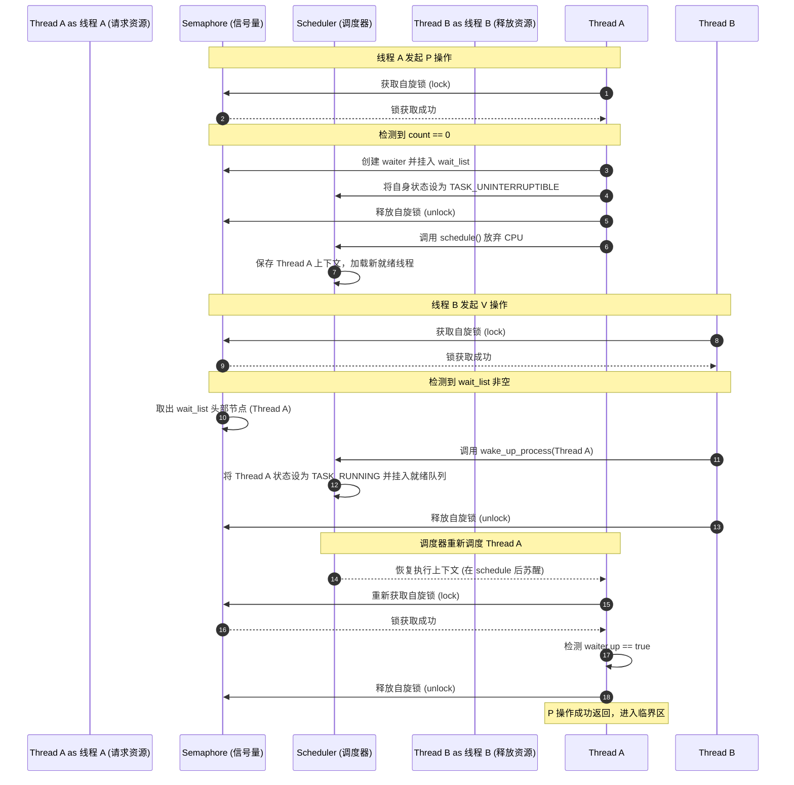
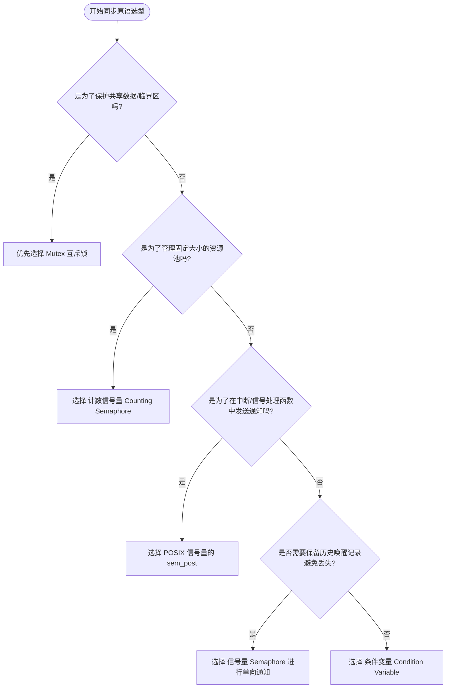

# 1.1.3.8 信号量

在现代操作系统的多任务并发管理中，协调多个并发执行流（进程或线程）对共享资源的互斥访问以及执行顺序的同步，是构建稳定、高效系统的核心课题。在各种同步原语中，**信号量 (Semaphore)** 扮演着极其重要的角色。作为并发控制理论的奠基石，信号量不仅为操作系统内核的多任务协作提供了坚实的理论支撑，更广泛应用于现代并发编程的诸多场景。

本文将从信号量的历史演进、数学模型与 PV 操作原理出发，深入剖析其在操作系统内核级的数据结构实现，对比 System V 与 POSIX 两大主流信号量规范的异同，深入辨析信号量与互斥锁 (Mutex) 的本质区别，并归纳工程实践中的常见误区与最佳决策指南。

---

## 1. 信号量的历史演进与数学模型

### 1.1 并发控制的起源与早期软件算法局限
在 20 世纪 60 年代初，随着多道程序设计 (Multiprogramming) 概念的诞生，计算机系统由单任务串行执行转向多任务交替或并发运行。这种并发性的引入使得程序之间开始产生资源的竞争与协作。例如，两个进程同时尝试向同一台打印机输出数据，或者同时修改同一块内存区域。为了避免数据混乱，计算机科学家们迫切需要一种能够安全、可靠地协调并发进程的通用机制。

早期的并发控制方案主要依赖纯软件逻辑。例如，著名的 Dekker 算法和 Peterson 算法，通过共享的标志变量和忙等待 (Busy Waiting) 来解决两个进程的互斥访问问题。然而，这些纯软件算法存在无法克服的缺陷：
1. **CPU 资源的无谓消耗**：忙等待要求 CPU 在一个循环中不断检测标志变量（自旋），这耗费了大量的时钟周期。在单核多道程序系统中，忙等待的进程会霸占 CPU，导致真正持有临界资源的进程无法获得 CPU 时间来释放资源，从而引发严重的系统抖动。
2. **硬件架构的依赖性**：Peterson 等软件算法高度依赖于内存读写的强顺序性 (Sequential Consistency)。在现代多核 CPU 架构中，为了提升性能，处理器普遍采用了乱序执行 (Out-of-Order Execution) 和弱内存模型 (Weak Memory Models)。在没有硬件级内存屏障 (Memory Barrier) 指令的保护下，这些软件算法会由于指令重排而彻底失效。
3. **难以扩展**：将这些算法从两个进程推广到 $N$ 个进程时（例如 Dijkstra 提出的 $N$ 进程互斥算法），算法的复杂度呈指数级上升，代码变得极其晦涩，证明其正确性极其困难，在工程实践中几乎无法落地。

1965 年，荷兰计算机科学家艾兹赫尔·迪杰斯特拉 (Edsger W. Dijkstra) 在其具有里程碑意义的论文《Cooperating Sequential Processes》中首次提出了“信号量 (Semaphore)”的概念。Dijkstra 的灵感来源于铁路交通控制中的“臂板信号机” (Semaphores)。在铁路上，臂板的升降指示着某段轨道（区间）是否安全可通行。如果臂板升起，表示轨道空闲，火车可以进入；如果臂板降下，表示轨道被占用，火车必须在区间外停车等待，直到前车驶离并改变信号状态。

Dijkstra 将这一物理概念抽象为操作系统中的一种数据结构，用于管理临界资源。这种机制的核心在于将“资源状态的管理”与“进程的挂起/唤醒调度”结合起来，由操作系统内核统一提供原子性的操作原语。这不仅彻底解决了忙等待导致的 CPU 资源浪费问题，还为并发控制提供了一个优雅且统一的数学模型。

### 1.2 PV 操作的数学模型与语义设计
信号量在数学上可以抽象为一个受保护的整型变量 $S$，该变量除了初始化之外，只能通过两个标准的、不可分割的原子操作来访问，这两个操作最初被 Dijkstra 命名为 **P** 和 **V**：
- **P 操作** 代表 **Proberen**（荷兰语，意为“尝试”或“测试”，在英文文献中常对应为 `wait` 或 `down`）。
- **V 操作** 代表 **Verhogen**（荷兰语，意为“增加”或“提升”，在英文文献中常对应为 `signal`、`post` 或 `up`）。

#### 1.2.1 P 操作的经典语义与逻辑
当一个执行流请求进入临界区或获取某种资源时，它必须执行 P 操作。P 操作的经典伪代码语义如下：

```c
void P(Semaphore S) {
    S.value = S.value - 1;
    if (S.value < 0) {
        // 当前线程/进程被阻塞，放入该信号量的等待队列 S.queue 中
        block_current_thread(S.queue);
    }
}
```

P 操作的逻辑步骤如下：
1. **递减计数器**：首先将信号量的内部计数器 `S.value` 减 1。这一步表示当前执行流正声明要占用一个资源单位。
2. **边界判断**：
   - 如果减 1 后的值 `S.value >= 0`，说明系统当前仍有空闲资源，或者该资源刚好被完全分配。此时，调用 P 操作的执行流不需要等待，可以立即通过并继续执行。
   - 如果减 1 后的值 `S.value < 0`，说明系统资源已枯竭，当前执行流无法获得资源。此时，执行流不能继续向下运行，内核必须将其挂起（进入阻塞状态），并放入与该信号量关联的等待队列中，让出 CPU 供其他就绪任务运行。

#### 1.2.2 V 操作的经典语义与逻辑
当一个执行流释放资源或完成某项协作事件时，它必须执行 V 操作。V 操作的经典伪代码语义如下：

```c
void V(Semaphore S) {
    S.value = S.value + 1;
    if (S.value <= 0) {
        // 从该信号量的等待队列 S.queue 中唤醒一个被阻塞的线程/进程
        wakeup_one_thread(S.queue);
    }
}
```

V 操作的逻辑步骤如下：
1. **递增计数器**：首先将信号量的内部计数器 `S.value` 加 1。这一步表示资源已被归还给系统。
2. **边界判断**：
   - 如果加 1 后的值 `S.value > 0`，说明当前没有任何执行流在等待该资源（即等待队列为空）。此时，V 操作只需要简单地递增计数值，无需执行任何唤醒操作。
   - 如果加 1 后的值 `S.value <= 0`，这在数学上意味着在递增之前 `S.value < 0`，即原本有执行流因为资源不足而被阻塞在等待队列中。因此，V 操作必须从等待队列 `S.queue` 中选择一个处于阻塞状态的执行流，将其唤醒，使其重新获得 CPU 调度机会。

#### 1.2.3 状态方程与数学性质推导
为了深刻理解信号量，我们可以推导出信号量在任意时刻 $t$ 的数学性质。设：
- $S_{init}$ 为信号量的初始值（$S_{init} \ge 0$）。
- $N_P(t)$ 为从初始状态到时刻 $t$，系统成功发起并完成的 P 操作次数（注意：此处的 P 操作不包含那些因为被阻塞而尚未返回的 P 操作）。
- $N_V(t)$ 为从初始状态到时刻 $t$，系统成功发起并完成的 V 操作次数。
- $S(t)$ 为时刻 $t$ 时信号量计数器的值。

根据 PV 操作的定义，信号量的值是由初始值经过若干次加减得到的：
$$S(t) = S_{init} - N_P(t) + N_V(t)$$

根据 $S(t)$ 的符号，我们可以得出两个极其重要的物理性质：
1. **当 $S(t) \ge 0$ 时**：此时，`S(t)` 的数值直接等于**当前可供即时使用的物理资源数量**。如果此时有新执行流发起 P 操作，它可以无延迟地立即获得资源。
2. **当 $S(t) < 0$ 时**：此时，`S(t)` 的值是负数，其绝对值 $|S(t)|$ 精确地等于**当前因为请求该资源而被挂起、阻塞在等待队列中的执行流总数**。这一性质为内核的调度与性能统计提供了直观的依据。

#### 1.2.4 形式化安全属性与活性证明
我们可以使用离散数学和形式化方法来证明信号量在并发控制中的正确性。

##### 安全属性 (Safety Property) 证明
安全属性的核心是保证系统不进入坏的状态（例如，在互斥场景中，进入临界区的任务数不能超过允许的上限）。
设信号量用于临界区的互斥访问，初始值 $S_{init} = 1$。设任意时刻 $t$，处于临界区内的任务数量为 $N_{in}(t)$。我们定义系统不变式 (Invariant) 如下：
$$S(t) + N_{in}(t) = 1$$

- **初始状态**：$S(0) = S_{init} = 1$，$N_{in}(0) = 0$。不变式成立：$1 + 0 = 1$。
- **状态转移——任务进入临界区（完成 P 操作）**：
  在时刻 $t$，一个任务完成了 P 操作，导致 $S(t)$ 递减 1，同时该任务进入临界区，使得 $N_{in}(t)$ 递增 1。不变式依然保持平衡。由于只有在 $S(t) \ge 0$ 时任务才能从 P 操作返回，因此 $S(t) = 1 - N_{in}(t) \ge 0$，推导出 $N_{in}(t) \le 1$。这证明了在任何时刻，进入临界区的任务数量绝对不会超过 1，满足互斥的安全属性。
- **状态转移——任务退出临界区（完成 V 操作）**：
  任务离开临界区时，首先执行 V 操作，这使得 $S(t)$ 递增 1，同时 $N_{in}(t)$ 递减 1。不变式依然成立。

##### 活性属性 (Liveness Property) 证明与防唤醒丢失
活性属性的核心是保证系统在运行过程中，好的事情终究会发生（例如，被阻塞的任务最终一定会被唤醒，不会发生永久饥饿）。
在缺乏内核级原子操作保障的用户态模拟中，经常会出现经典的“唤醒丢失 (Lost Wakeup)”问题。例如，当一个线程检测到计数器为 0，正准备将自己挂起时，发生了线程切换；另一个线程运行并执行了释放资源的操作（计数器加 1，并试图唤醒等待队列中的任务），但由于前一个线程尚未真正被挂起，唤醒操作无果而终；当第一个线程重新获得 CPU 并执行挂起操作时，它将永远失去被唤醒的机会。

信号量机制通过在内核中将“检测计数器、挂载等待链表、改变任务状态和触发调度”这组动作设计为一个不可分割的原子操作，从而完美避免了唤醒丢失。在公平调度器 (Fair Scheduler) 的前提下，只要有足够的 V 操作发生，等待队列中的任务必定能在有限步内被唤醒，满足活性属性的要求。

### 1.3 二值信号量与计数信号量的分类与等价性证明
根据信号量初始值和取值范围的不同，通常将其分为两类：
- **二值信号量 (Binary Semaphore)**：其初始值只能为 0 或 1。在运行过程中，其值也只在 0 和 1 之间交替变化。虽然它在行为上类似于锁，但由于没有“所有权”的约束（任何线程都可以对其执行 V 操作），它通常用于简单的互斥访问或单次事件通知。
- **计数信号量 (Counting Semaphore)**：其初始值可以为任意非负整数 $N$（通常 $N > 1$）。它用于代表拥有 $N$ 个相同实例的资源池，允许多达 $N$ 个并发活动同时进行。

#### 1.3.1 两者的等价性数学证明
在计算理论中，一个经典的问题是：**二值信号量与计数信号量在表达能力上是否完全等价？** 答案是肯定的。我们可以通过使用二值信号量来构建计数信号量，从而证明它们具有相同的计算与同步能力。

以下是使用两个二值信号量（`mutex` 和 `delay`）以及一个普通的整型计数器（`count`）来实现计数信号量的算法描述：

```c
// 计数信号量的结构体定义
typedef struct {
    int count;             // 记录当前资源的逻辑计数
    BinarySemaphore mutex; // 保护 count 变量修改的二值信号量（初始值为 1）
    BinarySemaphore delay; // 用于阻塞等待资源的线程的二值信号量（初始值为 0）
} CountingSemaphore;

// 初始化计数信号量
void sem_counting_init(CountingSemaphore *sem, int initial_value) {
    sem->count = initial_value;
    sem_binary_init(&(sem->mutex), 1);
    sem_binary_init(&(sem->delay), 0);
}

// 计数信号量的 P 操作实现
void sem_counting_wait(CountingSemaphore *sem) {
    // 1. 获取互斥锁，保护共享变量 count 的修改
    sem_binary_wait(&(sem->mutex));
    
    // 2. 递减逻辑计数
    sem->count--;
    
    // 3. 判断是否需要阻塞
    if (sem->count < 0) {
        // 如果资源不足，我们需要释放互斥锁，以便其他线程可以继续操作，然后将当前线程挂起
        // 注意：释放 mutex 与在 delay 上等待的顺序非常关键
        sem_binary_post(&(sem->mutex));
        sem_binary_wait(&(sem->delay)); 
    } else {
        // 资源足够，直接释放互斥锁并返回
        sem_binary_post(&(sem->mutex));
    }
}

// 计数信号量的 V 操作实现
void sem_counting_post(CountingSemaphore *sem) {
    // 1. 获取互斥锁，保护共享变量 count 的修改
    sem_binary_wait(&(sem->mutex));
    
    // 2. 递增逻辑计数
    sem->count++;
    
    // 3. 判断是否有被阻塞的线程需要唤醒
    if (sem->count <= 0) {
        // count <= 0 说明此前有线程因为资源不足在 delay 信号量上等待
        // 我们将其唤醒。注意，被唤醒的线程将恢复运行
        sem_binary_post(&(sem->delay));
    }
    
    // 4. 释放互斥锁
    sem_binary_post(&(sem->mutex));
}
```

#### 1.3.2 并发正确性分析与不变式证明
我们可以利用不变式 (Invariant) 来证明上述转换算法在并发条件下的正确性。
设 $C$ 为当前的逻辑资源数（即 `sem->count`），$B_{mutex}$ 为二值信号量 `mutex` 的值，$B_{delay}$ 为二值信号量 `delay` 的值。

在任何没有线程处于 P/V 操作内部的关键过渡态时，系统满足以下不变式：
1. $B_{mutex} \in \{0, 1\}$
2. $B_{delay} \in \{0, 1\}$
3. 如果 $C < 0$，则说明有 $|C|$ 个线程被阻塞在 `delay` 上。由于 `delay` 是一个二值信号量，它无法直接记录多个等待的线程个数。因此，多个等待线程的排队工作交给了底层二值信号量系统的等待链表。
4. 当一个线程在 `sem_counting_wait` 中由于 $C < 0$ 而释放 `mutex` 并即将执行 `sem_binary_wait(&(sem->delay))` 时，存在一个微小的窗口期。在这个窗口期内，`sem->count` 已经变负，但线程尚未真正进入 `delay` 的阻塞链表。此时，如果另一个线程执行了 `sem_counting_post`，它会执行 `sem_binary_post(&(sem->delay))`。这会将 `delay` 的值设为 1。当之前的线程随后执行 `sem_binary_wait(&(sem->delay))` 时，它将不会被挂起，而是直接通过。这完美符合 PV 操作的逻辑，证明了该算法在任意并发交错执行下的正确性。

---

## 2. 内核级信号量的底层实现机制与数据结构

要深入理解信号量的工作机制，我们不能仅仅停留在抽象的数学定义上，而必须解剖现代操作系统内核中的具体实现。信号量属于内核级同步原语，其正确性直接依赖于内核如何实现核心变量的原子操作，以及如何与进程调度器进行深度的交互。

### 2.1 信号量的内核数据结构表示
以类 Unix 操作系统内核为例，信号量通常由一个结构体表示。它的经典定义如下：

```c
struct semaphore {
    raw_spinlock_t      lock;       // 自旋锁，用于多核架构下保护内部数据结构的并发访问
    unsigned int        count;      // 核心资源计数器
    struct list_head    wait_list;  // 等待该信号量的线程/进程双向循环链表
};
```

#### 2.1.1 raw_spinlock_t lock 的关键角色
在对称多处理（SMP）架构中，多个 CPU 核心可能同时执行涉及同一个信号量的 P 或 V 操作。如果没有底层的互斥保护，对 `count` 的修改和对 `wait_list` 的插入/删除操作将会发生数据竞争 (Race Condition)，从而导致系统崩溃。
- `lock` 是一把最底层的自旋锁 (Spinlock)。在内核中，`raw_spinlock_t` 不会受到内核抢占 (Kernel Preemption) 的影响。即使在内核抢占开启的情况下，它也能保证在极短的临界区内提供绝对的互斥性。
- 它的作用不是用于线程级别的等待，而是专门保护 `count` 的算术运算以及 `wait_list` 的链表操作。这把锁的持有时间极短，通常只包含几条机器指令。在单核 CPU 系统中，该锁会退化为简单的“关闭内核抢占”或“关闭中断”操作。

#### 2.1.2 核心计数器 count 的原子操作与 CPU 缓存一致性
在多核架构中，对 `count` 的修改并非简单的“读-改-写”三步内存操作，因为这会导致并发冲突。
- **硬件原子指令**：在 x86 架构中，内核通常利用 `lock` 前缀修饰的汇编指令（如 `lock xadd` 或 `lock cmpxchg`）来执行原子修改；在 ARM 架构中，则利用 `LDREX/STREX` 独占加载与存储指令对。
- **锁总线与锁缓存**：在硬件物理层，`lock` 前缀指令会向系统总线发出 `#LOCK` 信号，从而锁定总线，使得其他处理器无法通过总线访问内存。而在现代 CPU 中，如果目标数据已经被缓存在 CPU 的 L1/L2 缓存中，处理器会改用“锁缓存”技术。利用 MESI（Modified-Exclusive-Shared-Invalid）缓存一致性协议，当某个 CPU 核心尝试原子修改 `count` 时，它会向总线发送“使无效”请求，强行将其他核心缓存中对应的 Cache Line 状态置为 Invalid，并将其独占为 Modified 状态。
- **缓存颠簸 (Cache Thrashing)**：当多个 CPU 核心频繁尝试修改同一个信号量的 `count` 值时，该变量所在的 Cache Line 会在不同的 CPU 核心缓存之间频繁发生状态转移。这种现象称为缓存颠簸，会导致显著的性能抖动。因此，在极高性能要求的场景中，频繁竞争的计数信号量并非最佳选择。

#### 2.1.3 wait_list 等待链表
`wait_list` 是一个双向循环链表，它把所有因为资源不足而挂起的线程控制块（PCB）封装成一个结构体，并挂载在链表上。
```c
struct semaphore_waiter {
    struct list_head list;   // 用于链接到 semaphore.wait_list 的节点
    struct task_struct *task;// 指向被挂起线程的进程控制块
    bool up;                 // 标识该线程是否是被 V 操作主动唤醒的
};
```

### 2.2 等待链表挂接与调度器的深度交互流程
当信号量的计数不足以满足 P 操作的需求时，线程必须被挂起。这一过程需要操作系统内核的调度器 (Scheduler) 深度协作。以下是详细的步骤解析：

#### 2.2.1 挂起阶段（P 操作阻塞路径）
当线程 A 调用信号量的等待函数时，内核的执行逻辑如下：

1. **获取自旋锁**：线程 A 获取信号量内部的 `sem->lock` 自旋锁。
2. **检测并递减**：
   - 如果 `sem->count > 0`，说明有资源可用，则执行 `sem->count--`，随后释放 `sem->lock`，线程 A 继续执行，无需进入挂起流程。
   - 如果 `sem->count == 0`，说明资源已耗尽。线程 A 必须进入阻塞流转。
3. **分配并初始化 Waiter**：在内核栈上分配一个 `struct semaphore_waiter waiter`，将 `waiter.task` 指向当前的 `current` 线程指针，将 `waiter.up` 初始化为 `false`。
4. **挂入等待链表**：调用 `list_add_tail(&waiter.list, &sem->wait_list)`，将当前线程节点加入到信号量的等待队列尾部。
5. **设置线程状态**：将当前线程的调度状态由 `TASK_RUNNING` 设置为 `TASK_UNINTERRUPTIBLE`（不可中断的等待状态，此时线程不会响应普通的信号，从而保证信号量操作的原子语义）或 `TASK_INTERRUPTIBLE`（可中断的等待状态，若收到外部信号则会提前苏醒并返回 `-EINTR` 错误）。
6. **释放自旋锁并让出 CPU**：
   - 释放先前获取的 `sem->lock` 自旋锁。
   - **调用 `schedule()`**：这是与调度器交互的核心步骤。`schedule()` 函数是操作系统的调度入口。它会挂起当前 CPU 核心上的线程 A，保存其当前的寄存器上下文（如栈指针 RSP/ESP、程序计数器 RIP/EIP、通用寄存器等），然后从该 CPU 核心的运行队列 (Runqueue) 中选择下一个就绪的线程执行。这一过程通常伴随着页表切换（如果是进程切换）和内核栈的切换。
7. **线程在此暂停**：此时线程 A 在 CPU 上停止执行，不再占用任何 CPU 资源，直到被其他线程唤醒。

#### 2.2.2 唤醒阶段（V 操作释放路径）
当另一个线程 B 释放资源，调用信号量的释放函数时，内核的执行逻辑如下：

1. **获取自旋锁**：线程 B 获取 `sem->lock`。
2. **检查等待链表**：
   - 如果 `sem->wait_list` 为空，说明没有任何线程在等待该资源，则简单地执行 `sem->count++`，释放自旋锁后退出。
   - 如果 `sem->wait_list` 不为空，说明有线程被挂起。此时，为了避免不必要的系统调用和状态翻转，计数器 `sem->count` 通常保持不变，而是直接从链表中取回第一个等待节点（FIFO 策略）。
3. **取出 Waiter**：从 `sem->wait_list` 的头部移除一个节点 `struct semaphore_waiter *waiter`。
4. **置位唤醒标志**：将 `waiter->up` 设为 `true`。
5. **调用调度器唤醒**：
   - 核心步骤：调用内核调度器函数 `wake_up_process(waiter->task)`。
   - 调度器会将该被唤醒线程的状态由 `TASK_UNINTERRUPTIBLE` 重新修改为 `TASK_RUNNING`。
   - 随后，调度器将该线程重新挂载到对应 CPU 核心的运行队列 (Runqueue) 中，使其重新具备被调度的资格。
6. **释放自旋锁**：释放 `sem->lock`。

#### 2.2.3 线程苏醒后的逻辑收尾
当调度器下一次选中线程 A 执行时，线程 A 会在它先前调用 `schedule()` 的那行代码之后恢复运行：
1. **重新获取自旋锁**：线程 A 被唤醒后，首先重新申请 `sem->lock`。
2. **验证状态**：检查自己对应的 `waiter.up` 标志是否为 `true`。如果是，说明它是被合法的 V 操作显式唤醒的，那么它就可以成功从 `wait_list` 中脱离，释放 `sem->lock`，并从操作函数中返回，继续执行其临界区代码。

我们可以用以下 Mermaid 时序图来清晰描述这一深度的内核态流转过程：



---

## 3. 两种信号量规范对比：System V vs POSIX

在 Unix-like 操作系统演进历史中，为了满足不同的并发与协作需求，先后出现了两个主流的信号量标准规范：**System V 信号量** 和 **POSIX 信号量**。这两者在底层设计思想、API 易用性、生命周期管理以及原子性保证上有着本质的区别。

### 3.1 System V 信号量（IPC 机制）
System V 信号量是 Unix 早期版本（System V Release 4）中引入的进程间通信（IPC）机制的一部分。其最显著的特征是：它不是单个信号量，而是一个**信号量集（Semaphore Set）**。

#### 3.1.1 核心设计哲学
System V 设计的核心出发点是解决多个相关或不相关进程之间，针对**一组共享资源**进行复杂的、原子性的分配和释放问题。它试图在内核层面提供一种强一致性的事务级保障，避免应用层在处理多资源竞争时写出复杂的死锁规避代码。

#### 3.1.2 关键 API 接口
System V 信号量的操作接口相对繁琐，主要包括以下三个系统调用：

1. **`semget` (创建或获取信号量集)**
   ```c
   int semget(key_t key, int nsems, int semflg);
   ```
   - `key`：一个唯一标识符（IPC Key），通常通过 `ftok` 函数生成。
   - `nsems`：该信号量集中包含的信号量个数。这体现了其“集合”的设计。
   - `semflg`：权限与创建标志（如 `IPC_CREAT` 和 `IPC_EXCL`）。
2. **`semctl` (控制与初始化)**
   ```c
   int semctl(int semid, int semnum, int cmd, ...);
   ```
   - 这是一个多用途的接口，用于获取或设置信号量的值、销毁信号量集等。其参数采用了可变参数设计，必须配合一个 `union semun` 联合体来使用，使用复杂度极高。
3. **`semop` (执行原子操作)**
   ```c
   int semop(int semid, struct sembuf *sops, size_t nsops);
   ```
   - `sops`：指向一个由 `struct sembuf` 结构组成的数组，每个结构体定义了对集合中某一个信号量的操作（递增、递减或测试是否为 0）。
   - `nsops`：操作数组的长度。

#### 3.1.3 联合原子操作与事务化控制原理
System V 信号量最强大也是最复杂的特性是**支持联合原子操作**。
如果一个进程需要同时获取资源 A（对应信号量 0）和资源 B（对应信号量 1）才能继续运行，在普通的单信号量机制下，进程必须分步执行：
- `P(A)`
- `P(B)`

在多进程并发环境下，如果另一个进程以相反的顺序执行 `P(B)` 然后 `P(A)`，极易引发经典的**死锁（Deadlock）**。

而在 System V 中，我们可以构建一个包含两个 `sembuf` 元素的数组，然后通过一次 `semop` 调用将其传入内核：
```c
struct sembuf sops[2];
// 尝试将信号量 0 减 1
sops[0].sem_num = 0;
sops[0].sem_op = -1;
sops[0].sem_flg = 0;

// 尝试将信号量 1 减 1
sops[1].sem_num = 1;
sops[1].sem_op = -1;
sops[1].sem_flg = 0;

// 内核级原子操作
semop(semid, sops, 2);
```
内核在执行 `sys_semop` 时，会以**全有或全无（All-or-Nothing）**的原子事务方式对这组信号量进行检查和修改。
- **预检阶段 (Verification Phase)**：内核首先会锁住整个信号量集，遍历操作数组中的每一个操作，检查对于对应的信号量，修改是否会越界（例如递减是否会导致值小于 0，或者设置了 `IPC_NOWAIT` 时的阻塞检查）。
- **提交阶段 (Commit Phase)**：如果所有操作都能满足，内核才会执行修改并返回。如果有任何一个信号量的资源不满足，且操作没有指定 `IPC_NOWAIT`，内核会撤销所有已经做出的临时修改（回滚状态），然后将当前进程挂起，放入对应信号量的等待队列中。
这种设计从根本上消除了由于申请多资源顺序不当而产生死锁的可能。然而，这种保障的背后是内核复杂的锁机制和昂贵的遍历开销。

#### 3.1.4 随内核的生命周期 (Kernel-persistent)
System V 信号量集是**随内核持续的**。一旦通过 `semget` 创建成功，除非有进程显式调用 `semctl(semid, 0, IPC_RMID)` 销毁它，或者整个操作系统重启，否则即使所有曾经使用该信号量的进程都已经退出，它依然会占用内核内存资源。这经常导致系统在长时间运行后出现“IPC 资源泄露”的隐患。

#### 3.1.5 SEM_UNDO 标志的引入与防崩溃锁死机制
为了解决进程意外崩溃而导致其持有的信号量资源永久锁死的问题，System V 引入了 `SEM_UNDO` 标志。
- 当进程在 `semop` 的 `sem_flg` 中指定了 `SEM_UNDO` 时，内核会为该进程维护一个内部调整值（`sem_adj`）。
- 每当该进程成功减少信号量的值时，内核就会在对应的 `sem_adj` 中累加该减少量；当增加信号量的值时，则减去对应量。
- **进程退出时的自动恢复**：在进程控制块 `task_struct` 中挂载有 `struct sem_undo` 结构体链表。当该进程由于任何原因（包括收到 `SIGKILL` 信号异常终止）退出时，内核在 `do_exit` 的收尾阶段会调用 `exit_sem` 函数遍历该进程的所有 `sem_undo` 记录，并自动将对应的信号量值加回（或减去）这些调整值。这是一种极强的健壮性保障，但也进一步增加了内核管理这些状态的系统开销与内存负担。

### 3.2 POSIX 信号量
POSIX 信号量是 IEEE 开发的 POSIX.1b（实时系统扩展）标准中引入的。它的目标是提供一种更加轻量级、契合现代多线程架构的同步原语。POSIX 信号量分为两类：**有名信号量（Named Semaphore）** 和 **无名信号量（Unnamed Semaphore）**。

#### 3.2.1 有名信号量 (Named Semaphore)
有名信号量具有全局唯一的名字（以斜杠 `/` 开头），其底层与虚拟文件系统（VFS）紧密结合。

- **关键 API**：
  - `sem_open`：创建或打开一个命名信号量。
  - `sem_close`：关闭当前进程对该信号量的连接。
  - `sem_unlink`：从系统命名空间中删除该信号量。当所有进程都关闭该信号量后，它会被系统物理释放。
- **存储与访问**：在许多类 Unix 系统中，有名信号量通常会被映射到内存文件系统（如 `/dev/shm` 目录下，文件命名形如 `sem.name`）。
- **适用场景**：由于有名信号量在文件系统中有对应的节点，因此不具有亲缘关系的进程可以通过相同的文件路径打开同一个信号量，从而实现**跨进程同步**。

#### 3.2.2 无名信号量 (Unnamed Semaphore)
无名信号量没有文件系统中的实体名字，它只是内存中的一段结构体数据（类型为 `sem_t`）。

- **关键 API**：
  - `sem_init(sem_t *sem, int pshared, unsigned int value)`：在指定的内存地址初始化信号量。若 `pshared` 为 0，表示该信号量仅在当前进程的线程间共享；若 `pshared` 非 0，表示该信号量在进程间共享。
  - `sem_destroy(sem_t *sem)`：销毁无名信号量。
  - `sem_wait(sem_t *sem)`：执行 P 操作。
  - `sem_post(sem_t *sem)`：执行 V 操作。
- **存储位置**：
  - 如果用于线程间同步， `sem_t` 通常被放置在进程的全局数据段、静态存储区或堆上。
  - 如果用于进程间同步， `sem_t` 必须被放置在**共享内存区域**（如通过 `mmap` 分配的共享内存段，或 POSIX 共享内存 `shm_open` 中），并且在初始化时将 `pshared` 参数设为 1。
- **适用场景**：轻量级进程内多线程同步，或者亲缘进程（通过 `fork` 派生的父子进程）之间在共享内存支撑下的同步。

### 3.3 sem_wait / sem_post 的内核/用户态流转与 FUTEX 机制
传统的信号量操作，如每一次 P/V 操作，都必须触发一次系统调用进入内核态。然而，系统调用的开销是极其高昂的（涉及模式切换、特权级跳转、TLB 刷新等）。
在现代 Linux 系统中，POSIX 无名信号量利用了 **FUTEX (Fast Userspace Mutex，快速用户态互斥体)** 机制，从而实现了极高的并发性能。

- **快速路径（Fast Path，无竞争状态）**：当一个线程执行 `sem_wait`，如果当前信号量计数 `count > 0`，用户态代码会通过 CPU 的原子汇编指令（如 `LOCK DEC`）直接将用户态内存中的 `count` 减 1 并立即返回。这整个过程**完全在用户态完成**，没有发生任何系统调用，性能与普通的内存读写相近。
- **慢速路径（Slow Path，有竞争状态）**：如果用户态原子减 1 后发现资源不足，线程无法继续，此时它才会调用 `sys_futex` 系统调用陷入内核。内核会将当前线程挂起，并放入与该 futex 地址关联的内核等待队列中。
- **唤醒时的流转**：同理，当线程调用 `sem_post` 时，如果发现没有线程在等待（通过计数判断），则在用户态直接原子加 1 退出。如果发现有线程正在被挂起，则通过 `sys_futex` 系统调用陷入内核，通知内核唤醒在对应 futex 地址上等待的线程。

#### 3.3.1 FUTEX 底层哈希表检索与冲突处理
当线程由于竞争调用 `sys_futex(sem_val_addr, FUTEX_WAIT_PRIVATE, ...)` 陷入内核时，内核的处理流程如下：
1. **哈希映射**：内核使用哈希算法，根据传入的用户态虚拟内存地址 `sem_val_addr` 计算出一个哈希值。由于是进程私有（`PRIVATE`）类型的 futex，哈希计算的 Key 由该进程的 `mm_struct` 地址和 `sem_val_addr` 组合而成。
2. **检索队列**：在内核中，维护有一个全局的 `futex_queues` 哈希表，每一个哈希桶（Bucket）都对应一个由 `struct futex_hash_bucket` 结构体定义的双向链表。内核根据哈希值找到对应的桶，并获取该桶的自旋锁以解决哈希冲突。
3. **节点挂接**：在当前桶的链表中挂载一个 `struct futex_q` 节点，将当前线程的 `task_struct` 指针存入该节点。随后释放桶的自旋锁，将该线程挂起。
4. **唤醒流程**：当另一线程执行 `sem_post` 并通过 `FUTEX_WAKE` 陷入内核时，内核执行同样的哈希计算定位到相同的桶，获取自旋锁，从链表中检索出对应的 `futex_q` 节点，并唤醒对应的线程。这使得即使有海量的并发同步需求，futex 哈希表依然能保持极高的检索与调度效率。

### 3.4 System V 与 POSIX 信号量多维度对比

| 对比维度 | System V 信号量集 | POSIX 有名信号量 | POSIX 无名信号量 |
| :--- | :--- | :--- | :--- |
| **设计核心** | 适合复杂多资源的原子级操作集合 | 适合跨进程同步的全局命名实体 | 极其轻量级的内存内同步原语 |
| **生命周期** | 随内核（需显式调用 `semctl` 销毁） | 随内核（需显式调用 `sem_unlink` 销毁） | 随其所在的内存区域生命周期 |
| **并发性能** | 较低（由于需要支持复杂的联合原子操作与内核维护撤销链表） | 中等（每次打开需要文件系统检索，但使用中较快） | 极高（支持 FUTEX 快速路径，非竞争时无系统调用） |
| **原子性粒度** | **联合原子操作**（支持一次操作多个信号量） | 单一原子操作 | 单一原子操作 |
| **防崩溃机制** | 支持 `SEM_UNDO`，进程崩溃时内核自动补偿 | 不支持，进程异常退出可能导致锁死 | 不支持，需要应用层自行捕获异常并释放 |
| **使用复杂度** | 极高（API 参数晦涩，需自定义 union 结构） | 较低（接口类似于 POSIX 文件接口） | 极低（接口简洁直观） |
| **适用场景** | 遗留 Unix 系统、多资源同时竞争的防死锁分配 | 无亲缘关系的多进程间同步 | 进程内多线程同步、亲缘进程共享内存同步 |

---

## 4. 信号量与互斥锁 (Mutex) 的本质区别

在并发编程中，许多开发者容易将“二值信号量”与“互斥锁（Mutex）”混淆，甚至在代码中交替使用它们。然而，这两者在设计哲学、所有权机制、优先级处理以及应用场景上有着本质的差异。混淆它们不仅会导致架构设计的混乱，更会在高并发或实时系统中埋下难以排查的死锁与性能隐患。

### 4.1 所有权 (Ownership) 的有无与设计哲学
这是信号量与互斥锁之间最根本、最决定性的区别。

#### 4.1.1 Mutex：严格的所有权绑定
互斥锁的本意是“互斥”（Mutual Exclusion）。在任何时刻，Mutex 都处于两种状态之一：锁定（Locked）或未锁定（Unlocked）。
- **锁定所有者（Owner）**：当线程 A 成功获取了互斥锁时，线程 A 就成为了该互斥锁的“所有者（Owner）”。
- **谁加锁，谁解锁**：这是 Mutex 极其严格的契约。**只有持有该锁的线程 A 才有权利释放（Unlock）这把锁**。如果线程 B 尝试对一个被线程 A 持有的 Mutex 执行解锁操作，在标准的 Mutex 实现中，这会被定义为未定义行为（Undefined Behavior），或者直接返回错误（如 `EPERM`）。
- **设计哲学**：Mutex 是为了保护**临界区（Critical Section）**而生的。它保证了同一时间只有一个执行流可以访问共享资源，其核心关注点是**数据的完整性与安全性**。

#### 4.1.2 Semaphore：完全无所有权
信号量是一个“计数器”，它代表的是某种可用的资源量。
- **无 Owner 概念**：信号量**不记录**是哪一个线程执行了 P（wait）操作。因此，它没有任何所有权约束。
- **跨线程 P/V 协作**：任何线程都可以在信号量上执行 P 操作，同样，**任何线程也都可以在该信号量上执行 V 操作**。例如，线程 A 可以调用 `sem_wait(&sem)` 挂起自己，随后线程 B 在完成某项任务后，可以调用 `sem_post(&sem)` 将线程 A 唤醒。
- **设计哲学**：Semaphore 是为了**并发通知、协作与资源计数**而生的。它的核心关注点是**执行流之间的同步与协调**。

#### 4.1.3 典型协作模式：生产者-消费者问题
在生产者-消费者模式中，信号量的无所有权特性得到了完美体现。
设有一个容量为 $N$ 的缓冲区，我们使用两个计数信号量：
- `empty_slots`：代表空闲缓冲区的个数，初始值为 $N$。
- `full_slots`：代表已有数据的缓冲区个数，初始值为 0。

```c
// 生产者线程的逻辑
void producer() {
    while (true) {
        // 生产一个数据项 item ...
        
        sem_wait(&empty_slots); // 1. 减少空槽计数，若无空槽则阻塞
        
        // 将 item 放入缓冲区（此处需要 Mutex 保护缓冲区数据结构）
        
        sem_post(&full_slots);  // 2. 增加满槽计数，唤醒等待数据的消费者
    }
}

// 消费者线程的逻辑
void consumer() {
    while (true) {
        sem_wait(&full_slots);  // 1. 减少满槽计数，若无数据则阻塞
        
        // 从缓冲区取出数据项 item
        
        sem_post(&empty_slots); // 2. 增加空槽计数，唤醒等待写入空间的生产者
        
        // 消费数据项 item ...
    }
}
```
在这个经典的流程中，生产者在 `empty_slots` 上 wait，在 `full_slots` 上 post；消费者则相反。如果强行用 Mutex 来替换这两个信号量，由于 Mutex 严格的“谁加锁谁解锁”限制，这种跨线程的通知流转将完全无法工作。

### 4.2 优先级继承机制的缺失及其灾难性后果
在多优先级抢占式调度系统（如许多实时操作系统 RTOS 或支持实时优先级的 Linux 内核）中，信号量由于缺乏所有权，会带来一个极其致命的隐患：**优先级翻转（Priority Inversion）**，并且无法使用优先级继承协议来修复。

#### 4.2.1 优先级翻转的产生机制
假设系统中有三个线程，优先级由高到低分别为：**高优先级线程 H**、**中优先级线程 M**、**低优先级线程 L**。

1. **L 获取资源**：在 $t_1$ 时刻，低优先级线程 L 成功获取了某项共享资源（例如，对信号量 $S$ 执行了 P 操作，并准备使用临界资源）。
2. **H 抢占并请求资源**：在 $t_2$ 时刻，高优先级线程 H 唤醒并抢占了 L。随后，H 尝试获取该资源，发现信号量计数为 0。H 被挂起，进入信号量 $S$ 的等待队列。由于 H 被阻塞，调度器重新选择就绪的线程执行，此时 L 恢复执行。
3. **M 抢占 L**：在 $t_3$ 时刻，中优先级线程 M 突然进入就绪状态。由于 M 的优先级高于当前正在运行的 L，调度器立即抢占 L，让 M 运行。
4. **H 被无限期延迟**：线程 M 的运行与信号量 $S$ 毫无关系，因此 M 可以一直运行直到结束。由于 L 被 M 抢占，L 无法继续运行，也就无法执行 V 操作来释放信号量 $S$。这导致高优先级线程 H 必须在等待队列中一直等待，直到 M 运行完毕。

在这个场景中，高优先级线程 H 的执行实际上被中优先级线程 M 无限期延迟了。这种“高优先级任务被低优先级任务阻塞，而低优先级任务又被中优先级任务抢占”的现象，就是**优先级翻转**。在实时控制系统中，这往往会导致核心任务无法按时完成，从而引发灾难性的后果（如系统看门狗超时、整个设备复位甚至崩溃）。

#### 4.2.2 Mutex 的解决之道：优先级继承协议 (PIP) 与 传递性优先级继承
由于 Mutex 拥有明确的所有者（Owner），内核调度器在检测到优先级翻转时可以主动介入：
- **优先级继承协议 (Priority Inheritance Protocol, PIP)**：当高优先级线程 H 尝试获取一个被低优先级线程 L 持有的 Mutex 发生阻塞时，内核调度器会暂时**将线程 L 的优先级提升到与线程 H 相同的水平**。这使得中优先级的线程 M 无法抢占线程 L。线程 L 得以在 CPU 上继续运行，快速完成其临界区工作并释放 Mutex。释放锁后，线程 L 的优先级立即恢复到其初始的低水平，线程 H 成功获得锁并恢复运行。
- **传递性优先级继承 (Transitive Priority Inheritance)**：在复杂的嵌套锁场景中，如果高优先级线程 H 阻塞于被中优先级线程 M 持有的锁 1，而 M 又阻塞于被低优先级线程 L 持有的锁 2。内核调度器能够沿着等待链条回溯（H -> M -> L），并将 L 和 M 的优先级同时提升到与 H 相同的水平，从而保证整个依赖链条能以最高优先级向前推进。

#### 4.2.3 为什么信号量无法支持优先级继承？
信号量在设计上**完全没有所有权（Owner）的概念**。
- 当高优先级线程 H 在信号量 $S$ 上执行 P 操作被挂起时，内核只知道该信号量的 `count` 为 0，以及 `wait_list` 里多了线程 H。
- **信息缺失**：由于任意线程都可以执行 V 操作，内核**根本无法得知**到底是哪一个线程持有该资源，或者哪一个线程将在未来调用 V 操作来释放该信号量。可能是一个低优先级的线程，也可能是由多个线程协作释放，甚至可能是一个尚未创建的线程。
- **无法实施提升**：因为没有明确的被继承者，内核无法自动提升任何低优先级线程的优先级。因此，优先级继承机制在信号量上是完全失效的。

#### 4.2.4 规避死锁与系统崩溃的工程设计
在涉及多优先级抢占的实时系统中，为了规避优先级翻转造成的风险，应遵循以下工程原则：
1. **严格划分原语职责**：对于临界资源的互斥访问，**必须**使用互斥锁（Mutex），绝对禁止用二值信号量代替。
2. **限制信号量的用途**：信号量应仅用于**纯粹的事件通知**（如中断服务程序 ISR 唤醒工作线程）或**大粒度的无所有权资源计数**。
3. **在中断上下文中使用信号量**：由于中断服务程序（ISR）没有线程上下文，也无法被挂起，因此在 ISR 中不能使用任何可能会导致阻塞的互斥锁。而信号量的 V 操作（`sem_post`）是完全非阻塞的，因此在 ISR 中向用户态/内核态工作线程发送“事件通知”时，信号量是绝佳的工具。

---

## 5. 常见误区与工程最佳实践

### 5.1 常见误区拆解

#### 5.1.1 误区一：把二值信号量完全等同于互斥锁 (Binary Semaphore == Mutex)
这是最常见也最危险的误区。
- **从契约安全性来看**：如果一个线程获取了 Mutex 之后崩溃了，现代操作系统的内核有时可以检测到“死锁所有者已死”（例如 Linux 的 `robust_list` 机制），从而主动释放该锁，或者向其他等待锁的线程发送 `EOWNERDEAD` 错误，避免系统永久锁死。而如果一个线程在执行了二值信号量的 P 操作后崩溃，内核根本不知道该资源被谁占用，该信号量将永远处于 0 状态。其他所有等待该信号量的线程都将陷入**永久死锁**，没有任何系统机制能够自动还原。
- **递归加锁支持**：很多 Mutex 实现支持“可重入/递归锁”属性（Recursive Lock），即同一个线程可以多次对同一个 Mutex 加锁而不发生死锁。而信号量绝对不支持这种重入性。同一个线程如果连续执行两次 P 操作，由于第二次执行时计数已为 0，该线程会自己把自己永久挂起。

#### 5.1.2 误区二：在信号量等待队列中滥用忙等待（Busy-waiting）而非挂起
有些开发者在用户态设计自定义信号量时，为了规避系统调用的上下文切换开销，尝试使用“自旋检测 + 忙等待”的方式来实现信号量的等待逻辑。
- **能耗与 CPU 占用**：忙等待会让 CPU 核心处于 100% 的满载运行状态，导致设备功耗激增、发热严重。在移动设备或嵌入式设备中，这会迅速耗尽电量。
- **调度器失控**：如果自旋线程的优先级高于持有资源的线程，在不支持抢占的调度策略下，自旋线程会独占 CPU 核心，导致持有资源的低优先级线程根本没有机会运行并释放资源。这种现象称为“活锁（Livelock）”。因此，除了在内核极短临界区内使用自旋锁外，任何长期的资源等待都必须通过调度器将线程挂起（Sleep/Block）。

#### 5.1.3 误区三：忽略信号量在信号处理函数 (Signal Handler) 中的重入安全性
在类 Unix 系统中，异步信号处理函数（Signal Handler）的执行会打断当前的正常执行流。
- 如果在正常的执行流中，线程正在修改某个由互斥锁保护的数据结构并持有了该锁；此时发生信号中断，进入 Signal Handler，而在 Handler 中又尝试去获取同一个锁，就会导致**自死锁**。
- **异步信号安全**：根据 POSIX 标准，大部分同步原语（如 `pthread_mutex_lock`、条件变量等）都不是“异步信号安全（Async-Signal-Safe）”的，绝对不能在信号处理函数中调用。然而，POSIX 信号量中的 `sem_post` 是少数被明确规定为**异步信号安全**的函数。因为它的内部逻辑是高度原子性的：只需原子增加计数，如果需要唤醒，则向内核发送一个非阻塞的 Futex 唤醒信号。它的全部操作都保证了不可重入时的安全性，使得它成为在异步中断与主执行流之间通信的唯一安全桥梁。

### 5.2 同步原语工程决策指南

为了在系统架构设计中做出正确的选择，可以使用以下决策矩阵和决策树：

#### 5.2.1 决策矩阵
1. **场景：需要保护一段临界区，确保数据结构的完整性，且只允许单线程访问。**
   - **选择**：`Mutex`（互斥锁）。
   - **理由**：提供明确的所有权，支持优先级继承，防范崩溃锁死，支持递归重入。
2. **场景：需要协调两个执行流的执行顺序。例如：线程 A 必须等待线程 B 完成初始化后才能开始运行。**
   - **选择**：`Condition Variable`（条件变量） 或 `Semaphore`（信号量）。
   - **对比决策**：
     - 如果是复杂的、基于复杂逻辑条件的等待，推荐使用 `Mutex + Condition Variable`，因为条件变量能够安全地与互斥锁配合，避免“丢失唤醒”问题。
     - 如果是简单的单向事件通知，且通知发生时等待线程可能尚未运行（即需要保留“唤醒历史”），则选择 `Semaphore`（信号量）。因为信号量的 V 操作会将计数加 1，即使 P 操作晚于 V 操作执行，也能成功通过；而条件变量在没有等待者时发送信号，该信号会永久丢失。
3. **场景：管理一个固定大小的共享资源池（如数据库连接池、网卡缓冲区队列）。**
   - **选择**：`Counting Semaphore`（计数信号量）。
   - **理由**：其计数值天生对应了可用资源的数量，能够完美处理多线程并发申请资源与归还资源的流量控制。
4. **场景：在中断服务程序（ISR）或异步信号处理函数中，需要通知主线程处理任务。**
   - **选择**：`Semaphore`（有名或无名信号量的 `sem_post`）。
   - **理由**：`sem_post` 是异步信号安全的，且不会阻塞调用者。

#### 5.2.2 选型流向决策图



---

## 6. 总结
信号量作为并发控制理论的奠基石，以其简洁的 PV 数学模型，为操作系统的进程同步奠定了坚实的基础。从底层的内核自旋锁与调度器的上下文切换交互，到 System V 与 POSIX 的规范演进，再到与互斥锁在所有权及优先级继承上的深刻差异，理解信号量的核心机制是每一位系统工程师的必修课。

在构建现代高并发、低延迟系统时，理性评估场景，遵循“互斥归 Mutex，通知归信号量，资源计数归计数信号量”的工程法则，才能确保系统的高效、健壮与安全运行。
