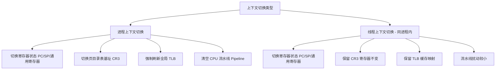

# 1.1.3.9 上下文切换成本

在现代分时多任务操作系统中，上下文切换（Context Switch）是实现多任务并发、提供硬件资源隔离和公平调度的基本手段。然而，上下文切换并非没有代价。从微观的 CPU 寄存器读写、MMU 页表切换，到宏观的 TLB 刷新、CPU 各级高速缓存冷失效、NUMA 架构下的内存亲和性丧失，每一次上下文切换都伴随着显著的直接与间接性能损耗。

本篇将从操作系统底层原理出发，层层剖析上下文切换的硬件与内核机制，探究其隐性成本，并提供量化监控与架构层面的性能优化指南。

---

## 1. 概念界定与分类：多维度的上下文切换

为了准确量化上下文切换的成本，首先必须理清在不同物理边界和触发路径下，上下文切换所涉及的具体内核对象与硬件操作。

### 1.1 进程上下文切换 vs 线程上下文切换（物理边界）

在 Linux 及大多数通用操作系统中，进程与线程在内核中都由统一的 task 描述符（如 Linux 的 `struct task_struct`）表示。然而，它们在虚拟地址空间的归属上有着本质的不同，这也决定了它们在切换时的物理边界与开销大小。



#### 1.1.1 进程的虚拟地址空间隔离与 MMU 多级页表转换
进程是操作系统分配资源（如内存、文件描述符、信号处理等）的独立单位。每个进程都拥有一个完全隔离的用户态虚拟地址空间。

在 x86-64 架构下，虚拟地址空间采用 48 位寻址（某些高配置 CPU 采用 57 位五级页表），其物理内存解析依赖于 MMU（内存管理单元）执行多级页表行走（Page Table Walk）：
1. **PGD (Page Global Directory)**：虚拟地址第 39-47 位作为索引，指向第一级页表。
2. **PUD (Page Upper Directory)**：虚拟地址第 30-38 位作为索引，指向第二级页表。
3. **PMD (Page Middle Directory)**：虚拟地址第 21-29 位作为索引，指向第三级页表。
4. **PTE (Page Table Entry)**：虚拟地址第 12-20 位作为索引，指向第四级页表项，最终获取物理页帧的基地址。
5. **物理偏移量 (Offset)**：虚拟地址第 0-11 位作为物理页内偏移。

在没有 TLB（Translation Lookaside Buffer）缓存的情况下，CPU 访问任意一个虚拟内存地址，MMU 硬件必须先发起 **5 次物理内存访问**（4次读取页表项，1次读取真正的数据）。为了定位这套多级页表的根节点，CPU 引入了控制寄存器 **`CR3`**（在 x86 架构中，也称为 PDBR - Page Directory Base Register），用于存放当前进程第一级页表（PGD）的物理基地址。

#### 1.1.2 进程级切换的物理操作：`CR3` 寄存器的改写
当发生进程上下文切换时，调度器会调用 `switch_mm()` 函数，执行以下物理操作：
1. **改写 `CR3` 寄存器**：将新进程的 PGD 物理基地址写入 `CR3` 寄存器。这一步是强特权指令，会触发 MMU 硬件电路重置。
2. **TLB 全局冲刷**：因为进程 A 的虚拟地址 `0x400000` 映射到物理页 `X`，而进程 B 的虚拟地址 `0x400000` 映射到物理页 `Y`。在不开启 PCID/ASID（详见后文）的处理器上，修改 `CR3` 会迫使 CPU **无条件清空全部用户态 TLB 缓存项**，防止进程 B 越权访问进程 A 的物理内存。
3. **流水线清空 (Pipeline Flush)**：由于虚拟地址空间发生改变，当前处于 CPU 执行管道中、已经译码或正在乱序执行的旧指令全部失效，指令预取失效，CPU 必须强制清空流水线，重新从新地址空间加载指令。

#### 1.1.3 线程级切换（同进程内）的物理开销节约
同属于一个进程的多个线程共享该进程的 `mm_struct`（虚拟内存描述符）和对应的多级页表。
因此，当调度器在同进程内的两个线程之间进行切换时：
- **无须改写 `CR3` 寄存器**：MMU 的根页表指针保持不变。
- **保留 TLB 缓存**：由于地址映射关系完全一致，TLB 缓存无需刷新。新线程在启动运行后，可以直接命中旧线程在 TLB 中遗留的地址映射项，从而避免了慢速的页表行走开销。
- **流水线扰动极小**：CPU 仅需更新程序计数器（PC）跳转到进程内的其他代码段，分支预测器和指令预取器的命中率得以部分维持。

#### 1.1.4 内核结构体 `mm_struct` 与 `active_mm` 的管理机制
Linux 内核通过 `task_struct` 统一管理所有任务，其内存相关的两个核心指针为：
- `struct mm_struct *mm`：指向该任务所拥有的用户空间虚拟内存描述符。
- `struct mm_struct *active_mm`：指向该任务当前正在使用的虚拟内存描述符。

这两者的区分是为了支持**内核线程（Kernel Threads）**的调度优化。内核线程（如 `kworker`, `ksoftirqd`）只运行在内核空间（内核空间在所有任务的页表中都是一致映射的），因此它们的 `task_struct->mm` 指针为 `NULL`。

为了避免在调度到内核线程时发生无谓的 `CR3` 切换，内核采用了 **惰性 TLB（Lazy TLB）** 优化：
- 当一个内核线程被调度运行时，内核不会修改 `CR3`，而是将该内核线程的 `active_mm` 指向**刚刚被切出的那个用户进程的 `mm_struct`**。
- **TLB 射击（TLB Shootdown）延迟处理**：在对称多处理（SMP）架构中，如果有其他 CPU 核心修改了该共享 `mm_struct` 的页表（例如释放了内存），它必须向所有正在使用该 `mm_struct` 的 CPU 核心发送进程间中断（IPI）来同步刷新 TLB。而借用了该页表的内核线程在运行期间，由于其不访问用户空间，可以暂时忽略这个 TLB 刷新请求，直到该 CPU 核心重新切回普通用户进程时再统一处理。这进一步降低了内核线程切换的开销。

以下是内核在 `context_switch` 函数中，切换内存空间的简化伪代码逻辑：

```c
/* Linux 内核核心 context_switch 函数的执行伪代码 */
static inline void
context_switch(struct rq *rq, struct task_struct *prev,
               struct task_struct *next, struct rq_flags *rf)
{
    struct mm_struct *mm, *oldmm;

    prepare_task_switch(rq, prev, next);

    mm = next->mm;
    oldmm = prev->active_mm;

    // 1. 如果新任务是内核线程 (mm == NULL)
    if (!mm) {
        // 借用前一个任务的 active_mm，避免页表切换
        next->active_mm = oldmm;
        mmgrab(oldmm); // 增加引用计数
        enter_lazy_tlb(oldmm, next);
    } else {
        // 2. 如果新任务是普通用户进程，执行真正的页表切换
        switch_mm_irqs_off(oldmm, mm, next);
    }

    // 3. 如果前一个任务是内核线程，归还其借用的 active_mm
    if (!prev->mm) {
        prev->active_mm = NULL;
        rq->prev_mm = oldmm; // 延迟到 finish_task_switch 释放引用计数
    }

    // 4. 执行寄存器和栈的物理切换
    switch_to(prev, next, prev);
    
    // 5. 切换后的善后处理
    finish_task_switch(prev);
}
```

---

### 1.2 自愿与非自愿上下文切换的内核触发路径

上下文切换在内核中的触发方式可以分为主动让出（自愿）与被动剥夺（非自愿）两种模式，它们在内核中对应的函数调用链和调度路径完全不同。

#### 1.2.1 自愿上下文切换（Voluntary Context Switch）
自愿上下文切换是指当前运行的任务在执行过程中，因为某些资源未就绪或主动同步而**主动**让出 CPU 控制权。

##### 典型触发场景
1. **同步阻塞 I/O**：调用 `read()` 或 `recv()` 时，网卡缓冲区或磁盘 Page Cache 中无数据，线程必须等待数据到达。
2. **主动休眠/延时**：调用 `nanosleep()`、`sleep()` 或 `select()`、`poll()` 等系统调用设置超时。
3. **互斥锁与同步挂起**：在多线程并发中，尝试获取一个已被占用的 `mutex`、`semaphore` 或等待条件变量（`cond_wait`）。

##### 内核触发路径与执行流
当任务因为 I/O 阻塞需要等待时，其内核态执行路径如下：
1. 线程执行系统调用，进入内核态。
2. 检测到资源未就绪，调用 `prepare_to_wait()`。
3. 将当前 `task_struct` 的状态由 `TASK_RUNNING` 改为 `TASK_INTERRUPTIBLE`（可中断睡眠）或 `TASK_UNINTERRUPTIBLE`（不可中断睡眠）。
4. 将该 `task_struct` 挂载到目标设备的等待队列（Wait Queue）中。
5. 显式调用核心调度函数 `schedule()`。
6. `schedule()` 内部调用 `__schedule(preempt = false)`。
7. 调度器从就绪队列（Runqueue）中**移除**该任务，调用 `pick_next_task()` 挑选新任务，并执行 `context_switch()`。

#### 1.2.2 非自愿上下文切换（Involuntary Context Switch）
非自愿上下文切换是指当前任务仍处于就绪状态（`TASK_RUNNING`），但由于系统调度策略或更高优先级的任务抢占，被内核**强制**剥夺 CPU 执行权。

##### 典型触发场景
1. **时间片耗尽**：在 CFS 调度器下，任务当前的虚拟运行时间超过了其应得的份额，或者在传统分时调度下物理时间片耗尽。
2. **被高优先级任务抢占**：一个先前阻塞的高优先级任务（例如处理高频网络请求的任务）被硬件中断唤醒，进入就绪队列。
3. **中断处理返回**：硬件中断处理程序执行完毕，在返回前检测到重新调度标志。

##### 内核触发路径与重新调度标志位 `TIF_NEED_RESCHED`
非自愿切换的核心是**异步标志位通知**与**抢占窗口触发**。以时钟中断为例：
1. 硬件时钟源产生 tick 中断，CPU 硬件暂停当前任务执行，跳转到时钟中断处理程序。
2. 内核调用 `scheduler_tick()` 更新当前任务的运行指标。
3. 调度类检测到当前任务运行超时，调用 `set_tsk_need_resched(curr)`，在当前任务的 `thread_info->flags` 中设置 **`TIF_NEED_RESCHED`** 标志位。
4. 中断处理程序执行完毕，准备返回。
5. **抢占窗口检查**：
   - **返回用户态时**：内核在汇编出口代码 `ret_to_user` 处检查当前任务的 `TIF_NEED_RESCHED`。如果为 1，则调用 `schedule()`。
   - **返回内核态时 (开启 `CONFIG_PREEMPT`)**：如果中断发生在内核态，且 `preempt_count`（内核抢占计数器，用于防止嵌套临界区被抢占）为 0，内核会在返回时检查该标志，并调用 `preempt_schedule_irq()` 强制触发抢占。
6. **就绪队列调整**：由于被抢占任务的状态依然是 `TASK_RUNNING`，在 `__schedule(preempt = true)` 内部，该任务**不会**被移出就绪队列，而是被放回就绪队列（CFS 红黑树）中重新参与竞争。

---

## 2. 上下文切换的核心物理步骤（直接开销）

直接开销是指 CPU 硬件和内核调度代码在执行上下文切换时，必须同步完成的指令操作。

```
[旧进程运行]
     │
     ▼
[触发系统调用/中断] ────► 保存用户态寄存器到内核栈 (pt_regs)
     │
     ▼
[内核决定调度] ───────► 调用 __switch_to_asm 切换内核栈和寄存器
     │                   ├─ 压栈 callee-saved 寄存器
     │                   ├─ 保存旧 RSP 到 prev->thread.sp
     │                   ├─ 加载新 RSP 从 next->thread.sp
     │                   └─ 出栈新寄存器
     ▼
[更新硬件状态] ───────► 更新 TSS 中的 rsp0 指针，改写 CR3 (进程切换)
     │
     ▼
[新进程恢复] ───────► 弹出用户态寄存器，返回用户态并跳转到新 PC
```

### 2.1 CPU 寄存器状态保存与恢复：Linux `switch_to` 宏与汇编执行分析

在 Linux 内核中，任务切换的核心由汇编宏 `switch_to` 驱动，最终跳转到特定架构的汇编函数 `__switch_to_asm` 中执行。

在 x86-64 架构下，为了追求极致效率，内核只在汇编中保存**被调用者保存寄存器（Callee-saved Registers）**，因为根据 C 语言函数调用约定，调用者保存寄存器（Caller-saved Registers，如 `rax`, `rcx`, `rdx` 等）在进入调度函数之前，已经被编译器自动压入栈中保存了。

以下是 Linux 内核在 x86-64 架构下执行寄存器切换的底层汇编函数 `__switch_to_asm`（简化版核心逻辑）：

```assembly
ENTRY(__switch_to_asm)
    /* 1. 将旧任务 (prev) 的被调用者保存寄存器压入其内核栈 */
    pushq   %rbp
    pushq   %rbx
    pushq   %r12
    pushq   %r13
    pushq   %r14
    pushq   %r15

    /* 2. 将当前的栈指针 (RSP) 保存到 prev->thread.sp 中 */
    /* RDI 寄存器存放 prev (task_struct 指针)，TASK_threadsp 是 sp 在结构体中的偏移 */
    movq    %rsp, TASK_threadsp(%rdi)

    /* 3. 将 CPU 的栈指针 (RSP) 切换为 next->thread.sp */
    /* RSI 寄存器存放 next (task_struct 指针)，自此 CPU 开始使用新任务的内核栈 */
    movq    TASK_threadsp(%rsi), %rsp

    /* 4. 从新任务 (next) 的内核栈中弹出并恢复被调用者保存寄存器 */
    popq    %r15
    popq    %r14
    popq    %r13
    popq    %r12
    popq    %rbx
    popq    %rbp

    /* 5. 跳转到 C 语言函数 __switch_to 进一步处理硬件状态 */
    jmp     __switch_to
ENDPROC(__switch_to_asm)
```

#### 关键汇编指令与执行流转换机制
- **`movq %rsp, TASK_threadsp(%rdi)` 与 `movq TASK_threadsp(%rsi), %rsp`**：这是栈指针的物理切换点。这两行指令执行完毕后，当前 CPU 的栈帧已经彻底变成了新任务的内核栈。
- **返回地址的妙用**：在调用 `__switch_to_asm` 时，CPU 会自动将返回地址压入旧任务的栈中。当切换到新任务的栈并恢复寄存器后，汇编代码最后的 `jmp __switch_to` 会进入 C 函数。当整个调度链执行完毕，函数执行 `ret` 指令时，CPU 会从当前新任务的栈顶弹出返回地址，这个地址恰好是新任务上一次被切出时压入的返回地址。这样，CPU 就极其自然地跳转到了新任务被打断的代码位置，实现了指令流的平滑恢复。

### 2.2 内核栈（Kernel Stack）的切换与进程描述符（task_struct）的更新

每个线程在内核态运行时，都拥有一块固定大小（在 64 位 Linux 上通常为 16KB，且页对齐）的**内核栈**。

#### 2.2.1 内核栈的内存布局
在内核栈的顶部（高地址处），存放着 `struct pt_regs` 结构体，用于保存用户态线程被打断时的寄存器状态（如用户态的 `RSP`、`RIP`、通用寄存器等）。栈的剩余部分用于内核态函数的局部变量、调用链及中断嵌套。

#### 2.2.2 硬件任务状态段（TSS）的 rsp0 更新
在 x86-64 架构中，当 CPU 从用户态（Ring 3）因为系统调用或中断陷入内核态（Ring 0）时，硬件必须自动加载一个可信的内核栈指针。
这个指针存储在 CPU 的 **TSS（Task State Segment, 任务状态段）** 的 `rsp0` 字段中。因此，在 C 语言函数 `__switch_to` 内部，内核必须执行以下指令更新 TSS：

```c
this_cpu_write(cpu_tss_rw.x86_tss.sp0, next->thread.sp0);
```

这一步非常关键，若不更新，当新进程返回用户态后再次陷入内核时，CPU 硬件将会把数据写入旧进程的内核栈，导致系统崩溃或严重的内存覆写漏洞。

#### 2.2.3 FPU/AVX 的扩展状态切换
在 x86-64 架构下，浮点寄存器、MMX、SSE 寄存器（`XMM0`-`XMM15`）以及 AVX 寄存器（`YMM0`-`YMM15`，位宽为 256 位）等寄存器的状态统称为“扩展状态（Extended State）”。
由于这些寄存器的状态极为庞大，如果每次上下文切换都无条件使用 `XSAVE` 将这几千字节的数据写入内存，并用 `XRSTOR` 从内存读回，会对内存带宽和 CPU 内部状态机造成重大负担。

Linux 内核对此进行了优化：
- 内核使用 **Eager FPU Switching（主动 FPU 切换）** 策略，但会通过 `XSTATE` 特征掩码进行按需操作。
- 内核会维护一个 `fpregs_owner` 指针，只有当当前 CPU 核心上的 FPU 属主发生改变，或者检测到用户态线程真正使用了扩展寄存器时，才执行硬件寄存器的打包保存与载入。若任务在运行期间从未执行浮点或向量运算，此步骤会被直接跳过。

#### 2.2.4 线程局部存储（TLS）的更新
对于支持线程级局部变量（TLS）的程序，内核必须在 `__switch_to` 期间更新段寄存器基地址：
- 通过修改 MSR（Model Specific Registers）寄存器（如 `MSR_FS_BASE` 或 `MSR_GS_BASE`），将当前 CPU 核心指向新线程的 TLS 物理基地址。由于写入 MSR 需要触发 CPU 内部的微代码执行，这通常需要消耗数十个时钟周期。

### 2.3 页目录表（CR3）切换与虚拟内存管理控制

对于进程上下文切换，除了内核栈和通用寄存器的切换外，还必须调用 `switch_mm_irqs_off()`，其底层核心操作是将新进程的页全局目录（PGD）的物理地址写入控制寄存器 `CR3`：

```c
write_cr3(__pa(next->pgd));
```

#### 物理影响与微架构成本
- **MMU 译码暂停**：写入 `CR3` 会立即使 MMU 中旧进程的页表指针作废。MMU 必须准备重新从物理内存读取新进程的页表结构。
- **流水线强制清空**：由于地址空间的彻底变化，乱序执行引擎（Out-of-Order Engine）和分支预测单元中所有基于旧虚拟地址空间运行的在途指令全部被废弃，引发流水线清空（Pipeline Flush）。CPU 必须经历若干个时钟周期的停顿，等待指令重新填充。

---

## 3. 硬件间接级开销（隐性性能杀手）

直接开销（寄存器保存与栈切换）仅仅是上下文切换冰山的一角。在现代深流水线、高速缓存多层次的 CPU 架构下，真正拖慢系统整体吞吐量的，是上下文切换带来的**硬件间接开销**。

```
[发生上下文切换]
       │
       ├─► 1. TLB 刷新 ───► 页表行走 (Page Table Walk) ───► 增加 50ns - 100ns 访存延迟
       │
       ├─► 2. L1/L2 Cache 污染 ───► Cache Miss ───► 穿透到 DRAM ───► 延迟暴增 50 倍以上
       │
       ├─► 3. 跨 NUMA 调度 ───► UPI/QPI 总线通信 ───► Cache 一致性风暴 与 远端内存访问延迟
       │
       └─► 4. 调度器损耗 ───► CFS 红黑树平衡计算 ───► 占用大量指令周期
```

### 3.1 TLB (Translation Lookaside Buffer) 颠簸与局部失效

#### 3.1.1 为什么进程切换会导致 TLB 刷新
虚拟地址到物理地址的翻译是一项高成本操作。为了加速这一过程，CPU 内部集成了 **TLB（旁路转换缓冲）**，它是一块高速的 SRAM 缓存，存储了最近被翻译的虚拟页号（VPN）到物理页帧号（PFN）的映射。
- 当 TLB 命中（Hit）时，地址翻译可在不到 **1 个时钟周期** 内完成。
- 当 TLB 未命中（Miss）时，MMU 必须从物理内存中读取四级或五级页表，产生 **Page Table Walk**，延迟可能高达 **50ns 至 100ns**。

在不支持多进程标识的 CPU 上，每次切换进程，由于页表改变，内核必须将 `CR3` 重新写入，这会清空 TLB 中所有的用户态缓存项。新进程在被调度后的初期，其所有指令提取和内存数据访问都会面临严重的 **TLB Miss**，被迫进行频繁的页表行走，使 CPU 运行速度骤减。

#### 3.1.2 现代 CPU 的 PCID（x86）与 ASID（ARM）机制

为了消除“进程切换必刷 TLB”的昂贵代价，芯片厂商在硬件层面引入了地址空间标识技术。
- **Intel x86 架构：PCID (Process Context Identifiers)**
  于 Westmere 架构引入，PCID 占用 `CR3` 寄存器的低 12 位（可以标识最多 4096 个不同的地址空间）。其启用需要控制寄存器 `CR4.PCIDE` 位置 1。
- **ARM 架构：ASID (Address Space Identifier)**
  在 ARM 架构中，系统通过页表基址寄存器（TTBR0/TTBR1）的特定控制字段存储 8 位或 16 位的 ASID，作用与 PCID 相同。

##### 物理运行机制
启用 PCID/ASID 后，TLB 缓存项的数据结构进行了扩展，每一条转换记录除了保存“虚拟页 -> 物理页”映射外，还额外带有一个当前进程的标识符标签（PCID/ASID Tag）：

```
+------------------+------------------+------------+----------------+
|  虚拟页号 (VPN)  |  物理页帧号 (PFN)  |  属性 (RW)  |  PCID / ASID  |
+------------------+------------------+------------+----------------+
|    0x00004000    |    0x000abc00    |  User / RO |  1 (进程 A)    |
|    0x00004000    |    0x000def00    |  User / RW |  2 (进程 B)    |
+------------------+------------------+------------+----------------+
```

当进程 B 被调度运行，内核将进程 B 的 PGD 物理地址写入 `CR3` 寄存器时，如果将 `CR3` 的第 63 位（`NOFLUSH` 位）置为 1，CPU 就会被告知：**不要刷新当前 PCID 以外的 TLB 缓存项**。
当进程 B 访问 `0x00004000` 时，MMU 在检索 TLB 时，不仅匹配虚拟地址，还会比对当前 `CR3` 中的 PCID（值为 2）。由于匹配了第二行记录，MMU 直接获取物理页 `0x0000def00`。
当进程 A 下一次被调度回来，且其对应的 PCID 为 1 的缓存项尚未被 LRU（最近最少使用）算法淘汰时，进程 A 可以直接恢复对这些 TLB 记录的命中。这一机制极大地降低了进程级上下文切换后的冷启动地址翻译开销。

##### PCID 的管理与回绕（Wrap-around）机制
在 Intel 处理器上，PCID 是 12 位的，最多只能表示 4096 个不同的地址空间。然而，一个繁忙的操作系统可能运行着数万个进程，或者同一个进程会在不同的 CPU 核心之间迁移。

Linux 内核采用了一种 **Per-CPU 的 PCID 缓存机制** 来处理这一限制：
- 每个 CPU 核心独立管理其 4096 个 PCID 空间。
- 内核为每个 CPU 核心维护一个 `cpu_tlbstate` 结构体，其中包含一个 `pcid_next` 计数器。
- 当一个进程被调度到该 CPU 核心时，内核会检查该进程在此核心上是否已有缓存的 PCID。如果有，且没有发生页表修改，则复用此 PCID，并将 `CR3` 寄存器的第 63 位（`NOFLUSH`）置为 1。
- 如果该 CPU 的 PCID 已用尽（即 `pcid_next` 达到 4096），则会发生“回绕（Wrap-around）”。内核会触发 PCID 回收机制，此时会使用 `invpcid` 硬件指令来清空特定 PCID 标签的 TLB，重新分配标识符，以此保证地址映射的正确性。

---

### 3.2 CPU Cache（L1/L2/L3）冷失效与总线等待延迟

现代 CPU 的运行速度（~3.5GHz，时钟周期 ~0.3ns）远快于内存（DRAM，延迟 ~60ns）。为了防止 CPU 长期处于饥饿状态，系统引入了三级 Cache 架构。

当一个线程在某个 CPU 核心上持续运行时，它会不断访问自己的指令和数据，这些指令和数据将被逐渐加载到离 CPU 核心最近的 L1d（数据缓存）、L1i（指令缓存）和 L2 缓存中。这部分最近频繁访问的内存集合被称为该线程的**工作集（Working Set）**。

当发生上下文切换，线程 A 被切出，线程 B 开始运行时：
1. **工作集淘汰**：由于 L1/L2 缓存容量非常有限（L1 缓存通常只有 32KB 到 64KB），线程 B 的运行会迫使 CPU 淘汰线程 A 留下的缓存数据，将线程 B 的数据强行加载进来。
2. **Cache 冷失效（Cache Cold Miss）**：在线程 B 运行的初期，其绝大部分数据和指令都不在 L1/L2 缓存中。这会导致大量的 **L1/L2 Cache Miss**。
3. **穿透到 DRAM 的物理开销**：当 L1/L2 未命中，甚至 L3 缓存也未命中时，CPU 必须通过内存总线向主存（DRAM）发起数据请求。

下表直观展示了从 CPU 寄存器到主存的访问延迟差异，以及发生 Cache Miss 时的吞吐量惩罚：

| 存储介质 | 典型物理延迟 | 消耗 CPU 时钟周期 (3.5GHz) | 性能相对比值 | 发生 Miss 时的惩罚 |
| :--- | :--- | :--- | :--- | :--- |
| **CPU 寄存器** | < 0.1 ns | 0 cycle | 1 | 无 |
| **L1 Cache (d/i)** | ~1.5 ns | 4 ~ 5 cycles | ~4x | 极低 |
| **L2 Cache** | ~4.0 ns | 12 ~ 14 cycles | ~12x | 中等 |
| **L3 Cache (Shared)** | ~15.0 ns | 30 ~ 60 cycles | ~50x | 较高 |
| **系统主存 (DRAM)** | **~60.0 ns** | **150 ~ 250 cycles** | **~200x** | **严重时钟周期空转 (Stall)** |

由上表可见，如果上下文切换导致新线程不得不直接从 DRAM 中重新读取工作集，其每次访存的耗时将是访问 L1 缓存的 **50 倍以上**。在此期间，CPU 的执行流水线由于缺乏数据，只能被迫插入大量的“气泡（Bubbles）”或空转周期，导致实际每周期执行指令数（IPC）断崖式下跌。

#### 3.2.1 组联相缓存（Set-Associative Cache）中的 Conflict Miss
现代 CPU 缓存普遍采用**组联相**结构（如 8 路组联相）。每个物理内存地址会通过其特定的索引位（Index Bits）映射到 Cache 中的某一个特定的组（Set）。
- 在上下文切换后，若线程 B 频繁访问的局部变量与线程 A 留下的某些活跃内存恰好映射到了相同的 Cache Set 中，即使此时其他 Cache Set 完全是空闲的，这 8 个槽位也会被迅速占满。
- 后续的数据读写将迫使 Cache 执行替换策略（如 Pseudo-LRU），把热数据淘汰掉，产生大量的 **冲突失效（Conflict Miss）**。

#### 3.2.2 Cache 一致性协议（MESI）交互延迟
在多核处理器上，当线程被调度到新的 CPU 核心运行时，它之前在旧 CPU 核心 Cache 中修改过的数据（处于 Modified 状态的 Cache Line），必须通过硬件总线同步到新 CPU 核心的 Cache 中。这会导致旧核心的 Cache Line 状态变为 Invalid，新核心的 Cache Line 状态变为 Shared 或 Exclusive。
这个同步过程被称为 **Cache Line 迁移**，需要跨核心的硬件通信，其时延比本地 L1 缓存访问高出两个数量级。

---

### 3.3 调度器本身（CFS 的红黑树查找与计算）占用的 CPU 时钟周期

Linux 最核心的调度器是 **CFS（Completely Fair Scheduler，完全公平调度器）**。每次发生上下文切换，CFS 调度器本身的代码都需要在 CPU 上运行，这构成了一部分不可忽略的算法损耗。

#### 3.3.1 虚拟运行时间 `vruntime` 计算
CFS 调度器为了保证绝对的公平，为每个任务维护了一个虚拟运行时间 `vruntime`。每次时钟中断或任务主动让出 CPU 时，内核都会调用 `update_curr()` 函数：

$$\Delta vruntime = \Delta exec\_time \times \frac{NICE\_0\_LOAD}{weight}$$

其中，`weight` 是根据任务的 `nice` 值计算出来的权重值。这一计算过程涉及一次 64 位的乘法和一次 64 位的除法。在缺乏高速硬件除法器的 CPU 上，这一计算将白白消耗数十个时钟周期。

#### 3.3.2 红黑树（`rb_node`）维护与平衡开销
CFS 使用一棵红黑树（基于 `struct rb_node` 结构体）来组织所有处于 `TASK_RUNNING` 状态的就绪任务，并以 `vruntime` 作为排序键值。
- **任务检索**：调度器通过缓存的最左侧节点（`rb_leftmost`）以 $O(1)$ 的复杂度挑选下一个要执行的任务，并将其从红黑树中**删除**。
- **任务放回**：被切出的任务如果仍处于就绪状态，或者有新任务被唤醒，调度器必须将其**重新插入**红黑树中，其时间复杂度为 $O(\log N)$（$N$ 为就绪队列中的任务总数）。
- **旋转与着色（Rotations & Coloring）**：为了维持红黑树的平衡性，插入或删除操作往往会触发节点着色和树旋转。在多核大并发的场景下，就绪队列中可能有数百个线程，频繁的红黑树遍历不仅带来昂贵的指针跳转，还会破坏 CPU 自身的 L1d 缓存。

---

### 3.4 NUMA 架构下线程跨节点调度导致的内存亲和性丧失

现代高性能服务器普遍采用 **NUMA（Non-Uniform Memory Access，非一致性内存访问）** 硬件架构。

```
+-----------------------------------+         +-----------------------------------+
|            NUMA Node 0            |         |            NUMA Node 1            |
|  +--------------+  +-----------+  |         |  +--------------+  +-----------+  |
|  | CPU Cores    |  | Local Memory| |  QPI/UPI|  | CPU Cores    |  | Local Memory| |
|  | (Core 0 - 7) |  | (Node 0)  |  |◄───────►|  | (Core 8-15)  |  | (Node 1)  |  |
|  +--------------+  +-----------+  |   总线  |  +--------------+  +-----------+  |
+-----------------------------------+         +-----------------------------------+
        ▲                                                     ▲
        └───────────────── 线程从 Node 0 调度到 Node 1 ─────────┘
                           访问 Node 0 的数据变成“远端访问” (延迟增加 2-3 倍)
```

#### 3.4.1 NUMA 架构的本质与访存时延
在 NUMA 架构中，系统被划分为多个物理 Node，每个 Node 拥有独立的 CPU 核心、内存插槽和内存控制器。
- 当 CPU 核心访问连接在其本地 Socket 上的内存（**Local Memory**）时，物理延迟最低（约 50-60ns）。
- 当 CPU 核心需要通过片间互联总线（如 Intel 的 UPI/QPI，或 AMD 的 Infinity Fabric）访问另一个 Node 上的内存（**Remote Memory**）时，称为远端访问。其延迟通常是本地访问的 **1.5 到 3 倍**。

#### 3.4.2 跨节点调度的缓存一致性风暴
如果操作系统的调度器在执行负载均衡（Load Balancing）时，将一个原本运行在 Node 0 上的线程调度到了 Node 1 的 CPU 核心上运行，就会产生严重的隐性开销：
1. **内存亲和性丧失**：该线程的代码段、堆栈和之前分配的全部内存依然存放在 Node 0 的物理内存条上。当线程在 Node 1 上运行并尝试读写这些数据时，MMU 的每一次物理访存都变成了跨节点访问，延迟剧增。
2. **片间互联总线拥堵**：大量的跨节点内存访问会迅速占满片间互联总线（UPI/QPI）的带宽，导致总线排队延迟上升，拖慢整台服务器上其他无关进程的访存效率。
3. **缓存一致性同步**：由于数据在 Node 0 的 Cache 中可能处于修改状态（Modified），Node 1 核心发起读写时，必须通过硬件一致性协议（如 MESI）向 Node 0 发起无效化（Invalidate）或写回（Write-back）指令。这种跨 Socket 的 Cache 一致性同步会消耗宝贵的硬件带宽，并带来巨大的时序停顿。

---

## 4. 监控测量与性能优化指南

排查与调优系统上下文切换瓶颈的第一步，是建立精准的观测手段，并从应用设计、并发模型和系统内核参数三个层层面进行控制。

### 4.1 `/proc/[pid]/status` 字段分析

在 Linux 系统中，每个进程的实时调度状态都被记录在 `/proc/[pid]/status` 文件中。通过以下命令可以提取与上下文切换相关的两个核心指标：

```bash
$ cat /proc/12345/status | grep ctxt
voluntary_ctxt_switches:    148201
nonvoluntary_ctxt_switches: 3201
```

- **`voluntary_ctxt_switches` (自愿上下文切换次数)**：
  代表该进程由于发起同步阻塞 I/O、获取锁失败、主动调用 `sleep` 等原因，**主动让出** CPU 控制权而发生的上下文切换累计次数。
- **`nonvoluntary_ctxt_switches` (非自愿上下文切换次数)**：
  代表该进程由于时间片耗尽、被高优先级进程抢占或者硬件中断重新调度，被内核**强制剥夺** CPU 控制权而发生的切换累计次数。

#### 指标对比与诊断逻辑
- 如果 **自愿上下文切换 >> 非自愿上下文切换**：说明该进程的瓶颈在于外部资源等待。例如，线程高频发起数据库查询、调用阻塞 RPC，或者由于锁粒度过大导致严重的互斥锁争用。此时应优化锁设计或引入异步非阻塞模型。
- 如果 **非自愿上下文切换 >> 自愿上下文切换**：说明该进程正在进行高负荷的计算，且系统中运行的活跃线程数远远超出了物理 CPU 核心数，导致大量的线程在就绪队列中频繁发生时间片争抢。此时应减少线程池的容量或优化算法本身。

#### 4.1.1 细粒度调度分析文件 `/proc/[pid]/sched`
除了 `status` 文件之外，还可以查看 `/proc/[pid]/sched` 来获取该进程更细粒度的性能指标：
- `se.sum_exec_runtime`：进程累计在 CPU 上运行的物理时间（毫秒）。
- `se.wait_max`：进程在就绪队列中等待被调度的最大单次等待时间（毫秒）。
- `nr_switches`：总上下文切换次数。
- `nr_voluntary_switches` 和 `nr_involuntary_switches` 的实时增量数据。

---

### 4.2 实战观测工具 `vmstat`、`pidstat -w` 指标分析

#### 4.2.1 `vmstat` 全局趋势分析
`vmstat` 是分析全系统上下文切换大盘趋势的首选工具：

```bash
$ vmstat 1
procs -----------memory---------- ---swap-- -----io---- -system-- ------cpu-----
 r  b   swpd   free   buff  cache   si   so    bi    bo   in   cs us sy id wa st
 2  0      0 8201424 120402 12840924   0    0     1    24    4  121  3  1 96  0  0
 8  0      0 8201312 120402 12840924   0    0     0     0 4102 15421 12  8 80  0  0
```

- **`cs` (Context Switch)**：表示**全系统每秒发生的上下文切换总次数**。对于一台高性能服务器，单核平均每秒 `cs` 超过 10,000 次通常被认为处于较高水平。
- **`in` (Interrupt)**：表示全系统每秒发生的中断次数。高频的硬件中断（如网卡中断）往往会伴随大量的非自愿上下文切换。
- **`sy` (System CPU Time)**：如果 `cs` 极高（如数十万），并且伴随着 `sy` 占比上升（如 > 20%），说明 CPU 正在耗费大量的算力在调度器本身和上下文切换逻辑上，真正留给业务（`us`）的算力被严重稀释。

#### 4.2.2 `pidstat -w` 细粒度进程监控
为了找出究竟是哪一个进程触发了切换风暴，可以使用 `pidstat -w` 进行实时追踪：

```bash
$ pidstat -w -p 12345 1
12:25:01      UID       PID   cswch/s nclcswch/s  Command
12:25:02     1000     12345   8450.00      42.00  api-gateway
```

- **`cswch/s`**：进程每秒发生的自愿上下文切换次数。
- **`nclcswch/s`**：进程每秒发生的非自愿上下文切换次数。

#### 4.2.3 利用 `perf` 定位调度热点
在 Linux 系统上，可以使用内核自带的 `perf` 工具链对上下文切换进行深入剖析：
1. **记录调度事件**：
   ```bash
   $ perf record -e sched:sched_switch -a -- sleep 5
   ```
2. **分析调度延迟与调用栈**：
   ```bash
   $ perf report
   ```
   这能让我们清晰看到是哪一部分内核函数（例如等待某个锁、文件读取等）频繁唤醒了 `sched_switch` 事件，并找出具体的代码路径。

---

### 4.3 高频上下文切换的系统调优手段

面对上下文切换带来的性能损耗，我们可以从**线程池规格化**、**锁机制改造**以及**用户态并发模型**三个层面对系统进行深度重塑。

#### 4.3.1 线程池饱和度控制与最优线程数数学模型

在并发编程中，无节制地创建线程是导致非自愿上下文切换风暴的最主要原因。

##### 4.3.1.1 利特尔法则（Little's Law）的并发启示
利特尔法则是排队论的基础，公式为：

$$L = \lambda \times W$$

- $L$：系统内平均并行的请求数量。
- $\lambda$：系统的请求到达率（即吞吐量）。
- $W$：单个请求的平均响应时间。

如果我们在系统中创建了远超 CPU 承受能力的线程数（$N \gg L_{limit}$），根据该法则，这并不能提高吞吐量 $\lambda$。因为超出硬件处理极限后，每个线程的分时调度开销会急剧膨胀，导致单个请求的响应时间 $W$ 大幅恶化，最终导致整体系统的可用性彻底崩溃。

##### 4.3.1.2 最优线程数计算公式
为了最大化利用 CPU，同时将上下文切换降到最低，我们可以使用以下推导模型：

设：
- $N_{cpu}$：物理 CPU 核心数。
- $U_{cpu}$：期望的目标 CPU 使用率（如 $80\%$，即 $0.8$）。
- $W$：单个任务在执行期间处于**等待/阻塞**状态的时间（如等待 I/O、锁、网络）。
- $C$：单个任务在执行期间占用 **CPU 计算** 的时间。

单个任务在整个执行周期中，占用 CPU 的时间比例为：
$$\text{CPU 占比} = \frac{C}{W + C}$$

为了让 $N_{cpu}$ 个 CPU 核心以 $U_{cpu}$ 的目标使用率运行，系统所需的最佳线程数 $N$ 应当满足：
$$N \times \frac{C}{W + C} = N_{cpu} \times U_{cpu}$$

经过代数变形，可以推导出**最优线程数计算公式**：
$$N = N_{cpu} \times U_{cpu} \times \left(1 + \frac{W}{C}\right)$$

##### 典型实例推演
1. **纯 CPU 密集型任务**（如图像渲染、密码哈希计算）：
   因为这类任务几乎不产生任何阻塞等待，所以 $W \approx 0$。带入公式得：
   $$N = N_{cpu} \times U_{cpu}$$
   若希望 CPU 满载（$U_{cpu} = 1.0$），则 $N = N_{cpu}$。为了防止线程由于偶发的中断或缺页陷入阻塞而使 CPU 空闲，实践中通常设置为 $N_{cpu} + 1$。如果将其设为 $4 \times N_{cpu}$，多出来的线程将在同一个核心上进行剧烈抢占，带来大量的非自愿上下文切换，降低运算速度。
2. **典型 I/O 密集型任务**（如 Web 数据库查询接口）：
   假设一个 HTTP 请求 the average 耗时为 50ms。在这 50ms 中，有 45ms 都在等待数据库和 Redis 的网络返回（$W = 45ms$），仅有 5ms 用于 JSON 序列化和业务逻辑计算（$C = 5ms$）。
   在 16 核服务器（期望 CPU 使用率为 80%）上，最优线程数计算如下：
   $$N = 16 \times 0.8 \times \left(1 + \frac{45}{5}\right) = 12.8 \times 10 = 128 \text{ 个线程}$$
   若将线程池大小盲目配置为 1000，会导致大量的线程在等待数据返回后同时被唤醒，进而为了抢占 16 个核心发生严重的上下文切换冲突，大部分 CPU 时钟周期将被白白浪费。

---

#### 4.3.2 锁机制的演进与无锁化设计

多线程共享数据时，锁竞争是导致自愿上下文切换的最主要原因。

##### 4.3.2.1 锁的获取开销分级
- **悲观锁（如 Linux Mutex）**：若锁被占用，线程调用系统调用挂起，释放 CPU，引发一次自愿上下文切换。当锁释放时被重新唤醒，再次发生切换。一次完整的锁竞争通常带来**两次上下文切换**。如果临界区执行极快，上下文切换开销将远超业务本身的开销。
- **自旋锁（Spinlock）**：若锁被占用，线程在 CPU 上进行忙等待（Busy-wait）直到锁释放。它**零上下文切换**，但会占满一个 CPU 核心。只适用于临界区执行时间极短的场景。
- **乐观锁（CAS, Compare-And-Swap）**：利用硬件原子指令（如 x86 的 `LOCK CMPXCHG`）直接在用户态尝试更新。无上下文切换开销，但在高竞争下会导致 CPU 的 Cache Line 频繁失效（Cache 一致性风暴），使自旋重试产生大量的无效计算。

##### 4.3.2.2 Linux Mutex 的“三阶段自旋-睡眠机制”与 Futex 机制
在传统的操作系统中，如果获取锁失败，线程必须立即发起系统调用陷入内核并挂起。为了减少这种频繁陷入的代价，Linux 引入了 **Futex（Fast Userspace Mutex，快速用户态互斥锁）** 机制。

结合 Futex，现代 Linux `mutex` 在获取锁时采用三阶段策略：
1. **第一阶段：Fastpath（快速通道）**：通过原子的 CAS 操作尝试直接在用户态获取锁。若成功，**零上下文切换，零内核陷入**。
2. **第二阶段：Optimistic Spinning（乐观自旋）**：若 Fastpath 失败，如果锁的持有者当前正在另一个 CPU 核心上运行，当前线程不会立即挂起，而是自旋等待（因为持有者很可能会在极短时间内释放锁）。这有效消除了因短暂锁竞争而付出的上下文切换代价。
3. **第三阶段：Slowpath（休眠挂起）**：若持有者已挂起，或自旋超时，线程通过 `futex` 系统调用陷入内核，将自己加入等待队列并挂起，触发**自愿上下文切换**。

##### 4.3.2.3 无锁队列（Ring Buffer）实现高吞吐量
在高性能通信（如日志收集、消息队列、高频交易系统）中，常采用**环形无锁队列（Ring Buffer）**来替代传统的互斥锁队列。
其核心原理是利用**单生产者-单消费者（SPSC）**或基于 CAS 的多生产者-多消费者模型。数据结构预先分配好固定大小的数组，通过维护 `head` 和 `tail` 两个原子指针来指示读写位置。
生产者与消费者之间通过内存屏障（Memory Barrier）和 CPU 缓存失效机制进行协同，避免了内核级 Mutex 的引入，从而将上下文切换的次数彻底降为零，使性能达到硬件极限。

---

#### 4.3.3 协程模型（M:N）在解决切换成本上的数学与物理原理

在高并发网络编程中，为了在不增加上下文切换成本的前提下支撑海量并发，**用户态协程模型（M:N 协程）** 应运而生（如 Go 语言中的 Goroutine，Rust 中的 Async-Await 运行时，Java 21 的 Virtual Threads）。

```
[用户态协程 (Goroutines/Fibers)]
   g1   g2   g3   g4   g5   g6
   ├───┼───┼───┼───┼───┤ (由用户态调度器控制切换)
         ▼           ▼
   [内核态线程 (OS Threads)]
         M1          M2
         └───┬───────┘   (由操作系统的 CFS 调度器控制)
             ▼
        [物理 CPU 核心]
```

##### 4.3.3.1 物理与数学层面的优化对比
协程之所以能够将上下文切换成本降到极致，是因为它在硬件和内存管理上做出了彻底的“减法”：

| 对比维度 | 内核线程（OS Thread） | 用户态协程（Goroutine） | 物理与数学原理 |
| :--- | :--- | :--- | :--- |
| **执行特权级** | 内核态（Ring 0） | 用户态（Ring 3） | **消除特权级转换**：线程切换需要通过软中断或系统调用陷入内核态，而协程切换完全在用户态内存中完成，无须执行昂贵的特权级转换指令（如 `sysenter` / `syscall`）。 |
| **寄存器保存量** | 保存全套硬件上下文（30+ 寄存器，包括 FPU/SSE/AVX 状态） | 保存极简上下文（约 10~14 个通用寄存器） | **寄存器裁剪**：协程切换是由编译器在已知控制流的特定“安全点”（Safepoint）显式插入的。编译器知道此时不需要保存浮点和向量寄存器，只需保存程序计数器（PC）、栈指针（SP）以及几个必要的通用寄存器即可。 |
| **内存页表切换** | 进程间切换必须修改 `CR3` 并全局刷新 TLB | 永远不需要 | **共享页表**：所有的协程都在同一个用户进程的虚拟地址空间内运行，切换时零页表切换开销，TLB 缓存 100% 得到保留。 |
| **初始栈大小** | 固定分配（通常为 8KB/16KB 的内核栈，8MB 用户栈） | 动态伸缩（初始仅 2KB） | **极大提升 Cache 亲和性**：由于协程栈极小，数万个协程的栈可以被轻松放进 CPU 的 L3 甚至 L2 高速缓存中。这使得协程切换时的内存访问编排绝大部分都在 Cache 内完成，彻底避免了由于内存数据拷贝导致的 Cache 冷失效。 |
| **切换耗时** | 1,000 ~ 3,000 纳秒（1 ~ 3 微秒） | 10 ~ 100 纳秒 | **量级差异**：协程切换速度比内核线程快 **10 到 100 倍**。 |

##### 4.3.3.2 有栈协程（Stackful） vs 无栈协程（Stackless）
现代语言在实现协程时有两种主流的技术路线：
1. **有栈协程（如 Go 语言 Goroutine, Java Virtual Threads）**：
   每个协程拥有自己独立的用户态栈空间。当协程挂起时，调度器将其当前的 CPU 寄存器压入自身的栈中。这种设计允许协程在任意深度的嵌套函数调用中随时挂起，对开发者极其友好，但切换时依然需要移动 SP 栈指针。
2. **无栈协程（如 C++20 Coroutines, Rust Async/Await, JavaScript Async）**：
   协程在编译期被编译器重构为一个**基于状态机的类/结构体**。所有跨越挂起点的局部变量和状态被存储在这个状态机（或称为 Coroutine Frame，存储在堆上）中。
   - 当协程挂起时，它仅仅是改变状态值并直接执行 `return`，**没有任何栈指针的切换**。
   - 这使得无栈协程的切换开销甚至低于有栈协程，几乎等同于一次普通的虚函数调用（Virtual Function Call）。

##### 4.3.3.3 Go 语言协程切换的汇编剖析
在 Go 运行时中，协程的调度上下文被存储在 `g.sched` 结构体（`gobuf`）中：

```go
type gobuf struct {
    sp   uintptr   // 栈指针
    pc   uintptr   // 程序计数器
    g    guintptr  // 指向当前协程 g 结构体的指针
    bp   uintptr   // 基址指针
    ...
}
```

当 Go 调度器决定将当前协程 `gp` 切换到下一个协程 `newg` 时，会在用户态调用汇编函数 `gogo`。以下是其在 x86-64 架构下的物理切换细节：

```assembly
// void gogo(gobuf *buf)
// RDI 寄存器中存储了要恢复的 gobuf 结构体的物理地址
TEXT runtime·gogo(SB), NOSPLIT, $0-8
    MOVQ    8(DI), BX       // 将 gobuf.g 加载到 BX 寄存器
    MOVQ    0(DI), SP       // 将 gobuf.sp 写入 CPU 的 SP 寄存器 (切换用户栈)
    MOVQ    16(DI), BP      // 恢复基址指针 BP
    MOVQ    24(DI), DX      // 恢复 ctxt
    MOVQ    32(DI), AX      // 恢复 ret
    MOVQ    $0, 8(DI)       // 清空结构体中已使用的指针防止垃圾回收内存泄漏
    MOVQ    $0, 16(DI)
    MOVQ    $0, 24(DI)
    MOVQ    $0, 32(DI)
    MOVQ    gobuf_pc(DI), BX // 将 gobuf.pc (保存的程序计数器) 加载到 BX
    JMP     BX              // 跳转到新协程的代码处执行
```

由上述汇编指令可见，整个切换过程仅仅涉及了 8 行左右的寄存器读取和赋值操作，没有触发任何内核态转换、中断，也没有触及任何特权寄存器。这就是协程能够维持极低上下文切换开销的物理本质。

---

## 5. 总结与性能优化 Checklist

上下文切换是分时操作系统多任务的基础，但其带来的直接开销与硬件间接开销是高并发系统设计中必须直面的性能杀手。

为了帮助开发者和系统架构师系统性地优化上下文切换，以下提供一份实践 Checklist：

- [ ] **线程池规格化**：坚决避免“一个连接一个线程”的设计。对于 I/O 密集型应用，利用最优线程数公式 $N = N_{cpu} \times U_{cpu} \times (1 + \frac{W}{C})$ 合理评估线程池最大容量，防止线程池过载导致非自愿上下文切换暴涨。
- [ ] **减少锁争用**：
  - 尽量缩短临界区（Critical Section）的执行时间。
  - 在可能的情况下，采用读写锁（Shared-Exclusive Lock）代替互斥锁。
  - 对于极其高频的数据交换，考虑使用基于环形缓冲区（Ring Buffer）的无锁队列。
- [ ] **启用 NUMA 亲和性**：
  - 在多路服务器上，使用 `numactl --cpunodebind=0 --localalloc` 等命令将关键进程绑定到特定的 NUMA 节点，避免跨 Socket 的 CPU 调度。
  - 在编写高性能 C/C++ 代码时，利用 `pthread_setaffinity_np` 绑定线程与 CPU 核心的亲和性（CPU Affinity）。
- [ ] **平滑利用 PCID/ASID**：
  - 确保操作系统内核开启了 PCID 支持（现代 Linux 默认在支持的 Intel 处理器上启用）。可以通过 `cat /proc/cpuinfo | grep pcid` 检查 CPU 是否支持。
- [ ] **拥抱异步与协程**：
  - 在面对万级以上高并发连接时，优先采用事件驱动（Event-Driven）的异步非阻塞网络模型（如基于 epoll 的事件循环）。
  - 在语言层面上，积极转向内置用户态协程调度（如 Go, Rust Async）的开发模式，将内核态的上下文切换转变为极轻量级的用户态状态转移。

通过深入理解上下文切换背后的硬件与软件协同机制，我们不仅能编写出更高效的并发代码，也能在复杂的生产系统调优中迅速定位瓶颈，实现硬件算力的最大化释放。

