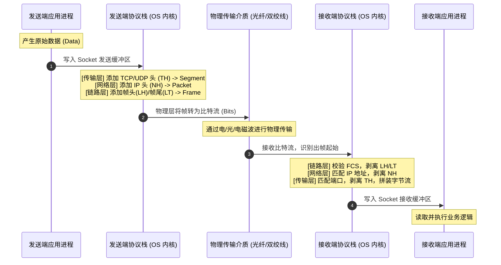

# 1.2.1.1 网络七层协议

网络通信是一个极其庞杂的系统工程，涉及电信号的发送、物理介质的差异、物理地址的识别、路由寻址、进程间通信、数据的格式转换以及应用程序的业务逻辑。为了在全球范围内建立统一的通信标准，国际标准化组织（ISO）于 20 世纪 70 年代末提出了开放系统互连参考模型（Open Systems Interconnection Reference Model，简称 OSI 模型）。

本篇将从分层设计哲学、数据封装与解封装的物理流转出发，逐层深度剖析 OSI 七层模型的职责与其核心协议的底层原理，并探讨 OSI 模型的局限性以及 TCP/IP 模型的崛起。

---

## 一、 核心设计哲学与数据流机制

### 1.1 为什么要网络分层？
在软件工程中，面对极其复杂的系统，最核心的治理手段是**控制复杂性（Complexity Control）**与**关注点分离（Separation of Concerns）**。网络协议栈的设计正是这一软件工程思想的终极体现。

如果网络协议不采用分层架构，而设计成一个单体结构，那么任何一个网络应用的开发者在编写业务逻辑的同时，都必须处理从双绞线电平跳变、光纤色散抵消，到 MAC 地址寻址、路由表计算、IP 分组分片，乃至 TCP 丢包重传、字节序转换等所有底层细节。这会导致系统设计的复杂度呈 $O(N^2)$ 级别的爆炸式增长，使网络软件的开发和维护变得几乎不可能。

通过引入分层架构，网络系统被划分为若干个高度自治且逻辑解耦的层级。其核心设计哲学包括：
1. **控制复杂性**：每一层仅解决一个特定维度的通信子问题，降低了单层设计与实现的门槛。
2. **协议栈解耦**：层与层之间通过定义严格的接口（Service Access Points, SAPs）进行契约化通信。只要接口契约保持不变，某一层的内部协议实现、硬件升级都不会对其他层造成任何影响。例如，将底层物理传输介质从铜双绞线升级为光导纤维，或者将网络层的 IPv4 升级为 IPv6，应用层的 HTTP 或传输层的 TCP 协议本身无需做任何代码修改。
3. **最小特权与隐藏细节**：高层只接受低层提供的服务，而不需要知道低层服务的具体实现算法。这种高内聚低耦合的特质，极大地增强了网络架构的演进能力。

### 1.2 数据封装（Encapsulation）与解封装（Decapsulation）
当数据在网络协议栈中进行传输时，它在发送端经历的是一个自顶向下**封装**的过程，在接收端则是一个自底向上**解封装**的过程。



在发送端，每一层都会在前一层交付的**协议数据单元（Protocol Data Unit, PDU）**之前（有时也在之后）加上本层的控制信息，这些控制信息被称为**头部（Header）**或**尾部（Trailer）**。
- **应用层/表示层/会话层 PDU**：统称为**数据（Data）**。
- **传输层 PDU**：称为**段（Segment，对 TCP）**或**数据报（Datagram，对 UDP）**。传输层头部（Transport Header, TH）包含了源端口、目的端口以及序列号等信息，用于保证端到端的进程寻址和数据流控制。
- **网络层 PDU**：称为**包（Packet）**或**分组**。网络层头部（Network Header, NH）包含了源 IP 地址、目的 IP 地址、生存时间（TTL）等信息，用于在异构网络间进行路由选择和转发。
- **数据链路层 PDU**：称为**帧（Frame）**。链路层头部（Frame Header, LH）包含了源 MAC 地址和目的 MAC 地址；链路层尾部（Frame Trailer, LT）则包含了一个至关重要的字段——**帧校验序列（Frame Check Sequence, FCS）**。
- **物理层 PDU**：称为**比特（Bit）**。物理层将帧的二进制代码转换为电脉冲、光脉冲或无线电波在介质上传输。

在接收端，这一物理流转过程完全相反：
1. 物理层接收原始电平跳变，恢复出比特流，判定帧的开始，将比特流组装成帧并递交给数据链路层。
2. 数据链路层读取帧尾的 FCS，利用硬件级别的校验算法检测帧在物理传输过程中是否发生了位翻转。若校验无误，则剥离帧头和帧尾，将提取出的包递交给网络层；否则直接丢弃该帧。
3. 网络层读取包头中的目的 IP 地址。若该地址与本机匹配，则根据包头中的协议字段，剥离网络层头部，将段递交给传输层。
4. 传输层读取段头中的目的端口号，定位到对应的内核套接字（Socket），进行去重、重组和流量控制后，剥离传输层头部，将原始数据写入进程的接收缓冲区中。
5. 应用进程调用系统调用（如 `read` 或 `recv`）从缓冲区读取数据，完成通信。

### 1.3 各层头部与尾部的具体作用
协议头（和尾）不仅是信息的简单包装，更是层与层之间交换控制状态的媒介：
- **寻址作用**：链路层的 MAC 地址用于局域网内单跳（Hop-by-Hop）的设备定位；网络层的 IP 地址用于跨越多个子网的全球端到端（End-to-End）寻址；传输层的端口号（Port）用于主机内部的进程级定位（Process-to-Process）。
- **差错检验作用**：为了防止物理信道噪声带来的信号畸变，数据链路层尾部的 FCS 通常采用循环冗余校验（CRC）码，能够以极高的概率检测出连续的突发差错；网络层的首部校验和（Header Checksum）保护 IP 首部不被破坏；传输层的校验和（Checksum）则对整个数据段（包括首部和数据载荷）进行完整性保护。
- **流控与切片控制**：传输层头部包含序列号和滑动窗口大小，用以重组乱序分组、请求重传并控制发送速率；网络层头部包含分片标志（Flags）和段偏移量（Fragment Offset），用以在传输路径中遇到小于当前包大小的**最大传输单元（MTU）**时进行包的拆分与重组。

### 1.4 内存层面的优化：零拷贝预留空间思想
在通用操作系统的网络协议栈中，如果数据每经过一层封装，都需要将整段数据拷贝到一个新的内存缓冲区并加上这层的头部，那么内存带宽的消耗将成为整个系统的最大性能瓶颈。

为了解决这一问题，现代操作系统（如 Unix/Linux 体系）的网络缓冲区（如 `sk_buff` 结构）引入了**预留空间（Headroom & Tailroom）**的零拷贝设计哲学：
- 当应用层发起网络发送请求时，内核会在内存中申请一块连续的缓冲区，但这块缓冲区并不紧贴着数据的起点，而是在数据的头部预留了一定字节大小的 `Headroom`，在尾部预留了 `Tailroom`。
- 当数据在协议栈中自顶向下流动时，各层协议只需通过修改指向缓冲区头部的指针（向低地址方向移动），并直接在预留的 `Headroom` 物理空间上写入本层的头部控制信息（如 TCP 头、IP 头、以太网头）。
- 同样，数据链路层只需在预留的 `Tailroom` 空间上写入 FCS 校验码。
- 整个封装过程仅涉及指针的移动和少量头部信息的写入，数据载荷（Payload）本身在内存中从未发生过任何复制拷贝，极大地释放了 CPU 和内存的总线性能。

---

## 二、 OSI 七层模型逐层职责与核心协议深度剖析

```
+-------------------------------------------------------------+
|                     OSI 七层模型结构图                       |
+-------------------------------------------------------------+
|  应用层 (Application)  <-- 提供应用层协议与接口 (HTTP/DNS)   |
+-------------------------------------------------------------+
|  表示层 (Presentation) <-- 语法语义转换、加密解密、压缩       |
+-------------------------------------------------------------+
|  会话层 (Session)      <-- 建立/管理/销毁会话、同步检查点     |
+-------------------------------------------------------------+
|  传输层 (Transport)    <-- 进程级端到端可靠/不可靠通信 (TCP/UDP)|
+-------------------------------------------------------------+
|  网络层 (Network)      <-- 逻辑寻址、路由选择与分组转发 (IP)  |
+-------------------------------------------------------------+
|  数据链路层 (Data Link) <-- 局域网物理寻址、成帧、差错检验 (MAC) |
+-------------------------------------------------------------+
|  物理层 (Physical)     <-- 比特流的物理/电气介质传输 (网线/光纤)|
+-------------------------------------------------------------+
```

### 2.1 物理层（Physical Layer）

#### 2.1.1 物理层的四大接口特性
物理层是 OSI 模型的最底层，它直接与物理传输介质相接触。物理层的协议并不规定具体的物理介质本身（如铜线或玻璃纤维），而是规定了为了与这些介质连接所必须满足的四大接口特性：
1. **机械特性**：规定物理连接器（插头、插座）的物理规格，包括引脚数量、排布形状、几何尺寸以及锁定机构等。典型的代表如 RJ-45 网线接口、DB-9 串口接口。
2. **电气特性**：规定接口引脚上信号线的电压范围、阻抗阻值、信号电平（如在何种电压下代表逻辑“1”和“0”）、传输速率以及最大物理传输距离。
3. **功能特性**：规定特定引脚上出现的某种电平信号的实际物理意义。例如，哪一个引脚作为数据发送线（TX），哪一个引脚作为数据接收线（RX），哪一个是保护地线（GND）。
4. **规程（过程）特性**：规定在物理线路上进行比特流传输时，各信号线的工作顺序、握手步骤以及时序关系。

#### 2.1.2 物理极限与信道容量定理
物理层传输比特流时会受到信道物理特性的限制，如带宽和噪声。对此，信息论奠基人提出了两个决定物理层传输极限的数学定理：
- **奈奎斯特定理（Nyquist's Theorem）**：
  在无噪声的理想信道中，若信道的带宽为 $B$（单位：Hz），信号的离散电平数为 $M$，则该信道的最大数据传输速率 $C$ 为：
  $$C = 2B \log_2 M \quad (\text{bps})$$
  该定理表明，即使在完全没有噪声的信道中，由于波形在传输过程中的失真（码间串扰），信号的传输速率也存在物理上限。为了提高速率，必须增加信道带宽或采用更复杂的调制技术以提高每个信号码元携带的比特数 $M$。
- **香农定理（Shannon's Theorem）**：
  在实际存在随机热噪声的信道中，设信道带宽为 $B$，信号功率为 $S$，噪声功率为 $N$，则信道的极限信息传输速率 $C$ 为：
  $$C = B \log_2 \left(1 + \frac{S}{N}\right) \quad (\text{bps})$$
  其中，信噪比通常用分贝（dB）来表示：$\text{SNR (dB)} = 10 \log_{10}(S/N)$。香农定理揭示了有噪声信道上的终极物理屏障：如果想在给定的带宽内提升速率，必须提高信号功率或抑制噪声。当信噪比降低到极低水平时，无论采用多么先进的调制和纠错编码，也无法实现超越香农极限的可靠通信。

#### 2.1.3 传输介质物理特性
- **双绞线（Twisted Pair）**：由两根具有绝缘保护层的铜导线按一定密度互相绞合而成。两根导线在传输信号时会产生大小相等、相位相反的差分电磁辐射，通过绞合可以使这些辐射在空间上相互抵消，从而大幅度降低串扰（Crosstalk）和外界电磁干扰。双绞线分为**非屏蔽双绞线（UTP）**和带有金属屏蔽网或锡箔包覆的**屏蔽双绞线（STP）**。
- **光纤（Fiber Optics）**：利用光的全反射（Total Internal Reflection）原理在由高折射率纤芯和低折射率包层构成的玻璃纤维中传输光脉冲。光纤具有带宽极高、损耗极低、完全不受电磁干扰等革命性优势。
  - **单模光纤（Single-Mode Fiber）**：纤芯直径极细（通常为 $8 \sim 10\,\mu\text{m}$），仅允许一束光线沿着纤芯轴线方向向前传播，消除了模间色散，因此传输带宽极高，配合激光器光源，传输距离可达数十甚至上百公里。
  - **多模光纤（Multi-Mode Fiber）**：纤芯直径较粗（通常为 $50$ 或 $62.5\,\mu\text{m}$），允许多束光线以不同的入射角度在纤芯内折射传播。由于各束光线的传播路径长度不同，到达接收端的时间存在差异，从而产生模间色散（Modal Dispersion），这限制了其传输距离（通常小于 2 公里），常采用低成本的 LED 作为光源，用于数据中心内部互联。

#### 2.1.4 物理层设备与冲突域局限性
- **中继器（Repeater）**：由于信号在物理介质传输中存在电阻和电容效应，会导致波形发生衰减和畸变。中继器工作在物理层，其核心功能是对接收到的微弱电信号进行整形、放大并重新生成，以延长网络的物理传输距离。
- **集线器（Hub）**：本质上是一个多端口的中继器。它将多个物理节点连接在一个物理介质上，所有的端口共享同一条传输总线。
  - **冲突域（Collision Domain）局限性**：由于集线器没有任何逻辑解析能力，当它从一个端口接收到电信号后，会直接对该信号进行放大，并广播转发到其他所有端口。这意味着，如果有两个连接在同一个集线器上的节点在同一时刻发送比特流，这两个信号就会在集线器内部发生叠加混淆，即产生**冲突（Collision）**，导致两个节点的发送同时失败。因此，连接在集线器上的所有节点构成了一个统一的冲突域。

#### 2.1.5 信号调制与编码技术
物理层必须把计算机中的二进制“0”和“1”转化为物理媒介上的模拟信号或数字波形。
- **不归零码（NRZ, Non-Return-to-Zero）**：正电平代表逻辑“1”，负电平（或零电平）代表逻辑“0”。它的编码效率高，但最大致命缺点是当出现连续的“0”或连续的“1”时，信号电平长时间不发生变化。这导致接收端网卡无法从电平变化中提取位同步时钟信号，容易因为发送端和接收端的微小时钟偏差产生时钟漂移，造成数据误读。
- **曼彻斯特编码（Manchester Encoding）**：在每个比特周期的正中间，必然会发生一次电平跳变。从高电平向低电平的跳变表示逻辑“1”（或根据相反约定表示“0”），从低电平向高电平的跳变表示逻辑“0”。由于每个比特周期中间都有电平跳变，接收端可以完美地将该跳变作为时钟同步信号，彻底解决了时钟漂移问题。然而，由于每个比特要跳变两次，它所占用的信道频带宽度是 NRZ 编码的两倍。
- **差分曼彻斯特编码（Differential Manchester Encoding）**：在每个比特周期的正中间同样有一次跳变（仅用于提供时钟同步），但它用“比特周期的起始处是否有电平跳变”来表示数据本身：周期开始时有跳变代表逻辑“0”，无跳变代表逻辑“1”。差分曼彻斯特编码的抗干扰性能比曼彻斯特编码更优，因为在噪声环境下，检测“电平是否发生变化”比检测“电平的具体高低”更加精准可靠。

---

### 2.2 数据链路层（Data Link Layer）

#### 2.2.1 成帧（Framing）机制详解
数据链路层将物理层无结构的比特流切分为有边界的**帧（Frame）**。如何在接收端正确识别出帧的开始与结束，是成帧机制要解决的核心问题。常见的成帧方法包括：
- **字符填充法（Character Stuffing）**：使用特定的控制字符（如 `SOH` 表示帧头，`EOT` 表示帧尾）进行定界。如果数据字段中恰好也包含了与 `SOH` 或 `EOT` 相同的二进制字符，发送端的数据链路层会在该字符前强行插入一个转义字符（如 `ESC`）。接收端在解析时，若发现 `ESC`，则将其剥离，并将其后的字符作为普通数据处理。
- **零比特填充法（Bit Stuffing）**：这是现代链路层（如 HDLC 协议）中应用最广泛的透明传输技术。它规定使用一个特殊的比特模式 `01111110`（十六进制 `0x7E`）作为帧的起始和结束标志。
  - **物理流转过程**：发送端在发送数据时，一旦发现数据比特流中连续出现了 5 个二进制“1”，就必须在其后强行插入一个二进制“0”。接收端在收到比特流时，对其进行持续扫描，只要发现连续的 5 个“1”，就会自动剥离紧跟其后的那一个“0”，恢复出原始数据。这样，数据中绝对不会出现连续的 6 个“1”，从而保证了 `01111110` 能够作为唯一的帧定界符，实现了对上层数据的完全透明传输。

#### 2.2.2 物理寻址与 MAC 地址结构
在局域网段内，数据链路层通过硬件地址（物理地址/MAC 地址）来唯一标识不同的网卡接口。
- MAC 地址长度为 48 位（6 字节），通常以 12 位十六进制数表示，例如 `00:1A:2B:3C:4D:5E`。
- **组织唯一标识符（OUI, Organizationally Unique Identifier）**：MAC 地址的前 24 位由 IEEE 分配给特定的设备制造厂商。通过查询 OUI，可以得知网卡的生产厂商。
- **扩展标识符**：后 24 位由设备厂商自行分配，确保出厂的每一块网卡物理地址全球唯一。
- **单播、多播与广播**：
  - 若 MAC 地址的第一字节的最低有效位（I/G 位，Individual/Group）为 0，代表这是一个单播地址，对应唯一的目标网卡。
  - 若为 1，代表这是一个多播（组播）地址，对应一组网卡。
  - 若 48 位全为 1（即 `FF:FF:FF:FF:FF:FF`），代表局域网广播地址，同一网段内的所有设备网卡必须接收并处理该帧。

#### 2.2.3 差错检验：CRC 的数学原理与模2除法推导
物理链路的物理特性决定了传输中必然会产生热噪声或冲击噪声，导致比特流发生翻转（即“1”变“0”，“0”变“1”）。数据链路层利用帧尾的 FCS 字段进行查错校验，最经典的方法就是**循环冗余校验（CRC, Cyclic Redundancy Check）**。

##### CRC 数学计算推导步骤：
1. **多项式表示法**：将 $k$ 位的二进制待发数据看作一个阶数为 $k-1$ 的多项式 $M(x)$ 的系数。例如，数据 `1011001` 对应多项式为：
   $$M(x) = 1\cdot x^6 + 0\cdot x^5 + 1\cdot x^4 + 1\cdot x^3 + 0\cdot x^2 + 0\cdot x^1 + 1\cdot x^0 = x^6 + x^4 + x^3 + 1$$
2. **约定生成多项式**：发送端和接收端预先约定一个 $r$ 阶的生成多项式 $G(x)$。例如，以太网常用的 CRC-32 对应的生成多项式阶数为 $32$。此处为简化演示，设 $G(x) = x^4 + x + 1$（对应二进制比特串为五位 `10011`，其阶数 $r=4$）。
3. **补零对齐**：在原始数据比特串后面追加 $r$ 个二进制“0”（即相当于在多项式上乘以 $x^r$）。如果原始数据是 `1011001`，补 4 个 0 后变成 `10110010000`。
4. **模 2 除法计算（Modulo-2 Division）**：使用补零后的二进制数据作为被除数，与生成多项式的二进制比特串 `10011` 进行模 2 除法。
   - *注：模 2 运算的特点是加法不进位，减法不借位，其数学本质与异或（XOR）运算完全相同：即 $0 \oplus 0 = 0$，$1 \oplus 1 = 0$，$1 \oplus 0 = 1$，$0 \oplus 1 = 1$。*
5. **求余数（FCS）**：进行模 2 除法后，得到的余数 $R$ 即为帧校验序列 FCS（长度必须为 $r$ 位，不足 $r$ 位时在高位补 0）。
6. **帧发送**：将余数 $R$ 替换掉之前补在数据末尾的 $r$ 个 0，拼接成最终发送的帧载荷发送出去。
7. **接收端校验**：接收端收到帧后，将整个帧（含 FCS）与预先约定的生成多项式 $G(x)$ 进行模 2 除法。若没有发生任何传输错误，除法结果的余数必定为 0。若余数不为 0，则表明数据在物理传输中遭到了破坏，链路层直接丢弃该帧。

##### 模 2 除法演示示例：
设待发数据为 `101001`，约定生成多项式 $G(x) = x^3 + x^2 + 1$（对应二进制为 `1101`，阶数 $r=3$）。
在数据后补 3 个 0，被除数为 `101001000`。进行模 2 除法：
```
             110011  (商)
       ---------------+
1101  | 101001000
      ^ 1101
      -------
        011101
        ^1101
        ------
         001100
         ^0000
         ------
          011000
          ^1101
          ------
           000100
           ^0000
           ------
            001000
            ^1101
            ------
             0101  (最后的余数 R，共 3 位，即 101)
```
所以，最终发送的帧为 `101001101`。接收端用 `101001101` 模 2 除以 `1101`，余数刚好为 `000`，代表无差错。

#### 2.2.4 以太网协议与 CSMA/CD 的退避算法
在共享物理介质的以太网中，为了解决“多路访问”时发生的“信号冲突”，设计了 **CSMA/CD (Carrier Sense Multiple Access with Collision Detection，载波监听多路访问/冲突检测)** 协议。

##### CSMA/CD 的核心工作原理：
1. **先听后发（Carrier Sense）**：当一个节点要发送数据帧时，必须先监听物理信道。若信道忙，则持续等待直到信道空闲；若信道空闲，则开始发送数据。
2. **边发边听（Collision Detection）**：在数据发送的过程中，节点必须继续监听信道。由于电信号在介质上传输存在延迟，可能出现两个节点同时检测到信道空闲并同时发送信号的情况，这会在中途相遇产生波形叠加（碰撞）。
3. **冲突停发**：一旦节点检测到信道上的电压波动超出了正常范围（代表发生了碰撞冲突），必须立即停止发送当前帧的数据。
4. **强化发送**：停止发送后，节点会向信道发送一个 $32$ 或 $48$ 比特的人为干扰信号（Jamming Signal），以确保局域网内的所有其他节点都能明确感知到冲突已发生，使它们也停止发送，并清除信道上的残余电平。
5. **退避等待**：采用**二进制指数退避算法（Binary Exponential Backoff）**计算一个随机的等待时间，然后重新返回第一步，尝试重新监听信道。

##### 二进制指数退避算法的计算步骤：
1. 确定基本退避时间（通常等于争用期 / Slot Time $2\tau$。在 10Mbps 以太网中，争用期定为 $51.2\,\mu\text{s}$，相当于在此期间可传输 512 比特的数据）。
2. 设定第 $k$ 次发生冲突，计算参数：
   $$k = \min(\text{collision\_count}, 10)$$
   即如果冲突次数超过了 10 次，参数 $k$ 封顶为 10。
3. 从离散整数集合 $\{0, 1, 2, 3, \dots, 2^k - 1\}$ 中，以均匀分布随机抽取一个整数 $r$。
4. 计算本次的退避等待时间：
   $$T = r \times 2\tau$$
5. 每次碰撞发生后，随机等待的区间范围呈指数级翻倍扩大。这能极其有效地在网络负载突增时，将各个碰撞节点的重新尝试发送时间错开，以平抑碰撞概率。
6. 如果某一帧在尝试发送时连续发生冲突达到 $16$ 次，算法判定信道极度拥堵或物理介质中断，放弃发送，并向网络层等上层协议报告传输错误。

#### 2.2.5 交换机自学习算法与三态转发机制
二层交换机（Switch）是数据链路层的核心设备，它能够识别 MAC 地址。交换机通过在每个端口建立独立的冲突域（微网段化），彻底消除了以太网的物理碰撞冲突，并能在不同端口间实现并发的双向通信。

交换机的核心运行机制依赖于**交换机自学习算法（Switch Self-Learning Algorithm）**。交换机内部维护有一张 **MAC 地址表**，记录了 `[MAC 地址, 对应物理端口, 老化时间（Aging Time）]` 的映射。

##### 交换机自学习与数据帧处理的物理流转过程：
```text
                  交换机自学习转发流程
                  +------------------+
                  |  收到数据帧 (Frame) |
                  +--------+---------+
                           |
                           v
              读取 [源 MAC] (MAC_src)
              更新 MAC 地址表 (MAC_src -> 接收端口)
                           |
                           v
              读取 [目的 MAC] (MAC_dest)
                           |
            +--------------+--------------+
            |                             |
      (表中有匹配项?)                (表中无匹配项?)
            |                             |
     +------+------+                      v
     |             |                【 洪泛 Flooding 】
(匹配端口 ==       (匹配端口 !=      向除接收端口外的
 接收端口?)        接收端口?)         所有激活端口广播
     |             |                      |
     v             v                      |
【 过滤 Filtering 】 【 转发 Forwarding 】  |
   直接丢弃帧        通过指定端口单播发送    |
     |             |                      |
     +-------------+-------+--------------+
                           |
                           v
                       [处理结束]
```

1. **源地址自学习**：当一个帧从交换机的物理端口 $P_1$ 输入时，交换机芯片会提取出该帧的**源 MAC 地址** $MAC_{src}$。
   - 交换机检索 MAC 地址表，若表中没有 $MAC_{src}$ 对应 $P_1$ 的记录，则在表中添加一条新纪录：`($MAC_{src}$ -> $P_1$)`；若已有对应条目，则刷新该条目的老化计时器。这一过程使交换机能够实时动态掌握每一个端口后面连着哪些 MAC 设备。
2. **目的地址检索与三态转发机制**：接下来，交换机提取出该帧的**目的 MAC 地址** $MAC_{dest}$，并检索 MAC 地址表：
   - **状态一：转发（Forwarding）**。如果表中存在 $MAC_{dest}$ 对应的映射端口为 $P_2$，且 $P_2 \neq P_1$，交换机内部的交叉开关矩阵（Crossbar Switch）会将该帧直接、且仅投递到物理端口 $P_2$。其他端口对此帧完全无感，这极大地保护了局域网的数据安全和整体吞吐率。
   - **状态二：过滤（Filtering）**。如果检索出 $MAC_{dest}$ 对应的映射端口恰好就是接收端口 $P_1$，说明目的设备与源设备在同一个物理 Hub 构成的网段上，目的设备已经通过共享总线直接收到了该帧。交换机判定无需再进行跨端口中继，直接将该帧在当前端口予以丢弃，避免了无效流量扩散。
   - **状态三：洪泛（Flooding）**。如果 MAC 地址表中找不到 $MAC_{dest}$（称为未知单播帧），或者目的 MAC 是局域网广播地址，交换机会把该帧复制并向除了接收端口 $P_1$ 以外的所有其他激活端口发送。一旦目的设备响应了该帧，交换机就会根据响应帧的源 MAC 自学习到目的设备的物理位置，后续的通信将自动转为单播转发。
3. **条目老化机制**：每个表项都有生存期（Aging Time，默认为 300 秒）。若在生存期内该端口没有再收到该 MAC 地址发出的帧，该项会被自动从表中清除。这保证了在网络拓扑变更（如网线插拔、设备下线或移动）时，交换机能自动纠错并收敛。

---

### 2.3 网络层（Network Layer）

#### 2.3.1 逻辑寻址与网际互联
网络层最核心的任务是实现**网际互联（Internetworking）**。由于世界上的物理局域网千差万别（有以太网、令牌环网、无线 Wi-Fi 等），它们的帧格式和物理寻址方式完全不同。网络层引入了逻辑上的 **IP 地址** 体系，掩盖了底层物理链路层的差异，使得任意两个处于不同网段、使用不同传输介质的主机能够进行端到端的逻辑通信。

#### 2.3.2 路由器架构：控制平面与数据平面的解耦
路由器（Router）是网络层的核心网络互联设备。现代高性能路由器在架构设计上，将功能严格划分为**控制平面（Control Plane）**与**数据平面（Data Plane）**：
- **控制平面（基于软件，运行于通用 CPU）**：
  负责运行复杂的动态路由选择协议（如单播路由协议 OSPF、BGP，或者链路状态计算等），处理来自邻居路由器的控制报文，实时感知网络拓扑的变化。控制平面的计算输出是一张**路由表（Routing Table）**，决定了对于某一个目的网络，应该把数据包交给哪一个下一跳地址。控制平面主导的是“决定去哪里”的逻辑决策。
- **数据平面（基于硬件，运行于专用 ASIC 或网络处理器 NP）**：
  负责在输入端口接收到数据包时，以极快的速度检索由路由表编译下发的**转发表（FIB, Forwarding Information Base）**，完成包头校验、修改 TTL（生存时间减 1，并重新计算首部校验和），并调度交换矩阵（Switch Fabric）将该包送往正确的输出端口发送。数据平面主导的是“如何把包从输入端口挪到输出端口”的快速流转。

#### 2.3.3 最长前缀匹配（LPM）算法与 TCAM 硬件加速
由于无分类域间路由（CIDR）的引入，网络前缀的长度不再固定。当一个目的 IP 地址到达路由器时，可能在转发表（FIB）中匹配到多个前缀。

例如，路由转发表中有以下两个前缀条目：
- 条目 1：`172.16.0.0/16` 对应输出端口 $P_1$
- 条目 2：`172.16.2.0/24` 对应输出端口 $P_2$

当一个目的地址为 `172.16.2.10` 的数据包到达时，它同时满足这两个前缀的匹配要求。为了使转发更加精准，路由算法必须遵循**最长前缀匹配（LPM, Longest Prefix Match）**原则，选择掩码长度最长（此例为 `/24` 对应的条目 2）的条目进行转发，因为掩码越长意味着目的网络范围越小，定位越精确。

##### LPM 的算法实现：
- **软件实现（Trie 树）**：
  软件算法通常将转发表中的所有 IP 网络前缀构建为一棵二叉树（Bit-trie）。查找时，将目的 IP 地址的每一位二进制值作为路径分支选择（“0”走左分支，“1”走右分支），一直检索到叶子节点，并在路径上寻找匹配深度最深的网络前缀。
  为了减少内存访问次数，通常会对二叉树进行路径压缩，形成 **Patricia Trie**，或者使用多路 Trie 树（Multi-bit Trie，如一次读取 4 个比特进行 16 叉树查找），以时间换空间，提升软件检索效率。

```text
                  二叉 Trie 树查找示例
                         (Root)
                         /    \
                       (0)    (1)  <-- 匹配目的 IP 第一位
                       / \    / \
                     ... ... (0) ...
                             /
                           (0)    <-- 找到前缀匹配终点 172.16.0.0/16
```

- **硬件实现（TCAM 芯片）**：
  对于骨干网万兆甚至十万兆线速转发，软件 Trie 树的多次内存访问带来的时延是无法接受的。硬件上通常采用**三态内容寻址存储器（TCAM, Ternary Content Addressable Memory）**。
  - 普通内存（RAM）是输入地址返回对应的数据；而 CAM 是输入数据，返回匹配的存储地址。
  - **TCAM** 的三态是指支持 `0`、`1` 和 `X`（Don't Care，即“无关/通配符”）。
  - 在 TCAM 中，前缀 `172.16.0.0/16` 的前 16 位以二进制二进制值存储，后 16 位全部存储为 `X`。
  - 当目的 IP `172.16.2.10` 被送入 TCAM 时，TCAM 芯片能够在单个时钟周期内，将该 IP 与表内所有的存储条目进行硬件级并行对比，瞬间输出所有匹配结果，并由优先级编码器自动挑选出掩码长度最长（`X` 最少）的一条输出，实现了真正的常数时间复杂度 $O(1)$ 的 LPM 查找。

#### 2.3.4 分组交换与虚电路交换对比
网络层在历史演进中存在两种完全不同的交换架构哲学体系：
1. **分组交换（Packet Switching，互联网的基石）**：
   - **无连接服务**：发送端在发送数据前，不需要与接收端以及中途路由器建立逻辑连接。每一个分组（Packet）都被视为独立的实体，头部带有完整的源和目的 IP 地址。
   - **独立路由选择**：中途的每一个路由器在收到分组时，都是临时根据转发表为该分组选择最佳的下一跳。这意味着，属于同一个文件的不同分组在网络中可能走完全不同的物理路径，它们可能在接收端产生**乱序（Out-of-Order）**、**重复**或**丢包**。
   - **设计哲学**：IP 协议奉行“尽力而为（Best-Effort）”传输。网络只负责极速路由和转发，将可靠性控制（重传、排队、去重）完全丢给端点（如传输层的 TCP）。这使得中间路由器的硬件结构极大简化，具备了极高的鲁棒性（即便部分路由器死机，分组也会自动绕行新路由）。
2. **虚电路交换（Virtual Circuit Switching，传统电信网哲学）**：
   - **面向连接服务**：在正式开始数据传输之前，发送端必须向网络发起建立连接的请求，网络中的各路由器协商并预留一部分带宽和缓冲区资源，生成一条从源到目的的逻辑通路，称为**虚电路（Virtual Circuit, VC）**。
   - **简化转发**：在虚电路建立后，后续的所有分组不再需要进行复杂的 LPM 路由计算。每个分组头部只需携带一个简短的**虚电路标识符（VCI）**。中途路由器只需根据 VCI 进行常数时间的简单查表转发，分组会严格沿着既定路径按顺序到达接收端，绝不会产生乱序。
   - **缺点**：任何一个路由节点的宕机或物理链路故障，都会导致整条虚电路彻底崩塌，必须重新发起握手重建连接。且资源预留机制在面对突发性的互联网流量时，带宽利用率极其低下。

---

### 2.4 传输层（Transport Layer）

#### 2.4.1 端到端通信与端口复用/分用内核机制
网络层解决了主机与主机之间的通信（Host-to-Host），但对于计算机而言，网络报文的最终生产者和消费者是主机内的应用进程。传输层在网络层之上，提供了**端到端（End-to-End）**的进程级通信。

- **多路复用（Multiplexing）**：
  发送端传输层将主机内不同应用进程写入套接字（Socket）的数据收集起来，分别加上带有各自源端口和目的端口的传输层头部，封装后交给下层的网络层统一发送。
- **多路分用（Demultiplexing）**：
  接收端传输层从网络层接收到数据后，解析出传输层首部的目的端口号，并据此将数据精确投递给对应的应用程序。
- **操作系统的套接字查找机制**：
  - **TCP 的四元组匹配**：为了将一个 TCP 报文段投递给正确的 socket 进程，操作系统内核的协议栈会维护一张哈希表。对于每一个到达的 TCP Segment，内核提取出它的**四元组**：`[源 IP, 源端口, 目的 IP, 目的端口]`，在哈希表中检索匹配的套接字控制块（TCB）。只有这四个元素完全吻合，报文段才会被写入该 socket 的接收缓冲区。这也解释了为什么同一台服务器的 80 端口能够同时与成千上万个不同的外部客户端建立相互隔离的 TCP 连接。
  - **UDP 的二元组匹配**：对于 UDP，内核通常只根据**二元组** `[目的 IP, 目的端口]` 检索哈希表，并将其投递给绑定的进程。只要目的端口匹配，无论来自哪个客户端的 UDP 报文都会被塞进同一个接收队列中，由应用进程自己去识别发送源。

#### 2.4.2 可靠传输的抽象：滑动窗口与流控
TCP 必须在不可靠的网络层（IP）之上构建出绝对可靠的面向连接的数据传输通道。其核心支撑技术是**滑动窗口（Sliding Window）**。

##### 滑动窗口的物理流转逻辑：
```text
  [已发送且收到 ACK] [ 已发送但未收到 ACK ] [ 未发送但允许发送 ] [ 未发送且不允许发送 ]
  ------------------+-----------------------+-------------------+---------------------
                    ^                       ^                   ^
              发送窗口左边界            发送窗口指针          发送窗口右边界
```
- **窗口的构成**：
  发送方的 TCP 协议栈内存中维护着一个缓冲区，分为四个逻辑部分：
  1. 已发送并且已经收到接收端 ACK 确认的数据。
  2. 已发送但是还没有收到接收端 ACK 确认的数据。这部分数据在收到确认前必须保留在内存中，以备超时重传。
  3. 未发送但是接收端允许发送的数据（由接收端通告的接收窗口大小决定）。
  4. 未发送且接收端当前不允许发送的数据。
- **滑动过程**：
  - 发送窗口的大小 = `(已发送但未确认 + 未发送但允许发送)` 的总字节数。
  - 只有当发送窗口最左侧的数据字节收到了对应的 ACK 之后，发送窗口的左边界才会向右滑动，腾出新的可用窗口空间，允许发送方继续发送后续的字节数据。
- **流量控制（Flow Control）**：
  - 流量控制是为了防止发送方发送速度过快，导致接收方的系统缓冲区溢出、产生丢包。
  - **窗口通告机制**：接收方在发回的每一个 TCP 首部中，都有一个 `Window` 字段（16位，可通过窗口扩大因子调整），用于实时通告自己当前网络缓冲区中还剩下多少空闲空间，即**接收窗口（rwnd, Receiver Window）**。
  - 发送方根据接收方发回的 `rwnd` 动态调整自己的发送窗口大小。若 `rwnd` 降为 0，发送方必须立即停止发送，并开启持续探测计时器，定期发送 1 字节的探测报文，以获取接收方缓冲区空余状态的最新更新。

#### 2.4.3 拥塞控制的动态平衡算法
流量控制是点对点的速度匹配，而**拥塞控制（Congestion Control）**是发送方根据整个网络的宏观状况，动态调节发送速率，避免过多的数据注入网络导致路由器排队溢出。

TCP 引入了**拥塞窗口（cwnd, Congestion Window）**的概念。发送方的实际发送窗口大小受限于流量控制与拥塞控制的交集：
$$\text{Send Window} = \min(rwnd, cwnd)$$

##### 经典 TCP 拥塞控制四大算法：
1. **慢启动（Slow Start）**：
   - 刚建立连接或丢包发生后，为了避免一上来就压垮网络，把 $cwnd$ 初始化为一个很小的值（通常为 10 个 MSS，即最大报文段大小）。
   - 发送方每收到一个 ACK，把 $cwnd$ 增加一个 MSS。这意味着在一个往返时间 RTT 内，如果发送了 $N$ 个包且全部收到确认，$cwnd$ 将翻倍为 $2N$。因此，在慢启动阶段，$cwnd$ 的大小呈**指数级增长**。
2. **拥塞避免（Congestion Avoidance）**：
   - 为了防止 $cwnd$ 指数增长导致网络迅速崩溃，设定了一个**慢启动阈值（ssthresh, Slow Start Threshold）**。
   - 当 $cwnd \ge ssthresh$ 时，切换为拥塞避免阶段。在此阶段，发送方每经过一个 RTT，仅把 $cwnd$ 增加 1 个 MSS。这使得拥塞窗口从指数增长转变为**线性增长**，小心翼翼地探测网络极限。
3. **快重传（Fast Retransmit）**：
   - 在传统的超时重传机制中，丢包必须等到重传计时器超时（RTO）才能被发现并重传，这会造成网络传输的长时间停顿。
   - 快重传规定：当接收方收到一个乱序的报文段时，不能保持沉默，必须立即向发送方发回对当前期望收到的按序字节的**重复 ACK（Duplicate ACK）**。
   - 发送方只要连续收到三个相同的重复 ACK，就判定该字节对应的报文段已经丢失，不必等待超时计时器溢出，立刻插队重传该丢失的报文段。这极大地减少了重传时延。
4. **快恢复（Fast Recovery）**：
   - 触发快重传代表网络丢包，但由于能连续收到三个重复 ACK，说明网络中仍有分组在流动，网络并未发生彻底瘫痪。
   - 因此，发送方不将 $cwnd$ 直接降为 1。而是执行以下步骤：
     - 将慢启动阈值 $ssthresh$ 减半：$ssthresh = cwnd / 2$。
     - 将拥塞窗口大小设置为减半后的阈值：$cwnd = ssthresh$。
     - 直接跳过慢启动，进入拥塞避免阶段，继续线性增长。

#### 2.4.4 TCP 与 UDP 的深度对比

| 对比维度 | TCP (Transmission Control Protocol) | UDP (User Datagram Protocol) |
| :--- | :--- | :--- |
| **连接状态** | **面向连接**：发送数据前需进行三次握手，传输完毕需四次挥手 | **无连接**：不需要建立连接，随时可以直接发送数据 |
| **可靠性** | **绝对可靠**：通过序列号、确认应答、超时重传、流量控制和拥塞控制，保证不丢包、不乱序、无重复 | **尽力而为**：不可靠交付，不提供确认与重传，可能丢包、乱序 |
| **传输模式** | **字节流（Byte Stream）**：没有数据边界，TCP 会根据 MTU 动态切片，应用层读取需处理拆包粘包问题 | **面向报文（Datagram）**：保留应用层报文边界，一次写一次发，不拆分不合并 |
| **首部开销** | 头部结构复杂，最小为 **20 字节**，可扩展多个 TCP 选项 | 头部极其轻量，固定为 **8 字节**（源端口、目的端口、长度、校验和） |
| **通信模式** | 仅支持 **一对一** 的单播通信 | 支持 **一对一**、**一对多（组播）**、**一对全（广播）** 通信 |
| **拥塞流控** | 拥有完整的滑动窗口、流量控制与拥塞控制算法 | 无任何流量和拥塞控制，发送速率完全取决于应用层生产速率 |
| **应用场景** | 适合对数据准确性要求极高的场景：HTTP, HTTPS, FTP, SSH, SMTP | 适合对实时性要求高、容忍少量丢包的场景：视频会议、实时游戏、DNS、DHCP, QUIC |

---

### 2.5 会话层（Session Layer）

#### 2.5.1 会话层的主要职责与会话控制
会话层位于传输层之上，它不参与底层具体的数据传输，而是负责在两个相隔万里的计算机应用进程之间建立、管理、维护、以及释放逻辑会话连接。
- **对话控制（Dialog Control）**：
  会话层负责确定通信双方的数据流动方向。它可以决定当前的会话是采用：
  - **单工（Simplex）**：数据只能单向发送。
  - **半双工（Half-duplex）**：双方都可以发送数据，但在某一时刻只允许一方发送，另一方接收。会话层通过在两端传递**会话令牌（Token）**来控制话语权。
  - **全双工（Full-duplex）**：双方可以同时发送和接收数据。

#### 2.5.2 同步检查点与断点恢复物理流转
在长距离、大容量的数据传输过程中（如分布式数据库同步、GB 级别的超大文件传送），网络连接极其容易发生突发故障而断开。如果在没有会话层支持的情况下，传输层连接断开会导致已发送的数据彻底作废，应用层必须重新从第 0 字节开始传输，这会带来灾难性的网络开销。

会话层为此设计了**同步检查点（Synchronization Points）**机制，为上层应用提供了内置的崩溃恢复框架。其物理流转逻辑如下：
1. **插入检查点**：在数据流传输过程中，发送端的会话层会在特定的数据块边界处插入同步控制包，分为**主同步点（Major Sync Point）**和**次同步点（Minor Sync Point）**，并对它们进行顺序编号。
2. **确认机制**：当接收端将某一个主同步点之前的数据全部写入本地磁盘或数据库后，会向发送端发回针对该同步点序列号的确认应答。
3. **故障恢复物理流转**：
   - 假设在传输 10GB 文件的过程中，传输层 TCP 连接在 8.5GB 处突发中断。
   - 会话层检测到连接中断，暂停数据传输，但并不销毁当前的会话上下文状态。
   - 传输层重新建立 TCP 连接。
   - 两端的会话层通过协商，寻找双方都已确认的最近一个主同步点（例如位于 8.0GB 处的第 800 号同步点）。
   - 发送端的会话层指引应用进程，直接从该同步点对应的 8.0GB 偏移量开始重传数据，而不是重新从 0 字节开始。
   - 接收端也会自动丢弃 8.0GB 到 8.5GB 之间未被完整确认的数据，实现无缝对接和快速恢复。

---

### 2.6 表示层（Presentation Layer）

#### 2.6.1 数据表示转换与异构字节序
计算机硬件架构和操作系统的多样性，决定了不同系统在底层表示数据时存在着巨大的差异。表示层就像一个“翻译官”，主要解决数据的语法和语义转换问题。

- **字节序（Endianness）转换**：
  不同 CPU 架构处理多字节整数的内存排布顺序不同：
  - **大端序（Big-Endian）**：高位字节存放在低内存地址处。
  - **小端序（Little-Endian）**：低位字节存放在低内存地址处（如常见的 x86 和 x64 架构 CPU）。
  如果一个小端序的主机直接将一个十六进制的 32 位整数 `0x12345678` 写入网卡，而大端序的主机不做任何转换直接读取，就会将其解析为 `0x78563412`，导致严重的语义错误。
  表示层负责在发送数据前，将本机的字节序转换为统一的**网络字节序（Network Byte Order，规定为大端序）**；在接收端，表示层再将网络字节序转换为该主机的本地字节序。
- **字符编码转换**：
  如果通信一方使用的是传统的 IBM 大型机的 EBCDIC 字符编码，另一方使用的是 ASCII 字符编码或现代的 UTF-8 编码，表示层负责在协议栈内自动完成这些异构编码字符的翻译映射。

#### 2.6.2 无损与有损数据压缩机制
在广域网传输中，网络带宽是非常宝贵的资源。表示层在数据发送前，对数据进行压缩以减少要传输的比特数；在接收端执行解压缩。
- **无损压缩（Lossless Compression）**：
  数据在解压后可以完全无偏差地还原回原始状态。典型算法包括 Huffman 编码、LZW（Lempel-Ziv-Welch）算法以及 DEFLATE 算法。这主要用于文本、数据库记录、可执行二进制代码等不能容忍任何位丢失的数据。
- **有损压缩（Lossy Compression）**：
  在压缩过程中，丢弃人类感官不易察觉的冗余信息以换取极高的压缩比例。典型代表如 JPEG 图像压缩、MPEG 视频压缩以及 MP3 音频压缩。这广泛应用在流媒体传输中。

#### 2.6.3 抽象语法标记 ASN.1 编码规范
为了在完全不同的计算机系统（例如 C 语言编写的 Unix 系统与 COBOL 语言运行的 IBM 大型机）之间传递复杂的数据结构（如结构体、嵌套数组、联合体），ISO 提出了 **ASN.1 (Abstract Syntax Notation One，抽象语法标记一)**。

- ASN.1 是一种形式化的语言，专门用于描述与具体的程序设计语言和机器硬件架构无关的数据结构语法。
- 它规定了统一的编解码规范，例如 **BER (Basic Encoding Rules)**。BER 使用了经典的 **TLV（Type-Length-Value，类型-长度-值）** 三元组编码方式将任意复杂的数据类型序列化为二进制字节流：
  - **Type（标记/类型）**：占 1 字节或多字节，标识该数据是整型、字符串、序列还是布尔值等。
  - **Length（长度）**：表示后面的实际值所占用的字节数。
  - **Value（值）**：实际的数据内容。
- TLV 编码机制具有自我描述性，不需要依赖对齐规则，从而彻底消除了因为 CPU 字节对齐、编译器填充差异带来的多系统反序列化失败问题。这一设计奠定了现代网络序列化协议（如 Protobuf、JSON、ASN.1 DER 用于 X.509 证书加密）的理论根基。

---

### 2.7 应用层（Application Layer）

#### 2.7.1 HTTP 协议的核心语义与演进
应用层直接服务于最终的用户进程。**HTTP (HyperText Transfer Protocol)** 是互联网上应用最广泛的应用层协议。

##### HTTP 核心语义：
- **请求/响应模型**：客户端主动发起 Request，服务器被动返回 Response 的单向通信机制。
- **核心方法**：
  - `GET`：请求获取指定的资源，具有幂等性和安全特性。
  - `POST`：向指定资源提交数据，请求服务器进行处理（常用于创建资源或提交表单），不具有幂等性。
  - `PUT`：用请求载荷完全替换指定资源的当前状态，具有幂等性。
  - `DELETE`：请求服务器删除指定的资源。
- **状态码设计**：
  - `1xx`：信息化状态码，代表请求已被接收，正在继续处理。
  - `2xx`：成功状态码，代表请求已被成功接收并处理（如 `200 OK`）。
  - `3xx`：重定向状态码，代表客户端需要采取进一步的操作以完成请求（如 `301 Moved Permanently` 永久重定向，`302 Found` 临时重定向）。
  - `4xx`：客户端错误状态码，代表请求包含语法错误或无法完成（如 `400 Bad Request`，`403 Forbidden` 拒绝访问，`404 Not Found` 资源不存在）。
  - `5xx`：服务器错误状态码，代表服务器在处理请求的过程中发生内部错误或故障（如 `500 Internal Server Error`，`502 Bad Gateway`，`503 Service Unavailable`）。

#### 2.7.2 DNS 域名系统与双通道（UDP/TCP）协作机制
**DNS (Domain Name System)** 是将人类可读的字符串域名解析为计算机网络互联所需的 IP 地址的分布式、层次型数据库系统。

##### DNS 查询物理过程：
1. **主机缓存与 Hosts 文件**：当用户在浏览器输入域名时，系统首先检索本地 Hosts 文件以及本机的 DNS 缓存。
2. **递归查询（Recursive Query）**：若本机未命中，客户端向配置的**本地 DNS 服务器（LDNS）**发起请求。在递归查询模式下，LDNS 必须负责找出最终的解析结果，并给客户端返回确定性的 IP 地址或报错信息。
3. **迭代查询（Iterative Query）**：当 LDNS 缓存中无对应项时，它会采用迭代方式去查询：
   - LDNS 首先向全球 13 组**根域名服务器（Root Name Server）**查询，根服务器返回负责该顶级域（如 `.com`）的**顶级域名服务器（TLD Name Server）**的 IP 地址。
   - LDNS 接着向 TLD 服务器发起查询，TLD 返回负责该具体二级域名（如 `example.com`）的**权威域名服务器（Authoritative Name Server）**的 IP 地址。
   - LDNS 最后向权威域名服务器发起查询，权威服务器返回该域名对应的 A 记录（IP 地址）。
   - LDNS 将结果返回给客户端主机，并写入自己的本地缓存。

##### DNS 的双通道（UDP/TCP）协作机制：
DNS 协议非常特殊，它同时使用 **UDP** 和 **TCP** 的 **53 端口**。其双通道协作的设计考量如下：
- **普通解析使用 UDP**：
  正常的域名解析请求和应答非常短小，通常在 100 到 200 字节之间。为了提高解析效率，避免 TCP 三次握手和四次挥手带来的多次往返时延（RTT）以及服务器维护连接套接字的资源消耗，DNS 默认使用不可靠但高效率的 UDP 协议。
- **以下两种情况切换使用 TCP**：
  1. **响应数据过大（截断标志 TC 位为 1）**：
     标准的 UDP DNS 报文最大限制为 512 字节。如果在解析时（如带有大量 IPv6 地址的 AAAA 记录，或使用 DNSSEC 安全签名的响应），响应包大小超过了 512 字节，DNS 服务器会将报头中的**截断标志位（TC, Truncated）**置为 1，然后把截断后的 512 字节数据返回客户端。客户端收到后，一旦发现 TC 位被置 1，会立刻抛弃当前的 UDP 响应，转而与 DNS 服务器建立 TCP 连接，通过 TCP 的字节流传输通道重新发起请求，以完整接收超出限制的数据。
  2. **区域传送（Zone Transfer）**：
     在 DNS 主域名服务器（Master）与辅助域名服务器（Slave）同步整个域名的数据库时（即区域传送），传输的数据量极其庞大，且要求保证数据绝对完整无差错。此时，必须使用 TCP 协议来保障同步过程的可靠性。

#### 2.7.3 FTP 协议的双通道控制与 NAT 穿透痛点
**FTP (File Transfer Protocol)** 是用于在网络上进行文件传输的古老协议。它的核心设计哲学是**控制通道与数据通道彻底分离**。

- **控制通道（Port 21）**：
  用于客户端向服务器发送登录密码、下载指令（如 `GET`, `PUT`, `LS`）以及接收服务器的响应状态码。该 TCP 连接在整个 FTP 会话生命周期内始终保持开启。
- **数据通道（动态建立）**：
  只有在真正发生文件上传、下载、或读取目录列表时，才会动态建立 TCP 连接，数据传输完毕后该通道立即关闭。

由于数据通道建立的发起方向不同，FTP 分为两种工作模式，这对网络安全和防火墙穿透带来了截然不同的影响：

##### 1. 主动模式（Active Mode）：
```text
  【主动模式数据通道建立物理流转】
  客户端 ------------------------ 控制通道 (PORT P_client) ----------------------> 服务器 (Port 21)
  客户端 <--- 数据通道连接 (服务器主动向客户端 P_client 发起 TCP 三次握手) --- 服务器 (Port 20)
```
- **工作步骤**：
  1. 客户端通过控制通道向服务器发送 `PORT` 命令，携带客户端在本地随机监听的一个用于接收数据的临时端口 $P_{client}$。
  2. 服务器收到后，使用其固定的 **20 端口** 作为源端口，主动向客户端的 $P_{client}$ 端口发起 TCP 三次握手，建立数据连接。
- **NAT / 防火墙穿透痛点**：
  在实际的互联网环境中，绝大多数家庭或企业客户端都位于 NAT 状态防火墙后面。当服务器的主动数据连接（来自外部的入站连接）到达客户端网关时，网关防火墙会因为这是一次“未经请求的入站连接”而直接将其丢弃，导致主动模式传输失败。

##### 2. 被动模式（Passive Mode）：
```text
  【被动模式数据通道建立物理流转】
  客户端 ------------------------ 控制通道 (PASV 请求) -----------------------> 服务器 (Port 21)
  服务器 ---------------------- 控制通道 (告知端口 P_server) -------------------> 客户端 (Port 21)
  客户端 --- 数据通道连接 (客户端主动向服务器 P_server 发起 TCP 三次握手) ----> 服务器 (Port P_server)
```
- **工作步骤**：
  1. 客户端通过控制通道向服务器发送 `PASV` 命令，告知服务器需要以被动模式建立连接。
  2. 服务器在本地开放一个随机的临时端口 $P_{server}$，并通过控制通道回复客户端：“我已经准备好，请来连接我的 $P_{server}$ 端口”。
  3. 客户端收到响应后，在本地发起 TCP 连接，主动向服务器的 $P_{server}$ 端口建立数据连接。
- **优势**：
  因为数据连接是由客户端（内网）主动向服务器（外网）发起的，符合防火墙“允许内部出站连接”的安全策略，因此被动模式可以完美穿透 NAT/防火墙。现代绝大多数 FTP 客户端默认都工作在被动模式。

---

## 三、 OSI 模型的局限性与 TCP/IP 模型的崛起对比

尽管 OSI 七层参考模型在理论上定义得极其严密完整，在各大教科书中也被作为教学的核心框架，但在现实的商业化应用中，它却遭受了惨烈的失败，彻底输给了结构更加精简的 TCP/IP 协议栈。

### 3.1 OSI 在现实中失败的“四大原因”
安德鲁·斯图尔特·塔能鲍姆在《计算机网络》中，将这一经典的商业演进失败案例归结为以下四个维度：

#### 3.1.1 糟糕的实现（Bad Technology）
- **层数划分不合理，功能严重分配不均**：
  OSI 的会话层和表示层非常单薄。在日常开发中，绝大多数应用程序要么不需要这两层的功能，要么会把它们的功能（如字符集转换、会话状态保持）直接写在应用层代码中。相反，OSI 的数据链路层和网络层却极度庞杂，塞入了路由选择、硬件寻址、拓扑发现等超负荷的职责。
- **严重的逻辑冗余与计算性能开销**：
  为了实现完美的理论划分，OSI 协议栈在多层中重复实现了几乎相同的功能。最典型的就是差错控制与流量控制：在数据链路层、网络层、传输层都各自独立存在一套完整的校验和重传状态机。第一代 OSI 协议栈的软件实现体积庞大，运行效率极其低下，耗费了大量的 CPU 和内存资源，实用性极差。

#### 3.1.2 糟糕的协议（Bad Protocol）
- OSI 协议栈的各种协议标准在起草时，几乎完全是学术界和标准化组织的闭门造车，并没有经过真实大规模网络环境下的工程检验。
- 协议中充斥着许多为了调和各大电信巨头利益而特意保留的冗余特性，许多协议的细节非常难用代码进行优雅、高效地表达。

#### 3.1.3 糟糕的政策（Bad Politics）
- **自上而下的官僚主义**：
  OSI 是由 ISO 以及各国政府部门、传统电信垄断企业（如邮电部）自上而下强力推行的标准。这些组织决策缓慢、开发周期动辄以十年为单位，且带有强烈的排他性，试图通过制定极度繁琐的标准来控制市场。
- **自下而上的实用主义（黑客文化）**：
  与之相反，TCP/IP 诞生于学术界和开源社区，其管理组织 IETF（互联网工程任务组）奉行的是 **“粗妥协与运行代码（Rough consensus and running code）”** 的实用主义工程哲学：协议必须先有开源的真实实现，必须在复杂的真实网络中跑得通、性能好，然后才会整理为 RFC 文档确立为标准。这种完全开放、免费且极速迭代的社区文化，击败了官僚主义的 OSI。

#### 3.1.4 糟糕的时机（Bad Timing）
- 协议标准的竞争存在一个极窄的黄金窗口期。当一门新技术出现时，在“学术研发热潮”与“投资商业化热潮”之间，是标准确立的最佳时机。
- **TCP/IP 抢占了先机**：当 OSI 标准还在冗长地开会讨论、修改草案时，TCP/IP 已经伴随着 Unix 操作系统的普及（尤其是 BSD Unix 中内置的 Socket 接口）在全美的高校和科研机构中免费铺开，形成了庞大的用户生态。
- 当 OSI 的最终标准姗姗来迟时，TCP/IP 已经成为事实上的工业标准。没有一家软件或硬件厂商愿意放弃已经稳定运行的 TCP/IP 生态，去花巨资重构一套虚无缥缈的 OSI 协议栈。OSI 错过了确立标准的黄金时间窗口。

### 3.2 OSI 七层模型与 TCP/IP 模型的精密映射关系
为了适应实际的工程实现，TCP/IP 模型对其进行了高度的简化合并，形成了四层模型（在现代教科书中为了对应物理硬件，通常表述为五层折中模型）：

```
+------------------------------------+------------------------------------+
|         OSI 七层参考模型             |          TCP/IP 五层模型           |
+------------------------------------+------------------------------------+
|  应用层 (Application)               |                                    |
+------------------------------------+                                    |
|  表示层 (Presentation)              |       应用层 (Application)         |
+------------------------------------+                                    |
|  会话层 (Session)                   |                                    |
+------------------------------------+------------------------------------+
|  传输层 (Transport)                 |       传输层 (Transport)           |
+------------------------------------+------------------------------------+
|  网络层 (Network)                   |  网际层 / 网络层 (Internet/Network) |
+------------------------------------+------------------------------------+
|  数据链路层 (Data Link)              |      数据链路层 (Data Link)        |
+------------------------------------+------------------------------------+
|  物理层 (Physical)                  |       物理层 (Physical)            |
+------------------------------------+------------------------------------+
```

#### 合并的简化逻辑：
- **表示层与会话层被并入应用层**：
  TCP/IP 认为，会话的逻辑（如断点续传、用户登录状态管理）和数据的表示法（如是使用 JSON、XML 还是自定义二进制流）属于应用程序自己最关心的业务逻辑。传输系统不应该越俎代庖，直接将这些功能统统移交给应用层库或应用开发人员自行设计，从而极大减轻了内核协议栈的负担。
- **物理层与链路层在 TCP/IP 四层架构中合称为网络接口层（Network Access Layer）**：
  因为这两层通常由网卡芯片及驱动程序统一实现，对操作系统内核而言可以视为一个不可分割的物理通路实体。

### 3.3 端到端原则（End-to-End Principle）的工程哲学胜利
TCP/IP 模型能够最终取得压倒性胜利，其背后最深层次的理论法宝是计算机系统设计中著名的**端到端原则（End-to-End Principle）**。

#### 1. 端到端原则的核心内涵：
该原则由 J.H. Saltzer、D.P. Reed 和 D.D. Clark 于 1984 年在论文《系统设计中的端到端论点》中正式提出：
> “对于通信系统而言，只有在通信的端点（即最终的应用端系统内），才能得到完全和正确的某些功能实现。底层的物理传输系统如果试图去实现这些功能，不仅是不完全的，而且会带来极大的性能和复杂度开销。”

#### 2. 可靠性检验的经典博弈：
- **OSI 的逐跳可靠（Hop-by-Hop Reliability）哲学**：
  OSI 认为底层的每一跳物理链路上都必须保证绝对不发生丢包和差错。因此，沿途的每一个路由器在转发包时，都必须对其进行查错、缓存、流量限制，如果出错就要求前一个节点重传。
- **TCP/IP 的端到端可靠（End-to-End Reliability）哲学**：
  TCP/IP 认为，即使底层的路由器做到了 100% 的物理无差错传输，当数据包在路由器的内存缓冲区中排队时，由于宇宙射线引发的位翻转、或者路由器操作系统内核的 Bug、甚至硬件主板的微小接触不良，依然会导致包在中间节点损坏。这意味着，端系统（A 和 B）为了保证绝对的可靠，无论如何都必须在最上层做最终的数据校验。
  既然最终的正确性保障无论如何都要由端系统自己来完成，那么底层路由器每一跳进行的繁复校验和重传，不仅没有解决根本问题，反而极大地拖慢了路由器的硬件转发速率，消耗了极其珍贵的中间节点内存。

#### 3. 结论：
端到端原则的指导意义在于：**让网络核心保持愚蠢而快速（Dumb and Fast），让网络边缘保持聪明（Smart）**。

TCP/IP 彻底遵循了这一哲学。它让网络层的 IP 协议保持最纯粹的“尽力而为”无连接转发，将所有的重传、乱序重组、拥塞控制逻辑全部推给位于网络边缘的端系统（传输层的 TCP 协议或应用层）。这种设计使得互联网的中间骨干网络以极高的转发效率、超强的横向扩展性、极低的单点成本得以在全球呈几何级数蔓延，最终彻底战胜了试图在网络核心包揽一切的 OSI 体系，取得了工程哲学的终极胜利。
