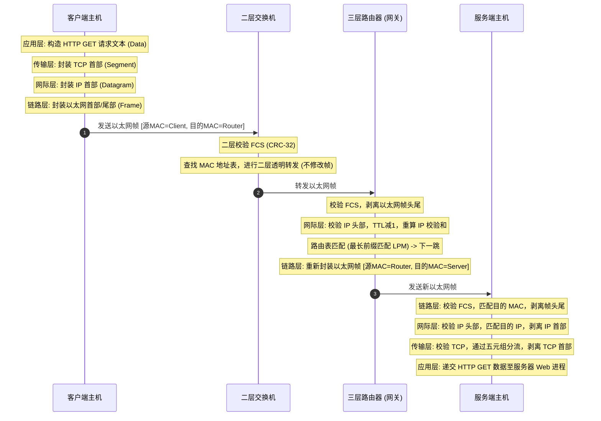

# 1.2.1.2 TCP-IP四层模型

## 1. 核心定义与设计背景

### 1.1 TCP/IP 体系架构原理与 RFC 1122 规范
TCP/IP 协议族（Protocol Suite）并不是先由学术或标准化组织闭门造车设计出来的理论模型，而是在 20 世纪 70 年代由美国国防高级研究计划局（DARPA）资助的阿帕网（ARPANET）实践中逐步演进、迭代而成的工业标准。现代互联网的主机通信规范在 RFC 1122（*Requirements for Internet Hosts -- Communication Layers*）中得到了正式的定义与系统化确立。

TCP/IP 体系架构的设计建立在两个深刻的工程哲学之上：

#### 端到端原则（End-to-End Principle）
由 Saltzer、Reed 和 Clark 在 1984 年正式阐述。该原则指出：**如果一个通信功能只能在通信的端点（即终端主机）上被完整且正确地实现，那么试图将该功能移入网络核心（如路由器、交换机）就是不合理且多余的。** 

在 TCP/IP 中，可靠性（如差错控制、重传机制、流量控制与拥塞控制）被完全交给了传输层的端系统（TCP 协议）来保障，而网络核心（网际层）只负责尽可能快地转发无状态的数据报（Datagram）。这种设计带来了极大的好处：它使网络核心保持了极简、高效、鲁棒与可扩展性，路由器不需要维持每个连接的复杂状态，从而能够承载指数级增长的流量。

#### 鲁棒性原则（Robustness Principle / Postel's Law）
源自 Jon Postel 在 RFC 793/RFC 1122 中的经典定义：**“在发送时要保守，在接收时要宽容”（Be conservative in what you do, be liberal in what you accept from others）。**

在发送数据时，主机必须严格遵守协议规范，确保发出的报文格式标准、无歧义，避免给网络制造混乱；在接收数据时，即使对方发来的报文有轻微的格式违规或不规范，只要其意图可以通过合理的上下文推导出来，接收端就应当尽量容错并继续处理，以最大化分布式系统的互操作性。然而，这一原则在现代网络安全语境下也带来了一定的争议（例如，接收端过于宽容的解析逻辑常被用于规避防火墙检查或进行协议走私攻击）。

---

### 1.2 TCP/IP 模型 vs OSI 七层模型：为什么 TCP/IP 胜出？
在计算机网络发展史上，国际标准化组织（ISO）提出了著名的 **OSI（Open Systems Interconnection）七层模型**，而工业界则普遍采用了 **TCP/IP 四层模型**。两者的结构映射关系如下：

| OSI 七层模型 | TCP/IP 四层模型 | 核心功能与协议示例 |
| :--- | :--- | :--- |
| **应用层 (Application)** | <br>扩展应用服务（HTTP, DNS, SSH, SMTP） |
| **表示层 (Presentation)** | **应用层 (Application Layer)** | 数据表示、加密解密、压缩与字符集转换 |
| **会话层 (Session)** | <br>进程间会话建立、管理与中止 |
| **传输层 (Transport)** | **传输层 (Transport Layer)** | 提供端到端的通信、端口寻址、流量控制（TCP, UDP） |
| **网络层 (Network)** | **网际层 (Internet Layer)** | 跨网络寻址、路由选择、分组转发（IP, ICMP） |
| **数据链路层 (Data Link)** | **网络接口层 (Link Layer)** | 物理介质访问、硬件寻址、帧同步（以太网 802.3, Wi-Fi 802.11） |
| **物理层 (Physical)** | <br>比特流物理传输（光纤、电磁波、电缆） |

OSI 七层模型虽然在理论上定义得非常完美、严密，但在工程实践中却彻底输给了 TCP/IP。其失败的根本原因在于：

1. **时机不对（Bad Timing）**：OSI 模型的标准制定过程过于缓慢且官僚。在 OSI 还在为协议格式争论不休时，TCP/IP 已经紧密地绑定在 BSD UNIX 操作系统中并向全球学术界与工业界免费开源，形成了事实上的工业标准（De Facto Standard）。
2. **结构繁琐与冗余（Bad Technology）**：会话层和表示层在实际应用中并没有独立存在的必要。数据的序列化（如 JSON、Protobuf、XML）与会话维持完全可以由应用层库直接处理。此外，OSI 模型的某些功能在多个层次中重复出现（例如，差错控制和流量控制在链路层、网络层和传输层都得到了定义，造成了极大的系统冗余）。
3. **实现开销巨大与效率低下（Bad Implementations）**：早期的 OSI 协议栈实现异常庞大，运行极其缓慢，系统内存与 CPU 开销极大；而 TCP/IP 协议栈结构紧凑，执行效率高，易于在早期的微处理器和资源受限的系统上运行。
4. **政治与管理原因（Bad Politics）**：OSI 是由欧洲电信组织和政府主导的自顶向下的产物，试图包揽一切；而 TCP/IP 是由工程师在实践中通过“粗略的共识与可运行的代码”（Rough consensus and running code）不断迭代优化的，更加务实。

---

### 1.3 协议栈的分层分工与封装原则
TCP/IP 协议栈的纵向架构遵循**封装（Encapsulation）**与**解封装（Decapsulation）**原则。在逻辑上，每一层都以为自己是在与对等实体的对应层直接进行通信（例如，客户端的传输层与服务端的传输层对话），但实际上数据必须逐层向下传递，直到通过物理介质传输，再在接收端逐层向上递交。

```
+-------------------------------------------------------------+
|                     应用层 (HTTP Data)                       |
+-------------------------------------------------------------+
                              |
                              v (封装 TCP 首部)
         +-------------+--------------------------------------+
         |  TCP Header |          TCP Payload (Data)          | -> 传输层报文段 (Segment)
         +-------------+--------------------------------------+
                              |
                              v (封装 IP 首部)
  +-------------+---------------------------------------------+
  |  IP Header  |              IP Payload (Segment)           | -> 网际层数据报 (Datagram)
  +-------------+---------------------------------------------+
                              |
                              v (封装以太网首部和尾部)
+---------------+-------------------------------------+-------+
|  Frame Header |        Frame Payload (Datagram)     |  FCS  | -> 网络接口层帧 (Frame)
+---------------+-------------------------------------+-------+
                              |
                              v (转换为比特流物理传输)
====================== 物理传输介质 ===========================
```

这种分层封装的核心价值在于**高内聚、低耦合**。每一层只需关注本层的功能，并通过定义清晰的接口向上层提供服务。上层不需要关心底层的物理介质是光纤、铜线还是无线电波，底层也不需要知道上层传输的数据是网页、电子邮件还是音频流。

---

## 2. 四层结构职责与数据边界

### 2.1 网络接口层（Link Layer）
网络接口层是 TCP/IP 协议栈的最低层，它封装了数据链路层与物理层的功能，负责在相邻的物理节点（Hop-by-Hop）之间传输以“帧”（Frame）为单位的数据。

#### MAC 寻址机制
在网络接口层，主机的唯一标识是 **MAC 地址（Media Access Control Address）**。MAC 地址是一个 48 位的硬件地址（例如 `00:1A:2B:3C:4D:5E`），通常在网卡（NIC）出厂时直接烧录在只读存储器（ROM）中。
* 前 24 位被称为 **OUI（Organizationally Unique Identifier，组织唯一标识符）**，由 IEEE 分配给网卡制造商，用来标识网卡厂商；
* 后 24 位由制造商自行分配，确保全球每一块网卡的 MAC 地址在物理上都是唯一的。

MAC 地址在局域网（LAN）内用于帧的投递，交换机（Switch）依靠内部维护的 MAC 地址表（端口与 MAC 地址的映射）实现二层转发。

#### ARP（地址解析协议）工作原理
IP 地址是网际层的逻辑地址，而网卡发送数据帧时必须知道目的硬件的 MAC 地址。**ARP（Address Resolution Protocol）** 充当了网际层与网络接口层之间的桥梁，用于将 32 位 IPv4 地址动态解析为 48 位 MAC 地址。

1. **查询本地 ARP 缓存（ARP Cache）**：当主机 A 需要向同一局域网内的目标主机 B 发送数据时，首先检查本地 ARP 缓存表中是否存在主机 B 的 IP 对应的 MAC 记录。如果命中，直接进行帧封装。
2. **发送 ARP 请求（ARP Request）**：若未命中，主机 A 将在局域网内发送一个 ARP 请求报文。该报文在链路层被封装为**广播帧**（目的 MAC 地址为 `FF:FF:FF:FF:FF:FF`），局域网内的所有物理节点都会收到并解析该帧。
3. **响应 ARP 应答（ARP Reply）**：所有主机都会将解包后的目标 IP 与自身的 IP 进行比对。只有与该 IP 相同的主机 B 才会做出响应，并向主机 A 返回一个**单播帧**（目的 MAC 地址为主机 A 的物理地址），其中包含主机 B 的 MAC 地址。同时，主机 B 也会将主机 A 的 IP 到 MAC 地址的映射记入自己的 ARP 表中。
4. **更新本地缓存**：主机 A 收到应答后，将主机 B 的 MAC 地址写入本地 ARP 缓存表，并开始发送被挂起的数据帧。

> [!NOTE]
> **免费 ARP（Gratuitous ARP）与冲突检测**
> 免费 ARP 是指主机主动发送 ARP 请求，其中查询的 IP 地址就是主机自身的 IP 地址。它的主要作用有两个：
> 1. **IP 地址冲突检测**：当主机刚刚配置 IP 地址或网卡启动时，发送免费 ARP。如果收到了局域网内其他主机的响应，说明该 IP 地址已被占用，主机会向操作系统报告 IP 地址冲突。
> 2. **更新邻居主机的 ARP 缓存**：当主机的硬件 MAC 地址发生变更（如更换了网卡但保留了原 IP 地址）时，发送免费 ARP 可以通知局域网内的所有节点动态更新其 ARP 缓存，避免后续数据投递到旧的硬件地址。

#### 物理介质边界的差异：以太网（802.3）与 Wi-Fi（802.11）
虽然以太网和 Wi-Fi 都在网络接口层上运行，但它们的物理信道和介质访问控制机制有着根本的区别：

* **以太网（IEEE 802.3）与 CSMA/CD**：
  以太网属于有线局域网。在共享物理介质的半双工模式下，它采用 **CSMA/CD（Carrier Sense Multiple Access with Collision Detection，载波监听多路访问/冲突检测）** 机制。其核心逻辑是“先听后发，边发边听”：发送前监听信道，若空闲则发送；在发送的同时检测信道上是否有电压变化（冲突）。一旦检测到碰撞，立即停止发送，并发送一个阻塞信号（Jamming Signal）以保证所有节点都知道发生了碰撞，然后各节点执行**二进制指数退避算法（Binary Exponential Backoff）**，随机延迟一段时间后重新尝试发送。
* **Wi-Fi（IEEE 802.11）与 CSMA/CA**：
  Wi-Fi 属于无线局域网。由于电磁波在空气中传播的衰减极大，无线网卡在发送信号时自身产生的强信号会彻底覆盖接收天线，使得**无线网卡无法在发送数据的同时检测碰撞**。因此，802.11 采用了 **CSMA/CA（Carrier Sense Multiple Access with Collision Avoidance，载波监听多路访问/冲突避免）** 机制。它在监听到信道空闲后，不立即发送，而是先等待一个**帧间间隔（IFS）**，然后启动一个**随机退避计时器**进行倒计时，倒计时归零且信道依然空闲时才发送。
  此外，为了解决无线网络中的**隐藏终端问题（Hidden Terminal Problem）**，Wi-Fi 引入了可选的 **RTS/CTS（Request to Send / Clear to Send）** 握手机制：发送方先发送一个短的 RTS 帧，接收方回复 CTS 帧，其他听到这两个帧的无线节点在 CTS 指定的时间内将保持静默，从而在空域中预留出无干扰的传输通道。

---

### 2.2 网际层（Internet Layer）
网际层是网络的核心控制层，其职责是将数据报（Datagram）从源主机跨越多个路由器转发到目的主机。它提供的是**不可靠、无连接、尽力而为（Best-effort）**的传输服务。

#### IP 协议规范：IPv4 与 IPv6 的核心差异
IP（Internet Protocol）是网际层的灵魂。随着互联网规模的扩张，IPv4 正在逐步向 IPv6 演进：

1. **地址空间**：IPv4 使用 32 位（4 字节）地址，总容量约 43 亿个，早已枯竭；IPv6 使用 128 位（16 字节）地址，提供了极其庞大的地址空间（约 $3.4 \times 10^{38}$ 个），彻底解决了设备联网的地址限制。
2. **首部格式**：IPv4 首部是可变长度的（最小 20 字节，最大 60 字节），包含许多不常用的可选字段，路由器处理时效率较低。IPv6 首部被重新设计为**固定 40 字节**的基本首部，所有可选信息都放入了可选的“扩展首部”（Extension Headers）中，大大简化了路由器的解析逻辑。
3. **校验和（Checksum）**：IPv4 首部包含一个首部校验和字段，由于数据包在转发时 TTL 会不断递减，每个路由器在转发时都必须重新计算校验和，增加了延迟。IPv6 **废除了首部校验和**，将差错检验的任务完全交给了传输层（TCP/UDP）和网络接口层，大幅提升了路由转发硬件的吞吐效率。
4. **广播（Broadcast）的消亡**：IPv6 废除了 IPv4 中的广播地址，改用更加高效的**组播（Multicast）**和**任播（Anycast）**，ARP 协议也被基于 ICMPv6 的邻居发现协议（NDP）所取代。

#### ICMP 诊断机制
**ICMP（Internet Control Message Protocol，网际控制报文协议）** 是 IP 的伴侣协议。它被封装在 IP 数据报的数据载荷中传输，但逻辑上属于网络层。ICMP 用于在主机和路由器之间传递网络诊断、差错报告和控制信息。

##### Ping 工具的底层原理
Ping 依靠 ICMP 的**回送请求（Echo Request）**和**回送应答（Echo Reply）**机制工作：
1. 源主机向目的 IP 发送一个 ICMP Echo Request 报文（Type = 8, Code = 0），其中包含一个唯一的标识符（Identifier）和序列号（Sequence Number），并在报文数据区填入当前时间戳或填充字符。
2. 目的主机收到该报文后，向源主机回复一个 ICMP Echo Reply 报文（Type = 0, Code = 0），将请求报文中的标识符、序列号和数据原样返回。
3. 源主机通过计算发送时间与接收时间的差值，得出往返时延（RTT，Round-Trip Time），并统计丢包率。

##### Traceroute 工具的底层原理
Traceroute 利用 IP 首部中的 **TTL（Time to Live，生存时间）** 字段和 ICMP 的超时差错报文来探测数据包到达目的地所经过的所有路由器：
1. 源主机向目的主机发送一个 IP 数据报（通常是高端口的不可达 UDP 报文，或直接发送 ICMP Echo Request），并故意将该数据包的 **TTL 设为 1**。
2. 路径上的第一个路由器收到该包后，将 TTL 值减 1。由于此时 TTL 变为 0，路由器必须丢弃该数据包，并向源主机返回一个 **ICMP 超时报文**（Time Exceeded, Type = 11, Code = 0）。源主机由此获取了第一跳路由器的 IP 地址。
3. 随后，源主机将第二个数据包的 **TTL 设为 2**，第二个路由器在将 TTL 减为 0 后会返回 ICMP 超时报文，源主机由此获取第二跳路由器的 IP。
4. 这一过程依次重复，TTL 逐次递增（3, 4, 5...），直到数据包真正到达目的主机。
5. 目的主机收到该包时，如果使用的是不可达的 UDP 端口，它会发现目的端口没有对应的服务进程，从而向源主机返回一个 **ICMP 端口不可达报文**（Destination Unreachable, Type = 3, Code = 3）。源主机收到此报文后，得知已到达目的地，探测流程结束。

#### IP 分片（Fragmentation）与重组（Reassembly）机理
当 IP 层准备发送一个数据报时，它必须获取出口网卡（NIC）的 **MTU（Maximum Transmission Unit，最大传输单元）**。如果 IP 数据报的总长度超过了 MTU，且 IP 首部允许分片，IP 层就必须对该数据报进行分片处理。

##### 核心控制字段
IP 首部中有三个字段专门用于控制分片与重组：
* **Identification（标识符，16位）**：由源主机分配，同一原始 IP 数据报的所有分片都具有相同的标识符。
* **Flags（标志，3位）**：
  * 第一位保留。
  * 第二位为 **DF（Don't Fragment，不分片）**。若置 1，表示禁止分片。如果包长大于 MTU 且 DF=1，路由器将直接丢弃该包并向源主机发送 ICMP 差错报文（Type=3, Code=4, Need Fragmentation）。
  * 第三位为 **MF（More Fragments，更多分片）**。置 1 表示后续还有分片；置 0 表示这是原始数据报的最后一个分片。
* **Fragment Offset（分片偏移，13位）**：指示当前分片所携带的数据载荷在原始 IP 数据报数据区中的相对起始位置。**该偏移量以 8 字节（64位）为基本单位**。因此，除了最后一个分片外，所有分片的数据载荷长度必须是 8 字节的整数倍。

##### 分片计算实例
假设上层交付了一个 4000 字节的 IPv4 数据报（包含 20 字节 IP 首部和 3980 字节数据载荷），需要通过一个 MTU 为 1500 字节的以太网接口发送。

* **每个分片能承载的最大载荷**：$1500 - 20 (\text{IP首部}) = 1480 \text{字节}$。
* $1480$ 刚好是 8 的倍数（$1480 / 8 = 185$），因此每个分片的载荷上限为 1480 字节。

| 分片编号 | 总长度 (Total Length) | 数据载荷范围 (字节) | 标识符 (ID) | DF 标志 | MF 标志 | 分片偏移 (Offset) |
| :--- | :--- | :--- | :--- | :--- | :--- | :--- |
| **分片 1** | 1500 字节 (20首部 + 1480数据) | 0 ~ 1479 | 56789 | 0 | 1 | $0 / 8 = 0$ |
| **分片 2** | 1500 字节 (20首部 + 1480数据) | 1480 ~ 2959 | 56789 | 0 | 1 | $1480 / 8 = 185$ |
| **分片 3** | 1040 字节 (20首部 + 1020数据) | 2960 ~ 3979 | 56789 | 0 | 0 | $2960 / 8 = 370$ |

##### 重组过程与危害
IP 分片的重组**只在最终的目的主机**上进行，中间的路由器仅负责转发，不进行重组。目的主机在收到分片后，会启动一个重组定时器。如果定时器超时仍未集齐同一 ID 的所有分片，目的主机会**将已收到的所有分片全部丢弃**，并向源主机发送 ICMP 组装超时报文。

> [!WARNING]
> **IP 分片的工程灾难**
> 在实际工程中，应当尽量避免 IP 分片。因为 IP 协议本身没有重传机制，一旦某个分片在传输中丢失，接收端将无法完成重组，导致整个 IP 数据报被丢弃。对于上层的 TCP 而言，这会导致整个 TCP 报文段的重传，极大地降低了网络吞吐量。现代网络系统通常开启 **PMTUD（Path MTU Discovery，路径 MTU 发现）** 机制，在源头直接协商好 MSS，从而规避 IP 分片。

#### 选路（Routing）与跳数限制（TTL）
路由器工作在网际层。当路由器收到一个 IP 数据报时，它会提取目的 IP 地址，并在其路由表中进行匹配。路由表的匹配遵循**最长前缀匹配（LPM，Longest Prefix Match）**原则，即匹配子网掩码最长、地址范围最精确的那条路由条目。

为了防止网络中由于配置错误或路由拓扑抖动形成**路由环路（Routing Loop）**，IP 首部设立了 **TTL（生存时间）** 字段。TTL 并不是指物理时间，而是指数据包允许被转发的最大路由器跳数。
1. 主机发送 IP 包时，会将其 TTL 设为一个初始值（通常 Linux 为 64，Windows 为 128）。
2. 每经过一个路由器转发，该路由器在将包发往输出接口前，都会将该包的 **TTL 值减 1**。
3. 一旦某台路由器发现接收到的 IP 包 TTL 减 1 后变为 0，它必须丢弃该包，并向源主机发送一个 ICMP 超时报文。这保证了失效的、陷入环路的数据包能够在有限的步数内被清除，避免耗尽网络带宽。

---

### 2.3 传输层（Transport Layer）
传输层负责为运行在不同主机上的应用进程之间提供**端到端的逻辑通信**（Process-to-Process）。它建立在网际层的“主机到主机”服务之上，提供了关键的多路复用与多路分解能力。

#### TCP 与 UDP 协议分流
在传输层，两个最核心的协议是 TCP 和 UDP，它们的设计目标和应用场景截然不同：

* **TCP（Transmission Control Protocol，传输控制协议）**：
  * **面向连接**：通信前必须通过三次握手建立连接，并在内核中维护复杂的连接状态。
  * **可靠交付**：通过序列号、确认应答（ACK）、超时重传、差错校验保证数据的按序、无差错、无丢失、无重复传输。
  * **流量控制**：利用滑动窗口（Sliding Window）机制，防止发送方发送速度过快导致接收方缓冲区溢出。
  * **拥塞控制**：通过慢启动、拥塞避免、快速重传与快速恢复等算法，动态感知互联网瓶颈带宽，防止向网络注入过量数据导致网络崩溃。
  * **面向字节流**：数据在传输层被视为无结构的字节流，应用层写入的多个小报文可能会被合并发送（如 Nagle 算法），或者一个大报文被拆分发送，应用层必须自己解析协议边界。
* **UDP（User Datagram Protocol，用户数据报协议）**：
  * **无连接**：发送数据前不需要建立连接，没有握手开销，随时可以发送。
  * **不可靠交付**：尽力而为，不保证数据按序到达，不进行重传，不进行流量控制和拥塞控制。
  * **面向报文**：UDP 完整保留了应用层数据的边界。应用层交付一个报文，UDP 就封装发送一个，接收端也会一次性交付一整个报文，不会发生粘包。
  * **效率高**：由于首部极其简单（仅 8 字节，而 TCP 最小 20 字节），且无需维护状态，适合对实时性要求极高、能容忍部分丢包的场景（如即时通信、语音视频通话、DNS 查询）。

#### 端口寻址（Mux/Demux）与五元组
由于一台主机上可能同时运行着多个网络应用进程，网际层只负责将 IP 包送达目标主机，而传输层必须能够精准地将数据分发给特定的应用程序。这就是**多路复用（Multiplexing）**与**多路分解（Demultiplexing）**。

在传输层，进程的寻址是通过 **16 位无符号整数的端口号（Port Number）** 实现的（取值范围为 `0 ~ 65535`）：
1. **熟知端口（Well-Known Ports，0 ~ 1023）**：由 IANA 严格分配给核心系统服务，如 HTTP (80)、HTTPS (443)、DNS (53)、SSH (22)。
2. **注册端口（Registered Ports，1024 ~ 49151）**：供商业应用或普通服务进程注册使用，如 MySQL (3306)、Redis (6379)。
3. **动态/临时端口（Ephemeral Ports，49152 ~ 65535）**：当客户端程序主动发起连接时，由操作系统内核在当前空闲的端口中随机分配一个，连接关闭后收回。

在 TCP 协议中，一个唯一的网络连接并不是由单个端口决定的，而是由**五元组**唯一确定的：
$$\text{五元组} = \{\text{源 IP}, \text{源端口}, \text{目的 IP}, \text{目的端口}, \text{协议类型}\}$$

> [!TIP]
> **多路分解的性能本质**
> 当 Web 服务器在 80 端口上监听时，为什么它能同时处理成千上万个并发客户端的请求？正是因为每一个客户端的源 IP 或源端口不同，这使得内核在传输层解包时，可以通过哈希表查找这五元组，将数据精准路由到对应客户端的特定 Socket 缓冲区中。

#### 套接字连接（Socket）的内核抽象含义
在操作系统的内核空间中，**套接字（Socket）** 并不是一个简单的接口，而是一个高度复杂的**控制块数据结构**。在 Linux 内核的实现中，一个 Socket 实例在内存中主要由两部分抽象组成：

1. **VFS 虚拟文件系统层的抽象（`struct socket`）**：
   使得应用程序可以使用标准的 UNIX 文件描述符（FD）操作（如 `read()`, `write()`, `close()`）来操作网络连接。
2. **网络协议栈层的抽象（`struct sock` 或特定于协议的 `struct tcp_sock`）**：
   这部分直接由 TCP/IP 协议栈管理，包含了连接的所有控制状态：
   * **发送缓冲区（Send Buffer）** 与 **接收缓冲区（Receive Buffer）**：用于暂存未确认的发送数据和未被应用层读取的接收数据。
   * **TCP 状态机（State Machine）**：记录当前 Socket 处于 11 种 TCP 状态（如 `ESTABLISHED`, `TIME_WAIT` 等）中的哪一种。
   * **拥塞控制状态**：记录拥塞窗口（`cwnd`）、慢启动阈值（`ssthresh`）以及当前的 RTT 估算值。
   * **等待队列（Wait Queue）**：存放因为等待缓冲区可写或可读而被挂起、处于睡眠状态的应用线程。

##### 监听套接字（Listening Socket）与已连接套接字（Connected Socket）
* **监听套接字**：当服务器调用 `socket()` 创建套接字并执行 `bind()` 和 `listen()` 后，该套接字就转为监听状态。它的唯一职责是**被动接收客户端的 TCP SYN 报文**。它在内核中维护着两个关键队列：
  * **半连接队列（SYN Queue）**：保存收到了客户端 SYN 报文、已回复 SYN+ACK 但尚未收到客户端最终 ACK 的连接状态（处于 `SYN_RECV` 状态）。
  * **全连接队列（Accept Queue）**：保存已经完成了三次握手、连接已建立（处于 `ESTABLISHED` 状态）、等待应用层调用 `accept()` 取出的连接。
* **已连接套接字**：当全连接队列中有就绪连接时，应用层调用 `accept()` 系统调用。内核会**克隆或新建一个全新的已连接套接字**返回给应用层。这个新套接字绑定了完整的五元组（包含了具体的客户端 IP 和端口），专门用于与该客户端进行后续的双向数据通信。而原来的监听套接字则继续驻留在 80 端口，继续监听新的建连请求。

---

### 2.4 应用层（Application Layer）
应用层是 TCP/IP 四层模型中的最高层，直接面向应用程序。它不负责数据的底层搬运，而是定义了**应用进程之间交互的语义、编码规范和内容管理方式**。

#### HTTP（超文本传输协议）的会话与连接演进
HTTP 协议经历了多次重大演进，其底层的传输优化策略变化尤为深刻：

1. **HTTP/1.0**：默认使用**短连接**。每次发送一个 HTTP 请求，应用层都必须指示传输层建立一次 TCP 连接，请求处理完毕后立即释放连接。这带来了极高的一次性握手延迟和系统资源消耗。
2. **HTTP/1.1**：引入了**持久连接（Keep-Alive）**，允许在同一个 TCP 连接上串行发送多个 HTTP 请求和响应。然而，HTTP/1.1 的管道化（Pipelining）存在严重的**应用层线头阻塞（Head-of-Line Blocking）**问题——如果前一个响应在服务器端处理变慢，后续的所有响应都必须在缓冲区中排队等待。
3. **HTTP/2**：引入了**二进制分帧（Binary Framing）**与**多路复用（Multiplexing）**。在单一的 TCP 连接上，数据被拆分为带有 Stream ID 的二进制帧并发交错传输。这消除了应用层的线头阻塞，但在网络环境较差时，一旦底层 TCP 发生丢包，TCP 的按序交付特性会导致**整条 TCP 连接上的所有流全部被挂起**，形成了传输层的线头阻塞。
4. **HTTP/3**：彻底抛弃了 TCP，基于 UDP 构建了全新的传输层协议 **QUIC（Quick UDP Internet Connections）**。QUIC 在 UDP 之上实现了独立的、无损的多路复用——一个流（Stream）发生丢包和重传，完全不会影响其他流的数据递交。同时，QUIC 将连接标识由五元组改为 **Connection ID**，实现了即使在 Wi-Fi 和蜂窝网络之间切换，网络连接也不会中断的“连接迁移”（Connection Migration）功能。

#### DNS（域名系统）解析机制与传输选择
DNS 负责将人类可读的域名解析为 IP 地址。其核心解析过程分为两种查询模式：

* **递归查询（Recursive Query）**：客户端向本地 DNS 服务器（如 `8.8.8.8`）发起查询，本地 DNS 服务器必须负责到底，如果自己没有缓存，就必须代替客户端向外发起后续的迭代查询，最终向客户端返回确切的 IP 地址或报错。
* **迭代查询（Iterative Query）**：本地 DNS 服务器依次请求根域名服务器（Root Name Server）、顶级域名服务器（TLD Server）和权威域名服务器（Authoritative Server），每一次查询，上级服务器都会给本地 DNS 指引一个更具体的下一级 DNS 地址，直到在权威 DNS 服务器上拿到解析结果。

##### DNS over UDP vs DNS over TCP
* **为什么优先使用 UDP（53 端口）**：
  传统的 DNS 查询和响应报文非常短（通常小于 512 字节）。使用 UDP 可以免去三次握手和连接释放的开销，解析速度极快，网络资源消耗小。
* **什么时候切换到 TCP（53 端口）**：
  若 DNS 响应报文的长度超过了 512 字节（例如包含大量的 A 记录，或者使用了 DNSSEC 安全签名扩展），UDP 报文会被截断。此时，DNS 响应中的 **TC（Truncation，截断）标志位** 会被置 1。客户端收到后，会立即通过 TCP 53 端口重新建立连接并重新发起查询。此外，主辅 DNS 服务器之间的**区域传输（Zone Transfer）**涉及海量数据的同步，为了保证数据的完整性与可靠性，必须强制使用 TCP 进行传输。

#### SSH（安全外壳协议）的内容管理与加密会话
SSH 用于在不安全网络上提供安全的远程登录和数据交互。其安全会话的建立过程高度严密：

1. **TCP 连接建立**：客户端与服务端的 22 端口建立 TCP 连接。
2. **协议版本协商**：双方交换彼此支持的协议版本和加密套件列表。
3. **密钥交换与服务器认证（Key Exchange）**：双方利用 **Diffie-Hellman（DH）** 密钥交换算法，在不安全的网络通道上安全地计算出一个**对称加密密钥（Session Key）**。在此过程中，客户端会校验服务器的公钥指纹，以防范**中间人攻击（MITM）**。
4. **用户身份认证**：在已经建立的加密通道内，客户端向服务端发送加密的认证信息（如密码、或者使用客户端私钥对挑战字进行签名的公钥认证）。
5. **通道复用与交互**：认证成功后，SSH 进入会话管理阶段。SSH 支持在单个 TCP 连接上复用多个通道（Channels），包括远程交互式 Shell、SFTP 文件传输通道、X11 转发通道以及本地/远程端口转发通道。

---

## 3. 纵向数据传输链路与封包解包细节

### 3.1 纵向数据流转图解
以下以一个通用的 HTTP GET 请求和对应的响应为例，展示数据在客户端与服务端之间跨越物理介质、二层交换机和三层路由器的完整纵向流动过程：



---

### 3.2 封包细节详解（以 HTTP GET 为例）

#### 步骤一：应用层数据生成
用户在浏览器中请求 `http://www.example.com/index.html`。应用层进程构造出符合标准 HTTP/1.1 规范的 ASCII 文本请求段：

```http
GET /index.html HTTP/1.1
Host: www.example.com
Connection: keep-alive
User-Agent: Mozilla/5.0

```

这个文本串就是**原始应用层数据（Application Data）**。应用程序调用内核的 `send()`/`write()` 系统调用，将此数据拷贝到内核 TCP 发送缓冲区中。

#### 步骤二：传输层封装（TCP Segment 封装）
TCP 协议栈从缓冲区取出数据，并在该应用数据前追加 **20 字节的 TCP 首部**，将其封装为 **TCP 报文段（Segment）**。
* **源端口** 填入内核随机分配的临时端口（如 `52134`）。
* **目的端口** 填入标准 Web 端口 `80`。
* **序列号（SEQ）** 填入该连接当前发送方向的初始字节流偏移值（例如 `10001`）。
* **确认号（ACK）** 填入期望收到对端的下一个字节序号（例如 `2005`）。
* **Flags 字段**：置位 `ACK` 和 `PSH`（表示本段携带有效载荷，且要求接收端操作系统尽快将数据上交给应用进程，不要在内核中缓存等待）。
* **校验和（Checksum）**：计算包括 TCP 首部、TCP 载荷数据以及一个由源 IP、目的 IP、协议号组成的 **TCP 伪首部**的循环冗余校验值。

#### 步骤三：网际层封装（IP Datagram 封装）
TCP 报文段被递交给网际层的 IP 实体。IP 层在 TCP 段的前面追加 **20 字节的 IPv4 首部**，封装为 **IP 数据报（Datagram）**。
* **Version** 填入 `4`，**IHL** 填入 `5`（表示首部长度为 $5 \times 4 = 20$ 字节）。
* **Total Length** 填入 `1500`（或当前 TCP Segment 长度 + 20 字节 IP 首部）。
* **Protocol** 填入 `0x06`（表示内部封装的载荷为 TCP 协议）。
* **TTL** 填入初始生存时间（如 `64`）。
* **源 IP 地址** 填入本地网卡 IP（如 `192.168.1.100`）。
* **目的 IP 地址** 填入通过 DNS 解析出的服务器公网 IP（如 `93.184.216.34`）。
* **Header Checksum**：计算仅覆盖这 20 字节 IP 首部的校验值。

#### 步骤四：网络接口层封装（Ethernet Frame 封装）
IP 数据报被递交给网卡驱动程序。驱动程序根据路由表得知下一跳的 IP 为网关（路由器）的 IP `192.168.1.1`。驱动程序查询本地 ARP 缓存表，获取网关的 MAC 地址 `00:11:22:33:44:55`。
随后，驱动程序在 IP 数据报的前后分别追加以太网的首部和尾部，组装成 **以太网帧（Ethernet Frame）**：
* **目的 MAC 地址** 填入网关的 MAC 地址 `00:11:22:33:44:55`。
* **源 MAC 地址** 填入本地网卡的 MAC 地址 `AA:BB:CC:DD:EE:FF`。
* **EtherType** 填入 `0x0800`（表示该以太网帧携带的载荷是一个 IPv4 数据报）。
* **FCS（帧校验序列）**：在帧的尾部（4 字节）追加通过 CRC-32 算法计算得出的整帧校验值。

最后，网卡在发送比特流前，会在物理层自动加入 7 字节的**前导码（Preamble）**和 1 字节的**帧首定界符（SFD）**，用以与接收端物理层进行时钟同步。

---

### 3.3 传输中继与网关处理
数据帧离开客户端网卡后，开始在局域网有线通道传输。

#### 交换机处理（工作在第二层）
1. 交换机从某个物理端口接收到以太网帧。
2. 提取帧尾的 **FCS** 进行 CRC-32 校验。如果发现物理传输导致的误码，直接丢弃该帧。
3. 校验无误后，提取帧头部的**目的 MAC 地址**（`00:11:22:33:44:55`），并在交换机内部维护的 **MAC 地址表（CAM 表）**中检索该 MAC 对应的输出端口。
4. 交换机将帧从对应的端口转发出去。**在整个过程中，交换机是一个透传设备，它绝不会修改以太网帧的内容。**

#### 路由器/网关处理（工作在第三层）
1. 路由器从其 LAN 接口接收到该以太网帧。
2. 校验 FCS。若无误，检查目的 MAC 地址是否为路由器该接口的物理地址。
3. 确认匹配后，**剥离以太网帧的头部和尾部**，将内部的 IP 数据报提交给路由器的网际层。
4. 路由器网络层核对 IP 首部校验和，检查目的 IP（`93.184.216.34`）是否为本机 IP。由于该 IP 属于公网，路由器确认需要将其转发。
5. 路由器执行 **TTL 减 1**（TTL 变为 `63`）。
6. 由于 TTL 发生了改变，路由器必须**重新计算并填充 IP 首部的 Header Checksum**。
7. 路由器检索自己的路由表，使用最长前缀匹配发现下一跳的公网 IP，并确定输出接口为 WAN 口。
8. 路由器查询 WAN 接口对应的 ARP/邻居协议，获取下一跳路由器的 MAC 地址（如 `00:AA:BB:CC:DD:EE`）。
9. 路由器重新将 IP 数据报封装成一个新的以太网帧：
   * **源 MAC 地址** 修改为**该路由器 WAN 口的物理 MAC 地址**。
   * **目的 MAC 地址** 修改为**下一跳路由器的物理 MAC 地址**。
   * 重新计算并追加新的 **FCS**。
10. 数据帧被发送到广域网链路。

> [!IMPORTANT]
> **MAC 与 IP 的变化规律**
> 在数据包跨网段传输的整个过程中：**源 IP 和目的 IP（在不考虑 NAT 的前提下）是全程保持不变的，它们标识了通信的起点和终点；而源 MAC 和目的 MAC 地址在每一次跨越路由器（每一跳）时都会被彻底修改，它们仅用于在相邻节点之间进行局部物理定位。**

---

### 3.4 接收端解封装与分流流程（Demultiplexing）
当服务器网卡收到物理电信号后，执行相反的**解封装与多路分解**操作：

```
+-------------------------------------------------------------------------+
| [应用层]       Web 服务进程 (如 Nginx, 监听端口 80)                       |
+-------------------------------------------------------------------------+
                                    ^
                                    | (由内核通过 Socket 接收缓冲区交付数据)
+-------------------------------------------------------------------------+
| [传输层]       通过 TCP 校验和, 匹配五元组找到目标 Socket, 剥离 TCP 首部   |
+-------------------------------------------------------------------------+
                                    ^
                                    | (根据 Protocol 字段 0x06 分发)
+-------------------------------------------------------------------------+
| [网际层]       校验 IP 头部, 重组分片, 匹配本机 IP, 剥离 IP 首部         |
+-------------------------------------------------------------------------+
                                    ^
                                    | (根据 EtherType 字段 0x0800 分发)
+-------------------------------------------------------------------------+
| [网络接口层]   网卡校验 FCS (CRC-32), 匹配本机 MAC, 剥离帧头尾            |
+-------------------------------------------------------------------------+
                                    ^
                                    | (接收物理介质比特流)
                                  [网卡]
```

1. **链路层处理**：
   网卡硬件校验 **FCS**。若 CRC 校验正确，网卡核对帧头部的目的 MAC 地址是否为本机网卡地址。确认后，网卡剥离以太网首尾，读取 **EtherType** 字段的值为 `0x0800`。网卡触发硬件中断，指示操作系统网卡驱动程序将解包后的 IP 包放入内核的接收环形缓冲区（Ring Buffer），并向网际层分发。
2. **网际层处理**：
   IP 协议栈计算 **IP Header Checksum** 以保证头部完整性。检查目的 IP 是否与本机配置的 IP 地址一致。确认无误后，检查 **Protocol** 字段的值为 `0x06`。IP 层剥离 IP 首部，将内部的 TCP 段提交给传输层。
3. **传输层处理**：
   TCP 协议栈计算 TCP 校验和，确保载荷没有发生误码。然后，提取 TCP 首部中的**源 IP、源端口、目的 IP、目的端口**，加上协议号，构成唯一的**五元组**。
   TCP 协议栈以该五元组为 Key，在内核的**已连接套接字哈希表（Established Socket Hash Table）**中进行高速检索。
   * 检索成功，定位到对应的 Socket 实体。
   * TCP 检查序列号（SEQ），确认该段是期望按序到达的数据。若无误，剥离 TCP 首部，将数据（HTTP GET 文本）写入该 Socket 的**接收缓冲区**。
   * 同时，TCP 协议栈向发送端回复一个 ACK 报文段。
   * 处于阻塞等待或事件轮询（如 `epoll`）状态的应用进程被内核唤醒。
4. **应用层处理**：
   Web 服务器进程调用 `read()`/`recv()` 系统调用，将数据从内核的 Socket 接收缓冲区拷贝到用户态应用内存中，根据 HTTP 协议格式解析 GET 请求，并启动业务逻辑处理。

---

### 3.5 关键首部字段深度剖析

#### TCP 头部结构与核心字段（RFC 793）

```
 0                   1                   2                   3
 0 1 2 3 4 5 6 7 8 9 0 1 2 3 4 5 6 7 8 9 0 1 2 3 4 5 6 7 8 9 0 1
+-+-+-+-+-+-+-+-+-+-+-+-+-+-+-+-+-+-+-+-+-+-+-+-+-+-+-+-+-+-+-+-+
|          Source Port          |       Destination Port        |
+-+-+-+-+-+-+-+-+-+-+-+-+-+-+-+-+-+-+-+-+-+-+-+-+-+-+-+-+-+-+-+-+
|                        Sequence Number                        |
+-+-+-+-+-+-+-+-+-+-+-+-+-+-+-+-+-+-+-+-+-+-+-+-+-+-+-+-+-+-+-+-+
|                     Acknowledgment Number                     |
+-+-+-+-+-+-+-+-+-+-+-+-+-+-+-+-+-+-+-+-+-+-+-+-+-+-+-+-+-+-+-+-+
|  Data |           |C|E|U|A|P|R|S|F|                             |
| Offset| Reserved  |W|C|R|C|S|S|Y|I|          Window           |
|       |           |R|E|G|K|H|T|N|N|                             |
+-+-+-+-+-+-+-+-+-+-+-+-+-+-+-+-+-+-+-+-+-+-+-+-+-+-+-+-+-+-+-+-+
|           Checksum            |         Urgent Pointer        |
+-+-+-+-+-+-+-+-+-+-+-+-+-+-+-+-+-+-+-+-+-+-+-+-+-+-+-+-+-+-+-+-+
|                    Options                    |    Padding    |
+-+-+-+-+-+-+-+-+-+-+-+-+-+-+-+-+-+-+-+-+-+-+-+-+-+-+-+-+-+-+-+-+
```

* **Sequence Number（序列号，32位）**：
  标识 TCP 发送方发出的字节流中第一个数据字节的序号。在建立连接时，双方会通过随机算法初始化一个 **ISN（Initial Sequence Number，初始序列号）**。这能防止网络中残留的历史旧连接报文误入新连接，同时也是接收端重组、去重和保序的关键依据。
* **Acknowledgment Number（确认号，32位）**：
  期望收到对端下一个发送字节的序号。TCP 采用**累积确认（Cumulative Acknowledgment）**机制，若 ACK 填入 $N$，则代表序号为 $N-1$ 及其之前的所有数据都已被安全且按序接收。
* **Data Offset（数据偏移，4位）**：
  指示 TCP 首部长度。由于 TCP 首部由于 Options（选项）的存在而可变，该字段指示首部占用了多少个 32 位（4 字节）字。最小值为 `5`（即 20 字节），最大值为 `15`（即 60 字节）。
* **Flags（控制标志位，9位）**：
  * **SYN**（Synchronize）：同步标志。在建立连接的三次握手包中置 1，用于同步双方的 ISN。
  * **ACK**（Acknowledgment）：确认标志。除建连的第一个 SYN 包外，所有 TCP 报文的此位都必须置 1，表示确认号字段有效。
  * **FIN**（Finish）：结束标志。表示发送方已无数据发送，请求释放连接。
  * **RST**（Reset）：重置标志。用于强制断开发生严重错误的连接，或拒绝非法的连接请求。
  * **PSH**（Push）：推送标志。指示接收端协议栈应将接收缓冲区的数据立刻推给应用进程，而非在缓冲区积压等待。
  * **ECE/CWR**：显式拥塞通知（ECN）机制。当网络发生拥塞时，路由器在 IP 首部做标记，接收端收到后在回复的 TCP 报文中将 **ECE** 置 1，发送端收到后执行拥塞窗口降速，并将 **CWR** 置 1 表示已调整。
* **Window Size（接收窗口，16位）**：
  用于流量控制。通告接收方当前可用的接收缓冲区大小（以字节为单位）。最大为 65535 字节。在现代高速网络中，可以通过 TCP 选项中的 **Window Scale（窗口扩大因子）** 突破此 16 位限制，最大可扩展至 1GB 窗口。

---

#### IP 头部结构与核心字段（RFC 791）

```
 0                   1                   2                   3
 0 1 2 3 4 5 6 7 8 9 0 1 2 3 4 5 6 7 8 9 0 1 2 3 4 5 6 7 8 9 0 1
+-+-+-+-+-+-+-+-+-+-+-+-+-+-+-+-+-+-+-+-+-+-+-+-+-+-+-+-+-+-+-+-+
|Version|  IHL  |Type of Service|          Total Length         |
+-+-+-+-+-+-+-+-+-+-+-+-+-+-+-+-+-+-+-+-+-+-+-+-+-+-+-+-+-+-+-+-+
|         Identification        |Flags|      Fragment Offset    |
+-+-+-+-+-+-+-+-+-+-+-+-+-+-+-+-+-+-+-+-+-+-+-+-+-+-+-+-+-+-+-+-+
|  Time to Live |    Protocol   |        Header Checksum        |
+-+-+-+-+-+-+-+-+-+-+-+-+-+-+-+-+-+-+-+-+-+-+-+-+-+-+-+-+-+-+-+-+
|                         Source Address                        |
+-+-+-+-+-+-+-+-+-+-+-+-+-+-+-+-+-+-+-+-+-+-+-+-+-+-+-+-+-+-+-+-+
|                      Destination Address                      |
+-+-+-+-+-+-+-+-+-+-+-+-+-+-+-+-+-+-+-+-+-+-+-+-+-+-+-+-+-+-+-+-+
|                    Options                    |    Padding    |
+-+-+-+-+-+-+-+-+-+-+-+-+-+-+-+-+-+-+-+-+-+-+-+-+-+-+-+-+-+-+-+-+
```

* **Version（版本，4位）**：
  指示 IP 协议版本。对于 IPv4，该值为 `4`；对于 IPv6，该值为 `6`。
* **IHL（Internet Header Length，4位）**：
  IP 首部长度，以 4 字节为单位。最少为 `5`（20 字节），最大为 `15`（60 字节）。
* **Total Length（总长度，16位）**：
  IP 首部和 IP 载荷的总大小（以字节为单位）。最大可达 65535 字节。
* **Identification/Flags/Fragment Offset**：
  前文已详解，这三个字段是网际层进行分片拆包与合并组装的控制引擎。
* **Time to Live（TTL，生存时间，8位）**：
  数据包在网络中允许经过的最大路由器跳数，防止数据包在环路中无限循环。
* **Protocol（协议类型，8位）**：
  指示 IP 载荷封装的传输层协议类型。常见值：`1` 表示 ICMP，`6` 表示 TCP，`17` 表示 UDP。
* **Header Checksum（首部校验和，16位）**：
  只针对 IP 头部进行校验，不校验数据载荷。每一跳路由器在修改 TTL 字段后，必须使用反码求和算法重新计算并覆盖此字段。

---

#### 以太网帧格式（IEEE 802.3 Standard）

```
+-------------------+-------------------+-------------------+-------------------+-------------------+
|  Destination MAC  |    Source MAC     |    EtherType      |      Payload      |        FCS        |
|     (6 Bytes)     |     (6 Bytes)     |    (2 Bytes)      | (46 - 1500 Bytes) |     (4 Bytes)     |
+-------------------+-------------------+-------------------+-------------------+-------------------+
```

* **Destination MAC Address（目的物理地址，6字节）**：
  接收端网卡的物理硬件 MAC 地址。
* **Source MAC Address（源物理地址，6字节）**：
  发送端网卡的物理硬件 MAC 地址。
* **EtherType（以太网帧类型，2字节）**：
  指示帧内封装的上层协议。常见的值包括：
  * `0x0800`：IPv4 数据报
  * `0x86DD`：IPv6 数据报
  * `0x0806`：ARP 报文
* **FCS（帧校验序列，4字节）**：
  使用 CRC-32 循环冗余校验算法对整个以太网帧（除了物理层前导码和 FCS 自身外）进行数学校验，保护数据在物理链路上传输不发生比特反转。

---

## 4. 深度设计思考、常见误区与性能优化

### 4.1 核心设计思考

#### 沙漏腰部的协议僵化（Protocol Ossification）
在 TCP/IP 的“沙漏”模型中，最窄的腰部是 IP 协议。这种设计在带来极佳的向后兼容性的同时，也产生了一个致命的副作用：**协议僵化**。

```
       +----------------------------+
       |   HTTP  DNS  SSH  SMTP ... | <- 活跃的应用创新
       +----------------------------+
                    \    /
                     \  /
             +------------------+
             |    TCP    UDP    |  <- 很难修改，中间件过滤
             +------------------+
                      ||
             +------------------+
             |        IP        |  <- 极难修改 (IPv6 部署缓慢)
             +------------------+
                      ||
             +------------------+
             |   Link Layers    |  <- 活跃的物理创新 (Wi-Fi 7, 5G/6G)
             +------------------+
```

由于全球范围内有数以亿计的路由器、防火墙、NAT 盒子（统称为 **Middleboxes，中间件**）被部署在网络核心，这些硬件设备往往硬编码了对 IPv4、TCP 和 UDP 头部字段的解析逻辑。

一旦有人试图在传输层引入全新的协议（例如 SCTP 协议），或者试图给 TCP 头部增加全新的 Option 选项，这些中间件在解析时就会因为“不认识”而将该数据包直接丢弃。

这就是为什么：
1. IPv6 推广了超过二十年，至今仍有许多地方在强行转换或双栈运行，无法完全淘汰 IPv4。
2. HTTP/3 在重新设计传输层时，**无法直接创造一个新的传输协议**，而必须将 QUIC 伪装封装在 **UDP 载荷** 内部。因为只有 UDP 才能无阻碍地穿透全球几乎所有的中间件防火墙。

#### 端到端原则的现代审视
在 21 世纪的今天，纯粹的“端到端原则”在很多网络场景下正在受到挑战：
* **NAT（网络地址转换）**：为了解决 IPv4 地址枯竭，NAT 强行篡改了 IP 报文头部的源/目的 IP 乃至 TCP 端口号，破坏了网络层的端到端对等地位。
* **防火墙与入侵防御系统（IPS）**：深度包检测（DPI）硬件会拆包检查应用层载荷，对不符合策略的连接强行发送 RST。
* **性能增强代理（PEP）/ CDN**：在卫星或高延迟链路中，代理节点会主动“截断”TCP 连接进行本地确认，缩短 RTT。

虽然中间件在网络性能优化、安全准入和地址复用方面提供了必不可少的功能，但它显著增加了系统诊断的复杂性，并且阻碍了端系统之间纯粹的、面向未来的协议升级。

---

### 4.2 常见误区纠偏

#### 误区一：TCP 是可靠的，因此应用层开发无需处理任何网络异常
这是初学者最容易陷入的误区。**TCP 的可靠性是有物理边界的。** 
* TCP 只能保证在“网络信道可达且对端主机存活”的这一时空跨度内进行尽力纠错。如果发生了物理网线被拔掉、路由器硬件损毁或 IP 路由表发生死循环，TCP 协议栈在重传达到上限后（受 Linux 内核参数 `tcp_retries2` 限制，默认通常会重试 15 次，耗时可达数分钟），最终依旧会断开连接，抛出超时错误或 `ETIMEDOUT`。
* 此外，即使 TCP 成功将数据投递到了对端主机的接收缓冲区，如果对端的应用进程由于内存溢出（OOM）崩溃、系统进程被挂起（如 JVM Full GC 导致的 Stop-The-World），该数据依然无法真正进入业务处理逻辑。
* **对策**：高可靠的分布式系统必须在应用层设计**应用级心跳机制（Keep-Alive）**、**超时熔断**、**重试退避策略**以及保证操作的**幂等性（Idempotency）**。

#### 误区二：IP 分片完全由网络层自动处理，因此上层发送数据无需关心 MTU
从原理上讲，IP 层确实会自动进行分片。但在高并发、高可用系统中，依赖 IP 自动分片是一种灾难，原因如下：
1. **分片丢失惩罚**：前文已述，丢失一个分片等同于整包丢失，导致 TCP 触发大面积重传。
2. **ICMP 黑洞（Black Hole）问题**：路径 MTU 发现（PMTUD）机制依赖路由器在丢弃超大包时向源主机发回 ICMP Fragmentation Needed 报文。但在现实中，很多网络管理员在防火墙上粗暴地配置了“拦截所有 ICMP 消息”的规则，导致源主机永远收不到该提示。源主机以为包发出去了，但包在途中某处由于超限被丢弃，导致 TCP 连接在建立阶段（小包握手）非常顺畅，一旦发送实际业务大包就无限卡死超时。这就是著名的“PMTUD 黑洞”。
3. **对策**：应用层和传输层在握手时，必须严格遵守 **MSS（Maximum Segment Size，最大报文段大小）** 限制，通常将其协商为 $1460 \text{字节}$（$1500 - 20\text{字节IP头} - 20\text{字节TCP头}$），确保封装后的 IP 包总长不超过以太网 MTU 的 1500 字节，在传输层源头彻底规避网络层的 IP 分片。

#### 误区三：MAC 地址是唯一的，因此局域网内通信可以不需要 IP 抽象
既然局域网内通过交换机就可以使用 MAC 地址直接发送二层帧，那为什么不直接用 MAC 地址构建全球网络，非要多此一举设计 IP 协议？
* **地址空间结构的区别**：MAC 地址是**扁平的（Flat Address Space）**，它没有任何地域、网络边界的层次信息，就像身份证号。IP 地址是**层次化的（Hierarchical Address Space）**，就像邮寄地址（国家-省-市-街道-门牌号）。
* **路由寻址可行性**：如果只用 MAC 地址，交换机要向全球某台主机投递报文，就必须在内存中存储全球几十亿台设备 MAC 对应的端口，或者在路由未知时进行全球广播。这会引发全球级的**广播风暴**，使互联网瞬间瘫痪。而 IP 地址的层次结构允许路由器进行**路由聚合（Route Aggregation）**。路由器只需记录“发往 `192.168.1.0/24` 网段的包丢给 WAN 口”这一条规则，即可代表该网段下的所有主机，极大地精简了全球主机的寻路复杂度。

---

### 4.3 性能优化思考

#### 零拷贝技术（Zero-Copy）
在传统的操作系统中，如果一个高性能静态文件服务器（如 Nginx）需要将磁盘文件通过 TCP 连接发送给客户端，它通常会调用 `read()` 和 `write()` 系统调用：

```
                    传统 I/O (4次拷贝, 4次上下文切换)
                    
       用户态      +-----------------------------------------+
                  |               用户缓冲区                |
                  +-----------------------------------------+
                     | 2. 从内核读                     ^ 3. 写到内核
                     v                                 |
       =========================================================
       内核态      +-----------------------------------------+
                  |  Page Cache (内核)  -->  Socket 缓冲区   |
                  +-----------------------------------------+
                     ^ 1. 从磁盘 DMA 拷贝              | 4. DMA 拷贝
                     |                                 v
       硬件        [磁盘]                             [网卡]
```

1. **`read()` 系统调用**：CPU 切换到内核态，通过 DMA 将数据从磁盘读入内核空间的 **Page Cache**（第 1 次拷贝，上下文切换 1）。
2. **`read()` 返回**：CPU 将数据从 Page Cache 拷贝到用户态的**用户缓冲区**（第 2 次拷贝，上下文切换 2）。
3. **`write()` 系统调用**：CPU 再次切换到内核态，将数据从用户缓冲区拷贝到内核空间的 **Socket 发送缓冲区**（第 3 次拷贝，上下文切换 3）。
4. **`write()` 返回**：通过 DMA 将数据从 Socket 缓冲区拷贝到网卡进行发送（第 4 次拷贝，上下文切换 4）。

这其中，**CPU 参与了两次内存间的数据搬运（Page Cache -> 用户态，用户态 -> Socket 缓冲区）**，且发生了 4 次上下文切换，这在高并发下会造成巨大的 CPU 资源浪费。

##### 优化方案
为了提升吞吐量，Linux 等现代操作系统引入了多种零拷贝技术：

##### `mmap` + `write`
用 `mmap()` 替换 `read()`，将用户态的虚拟内存直接映射到内核空间的 Page Cache 物理内存上。这样，应用进程可以直接访问该内核缓冲区，省去了将数据从 Page Cache 拷贝到用户缓冲区的步骤。
* 数据拷贝次数降为 **3 次**（仅 1 次 CPU 拷贝：Page Cache -> Socket 缓冲区）。
* 上下文切换依然是 **4 次**。

##### `sendfile`
Linux 2.1 引入的系统调用，允许数据在内核空间直接在 Page Cache 与 Socket 缓冲区之间进行拷贝，完全不需要经过用户空间：
* 数据拷贝次数降为 **2 次**（1 次 CPU 拷贝，1 次 DMA 拷贝）。
* 上下文切换降为 **2 次**。

##### `sendfile` + SG-DMA (Scatter-Gather DMA)
如果网卡硬件支持“散布-收集”功能的 DMA，零拷贝可以达到极致：
`sendfile()` 调用时，内核不再将数据从 Page Cache 拷贝到 Socket 缓冲区，而是仅仅将 Page Cache 的**内存地址和数据长度信息**写入 Socket 缓冲区。
DMA 引擎在实际发送时，直接根据这些地址信息从 Page Cache 中读取数据并写入网卡：
* 数据拷贝次数降为 **2 次，全部为 DMA 拷贝，CPU 拷贝次数为 0**。
* 上下文切换为 **2 次**。这就是真正的**零拷贝**。

##### `splice`
允许在两个内核管道（Pipe）文件描述符之间建立直接的零拷贝通道，适用于重定向网络数据流。

##### 零拷贝技术对比汇总

| 技术方案 | 上下文切换次数 | CPU 拷贝次数 | DMA 拷贝次数 | 数据是否经过用户态 |
| :--- | :---: | :---: | :---: | :---: |
| **传统 read/write** | 4 | 2 | 2 | 是 |
| **mmap + write** | 4 | 1 | 2 | 否（仅共享） |
| **sendfile** | 2 | 1 | 2 | 否 |
| **sendfile + SG-DMA** | 2 | 0 | 2 | 否 |

---

#### 硬件辅助协议栈卸载（Hardware Offloading）
随着网速向 10Gbps、100Gbps 乃至更高演进，操作系统 CPU 频繁处理数据包的开销变得不可忽视。现代网卡（NIC）芯片集成了大量的硬件卸载引擎：

* **Checksum Offload（校验和卸载）**：
  在发送时，CPU 无需计算 TCP/UDP/IP 的校验和，直接将计算任务交给网卡硬件在物理发送时并行计算；接收时，由网卡直接校验，若出错则在硬件层丢弃，避免消耗主机 CPU。
* **TSO（TCP Segmentation Offload，TCP 分段卸载） / GSO（Generic Segmentation Offload）**：
  操作系统无需再按照 MTU 限制（1500 字节）对超大的 TCP 发送缓冲区数据进行切片。CPU 可以直接构造一个最大可达 64KB 的超大 TCP 报文交给网卡驱动，由网卡的 ASIC 芯片在硬件电路层将其分片、填入对应的 IP/TCP 首部，极大地解放了 CPU 的算力。
* **LRO（Large Receive Offload） / GRO（Generic Receive Offload）**：
  在接收端，网卡硬件（LRO）或驱动（GRO）将网络上收到的、属于同一个 TCP 连接的多个连续小 Segment 合并为一个超大的包，然后一次性提交给上层 TCP 协议栈。这极大地减少了内核因为频繁接收网络中断（Interrupt）而导致的上下文切换次数，提升了接收端的数据吞吐性能。

---

#### 拥塞控制与高 BDP（带宽延迟积）优化
在设计高性能网络传输系统时，**BDP（Bandwidth-Delay Product，带宽延迟积）** 是一个至关重要的物理指标：
$$\text{BDP (Bits)} = \text{瓶颈带宽 (bps)} \times \text{单向/往返延迟 (RTT, s)}$$

BDP 标识了当前网络“管道”中最多能够容纳的数据量。若想让一条网络链路的带宽被完全占满，发送端未确认的数据量（即发送窗口的大小）必须不小于 BDP：

$$\text{发送窗口} \ge \text{BDP}$$

##### 拥塞控制演进对性能的影响
1. **基于丢包的拥塞控制（如 Cubic, Reno）**：
   这类传统的拥塞控制算法将“网络丢包”作为拥塞发生的唯一信号。当网络缓冲区（Buffer）满、路由器开始丢包时，算法会以极其激进的幅度（通常是腰斩）减小拥塞窗口（`cwnd`）。
   但在“高带宽、长延迟”（High BDP，如跨国光纤、卫星通信）的网络环境下，即使网络没有任何拥塞，也可能会因为物理噪声发生随机丢包。此时 Cubic 误判并腰斩窗口，会导致发送窗口远远低于 BDP，使得网络带宽利用率骤降，传输速率变得极慢。
2. **基于时延/起点的拥塞控制（如 BBR）**：
   Google 提出的 **BBR（Bottleneck Bandwidth and RTT）** 拥塞控制算法改变了这一逻辑。它不再关注是否丢包，而是通过在发送端持续测量网络链路的**最小 RTT（`RTprop`）**和**最大交付率（`BtlBw`）**。
   BBR 将拥塞窗口维持在刚好填满 BDP 的甜点区（Sweet Spot），既不给路由器排队造成延迟，也不会因为物理随机丢包而盲目降速。这在高 BDP、有一定物理丢包率的网络环境中，能够将实际传输速度提升数十倍乃至上百倍，是现代网络性能优化不可或缺的一环。

