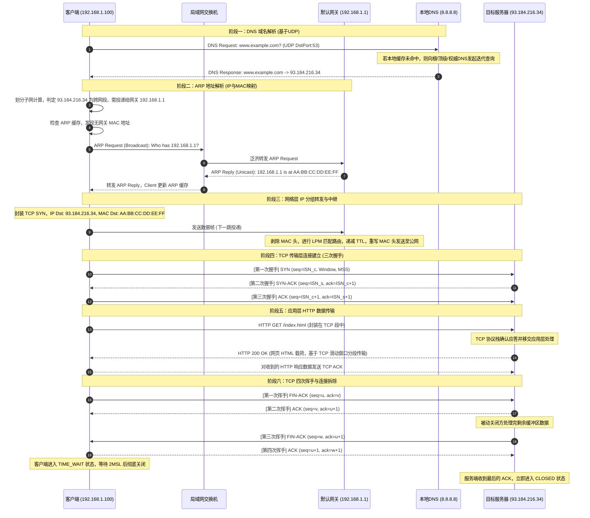

# 1.2.1.3 底层协议

在现代计算机网络中，任何一次看似简单的网络通信——例如在浏览器地址栏输入一个网址并加载出网页——其背后都是一个极其庞大、精密且复杂的底层协议协作系统在高速运转。从应用层对人类友好域名的解析，到物理介质上电信号与光信号的闪烁，网络协议栈的每一层都各司其职，又通过严密的接口与机制无缝衔接。

本篇将以一个终极推演场景为核心红线：**客户端主机（处于局域网内）在浏览器中输入域名并向目标服务器发起 HTTP 网页请求**。我们将以这根红线贯穿始终，深度剖析应用层（HTTP、DNS）、传输层（TCP、UDP）、网络层（IP、ICMP）以及数据链路层（ARP、以太网）在这一流转路径中的纵向时序演进和横向分层协议栈的数据封装与协作机理。

---

## 1. 宏观视野：网络协议栈的分层设计哲学与协作全景

### 1.1 协议分层的核心矛盾与设计哲学

计算机网络从诞生之初就面临着异构性与复杂性的巨大挑战。不同厂商的硬件、不同的物理介质（双绞线、光纤、无线电波）、不同的操作系统，如何能够毫无障碍地进行全球范围内的通信？

为了解决这一问题，计算机网络采用了**分层设计（Layering）**的哲学。分层的本质是“关注点分离（Separation of Concerns）”与“模块化解耦”。每一层只解决一个特定维度的核心矛盾，并向其上层提供标准化的接口，而对其下层的具体实现细节保持透明。

在网络通信中，主要存在以下几大核心矛盾：
1. **命名与寻址的解耦**：人类习惯使用具有语义的域名（如 `www.example.com`），而路由器和交换机等网络设备在寻址时使用的是固定长度之逻辑地址（IPv4/IPv6）。同时，在物理链路层，网卡硬件只识别由制造厂商固化的物理地址（MAC 地址）。如何在这三者之间建立实时、准确的映射与转换？这是 **DNS** 与 **ARP** 协议需要解决的核心矛盾。
2. **不可靠信道之上的可靠化传输**：底层的物理链路和网际 IP 网络本质上都是“尽力而为（Best-effort）”的不可靠信道，可能会发生丢包、乱序、重复和篡改。而上层的应用（如网页浏览、文件传输）则需要一个绝对可靠、按序到达的数据流。如何通过软件算法在不可靠的网际网之上构建出一条可靠的端到端逻辑通道？这是 **TCP** 传输层协议需要解决的核心矛盾。
3. **无中心控制的分布式路由中继**：全球存在数以亿计的异构网络，数据包在从源主机传输到目的主机的过程中，需要跨越多个不同的自治系统和路由器。在没有全局中央控制器的前提下，每个路由器如何独立、快速地决定数据包的下一跳去向，并且在链路损坏或环路发生时及时自我诊断与反馈？这是 **IP** 路由算法与 **ICMP** 差错控制协议需要解决的核心矛盾。

### 1.2 推演场景基础设定

为了让后续的推演具有具象化的物理实体与数据流向，我们设定以下典型的网络拓扑与参数：

* **客户端主机（Client）**：
  * 操作系统：通用类 Unix/Linux 内核操作系统
  * 局域网 IP 地址：`192.168.1.100`（子网掩码：`255.255.255.0`，前缀长度 `/24`）
  * 物理 MAC 地址：`00:11:22:33:44:55`
  * 默认网关（Gateway）IP 地址：`192.168.1.1`
* **局域网默认网关/路由器（Router）**：
  * LAN 侧 IP 地址：`192.168.1.1`
  * LAN 侧 MAC 地址：`AA:BB:CC:DD:EE:FF`
  * WAN 侧 IP 地址：`203.0.113.5`（假设为公网固定 IP）
* **本地域名服务器（Local DNS Server，简称 LDNS）**：
  * IP 地址：`8.8.8.8`（由 ISP 或网络管理员配置）
* **目标服务器（Server）**：
  * 域名：`www.example.com`
  * 公网 IP 地址：`93.184.216.34`（目标 IP）
  * 监听端口：`80`（HTTP 标准端口）

---

## 2. 协议交互图谱

在正式展开每个阶段的深度解析之前，我们通过下面的 Mermaid 时序图，直观展现从 DNS 解析、ARP 地址解析、TCP 三次握手、HTTP 数据交互，直到 TCP 四次挥手释放连接的完整生命周期演进：



下面我们将按照通信生命周期的六大阶段，对底层的协作机理、报文结构、算法细节以及边缘情况进行全景式的深度推演。

---

## 3. 阶段一：DNS 域名解析——名字空间向逻辑地址的收敛

当用户在浏览器地址栏中输入 `http://www.example.com/index.html` 并按下回车时，应用层拿到的目标标识是一个域名：`www.example.com`。由于 IP 协议族在设计上只识别固定长度的 IP 地址，因此通信的第一步必须是将人类可读的域名收敛为机器可寻址的 IP 地址。这一过程由 **DNS（Domain Name System）** 协议完成。

### 3.1 系统调用与存根解析器（Stub Resolver）的工作流

当浏览器发现需要建立连接的目标是域名时，它本身并不会直接去构造 DNS 报文。相反，它会发起一个系统调用（System Call），将域名解析的任务委托给操作系统的内核协议栈。

在符合 POSIX 标准的通用操作系统中，这一过程通常通过调用 C 标准库（libc）中的 `getaddrinfo()` 函数实现：

```c
#include <sys/types.h>
#include <sys/socket.h>
#include <netdb.h>

struct addrinfo hints, *res;
memset(&hints, 0, sizeof(hints));
hints.ai_family = AF_INET;       // 仅请求 IPv4 地址
hints.ai_socktype = SOCK_STREAM; // 面向流的套接字（TCP）

// 发起域名解析系统调用
int status = getaddrinfo("www.example.com", "80", &hints, &res);
```

操作系统中的**存根解析器（Stub Resolver）**作为客户端侧的 DNS 代理，在接收到 `getaddrinfo` 调用后，会按照系统配置文件 `/etc/nsswitch.conf`（Name Service Switch）中定义的顺序进行名字检索。通常的检索优先级如下：

1. **读取本地 Hosts 文件**：解析器首先会读取 `/etc/hosts` 文件。如果该文件中存在 `www.example.com` 的硬编码 IP 映射，则直接返回该 IP，解析结束。这是一种静态的本地名字服务。
2. **发起网络 DNS 查询**：若 Hosts 文件中无对应记录，解析器会读取配置文件 `/etc/resolv.conf`，获取网络管理员或 DHCP 协议动态分配的本地域名服务器（LDNS）的 IP 地址（在我们的设定中为 `8.8.8.8`）。

### 3.2 传输层协议的抉择：为什么 DNS 默认选择 UDP 协议？

在获取到本地域名服务器的 IP 后，解析器需要通过传输层将 DNS 请求发送出去。DNS 默认选择 **UDP（User Datagram Service）** 作为其主要的传输层载体，运行在服务器的 `53` 端口上。这一设计抉择背后的原因如下：

* **无连接与极低延迟**：TCP 建立连接需要进行三次握手，这会产生额外的 1.5 个往返时间（RTT）开销。对于域名解析这种单发单收的轻量级事务（一次请求，一次响应），使用 TCP 会使得建连开销远大于实际的数据传输开销。而 UDP 是无连接的，客户端可以直接将 DNS 请求封装成 UDP 数据报发送出去，在网络状况良好的情况下，只需 1 个 RTT 即可完成解析。
* **低服务端状态维护**：全球每天有海量的域名解析请求。如果全部采用 TCP，DNS 服务器为了维持这些 TCP 连接，需要在内核中分配大量的传输控制块（TCB，Transmission Control Block），这会极大地消耗服务器的内存与 CPU 资源。UDP 的无状态特性使得单个 DNS 服务器能够处理数以万计的并发查询。

#### DNS 对 TCP 的退化与备份机制

然而，UDP 限制了单个数据报的最大载荷。根据早期的 RFC 1035 标准，为了防止在复杂的互联网环境中发生 IP 分片（由于不同链路的 MTU 差异），基于 UDP 的 DNS 响应报文被严格限制在 **512 字节**以内。

如果 DNS 响应中包含大量的资源记录（如大量的 AAAA 记录、复杂的 TXT 记录或 DNSSEC 签名安全扩展），导致报文长度超过 512 字节，DNS 协议会触发**截断机制（Truncation）**：
1. 服务端会将 UDP 响应报文头部的 `TC`（Truncated）标志位置为 `1`，并将能装下的部分数据返回。
2. 客户端收到 `TC=1` 的 UDP 响应后，得知数据未传输完整。它会立即释放当前的 UDP 关联，转而通过 **TCP 53 端口**与本地域名服务器建立连接，重新发起一次完整的查询。由于 TCP 具有分段和流量控制机制，它可以安全地传输远超 512 字节的 DNS 数据。

> [!NOTE]
> 现代网络中引入了 **EDNS0（Extension Mechanisms for DNS 0, RFC 6891）** 扩展机制。客户端可以在 UDP DNS 请求的附加数据段（Additional Section）中插入一个特殊的 `OPT` 伪资源记录，宣告自己支持的 UDP 接收缓冲区大小（例如声明支持 4096 字节）。如果服务端也支持 EDNS0，它就可以在不超过该限制的情况下，通过 UDP 返回大于 512 字节的响应，从而大幅减少了向 TCP 退化的频率。

### 3.3 DNS 报文的内部结构解析

一个标准的 DNS 报文在应用层具有固定的格式，无论是请求还是响应，都使用相同的基本结构：

```
+-------------------------------------------------------------+
|          Header (头部) - 12 bytes                           |
+-------------------------------------------------------------+
|          Question (问题区段) - 查询域名及类型              |
+-------------------------------------------------------------+
|          Answer (回答区段) - 资源记录 (RRs)                 |
+-------------------------------------------------------------+
|          Authority (授权区段) - 指向权威DNS服务器的记录    |
+-------------------------------------------------------------+
|          Additional (附加区段) - 附加的IP地址等辅助信息   |
+-------------------------------------------------------------+
```

我们将最核心的 **Header 头部** 字段展开，其内部包含关键的控制信息：

* **Transaction ID（事务 ID，16位）**：由客户端随机生成的一个唯一标识符。由于 UDP 是无连接的，客户端可能会并发发送多个 DNS 请求，它通过对比响应报文中的 Transaction ID 与本地发送队列中的 ID 是否一致，来将响应与请求进行正确关联。同时，这也是防止 DNS 缓存污染和盲目伪造攻击的第一道防线。
* **Flags（标志，16位）**：
  * **QR（1位）**：`0` 代表 Query（请求），`1` 代表 Response（响应）。
  * **Opcode（4位）**：查询类型，`0` 代表标准查询（QUERY）。
  * **AA（Authoritative Answer，1位）**：仅在响应中有效。若为 `1`，说明回复该记录的服务器是该域名的权威 DNS 服务器，数据具有权威性，非缓存数据。
  * **TC（Truncation，1位）**：截断标志。若为 `1`，说明报文超过 512 字节被截断，需改用 TCP 重新查询。
  * **RD（Recursion Desired，1位）**：期望递归。若置为 `1`，客户端要求本地域名服务器必须以递归查询的方式代为寻找结果。
  * **RA（Recursion Available，1位）**：递归可用。由 DNS 服务器在响应中设置，表示该服务器是否支持递归查询。
  * **RCODE（Response Code，4位）**：状态码。`0` 代表无差错；`3` 代表 Name Error（NXDOMAIN），即域名不存在。

### 3.4 递归查询与迭代查询的分布式协同

域名空间是一个层级化的树状结构（例如：`.` 根域名 $\to$ `.com` 顶级域名 $\to$ `example.com` 二级域名 $\to$ `www.example.com` 主机名）。因此，DNS 的解析是一个由本地域名服务器主导的分布式协作查询过程，主要分为**递归查询**和**迭代查询**：

1. **客户端与 LDNS 之间的递归查询（Recursive Query）**：
   客户端主机向本地域名服务器（`8.8.8.8`）发送 DNS 请求，并设置 `RD = 1`。这代表客户端向 LDNS 发出指令：“我只需要最终的结果（IP 地址），如果你的缓存里没有，请帮我跑腿去问，不要让我自己去逐级查询。”
2. **LDNS 与外部域名服务器之间的迭代查询（Iterative Query）**：
   如果 LDNS 自身的缓存中没有 `www.example.com` 的记录，它会以迭代的方式向全球域名系统发起查询：
   * **咨询根域名服务器（Root Nameserver）**：LDNS向全球 13 组根域名服务器之一发送请求。根域名服务器并不直接知道 `www.example.com` 的 IP，但它解析了域名后缀 `.com`，于是向 LDNS 返回负责 `.com` 顶级域名的 **TLD 服务器** 的 IP 地址列表。
   * **咨询 TLD 域名服务器**：LDNS 转向联络 `.com` TLD 服务器。TLD 服务器同样不知道具体主机的 IP，但它记录了所有注册在 `.com` 下的二级域名信息。它通过查询，向 LDNS 返回负责管理 `example.com` 域名的**权威域名服务器（Authoritative Nameserver）**的 IP 地址。
   * **咨询权威域名服务器**：LDNS 向 `example.com` 的权威 DNS 服务器发送查询。权威服务器是该域名记录的终极管理者，它查找本地的区数据（Zone Data），在 Answer 区段中写入 `www.example.com` 的 **A 记录（Address Record）**：`93.184.216.34`，并将其返回给 LDNS。
3. **LDNS 回复客户端**：
   LDNS 将获取到的 A 记录写入 DNS 响应报文，并设置 `RA = 1` 和 `AA = 0`（因为对客户端而言，LDNS 是代理，不是直接的权威源），将响应通过 UDP 发送回客户端。客户端的 `getaddrinfo` 函数解除阻塞，拿到 IP 地址。

### 3.5 DNS 缓存与 TTL 机制

为了减轻全球 DNS 服务器的查询负载并降低客户端的解析延迟，DNS 广泛采用了多级缓存机制。然而，缓存的存在带来了一致性问题：如果目标服务器的 IP 地址发生变更，客户端如何能够及时感知并更新？这一矛盾通过 **TTL（Time-To-Live，生存时间）** 机制来解决。

A 记录的结构中包含一个 32 位的 TTL 字段，单位为秒。
* **缓存填充**：当权威服务器返回 A 记录时，会带上该记录的原始 TTL（例如 `3600`，代表 1 小时）。LDNS 在将该结果存入本地缓存时，会以当前的系统时间开始倒计时。
* **缓存消费**：当其他客户端向该 LDNS 发起相同域名的查询时，LDNS 会直接读取缓存，但返回的 TTL 会是倒计时后的剩余时间（例如 `1200`）。
* **缓存失效与重新查询**：当 TTL 递减至 `0` 时，LDNS 会将该缓存条目彻底清除。下一次查询将重新触发完整的迭代查询。

> [!TIP]
> **TTL 设定的工程权衡**：
> * **小 TTL（如 60 秒）**：适用于需要频繁进行容灾切换或动态域名解析（DDNS）的场景。缺点是会显著增加全球 DNS 服务器的查询压力，且客户端每次解析的平均时延会因为缓存命中率低而升高。
> * **大 TTL（如 86400 秒/1天）**：极大提升了解析速度和减轻了网络负载。缺点是如果后端服务器发生故障需要切换 IP，全球各地的 LDNS 和客户端需要长达一天的时间才能完全完成解析更新，存在严重的传播滞后性。

---

## 4. 阶段二：ARP 地址解析——逻辑地址至物理地址的转换

经过阶段一，客户端的应用层和网络层拿到了目标服务器的逻辑 IP 地址 `93.184.216.34`。但在局域网的物理实现中，网卡（NIC）无法直接将 IP 包丢向空中或双绞线，它必须将 IP 报文封装在**以太网数据帧（Ethernet Frame）**中，而以太网帧的头部必须明确填写源物理 MAC 地址和目的物理 MAC 地址。

将网络层逻辑 IP 地址映射为数据链路层物理 MAC 地址的桥梁，就是 **ARP（Address Resolution Protocol，地址解析协议）**。

### 4.1 子网掩码的逻辑计算与网关定位

在封装以太网数据帧之前，客户端主机的网络层协议栈必须首先执行一个核心逻辑操作：**判定目的 IP 地址与自己是否处于同一个本地直连网段（子网）**。

客户端使用自己的子网掩码 `255.255.255.0`，分别与自己的 IP 和目的 IP 进行按位与（AND）运算：

$$\text{Client Subnet} = 192.168.1.100 \land 255.255.255.0 = 192.168.1.0$$

$$\text{Destination Subnet} = 93.184.216.34 \land 255.255.255.0 = 93.184.216.0$$

因为 $\text{Client Subnet} \neq \text{Destination Subnet}$，网络层得出结论：**目的主机与自己不在同一个子网内**。

由于以太网广播无法穿透路由器（路由器隔离了广播域），客户端无法在本地局域网内直接通过广播寻找目标 IP `93.184.216.34` 的 MAC 地址。数据包必须经由**默认网关（Default Gateway）**进行中继。

因此，客户端需要解决的问题转变为：**获取默认网关 `192.168.1.1` 的物理 MAC 地址**。

### 4.2 ARP 广播请求与单播响应的精细流转

为了获取网关的 MAC 地址，客户端首先会检索本地的 **ARP 缓存表（ARP Cache Table）**。如果表中存在 `192.168.1.1` 对应的 MAC 地址，则直接使用。若无对应的映射条目，客户端则必须启动 ARP 协议的动态解析流程。

#### 1. 客户端构建并发送 ARP 请求报文（ARP Request）

ARP 报文直接封装在数据链路层的数据帧中，其协议字段（EtherType）为 `0x0806`。ARP 请求报文的结构如下：

```
+-------------------------------------------------------------------+
| 硬件类型 (Ethernet: 1)       | 协议类型 (IPv4: 0x0800)             |
+-------------------------------------------------------------------+
| 硬件地址长度 (6)             | 协议地址长度 (4)                    |
+-------------------------------------------------------------------+
| 操作码 (OP: 1 代表 Request)                                       |
+-------------------------------------------------------------------+
| 源 MAC 地址 (00:11:22:33:44:55)                                   |
+-------------------------------------------------------------------+
| 源 IP 地址 (192.168.1.100)                                        |
+-------------------------------------------------------------------+
| 目的 MAC 地址 (00:00:00:00:00:00 - 填充为空)                       |
+-------------------------------------------------------------------+
| 目的 IP 地址 (192.168.1.1 - 网关 IP)                              |
+-------------------------------------------------------------------+
```

为了让局域网内的所有设备都能收到该请求，数据链路层将该 ARP 报文封装在一个以太网帧中，其帧头部的**目的 MAC 地址填写为广播地址 `FF:FF:FF:FF:FF:FF`**。

#### 2. 交换机（Switch）的二层泛洪与 MAC 地址学习

当以太网数据帧到达局域网交换机时，交换机执行以下操作：
* **MAC 地址学习**：交换机读取该帧的源 MAC 地址 `00:11:22:33:44:55`，并将其与接收到该帧的物理端口（假设为 Port 3）关联起来，记录在交换机的 **MAC 地址表（CAM Table）**中。
* **泛洪（Flooding）**：交换机读取目的 MAC 地址 `FF:FF:FF:FF:FF:FF`。识别到这是一个广播帧后，交换机将该帧复制并从**除了接收端口（Port 3）之外的所有活动端口**转发出去。

#### 3. 网关主机的识别与单播响应（ARP Reply）

局域网内的所有设备（包括其他主机和网关路由器）都会从网卡接收到这个广播帧，并解封装上交给 ARP 模块。
* 其它普通主机在解析 ARP 报文后，发现“目的 IP 地址”为 `192.168.1.1`，与自身的 IP 地址不匹配，于是直接**丢弃**该报文，不作任何响应。
* 网关路由器 `192.168.1.1` 接收到报文后，发现目的 IP 与自身 LAN 侧接口的 IP 完全匹配：
  1. 网关首先将源主机 `192.168.1.100` $\to$ `00:11:22:33:44:55` 的映射关系记录到自己的 ARP 缓存表中（以便后续给客户端回包）。
  2. 网关构建 **ARP 应答报文（ARP Reply）**。此时，操作码（OP）设为 `2`（Reply），源 MAC 填写为网关自身的 MAC `AA:BB:CC:DD:EE:FF`，源 IP 填 `192.168.1.1`，目的 MAC 填客户端的 MAC `00:11:22:33:44:55`，目的 IP 填 `192.168.1.100`。
  3. 数据链路层封装时，以太网帧头的**目的 MAC 地址填写为单播地址 `00:11:22:33:44:55`**。

#### 4. 交换机定向转发与客户端接收

当单播以太网帧到达交换机时，交换机在其 CAM 表中检索目的 MAC `00:11:22:33:44:55`，发现其对应 Port 3。于是，交换机**只将该帧从 Port 3 转发出去**，其他端口不会收到该报文。这种单播响应机制极大地节省了局域网的带宽资源。

客户端在 Port 3 接收到该帧，解封装后读取网关的 MAC 地址，并将 `192.168.1.1` $\to$ `AA:BB:CC:DD:EE:FF` 写入本地的 ARP 缓存表中。

### 4.3 Linux 内核中的 ARP 缓存老化状态机

ARP 缓存表不能是永久有效的。如果局域网内的设备网卡更换，或者 IP 地址重新分配，陈旧的 ARP 缓存会导致数据发送失败。以 Linux 内核的邻居子系统（Neighbor System）为例，ARP 缓存条目有着严密的状态机管理：

* **INCOMPLETE**：正在发送 ARP 请求，但尚未收到应答。
* **REACHABLE**：收到 ARP 应答后的正常状态。在此状态下，内核直接使用该缓存发送数据。该状态会维持一个随机范围的时间（通常在 15 到 45 秒之间，由 `base_reachable_time` 决定），以防止局域网内所有设备的缓存同时老化导致 ARP 广播风暴。
* **STALE**：超时时间过后，条目转入 STALE（陈旧）状态。此时，该条目依然可以用来发送数据，但内核会将该条目标记为“需要验证”。
* **DELAY**：当有数据包要发送给一个处于 STALE 状态的邻居时，内核会将数据包发送出去，并启动一个延时定时器（通常为 5 秒），并等待上层协议（如 TCP 收到 ACK）的确认信号，以此证明该物理路径依然畅通。如果收到确认，条目重新变回 REACHABLE。
* **PROBE**：如果延时定时器超时且未收到任何上层协议的确认，条目进入 PROBE 探测状态。在此状态下，内核会开始发送**单播 ARP 请求**进行积极探测（默认重试 3 次）。若收到 Reply，变回 REACHABLE；若重试全部失败，条目进入 **FAILED** 状态，随后被内核垃圾回收（GC）机制清理。

### 4.4 免费 ARP（Gratuitous ARP）机制

免费 ARP 是一种特殊的 ARP 请求报文。它的特殊之处在于：**报文中的源 IP 地址和目的 IP 地址完全相同，都是发送者自身的 IP**，且以太网目的 MAC 为广播地址。

免费 ARP 在局域网中发挥着以下三个至关重要的底层作用：
1. **IP 冲突检测**：当主机刚启动网卡或者通过 DHCP 获取到 IP 地址时，它会立即向局域网发送一个免费 ARP 请求。如果局域网内有其他主机已经占用了该 IP，那台主机会回复一个 ARP 应答。发送方收到应答后即可判定 IP 冲突，从而向系统报告错误并停用该 IP。
2. **刷新邻居的 ARP 缓存**：如果主机的网卡物理损坏进行了更换，其 MAC 地址发生了改变，但 IP 地址保持不变。通过发送免费 ARP 广播，局域网内所有其他主机的 ARP 缓存表会自动将该 IP 对应的旧 MAC 地址更新为最新的物理 MAC 地址。
3. **更新交换机的端口与 MAC 映射（防漂移）**：在双机热备（如高可用集群中的 VIP 虚拟 IP 漂移）场景下，IP 地址 `192.168.1.1` 从服务器 A 漂移到服务器 B。此时服务器 B 必须立即发送免费 ARP 广播，促使局域网交换机刷新其 CAM 表，将目的为该 VIP 的物理流量从指向服务器 A 的端口重新导向指向服务器 B 的端口。

---

## 5. 阶段三：路由转发与 ICMP 差错控制——网络层的核心骨干

当客户端通过 ARP 获取到网关的 MAC 地址后，便可以将承载着 HTTP 请求的数据包发送给网关。在网络层，这一过程依赖于 IP（Internet Protocol）协议的封装、最长前缀匹配（LPM）路由算法，以及 ICMP（Internet Control Message Protocol）协议提供的网络层差错控制与反馈机制。

### 5.1 网络层 IP 分组的封装

客户端将传输层交下来的 TCP 报文段封装进 IP 数据报（IP Datagram）中。IPv4 报文的首部结构非常严密，标准长度为 `20` 字节（不含 Options 选项）：

```
 0                   1                   2                   3
 0 1 2 3 4 5 6 7 8 9 0 1 2 3 4 5 6 7 8 9 0 1 2 3 4 5 6 7 8 9 0 1
+-+-+-+-+-+-+-+-+-+-+-+-+-+-+-+-+-+-+-+-+-+-+-+-+-+-+-+-+-+-+-+-+
|Version|  IHL  |Type of Service|          Total Length         |
+-+-+-+-+-+-+-+-+-+-+-+-+-+-+-+-+-+-+-+-+-+-+-+-+-+-+-+-+-+-+-+-+
|         Identification        |Flags|      Fragment Offset    |
+-+-+-+-+-+-+-+-+-+-+-+-+-+-+-+-+-+-+-+-+-+-+-+-+-+-+-+-+-+-+-+-+
|  Time to Live |    Protocol   |        Header Checksum        |
+-+-+-+-+-+-+-+-+-+-+-+-+-+-+-+-+-+-+-+-+-+-+-+-+-+-+-+-+-+-+-+-+
|                         Source IP Address                     |
+-+-+-+-+-+-+-+-+-+-+-+-+-+-+-+-+-+-+-+-+-+-+-+-+-+-+-+-+-+-+-+-+
|                      Destination IP Address                   |
+-+-+-+-+-+-+-+-+-+-+-+-+-+-+-+-+-+-+-+-+-+-+-+-+-+-+-+-+-+-+-+-+
```

我们在本推演中重点剖析以下与路由转发和分片相关的核心字段：

* **Total Length（总长度，16位）**：指 IP 报文（首部 + 数据）的总字节数。最大限制为 65535 字节。
* **Time to Live（TTL，生存时间，8位）**：防环路机制的核心。报文每经过一个路由器，该值减 `1`。当 TTL 减至 `0` 时，路由器会丢弃该报文，并向源主机发送 ICMP 超时报文。这防止了因为路由环路导致报文在网络中无限循环，消耗带宽资源。
* **Protocol（协议类型，8位）**：标识上层传输层协议。`6` 代表 TCP，`17` 代表 UDP，`1` 代表 ICMP。
* **Header Checksum（首部校验和，16位）**：仅对 IP 首部进行校验。由于每次经过路由器 TTL 都会改变，因此**每一跳路由器都必须重新计算首部校验和**。
* **Identification、Flags、Fragment Offset（IP 分片控制）**：
  * **Identification（标识，16位）**：由源主机分配，同一个原始 IP 报文的所有分片都具有相同的 Identification。
  * **Flags（标志，3位）**：第一位保留。第二位为 **DF（Don't Fragment，不分片）**，若置为 `1`，表示禁止任何路由器对该报文进行分片。第三位为 **MF（More Fragments，更多分片）**，若置为 `1`，说明后面还有分片；若为 `0`，且分片偏移不为 `0`，说明当前分片是最后一个分片。
  * **Fragment Offset（片偏移，13位）**：标识当前分片的数据部分在原始 IP 报文数据载荷中的相对位置，以 **8 字节**为基本单位。

#### IP 分片与重组的底层计算

假设客户端需要发送一个长度为 `4000` 字节的 IP 报文（20 字节 IP 首部 + 3980 字节 TCP 段），但其出口链路（以太网）的 MTU 限制为 `1500` 字节。因为报文长度大于 MTU，且 DF 标志为 `0`，IP 层将执行分片：

1. **分片一**：
   * 最大可承载的数据载荷 = $1500 - 20 = 1480$ 字节。
   * 报文总长度 = 1500 字节。
   * `MF = 1`（后续还有分片），`DF = 0`。
   * 片偏移 `Fragment Offset = 0`（起始位置为 0 字节，即 $0 / 8$）。
2. **分片二**：
   * 数据载荷 = 1480 字节。
   * 报文总长度 = 1500 字节。
   * `MF = 1`（后续还有分片），`DF = 0`。
   * 片偏移 `Fragment Offset = 185`（即数据起始于原始位置的 1480 字节处，计算公式：$1480 / 8 = 185$）。
3. **分片三**：
   * 剩余数据载荷 = $3980 - 1480 - 1480 = 1020$ 字节。
   * 报文总长度 = $1020 + 20 = 1040$ 字节。
   * `MF = 0`（这是最后一个分片），`DF = 0`。
   * 片偏移 `Fragment Offset = 370`（数据起始于 $1480 \times 2 = 2960$ 字节处，计算公式：$2960 / 8 = 370$）。

> [!WARNING]
> **IP 分片的性能代价**：
> 中间路由器不负责分片的重组，重组只能由目的主机的网络层协议栈在接收端完成。由于 IP 协议没有确认与重传机制，只要其中任何一个分片在传输中丢失，目的主机将无法重组出完整的原始报文，从而导致**整个 IP 数据报（包含所有已成功接收的分片）全部被丢弃**。这需要传输层（TCP）重新发起重传。因此，现代传输层协议（如 TCP）会尽全力避免 IP 分片的发生。

### 5.2 最长前缀匹配（LPM）算法与路由转发

网关路由器收到客户端的数据帧后，剥除以太网帧头，将其送入网络层的路由引擎。路由器需要根据报文的“目的 IP 地址” `93.184.216.34` 来决定将其从哪个物理端口转发出去，发送给哪一个“下一跳（Next Hop）”路由器。这一检索过程依赖于 **LPM（Longest Prefix Match，最长前缀匹配）** 算法。

#### LPM 算法原理与路由表匹配

假设网关路由器的路由表中包含以下几条核心路由条目：

| 目的网段/前缀 (Destination/Prefix) | 下一跳 (Next Hop) | 输出物理接口 (Interface) | 备注 |
| :--- | :--- | :--- | :--- |
| `192.168.1.0/24` | `直连 (Direct)` | `eth0 (LAN)` | 本地局域网 |
| `93.184.216.0/24` | `203.0.113.1` | `eth1 (WAN)` | 目标子网路由 |
| `93.184.0.0/16` | `203.0.113.9` | `eth1 (WAN)` | 较宽网段路由 |
| `0.0.0.0/0` | `203.0.113.254` | `eth1 (WAN)` | 默认路由 |

当目的 IP `93.184.216.34` 到达时，路由引擎会将其与每一条路由条目的掩码进行“按位与”操作：

1. 与第一个条目匹配：`93.184.216.34 & 255.255.255.0 = 93.184.216.0`，不等于 `192.168.1.0`（未命中）。
2. 与第二个条目匹配：`93.184.216.34 & 255.255.255.0 = 93.184.216.0`，等于 `93.184.216.0`（命中，前缀匹配长度为 24 位）。
3. 与第三个条目匹配：`93.184.216.34 & 255.255.0.0 = 93.184.0.0`，等于 `93.184.0.0`（命中，前缀匹配长度为 16 位）。
4. 与第四个条目匹配：`93.184.216.34 & 0.0.0.0 = 0.0.0.0`（默认命中，前缀匹配长度为 0 位）。

此时，第二、第三、第四条路由均满足匹配条件。根据 **LPM 原则**，匹配前缀越长（掩码长度越大），说明路由越具体、越精确。因此，路由器最终选择**第二条路由**，决定将数据包通过 `eth1` 接口发送给下一跳 IP `203.0.113.1`。

#### 路由检索的工程实现

在软件层面，如果路由表庞大（例如互联网核心 BGP 路由表已超过百万条记录），线性扫描每个条目会导致转发延迟极高。操作系统内核（如 Linux 的 FIB 邻居表）通常使用基于 **Patricia Trie**（一种压缩的二叉前缀树）或其变体（如 LC-Trie，Level-Compressed Trie）的数据结构来进行快速检索。

在高端企业级核心交换机和骨干网路由器中，为了达到“线速转发”（Wire-Speed Forwarding），匹配过程完全在硬件电路中完成。路由器采用 **TCAM（Ternary Content Addressable Memory，三态内容寻址寄存器）**，它允许在单个时钟周期内，并行对所有路由表项进行“0、1、X（忽略）”的三态匹配，瞬间输出匹配度最高且前缀最长的物理输出接口索引。

### 5.3 逐跳（Hop-by-Hop）转发与 MAC 数据帧重写机理

网络通信在物理层面上是逐跳（Hop-by-Hop）中继的。我们需要理解在跨越每个路由器（即跨越不同的 IP 子网边界）时，数据包头部发生的物理改变：

* **IP 头部（网络层）**：
  * **源 IP 与目的 IP 保持不变**：在不考虑 NAT（网络地址转换）的前提下，源 IP `192.168.1.100` 和目的 IP `93.184.216.34` 在整个长途传输过程中始终保持一致。
  * **TTL 递减**：每经过一个路由器，TTL 减 `1`。
  * **校验和重算**：由于 TTL 变了，IP 头的 Checksum 必须在每一跳重新计算。
* **以太网帧头（数据链路层）**：
  * **每一跳彻底重写**：当网关路由器将数据包发送给下一跳 `203.0.113.1` 时，它会彻底剥离客户端发来的以太网帧头。重新封装新的以太网帧头，其中源 MAC 地址修改为网关 WAN 口的物理 MAC，目的 MAC 地址修改为下一跳路由器 `203.0.113.1` 的 WAN 口 MAC（该 MAC 地址同样通过 WAN 口运行的 ARP 协议动态获取）。

### 5.4 ICMP 协议：网络层的差错反馈回路

IP 协议本身被设计为一种“尽力而为”的无连接协议。这意味着，当报文在传输途中因各种原因被路由器丢弃时，IP 协议自身没有任何通知和纠错机制。为了弥补这一缺陷，**ICMP（Internet Control Message Protocol，网际控制报文协议）** 应运而生。

ICMP 承载在 IP 数据报的数据部分（协议字段为 `1`）。其核心报文格式如下：

```
+-------------------------------------------------------------+
|  Type (类型 - 8位)   |  Code (代码 - 8位)                    |
+-------------------------------------------------------------+
|  Checksum (校验和 - 16位)                                    |
+-------------------------------------------------------------+
|  Rest of Header (首部其余部分 - 32位，视类型而定)              |
+-------------------------------------------------------------+
|  Data Section (数据部分 - 包含导致出错的原始IP首部+前8字节)     |
+-------------------------------------------------------------+
```

#### 1. 差错控制报文的触发场景

当发生以下网络层异常时，路由器会丢弃原报文并向源主机发送 ICMP 差错控制报文：

* **目标不可达（Destination Unreachable，Type = 3）**：
  * `Code = 0`（网络不可达）：路由器在路由表中找不到匹配目的 IP 的任何路由，也无默认路由。
  * `Code = 1`（主机不可达）：目标子网内，通过 ARP 广播探测目的主机 IP 的 MAC 地址，在规定时间内无任何响应（说明该主机已关机或 IP 未启用）。
  * `Code = 4`（需要进行分片但设置了 DF 标志）：当数据包大小超过了某条出口链路的 MTU，但 IP 首部中的 `DF`（不分片）标志置为 `1`。路由器只能丢弃该报文，并在返回的 ICMP 报文中注明该出口链路的 MTU 大小，以便源主机重新调整发送大小（这是 **PMTUD，路径 MTU 发现机制** 的基石）。
* **超时（Time Exceeded，Type = 11）**：
  * `Code = 0`（传输中超时）：当路由器接收到 IP 分组，发现其 `TTL` 减 1 后的值变为了 `0`。路由器丢弃报文并向源主机发送超时报文，指示路径中可能存在路由环路，或者传输跳数超出了初始 TTL。

> [!IMPORTANT]
> **差错报文的数据携带机制**：
> 当路由器生成 ICMP 差错报文时，会在其 Data Section（数据部分）中完整复制**导致差错的那个原始 IP 报文的首部，以及该报文载荷的前 8 个字节**。
> 这前 8 字节包含了传输层的源端口和目的端口（对于 TCP/UDP）。当源主机收到这个 ICMP 差错报文后，其内核协议栈会读取这 8 字节，精准识别出是本地哪个进程或哪个 TCP 套接字发送的数据出错，从而能在应用层或传输层报告错误（例如在套接字上抛出 `Connection Refused` 或 `Connection Timeout` 异常）。

#### 2. 路径诊断的艺术：Traceroute 工作原理

ICMP 协议的“超时”和“目标不可达”机制被巧妙地结合起来，诞生了经典的路径诊断工具：`Traceroute`。其推演机制如下：

1. **探测第一跳**：客户端向目的 IP 发送一个 UDP 数据报，目的端口故意设置为一个不常用的高端口（如 `33434`），并将 IP 头的 `TTL` 设置为 `1`。
2. **第一跳响应**：Router 1 接收到该报文，发现 TTL 减 1 变为了 0，于是丢弃报文，向客户端回送一个 ICMP 超时报文（Type 11, Code 0）。客户端由此获取 Router 1 的公网 IP 地址并记录往返时间（RTT）。
3. **探测第二跳**：客户端发送第二个 UDP 报文，将 `TTL` 设置为 `2`。
4. **第二跳响应**：该报文安全穿过 Router 1（此时 TTL 变为 1），到达 Router 2 后 TTL 减为 0。Router 2 丢弃报文并返回 ICMP 超时报文。客户端获取 Router 2 的 IP 地址。
5. **以此类推**，TTL 逐步递增，直到报文到达最终的目标服务器。
6. **终点判定**：由于报文的目的端口是 `33436` 等高端口，目标服务器上并没有进程监听此端口。目标服务器的传输层（UDP）会拒绝该报文，并向客户端回送一个 **ICMP 端口不可达报文（Type 3, Code 3）**。
7. 客户端收到“端口不可达”报文而非“超时”报文，判断数据包已成功抵达终点，诊断结束，输出完整的路由路径。

---

## 6. 阶段四：TCP 传输层连接建立——三次握手的机制与状态机

在网络层打通物理路径后，应用层的 HTTP 请求需要一个面向连接的、可靠的、基于字节流的传输服务。这需要传输层的 **TCP（Transmission Control Protocol）** 协议在网际层之上建立起端到端的逻辑连接。

### 6.1 三次握手的精细时序与状态变迁

TCP 连接的建立过程被称为“三次握手”（Three-way Handshake）。这一过程不仅要建立逻辑连接，还要进行关键参数的协商与同步。其精细时序与状态迁移如下：

1. **第一次握手：客户端发送 SYN 报文段**
   * 客户端发送连接请求报文段，将 TCP 首部中的控制位 **SYN（Synchronize）** 置为 `1`。
   * 客户端随机生成自己的**初始序列号（ISN，Initial Sequence Number）**，记为 $ISN_c$（例如 `1000`），并填入 `Sequence Number` 字段。
   * 此时客户端状态由 `CLOSED` 转入 **`SYN_SENT`** 状态。该报文不能携带应用层数据，但会**消耗一个序列号**。
2. **第二次握手：服务器返回 SYN-ACK 报文段**
   * 服务器接收到 SYN 报文，同意建立连接，向客户端发送响应。
   * 服务器将控制位 **SYN** 和 **ACK** 同时置为 `1`。
   * 服务器将确认号（Acknowledgment Number）设为对端序列号加 1，即 $ack = ISN_c + 1$（`1001`），表示“我已经收到了你的序列号 $ISN_c$，我期望下一次收到你从 $ISN_c + 1$ 开始的数据”。
   * 同时，服务器随机生成自己的初始序列号 $ISN_s$（例如 `5000`），填入 `Sequence Number`。
   * 服务器状态由 `LISTEN` 转入 **`SYN_RCVD`**。该报文同样消耗一个序列号，不携带数据。
3. **第三次握手：客户端确认 ACK**
   * 客户端收到服务器的 SYN-ACK 报文，向服务器发送最后的确认。
   * 客户端将控制位 **ACK** 置为 `1`。
   * 确认号设为对端序列号加 1，即 $ack = ISN_s + 1$（`5001`）；序列号设为 $seq = ISN_c + 1$（`1001`）。
   * 客户端状态立即转为 **`ESTABLISHED`**。服务器接收到该 ACK 报文后，状态也转为 **`ESTABLISHED`**。此时，双向连接宣告建立。

> [!NOTE]
> 第三次握手报文在技术上**可以携带应用层数据**（例如客户端可以在发送 ACK 的同时，将 HTTP 请求报文的首部封装在同一个 TCP 报文段中发送出去）。如果不携带数据，该 ACK 报文段将**不消耗序列号**，下一次发送数据时其序列号依然是 $seq = ISN_c + 1$。

### 6.2 深度剖析：为什么是三次握手？

为什么两次握手不够，或者为什么不需要四次握手？这是 TCP 协议设计中最经典的哲学问题之一。

#### 原因一：防止历史失效的连接请求突然到达服务端（RFC 793 核心设计）

在不可靠的网络中，数据包可能会因为路由选择问题在某个网络节点严重滞留。

* **假设仅需两次握手**：
  1. 客户端发送了第一个连接请求 SYN 报文段（记为 $SYN_1$），由于网络延迟，客户端迟迟未收到确认。
  2. 客户端判定 $SYN_1$ 丢失，于是重新发送了第二个连接请求（记为 $SYN_2$），通过两次握手顺利建连、传输数据并正常释放了连接。
  3. 随后，那个滞留的 $SYN_1$ 终于到达了服务器。服务器收到后，以为客户端又发起了一次新连接，于是立刻回复确认 ACK 并单方面进入 `ESTABLISHED` 状态。
  4. 但此时客户端正处于 `CLOSED` 状态，对服务器发来的确认不予理睬。服务器却一直在那里等待客户端发送数据，导致服务器的系统资源（TCB 内存、半连接队列等）被白白浪费。
* **在三次握手机制下**：
  1. 服务器收到滞留的 $SYN_1$ 后，回复 $SYN_1\text{-}ACK$ 给客户端。
  2. 客户端收到后，发现此报文段中确认的确认号对应的不是自己期望的序列号（因为客户端根本没有处于发送状态），得知这是一个过期的历史连接。
  3. 客户端会向服务器发送一个 **RST（Reset，复位）** 报文段。
  4. 服务器收到 RST 报文段后，主动释放刚刚建立的连接状态，成功避免了僵尸连接的产生。

#### 原因二：同步并确认双方的初始序列号（ISN）

TCP 是一个全双工（Full-Duplex）的可靠通道，两端都必须能够独立发送和接收数据。
* 序列号是实现 TCP 按序到达、超时重传和去重机制的基石。
* 客户端需要同步其 $ISN_c$ 并得到服务器的确认（需要 1 来 1 回两次交互）。
* 服务器也需要同步其 $ISN_s$ 并得到客户端的确认（同样需要 1 来 1 回两次交互）。
* 在实际实现中，服务器将对客户端序列号的确认（ACK）与自己的序列号同步（SYN）合并为一个报文段发送（第二次握手），因此将原本需要四次的交互优化合并为了三次。

### 6.3 初始序列号（ISN）的安全性设计

为什么初始序列号不能从 `0` 或固定值开始？

如果 ISN 是可预测的，攻击者很容易通过旁路监听或盲目伪造来发起**连接劫持（Connection Hijacking）**或**数据注入攻击**。攻击者只要伪造一个源 IP 相同的报文，并将 TCP 序列号计算在当前窗口内，服务器就会误接收恶意伪造的数据包。

现代操作系统为了防范这一漏洞，通常采用基于时钟计数器与加密哈希算法的随机生成机制。在 Linux 内核中，生成 ISN 的核心公式如下：

$$ISN = M(t) + \text{SHA256}(\text{SrcIP}, \text{DstIP}, \text{SrcPort}, \text{DstPort}, \text{SecretKey})$$

* $M(t)$：一个微秒级的单调递增时钟计数器（每隔固定微秒自增 1），保证在同一五元组连接中序列号随时间单调递增。
* $\text{SecretKey}$：内核在启动时随机生成的一个 $128$ 位的安全密钥，保证外部攻击者无法逆向破解哈希算法。
* 这种设计使得每个新连接的 $ISN$ 都是高度随机且完全不可预测的。

### 6.4 三次握手期间的参数协商

在三次握手阶段，双方通过 TCP 报文首部中的 **Options（选项）** 字段，协商并确定了后续数据传输的关键参数：

1. **MSS（Maximum Segment Size，最大报文段长度）**：
   * 指 TCP 报文段中数据载荷部分的最大字节数。
   * **确立细节**：客户端和服务器在各自的 SYN 报文里通告自己本地链路所支持的 MSS（通常根据本地接口的 MTU 动态计算得出，例如以太网 MTU 为 1500，则 $MSS = 1500 - 20(IP首部) - 20(TCP首部) = 1460$ 字节）。
   * 双方在收到对方的 MSS 后，会选择**两者中的较小值**作为本次 TCP 连接的发送 MSS。这样可以确保数据包在后续的网络传输中，不会因为超过任意一方的链路 MTU 而在网络层被强制分片，大幅提升了传输效率。
2. **Window Scale（窗口扩大因子，WS）**：
   * TCP 首部的 `Window` 字段只有 16 位，最大值只能表示 65535 字节（64KB）。在高带宽延时积（BDP，Bandwidth-Delay Product）的网络环境（如长肥管道 LFN）中，这个窗口上限会极大地限制吞吐量。
   * 在 SYN 报文中，双方可以携带 Window Scale 选项，指定一个移位位数（Shift Count，取值范围 `0-14`）。
   * 例如，如果协商的 Window Scale 为 `7`，表示实际的接收窗口大小为 TCP 头部 Window 字段值乘以 $2^7$（即左移 7 位，放大 128 倍），从而将实际窗口上限拓展到了 $65535 \times 2^{14} \approx 1GB$。

<h3>6.5 SYN Flood 洪水攻击与 SYN Cookies 防御机制</h3>

三次握手虽然精妙，但其在资源分配上的“不对称性”带来了一个著名的安全隐患：**SYN Flood 拒绝服务攻击**。

#### SYN Flood 攻击机理

当服务器接收到客户端的 SYN 报文后，会将该连接记录在操作系统的 **半连接队列（SYN Queue）** 中，并为其分配一定的 TCB 内存资源，回复 SYN-ACK。此时连接尚未完全建立，处于 `SYN_RCVD` 状态。
如果攻击者使用伪造的随机源 IP 地址，向服务器发送海量的 SYN 报文，服务器会回复大量的 SYN-ACK。但由于源 IP 是伪造的，这些 SYN-ACK 会被发送至不存在的主机或无响应的主机，服务器永远也等不到第三次握手的 ACK。这导致服务器的半连接队列迅速被占满（达到系统限制，如 `tcp_max_syn_backlog`），后续正常的合法用户请求因为队列已满而被直接丢弃，造成拒绝服务。

#### SYN Cookies 防御机制

当服务器开启了 `tcp_syncookies` 机制且半连接队列发生溢出时，服务器转入一种特殊的防御模式：**不分配任何系统内存来保存半连接信息，也不将其存入半连接队列**。

服务器通过一套密码学算法，将该连接的核心元数据（五元组、时间戳、MSS 选项等）进行加密哈希，并直接作为第二次握手 SYN-ACK 的**初始序列号 $ISN_s$（即 Cookie）** 发送给客户端：

$$ISN_s = \text{Hash}(\text{SrcIP}, \text{DstIP}, \text{SrcPort}, \text{DstPort}, \text{SecretKey}) + \Delta t + \text{Encoded\_MSS}$$

* $\Delta t$：一个低精度的单调递增时间戳（通常 3 位，用于防重放攻击）。
* $\text{Encoded\_MSS}$：将协商的 MSS 值映射编码为 3 位指数值存放在序列号的低位中。

当合法客户端收到该 SYN-ACK 并正常回复第三次握手的 ACK 报文时，其确认号发送为 $ack = ISN_s + 1$。
服务器接收到此 ACK 后，**反向执行 Cookie 解密与校验**：将确认号减去 1 得到发送时的 $ISN_s$，重新计算哈希值进行对比，并从中解析出时间戳和 MSS 选项。若校验通过，说明这是一个真实的客户端，服务器这才在本地内核中为该连接创建 TCB 状态控制块并分配合法内存，直接移交给 **全连接队列（Accept Queue）**。这一技术实现了在不占用服务端资源的条件下完成连接真实性校验。

---

## 7. 阶段五：应用层 HTTP 数据传输——基于 TCP 可靠信道的应用交付

三次握手成功后，TCP 在网络层之上抽象出了一条可靠的“双向字节流”通道。此时，客户端应用层（浏览器）构建的 HTTP GET 请求，就可以通过这条可靠的通道安全地投递至服务器。

### 7.1 应用层数据封装与套接字缓冲区拷贝

浏览器首先构建 HTTP 请求报文，其结构为典型的文本格式：

```http
GET /index.html HTTP/1.1
Host: www.example.com
User-Agent: GenericBrowser/1.0
Accept: text/html,application/xhtml+xml
Connection: keep-alive

```

应用层通过调用 Socket API 中的 `write()` 或 `send()` 函数，将该请求报文写入套接字的 **TCP 发送缓冲区（Send Buffer）** 中：

```c
// 此调用仅将数据从用户态缓冲区拷贝至内核态 TCP 发送缓冲区
ssize_t bytes_sent = send(sockfd, http_request_buffer, request_len, 0);
```

这是一个极其核心的物理边界：**对于应用程序而言，`send` 返回成功仅仅代表数据已被成功拷贝至内核的发送缓冲区，并不代表数据已经发送到了物理网络上，更不代表对端已经成功接收。**

后续的数据分段（Segmentation）、可靠性校验、拥塞控制和网络发送，全部由操作系统的 TCP/IP 内核协议栈自主调度。

### 7.2 TCP 可靠传输机制的四大支柱

TCP 是如何将一个“不可靠、易丢包、易乱序”的 IP 网际网络，重塑为应用层眼中“绝对可靠的管道”的？它依赖于以下四大核心支柱机制：

#### 支柱一：滑动窗口与流量控制（Flow Control）

流量控制是为了防止发送方发送速度过快，淹没接收方的缓冲区（接收缓冲区积压无法消费）。

* **窗口通告**：TCP 首部包含一个 `Window` 字段，接收方在发送 ACK 报文时，会在该字段填入自己当前接收缓冲区中还剩多少可用空间（即接收窗口大小，`Advertised Window`）。
* **发送限制**：发送方根据此接收窗口的大小，将自己的发送缓冲区划分为以下四个动态区间：

```
   [已发送且收到ACK] | [已发送未收到ACK] [允许发送未发送] | [不允许发送 (超出窗口)]
                    | <---------- 发送窗口 ------------> |
```

发送方发送的未确认数据量（即“已发送未收到 ACK”的数据）严格限制在接收窗口大小之内。

* **零窗口死锁与坚持定时器（Persist Timer）**：
  如果服务器消费数据的速度极慢，其接收缓冲区最终会被填满，此时服务器会向客户端通告一个 `Window = 0` 的零窗口报文。客户端收到后停止发送数据。
  当服务器应用层随后消费了数据，释放了缓冲区后，服务器会发送一个**窗口更新报文（Window Update）**。但是，如果这个窗口更新报文在传输途中不幸丢失，客户端会一直处于“等待非零窗口通告”状态，而服务器会一直在“等待客户端发送新数据”状态，从而陷入**无限死锁**。
  为了打破死锁，TCP 设计了**坚持定时器**。当客户端接收到零窗口通告时，启动该定时器。定时器超时后，客户端会强行向服务器发送一个仅包含 1 字节数据的**零窗口探测报文（Zero Window Probe）**。服务器必须对此探测报文进行确认回复，并在确认 ACK 中通告其最新的接收窗口大小。如果窗口依然是 0，则重置坚持定时器，继续等待；如果窗口恢复，则死锁解除。

* **糊涂窗口综合征（Silly Window Syndrome，SWS）与解决算法**：
  若接收方缓冲区释放了极小的空间（如 1 个字节），并立即通告客户端，客户端如果真的发送 1 字节的数据，那么加上 20 字节 IP 首部和 20 字节 TCP 首部，为了传输 1 字节的数据需要在网络上投递 41 字节的帧，传输效率极低。
  * **Nagle 算法（发送端规避）**：规定发送端只有在以下两个条件之一满足时才允许发送新数据：
    1. 待发送的数据累积达到了 MSS 长度。
    2. 之前发送的所有数据都已经收到了 ACK 确认（网络中无未确认的数据）。
    否则，发送端会将小数据在本地发送缓冲区中缓存起来，进行攒批合并。
  * **Clark 算法（接收端规避）**：规定接收端在缓冲区空间恢复时，不要立刻通告小窗口。只有当接收缓冲区的可用空间达到了 **MSS 的一半**，或者是**整个接收缓冲区容量的一半**（取其小者）时，才通告一个非零窗口，否则一律通告窗口为 0。

#### 支柱二：累计确认（ACK）与选择确认（SACK）

数据包在网络传输中难免会发生乱序到达或中间丢包。TCP 必须建立高效率的确认应答机制。

* **累计确认（Cumulative ACK）**：
  标准 TCP 首部的 `Acknowledgment Number` 表示该确认号之前的所有字节数据都已成功、按序接收。
  * **缺点**：若发送方发送了 `1-1000`、`1001-2000`、`2001-3000` 三个包。如果第二个包（`1001-2000`）在网络中丢失，而第三个包（`2001-3000`）顺利到达接收端。由于累计确认只能按序确认，接收方只能回复 `ACK 1001`。这会导致发送方误以为第二个和第三个包都丢失了，必须重传所有后面的包，严重浪费带宽。
* **选择确认（SACK，Selective ACK）**：
  在三次握手时协商开启 SACK 选项后，接收方在返回累计确认 `ACK 1001` 的同时，可以在 TCP 选项字段中插入一个 SACK 块，注明 **“我已收到非连续数据区间 [2001, 3000]”**。
  发送方读取 SACK 选项后，就能精准判定仅有第二个包丢失，从而**只重传 `1001-2000` 这个丢失的段**，避免了无意义的重复发送。

#### 支柱三：超时重传与 RTO 的数学估算

当发送方发送了一个数据段后，会启动一个**重传定时器（Retransmission Timer）**。如果在定时器超时前未收到对应的 ACK，发送方即判定丢包，执行超时重传。
重传超时时间 **RTO（Retransmission TimeOut）** 的设定是 TCP 性能的核心。如果 RTO 设定过小，会导致在网络仅有轻微抖动时就触发大量误重传；如果 RTO 设定过大，当发生真正丢包时，发送方要等待很长时间才开始重传，导致连接吞吐量断崖式下跌。

RTO 的设定需要根据网络往返时间 **RTT（Round Trip Time）** 进行动态的加权移动平均估算（基于 **Jacobson/Karn 算法**）：

1. **计算平滑的 RTT（SRTT）**：

   $$SRTT_{\text{new}} = (1 - \alpha) \times SRTT_{\text{old}} + \alpha \times RTT_{\text{measured}}$$

   * $\alpha$ 为平滑因子，RFC 6298 推荐取值为 $\frac{1}{8}$。
2. **计算 RTT 的变度/偏差值（RTTVAR）**：

   $$RTTVAR_{\text{new}} = (1 - \beta) \times RTTVAR_{\text{old}} + \beta \times |SRTT_{\text{old}} - RTT_{\text{measured}}|$$

   * $\beta$ 为偏差权重因子，推荐取值为 $\frac{1}{4}$。
3. **确定 RTO**：

   $$RTO = SRTT + 4 \times RTTVAR$$

如果发生了超时重传，说明网络发生了严重的拥塞。此时，TCP 会启动**指数退避（Exponential Backoff）**机制：每次重传失败后，RTO 强制翻倍（例如 $RTO \to 2RTO \to 4RTO \dots$），直到收到确认或达到最大重试次数断开连接。这防止了在网络已经拥塞瘫痪时，发送方还不断地重传数据，导致拥塞“雪崩”。

#### 支柱四：拥塞控制（Congestion Control）的演进

流量控制解决的是“端到端”的速度匹配问题，而拥塞控制解决的是“全局网络中所有路由器与链路的承载限制”问题。
TCP 引入了**拥塞窗口（cwnd，Congestion Window）**的概念。发送方的实际发送窗口大小受限于接收窗口与拥塞窗口的最小值：

$$\text{SendWindow} = \min(\text{rwnd}, \text{cwnd})$$

TCP 的拥塞控制包含经典的四个阶段（以著名的 TCP Reno 算法为例）：

1. **慢启动（Slow Start）**：
   * 连接刚开始或超时重传发生后，cwnd 初始化为一个极小值（例如 10 个 SMSS）。
   * 每收到一个 ACK，拥塞窗口 $cwnd$ 增加一个 MSS。
   * 在慢启动阶段，拥塞窗口**呈指数级增长**（$1 \to 2 \to 4 \to 8 \dots$），以便迅速探测出网络空闲带宽。
2. **拥塞避免（Congestion Avoidance）**：
   * 当 cwnd 达到**慢启动阈值 $ssthresh$（Slow Start Threshold）**时，继续指数级增加会导致网络瞬间拥塞。
   * 进入拥塞避免阶段后，每经过一个 RTT，拥塞窗口只能增加一个 MSS。即窗口转为**线性缓慢增长**，以小心翼翼地逼近网络极限。
3. **快重传（Fast Retransmission）**：
   * 接收端在收到失序报文时（例如收到了包 1、包 3，没收到包 2），必须立即发送对前一个按序到达数据包（包 1）的重复确认（Duplicate ACK）。
   * 发送方如果**连续收到 3 个重复的 ACK**，便可以直接断定包 2 已经丢失。
   * 发送方**无须等待超时重传定时器超时**，立即在第一时间重传该丢失的数据包，极大地缩短了丢包恢复时间。
4. **快恢复（Fast Recovery）**：
   * 触发快重传后，由于还能收到重复的 ACK，说明网络中依然有数据包在流动（只是中间丢了一个包，整体未瘫痪）。因此 TCP 不会回到最底层的慢启动，而是执行快恢复：
     1. 将慢启动阈值减半：$ssthresh = \frac{cwnd}{2}$。
     2. 将拥塞窗口设为：$cwnd = ssthresh + 3 \times \text{MSS}$（加 3 是因为收到 3 个重复 ACK，说明有 3 个包已经离开了网络进入了接收端缓存）。
     3. 之后继续执行拥塞避免阶段的线性增长。

---

## 8. 阶段六：TCP 四次挥手与连接拆除全过程

当服务器返回 HTTP 200 OK 网页响应，且客户端完成数据接收后，如果双方不再需要维持连接（或者应用层头部声明了 `Connection: close`），TCP 必须体面、安全地关闭这个双向全双工通道。这一释放连接的过程被称为“四次挥手”（Four-way Wave）。

### 8.1 四次挥手的时序与状态变迁

1. **第一次挥手：客户端发起主动关闭**
   * 客户端的应用层调用 `close()` 系统调用，触发 TCP 发送一个 **FIN（Finish）** 报文段，请求关闭客户端至服务器方向的数据通道。
   * 该报文段控制位 **FIN = 1**，其序列号设为 $seq = u$（等于客户端之前已发送数据的最后一个字节的序列号加 1）。
   * 客户端状态由 `ESTABLISHED` 转入 **`FIN_WAIT_1`** 状态。即使不携带数据，该 FIN 报文段也**消耗一个序列号**。
2. **第二次挥手：服务器接收并确认**
   * 服务器收到客户端发来的 FIN 报文段后，立即回复一个 **ACK** 确认报文段。
   * 确认号设为 $ack = u + 1$；序列号设为 $seq = v$（服务器当前已发送数据的最后一个字节序列号加 1）。
   * 服务器状态转为 **`CLOSE_WAIT`**，客户端接收到该确认后转为 **`FIN_WAIT_2`**。
   * **半关闭（Half-Close）状态的建立**：
     此时，客户端到服务器方向的连接已经释放。客户端无法再向服务器发送任何应用层数据（如果应用层调用 `write` 会报错）。但是，服务器到客户端方向的通道依然维持开启。如果服务器还有未发送完毕的数据（例如还有一部分网页资源积压在缓冲区中），服务器可以继续发送，客户端必须继续接收并发送 ACK 确认。
3. **第三次挥手：服务器发起被动关闭**
   * 当服务器处理完所有缓冲区数据，且应用层最终执行了 `close()` 调用后，服务器会向客户端发送一个 **FIN** 报文段，请求关闭服务器到客户端方向的数据通道。
   * 该报文控制位 **FIN = 1, ACK = 1**，序列号设为 $seq = w$（因为在第二、第三次挥手期间服务器可能又发了些数据），确认号依然保持为 $ack = u + 1$。
   * 服务器状态由 `CLOSE_WAIT` 进入 **`LAST_ACK`** 状态。
4. **第四次挥手：客户端发送最后的确认**
   * 客户端收到服务器发来的 FIN 报文后，回复最后一个 **ACK** 报文段。
   * 确认号设为 $ack = w + 1$；序列号设为 $seq = u + 1$。
   * 客户端状态由 `FIN_WAIT_2` 进入 **`TIME_WAIT`** 状态。
   * 服务器接收到该 ACK 后，立即转入 **`CLOSED`** 状态，释放所有套接字资源。客户端则必须在 `TIME_WAIT` 状态下**等待 2MSL 的时间**，随后才能自动进入 `CLOSED` 状态，彻底释放本地端口与资源。

### 8.2 TIME_WAIT 状态存在的核心物理意义

为什么主动关闭连接的一方（客户端）在发送完最后的 ACK 后，不能直接进入 `CLOSED` 状态，而必须在 `TIME_WAIT` 状态下死死等待 **2MSL** 的时长？这是为了保证连接释放的“绝对安全”与“不留隐患”。

#### 意义一：保证最后一个 ACK 能够安全到达对端（防止对端无法正常关闭）

客户端发送的第四次挥手 ACK 报文段可能会在复杂的网络中发生丢失。
* **假设客户端没有 TIME_WAIT，发送 ACK 后直接进入 CLOSED**：
  1. 一旦最后的 ACK 丢失，服务器处于 `LAST_ACK` 状态，它会超时重传其 FIN 报文段。
  2. 重传的 FIN 报文到达客户端后，由于客户端已经进入 `CLOSED` 状态并且释放了对应的端口，客户端的内核协议栈无法识别该报文，会错误地回复一个 **RST**（复位）报文段。
  3. 服务器收到 RST 报文后，会向应用层抛出“Connection Reset”等异常，无法按照预期流程正常、优雅地关闭连接。
* **在 TIME_WAIT 维持 2MSL 的状态下**：
  1. 客户端在 2MSL 期间保留了连接元数据（四元组与状态机）。
  2. 当接收到服务器重传的 FIN 报文时，客户端能够正确匹配到该 TCB，并重新发送一次 ACK，从而使服务器能够顺利收到 ACK 并以 CLOSED 状态安全落幕。

#### 意义二：防止“已失效的历史报文”出现在新建连接中（避免数据混淆）

**MSL（Maximum Segment Lifetime，最大报文段寿命）** 是指任何 IP 报文在网络物理链路中能够存活的最大时间。超过这个时间，报文的 TTL 会减至 0 并被路由器彻底丢弃。
* 2MSL 刚好是一个报文段往返于网络两端的最大时间极限（即一个 ACK 发出并丢失的时间，加上对端重传一个 FIN 到达的时间）。
* 客户端等待 2MSL，可以绝对保证**本次连接中产生的所有旧 IP 报文段（无论是正常数据还是重传数据）都在网络中彻底消失。**
* 这样，当客户端和服务器在后续创建了一个使用相同源 IP、源端口、目的 IP、目的端口（即四元组完全相同）的新 TCP 连接时，新连接绝对不会接收到来自上一次旧连接因为路由严重滞后而姗姗来迟的“幽灵报文”，确保了数据流的洁净与准确。

### 8.3 TIME_WAIT 过多导致的工程瓶颈与调优陷阱

在高并发短连接的场景下（例如服务端主动向数据库发起查询后关闭连接），服务器作为“主动关闭方”，会产生海量的 `TIME_WAIT` 套接字。这会占用系统大量的文件描述符（FD）和 ephemeral 临时端口资源，导致出现 `Address already in use` 或 `Cannot assign requested address` 的错误。

在通用内核调优中，针对这一瓶颈有以下关键参数和设计细节：

1. **`SO_REUSEADDR` 选项**：
   * 允许应用程序强制绑定到一个处于 `TIME_WAIT` 状态的本地端口。这是开发高并发网络服务的标配，防止服务重启时因为端口处于 `TIME_WAIT` 状态而导致绑定失败。
2. **`tcp_tw_reuse` 内核参数**：
   * 开启后，如果新连接的初始时间戳大于旧连接记录的时间戳，内核允许直接复用处于 `TIME_WAIT` 状态的端口和 TCB。这是一种安全、受控的复用机制。
3. **`tcp_tw_recycle` 参数的深水区陷阱（已被现代内核废弃）**：
   * 曾经在较老的 Linux 内核中，开启 `tcp_tw_recycle` 会以极快的速度回收处于 `TIME_WAIT` 的套接字。
   * **致命风险**：该机制严重依赖于 TCP 的时间戳选项（TCP Timestamps, RFC 1323）。在复杂的生产环境中，客户端往往处于 **NAT（网络地址转换）** 网关之后，公网 IP 只有一个。由于不同客户端主机的本地时钟各不相同，它们发送给服务器的报文中的时间戳可能会出现“无序倒退”。
   * 服务器开启 `tcp_tw_recycle` 后，会启用 **PAWS（Protect Against Wrapped Sequence numbers，防回绕序列号）** 机制：如果发现来自同一个公网 IP 的新建连接报文，其时间戳比本地记录的前一个连接的时间戳还要小，服务器会直接丢弃该报文。这会导致局域网内的大量正常用户出现莫名其妙的“无法握手、网络超时”现象。因此，**在 Linux 4.12 及更高版本中，该参数已被完全废弃。**

---

## 9. 总结：底层协议的共生与演进

通过上述六个阶段的推演，我们可以看到，一次简单的 HTTP 网页请求，其背后是分层协议栈各层组件环环相扣的精密运作：

* **应用层（HTTP、DNS）** 提供了人类友好的服务界面与业务表达；
* **传输层（TCP、UDP）** 在网络之上构建了可靠或轻量级的端到端逻辑连接；
* **网络层（IP、ICMP）** 解决了异构网络之间的全局路由选择与差错反馈；
* **数据链路层（ARP、以太网）** 则完成了局域网内具体的物理跳跃与介质访问控制。

每一层都以前一层提供的接口为基础，同时向下封装自己的首部。这种“下层为上层提供服务，上层对下层透明”的封装哲学，正是计算机网络体系结构设计最伟大的艺术。

随着互联网的演进，底层协议协作的瓶颈也在被不断重构。例如，在最新的 **HTTP/3** 中，由于传统的 TCP 存在“握手延迟大”和“TCP 队头阻塞（Head-of-Line Blocking）”的天然局限性，协议栈直接跳过了 TCP，转而基于 UDP 构建了全新的 **QUIC** 协议，并在应用层实现了连接合并、多路复用与快速重传。这种“自下而上”的重构，正是计算机底座技术不断突破极限、追求极致性能的生动写照。

