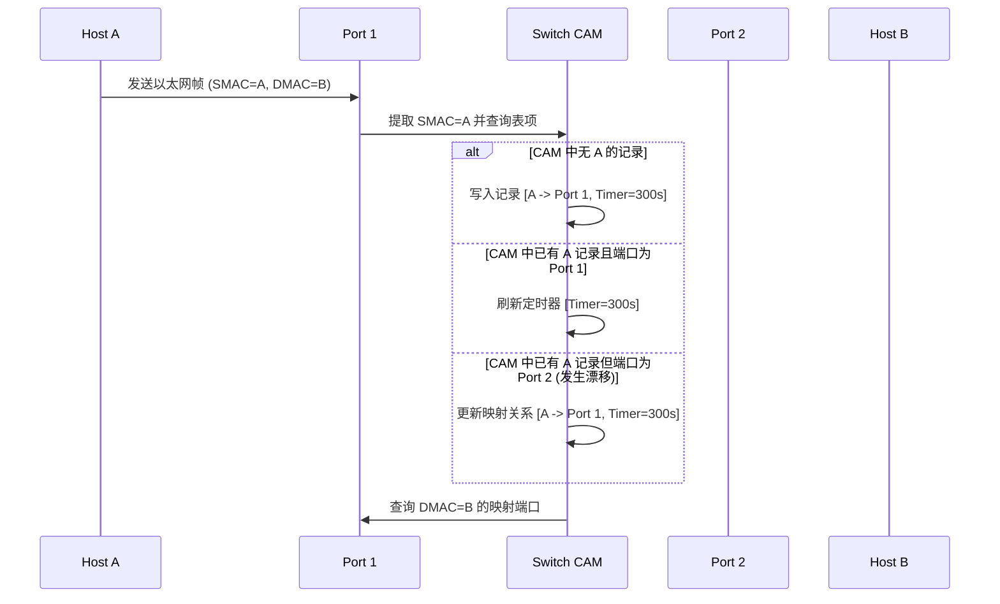
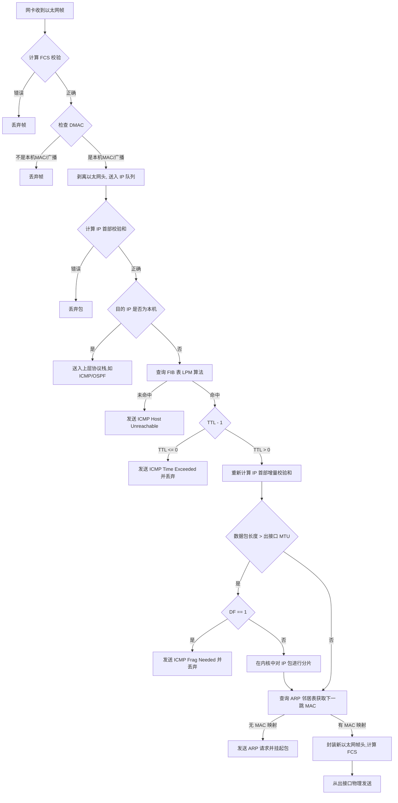

# 网络底层设备：二层交换机、三层路由器、逻辑网关、NAT/NAPT设备与代理服务器深度剖析

在现代计算机网络架构中，数据包从一台主机的物理网卡发出，经过一系列物理与逻辑设备的协同流转，最终到达目的主机并被应用层解析。在这个过程中，二层交换机、三层路由器、逻辑网关、网络地址转换（NAT）设备以及代理服务器（Proxy）分别工作在不同的协议层级，承担着冲突隔离、路由选路、协议翻译、地址复用与应用层安全审计等多重职责。

要构建高性能、高可用的现代网络架构并解决复杂的网络故障，必须深入这些设备的内核机制，理解它们在硬件加速、内存管理、状态跟踪及连接重构层面的底层运行机理。

---

## 一、 二层交换机（Switch）：数据链路层的物理与逻辑控制

二层交换机工作在 OSI 模型的第二层——数据链路层。它主要负责在同一个局域网（LAN）内，通过识别以太网帧的物理地址（MAC 地址）进行线速的数据帧转发。

### 1. 以太网帧格式与二层交换机定位

以太网帧（Ethernet II 格式）是二层交换机处理的基本数据单元。其典型结构如下所示：

```
+------------+----------+------------+------------+-----------+-------------------+-----------+
|  前导码    | 帧定界符 |  目的 MAC  |  源 MAC    | 长度/类型 |   数据载荷 (IP)   | 帧校验序列 |
| (Preamble) |  (SFD)   | (Dest MAC) | (Src MAC)  | (Type)    | (Payload/Padding) |   (FCS)   |
|   7 Bytes  |  1 Byte  |  6 Bytes   |  6 Bytes   |  2 Bytes  |   46-1500 Bytes   |  4 Bytes  |
+------------+----------+------------+------------+-----------+-------------------+-----------+
```

- **前导码（Preamble）与帧开始定界符（SFD）**：用于接收端网卡进行物理层时钟同步及判定帧起始边界。
- **目的 MAC 地址与源 MAC 地址**：全球唯一的 48 位硬件识别符。
- **长度/类型（EtherType）**：标识上层协议类型。若大于或等于 `0x0600`（1536），表示网络层协议（如 `0x0800` 代表 IPv4，`0x0806` 代表 ARP）；若小于该值，则表示数据载荷的实际字节数。
- **数据载荷（Payload）**：封装的 IP 数据包或其他上层协议数据。其长度必须介于 46 字节与 1500 字节之间。若不足 46 字节，则必须在尾部添加填充字节（Padding），以确保以太网帧的最小长度不低于 64 字节。这源于早期以太网在半双工模式下进行冲突检测的最短时间窗口需求（Slot Time）。
- **帧校验序列（FCS）**：使用 CRC-32 循环冗余校验算法，校验除了前导码和 SFD 外的整个帧。

二层交换机在网络拓扑中扮演着“网桥的多端口升级版”角色。它不解析 IP 首部，而是读取入站数据帧的 MAC 头部，根据本地维护的映射关系，将帧转发至特定的物理端口。

### 2. MAC 地址学习与老化时序

交换机能够实现精准点对点转发的核心在于其内部维护的 **MAC 地址表**，在硬件层面上，该表通常存储在**内容寻址内存（CAM, Content Addressable Memory）**中。

#### (1) CAM 表的工作机制
传统的随机存取内存（RAM）是在输入地址后返回该地址存储的数据；而 CAM 则相反，它接收数据（如 MAC 地址与 VLAN ID），在一个时钟周期内，通过硬件逻辑将该关键字与内存中所有存储的条目进行并行比较，直接返回该条目对应的物理接口索引。这使得交换机查表的时间复杂度为常数级 $O(1)$，满足了线速转发的极高要求。

#### (2) MAC 地址学习时序
当一个数据帧从交换机的物理端口 $P_{in}$ 进入时，交换机执行以下“学习”步骤：

1. **提取源 MAC（SMAC）与 VLAN 信息**：提取入帧首部的源 MAC 地址（如 `00:11:22:33:44:55`）及该端口划分的 VLAN ID。
2. **检索 CAM 表**：以 `[SMAC + VLAN ID]` 为 Key 在 CAM 表中检索。
3. **分情况处理**：
   - **未匹配（未学习过该 MAC）**：交换机在 CAM 表中新建一条记录，将 `[SMAC + VLAN ID]` 映射到物理端口 $P_{in}$，并为其启动老化定时器（Aging Timer）。
   - **匹配且物理端口一致**：说明该主机的物理位置未发生改变，交换机仅重置（刷新）该条目的老化定时器。
   - **匹配但物理端口不一致（$P_{new} \neq P_{old}$）**：表明该主机被移动到了另一个网口，或网络中存在链路拓扑的变化。交换机将立即更新 CAM 表，将该 MAC 映射到新端口 $P_{new}$，并重置定时器。这一行为称为 **MAC 地址漂移检查**。如果同一个 MAC 地址在极短时间内在两个端口之间来回交替移动，交换机将判定为环路风险并触发告警。



#### (3) 老化时序（Aging Mechanism）
为了防止 CAM 表因网络中设备频繁插拔或下线而无限膨胀，所有的动态学习条目都具有生命周期限制。
- **老化定时器**：默认的老化时间（Aging Time）通常为 **300 秒**。
- **递减与清理**：交换机内部的专用芯片或管理 CPU 周期性地递减每个 CAM 条目的计时器。一旦某个条目的倒计时归零，且在此 300 秒内没有再次收到以该 MAC 为源地址的任何帧，该条目即从物理 CAM 表中被擦除。
- **老化策略的意义**：它保证了交换机能够自适应拓扑的变化。若一台设备断开物理连接并移至另一个交换机，300 秒内旧交换机就会释放此表项，从而避免将发往该主机的流量错误地导向已空置的端口。

### 3. 帧转发与泛洪（Flooding）逻辑

当交换机成功提取出数据帧的目的 MAC 地址（DMAC）后，会进入转发判断流程。

#### (1) 单播帧的三种物理转发模式
在硬件上，交换机提供了三种主流的数据帧转发机制，以平衡延迟与可靠性：

- **存储转发（Store-and-Forward）**：交换机必须接收完整个以太网帧，将其放入接收缓冲区，计算 CRC 校验和并与帧尾的 FCS 字段进行对比。只有在校验通过（即帧未受损）时，才查 CAM 表并转发。如果发现校验错误，则直接丢弃。这种方式延迟最高（取决于帧长度），但保证了网络中不会传播损坏的残缺帧。
- **直通转发（Cut-Through）**：交换机在接收到帧的前 6 个字节（目的 MAC 地址）后，不等剩余内容接收完毕，立即查表并开始在输出端口上发送数据。这种模式的延迟极低（纳秒级），且与帧的长度无关，缺点是它完全不校验帧的完整性，即使是冲突残碎帧或被物理干扰损坏的帧也会被盲目转发。
- **无碎片转发（Fragment-Free / Segment-Free）**：这是一种折中方案。由于以太网冲突通常发生在前 64 字节（Slot Time 内），交换机在接收到前 64 字节的数据后便开始转发。它可以过滤掉绝大多数由于碰撞产生的碎片帧，且延迟低于存储转发模式。

#### (2) 泛洪（Flooding）的触发逻辑与物理实现
当 DMAC 匹配以下三种场景之一时，交换机无法进行定向单播转发，必须执行泛洪逻辑：

1. **广播帧**：DMAC 为全一地址（`FF:FF:FF:FF:FF:FF`），例如典型的 ARP 请求。
2. **组播帧**：DMAC 的第一个字节最低有效位（I/G 位）为 1（且未在交换机上配置精确的组播嗅探如 IGMP Snooping）。
3. **未知单播帧（Unknown Unicast）**：DMAC 是一个常规的单播地址，但当前 CAM 表中没有任何关于此 MAC 地址的映射记录。

**物理泛洪行为**：
交换机的交换矩阵（Switch Fabric）会复制该帧，将克隆出的帧并发投递到除了接收该帧的物理入端口之外的、属于同一 VLAN 的所有其他活跃物理端口。

**广播风暴与二层环路防范**：
泛洪机制是二层网络能正常建立通信的基础（如 ARP 解析），但它引入了致命的缺陷——**广播风暴**。当交换机之间存在物理环路时，一个泛洪帧会在环路中被无限循环复制。由于二层以太网帧头中没有任何类似三层 IP 头部的 TTL（生存时间）限制字段，数据帧一旦进入环路，将永远在网络中循环，瞬间耗尽链路带宽与交换机 CPU 资源，导致整网瘫痪。

为了解决这一问题，交换机必须部署**生成树协议（STP/RSTP/MSTP）**。STP 通过在交换机之间发送 BPDU（网桥协议数据单元）报文，选举出根网桥，计算最短路径，并在逻辑上阻塞（Block）某些冗余物理端口，将环状的物理网络拓扑修剪为无环的树状拓扑。当活跃链路发生故障时，被阻塞的端口会自动过渡到转发（Forwarding）状态，提供冗余备份。

### 4. 冲突域与广播域的本质区别

在探讨局域网时，必须清晰区分冲突域（Collision Domain）与广播域（Broadcast Domain）。

- **冲突域（物理层限制）**：指的是在同一个物理介质上，当两台设备同时发送信号时会发生冲突的区域。
  - **集线器（Hub）时代**：集线器工作在 OSI 物理层，其内部是共享的电气总线。所有连接到集线器的端口都在同一个冲突域中。设备必须采用半双工模式，并运行 **CSMA/CD** 机制来规避和检测冲突。当一台主机发送数据时，其他所有主机必须保持监听，无法同时发送。
  - **交换机隔离冲突域**：交换机利用物理隔离的物理端口以及内部独立的缓冲区，实现了“微段化”。每个物理接口都是一个独立的冲突域。如果在全双工（Full-Duplex）模式下，发送线和接收线在物理上是分立的，数据帧发送和接收并行不悖，此时接口冲突域中不再存在信号碰撞，CSMA/CD 机制也随之停用。
- **广播域（链路层/网络层限制）**：指的是广播帧（如目的 MAC 为 `FF:FF:FF:FF:FF:FF`）能够到达的最大物理范围。
  - 交换机虽然通过接口缓存与交换矩阵隔离了**冲突域**，但根据以太网规则，它必须无条件向同一 VLAN 内的所有端口泛洪广播帧。因此，**交换机默认无法隔离广播域**。所有连接在同一台（或通过级联相连的多台）常规交换机上的设备，都处于同一个广播域中。

#### VLAN（虚拟局域网）的引入与 802.1Q 物理隔离
为了在二层隔离广播域，IEEE 制定了 **802.1Q 标准**。通过在交换机内部逻辑划分 VLAN，将一个庞大的物理二层网络切分为多个相互隔离的虚拟二层网络。

##### 802.1Q 帧结构
VLAN 技术通过在标准以太网帧的源 MAC 地址与长度/类型字段之间，插入一个 4 字节的 **VLAN Tag** 来识别不同的广播域：

```
+------------+------------+-------------------+-----------------+-----------+
| 目的 MAC   |  源 MAC    |  TPID (0x8100)    | TCI (VLAN Tag)  | 长度/类型 |
|  6 Bytes   |  6 Bytes   |     2 Bytes       |    2 Bytes      |  2 Bytes  |
+------------+------------+-------------------+-----------------+-----------+
                                              /      |      \
                                             /       |       \
                                            /        |        \
                                       PCP(3bit)  DEI(1bit)  VID(12bit)
```

- **TPID（Tag Protocol Identifier）**：值固定为 `0x8100`，代表该帧带有 802.1Q Tag。如果不支持 VLAN 的旧设备收到此帧，会将其误认为 EtherType 未知而直接丢弃。
- **PCP（Priority Code Point）**：3 比特，用于 QoS（服务质量）标记，指示帧的传输优先级（0~7）。
- **DEI（Drop Eligible Indicator）**：1 比特，丢弃指示，在拥塞时用于判定是否优先丢弃。
- **VID（VLAN Identifier）**：12 比特，VLAN ID，范围为 0~4095。其中 0 和 4095 保留，实际可用 VLAN 范围为 **1~4094**。它决定了该帧属于哪一个独立的广播域。

##### 端口类型与 Tag 处理的内核逻辑
交换机物理端口主要被划分为 **Access** 端口与 **Trunk** 端口，它们在帧进入和移出交换机时有着截然不同的 Tag 处理行为：

| 端口类型 | 帧方向 | 报文携带 Tag 时的处理逻辑 | 报文无 Tag 时的处理逻辑 |
| :--- | :--- | :--- | :--- |
| **Access 端口**<br>（连接终端主机） | **入站（Ingress）** | 检查帧中的 VID 是否与端口的 PVID（Port VLAN ID）一致。<br>- 若一致：接收并送入交换矩阵。<br>- 若不一致：直接丢弃。 | 强制为该帧打上该端口的 PVID Tag，然后送入交换矩阵。 |
| | **出站（Egress）** | 剥离该帧的 VLAN Tag，还原为标准的无 Tag 以太网帧发送给主机。 | 正常情况下，交换矩阵内部的帧皆带 Tag。若有无 Tag 帧，直接发送。 |
| **Trunk 端口**<br>（连接交换机/路由器） | **入站（Ingress）** | 检查该 VID 是否在端口的“允许通过列表（Allowed List）”中。<br>- 若在：接收。<br>- 若不在：直接丢弃。 | 为该帧打上该 Trunk 端口的 PVID Tag。<br>- 检查 PVID 是否在允许列表中，若在则接收，否则丢弃。 |
| | **出站（Egress）** | 检查该 VID 是否在允许列表中。<br>- 若在且 **VID $\neq$ 端口 PVID**：保持原 Tag 发送。<br>- 若在且 **VID $=$ 端口 PVID**：剥离 Tag 发送（取决于配置，部分厂商默认剥离以兼容本地 VLAN 传输）。<br>- 若不在：禁止转发。 | 无法发生（内部帧均有 Tag）。 |

通过这种 Tag 的“添加 - 过滤 - 剥离”逻辑，VLAN 在同一个交换矩阵内划分了逻辑防撬墙。即使发生未知单播或广播，交换矩阵也仅会在匹配该 VID 且允许该 VID 出站的端口之间进行复制，从而在物理交换机上完美隔离了广播域。

---

## 二、 三层路由器（Router）：异构网络互联与选路逻辑

当数据传输需要跨越不同的二层广播域、子网甚至异构介质（如从以太网到光纤链路）时，必须依赖工作在 OSI 第三层——网络层的**三层路由器**。路由器根据 IP 地址完成寻址、选路以及数据包的跨网段物理转发。

### 1. 控制面与数据面的协同工作机制

现代高性能路由器在架构上进行了彻底的**控制面（Control Plane）**与**数据面（Data Plane，又称转发面）**的解耦与协同设计。这种架构对于实现线速转发（Line Rate）至关重要。

```
                    +---------------------------------------+
                    |           控制面 (Control Plane)      |
                    |  - 路由协议 (OSPF, BGP, RIP)           |
                    |  - 路由算法 (SPF计算)                  |
                    |  - 路由表 (RIB) 生成                   |
                    +---------------------------------------+
                                        |
                                 下发转发表项 (FIB)
                                        v
                    +---------------------------------------+
                    |           数据面 (Data Plane)         |
                    |  - 转发表 (FIB) 缓存                   |
                    |  - 邻居表 (ARP 缓存)                  |
                    |  - 硬件芯片 (ASIC/NP) 高速查表转发    |
                    +---------------------------------------+
```

#### (1) 控制面（Control Plane）：路由决策中心
控制面主要由路由器的核心处理器（主 CPU）和运行在其上的嵌入式操作系统负责。其核心职责包括：
- **运行路由协议**：运行 OSPF、BGP、ISIS 等动态路由协议，定期与邻居路由器交换拓扑或路径信息。
- **计算最优路径**：运行 Dijkstra（SPF）等算法，计算去往每个网段的最佳下一跳。
- **构建路由选择信息库（RIB, Routing Information Base）**：RIB 即常说的“路由表”，驻留在控制面的系统内存中。它包含了所有通过静态配置、直连路由和各种动态路由协议学习到的路由信息。RIB 属于软件管理级别，更新频率相对较低（毫秒级到秒级）。

#### (2) 数据面（Data Plane）：硬件转发引擎
数据面是直接处理数据包入站、查表和出站的物理路径。其核心在于不依赖主 CPU 的干预，而是利用专用的 **ASIC（专用集成电路）** 或 **NP（网络处理器）** 进行硬加速。
- **转发信息库（FIB, Forwarding Information Base）**：控制面会根据 RIB 的最佳路由计算结果，生成一张面向快速检索的转发表——FIB，并将其下发并写入到数据面的硬件芯片内存中。FIB 的表项保证了目标 IP 到出接口和下一跳 IP 的一一对应，结构高度平坦化，专为硬件并行查询设计。
- **邻居表（如 ARP 缓存表）**：记录下一跳 IP 地址与目的 MAC 地址的映射关系，以便数据面快速重构二层帧头。

#### (3) 协同机制
当一个数据包到达路由器的物理接口时，数据面硬件直接提取数据包的目的 IP，在硬件 ASIC 驱动的 FIB 中执行快速匹配，定位出接口和下一跳 MAC，重构以太网帧头并发送。在此过程中，数据包完全无需上传到控制面的主 CPU。只有当遇到“FIB 未命中”、“数据包需要分片”、“TTL 归零”或“OSPF/BGP 协议控制报文”等边缘情况时，数据包才会上送到控制面进行软件处理。这保证了即使路由器控制面因计算庞大的 BGP 路由而满载，其数据面的既有流量转发依然能保持线速。

### 2. 路由器如何隔离广播域

正如二层交换机受限于以太网规则必须泛洪广播一样，路由器在网络层天然地形成了广播域的物理边界。

- **三层接口的独立 IP 寻址**：路由器的每个物理或逻辑接口都配置有一个独立的 IP 地址，并且必须属于不同的 IP 子网。
- **对二层广播的拦截**：当路由器接口接收到一个以太网帧时，MAC 芯片会解析 DMAC。如果 DMAC 为广播（`FF:FF:FF:FF:FF:FF`），该帧会被送入本地协议栈处理（例如，如果是一个向路由器发起的 ARP 请求或 DHCP 请求），但是，路由器的转发引擎**绝对不会**将该广播帧克隆发送到路由器的任何其他接口。
- **对三层广播的拦截**：同理，若收到一个目的 IP 为受限广播地址 `255.255.255.255` 或网段定向广播（如 `192.168.1.255/24`）的数据包，路由器在网络层协议栈中会判定该数据包仅在本地子网有效，默认情况下，它不会将其路由转发到其他接口。

通过这层限制，路由器的每个接口在物理上和逻辑上都终结了一个二层广播域，保证了局域网内的广播风暴不会蔓延到外网。

### 3. 最长前缀匹配（LPM, Longest Prefix Match）算法

在无分类域间路由（CIDR）体系下，路由器的转发表中可能存在多条可以匹配同一个目的 IP 的路由条目。例如，路由表中存在如下三条路由：
1. `192.168.0.0/16`
2. `192.168.1.0/24`
3. `192.168.1.128/25`

当收到一个目的 IP 为 `192.168.1.130` 的数据包时，经按位与计算，发现这三条路由全部匹配。此时，路由器必须遵循**最长前缀匹配（LPM）**原则，选择掩码位数最长（即前缀匹配最多、最精确）的第 3 条路由进行转发。

为了在硬件上快速实现 LPM 检索，路由器主要采用以下两种算法和技术：

#### (1) 二进制 Trie 树（Binary Trie）及其优化
在软件层面或早期路由器中，LPM 通过 Trie 树（前缀树）数据结构实现。
- **基本二进制 Trie 树**：将路由前缀转化为二进制字符串（`0` 代表左子树，`1` 代表右子树）。例如，`192.168.1.128/25` 对应的二进制前缀作为路径插入树中。查找时，从根节点出发，依次读取目的 IP 的每一个比特，沿着树分支向下寻找，直到无法继续向下或匹配失败，路径上最后经过的带有有效路由标志的节点即为最长前缀匹配项。
- **时间复杂度**：标准二进制 Trie 的查询时间复杂度为 $O(W)$，其中 $W$ 为 IP 地址的位数（IPv4 下为 32，IPv6 下为 128）。为了减少查询时的访存次数，现代路由器常采用**多路 Trie 树（Multi-ary Trie）**，例如一次性读取 4 个比特（16 叉树），将树的深度降低四分之三，以此换取更高的查询性能。

```
                     [Root]
                    /      \
                  (0)      (1)
                  /          \
                [10/8]       (11)
                            /    \
                       [110/24]  [111/24]
```

#### (2) TCAM（三态内容寻址内存）硬件实现
在骨干网线速路由器中，LPM 完全由硬件 **TCAM** 芯片实现。
与只能识别 `0` 和 `1` 的 CAM 不同，TCAM 支持三种状态：`0`（低电平）、`1`（高电平）以及 `X`（Don't Care，通配符/屏蔽位）。
- **表项存储**：路由器将子网掩码转换为 TCAM 的 Mask。例如，路由 `192.168.1.0/24` 在 TCAM 中存储为 `11000000.10101000.00000001.XXXXXXXX`（前 24 位为确切值，后 8 位为 `X`）。
- **并行比较与优先级编码**：当目的 IP 输入 TCAM 时，硬件可以在一个时钟周期内，将该 IP 与 TCAM 中成千上万条规则并行匹配。由于 `X` 的存在，可能有多个条目同时命中。TCAM 内部的**优先级编码器（Priority Encoder）**会根据物理排列顺序输出结果。因此，路由器只需在向 TCAM 写入路由表项时，**严格按照掩码长度从长到短排序**（即 `/32` 在最前，`/0` 在最后），优先级编码器输出的第一个匹配项必然是“最长前缀匹配”。这使得 LPM 能够以高达数十亿次每秒的速率在硬件中完成。

### 4. 内核中的 IP 数据包处理与重组步骤

当一个标准的 IPv4 数据包进入路由器的一个接口，并从另一个接口转发出去，其在内核及硬件层面的单步执行流如下：



#### (1) 二层接收与物理校验
物理接口的 PHY/MAC 芯片接收光电信号，并将其重组为以太网帧。计算帧尾的 FCS，若与帧携带的 CRC 校验值不符，说明物理传输发生比特翻转，直接丢弃该帧。若无误，检查目的 MAC。如果目的 MAC 匹配本接口的物理 MAC 地址，或者是该接口加入的组播地址或广播地址，则剥离以太网帧头，将 IP 数据包送入 IP 协议栈队列；否则丢弃。

#### (2) 三层 IP 校验
内核 IP 协议栈读取 IP 首部（通常为 20 字节），首先校验首部校验和（Header Checksum）。如果校验和不匹配，直接丢弃该包。随后检查 IP 版本号是否为 4，并解析首部长度（IHL）以确定数据载荷的起始位置。

#### (3) 路由查询（LPM）
解析目的 IP，在 FIB 中通过最长前缀匹配算法进行检索。
- **未命中**：如果 FIB 中没有匹配条目，且无默认路由，路由器将向数据包的源 IP 地址发送一个 **ICMP Destination Unreachable**（类型 3，代码 0/1）报文，并丢弃该包。
- **命中**：获取转发的具体出接口（Outbound Interface）及下一跳 IP 地址（Next Hop IP）。

#### (4) TTL（生存时间）递减
将 IP 首部中的 TTL 值减 1。
- 如果减 1 后的 **TTL $\le$ 0**，路由器必须停止转发该数据包，并向源 IP 发送 **ICMP Time Exceeded**（类型 11，代码 0）报文，同时丢弃该包。这是防止环路导致报文永久存活的决定性机制（例如 Traceroute 工具正是利用这一机制，通过依次发送 TTL=1, 2, 3... 的报文来探测路径上的路由器 IP）。

#### (5) 重新计算首部校验和（RFC 1624 增量算法）
因为 TTL 减 1 改变了 IP 首部的内容，路由器必须在转发前重新计算首部校验和。然而，若对整个 20 字节的首部重新进行求和及取反计算，在高速转发下会带来极高的算力浪费。

为此，根据 **RFC 1624** 和 **RFC 1071**，路由器内核采用**增量更新（Incremental Update）**算法。设原校验和为 $HC$，改变前的 16 位字为 $m$（即包含原 TTL 和 Protocol 的字），改变后的 16 位字为 $m'$。新的校验和 $HC'$ 可以通过如下公式推导得出：

$$HC' = \sim(\sim HC + \sim m + m')$$

该公式通过简单的二进制反码算术加法即可完成，避免了对整个 IP 首部的重新循环求和，极大地释放了 ASIC/NP 的数据转发吞吐量。

#### (6) 分片处理（Fragmentation）
路由器获取出接口的 **MTU（最大传输单元）**，默认为 1500 字节。如果 IP 数据包的总长度大于该出接口的 MTU：
- **检查 DF（Don't Fragment）标志位**：
  - 若 **DF = 1**，说明源端禁止分片。路由器将直接丢弃该数据包，并向源 IP 发送一个 **ICMP Destination Unreachable** 报文（类型 3，代码 4，表示需要分片但设置了 DF 标志），并在该 ICMP 报文中携带该出接口的 MTU 值。源端主机可以通过此反馈执行路径 MTU 发现（PMTUD）。
  - 若 **DF = 0**，内核将对 IP 包执行分片：
    1. 根据 MTU 大小计算每个分片可携带的最大载荷（必须是 8 字节的整数倍，因为分片偏移量 Fragment Offset 以 8 字节为单位）。
    2. 克隆原 IP 首部到每个分片中。
    3. 每个分片的 `Identification`（标识符）保持与原包一致。
    4. 对除最后一个分片外的所有分片，将其 IP 首部中的 `MF`（More Fragments）标志位置为 1，最后一个分片置为 0。
    5. 填入正确的 `Fragment Offset`（片偏移 = 该分片数据在原 IP 载荷中的起始字节偏移量 / 8）。
    6. 对每个分片独立计算新的首部校验和。

> [!IMPORTANT]
> 路由器只负责对 IP 数据包进行分片，**绝对不负责分片的重组**。分片的重组由于需要等待所有片到达并在内存中重组，极其消耗内存与计算资源。这项工作被严格推迟到最终的目的主机上完成。

#### (7) 二层帧重新封装与物理发送
根据下一跳 IP 地址，查询 ARP 邻居缓存表以获取其对应的硬件 MAC 地址。
- 若缓存表中无此 MAC 地址，路由器会暂停该包的转发，将其放入等待队列，并向下一跳 IP 发送 ARP 请求，等待其响应以填充邻居表。
- 获取 MAC 地址后，路由器将数据包重新封装为以太网帧：
  - 将源 MAC 替换为**该路由器出接口的物理 MAC**。
  - 将目的 MAC 替换为**下一跳设备的 MAC**。
  - 计算新的二层 FCS。
  - 将帧送入出接口的发送队列，通过物理层介质发送出去。

---

## 三、 逻辑网关（Gateway）：不同子网与协议的翻译桥梁

网关（Gateway）是一个逻辑和物理实体的结合概念。在局域网内，网关是主机访问外部网络（非本地子网）的逻辑出口。在更广泛的意义上，网关还承担着不同通信协议栈之间的翻译工作。

### 1. 协议网关与应用网关的底层转换逻辑

网关可以运行在 OSI 模型的任何层级，主要分为协议网关与应用网关。

#### (1) 协议网关（Protocol Gateway）
协议网关工作在网络层或传输层，主要解决不同协议栈网络互联的问题。例如，将早期的 Novell IPX/SPX 网络与 TCP/IP 网络互联，或者在 IPv4 与 IPv6 之间进行翻译（NAT64/DNS64 网关）。

**底层转换机制**：
- **报文拆解与重构**：当 IPv6 侧的数据包到达 NAT64 协议网关时，网关剥离 IPv6 首部。
- **首部映射**：根据 RFC 6145 标准，将 IPv6 的流量类别（Traffic Class）、流标签（Flow Label）、源/目的 IPv6 地址等，映射翻译为 IPv4 的 TOS、标识符、源/目的 IPv4 地址。
- **重构校验和**：由于 IPv6 首部没有校验和，而 IPv4 有，网关必须利用硬件重新计算 IPv4 的首部校验和，并将 TCP/UDP 首部中的伪首部校验和从 IPv6 格式更新为 IPv4 格式。

```
IPv6 报文:   [IPv6 Header][TCP/UDP Header][Payload]
                 |
                 v (协议网关转换)
IPv4 报文:   [IPv4 Header (重建)][TCP/UDP Header (修改伪首部)][Payload]
```

#### (2) 应用网关（Application Gateway）
应用网关（如安全应用代理、邮件网关、语音网关）工作在 OSI 的最高层——应用层。它不仅仅是修改首部，而是需要在内存中完全拆解并重组应用层报文，进行语义翻译。

**底层转换机制**：
1. **连接终结**：网关在物理网卡上与客户端建立完整的传输层连接（如 TCP 三次握手），通过 Socket 接收所有分段数据。
2. **字节流重组（Stream Reassembly）**：在系统内核及用户态缓冲区中，将无序的 TCP 段拼接重组成一个连续的应用层报文（如 HTTP 请求体或 SIP 协议报文）。
3. **协议解析与语义转换**：运行特定的应用层解析器（Parser）。例如，在 H.323 语音网关与 SIP 语音网关通信时，将 H.323 的呼叫控制信令（H.225/H.245）转换为 SIP 的 INVITE/BYE 请求，解析并提取媒体编解码参数（SDP）。
4. **重新封装发送**：网关作为客户端，与后端的真实服务器建立另一个全新的 TCP/UDP 连接，将转换后的应用层载荷重新封装，向下通过协议栈发送。其底层代价包括高内存占用（重组缓冲区）、频繁的上下文切换（从内核态到用户态解析器）以及双重的 TCP 连接维护开销。

### 2. 默认网关（Default Gateway）的选路优先级与 ARP 请求机制

在大多数 IP 网络中，终端主机（如 PC、服务器）的网卡都会配置一个“默认网关”。

#### (1) 选路优先级与最长前缀匹配
在主机路由表中，默认网关通常以如下形式存在：
- 目标网段：`0.0.0.0`
- 子网掩码：`0.0.0.0`（或表示为 `0.0.0.0/0`）
- 下一跳：`192.168.1.1`

根据最长前缀匹配（LPM）规则，掩码越长，优先级越高。主机在发送数据包时：
1. 如果目的 IP 匹配了本地网段路由（例如目的 IP 为 `192.168.1.50`，匹配了直连路由 `192.168.1.0/24`），主机将直接在本地二层广播域内寻找目的主机，而**不经过**网关。
2. 如果目的 IP 为外网地址（例如 `8.8.8.8`），检索本地路由表，除了默认路由 `0.0.0.0/0` 之外，没有其他更精确的匹配项。因为 `/0` 的前缀长度为 0，它是优先级最低的保底路由。当且仅当所有常规路由均未命中时，主机才将包投递给默认网关指定的下一跳地址。

#### (2) 跨网段发包时的 ARP 请求机制与帧封装变化
设主机 A（`192.168.1.10/24`）要向外网服务器 B（`8.8.8.8`）发送数据，其默认网关为 G（`192.168.1.1`，MAC 地址为 `MAC_G`）。整个二三层报文重装与 ARP 交互过程如下：

##### 步骤一：路由判定
主机 A 的网络层对比自己的 IP/掩码，发现 `8.8.8.8` 属于非本地子网。查表判定必须送往默认网关 `192.168.1.1`。

##### 步骤二：网关 MAC 获取（ARP 阶段）
主机 A 检查本地的 ARP 缓存表，寻找网关 IP `192.168.1.1` 对应的 MAC 地址。
- **若未命中**：主机 A 必须挂起该数据包，在本地网段发起 ARP 请求（二层广播）：
  - `DMAC = FF:FF:FF:FF:FF:FF`
  - `SMAC = MAC_A`
  - ARP 内容：`“Who has 192.168.1.1? Tell 192.168.1.10”`
- 网关 G 收到该广播后，单播回复 ARP 响应：
  - `DMAC = MAC_A`
  - `SMAC = MAC_G`
  - ARP 内容：`“192.168.1.1 is at MAC_G”`
- 主机 A 收到该响应后，将 `[192.168.1.1 -> MAC_G]` 写入本地 ARP 缓存表。

##### 步骤三：数据包物理封装
主机 A 开始封装外发的数据帧：
- **IP 首部（网络层）**：
  - 源 IP（Source IP）= `192.168.1.10`（主机 A 的 IP）
  - 目的 IP（Destination IP）= `8.8.8.8`（目标服务器 B 的 IP，**在此转发过程中保持不变**）
- **以太网帧头（数据链路层）**：
  - 源 MAC（Source MAC）= `MAC_A`（主机 A 网卡的物理 MAC）
  - 目的 MAC（Destination MAC）= `MAC_G`（**网关的 MAC 地址**，用于确保二层交换机能将其定向分发给网关）

##### 步骤四：网关接收与解封装
二层交换机根据 `Destination MAC = MAC_G`，将帧转发至网关路由器 G 的物理接口。网关 G 接收帧，校验 FCS，发现目的 MAC 是自己，于是剥离以太网帧头，将 IP 数据包送入路由引擎。它读取目的 IP 为 `8.8.8.8`，继续查自己的三层转发表，重构下一跳的以太网帧头发送给广域网。

---

## 四、 网络地址转换（NAT）设备与 NAPT：地址复用的底层机理

由于 IPv4 地址在设计之初的局限性，公网 IP 地址早已枯竭。为了延缓这一进程，并允许成千上万台处于私网（如 `192.168.0.0/16`、`10.0.0.0/8`）的主机共享少量公网 IP 访问互联网，网络地址转换（NAT）技术得到了广泛应用。

### 1. 静态 NAT、动态 NAT 与 NAPT 的本质差异

根据映射维度的不同，NAT 主要分为以下三类：

- **静态 NAT（Static NAT）**：
  - **映射关系**：一对一（一个固定的私网 IP 映射到一个固定的公网 IP）。
  - **工作机制**：不修改传输层端口号。仅在 IP 数据包出站时将源 IP 替换为指定的公网 IP，入站时将目的公网 IP 替换为私网 IP。
  - **优缺点**：允许外部主动发起访问（常用于内网服务器外发服务），但不节省公网 IP 地址。
- **动态 NAT（Dynamic NAT）**：
  - **映射关系**：一对一动态绑定。
  - **工作机制**：网关拥有一个公网 IP 地址池。当内部主机需要访问外网时，网关动态从池中分配一个空闲的公网 IP 建立临时映射。
  - **优缺点**：在连接空闲或断开后，公网 IP 会收回池中。但在同一时刻，并发访问外网的主机数仍受限于公网 IP 池的大小，没有解决 IP 数量的根本矛盾。
- **网络端口转换 NAPT（Network Address Port Translation）**：
  - **映射关系**：多对一（或多对少），即成千上万个私网 IP 映射到单个或少数几个公网 IP 上。
  - **工作机制**：**复用端口号**。NAPT 设备不仅修改 IP 数据包的 IP 地址，还同时修改传输层（TCP/UDP）的源/目的端口号，利用唯一的“IP + 端口”元组来区分不同的私网流量。

### 2. NAPT 转换表与连接跟踪（conntrack）内存机制

NAPT 设备要实现精确的流量双向分发，必须在系统内核中维护一张高并发、实时的**连接跟踪表（Connection Tracking Table，简称 conntrack）**。

#### (1) Linux 内核 conntrack 结构与哈希表设计
在 Linux 内核（Netfilter 框架）中，每个被跟踪的连接由一个结构体 `struct nf_conn` 表示。为了保证高并发下双向数据包的查表速度，conntrack 在内存中维护了两个方向的元组（Tuple），各自插入到全局哈希表中：

- **Original Tuple（原始方向，如内网发往外网）**：
  `[源 IP: 源端口 -> 目的 IP: 目的端口, 协议号]`
- **Reply Tuple（应答方向，如外网回复内网）**：
  `[目的 IP: 目的端口 -> 公网 NAT_IP: 公网 NAT_Port, 协议号]`

```
           全局 Conntrack 哈希表 (Hash Bucket Array)
          +----+----+----+----+----+----+----+----+
          | 0  | 1  | 2  | 3  | 4  | 5  | 6  | 7  | ...
          +----+----+----+----+----+----+----+----+
            |              |
            v              v
      +------------+  +------------+
      |  nf_conn 1 |  |  nf_conn 2 |
      | (Original) |  | (Original) |
      |    |       |  |    |       |
      |  (Reply)   |  |  (Reply)   |
      +------------+  +------------+
```

这两个 Tuple 都计算哈希值并存入全局哈希表。一旦收到反向报文，直接以反向报文的 `[源 IP:源端口 -> 目的 IP:目的端口]` 为 Key 检索，即可在 $O(1)$ 时间内匹配到 `Reply Tuple`，进而根据其关联的 `struct nf_conn` 找到对应的私网客户端。

#### (2) TCP 三次握手下的 NAPT 状态机与转换时序

##### 步骤一：SYN 包入站（主机 A `192.168.1.10:5000` $\rightarrow$ 服务器 B `8.8.8.8:80`）
1. 报文到达 NAPT 设备。
2. NAPT 设备检索 conntrack 表，未发现匹配项，判定为新连接。
3. NAPT 分配算法在可用的公网端口池中分配一个未占用的端口（例如 `Public IP: 10086`）。
4. 在内核中分配并初始化 `struct nf_conn`，向哈希表插入双向 Tuple：
   - **Original**: `[192.168.1.10:5000 -> 8.8.8.8:80, TCP]`
   - **Reply**: `[8.8.8.8:80 -> 公网IP:10086, TCP]`
   - 连接状态设置为 `SYN_SENT`。
5. **头部改写**：将 IP 头的源 IP 修改为 `公网IP`，将 TCP 头的源端口修改为 `10086`。
6. **校验和重算**：由于 IP 头和 TCP 伪首部（含有源 IP）均被修改，NAPT 设备必须重新计算 IP 首部校验和与 TCP 校验和。然后发送给外网。

##### 步骤二：SYN-ACK 响应包回站（服务器 B `8.8.8.8:80` $\rightarrow$ `公网IP:10086`）
1. 报文到达 NAPT 的公网接口。
2. NAPT 提取目的 IP 为 `公网IP`，目的端口为 `10086`。以 `[8.8.8.8:80 -> 公网IP:10086, TCP]` 为 Key 检索哈希表，精准匹配到 `Reply Tuple`。
3. 状态机迁移：根据 `struct nf_conn` 记录，将连接状态更新为 `SYN_RECV`。
4. **反向改写**：将 IP 头的目的 IP 替换为私网地址 `192.168.1.10`，目的端口替换为 `5000`。
5. 重算校验和，转发给内网。

##### 步骤三：ACK 确认包入站（主机 A $\rightarrow$ 服务器 B）
1. 匹配 `Original Tuple`，更新状态为 `ESTABLISHED`。
2. 报文被改写并发送。此时，conntrack 状态标记为“确认建立”，后续该连接上的双向数据包直接查表进行快速改写。

```
[主机 A]                                   [NAPT 设备]                            [服务器 B]
 192.168.1.10:5000                          公网IP:10086                           8.8.8.8:80
   |                                            |                                      |
   |---- SYN (src=192.168.1.10:5000) ---------->| [新建 conntrack]                      |
   |                                            |---- SYN (src=公网IP:10086) ---------->|
   |                                            |                                      |
   |                                            |<--- SYN-ACK (dst=公网IP:10086)-------|
   |<--- SYN-ACK (dst=192.168.1.10:5000) -------| [命中 Reply Tuple]                    |
   |                                            |                                      |
   |---- ACK (src=192.168.1.10:5000) ---------->|                                      |
   |                                            |---- ACK (src=公网IP:10086) ---------->|
   |                                            | [状态设为 ESTABLISHED]                |
```

##### 状态老化与内存回收
- **TCP 连接老化**：连接处于 `ESTABLISHED` 状态时，老化时间默认很长（Linux 下可配置为 5 天）。一旦 NAPT 检测到 TCP 报文中的 `FIN` 标志或 `RST` 报文，对应的 conntrack 条目生命周期将缩短至几秒/几十秒，快速释放内存。
- **UDP 的伪连接跟踪**：UDP 是无状态协议，conntrack 会创建“虚拟连接”。
  - 首个 UDP 包经过时，创建条目，状态标记为 `UNREPLIED`（超时通常为 30 秒）。
  - 一旦收到反向回包，状态迁移至 `ASSURED`（超时延长至 180 秒）。如果在该时间内无包传输，表项即被销毁。

#### (3) 端口碰撞（Port Collision）解决机制
如果在局域网内，主机 A（`192.168.1.10`）和主机 B（`192.168.1.20`）在同一时刻，都使用源端口 `8888` 访问外网同一个服务器的 `80` 端口：
- A 的包：`[192.168.1.10:8888 -> 8.8.8.8:80]`
- B 的包：`[192.168.1.20:8888 -> 8.8.8.8:80]`

如果 NAPT 设备仅替换源 IP，而不修改源端口，那么发往服务器的两个包将退化为：
- A: `[公网IP:8888 -> 8.8.8.8:80]`
- B: `[公网IP:8888 -> 8.8.8.8:80]`

此时，服务器 B 的回包都以 `[公网IP:8888]` 为目的端，NAPT 将完全无法区分该分发给内网的 A 还是 B。这就是**端口碰撞**。

**分配算法解决策略**：
NAPT 设备拥有一个空闲端口池（通常在非保留端口段，如 1024~65535 之间）。
1. 当主机 A 的包到达时，NAPT 分配公网源端口 `8888`（若可用），建立映射。
2. 当主机 B 的包到达时，检测到 `[8.8.8.8:80 -> 公网IP:8888]` 的 Reply 关系已被占用。
3. NAPT 分配算法自动在端口池中搜索下一个空闲端口（如 `8889`），并将主机 B 的源端口强制替换为 `8889`。
4. 此时 Reply 映射分别独立为：
   - A 的反向映射：`[8.8.8.8:80 -> 公网IP:8888]` $\rightarrow$ `[192.168.1.10:8888]`
   - B 的反向映射：`[8.8.8.8:80 -> 公网IP:8889]` $\rightarrow$ `[192.168.1.20:8888]`
   冲突得以完美消除。

### 3. P2P 场景下的 NAT 穿透技术与 NAT 类型分类

由于 NAT 限制了外网主动发起对内网的连接，这给 P2P（对等网络通信，如 VoIP、联机游戏）带来了巨大的阻碍。要解决这一问题，首先必须对 NAT 进行精准的行为分类。

#### (1) RFC 3489/4787 下的 NAT 分类体系

```
                                  +------------------------------------+
                                  |            NAT 设备类型             |
                                  +------------------------------------+
                                    /                                \
                        +----------------------+          +----------------------+
                        |   锥型 (Cone NAT)    |          | 对称型 (Symmetric)   |
                        +----------------------+          +----------------------+
                         /         |          \                     |
                        /          |           \             向不同目标发包时
              +-----------+  +-----------+  +-----------+    每次分配全新公网端口
              |  全锥型   |  | IP受限型  |  | 端口受限型|
              | Full Cone |  | Restricted|  | Port Restr|
              +-----------+  +-----------+  +-----------+
```

- **1. 全锥型（Full Cone NAT）**：
  - **规则**：内部主机 `IP_A:Port_A` 首次向外发包被映射为 `Public_IP:Port_NAT`。此后，**任何**外部主机，使用**任何**源 IP 和端口，只要发送数据包给 `Public_IP:Port_NAT`，都可以直接到达 `IP_A:Port_A`。
- **2. 地址受限锥型（Address Restricted Cone NAT / 简称 IP 受限型）**：
  - **规则**：建立映射 `IP_A:Port_A` $\leftrightarrow$ `Public_IP:Port_NAT` 后，只有内部主机 `IP_A:Port_A` 曾经主动发送过数据包的**那个特定外网主机 IP**（如 `8.8.8.8`），才能发送数据包到 `Public_IP:Port_NAT`。外网主机的端口不受限，但若换了一个外网 IP（如 `9.9.9.9`），则包会被 NAT 直接丢弃。
- **3. 端口受限锥型（Port Restricted Cone NAT / 简称端口受限型）**：
  - **规则**：比上一类型更为严格。只有内部主机 `IP_A:Port_A` 曾经主动向外网某个 `IP_X:Port_Y` 发送过包，该特定外网地址 `IP_X:Port_Y` 才能发包至 `Public_IP:Port_NAT`。
- **4. 对称型（Symmetric NAT）**：
  - **规则**：最严格的 NAT。内部主机 `IP_A:Port_A` 向外网目的地址 $X$ 发包时，NAT 分配映射 `Public_IP:Port_X`；当向外网目的地址 $Y$ 发包时，即使源端口不变，NAT 也会**分配一个新的、独立的公网端口** `Public_IP:Port_Y`。并且，只有最初接收到包的外网目标才能向该映射端口回包。

#### (2) STUN 协议的 NAT 探测与打洞（Hole Punching）原理
STUN（Session Traversal Utilities for NAT，RFC 5389）协议允许内网主机探测其所处的 NAT 类型和分配的公网映射 IP/端口。

##### STUN 探测过程
STUN 服务器部署在公网上，拥有两个独立的公网 IP（$IP_1, IP_2$）和两个端口（$P_1, P_2$）。
1. **测试一**：客户端向 $IP_1:P_1$ 发送 STUN 绑定请求。服务器返回响应，告诉客户端在其头部看到的源 IP/Port（设为 `IP_C1:P_C1`）。
2. **测试二**：服务器尝试使用**另一个**公网 IP 和端口（$IP_2:P_2$）向 `IP_C1:P_C1` 发送响应。
   - 若客户端能收到，表明客户端处于 **Full Cone NAT** 下。因为此时没有主动给 $IP_2$ 发过包，但却收到了来自 $IP_2$ 的单播。
   - 若收不到，则进入测试三。
3. **测试三**：客户端向 $IP_1:P_2$ 发送请求，服务器响应。随后服务器使用**相同的 IP 不同的端口**（$IP_1:P_2$）向客户端 `IP_C1:P_C1` 发送数据。
   - 若客户端能收到，表明是 **Address Restricted NAT**。
   - 若收不到，则表明是 **Port Restricted NAT** 或 **Symmetric NAT**。
4. **测试四**：客户端向 $IP_2:P_1$ 发送请求，对比服务器返回的公网映射端口。
   - 若该端口与测试一中得到的 `P_C1` 相同，表明是 **Port Restricted Cone NAT**。
   - 若不同，说明发往不同的 IP 导致公网端口发生了变更，判定为 **Symmetric NAT**。

##### P2P 打洞（Hole Punching）原理
一旦完成了 NAT 类型识别，两台处于不同 NAT 后面的主机 A 与 B，可以通过一个公网上的信令中介（Signaling Server）进行打洞以建立直接通信：

- **Cone $\leftrightarrow$ Cone**（两个锥型 NAT 之间）：
  1. A 和 B 分别与信令服务器连接，获取各自的 `Server Reflexive`（反射公网映射地址）`A_pub` 与 `B_pub`。
  2. 双方通过信令交换反射地址。
  3. **打洞**：A 向 `B_pub` 发送 UDP 包，该包在到达 B 的 NAT 时会被丢弃（因为 B 的 NAT 还没有 A 的映射记录），但**此操作在 A 的 NAT 上创建了一条出站映射记录，允许 `B_pub` 回包**。
  4. 紧接着，B 向 `A_pub` 发送 UDP 包。由于 A 的 NAT 上已经有了去往 `B_pub` 的记录，B 的包顺利穿过 A 的 NAT 到达 A。
  5. 此时打洞成功，两端可以直接发送 P2P 流量，完全绕过中介服务器。

```
[Host A]                   [NAT A]               [NAT B]                   [Host B]
   |                          |                     |                         |
   |-- 1. 向 B_pub 发送UDP --->|                     |                         |
   |   (在 NAT A 建立去往 B_pub 的通道)              |                         |
   |                          |-- 2. 丢弃(无映射) -->|                         |
   |                          |                     |<-- 3. 向 A_pub 发送UDP --|
   |                          |                     |   (在 NAT B 建立去往 A_pub 的通道)
   |<-- 4. 穿透成功 ---------------------------------|                         |
   |                          |                     |                         |
   |== 5. 双向 P2P 通道建立成功 =============================================|
```

- **Cone $\leftrightarrow$ Symmetric** 或 **Symmetric $\leftrightarrow$ Symmetric**：
  由于对称 NAT 会为每个不同的外网目的地分配不同的端口，当 A（Symmetric）尝试向 B 的公网地址打洞时，A 的 NAT 会分配一个新的随机端口，这导致 B 之前通过信令拿到的端口失效。因此，**Symmetric $\leftrightarrow$ Symmetric 之间无法完成 P2P 打洞**。

#### (3) TURN 与 ICE 框架的保底机制
对于打洞失败的对称 NAT 场景，必须使用 **TURN（Traversal Using Relays around NAT，RFC 5766）**。

- **TURN 中继机制**：客户端在公网的 TURN 服务器上申请分配一个中继地址（Relay Address）。所有发送给该中继地址的流量都会被 TURN 服务器转发给客户端，虽然这能够实现 100% 的连通性，但牺牲了 P2P 的低延迟，且中继服务器会消耗巨大的带宽开销。
- **ICE（Interactive Connectivity Establishment，RFC 5245）**：是一种综合框架。它并没有发明新的穿透技术，而是将 STUN 和 TURN 整合起来。ICE 会收集所有可能的网络候选地址（Candidates），包括：
  - `Host Candidate`（本地网卡物理 IP）
  - `Server Reflexive Candidate`（通过 STUN 获得的公网映射地址）
  - `Relay Candidate`（通过 TURN 获得的中继地址）
  
  ICE 会将这些 Candidates 配对成 `Candidate Pairs`，按照优先级（`Host > Reflexive > Relay`）依次启动连通性检查。如果能通过本地 IP 直接通信则用本地；如果能打洞成功则采用 P2P；若全部失败，则退化使用 TURN 中继。这确保了在任何复杂的网络拓扑下，通信都能以最优的路径建立。

---

## 五、 代理服务器（Proxy）：应用层与传输层的连接重构

代理服务器工作在应用层（L7）或传输层（L4），它在网络中的拓扑位置与行为方式与 NAT 存在本质不同。

### 1. 正向代理与反向代理的核心拓扑与工作差异

根据其所代理的“实体”是客户端还是服务器，代理分为正向代理与反向代理。

#### (1) 正向代理（Forward Proxy）
正向代理位于客户端侧，代理的是**客户端**。

- **拓扑结构**：`Client -> Proxy -> Web Server`
- **工作机制**：客户端主机必须显式配置代理服务器的 IP 和端口，或者通过 PAC（Proxy Auto-Config）脚本自动重定向流量。客户端所有的外发请求都会发送给正向代理服务器。
- **底层报文机制（以 HTTPS CONNECT 隧道为例）**：
  1. 客户端与代理建立 TCP 连接。
  2. 客户端向代理发送明文请求：`CONNECT example.com:443 HTTP/1.1`。
  3. 代理收到后，向目的服务器 `example.com:443` 发起 TCP 握手。
  4. 代理成功与目的服务器建立连接后，给客户端回复：`HTTP/1.1 200 Connection Established`。
  5. 此后，代理服务器退化为四层管道，仅将客户端发来的加密 TLS 字节流原封不动地转发给目的服务器，不对数据进行解密。
- **核心职责**：隐藏客户端真实 IP、突破局域网访问限制、进行企业上网行为审计与缓存加速。

```
正向代理拓扑:
[ 客户端 (A) ] --(发送请求,目标写A自己配置的代理)--> [ 代理服务器 (P) ] --(代替A去请求)--> [ 外网 Web 服务器 ]
```

#### (2) 反向代理（Reverse Proxy）
反向代理位于服务端侧，代理的是**服务器集群**。

- **拓扑结构**：`Client -> Reverse Proxy (如 Nginx) -> Upstream Servers`
- **工作机制**：对于客户端而言，反向代理服务器就是“终极目的服务器”。客户端不需要配置任何代理设置，直接访问反向代理的公网 IP。反向代理根据路由规则将请求分发给后端的真实服务器。
- **核心底层职责**：
  - **负载均衡**：通过轮询（Round Robin）、最小连接数（Least Connections）、IP 哈希（IP Hash）等算法，将高并发流量分摊到后端多台应用服务器上，提升系统的吞吐能力。
  - **TLS/SSL 卸载（SSL Offloading）**：反向代理作为 HTTPS 证书的部署点，承担耗费 CPU 的非对称加密解密计算（握手阶段），与后端服务器之间采用轻量级的明文 HTTP 或 gRPC 进行通信，大幅降低了后端计算节点的 CPU 负载。
  - **静态资源缓存与动静分离**：将图片、CSS/JS 等静态请求直接在代理层返回，仅将动态 API 请求透传给后端，减轻数据库和应用服务器压力。

```
反向代理拓扑:
                       +--> [ 后端服务器 1 ]
                       |
[ 客户端 ] --> [ 反向代理 (Nginx) ] -->+--> [ 后端服务器 2 ] (通过内网轻量通信)
                       |
                       +--> [ 后端服务器 3 ]
```

### 2. 代理（连接重构）与 NAT（头部修改）的底层内核机制对比

代理与 NAT 虽然都起到了“隐藏真实 IP、中介流量”的作用，但在内核协议栈处理、内存开销和性能层面存在巨大鸿沟。

#### (1) 代理的内核行为：连接的完全重构（L4/L7）
不论是四层（如 Nginx stream 模块）还是七层代理（http 模块），代理服务器都必须**彻底终止客户端的 TCP 连接，并建立新的服务端连接**。

以四层 TCP 代理为例，其在内核中的运行逻辑如下：
1. **第一次握手**：客户端向代理发送 SYN，代理响应 SYN-ACK，客户端回复 ACK。**第一条 TCP 连接（Client $\leftrightarrow$ Proxy）建立**。
2. **应用分配**：代理程序（如内核级的 socket 或用户态的代理进程）调用 `accept` 接收此套接字，并为其分配独立的读写缓冲区（Socket Read/Write Buffer）。
3. **第二次握手**：代理解析目的地址，向后端服务器发起 SYN，接收 SYN-ACK，回复 ACK。**第二条 TCP 连接（Proxy $\leftrightarrow$ Backend）建立**。
4. **数据传输**：当客户端发送数据时，数据包到达物理网卡，内核协议栈对其进行逐层解封装，通过 TCP 重组，将数据放入客户端 Socket 的读缓冲区。
5. **系统调用与拷贝**：
   - **用户态拷贝**：在传统用户态代理中，进程通过系统调用（如 `read`/`recv`）将数据从内核读缓冲区拷贝到用户态内存空间，再通过系统调用（如 `write`/`send`）将数据拷贝到后端 Socket 的发送缓冲区。
   - **内核态拼接（Splice）**：在高性能代理中，可以通过 `splice` 或 `sendfile` 系统调用，在内核空间中直接将客户端 Socket 的管道数据重定向到后端 Socket，避免了用户态与内核态之间的内存拷贝，但依然需要经历完整的传输层协议栈处理（计算滑动窗口、重传定时器、拥塞控制）。

#### (2) NAT 的内核行为：仅在 L3/L4 修改报文首部
NAT（包括 NAPT）设备在转发数据包时，**绝对不会在本地终止并重建 TCP 握手**。

其内核处理逻辑如下：
1. **数据包直通**：客户端与外网服务器之间只存在**唯一的一条端到端 TCP 连接**。所有的三次握手报文直接穿过 NAT 设备。
2. **IP/端口就地改写**：当数据包到达网卡，IP 层的钩子函数（如 Linux 里面的 Netfilter PREROUTING/POSTROUTING）被触发。内核直接读取 IP 首部和 TCP 首部，就地修改 `Source IP` 和 `Source Port`，并重新计算校验和。
3. **路由发送**：修改完成后，直接将数据包提交给路由引擎，寻路后从出接口物理网卡发送出去。
4. 数据包**不需要**被送入传输层的重组缓冲区，不需要建立本地 Socket 套接字，更没有用户态的进程拷贝与上下文切换。

#### (3) 性能与特性对比表

下表总结了代理（连接重构）与 NAT（头部修改）在底层技术指标上的关键差异：

| 维度对比 | 代理服务器 (Proxy) | 网络地址转换 (NAT / NAPT) |
| :--- | :--- | :--- |
| **工作协议层** | 传输层 (L4) / 应用层 (L7) | 网络层 (L3) / 传输层 (L4) |
| **TCP 连接数量** | **2 条独立的连接**（Client-Proxy, Proxy-Server） | **1 条端到端连接**（Client-Server） |
| **内核内存开销** | **极高**。需要为每条连接分配完整的 Socket 双向读写缓冲区（通常每个 Socket 几百 KB 级别）。 | **极低**。仅需在内存中维护 conntrack 状态表项（每条连接仅需数百字节的哈希节点）。 |
| **数据包处理深度** | 必须重组传输层分段，甚至解密并解析应用层语义。 | 仅对 IP 首部和 TCP/UDP 首部的个别字段进行就地改写。 |
| **上下文切换** | **频繁**。通常涉及用户态与内核态的频繁切换（除非使用完全基于内核态的硬件加速）。 | **无**。完全在内核协议栈的网络层内部完成，对用户空间透明。 |
| **吞吐量与时延** | 吞吐量较低，时延较高（毫秒级，受握手和内存重组开销影响）。 | 吞吐量极高（支持线速转发），时延极低（微秒级）。 |
| **内容修改与安全控制**| 极强。可以动态修改应用载荷（如过滤敏感词、注入 HTTP 头部 `X-Forwarded-For`、拦截 SQL 注入）。 | 极弱。无法读取和处理加密的或分片的七层应用载荷，仅能进行基于五元组的流控。 |

---

## 六、 边缘案例、常见误区与性能优化思考

在生产环境的实际部署和运维中，围绕这些底层设备往往会产生一些性能瓶颈和概念误区。

### 1. LVS（四层负载均衡）与 Nginx（四层/七层代理）的混合架构设计

在超高并发的互联网架构中，为什么不直接让 Nginx 面对所有的流量，而是常常在前面加一层 LVS（Linux Virtual Server）？

#### (1) Nginx 的瓶颈：连接重构与文件描述符限制
Nginx 作为一个七层/四层反向代理，使用的是上文提到的“连接重构”机制。每接入一个客户端连接并转发到后端，Nginx 在内核中至少要消耗 **两个 Socket 文件描述符（fd）**。在高并发场景下，海量的 socket 连接会导致内存消耗巨大，CPU 会因为处理大量的四次挥手 `TIME_WAIT` 状态以及中断处理而迅速耗尽。

#### (2) LVS 的优势：利用 NAT/DR 模式实施直通转发
LVS 运行在 Linux 内核空间，其核心并不重构 TCP 连接，而是基于三四层进行数据包重组转发：
- **DR 模式（Direct Routing，直接路由）**：LVS 只修改入站数据包的目的 MAC 地址为后端真实服务器（RS）的 MAC，RS 收到包后直接处理，并通过自己的路由直接将回包发送给客户端，**完全不经过 LVS 路由器**。这使得 LVS 的回包带宽开销降为 0，单台 LVS 即可承载数百万级别的并发连接。
- **NAT 模式**：LVS 仅在 IP 层改写目的 IP，类似于前文提到的高性能 NAT，不需要建立内核 Socket。

#### (3) 经典混合架构
因此，大型架构中通常采用如下部署：
`Client -> LVS (四层直通, 负责超高并发的流量分发) -> Nginx 物理集群 (七层代理, 负责 TLS 卸载, 规则路由, 动静分离) -> 真实应用服务器 (App Servers)`。

```
                    [ 客户端 (Client) ]
                            |
                            v
             +------------------------------+
             |      LVS (四层负载均衡)       |  <-- 只修改 MAC/IP, 不重构 TCP
             +------------------------------+
                /           |            \
               v            v             v
        [ Nginx 1 ]    [ Nginx 2 ]    [ Nginx 3 ]  <-- 七层代理, 负责 TLS 卸载与 HTTP 路由
               \            |            /
                v           v           v
             +------------------------------+
             |      后端应用服务器集群       |
             +------------------------------+
```

### 2. 连接跟踪表（conntrack）满导致的丢包故障与调优

当一台 Linux 服务器被用作 NAT 网关、路由器或部署了复杂的 iptables/netfilter 防火墙规则时，在高并发、大流量（或遭遇 DDoS 攻击）场景下，经常会出现网络突然阻断、丢包率飙升的现象。查看系统内核日志（如通过 `dmesg` 命令），往往会发现大量如下报错：

`nf_conntrack: table full, dropping packet`

#### (1) 故障本质
当 NAT 设备接收到新连接时，由于当前内存中维护的 `struct nf_conn` 数量已经达到了内核参数 `net.netfilter.nf_conntrack_max` 设定的上限值，netfilter 框架为了防止系统内存被耗尽，会直接拒绝新连接的数据包并将其在三层丢弃。

#### (2) 内核调优实战
要解决该问题，必须对内核参数进行深度优化：

- **调大连接跟踪表最大容量**：
  ```bash
  # 将最大跟踪连接数提高到 100 万
  sysctl -w net.netfilter.nf_conntrack_max=1048576
  ```
- **调大 Hash Bucket 大小**：
  为了保持哈希查找的效率（每个 bucket 链表长度不宜过长，推荐为 4 左右），Hash 表大小通常应设为 `nf_conntrack_max` 的 1/4 或 1/8。
  ```bash
  # 设置 Hash 桶大小为 262144
  echo 262144 > /sys/module/nf_conntrack/parameters/hashsize
  ```
- **缩短失效连接的生存周期**：
  默认的 TCP 建立连接的老化时间高达 5 天，可以大幅度缩短以加快内存条目的回收：
  ```bash
  # 将已建立连接的超时时间缩短为 10 分钟 (600秒)
  sysctl -w net.netfilter.nf_conntrack_tcp_timeout_established=600
  # 缩短其他状态的超时时间
  sysctl -w net.netfilter.nf_conntrack_tcp_timeout_time_wait=120
  sysctl -w net.netfilter.nf_conntrack_tcp_timeout_close_wait=60
  sysctl -w net.netfilter.nf_conntrack_tcp_timeout_fin_wait=120
  sysctl -w net.netfilter.nf_conntrack_udp_timeout=10
  ```
- **开启 `NOTRACK` 规避**：
  在 iptables 的 raw 表中，对于不需要进行 NAT 地址转换的高并发本地明文端口（如本地回环、特定的只读集群通信），配置 `NOTRACK` 规则，使其绕过 conntrack 引擎，免除内存开销。

### 3. TCP Half-Open（半开连接）状态与代理的 SYN Flood 防御

在 TCP 建立连接的过程中，客户端发送 SYN，服务器收到后回送 SYN-ACK，并等待客户端的最后一个 ACK。在收到 ACK 之前，这个连接在服务器端处于 **Half-Open（半开连接，即 SYN_RCVD 状态）**。

#### (1) SYN Flood 攻击危害
恶意客户端可以伪造海量的随机源 IP 地址，向服务器并发发送 SYN 报文，然后对服务器发出的 SYN-ACK 故意不作任何回应。这会导致服务器的 **SYN 队列（半连接队列）** 迅速被占满，后续正常的用户请求将因半连接队列溢出而被丢弃。

#### (2) 代理服务器的 SYN Cookie/Proxy 防御机制
反向代理服务器（如高防网关、WAF 级 Nginx）可以通过部署 **SYN Cookie/SYN Proxy** 机制，在内核中拦截并消解这种攻击。

- **工作机制**：
  1. **SYN 拦截**：当客户端发送 SYN 报文到代理服务器时，代理服务器并不立即为该连接在内存中创建控制块（TCB），也不将其放入半连接队列。
  2. **生成 Cookie**：代理服务器根据特定的 Hash 算法，将“源 IP、源端口、目的 IP、目的端口、TCP 特征（如 MSS 选项）以及时间戳”计算出一个哈希值。该值被作为 SYN-ACK 报文的 **初始序列号（ISN，即 Cookie）** 发送给客户端。
  3. **ACK 校验**：如果客户端是合法连接，它会回复 ACK 报文，此时其确认号（Acknowledgment Number）必定为 `Cookie + 1`。代理服务器在收到该 ACK 时，重新计算一次上述哈希算法并与确认号进行对比验证。
  4. **后端握手**：一旦验证通过，证明该客户端确实是一个真实的物理存在，此时代理服务器才真正分配内存建立本地 TCB，并立即向后端的真实服务器发起三次握手，将两端连接拼接起来。
  
通过这种机制，半开连接的资源消耗被完全拦截在了代理服务器的“门禁”处，确保了后端应用服务器免受 SYN 攻击的侵扰。

---

## 总结

网络底层设备不仅是物理链路的构建者，更决定了整个网络架构的拓扑边界、性能天花板与安全等级：
- **二层交换机**通过 CAM 表的硬件检索实现冲突域隔离，并利用 802.1Q VLAN 划分逻辑二层广播域；
- **三层路由器**利用控制面与数据面的协同，以及 TCAM 芯片支撑的最长前缀匹配（LPM）算法，实现异构网络的高速互联并物理隔离二层广播域；
- **逻辑网关**起到了跨网络出口的桥梁作用，完成了不同层级协议转换与 ARP 二层映射的转化；
- **NAT 与 NAPT 设备**利用内核的 conntrack 状态跟踪，在 TCP/UDP 传输层重构元组，解决了 IP 资源短缺，但也对 P2P 穿透提出了精细化打洞（STUN/TURN/ICE）的挑战；
- **代理服务器**则采用“连接彻底重构”的方式实现了高安全、精细化的流量清洗与负载均衡，虽然相比仅修改数据包首部的 NAT 设备带来了更大的 CPU 和内存开销，但在复杂的企业级应用架构中发挥着不可替代的作用。

在实际的系统架构设计中，根据吞吐、时延、计算开销和控制粒度的不同需求，合理混合部署并调优这些底层设备，是支撑起现代大规模高并发网络服务的基石。

