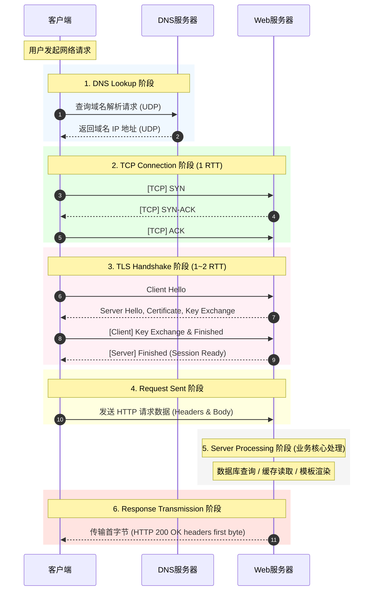
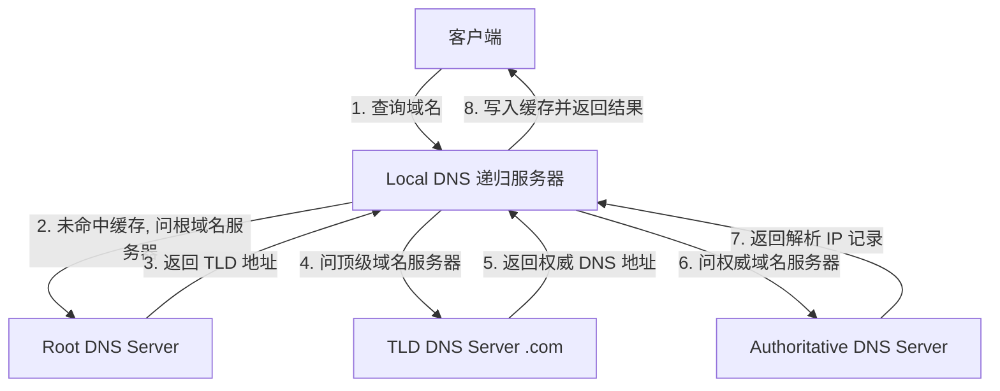

# 1.2.1.5 网络指标

在计算机网络与分布式系统工程中，评估、分析和优化网络性能是一项高度复杂的系统性工作。为了准确量化网络在不同环境下的运行状况，业界建立了一套完备的网络性能指标体系。无论是构建超大规模的数据中心、设计高并发的 Web 架构，还是优化实时多媒体传输，都必须依赖对这些核心网络指标的深度理解与精准调优。

本篇将从底层原理、数学模型、协议演进以及优化工程等维度，深入剖析衡量和评估网络性能的关键技术指标。

---

## 1. 时延 (Latency) 与往返时延 (RTT - Round-Trip Time)

时延是网络性能中最直观的指标之一，它直接决定了网络交互的“即时性”。在实际工程中，开发者常常将单向时延（Latency）与往返双向时延（RTT）混淆，然而两者在物理本质、数学计算和工程测量上面临着完全不同的约束。

### 1.1 时延的物理与系统组成

一个数据包从发送端发出到接收端完整接收，其经历的单向总时延（One-Way Latency，记为 $D_{\text{total}}$）是由多个不同物理阶段的时延叠加而成的：

$$D_{\text{total}} = D_{\text{trans}} + D_{\text{prop}} + D_{\text{queue}} + D_{\text{proc}}$$

#### 1. 发送时延 / 传输时延 (Transmission Delay - $D_{\text{trans}}$)
发送时延是指发送端（或中间路由器/交换机）将数据包的所有比特（bits）推送到物理信道上所需要的时间。它取决于数据包的大小以及物理链路的传输速率（即带宽）。
其数学计算公式为：

$$D_{\text{trans}} = \frac{L}{R}$$

其中：
- $L$ 为数据包的大小（单位：bits）；
- $R$ 为发送端网卡或信道的物理传输速率（单位：bps）。

**示例分析**：
假设发送一个大小为 $1500 \text{ Bytes}$（标准的以太网最大传输单元 MTU）的数据包：
- 在传统的 $100 \text{ Mbps}$ 快速以太网链路上，其发送时延为：
  $$D_{\text{trans}} = \frac{1500 \times 8 \text{ bits}}{100 \times 10^6 \text{ bps}} = 120 \ \mu\text{s}$$
- 在现代数据中心常见的 $10 \text{ Gbps}$ 高速链路上，其发送时延则缩短为：
  $$D_{\text{trans}} = \frac{1500 \times 8 \text{ bits}}{10 \times 10^9 \text{ bps}} = 1.2 \ \mu\text{s}$$

发送时延是一个在发送节点内部发生的时延，随着网卡硬件与物理信道带宽的提升，发送时延可以呈线性降低。

#### 2. 传播时延 (Propagation Delay - $D_{\text{prop}}$)
传播时延是指电磁信号在物理介质（如铜线、光纤或无线空间）中传播特定距离所耗费的时间。它完全取决于信号在介质中的传播速度以及物理链路的长度。
其数学计算公式为：

$$D_{\text{prop}} = \frac{d}{v}$$

其中：
- $d$ 为物理链路的长度（单位：m）；
- $v$ 为电磁波在对应介质中的传播速度（单位：m/s）。

在真空里，光速 $c \approx 3 \times 10^8 \text{ m/s}$。而在光导纤维中，由于玻璃介质的折射率（通常为 $1.5$ 左右），电磁波的实际传播速度约为真空光速的 $2/3$，即 $v \approx 2 \times 10^8 \text{ m/s}$（或可记为 $200 \text{ km/ms}$）。

**示例分析**：
假设在北京与上海之间架设一条物理长度约为 $1200 \text{ km}$ 的直连光纤，信号在该介质中的单向传播时延至少为：
  $$D_{\text{prop}} = \frac{1200 \text{ km}}{200 \text{ km/ms}} = 6 \text{ ms}$$

无论我们将物理带宽从 $10 \text{ Gbps}$ 提升到 $100 \text{ Gbps}$ 甚至 $1 \text{ Tbps}$，只要物理介质和地理距离没有改变，传播时延就永远维持在 $6 \text{ ms}$。**“带宽决定管道的粗细，而传播时延决定管道的长度”**，这是网络性能优化中必须时刻牢记的物理学定律。

#### 3. 排队时延 (Queuing Delay - $D_{\text{queue}}$)
排队时延是指数据包在路由器或交换机的输入/输出缓冲区中，等待被处理器处理或等待输出端口空闲并发送出去的等待时间。排队时延是动态且不可预测的，是网络时延发生剧烈波动的最主要根源。

在排队论（Queueing Theory）中，对于一个经典的 $M/M/1$ 单服务台排队系统，我们可以利用以下公式来定量描述平均排队时延 $W_q$：

$$W_q = \frac{\rho}{\mu(1 - \rho)}$$

其中：
- $\lambda$ 是数据包的平均到达率（packets/s）；
- $\mu$ 是服务台（即发送端口）的平均处理率（packets/s）；
- $\rho = \frac{\lambda}{\mu}$ 是信道的资源利用率（Traffic Intensity）。

当网络利用率 $\rho \to 0$ 时，排队时延几乎为 0；而当 $\rho \to 1$（即到达速率逼近设备的最大输出能力）时，公式的分母趋于 0，排队时延 $W_q$ 会呈现非线性的指数级发散，趋于无穷大。在实际工程中，当网络负载达到 $80\%$ 以上时，微小的流量瞬时突发都会导致排队时延成倍激增，进而引发严重的拥堵和丢包。

#### 4. 处理时延 (Processing Delay - $D_{\text{proc}}$)
处理时延是路由器或交换机接收到数据包后，对其进行解析和决策的时间。这包括：
- 检查数据包的首部字段是否损坏（如校验和校验）；
- 提取目的 IP 地址，并在路由表中执行最长前缀匹配（LPM - Longest Prefix Match）算法，以确定下一跳（Next Hop）和输出端口。

在传统的软件路由系统中，处理时延依赖于 CPU 的处理速度与路由表项检索算法（如 Radix Tree）；在现代商用交换机中，处理时延通过专用集成电路（ASIC）和三态内容寻址存储器（TCAM）在硬件芯片中以流水线形式实现，可以将处理时延压缩至微秒（$\mu\text{s}$）甚至纳秒（$\text{ns}$）级别。

---

### 1.2 RTT 与单向时延的根本差异

在实际网络分析中，**往返时延 (RTT)** 是指从发送端发出一个数据包开始，到发送端接收到来自接收端的确认包（ACK）为止，所经历的完整双向时间。尽管直觉上 RTT 似乎是单向时延的二倍，但从严格的计算机底座与系统原理视角来看，两者存在本质的差异：

1. **路由的非对称性 (Asymmetric Routing)**
   互联网在物理路由层面是一个极其复杂的网状拓扑。由于 BGP（边界网关协议）策略路由的差异、多路径负载均衡，以及运营商之间的对等互联策略（如热土豆选路原则：让数据包尽快离开自己的网络），去程数据包所经过的物理链路与回程 ACK 数据包所经过的物理链路极有可能是完全不同的。因此，去程单向时延 $D_{\text{forward}}$ 与回程单向时延 $D_{\text{backward}}$ 通常是不对称的，即：
   $$RTT \neq 2 \times D_{\text{forward}}$$

2. **接收端的处理与确认机制**
   RTT 并非只包含信号在网络介质中的传输和传播时延，它还包含了接收端主机在协议栈层面的处理时间。例如，在 TCP 协议中，为了减少小数据包对带宽的消耗，接收端普遍启用了延迟确认（Delayed ACK）机制：当收到一个数据包时，接收端不会立即回复 ACK，而是等待一个定时器超时（通常为 $40\text{ms} \sim 200\text{ms}$），或者等待接收到下一个数据包以产生合并确认。这部分在接收端“蓄意”停留的时间会被完全计入 RTT，从而使 RTT 显著大于双向物理传输时延之和。

3. **测量的可行性差异**
   在分布式系统中，要精确测量单向时延 $D_{\text{forward}}$，发送端和接收端必须拥有**纳秒或微秒级的绝对时间同步**。因为发送端记录的是本地时钟 $t_{\text{send}}$，接收端记录的是其本地时钟 $t_{\text{recv}}$，单向时延为 $t_{\text{recv}} - t_{\text{send}}$。如果两台主机会系统时钟存在微小的漂移（Clock Drift），计算出的时延就会产生极大的偏差。即使采用 NTP 协议，其在广域网上的对时精度也仅在毫秒级，且 NTP 对时本身也依赖于对称时延的假设。尽管高精度的时间同步协议（如 PTP - IEEE 1588）可以实现亚微秒级对时，但这需要网络中所有交换机都具备硬件级的时间戳支持，部署成本极高。
   相比之下，**RTT 的测量仅依赖于发送端的本地时钟**。发送端只需在发送时记录 $t_{\text{start}}$，在收到确认时读取当前系统时钟 $t_{\text{end}}$，即可通过 $RTT = t_{\text{end}} - t_{\text{start}}$ 获得极其精准的往返时延。这种天然的工程可行性，决定了 RTT 成为所有主流网络传输协议（如 TCP、QUIC）进行性能控制和拥塞控制的核心基石。

---

### 1.3 TCP 协议中 RTT 的测量与估算算法

在 TCP 协议中，为了保证数据的可靠传输，发送端在发送数据段时会启动一个重传计时器。重传超时时间（RTO - Retransmission Timeout）的设定必须与当前网络的 RTT 动态适应。如果 RTO 设定过小，会导致频繁的虚假重传，白白浪费信道带宽；如果 RTO 设定过大，当真实丢包发生时，发送端迟迟无法感知，造成极大的空闲等待。

为此，TCP 协议栈必须在内核中实时监测并估算 RTT，其算法经历了几十年的演进。

#### 1. 经典算法 (RFC 793) 与重传二义性问题

经典算法使用**指数加权移动平均（EWMA - Exponentially Weighted Moving Average）**来平滑网络波动，计算平滑往返时间（SRTT）：

1. **单次采样**：发送端每发送一个数据段，记录发送时刻，收到确认后计算出一个样本值 $RTT_{\text{sample}}$。
2. **平滑计算**：
   $$SRTT_{k} = \alpha \times SRTT_{k-1} + (1 - \alpha) \times RTT_{\text{sample}}$$
   其中，$\alpha$ 为平滑因子，通常推荐值为 $0.8 \sim 0.9$。该值越大，说明平滑值受单次瞬时网络波动的影响越小。
3. **计算 RTO**：
   $$RTO = \beta \times SRTT$$
   其中，$\beta$ 是一个安全系数，推荐值为 $2.0$。

##### 重传二义性 (Retransmission Ambiguity) 的致命缺陷：
当网络发生抖动或拥堵，导致某个数据段 $A$ 的 ACK 迟到，发送端触发了重传机制，重新发送了数据段 $A'$。随后，发送端收到了一笔针对该数据段的确认 ACK。
此时，发送端无法判断该 ACK 是针对原始数据段 $A$ 的延迟确认，还是针对重传数据段 $A'$ 的确认。这就是著名的**重传二义性问题**。
- 如果算法错误地认为该 ACK 是对原始包 $A$ 的确认（但实际上是对重传包 $A'$ 的确认），则计算出的 $RTT_{\text{sample}}$ 会远大于真实物理时延；
- 如果算法错误地认为该 ACK 是对重传包 $A'$ 的确认（但实际上是原始包 $A$ 慢到了），则计算出的 $RTT_{\text{sample}}$ 会趋于 0，使 $SRTT$ 偏小。

##### Karn / Partridge 算法的改良：
为了消除这一二义性干扰，Karn 算法规定：
- **凡是发生过重传的数据段，其采样值 $RTT_{\text{sample}}$ 一律被抛弃**，不参与 $SRTT$ 的更新计算。
- 同时，一旦发生重传，TCP 会对 RTO 启动**指数退避（Exponential Backoff）**策略：
  $$RTO_{\text{new}} = \gamma \times RTO_{\text{old}}$$
  其中，退避因子 $\gamma$ 通常为 $2$。重传发生后，RTO 将会翻倍（如 $1\text{s} \to 2\text{s} \to 4\text{s} \to 8\text{s}$），直至收到一次没有经过重传的数据段确认，才恢复正常计算。

**Karn 算法的局限性**：
在网络路径发生突变，使得网络实际 RTT 出现断崖式上升（例如从 $50\text{ms}$ 突增到 $500\text{ms}$）时，由于发送端之前的 RTO 设得太低，后续发送的所有包都会发生超时和重传。根据 Karn 算法，只要发生了重传，就不更新 $SRTT$。这会导致 $SRTT$ 被死死冻结在原先的 $50\text{ms}$ 水平上，而 RTO 只能通过不断的重传超时退避强行撑大，使得 TCP 连接的吞吐性能在路由切换或网络恶化时遭遇毁灭性打击。

#### 2. Jacobson / Karels 算法 (RFC 2988 / RFC 6298)

为了解决经典算法无法敏锐感知时延急剧波动的问题，Jacobson 和 Karels 引入了 **RTT 绝对偏差（方差的变体）** 来作为评估网络波动的核心指标，动态约束 RTO。该算法目前仍是各大操作系统 TCP 协议栈底层的标准实现：

1. **计算绝对偏差 (RTTVAR)**：
   $$RTTVAR_{k} = (1 - \beta) \times RTTVAR_{k-1} + \beta \times |SRTT_{k-1} - RTT_{\text{sample}}|$$
   通常，$\beta = 0.25$（即 $1/4$）。这反映了当前采样值与历史平滑均值之间的偏离幅度。
2. **计算平滑均值 (SRTT)**：
   $$SRTT_{k} = (1 - \alpha) \times SRTT_{k-1} + \alpha \times RTT_{\text{sample}}$$
   通常，$\alpha = 0.125$（即 $1/8$）。
3. **推导最终的 RTO**：
   $$RTO = SRTT + 4 \times RTTVAR$$

##### 为什么是 $4 \times RTTVAR$？
这具有严谨的数理统计学支撑。在概率分布中，即使对于非正态分布的未知概率模型，根据**切比雪夫不等式 (Chebyshev's Inequality)**，数据点落在均值 $4$ 倍标准差之外的概率非常小：

$$P(|X - \mu| \ge 4\sigma) \le \frac{1}{16} = 6.25\%$$

在实际网络时延分布中，时延一般呈现长尾分布，$4 \times RTTVAR$ 的安全边界能够保证在 $98\%$ 以上的情况下，TCP 不会发生非必要的虚假超时，从而在最大化吞吐量的同时，保持了极佳的鲁棒性。

#### 3. 基于 TCP 时间戳选项 (TSopt - RFC 7323) 的现代测量

为了彻底解决 Karn 算法在拥堵网络中无法对重传报文进行采样的严重弊端，现代 TCP 协议在首部引入了时间戳选项（TSopt），在握手阶段通过协商启用：

```
+-------------------------------------------------------+
|  Kind=8 (1B)  |  Length=10 (1B) |   TS Value (4B)     |
+-------------------------------------------------------+
|                 TS Echo Reply (4B)                    |
+-------------------------------------------------------+
```

- **TS Value (TSval)**：发送端填充的本地时钟滴答值（不同系统精度不同，通常为毫秒或微秒级）。
- **TS Echo Reply (TSecr)**：接收端在回复 ACK 时，把收到的那笔数据段中的 `TSval` 原样复制并反射回发送端。

##### 测量流程与数学消歧：
1. 发送端在 $t_1$ 发送数据段（包含 $TSval = t_1$）。
2. 该数据段由于某些原因重传，发送端在 $t_2$ 重新发送该数据段（包含 $TSval = t_2$）。
3. 接收端收到 $t_2$ 的包后，生成对应的确认包，并将接收到的最后一个 `TSval`（即 $t_2$）写入 `TSecr` 字段。
4. 发送端在 $t_3$ 收到 ACK，提取 `TSecr` 发现其等于 $t_2$。
5. 发送端计算样本值：$RTT_{\text{sample}} = t_3 - TSecr = t_3 - t_2$。

通过这种“反射”机制，每一笔发送（包含重传）都被打上了唯一的时间烙印，发送端可以毫无歧义地将每一个 ACK 映射到它具体的发送动作上。这消除了重传二义性，消除了对 Karn 算法的依赖，允许 TCP 在高丢包、高重传的极端恶劣信道中，依然能够稳定、精确地更新 $SRTT$ 和 $RTTVAR$。

---

## 2. 带宽 (Bandwidth) 与吞吐量 (Throughput)

在评估数据传输能力时，带宽和吞吐量是最容易被混淆的一对物理量。理解这两者的数学关系与系统瓶颈差异，是网络调优的根本前提。

### 2.1 带宽与吞吐量的理论关系与技术瓶颈差异

#### 1. 带宽 (Bandwidth)
在物理层与通信原理视角下，**模拟信道带宽**是指信道能够通过的信号最高频率与最低频率之差，单位为赫兹（Hz）。根据**香农定理 (Shannon's Theorem)**，在存在随机高斯白噪声的物理信道中，最大的理论数字信息传输速率（信道容量 $C$，单位 bps）受限于信道带宽 $B$ 和信噪比 $S/N$：

$$C = B \log_2\left(1 + \frac{S}{N}\right)$$

在数据通信与应用层视角下，我们通常所指的带宽（数字带宽）是指链路的**最大理论传输速率**。它是由物理介质（如单模光纤的色散极限、双绞线的寄生电容）、收发器的调制解调技术（如 QAM-256、PAM4）以及网卡硬件的物理接口规格所决定的。它是一个**静态的物理上限**。

#### 2. 吞吐量 (Throughput)
吞吐量是指在实际运行环境下，单位时间内在特定网络链路、节点或端到端连接上，**成功传输并交付给应用层的有效数据量**，单位通常为 bps 或 pps（Packets Per Second）。

吞吐量是一个**动态的实际观测值**。在任何现实系统里，实际吞吐量 $T$ 永远严格小于或等于物理带宽 $C$：

$$T \le C$$

#### 3. 导致吞吐量无法达到物理带宽的深层技术瓶颈

- **协议栈首部与帧间距开销 (Overhead)**
  数据在通过网络协议栈时，每一层都会封装其特有的首部。以物理层及以太网数据链路层为例，要发送一个 TCP 段，物理介质上实际传输的内容必须包含：
  - 物理层前导码（Preamble）：$7 \text{ Bytes}$
  - 帧首定界符（SFD）：$1 \text{ Byte}$
  - 以太网 MAC 首部：$14 \text{ Bytes}$（源 MAC + 目的 MAC + 类型）
  - IP 协议首部：最少 $20 \text{ Bytes}$
  - TCP 协议首部：最少 $20 \text{ Bytes}$
  - 帧校验序列（FCS/CRC）：$4 \text{ Bytes}$
  - 物理帧间距（IFG - Interpacket Gap）：最少 $12 \text{ Bytes}$

  对于一个大小为 $1500 \text{ Bytes}$ 的最大以太网数据包，其应用层有效载荷（MSS - Maximum Segment Size）最大仅为：
  $$MSS = 1500 - 20(\text{IP}) - 20(\text{TCP}) = 1460 \text{ Bytes}$$
  然而在物理介质上，为了传输这 $1460 \text{ Bytes}$ 的有效数据，网卡实际上必须发送：
  $$1500 + 7(\text{Preamble}) + 1(\text{SFD}) + 4(\text{FCS}) + 12(\text{IFG}) = 1524 \text{ Bytes}$$
  此时，因协议封装与物理间隔导致的吞吐量极限折损为：
  $$\eta = \frac{1460}{1524} \approx 95.8\%$$
  如果网络中充斥着小包（例如 $64 \text{ Bytes}$ 的 TCP 确认包），其物理占用为 $64 + 7 + 1 + 4 + 12 = 88 \text{ Bytes}$，而有效载荷微乎其微。这解释了为什么网络在传输小包时，即使带宽没有跑满，网卡也会因为**包转发率 (pps)** 达到硬件极限而出现吞吐量瓶颈。

- **滑动窗口与拥塞控制的动态压制**
  传输层协议（主要是 TCP）为了实现可靠传输与拥塞控制，发送端必须受到接收端接收窗口（`rwnd` - 流量控制）与自身拥塞窗口（`cwnd` - 拥塞控制）的严格双重限制：
  $$W = \min(rwnd, cwnd)$$
  在网络抖动、发生丢包或者接收端应用层消费速度变慢时，窗口 $W$ 会被瞬间压缩，导致发送端在大量时间内由于“等待确认（ACK）”而处于静默状态，从而使得链路吞吐量急剧恶化。

---

### 2.2 带宽时延积 BDP (Bandwidth-Delay Product)

带宽时延积（BDP）是计算机网络设计与调优中最核心的推导概念之一，它定义了**一条网络链路在任意时刻所能容纳的处于传输状态的最大比特数**。

#### 1. 数学定义与物理意义

$$BDP = C \times RTT$$

其中：
- $C$ 是链路物理带宽（bps）；
- $RTT$ 是往返时延（s）。

##### 物理隐喻：
把网络链路想象成一根圆柱形的自来水管。
- 管道的横截面积代表链路的**带宽 $C$**；
- 管道的长度代表信号在两端往返一次所经历的**时延 $RTT$**；
- 管道的总体积，就是这个**带宽时延积 $BDP$**。它代表了当水管被完全注满时，管中流动的总水量。

#### 2. BDP 如何决定 TCP 窗口大小以达到最大吞吐

TCP 是一个典型的滑动窗口协议。发送端在收到前一个包的 ACK 确认之前，所能发送的最大未确认字节数等于其发送窗口 $W$.

##### 理论推导：
- 设发送端在 $t = 0$ 时刻开始，以最大带宽速率 $C$ 持续向网络中灌入数据。
- 发送端将整个窗口 $W$ 的数据全部发送完毕，所需要的时间为：
  $$t_{\text{send\_finish}} = \frac{W}{C}$$
- 与此同时，发送端发送的第一个比特数据包，到达接收端并触发接收端返回确认 ACK，该 ACK 经过回程链路返回到发送端，所耗费的总时间正好是 **$RTT$**。
- **场景 A：$W < BDP$（即 $W < C \times RTT$）**
  发送端在 $t_{\text{send\_finish}} = \frac{W}{C} < RTT$ 时刻就已经把当前窗口的数据全部发送完毕了。由于还没收到任何 ACK，根据滑动窗口协议的安全限制，发送端必须立即**停止发送**，进入静默等待状态。
  直到 $t = RTT$ 时刻，第一笔 ACK 终于返回，发送窗口才向前滑动，发送端才能继续发送数据。
  在这一整个 $RTT$ 的时间周期内，发送端实际上只成功发送了 $W$ 字节的数据。因此，该连接的实际吞吐量 $T$ 为：
  $$T = \frac{W}{RTT}$$
  由于 $W < C \times RTT$，此时 $T < C$，物理带宽出现了严重的闲置。
- **场景 B：$W \ge BDP$（即 $W \ge C \times RTT$）**
  发送端在持续发送过程中，在 $t = RTT$ 时刻收到了第一个 ACK。此时，发送端已经连续发送了 $C \times RTT$ 的数据，但由于 $W \ge C \times RTT$，发送端还没有把窗口里的额度用完。因此，发送端不需要有任何停顿，可以**无缝、不间断地以速率 $C$ 持续发送数据**。
  此时，实际吞吐量达到最大极限：
  $$T = C$$
  
因此，要使网络链路的物理带宽得到 $100\%$ 的充分利用，TCP 发送端的发送窗口必须满足：

$$W \ge BDP = C \times RTT$$

#### 3. TCP 窗口缩放因子 (Window Scale Option) 的历史背景与演进

在 1981 年制定的 TCP 原始协议标准（RFC 793）中，TCP 首部中的“接收窗口（Receive Window）”字段被设计为仅占 **$16 \text{ bits}$**。这意味着 TCP 的最大窗口大小被死死限制在：

$$2^{16} - 1 = 65,535 \text{ Bytes} \approx 64 \text{ KB}$$

在 20 世纪 80 年代，网络带宽普遍极低（通常为几百 Kbps），$64 \text{ KB}$ 的窗口大小绰绰有余。然而，随着光纤技术和全球互联网基础建设的飞速发展，现代网络进入了**长肥管道 (LFN - Long Fat Network)** 时代——即“高带宽（High Bandwidth）、大延迟（Large RTT）”的网络环境。

##### 灾难性示例：
假设一条跨太平洋的光纤链路，其物理带宽为 $10 \text{ Gbps}$，往返时延 $RTT$ 为 $120 \text{ ms}$。
- 该链路的 $BDP$ 计算为：
  $$BDP = 10 \times 10^9 \text{ bps} \times 0.12 \text{ s} = 1.2 \times 10^9 \text{ bits} = 150 \text{ MB}$$
- 换算成字节数，链路可以容纳大约 $150 \text{ MB}$ 的流动数据。
- 如果我们受限于 $64 \text{ KB}$ 的最大接收窗口限制，那么这条跨洋链路的最大实际吞吐量仅为：
  $$T = \frac{64 \times 1024 \text{ Bytes}}{0.12 \text{ s}} \approx 546 \text{ KB/s} \approx 4.37 \text{ Mbps}$$

这就导致了一条高达 $10 \text{ Gbps}$ 的顶级物理光纤，其带宽利用率被荒谬地限制在 **$0.0437\%$**！

##### Window Scale Option 的引入：
为了打破这一限制，RFC 7323 引入了 **TCP 窗口缩放因子选项 (WSopt - Window Scale Option)**。该选项占用 3 个字节，在 TCP 三次握手阶段的 `SYN` 和 `SYN-ACK` 报文的 Options 中进行协商：

```
+------------------------------------+
|  Kind=3 (1B) | Length=3 (1B) | S (1B)|
+------------------------------------+
```

其中，$S$ 是移位值（Shift Count），取值范围为 $0 \sim 14$。
一旦启用窗口缩放，TCP 接收端和发送端在解析 TCP 报文首部声明的 $16 \text{ 位}$ 接收窗口值时，会将其左移 $S$ 位。即：

$$\text{Effective Window Size} = \text{Window Value} \times 2^S$$

当 $S = 14$ 时，最大可用窗口提升至：

$$65,535 \times 2^{14} \approx 1,073,725,440 \text{ Bytes} \approx 1 \text{ GB}$$

这使得 TCP 协议栈能够轻松支持超过数十吉比特带宽、数百毫秒延迟的极端长肥管道，使网络硬件潜能得以完全释放。

---

## 3. 丢包率 (Packet Loss Rate)

丢包率是指在数据传输过程中，未能成功到达目的端的数据包占发送端发送数据包总数的比例。丢包是对 TCP 吞吐性能最具杀伤力的物理现象之一。

### 3.1 丢包产生的底层根源

网络丢包并不是一个单一层面的问题，从最底层的物理介质到最上层的系统内核，每一个环节都存在导致丢包的物理机制：

#### 1. 交换机/路由器队列缓冲区溢出 (Tail Drop)
这是互联网中最普遍、最核心的丢包机制。
在分组交换网络中，当多个输入端口的数据包在极短时间内（微秒级）并发向同一个输出端口进行转发（这种现象在分布式架构中被称为**微突发 Traffic Burst**），而输出端口的物理发送带宽不足以瞬间消化这些数据时，路由器/交换机内部会将暂时无法发送的数据包塞入对应输出端口的 FIFO（先进先出）队列缓冲区（Buffer）。
然而，交换机的物理静态缓存是极其有限且昂贵的。如果网络拥堵持续存在，队列缓冲区被彻底填满，后续到达该输出端口的数据包将被硬件层直接丢弃。这种最朴素的丢包策略被称为**尾部丢弃（Tail Drop）**。

##### 尾部丢弃的致命副作用：
- **全局同步 (Global Synchronization)**：当尾部丢弃发生时，通常是一连串的数据包被丢弃。这会导致经过该路由器的**多个不同 TCP 连接同时检测到丢包**。根据 TCP 的拥塞控制机制，这些连接会不约而同地同时进入拥塞避免状态（如拥塞窗口减半），导致整个网络的吞吐量瞬间雪崩；接着，所有连接又同时开始“慢启动”恢复，使网络流量呈现剧烈的“潮汐式”正弦波振荡，链路利用率极差。

#### 2. 主动队列管理 (AQM - Active Queue Management) 与 WRED 机制
为了消除尾部丢弃带来的全局同步灾难，现代路由器在队列管理上引入了主动队列管理（AQM）技术，其最典型代表是**加权随机早期检测 (WRED - Weighted Random Early Detection)**。

WRED 的核心设计思想是：**在队列缓冲区还没有被彻底填满之前，就以一定的概率主动随机丢弃一部分数据包**，以此向发送端发送早期的“拥塞信号”，促使部分 TCP 连接提前减速，从而平滑整体网络流量，避免爆发性丢包。

##### WRED 算法的底层工作机理：
1. **平滑队列长度计算**：
   WRED 不使用瞬时队列长度，而是采用指数加权移动平均（EWMA）计算平均队列长度 $L_{\text{avg}}$，以滤除瞬时抖动：
   $$L_{\text{avg}} = (1 - w_q) \times L_{\text{avg}} + w_q \times L_{\text{current}}$$
   其中，$w_q$ 是一个非常小的权值（如 $0.002$）。
2. **丢弃概率计算**：
   WRED 设定了两个核心阈值：最小阈值 $Min_{\text{th}}$ 和最大阈值 $Max_{\text{th}}$，以及一个最大丢弃概率 $P_{\text{max}}$：
   - 当 $L_{\text{avg}} < Min_{\text{th}}$ 时，丢包概率为 $0$，包正常入队；
   - 当 $Min_{\text{th}} \le L_{\text{avg}} < Max_{\text{th}}$ 时，丢包概率 $P_{\text{drop}}$ 随着平均队列长度的增加呈线性递增：
     $$P_{\text{drop}} = P_{\text{max}} \times \frac{L_{\text{avg}} - Min_{\text{th}}}{Max_{\text{th}} - Min_{\text{th}}}$$
   - 当 $L_{\text{avg}} \ge Max_{\text{th}}$ 时，丢包概率为 $1.0$（即执行尾部丢弃）。

```
丢包率 P_drop
  ^
1.0 |                                      /-----------------
    |                                     /
    |                                    /
P_max|                             /
    |                            /
    |                           /
  0 +--------------------------+----------+------------------->
    0                     Min_th       Max_th       平均队列长度 L_avg
```

##### “加权 (Weighted)”的精髓：
WRED 还会检查 IP 首部中的服务类型字段（ToS/DSCP）。对于高优先级的数据包（如语音、控制指令），WRED 会分配更高的 $Min_{\text{th}}$ 和更低的 $P_{\text{max}}$，从而优先保护关键流量，在拥塞时先牺牲低优先级的普通数据包。

#### 3. 电磁干扰与物理信道噪声 (Transmission Errors)
在有线光纤传输中，误码率（BER）通常极低（低于 $10^{-12}$）。但在无线信道（如卫星链路）中，由于电磁波衰减、多径干扰、雨衰以及障碍物阻挡，信道的误码率会陡增。当接收端网卡硬件层检测到帧校验序列（FCS - Frame Check Sequence/CRC）出错，或者 IP/TCP 首部校验和（Checksum）不匹配时，会将损坏的数据包直接丢弃，不向协议栈上报。

#### 4. 端系统主机网卡丢包 (NIC Ring Buffer Overflow)
丢包不一定发生在传输网络中，也经常发生在终端服务器内部。
当网卡（NIC）收到物理帧时，会通过 DMA（直接内存访问）技术将数据包写入位于主机内存中的**环形接收缓冲区（Rx Ring Buffer）**，并通过硬件中断（IRQ）通知 CPU 进行处理。
如果此时服务器的 CPU 负载过高、软中断处理被长时间延迟（例如发生严重的进程上下文切换或垃圾回收），导致 CPU 从 Ring Buffer 中消费数据包的速度跟不上网卡写入的速度，Ring Buffer 就会被瞬间溢出，网卡芯片只能在硬件层将后续到来的包就地丢弃。

---

### 3.2 丢包对 TCP 吞吐的惩罚效应 —— Mathis 拥塞模型

在 TCP Reno 等经典的基于丢包反馈的拥塞控制算法中，丢包被等同于“网络发生了拥塞”。一旦检测到丢包，TCP 发送端就会强行将拥塞窗口折半，并重新进入慢启动或拥塞避免阶段。这种机制对吞吐性能构成了极其严厉的惩罚效应。

Mathis 等人在 1997 年发表的论文中，对处于稳定拥塞避免阶段的 TCP 连接进行了数学建模，推导出了著名的 **Mathis 拥塞模型公式**。

#### 1. Mathis 模型的数学推导过程

- **基本假设**：
  - 网络丢包是均匀随机分布的，丢包率为 $p$；
  - 每次发生丢包，TCP 仅触发快速重传，不发生 RTO 超时退避（即稳态运行）；
  - TCP 发送窗口大小以“加性增、乘性减（AIMD）”模式演进：每个 RTT 窗口增加 1，遇到丢包窗口减半。
  - 数据包大小固定为最大段大小 $MSS$。

- **窗口锯齿模型**：
  设在一个丢包周期内，拥塞窗口 $cwnd$ 的最大值为 $W$（单位：packets）。由于遇到丢包，窗口立刻减半变为 $W/2$。
  接着，TCP 重新进入加性增阶段，每个 $RTT$ 拥塞窗口增加 1。
  为了重新让窗口从 $W/2$ 增长到 $W$，所需要经历的往返时间个数（即 RTT 数）为：
  $$N_{\text{RTT}} = W - \frac{W}{2} = \frac{W}{2}$$

  在这段包含 $N_{\text{RTT}}$ 个 RTT 的加性增时间周期内，发送端发送的总包数 $S$ 等于这期间每个 RTT 窗口大小的求和。在几何上，这相当于一个以 $W/2$ 为上底、$W$ 为下底、$\frac{W}{2}$ 为高的梯形面积：
  $$S = \sum_{i=0}^{\frac{W}{2} - 1} \left( \frac{W}{2} + i \right) \approx \frac{1}{2} \times \left( \frac{W}{2} + W \right) \times \frac{W}{2} = \frac{3}{8} W^2$$

- **建立丢包率与窗口的数学关联**：
  根据假设，由于丢包率是 $p$，说明平均每发送 $1/p$ 个数据包，就会发生 1 次丢包。因此，一个丢包周期内发送的总数据包数 $S$ 应该与 $1/p$ 相当：
  $$S = \frac{1}{p} = \frac{3}{8} W^2$$
  由此，我们可以反解出最大拥塞窗口 $W$ 与丢包率 $p$ 的对应关系：
  $$W = \sqrt{\frac{8}{3p}}$$

- **求得平均吞吐量**：
  在这一丢包周期中，发送的总字节数为 $S \times MSS$。
  该周期所经历的物理时间为 $T_{\text{cycle}} = N_{\text{RTT}} \times RTT = \frac{W}{2} \times RTT$。
  连接的平均吞吐量 $Throughput$ 计算为：
  $$Throughput = \frac{\text{总字节数}}{\text{总时间}} = \frac{S \times MSS}{T_{\text{cycle}}} = \frac{\frac{3}{8} W^2 \times MSS}{\frac{W}{2} \times RTT} = \frac{3}{4} W \frac{MSS}{RTT}$$
  将前面求出的 $W = \sqrt{\frac{8}{3p}}$ 代入上式：
  $$Throughput = \frac{3}{4} \sqrt{\frac{8}{3p}} \times \frac{MSS}{RTT} = \sqrt{\frac{3}{2}} \times \frac{MSS}{RTT \cdot \sqrt{p}} \approx 1.22 \times \frac{MSS}{RTT \cdot \sqrt{p}}$$

这就是著名的 **Mathis 拥塞控制上限公式**：

$$Throughput \le \frac{MSS}{RTT} \times \frac{1.22}{\sqrt{p}}$$

#### 2. 惩罚效应的本质分析

Mathis 公式深刻揭示了传统 TCP 协议在吞吐性能上的物理局限：**TCP 的最大吞吐量与丢包率的平方根（$\sqrt{p}$）成反比**。

##### 灾难性的非线性衰减：
假设一个典型的骨干网连接，RTT 为 $100 \text{ ms}$，MSS 为 $1460 \text{ Bytes}$。
- 当网络无损时，吞吐量受限于物理带宽；
- 当网络出现微弱的 **$0.01\%$** 的随机丢包（$p = 0.0001$）时：
  $$Throughput \le \frac{1460 \times 8 \text{ bits}}{0.1 \text{ s}} \times \frac{1.22}{\sqrt{0.0001}} \approx 14.2 \text{ Mbps}$$
- 当网络丢包率上升到 **$1\%$**（$p = 0.01$）时，吞吐量骤降为：
  $$Throughput \le \frac{1460 \times 8 \text{ bits}}{0.1 \text{ s}} \times \frac{1.22}{\sqrt{0.01}} \approx 1.42 \text{ Mbps}$$

这就意味着，**仅仅 $1\%$ 的丢包率，就让 TCP 吞吐性能产生了整整 10 倍的断崖式萎缩**。在长肥管道中，高时延与高丢包的叠加会产生极具毁灭性的惩罚。

这一模型的建立，推动了现代传输层协议的革命。它证明了基于丢包的 TCP Reno/Cubic 在遭遇链路非拥塞型物理丢包（如无线电磁干扰）时会产生灾难性误判。这也是 Google 提出 **BBR 拥塞控制算法** 的核心动因——BBR 不再以丢包作为判断拥塞的依据，而是直接测量瓶颈带宽与最小 RTT，从而在高丢包链路上依旧能跑满带宽。

---

## 4. 抖动 (Jitter)

在多媒体实时通信（如 IP 电话、视频会议）中，仅有低延迟和高带宽是不够的，时延的“稳定性”同样是影响用户体验的决定性因素。这种时延的不稳定性在学术上被定义为抖动。

### 4.1 抖动的数学定义与技术本质

#### 1. 数学定义
网络抖动（Jitter，或更精确地称为数据包延迟变化 PDV - Packet Delay Variation）是指**数据包到达接收端时，相邻数据包之间延迟的变化量**。如果网络是非常理想的管道，所有数据包的单向时延完全一样，那么抖动就是 0。

#### 2. RFC 3550 中的抖动估计差分算法
在实时传输协议（RTP/RTCP）中，为了在不依赖全局时间同步的条件下实时评估网络抖动，设计了一套经典的差分滤波器算法：

- **单次差分测量**：
  设第 $i$ 个数据包的发送时间戳为 $S_i$，接收端接收到该包的本地时间为 $R_i$。该包的单向时延可表示为 $D_i = R_i - S_i$。
  对于相邻的两个数据包 $i-1$ 和 $i$，它们的时延差值 $D(i-1, i)$ 计算为：
  $$D(i-1, i) = D_i - D_{i-1} = (R_i - S_i) - (R_{i-1} - S_{i-1}) = (R_i - R_{i-1}) - (S_i - S_{i-1})$$
  这个差值反映了相邻两包到达间隔与发送间隔的偏差。

- **一阶低通平滑滤波 (IIR)**：
  为了平滑偶然出现的瞬时抖动，RTP 协议采用加权移动平均来更新估算抖动值 $J(i)$：
  $$J(i) = J(i-1) + \frac{|D(i-1, i)| - J(i-1)}{16}$$
  这等价于：
  $$J(i) = \frac{15}{16} J(i-1) + \frac{1}{16} |D(i-1, i)|$$

##### 为什么是 $\frac{1}{16}$？
这是在计算机系统底层极其精妙的工程考量。因为在早期的网络设备和嵌入式终端中，浮点数乘除法运算极其昂贵。除以 16 可以被编译器直接优化为一行汇编指令——**向右移位 4 位（`>> 4`）**。这种定点数移位操作仅消耗 1 个 CPU 时钟周期，极大地节省了网络协议栈在处理高吞吐媒体流时的计算资源。

---

### 4.2 抖动对实时多媒体通信的损害

音频和视频数据在采集时是以完全均等的时间间隔（例如音频每帧 $20\text{ms}$，视频每秒 $30$ 帧，即每帧约 $33.3\text{ms}$）进行数模转换并打包发送的。
解码芯片也必须以同样恒定、均匀的速度消费这些数据包，才能将其无缝还原为连续的声音和画面。

当网络中存在严重的抖动时：
- **“包扎堆”现象**：如果后面发送的包在传输中走了一条空闲路由，赶上了前面的包，它们会像火车接轨一样同时涌入接收端，超出接收端的缓冲区上限，导致缓冲区溢出并被迫丢包；
- **“包饥饿”现象**：如果某个包在路由队列中被阻塞，迟迟未能到达，解码器在轮到播放该帧时将无数据可用。这会导致音频输出瞬时中断，产生撕裂音、塑料破裂音（Crackling），或使视频画面发生长达数百毫秒的卡顿。
- **乱序 (Out-of-Order)**：网络抖动大到一定程度时，后发的包可能比先发的包更早到达。解码器如果直接按到达顺序解码，会导致画面倒退或音频乱序，产生灾难性的视听体验。

---

### 4.3 接收端抖动缓冲区 (Jitter Buffer) 的平滑缓存与重排原理

为了对抗网络抖动对媒体播放质量的损害，实时通信协议栈必须在接收端的解码器之前，设计一个动态的平滑蓄水池——**抖动缓冲区 (Jitter Buffer)**。

```
                    +---------------+      +---------------+      +------------+
网络包到达(不均匀) --> | Jitter Buffer | ---> |  按序列号排序  | ---> | 解码与播放 |
                    +---------------+      +---------------+      +------------+
                       (平滑蓄水池)           (消除乱序)            (均匀消费)
```

#### 1. 工作原理
1. **缓冲吸收**：当数据包到达时，接收端不立即将其送入解码器播放，而是将其存入 Jitter Buffer 中，故意引入一个可控的延迟（称为**播放延迟 Playout Delay**，记为 $T_{\text{play}}$）。
2. **序列号重排**：Jitter Buffer 在内存中维护一个按数据包 RTP 序列号（Sequence Number）排序的红黑树或双向链表。即使数据包在网络中由于抖动产生了乱序到达，它们也会在缓冲区中被重新排列成正确的线性顺序。
3. **恒速消费**：解码器以完全恒定、平滑的时间步长（如每 $20\text{ms}$）从 Jitter Buffer 的头部提取数据进行播放。只要最大网络时延波动没有超过缓冲区设定的容量，解码器就感受不到任何网络抖动。

#### 2. 静态与自适应抖动缓冲区 (Adaptive Jitter Buffer)

- **静态抖动缓冲区 (Static Jitter Buffer)**：
  缓冲区的大小（即 $T_{\text{play}}$）是固定配置的（例如固定缓存 $100\text{ms}$）。
  - **弊端**：如果网络状况良好，抖动只有 $10\text{ms}$，静态缓冲区却依然强行延迟 $100\text{ms}$，这平白无故增大了通话的端到端时延，破坏了实时交互体验；如果网络突然变差，抖动达到 $200\text{ms}$，缓冲区又太小，迟到的包会被当成丢包处理，导致播放卡顿。

- **自适应抖动缓冲区 (Adaptive Jitter Buffer)**：
  自适应算法会实时统计历史包到达的时延偏离数据，结合高斯分布模型或滑动窗口内的最大值，动态调整缓冲深度 $T_{\text{play}}$。
  - **网络变差时**：算法检测到 $J(i)$ 指数级上升，说明抖动剧烈。它会逐步**扩大缓冲区容量**，虽然增加了些许端到端延迟，但有效消除了爆音和卡顿；
  - **网络好转时**：算法检测到 $J(i)$ 连续处于极低水平。为了追求极致的实时性，它会采取**收缩策略**，通过在静音期缩短音频间隙，或者利用应用层的**时间拉伸（Time Stretching）**技术——在不改变音调的前提下，将音频播放速度平滑地加快 $5\% \sim 10\%$，静默地消耗掉积压在缓冲区中的包，从而把播放延迟压回最低限度。

---

## 5. 首包时间 (TTFB - Time to First Byte)

首包时间（TTFB）是评估 Web 应用服务响应速度最关键的综合性端到端指标，它直观地反映了用户在发起网络请求后，需要等待多久才能得到服务器的“第一次实质性反馈”。

### 5.1 TTFB 的精确时序阶段拆解

从客户端在应用层发起一个网络请求（如通过 Socket 发送一个 HTTP GET 请求），到收到响应数据的第一个字节，中间经历了极其繁复的协议栈握手与应用层交互。我们可以将这一过程拆解为以下六个精确的时序阶段：



#### 各阶段深度剖析：

1. **DNS Lookup (DNS 解析时间)**
   客户端将域名（如 `example.com`）解析为物理 IP 地址所消耗的时间。如果本地缓存未命中，需要向 Local DNS 递归发起解析请求。
2. **TCP Connection (TCP 建连时间)**
   客户端与服务器完成 TCP 三次握手所经历的时间。对于全新建立的连接，这固定耗费 **$1 \text{ RTT}$** 的物理时间。
3. **TLS Handshake (TLS 加密握手时间)**
   在 HTTPS 场景下，建立加密安全通道所花费的时间。
   - 在 TLS 1.2 中，需要 Client Hello、Server Hello、密钥交换、证书校验等两轮交互，耗费 **$2 \text{ RTT}$**；
   - 在 TLS 1.3 中，握手逻辑被大幅简化，将密钥交换与 Hello 包合并，仅需 **$1 \text{ RTT}$**；
   - 如果使用 TLS 1.3 的会话复用（Session Resumption），则可以实现 **$0 \text{ RTT}$** 快速握手。
4. **Request Sent (请求发送时间)**
   客户端将 HTTP 请求数据包从应用层写入系统的 Socket 发送缓冲区，并通过网络发送出去的时间。通常由于 HTTP 请求数据较小，该耗时在微秒级，但如果请求包含巨大的 Cookie 或大型 Header，该时间也会增加。
5. **Server Processing (服务器应用处理时间)**
   这是 TTFB 中通常占比最大、也是最考验后端架构性能的阶段。
   指服务器接收到完整的 HTTP 请求后，后端业务系统进行逻辑处理的时间。包括：Nginx 转发、Tomcat/Go 进程解析、数据库 SQL 查询、Redis 缓存检索、业务计算以及生成 HTTP 响应头。
6. **Response Transmission Delay (首字节回传传输时延)**
   服务器准备好响应数据并发送后，响应的第一个字节在物理链路上单向传输到客户端网卡所消耗的时延（即单向网络时延 $D_{\text{forward}}$）。

---

### 5.2 TTFB 的诊断优化策略

诊断 TTFB 需要使用精确的工具获取各个阶段的时序拆解。在 Linux 系统下，可以通过 `curl` 的内置时间变量进行精确的探针级测量：

```bash
curl -o /dev/null -s -w \
  "time_namelookup: %{time_namelookup}s\n\
time_connect: %{time_connect}s\n\
time_appconnect: %{time_appconnect}s\n\
time_pretransfer: %{time_pretransfer}s\n\
time_starttransfer: %{time_starttransfer}s\n\
time_total: %{time_total}s\n" \
  https://example.com
```

- `time_namelookup`：DNS 解析完成时间；
- `time_connect`：TCP 三次握手完成时间；
- `time_appconnect`：TLS 拥有安全信道的时间；
- `time_starttransfer`：收到响应首字节的时间（即 TTFB）。

#### 对应的系统与协议优化体系：

- **针对传输层与握手开销（TCP & TLS）的优化**：
  1. **升级到 TLS 1.3**：直接将加密握手耗时从 $2 \text{ RTT}$ 砍半至 $1 \text{ RTT}$；
  2. **全面启用 HTTP/2 与 HTTP/3 (QUIC)**：HTTP/2 通过多路复用避免了频繁建立新 TCP 连接的开销；HTTP/3 基于 UDP，将传输层握手与加密握手合并，首次连接仅需 $1 \text{ RTT}$，后续会话复用可达到 $0 \text{ RTT}$ 建连，将握手导致的 TTFB 彻底压缩；
  3. **TCP Fast Open (TFO - RFC 7413)**：允许在三次握手的第一个 `SYN` 包中携带 HTTP 请求数据载荷，将建连与数据发送合并为 $0 \text{ RTT}$。

- **针对网络路径（RTT）的优化**：
  1. **部署 CDN (内容分发网络)**：将静态甚至动态资源分发至边缘节点。这使用户与服务器的物理距离缩短到极致，将原本数遍全球的数百毫秒 RTT，瞬间压缩到几毫秒的同城网络内，使 DNS、TCP、TLS 握手耗时瞬间消失；
  2. **Keep-Alive 连接池复用**：在客户端与网关/服务器间维持持久的 TCP 连接，消除每一次请求都要建连和握手的惨痛代价。

- **针对服务器处理（Server Processing）的优化**：
  1. **反向代理缓存 (Microcaching)**：在 Nginx 等反向代理层，对高频请求的动态页面设置极短的缓存（如 1秒），避免高并发请求全部穿透到后端服务，将后端应用处理时间从数百毫秒压缩到 Nginx 内存响应的数微秒；
  2. **数据库优化与读写分离**：为高频查询字段建立精准的 B+ 树索引，引入 Redis/Memcached 作为分布式二级缓存，将耗时的磁盘 I/O 转变为高速的内存读写。

---

## 6. DNS 解析耗时

在整个网络访问链条中，DNS（域名系统）是当之无愧的“第一入口”。如果 DNS 解析耗时过高，后续的连接复用、CDN 加速都将无从谈起。

### 6.1 影响 DNS 耗时的环境因素

当本地客户端发起域名查询，且所有缓存均失效时，DNS 会按照“根域名服务器 -> 顶级域名（TLD）服务器 -> 权威域名服务器”的体系进行**迭代查询**：



这一错综复杂的分布式查询体系，在实际网络中面临以下环境因素的严重挑战：

1. **递归链条过长导致的多轮 RTT 叠加**
   在最坏情况下，如果 Local DNS 缓存和各级 DNS 缓存全部失效，Local DNS 需要依次跨越广域网向分布在世界各地的根服务器、TLD服务器和权威服务器发起三次独立的查询交互。这相当于给 DNS 解析耗时叠加上了数个高额的物理 RTT，耗时可轻易飙升至 $300\text{ms} \sim 1000\text{ms}$。

2. **运营商 Local DNS 的性能死角与劫持乱象**
   通常，客户端默认使用宽带拨号或蜂窝网卡由运营商下发的 Local DNS 地址。
   - **高负载与延迟长尾**：部分运营商的 Local DNS 节点处理性能有限，在上网高峰期由于查询队列积压，响应极其缓慢；
   - **DNS 劫持与缓存篡改**：部分不规范的运营商为了节省跨网带宽或进行广告推送，会故意篡改权威 DNS 设定的生存周期（TTL），将解析结果强制缓存更久，或甚至直接篡改 IP 将流量劫持到错误的服务器；
   - **调度漂移（GeoDNS 失效）**：权威 DNS 在进行智能解析时，是基于 **Local DNS 的 IP 地址** 来判断用户所属地理位置的。如果用户配置了错误的公共 DNS（如使用了远在国外的公共 DNS），权威 DNS 就会误判用户的物理位置，返回物理距离极其遥远的 CDN 节点 IP，导致后续的 RTT 严重增加。

3. **UDP 丢包与高额的超时重试机制**
   传统的 DNS 查询基于 **UDP 协议** 进行。UDP 是无连接、不可靠的，在网络拥堵时极易发生丢包。而在操作系统底层，DNS 客户端（如 glibc 的 `res_send`）对 UDP 丢包的超时重发机制往往设计得非常保守（例如首轮超时时间固定为 $1\text{s}$ 或 $5\text{s}$）。一旦发生一次 UDP 丢包，用户就必须经历漫长的超时等待，导致网页或应用解析发生严重的卡顿。

---

### 6.2 常见优化手段与底层设计思路

#### 1. DNS 预解析 (DNS Prefetch)
DNS 预解析是一种在应用层或浏览器前端进行主动感知的预测性优化技术。
在网页渲染或客户端初始化时，通过解析 HTML 标签中的特定标记，或者由客户端读取预配置的域名列表，在后台线程中利用闲置的网络带宽提前发起异步 DNS 查询并写入系统的 DNS 缓存。

##### 原理与优势：
```html
<link rel="dns-prefetch" href="//img.example.com">
```
当用户真正点击链接或发起 API 调用时，该域名已经被解析完毕并驻留在本地操作系统的 DNS Cache 中，DNS 解析耗时被瞬间缩减为 **$0\text{ ms}$**。

#### 2. 本地 DNS 缓存 TTL 调优
TTL（Time To Live，生存时间）是权威 DNS 服务器在返回域名解析结果时，所携带的一个整型数值，表示该记录在各级 DNS 缓存服务器及客户端本地缓存中可以驻留的秒数。

在实际工程中，TTL 的设定需要在**灾备恢复时效**与**访问延迟**之间做出艰难的权衡（Trade-off）：
- **低 TTL（如 $10 \text{ s} \sim 60 \text{ s}$）**：适用于需要快速灾备切换、容灾调度或频繁更新 IP 的核心 API 域名。缺点是缓存过期极快，客户端会高频触发真实的 DNS 查询，增加平均时延。
- **高 TTL（如 $3600 \text{ s} \sim 86400 \text{ s}$）**：适用于静态资源域名。客户端几乎全部击中本地缓存，解析耗时近乎为 0。但一旦服务器 IP 发生变更，各级缓存更新缓慢，会导致用户在数小时甚至一天内无法正常访问。

#### 3. Anycast DNS (任播 DNS)
Anycast（任播）是一种基于 IP 路由选择的寻址和路由技术。在 Anycast 部署下，分布在全球不同地理位置的多个 DNS 物理服务器被配置为使用**完全相同的 IP 地址**。

##### 路由机理：
通过 BGP 路由协议，全球各地的 AS（自治系统）都会宣告该 Anycast IP 的可达路径。当客户端向该 Anycast IP 发起 DNS 查询请求时，沿途的路由器会根据 BGP 路由表的最短路径度量（通常是自治系统跳数最少），将数据包路由到**在网络距离上最近**的那台物理 Anycast 镜像服务器上。
这不仅极大地缩短了客户端与 DNS 服务器之间的 RTT，还天然提供了极佳的水平扩展能力与防范大规模 DDoS 攻击的物理防御能力。

#### 4. 应用层 HTTPDNS 的设计思路
为了彻底根治传统 Local DNS 的各种顽疾，现代大型互联网架构普遍引入了**应用层 HTTPDNS**（有时也称自定义域名服务）解决方案。

```
              +--------------------------+
              | 客户端 (应用层 App)       |
              +--------------------------+
                /                      \
      (优先使用) /                        \ (降级 fallback)
              v                          v
      +---------------+          +------------------+
      |  HTTPDNS 服务  |          | 系统原生 Local DNS|
      | (基于HTTPS/JSON)|          |  (UDP 传统查询)  |
      +---------------+          +------------------+
              |
              | 携带真实 Client IP
              v
      +------------------+
      |  智能全局调度GSLB  |
      +------------------+
```

##### 核心设计思路：
应用层放弃使用操作系统原生的 `getaddrinfo` 等套接字解析 API，而是通过发起一个常规的 HTTP/HTTPS 请求，直接向专有的 HTTPDNS 服务端集群查询域名解析。

##### HTTPDNS 的底层技术优势：
1. **彻底规避 DNS 劫持**：
   因为基于标准的应用层加密协议（HTTPS）或带有对称签名算法的 HTTP，网络中间节点的网关、路由器或非法运营商根本无法对加密内容进行篡改和劫持。
2. **实现高精度的 GSLB 智能调度**：
   传统的 Local DNS 会在转发请求时剥离客户端的 IP。而在 HTTPDNS 中，客户端可以通过 HTTP 请求参数显式携带自身的**真实公网出口 IP**，或者由 HTTPDNS 服务端直接读取 HTTP 连接的源 IP。这使得服务端的智能全局调度器（GSLB）能够结合高精度的 IP 库，为用户返回百分之百精准适配的 CDN 或核心机房节点。
3. **消除同步等待时延的缓存设计 (Stale-While-Revalidate)**：
   在应用层内部，HTTPDNS SDK 能够维护一个自定义的内存级多级缓存，并设计了极其精妙的更新机制。例如采用 **“过期保留，异步刷新”** 机制：
   当数据请求发起时，如果发现某个域名的 HTTPDNS 缓存刚过期，SDK 不会像原生 DNS 那样阻塞主线程去发起网络解析，而是**直接返回已过期的旧 IP** 供应用先建立连接（因为物理 IP 的变化是一个长周期行为，大概率仍可用），同时在后台线程中静默地发起 HTTPDNS 请求去拉取最新 IP 并更新本地缓存。这彻底消除了同步解析造成的长尾网络等待。
4. **无缝的双栈降级与高可用设计**：
   由于 HTTPDNS 依赖于 HTTPDNS 服务端自身的可用性，一旦遇到客户端网络受限（如某些端口被封禁）或 HTTPDNS 服务端崩溃，SDK 会立刻启动降级机制——自动切换回系统原生的 Local DNS 解析，从而保证服务的绝对可用性。

---

## 7. 网络性能指标的系统关联与优化权衡

在网络工程优化实践中，这些网络指标绝对不是孤立存在的，它们是一组高度关联、互相制约的物理和逻辑实体。

| 核心指标 | 决定因素 | 对吞吐量的影响 | 主要优化手段 |
| :--- | :--- | :--- | :--- |
| **时延 (RTT)** | 物理距离（光速限制）、路由跳数、中间设备排队。 | RTT 越小，TCP 的拥塞窗口增长越快，吞吐上限越高。 | 部署 CDN、长连接复用、Anycast、使用 TLS 1.3 / QUIC。 |
| **带宽 (Bandwidth)**| 物理介质、调制技术、网卡硬件。 | 决定了吞吐量的物理最大天花板。 | 升级硬件链路、优化物理层编码、使用多路径负载均衡。 |
| **丢包率 (Packet Loss)**| 缓冲区溢出、电磁干扰、网卡溢出、主动丢弃（WRED）。 | 吞吐量与丢包率的平方根成反比（Mathis 理论），丢包会导致吞吐雪崩。 | 调优交换机缓存、部署 AQM 规避全局同步、升级为 BBR 拥塞控制算法。 |
| **抖动 (Jitter)** | 网络排队动态变化、路由路径随机切换。 | 间接导致接收端丢包和重传，降低实际吞吐量。 | 引入自适应抖动缓冲区（Jitter Buffer）、实施 QoS 流量控制。 |
| **首包时间 (TTFB)** | DNS 解析、TCP/TLS 握手、服务器业务处理、网络传输。 | 决定了单次短暂交互（如小文件、短连接请求）的性能体验。 | Keep-Alive 连接池复用、TLS 1.3 0-RTT/1-RTT、升级 HTTP/3、服务器端缓存。 |
| **DNS 解析耗时**| 递归链路层级、Local DNS 负载、UDP 丢包重试。 | DNS 耗时作为网络建连的第一步，直接贡献了 TTFB。 | 启用 DNS 预解析、优化 TTL 缓存生命周期、部署 Anycast DNS、采用 HTTPDNS。 |

### 系统架构设计的黄金法则：

1. **没有免费的午餐 (No Free Lunch)**
   在优化抖动时，使用 Jitter Buffer 必然要以增加额外的**播放延迟（Latency）**为代价；而要想追求极致的低延迟，就必须承担缓冲区被抖动打穿而丢包的风险。
2. **克服物理光速极限的唯一法则就是“近”与“复用”**
   由于 $D_{\text{prop}} = \frac{d}{v}$，传播时延受限于不可逾越的物理常数。要想降低时延，要么通过部署 **CDN** 将服务器移到离用户最近的物理空间（减小距离 $d$），要么通过 **Keep-Alive** 复用已有连接以消除握手往返（避免乘上 RTT 的倍数）。
3. **拒绝单一维度的指标迷信**
   高带宽并不等于高性能。在长肥管道中，若没有根据 $BDP$ 相应地调优 TCP 发送窗口，或者网络中存在微小的 $0.1\%$ 丢包率，即使是 $10\text{Gbps}$ 的昂贵物理光缆，其吞吐性能也可能沦落到与几十年前的拨号网络无异。

深入理解这些指标背后的计算机系统原理和通信数学本质，是每个系统工程师和网络架构师在面对复杂、多变的分布式环境时，做出最理性、最精准架构决策的重要前提。
