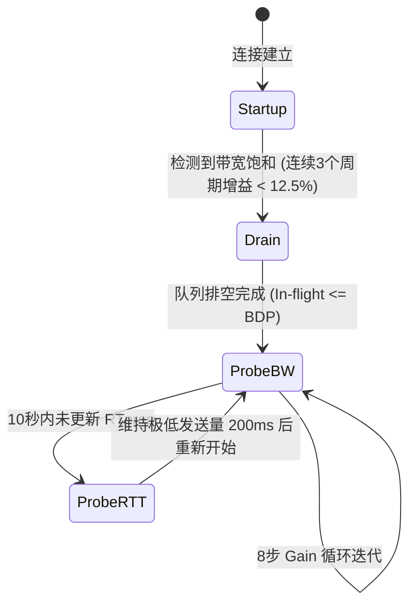

# 1.2.1.6 弱网模型

## 1. 弱网环境的物理本质与传输层底座矛盾

在分布式系统与现代网络通信中，“弱网”是一个广泛存在但又极具挑战性的物理现实。从地下室、电梯等物理屏蔽空间，到高铁、地铁等高速移动场景，再到大型集会等高密度接入环境，网络链路的物理品质呈现出高度的不确定性。深入理解弱网的物理特征以及传统传输层协议（如 TCP）在这些特征下的局限性，是构建高可用网络架构的基石。

### 1.1 弱网的物理特征与多维信道特征

在学术界和工业界，弱网（Weak Network / Challenged Network）通常被定义为**处于高度动态波动、且各项传输指标劣于基准服务水平的网络状态**。评估一个网络是否属于弱网，需要引入以下多维物理度量指标：

*   **高往返时延（RTT, Round-Trip Time）**：网络包从发送端出发到接收端确认并返回发送端的总时间。弱网环境下，RTT 不仅基数大（常在数百毫秒至数秒级别），且包含高额的排队延迟（Queueing Delay）和由于重传带来的额外往返。
*   **高抖动（Jitter）**：指时延的变化程度（即时延的方差）。在移动网络中，由于基站切换、无线信道动态调度以及物理层重传（如 HARQ），包到达时间具有极大的不确定性，导致时延抖动剧烈。
*   **随机物理丢包（Random Packet Loss）**：由于空间电磁干扰、多径衰落（Multipath Fading）、多普勒频移（Doppler Shift）以及阴影效应（Shadowing Effect）等物理现象，接收端在对数据帧进行循环冗余校验（CRC）时发现错误并将其直接丢弃。这种丢包是无线信道的物理特性决定的，并非由网络节点拥塞导致。
*   **带宽受限与非对称性（Bandwidth Limitation & Asymmetry）**：弱网链路的可用带宽（Capacity）通常极低，且上行带宽与下行带宽往往呈现出数倍甚至数十倍的非对称性，导致 ACK 确认包在上行链路积压，反向限制下行传输速率。

无线通信的物理极限遵循**香农定理（Shannon's Theorem）**：

$$C = B \log_2 \left(1 + \frac{S}{N}\right)$$

其中，$C$ 为信道容量（比特/秒），$B$ 为信道带宽（赫兹），$S/N$ 为信噪比（SNR）。当设备处于弱信号区域时，噪声 $N$ 增大或信号强度 $S$ 骤减，导致信噪比骤降，信道容量 $C$ 呈对数衰减。为了在极低信噪比下维持通信链路，物理层调制编码方案（MCS）会自动退化（例如从 64-QAM 退化为 QPSK），导致传输速率呈断崖式下跌。

---

### 1.2 传统 TCP 拥塞控制算法的“认知错位”与吞吐雪崩数学模型

传统的 TCP 拥塞控制算法（如 TCP Tahoe/Reno, BIC, Cubic）设计于 20 世纪 80 年代至 90 年代，其核心物理假设是：**有线互联网络是高度可靠的，传输链路上的物理随机丢包率几乎为零；因此，任何数据包的丢失，都必定是因为网络路径中的某个路由器缓冲区（Buffer）溢出，即发生了网络拥塞。**

在这种“丢包即拥塞”的单一认知下，一旦发送方检测到丢包（例如收到 3 个冗余确认字符 Duplicate ACK，或者触发了超时重传定时器 RTO），拥塞控制状态机就会迅速做出过激反应，剧烈收缩拥塞窗口（`cwnd`）。

#### 1.2.1 TCP Reno 随机丢包下的吞吐量数学推导

我们通过经典的 **Mathis 吞吐量公式** 来定量推导：在存在随机物理丢包（非拥塞丢包）的无线链路上，传统基于丢包的 TCP 算法（以 Reno 为例）为何会导致吞吐量“雪崩式”衰减。

假设信道的随机物理丢包率为 $p$，且丢包分布是独立的。在 TCP Reno 的拥塞避免阶段，拥塞窗口 $cwnd$（以数据包个数为单位）在每个 RTT 内递增 1。当 $cwnd$ 达到最大值 $W$ 时发生丢包，算法检测到丢包后将窗口减半，降至 $W/2$，然后重新开始加性增加。这是一个典型的“锯齿波”模型。

在一个完整的拥塞周期中，窗口大小从 $W/2$ 增长到 $W$。该周期内经历的往返时间数（RTT 数）为：

$$N_{\text{RTT}} = \frac{W}{2}$$

在此周期内发送的数据包总数 $Y$ 为：

$$Y = \sum_{i=0}^{W/2} \left( \frac{W}{2} + i \right) = \frac{3}{8}W^2 + \frac{3}{4}W$$

当 $W$ 较大时，可近似为：

$$Y \approx \frac{3}{8}W^2$$

由于在该周期末尾发生了 1 次丢包，因此丢包率 $p$ 可以表示为：

$$p = \frac{1}{Y} \approx \frac{8}{3W^2}$$

由此解出最大拥塞窗口 $W$：

$$W \approx \sqrt{\frac{8}{3p}}$$

在稳态下，平均拥塞窗口 $\bar{W}$ 为：

$$\bar{W} = \frac{1}{2} \left( W + \frac{W}{2} \right) = \frac{3}{4}W \approx \frac{3}{4} \sqrt{\frac{8}{3p}} = \sqrt{\frac{3}{2p}}$$

因此，TCP 的平均吞吐量（Throughput，单位：比特/秒）为平均窗口大小乘以最大报文段大小（MSS）除以往返时延（RTT）：

$$\text{Throughput} \approx \frac{\bar{W} \cdot \text{MSS}}{\text{RTT}} = \frac{\text{MSS}}{\text{RTT}} \sqrt{\frac{1.5}{p}} \approx \frac{1.22 \cdot \text{MSS}}{\text{RTT} \cdot \sqrt{p}}$$

**结论解析：**
从上述数学模型可以看出，TCP Reno 的吞吐量与丢包率的平方根 $\sqrt{p}$ 成反比。当无线信道由于物理干扰产生仅仅 $2\%$ 的随机物理丢包（$p=0.02$）时：

$$\text{Throughput} \propto \frac{1}{\sqrt{0.02}} \approx 7.07$$

而当物理丢包率上升到 $8\%$ 时（$p=0.08$），吞吐量因子骤降为：

$$\text{Throughput} \propto \frac{1}{\sqrt{0.08}} \approx 3.53$$

窗口的频繁减半导致 TCP 长期处于极低的发送速率状态。在真实的无线弱网中，一旦丢包率达到 $5\%$ 以上，传统的 TCP 拥塞控制由于频繁将物理丢包误判为网络过载，导致拥塞窗口被锁死在低位，即使物理信道还有大量的剩余可用带宽，也无法被利用，从而发生**吞吐量雪崩**。

#### 1.2.2 TCP Cubic 在弱网下的局限性

目前许多操作系统默认的 TCP 拥塞控制算法为 **Cubic**。Cubic 引入了以时间 $t$（自上次丢包事件以来的时间）为自变量的立方增长函数：

$$W_{\text{cubic}}(t) = C(t - K)^3 + W_{\text{max}}$$

其中 $W_{\text{max}}$ 是发生丢包时的窗口大小，$\beta$ 是窗口降低系数，而 $K$ 为：

$$K = \sqrt[3]{\frac{W_{\text{max}} \cdot \beta}{C}}$$

Cubic 在远离 $W_{\text{max}}$ 的阶段窗口增长极快，在接近 $W_{\text{max}}$ 时增长平缓，从而保证了在长肥管道（LFN, Long Fat Network）中的稳定性和高带宽利用率。然而，在弱网高丢包环境下，由于丢包事件发生的间隔时间 $t$ 极短，Cubic 还没有运行到平台期（$t \approx K$），就又一次因为随机丢包触发了窗口收缩，导致 $W_{\text{max}}$ 步步走低，Cubic 的三次曲线蜕变为一条在低位不断锯齿化震荡的无效曲线，同样无法逃脱吞吐量雪崩的命运。

#### 1.2.3 缓冲膨胀（Bufferbloat）的危害

基于丢包的拥塞控制算法还会引发另一个严重的网络副反应——**缓冲膨胀（Bufferbloat）**。为了防止丢包，网络设备制造厂商在路由器和交换机中内置了极大的缓冲区（Buffer）。

基于丢包的 TCP 算法会持续增加发送速率，直到将路径上所有路由器的缓冲区全部填满，才会因为溢出产生丢包，进而减速。这导致数据包在巨大的缓冲区中排队，产生了极高的排队延迟。在弱网环境下，缓冲膨胀会让 RTT 从几十毫秒飙升至数秒，造成严重的网络交互卡顿，同时并未带来吞吐量的提升。

---

### 1.3 BBR 拥塞控制算法深度剖析

为了解决传统基于丢包的拥塞控制算法在弱网及高丢包环境下的根本性缺陷，Google 于 2016 年提出了 **BBR（Bottleneck Bandwidth and RTT）** 拥塞控制算法。

#### 1.3.1 BBR 的核心控制模型

BBR 改变了以“丢包”或“延迟上升”作为拥塞反馈的逻辑，而是基于**克莱因罗克（Kleinrock）最优控制点**进行主动测量。

```
     吞吐量 (Throughput)
        ^
    Max |               /---------------------- (带宽上限 Bottleneck Bandwidth)
        |              / :
        |             /  :
        |            /   : 
        |           /    : <-- Kleinrock 最优控制点 (无排队, 带宽跑满)
        +----------/-----+-------------------> 链路注入数据量 (In-flight)
                   
     往返时延 (RTT)
        ^
        |                
        |                     /----------------- (时延因排队而爬升)
        |                    / :
    Min |-------------------/  : <-- RTprop (物理传播时延)
        +----------------------+-------------> 链路注入数据量 (In-flight)
                   |<-- BDP -->|
```

BBR 认为，网络上最优的发送状态（Kleinrock 点）是：
1.  **发送速率恰好等于瓶颈带宽（Bottleneck Bandwidth, $Btw$）**；
2.  **网络中在途的数据包总量（In-flight Data）恰好等于时延带宽积（BDP, Bandwidth-Delay Product）**：

$$\text{BDP} = Btw \times \text{RTprop}$$

其中 $\text{RTprop}$（Round-Trip Propagation Time）为链路的固有物理传播时延（无排队延迟时的最小 RTT）。此时，吞吐量达到最大值，而网络时延达到最小值，网络缓冲区中没有任何排队积压。

#### 1.3.2 测量与估算机制

根据网络物理原理，发送方无法在同一时刻既测得真实的 $Btw$ 又测得真实的 $\text{RTprop}$：
*   要测量最大 $Btw$，必须发送足够多的数据填满管道，甚至产生排队，此时测得的 RTT 必定包含排队延迟，大于 $\text{RTprop}$。
*   要测量最小 $\text{RTprop}$，必须排空整个管道，没有任何排队，此时发送速率极低，无法测得真实的 $Btw$。

为了解决这一矛盾，BBR 引入了基于时间窗口的交替测量机制：
*   **$Btw$ 的估算**：BBR 在滑动窗口内（通常为过去 10 到 12 个往返周期）使用**极大值滤波器（Windowed Max Filter）**，记录接收端反馈的最高传输速率。
*   **$\text{RTprop}$ 的估算**：BBR 在一个较长的窗口内（通常为 10 秒）使用**极小值滤波器（Windowed Min Filter）**，记录测得的最小 RTT。

#### 1.3.3 BBR 状态机与控制方程

BBR 的核心状态机包含四个阶段：**Startup（启动）**、**Drain（排空）**、**ProbeBW（带宽探测）** 和 **ProbeRTT（时延探测）**。



BBR 的发送速率由 **Pacing Rate**（步速控制）和 **Cwnd**（拥塞窗口限制）共同决定：

$$\text{Pacing Rate} = \text{Pacing Gain} \times Btw$$

$$\text{Cwnd} = \text{Cwnd Gain} \times \text{BDP}$$

各状态的运作细节与参数如下表所示：

| 状态名称 | 核心任务 | Pacing Gain | Cwnd Gain | 状态转移条件 |
| :--- | :--- | :--- | :--- | :--- |
| **Startup** | 快速探测可用带宽（类似于慢启动） | $2/\ln 2 \approx 2.89$ | $2.89$ | 检测到瓶颈带宽已满（新测得的 $Btw$ 相比上一轮增长小于 $12.5\%$） |
| **Drain** | 排空 Startup 阶段因超速发送积压在路由器的队列 | $1/\text{Startup Gain} \approx 0.35$ | $2.89$ | 在途数据包（In-flight）降到当前估算的 $\text{BDP}$ 以下 |
| **ProbeBW** | 稳态运行，周期性上下震荡速率以探测带宽波动 | 8步循环控制增益（见下文） | $2.0$ | 持续循环；若 $RTprop$ 超过 10 秒未更新，则切入 ProbeRTT |
| **ProbeRTT** | 强行排空队列，以测得真实的物理固有延迟 $\text{RTprop}$ | $1.0$ | 锁定为常数（通常为 4 个包） | 持续 200 毫秒后，根据情况返回 Startup 或 ProbeBW |

在 **ProbeBW** 阶段，BBR 采用一个包含 8 个 RTT 周期的循环增益数组：
$$\text{Pacing Gain Array} = [1.25, 0.75, 1.0, 1.0, 1.0, 1.0, 1.0, 1.0]$$
当 Pacing Gain 为 $1.25$ 时，发送速率上调，主动向管道灌入更多数据，以探测是否有新的带宽释放；紧接着在下一个周期将 Gain 降为 $0.75$，主动减速，排空上一步可能引入的排队积压；其余 6 个周期以 $1.0$ 的增益平稳传输。

#### 1.3.4 BBR 对抗物理丢包的优势与数学边界

由于 BBR 的控制反馈不依赖丢包，即使链路上存在高达 $20\%$ 的高随机物理丢包，BBR 依然能通过接收端反馈的确认包速率准确估算出 $Btw$ 和 $\text{RTprop}$，并以接近瓶颈带宽的速率平稳发送。这彻底解决了传统 TCP 算法在弱网下的吞吐量雪崩问题。

**BBR 的物理/数学边界与局限性：**
1.  **非对称链路上的反向确认限制**：如果上行信道极度拥堵，导致反向 ACK 包大面积丢失或延迟增大，BBR 在发送端将无法获得及时的速率反馈，从而低估 $Btw$，导致下行吞吐量受限。
2.  **与丢包驱动算法共存时的带宽抢占问题（不公平性）**：当 BBR 与 Cubic 共享同一个有线瓶颈链路时，由于 Cubic 会持续往缓冲区灌水直到填满，而 BBR 为了测量真实时延会定期主动排空队列（特别是在 ProbeRTT 阶段将窗口缩减至 4），这会导致 BBR 空出的缓冲区空间被 Cubic 霸占，在某些特定缓冲结构下出现 BBR 吞吐量被 Cubic 严重挤压的现象。

---

### 1.4 队头阻塞（HOL - Head-of-Line Blocking）在弱网环境下的危害

在弱网（高丢包、高延迟）环境下，传输层与应用层的**队头阻塞（HOL Blocking）**是导致通信时延呈指数级恶化的关键病灶。

#### 1.4.1 TCP 强顺序递交与接收缓冲区阻塞

TCP 在设计上保证了**有序且可靠的字节流传输（In-Order Delivery）**。这一特性在协议栈底层的实现机制如下：

```
发送端                                         接收端
[ Segment 1 ]  --------------------------> [ 已接收并递交应用层 ]
[ Segment 2 ]  (丢包) -------------------> [ 缺失! 阻塞触发 ]
[ Segment 3 ]  --------------------------> [ 暂存接收缓冲区, 无法递交 ]
[ Segment 4 ]  --------------------------> [ 暂存接收缓冲区, 无法递交 ]
                     RTO/Fast Retransmit
[ Segment 2 ]  ==========================> [ 接收成功, 队列解冻, 一并递交 ]
```

1.  发送端为每个 TCP Segment 分配连续的序号（Sequence Number）。
2.  接收端收到数据后，将其写入内核接收缓冲区（Receive Buffer）。
3.  操作系统的套接字接口（Socket API）只允许应用层以连续的字节流读取数据。如果序号为 $N$ 的数据包丢失，即使序号为 $N+1$ 到 $N+M$ 的后续数据包已经顺利抵达接收缓冲区，内核也无法将它们交付给上层应用程序。
4.  这部分包必须在缓冲区中“被迫待命”，直到发送端通过快速重传或超时重传将数据包 $N$ 补齐。

在弱网环境下，高丢包率会导致重传频繁发生，高延迟则让重传的往返时间变长。这使得接收端的解冻周期极度拉长，应用层感知到的吞吐率不仅极低，且呈现出“卡顿-爆发-再卡顿”的脉冲式特性。

#### 1.4.2 协议演进中的队头阻塞与 HTTP/3 的解耦方案

队头阻塞不仅存在于传输层，也随着应用层协议的演进在不同维度交织：

1.  **HTTP/1.1 的队头阻塞**：在 HTTP/1.1 中，虽然引入了管道化（Pipelining），但它要求响应必须按照请求的顺序返回。如果第一个请求在服务器端处理缓慢（如复杂的数据库查询），后续所有已处理完毕的请求响应都无法发送，这属于**HTTP 协议层的队头阻塞**。
2.  **HTTP/2 的多路复用与二次队头阻塞**：HTTP/2 通过将请求和响应拆分为一个个带 Stream ID 的帧（Frame），在同一个 TCP 连接上并发传输，解决了 HTTP 协议层的队头阻塞。然而，这导致了更为严重的**传输层二次队头阻塞**。因为所有流都寄宿在同一个底层的 TCP 连接中。一旦弱网下发生丢包，整个 TCP 连接的滑动窗口停滞，将导致该连接上并行的数十个 HTTP 流全部被挂起，即使有些流的数据包已经全部到达。
3.  **HTTP/3 (QUIC) 的多流无阻塞设计**：HTTP/3 放弃了 TCP，转而基于 UDP 构建了全新的传输层协议 **QUIC**。QUIC 在传输层原生支持“流（Stream）”的概念，各个 Stream 之间是完全解耦且独立的。

```
TCP (HTTP/2):
[ Segment 1 (Stream 1) ] [ Segment 2 (Stream 2, 丢失) ] [ Segment 3 (Stream 3) ]
===> 发生丢包，整个连接阻塞，Stream 1 和 Stream 3 均无法被读取。

QUIC (HTTP/3):
[ Packet 1 (Stream 1) ] [ Packet 2 (Stream 2, 丢失) ] [ Packet 3 (Stream 3) ]
===> 发生丢包，仅 Stream 2 被阻塞，Stream 1 和 Stream 3 立即被解密并交付应用层。
```

在 QUIC 协议中，丢包的重传粒度精确到单个流。如果 Stream 2 丢包，只有 Stream 2 会在接收端等待重传，Stream 1 和 Stream 3 的数据一旦到达，可以立即越过协议栈交付应用层，彻底解决了弱网环境下的队头阻塞问题。

---

## 2. 移动网络切换与多路径传输机制

在移动互联网时代，设备的位置变化使得底层物理链路时刻处于变动之中。例如，用户从家中 WiFi 覆盖区域走向户外，连接自动切换到蜂窝移动网络（4G/5G）。在这种动态场景下，传统的套接字机制面临着根本性的结构冲突。

### 2.1 四元组绑定与 IP 漂移下的 TCP 连接崩溃

传统的网络通信建立在 BSD Socket 的抽象模型之上。一个活动的 TCP 连接在操作系统内核中，由唯一的**四元组**进行标识：

$$\text{Connection} = \langle \text{Source IP}, \text{Source Port}, \text{Destination IP}, \text{Destination Port} \rangle$$

在操作系统的网络栈中，每一个 Socket 都有一个对应的内存控制块（如 Linux 内核中的 `struct inet_sock`），其内部牢牢绑定了当前连接的四元组信息。当网卡收到一个数据包时，内核协议栈会执行哈希查找，根据数据包首部解析出的四元组匹配对应的 Socket，并将数据投递到其接收队列中。

```
+-------------------------------------------------------------------+
|                            内核空间                               |
|                                                                   |
|   +-------------------+  1. 匹配四元组   +--------------------+   |
|   | 收到数据包         | ---------------> | 路由与哈希查找表   |   |
|   | (SrcIP, SrcPort,  |                  +--------------------+   |
|   |  DstIP, DstPort)  |                            |              |
|   +-------------------+                            | 2. 匹配成功  |
|                                                    v              |
|                                          +--------------------+   |
|                                          | struct inet_sock   |   |
|                                          +--------------------+   |
+-------------------------------------------------------------------+
```

一旦设备发生网络切换：
1.  **IP 地址变更**：设备的物理网络接口从无线网卡（`wlan0`）切换到蜂窝网卡（`rmnet0`），设备的 IP 地址由 DHCP 分配的局域网私网 IP A 变更为基站分配的 IP B。
2.  **NAT 映射失效**：即使在局域网内物理出口发生改变，网络出口的运营商 NAT 转换设备（Network Address Translation）上的映射表项（Mapping Table）也会随之失效，导致外网侧映射的源端口和源 IP 发生不可预知的变化。
3.  **连接崩溃**：当设备使用新的 IP B 向服务器发送后续 TCP 数据包时，服务器内核通过四元组查找，发现无法匹配任何已存在的活动套接字。按照 TCP 规范，服务器会向客户端回复一个 **RST (Reset)** 报文，强制关闭连接。
4.  **应用层感知**：上层应用表现为 Socket 触发 `Connection Reset` 异常，所有正在进行的网络事务全部被强行中断，必须重新经历“DNS 解析 $\rightarrow$ 三次握手 $\rightarrow$ 应用层协议握手（如 TLS）”的完整重建过程。在高频移动场景下，这会导致网络服务可用性出现灾难性波动。

---

### 2.2 MPTCP (Multipath TCP) 内核管理与子流合并机制

为了克服单物理路径的单点脆弱性，IETF 制定了 **MPTCP（Multipath TCP, RFC 8684）** 协议。MPTCP 允许在同一个连接上下文中并发利用多条物理路径（如 WiFi 和蜂窝网络同步传输），从而实现带宽叠加与无缝物理容灾。

#### 2.2.1 协议栈架构与子流（Subflow）合并

MPTCP 在传统 TCP 层的上部引入了一个 MPTCP 控制子层，对上层应用层暴露一个标规的 Socket 接口，但在内核底层管理多个独立的 TCP 连接（称为子流 Subflow）。

```
+---------------------------------------------+
|                  应用层                     |
|            (标准 Socket API)                |
+---------------------------------------------+
|                  MPTCP 层                   |
+---------------------------------------------+
|    Subflow 1 (TCP)    |    Subflow 2 (TCP)  |
|      (e.g. WiFi)      |     (e.g. 5G)       |
+-----------------------+---------------------+
|                  IP 层                      |
+---------------------------------------------+
```

MPTCP 的连接建立和多路径加入步骤如下：
1.  **初始子流建立（MP_CAPABLE）**：
    客户端发起首个 SYN 报文，在其 TCP 头部 Option 字段中携带 `MP_CAPABLE` 标记，并附带一个客户端生成的本地 Key。服务器如果支持 MPTCP，会在 SYN-ACK 中同样带上 `MP_CAPABLE` 及服务器 Key。双方通过三次握手建立起主连接，并协商出该连接的唯一标识符 Token。
2.  **新子流加入（MP_JOIN）**：
    当设备检测到第二条路径（如蜂窝网激活）可用时，它通过该物理网卡发送一个 SYN 报文。该报文在 Option 中携带 `MP_JOIN` 标记，并包含先前主连接的 Token 以及一个随机数。服务器收到后，通过 Token 关联到已存在的 MPTCP 主连接上下文，双方利用先前交换的 Key 运行 HMAC 校验进行身份验证。验证通过后，该新子流被合并进主连接中。

#### 2.2.2 MPTCP 耦合拥塞控制（Coupled Congestion Control）

如果在各个子流上直接运行独立的传统 TCP 拥塞控制，MPTCP 连接由于占用了 $N$ 条物理路径，会抢占 $N$ 倍的瓶颈带宽，这对同链路上普通的单路径 TCP 极不公平。因此，MPTCP 必须在内核层实现拥塞窗口的耦合控制。

最常用的算法是 **LIA (Linked Increase Algorithm, RFC 6356)**。其核心设计目标是：
1.  **吞吐量最大化**：多路径的总吞吐量应不低于各单路径中最优路径的吞吐量。
2.  **资源转移**：将流量尽可能从拥堵路径转移到空闲路径。
3.  **公平性**：在任何共享瓶颈的链路上，MPTCP 占用的总带宽不超过单个普通 TCP 占用的带宽。

LIA 在各个子流 $r$ 上的拥塞窗口 $w_r$ 调节公式如下：
*   **收到 ACK 时的加性增长**：

$$w_r \leftarrow w_r + \min \left( \frac{\max_{i} w_i / \text{RTT}_i^2}{\left( \sum_{i} w_i / \text{RTT}_i \right)^2}, \frac{1}{w_r} \right)$$

*   **发生丢包时的乘性减小**：

$$w_r \leftarrow w_r - \frac{w_r}{2}$$

通过将增长步长与所有活跃子流的当前窗口 $w_i$ 和 $\text{RTT}_i$ 挂钩，LIA 使得时延更低、丢包更少的路径窗口增长更快，从而实现流量的动态自适应调度。

#### 2.2.3 路径异构性带来的“队头阻塞拼图”挑战

在真实的移动场景中，WiFi 子流（RTT 可能是 15ms）与 5G 子流（RTT 可能是 120ms）的物理特性差异巨大。
如果 MPTCP 调度器简单地将数据包平均分发，接收端的重排缓冲区（Reordering Buffer）会因为等待高延迟路径上的数据包而陷入大面积的队头阻塞。为了解决这一问题，内核调度器必须引入**时延感知调度（Delay-Aware Scheduling）**：通过精确预测包的抵达时间，优先使用低时延路径，并且在发现慢速路径上的包超时未达时，主动在快速路径上发起**主动冗余重传（Redundant Retransmission）**，以牺牲少量带宽为代价换取端到端时延的平滑。

---

### 2.3 现代 QUIC 协议连接迁移（Connection Migration）原理

MPTCP 的部署面临着巨大的阻力，因为它需要修改操作系统内核，且网络中间设备（如防火墙、NAT 网关）经常会丢弃带有未知 TCP 选项（如 `MP_CAPABLE`）的报文。

基于 UDP 的 **QUIC 协议（RFC 9000）** 通过在应用层/传输层重构会话标识机制，优雅且高效地解决了这一问题，实现了**连接迁移（Connection Migration）**。

#### 2.3.1 连接标识符（Connection ID）的解耦

QUIC 彻底抛弃了基于 IP 和端口的四元组连接识别逻辑，引入了**连接标识符（Connection ID, CID）**：
*   每一个 QUIC 连接都被赋予一个唯一的 CID（长度可在 0 到 20 字节之间协商，通常为 8 或 16 字节）。
*   连接标识符分为 **Source Connection ID (SCID)** 和 **Destination Connection ID (DCID)**。
*   只要数据包首部中的 DCID 匹配，无论发送端的源 IP、源端口如何变化，QUIC 接收端都能正确地将该数据包归入对应的连接上下文中。

为了防止路径上的中间节点（如黑客、运营商）通过 CID 的不变性跟踪用户的物理位置移动（侵犯隐私），QUIC 引入了 **CID 轮换机制**。在连接建立期间，客户端和服务器会生成一组可用的 CID 列表。当发生网络切换时，客户端会自动启用列表中下一个全新的 CID 进行通信，使外部监听者无法将新旧路径关联起来。

#### 2.3.2 连接迁移的物理步骤与防放大攻击路径验证

以下是一个典型的 QUIC 连接迁移的完整时序与物理步骤：

```
[ 客户端 ]                                                         [ 服务端 ]
    |                                                                  |
    |---- 旧路径 (IP_A:Port_A) 传输数据 ------------------------------>|
    |                                                                  |
 [网络切换] (物理链路变更至蜂窝网络 IP_B:Port_B)                        |
    |                                                                  |
    |---- 1. 使用新 CID 及新路径发送首个数据包 ------------------------>|
    |                                                                  |
    |                                                 [发现源地址变更为 IP_B]
    |                                                 [启动路径验证, 防放大攻击]
    |                                                                  |
    |<--- 2. 发送 PATH_CHALLENGE (携带 8字节随机 payload) --------------|
    |        (限制响应字节数 <= 3 * 接收字节数)                        |
    |                                                                  |
    |---- 3. 回复 PATH_RESPONSE (携带相同 8字节 payload) -------------->|
    |                                                                  |
    |                                                 [路径验证成功, 迁移完成]
    |<--- 4. 使用新路径全力发送后续数据 -------------------------------|
    |                                                                  |
```

##### 步骤 1：静默探路与新路径启动
客户端检测到网络接口状态变化后，停止在旧路径发送数据。选择一个新的本地 CID 和新协商好的服务器端 DCID，使用蜂窝网络接口（源 IP 为 `IP_B`，源端口为 `Port_B`）发送第一个 QUIC 包（通常是一个携带应用层数据的加密包）。

##### 步骤 2：服务端源地址判定与放大攻击防御
服务端收到该数据包后，根据其 DCID 成功匹配到原连接上下文。服务端注意到发送端的源四元组已变更，将其识别为连接迁移。

> [!WARNING]
> **放大攻击防御限制：**
> 为防止攻击者通过伪造源 IP，将自己注册为某个流量巨大的连接的目标地址，从而利用服务器对目标地址进行分布式拒绝服务攻击（DDoS 放大攻击）。
> 在对新路径进行“验证”成功之前，**服务端向客户端新地址发送的数据字节总数，严禁超过其在该新路径上接收到的客户端字节总数的 3 倍**。这被称为 3 倍放大限制（3x Amplification Limit）。

##### 3. 步骤 3：路径验证（Path Validation）
服务端向客户端的新地址发送一个 `PATH_CHALLENGE` 帧，该帧包含一个由 8 字节强随机数组成的 Payload。由于 3 倍放大限制，该帧通常会与填充包（Padding Packet）一起发送，以确保路径的最大传输单元（MTU）测试，同时限制服务器后续发送大小。

##### 4. 步骤 4：路径响应与确认
客户端在新路径上收到 `PATH_CHALLENGE` 帧后，必须立即构建并向服务端回复一个 `PATH_RESPONSE` 帧，该帧必须原封不动地携带该 8 字节随机数。

##### 5. 步骤 5：迁移完成与路径升级
服务端收到对应的 `PATH_RESPONSE` 帧，对比随机数无误后，宣布新路径验证通过。此时，服务器将该路径标记为“活跃（Active）”并升级为主传输路径，解除 3 倍发送限制，后续的所有高带宽数据全部切换到该新路径发送。旧路径随之关闭。

整个迁移过程无需重新运行 TLS 握手，应用层数据在迁移期间也无需中断，实现了物理网络热切换下的完全无缝平滑过渡。

---

## 3. 动态超时与重试避灾控制（系统架构级设计）

在弱网环境中，延迟的高抖动与随机丢包会导致网络事务的响应时间（Latency）出现极大的拉伸。如何在客户端与服务端之间设计合理的超时判定与重试机制，是保证分布式系统在弱网下既能快速自我恢复，又不会发生级联过载（雪崩）的关键。

### 3.1 动态超时时间（RTO）自适应算法演进

**重传超时时间（RTO, Retransmission Time-Out）** 是网络可靠性的红线。若 RTO 设置过短，会导致网络发生偶发性延迟波动时，发送方误认为包丢失而发起无谓的冗余重传，这在带宽本就紧张的弱网下无疑是雪泥鸿爪；若 RTO 设置过长，在真实丢包发生时，系统将陷入长时间的无响应等待，应用层体验极度卡顿。

为了实现自适应平衡，现代传输协议普遍采用基于 RTT 动态反馈的估计算法。

#### 3.1.1 经典算法与 Jacobson/Karels 算法推导

最早的估算算法（RFC 793）采用简单的指数加权移动平均（EWMA）：

$$\text{SRTT} \leftarrow \alpha \times \text{SRTT} + (1 - \alpha) \times \text{RTT}_{\text{sample}}$$

其中 $\alpha$ 通常取值 $0.9$。该算法在延迟恒定的有线网表现尚可，但在高抖动的无线弱网下，因为它只关注了平均值，而忽略了方差，导致其对时延波动的敏感度极低。

为了修正这一缺陷，Van Jacobson 和 Michael Karels 提出了 **Jacobson/Karels 算法（RFC 6298）**，引入了**平均偏差值（RTTVAR）**来衡量时延的抖动情况：

##### 步骤 1：计算当前样本与平滑均值的偏差（Error）

$$\text{Err} = \text{RTT}_{\text{sample}} - \text{SRTT}$$

##### 步骤 2：更新平滑往返时间（SRTT）

$$\text{SRTT} \leftarrow \text{SRTT} + g \times \text{Err}$$

其中 $g$ 为平滑增益系数，RFC 规范建议取值 $g = 1/8 = 0.125$。

##### 步骤 3：更新平滑均差（RTTVAR）

$$\text{RTTVAR} \leftarrow (1 - h) \times \text{RTTVAR} + h \times |\text{Err}|$$

其中 $h$ 为均差增益系数，建议取值 $h = 1/4 = 0.25$。

##### 步骤 4：计算重传超时时间（RTO）

$$\text{RTO} = \text{SRTT} + 4 \times \text{RTTVAR}$$

##### 步骤 5：边界保护限制
为了防止 RTO 陷入死区，协议规定了最小超时时间下限 $\text{RTO}_{\text{min}}$（通常在 TCP 中默认设为 200 毫秒或 1 秒）。如果计算出来的 $\text{RTO} < \text{RTO}_{\text{min}}$，则强制将 $\text{RTO}$ 设为 $\text{RTO}_{\text{min}}$。

**数学机制剖析：**
在抖动剧烈的弱网下，时延偏差 $|\text{Err}|$ 会瞬间增大。从公式中可以看出，当偏差增大时，$\text{RTTVAR}$ 会迅速被拉高，并且由于它的权重大（乘以 4），计算出的 $\text{RTO}$ 会呈爆发式增大。这是一种精妙的自我保护：**网络越是不稳定，重传定时器就越倾向于保守，以防止向本就脆弱的网络中倾倒冗余的重传包**。

#### 3.1.2 Karn 算法与重传多义性消除

在测量 $\text{RTT}_{\text{sample}}$ 时，如果某个包发生了重传，当发送端收到对应的 ACK 时，会产生**重传多义性（Retransmission Ambiguity）**：发送端无法分辨这个 ACK 是对“第一次发送的原始包”的确认，还是对“后续重传包”的确认。
*   若误认为是前者的确认，算出的 $\text{RTT}_{\text{sample}}$ 会异常偏大；
*   若误认为是后者的确认，算出的 $\text{RTT}_{\text{sample}}$ 会异常偏小。

为了解决这个问题，**Karn 算法** 规定了以下两条强约束：
1.  **不采样规则**：在计算 $\text{SRTT}$ 和 $\text{RTTVAR}$ 时，绝对不将任何发生过重传的报文的 RTT 样本纳入计算。只有当报文一次发送即获得确认时，才采集其 $\text{RTT}_{\text{sample}}$（除非协议中启用了带 TCP Timestamps 选项，允许通过时间戳消除多义性）。
2.  **退避规则**：一旦某个报文触发了超时重传，RTO 定时器立即执行指数退避（Exponential Backoff）：

$$\text{RTO} \leftarrow \text{RTO} \times 2$$

直到有一个后续报文不需要重传便被顺利确认，RTO 估算器才重新恢复正常的 Jacobson/Karels 算法。

---

### 3.2 重试风暴（Retry Storm）物理现象与防灾架构

在应用层设计中，当由于网络变慢导致客户端请求发生超时，客户端往往会发起重试。然而，在大规模分布式系统中，这种机制很容易演变成致命的**重试风暴（Retry Storm）**，引发系统雪崩。

#### 3.2.1 重试风暴的动力学崩溃模型

```
[ 客户端 ]                                     [ 网关/服务端队列 ]
    |                                                 |
    |---- 1. 发起请求 -----------------------------> | (队列积压, 延迟上升)
    |                                                 |
  [超时] (RTO 触发)                                    |
    |                                                 |
    |---- 2. 第一次重试 ----------------------------> | (队列更长, 延迟恶化)
    |---- 3. 第二次重试 ----------------------------> | (内存溢出, 响应彻底锁死)
```

当网络或后端服务出现偶发性阻塞时，处理延迟变长。如果客户端没有节制地发起重试：
1.  **流量级联放大**：原本 10,000 QPS 的系统，如果每个客户端超时重试 3 次，瞬间流量会飙升至 40,000 QPS。
2.  **队列饱和溢出**：服务端的网关和内部线程队列被重试包塞满，导致排队延迟进一步拉长。
3.  **雪崩效应**：后续正常的首发请求由于排队同样发生超时，进而加入重试大军。整个系统陷入正反馈恶性循环，直到服务器内存溢出（OOM）或彻底瘫痪。

#### 3.2.2 指数退避与随机抖动（Jitter）设计

为了打散重试流量在时间轴上的聚集，防止“群聚效应”（Synchronization Effect），必须引入**指数退避（Exponential Backoff）**与**随机抖动（Jitter）**。

下面对比三种主流的退避抖动模型。我们定义基准退避时间为 $Base$（例如 100 毫秒），最大退避时间为 $MaxSleep$（例如 10 秒），当前重试次数为 $attempt$（从 0 开始）。

##### 模型 A：Full Jitter (全随机抖动)
每次计算当前指数退避的上限值，然后在 $[0, \text{Temp}]$ 区间内随机取值。该模型在消除尖峰流量上表现最好。

$$\text{Temp} = \min(MaxSleep, Base \times 2^{attempt})$$

$$T_{\text{sleep}} = \text{random}(0, \text{Temp})$$

##### 模型 B：Equal Jitter (等量随机抖动)
保留一半的确定性退避基数，另一半进行随机。这在保持重试间隔整体递增的同时引入了一定的随机性。

$$\text{Temp} = \min(MaxSleep, Base \times 2^{attempt})$$

$$T_{\text{sleep}} = \frac{\text{Temp}}{2} + \text{random}\left(0, \frac{\text{Temp}}{2}\right)$$

##### 模型 C：Decorrelated Jitter (去相关随机抖动)
该算法不依赖当前的重试次数，而是根据上一次的实际休眠时间 $T_{\text{prev\_sleep}}$ 乘以 3 之后，在 $Base$ 与该值之间做随机。它能有效防止多次重试的客户端在后续步骤中再次发生同步。

$$T_{\text{sleep}} = \min\left(MaxSleep, \text{random}(Base, T_{\text{prev\_sleep}} \times 3)\right)$$

以下是使用通用面向对象伪代码实现的这三种 Jitter 控制算法：

```go
// 指数退避与抖动计算器
class JitterRetrier {
    private const BASE = 100;        // 100ms
    private const MAX_LIMIT = 10000; // 10s

    // 方案 1: Full Jitter
    public function getFullJitterSleepTime(int attempt): int {
        int temp = min(MAX_LIMIT, BASE * (1 << attempt));
        return randomRange(0, temp);
    }

    // 方案 2: Equal Jitter
    public function getEqualJitterSleepTime(int attempt): int {
        int temp = min(MAX_LIMIT, BASE * (1 << attempt));
        int half = temp / 2;
        return half + randomRange(0, half);
    }

    // 方案 3: Decorrelated Jitter
    public function getDecorrelatedJitterSleepTime(int prevSleep): int {
        int nextLimit = prevSleep * 3;
        int minLimit = BASE;
        if (minLimit > nextLimit) {
            nextLimit = minLimit;
        }
        int calculated = randomRange(minLimit, nextLimit);
        return min(MAX_LIMIT, calculated);
    }
}
```

在大规模分布式网络模拟测试中，**Full Jitter** 通常是保护服务端的最佳选择，因为它能将并发重试请求完全揉碎并均匀分布在整个退避周期内。

#### 3.2.3 客户端流控：重试预算熔断器（Retry Budget）

除了在时间轴上稀释流量，客户端架构设计还必须从总量上进行自我限流，即引入**重试预算熔断器（Retry Budget / Retry Token Bucket）**。

```
[ 正常请求发送成功 ]  ---->  Token 桶内添加 0.1 个 Token (上限 100)
[ 发起超时重试 ]      ---->  从 Token 桶中扣除 1.0 个 Token
                         |
                         +---> 若 Token 余额 < 1.0 ---> 熔断机制触发:
                               直接向应用层报错，拦截重试请求
```

*   **工作机制**：
    客户端在内存中维护一个滑动窗口计数器或令牌桶。
    1.  每次正常的、非重试的请求发送成功，向桶中存入 $0.1$ 个 Token（意味着每 10 次成功请求累积 1 次重试额度），桶的最大容量上限为 $100$。
    2.  每次应用需要发起重试时，必须先尝试从桶中扣除 $1.0$ 个 Token。
    3.  如果扣除成功，允许发起重试；如果桶内余额不足 $1.0$，说明当前系统网络极差，重试占总请求的比例已超过阈值（即 $10\%$），**客户端熔断机制立即触发，直接拦截该重试请求，不将其发送出去，而是向应用层返回网络故障**。
*   **设计价值**：
    该机制保证了在任何极端恶劣的网络或者后端服务崩溃状态下，客户端产生的重试流量永远被死死限制在正常网络流量的 $10\%$ 以内，从系统物理架构上彻底杜绝了客户端成为 DDoS 攻击源的可能。

---

## 4. 离线缓存与协议层优化

弱网环境下的网络抖动是不可避免的。优秀的系统架构设计应将“网络在任何时候都可能断开”作为默认的设计假设，并在本地存储层、协议层和应用传输协议上做针对性的架构改良。

### 4.1 离线数据存储与最终一致性同步同步架构

当客户端由于网络完全中断进入“离线模式”时，应用不应直接报错或挂起，而应允许用户进行本地的写操作（如写笔记、发消息、修改个人资料），并将这些修改在本地可靠地缓存起来，待网络恢复后进行一致性同步。

#### 4.1.1 预写日志（WAL）与本地事务队列设计

为了防止客户端异常退出、崩溃或电磁丢失导致用户离线编辑的数据丢失，本地持久化层必须采用**预写日志（WAL, Write-Ahead Log）**的架构思想：
1.  **Mutation 抽象**：将用户的每一次写入操作封装为一个幂等的、自包含的 `Mutation` 任务（例如：`CreateMessageMutation`、`UpdateProfileMutation`）。
2.  **事务追加**：在将修改应用到本地展示层数据库的同时，将该 `Mutation` 序列化并顺序追加到本地的“待同步事务队列文件”（Sync Queue File）中。这一步必须利用本地文件系统的 `fsync` 保证其物理落盘。
3.  **FIFO 执行器**：同步管理器（Sync Manager）在后台监听网络状态变化。当网络恢复时，按先进先出（FIFO）顺序依次取出 `Mutation` 并发送给服务器。

#### 4.1.2 一致性冲突解决模型：向量时钟（Vector Clock）

多端写入（例如用户同时在手机和电脑上离线编辑同一份文档）在恢复同步时，必定会面临写冲突。

简单的“最后写入者胜出（LWW, Last-Write-Wins）”策略依赖各个设备的系统物理时钟。然而，在分布式系统中，不同客户端的本地时钟存在物理飘移（Clock Skew），直接使用绝对时间戳会导致数据被无情覆盖。

因此，系统应采用**向量时钟（Vector Clock）**来精确追踪数据的因果关系。

设系统有 $N$ 个参与写操作的节点，数据的向量时钟为一个大小为 $N$ 的向量 $V$。对于节点 $i$，其向量为 $V_i = [c_1, c_2, \dots, c_N]$，其中 $c_k$ 表示节点 $i$ 已知的节点 $k$ 上的逻辑时钟值。

更新规则如下：
1.  节点 $i$ 每次本地发生写事件，自增其逻辑计数器：

$$V_i[i] \leftarrow V_i[i] + 1$$

2.  节点 $i$ 将数据和其向量时钟 $V_i$ 发送给节点 $j$。
3.  节点 $j$ 收到后，更新其本地的向量时钟 $V_j$：

$$\forall k \in [1, N], \quad V_j[k] \leftarrow \max(V_j[k], V_i[k])$$

并且

$$V_j[j] \leftarrow V_j[j] + 1$$

##### 冲突检测逻辑：
对于两个版本的数据，其向量时钟分别为 $V^A$ 和 $V^B$：
*   若 $\forall k, V^A[k] \le V^B[k]$ 且 $\exists k, V^A[k] < V^B[k]$，则版本 $B$ 继承（支配）自版本 $A$，数据无冲突，可安全升级为 $B$。
*   若不满足上述偏序关系（即存在某些维度 $V^A[x] > V^B[x]$，而另一些维度 $V^A[y] < V^B[y]$），则判定为**并发写冲突**，必须调用业务逻辑合并算法（如三向合并 Three-Way Merge）或将冲突版本保留，交给用户交互决策。

#### 4.1.3 端到端幂等性（Idempotency）保障

在弱网重试机制下，一个请求可能已经被服务器成功处理，但返回的 ACK 包在半路丢了。客户端重试会导致服务器收到重复的写入请求。

为此，架构设计必须实现端到端的幂等性控制：
1.  **唯一标识生成**：客户端在离线生成 `Mutation` 时，使用强随机算法生成一个全局唯一的 `Idempotency Key`（UUIDv4 或是由 `Client_ID + Monotonic_Counter` 组成的唯一串）。
2.  **服务端去重验证**：服务器在处理写操作前，先通过 Redis 或数据库事务查询该 `Idempotency Key` 是否已存在：
    *   若**未存在**：执行写操作，并将 `Idempotency Key` 存入去重表，同时将处理结果序列化记录到该 Key 对应的 Value 中，设置合理的生存时间（TTL，如 24 小时）。
    *   若**已存在**：说明是网络丢包导致的客户端重试，服务器直接读取去重表中缓存的响应数据返回给客户端，不再重复执行底层的业务逻辑。

---

### 4.2 协议体积压缩：Protobuf 二进制压缩机理

在弱网环境下，带宽带宽极其昂贵，大体积的文本协议（如 JSON, XML）会拉长数据在传输链路上的排队和发送时间，极大降低成功率。采用 **Protocol Buffers (Protobuf)** 这一二进制序列化格式，能从根本上压缩数据包体积，并提升解析性能。

#### 4.2.1 Varints 变长整型编码原理

JSON/XML 表达数字采用的是文本字符（例如数字 `300` 占用 3 个字节：ASCII 的 '3', '0', '0'）。即使是标准的 32 位整型（int32），在内存中也固定占用 4 个字节，不论这个数值有多小。

Protobuf 引入了 **Varints (Variable-Length Quantity)** 编码，用一个或多个字节来表示整数。数值越小，占用的字节数就越少。

Varints 中的每个字节都包含一个**最高有效位（MSB, Most Significant Bit）**：
*   如果 MSB 设为 $1$，表示后续的字节也是当前数字的一部分。
*   如果 MSB 设为 $0$，表示当前字节是该数字的最后一个字节。
*   每个字节剩下的 $7$ 位（bit）用于存储数字的实际二进制值。

##### 示例推导：数字 300 在 Varints 下的序列化过程
1.  300 的二进制表示为：

$$\text{0000 0001 0010 1100}$$

2.  按照每 7 位进行截断分组：
    *   低 7 位：`0101100` (十进制 44)
    *   高 7 位：`0000010` (十进制 2)
3.  因为后面还有字节，低 7 位的字节最高位（MSB）设为 1，得到：

$$\mathbf{1}0101100 \implies \text{0xAC}$$

4.  因为后面没有更多字节，高 7 位的字节最高位（MSB）设为 0，得到：

$$\mathbf{0}0000010 \implies \text{0x02}$$

5.  采用小端序（Little-Endian）排布，最终序列化出的两个字节为：

$$\text{0xAC 0x02}$$

在传统存储中需要 4 个字节的 300，在 Protobuf 中仅需要 **2 个字节** 即可表达。

#### 4.2.2 Zigzag 编码与有符号整型压缩

如果直接使用 Varints 编码表示负数，会遇到严重的空间浪费。因为负数在计算机中以补码形式存储，最高位是 1。32 位有符号负数（如 `-1`）的二进制为 32 个 1。用 Varints 编码时，会被当成一个极大的无符号数，占用满额的 5 个字节（在 64 位下甚至占用 10 个字节）。

为了解决负数压缩问题，Protobuf 引入了 **Zigzag 编码**。其核心数学思想是：**将所有有符号整数映射到无符号整数上，使得绝对值较小的负数也能映射为较小的无符号数，从而可以用较少的 Varints 字节进行编码**。

其数学映射公式如下：

$$Zigzag(n) = (n \ll 1) \oplus (n \gg \text{bits} - 1)$$

对于 32 位整数，即为：

$$Zigzag(n) = (n \ll 1) \oplus (n \gg 31)$$

其中 $\gg$ 是算术右移（保留符号位）。

##### 示例推导：数字 -1 的 Zigzag 变换过程
1.  $-1$ 的 32 位二进制补码表示为：

$$11111111\ 11111111\ 11111111\ 11111111$$

2.  计算左移一位 $n \ll 1$：

$$11111111\ 11111111\ 11111111\ 11111110$$

3.  计算算术右移 31 位 $n \gg 31$：

$$11111111\ 11111111\ 11111111\ 11111111$$

4.  将两者进行按位异或（$\oplus$）运算：

$$\begin{aligned}
& 11111111\ 11111111\ 11111111\ 11111110 \\
\oplus\ & 11111111\ 11111111\ 11111111\ 11111111 \\
\hline
= \ & 00000000\ 00000000\ 00000000\ 00000001
\end{aligned}$$

5.  结果为无符号数 $1$。

通过 Zigzag 变换，$-1$ 被转换为 $1$，接着运行 Varints 编码，最终仅占用 **1 个字节**（`0x01`）。同样，$-2$ 变换为 $3$（占用 1 字节），$1$ 变换为 $2$（占用 1 字节）。

#### 4.2.3 Tag-Length-Value (TLV) 二进制布局与解析性能提升

Protobuf 使用 **TLV (Tag-Length-Value)** 结构排布数据，彻底去除了文本协议中的“字段名（Key）”冗余。

每一个字段在序列化后的二进制流中，其头部都紧跟一个由 Varints 编码的 Tag：

$$\text{Tag} = (\text{field\_number} \ll 3) \mid \text{wire\_type}$$

其中：
*   `field_number` 是在 IDL（接口定义语言）文件中为字段指定的唯一数字编号。
*   `wire_type` 占用低 3 位，标识该字段的数据类型（例如 0 代表 Varints 变长整数，1 代表 64 位固定长度，2 代表长度分界类型 Length-delimited，如字符串或子消息）。

##### 二进制布局对比实例：
若有数据结构包含一个整型字段：`userId = 300`（IDL 编号设为 1）。

*   **JSON 序列化后**：`{"userId":300}` $\implies$ 占用 **14 个字节**（ASCII 编码）。
*   **Protobuf 序列化后**：
    1.  计算 Tag：`field_number = 1`, `wire_type = 0`。
        $\text{Tag} = (1 \ll 3) \mid 0 = 8 \implies \text{0x08}$。
    2.  计算 Value：300 编码为 `0xAC 0x02`。
    3.  最终字节流：`0x08 0xAC 0x02` $\implies$ 仅仅占用 **3 个字节**。

下表直观展示了 Protobuf 在多维度上相较于文本协议的物理性能优势：

| 评估维度 | JSON 文本协议 | Protobuf 二进制协议 | 弱网环境下的系统效益 |
| :--- | :--- | :--- | :--- |
| **序列化体积** | 大（包含大量冗余的双引号、大括号及字段名文本） | 极小（无字段名，基于 TLV 二进制紧凑排布） | 降低对带宽的占用，大幅缩短在低带宽信道上的排队与发送耗时 |
| **CPU 编解码开销** | 高（需要进行字符扫描、转义字符处理、内存频繁拷贝与浮点数反序列化） | 极低（通过指针偏移和简单的位运算直接还原数据） | 减少移动终端在编解码时的 CPU 耗能，延长电池寿命，减少系统发热 |
| **Schema 约束** | 弱（依靠应用层规范约定，容易因为字段类型变更导致崩溃） | 强（严格基于 IDL 契约，支持向前与向后兼容） | 降低前后端协议不一致造成的网络通信重试与应用异常 |

---

### 4.3 应用层分片传输与断点续传的通用设计

在极度恶劣的弱网下，大文件（如 50MB 以上的文件或多媒体数据）直接进行整单传输，其成功率趋近于零。一旦在发送到 $99\%$ 时发生短暂的闪断，整个连接关闭，先前传输的所有数据都付诸东流。因此，必须引入**分片传输（Chunking）与断点续传（Resumable Upload/Download）**。

#### 4.3.1 动态自适应分片（Adaptive Chunking）

系统应将大文件物理切分成一系列固定或动态大小的 Chunk。分片大小的选择需要根据当前网络状况自适应调整：

```
                    +---> 弱网环境下 (RTT 极高, 丢包率 > 10%) ---> 分片缩小至 256KB
                    |
[ 当前网络质量评估 ]  +---> 强网环境下 (网络平稳, 延迟极低)    ---> 分片扩大至 4MB
                    |
                    +---> 中等网络状态                         ---> 维持 1MB 基准
```

在网络条件极差时，缩小分片能显著降低单个数据分片在网络层重传失败的概率；而在网络恢复时，扩大分片能减少请求往返（RTT）带来的握手与确认开销。

#### 4.3.2 基于默克尔树（Merkle Tree）的分片校验与断点检测

在进行断点续传时，如果简单地通过“字节偏移量（Offset）”来恢复传输，很容易因为客户端或服务器端的数据发生局部篡改、损坏而导致合并后的文件损坏。

为此，现代传输架构引入了**默克尔树（Merkle Tree）**校验机制：

```
                    Root Hash (全文件唯一指纹)
                           /    \
                          /      \
                  Hash(A+B)      Hash(C+D)
                   /     \        /     \
                  /       \      /       \
               Hash(A)  Hash(B) Hash(C)  Hash(D)
                 |        |       |        |
              [Chunk A] [Chunk B] [Chunk C] [Chunk D]
```

1.  **分块计算**：客户端在上传或下载前，将文件切分为 $N$ 个 Chunk，为每个 Chunk 计算一个基础哈希值（如 SHA-256）：

$$H_i = \text{SHA-256}(\text{Chunk}_i)$$

2.  **树状收敛**：将相邻的哈希值两两合并，再次计算哈希，直到收敛生成唯一的根哈希值（Root Hash）。根哈希值作为文件的唯一版本标识。
3.  **秒传与断点查询**：
    *   在传输启动前，客户端先将 Root Hash 发生给服务端。服务端检索本地存储，若发现该 Root Hash 的文件已完整存在，直接向应用返回“传输成功”，实现**秒传**。
    *   若文件仅传输了一部分，服务端返回已成功接收的 Chunk 哈希列表（或是未完成的叶子节点索引）。
    *   客户端只需精确比对两端的哈希序列，**只重传缺失或哈希校验失败（在传输中损坏）的 Chunk**，而无需重传已接收的健康 Chunk。

#### 4.3.3 会话断点续传的协议级交互时序

以下是应用层基于 Range 首部设计的断点续传（以大文件下载为例）的通用协议交互过程：

```
[ 客户端 ]                                                         [ 服务器 ]
    |                                                                  |
    |---- 1. GET /download/file.bin (不带 Range) --------------------->|
    |                                                                  |
    |<--- 2. 200 OK (携带 Accept-Ranges: bytes, ETag: "xyz789") -------|
    |        开始接收数据并写入本地 (传输至 4,194,304 字节时网络中断)       |
    |                                                                  |
 [网络断开并重连]                                                       |
    |                                                                  |
    |---- 3. GET /download/file.bin ---------------------------------->|
    |        Range: bytes=4194304-                                     |
    |        If-Range: "xyz789" (确保文件在此期间未被服务器修改)          |
    |                                                                  |
    |<--- 4. 206 Partial Content --------------------------------------|
    |        Content-Range: bytes 4194304-10485759/10485760            |
    |        (继续接收剩余字节, 写入文件偏移量处)                          |
    |                                                                  |
    |==== 5. 传输完成, 校验 Merkle Root 哈希一致 =====================|
```

##### 步骤 1：首次请求
客户端发起普通的 HTTP GET 请求获取资源。

##### 步骤 2：服务端能力声明
服务端在响应头中返回：
*   `Accept-Ranges: bytes`：明确声明自身支持范围段传输。
*   `ETag: "xyz789"`：文件的强校验标识符（通常是文件内容的哈希值）。
*   客户端开始接收数据，并将已接收的字节写入本地临时文件。在传输到 4MB（4,194,304 字节）时，由于网络闪断连接断开。

##### 步骤 3：网络恢复与范围请求
网络恢复后，客户端读取本地已写入的字节长度为 4,194,304。客户端构建重试请求，请求头中包含：
*   `Range: bytes=4194304-`：声明只下载从 4MB 开始的剩余数据。
*   `If-Range: "xyz789"`：告知服务端，如果文件的 ETag 依然是 `"xyz789"`，就执行断点续传；如果文件在此期间被服务器更新了（ETag 发生改变），则放弃断点续传，直接从 0 字节开始重新下载全部内容。

##### 步骤 4：分片响应
服务端验证 ETag 未变，返回 **206 Partial Content** 状态码，并提供 `Content-Range: bytes 4194304-10485759/10485760`。服务端从 4MB 处的偏移量读取文件流，通过新 TCP 连接平滑传输后续字节。

##### 步骤 5：组装与校验
客户端将后续字节顺序追加到本地文件末尾。全部传输完毕后，重新计算整文件的物理哈希，确认其与初始 `ETag` 或本地的 Merkle 根哈希无缝吻合，保障了端到端传输的可靠性。

---

## 5. 总结与网络架构设计范式

在分布式系统向弱网这一物理现实妥协的过程中，我们必须建立起一套全栈视角的网络优化架构体系。从底层的物理信道特征出发，我们见证了 TCP 拥塞控制在随机丢包下的无力，以及现代 BBR 算法基于瓶颈带宽和最小往返时延测量的突破；在移动性与多路径场景下，通过将连接标识从脆弱的四元组解耦到 QUIC 的 Connection ID，实现了物理网络切换下的无缝迁移；在应用架构层面，通过在客户端注入自适应的 RTO 计算、防灾的重试预算熔断器，以及可靠的本地 WAL 持久化与 Protobuf 二进制协议压缩，构建起了防范重试风暴和数据丢失的坚固防线。

**弱网优化设计核心原则：**

```
                  +-----------------------------------+
                  |        应用协议与压缩层           |
                  |  [Protobuf] [Merkle分片] [WAL]    |
                  +-----------------------------------+
                                    |
                                    v
                  +-----------------------------------+
                  |        系统控制与避灾层           |
                  |  [自适应RTO] [指数退避] [重试熔断] |
                  +-----------------------------------+
                                    |
                                    v
                  +-----------------------------------+
                  |        现代传输协议底座           |
                  |  [BBR拥塞控制] [QUIC连接迁移]      |
                  +-----------------------------------+
```

1.  **不要相信网络的有序性与稳定性**：所有写操作应当具备全局唯一 ID 并提供端到端幂等性，客户端本地必须具备预写日志与最终一致性同步队列的能力。
2.  **不要在客户端无节制重试**：没有加入指数退避和 Full Jitter 的重试是破坏服务器高可用的元凶，客户端应内置重试预算熔断机制保护全局链路。
3.  **从文本传输向紧凑的二进制协议演进**：在低带宽和高丢包网络中，每一字节的开销都可能转化为端到端的等待时延。利用 Protobuf 这一类优秀的 TLV 二进制编码，在网络层、内存层和 CPU 计算层同步为系统减负。
4.  **积极向现代传输协议过渡**：拥抱 BBR 拥塞控制和基于 UDP 的 QUIC 协议。通过消除多路复用下的队头阻塞，并在物理链路切换时利用 Connection ID 进行静默热迁移，从而把弱网给用户带来的负面体验降到最低。

