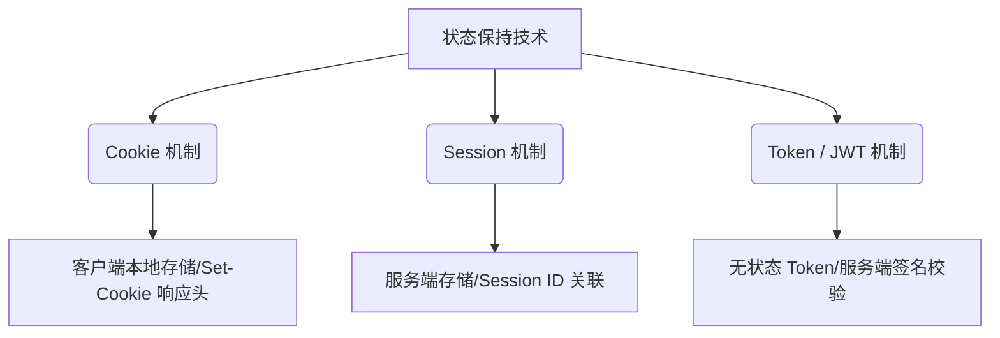
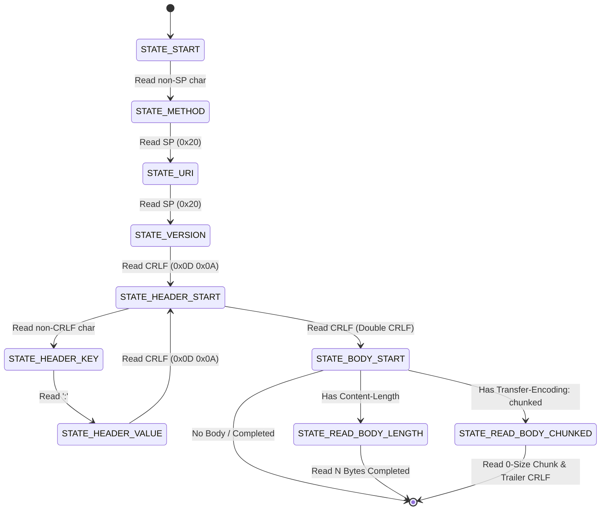
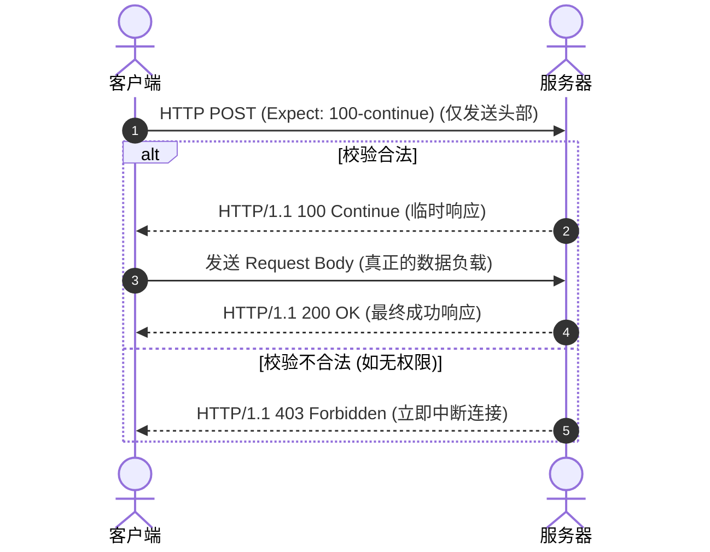
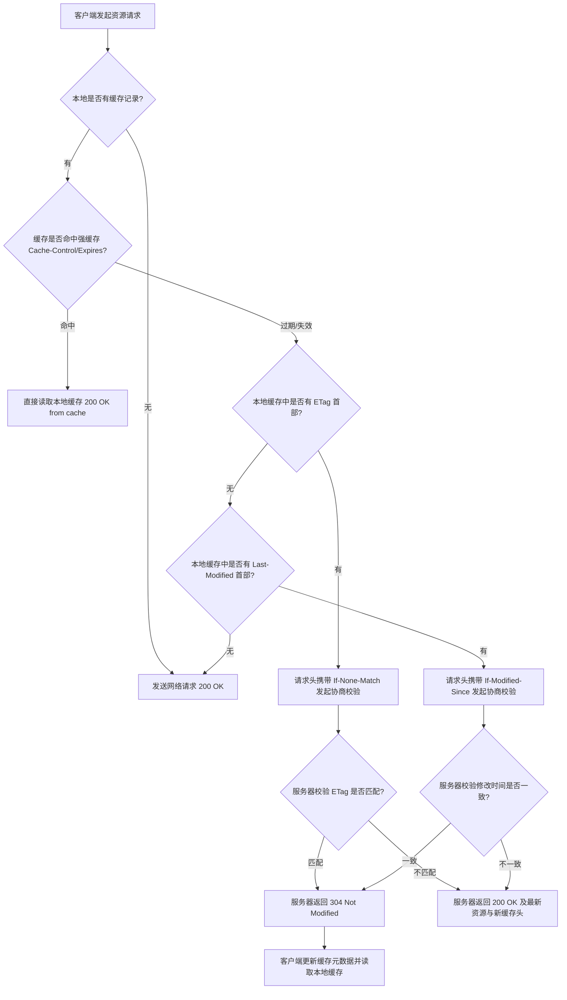

# 1.2.2.1 HTTP协议

HTTP（HyperText Transfer Protocol，超文本传输协议）是互联网上应用最为广泛的一种网络应用层协议。自 1990 年代初诞生以来，它承载了 Web 的蓬勃发展。本篇文档将以 HTTP/1.x（特别是 HTTP/1.1）为核心，深入剖析其底层设计哲学、报文物理结构、请求方法的学术与工程定义、状态码的 RFC 规范演进、核心 Headers 的边界控制、缓存体系的精细推演以及底层的连接管理与性能瓶颈。

---

## 1. 请求/响应模型与报文物理结构

### 1.1 HTTP 的无状态性（Stateless）与无连接性（Connectionless）

HTTP 协议在架构设计上具有两个根本性的特征：**无状态性（Stateless）** 与 **无连接性（Connectionless）**。这两个特征直接决定了 Web 应用的开发模式和网络拓扑的设计走向。

#### 1.1.1 无状态性（Stateless）的学术与工程定义
无状态性是指协议对于事务处理没有记忆能力。具体而言，服务器在处理当前请求时，完全不依赖于该客户端在之前发送过的任何请求。在服务器看来，每一个到来的 HTTP 请求都是完全孤立且自包含的。

* **工程优势**：无状态性极大地简化了服务器的设计。服务器不需要为每个客户端在内存中维护复杂的会话状态（Session State），这使得 Web 服务器（如 Nginx、Apache）具备了极佳的横向扩展能力（Scale-Out）。通过负载均衡器（LVS、HAProxy），客户端的请求可以被无缝分发到集群中的任意一台节点上，而无需担心会话数据不同步的问题。
* **工程劣势**：如果应用层业务需要维持上下文关联（例如购物车、用户登录状态），无状态性就意味着客户端在每次发起请求时，必须重复携带大量的上下文元数据。这不仅增加了网络的传输负荷，也加重了应用层的开发复杂度。

#### 1.1.2 无连接性（Connectionless）的演进与逻辑本质
在 HTTP/1.0 时代，无连接性指的是限制每次 TCP 连接只处理一个请求。客户端发起 TCP 连接，发送 HTTP 请求，服务器接收并返回 HTTP 响应，随后立即关闭底层 TCP 连接。
* **逻辑本质的延续**：虽然从 HTTP/1.1 开始，持久连接（Persistent Connection，`Connection: keep-alive`）成为了默认行为，使得底层 TCP 连接可以在多个请求之间复用，但**在 HTTP 应用层逻辑上，无连接的本质并未改变**。每个请求-响应对依然是逻辑独立的，不存在跨请求的协议层级上下文绑定。

#### 1.1.3 状态保持技术的演进与安全博弈
为了在无状态的协议上构建有状态的分布式应用，业界演进出了三种核心技术方案：



##### 1. Cookie 机制
服务器通过在响应中写入 `Set-Cookie` 首部，要求客户端将特定的键值对保存在本地。此后，客户端在符合作用域的每个请求中都会在 `Cookie` 头部自动带上这些数据。
* **安全属性**：为了抵御 Web 安全威胁，Cookie 引入了精细的物理控制属性：
  * `HttpOnly`：禁止客户端脚本（如 JavaScript）读取 Cookie，从根本上缓解了 XSS（跨站脚本攻击）带来的 Token 被窃取风险。
  * `Secure`：强制规定该 Cookie 只能在 HTTPS（加密通道）下进行传输，防止在不安全的明文 HTTP 通道中被中间人窃听。
  * `SameSite`：控制第三方 Cookie 的携带策略（值可为 `Strict`、`Lax` 或 `None`），用于防御 CSRF（跨站请求伪造）攻击。

##### 2. Session 机制
为了解决 Cookie 存储容量小（通常限制为 4KB）且数据暴露在客户端不安全的痛点，Session 将用户的核心状态数据保存在服务器端的内存、文件系统或分布式缓存（如 Redis）中。客户端仅通过 Cookie 存储一个随机的、无业务语意的会话标识符（Session ID）。
* **痛点**：Session 机制破坏了服务器的“无状态”特征。在多台服务器组成的集群中，必须实现 Session 复制（会话同步）或配置负载均衡器的 Session 粘滞（Session Sticky），或者采用集中式 Session 缓存，这增加了系统架构的复杂性和单点故障风险。

##### 3. Token（如 JWT）机制
现代分布式系统更倾向于采用完全无状态的 Token（如 JSON Web Token）机制。服务端通过密钥对用户身份和过期时间等元数据进行签名，并将生成的 Token 返回给客户端。客户端将其保存在 `LocalStorage` 或 `Cookie` 中，在发起请求时将其放在 `Authorization: Bearer <Token>` 请求头中。
* **机制优势**：服务端不需要存储任何会话信息，只需要利用 CPU 进行签名校验，这使服务重新获得了完美的无状态横向扩展能力。

---

### 1.2 ASCII 文本协议的精细报文格式

HTTP/1.x 是一种典型的 ASCII 码文本协议，所有的控制字段都以人类可读的明文字符进行组织。这种设计简化了协议的调试和开发，但在传输效率和解析性能上做出了妥协。

#### 1.2.1 物理字节流定界符：CRLF
在 TCP 面向字节流的传输中，HTTP 报文行与行之间、头部与消息体之间需要有明确的物理定界符。HTTP 协议选择使用 `CRLF`（即 `\r\n`，十六进制为 `0x0D 0x0A`）作为分界标记。
* **行间定界**：每一个请求行、响应行以及所有的 Header 字段，都以单个 `CRLF` 结尾。
* **首部与实体定界**：头部字段区域与消息体（Entity Body）之间，以**连续的两个 `CRLF`（即 `\r\n\r\n`，十六进制为 `0x0D 0x0A 0x0D 0x0A`）**作为物理分割边界。这是解析器识别头部结束、消息体开始的绝对信号。

#### 1.2.2 请求报文的物理骨架与切分边界
标准的 HTTP 请求报文在物理字节流上的结构如下：

```
Method SP Request-URI SP HTTP-Version CRLF
Header-Field-Name-1: SP Header-Field-Value-1 CRLF
Header-Field-Name-2: SP Header-Field-Value-2 CRLF
CRLF
[Entity Body (optional)]
```

* **请求行（Request Line）**：必须是报文的第一行。
  * `Method`：请求方法，如 `GET`、`POST`，以 ASCII 字符表示。
  * `SP`：空格符（Space，ASCII 32，`0x20`），用于精确分隔请求行的三个部分。
  * `Request-URI`：统一资源标识符，指明请求的目标资源物理或逻辑路径。
  * `HTTP-Version`：协议版本，如 `HTTP/1.1`。
* **请求头（Request Headers）**：位于请求行之后。每个头部字段独占一行，格式为键值对，冒号后通常跟一个可选的空格。
* **空行（CRLF）**：即 `\r\n`，用来隔离 Headers 与 Body。
* **请求体（Request Body）**：可选，承载具体的传输实体，其物理字节数长度由 `Content-Length` 或分块编码决定。

#### 1.2.3 响应报文的物理骨架与切分边界
响应报文在结构上与请求报文完全对称：

```
HTTP-Version SP Status-Code SP Reason-Phrase CRLF
Header-Field-Name-1: SP Header-Field-Value-1 CRLF
Header-Field-Name-2: SP Header-Field-Value-2 CRLF
CRLF
[Entity Body (optional)]
```

* **状态行（Status Line）**：
  * `Status-Code`：3 位的状态码，如 `200`、`404`，用于表示事务处理的数字结果。
  * `Reason-Phrase`：状态描述短语，如 `OK`、`Not Found`，以可读形式解释状态码。

---

### 1.3 协议解析状态机与物理层传输切分

由于 TCP 是面向流的，应用层从 Socket 接收缓冲区（Receive Buffer）中读取数据时，可能会遇到**半包**（当前读取的数据不足以拼成一个完整的 HTTP 行）或**粘包**（一次读取的数据中包含了前一个请求的尾部和后一个请求的头部）的物理问题。因此，HTTP 解析器必须实现一个精密的有限状态机（Finite State Machine, FSM）。

#### 1.3.1 解析状态机与状态迁移逻辑

下面的 Mermaid 状态机图展示了 HTTP/1.x 报文解析器在接收 TCP 字节流时的内部状态迁移过程：



##### 状态迁移物理细节剖析：
1. **STATE_START**：初始化解析状态，清空临时缓冲区。
2. **STATE_METHOD**：从流中逐字节读取字符并累加至方法缓冲区。当读取到 `0x20`（空格）时，方法字段解析结束，状态迁移至 `STATE_URI`。如果读取长度超过预设阈值（例如 8 字节）仍未遇到空格，则抛出 `400 Bad Request`（防止恶意长字符消耗服务器缓冲区）。
3. **STATE_URI**：跳过前导空格，读取字节流作为请求的目标 URI，直至遇到第二个 `0x20`。解析器需要在此阶段处理 URL 编码转义（例如将 `%20` 还原为空格）。
4. **STATE_VERSION**：读取协议版本字符串，直至遇到 `0x0D 0x0A`（CRLF）。如果格式不是以 `HTTP/` 开头并匹配版本号，抛出解析错误。
5. **STATE_HEADER_START**：这是一个关键的状态跳转枢纽。解析器尝试读取两个字节：
   * 如果首字节直接是 `\r` 且紧跟 `\n`，说明遇到了头部结束的空行（即连续两个 CRLF 闭环），状态直接跳转到 `STATE_BODY_START`。
   * 如果首字节是非 CRLF 字符，则将其作为 Header 键的起始字符，跳转到 `STATE_HEADER_KEY`。
6. **STATE_HEADER_KEY**：读取字符直到遇到冒号 `:`。解析器会将读取到的 Key 转化为统一格式（通常为不区分大小写，或转为小写）。
7. **STATE_HEADER_VALUE**：跳过冒号后面的前导空格，读取字符直到遇到行尾 `\r\n`，将键值对存入头部字段的 Map/Dict 结构中，重新跳回 `STATE_HEADER_START` 进入下一轮头部读取循环。
8. **STATE_BODY_START**：此时头部已全部解析完毕。解析器开始检查头部中的 `Content-Length` 和 `Transfer-Encoding` 字段，决定如何界定消息体的物理终点。

#### 1.3.2 文本协议解析的 CPU 性能瓶颈
由于 HTTP/1.x 采用 ASCII 文本设计，CPU 必须以逐字节扫描的方式比对数据流中的特殊控制字符（如 `\r`、`\n`、`:`、` `）。这在底层涉及大量的 CPU 分支跳转与字符串搜索指令，容易造成 **CPU 分支预测失败（Branch Misprediction）** 从而降低指令流水线效率。这也是后续 HTTP/2 和 HTTP/3 转向完全基于二进制帧结构设计的重要底层原因。

---

## 2. 请求方法（Methods）的安全性与幂等性

在分布式网络系统中，HTTP 方法不仅规定了请求的行为意图，其背后的**安全性**与**幂等性**更是设计客户端自动重试机制、反向代理缓存控制、以及网关路由策略的基石。

### 2.1 安全性（Safe）与幂等性（Idempotent）的学术和工程定义

#### 2.1.1 安全性（Safe）的严格定义
在 HTTP 规范（RFC 7231）中，一个方法如果被定义为安全的，意味着其**调用不会且不应该导致服务器端资源状态的任何修改**。
* **物理本质**：安全方法在本质上都是“只读”的操作。不论客户端发送了多少次此类请求，服务器上的底层数据库、文件系统或其他状态介质都不会发生改变。
* **安全方法**：`GET`、`HEAD`、`OPTIONS`。

#### 2.1.2 幂等性（Idempotent）的严格定义
一个方法如果被定义为幂等的，意味着**无论客户端以相同的参数和请求体对该方法调用一次还是连续调用多次，对服务器端资源状态产生的副作用是完全等价的**。
用数学公式表达，假设 $f(x, S)$ 代表方法作用于资源状态 $S$ 产生的副作用，对于任意多次的连续调用，满足：
$$f(f(x, S)) = f(x, S)$$
* **物理本质**：幂等方法允许客户端在遇到网络抖动、TCP 连接异常中断时，**安全地发起自动重试**，而不用担心因为重试导致数据在服务器端发生重复写入或状态紊乱（例如产生重复扣款或重复发货）。
* **幂等方法**：`GET`、`HEAD`、`OPTIONS`、`PUT`、`DELETE`。

> [!IMPORTANT]
> 安全性与幂等性是 **协议语义上** 的规范约束与架构设计承诺，而不是物理网络层或 Web 容器底层的硬性沙箱限制。如果开发者在后台编写代码时，允许 `GET` 请求在数据库中执行插入或更新操作，虽然物理上修改了数据，但这属于违背 HTTP 规范的行为，会导致浏览器预加载、爬虫抓取网页时引发灾难性的数据错乱。

---

### 2.2 核心 HTTP 方法的语义与行为深度对比

#### 2.2.1 GET 与 POST 的深层技术对比与常见误区纠正

##### 1. 语义与缓存差异
* `GET` 用于安全、幂等地请求获取指定资源的表征。它可以被浏览器强缓存，也可以被代理服务器或 CDN 节点缓存。
* `POST` 则是非安全、非幂等的，旨在向指定的资源提交数据，促使服务器执行非幂等性的资源新建或业务逻辑处理（如提交订单）。

##### 2. 参数携带与 URL 长度限制
* `GET` 请求参数被硬编码在 URL 的 Query String 中。在 TCP 物理传输中，Query String 属于 HTTP 头部的请求行。由于服务器（如 Nginx 默认 `large_client_header_buffers` 为 4KB/8KB）和浏览器对单个 HTTP 头部的长度有着严格的内存缓冲区限制，因此 GET 参数在工程中存在物理长度局限。
* `POST` 数据存放在请求体（Request Body）中，其大小仅受限于服务器端设置的请求体最大限制（如 Nginx 的 `client_max_body_size`）。

##### 3. TCP 发送机制的“一次包与两次包”学术误区纠正
网络上广泛流传一个观点：“GET 请求发送一个 TCP 数据包，而 POST 请求发送两个 TCP 数据包（先发 Headers，收到 100 Continue 后再发 Body）”。**这一结论缺乏计算机网络底层原理的支持，具有严重的学术误导性。**
* **底层原理**：TCP 处于传输层，是**面向字节流的协议**。它根本无法感知应用层 HTTP 协议是 GET 还是 POST。TCP 协议栈何时将缓冲区中的数据打包成段（Segment）发送，完全由内核中的 **Nagle 算法**、**最大报文段长度（MSS）**、**拥塞窗口大小（cwnd）** 以及套接字发送缓冲区（Send Buffer）的状态共同决定。
* **现象的物理成因**：部分客户端网络库或特定的旧版浏览器在处理带有较大 Body 的 POST 请求时，为了确认服务器是否准备好接收，会在系统调用层面显式地分为两步写入 Socket（例如：先调用 `write(header)`，随后在收到服务器端的 TCP ACK 甚至 `100 Continue` 临时响应后，再调用 `write(body)`）。这种人为的调用隔离配合底层的延迟确认机制（Delayed ACK），才会在抓包工具中呈现出两个独立的 TCP 报文。如果在代码中直接将 Headers 和 Body 一起写入 Socket 发送缓冲区，且总长度小于物理链路的 MSS，TCP 协议栈仍然会将其封装进同一个 TCP 数据包中一次性发送出去。因此，一次发包还是分包发送是**网络库的具体物理实现差异，而非 HTTP 协议规范的属性差异**。

#### 2.2.2 PUT 与 PATCH 的深层对比
* **PUT（整体替换）**：
  * PUT 方法的语义是**替换指定 URI 下的资源实体**。客户端在 PUT 请求体中必须提供该资源的所有最新属性。
  * **幂等性分析**：假设服务器上已存在资源 `{"id": 100, "name": "Alice", "age": 20}`。客户端发起 `PUT /users/100`，请求体为 `{"name": "Alice", "age": 21}`。执行后，资源变为 `{"name": "Alice", "age": 21}`。如果因为网络超时客户端重试了 3 次，服务器每次都执行完全相同的替换逻辑，最终资源的状态依然保持不变。因此，PUT 是**幂等**的。
* **PATCH（局部更新）**：
  * PATCH 方法（由 RFC 5789 引入）语义是**对指定 URI 下的资源进行局部增量更新**。客户端只需提供被修改的属性字段。
  * **为什么是非幂等的？**：PATCH 并不要求强制替换，其请求体中可以包含复杂的逻辑操作命令。例如，遵循 RFC 6902 (JSON Patch) 规范的 PATCH 请求体可能是：
    ```json
    [
      { "op": "add", "path": "/scores/0", "value": 99 }
    ]
    ```
    该操作的意思是在 `scores` 数组的第一项插入数值 99。如果客户端因为网络波动重试了 3 次该 PATCH 请求，服务器端就会在该数组头部连续插入 3 次 99，导致数组长度和内容发生了累积变化。因此，PATCH 在语义上被定义为**非幂等**方法。

#### 2.2.3 OPTIONS 预检请求机制
在跨域资源共享（CORS）中，非简单请求（例如使用 `PUT`、`DELETE` 或带有自定义 Header `X-Custom-Token`，或者 Content-Type 属于 `application/json` 的请求）在发起真实传输前，浏览器必须自动发起一次 `OPTIONS` 请求作为**预检请求（Preflight Request）**。
* **报文交互细节**：
  * 浏览器发送 `OPTIONS`，携带 `Access-Control-Request-Method: PUT` 与 `Access-Control-Request-Headers: x-custom-token`。
  * 服务端对该来源进行安全审计，如果允许跨域，返回响应头：
    * `Access-Control-Allow-Origin: *`
    * `Access-Control-Allow-Methods: GET, POST, PUT, DELETE`
    * `Access-Control-Allow-Headers: x-custom-token`
    * `Access-Control-Max-Age: 86400`（指示浏览器在 24 小时内缓存此预检结果，避免每次都发起 OPTIONS RTT 开销）。
  * 校验通过后，浏览器才会在同一 TCP 通道上发起真正的 `PUT` 请求。

#### 2.2.4 HEAD 与 CONNECT 方法
* **HEAD**：与 GET 具有完全相同的语义，区别在于**服务器端在响应该请求时绝对不能返回实体主体（Entity Body）**，而只返回其响应头。这用于客户端在不下载大文件本身的前提下，获取该资源的元数据（例如通过 `Content-Length` 获取大文件大小，通过 `Last-Modified` 或 `ETag` 探测文件是否被修改过）。
* **CONNECT**：主要用于代理服务器场景。当客户端希望通过代理服务器建立 HTTPS 加密连接时，它会首先向代理服务器发送一个 `CONNECT` 请求，要求与目标服务器的特定端口建立 TCP 隧道。代理服务器建立好 TCP 转发通道后，返回 `200 Connection Established`，此后客户端与目标服务器的所有 SSL/TLS 握手及加密数据都将通过代理服务器进行透明的透传转发。

---

## 3. 状态码（Status Codes）底层内涵

### 3.1 核心状态码的协议交互与应用场景

#### 3.1.1 100 Continue 的双阶段握手机制与带宽保护
当客户端需要向服务器端上传极大的资源实体（如数 GB 的视频文件）时，如果服务器因为无权限（401/403）或接口已关闭等原因拒绝该操作，客户端在完整上传数据后才收到错误响应，将造成上行网络带宽的极大浪费。



#### 3.1.2 204 No Content vs 206 Partial Content
* **204 No Content**：
  * 语义：请求已成功执行，但响应报文**绝对不能**包含任何 Entity Body。
  * 典型场景：OPTIONS 预检请求响应、删除操作成功的确认、或者不需要客户端跳转刷新页面的表单提交。
* **206 Partial Content**：
  * 语义：服务器已成功执行了客户端发起的**范围（Range）请求**，只传输资源的局部片段。
  * 底层协作：
    * 客户端请求头：`Range: bytes=1000-2999`（请求第 1000 到第 2999 字节，共 2000 字节）。
    * 服务端响应头：`Content-Range: bytes 1000-2999/80000`（指示当前返回 1000-2999 字节，文件总大小为 80000 字节）。
    * 消息体大小：严格等于 2000 字节。这使得客户端可以通过并发开辟多个 TCP 连接发起多个 Range 请求，并行下载大文件的不同切片，是多线程并行下载和断点续传的底层基石。

#### 3.1.3 304 Not Modified
* 语义：协商缓存命中。服务器在对比客户端发来的指纹后，判定资源在此期间未曾修改。
* **物理特征**：**304 响应绝对不允许携带实体内容**。它仅返回更新后的缓存控制头部，利用几百字节的轻量报文，极大地节约了下行带宽。

#### 3.1.4 401 Unauthorized vs 403 Forbidden
* **401 Unauthorized**：核心语义是**未通过认证（Unauthenticated）**。客户端未提供凭证或凭证已过期失效。响应报文中必须包含 `WWW-Authenticate` 头部，用以指导客户端如何进行身份验证（例如 Basic, Bearer 等）。
* **403 Forbidden**：核心语义是**未授权（Unauthorized）**。服务器已经成功识别并验证了客户端的身份，但基于安全控制链或权限 ACL 模型，该用户对目标资源没有读取或操作的权限。此状态下重新输入用户名密码或携带相同的 Token 是无意义的，代表了服务器的明确拒绝。

#### 3.1.5 502 Bad Gateway vs 504 Gateway Timeout
在分布式反向代理架构中（如 Nginx + Web Application 拓扑结构），这两个状态码有着截然不同的底层发生机理：
* **502 Bad Gateway**：
  * **成因**：作为反向代理的 Nginx 能够成功与上游 Web 应用服务器建立 TCP 连接，但在读取响应时，**上游服务器返回了一个不符合 HTTP 协议规范的无效响应，或者上游应用突然崩溃崩溃、强制关闭了连接**。
  * **排障方向**：检查上游应用进程（如 NodeJS、Tomcat、Go 编译出的二进制服务）是否发生 OOM（内存溢出）被内核强杀，或者进程内部抛出了致命异常导致 TCP 连接被暴力 reset。
* **504 Gateway Timeout**：
  * **成因**：作为反向代理的 Nginx 成功将请求转发给了上游 Web 应用服务器，但是在 **Nginx 配置的等待超时阈值（如 `proxy_read_timeout`）内，上游应用服务器没有返回任何响应数据**。
  * **排障方向**：排查上游应用的业务代码中是否存在死锁、数据库慢查询、死循环，或者长耗时计算任务未采用异步化处理。

---

### 3.2 重定向机制与搜索引擎优化（SEO）的底层逻辑

#### 3.2.1 301 与 302 在爬虫与权重传递中的底层差异
* **301 Moved Permanently（永久重定向）**：
  * 语义：旧资源的 URI 已被永久废弃，由新地址取代。
  * 浏览器行为：浏览器会强缓存该重定向对应关系。用户再次访问旧 URL 时，浏览器甚至不会与源服务器建立 TCP 连接，直接在本地地址栏替换为新 URL 发起跳转。
  * **SEO 底层影响**：搜索引擎爬虫在抓取到 301 状态码后，会将旧 URL 的所有历史权重（包括 PageRank 评分、流量积累、反向链接积累）**全额转移**到新 URL 上，并在搜索引擎索引库中彻底清除旧 URL，用新 URL 替代。
* **302 Found（临时重定向，在 HTTP/1.0 中称为 Moved Temporarily）**：
  * 语义：资源的移动是临时的，旧地址随时可能恢复使用。
  * 浏览器行为：浏览器不会缓存该重定向关系，每次访问旧 URL 都必须实打实地去服务器请求一次。
  * **SEO 底层影响**：爬虫认为重定向是临时的，因此**不会将旧 URL 的权重传递给新 URL**，在搜索索引库中仍然保留旧 URL。
  * **URL 劫持隐患**：若 A 网站使用 302 临时重定向跳转到 B 网站，搜索引擎可能会在索引库中把 B 网站的高质量内容错误地关联给 A 网站（因为 A 网站被认为是内容的持有者，重定向只是临时的）。这在 SEO 实践中容易被黑产利用，造成严重的“URL 劫持”安全与规则风险。

#### 3.2.2 302 vs 303 vs 307 vs 308 的历史演进与严格行为限制
由于 HTTP/1.0 时代定义的 302 在实际浏览器实现中，普遍存在“收到 302 响应后自动将 POST 请求篡改为 GET 请求以获取新 Location 资源”的非标准缺陷，HTTP/1.1 (RFC 7231 / RFC 7538) 对其进行了细分与修正：

| 状态码 | 规范定义 | 重定向期限 | 是否允许浏览器篡改请求方法（由非 GET 变为 GET） | RFC 规范出处 |
| :--- | :--- | :---: | :---: | :--- |
| **301** | Moved Permanently | 永久 | **允许**（历史实现导致的普遍篡改） | RFC 7231 |
| **302** | Found | 临时 | **允许**（历史实现导致的普遍篡改） | RFC 7231 |
| **303** | See Other | 临时 | **强制要求**（明确要求重定向请求使用 GET 方法） | RFC 7231 |
| **307** | Temporary Redirect | 临时 | **严格禁止**（重定向请求必须保持原请求方法及 Body）| RFC 7231 |
| **308** | Permanent Redirect | 永久 | **严格禁止**（重定向请求必须保持原请求方法及 Body）| RFC 7538 |

##### 工程场景演演练：
* 场景：用户发起了一个 `POST /pay` 的扣款表单请求，服务器处理完毕后，需要跳转到展示结果页面。
* 做法：
  * 若服务器返回 `303 See Other`，浏览器将以 `GET /pay_result` 去往新地址，这属于正常业务交互（Post-Redirect-Get 模式，防刷新重复提交）。
  * 若服务器返回 `307 Temporary Redirect`，浏览器重定向时**必须依然发起 `POST /pay_result`** 且重新携带扣款 Body，这可能导致重复扣款。
  * 若服务器返回 `308 Permanent Redirect`，则会在永久跳转的同时，强制要求重定向使用原有方法（如 POST）。

---

## 4. 核心 Headers 详解

### 4.1 Host 头部与多虚拟主机路由机制
在现代的云原生与共享托管架构中，一台物理服务器通常只绑定一个或有限个公网 IP 地址，却需要同时对外提供成百上千个不同域名（如 `docs.example.com` 和 `api.example.com`）的服务。

#### 4.1.1 物理 IP 与虚拟主机的匹配矛盾
在 TCP/IP 协议栈中，当客户端与服务器端完成 TCP 三次握手后，底层的网络层（IP）和传输层（TCP）仅能获取到物理目的 IP 地址和端口号。如果请求中不包含额外的域名标志，Web 容器将无法断定客户端的目标服务究竟是哪一个虚拟主机。

```
                    ┌──────────────┐
                    │  Host Header │
                    └──────┬───────┘
                           │ 匹配 Server Name
             ┌─────────────┼─────────────┐
             ▼             ▼             ▼
      ┌────────────┐┌────────────┐┌────────────┐
      │  docs.xxxx ││   api.xxxx ││  blog.xxxx │  (虚拟主机)
      └────────────┘└────────────┘└────────────┘
```

#### 4.1.2 路由分发机制
* `Host` 头部（在 HTTP/1.1 中被强制要求，不可或缺）包含了主机的域名以及端口。
* 当 Nginx 监听到 80/443 端口的请求时，它会首先解析 HTTP 报文，提取出 `Host` 头部的值，然后将其与配置文件中各个虚拟主机的 `server_name` 指令进行匹配，从而准确无误地将请求分发给对应的后端 Server 处理模块。如果请求未携带 Host 首部，服务器必须直接丢弃并响应 `400 Bad Request`。

---

### 4.2 Content-Length 头部与消息体边界确立
在非分块传输模式下，`Content-Length` 是指示 HTTP 实体主体（Entity Body）在物理字节流中精确长度的十进制正整数（以字节为单位）。

#### 4.2.1 边界确立机理
HTTP 解析器利用有限状态机读取报文时，一旦遇到连续的两个 `CRLF`（即 `\r\n\r\n`），便标志着 Headers 区域解析完毕。此时，解析器会读取 `Content-Length` 指示的数值（假设为 $N$），随后从 TCP 字节流中连续读出 $N$ 个字节填入 Body 缓冲区。读取完毕后，该 HTTP 请求/响应报文便宣告完整终结。

#### 4.2.2 长度异常引发的安全与性能危机
* **Content-Length 值 > 实际 Body 长度**：
  解析器在读取了实际的 Body 数据后，仍然认为数据尚未完全到达，于是会继续调用系统的 `recv` 并一直挂起，直到连接因达到 `Read Timeout` 超时阈值而被强制断开。
* **Content-Length 值 < 实际 Body 长度**：
  解析器在读取了指定的 $N$ 字节后，便单方面判定此报文已解析结束。多余的 Body 字节会继续残留在底层的 TCP 接收缓冲区中。当同一个长连接发起下一次请求时，解析器会把这部分残留字节误认为是下一个请求的请求行。由于格式完全不符，这通常会导致下一次请求被直接判定为 `400 Bad Request` 废弃。
* **安全风险：HTTP 请求走私（Request Smuggling）**：
  如果前置反向代理服务器（如 CDN）和后置源服务器（如后端 Web Server）在处理 `Content-Length` 和 `Transfer-Encoding` 共存时的解析策略不一致，攻击者就可以构造带有冲突定界首部的请求，将一段请求“走私”并保留在后置服务器的缓冲区内，污染下一个无辜用户的请求，造成严重的越权与会话劫持风险。

---

### 4.3 Transfer-Encoding: chunked 分块传输编码机制
在处理超大型文件动态下载、流式数据响应或长连接动态页面渲染时，服务器在开始发送响应首包时，根本无法预知最终生成的资源总字节大小。

#### 4.3.1 分块传输的设计逻辑
为了打破 `Content-Length` 必须预先知晓数据大小的限制，HTTP/1.1 引入了分块传输编码（`Transfer-Encoding: chunked`）。在此模式下，**`Content-Length` 首部将被完全禁止使用**。如果二者同时出现在报文中，`Content-Length` 必须被忽略。

#### 4.3.2 Chunked 报文物理结构
分块传输的实体主体由一连串大小不定的分块（Chunk）组合而成。每个分块都包含：
1. **分块长度行**：一个由十六进制 ASCII 字符表示的数值，用于指示当前分块的数据字节大小，其后紧跟一个 `\r\n`。
2. **分块数据体**：紧跟长度行后的物理二进制数据，其长度严格等于上述十六进制数值，其后紧跟一个 `\r\n`。
3. **零分块（Last Chunk）**：一个代表传输终结的特殊分块，其长度表示值为 `0`（即 `0\r\n`）。
4. **拖尾首部（Trailer Headers）**：零分块后可附加的可选 Headers（用于传输哈希签名校验等数据），最后以一个单独的 `\r\n` 彻底宣告报文解析完结。

##### 示例剖析：
```http
Transfer-Encoding: chunked

8\r\n
Academic\r\n
9\r\n
 Research\r\n
0\r\n
\r\n
```
* `8\r\n`：解析器识别出接下来的分块有 8 个字节。
* `Academic\r\n`：读取 "Academic"（8字节），跳过其后的 CRLF。
* `9\r\n`：识别出接下来的分块有 9 个字节。
* ` Research\r\n`：读取 " Research"（9字节，首字节为空格），跳过其后的 CRLF。
* `0\r\n\r\n`：遇到长度为 0 的分块，解析器宣告消息体拼接完成，最终数据为 `"Academic Research"`。

---

## 5. HTTP 缓存体系设计与精细推演

HTTP 缓存是降低网络延迟、降低源站计算压力的核心系统。缓存体系精细划分为**强缓存**与**协商缓存**两个层级。

### 5.1 强缓存的协议指令与判定流程
在强缓存有效期内，客户端不需要与源服务器发生任何网络通信，直接从本地存储（内存 `Memory Cache` 或磁盘 `Disk Cache`）中复用资源。

#### 5.1.1 Expires 的设计缺陷与物理失效机制
* **协议机制**：`Expires`（HTTP/1.0 引入）的值为 GMT 格式的绝对时间戳（如 `Expires: Wed, 16 Jun 2026 12:00:00 GMT`）。
* **物理缺陷**：比对算法完全依赖于客户端操作系统的当前本地时间。如果用户手动修改了系统时区或系统时间，或者客户端时区与服务器时区不匹配，强缓存将会发生严重的早衰或过期不失效紊乱。

#### 5.1.2 Cache-Control 核心指令集的底层语意与行为控制
为了解决 `Expires` 的设计痛点，HTTP/1.1 引入了基于**相对时间（Max-Age）**的缓存机制首部 `Cache-Control`。

* `max-age=<seconds>`：指明资源自被客户端成功下载起，在多少秒内是新鲜且被允许直接使用的。
* `s-maxage=<seconds>`：专为公共/代理缓存服务器（如 CDN、反向代理网关）设定的寿命。当 CDN 节点缓存该资源时，将遵循 `s-maxage`，而用户的浏览器依然遵循 `max-age`。
* `no-cache`：**强制进行协商缓存**。指示客户端可以缓存该文件，但**绝不能直接将其作为强缓存使用**。每次使用该本地缓存前，必须携带指纹发起网络请求去源服务器进行协商有效性比对。
* `no-store`：**物理禁止缓存**。要求浏览器和任何代理网关绝对不允许在任何持久性介质（如磁盘、闪存）中存储该响应的任何数据。必须全流程在内存中阅后即焚，以防机密泄露。
* `must-revalidate`：指示缓存一旦超过 `max-age` 设定的新鲜寿命，客户端在向源服务器验证其有效性之前，**绝对不允许**因断网或服务器瘫痪而将过期的本地缓存作为旧数据返回给用户（Stale Response）。
* `public`：明确告知此资源是公共的，可以被任何中间代理和 CDN 进行缓存。
* `private`：明确告知此资源是私有的，只允许用户的浏览器进行本地缓存，禁止 CDN 等中间节点缓存该数据（通常用于包含个人私密数据的 API 接口）。

#### 5.1.3 强缓存判定逻辑与优先级
当响应中同时存在 `Cache-Control: max-age` 与 `Expires` 时，支持 HTTP/1.1 的客户端解析器会**优先并完全遵从 `Cache-Control` 的 max-age 指令**，将 `Expires` 直接忽略。

---

### 5.2 协商缓存的协作时序与校验机制
当强缓存失效（例如超过了 `max-age` 设定的寿命，或包含了 `no-cache` 指令）时，客户端会发送缓存指纹向服务器校验内容是否真的被更改。

#### 5.2.1 Last-Modified / If-Modified-Since 的时间戳校验与精度缺陷
* **协作过程**：
  * **首次响应**：服务器返回响应头 `Last-Modified: GMT 时间`（指示文件在文件系统中的最后修改时间）。
  * **二次校验**：客户端在强缓存过期后，发起 GET 请求，将之前保存的时间放入 `If-Modified-Since` 请求头中。
  * **服务器判定**：服务器比对文件的当前最后修改时间与该请求头值，若未变则返回 `304 Not Modified`。
* **致命缺陷**：
  1. **秒级限制**：时间戳最多只能精确到 1 秒。如果在 1 秒内文件被高频重写了多次，`Last-Modified` 将无法识别，导致缓存发生陈旧性脏读。
  2. **元数据误判**：有时候文件只是被定期维护脚本重新保存或修改了元数据属性，实际字节内容并无一丝改变。但这依然会导致 `Last-Modified` 更新，造成不必要的全量下载浪费。
  3. **分布式差异**：在负载均衡集群中，不同机器上的同一个静态文件，由于部署时间戳的差异，其 `Last-Modified` 可能不一致，导致缓存命中率暴跌。

#### 5.2.2 ETag / If-None-Match 的哈希校验与生成机理
为了弥补时间戳的精度短板，HTTP/1.1 引入了 `ETag`（Entity Tag，实体标签）。
* **物理机制**：`ETag` 是服务器端基于资源内容的物理字节流，通过哈希算法（如 MD5、SHA-1 或基于文件大小与修改时间）计算得出的唯一字符串指纹。只要文件内容改变，ETag 必定会改变。
* **协作过程**：
  * 首次请求返回 `ETag: "version1-hash"`。
  * 再次请求在请求头携带 `If-None-Match: "version1-hash"`。
  * 服务器比对 ETag，匹配成功则直接返回 `304`。

#### 5.2.3 强校验与弱校验（Strong/Weak Validation）
RFC 7232 将 ETag 严密划分为强弱两类校验模式：
* **强 ETag (Strong ETag)**：
  * 表现形式：`ETag: "1234abcd"`。
  * 要求：资源在物理二进制字节层面必须完全一致，不允许任何哪怕一个字节的微小差异。
* **弱 ETag (Weak ETag)**：
  * 表现形式：以 `W/` 前缀开头，例如 `ETag: W/"1234abcd"`。
  * 要求：只保证资源的**逻辑语义等价性**。
  * **物理应用场景**：在大型 Web 服务器（如 Nginx）中，当针对 HTML 文件启用了 gzip 动态压缩时，压缩后的字节流与未压缩的字节流在二进制层面是大相径庭的。为了防止这导致强 ETag 校验失效，Nginx 会自动将强 ETag 降级为以 `W/` 开头的弱 ETag。只要解压后展现的内容完全一致，它就能成功返回 `304`，从而显著提升高并发下的协商缓存命中率。

#### 5.2.4 两套协商缓存的优先级与精确度对比
* **优先级**：`ETag / If-None-Match` 的校验优先级**高于** `Last-Modified / If-Modified-Since`。当两者同时存在于请求头中，服务器必须优先进行 ETag 比对。
* **对比度分析**：
  * **精度**：ETag 完美解决秒级修改和虚假修改的问题，精度达到字节级，而 Last-Modified 仅为秒级。
  * **性能消耗**：Last-Modified 只需要读取文件系统的 inode 元数据（极快），而生成 ETag 需要对文件进行哈希计算（对于大文件有显著的 CPU 吞吐量开销）。因此，在大文件场景下，通常只采用基于大小+时间的轻量级 ETag 算法。

---

### 5.3 强缓存与协商缓存联合工作的完整决策树

下图描述了客户端从发起资源请求，到判定强缓存、发起协商缓存，最后读取数据的全链条完整判定决策流：



---

## 6. 连接管理与性能瓶颈

### 6.1 从短连接到长连接的协议演进

#### 6.1.1 HTTP/1.0 短连接的系统级痛点
在传统的短连接模式下，每一次 HTTP 请求的完成，都需要在传输层经历一次完整的建立与销毁周期。
* **RTT 延迟累积**：建立 TCP 连接需要 3 次握手（1.5 RTT），释放连接需要 4 次挥手（至少 1 RTT）。在加载包含大量图片和脚本的现代网页时，数百次的握手挥手会导致极大的延迟累积。
* **TIME_WAIT 状态堆积**：在高并发场景下，客户端或服务器作为主动关闭 TCP 连接的一方，会在内核中留下大量的 `TIME_WAIT` 状态连接（通常持续 2 MSL 时间，约 60-240 秒）。这会迅速占满系统的物理文件描述符（FD）和临时端口资源，导致服务器无法与新的客户端建立物理通信。

#### 6.1.2 HTTP/1.1 长连接机制（Keep-Alive）
HTTP/1.1 默认开启持久连接，在同一个 TCP 物理通道上可以连续传输多组 HTTP 请求-响应报文。这避免了重复建立 TCP 连接的握手时延，使 TCP 拥塞控制的慢启动（Slow Start）可以顺利过渡到拥塞避免阶段，最大化利用了网络带宽。

#### 6.1.3 Keep-Alive Timeout 与 TCP Keepalive 探针的深度协作
为了防止闲置的持久连接白白挂载在内存中消耗系统资源，必须进行连接回收。这两者在不同层级相互协作：

```
+-------------------------------------------------------------+
| 应用层 HTTP Keep-Alive Timeout                              |
| 作用：定期释放无 HTTP 请求收发的空闲连接                        |
+------------------------------┬------------------------------+
                               │ 协同互补
+------------------------------▼------------------------------+
| 传输层 内核 TCP Keepalive 探针                              |
| 作用：探测因断网/崩溃而没有发送 FIN 挥手包的物理“死连接”        |
+-------------------------------------------------------------+
```

* **HTTP Keep-Alive Timeout（应用层）**：
  例如，Nginx 设置了 `keepalive_timeout 60s;`。如果在连续 60 秒内，当前 TCP 通道上没有任何新的 HTTP 数据报文传输，Nginx 的应用层定时器就会超时，并主动调用 `close()` 发起 TCP 四次挥手释放该物理连接。
* **TCP Keepalive 探针（内核传输层）**：
  假设客户端在建立长连接后突然断电或被拔掉网线，由于没有经历正常的挥手流程，服务器在应用层可能因读写阻塞而无法获知。此时，操作系统内核的 TCP 协议栈会开始计时（如默认 2 小时无数据交互）。达到设定的 `tcp_keepalive_time` 后，内核会自动向客户端发送空的探测 ACK 段（Probe Segment）。若连续数次无响应，内核判定该物理连接已失效，强行释放 Socket，并通知应用层，防止系统句柄被死连接永久耗尽。

---

### 6.2 HTTP/1.1 管道化（Pipelining）机制与退场原因
为了缩短长连接中的等待时延，HTTP/1.1 提出了**管道化（Pipelining）**的概念。

#### 6.2.1 管道化设想
客户端不需要等待前一个请求的响应返回，就可以在同一个 TCP 连接上并发发送下一个、再下一个请求。

#### 6.2.2 管道化的致命缺陷：应用层线头阻塞（HOL Blocking）
虽然请求可以并发发送，但 HTTP/1.1 协议强制要求**服务器端返回响应的顺序，必须与接收请求的顺序物理一致**。
* 假设客户端在同一个 TCP 链路上并发发送了 A、B、C 三个请求。
* 如果请求 A 在服务器端遇到了复杂的慢 SQL 查询，处理耗时 5 秒；而请求 B 和 C 都是直接读取内存的静态资源，处理耗时仅 1 毫秒。
* 受限于协议规范，服务器绝对不能先发送 B 和 C 的响应。它必须强行把 B 和 C 的数据积压在发送缓冲区中，死等 A 的响应发送完毕后，才能依次发送 B 和 C。
* 这种**应用层线头阻塞（Head-of-Line Blocking）**导致管道化在实际提速中大打折扣，甚至在服务器端消耗了更多不必要的内存缓冲区。

#### 6.2.3 代理节点兼容性灾难
在广域网拓扑中，请求需要经过大量的防火墙、代理网关、CDN 中间节点。许多老旧或不标准的中间代理无法识别管道化报文，可能会将并行的请求拆散或打乱返回顺序，造成客户端数据包错位，引发严重的协议错乱。
> [!WARNING]
> 由于应用层线头阻塞无解，且中间代理支持极不规范，目前所有现代浏览器都默认**彻底关闭了 HTTP/1.1 管道化**功能。

---

### 6.3 客户端并发 TCP 连接池限制与工程优化思路
由于管道化的失效，HTTP/1.1 在单条 TCP 连接上只能退化为彻底的“**一发一收**”串行阻塞模式。

#### 6.3.1 同域名并发连接限制
为了提升页面的并发加载速度，避免被串行队首阻塞拖慢，浏览器对同一个域名限制了并发建立的 TCP 连接数上限（主流浏览器硬性限制为 **6 个**）。

#### 6.3.2 工程上的权衡优化
在 HTTP/1.x 的背景下，工程界探索出了一套极具代表性的前端优化技术：

##### 1. 域名分片（Domain Sharding）
* **原理**：既然浏览器限制的是单个域名的并发连接数，那我们就可以将图片、CSS、JS 静态资源分别部署到不同的二级域名下（例如 `static1.example.com`、`static2.example.com`）。
* **物理效果**：浏览器会将它们视作不同域名，从而分别为每个域名开辟 6 个连接，将整体网络并发度成倍提升至 12 或 18 个。
* **副作用**：这会引入额外的 DNS 解析延迟与多次 TCP/SSL 握手的 CPU 计算与网络开销。

##### 2. 资源合并与静态打包（如 Webpack Bundle、雪碧图）
* **原理**：将几十个小 JavaScript 代码文件合并为一个巨大的 `bundle.js`，或者将几十个小图标图片拼接为一张 CSS 雪碧图（Sprites）。这通过将几十次小 HTTP 请求压缩为 1 次大 HTTP 请求，巧妙避开了 6 个并发连接的限制。
* **副作用**：这降低了浏览器缓存的精度。大文件只要有任意一行代码变动，就会导致整个合并文件的强缓存全部失效，在性能和更新粒度上产生了尴尬的权衡。

---

## 7. 总结：HTTP/1.x 协议的性能宿命
HTTP/1.x 作为经典的 ASCII 文本协议，依靠简洁直观的“请求-响应”模型推动了 Web 的诞生和普及。然而，由于其 ASCII 明文传输机制导致的 CPU 解析开销、对单域名并发连接数的限制，以及无法绕过的应用层“线头阻塞（HOL Blocking）”问题，使其在承载超大规模高并发、高实时性的现代网页应用时遭遇了难以跨越的物理瓶颈。这些未竟的优化痛点，也直接催生了后续基于二进制分帧多路复用机制的 HTTP/2 协议以及彻底重构传输层 UDP 底座的 HTTP/3 协议的诞生。
