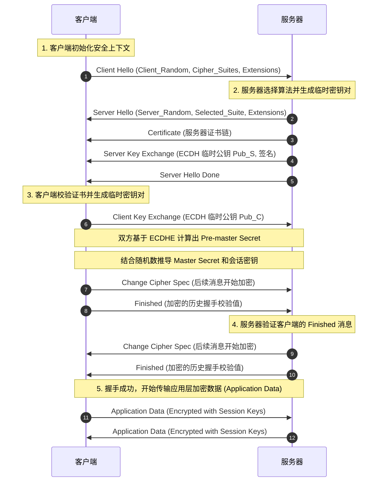
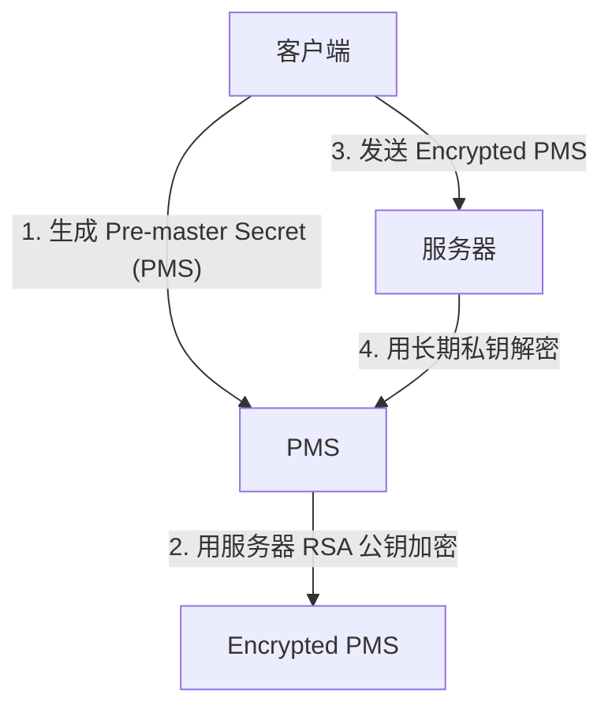
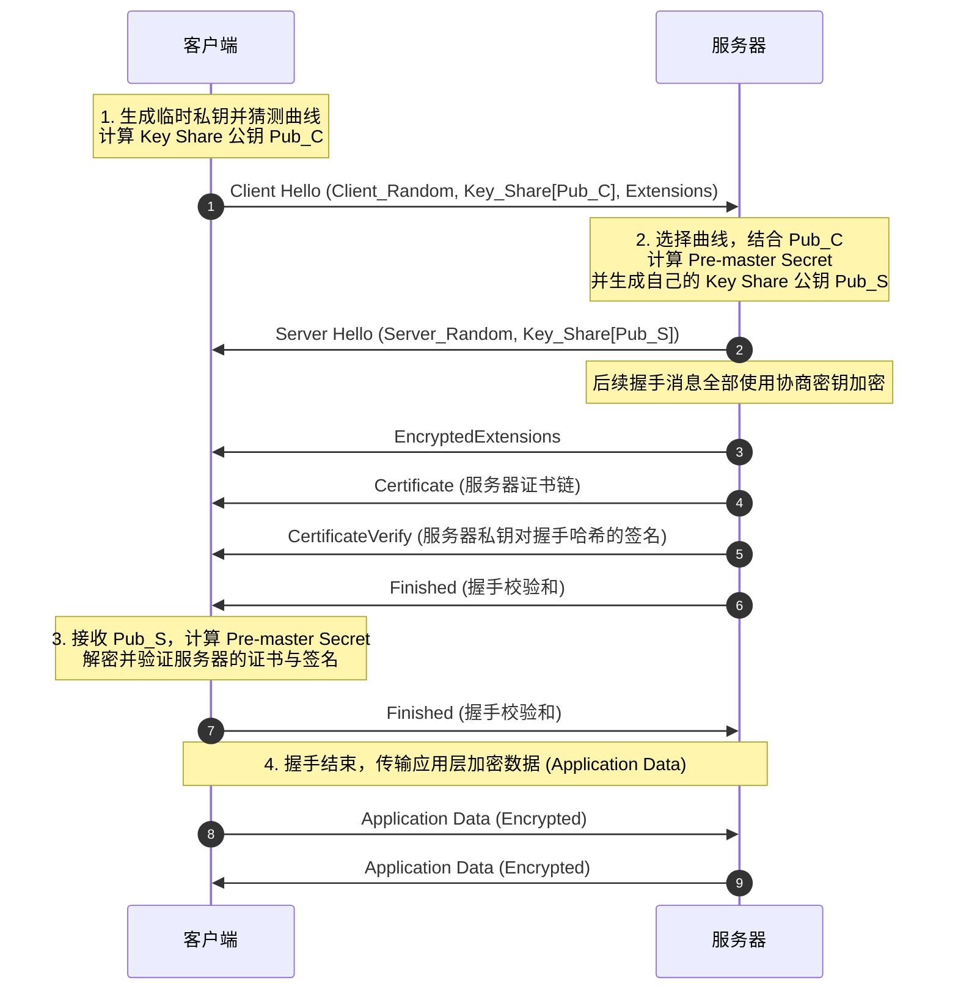
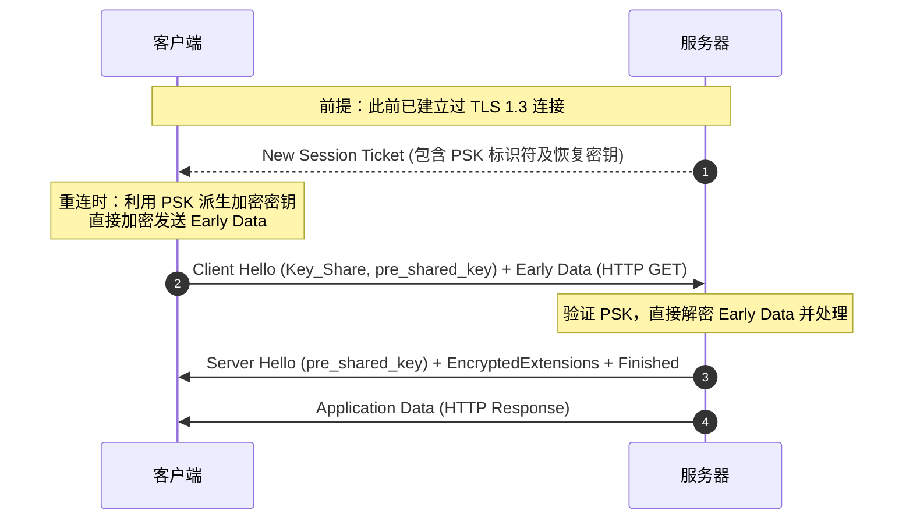
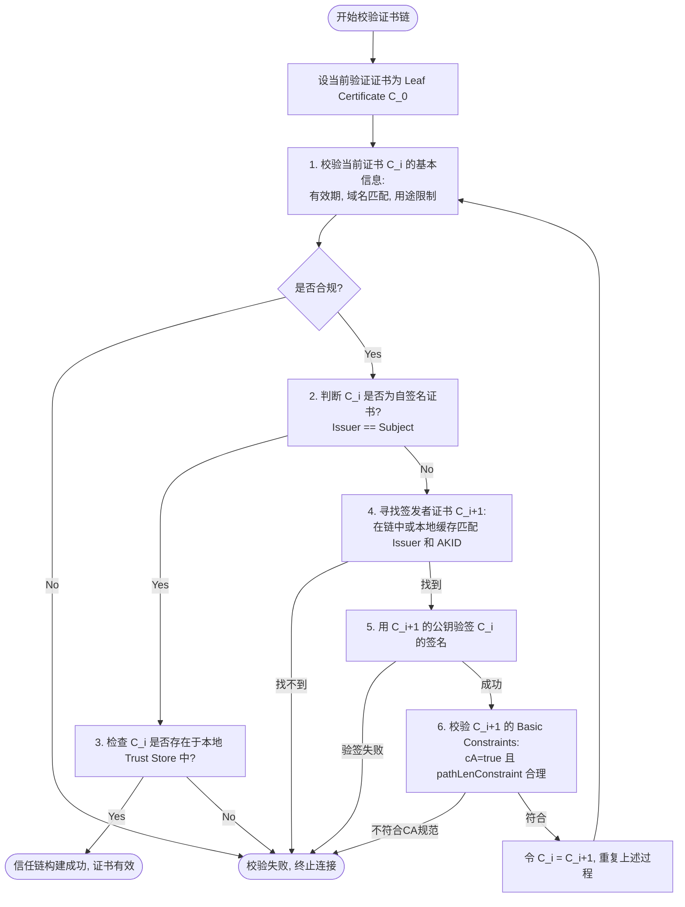
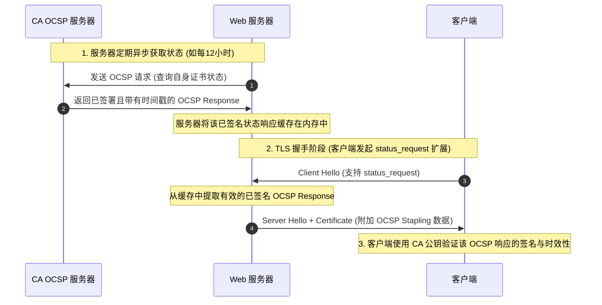

# HTTPS 协议

## 1. 安全设计目标与加密基石

### 1.1 互联网通信的威胁模型
网络通信是建立在多跳路由转发基础上的物理链路。数据包从客户端出发，必须经过大量的路由器、交换机、基站以及网络服务商（ISP）的网关才能到达目的地。在这个物理链路中，任何一个节点都可以被恶意第三方控制或监听。因此，基于明文传输的传统 HTTP 协议在设计上面临三大核心威胁：
1. **窃听（Eavesdropping）**：由于数据以明文形式传输，攻击者可以通过网络嗅探器（如 Wireshark）直接获取传输内容，包括密码、敏感数据、身份 Token 等，这破坏了通信的**机密性（Confidentiality）**。
2. **篡改（Tampering）**：攻击者可以在传输过程中拦截并修改 TCP 报文。例如，向网页中注入垃圾广告、修改转账表单的金额和目标账户等，这破坏了通信的**完整性（Integrity）**。
3. **冒充（Spoofing / Impersonation）**：攻击者可以通过 DNS 欺骗（DNS Spoofing）、ARP 投毒等手段，将客户端流量重定向到仿冒的服务器上，使用户误信钓鱼网站，这破坏了通信的**身份认证（Authentication）**。

HTTPS（Hypertext Transfer Protocol Secure）并非一个全新的独立应用层协议，而是在 HTTP 与 TCP 之间引入了一个安全传输层——SSL/TLS（Secure Sockets Layer / Transport Layer Security）。HTTPS 的设计目标正是通过现代密码学手段构建一条安全的虚拟通道，彻底防御窃听、篡改与冒充三大威胁。

---

### 1.2 混合加密体系的设计哲学与性能折中
为了在网络通信中同时满足“极高的安全性”与“优秀的传输性能”，HTTPS 引入了**混合加密（Hybrid Cryptosystem）**体系。

#### 1.2.1 为什么不单独使用对称加密？
对称加密（如 AES, ChaCha20）具有运算速度极快、CPU 消耗低的特点，极适合加密大规模的应用层数据。然而，它面临经典的**密钥分发难题（Key Distribution Problem）**：在安全的通道建立之前，客户端与服务器如何约定这个对称密钥？如果通过网络直接明文发送，则密钥将被中间人截获，导致后续的所有加密保护瞬间失效；如果是线下约定，则对于瞬息万变的全球互联网业务完全没有工程可行性。

#### 1.2.2 为什么不单独使用非对称加密？
非对称加密（如 RSA, ECC）拥有两把钥匙：公钥（Public Key）和私钥（Private Key）。公钥是公开的，任何人都可以获取；私钥是保密的，只有所有者持有。用公钥加密的数据只有对应的私钥能解密，反之，用私钥加密的数据也只能用对应的公钥解密。
直接使用非对称加密保护双向通信面临重大的工程与数学瓶颈：
1. **单向机密性**：客户端使用服务器的公钥加密数据发送给服务器，这保证了上行链路的机密性。然而，当服务器向客户端回包时，如果用私钥加密，任何拥有该服务器公钥（公钥是公开的）的第三方都可以轻易解密该回包。因此，要实现双向机密性，客户端也必须生成一对密钥并将公钥发给服务器。
2. **性能瓶颈**：非对称加密主要依赖于大数模幂运算（如 RSA 依赖于 $c = m^e \pmod n$）或椭圆曲线上的标量点乘。这些运算在 CPU 密集度上比对称加密（AES 这种基于字节置换、移位和轮密钥加的算法）高出 2 到 3 个数量级。在大并发的 Web 服务器上，如果所有流量都用非对称加密，服务器的 CPU 将迅速被榨干。
3. **明文长度限制**：非对称加密算法对单次加密的明文长度有严格的物理限制。例如，RSA-2048 算法的模长为 2048 位（256 字节），在使用标准的 PKCS#1 v1.5 填充方案时，其最大单次加密明文长度仅为 $256 - 11 = 245$ 字节。如果需要加密一个几兆大小的网页，必须将其切碎为成千上万个 245 字节的块并逐个进行模幂运算，这在工程上是完全无法接受的。

#### 1.2.3 混合加密的架构融合
混合加密架构巧妙地将对称加密和非对称加密结合起来：
* **握手协商阶段**：使用非对称加密（或密钥交换算法如 ECDHE）在不安全的信道上安全地协商出一个临时的对称密钥（称为 **Pre-master Secret**，进而推导出 **会话密钥 Session Key**）。这个过程虽然消耗 CPU，但传输的数据量极小（仅几十字节），且在每个连接生命周期中只执行一次。
* **数据传输阶段**：一旦双方确认了相同的会话密钥，便立即切换到对称加密算法（如 AES-GCM）。由于对称加密计算速度快，后续所有的网页内容、音视频流都可以进行高速、无感知的加密传输。

---

### 1.3 加密套件（Cipher Suite）的工程含义
在 TLS 协议中，各种加密算法是以“加密套件”的形式打包声明并组合使用的。一个典型的 TLS 1.2 加密套件命名如下：

$$\text{TLS\_ECDHE\_RSA\_WITH\_AES\_128\_GCM\_SHA256}$$

我们可以将其拆解为以下五个核心工程部分：
1. **密钥交换算法（Key Exchange） - `ECDHE`**：
   - 决定了客户端与服务器在握手过程中如何安全地交换或协商出 Pre-master Secret。常见的有 RSA、DH、DHE、ECDH、ECDHE 等。`ECDHE` 代表临时椭圆曲线迪菲-赫尔曼算法，具有前向安全性。
2. **数字签名与身份验证算法（Authentication/Signature） - `RSA`**：
   - 决定了如何验证服务器的真实身份，防止中间人冒充。服务器会用其长期持有的私钥对密钥交换过程中的参数进行签名，客户端使用服务器证书中的公钥（通常为 RSA 或 ECDSA 公钥）对签名进行验签，以确信与其通信的确实是合法的目标服务器。
3. **对称加密算法（Symmetric Cipher） - `AES`**：
   - 用于对后续应用层数据进行实际加密。`AES`（高级加密标准）是现代工业界最常用的对称加密算法。
4. **加密强度与密钥长度（Key Size） - `128`**：
   - 表示对称加密密钥的长度为 128 位（Bits）。数值越大，暴力破解的难度呈指数级增加（128 位已具备极高的安全性，部分套件采用 256 位）。
5. **分组密码工作模式（Block Cipher Mode） - `GCM`**：
   - `GCM`（Galois/Counter Mode，伽罗瓦/计数器模式）是一种 **AEAD（Authenticated Encryption with Associated Data，认证加密）** 模式。
   - 传统的加密模式（如 CBC，密码块链接模式）只负责加密（机密性），必须配合一个独立的 MAC（消息认证码）算法（如 HMAC-SHA1）来保证完整性。这在历史上导致了大量的安全漏洞（如由于加密与 MAC 校验顺序不当或剥离报错导致 padding oracle 侧信道攻击）。
   - AEAD 模式（如 GCM、ChaCha20-Poly1305）在设计上将“加密”与“防篡改认证”合二为一，在输出密文的同时输出一个认证标签（Tag）。它不仅速度快，而且在数学上被证明是高度安全的，彻底消除了 CBC 模式的隐患。
6. **MAC 散列 / 伪随机函数（PRF Hash） - `SHA256`**：
   - 在 TLS 1.2 中，此散列算法有两个主要作用：
     - 作为伪随机函数（PRF）的基础哈希函数，用于将 Pre-master Secret 结合随机数展开推导出 Master Secret 以及会话密钥。
     - 在握手结束阶段，对所有历史握手报文进行散列计算，生成校验和以防中间人篡改握手配置。

#### TLS 1.3 的加密套件简化
相比之下，TLS 1.3 将加密套件极大精简，例如：
`TLS_AES_256_GCM_SHA384`
在 TLS 1.3 中，密钥交换算法（如 ECDHE）和签名算法（如 RSA、ECDSA）已经与对称加密套件完全解耦。套件中只声明对称加密算法、分组模式以及 PRF 散列算法。密钥交换和签名则通过 Client Hello 中的 `key_share` 和 `signature_algorithms` 扩展单独协商。这种设计极大地简化了状态机，减少了无效排列组合。

---

## 2. TLS 1.2 握手流程精细图解

TLS 1.2 是目前互联网上部署最广泛的协议版本之一。它是一个典型的 **2-RTT（Round Trip Time）** 握手协议，即在客户端和服务器能够发送应用层加密数据之前，数据包必须在网络上往返两次。

### 2.1 2-RTT 握手时序精细剖析
以下是基于 ECDHE 密钥交换算法的 TLS 1.2 完整握手流程时序图：



### 2.2 握手消息结构与参数的字节级含义
为了深入理解 TLS 1.2 握手，我们必须剖析其中传递的每一个核心数据结构和参数的工程含义。

#### 1. Client Hello (客户端发起)
这是客户端向服务器发送的第一个握手报文，其主要的明文结构如下（根据 RFC 5246）：
* **Client Version**：客户端支持的最高 TLS 协议版本（如 `0x0303` 代表 TLS 1.2）。
* **Client Random**：32 字节的随机数。前 4 字节通常是当前系统的 Unix 时间戳，后 28 字节由安全的伪随机数生成器产生。该随机数是后续推导会话密钥的重要原料，同时其包含的时间戳能有效防御重放攻击。
* **Session ID**：会话标识符。如果这是首次连接，该字段为空；如果客户端希望复用之前的会话以省略完整的密钥协商，则传入上次保存的 Session ID。
* **Cipher Suites**：客户端支持的加密套件列表，按客户端偏好从高到低排列。
* **Compression Methods**：支持的压缩算法列表（由于压缩算法易导致 CRIME 等安全漏洞，现代工程实践中该字段通常固定为 `null`，即不压缩）。
* **Extensions**：扩展项。例如：
  * **SNI (Server Name Indication)**：指示客户端要访问的具体域名。因为在一个 IP 地址上可能托管着多个虚拟主机，服务器需要根据 SNI 来决定返回哪张证书。
  * **Supported Groups / Elliptic Curves**：列出客户端支持的椭圆曲线类型（如 Secp256r1, X25519）。
  * **Signature Algorithms**：客户端支持的签名算法及哈希函数组合（如 `sha256/rsa`）。

#### 2. Server Hello (服务器回应)
服务器收到 Client Hello 后，选择连接参数并返回：
* **Server Version**：服务器确定的 TLS 版本。
* **Server Random**：服务器生成的 32 字节随机数，其结构与 Client Random 类似，同样用于后续的密钥推导。
* **Session ID**：如果服务器同意进行会话复用，则返回与客户端相同的 ID；如果是新连接，则返回一个新的 Session ID。
* **Selected Cipher Suite**：服务器从客户端的列表中选定的单一加密套件（如 `TLS_ECDHE_RSA_WITH_AES_128_GCM_SHA256`）。

#### 3. Certificate (服务器证书下发)
服务器发送自身的数字证书链。该消息包含一个证书数组，第一个是服务器的实体证书（叶子证书），后续是中间 CA 证书，通常不包含根 CA 证书（根证书已内置在客户端中）。

#### 4. Server Key Exchange (服务器临时密钥交换)
在使用 ECDHE 等算法时，由于服务器证书中的公钥（如 RSA 公钥）仅用于身份验证和签名，不能直接用于 ECDH 密钥协商，因此服务器必须通过该消息主动发送其生成的临时 ECDH 参数：
* **Curve Type**：命名的椭圆曲线类型。
* **Server Public Key (Pub_S)**：服务器临时生成的椭圆曲线公钥（即曲线上的一点）。
* **Signature**：服务器使用其证书对应的私钥，对 `Client Random + Server Random + Server ECDH Parameters` 进行哈希并计算出的数字签名。客户端会验证该签名，以确保这些临时参数确实来自证书的所有者，防止中间人拦截并替换公钥。

#### 5. Server Hello Done
这是一个空消息，仅用于告知客户端服务器端的 Hello 和密钥协商参数发送完毕，接下来等待客户端的回应。

#### 6. Client Key Exchange (客户端临时密钥交换)
客户端在验证服务器证书有效且对 Server Key Exchange 的签名验签通过后，会生成自己的临时 ECDH 密钥对，并将生成的临时公钥 **Pub_C** 通过该消息发送给服务器。
* *注：若采用传统的 RSA 密钥交换算法，此消息将包含由客户端生成、并用服务器证书公钥加密的 48 字节 Pre-master Secret*。

#### 7. Change Cipher Spec (客户端)
这不是一个 handshake 协议消息，而是一个独立的 TLS 记录协议消息。它通知服务器：从现在开始，客户端发送的所有后续消息都将使用刚刚协商出的对称密钥进行加密。

#### 8. Finished (客户端)
这是客户端发送的第一条加密消息。其内容是对之前所有握手步骤中发送和接收的所有报文（不含 Change Cipher Spec 本身）计算的哈希值，再通过 PRF 结合对称密钥进行加密。服务器收到后会进行解密和校验，如果哈希值完全一致，说明：
1. 客户端与服务器对握手历史的理解完全一致，没有中间人篡改过握手内容（如降级攻击）。
2. 客户端推导出的对称密钥与服务器的一致，双方可以正常加解密。

#### 9. Change Cipher Spec & Finished (服务器端)
服务器同样发送 Change Cipher Spec，并紧接着发送加密的 Finished 消息。客户端校验成功后，握手流程彻底结束。

---

### 2.3 密钥协商算法对比：RSA 与 DH/ECDHE

在 TLS 1.2 的工程应用中，密钥协商算法的选择决定了通信系统是否具备**前向安全性（PFS, Perfect Forward Secrecy）**。前向安全性要求：即使服务器的长期私钥（用于标识身份的证书私钥）在未来被泄露，攻击者也无法解密过去已经发生并被录制的加密历史通信流量。

#### 2.3.1 RSA 密钥交换（无前向安全）
在传统的 RSA 密钥交换中，Pre-master Secret 的传递完全依赖于公钥加密技术：



* **数学过程**：
  - 客户端生成一个 48 字节的随机数 $PMS$。
  - 客户端从服务器证书中提取 RSA 公钥 $(n, e)$，计算密文：
    $$c = PMS^e \pmod n$$
  - 客户端通过 Client Key Exchange 将 $c$ 发送给服务器。
  - 服务器使用其长期持有的私钥 $d$ 解密：
    $$PMS = c^d \pmod n$$
* **致命缺陷**：
  - 在这个模式下，非对称密钥对（公钥和私钥）是长期的、固定的。
  - 如果攻击者在网络上录制并存储了某用户与服务器之间长达数月的所有加密流量，一旦未来某天服务器的私钥 $d$ 泄露（例如通过系统漏洞、员工泄露或物理入侵），攻击者就可以使用该私钥解密历史流量中每一个 Client Key Exchange 报文，恢复出当时的 $PMS$，再结合明文传输的 `Client Random` 和 `Server Random` 算出所有的会话密钥。这意味着**过去所有的历史通信都将瞬间暴露，毫无安全可言**。

#### 2.3.2 Diffie-Hellman (DH/DHE) 密钥交换（支持前向安全）
Diffie-Hellman 算法允许通信双方在完全不安全的信道上，通过数学运算共同推导出一个相同的秘密值，而无需在网络上传输该秘密值本身。

* **数学原理（离散对数难题）**：
  - 设定一个大素数 $p$ 和一个生成元 $g$（$g$ 是模 $p$ 的本原根）。这两个参数是公开的。
  - 离散对数难题：已知 $y = g^x \pmod p$，在 $p$ 足够大（如 2048 位以上）时，要计算出 $x$ 在数学上是极其困难的（计算复杂度为指数级）。而已知 $g, x, p$ 计算 $y$ 则非常容易。
* **协商过程**：
  1. 服务器随机选择一个大整数 $a$ 作为其临时私钥，计算临时公钥：
     $$A = g^a \pmod p$$
  2. 客户端随机选择一个大整数 $b$ 作为其临时私钥，计算临时公钥：
     $$B = g^b \pmod p$$
  3. 双方交换公钥 $A$ 和 $B$。
  4. 服务器计算共享秘密：
     $$S = B^a \pmod p = (g^b)^a \pmod p = g^{ab} \pmod p$$
  5. 客户端计算共享秘密：
     $$S = A^b \pmod p = (g^a)^b \pmod p = g^{ab} \pmod p$$
  6. 最终双方得到的共享秘密 $S$ 是一致的，这个 $S$ 即作为 Pre-master Secret。
* **前向安全性的工程实现（DHE, Ephemeral DH）**：
  - 这里的“E”代表 **Ephemeral（临时）**。在每次 TLS 连接建立时，服务器和客户端都会在内存中动态生成全新的随机数 $a$ 和 $b$。
  - 握手一旦完成，内存中的 $a$ 和 $b$ 会被立即抹去，绝不在磁盘或任何持久化介质中留存。
  - 服务器的长期私钥此时仅用于对参数 $A$ 和 $B$ 进行数字签名（以确保证书所有者身份，防范中间人替换公钥）。
  - 即使未来服务器的长期私钥被窃取，攻击者也只能验证历史报文中的签名，但由于临时私钥 $a$ 和 $b$ 早已被销毁，且在网络上只传输过 $A = g^a \pmod p$ 和 $B = g^b \pmod p$，根据离散对数难题，攻击者依然无法计算出 $g^{ab} \pmod p$。因此历史通信的安全性得到了绝对保障。

#### 2.3.3 椭圆曲线迪菲-赫尔曼（ECDHE）密钥交换
ECDHE 是目前最主流的密钥交换算法，它将 Diffie-Hellman 算法移植到了椭圆曲线密码学（ECC）空间中，相比 DHE 具有更高的计算效率和更小的密钥体积。

* **数学原理（椭圆曲线离散对数难题 ECDLP）**：
  - 定义一条特定的椭圆曲线（例如 SECP256R1，其方程为 $y^2 = x^3 + ax + b \pmod p$），并在曲线上选取一个基点 $P$。
  - 标量点乘（Scalar Multiplication）：已知一个大整数 $d$ 和点 $P$，计算曲线上另一个点 $Q = d \cdot P$ 非常容易（通过倍点与相加算法）。但在已知 $P$ 和 $Q$ 的情况下，逆向求解大整数 $d$ 在计算上是不可行的。
* **协商过程**：
  1. 双方约定好椭圆曲线及基点 $P$。
  2. 服务器生成临时私钥（标量） $d_s$，计算临时公钥（曲线上的点） $Q_s = d_s \cdot P$。
  3. 客户端生成临时私钥（标量） $d_c$，计算临时公钥（曲线上的点） $Q_c = d_c \cdot P$。
  4. 双方在握手报文中交换公钥点 $Q_s$ 和 $Q_c$。
  5. 服务器计算共享点：
     $$K = d_s \cdot Q_c = d_s \cdot (d_c \cdot P) = (d_s \cdot d_c) \cdot P$$
  6. 客户端计算共享点：
     $$K = d_c \cdot Q_s = d_c \cdot (d_s \cdot P) = (d_c \cdot d_s) \cdot P$$
  7. 由于点乘满足交换律与结合律，双方计算出了曲线上同一个坐标点 $K$。取该点 $K$ 的 $x$ 轴坐标值（或其经过哈希处理后的值）作为 Pre-master Secret。
  8. 同样，由于 $d_s$ 和 $d_c$ 是临时生成的，握手后销毁，ECDHE 完美支持前向安全性，并且由于 ECC 的密钥长度（如 256 位点）能提供等同于 RSA-3072 的安全强度，数据包体积更小，验签与协商计算速度大幅超越 DHE。

---

### 2.4 Master Secret 与会话密钥的推导流程
在获得 Pre-master Secret 后，客户端和服务器必须将其转化为用于对称加密的多个实际工作密钥。这一过程是通过伪随机函数（PRF）完成的。

#### 2.4.1 伪随机函数（PRF）的构造
在 TLS 1.2 中，PRF 的作用是将一个相对不均匀的输入源（如 Pre-master Secret）展开并均匀化为一个任意长度的密钥流。它基于 HMAC 和特定的哈希函数（如 SHA-256）：

$$PRF(secret, label, seed) = P\_hash(secret, label + seed)$$

其中 $P\_hash$ 是一种数据扩展函数，定义如下：

$$P\_hash(secret, seed) = HMAC\_hash(secret, A(1) + seed) + HMAC\_hash(secret, A(2) + seed) + \dots$$

这里的 $A(i)$ 定义为：
* $A(0) = seed$
* $A(i) = HMAC\_hash(secret, A(i-1))$

通过这种级联迭代的方式，可以产生无限长度的伪随机字节流。

#### 2.4.2 从 Pre-master Secret 到 Master Secret
双方将协商出的 Pre-master Secret 作为 $secret$，将字符串 `"master secret"` 作为 $label$，将 `Client Random` 与 `Server Random` 拼接作为 $seed$，通过 PRF 计算出固定长度为 **48 字节** 的 Master Secret：

$$Master\ Secret = PRF(Pre\_Master\ Secret,\ "master\ secret",\ Client\_Random + Server\_Random)$$

> [!NOTE]
> 为什么必须引入 Client Random 和 Server Random？
> 密钥交换算法（特别是 RSA）在不同连接中可能产生相同或相似的 Pre-master Secret，或者面临网络重放。Client Random 和 Server Random 包含了明文时间戳和高强度随机数，它们作为“盐”（Salt）注入密钥导出函数，确保了即便 Pre-master Secret 被重放，最终生成的 Master Secret 也是绝对唯一且与当前会话强绑定的，从而防范了重放攻击。

#### 2.4.3 从 Master Secret 到会话密钥（Key Block）
有了 48 字节的 Master Secret 后，双方需要将其进一步展开，生成一个足够长的密钥块（Key Block），然后切割为不同的工作密钥。

$$Key\ Block = PRF(Master\ Secret,\ "key\ expansion",\ Server\_Random + Client\_Random)$$

> [!IMPORTANT]
> 注意这里的 seed 拼接顺序：在推导 Master Secret 时是 `Client_Random + Server_Random`，而在密钥展开阶段是 `Server_Random + Client_Random`。这是 TLS 规范为了增加算法的分散性而特意设计的。

根据所采用的加密套件，生成的 Key Block 会被按顺序切割为以下六个部分：

```
+------------------+------------------+-----------------+-----------------+----------------+----------------+
| client_write_MAC | server_write_MAC |   client_write  |   server_write  | client_write_IV| server_write_IV|
|       key        |       key        |       key       |       key       |                |                |
+------------------+------------------+-----------------+-----------------+----------------+----------------+
```

1. **client_write_MAC_key**：客户端发送数据时，用于计算消息认证码（HMAC）的密钥。
2. **server_write_MAC_key**：服务器发送数据时，用于计算消息认证码（HMAC）的密钥。
3. **client_write_key**：客户端加密、服务器解密应用层数据所使用的对称加密密钥。
4. **server_write_key**：服务器加密、客户端解密应用层数据所使用的对称加密密钥。
5. **client_write_IV**：客户端加密时使用的初始化向量（Initialization Vector），用于 AEAD 分组模式。
6. **server_write_IV**：服务器加密时使用的初始化向量。

如果使用的是现代 AEAD 加密模式（如 AES-GCM 或 ChaCha20-Poly1305），由于加密和完整性校验在同一算法内完成，因此不需要生成单独的 `client_write_MAC_key` 和 `server_write_MAC_key`，其对应的插槽大小被设为 0。

---

## 3. TLS 1.3 革命性性能与安全演进

TLS 1.2 经历了多年的工业检验，但也暴露了握手延迟高（2-RTT）和算法冗余复杂的短板。2018 年 8 月，IETF 正式发布了 **RFC 8446**（TLS 1.3 规范），对协议进行了颠覆性的精简与优化。

### 3.1 TLS 1.3 的精简与安全哲学
TLS 1.3 的核心设计原则是**“删繁就简，安全至上”**。它做出了以下重大变革：
1. **废弃不安全的密码学算法**：彻底移除了 RSA 密钥协商机制（强制前向安全）、RC4、DES、3DES、MD5、SHA-1 以及静态 DH 密钥交换。
2. **移除 CBC 分组模式**：由于 CBC 模式要求对明文进行填充（Padding），这在历史上引入了大量 padding oracle 攻击通道（如 BEAST、POODLE、Lucky 13 等）。TLS 1.3 仅支持 **AEAD 认证加密** 模式（AES-GCM, AES-CCM, ChaCha20-Poly1305）。
3. **废弃握手明文传输证书**：在 TLS 1.2 中，服务器的证书是明文传输的，中间人可以轻易监听到客户端正在访问哪一个网站。TLS 1.3 在 Server Hello 之后立即切换到加密模式，使得服务器证书、握手扩展等敏感数据全部在密文下传输，极大地保护了用户隐私。

#### 进阶深剖：GCM 对比 CBC 的安全性差异
传统的 CBC 模式（Cipher Block Chaining）解密时需要根据填充标准（如 PKCS#7）进行填充验证。在解密后，最后几字节代表填充的长度。如果在解密时，填充格式错误，服务器通常会返回解密失败的 Alert 报文。攻击者可以通过微调密文的最后几个字节，根据服务器返回的错误类型或响应时间差（侧信道），逐字节猜测出明文内容，这就是著名的 padding oracle 攻击。
GCM 引入了认证加密（AEAD）。它结合了 CTR 加密模式与 GHASH（伽罗瓦哈希）认证。在加密时，除了生成密文，还会计算一个 128 位的认证标签 $T$。计算 $T$ 的公式基于有限域 $GF(2^{128})$ 上的多项式乘法，任何对于密文的微小修改（即使是一个比特的翻转）都会导致解密时的 GHASH 校验失败。由于认证校验是在填充处理之前完成的，且算法设计是常数时间的，彻底断绝了 Padding Oracle 和基于时间侧信道的攻击路径。

---

### 3.2 1-RTT 握手流程与密钥协商合并
TLS 1.3 最大的性能突破是将标准握手延迟从 2-RTT 缩短到了 **1-RTT**。

#### 3.2.1 TLS 1.3 1-RTT 握手时序图



#### 3.2.2 为什么能实现 1-RTT？
在 TLS 1.2 中，客户端由于不知道服务器支持哪些椭圆曲线，必须先通过第一轮 RTT 进行“询问”（Client Hello -> Server Hello），第二轮 RTT 才真正进行密钥交换参数的传递。

TLS 1.3 改变了这一逻辑。由于现代主流的椭圆曲线已经高度集中在少数几个标准上（如 X25519, SECP256R1），客户端在发送 Client Hello 时，直接乐观地生成这几种主流椭圆曲线的临时密钥对，并将公钥打包放入 **`key_share`** 扩展中发送给服务器。
* 服务器收到 Client Hello 后，从中挑出自己支持的曲线（如 X25519），读取客户端在该曲线下的公钥，并与自己生成的临时私钥结合，瞬间在本地算出了 Pre-master Secret。
* 服务器在返回 Server Hello 时，附带上自己的 `key_share`（服务器的临时公钥）。此时服务器已经能够计算出对称密钥，因此它立即将后续的所有握手报文（包括 `Certificate`、用于身份验证的 `CertificateVerify` 和 `Finished`）进行加密传输。
* 客户端收到 Server Hello 和 Server Key Share 后，也瞬间算出了 Pre-master Secret 并生成对称密钥，解密并校验服务器的消息，随后发送自己的 Finished 消息。
* 这样，客户端在第 1 轮 RTT 结束时，就发送了应用层加密数据，实现了 1-RTT 握手。

#### Hello Retry Request (HRR) 机制
如果客户端在 Client Hello 的 `key_share` 扩展中提供了曲线 A 和 B 的临时公钥，但是服务器由于合规性或硬件加速限制，只支持曲线 C，此时服务器会返回一个特殊的 Server Hello，称为 **Hello Retry Request (HRR)**。
HRR 报文告诉客户端：“我拒绝你当前的 key_share，但我支持曲线 C，请重新发送 key_share”。
客户端收到 HRR 后，会生成曲线 C 的临时密钥对，重新发送 Client Hello（带上曲线 C 的 `key_share`）。虽然这会导致握手退化为 2-RTT，但它保证了连接的向后兼容性，且避免了连接直接断开。在实际网络中，由于主流客户端和服务器都支持 X25519 或 SECP256R1，HRR 的实际触发概率极低（小于 1%）。

---

### 3.3 0-RTT 重建连接（PSK）的原理
为了更进一步压榨网络性能，TLS 1.3 引入了 **0-RTT（Zero Round-Trip Time）** 连接重建机制。



1. **会话保存（PSK 生成）**：在一次完整的 TLS 1.3 握手结束后，服务器可以通过发送 `New Session Ticket` 消息，将一个预共享密钥（PSK, Pre-Shared Key）下发给客户端。该 Ticket 中封装了与此次会话关联的加密状态。
2. **连接重建与 Early Data 发送**：当客户端需要与该服务器重新建立连接时，它不需要等待任何握手往返。客户端直接从本地缓存中提取 PSK，并使用该 PSK 派生出临时加密密钥（`Early Traffic Secret`）。
3. **0-RTT 发送**：客户端在发送 `Client Hello`（携带 `pre_shared_key` 扩展）的同一步中，直接在 TCP 数据包中附带上使用该恢复密钥加密的应用层数据（称为 **Early Data**，如 HTTP GET 请求）。
4. **服务器响应**：服务器收到后，读取 Client Hello 中的 PSK 标识，如果在本地验证通过，便解密并处理 Early Data。服务器在返回 Server Hello（确认使用 PSK）和 Finished 的同时，直接将 HTTP Response 密文发送回客户端。这使得从客户端发起连接到收到数据，网络延迟缩短到了极限的 0-RTT。

---

### 3.4 0-RTT 重放攻击（Replay Attack）的隐患与工程防御

虽然 0-RTT 极大地提升了体验，但它在学术界和工程界引入了一个极大的安全隐患：**重放攻击（Replay Attack）**。

#### 3.4.1 重放攻击的数学与网络原理
在标准的 1-RTT 握手中，客户端和服务器各自生成了包含当前时间戳的随机数（`Client Random` 和 `Server Random`），每次协商出的密钥都是随机且唯一的。即使攻击者在网络上窃听并重放了整个握手包，也会因为无法得到服务器针对新随机数算出的临时私钥而失败。

而在 0-RTT 模式下，**Early Data 的加密密钥完全由预先保存的 PSK 导出，不依赖于本次连接中服务器生成的临时随机数**。
如果攻击者在网络中监听并捕获了客户端发送的 `Client Hello + Early Data (包含加密的 HTTP POST /api/pay 扣款请求)` 原始 TCP 报文，攻击者无需解密该报文，只需在几分钟后向服务器重放这一串完全相同的二进制字节流。

```
[客户端] ---- (Client Hello + Encrypted GET /api/pay) ----> [服务器 (处理扣款)]
                                |
                   (攻击者监听并截获报文)
                                |
[攻击者] ---- (重放相同的 Client Hello + Encrypted GET /api/pay) ----> [服务器 (再次处理扣款!)]
```

服务器在接收到重放的报文后，由于 PSK 依然在有效期内，服务器会认为这是客户端发起的一次正常 TCP 重传或重建连接，解密出其中的 `/api/pay` 请求并再次执行。这会导致严重的业务逻辑灾难（如重复交易、重复扣款或配置被恶意篡改）。

#### 3.4.2 工业级防重放攻击防御手段
为了在工程中安全地使用 0-RTT，必须在协议层和应用层共同实施严格的防御机制：

##### 1. 应用层请求幂等性约束（最重要）
* 协议规定，**0-RTT Early Data 仅允许承载安全的幂等请求（Safe/Idempotent Requests）**。在 HTTP 协议中，这通常被限制为纯读的 `GET` 请求。
* 任何涉及改变系统状态的非幂等操作（如 `POST`、`PUT`、`DELETE`、`PATCH`）绝对禁止通过 0-RTT 发送。如果在 0-RTT 中收到了非幂等请求，服务器必须返回 `425 Too Early` 响应状态码，指示客户端通过普通的 1-RTT 握手重新发送该请求。

##### 2. 票据年龄偏差校验（Ticket Age Verification）
* 客户端在 Client Hello 的 `pre_shared_key` 扩展中，会携带一个经过混淆的票据年龄值（`obfuscated_ticket_age`），表示该 Ticket 被客户端保管了多久。
* 服务器在收到后，会计算当前系统时间与该 Ticket 签发时间的差值。如果服务器计算出的“实际年龄”与客户端上报的“票据年龄”之间的偏差超出了合理的网络延迟阈值（例如几秒钟），服务器将判定该请求为过期的重放请求，拒绝 0-RTT 并强制降级为标准的 1-RTT 握手。

##### 3. 防重放缓存（Anti-Replay Cache）
* 服务器集群在内存中维护一个高性能的防重放数据库（通常基于高并发哈希表或布隆过滤器）。
* 在 Session Ticket 的有效时间内，服务器会记录所有已接收到的 Client Hello 的特征值（如握手消息的哈希值或唯一标识符）。
* 当收到一个新的 0-RTT 请求时，服务器首先检索防重放数据库。如果发现该 Client Hello 已经存在，说明这是重放请求，立即拒绝其 Early Data。

---

## 4. 证书信任链体系与校验机制

在混合加密和密钥交换中，最关键的前提是**“客户端获取到的服务器公钥必须是真实的”**。如果中间人（MITM）在握手初期将服务器的公钥替换为自己的公钥，客户端就会把 Pre-master Secret 用中间人的公钥加密发送出去，导致整个加密通道被中间人完全破解。
解决这一身份认证难题的基础就是 **X.509 证书体系** 与 **数字证书颁发机构（CA, Certificate Authority）**。

### 4.1 X.509 数字证书的物理构成
X.509 是密码学里公钥证书的格式标准，由国际电信联盟（ITU-T）制定。在工程上，X.509 证书的物理结构使用 **ASN.1**（抽象语法标记）进行描述，并通过 **DER**（唯一编码规则）编码为二进制文件。为了便于在网络传输和文本编辑中复制，通常会用 Base64 编码并包装成 **PEM** 格式。

一个标准的 X.509 v3 证书包含以下核心逻辑字段：

| 字段名称 | 英文名称 | 描述与工程含义 |
| :--- | :--- | :--- |
| **版本号** | Version | 标明证书版本（现代通常为 v3，支持扩展扩展项）。 |
| **序列号** | Serial Number | 由 CA 分配的、在当前 CA 内唯一的正整数，用于标识和检索证书。 |
| **签名算法** | Signature Algorithm | 标识 CA 签署该证书所使用的哈希与加密算法组合（如 `sha256WithRSAEncryption`）。 |
| **颁发者** | Issuer | 签发该证书的 CA 的 X.500 唯一名称（DN, Distinguished Name）。 |
| **有效期** | Validity | 包含 `Not Before`（生效时间）和 `Not After`（失效时间），超出该范围证书失效。 |
| **使用者** | Subject | 证书所有者的 DN，如代表网站域名的 `CN=example.com`。 |
| **使用者公钥信息** | Subject Public Key Info | 包含被证书担保的**服务器真实公钥**及其算法类型（如 RSA-2048、ECDSA-P256）。 |
| **扩展字段** | Extensions | X.509 v3 的核心。包括：<br/>- **SAN (Subject Alternative Name)**：多域名支持字段（如 `*.example.com`），现代浏览器主要以此字段匹配域名。<br/>- **Basic Constraints**：基本约束，指示该证书是否为 CA 证书（`cA=true`）以及允许的最大子证书链长（`pathLenConstraint`）。<br/>- **Key Usage**：密钥用途约束（如允许数字签名、禁止密钥加密等）。<br/>- **EKU (Extended Key Usage)**：扩展密钥用途（如仅用于服务器身份验证）。 |
| **数字签名** | Signature Value | CA 使用其私钥对上述所有字段计算得到的加密值。 |

---

### 4.2 CA 角色与数字签名生成与验证的数学过程
CA 是被广泛信任的第三方机构，负责核实域名所有权并为申请者签署证书。数字签名是防篡改和防伪造的核心技术。

```mermaid
graph TD
    subgraph 证书签署阶段 (CA端)
        Content["1. 证书明文内容 TBSCertificate"] -- "2. Hash算法 (如 SHA-256)" --> Hash["3. 散列摘要 H"]
        Hash -- "4. CA 私钥加密 (Pri_CA)" --> Signature["5. 数字签名 S"]
        Content & Signature --> FinalCert["6. 最终 X.509 证书"]
    end
```

#### 4.2.1 签名生成阶段（CA 端）
1. CA 将待签名的证书明文部分（即除了签名值以外的所有字段，统称为 **TBSCertificate**）打包。
2. CA 使用指定的哈希算法（如 SHA-256）计算出该明文内容的散列值（摘要） $H$：
   $$H = SHA256(TBSCertificate)$$
3. CA 使用自己受保护的非对称私钥 $Pri_{CA}$，对哈希值 $H$ 进行加密，得到数字签名 $S$：
   $$S = Encrypt(Pri_{CA}, H)$$
4. CA 将签名值 $S$ 附加在 TBSCertificate 后面，生成最终颁发的数字证书文件。

#### 4.2.2 签名验证阶段（客户端端）
当客户端（如浏览器）收到服务器发来的证书时，执行如下步骤：

```mermaid
graph TD
    subgraph 签名验证阶段 (客户端)
        Cert["X.509 证书"] --> Split["拆分字段"]
        Split --> TBS["TBSCertificate 明文"]
        Split --> Sig["数字签名 S"]
        TBS -- "重新计算哈希 (SHA-256)" --> HashCalc[H_calculated]
        Sig -- "CA 公钥解密 (Pub_CA)" --> HashDec[H_decrypted]
        HashCalc == "比对" === HashDec --> Result{"一致?"}
        Result -- Yes --> Valid["证书完整且确实由该CA签署"]
        Result -- No --> Invalid["证书被篡改或签名伪造"]
    end
```

1. 客户端将收到的证书拆分为 **TBSCertificate** 明文部分与 **数字签名 $S$** 部分。
2. 客户端使用预置在本地操作系统中的 CA 公钥 $Pub_{CA}$，对数字签名 $S$ 进行解密，恢复出 CA 签署时的原始散列值 $H_{decrypted}$：
   $$H_{decrypted} = Decrypt(Pub_{CA}, S)$$
3. 客户端使用证书中声明的哈希算法对 TBSCertificate 重新计算一次哈希值 $H_{calculated}$：
   $$H_{calculated} = SHA256(TBSCertificate)$$
4. 客户端比对两个哈希值是否绝对一致：
   * 如果 $H_{decrypted} == H_{calculated}$，则在数学上证明：
     1. 该证书自 CA 签署后，**未经过任何字节的篡改**（完整性保证）。
     2. 该证书**确实是由拥有对应私钥 $Pri_{CA}$ 的 CA 签署的**（真实性保证）。

---

### 4.3 证书链递归校验的内核逻辑
在实际应用中，世界上有数亿个网站，根证书颁发机构（Root CA）不可能直接为每一个网站签发证书，否则其私钥频繁暴露，一旦受损后果将是灾难性的。因此，CA 体系采用了树状的**层级证书链**架构。

```
[本地信任库]
     |
  +--v-------------------------+
  |    Root CA (自签名证书)      |  <-- 根证书，公钥内置于操作系统
  +--+-------------------------+
     | 签署
  +--v-------------------------+
  | Intermediate CA (中间证书)   |  <-- 中间CA，由根证书签署
  +--+-------------------------+
     | 签署
  +--v-------------------------+
  |  Leaf Certificate (叶子证书)|  <-- 服务器的实体域名证书
  +----------------------------+
```

客户端在收到服务器发送的证书链时，会启动一个**向下递归/向上回溯**的校验算法，在操作系统内核中执行以下校验逻辑：



#### 递归校验核心步骤详述：
1. **获取当前证书 $C_i$（初始为叶子证书 $C_0$）**。
2. **基本合规性校验**：
   - **有效期校验**：系统当前时间必须在 $C_i$ 的 `Not Before` 和 `Not After` 之间。
   - **用途约束校验**：检查 $C_i$ 的 `Key Usage` 和 `Extended Key Usage`。对于服务器证书，必须允许“密钥加密（Key Encipherment）”或“数字签名（Digital Signature）”，且用途必须包含“服务器身份验证”。
3. **自签名判定（锚定判断）**：
   - 检查 $C_i$ 的 `Issuer`（颁发者）与 `Subject`（使用者）字段是否完全一致。
   - 若一致，说明这是一个自签名的根证书（Root Certificate）：
     - 客户端检索本地操作系统的**受信任根证书库（Trust Store）**。
     - 如果该自签名证书存在于受信任库中（称为 Trust Anchor），则信任链追溯成功，递归终止，返回“证书合法”。
     - 如果不在受信任库中，则抛出“未受信任的证书颁发机构”错误（如浏览器常见的证书警告），校验失败。
4. **回溯上级证书 $C_{i+1}$**：
   - 若 $C_i$ 不是自签名证书，客户端需要在服务器下发的证书链（或者是客户端本地缓存、根据证书中 `Authority Information Access (AIA)` 扩展提供的 URL 动态下载的证书）中，寻找其签发者证书 $C_{i+1}$。
   - 寻找匹配的条件是：$C_{i+1}$ 的 `Subject` 等于 $C_i$ 的 `Issuer`，且 $C_{i+1}$ 的 `Subject Key Identifier (SKID)` 与 $C_i$ 的 `Authority Key Identifier (AKID)` 匹配。
   - 若找不到，则证书链发生断裂，报错终止。
5. **父证书对子证书的数字签名验签**：
   - 提取出 $C_{i+1}$ 证书中的公钥。
   - 使用该公钥对子证书 $C_i$ 的数字签名进行验签。若验签不通过，说明 $C_i$ 被篡改，校验失败。
6. **中间 CA 约束校验**：
   - 校验父证书 $C_{i+1}$ 的 `Basic Constraints` 扩展属性。
   - 必须包含 `cA = true`（代表该证书有权签发下级证书）。
   - 如果 $C_{i+1}$ 声明了 `pathLenConstraint`（最大路径长度），则当前子链的长度不能超过此限制（防止中间 CA 滥用权限，恶意授权次级 CA）。
7. **递归迭代**：
   - 令 $i = i + 1$（将 $C_{i+1}$ 作为当前校验对象），返回步骤 2 循环执行，直到最终在根证书处收敛。
8. **最终域名匹配校验**：
   - 信任链完全构建成功后，客户端提取叶子证书 $C_0$ 的 `Subject Alternative Name (SAN)` 列表。
   - 校验当前浏览器地址栏输入的域名（如 `www.example.com`）是否包含在该 SAN 域名列表中（支持通配符如 `*.example.com` 的匹配规则）。若不匹配，则报“域名不匹配”错误（即使证书链是可信的，但不能用错网站）。

#### 证书链构建的“图搜索与回溯”算法
证书链的构建不仅是简单的链表查找，而是在一个有向图（Directed Graph）中寻找一条到达受信任根证书的有效路径。
现代客户端密码学库使用深度优先搜索（DFS）加回溯法构建证书链。因为服务器下发了多张证书，或者客户端本地缓存了多张旧的交叉签名证书，图的节点可能存在多个父节点（例如中间证书 C 可能由老根 B 签名，也由新根 A 签名）。客户端会采用贪婪策略，优先选择有效期长、签名算法更安全（如 SHA-256 优于 SHA-1）的父节点进行回溯。若某条路径遇到签名验证失败、有效期过期或已吊销，算法会执行回溯，返回上一个分叉节点，尝试另一条证书路径，直到成功锚定受信任根证书。

---

### 4.4 证书吊销检查机制

证书在签发后、有效期届满前，可能会因为各种原因失效（例如：服务器私钥泄露、域名所有权变更、CA 错误签发等）。此时，CA 必须有一种机制宣布该证书失效，客户端在校验时必须检查该证书是否已被**吊销（Revoke）**。

#### 4.4.1 CRL（证书吊销列表）的运行原理与局限性
CRL（Certificate Revocation List）是 CA 定期发布的一个被吊销证书的序列号列表，带有 CA 的数字签名。

```
[CA 机构] --(定期发布，包含签名)--> [CRL 列表文件 (CRL.crl)] <--(下载并检索序列号)-- [客户端]
```

* **工作机制**：
  1. 客户端在校验证书时，读取证书中的 `CRL Distribution Points` 扩展，获取该证书所属 CA 的 CRL 下载链接。
  2. 客户端发起 HTTP/HTTPS 请求下载该 CRL 文件。
  3. 客户端校验 CRL 的有效签名。
  4. 客户端检索当前被校验的证书序列号是否在这个 CRL 列表中。如果在，说明证书已失效；如果不在，说明状态正常。
* **致命局限性**：
  1. **带宽与体积爆炸**：随着互联网规模的剧增，被吊销的证书数量巨大，CRL 文件体积可能达到几十兆字节。客户端每次握手如果都要下载如此庞大的文件，会导致网络极其缓慢。
  2. **实时性极差（时滞空窗期）**：CRL 是定期更新的（例如每隔 24 小时或 7 天更新一次）。如果一个网站的私钥在中午被窃取并申请了吊销，而下一次 CRL 在半夜才发布，那么在长达数小时的空窗期内，攻击者依然可以拿着被窃取的私钥欺骗用户，客户端无法察觉。
  3. **软故障（Soft-fail）困境**：如果客户端因为网络拥堵或 CA 服务器宕机而无法下载 CRL 文件，浏览器为了不破坏用户体验，通常会选择“忽略吊销校验”（软故障通融），这让攻击者可以通过阻断 CRL 下载直接绕过吊销检查。

#### 4.4.2 OCSP（在线证书状态协议）的原理与缺陷
为了解决 CRL 的体积和实时性问题，IETF 推出了 OCSP（Online Certificate Status Protocol，RFC 6960）。

```
[客户端] ----(1. 请求握手)----> [服务器]
  |
  +---(2. 查询证书状态：序列号 12345)---> [CA OCSP 响应服务器]
  |                                        |
  <--(3. 返回已签名响应：状态正常/已吊销)---+
```

* **工作机制**：
  - 客户端无需下载整个列表。在校验阶段，客户端提取证书中的 `Authority Information Access (AIA)` 扩展中的 OCSP 服务器 URL。
  - 客户端向该 URL 发起一个轻量级的查询请求，仅发送当前证书的序列号。
  - CA 的 OCSP 响应服务器实时查询数据库，并返回一个经过 CA 私钥签名的简短响应（`Good`、`Revoked` 或 `Unknown`），客户端验证签名后即可获知实时状态。
* **面临的三大硬伤**：
  1. **严重泄露用户隐私**：客户端每次访问 HTTPS 网站，都要向 CA 的 OCSP 服务器发送一次包含该网站标识的请求。CA 机构将借此掌握该用户的全部网络浏览轨迹和生活习惯，这引发了极大的隐私担忧。
  2. **严重的性能延迟**：在 TLS 握手过程中，客户端必须暂停握手，额外向第三方 CA 建立一个 TCP 连接并发起 OCSP HTTP 请求。如果 CA 的 OCSP 服务器物理距离遥远或响应缓慢，会导致整个网页首包加载时间（TTFB）增加几百毫秒甚至几秒。
  3. **可用性与软故障抉择**：若 CA 的 OCSP 响应服务器发生故障宕机，浏览器面临两难：如果选择“硬故障（Hard-fail）”，则会误杀正常网站，导致全网大面积无法访问；如果选择“软故障（Soft-fail）”，则使 OCSP 校验形同虚设（攻击者只要阻断 OCSP 请求即可绕过校验）。

#### 4.4.3 OCSP Stapling（安全拼接）的演进与优势
为了彻底克服 OCSP 的隐私、性能和高可用问题，业界推出了 **OCSP Stapling（OCSP 封套/安全拼接，RFC 6066）** 优化机制。



##### 1. 运行机制：
* **定期缓存**：由网站 Web 服务器（而非客户端）定期（例如每 12 小时）主动向 CA 的 OCSP Responder 发起请求，查询自身证书的最新状态。
* **签名绑定**：CA 返回一个经过 CA 私钥签名的 OCSP Response。由于带有 CA 的权威数字签名及严格的有效期时间戳（`thisUpdate` 到 `nextUpdate` 仅几天），该响应是防篡改且具备时效性的。Web 服务器将该响应缓存在本地内存中。
* **握手拼接（Stapling）**：当客户端发起 TLS 握手时，在 Client Hello 中携带 `status_request` 扩展。服务器将缓存的、由 CA 签署的 OCSP Response 附带在证书报文（Certificate）或单独的握手扩展中一并发送给客户端。
* **本地验签**：客户端收到后，直接提取出该 OCSP Stapling 数据，利用系统内置的 CA 公钥验证该响应的签名是否合法、时间戳是否在有效期内。

##### 2. 为什么它是目前最完美的解决方案？
1. **零隐私泄露**：客户端完全不需要向 CA 发起任何查询，CA 无法追踪用户的浏览记录，用户的隐私得到了彻底保护。
2. **极速零延迟**：吊销状态数据随着 TLS 握手报文一次性下发，没有额外的 DNS 解析、TCP 建连和 HTTP 查询，完美消除了握手阶段的性能瓶颈。
3. **高可用性（彻底摆脱软故障）**：即使 CA 的 OCSP 服务器宕机，只要服务器本地缓存的响应仍在有效期内，通信就不会中断。如果服务器无法获取最新 OCSP 响应，客户端在未收到 Stapling 数据时才会退化到传统的客户端 OCSP 查询，提供了极佳的健壮性。

---

## 5. 底层工程实践：基于 Go 的 TLS 握手解析与密钥协商模拟

为了加深对上述理论的理解，本节展示了在不依赖外部复杂加密库的情况下，如何通过 Go 语言实现底层的二进制解析与密码学数学模拟。

### 5.1 解析 Client Hello 中 SNI 扩展的字节流解析器
在底层网络编程中，服务器在收到 TCP 数据流后，首先需要提取出 TLS Client Hello 中的 SNI 扩展以决定加载哪张证书。下面的 Go 代码演示了如何纯手工按字节协议规范解析 TLS 握手数据包：

```go
package main

import (
	"encoding/binary"
	"fmt"
)

// ParseSNI 从 TLS Client Hello 原始字节流中提取 SNI 域名
func ParseSNI(data []byte) (string, error) {
	if len(data) < 47 {
		return "", fmt.Errorf("data too short")
	}

	// 1. 验证是否为 TLS Handshake 记录类型 (0x16)
	if data[0] != 0x16 {
		return "", fmt.Errorf("not a handshake record")
	}

	// 2. 获取 Handshake 长度 (data[3:5])
	recordLen := binary.BigEndian.Uint16(data[3:5])
	if int(recordLen)+5 > len(data) {
		return "", fmt.Errorf("incomplete record")
	}

	// 3. 验证是否为 Client Hello 类型 (0x01)
	if data[5] != 0x01 {
		return "", fmt.Errorf("not client hello")
	}

	// 4. 跳过 Handshake Header (4字节), Version (2字节), Random (32字节)
	// 当前指针位置 5 + 4 + 2 + 32 = 43
	pos := 43

	// 5. 读取 Session ID 长度并跳过
	sessionIDLen := int(data[pos])
	pos += 1 + sessionIDLen

	// 6. 读取 Cipher Suites 长度并跳过
	cipherSuiteLen := int(binary.BigEndian.Uint16(data[pos : pos+2]))
	pos += 2 + cipherSuiteLen

	// 7. 读取 Compression Methods 长度并跳过
	compressionLen := int(data[pos])
	pos += 1 + compressionLen

	// 8. 读取 Extensions 长度并解析
	if pos+2 > len(data) {
		return "", fmt.Errorf("no extensions present")
	}
	extensionsLen := int(binary.BigEndian.Uint16(data[pos : pos+2]))
	pos += 2

	endPos := pos + extensionsLen
	if endPos > len(data) {
		return "", fmt.Errorf("extensions boundary overflow")
	}

	// 循环解析各个 Extension
	for pos < endPos {
		if pos+4 > endPos {
			break
		}
		extType := binary.BigEndian.Uint16(data[pos : pos+2])
		extLen := int(binary.BigEndian.Uint16(data[pos+2 : pos+4]))
		pos += 4

		// 0x0000 代表 server_name (SNI) 扩展
		if extType == 0 {
			sniData := data[pos : pos+extLen]
			if len(sniData) < 5 {
				return "", fmt.Errorf("invalid SNI data length")
			}
			// Server Name List Length (2字节)
			// Server Name Type (1字节, 0x00代表host_name)
			// Server Name Length (2字节)
			nameType := sniData[2]
			if nameType == 0 {
				nameLen := binary.BigEndian.Uint16(sniData[3:5])
				if len(sniData) >= int(5+nameLen) {
					return string(sniData[5 : 5+nameLen]), nil
				}
			}
		}
		pos += extLen
	}

	return "", fmt.Errorf("SNI extension not found")
}

func main() {
	// 模拟的一个典型的 TLS 1.2 Client Hello 简化原始十六进制字节流
	// 包含了 SNI 扩展, 声明域名为 "example.com"
	clientHello := []byte{
		0x16, // Content Type: Handshake (22)
		0x03, 0x03, // Version: TLS 1.2 (0x0303)
		0x00, 0x4d, // Length: 77 bytes
		0x01,       // Handshake Type: Client Hello (1)
		0x00, 0x00, 0x49, // Length: 73 bytes
		0x03, 0x03, // Version: TLS 1.2
		// Client Random (32 字节)
		0x00, 0x01, 0x02, 0x03, 0x04, 0x05, 0x06, 0x07, 0x08, 0x09,
		0x0a, 0x0b, 0x0c, 0x0d, 0x0e, 0x0f, 0x10, 0x11, 0x12, 0x13,
		0x14, 0x15, 0x16, 0x17, 0x18, 0x19, 0x1a, 0x1b, 0x1c, 0x1d,
		0x1e, 0x1f,
		0x00,       // Session ID Length: 0
		0x00, 0x02, // Cipher Suites Length: 2
		0xc0, 0x2f, // Cipher Suite: TLS_ECDHE_RSA_WITH_AES_128_GCM_SHA256 (0xc02f)
		0x01, 0x00, // Compression Methods Length: 1, Method: null (0)
		// Extensions Length
		0x00, 0x18,
		// Extension: server_name (type 0000, len 0014)
		0x00, 0x00, 0x00, 0x14,
		// Server Name List Length (0012)
		0x00, 0x12,
		// Server Name Type (00: host_name)
		0x00,
		// Server Name Length (000f)
		0x00, 0x0b,
		// Host Name: "example.com"
		0x65, 0x78, 0x61, 0x6d, 0x70, 0x6c, 0x65, 0x2e, 0x63, 0x6f, 0x6d,
	}

	domain, err := ParseSNI(clientHello)
	if err != nil {
		fmt.Printf("Error parsing SNI: %v\n", err)
	} else {
		fmt.Printf("Successfully parsed SNI domain: %s\n", domain)
	}
}
```

---

### 5.2 模拟 ECDHE 密钥协商的数学推导
下面的 Go 代码模拟了客户端与服务器利用椭圆曲线（P-256）生成临时私钥、公钥并计算得出完全一致的共享秘密（Pre-master Secret）的完整数学过程：

```go
package main

import (
	"crypto/elliptic"
	"crypto/rand"
	"fmt"
	"math/big"
)

// ECDHESession 模拟单方 ECDHE 密钥对生成与协商
type ECDHESession struct {
	Curve  elliptic.Curve
	PrivKey []byte   // 标量私钥
	PubKeyX *big.Int // 椭圆公钥的 X 坐标
	PubKeyY *big.Int // 椭圆公钥的 Y 坐标
}

// NewECDHESession 创建一个新的椭圆曲线密钥协商会话
func NewECDHESession(curve elliptic.Curve) (*ECDHESession, error) {
	// 生成临时私钥和对应的公钥点
	priv, x, y, err := elliptic.GenerateKey(curve, rand.Reader)
	if err != nil {
		return nil, err
	}
	return &ECDHESession{
		Curve:   curve,
		PrivKey: priv,
		PubKeyX: x,
		PubKeyY: y,
	}, nil
}

// ComputeSharedSecret 结合对方的公钥计算共享密码 (Pre-master Secret)
func (s *ECDHESession) ComputeSharedSecret(peerX, peerY *big.Int) ([]byte, error) {
	// 椭圆曲线标量乘法：(peerX, peerY) * s.PrivKey
	x, _ := s.Curve.ScalarMult(peerX, peerY, s.PrivKey)
	if x == nil {
		return nil, fmt.Errorf("invalid scalar multiplication result")
	}
	// 返回共享点 x 轴的二进制字节流，通常作为 Pre-master Secret
	return x.Bytes(), nil
}

func main() {
	// 使用 NIST P-256 椭圆曲线
	curve := elliptic.P256()

	fmt.Println("--- 开始模拟 ECDHE 密钥交换 ---")

	// 1. 客户端生成临时密钥对
	clientSession, err := NewECDHESession(curve)
	if err != nil {
		fmt.Printf("Client key generation failed: %v\n", err)
		return
	}
	fmt.Printf("客户端生成临时公钥 X: %s...\n", clientSession.PubKeyX.Text(16)[:20])

	// 2. 服务器生成临时密钥对
	serverSession, err := NewECDHESession(curve)
	if err != nil {
		fmt.Printf("Server key generation failed: %v\n", err)
		return
	}
	fmt.Printf("服务器生成临时公钥 X: %s...\n", serverSession.PubKeyX.Text(16)[:20])

	// 3. 交换公钥并各自计算共享秘密 (Pre-master Secret)
	// 客户端使用服务器公钥计算：
	clientSharedSecret, err := clientSession.ComputeSharedSecret(serverSession.PubKeyX, serverSession.PubKeyY)
	if err != nil {
		fmt.Printf("Client failed to compute secret: %v\n", err)
		return
	}

	// 服务器使用客户端公钥计算：
	serverSharedSecret, err := serverSession.ComputeSharedSecret(clientSession.PubKeyX, clientSession.PubKeyY)
	if err != nil {
		fmt.Printf("Server failed to compute secret: %v\n", err)
		return
	}

	// 4. 比对双方计算得出的字节流
	fmt.Printf("\n客户端计算的共享秘密 (16进制): %x\n", clientSharedSecret)
	fmt.Printf("服务器计算的共享秘密 (16进制): %x\n", serverSharedSecret)

	isEqual := true
	if len(clientSharedSecret) != len(serverSharedSecret) {
		isEqual = false
	} else {
		for i := range clientSharedSecret {
			if clientSharedSecret[i] != serverSharedSecret[i] {
				isEqual = false
				break
			}
		}
	}

	if isEqual {
		fmt.Println("\n[成功] 双方在没有直接传输秘密值的情况下，计算出了完全一致的 Pre-master Secret！")
		fmt.Println("[PFS验证] 即使长期私钥泄漏，由于临时私钥 clientSession.PrivKey 和 serverSession.PrivKey 仅保存在内存中，攻击者依然无法根据网络上传输的公钥计算出此秘密值。")
	} else {
		fmt.Println("\n[错误] 双方秘密值不一致！")
	}
}
```

---

## 6. 常见误区与深度思考

### 6.1 误区：HTTPS 会使网站访问变慢
* **误区解读**：早期由于 CPU 算力低下以及 TLS 需要多消耗的 2 个 RTT 往返，HTTPS 确实会导致可感知的建连延迟。
* **工程现状**：
  1. **TLS 1.3** 已经将标准握手降低为 1-RTT，重建连接更是达到了极速的 0-RTT。
  2. 现代 CPU 均集成了 **AES-NI**（AES 新指令集）等硬件级加速模块，对称加密和解密的耗时在纳秒级，占用的 CPU 开销基本可以忽略不计。
  3. 现代高性能协议如 HTTP/2 和 HTTP/3（QUIC）强制要求使用 HTTPS，由于它们支持多路复用，能大幅消除 TCP 慢启动和队头阻塞带来的网络延迟。相比之下，开启 HTTPS 加速了高版本协议的使用，不仅没变慢，反而比明文 HTTP 还要快。

### 6.2 深度思考：什么是 CA 证书的交叉签名（Cross-Signing）？
* **背景问题**：当一个新的 CA 机构成立并创建了自己的根证书 Root CA A 时，由于这只是一张新证书，主流操作系统和浏览器需要数年时间（系统更新周期）才能将 Root CA A 刷入全球用户的本地 Trust Store 中。在这期间，使用 Root CA A 签发证书的网站会被全球大量未更新系统的用户报错。
* **解决方案（交叉签名）**：
  - 新 CA 机构会与已经在全球享有广泛兼容性的老根证书机构 Root CA B 合作。
  - Root CA B 使用其私钥，对 Root CA A 的公钥等信息进行签署，生成一张中间证书（称为 Cross-signed Certificate）。
  - 服务器在部署证书时，会将这张交叉签名证书包含在证书链中发给客户端。
  - 如果用户的系统很老，没有 Root CA A，但内置了 Root CA B，客户端在递归校验证书链时，会沿着交叉路径追溯到受信任的 Root CA B，从而通过校验。
  - 如果用户系统较新，内置了 Root CA A，客户端则会直接在 Root CA A 处截断并信任，实现了极佳的平滑过渡与向前兼容。
