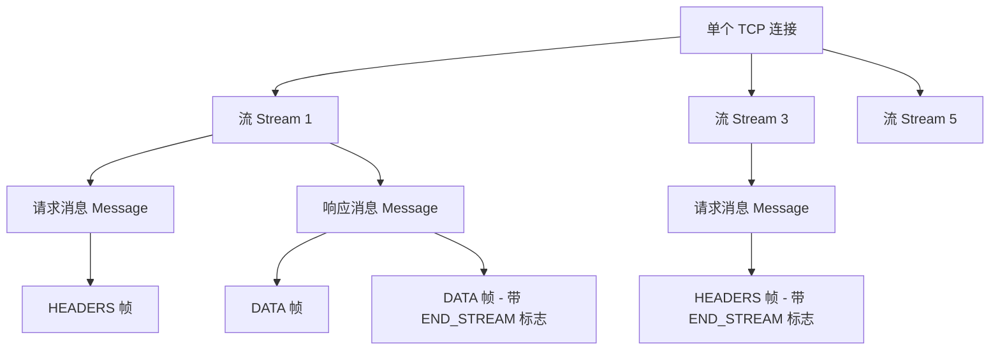
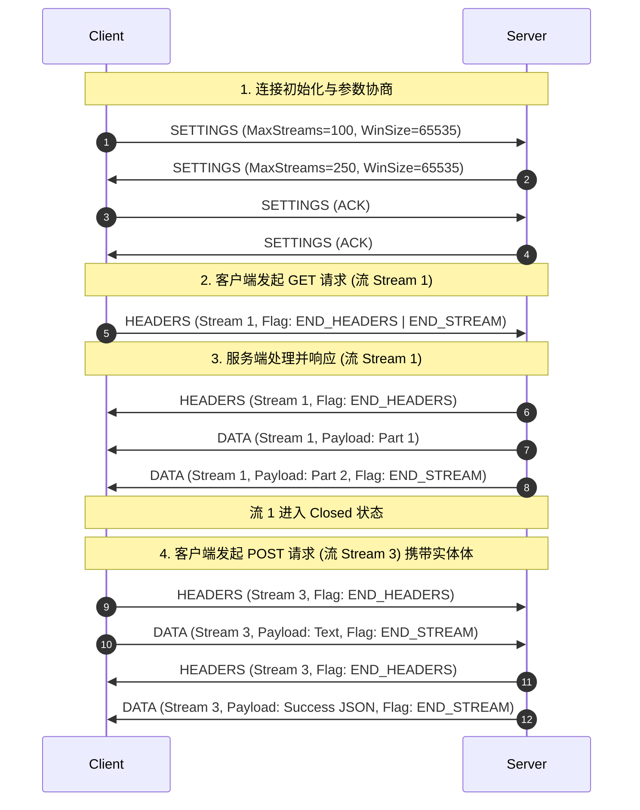
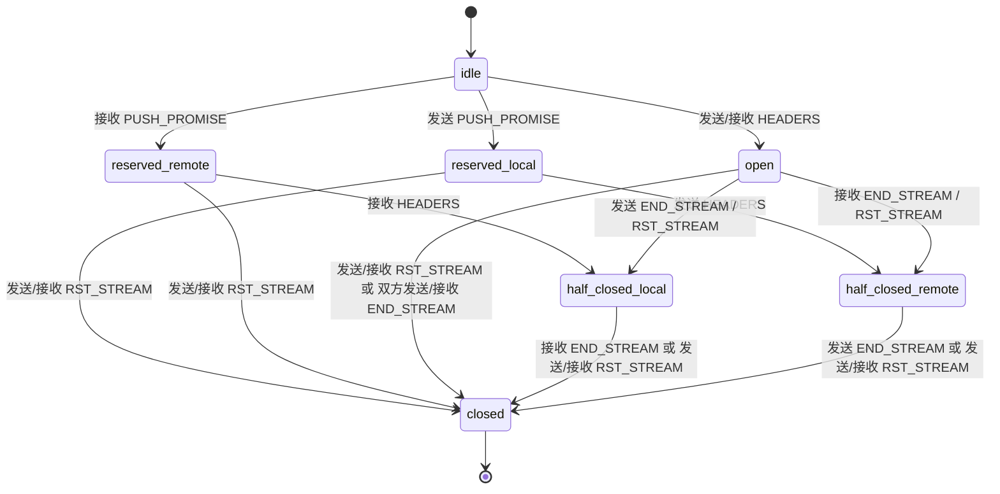

# HTTP/2 协议深度剖析：从痛点重构到机制演进

## 1. HTTP/1.x 痛点梳理：为什么需要重构？
在万维网（WWW）诞生之初，网页内容极其简单，通常只包含少量的文本和极其稀疏的媒体资源。HTTP/1.0 协议采用“单次连接-单次请求”的串行模式，即每次传输数据都需要重新建立 TCP 连接，数据传输完毕后立即关闭连接。随着互联网的爆发式增长，网页承载的资源数量从几个跃升至数百个，这种设计暴露出致命的缺陷：频繁的三次握手与四次挥手带来了巨大的网络时延，而 TCP 慢启动机制也使得每个连接都无法充分利用物理带宽。

为了缓解这一问题，HTTP/1.1 引入了持久连接（Keep-Alive）和管道化（Pipelining）机制。然而，在实际工程落地中，这些机制并未能彻底解决底层传输效率低下的痛点，反而催生了新的系统瓶颈。

### 1.1 应用层队头阻塞（Head-of-Line Blocking, HOL Blocking）
在 HTTP/1.1 的持久连接中，客户端可以在同一条 TCP 连接上发送多个 HTTP 请求。为了保证客户端能够将接收到的响应正确匹配到对应的请求，HTTP/1.1 协议规定，**服务器必须按照请求接收的顺序依次返回响应**。这一设计虽然简化了客户端解析响应的逻辑，但却引入了应用层的队头阻塞（Head-of-Line Blocking, HOL Blocking）。

假设客户端在一条连接上连续发送了三个请求：Request A（获取大图像）、Request B（获取样式表）、Request C（获取轻量级接口数据）。如果服务器在处理 Request A 时遇到了延迟（例如磁盘 I/O 慢、复杂的数据库查询或大文件网络传输），即使 Request B 和 Request C 已经在服务器端处理完毕并准备就绪，服务器也必须将其暂存在内存缓冲区中，无法向客户端发送，直至 Request A 的响应完全传输完毕。

为了规避应用层队头阻塞对网页渲染速度的影响，业界采取了两种无奈的妥协方案：
1. **多 TCP 连接并发**：主流浏览器对同一域名的并发 TCP 连接数进行了强行限制（通常为 6 个）。这意味着浏览器最多能并发处理 6 个 HTTP 请求。尽管这暂时缓解了单个响应卡死整条通道的窘境，但它带来了极大的系统开销。多连接不仅消耗了客户端与服务器的内存和套接字资源，还因为多个连接之间无法共享 TCP 拥塞控制的状态，导致每个连接都需要经历独立的慢启动过程，进一步延缓了页面首字节（TTFB）的到达时间。
2. **域名分片（Domain Sharding）**：由于浏览器对单域名的连接数存在限制，开发者会将网页中的静态资源分发到不同的子域名上（例如 `static1.example.com`、`static2.example.com`）。如此一来，浏览器便可以针对每个域名各建立 6 个连接，从而实现数十个并发连接。然而，域名分片是一剂饮鸩止渴的良药——它引入了多次额外的 DNS 解析、多次 TCP 握手以及 TLS 握手，不仅增加了客户端的计算和网络开销，也严重加重了网络中间设备和骨干网的负担。

### 1.2 纯文本头部重复与开销冗余
HTTP/1.x 是一个典型的文本协议。在协议设计上，头部（Header）由一连串以回车换行符（`\r\n`）分隔的 ASCII 字符组成。随着 Web 应用变得日益复杂，头部字段中不仅包含了传统的缓存控制、内容协商字段，还充斥着冗长的 `User-Agent`、`Accept`、授权凭证（Authorization）以及庞大的 `Cookie` 字段。

由于 HTTP 是无状态协议，客户端与服务端的每次交互都必须在请求头部中携带所有的上下文信息。在一个典型的现代网页加载过程中，浏览器需要发出上百个资源请求，而这些请求中的头部信息往往有 90% 以上是完全重复的。

更致命的是，**HTTP/1.x 不支持对头部数据进行压缩**。尽管 HTTP/1.x 支持通过 `Content-Encoding` 字段声明对 Body（实体内容）进行 Gzip 或 Deflate 压缩，但头部数据始终必须以原始的纯文本 ASCII 形式传输。在许多移动弱网环境或 API 频繁调用的微服务架构中，一个仅有几十字节的 JSON 响应体，却往往需要伴随一个大小超过 1KB 的请求/响应头部。这种“大头小体”的现象造成了极大的上行带宽浪费，拉长了网络往返时延。

---

## 2. 二进制分帧层（Binary Framing Layer）核心架构
HTTP/2 协议的核心突破在于引入了**二进制分帧层（Binary Framing Layer）**。这一层位于应用层（HTTP 语义）与传输层（TCP 协议）之间，它彻底打破了 HTTP/1.x 基于纯文本行的传输范式，将 HTTP 请求与响应重新封装为二进制帧。

### 2.1 文本协议向二进制协议的性能优势
HTTP/1.x 对报文的解析极大地依赖于文本扫描。解析器需要逐字节读取数据，不断匹配回车换行符 `\r\n` 来切分首部行，并利用字符串比对来识别各种 Key-Value 对。这种方式在工程实现上需要维护复杂的文本解析状态机，不仅 CPU 开销巨大，而且容易受到分支预测失败的惩罚。此外，文本协议通常具有模糊的边界定义。例如，在 HTTP/1.1 中，判断响应体结束位置既可以通过 `Content-Length`，也可以通过 `Transfer-Encoding: chunked`，这为解析带来了极大的不确定性，也是“请求走私”（Request Smuggling）等安全漏洞的温床。

HTTP/2 的二进制分帧层将所有传输信息拆分为紧凑的二进制帧。其性能优势体现在以下几个维度：
1. **解析的高效性与内存友好**：二进制帧拥有固定的头部格式和长度前缀（Length-Prefixed）。解析器只需读取固定字节的帧头，即可知道该帧的类型、标志位以及后续 Payload 的精确长度。CPU 可以通过位操作（Bitwise operations）直接读取字段偏移量，实现零拷贝（Zero-Copy）或极少拷贝的内存解析，大幅降低了 Web 服务器（如 Nginx、Envoy）的 CPU 占用。
2. **消除了边界歧义**：二进制分帧强制规范了帧的物理边界，每一帧的长度在帧头中都以 24-bit 整数明确给出，彻底消除了文本解析中的边界歧义，在协议设计层面天然杜绝了通过操纵文本换行符引发的各类解析漏洞。

### 2.2 帧（Frame）、消息（Message）、流（Stream）的精密拓扑关系
在二进制分帧层中，HTTP/2 将传统的 HTTP 请求/响应概念重构为三个相互关联的实体：
* **帧（Frame）**：HTTP/2 通信的最小物理单位。每个帧都带有唯一的流标识符，承载着特定类型的数据（如首部数据或实体数据）。
* **消息（Message）**：逻辑上的 HTTP 请求或响应。一个消息由一个或多个帧（如 `HEADERS` 帧、`DATA` 帧）按照特定顺序组成。
* **流（Stream）**：已建立的 TCP 连接中的一个虚拟、双向的字节通道。一个流用于承载一个完整的消息交换（即一次请求-响应过程）。

这三者之间的拓扑关系可以用下图直观表示：



在同一个 TCP 连接上，成百上千的帧可以在不同的流中并发交错传输。接收端通过帧头部的流标识符（Stream Identifier）将它们重新分流、排序并组装成逻辑上的消息，最终交付给上层的 HTTP 语义层。

### 2.3 帧头部物理结构拆解
所有 HTTP/2 帧都从一个固定的 9 字节（72 bits）头部开始。其物理结构设计极其紧凑，对每一个 bit 的利用都经过了深思熟虑：

```
 +-----------------------------------------------+
 |                 Length (24)                   |
 +---------------+---------------+---------------+
 |   Type (8)    |   Flags (8)   |
 +---------------+---------------+---------------+
 |R|                 Stream Identifier (31)      |
 +---------------+-------------------------------+
 |                   Frame Payload (0...)       ...
```

* **Length (24 bits)**：一个无符号整数，表示 Payload 的字节长度。24 位的长度字段允许 Payload 最大达到 $2^{24}-1$ 字节（即 16,777,215 字节）。然而，默认情况下，帧的最大长度被限制在 $2^{14}$（16,384）字节。只有在双方通过 `SETTINGS` 帧显式宣告修改 `SETTINGS_MAX_FRAME_SIZE` 后，才能传输更大的帧。
* **Type (8 bits)**：标识当前帧的类型。不同的帧类型决定了 Payload 具有不同的结构和语义。
* **Flags (8 bits)**：为特定帧类型保留的布尔标志位。不同的帧类型可以定义不同的 Flag。例如，在 `HEADERS` 帧中，第 3 位可以表示 `END_HEADERS`（即该帧包含了完整的首部块，后续无 `CONTINUATION` 帧）；在 `DATA` 帧中，第 1 位表示 `END_STREAM`（即该流的发送已结束）。
* **R (1 bit)**：保留位（Reserved）。其值必须为 `0x0`，发送时设为零，接收时应当忽略。
* **Stream Identifier (31 bits)**：流标识符，用以唯一识别当前帧所属的活跃流。
  * `0x0` 专用于连接级别的控制帧（如 `SETTINGS`、`PING` 等），这类帧不属于任何具体的请求或响应流。
  * 客户端发起的流 ID 必须为**奇数**（如 1, 3, 5...）。
  * 服务端发起的流 ID 必须为**偶数**（如 2, 4, 6...，通常用于服务器推送）。
  * 流 ID 是单调递增的，不能重复使用。一旦一条连接上的流 ID 耗尽（达到 $2^{31}-1$），就必须优雅关闭该 TCP 连接并重新建连。

### 2.4 核心帧类型与交互时序
HTTP/2 规范（RFC 7540）定义了 10 种标准的帧类型。下面列出了最核心的 6 种帧：

| 帧类型名称 | 类型值（Type） | 核心作用描述 |
| :--- | :--- | :--- |
| **DATA** | `0x0` | 承载 HTTP 请求体或响应体的实际二进制数据，支持流控和填充。 |
| **HEADERS** | `0x1` | 用于开辟一个流并传输压缩后的 HTTP 头部字段（首部块）。 |
| **SETTINGS** | `0x4` | 传输连接和流的配置参数（如最大并发流数、窗口大小），要求必须有 ACK 确认。 |
| **RST_STREAM** | `0x3` | 异常中断某个流。用于单方面取消请求，而无需关闭底层的 TCP 连接。 |
| **PING** | `0x6` | 测量往返时延（RTT）以及保持物理连接心跳。Payload 固定为 8 字节。 |
| **GOAWAY** | `0x7` | 优雅关闭连接。通知对端不再接收新流，并指明已处理的最后一个有效流 ID。 |

在一次典型的 HTTP/2 请求-响应生命周期中，这些帧在底层的物理信道上交织互动，时序如下：



当客户端发起 GET 请求时，它只需发送一个带有 `END_STREAM` 标志的 `HEADERS` 帧，这告诉服务器：“我的请求发送完了，没有 Request Body”。如果是 POST 请求，客户端先发送不带 `END_STREAM` 的 `HEADERS` 帧，随后发送 `DATA` 帧，直到最后一个 `DATA` 帧被打上 `END_STREAM` 标志。

---

## 3. 多路复用（Multiplexing）底层机制
在传统的 HTTP/1.x 中，即使开启了持久连接，其底层传输通道依然是串行的。多路复用（Multiplexing）是 HTTP/2 解决应用层队头阻塞、彻底解放 TCP 连接吞吐量的关键底层机制。

### 3.1 多个并发流共享单个 TCP 连接的原理
多路复用的本质，是将多个逻辑上独立的“流”在同一条物理 TCP 连接上进行**交错分片发送（Interleaving）**与**接收端按序重组**。

在发送端，HTTP/2 连接管理器维护着一个发送队列。当多个流并发产生数据时（例如，网页同时加载图片、CSS、JS 和 API 请求），分帧层会将每个流的信息拆分成一个个独立的二进制帧。这些帧并不需要排队等待前一个流全部传输完毕，而是可以以流为单位，交错地写入 TCP 发送缓冲区。

例如，流 1 的大文件 `DATA` 帧与流 3 的轻量级 `DATA` 帧，其发送序列可能是：
$$\text{Frame}(\text{Stream 1}) \to \text{Frame}(\text{Stream 3}) \to \text{Frame}(\text{Stream 1}) \to \text{Frame}(\text{Stream 5}) \to \text{Frame}(\text{Stream 3})$$

在接收端，TCP 协议栈收到的数据是一个无边界的字节流。HTTP/2 接收端首先读取前 9 字节的帧头，提取出 `Stream Identifier`。随后，接收端根据该 ID，将当前帧的 Payload 投递到对应流的接收缓冲区中。即使帧在物理网络上交织到达，接收端依然能够毫无差错地将它们归类并重组为各自独立的 HTTP 消息。这种机制消除了对多条 TCP 连接的依赖，让客户端只需维持单个 TCP 连接，就能满载物理信道的所有带宽。

### 3.2 流的状态转移状态机
为保证多路复用下的高并发通信不会失控，HTTP/2 为每一个流定义了严格的生命周期状态转移模型（RFC 7540 Section 5.1）。每个流在不同状态下能接收和发送的帧类型是完全不同的：



流状态机的关键状态定义与转换逻辑如下表所示：

| 状态名称 | 核心特征描述 | 状态转移触发条件 |
| :--- | :--- | :--- |
| **idle** | 初始空闲状态。所有未激活的流都处于此状态。不占用任何实际内存。 | 发送或接收 `HEADERS` 帧将使流转为 `open` 状态。发送/接收 `PUSH_PROMISE` 则转入 `reserved` 状态。 |
| **reserved (local)** | 本地保留状态。通常是服务端发送了 `PUSH_PROMISE`，承诺后续通过该流推送资源。 | 只能由本地发送 `HEADERS` 帧转为 `half-closed (remote)`，或发送/接收 `RST_STREAM` 进入 `closed`。 |
| **reserved (remote)** | 对端保留状态。客户端接收到了服务端发送的 `PUSH_PROMISE`。 | 只能接收对端的 `HEADERS` 进入 `half-closed (local)`，或接收/发送 `RST_STREAM` 进入 `closed`。 |
| **open** | 活跃的双向通信状态。客户端和服务器都可以在该流上发送和接收帧。 | 任意一方发送带有 `END_STREAM` 标志的帧，将导致该流单向关闭，进入 `half-closed`。 |
| **half-closed (local)** | 半关闭（本地）状态。本地已发送 `END_STREAM`，不再发送数据，但仍可接收对端数据。 | 接收到对端带有 `END_STREAM` 标志的帧后，代表双向传输全部结束，转入 `closed`。 |
| **half-closed (remote)**| 半关闭（对端）状态。对端已发送 `END_STREAM`，本地不再接收数据，但仍可发送数据。 | 本地发送了带有 `END_STREAM` 标志的帧后，转入 `closed` 状态。 |
| **closed** | 终结状态。该流的生命周期结束，流所占用的系统资源（如缓冲区、状态机）被释放。 | 进入 closed 后，所有后续收到的非控制帧都将被视为错误（发送 `RST_STREAM`）。 |

### 3.3 资源控制：流的依赖树与权重分配模型
在单条 TCP 连接上并发传输数十或数百个流时，如果不加控制，带宽和 CPU 资源将被均分，这会导致网页的关键渲染资源（如 HTML、阻塞型 CSS）被非关键资源（如尾部图片）拖累。HTTP/2 引入了**流优先级（Stream Priority）**机制，通过“依赖树”和“权重”来实现细粒度的资源分配调度。

#### 3.3.1 流的依赖关系（Dependency）
客户端可以通过 `HEADERS` 帧或 `PRIORITY` 帧为某个流指定其父流（Parent Stream），从而构建起一棵**流依赖树（Stream Dependency Tree）**。树的根节点是虚拟的（流 ID 为 0）。
* **常规依赖**：当流 B 依赖流 A 时，流 A 成为流 B 的父节点。这表明流 A 的优先级高于流 B，服务器应当优先为流 A 分配带宽，直到流 A 的传输完成（或被卡住），才开始处理流 B。
* **排他性依赖（Exclusive Dependency）**：在创建流时，如果指定 `Exclusive` 标志，则将该流插入为父流的**唯一直接子节点**。如果原先父流已经拥有其他子流，那么这些原有的子流将整体向下移动，成为这个新插入流的子节点。

```
常规依赖插入：           排他性依赖插入（流 D 独占 A）：
    A                       A
   / \                      |
  B   C                     D
 (插入新流 D 依赖 A)         / \
    A                      B   C
   /|\
  B C D
```

#### 3.3.2 权重（Weight）分配模型
对于依赖树中处于同胞关系（拥有同一个直接父节点）的流，它们通过**权重（Weight）**来按比例分配父流所获得的剩余带宽。权重的取值范围是 1 到 256。

假设流 B 和流 C 拥有共同的父流 A，且流 A 当前已经被挂起（例如数据尚未准备就绪，或者处于 Flow Control 限制中），带宽分配将下移到子流：
* 若流 B 权重为 16，流 C 权重为 8。
* 它们共享带宽的比例为：
$$\text{Bandwidth}(B) = \frac{16}{16 + 8} = \frac{2}{3} \approx 66.7\%$$
$$\text{Bandwidth}(C) = \frac{8}{16 + 8} = \frac{1}{3} \approx 33.3\%$$

需要注意的是，HTTP/2 的优先级和权重仅作为客户端给服务端的“建议”（Hints）。服务器的调度器（Scheduler）应当遵循该建议以获得最优性能，但由于操作系统的套接字发送缓冲和协议栈调度的限制，服务器在实际执行中拥有一定的自主裁量权。

### 3.4 应用层流量控制与底层的协同
为了防止单个并发流由于发送速率过快而压垮接收端的缓冲区，HTTP/2 在应用层引入了独立的流量控制机制。
* **基于 WINDOW_UPDATE 帧**：与 TCP 的滑动窗口类似，HTTP/2 在应用层通过发送 `WINDOW_UPDATE` 帧来宣告自己可接收的字节配额。
* **为什么 TCP 的流控不能代替 HTTP/2 的流控？**：TCP 的流量控制是针对整条物理通道（连接级别）的。在多路复用场景下，假设某个流 A 传输超大资源且客户端解析极慢，而流 B 传输关键 API 且客户端解析极快。如果不做应用层流控，流 A 产生的海量帧会迅速占满底层的 TCP 接收窗口，导致 TCP 层的窗口降为 0。这时，即便流 B 还有处理配额，发送端也无法通过 TCP 发送任何数据。HTTP/2 流控允许客户端单独将流 A 的应用层接收窗口调小，而保持流 B 的窗口为大值，从而仅挂起流 A 的数据发送，保证流 B 依然畅通无阻。

### 3.5 致命缺陷：TCP 传输层队头阻塞（TCP HOL Blocking）
虽然 HTTP/2 完美地解决了应用层的队头阻塞（无需等待前一个 HTTP 响应即可发送下一个），但由于它依然构建在 TCP 协议之上，当面临恶劣的网络环境时，多路复用会遭遇其最致命的缺陷——**TCP 传输层队头阻塞（TCP HOL Blocking）**。

#### 3.5.1 TCP 的字节流视图与可靠重传
TCP 是一个面向字节流的、保证绝对可靠且按序到达的传输层协议。在 TCP 的视角里，它并不理解上层 HTTP/2 的“帧”、“流”或“消息”等边界概念。TCP 只知道自己发送和接收的是一串连续的、打上了序列号（Sequence Number）的字节。

为了保证数据的按序交付，TCP 接收端在收到报文段后，会将其存入接收缓冲区。只有当所有连续的字节都完整到达后，操作系统内核才会将数据从接收缓冲区拷贝到用户态的应用层套接字（Socket）。

#### 3.5.2 丢包带来的挂起连锁反应
在单 TCP 连接多路复用的场景下，假设客户端同时在并发传输 50 个 HTTP/2 的流。如果物理网络发生拥堵，导致携带了“流 5”数据的某一个 TCP 报文段（Segment）在途中丢失，而后续携带“流 1”至“流 49”数据的报文段却顺利到达了接收端。

此时，底层的 TCP 协议栈会发生如下反应：
1. **滑动窗口卡死**：因为丢失了中间的报文段，TCP 接收端发现序列号不连续。虽然后续的报文段已经到达了接收缓冲区，但由于“按序交付”的约束，TCP 不能向应用层（HTTP/2 分帧层）递交任何后续的数据。
2. **重传等待**：接收端向发送端发送 SACK（选择性确认）或重复 ACK，等待发送端通过超时重传（RTO）或快速重传将丢失的那个报文段补齐。
3. **全局阻塞**：在这段等待重传的期间（通常为一个 RTT 以上），**整条 TCP 连接的数据传输在应用层视角下彻底停滞**。尽管“流 1”至“流 49”的数据早已经安全地躺在内核缓冲区中，但 HTTP/2 解析器拿不到它们。这导致所有 50 个并发流全部被迫挂起，无法处理任何帧。

这就是 TCP 传输层队头阻塞在 HTTP/2 中的具象表现。相比之下，在 HTTP/1.1 中，由于浏览器建立了 6 个独立的 TCP 连接，即使其中一个 TCP 连接因为丢包卡死，其余 5 个连接依然能够正常传输数据。因此，**在网络丢包率较高（如大于 2%）的弱网环境下，HTTP/2 的多路复用吞吐性能甚至会逊于 HTTP/1.1**。这一缺陷直接促使了后续 HTTP/3 舍弃 TCP，转向基于 UDP 的 QUIC 协议。

---

## 4. HPACK 首部压缩算法深度解析
在 HTTP 传输中，头部数据的压缩一直是一个难题。HTTP/2 专门设计了 **HPACK（RFC 7541）** 算法来解决头部开销冗余的问题。

### 4.1 HPACK 的设计哲学与安全考量
在 HTTP/2 标准制定早期，SPDY 协议曾尝试使用通用的 Gzip（DEFLATE）算法来压缩 HTTP 头部。然而，这导致了著名的 **CRIME（Compression Ratio Info-leak Made Easy）** 安全攻击。

CRIME 攻击的底层原理，利用了 DEFLATE 算法中的 LZ77 匹配机制与熵编码（Huffman）的结合：
1. 压缩器在处理输入数据时，如果发现重复的字符串，会将其替换为指向先前出现字符的指针（即利用字典实现压缩）。
2. 攻击者（例如通过恶意的 JavaScript 脚本）可以向受信任域名发送大量的跨域请求，并在请求的查询参数中注入猜测的敏感数据（如猜测 Cookie 字段的值）。
3. 浏览器发送的请求报文中会同时包含猜测的值和真正的敏感 Cookie。如果攻击者猜测的字符与真正的 Cookie 字符重合度越高，LZ77 算法匹配到的重复字符串就越多，最终压缩后的密文包体积就越小。
4. 攻击者通过嗅探加密流量的字节大小，逐字符进行碰撞尝试，即可在极短时间内窃取用户的敏感 Cookie。

为了从根本上消除此侧信道信息泄露的风险，HPACK 算法抛弃了通用的基于滑动窗口匹配的压缩算法，转而采用一种更具针对性的、静态与动态相结合的字典表机制，配合预硬编码的静态霍夫曼树来实现高效且安全的压缩。

### 4.2 双表同步读写与单向连接维护
HPACK 的核心机制是**静态表（Static Table）**和**动态表（Dynamic Table）**。客户端与服务端必须在各自的内存中同步维护这两张表，它们的物理寻址空间是合并的。

#### 4.2.1 静态表（Static Table）
静态表是一个只读的表格，硬编码在 RFC 7541 规范中，共包含 61 个条目。它包含了 HTTP 协议中最常见的伪首部（Pseudo-Headers）和通用头部键值对。以下是静态表的前 20 个条目：

| 索引 (Index) | 首部名称 (Header Name) | 首部值 (Header Value) |
| :--- | :--- | :--- |
| **1** | `:authority` | |
| **2** | `:method` | `GET` |
| **3** | `:method` | `POST` |
| **4** | `:path` | `/` |
| **5** | `:path` | `/index.html` |
| **6** | `:scheme` | `http` |
| **7** | `:scheme` | `https` |
| **8** | `:status` | `200` |
| **9** | `:status` | `204` |
| **10** | `:status` | `206` |
| **11** | `:status` | `304` |
| **12** | `:status` | `400` |
| **13** | `:status` | `404` |
| **14** | `:status` | `500` |
| **15** | `accept-charset` | |
| **16** | `accept-encoding` | `gzip, deflate` |
| **17** | `accept-language` | |
| **18** | `accept-ranges` | |
| **19** | `accept` | |
| **20** | `access-control-allow-origin` | |

#### 4.2.2 动态表（Dynamic Table）
动态表在连接建立之初是空的，随着连接生命周期内请求和响应的进行，它会动态地存储新出现的首部键值对（例如自定义的 `user-agent`、`authorization` 或业务特定的 Header）。
* **寻址空间**：动态表的索引空间紧跟在静态表之后，从索引值 62 开始。
* **淘汰机制（FIFO）**：动态表的大小由客户端与服务端协商决定，其物理上限以字节数计算，默认上限为 4096 字节。当新加入的键值对导致表的大小超出上限时，最老（最早加入）的条目将被移出表。

其内存索引布局如下所示：

```
  Index:   1   2  ...  61 |   62     63    64  ...
         +----------------+------------------------+
  Table: |   静态表 (1-61) | 动态表首 (最新) -> ... (FIFO)|
         +----------------+------------------------+
                           ^                      ^
                      最新插入的条目         最早插入的条目
```

#### 4.2.3 状态同步机制
HPACK 依赖于客户端和服务器各自保存的编解码字典状态的绝对一致。发送方在发送首部块时，会隐式决定是否将某个首部写入动态表。当接收方解析到该指令时，会将解出的首部同步追加到自己的动态表中。

这要求**底层网络通道必须保证按序到达**（由 TCP 保证）。如果发生乱序或丢包后没有妥善控制状态，导致其中一方的动态表失步（例如发送方写入了动态表，但接收方解析时因为错误丢失了该指令），那么后续所有依赖该动态表索引的头部解析都将彻底错乱，从而产生致命的协议解析错误，连接必须立即终止。

### 4.3 HPACK 的 4 种头部表示格式
为了在字节级上精确指示如何查找、编码或存储某个首部字段，HPACK 定义了 4 种不同的头部表示格式。解析器会读取字节流的首个或前几个 bits 来识别格式：

#### 4.3.1 Indexed Header Field（索引表示法）
* **特征**：键值对完全命中静态表或动态表。
* **字节布局**：第 1 位必须为 `1`，后续 7 位（或更多字节，如果索引值超限）表示表中的索引值。
* **格式**：`1xxxxxxx`（7-bit Integer）。

#### 4.3.2 Literal Header Field with Incremental Indexing（带递增索引的字面量表示）
* **特征**：键在表中（或不在），但值是全新的字面量。解析后，**必须将此键值对加入动态表中**。
* **字节布局**：前两位固定为 `01`，后续 6 位表示键的索引。若键不在表中，则该索引位为 `0`，随后分别传输键和值的字面量。
* **格式**：`01xxxxxx`。

#### 4.3.3 Literal Header Field without Indexing（不带索引的字面量表示）
* **特征**：键在表中，值是全新字面量，但解析后**不加入动态表**。适用于单次使用或变化剧烈但非敏感的首部。
* **字节布局**：前四位固定为 `0000`，后四位为键的索引。
* **格式**：`0000xxxx`。

#### 4.3.4 Literal Header Field Never Indexed（从不索引的字面量表示）
* **特征**：与 without 类似，但具有更高的安全级别。**明确指示中介代理和接收方绝对不能将其存入任何动态表中**。常用于传输敏感凭证。
* **字节布局**：前四位固定为 `0001`，后四位为键的索引。
* **格式**：`0001xxxx`。

### 4.5 整数表示法（Integer Representation）算法
HPACK 中存在大量的数字（如索引号、字符串长度值），为了尽量压缩这些数字所占用的空间，HPACK 使用了一种称为 **Prefix Integer** 的变长整数编码算法。它允许在少量的 bits（即前缀 $N$）内编码小整数，同时能够扩展支持无限大的整数。

#### 4.5.1 算法原理
对于一个 $N$-bit 前缀 of 整数编码：
1. 若要表示的整数 $I < 2^N - 1$，则直接将其放入 $N$ 位前缀中。
2. 若 $I \ge 2^N - 1$，则将 $N$ 位前缀的所有 bits 全部置为 1（即其值为 $2^N - 1$）。
3. 计算余数：$I' = I - (2^N - 1)$。
4. 将余数 $I'$ 拆分为 7 位一组的片段，并以每个 8 位字节（Octet）形式排列：
   * 字节的最高位（第 8 位）作为标识符：`1` 表示后续还有字节，`0` 表示当前是最后一个字节。
   * 剩余的 7 位用于存放整数值的二进制数据（低位在前）。

#### 4.5.2 Go 语言通用编解码实现示例
以下是 Prefix Integer 编解码的核心算法实现：

```go
package hpack

import (
	"errors"
)

// EncodeInteger 将整数 value 以 n-bit 前缀编码为字节流
func EncodeInteger(value int, n uint) []byte {
	if n < 1 || n > 8 {
		panic("Prefix bits must be between 1 and 8")
	}
	limit := (1 << n) - 1

	// 如果数值小于限制，直接用前缀表示
	if value < limit {
		return []byte{byte(value)}
	}

	var result []byte
	// 前缀位置全 1
	result = append(result, byte(limit))
	value -= limit

	// 处理余数，每 7 位切割一个字节
	for value >= 128 {
		result = append(result, byte((value&127)|128))
		value >>= 7
	}
	result = append(result, byte(value))
	return result
}

// DecodeInteger 从字节流 data 中解析出 n-bit 前缀的整数
// 返回解析出的整数以及所消耗的字节数
func DecodeInteger(data []byte, n uint) (int, int, error) {
	if len(data) == 0 {
		return 0, 0, errors.New("empty data")
	}
	if n < 1 || n > 8 {
		return 0, 0, errors.New("invalid prefix bits")
	}

	limit := (1 << n) - 1
	prefix := int(data[0] & byte(limit))

	// 如果前缀值小于 limit，说明数值已被直接表示，消耗 1 字节
	if prefix < limit {
		return prefix, 1, nil
	}

	value := prefix
	var shift uint = 0
	bytesRead := 1

	for {
		if bytesRead >= len(data) {
			return 0, 0, errors.New("unexpected end of data during integer decoding")
		}
		b := int(data[bytesRead])
		value += (b & 127) << shift
		shift += 7
		bytesRead++

		// 第 8 位为 0 表示结束
		if (b & 128) == 0 {
			break
		}
	}

	return value, bytesRead, nil
}
```

#### 4.5.3 数学计算推导实例
假设我们要在一个 5-bit 前缀（即 $N=5$）的区域里编码整数 `1337`：
* $2^5 - 1 = 31$。由于 $1337 \ge 31$，前缀位全置为 1，得到字节的低 5 位为 `11111`。
* 计算第一阶段剩余值：$I' = 1337 - 31 = 1306$。
* 对 $1306$ 进行分割：
  * $1306 \ge 128$，提取低 7 位：$1306 \pmod{128} = 26$（二进制 `0011010`）。由于后续还有字节，最高位置 1，拼接后得到字节 `10011010`（十六进制 `0x9A`）。
  * 剩余值右移 7 位：$1306 \gg 7 = 10$。
  * 由于 $10 < 128$，它是最后一个字节，最高位置 0，得到字节 `00001010`（十六进制 `0x0A`）。
* 最终的编码序列为：`[xxxxx11111, 0x9A, 0x0A]`（其中前五位全为 1，高三位视前缀容器所在字节的其它位而定）。

### 4.6 霍夫曼编码（Huffman Coding）的算法原理
在 HPACK 中，如果头部字段的键或值不能以纯索引表示，就必须以字面量形式传输字符串。为了进一步压缩字符串，HPACK 引入了针对 HTTP 首部字符特化设计的**霍夫曼编码**。

1. **预置静态霍夫曼树**：
   标准的霍夫曼编码需要随数据一同传输霍夫曼树的拓扑结构，这会抵消小字符串的压缩收益。HPACK 彻底规避了这一点——它在规范附录 B 中硬编码了一棵特化构建好的静态霍夫曼树。这棵树是通过收集海量真实 HTTP 首部字符分布频率生成的。
2. **字符频率设计**：
   在静态树中，出现频次极高的字符（如 `:`、`/`、小写字母 `a-z` 以及数字）被赋予了极短的位模式（如字母 `e` 仅占 5 bits）；而极少出现的符号则被赋予了更长的位模式（最长可达 30 bits）。
3. **EOS 与边界对齐填充**：
   如果一个字符串编码后的总比特数不是 8 的整数倍，HPACK 规定必须使用特殊的 **EOS（End of String）** 符号的位模式进行尾部填充（Padding）。EOS 符号在 HPACK 树中占 30 位，全为 `1`。填充时，只需截取 EOS 的前若干个 `1` 直至对齐到下一个字节边界。如果接收端在解码时发现未对齐的 bits 不全为 1，或者发现完整的 EOS 符号，则必须抛出解码错误（Connection Error）。

### 4.7 HPACK 编解码综合实操演练
为了更直观地理解 HPACK 算法的工作机制，我们在此完整模拟一次 HTTP/2 连接生命周期初期的请求头部编解码过程。

#### 场景设定
* 静态表状态：硬编码 1 至 61 项。
* 动态表初始状态：**为空**。
* 动态表最大限制：4096 字节。
* 客户端准备发出如下的首部字段（未压缩形式）：
  1. `:method: GET`
  2. `:scheme: https`
  3. `:path: /index.html`
  4. `custom-key: my-value-123`

#### 步骤一：客户端编码与发送过程

##### 1. 处理 `:method: GET`
* **分析**：该首部完全命中静态表第 2 项（Index 2）。
* **格式选择**：`Indexed Header Field` 格式。第 1 位固定为 `1`，后续 7 位为索引值 `2`。
* **二进制计算**：`10000010`（十六进制 `0x82`）。

##### 2. 处理 `:scheme: https`
* **分析**：该首部完全命中静态表第 7 项（Index 7）。
* **格式选择**：`Indexed Header Field` 格式。第 1 位固定为 `1`，后续 7 位为索引值 `7`。
* **二进制计算**：`10000111`（十六进制 `0x87`）。

##### 3. 处理 `:path: /index.html`
* **分析**：该首部完全命中静态表第 5 项（Index 5）。
* **格式选择**：`Indexed Header Field` 格式。第 1 位固定为 `1`，后续 7 位为索引值 `5`。
* **二进制计算**：`10000101`（十六进制 `0x85`）。

##### 4. 处理 `custom-key: my-value-123`
* **分析**：该键值对完全不存在于静态表或当前的动态表中，必须以字面量形式传输。我们希望将这一项保存到动态表中以利于后续请求复用。
* **格式选择**：`Literal Header Field with Incremental Indexing`。前两位固定为 `01`。
* **编码步骤**：
  * **第一步：编码键（Name）**
    * 键名 `custom-key` 不在表内，因此前缀 6 位填充为 `0`（表示 Name 需要以字面量传输）。
    * 得到第 1 个字节：`01000000`（十六进制 `0x40`）。
    * 随后传输 `custom-key` 的字面量。启用静态霍夫曼编码：
      * `custom-key` 字符长度为 10 字节。经过霍夫曼树压缩后，假设其位流为一段特定二进制，首位以 `1`（表示使用了霍夫曼编码）加上使用 Prefix Integer（这里是 7 位前缀，即第 1 位表示 Huffman Flag，后 7 位表示压缩后字节长度）编码其压缩后的字节数 $L_{name}$。
      * 写入 $L_{name}$ 的长度字节及霍夫曼位流。
  * **第二步：编码值（Value）**
    * 值的字面量为 `my-value-123`。
    * 同样计算其霍夫曼编码，使用 1-bit 的 Huffman Flag（置为 1）配合 7-bit 表示长度，写入 $L_{value}$。
    * 写入值的霍夫曼压缩位流。
  * **第三步：动态表更新**
    * 客户端发送此帧的同时，将 `custom-key: my-value-123` 塞入本地动态表。此时动态表新增一项，分配索引号为 `62`。

#### 步骤二：服务端接收与解码过程
当服务端接收到上述二进制字节流后，开始按序解析：
1. 读取到 `0x82`（二进制 `10000010`）。最高位为 1，识别为 `Indexed Header Field`。提取 Index 为 `2`。查询静态表，直接还原出 `:method: GET`。
2. 读取到 `0x87`（二进制 `10000111`）。最高位为 1，识别为 `Indexed Header Field`。提取 Index 为 `7`。查询静态表，直接还原出 `:scheme: https`。
3. 读取到 `0x85`（二进制 `10000101`）。最高位为 1，识别为 `Indexed Header Field`。提取 Index 为 `5`。查询静态表，直接还原出 `:path: /index.html`。
4. 读取到 `0x40`（二进制 `01000000`）。前两位为 `01`，识别为 `Literal Header Field with Incremental Indexing`。由于低 6 位为 0，说明键和值均紧随其后以字面量表示。
   * 读取后续字节，解析出经过霍夫曼压缩的键 `custom-key` 与值 `my-value-123`。
   * 服务端完成对此首部的解析，并**同步将 `custom-key: my-value-123` 塞入自己的动态表中，分配索引号 62**。

#### 步骤三：第二次请求首部的极致压缩
当客户端发起第二次请求时，假设它发送了相同的首部并且只修改了 `:path`，且继续携带 `custom-key: my-value-123`。
* 此时客户端的首部为：
  1. `:method: GET` -> `0x82` (1 字节)
  2. `:scheme: https` -> `0x87` (1 字节)
  3. `:path: /about.html` -> `0x04`（`Literal Header without Indexing`，复用键 Index 4 对应 `:path`，重新传输值的字面量。约 6-8 字节）
  4. `custom-key: my-value-123` -> 此时直接命中动态表 `62`！编码为二进制 `10111110`（即 128 + 62 = 190，十六进制 `0xBE`，仅需 1 字节）。
* **对比效果**：由于动态表的作用，原本长达数十字节的自定义 Header 首部，在第二次传输时瞬间被压缩为仅仅 1 个字节！这正是 HPACK 双表同步机制所带来的无与伦比的带宽压缩优势。

---

## 5. 服务器推送（Server Push）
服务器推送（Server Push）是 HTTP/2 协议中一项极具颠覆性的优化机制。它打破了传统 HTTP 请求-响应中“客户端主动请求，服务端被动响应”的固有模式。

### 5.1 推送时机与工作原理
在普通的 HTTP/1.x 网页加载中，网页首屏的渲染往往需要经历多次 RTT 延迟：

```
客户端                          服务端
   |                              |
   |--- GET /index.html --------->|
   |<-- (返回 HTML 内容) ----------|  <-- 1 RTT (开始解析 HTML)
   |                              |
   |--- GET /style.css ---------->|
   |--- GET /main.js ------------>|
   |<-- (返回 CSS 和 JS) ---------|  <-- 2 RTT (开始渲染页面)
```

而在 HTTP/2 中，服务器可以通过对 `index.html` 的解析，预测到客户端紧接着就会请求 `style.css` 和 `main.js`。此时，服务器可以在发送 HTML 响应的同时，主动将后续需要的资源推送到客户端的缓存中，从而将整体加载延迟缩短至 1 个 RTT：

```
客户端                          服务端
   |                              |
   |--- GET /index.html --------->|
   |<-- PUSH_PROMISE (style.css) -|  (服务端告知即将推送 style.css)
   |<-- PUSH_PROMISE (main.js) ---|  (服务端告知即将推送 main.js)
   |<-- (返回 HTML 内容) ----------|
   |<-- (推送 style.css) ---------|
   |<-- (推送 main.js) -----------|
```

当客户端解析 HTML 发现 `<link href="style.css" ...>` 时，它会检查本地的 HTTP/2 推送缓存，如果发现该资源已经被服务端推送到本地，便可以直接从缓存中读取，无需再发送任何网络请求。

### 5.2 PUSH_PROMISE 帧的拦截与并发时序控制
为了保证推送资源与正常请求之间不会发生冲突，HTTP/2 通过 `PUSH_PROMISE` 帧进行了精密的时序控制。

#### 5.2.1 强制先行的发送时序
**服务器必须在发送任何包含被推送资源引用（如包含了 href="style.css"）的响应帧（如 DATA 帧）之前，将 `PUSH_PROMISE` 帧发送给客户端。**

这是为了防止严重的**竞态条件（Race Condition）**：如果服务器先发送了 `index.html` 的 `DATA` 帧，客户端的 HTML 解析器可能在极短时间内读到 `<link href="style.css">` 并立刻向服务器发起了 `style.css` 的 `GET` 请求。如果此时服务器的推送资源尚未发出或者还在网络中传输，客户端的行为就会造成重复的网络请求，浪费带宽。

`PUSH_PROMISE` 帧的发送起到了“占位符”的作用，它告知客户端：“我接下来要推送这个资源了，你不需要再自己发送请求去获取了”。

#### 5.2.2 PUSH_PROMISE 帧的物理结构与流管理
* `PUSH_PROMISE` 帧是在**触发它**的那个活跃客户端流上发送的（例如 Stream 1），但它里面包含了一个特殊的字段——`Promised Stream ID`。
* `Promised Stream ID` 是由服务器创建的一个全新的偶数流 ID（例如 Stream 2）。这代表后续推送的数据将在这条全新的 Stream 2 上传输。
* 客户端收到 `PUSH_PROMISE` 后，会将 Stream 2 的状态初始化为 `reserved (remote)`。在这个状态下，客户端只能等待接收数据，不能发送数据。

#### 5.2.3 客户端的拦截与主动拒绝
客户端在收到 `PUSH_PROMISE` 后，会解析其所含的首部块。在以下几种情况下，客户端有权选择“拦截并拒绝”该推送：
1. **本地已有缓存**：如果客户端的浏览器本地缓存中已经存在了该资源（且依然有效），客户端不需要重复接收。
2. **连接限制**：客户端在之前的 `SETTINGS` 帧中将 `SETTINGS_ENABLE_PUSH` 设为了 0，这代表全局关闭了服务器推送。
3. **资源过载**：客户端计算资源或内存紧张，不想接收多余的数据。

如果客户端决定拒绝该推送，它会立即向服务器发送一个 **`RST_STREAM` 帧**，并将流 ID 指定为 `Promised Stream ID`（如 Stream 2），将其状态强行置为 `closed`。服务器收到后，便会停止在该流上发送后续的 `HEADERS` 和 `DATA` 帧，避免了带宽的浪费。

#### 5.2.4 服务器推送的缺陷与历史局限
尽管 Server Push 看起来是一种非常完美的设计，但它在实际的大规模工业应用中遇到了一系列严峻的挑战，甚至一度被认为是一项“失败的机制”：
* **缓存感知缺失（Cache-Awareness Problem）**：服务器在推送资源时，很难得知客户端浏览器中是否已经存在该资源的强缓存。虽然客户端可以用 `RST_STREAM` 拒绝推送，但由于光速网络传输的延迟，当 `RST_STREAM` 到达服务器时，服务器往往已经将大量的 `DATA` 帧塞入了物理链路的传输通道中，带宽浪费已然发生。
* **优先级与拥塞控制恶化**：服务器推送的资源往往会占用本应用于传输主 HTML 或关键阻塞 CSS 的 TCP 发送窗口，导致首屏关键资源的加载反而变慢。
* **现代演进**：正因为如此，在 HTTP/3 时代，Chrome 甚至取消了对 Server Push 的默认支持。工业界目前更倾向于使用 **103 Early Hints** 机制，它在发送最终响应前返回临时首部，引导客户端提前发送请求，既避免了重复传输，又保护了缓存的一致性。

---

## 6. HTTP/1.x、HTTP/2 与 HTTP/3 关键指标对比
为了更直观地理解 HTTP/2 带来的协议变革，以及它与最新一代 HTTP/3 之间的差异，我们可以从多个物理和逻辑维度进行对比：

| 关键技术指标 | HTTP/1.1 | HTTP/2 | HTTP/3 |
| :--- | :--- | :--- | :--- |
| **传输层底层协议** | TCP | TCP | UDP (基于 QUIC) |
| **传输数据格式** | 纯文本 ASCII 字符流 | 二进制分帧 (Binary Frame) | 二进制包 (QUIC Frame) |
| **并发复用机制** | 串行持久连接，依靠多连接并发 | 多路复用 (共享单条 TCP 连接) | 多路复用 (基于 QUIC，流之间相互独立) |
| **首部压缩算法** | 不支持 (Gzip 仅限 Body) | HPACK (静态/动态表 + 静态哈夫曼) | QPACK (适应无序交付的 HPACK 改进版) |
| **应用层队头阻塞** | 存在 (HOL Blocking) | 解决 | 解决 |
| **传输层队头阻塞** | 存在 (单连接阻塞不波及其他连接) | 严重 (单个丢包挂起全连接所有流) | 彻底解决 (丢包仅影响受损的流) |
| **服务器推送** | 不支持 | 支持 (通过 `PUSH_PROMISE`) | 支持 |
| **连接建立时延 (RTT)**| 1 RTT (TCP) + 1-2 RTT (TLS) | 1 RTT (TCP) + 1-2 RTT (TLS) | 0-1 RTT (QUIC + TLS 1.3 集成握手) |

---

## 7. 常见误区与性能优化思考
随着 HTTP/2 协议的普及，开发者在实践中常常陷入一些典型的认知误区，导致虽然启用了新协议，却未能获得预期的性能收益。

### 7.1 误区一：并发流设置越多越好
虽然多路复用消除了对并发连接数的物理限制，但这并不意味着并发流可以无限扩大。
* **调度开销与内存暴涨**：每个活跃的流在服务器和客户端都需要维护一套完整的数据结构，包含状态机、流量控制滑动窗口、发送/接收队列。当并发流数高达成千上万时，系统的内存水位会急剧上升，调度器的 CPU 轮询和计算开销也会显著增加。
* **物理带宽竞争**：当客户端同时发起 500 个并发流而没有妥善配置权重时，这 500 个流会平分物理信道的带宽。这会导致所有资源的传输速度都被拉慢，网页的 CSS、关键 JS 和图片没有一个能完整下载完，首屏渲染的时间被无限拉长。
* **工业界规范**：通常，双方协商的 `SETTINGS_MAX_CONCURRENT_STREAMS` 限制在 `100` 左右，以平衡高并发和资源调度效率。

### 7.2 误区二：启用 HTTP/2 后不需要任何前端打包优化
在 HTTP/1.x 时代，前端工程化极为推崇“大文件合并”（如 CSS/JS 合并、精灵图 Sprites 拼装），以减少 TCP 请求次数。启用 HTTP/2 后，有开发者认为小文件不再需要合并，可以直接传输成百上千个微小文件。
* **分包粒度的权衡**：尽管 HTTP/2 的分帧层对小文件的开销进行了大幅优化，但过多的碎小文件依然存在性能隐患。每一个独立的资源在传输时都必须伴随一个 `HEADERS` 帧的发送，并且会在 HPACK 的动态表中留下足迹。
* **头部压缩效率退化**：大量的碎小请求会导致动态表项频繁被移出和插入，增加了 CPU 首部解析的负担。此外，当浏览器需要并发解析成百上千个独立的脚本时，由于依赖关系链没有梳理清楚，依然会造成浏览器的渲染流水线（Layout/Paint）由于等待未到达的资源而卡顿。
* **最佳实践**：采用“适度合并”（Granular Chunking）策略，将静态资源按业务模块或变化频率进行中等粒度的打包，这在 HTTP/2 下能够获得最佳的缓存复用率与传输效率。

---

## 8. 总结与演进展望
HTTP/2 协议的发布是万维网应用层协议历史上的一次革命性重构。它通过二进制分帧技术，成功将一根陈旧的 TCP 管道分割成成百上千个并发的逻辑信道，消除了应用层队头阻塞，极大地提高了带宽利用率。配合 HPACK 首部压缩和服务器推送，网页的加载速度和网络性能得到了质的飞跃。

然而，网络世界没有银弹。HTTP/2 将所有的多路复用流都押宝在单条 TCP 连接之上，导致其不可避免地受制于 TCP 传输层的队头阻塞缺陷。在网络状况良好、低丢包的环境下，HTTP/2 表现优异；但在高延迟、高丢包率的蜂窝移动网络和无线 Wi-Fi 场景下，多路复用的优势反而会因单个丢包而消解。

正是对 HTTP/2 传输层队头阻塞缺陷的深入反思，催生了基于 UDP 构建的 QUIC 协议以及全新的 HTTP/3 标准。通过在 UDP 之上自主实现轻量级的逻辑流，HTTP/3 将每个流的丢包重传完全隔离，彻底终结了队头阻塞的宿命。然而，HTTP/2 开创的“流、消息、帧”的二进制分帧思想以及双表首部压缩的哲学，依然作为最核心的遗传基因，流淌在现代互联网协议的血脉之中。

