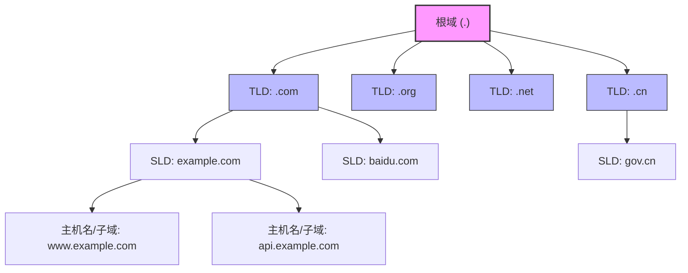
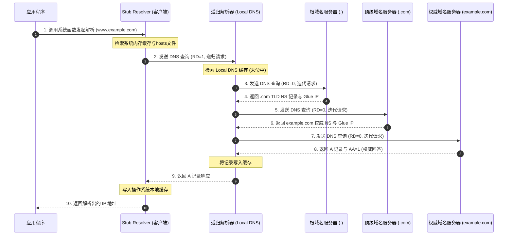
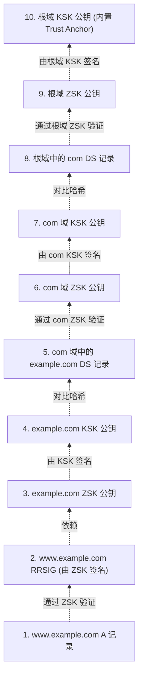

# 1.2.2.5 DNS

DNS（Domain Name System，域名系统）是互联网的核心基础设施之一。它充当了互联网的“电话簿”，负责将人类易于记忆的字符型域名（如 `example.com`）翻译为计算机在网络层进行路由和寻址所必须的数值型 IP 地址（如 `192.0.2.1` 或 `2001:db8::1`）。作为一个在应用层运行、基于传输层（主要是 UDP，必要时降级为 TCP）的分布式数据库系统，DNS 的设计在可扩展性、可用性、时延与安全性之间做出了极其精妙的权衡。本篇将从其设计哲学、报文格式、解析流程、传输协议选择、安全防御机制以及高级路由特性等维度，对 DNS 的底层原理与运行机制展开深度剖析。

---

## 1. 域名系统的设计哲学与命名空间

### 1.1 为什么不采用单一中心化服务器？
在互联网诞生初期（ARPANET 时代），域名与 IP 地址的映射关系非常简单，主要通过一个名为 `HOSTS.TXT` 的单一静态文件进行管理。该文件由美国国防部网络信息中心（SRI-NIC）负责维护。每当有新的主机加入网络，管理员就需要通过电子邮件申请更新该文件，其他主机则定期通过 FTP 下载最新的 `HOSTS.TXT` 覆盖本地文件。

随着接入网络的主机呈指数级增长，这种中心化的静态文件管理模式迅速崩溃。如果设计一个单一的、中心化的 DNS 服务器来替代 `HOSTS.TXT`，在现代互联网环境下，该架构将面临以下无法克服的物理瓶颈与工程挑战：

1. **单点故障（Single Point of Failure, SPOF）**：任何单一的中心服务器都无法保证 100% 的可用性。一旦该服务器因硬件故障、自然灾害、断电、光缆被切断或遭遇恶意攻击（如 DDoS 攻击）而宕机，全球所有的互联网通信都将瞬间因无法解析域名而陷入瘫痪。
2. **流量与计算瓶颈（Traffic & Processing Bottleneck）**：全球每秒产生的 DNS 查询请求多达数百亿次。没有任何单台物理服务器的 CPU 多核性能、内存总线带宽或网络接口卡（即使采用最先进的 800 Gbps 网卡）能够承受如此庞大的并发数据包处理量（Packets Per Second, PPS）。
3. **地理延迟与物理带宽限制（Geographical Latency & Bandwidth）**：光速在光纤中的传播速度约为 20 万公里/秒。如果中心服务器部署在地球的某一处（例如北美），那么对于亚洲、欧洲或非洲的用户而言，仅物理层面的信号往返时延（RTT）就将高达 100ms 至 300ms。一个网页的加载通常包含数十个域名的解析，这种累积的延迟将使现代互联网应用变得完全不可用。此外，全球所有网络流量向单一地理点汇聚，会对骨干网带宽造成无法承受的灾难性拥堵。
4. **管理与维护的灾难（Administrative Scalability）**：在中心化架构下，任何域名的注册、变更、注销都必须通过同一个中心机构来处理。面对全球数亿个域名每日频繁的变更需求，这种中心化管理机构的审批和录入效率将成为瓶颈，根本无法做到实时生效。
5. **地缘行政管辖与去中心化诉求**：域名代表着网络数字资产。全球各国家、地区、企业和组织都需要在自主可控的前提下管理自身的域名空间，中心化服务器在政治、行政及安全层面上是不可被全球接受的。

为了彻底解决上述限制，DNS 被设计为一个**分布式、层级化、去中心化**的数据库系统。

### 1.2 层级化、分布式的命名空间
DNS 采用树状的层级化结构来构建其物理与逻辑命名空间。域名的逻辑命名空间是一个以“根（Root）”为顶点的多叉树结构，如下图所示：



在这棵树中，每个节点都有一个标签（Label），除根节点外，每个节点都有且仅有一个父节点。
* **根域名（Root Domain）**：位于树的顶点，表示为一个空字符，在书写 FQDN（Fully Qualified Domain Name，绝对域名）时通常表现为最右侧的那个点（例如 `www.example.com.` 中的最后一个 `.`）。全球共有 13 组根域名服务器的逻辑 IP 地址（从 `a.root-servers.net` 到 `m.root-servers.net`），它们存储着所有顶级域名的解析权转交关系。
* **顶级域名（Top-Level Domains, TLD）**：位于根域之下的第一层节点。TLD 主要分为三类：
  * **通用顶级域名（gTLD）**：如 `.com`（商业）、`.org`（组织）、`.net`（网络服务）、`.edu`（教育）等。
  * **国家与地区代码顶级域名（ccTLD）**：如 `.cn`（中国）、`.us`（美国）、`.jp`（日本）、`.uk`（英国）等。
  * **新通用顶级域名（New gTLD）**：自 2012 年起由 ICANN 批准引入的各种新型后缀，如 `.app`、`.cloud`、`.xyz` 等。
* **二级域名（Second-Level Domains, SLD）**：由个人、企业或机构向 TLD 注册局申请并付费持有的域名，位于 TLD 下级。例如 `example.com` 中的 `example`，以及 `baidu.com` 中的 `baidu`。
* **子域名与主机名**：在二级域名之下，持有者可以根据自身的业务逻辑无限划分更深层次的子域名（如 `api.example.com`）或直接指定具体的物理/虚拟主机名（如 `www.example.com`）。

在域名体系的规范中，每个 Label 的长度限制在 1 到 63 个字符之间，且必须以字母或数字开头及结尾，中间可以包含连字符 `-`。整条绝对域名的总长度限制为 253 个字符（包括各个 Label 的长度指示符以及末尾的根点，在物理传输时限制为 255 字节的二进制编码表示）。

### 1.3 域名空间的委派与管理域（Zones）
在 DNS 架构中，我们需要严格区分 **Domain（域）** 与 **Zone（区域）** 这两个概念：
* **Domain**：表示域名树状空间中的一整棵子树。例如，`example.com` 域不仅包含了 `example.com` 这一节点本身，还包含了其下的所有子树，如 `a.example.com`、`b.a.example.com` 等。
* **Zone**：是域名空间中被实际委托管理的一个特定连续子集。一个 Zone 的管理者拥有该 Zone 内所有资源记录的绝对控制权。

当一个 Zone 的管理者决定将某个子域名（例如 `sub.example.com`）的控制权彻底委托给另外一台服务器时，就会在树中产生一个“授权点（Delegation Point）”。授权点之上属于原 Zone（`example.com`），授权点之下划分出一个独立的、新的 Zone（`sub.example.com`）。

在授权点上，父区域 of database 中必须包含两类记录以实现控制权的平滑转交：
1. **NS 记录（Name Server Record）**：指出子区域由哪台权威名称服务器负责解析。
2. **粘合记录（Glue Record）**：如果子区域的权威 DNS 服务器域名本身就位于该子域名下（例如，`sub.example.com` 的 NS 服务器是 `ns1.sub.example.com`），那么解析器在寻找 `ns1.sub.example.com` 的 IP 时会陷入“鸡生蛋、蛋生鸡”的无限死循环。因此，必须在父区域中强行写入 `ns1.sub.example.com` 的 A/AAAA 记录，这两条直接映射 IP 的记录即为粘合记录（Glue Record）。它们使得解析器能够绕过循环依赖，直接与子域的权威服务器建立连接。

---

## 2. DNS 报文格式精细解析

DNS 协议无论是发起查询（Query）还是返回响应（Response），都使用完全相同的统一报文格式。DNS 报文的整体结构分为 5 个大部分。

```
+-----------------------------------------+
|             Header (头部)               | 12 字节固定长度
+-----------------------------------------+
|            Question (问题区)            | 包含查询域名与类型
+-----------------------------------------+
|             Answer (回答区)             | 资源记录 (RR) 列表
+-----------------------------------------+
|            Authority (授权区)           | 指向权威服务器的 NS 记录
+-----------------------------------------+
|           Additional (附加信息区)        | 包含 Glue 记录等辅助 RR
+-----------------------------------------+
```

### 2.1 DNS 报文通用结构
* **Header（头部）**：固定占用 12 字节。用于指示整个报文的性质（是查询还是响应）、控制标记以及后续四个区域中分别包含的记录数量。
* **Question（问题区）**：包含一条或多条查询请求的详细内容（通常在实际应用中，每个报文仅包含一条查询）。
* **Answer（回答区）**：仅在响应报文中存在，包含与查询问题相匹配的资源记录（RR）。
* **Authority（授权区）**：包含指向负责该域名解析的权威名称服务器的指针（NS 记录）。
* **Additional（附加信息区）**：包含与回答相关的辅助记录，例如权威服务器的 IP 地址、用于安全校验的数字签名、或者用于扩展 DNS 协议的 OPT 记录。

### 2.2 头部字段（Header）的二进制级解析
DNS 头部由 6 个 16 位（2 字节）的字段组成，共 12 字节。其二进制结构细节如下：

```
 0  1  2  3  4  5  6  7  8  9  10 11 12 13 14 15
+--+--+--+--+--+--+--+--+--+--+--+--+--+--+--+--+
|                      ID                       |
+--+--+--+--+--+--+--+--+--+--+--+--+--+--+--+--+
|QR|   Opcode  |AA|TC|RD|RA|   Z    |   RCODE   |
+--+--+--+--+--+--+--+--+--+--+--+--+--+--+--+--+
|                    QDCOUNT                    |
+--+--+--+--+--+--+--+--+--+--+--+--+--+--+--+--+
|                    ANCOUNT                    |
+--+--+--+--+--+--+--+--+--+--+--+--+--+--+--+--+
|                    NSCOUNT                    |
+--+--+--+--+--+--+--+--+--+--+--+--+--+--+--+--+
|                    ARCOUNT                    |
+--+--+--+--+--+--+--+--+--+--+--+--+--+--+--+--+
```

* **ID (Transaction Identifier, 16 bits)**：由客户端在发起查询时生成的随机事务 ID。服务器在返回响应时必须复制该 ID。客户端利用此 ID 区分并匹配不同的并发查询与响应。
* **QR (Query/Response, 1 bit)**：0 表示当前报文为查询（Query），1 表示为响应（Response）。
* **Opcode (4 bits)**：定义该报文的查询类型：
  * `0`：标准查询（QUERY）。
  * `1`：反向查询（IQUERY，已废弃）。
  * `2`：服务器状态请求（STATUS）。
  * `4`：通知（Notify），用于主从服务器之间的数据同步通知。
  * `5`：更新（Update），动态 DNS 更新机制中使用。
* **AA (Authoritative Answer, 1 bit)**：授权回答标志。仅在响应报文中有效。1 表示该响应直接来自负责该域名的权威 DNS 服务器，数据具有权威性；0 表示该响应来自中间缓存服务器。
* **TC (TrunCation, 1 bit)**：截断标志。1 表示响应报文的长度超过了传输通道的最大限制（在使用 UDP 时通常限制为 512 字节），已被强行截断。
* **RD (Recursion Desired, 1 bit)**：期望递归标志。由客户端在查询中置位。1 表示客户端希望域名服务器使用递归查询来获取最终答案；0 表示客户端接受迭代查询，域名服务器如果不知道答案，可直接返回下一级名称服务器的指针。
* **RA (Recursion Available, 1 bit)**：递归可用标志。仅在响应中有效。1 表示当前域名服务器支持并愿意为客户端提供递归查询服务；0 表示不支持。
* **Z (3 bits)**：保留字段。在早期版本中作为未来扩展使用，目前必须置为 0。
* **RCODE (Response Code, 4 bits)**：响应返回码，用于向客户端报告查询的状态：
  * `0 (NoError)`：无错误，查询成功。
  * `1 (FormErr)`：格式错误，域名服务器无法解析客户端发送的请求。
  * `2 (ServFail)`：服务器失败，服务器内部出错或无法与下一级服务器通信。
  * `3 (NXDomain)`：域名不存在（Name Error）。该状态码仅由权威服务器返回，表示查询的域名在当前域名空间中未定义。
  * `4 (NotImp)`：未实现，服务器不支持请求的查询类型（Opcode）。
  * `5 (Refused)`：拒绝访问，由于策略限制（如 IP 白名单过滤），服务器拒绝执行查询。
* **QDCOUNT (16 bits)**：指示 Question 区中的问题记录条数。
* **ANCOUNT (16 bits)**：指示 Answer 区中的资源记录条数。
* **NSCOUNT (16 bits)**：指示 Authority 区中的资源记录条数。
* **ARCOUNT (16 bits)**：指示 Additional 区中的资源记录条数。

### 2.3 问题区（Question Section）结构
问题区用于指定待查询的域名以及期望获取的资源记录类型。每一条查询记录由以下三部分组成：

```
+-----------------------------------------+
|          QNAME (可变长度域名)            |
+-----------------------------------------+
|             QTYPE (16 bits)             |
+-----------------------------------------+
|            QCLASS (16 bits)             |
+-----------------------------------------+
```

#### 2.3.1 QNAME 的编码规则与域名压缩算法
在 DNS 报文中，域名不能直接写入 ASCII 字符串，而是使用由**长度指示符**引导的标签（Label）序列进行编码。每个标签之前都有一个单字节的长度指示器，用于指出该标签占用的字节数，最后以一个值为 `0` 的字节作为整条域名的结束符。

例如，对于域名 `www.example.com`，其二进制表示为：
`03 77 77 77 07 65 78 61 6d 70 6c 65 03 63 6f 6d 00`
* `03` 表示接下来的标签长度为 3，即 `www` (ASCII: `77 77 77`)。
* `07` 表示接下来的标签长度为 7，即 `example` (ASCII: `65 78 61 6d 70 6c 65`)。
* `03` 表示接下来的标签长度为 3，即 `com` (ASCII: `63 6f 6d`)。
* `00` 标志域名编码结束。

为了避免在同一个响应报文中重复出现相同的域名或后缀（如 `www.example.com` 与 `mail.example.com` 的后缀部分完全一致），造成报文体积膨胀，RFC 1035 设计了**域名压缩算法（Message Compression）**。该算法采用“偏移量指针”机制：

当某个域名或其后缀已在报文的前面部分出现过时，后文中相同的部分可以用一个 2 字节（16 位）的指针替换。该指针的二进制格式为：
* 高两位（第 0、1 位）固定为 `11`（十六进制为 `0xC0`）。这可以区别于正常的长度指示符（正常指示符的最大取值为 63，即二进制 `00111111`，高两位必为 `00`）。
* 低 14 位（第 2 到第 15 位）构成一个无符号整数，代表该域名后缀在整个 DNS 报文（从 Header 的 Transaction ID 起算，偏移量为 0）中的绝对字节偏移量。

##### 压缩算法字节级推演示例
假设我们在 DNS 响应报文的问题区（Question Section，起始于偏移量 12 字节处）中，完整编码了 `www.example.com`：
* **字节 0-11**：DNS Header (12 字节)
* **字节 12 开始是 Question 部分**：
  * `12: 03` (表示第一个 Label 长度为 3)
  * `13-15: 77 77 77` (字符 'w' 'w' 'w')
  * `16: 07` (表示第二个 Label 长度为 7)
  * `17-23: 65 78 61 6d 70 6c 65` (字符 'e' 'x' 'a' 'm' 'p' 'l' 'e')
  * `24: 03` (表示第三个 Label 长度为 3)
  * `25-27: 63 6f 6d` (字符 'c' 'o' 'm')
  * `28: 00` (结束符)
  * `29-30: 00 01` (QTYPE: 占 2 字节，表示 A 记录)
  * `31-32: 00 01` (QCLASS: 占 2 字节，表示 IN 类)

现在，在回答区（Answer Section，假设从偏移量 33 字节处开始）中，我们需要指定 `www.example.com` 的 A 记录。如果不使用压缩，需要重复占用 18 字节的域名编码。
使用压缩算法后，因为 `www.example.com` 在报文偏移量 12（即二进制 `00 0000 0000 1100`）处已经完整出现过，所以回答区中的 NAME 字段可以直接用两字节指针来表示：
高二位置 `11` $\rightarrow$ `11000000 00001100` $\rightarrow$ 十六进制的 `C0 0C`。
这样，18 字节的域名信息被压缩为了仅占 2 字节的指针，在偏移量 33 处写入 `C0 0C` 即可。

如果随后在附加信息区中出现了一个新的子域名 `mail.example.com`：
* `mail` 是一个新的 Label，长度为 4，编码为 `04 6d 61 69 6c`。
* 后续的 `example.com` 部分在之前的域名中已经出现过。在偏移量 12 处，整个域名是 `www.example.com`，而 `example.com` 这一部分起始于偏移量：
  $$12 \text{ (起始偏移)} + 1 \text{ (www长度指示字节)} + 3 \text{ (www字符占位)} = 16 \text{ 字节（二进制为 } 00\ 0000\ 0001\ 0000 \text{）}$$
* 结合压缩指针的高两位 `11`，指针为 `11000000 00010000` $\rightarrow$ 十六进制表示为 `C0 10`。
* 最终，`mail.example.com` 在报文中的完整编码仅为：`04 6d 61 69 6c C0 10`（共 7 字节），相比未压缩时的 19 字节极大地节省了空间。

#### 2.3.2 QTYPE 与 QCLASS
* **QTYPE (16 bits)**：查询类型。指定需要获取何种记录，如 A (1)、AAAA (28)、CNAME (5)、MX (15)、NS (2) 等。
* **QCLASS (16 bits)**：查询类别。在几乎所有的日常应用中，该值均置为 `1 (IN)`，表示互联网（Internet）命名空间。

### 2.4 资源记录（Resource Record, RR）格式
回答区、授权区和附加信息区中的所有记录，均采用统一的资源记录（Resource Record, RR）格式进行组织。其物理结构如下：

```
 0  1  2  3  4  5  6  7  8  9  10 11 12 13 14 15
+--+--+--+--+--+--+--+--+--+--+--+--+--+--+--+--+
|                                               |
/                                               /
/                      NAME                     /
|                                               |
+--+--+--+--+--+--+--+--+--+--+--+--+--+--+--+--+
|                      TYPE                     |
+--+--+--+--+--+--+--+--+--+--+--+--+--+--+--+--+
|                     CLASS                     |
+--+--+--+--+--+--+--+--+--+--+--+--+--+--+--+--+
|                      TTL                      |
|                                               |
+--+--+--+--+--+--+--+--+--+--+--+--+--+--+--+--+
|                   RDLENGTH                    |
+--+--+--+--+--+--+--+--+--+--+--+--+--+--+--+--+
/                     RDATA                     /
/                                               /
+--+--+--+--+--+--+--+--+--+--+--+--+--+--+--+--+
```

* **NAME (可变长度)**：资源记录所描述的域名。格式同 QNAME，高度复用域名压缩指针。
* **TYPE (16 bits)**：指示该 RR 的类型。
* **CLASS (16 bits)**：该记录所在的网络类别，通常为 `1 (IN)`。
* **TTL (Time To Live, 32 bits)**：生存时间，单位为秒。表示该记录允许被中间递归解析器和本地客户端缓存的最大时长。在该时间段内，缓存可以替代网络查询直接回答客户端。
* **RDLENGTH (16 bits)**：RDATA 字段的长度（以字节为单位）。
* **RDATA (可变长度)**：具体的资源数据，其内部数据格式和语义完全取决于 TYPE 的值。

### 2.5 常见记录类型的语义与使用场景
根据不同的解析需求，DNS 定义了多样化的资源记录类型。以下为网络架构中最核心的几种类型：

1. **A 记录（IPv4 Address Record）**：将域名映射到一个 32 位的 IPv4 地址。RDATA 的长度固定为 4 字节，内容为该 IPv4 地址的二进制形式。
2. **AAAA 记录（IPv6 Address Record）**：将域名映射到一个 128 位的 IPv6 地址。RDATA 的长度固定为 16 字节，内容为该 IPv6 地址的二进制形式。
3. **CNAME 记录（Canonical Name Record）**：别名记录。用于将当前域名指向另一个规范域名（Canonical Name）。解析器在收到 CNAME 后，会自动将查询目标替换为 CNAME 中指向的目标域名，并重新开始解析。
   * *使用场景*：用于隐藏真实服务器主机名、在内容分发网络（CDN）中进行域名接入控制，或者在多域名共享同一后端服务时简化配置。
4. **MX 记录（Mail Exchanger Record）**：邮件交换记录。用于指定负责接收发往该域名的电子邮件的邮件服务器。
   * *RDATA 结构*：包含一个 16 位的优先级数值（Preference）和一个规范的主机域名。数值越小，优先级越高。发信服务器会按照优先级由高到低的顺序尝试建立 SMTP 连接。
5. **NS 记录（Name Server Record）**：域名服务器记录。用于指定管理该域名所在区域（Zone）的权威 DNS 服务器域名。它是 DNS 命名空间树状结构进行层级委托和委派的纽带。
6. **TXT 记录（Text Record）**：文本记录。存储任意的无结构文本字符串。
   * *使用场景*：在现代生产环境中，主要用于 SPF（发送方策略框架）、DKIM（域名密钥识别邮件）、DMARC 等防垃圾邮件和发信源身份验证，以及用于各大云服务提供商对域名所有权的防伪检验。
7. **PTR 记录（Pointer Record）**：指针记录。用于实现反向 DNS 解析（Reverse DNS Lookup），即根据 IP 地址反向查找对应的域名。其域名格式遵循特殊的逆序规范（例如，对于 IP `192.0.2.1`，其查询的 PTR 域名为 `1.2.0.192.in-addr.arpa`；IPv6 使用 `.ip6.arpa` 后缀）。
8. **SRV 记录（Service Record）**：服务定位记录。用于在不依赖硬编码端口的前提下，定义特定应用服务（如 SIP 电话、LDAP、XMPP 等）的通信主机与端口号。
   * *RDATA 结构*：包含 16 位的优先级（Priority）、 16 位的权重（Weight）、 16 位的端口号（Port）以及目标主机的域名（Target）。
9. **SOA 记录（Start of Authority Record）**：起始授权记录。定义了当前 Zone 的核心全局参数，每一个 Zone 数据库必须有且仅有一条 SOA 记录，位于 Zone 的顶点。其 RDATA 包含以下字段：
   * **Primary NS**：该区域的主权威 DNS 服务器域名。
   * **Admin Email**：管理员的联络邮箱（其中 `@` 符号替换为点号 `.`）。
   * **Serial Number (版本序列号)**：32 位无符号整数。每次主服务器的数据发生更新时，该值必须递增。辅助名称服务器（Secondary NS）定期检查此值，一旦发现其增大，便触发区域传输（Zone Transfer）以同步数据。
   * **Refresh (刷新间隔)**：辅助服务器向主服务器检查 Serial Number 的轮询周期。
   * **Retry (重试间隔)**：当主服务器无响应时，辅助服务器重试连接的等待时间。
   * **Expire (失效期限)**：如果辅助服务器在此时间内始终无法联系上主服务器，则判定本地缓存的 Zone 数据库失效，停止对外的解析响应。
   * **Minimum TTL (否定缓存 TTL)**：所有不存在的域名记录（RCODE 为 NXDomain）的缓存生存期（RFC 2308），防止客户端针对不存在的域名进行持续的查询轰炸。

#### 2.5.1 SOA 记录在辅助 DNS 同步中的工程实践与配置优化
在多权威 DNS 架构中，通常会部署主服务器（Master）与多台辅助服务器（Slave）以分担查询压力并提供容灾备份。它们之间的数据同步控制完全依赖于 SOA 记录中的参数。如果配置不合理，可能会在生产环境中引发严重的网络故障：
* **Refresh 刷新周期配置过短**（例如小于 300 秒）：会导致辅助服务器高频向主服务器查询 `Serial Number`。当 Zone 数量庞大（如数十万个 Zone）时，会产生显著的网络流量消耗，并使主服务器面临高并发的 I/O 负载。
* **Retry 重试间隔配置过短**（例如小于 60 秒）：当主服务器因网络故障或重启短暂离线时，所有辅助服务器会以极高频次尝试重连，从而对刚刚恢复的主服务器造成严重的网络冲击（惊群效应）。
* **Expire 失效极限配置过短**（例如小于 1 天）：当主服务器由于硬件损坏需要长期停机维护时，若辅助服务器在 Expire 时间内始终无法联系上主服务器，将停止对外解析该区域。这意味着整个域名的解析会由于主服务器的单点故障而彻底离线。通常，Expire 建议配置为 2 到 4 周，以留出充足的系统应急时间。
* **Minimum TTL 配置过长**（例如大于 1 小时）：一旦某个域名暂时没有配置而被用户访问，该不存在域名的否定响应（NXDomain）将被递归服务器长时间缓存。如果管理员随后紧急配置了该域名，用户也将因缓存未过期而持续遭遇“域名不存在”的报错，严重影响新业务上线效率。

---

## 3. 全链路 DNS 解析流程深度推演

当应用层发起一个域名解析请求时，系统并不总是通过网络去查询权威服务器，而是遵循一条由近及远、层层递进的复杂解析链。

### 3.1 本地解析与宿主机环境
1. **进程与操作系统级缓存检查**：
   * 应用程序（如浏览器）首先会检索自身的进程内存缓存。
   * 若未命中，则发起系统调用，将解析请求提交给宿主机操作系统的网络基础库。操作系统会在本地的解析缓存服务（如 Linux 环境下的 `nscd`、`systemd-resolved`，或 macOS 的 `mDNSResponder`）中检索已缓存的域名条目。若缓存存在且未超过 TTL，则直接返回。
2. **静态 hosts 文件匹配**：
   * 若系统缓存未命中，操作系统会读取静态的主机映射配置文件（Unix-like 系统中为 `/etc/hosts`，Windows 系统中为 `C:\Windows\System32\drivers\etc\hosts`）。
   - 如果在该文件中找到了对应的域名映射行，解析立即结束，直接返回配置的静态 IP。静态主机的匹配优先级通常高于网络 DNS，但可以通过 `/etc/nsswitch.conf` 中的 `hosts:` 配置行进行先后顺序的调整。
3. **Stub Resolver（存根解析器）的底层执行细节**：
   * 宿主机系统调用的底层执行者是 Stub Resolver。这是一个运行在客户端本地的、功能极其受限的 DNS 解析模块。在 Linux POSIX 规范下，通常由 `glibc` 库中的 `getaddrinfo()` 或 `gethostbyname()` 封装。
   * **函数调用链与 NSS 机制**：以 `getaddrinfo` 为例，函数首先读取名字服务切换文件 `/etc/nsswitch.conf`，定位 `hosts:` 行。若配置为 `hosts: files dns`，它会首选调用本地文件解析模块（通过 `libnss_files.so` 读取并解析 `/etc/hosts`）。
   * **加载网络解析模块**：若 hosts 文件匹配失败，则加载网络名字服务共享库 `libnss_dns.so.2`。该库会调用底层的 `res_ninit` 或 `res_query` 函数族，并读取配置文件 `/etc/resolv.conf`。
   * **resolv.conf 参数解析与 Socket 创建**：解析器从 `/etc/resolv.conf` 中解析出 `nameserver` 指令指定的递归解析器 IP 地址。它会根据 `options` 指令（如 `timeout:N` 表示单次请求超时为 N 秒，`attempts:M` 表示最大尝试次数为 M，以及 `rotate` 选项表示是否对 nameserver 列表进行轮询）配置参数。
   * **发送请求与超时重试**：Stub Resolver 创建一个非阻塞的 UDP 套接字（Socket），构建带有随机 Transaction ID 且 **RD (Recursion Desired) 标志位置为 1** 的 DNS 标准查询报文，调用 `sendto` 将其发送到目标递归解析器的 53 端口。
   * 解析器随后使用 `select` 或 `poll` 监听套接字的可读事件。如果在 `timeout` 规定时间内没有收到响应，它会触发超时重传机制，向备用的 `nameserver` 发送请求，或者重复向主 `nameserver` 尝试，直到达到 `attempts` 设定的上限。若全部失败，则向应用程序返回相应的错误码（如 `EAI_AGAIN` 表示临时解析错误，`EAI_NONAME` 表示找不到该域名）。

### 3.2 递归解析器（Recursive Resolver）的职责
作为整个 DNS 系统的“核心中枢”，递归解析器接收来自数以万计客户端的 RD=1 的请求。如果它自身的内存高速缓存中没有与该域名对应的资源记录，它就必须代替客户端，以**迭代查询（Iterative Query）**的方式，向全球多级权威域名服务器体系发起层层寻址。

### 3.3 迭代查询全链路步骤推演
我们以递归解析器查找 `www.example.com` 域名对应的 A 记录为例，假设其缓存完全为空，具体的交互步骤如下：

1. **根域名服务器的迭代定位**：
   * 递归解析器在启动时，会从本地配置文件（被称为 Hint 文件或 Root Hints）中加载 13 组根域名服务器的 IP 地址。
   * 递归解析器向其中一台根服务器（如 `a.root-servers.net`）发送查询报文。此时，递归解析器将头部中的 **RD 标志位置为 0**（因为根服务器负载极高，明确拒绝提供递归查询，只接受迭代查询）。
   * 根服务器收到请求后，检索自身的 Zone 数据库。它无法给出 `www.example.com` 的 IP，但它管理着 `.com` 顶级域的分配。因此，根服务器在响应的**授权区（Authority Section）**中填入管理 `.com` 的 TLD 服务器的 NS 记录，并在**附加信息区（Additional Section）**中填入这些 TLD 服务器对应的 IP 地址（Glue Records）。
2. **顶级域名（TLD）服务器的迭代定位**：
   * 递归解析器接收到根服务器的响应，读取并解析出 `.com` TLD 服务器的 IP 列表。
   * 递归解析器选择其中一台 `.com` TLD 服务器，发送相同的查询请求（RD=0）。
   * `.com` 顶级域服务器检查自身的注册数据库，发现 `example.com` 已经授权给特定的权威名称服务器管理。于是，TLD 服务器在响应的**授权区**中填入 `example.com` 权威服务器的 NS 记录，并在**附加信息区**提供这些 NS 服务器的 IP（Glue 记录），将请求向下游委派。
3. **权威名称服务器（Authoritative Name Server）的最终回答**：
   * 递归解析器拿到 `example.com` 权威服务器（如 `ns1.example.com`）的 IP 地址后，向该权威服务器发送查询请求（RD=0）。
   - 该权威服务器拥有 `example.com` 区域的完整数据副本（Zone File）。它在数据库中匹配到 `www.example.com` 对应的 A 记录，随即在响应报文的**回答区（Answer Section）**中填入具体的 IPv4 地址，并将 DNS 头部的 **AA (Authoritative Answer) 标志位置为 1**。
4. **解析链路收尾**：
   * 递归解析器接收到来自权威服务器的最终响应（AA=1），提取出 A 记录。
   * 递归解析器将该 A 记录存入自身的本地缓存中，缓存时长由 A 记录的 TTL 决定。
   * 递归解析器将结果组装为响应报文，发送回发起请求 of Stub Resolver（如客户端主机的网络库）。
   * Stub Resolver 将 IP 地址交付给调用系统接口的应用程序，解析全链路宣告完成。

整个全链路解析步骤的时序关系可由以下 Mermaid 时序图表达：



### 3.4 递归查询与迭代查询的本质区别
在 DNS 的全链路解析中，递归查询与迭代查询分别在不同的网络分段上发挥作用，其底层机制对比如下：

| 对比维度 | 递归查询 (Recursive Query) | 迭代查询 (Iterative Query) |
| :--- | :--- | :--- |
| **发起端与接收端** | 通常发生在 `Stub Resolver` 与 `递归解析器` 之间 | 通常发生在 `递归解析器` 与 `各级权威/TLD/根 DNS` 之间 |
| **连接状态与负担** | 接收端（递归解析器）必须保持连接状态，承担后续所有的查询追踪逻辑 | 接收端无需维护复杂的查询上下文状态，只需快速给出“最优指向”并关闭当前连接 |
| **交互次数** | 客户端只发一次请求，只收一次结果，交互仅 1 次 | 递归解析器需要根据指向多次发送请求，与不同级别的服务器建立多次交互 |
| **带宽与计算开销** | 客户端开销极低；但递归服务器需要承受高并发的会话管理和查询开销 | 服务器开销极低，有利于防御大规模并发请求对关键根节点造成的资源耗尽 |
| **标志位控制** | DNS Header 中的 `RD` (Recursion Desired) 被置为 1 | DNS Header 中的 `RD` 被置为 0，即使置 1，服务器也会以 `RA=0` 的响应表明不支持 |

### 3.5 TTL 缓存生存期与过期重解析机制
#### 3.5.1 TTL 递减与本地消逝
当权威服务器返回资源记录时，报文中的 TTL（Time To Live）是由管理员配置的原始生存时间（如 86400 秒，即 24 小时）。
* 当递归解析器缓存该记录后，其内部定时器将以秒为单位对该记录的 TTL 进行倒计时递减。
* 当有新的客户端向递归解析器发起相同的查询时，递归解析器返回的响应报文中的 TTL 值为**当前缓存中的剩余 TTL**（即 $T_{remaining} = T_{initial} - T_{elapsed}$），而非初始 TTL。
* 当 TTL 减为 0 时，该缓存记录被标记为失效并被清除。

#### 3.5.2 缓存更新策略：悲观更新 vs 主动预刷新
* **悲观更新（Passive Eviction，被动驱逐）**：这是最基本的实现方式。当缓存过期后，解析器直接将其丢弃。直到下一个用户的查询请求到来时，因为缓存未命中，才重新触发一次完整的迭代解析链路。这种策略在流量低谷期非常节约资源，但缺点是**过期后的第一个用户需要承担显著的迭代查询时延**。
* **主动预刷新（Pre-fetching，预读取）**：许多高性能公共 DNS 服务（如 Bind、Unbound 等）支持预刷新算法。当某条记录的缓存剩余 TTL 低于特定阈值（例如小于 10% 或仅剩 30 秒）且该域名的查询频次高于预设阈值时，递归解析器会在后台静默发起一次迭代查询，提前刷新缓存。这可以实现对客户端的“零延迟延迟切换”。

#### 3.5.3 零 TTL（TTL=0）记录的底层原理
在某些高灵敏度的动态解析、容灾切换以及基于 DNS 的全局负载均衡（GSLB）场景中，管理员会故意将 TTL 设置为 `0`。
* 按照 RFC 规范，TTL = 0 指示客户端和递归服务器**绝对不允许将该记录缓存于任何内存或磁盘介质中**。
* 任何后续对该域名的访问，解析器都必须跨越网络向权威服务器发起实时查询。
* 这种行为虽然消除了配置变更的生效时延，但由于彻底失去了缓存的削峰平谷作用，会导致权威服务器面临庞大的查询压力，同时使客户端的每一次网络访问都必须承担 DNS 解析带来的额外 RTT 延迟。

#### 3.5.4 CNAME 的级联缓存与组合失效
在实际网络配置中，经常会出现多级别名嵌套，例如 `www.example.com` $\rightarrow$ `cname.cdn.com` $\rightarrow$ `actual-server.cdn.com` $\rightarrow$ A 记录。
* 在这种链式解析下，递归解析器需要缓存链条上的每一条 CNAME 记录以及最后的 A 记录，且**每条记录拥有其独立的 TTL**。
* 这种架构面临“组合失效”问题：如果中间的某个 CNAME 记录的 TTL 极长（如 1 天），而末梢 A 记录的 TTL 极短（如 60 秒），一旦后端服务器 IP 发生变更，即使 CDN 更新了末梢 A 记录，递归服务器也会因 CNAME 缓存未过期而可能将流量导向旧的节点。解析器必须合理组合处理这些链条，或者在 CNAME 链的某一级发生变更时主动追溯整条链的有效性。

---

## 4. 传输层协议权衡：UDP 与 TCP 的博弈

DNS 协议被设计为可以同时运行在 UDP 和 TCP 之上，其默认使用 **53 端口**。在绝大多数日常解析中，UDP 是首选传输层协议，但在特定边界条件下，TCP 则扮演着必不可少的降级保障角色。

### 4.1 为什么优先选择 UDP？
1. **握手与挥手开销的规避**：
   * TCP 是面向连接的协议，在发送实际的 DNS 查询前必须经历三次握手（1 RTT），数据传输完毕后还需要四次挥手。
   * UDP 是无连接的协议，发送端只需要封装好 DNS 报文即可直接通过网络投递，接收端即时返回响应。两者的往返交互次数对比极其悬殊。对于高吞吐的 DNS 查询而言，使用 UDP 能节省大量的 CPU 计算开销和网络带宽。
2. **极佳的延迟表现**：
   * 在使用 UDP 且网络通畅时，DNS 查询只需 1 个 RTT 即可获取结果。
   * 相比之下，TCP 至少需要 2 个 RTT。对于现代网页加载（初次加载时可能触发多次 DNS 解析），1 RTT 的节省能带来显著的视觉首屏加速。
3. **高并发状态维护成本的消除**：
   * TCP 协议栈需要在操作系统内核中为每个活跃的连接维护一个传输控制块（Transmission Control Block, TCB），包括发送/接收缓冲区、滑动窗口状态、定时器等。
   * 全球根服务器和顶级域服务器面对的是秒级数百万次的巨量突发查询。如果采用 TCP，服务器的内存将迅速被 socket 连接句柄耗尽，并因连接耗尽而瘫痪。UDP 的无状态特性使服务器只需完成“接收数据 $\rightarrow$ 内存解析 $\rightarrow$ 发送响应”，无需维护任何连接上下文。

### 4.2 传统 512 字节限制与响应截断（TC 标志位）
* **历史桎梏：512 字节限制**：
  * 在 RFC 1035 中，通过 UDP 传输的 DNS 报文被严格限制在最大 512 字节。
  * 这一限制源自早期互联网的硬件约束：IPv4 规范要求所有的网络设备必须能够转发并重组不小于 576 字节 of IP 分片。在减去 20 字节的标准 IP 头部和 8 字节的标准 UDP 头部后，剩余的载荷上限为 548 字节。为了保证 DNS 报文在跨越各种未知网络设备时绝对不会因为分片重组失败而被丢弃，DNS 规范保守地规定了 512 字节的 UDP 载荷限制。
* **响应截断（TC 置位与 TCP 降级）**：
  * 随着 IPv6 的引入（AAAA 记录长达 16 字节）、DNSSEC 的推广（包含大体积的公钥与签名）以及多 IP 轮询的配置，响应报文经常超过 512 字节。
  * 当权威名称服务器在构建 UDP 响应时，发现报文长度超出了 512 字节，它会强行将报文进行截断，保留能够放下的部分，并在 Header 中将 **TC (TrunCation) 标志位置为 1** 发送给客户端。
  * Stub Resolver 收到含有 `TC=1` 的 UDP 响应后，明白该数据被截断、内容不完整，它会立即丢弃该响应，转而与该服务器的 53 端口建立 TCP 连接，并使用 TCP 重新发送相同的查询请求。在 TCP 连接上，由于存在 MSS（最大段大小）协商机制，允许传输任意大小的 DNS 报文而不会遭遇 TC 截断。

### 4.3 EDNS0 扩展机制（RFC 6891）
为了避免频繁降级到 TCP 带来的额外三次握手时延和服务器连接开销，网络工作组在 RFC 6891 中引入了 **EDNS0（Extension Mechanisms for DNS）** 扩展协议。

EDNS0 没有破坏原有的 DNS 头部结构，而是巧妙地在报文的 **Additional Section（附加信息区）** 中引入了一种特殊的“伪资源记录（Pseudo-RR）”——**OPT 记录**。
* **OPT 记录特征**：其 TYPE 固定为 `41`。它不对应任何真实域名和网络配置，而是用于承载扩展的元数据。
* **OPT 记录的 Class 字段**：在标准 RR 中，Class 表示网络类型（如 IN）。但在 OPT 记录中，Class 字段被重新定义为一个 16 位的无符号整数，用于向对方宣告**发送方所能支持的最大 UDP 接收缓冲区大小**（例如常用的 `4096` 字节）。

#### 4.3.1 EDNS0 协商过程
1. 客户端 Stub Resolver 发起 DNS 查询时，在其 Additional Section 中附带一条 OPT 记录，将 Class 字段设为 4096，以此通知递归服务器：“我支持接收最大 4096 字节的 UDP DNS 响应。”
2. 递归服务器如果同样支持 EDNS0，在准备返回大包响应时，就可以直接使用 UDP 发送超过 512 字节但小于 4096 字节的数据包，并在响应的 Additional Section 中也附带 OPT 记录以示确认。
3. 这一协商使得绝大多数的大包响应依然可以通过 1 RTT 的 UDP 快速完成。

#### 4.3.2 路径 MTU 发现与 IP 分片风险
虽然 EDNS0 允许了高达 4096 字节的 UDP 报文，但物理网络的实际最大传输单元（MTU，通常在以太网中为 1500 字节）并未改变。
* 当一个 4096 字节的 UDP 报文经过 MTU 为 1500 字节的链路时，IP 层会被迫对该 UDP 数据报进行**分片（IP Fragmentation）**。
* 传统的 UDP 缺乏像 TCP 那样的拥塞控制与分片丢失重传机制。一旦这几个 IP 分片中的任意一个在传输中丢失，接收端就无法重新拼装出完整的 UDP 报文，导致整个 DNS 查询超时。
* 许多现代企业防火墙、安全网关或运营商路由器，出于防范 DDoS 放大攻击或规避分片攻击的考虑，会直接过滤或丢弃所有的 IP 分片报文。
* 因此，在配置过大的 EDNS0 缓冲区时，依然存在解析超时的高风险。在实际工程实践中，许多递归解析器会将接收缓冲区限制在 1232 或 1432 字节（减去 IPv6/IPv4 头部开销），以确保数据包不被分片。

### 4.4 强制或首选使用 TCP 的现代场景
尽管有 EDNS0 的保护，以下场景仍然会强制或首选使用 TCP：
1. **区域传输（Zone Transfer, AXFR/IXFR）**：主从权威服务器同步整个域名的 Zone 数据库。此类操作涉及庞大的二进制数据集，且要求数据传输必须 100% 准确、无丢包。因此，区域传输被硬性规定必须在 TCP 53 端口上运行。
2. **大包 DNSSEC 传输**：当 DNSSEC 中的数字签名（RRSIG）和密钥（DNSKEY）数据极其庞大，导致报文即便使用 EDNS0 仍会触发 IP 分片且丢包率高企时，客户端和服务器会主动降级使用 TCP 进行传输。
3. **特定防御策略（TCP 阻断/三路握手防欺骗）**：在遭遇大规模基于 UDP 的 DNS 洪泛攻击时，权威服务器可能会主动开启“强制 TCP”策略，通过向所有 UDP 查询返回带有 `TC=1` 的包，强迫客户端使用 TCP 重新连接，从而过滤掉那些无法完成 TCP 三次握手的虚假源 IP 流量。

---

## 5. DNS 的安全威胁、攻防对抗与现代加密演进

由于 DNS 诞生于互联网早期，协议设计之初未考虑加密与防伪，这使其在发展过程中暴露出了严重的安全漏洞。

### 5.1 DNS 缓存投毒（Cache Poisoning）与 Kaminsky 攻击
#### 5.1.1 传统缓存投毒原理与竞速状态
DNS 缓存投毒的本质是攻击者在权威服务器的真实响应到达之前，向递归解析器发送一个伪造的响应包。

递归解析器在收到响应时，通常会通过以下字段来校验该响应是否与先前发起的查询匹配：
1. 发起查询时的 **源端口（Source Port）** 与 **目的 IP/端口**。
2. 报文头部中的 16 位 **Transaction ID (事务 ID)**。
3. 查询的域名与类型是否一致。

在 2008 年之前，许多递归解析器在发起迭代查询时，其 UDP 源端口是固定的（通常是 53，或者是在一个非常窄的范围内顺序递增）。攻击者只需监听网络或通过某种手段触发递归解析器的查询，然后疯狂向递归解析器发送伪造的响应。攻击者需要猜测的唯一随机数就是 16 位的 Transaction ID（共 $2^{16} = 65536$ 种可能）。

##### 竞速成功率数学模型
设权威服务器响应的 RTT 为 $T$。在时间 $T$ 内，攻击者可以向递归服务器发送 $N$ 个具有不同 Transaction ID 的伪造包。
假设攻击者拥有足够的带宽，在 $T = 50ms$ 的时间内发送了 $N = 3000$ 个伪造响应包，那么攻击者在当前查询中竞速成功的概率为：
$$P \approx \frac{N}{65536} = \frac{3000}{65536} \approx 4.58\%$$
由于传统投毒会受到 TTL 的限制——如果真的权威响应先到达，该域名就会被缓存，攻击者在 TTL 到期前将失去下一次尝试的机会。因此，在 2008 年以前，缓存投毒被认为是一种低成功率、难以实施的漏洞。

#### 5.1.2 Kaminsky 攻击的工程突破
2008 年，安全研究员 Dan Kaminsky 提出了针对缓存投毒的颠覆性方法。该方法通过引入“随机非存子域名”彻底解除了 TTL 对攻击尝试次数的限制：

1. 攻击者向目标递归解析器连续发送针对不存在域名的解析请求，例如 `rand001.example.com`、`rand002.example.com` 等。
2. 递归解析器在本地缓存中肯定无法命中这些域名，因此**被迫**立刻向 `example.com` 的权威 DNS 发起迭代查询。
3. 攻击者在解析器发起迭代查询的瞬间，以极高的速率向解析器发送大批伪造的响应报文（不断改变其伪造包中的 Transaction ID 进行碰撞）。
4. 核心精妙之处在于：攻击者伪造的响应中，除了声称 `randXXX.example.com` 对应的 A 记录为恶意 IP 之外，还在 **Authority Section（授权区）** 写入了一条恶意 NS 记录，例如：
   `example.com.  IN  NS  ns.attacker.com.`
   并且在 **Additional Section** 中给出了 `ns.attacker.com` 对应的攻击者控制的 IP 地址。
5. 一旦有任意一个伪造响应的 Transaction ID 成功与递归解析器当时的查询匹配，该响应就会被解析器当作合法数据接受。此时，解析器不仅缓存了 `randXXX.example.com` 的虚假结果，更致命的是，**它更新并覆盖了对整个 `example.com` 域的权威 NS 记录缓存**。
6. 自此，全球正常用户之后所有针对 `example.com` 及其子域（如 `www.example.com`、`mail.example.com`）的查询，都会被递归解析器直接导向攻击者的 DNS 服务器进行解析。通过使用随机子域名，攻击者在短短几秒内就获得了无限次碰撞猜测的机会，成功概率递增。

#### 5.1.3 防御手段：源端口随机化（Source Port Randomization）
为了对抗 Kaminsky 攻击，业界紧急修补并推行了源端口随机化机制：
* 递归解析器在发送迭代查询时，不再使用固定的 UDP 53 源端口，而是从 1024 至 65535 的临时端口范围内，使用高强度的随机算法随机选择一个源端口。
* 这样，攻击者要实现成功投毒，不仅需要猜对 16 位的 Transaction ID（65,536 种可能），还需要猜对发起查询时的 UDP 源端口（约 60,000 种可能）。
* 猜测的搜索空间被瞬间扩大至：
  $$65536 \times 60000 \approx 3.93 \times 10^9 \text{ (约 40 亿种组合)}$$
* 在 50ms 的竞速窗口内，即使攻击者发送 10000 个包，其撞中概率也降到了大约：
  $$P \approx \frac{10000}{3.93 \times 10^9} \approx 0.00025\%$$
* 源端口随机化在不修改 DNS 报文协议的前提下，极大地提高了缓存投毒的工程门槛。

### 5.2 DNSSEC（DNS 安全扩展）数字签名链机制
源端口随机化只是提高了攻击门槛，依然无法防止处于网络关键节点的中间人（MitM）进行包监听与直接篡改。为此，IETF 推出了 **DNSSEC (DNS Security Extensions)**（RFC 4033, 4034, 4035）。

DNSSEC 的核心思想是**使用非对称加密对 DNS 的数据记录组（RRset）进行数字签名**，从而为客户端提供**数据完整性（Data Integrity）**和**来源真实性（Origin Authentication）**验证。DNSSEC 并不加密 DNS 报文内容（查询内容依然明文暴露），但它能够确保数据在传输中没有被篡改。

#### 5.2.1 引入的关键资源记录
1. **RRSIG (Resource Record Signature)**：对拥有相同域名、类型和 Class 的资源记录集合（RRset，如一组 A 记录）进行私钥签名的结果。
2. **DNSKEY**：存放用于验证 RRSIG 签名的公钥。一个 Zone 内部通常包含两种 Key：
   * **ZSK (Zone Signing Key，区域签名密钥)**：用于对 Zone 内的具体数据（如 A、CNAME、MX 等记录集）进行签名，产生相应的 RRSIG 记录。
   * **KSK (Key Signing Key，密钥签名密钥)**：专门用于对包含 ZSK 与 KSK 的公钥集（DNSKEY RRset）进行签名。KSK 公钥的 SHA 哈希会被送到父域。
3. **DS (Delegation Signer, 授权签署记录)**：存放在父域 Zone 中的记录，内容为子域 KSK 公钥的单向哈希值。它是父域对子域 KSK 的安全背书。

#### 5.2.2 信任链（Chain of Trust）校验过程
当支持 DNSSEC 的解析器需要验证 `www.example.com` 的 A 记录时，其链式验证步骤如下：



1. **验证 A 记录**：解析器向权威服务器请求 `www.example.com` 的 A 记录和对应的 RRSIG。解析器使用 `example.com` 的 ZSK 公钥解密 RRSIG，校验 A 记录的哈希是否一致。
2. **验证 ZSK 的可信度**：解析器向 `example.com` 请求 DNSKEY 列表。解析器使用其 KSK 公钥去校验 DNSKEY RRset 对应的 RRSIG（由 KSK 签名），确认 ZSK 没有被替换。
3. **引入父域背书**：为了保证 KSK 不是攻击者伪造的，解析器向父域 `.com` 请求 `example.com` 的 DS 记录。解析器计算当前 KSK 公钥的哈希，并与 `.com` 返回的 DS 记录对比。若一致，则代表 `.com` 认可了该子域的公钥。
4. **沿树向上追溯**：`.com` 域中的 DS 记录也附带有 RRSIG，解析器使用 `.com` 的 ZSK 验证它；再用 `.com` 的 KSK 验证 `.com` 的 ZSK。接着，解析器向根域 `.` 请求 `.com` 的 DS 记录进行验证。
5. **锚定信任源（Trust Anchor）**：在最顶层，根域名服务器的 KSK 公钥（Root KSK）是整个验证链的终点。解析器软件中预先硬编码了根 KSK 的公钥。只要从根 KSK 一步步验证下来的数字证书和签名哈希完整无缺，解析器就拥有了 100% 的数学把握确定最终的 A 记录是真实的。

#### 5.2.3 密钥轮转与维护机制（ZSK & KSK Rollover）
在 DNSSEC 实践中，为了防止密钥长期不更换而被暴力破解，必须定期进行密钥轮转（Key Rollover）。根据具体场景，主要使用以下两种工程模式：
* **Pre-Publish (预发布模式，常用于 ZSK 轮转)**：
  1. **发布新钥**：将新的 ZSK (ZSK_new) 公钥发布到 DNSKEY RRset 中，但暂时不使用它对数据进行签名（依然使用 ZSK_old 签名）。
  2. **等待缓存过期**：新 ZSK 必须在 Zone 中保持静置状态足够长的时间，使得全球所有的递归解析器都清空并更新了旧的 DNSKEY 缓存。
  3. **切换签名**：使用 ZSK_new 对所有的 RRset 进行签名，但 ZSK_old 公钥依然保留在 DNSKEY 列表中，以便那些缓存了旧签名的解析器能够继续验证。
  4. **移除旧钥**：在全球缓存中所有由 ZSK_old 签名的 RRset 都过期后，将 ZSK_old 从公钥列表中安全移除。此方法仅增加少量的公钥传输体积，开销较小。
* **Double-Signature (双签名模式，常用于 KSK 轮转)**：
  1. **双重签名**：在 DNSKEY 列表中同时发布新旧两个 KSK，并且用这两个 KSK 分别对 DNSKEY 产生两份 RRSIG 签名。同时，将新 KSK 的哈希（新 DS 记录）提交给父域，使其与旧 DS 记录共存。
  2. **验证兼容性**：解析器无论获取到哪一个 KSK 公钥或 DS 记录，都能通过对应的数字签名完成链式校验。
  3. **下线旧密钥**：等待全球解析器的旧 DS 记录缓存过期后，安全地撤销旧的 KSK 签名与公钥。该方法的缺点是在轮换期间，DNSKEY 的响应包大小会由于双签名而急剧膨胀，容易触发 UDP 截断和 TCP 降级。

#### 5.2.4 否定回答与不存在证明：NSEC 与 NSEC3
在 DNSSEC 中，如果用户查询一个不存在的域名（如 `nonexistent.example.com`），权威服务器无法预先为这个不存在的数据生成签名。如果服务器只返回明文的 NXDomain 响应，中间人仍然可以通过拦截并伪造该响应来实现拒绝服务攻击。

为了解决这个问题，DNSSEC 引入了“不存在证明”机制：
* **NSEC（Next Secure）**：将 Zone 内的所有已有域名按字典顺序排序，并将它们两两连接成链表。例如，Zone 内有 `a.example.com`、`c.example.com` 和 `z.example.com`。当用户查询 `b.example.com` 时，服务器会返回一条被签名的 NSEC 记录：“`a.example.com` 之后紧跟着的下一个有效域名是 `c.example.com`”。解析器通过验证该签名的 NSEC 记录，在数学上逻辑推导出介于两者之间的 `b.example.com` 必然不存在。
  * *NSEC 的局限性（Zone Walking，区域遍历）*：攻击者可以通过不断查询不存在的域名，顺藤摸瓜收集到 NSEC 链上的所有节点，从而轻松遍历出整个 Zone 的所有隐蔽子域名（造成网络拓扑资产泄露）。
* **NSEC3（RFC 5155）**：为了防御 Zone Walking，NSEC3 使用单向哈希函数（如 SHA-1）将域名进行多次哈希和盐值（Salt）混淆后，再进行字典排序建链。服务器返回的是被签名的哈希值范围证明，客户端可以自行计算目标域名的哈希并验证其是否落入空缺的哈希区间内。这在不泄露明文域名的前提下完成了否定回答的真实性校验。

#### 5.2.5 DNSSEC 的局限性
1. **不具备隐私性**：DNSSEC 仅保证防篡改，查询数据和响应数据依然在网络中以明文传输，用户的网络轨迹对于监听者而言是完全透明的。
2. **报文体积膨胀与 DDoS 放大器风险**：加入了大量的 RRSIG、DNSKEY 和 DS 记录后，DNS 报文很容易达到数千字节。这不仅会导致高频次的 TCP 降级，还使得 DNS 极易被黑客利用为 **DDoS 反射放大攻击（Amplification Attack）** 的工具（黑客使用伪造的受害者源 IP 发送几十字节 of UDP 查询，权威服务器却向受害者发送数千字节 of DNSSEC 响应，放大倍数可达数十倍）。
3. **维护复杂度与密钥轮转失效**：DNSSEC 需要定期进行密钥轮转（Key Rollover），且需要与父域注册局进行高度同步。一旦配置出错（如密钥过期未更新、算法不匹配），会导致全球解析器在验证信任链时失败，引发大面积的主动解析断网。

### 5.3 传输加密：DoH (DNS over HTTPS) 与 DoT (DNS over TLS)
为了彻底解决 DNS 解析过程中的隐私泄露（网络监听）、篡改和链路中间劫持问题，互联网社区开发了传输层加密方案。

#### 5.3.1 DoT 与 DoH 的深入对比

| 对比维度 | DNS over TLS (DoT - RFC 7858) | DNS over HTTPS (DoH - RFC 8484) |
| :--- | :--- | :--- |
| **协议栈封装** | `DNS` $\rightarrow$ `TLS` $\rightarrow$ `TCP` $\rightarrow$ `IP` | `DNS` $\rightarrow$ `HTTP/2 (or HTTP/3)` $\rightarrow$ `TLS` $\rightarrow$ `TCP` $\rightarrow$ `IP` |
| **默认网络端口**| **853** 端口 | **443** 端口 (与普通 HTTPS 共享) |
| **流量特征与隐私**| 具有极其鲜明的专属端口特征，易被网管识别 | 流量特征与普通 HTTPS 网页浏览完全一致，极难被单独剥离 |
| **防封锁与穿透性**| 容易被限制性网络在防火墙上直接封锁 853 端口 | 穿透能力极强，封锁 DoH 往往意味着需要封锁整个 443 端口 |
| **协议开销与延迟**| 较小。去掉了 HTTP 协议层的封装和头部体积 | 略高。需要传输额外的 HTTP 头字段与控制载荷 |
| **客户端实现** | 通常部署在操作系统级别或专业的路由器网关中 | 广泛由现代浏览器和应用内独立实现，可绕过系统 DNS 设定 |
| **典型传输格式** | 原生的二进制 DNS 报文加上 2 字节长度前缀 | 使用 POST/GET 传输，MIME 类型为 `application/dns-message` |

#### 5.3.2 DoT/DoH 连接复用与握手优化机制
引入 TLS 加密为 DNS 带来了显著的性能挑战：传统的明文 UDP 解析只需 1 RTT，而 TLS 连接的建立包含 TCP 三次握手和 TLS 握手，会产生额外的 2~3 RTT 时延。为了消弭该时延，DoH/DoT 引入了以下优化设计：

1. **连接复用（Connection Reuse）**：
   DoH 和 DoT 客户端在与加密解析服务器建立连接后，会保持长连接（Keep-Alive）。后续的所有并发 DNS 查询都将在这条已建立的加密通道中以多路复用的方式传输。在连接存续期间，每次解析的开销回落至 1 RTT。
2. **TLS 1.3 0-RTT 握手恢复**：
   在连接因超时断开后重新发起连接时，DoH/DoT 客户端会利用 TLS 1.3 的 **Session Tickets**（会话恢复机制）。客户端可以在发送 TLS Client Hello 握手报文的同包中，直接携带加密的 DNS 查询数据，从而实现 1 RTT（甚至结合 TCP Fast Open 实现 0 RTT）的极速重连响应。
3. **DNS over HTTP/3 (DoH3 - RFC 9250)**：
   最新规范引入了将 DoH 封装在基于 UDP 的 **QUIC 协议**上的方案。
   * **消除队头阻塞**：传统的 TCP 连接在发生丢包时，会导致后续的所有 DNS 请求都在 TCP 缓冲区中被阻塞（队头阻塞）。而 QUIC 在传输层实现了真正的多路复用，单个 DNS 请求的丢包不会影响其他并发 DNS 查询的传输。
   * **联合握手**：QUIC 将传输层握手与 TLS 加密握手合二为一，在 1 RTT 内即可建立起一条高度安全的加密多路复用通道。

#### 5.3.3 隐私拼图：加密传输与 SNI/ECH 的协同
尽管 DoH 和 DoT 成功保护了 DNS 查询过程不被中间人窥探，但在 DNS 解析完成后，客户端依然需要与目标网站建立 TLS 连接。
* 在传统的 TLS 1.2 及未启用 ECH 的 TLS 1.3 握手中，客户端发送的 **Client Hello** 报文包含明文的 **SNI (Server Name Indication)** 扩展字段，用于指出其希望访问的具体域名。
* 即使 DNS 解析被 DoH/DoT 加密，网络监听者只需旁路捕获后续 TLS 握手中的明文 SNI，即可轻而易举地还原出用户的完整访问轨迹。
* 因此，在现代网络隐私架构中，DoH/DoT 必须与 **ECH（Encrypted Client Hello，加密客户端你好）** 技术相辅相成。
* 客户端在通过 DoH/DoT 安全获取目标网站 A/AAAA 记录的同时，还会查询目标域名的 `HTTPS` 或 `SVCB` 资源记录。这些记录中包含了该网站前端分发服务器的公钥（ECHConfig）。
* 客户端使用该公钥，将后续 TLS 握手中包含 SNI 的核心 Client Hello 部分（称为 Inner Client Hello）进行非对称加密，而将外层（Outer Client Hello）置为非敏感的公共网关名称。
* 只有将 **DoH/DoT 加密解析** 与 **ECH 握手加密** 深度结合，才能真正实现端到端网络通信的全面去标识化与隐私保护。

#### 5.3.4 DoH 集中化与传统运营商的旁路博弈
在传统网络架构中，网络服务提供商（ISP）在各省市部署了本地递归 DNS 节点（Local DNS）。这不仅能实现低延迟的就近解析，还能让 ISP 对本网内的网络流量进行精细化管理和调度（如引导流量进入内部缓存或就近 CDN 节点）。
当现代应用或浏览器开启内置的 DoH 功能时，DoH 默认会将解析请求发送给少数几家国际公共 DNS 服务商（如 Cloudflare 的 1.1.1.1、Google 的 8.8.8.8）。这导致用户的 DNS 解析流量被完全“旁路”出了 ISP 的监控范围，引发了以下多维度的技术与治理博弈：
* **隐私博弈**：DoH 防止了某些不规范的 ISP 拦截明文 DNS 并强行植入牛皮癣广告或进行流量分析。
* **性能折损**：由于旁路了 ISP 的 Local DNS，GeoDNS 在没有 ECS 扩展或 ECS 信息被归并的情况下，可能会将用户路由到物理距离遥远的境外 CDN 节点，导致整体网页加载速度折损。
* **合规与安全阻断失效**：企业内部的网络管理员或国家级的防火墙，原本依靠在边界封锁特定域名解析来实现防毒防钓鱼、防非法数据资产流失的安全策略。当流量被裹挟在标准的 443 HTTPS 数据包中发送给外部公共 DoH 时，传统的企业流量审计与域名黑名单过滤机制宣告失灵。
为了解决这些冲突，IETF 正在制定如 **DDR（Discovery of Designated Resolvers，设计解析器发现协议，RFC 9462）** 和 **DNR（Discovery of Network-designated Resolvers，网络指定解析器发现协议，RFC 9463）**，允许客户端自动发现并平滑升级到本地 ISP 提供的、支持 DoH/DoT 的加密解析节点，以期在隐私保护、网络性能与合规控制之间寻找到新的平衡点。

---

## 6. 高级网络与路由特性

在超大规模高并发、全球高可用的生产架构中，DNS 还需要与底层的网络路由协议和流量负载分发技术进行深度集成。

### 6.1 任播 DNS（Anycast DNS）的路由机制
任播（Anycast）是一种网络寻址和路由技术，它允许多个部署在不同地理位置的物理服务器节点共享完全相同的 IP 地址。

```
                    [ 客户端 A ] (北京)
                         | (就近路由)
                         v
  +------------------ [AS-Path 2] -------------------+
  |                                                  |
  |             Anycast IP: 1.1.1.1                  |
  |            [北京 Anycast 节点]                    |
  |                                                  |
  |             Anycast IP: 1.1.1.1                  |
  |            [法兰克福 Anycast 节点]                 |
  |                                                  |
  +------------------ [AS-Path 3] -------------------+
                         ^
                         | (就近路由)
                    [ 客户端 B ] (柏林)
```

1. **多点宣告（BGP Routing Advertisement）**：
   部署在全球各地的 Anycast DNS 节点，通过各自的边缘路由器，使用边界网关协议（BGP）向周围的自治系统（AS）宣告相同的 IP 网段前缀（如 Cloudflare 公共 DNS 的 `1.1.1.1`）。
2. **就近寻址（Shortest AS-Path）**：
   整个互联网中的各级核心路由器，会根据动态收到的 BGP 路由更新，更新其路由表。当用户发起针对该 Anycast IP 的 DNS 查询包时，沿途的路由器会根据 BGP 路径选择算法（通常以 AS 路径最短、自治系统跳数最少为度量基准），自动将数据包导向拓扑结构上“最近”的那个物理 Anycast 节点。
3. **自治切换与容灾（Self-Healing）**：
   若某个 Anycast 节点（例如新加坡节点）因故障宕机或发生链路中断，该节点的 BGP 宣告会立即停止。全球路由器会在极短时间内收敛路由表，自动将后续发往该 IP 的数据包重定向到次优的 Anycast 节点（如日本或中国香港节点），整个过程对客户端而言是完全透明的。

#### 6.1.1 Anycast 下跨国 BGP 路由收敛推演
当跨国广域网（WAN）中的一条核心海底光缆被意外切断，或者某个大型骨干网 AS 发生故障时，Anycast 能够实现秒级甚至毫秒级的流量倒换。其底层的 BGP 路由收敛机制如下：
1. **链路失效检测**：Anycast 节点的监控系统（如 IP SLA、Keepalived 或 BFD 双向转发检测）会实时检测本机的 DNS 守护进程。一旦发现服务宕机，立即断开与本地 BGP 路由器的 Peer 连接。
2. **撤销宣告（Route Withdraw）**：边缘路由器检测到 Peer 中断后，立刻生成一条包含该网段前缀（如 `1.1.1.0/24`）的 **BGP Update 撤销报文**，发送给所有的邻居 AS。
3. **泛洪扩散与路径再选择**：周围的 AS 路由器收到撤销报文后，在各自的 BGP 路由表（RIB）中删除原指向该损坏节点的路径，重新评估其他备用节点宣告的路径（例如从原本 AS-Path 长度为 2 的故障路径，切换到 AS-Path 长度为 4 的备用路径）。
4. **数据包重定向**：无需更改客户端的任何配置，后续的 DNS 解析包便会流经新的最优网络路径，抵达其他运转良好的物理节点。这极大地提高了根域名服务器和大型公共 DNS 的整体抗灾可用性。

### 6.2 Anycast vs Unicast 的多维性能与高可用对比

| 对比维度 | 单播 DNS (Unicast) | 任播 DNS (Anycast) |
| :--- | :--- | :--- |
| **IP 分布特征** | 每个物理服务器独占唯一的公共 IP | 全球所有物理集群节点共享同一个 IP |
| **DDoS 防御能力** | 脆弱。所有攻击流量会被路由至单点，极易被大流量瘫痪 | 极强。攻击流量被各地的 Anycast 节点就近吸收（流量局部化），保障全局可用性 |
| **网络时延表现** | 不均衡。距离服务器物理位置远的用户将承担高 RTT | 极佳。全球用户均能就近访问最近的边缘节点，时延普遍被压制在 10ms 内 |
| **TCP 状态稳定性**| 稳定。路径固定，不会发生路由漂移导致的状态丢失 | 存在隐患。在 BGP 抖动期间，可能发生路由漂移导致 TCP 连接断开 |
| **运维配置难度** | 简单。常规网络配置与寻址逻辑 | 极其复杂。需要拥有自己的 IP 段、AS 号并与多个 ISP 建立 BGP 邻居 |

#### 6.2.1 Anycast 下的“路由漂移与 TCP 状态破坏”边界案例
由于 Anycast 依赖于 BGP 的动态选路，在网络抖动或骨干网光缆中断时，路由表可能会在短时间内发生频繁切换，这被称为**路由漂移（Route Flapping）**。
* **UDP 视角**：由于 DNS UDP 查询是无状态的“一问一答”，即使第一个查询包发到了东京节点，第二个包发到了新加坡节点，客户端依然能正常收到各自的响应，业务完全不受干扰。
* **TCP / DoT / DoH 视角**：在进行 TLS 握手或保持长连接期间，如果 BGP 路由突然发生漂移，后续的 TCP 数据包（如 ACK 或加密数据）被路由器路由到了另一个物理节点（如新加坡节点）。然而，新加坡节点的操作系统内核中**并没有**该 TCP 连接的控制块（TCB），该连接的握手记录只存在于东京节点。新加坡节点会直接回复一个 **TCP RST 报文**，导致客户端的加密连接瞬间中断，触发重连开销。
* **工程解决方案**：
  1. **前端部署四层负载均衡器网关**：在 Anycast 集群的物理入口处，采用基于 DPDK 的高性能 L4 负载均衡网关，对连接进行一致性哈希，确保在一定范围内的网络抖动下，同一源 IP 的请求仍被映射至相同的后端真实服务器。
  2. **多路径宣告优化（BGP community 策略）**：通过精细化调整 BGP 宣告的 MED、Local Preference 等属性，增加路由的整体黏性，防止频繁漂移。

### 6.3 DNS 负载均衡机制
除了 Anycast 之外，DNS 自身也被广泛用于应用层和传输层的流量分发和全局负载均衡。

#### 6.3.1 A 记录多值轮询（Round-Robin DNS）
权威 DNS 服务器可以为一个特定的域名配置多个 A 或 AAAA 记录，分别指向不同的后端服务器 IP。
* **工作机制**：当递归服务器向权威 DNS 请求解析时，权威服务器会把所有的 IP 地址列表一并返回，但在每次响应中，IP 列表的排列顺序会发生循环滚动（如第一次返回 `[IP_A, IP_B, IP_C]`，第二次返回 `[IP_B, IP_C, IP_A]`）。
* **客户端选择策略**：大多数客户端和操作系统在发起网络连接时，会默认选用 IP 列表中的第一个元素。这种顺序轮转实现了各服务器节点之间粗粒度的流量均摊。
* **局限性**：
  1. **缺乏健康状态感知（Passive Failover）**：如果后端 `IP_A` 服务器已经宕机，DNS 依旧会将其返回给客户端。虽然客户端在连接 `IP_A` 失败后，通常会尝试连接列表中的第二个 IP（`IP_B`），但这会带来数秒的超时重试等待时延。
  2. **强缓存机制导致的负载不均**：由于各级递归解析器和本地浏览器存在强烈的缓存行为，一个高流量小区的递归解析器缓存了轮询顺序为 `[IP_A, IP_B]` 的记录后，在 TTL 过期前，该小区的成千上万个用户都会被导向 `IP_A`，这会导致后端服务器负载严重失衡。

#### 6.3.2 地理位置解析（GeoDNS / 智能解析）
为了实现更精准的流量分配，GeoDNS 能够根据发起查询的客户端地理位置或所属网络运营商，返回定制的 IP 记录。

##### EDNS Client Subnet (ECS, RFC 7871) 扩展
在传统的 GeoDNS 中，权威服务器只能获取到递归解析器（如 `8.8.8.8`）的 IP，而无法得知真实用户的 IP。如果一个身在上海的电信用户使用了一个设在香港的公共递归解析器，GeoDNS 就会错误地将香港节点的 IP 返回给用户，造成访问性能恶化。

为了解决该痛点，RFC 7871 引入了 **EDNS Client Subnet (ECS)** 扩展：
1. 当客户端向支持 ECS 的递归解析器发送查询时，递归解析器会在扩展的 OPT 记录中附加**真实客户端的部分 IP 网段信息**（例如，抹去主机位后的 `222.66.0.0/24`）。
2. 支持 ECS 的权威服务器在收到迭代请求后，能够从报文中提取出该网段信息，判断出这是来自“上海电信”的用户，并精准返回上海电信 CDN 节点的 IP。
3. 同时，递归服务器在缓存该解析结果时，会标记该缓存仅对 `222.66.0.0/24` 网段生效。这就实现了全球高精准度的网络流量就近接入和智能分发。

