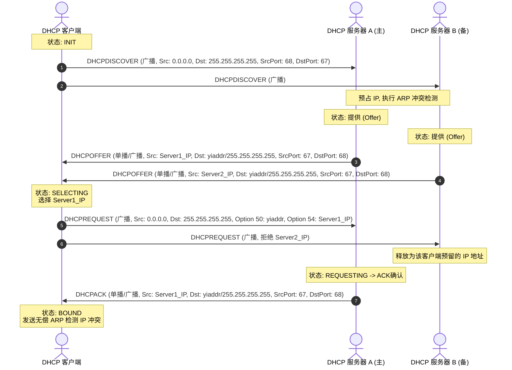
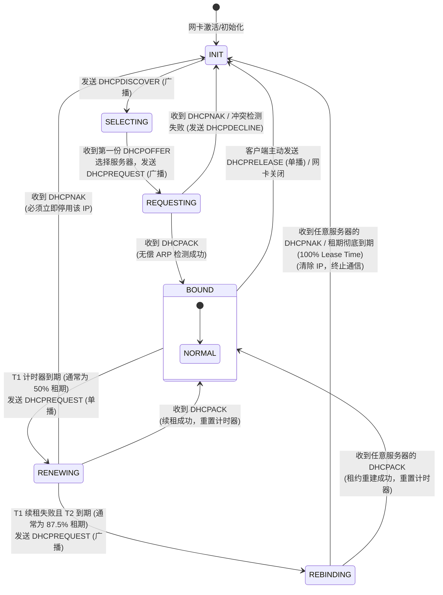

# 1.2.2.6 DHCP协议

## 1. DHCP 协议的历史背景与核心设计目标

在计算机网络发展的早期，主机的网络参数配置是一项繁琐且极易出错的手动任务。网络管理员必须为每一台主机手动配置 IP 地址、子网掩码、默认网关、DNS 服务器、WINS 服务器以及 NTP 服务器等参数。随着网络规模的扩大和移动主机的出现，静态 IP 配置（Static Configuration）遇到了不可逾越的瓶颈：

1. **管理成本与扩展性瓶颈**：在大中型企业或互联网服务提供商（ISP）网络中，成千上万台终端设备的手动配置耗费了海量的人力资源。网络拓扑一旦发生变更（例如更换网关路由器或变更 DNS 服务器地址），管理员必须逐台设备修改配置，导致网络维护效率极低。
2. **IP 地址冲突频发**：手动分配 IP 地址极易发生人为疏漏，导致同一局域网内存在多个相同 IP 地址的设备，进而引发 ARP 欺骗、路由抖动以及服务中断。
3. **网络移动性支持极差**：在无线局域网和动态办公环境中，用户终端频繁在不同的物理网段（如不同的会议室、办公楼层或分支机构）之间移动。每一次跨越三层广播域的移动，都要求终端修改其 IP 地址和网关配置，否则无法进行通信。
4. **IP 地址空间利用率低下**：在 IPv4 地址资源日益枯竭的背景下，静态分配意味着即使设备下线或长期离线，其占用的 IP 地址也无法被其他活动设备使用。

为了解决上述问题，计算机网络标准组织（IETF）在不同历史时期设计了多种自动化配置协议，经历了从 RARP 到 BOOTP，再到 DHCP 的演进过程：

### 1.1 RARP（反向地址解析协议，RFC 903）
RARP 运行在 TCP/IP 协议栈的数据链路层。在无盘工作站启动时，它通过广播发送包含自身 MAC 地址的 RARP 请求，局域网内的 RARP 服务器收到请求后，检索本地静态配置的 MAC-IP 映射表，并回送对应的 IP 地址给客户端。
然而，RARP 存在严重的设计缺陷：
- **无法跨越路由器**：由于 RARP 直接封装在以太网帧中，且没有网络层 IP 头部，因此 RARP 广播报文无法跨越三层路由器，这意味着每个物理子网都必须部署一台 RARP 服务器。
- **配置信息单一**：RARP 仅能提供 IP 地址，无法分发子网掩码、默认网关、DNS 服务器等关键网络配置参数。
- **静态映射限制**：RARP 服务器依然采用静态表格映射，无法实现 IP 地址的动态回收与循环利用。

### 1.2 BOOTP（引导程序协议，RFC 951）
为了克服 RARP 的局限，BOOTP 被设计为基于 UDP 的应用层协议（利用 UDP 67/68 端口）。由于其基于 IP 协议封装，因此能够通过在路由器上配置中继代理（Relay Agent）实现跨网段通信，从而避免了在每个子网都部署服务器的窘境。BOOTP 还可以通过 Options 字段分发网关、DNS 等多种配置信息。
但 BOOTP 仍未解决核心问题：
- **缺乏动态分配与租约机制**：BOOTP 仍基于管理员在服务器端预先配置好的 MAC-IP 静态对应表进行分配。当客户端下线或离线时，其分配的 IP 地址无法被系统自动回收，无法满足高动态、高流动性网络的需要。

### 1.3 DHCP（动态主机配置协议，RFC 2131）
为了彻底解决动态网络参数分发的痛点，RFC 2131 正式定义了 DHCP 协议。DHCP 继承了 BOOTP 的基本报文格式和 UDP 端口设计，但引入了三个决定性的机制：
1. **动态地址分配（Dynamic Allocation）**：DHCP 服务器管理一个 IP 地址池（Address Pool）。当客户端请求 IP 时，服务器从池中挑选一个空闲地址分配给客户端，并规定一个“租约期限（Lease Time）”。
2. **租约生命周期管理（Lease Lifecycle Management）**：客户端获取 IP 后，必须在其租期过半（T1）或接近枯竭（T2）时向服务器发起续租申请，如果续租失败或客户端主动下线释放，该 IP 将自动归还至地址池，重新分配给其他设备。
3. **丰富的可选项参数（Options 机制）**：基于 TLV（Type-Length-Value）架构，扩展了对数百种网络配置参数的支持，如静态路由路由表、时区、NTP 服务器、域名、甚至引导映像文件路径（PXE）等。

DHCP 的设计目标是实现零配置（Zero Configuration）和即插即用（Plug-and-Play），即终端接入网络后，无需人工干预即可自动融入网络拓扑并进行正常的网络层通信。为了适应不同的网络管理策略，DHCP 支持三种分配机制：
- **手动分配（Manual Allocation）**：网络管理员在服务器端将特定的物理 MAC 地址与特定的固定 IP 地址绑定（静态绑定）。当该设备请求 IP 时，服务器只分发这一个固定 IP。这常用于服务器、网络打印机等需要固定寻址的设备。
- **自动分配（Automatic Allocation）**：当客户端第一次向服务器申请 IP 时，服务器为其分配一个可用的 IP 地址，且该地址是永久的，除非客户端主动释放，否则该地址不会被回收。
- **动态分配（Dynamic Allocation）**：服务器为客户端分配一个具有时效限制的临时 IP。这是最通用且最具网络弹性的机制，能够极大提高 IP 地址空间的重用率。

---

## 2. DHCP 报文格式深度剖析与 TLV 选项设计

DHCP 报文直接封装在 UDP 报文中，是一种基于客户端/服务器模式的应用层协议。其底层结构直接兼容并扩展了 BOOTP 报文，固定部分长度为 236 字节，随后是变长的 Options 选项字段。

### 2.1 DHCP 报文字段详细拆解

下面是标准的 DHCP 报文字段结构及字节布局表：

| 字段名称 | 字节长度 (Bytes) | 物理意义与核心作用说明 |
| :--- | :--- | :--- |
| `op` | 1 | **操作码 (Message Opcode)**。1 代表请求报文（BOOTREQUEST，由客户端发起）；2 代表响应报文（BOOTREPLY，由服务器回应）。 |
| `htype` | 1 | **硬件地址类型 (Hardware Address Type)**。标识物理链路层介质类型。对于以太网（Ethernet），该值为 1。 |
| `hlen` | 1 | **硬件地址长度 (Hardware Address Length)**。标识物理 MAC 地址的字节长度。以太网 MAC 地址长度为 6。 |
| `hops` | 1 | **中继跳数 (Hops)**。客户端发送请求时将其设置为 0。当报文经过 DHCP 中继代理（Relay Agent）时，中继代理每转发一次就将该值加 1。用于防止报文在环路中无限循环（通常最大跳数为 16）。 |
| `xid` | 4 | **事务 ID (Transaction ID)**。由客户端在发起 DORA 请求时随机生成的 32 位无符号整数。在多客户端并发请求的复杂局域网中，客户端和服务器依靠该字段将响应与请求进行一对一关联，以防止接收到其他主机的配置响应。 |
| `secs` | 2 | **秒数 (Seconds elapsed)**。由客户端填写，记录自客户端开始发起 IP 地址申请或续租流程以来所经过的累计秒数。在网络拥堵、服务器响应缓慢时，该值会持续增大，服务器可以通过监测此值来提高紧急客户端的响应优先级。 |
| `flags` | 2 | **标志位 (Flags)**。仅最高位（第 0 位）有效，称为**广播标志位 (Broadcast Flag)**。其余 15 位必须填充为 0。若此位置 1，代表客户端要求服务器必须使用广播方式回送 Offer 和 ACK 报文；若置 0，代表客户端支持服务器通过单播方式回送响应。 |
| `ciaddr` | 4 | **客户端 IP 地址 (Client IP Address)**。当客户端处于已绑定（BOUND）、续租（RENEWING）或重新绑定（REBINDING）状态，且其当前 IP 地址合法可用时填写此字段。在 DORA 初始申请阶段，由于客户端尚未获得 IP，此字段固定为 `0.0.0.0`。 |
| `yiaddr` | 4 | **承租客户端 IP 地址 (Your IP Address)**。服务器向客户端分配的 IP 地址。在服务器发送的 Offer 和 ACK 报文中填写。 |
| `siaddr` | 4 | **引导服务器 IP 地址 (Server IP Address)**。在引导启动（如 PXE 无盘引导）场景中，用于告知客户端下一步应当向哪台 TFTP/引导服务器请求下载操作系统引导镜像。 |
| `giaddr` | 4 | **中继代理 IP 地址 (Gateway IP Address)**。当客户端与服务器跨网段时，第一个接收到客户端广播 Discover 报文的网关接口（三层接口）的 IP 地址。服务器依据此字段来判断该从哪个物理网段的 IP 地址池中为客户端划分 IP。若无中继（同网段），则此字段为 `0.0.0.0`。 |
| `chaddr` | 16 | **客户端硬件地址 (Client Hardware Address)**。客户端的物理 MAC 地址。虽然以太网 MAC 地址只有 6 字节，但此字段固定预留了 16 字节，后 10 字节必须用 `0x00` 填充。 |
| `sname` | 64 | **服务器主机名 (Server Host Name)**。可选的、以空字符（`\0`）结尾的服务器 ASCII 字符串名称。若不使用，则用零填充。 |
| `file` | 128 | **启动文件名 (Boot File Name)**。在引导启动场景下，指定要加载的引导映像文件的路径及名称。若不使用，则用零填充。 |
| `options` | 可变长度 | **选项字段 (Options)**。格式极其灵活，通常以 4 字节的 Magic Cookie `0x63825363` 开始，随后是采用 TLV 结构组织的各种网络参数选项，最后以单字节的 `0xFF`（Option 255）结束。 |

### 2.2 TLV（Type-Length-Value）架构与常用 Options 选项

DHCP Options 字段通过 TLV 结构赋予了协议极强的可扩展性。每一个 Option 的字节排列如下：
- **Type (Tag)**：1 字节，定义选项的功能或含义。
- **Length**：1 字节，定义后续 Value 字段的长度（字节数）。
- **Value**：可变字节，具体的内容。

根据 RFC 2132，常用的关键 Options 定义如下：

```
+--------------+--------------+-----------------------+
|  Tag (1 Byte)|Length(1 Byte)|    Value (Variable)   |
+--------------+--------------+-----------------------+
```

1. **Option 53 (DHCP Message Type)**：极其重要，用于定义当前 DHCP 报文的具体控制类型。其 Length 字段固定为 1。其 Value 的定义及对应的消息语义为：
   - `1` (DHCPDISCOVER)：客户端开始寻找可用的 DHCP 服务器。
   - `2` (DHCPOFFER)：服务器对 Discover 的响应，包含预分配的 IP。
   - `3` (DHCPREQUEST)：客户端向服务器请求确认使用某 IP，或在续租时发起确认。
   - `4` (DHCPDECLINE)：客户端发现服务器分配的 IP 与局域网中其他设备冲突，向服务器拒绝该地址。
   - `5` (DHCPACK)：服务器正式确认分配，并下发最终网络配置参数。
   - `6` (DHCPNAK)：服务器拒绝客户端的 Request（例如租约失效或 IP 不再合法）。
   - `7` (DHCPRELEASE)：客户端主动向服务器归还 IP 地址并终止租约。
   - `8` (DHCPINFORM)：客户端已经有 IP（如静态配置），仅向服务器请求其他辅助配置参数（如 DNS）。
2. **Option 50 (Requested IP Address)**：4 字节 IP 地址。客户端在 Request 报文中使用此选项，明确指示希望向服务器申请 Offer 中提议的那个特定 IP 地址。
3. **Option 54 (Server Identifier)**：4 字节服务器 IP 地址。用于在 Request 阶段，客户端广播宣告自己接受了哪一台服务器提供的服务，同时防止其他服务器继续保留预留地址。
4. **Option 51 (IP Address Lease Time)**：4 字节无符号整数（秒）。定义了该 IP 地址的完整租期时长。
5. **Option 58 (Renewal Time Value - T1)**：4 字节无符号整数（秒）。指示客户端进入 RENEWING 续租状态的时间，默认是总租期的 50%。
6. **Option 59 (Rebinding Time Value - T2)**：4 字节无符号整数（秒）。指示客户端进入 REBINDING 状态的时间，默认是总租期的 87.5%。
7. **Option 1 (Subnet Mask)**：4 字节，指定客户端所在网段的子网掩码。
8. **Option 3 (Router)**：网关地址列表（每 4 字节表示一个网关 IP，按优先级排列）。
9. **Option 6 (Domain Name Server)**：DNS 服务器地址列表。
10. **Option 55 (Parameter Request List)**：由客户端在 Discover 或 Request 报文中发送的、请求获取的 Option 编号列表。例如，客户端在此选项中填入 `[1, 3, 6]`，代表希望服务器在 Offer/ACK 中返回子网掩码、网关和 DNS 服务器。

---

## 3. DORA 四次握手流程的精细推演

当一个 DHCP 客户端首次接入网络、网卡启用或重新上线时，它需要经历一个标准的“四次握手”流程（常称为 DORA 流程：Discover, Offer, Request, ACK）来安全、动态地获取网络配置。

### 3.1 DORA 流程图



### 3.2 握手阶段逐层推演与二进制报文特征

#### 3.2.1 DHCPDISCOVER（寻址阶段）
- **客户端状态**：`INIT`。
- **协议栈动作**：此时客户端网卡虽然物理层已连通（Link Up），但没有配置合法的 IP 地址，路由表也未建立。为了寻找局域网内的 DHCP 服务器，客户端在本地物理网络上发送一个 DHCPDISCOVER 广播报文。
- **关键网络首部特征**：
  - **链路层（以太网）**：源 MAC = 客户端物理 MAC，目的 MAC = `FF:FF:FF:FF:FF:FF`（全网广播）。
  - **网络层（IP）**：源 IP = `0.0.0.0`（未指定地址，因为客户端尚无 IP 地址），目的 IP = `255.255.255.255`（受限广播地址，此报文不会被路由器转发至其他三层网段）。
  - **传输层（UDP）**：源端口 = `68`（客户端），目的端口 = `67`（服务器）。
- **DHCP Payload 核心内容**：
  - `op` = 1 (Request)
  - `xid` = 随机生成的事务 ID（例如 `0xAE19F920`）
  - `ciaddr` = `0.0.0.0`
  - `chaddr` = 客户端物理 MAC
  - `Option 53` = 1 (DHCPDISCOVER)
  - `Option 55` = PRL 列表（索要子网掩码、默认网关、DNS 等）

#### 3.2.2 DHCPOFFER（提供阶段）
- **服务器接收**：局域网内的所有 DHCP 服务器都会收到此广播报文。它们解析 `xid`，并检查本地的 IP 地址池。
- **服务器动作**：
  1. 服务器从其对应的可用 IP 地址池中选择一个未分配的 IP。
  2. 为了确保该 IP 没有被网络上的其他静态主机配置，服务器在发送 Offer 前，通常会通过 ICMP Echo Request（Ping 包）向该 IP 发送探测包。若在规定时间内没有收到 ICMP 回应，则认为该 IP 是空闲的。若收到回应，则将该 IP 标记为冲突地址，并重新选地址。
  3. 确定 IP 后，服务器将该 IP 标记为 `Reserved`（预占）状态，防止在客户端确认前被其他并发请求抢占。
- **关键网络首部特征**：
  - **链路层（以太网）**：源 MAC = 服务器 MAC，目的 MAC = 客户端物理 MAC（若 Broadcast Flag 为 0）或 `FF:FF:FF:FF:FF:FF`（若 Broadcast Flag 为 1）。
  - **网络层（IP）**：源 IP = 服务器 IP，目的 IP = `yiaddr`（分配给客户端的单播 IP，若 Broadcast Flag 为 0）或 `255.255.255.255`（若 Broadcast Flag 为 1）。
  - **传输层（UDP）**：源端口 = `67`，目的端口 = `68`。
- **DHCP Payload 核心内容**：
  - `op` = 2 (Reply)
  - `xid` = `0xAE19F920`（必须与 Discover 的 xid 一致）
  - `yiaddr` = 预分配给客户端的 IP（例如 `192.168.1.100`）
  - `Option 53` = 2 (DHCPOFFER)
  - `Option 54` = 服务器自身的单播 IP 地址
  - `Option 51` = 租约时间（如 86400 秒/1天）
  - 填入 Option 1（掩码）、Option 3（网关）、Option 6（DNS）等

#### 3.2.3 DHCPREQUEST（确认与选择阶段）
- **客户端状态**：`SELECTING`。
- **客户端选择逻辑**：客户端可能在短时间内收到来自多台 DHCP 服务器的 DHCPOFFER 报文（如服务器 A 和服务器 B）。通常情况下，客户端会**选择接收到的第一个 DHCPOFFER**。
- **发送广播 Request 的核心机理**：
  虽然客户端此时已经决定使用其中一个 IP 地址，但它**不能直接使用单播**，必须再次向网络中发送一个广播的 DHCPREQUEST 报文。
  1. **通知选中的服务器**：客户端在 `Option 54 (Server Identifier)` 中填入被选中的服务器的 IP 地址（如服务器 A），在 `Option 50 (Requested IP Address)` 中填入提议的 IP（如 `192.168.1.100`）。通过广播方式，服务器 A 收到后，便知道其 Offer 已被接受，准备发送 ACK。
  2. **通知未被选中的服务器**：服务器 B（提供备用 Offer 且其 IP 仍处于预占状态）在接收到该广播 Request 后，发现 `Option 54` 中填写的是服务器 A 的 IP。服务器 B 从而得知客户端拒绝了它的提议，会立即释放先前为该客户端“预占”的 IP，重新将该 IP 归还到可用地址池中。这种广播式通知极大地提升了局域网内 IP 地址的流转与利用效率。
- **关键网络首部特征**：
  - **链路层（以太网）**：源 MAC = 客户端物理 MAC，目的 MAC = `FF:FF:FF:FF:FF:FF`（全网广播）。
  - **网络层（IP）**：源 IP = `0.0.0.0`（客户端仍未获得分配 IP 的最终授权，在收到 ACK 前，为防止 IP 重复或造成地址污染，源 IP 必须保持 0.0.0.0），目的 IP = `255.255.255.255`。
  - **传输层（UDP）**：源端口 = `68`，目的端口 = `67`。
- **DHCP Payload 核心内容**：
  - `op` = 1 (Request)
  - `xid` = `0xAE19F920`
  - `ciaddr` = `0.0.0.0`
  - `chaddr` = 客户端物理 MAC
  - `Option 53` = 3 (DHCPREQUEST)
  - `Option 50` = `192.168.1.100`（请求的 IP）
  - `Option 54` = 被选中服务器的 IP

#### 3.2.4 DHCPACK（确认阶段）
- **服务器动作**：被选中的服务器收到 DHCPREQUEST 报文后，核对 `Option 50` 和 `Option 54`，并最终确立这一条 MAC-IP 的租约绑定关系，将对应的 IP 地址在地址池的状态修改为 `Leased`（已租出）。接着，服务器构造并向客户端发送 DHCPACK 报文。
- **关键网络首部特征**：
  - 与 Offer 报文的发送策略一致，根据客户端 Discover/Request 报文中的 Broadcast Flag 决定采用单播（客户端物理 MAC / `yiaddr`）或广播（`FF:FF:FF:FF:FF:FF` / `255.255.255.255`）回送。
- **DHCP Payload 核心内容**：
  - `op` = 2 (Reply)
  - `xid` = `0xAE19F920`
  - `yiaddr` = `192.168.1.100`
  - `Option 53` = 5 (DHCPACK)
  - `Option 51` = 最终确认的租约时间
  - 下发最终的子网掩码、网关、DNS服务器等核心参数。

### 3.3 握手完成后的客户端行为：无偿 ARP 与冲突处理

客户端收到 DHCPACK 后，进入 `BOUND`（绑定）状态，它开始应用分配的 IP 地址和网关等参数。但在正式开始使用该 IP 传输业务数据之前，客户端必须在局域网内发起**无偿 ARP（Gratuitous ARP）检测**：
1. **冲突探测**：客户端发送一个 ARP 请求，其源 IP 填入刚刚获得的 `192.168.1.100`，目的 IP 也填入 `192.168.1.100`，目的 MAC 设为 `FF:FF:FF:FF:FF:FF` 广播。
2. **冲突确立**：若在规定的超时时间内（例如 1.5 秒），客户端收到了任何针对该 ARP 请求的响应，表明在同一个物理广播域内，已经存在一台静态配置或以其他方式占用了 `192.168.1.100` 的设备。
3. **Decline 拒绝报文**：
   - 客户端必须**立即放弃**使用该 IP。
   - 客户端向 DHCP 服务器发送一个 **DHCPDECLINE** 报文。该报文以 `0.0.0.0` 为源 IP 发送，并在报文的 `Option 50` 中指明冲突的 IP，用以明确告知服务器：你分给我的 IP 在网段内已被占用，我拒绝使用。
   - 客户端状态切回 `INIT`，延迟几秒钟后，重新发起 DORA 握手过程。
4. **服务器处理**：服务器收到 DHCPDECLINE 后，会将该 IP 标记为 `Conflict`（冲突）状态，使其暂时脱离可用地址池。通常该 IP 会一直保持冲突状态，直到网络管理员介入处理，或在设定的长时间定时器到期后被释放重试。

### 3.4 异常处理：DHCPNAK（否定确认）

在 DHCPREQUEST 阶段，服务器可能会因为某些异常情况向客户端回送 **DHCPNAK** 报文（Option 53 = 6）。典型场景如下：
- **请求非法 IP**：客户端请求的 IP 地址已经被其他设备租用。
- **网段拓扑迁移**：客户端在离线期间被物理移动到了另一个子网（例如从 `192.168.1.0/24` 被带到了 `192.168.2.0/24`），但客户端在重新上线时直接向原服务器（或通过原中继）发送包含原有 IP 地址的 Request，要求继续使用该租约。服务器核对后发现该 IP 不属于此网段，遂发送 NAK。
- **服务器配置变更**：管理员中途调整了服务器的地址池配置，使原本分发给该客户端的 IP 不再属于合法分发范围。

**客户端收到 NAK 后的行为**：
客户端必须清除当前的网卡 IP 状态，重置套接字，并立刻切换回 `INIT` 状态，重新发送 DHCPDISCOVER 广播，以开启一个崭新的 DORA 分配流程。

---

## 4. IP 租约生命周期管理与状态机转换

DHCP 分配的 IP 地址并不是永久拥有的，而是受制于**生命周期租约（Lease Lifecycle）**。这种设计极大地提高了 IP 资源的流动性，防止了因主机非正常下线而造成的地址枯竭。

### 4.1 租约状态机模型

DHCP 客户端的 IP 状态迁移非常严格，涉及多个计时器及状态分支。以下是完整的 DHCP 客户端状态机逻辑转移图：



### 4.2 续租计时器与指数退避重试机制

客户端在 `BOUND` 状态下正常工作时，会启动三个计时器（Lease Time、T1、T2）：

#### 4.2.1 T1 续租阶段（RENEWING 状态）
当租期消耗到 50%（T1 到期）时，客户端会自动进入 RENEWING 状态。
- **交互方式**：**单播（Unicast）**。因为此时客户端拥有合法的 IP 地址（`ciaddr` 填写当前 IP），且它明确知道原分配服务器的 IP 地址（`Option 54` 标明）。客户端直接向原服务器单播发送包含自身当前 IP 信息的 DHCPREQUEST 报文。
- **分支逻辑**：
  - **服务器响应 ACK**：原服务器收到续租 Request 后，如果策略允许，会回应 DHCPACK。客户端收到后重置 T1、T2 和 Lease Time，并返回 `BOUND` 状态。
  - **服务器响应 NAK**：可能因为服务器策略变更，服务器强行回应 NAK。客户端必须立即卸载当前 IP 地址，返回 `INIT` 状态。
  - **服务器无响应**：如果服务器由于网络故障或宕机没有给出任何回应，客户端会利用**指数退避（Exponential Backoff）算法**继续尝试发送 Request：
    - 例如，在 T1 之后 4 秒（加减 1 秒内随机扰动，即 Jitter，以防止局域网内大批设备在同一秒并发请求造成网络雪崩）重试。
    - 若仍无回应，重试间隔依次翻倍：8秒、16秒、32秒……
    - 在重试期间，客户端的业务数据传输不会受到任何影响，仍然可以使用该 IP 地址进行正常通信。

#### 4.2.2 T2 重新绑定阶段（REBINDING 状态）
如果原服务器一直宕机，导致 T1 续租始终未成功，当租约消耗到 87.5%（T2 到期）时，客户端将自动由 RENEWING 切换到 REBINDING 状态。
- **交互方式**：**广播（Broadcast）**。因为客户端已确认原服务器无法取得联系，所以必须改变策略，向本地网络广播发送 DHCPREQUEST 报文，试图从本地网络中的“任意一台”可用的 DHCP 服务器处寻求租约续期或重新绑定。
- **分支逻辑**：
  - **其他 DHCP 服务器响应 ACK**：局域网内如果有备用 DHCP 服务器，且其配置的地址池包含了该 IP 地址的子网路由，则备用服务器可以代替原服务器响应 DHCPACK，更新客户端的租约参数，客户端重置计时器，返回 `BOUND` 状态。
  - **其他服务器响应 NAK**：其他服务器发现该 IP 完全不合法，回送 NAK，客户端切回 `INIT`。
  - **依然无响应**：如果没有任何服务器响应，客户端会继续使用该 IP，并继续以指数退避间隔发送广播 Request，直到租约时间彻底耗尽。

#### 4.2.3 租期到期（Lease Expired）
当租约时间到达 100%（Lease Time 到期）时，客户端与网络中所有服务器的沟通都宣告失败。
- **强制中断**：客户端必须**立即停用**该 IP 地址，撤销网卡上的网络接口配置，关闭所有活动的 TCP/UDP 网络套接字。
- **归零重建**：客户端状态重归 `INIT`，从头开始发送 DHCPDISCOVER 广播，重新寻找可用的 DHCP 服务器。

#### 4.2.4 主动释放（DHCPRELEASE）
如果用户手动选择释放 IP、关闭网卡或正常关机下线，客户端会主动向 DHCP 服务器单播发送 **DHCPRELEASE** 报文。服务器收到后会将对应的 MAC-IP 绑定关系解除，把 IP 地址的状态恢复为 Free，以便随时分配给其他新接入的客户端。

---

## 5. DHCP 中继代理（DHCP Relay）跨网段工作原理

在早期的 BOOTP 时代和现代的企业网/运营商网络中，出于安全管理、逻辑隔离（VLAN）和减少广播风暴的考量，网络被划分成了许多个不同的三层子网（广播域）。
然而，DHCP 在分配 IP 地址前的 Discover 和 Request 报文都是以广播形式发送的。根据路由器的物理特性，**三层路由器或交换机默认会丢弃所有受限广播报文（255.255.255.255）**，以防止网络中充斥着无休止的广播垃圾。
这意味着，如果网络中没有特殊机制，管理员必须在每一个物理子网或 VLAN 内部都部署一台独立的 DHCP 服务器，这会带来极高的硬件采购成本和后期维护难度。为了解决这一设计冲突，**DHCP 中继代理（DHCP Relay Agent，也常称为 Helper Address）**机制应运而生。

### 5.1 跨网段 DHCP 报文传输的时序推演

DHCP 中继代理通常部署在各个子网的默认网关（即三层交换机的 SVI 接口或路由器的物理接口）上。当它截获到客户端发送的本地广播报文后，会将广播转换为单播，从而实现跨三层网络的动态配置管理。

下图展示了跨三层网络中，DHCP 客户端与位于远端子网的 DHCP 服务器的完整交互过程：

```
+------------------+                   +------------------+                   +------------------+
|    DHCP 客户端    |                   |  中继代理 (网关)  |                   |   DHCP 服务器    |
| (192.168.10.X网段)|                   | (Gi0/1: 10.1.1.1)|                   |    (10.2.2.100)  |
+--------+---------+                   +--------+---------+                   +--------+---------+
         |                                      |                                      |
         | --- [1] DHCPDISCOVER (广播) -------> | (捕获广播，改写 giaddr)              |
         |     Src: 0.0.0.0, Dst: 255.255.255.255|                                      |
         |     MAC_Dst: FF:FF:FF:FF:FF:FF       |                                      |
         |                                      | --- [2] DHCPDISCOVER (单播) -------> |
         |                                      |     Src: 192.168.10.1 (网关接口 IP)   |
         |                                      |     Dst: 10.2.2.100                  |
         |                                      |     giaddr: 192.168.10.1             |
         |                                      |                                      |
         |                                      |                                 (根据 giaddr 分配)
         |                                      | <--- [3] DHCPOFFER (单播) ---------- |
         |                                      |     Src: 10.2.2.100                  |
         |                                      |     Dst: 192.168.10.1                |
         |                                      |     yiaddr: 192.168.10.100           |
         | <--- [4] DHCPOFFER (单播/广播) ------ |                                      |
         |     yiaddr: 192.168.10.100           |                                      |
         |                                      |                                      |
         | --- [5] DHCPREQUEST (广播) --------> | (捕获广播，改写 giaddr)              |
         |                                      | --- [6] DHCPREQUEST (单播) --------> |
         |                                      | <--- [7] DHCPACK (单播) ------------ |
         | <--- [8] DHCPACK (单播/广播) -------- |                                      |
```

### 5.2 核心字段 `giaddr` 的工作原理与分配决策树

跨网段通信时，DHCP 服务器如何知道应该从哪一个地址池（哪个子网网段）中为远方的客户端挑选 IP 地址？这里的关键就在于 **`giaddr`** 字段。

#### 5.2.1 详细步骤解析：
1. **中继捕获**：客户端发出 DHCPDISCOVER 广播包。部署在该子网网关的 DHCP 中继代理监听到这个目的端口为 67 的 UDP 广播包。
2. **中继改写**：
   - 中继代理读取该报文，将 `hops` 字段的值加 1。
   - **关键写入**：中继代理检查该报文的 `giaddr`。如果 `giaddr` 仍为 `0.0.0.0`，中继代理将其改写为**接收该广播报文的物理接口（或 SVI 虚接口）的 IP 地址**（即客户端所在子网的网关 IP：`192.168.10.1`）。
   - 如果网络中存在多级中继，后继的中继代理只累加 `hops` 计数器，而**绝不修改已经有值的 `giaddr`**，以确保原始网关信息不丢失。
3. **单播封装**：中继代理将修改后的 DHCP 报文重新封装成标准单播 IP 报文。源 IP 设为该中继网关接口的 IP `192.168.10.1`，目的 IP 设为管理员配置的远端 DHCP 服务器 IP `10.2.2.100`。源端口和目的端口全部设为 `67`。
4. **服务器匹配决策**：
   远端 DHCP 服务器通过网络层单播路由接收到该报文。它发现其 UDP payload 中的 `giaddr` 不为 0.0.0.0，而是 `192.168.10.1`。
   服务器内部的分配逻辑如下：

```
                        DHCP 请求报文到达服务器
                                   │
                         是否检测到 giaddr == 0.0.0.0 ?
                                  ╱ ╲
                                 ╱   ╲
                              是╱     ╲否
                               ╱       ╲
     [同物理网段分配]                            [跨网段中继分配]
 依据接收报文的服务器网卡           依据 giaddr (192.168.10.1) 的网段
 的本地子网网段匹配地址池。             匹配服务器中配置的对应 IP 地址池。
                                                 │
                                           是否找到匹配地址池 ?
                                                ╱ ╲
                                               ╱   ╲
                                            是╱     ╲否
                                             ╱       ╲
                                   从该地址池中选 IP     丢弃报文 /
                                   yiaddr = 192.168.10.X   不予响应
```

5. **服务器回送 Offer**：服务器将 Offer 报文作为单播发送回中继代理的 IP（即 `giaddr` 指向的 `192.168.10.1`），目的端口为 67。
6. **中继还原与下发**：中继代理收到该单播 Offer 报文后，去除外层单播头部，识别 `yiaddr`，然后将其向客户端子网（通过网关接口）转发出去。转发策略根据客户端在 Discover 中设置的 Broadcast Flag 决定：
   - 若 Broadcast Flag = 1，中继代理在子网内发送广播 Offer（目的 MAC 为 `FF:FF:FF:FF:FF:FF`，目的 IP 为 `255.255.255.255`）。
   - 若 Broadcast Flag = 0，中继代理在子网内发送单播 Offer（目的 MAC 为客户端 MAC，目的 IP 为 `yiaddr`）。

此后，Request 和 ACK 同样通过该中继路径往返。中继代理通过改写 `giaddr`，在逻辑上完美桥接了客户端的二层广播限制与服务器的三层统一管理。

---

## 6. DHCPv6 与 IPv6 SLAAC 的深度对比与演进

IPv6 的设计理念中，不仅要求扩展地址空间，还要求极大简化主机的网络配置复杂度。为了在 IPv6 环境下实现“即插即用”（Plug-and-Play），IETF 提出了两条完全不同的技术路线：**SLAAC（无状态地址自动配置）**与**有状态的 DHCPv6**。

### 6.1 SLAAC (无状态地址自动配置，RFC 4862) 工作原理

SLAAC 的核心思想是**去中心化**。它不依赖集中的地址分配服务器，而是利用 **ICMPv6 邻居发现协议（NDP，Neighbor Discovery Protocol，RFC 4861）** 进行配置：

```
+------------------+                                     +------------------+
|    IPv6 客户端    |                                     |    三层网关路由器    |
+--------+---------+                                     +--------+---------+
         |                                                        |
         | --- [1] RS (路由器请求, Router Solicitation) --------> |
         |     Dst: ff02::2 (所有路由器组播组)                     |
         |                                                        |
         | <-- [2] RA (路由器通告, Router Advertisement) -------- |
         |     Dst: ff02::1 (所有节点组播组) / 客户端 Link-Local 地址
         |     包含: 64位网络前缀, M/O 标志位                      |
         |                                                        |
  (组合生成 IPv6 地址)
         |
  (发起 DAD 重复地址检测)
         | --- [3] NS (邻居请求, Neighbor Solicitation) --------> |
         |     Dst: 被请求节点组播地址                              |
         |                                                        |
         v (若超时无 NA 回应，表明地址唯一，正式启用)
```

1. **链路本地地址生成**：客户端物理上线后，首先通过 EUI-64 算法（由网卡 MAC 派生）或随机算法（RFC 7217 隐私扩展机制）自动合成一个只在本地链路生效的 Link-Local 地址（通常以 `fe80::/10` 开头）。
2. **路由器请求（RS）**：客户端向本地链路上广播（组播）发送 ICMPv6 类型为 133 的 RS 报文。为了寻找到本地的路由器，其目的 IP 为 `ff02::2`（所有路由器组播组）。
3. **路由器通告（RA）**：本地网关路由器收到 RS 后（或者以周期性组播方式），回送 ICMPv6 类型为 134 的 RA 报文，其目的 IP 可以是客户端的 Link-Local 地址（单播），也可以是 `ff02::1`（所有节点组播组）。该 RA 报文包含了：
   - **64 位全局单播网络前缀**（例如 `2001:db8:1::/64`）。
   - **M（Managed）和 O（Other）标志位**。
4. **地址合成**：客户端将收到的 64 位前缀与自身计算出来的 64 位接口标识符（Interface ID）拼接在一起，形成一个完整的 128 位全局单播 IPv6 地址（GUA）。
5. **重复地址检测（DAD，Duplicate Address Detection）**：为了防止地址冲突，客户端在正式启用该 IPv6 地址前，必须向本地链路发送 ICMPv6 邻居请求报文（NS）。该 NS 报文的目的 IP 为客户端拟采用的 IPv6 地址对应的“被请求节点组播组地址”。如果在规定的超时时间内收到了邻居宣告报文（NA），说明地址被占用（DAD 失败），该接口会被挂起报错；若无 NA 回应，说明地址唯一，正式激活。

### 6.2 ICMPv6 RA 报文中的 M/O 标志位语义控制

RA 报文中的 **M（Managed Address Configuration）** 和 **O（Other Configuration）** 标志位是 IPv6 地址配置模式的控制枢纽。这两个标志位的组合直接决定了客户端在获取 IP 地址及其他配置参数时，应当采用无状态（SLAAC）还是有状态（DHCPv6）策略。

#### 6.2.1 标志位物理定义：
- **M 标志 (Managed Flag)**：
  - `M=0`：告知客户端**不使用**有状态 DHCPv6 来获取 IPv6 地址，客户端应利用 SLAAC 结合 RA 携带的网络前缀自行生成地址。
  - `M=1`：告知客户端**必须使用**有状态的 DHCPv6 服务器来获取全局单播 IPv6 地址。
- **O 标志 (Other Flag)**：
  - `O=0`：告知客户端**不需要**通过 DHCPv6 来获取其他非地址的配置信息。
  - `O=1`：告知客户端**可以使用** DHCPv6（无状态 DHCPv6）来检索其他网络配置参数（如 DNS 服务器、域名等）。

#### 6.2.2 四种组合配置模式的深度对比：

| M 标志位 | O 标志位 | 模式名称 | 核心行为与参数分发逻辑 | 适用网络场景 |
| :---: | :---: | :---: | :--- | :--- |
| **`0`** | **`0`** | **纯无状态自动配置 (Pure SLAAC)** | 客户端完全依靠 SLAAC 机制自动合成全局单播地址。网关地址直接为发送 RA 的路由器 Link-Local 地址。早期此模式无法提供 DNS 等配置，现在通常配合 RFC 8106（在 RA 中直接加入 RDNSS 选项）实现纯无状态网络配置。 | 对管理粒度要求较低、需要极佳扩展性和即插即用的网络（如家庭网络、大规模传感器物联网）。 |
| **`0`** | **`1`** | **无状态 DHCPv6 (Stateless DHCPv6)** | 客户端依然使用 SLAAC 自行拼接并启用 IPv6 全局地址。但由于 `O=1`，客户端会向网络中组播发送 DHCPv6 信息请求（Information-Request），仅为了向远端 DHCPv6 服务器索取 DNS、NTP 等非地址配置。服务器不维护客户端的地址租约状态。 | 企业网主流配置。既保留了 SLAAC 的快速即插即用和零服务器开销，又统一规范了 DNS 等核心服务参数的分发。 |
| **`1`** | **`1`** | **有状态 DHCPv6 (Stateful DHCPv6)** | 客户端忽略 SLAAC 生成的 IPv6 地址（除了必备的 Link-Local），直接向 DHCPv6 服务器发送 Solicit 请求。服务器从其管理的地址池中统一划拨全局单播地址给客户端，且在服务器端建立并维护该 IPv6 地址的“租约绑定表”和状态。同时，所有 DNS、网关、域名等参数都由该服务器统一返回。 | 需要严格网络准入控制、合规性审计、静态 IP 分配以及对客户端上线状态进行中心化管理的企业核心网。 |
| **`1`** | **`0`** | **有状态 DHCPv6 (无辅助参数配置)** | 客户端通过有状态 DHCPv6 服务器获取 IP 地址，但服务器不分发其他辅助参数，辅助参数由其他手段（或 RA 本身）提供。 | 极其少见的定制化网络。 |

### 6.3 DHCPv6 与 DHCPv4 的核心技术差异

DHCPv6（RFC 3315）在设计上对 DHCPv4 进行了大量重构，以更好地融入 IPv6 的架构：

1. **废除广播，转向组播**：
   IPv6 协议栈整体废除了广播机制。DHCPv6 客户端不再使用广播，而是向固定的链路本地组播地址 **`ff02::1:2`**（All DHCP Relay Agents and Servers）发送请求。所有的 DHCPv6 中继和服务器都会监听此组播地址，这也防止了不相关的设备受到无谓的中断干扰。
2. **端口号的变更**：
   DHCPv6 统一使用新的 UDP 端口。客户端监听的接收端口为 **`546`**，服务器和中继代理监听的接收端口为 **`547`**。
3. **报文类型的语义演进**：
   - Discover 改为 **Solicit (请求定位服务器)**
   - Offer 改为 **Advertise (通告提供能力)**
   - Request 保持为 **Request (确认申请)**
   - ACK 改为 **Reply (最终回应)**
   此外，DHCPv6 支持**快速提交（Rapid Commit）机制**。当客户端在 Solicit 报文中携带 Rapid Commit 选项且服务器也支持时，整个交互将缩短为两步（Solicit -> Reply），从而加快了无线移动端设备的网络上线速度。
4. **中继机制的改变**：
   DHCPv4 中继依靠 `giaddr` 字段来确定客户端网段。而在 DHCPv6 中，中继代理使用 **Relay-forward** 报文将客户端的 Solicit 进行封装。该报文包含一个 `Link-address`（链路地址）字段。该字段通常是中继代理在客户端所在子网的接口 IPv6 全局单播地址，远端 DHCPv6 服务器依据此字段来识别应匹配哪一个 IPv6 地址池。
5. **解耦物理 MAC 地址：DUID 与 IAID**：
   - **DUID (DHCP Unique Identifier)**：DHCPv6 彻底废除了将 MAC 地址硬编码绑定的做法，改用 DUID 来唯一标识一台设备。DUID 在设备出厂或首次运行系统时计算生成，可以保持终身不变，即使该设备更换了物理网卡，其 DUID 也依然维持原样。DUID 的生成类型有：DUID-LLT（Link-Local Address plus Time，带时间戳的链路本地地址）、DUID-EN（Enterprise-number，基于企业专属编号）和 DUID-LL（Link-Local Address，直接基于链路本地地址）。
   - **IAID (Identity Association Identifier)**：由于一台主机可能拥有多个网络接口（例如无线网卡、有线网卡等），DHCPv6 使用 IAID 来标识设备的某一个特定接口。每个 IAID 都与设备上的一个网络接口绑定。IA 选项（如 Identity Association for Non-temporary Addresses，IA_NA）中包含着该接口获配的 IPv6 地址和租期。这种 DUID + IAID 的分层架构极大地适应了虚拟化、多网卡高动态主机的灵活配置。

---

## 7. DHCP 安全风险与二层防御架构

DHCP 协议在设计之初诞生于“互信的局域网环境”，其协议本身没有提供任何身份验证、完整性校验或访问控制能力。这使得 DHCP 极易被恶意攻击者利用，从而破坏整个网络的安全性与稳定性。

### 7.1 DHCP 核心面临的安全风险

#### 7.1.1 DHCP 欺骗攻击（Rogue DHCP Server）
在局域网内，攻击者可以轻易接入一台非法的 DHCP 服务器。当合法客户端发送 DHCPDISCOVER 广播时，非法 DHCP 服务器会抢在正规服务器之前向客户端发送 DHCPOFFER。由于客户端默认接受最先到达的 Offer，攻击者便可以把错误的网关（指向攻击者自己的主机）、错误的 DNS 服务器（劫持域名解析到钓鱼网站）分发给客户端。
- **危害**：这种攻击方式能让攻击者在网络中实施无感知的**中间人攻击（MITM，Man-in-the-Middle）**，窃取客户端的流量与机密数据，或使客户端完全脱离正常网络。

#### 7.1.2 DHCP 饥饿攻击（DHCP Starvation Attack）
攻击者利用自动化黑客工具（如 Gobbler），在极短的时间内伪造数千个不同的源 MAC 地址，并源源不断地向局域网广播发送 DHCPDISCOVER/REQUEST 报文。
- **危害**：正规的 DHCP 服务器会将这些请求视作不同的物理客户端，并将地址池中的 IP 资源逐一为其分配并预留。在极短的时间内，服务器的 IP 地址池就会被完全耗尽，导致局域网内的合法用户上线时，无法获取到 IP 地址，造成网络层面的**拒绝服务攻击（DoS，Denial of Service）**。

---

### 7.2 二层交换机防御：DHCP Snooping 技术

为了防范上述二三层网络安全威胁，网络管理员通常会在接入层二层交换机上启用 **DHCP Snooping（DHCP 监听）** 技术。DHCP Snooping 本质上是一种通过监控、解析 DHCP 报文并配合硬件表项实现的网络流量过滤机制。

#### 7.2.1 端口角色划分：信任端口与非信任端口

当交换机开启 DHCP Snooping 之后，所有的物理端口默认会被标记为**非信任端口（Untrusted Port）**。管理员必须手动将连接合法 DHCP 服务器或级联上行交换机/路由器的接口配置为**信任端口（Trusted Port）**。

其拦截与过滤规则如下：

```
                DHCP 报文到达交换机端口
                           │
                 报文来自什么类型的端口 ?
                        ╱ ╲
                       ╱   ╲
                  非信任      信任
                   ╱           ╲
                 ╱               ╲
      只允许转发客户端请求报文        允许转发所有 DHCP 报文
    (Discover, Request, Release)   (包括 Offer, ACK, NAK 等)
                 │
      是否检测到服务器响应报文 ?
    (Offer, ACK, NAK, LeaseQuery)
               ╱ ╲
              ╱   ╲
           是╱     ╲否
            ╱       ╲
        [丢弃报文]    [允许转发]
      并产生安全日志
```

1. **信任端口**：允许转发任何类型的 DHCP 报文，包括客户端请求和服务器端响应。
2. **非信任端口**：**只允许转发客户端发起的请求报文**（Discover, Request, Release, Decline 等）。如果从非信任端口接收到了来自服务器的响应报文（Offer, ACK, NAK），交换机将直接予以**丢弃并记录安全告警**。由于非法的 Rogue DHCP Server 必然接入在非信任端口（普通终端接口）上，它的 Offer 报文会被立刻扼杀在接入端口处，从而彻底杜绝了 DHCP 欺骗攻击。
3. **针对饥饿攻击的防护**：
   在非信任端口上，交换机通常会执行 **MAC 地址一致性校验**：检测传入的 DHCP 报文中，其物理层源 MAC 地址（以太网首部中的 MAC）是否与 DHCP 报文负载中的 `chaddr` 字段完全一致。若不一致，判定为伪造 MAC 请求，直接予以丢弃。此外，管理员可以在端口上配置 **DHCP 报文速率限制（Rate-Limit）**，当某个端口在 1 秒内发送的 DHCP 请求包数超过设定阈值（如 15 个）时，自动将端口挂起（err-disable），从源头上掐断饥饿攻击的发起。

#### 7.2.2 DHCP Snooping 动态绑定表的核心纽带作用

当客户端在非信任端口上通过合法的 DORA 四次握手获取到 IP 地址后，交换机会主动拦截最终的 DHCPACK 报文，并提取关键信息，在交换机的内存中生成一张 **DHCP Snooping 绑定表（Binding Table）**。

这张表记录了每一个合法用户的五元组映射关系：
- **MAC 地址**：客户端网卡的物理 MAC。
- **IP 地址**：获配的 IPv4 地址。
- **租约时间 (Lease Time)**：该条目的有效生存周期，到期后自动老化。
- **VLAN ID**：客户端所在的虚拟局域网。
- **物理接口 (Port)**：客户端连接的交换机物理端口号。

这张动态绑定表不仅用于追踪终端用户的上线状态，更是二层安全防御体系中多项联动特性的“数据库”：

##### 1. 联动 IP Source Guard（IPSG，IP 源防护）
为了防止客户端获取 IP 后，手动篡改 IP 地址（例如静态修改为网关 IP 或其他核心服务器 IP 进行 IP 欺骗与冲突攻击），IPSG 会自动读取 DHCP Snooping 绑定表，并在物理端口上动态下发硬件 ACL（访问控制列表）。
- **拦截逻辑**：交换机硬件仅允许在该端口下“源 IP + 源 MAC”与绑定表项完全吻合的数据包通过。一旦用户擅自修改 IP 地址发送报文，交换机在入口处便会直接将其丢弃。

##### 2. 联动 Dynamic ARP Inspection（DAI，动态 ARP 检测）
在局域网内，黑客经常通过发送虚假的 ARP 响应（ARP 欺骗）来实施中间人监听或断网攻击。开启 DAI 后，交换机将拦截所有经过非信任端口的 ARP 报文。
- **拦截逻辑**：DAI 会将 ARP 报文中的“源 IP + 源 MAC”与 DHCP Snooping 绑定表进行核对。如果信息吻合，则允许该 ARP 报文转发；如果不吻合（说明有人伪造了别人的 ARP 声明），则判定该 ARP 为非法攻击，予以丢弃。这从根本上终结了内网的 ARP 挂马与欺骗行为。

---

### 7.3 DHCP Option 82（中继代理信息选项，RFC 3046）

在大型企业网或电信级宽带接入网（如 IPoE 接入方式）中，光靠 MAC 地址来识别用户和分配 IP 已经无法满足精细化、安全性管理的需求（例如 MAC 地址可以被用户通过软件伪造）。为此，RFC 3046 引入了 **DHCP Option 82**，又称**中继代理信息选项（Relay Agent Information Option）**。

#### 7.3.1 Option 82 的结构与子选项
当开启了 DHCP Snooping 且使能了 Option 82 的二层交换机（或三层中继代理）在非信任端口接收到客户端的 Discover 或 Request 报文后，会在转发前向报文的 Options 字段中动态插入 Option 82 标记。

Option 82 内部包含两个最重要的子选项（Sub-options）：
1. **Agent Circuit ID（电路子选项，子选项 1）**：
   - 物理意义：唯一标识客户端请求报文是从哪台接入设备的“哪一个物理槽位、物理接口、以及哪个 VLAN”进入的。
   - 典型格式：包含交换机接口的硬件编码、VLAN ID。例如：`Port 1/0/23 on VLAN 100`。
2. **Agent Remote ID（远程子选项，子选项 2）**：
   - 物理意义：唯一标识中继代理或接入设备本身的身份。
   - 典型格式：通常填入该交换机自身的系统 MAC 地址、网桥 MAC 地址或设备 Hostname。

#### 7.3.2 Option 82 的工作流程与实际应用场景
1. **报文插入**：客户端发送 Discover。二层接入交换机在非信任端口捕获该报文，在 Option 255 结束符前，强行插入 Option 82（写入该端口的 Circuit ID 和交换机 MAC 作为 Remote ID），然后将报文转发给 DHCP 服务器。
2. **服务器匹配**：DHCP 服务器接收到该报文，解析 Option 82。
3. **基于物理位置的精准分配**：
   服务器可以配置策略：不看客户端的物理 MAC，而是只看 Option 82 里的 Circuit ID。
   - **典型应用**：在酒店或学生宿舍中，不管房间里接入的电脑换了多少台（MAC 地址在不断改变），只要电脑接入的是房间网口对应的交换机物理接口，服务器就根据 Circuit ID 永远分配固定的那个子网 IP 地址（例如 101 房间的物理接口永远被分配 `192.168.101.X`）。这为网络运营和物理定位提供了极大的便利。
4. **电信宽带（IPoE）身份认证与审计**：
   在宽带运营商网络中，用户的宽带开通状态是与物理线路（光纤到户对应的交换机端口）绑定的。运营商的 DHCP 服务器读取 Option 82 后，直接比对计费系统数据库中该物理端口对应的用户状态。若已欠费，分配受限 IP 或拒绝分配；若正常，直接分发外网 IP。同时，当发生网络犯罪时，网警通过 IP 只能追溯到运营商。运营商通过 DHCP 审计日志中的 Option 82，能精准锁定该 IP 在某年某月某日是哪一个具体的物理小区、哪一栋楼、哪一个物理交换机端口（即哪一个家庭宽带账号）发起的网络请求，实现无可抵赖的物理溯源。
5. **报文剥离**：当服务器发出 Offer/ACK 回应时，响应报文会原样携带该 Option 82 返回给交换机。交换机在将报文发送给最终客户端的网卡前，会**主动剥离 Option 82**，使其恢复为客户端能够理解的标准 DHCP 报文格式，防止客户端因解析不了私有 Option 82 子选项而产生兼容性问题。

---

## 8. DHCP 协议的工程演进与总结对比

DHCP 协议经历了长达数十年的工程实践，至今仍然是网络工程中最核心、最基础的基础服务协议之一。为了帮助网络设计人员在具体的网络建设中能够准确评估技术细节，下面对 DHCPv4、DHCPv6 以及 IPv6 SLAAC 的关键属性进行全面的横向对比：

| 协议与技术维度 | DHCPv4 (RFC 2131) | DHCPv6 (RFC 3315) | IPv6 SLAAC (RFC 4862) |
| :--- | :--- | :--- | :--- |
| **底层传输机制** | UDP (源端口 68，目的端口 67) | UDP (源端口 546，目的端口 547) | ICMPv6 (Type 133/134 报文) |
| **通信目标寻址** | 二层/三层广播 (`255.255.255.255`) | 链路本地组播 (`ff02::1:2`) | 被请求节点组播 / 所有路由器组播 (`ff02::2`) |
| **地址分配机制** | 有状态动态分配（地址池 + 租期） | 有状态动态分配（地址池 + 租期） | 无状态自动合成（网络前缀 + 接口标识符） |
| **物理标识绑定** | 客户端物理 MAC 地址 (`chaddr`) | DUID + IAID 逻辑标识符 | 无（依赖 DAD 重复地址检测确保唯一） |
| **默认网关获取** | 通过 `Option 3` 显式下发 | 通过外层中继或 RA 报文，DHCPv6 本身不直接下发默认网关 | 依据 RA 报文的源 Link-Local 地址直接作为下一跳网关 |
| **DNS 服务配置** | 通过 `Option 6` 显式下发 | 通过 `Option 23` (DNS Server) 显式下发 | 早期不支持，现代通过 RA 报文中的 `RDNSS` 选项支持 |
| **网络中继机制** | `giaddr` 字段（首个网关接口 IP） | 中继代理封装 (Relay-forward 报文中的 `Link-address`) | 依靠 IPv6 路由转发和 NDP 代理 |
| **局域网安全防御** | DHCP Snooping + Option 82 | DHCPv6 Snooping | ND Inspection (邻居发现检测) + RA Guard |

### 8.1 协议设计的本质思考
DHCP 从诞生之初为了摆脱静态 IP 的烦琐配置，到如今支持百万级终端的自动化上线，其最成功的核心设计理念在于 **Options 机制的解耦**。通过将控制面消息类型、地址生命周期与纷繁复杂的网络配置参数全部抽象为 TLV（Type-Length-Value）结构，使得协议即使在面对今天云计算、软件定义网络（SDN）等新型底层网络环境时，依然能够通过定义新的 Option 标记无缝兼容并提供配置支持。

在安全层面，DHCP 从“互信局域网”转向“零信任防御体系”。通过在二层交换机（接入层）引入 DHCP Snooping 机制，不仅解决了协议自身的欺骗与饥饿漏洞，更巧妙地将 DHCP 交互过程产生的“动态绑定关系”提炼成了整个局域网安全体系（IPSG、DAI、Option 82）的底层基石。这种“二层控制流监听与数据流硬件联动”的设计思想，也为现代网络安全策略的架构设计提供了极具价值的工程典范。
