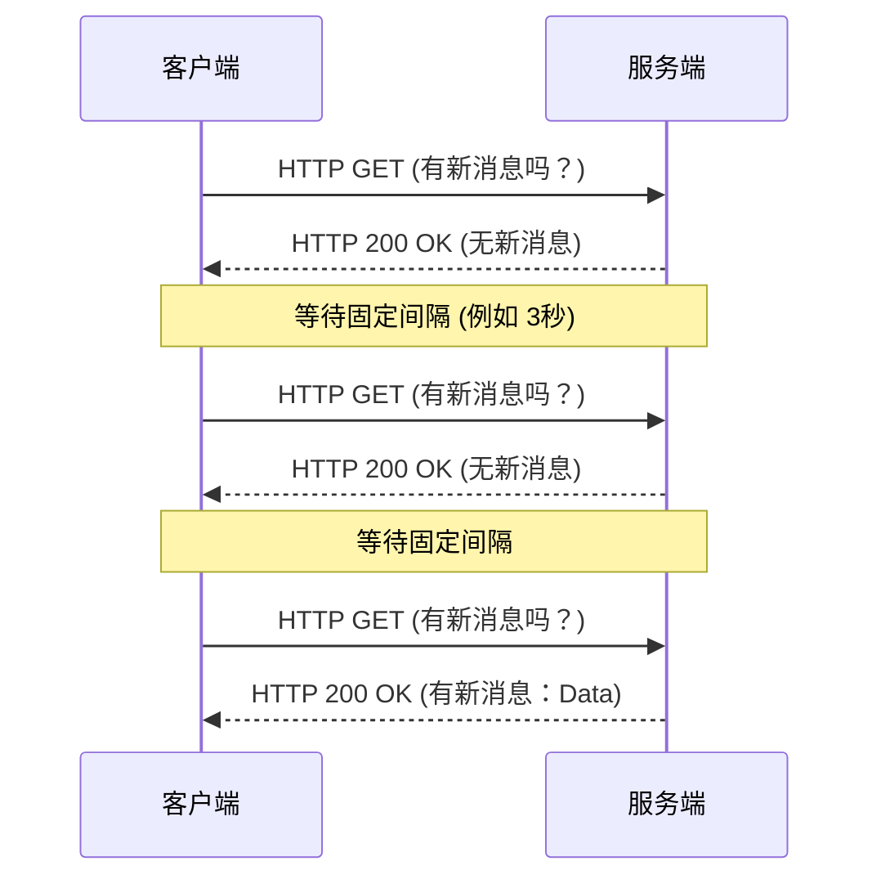
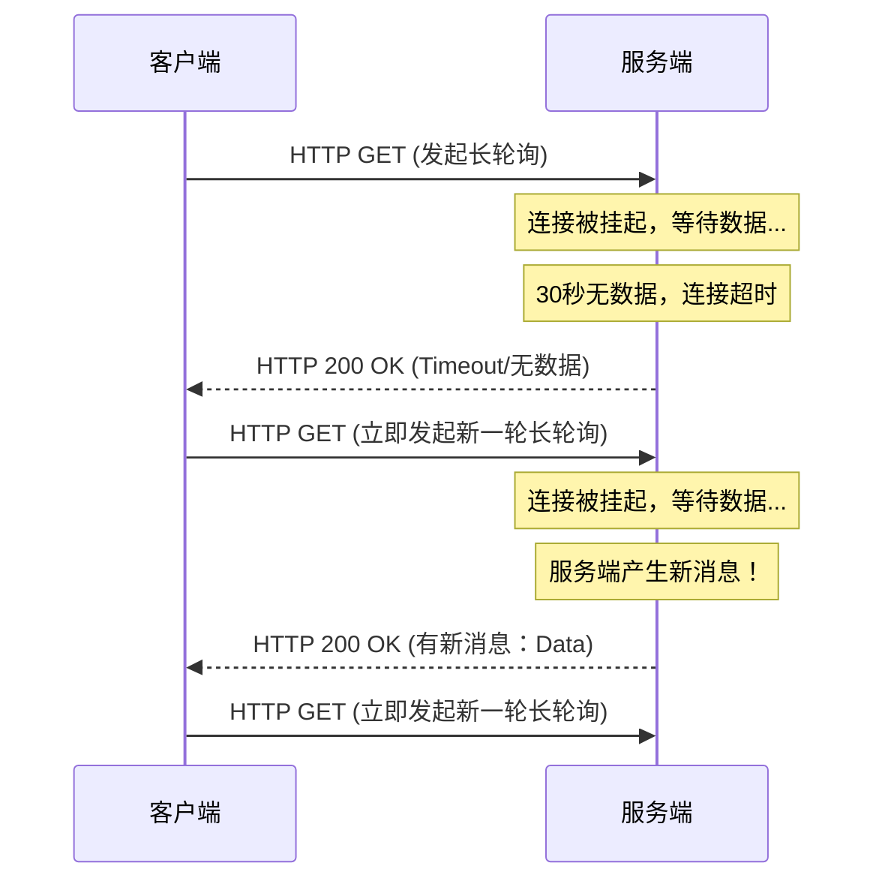
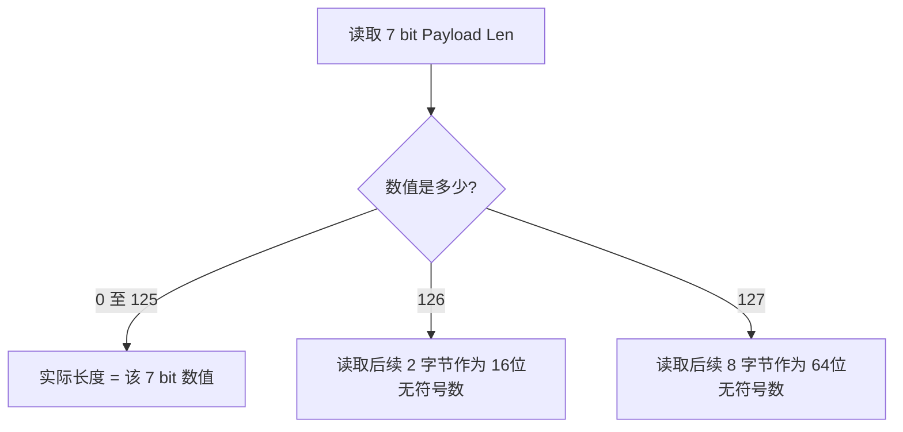
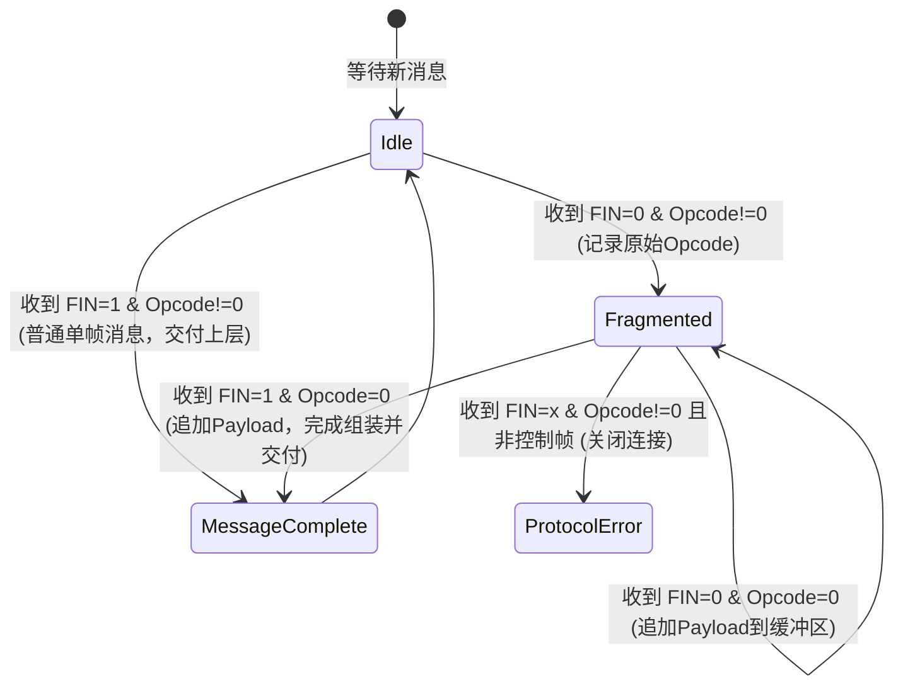
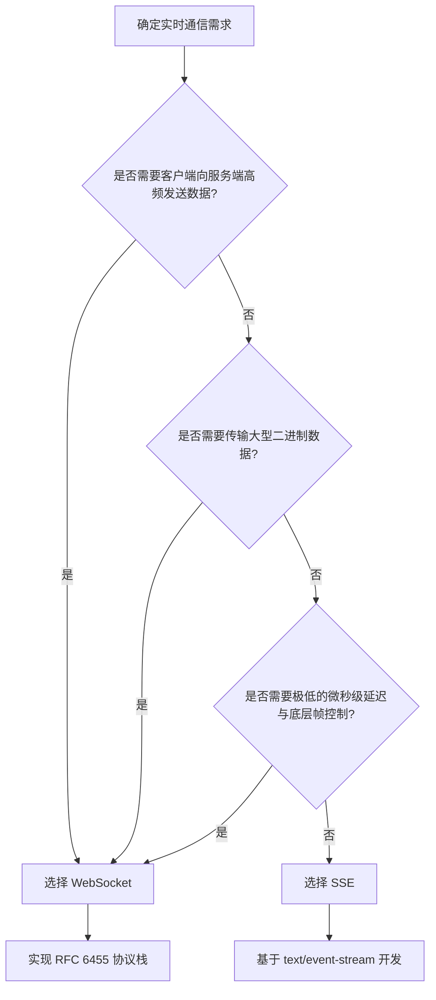

# 1.2.2.7 WebSocket

## 1. 实时通信的演进背景与传统方案的局限性

在互联网发展的早期，Web 的基本模型是基于 **请求-响应（Request-Response）** 的单向拉取范式。这种模型完全由客户端发起请求，服务端被动接受并返回数据。然而，随着富互联网应用（RIA）的兴起，用户对于实时互动的需求呈现爆发式增长，例如在线协同编辑、股票实时行情、即时通讯（IM）以及多人在线游戏等。在这些场景中，服务端需要能够主动、低延迟地向客户端推送数据。

由于早期的 HTTP 协议（主要是 HTTP/1.0 和 HTTP/1.1）本身是无状态、单向且半双工的，开发者为了在 Web 浏览器上实现“准实时”或“实时”的数据推送，不得不妥协性地采用了各种变通方案。这些方案在解决特定历史时期问题的同时，也暴露出了严重的设计局限。

### 1.1 短轮询（Short Polling）

短轮询是最直观、最简单的实时通信方案。其基本原理是利用浏览器的定时器（如 JavaScript 的 `setInterval`），以固定的时间间隔（通常为数秒）向服务器发送标准的 HTTP 请求，以查询是否有最新的数据更新。



#### 短轮询的局限性与开销分析
1. **巨大的带宽与报头开销**：每一次 HTTP 请求都需要携带大量的 HTTP 报头信息（如 `User-Agent`、`Cookie`、`Accept-Language`、`Cache-Control` 等），这些首部开销通常在 500 字节到 2 KB 不等。如果服务器没有新数据（在大多数轮询请求中都是如此），返回的空响应依然包含数百字节的响应报头。这种高频发送的“无用数据包”浪费了大量的网络带宽。
2. **高延迟**：实时性在物理上限上受限于轮询的频率。如果轮询间隔是 3 秒，那么最坏情况下，一条新消息在服务端产生后，需要等待近 3 秒才能被客户端获取。
3. **服务端性能瓶颈**：高频的并发连接请求会对 Web 服务器产生巨大的瞬时压力。每一次连接的建立（即使启用了 HTTP Keep-Alive）、HTTP 协议栈的解析、业务逻辑的查库操作，都会消耗大量的服务器 CPU 资源和线程资源。

### 1.2 长轮询（Long Polling / Comet）

为了克服短轮询中大量无用请求导致的带宽浪费，长轮询技术（以 Comet 架构为代表）应运而生。在长轮询中，客户端向服务器发送一个 HTTP 请求，服务器接收到请求后，**并不立即返回响应**。相反，服务器会将该请求“挂起”（Hang Connection），保持连接处于打开状态。

* 当服务器有新数据产生时，立即将数据作为响应返回给客户端，并关闭（或复用）该连接。
* 如果在指定的超时时间（例如 30 秒）内依然没有数据产生，服务器会向客户端返回一个超时响应。
* 客户端收到响应（无论是真实数据还是超时响应）后，立即向服务器发起下一个长轮询请求，开始新一轮的等待。



#### 长轮询的局限性与工程挑战
1. **连接假死与空窗期消息延迟**：长轮询并不是真正的全双工通道。在客户端接收到上一次请求的响应，到它重新发起并建立起下一次长轮询连接之间，存在一个短暂的时间窗口，称为“**通信空窗期**”。如果在这个空窗期内服务器产生了新数据，服务器无法主动将其推送给客户端，必须等待客户端的新连接请求到达。这不仅增加了延迟，还需要服务端在内存中维护消息队列进行补偿，增加了系统设计的复杂度。
2. **服务端资源的大量占用（挂起连接）**：在传统的多线程或多进程 Web 服务器架构中，每一个被挂起的长轮询连接都需要占用一个独立的系统线程。如果在线用户量达到数万，服务器会迅速因为线程池耗尽、内存溢出（OOM）而瘫痪。虽然现代非阻塞 I/O（如基于 epoll/kqueue 的事件驱动模型）缓解了线程耗尽问题，但大量长连接占用的文件描述符（FD）和内核缓冲区依然是一笔巨大的开销。
3. **频繁的连接重建开销**：只要有数据交互，连接就会被断开并重新建立。这意味着网络链路上需要频繁地进行 TCP 三次握手和 TLS 握手，产生大量的网络往返延迟（RTT）。

### 1.3 服务器发送事件（SSE, Server-Sent Events）

SSE 是 HTML5 标准的一部分，它提供了一种基于标准 HTTP 协议的、从服务器向客户端进行单向文本流式推送的机制。

客户端通过 JavaScript 的 `EventSource` 接口向服务端发起 HTTP 请求，服务端在响应头中指定 `Content-Type: text/event-stream`、`Cache-Control: no-cache` 和 `Connection: keep-alive`。随后，服务端不关闭该连接，而是以一种特定的、以换行符分隔的纯文本格式（如 `data: hello\n\n`）持续不断地向客户端追加写入数据。

#### SSE 的优势
* **轻量级且基于标准 HTTP**：不需要额外的协议转换，对现有的 HTTP 负载均衡器、反向代理（如 Nginx）和防火墙极其友好。
* **原生支持重连**：`EventSource` 规范要求客户端在连接意外断开时自动进行指数退避重连，并在重连请求中自动携带 `Last-Event-ID` 头部，以便服务器进行增量数据补偿。
* **支持自定义事件**：可以通过指定 `event: event_name` 来区分不同类型的数据流。

#### SSE 的核心局限性
1. **仅支持单向通信（Server-to-Client）**：SSE 是一条“单行道”。客户端如果需要向服务端发送数据，必须脱离当前的 SSE 通道，另外发起独立的 HTTP POST 或 PUT 请求。这在需要频繁双向低延迟交互的场景（如协同绘图、即时聊天）中显得极度低效。
2. **连接数受浏览器同源限制**：在不使用 HTTP/2 的情况下，浏览器对同一个域名下的并发 HTTP 连接数有限制（通常为 6 个）。如果一个用户在浏览器中打开了多个标签页，并且都通过 SSE 连接到同一个域，很容易耗尽并发连接上限，导致其他页面请求被挂起。而在 HTTP/2 下，由于多路复用技术，这一限制得到了缓解。
3. **数据格式受限**：SSE 协议标准仅支持传输 UTF-8 编码的文本字符流。如果需要传输图片、音频等二进制数据，必须将其进行 Base64 编码，这会增加约 33% 的带宽开销和额外的 CPU 编解码计算负担。

### 1.4 传统方案与 WebSocket 的多维度对比

为了更直观地理解这些协议与技术的差异，下表从多个技术维度对它们进行了对比：

| 维度 | 短轮询 (Short Polling) | 长轮询 (Long Polling) | SSE (Server-Sent Events) | WebSocket |
| :--- | :--- | :--- | :--- | :--- |
| **协议标准** | HTTP/1.0 或 HTTP/1.1 | HTTP/1.1 | HTTP/1.1 或 HTTP/2 | RFC 6455 |
| **通信方向** | 双向 (通过频繁请求/响应模拟) | 双向 (通过连接重建模拟) | 单向 (服务端 $\rightarrow$ 客户端) | **双向全双工** |
| **连接复用** | 频繁建立和关闭连接 | 频繁建立和关闭连接 | 保持单条 HTTP 持续连接 | **单条 TCP 连接长期复用** |
| **首部开销** | 极高 (每次往返都包含完整 HTTP 头) | 极高 (每次往返都包含完整 HTTP 头) | 中等 (仅建立连接时有 HTTP 头) | **极低 (握手后帧首部仅 2~10 字节)** |
| **实时性延迟**| 高 (受限于轮询的时间间隔) | 较低 (但有连接重建导致的延迟) | 低 (服务器数据产生即推送) | **极低 (微秒级应用层处理延迟)** |
| **数据格式** | 文本或二进制 (依赖 HTTP Content-Type) | 文本或二进制 (依赖 HTTP Content-Type) | **仅限 UTF-8 文本** | **原生支持文本和二进制** |
| **网络穿透性**| 极佳 (标准 HTTP 流量) | 极佳 (标准 HTTP 流量) | 极佳 (标准 HTTP 流量) | 较好 (通过 HTTP/1.1 Upgrade 握手) |
| **应用层心跳**| 无需 (由客户端周期性请求维持) | 无需 (由客户端周期性请求维持) | 较弱 (依赖浏览器底层的重连) | **原生支持 (Ping/Pong 帧控制)** |

### 1.5 WebSocket 的核心价值

WebSocket 协议（RFC 6455）彻底打破了 HTTP “请求-响应”的桎梏，在应用层建立了一套真正的**全双工（Full-Duplex）**通信信道。

1. **单一 TCP 连接上的双向异步通信**：一旦连接建立，客户端和服务端可以在任何时间独立地向对方发送数据，无需等待对方的确认或回应。
2. **极轻量级的协议开销**：WebSocket 抛弃了繁重的 HTTP 首部。在数据传输阶段，数据被封装在极其紧凑的“帧（Frame）”中。对于不需要掩码的服务器帧，其最小首部开销仅为 2 字节；对于需要掩码的客户端帧，其首部开销通常也只有 6 或 8 字节。这使得它在传输小包数据时具有无可比拟的带宽优势。
3. **状态保持**：它是一个有状态的协议。在连接建立后，底层 TCP 连接始终保持，服务器可以轻松地维持用户的会话上下文，免去了每次请求都需要重新读取 Session 或解析 JWT Token 的开销。

---

## 2. WebSocket 握手与协议升级的底层细节

WebSocket 协议并不是一个完全独立于 HTTP 的崭新协议，它的设计初衷是与现有的 Web 生态平滑整合。为此，WebSocket 在建立连接时，借用了 HTTP/1.1 的 **Upgrade（协议升级）** 机制。这意味着 WebSocket 的初始握手请求是一个看似普通的 HTTP GET 请求，通过 80 端口（针对非加密的 `ws://`）或 443 端口（针对加密的 `wss://`）发送。

这种设计使得 WebSocket 能够轻松穿透大多数只允许 80/443 端口流量通过的企业防火墙和代理服务器，并在握手成功后瞬间转换为自定义的二进制帧协议。

### 2.1 握手协商过程详解

#### 2.1.1 客户端握手请求 (HTTP GET)
当客户端（如浏览器）尝试建立 WebSocket 连接时，它会向服务端发起一个带有特殊报头的 HTTP GET 请求：

```http
GET /chat?room=101 HTTP/1.1
Host: server.example.com
Upgrade: websocket
Connection: Upgrade
Sec-WebSocket-Key: dGhlIHNhbXBsZSBub25jZQ==
Origin: http://example.com
Sec-WebSocket-Protocol: chat, superchat
Sec-WebSocket-Version: 13
```

**关键字段原理解析：**
* **`Upgrade: websocket`**：这是核心请求头。它明确告诉服务器，客户端希望将当前连接的协议升级为 `websocket`。
* **`Connection: Upgrade`**：配合 `Upgrade` 字段使用。它是一个 Hop-by-Hop（逐跳）首部，指示当前的 TCP 连接不能在当前请求结束后关闭，而应当转为升级后的协议。同时，它指示中间代理服务器将该请求继续转发，而不要拦截。
* **`Sec-WebSocket-Key`**：一个由客户端随机生成的 16 字节的安全挑战密钥，经过 Base64 编码后形成 24 字符的字符串（例如上面的 `dGhlIHNhbXBsZSBub25jZQ==`）。这个 Key 的生成和后续的计算是防范旧版代理缓存污染的核心。
* **`Origin`**：浏览器在发起 WebSocket 请求时，会由用户代理（User Agent）强制自动加上这个字段，代表发起该连接的源网页域名。该字段对于服务器防御跨站 WebSocket 劫持（CSWSH）至关重要。
* **`Sec-WebSocket-Version`**：指定 WebSocket 的协议版本。RFC 6455 规定的标准版本号为 `13`。如果服务器不支持该版本，会在返回的错误响应中通过 `Sec-WebSocket-Version` 指示其支持的版本列表。
* **`Sec-WebSocket-Protocol`**（可选）：用于协商应用层的子协议。客户端列出自己支持的子协议（如 `chat`、`superchat`），服务器可以从中选择一个作为后续通信的应用层协议规范。

#### 2.1.2 服务端握手响应 (101 Switching Protocols)
如果服务端支持 WebSocket 并接受了该连接，它将返回一个状态码为 `101 Switching Protocols` 的响应：

```http
HTTP/1.1 101 Switching Protocols
Upgrade: websocket
Connection: Upgrade
Sec-WebSocket-Accept: s3pPLMBiTxaQ9kYGzzhZ2kyuJUk=
Sec-WebSocket-Protocol: chat
```

**关键字段原理解析：**
* **`HTTP/1.1 101 Switching Protocols`**：这是状态码的定义。101 状态码明确告知客户端，服务端已经理解并同意了协议升级的请求，后续的 TCP 连接将切换到新的协议运行。
* **`Sec-WebSocket-Accept`**：这是服务端针对客户端发送的 `Sec-WebSocket-Key` 计算出的安全挑战响应值。客户端在收到该值后，会用相同的算法进行校验，只有校验一致，握手才算正式成功。
* **`Sec-WebSocket-Protocol`**：服务端从客户端提供的子协议列表中选择的最终子协议（此处选择了 `chat`）。如果服务端不挑任何协议，则不需要返回此头部。

### 2.2 Sec-WebSocket-Key / Accept 的挑战-响应机制与数学推导

#### 2.2.1 为什么需要挑战-响应机制？
许多人误以为 `Sec-WebSocket-Key` 的主要目的是为了提供数据加密或网络安全防范。**这是一个常见的认知误区。**

其真正的设计意图是为了**防止缓存代理服务器的缓存污染（Cache Poisoning）和误响应**。
在 Web 中存在着大量的透明代理服务器（Transparent Proxy）或反向代理。如果客户端发起了一个普通的 HTTP GET 请求，而某个不支持 WebSocket 协议的代理服务器在中间拦截，它可能会误以为这是一个标准的 HTTP 会话。如果服务端仅仅简单地返回 `HTTP/1.1 200 OK` 或者盲目同意连接，这个代理服务器可能会将这个长连接的响应缓存下来。当后续其他用户请求相同的 URL 时，代理服务器会将该缓存响应直接返回给其他用户，从而导致后续的 Web 通信全面崩溃。

为了防止这种情况发生，RFC 6455 引入了挑战-响应机制。服务端必须证明自己确实“理解”了 WebSocket 协议的特殊规范，而不能仅仅返回一个普通的响应。通过要求服务端对 `Sec-WebSocket-Key` 进行一次特定的、不可伪造的哈希计算，客户端在收到 `Sec-WebSocket-Accept` 后进行验证。如果中间代理服务器试图用缓存的内容或者普通 HTTP 服务器由于配置错误返回 200 响应，其响应中不可能包含正确的 `Sec-WebSocket-Accept`，客户端就会立即断开该连接，从而保证了协议转换的确定性和安全性。

#### 2.2.2 算法计算步骤与公式
`Sec-WebSocket-Accept` 的计算完全公开透明，步骤如下：

1. **获取客户端 Key**：取客户端发来的 `Sec-WebSocket-Key` 字符串（例如：`dGhlIHNhbXBsZSBub25jZQ==`）。
2. **拼接 GUID**：将该字符串与 RFC 6455 规定的全球唯一魔术字符串（GUID）进行直接拼接。该 GUID 为：
   $$\text{GUID} = \text{"258EAFA5-E914-47DA-95CA-C5AB0DC85B11"}$$
   拼接后的临时字符串为：
   $$\text{dGhlIHNhbXBsZSBub25jZQ==258EAFA5-E914-47DA-95CA-C5AB0DC85B11}$$
3. **SHA-1 哈希**：计算上述拼接后字符串的 SHA-1 哈希值。哈希函数的输出是一个固定长度为 20 字节（160 位）的二进制原始数组。
4. **Base64 编码**：对这 20 字节的哈希二进制数据进行标准的 Base64 编码，得到的字符串即为 `Sec-WebSocket-Accept`。

#### 2.2.3 实例数值推导
我们以客户端发送的 Key 值为 `dGhlIHNhbXBsZSBub25jZQ==` 为例进行推导：

1. 拼接后的输入字符串为：
   `dGhlIHNhbXBsZSBub25jZQ==258EAFA5-E914-47DA-95CA-C5AB0DC85B11`
2. 对该 ASCII 字符串进行 SHA-1 运算：
   * 输入的字节序列（十六进制表示）：
     `64 47 68 6c 49 48 4e 68 62 58 42 73 5a 53 42 75 62 32 35 6a 5a 51 3d 3d 32 35 38 45 41 46 41 35 2d 45 39 31 34 2d 34 37 44 41 2d 39 35 43 41 2d 43 35 41 42 30 44 43 38 35 42 31 31`
   * 经过 SHA-1 计算后，输出的 20 字节哈希值（十六进制）：
     `b3 7a 4f 2c c0 62 4f 16 90 f6 46 06 cf 38 59 da 4c ae 25 49`
3. 对这 20 字节的哈希值进行 Base64 编码：
   * `b37a4f2cc0624f1690f64606cf3859da4cae2549` $\xrightarrow{\text{Base64}}$ `s3pPLMBiTxaQ9kYGzzhZ2kyuJUk=`
4. 服务端最终将此结果放入响应头中：
   `Sec-WebSocket-Accept: s3pPLMBiTxaQ9kYGzzhZ2kyuJUk=`

#### 2.2.4 高性能计算实现示例（Go 语言）
在高并发的 WebSocket 网关服务器中，握手是非常频繁的操作。为了避免高频调用导致的内存分配与垃圾回收（GC）压力，可以使用以下优化后的 Go 语言代码来实现该计算：

```go
package handshake

import (
	"crypto/sha1"
	"encoding/base64"
	"sync"
)

// MagicGUID 是 RFC 6455 规定的唯一 GUID
const MagicGUID = "258EAFA5-E914-47DA-95CA-C5AB0DC85B11"

// 使用 sync.Pool 复用 sha1.Hash 对象，避免高并发下频繁创建和销毁 hash.Hash
var sha1Pool = sync.Pool{
	New: func() interface{} {
		return sha1.New()
	},
}

// ComputeAcceptKey 计算 Sec-WebSocket-Accept 响应值
func ComputeAcceptKey(secKey string) string {
	// 1. 从对象池获取 sha1 实例
	h := sha1Pool.Get().(hash.Hash)
	defer func() {
		h.Reset()
		sha1Pool.Put(h)
	}()

	// 2. 拼接数据并写入 hash
	// 避免将 string 转换为 []byte 时的堆内存分配，直接写入 string
	_, _ = h.Write([]byte(secKey))
	_, _ = h.Write([]byte(MagicGUID))

	// 3. 计算 20 字节哈希值
	// 预先在栈上分配 20 字节数组，防止 sum 逃逸到堆上
	var sumBuf [sha1.Size]byte
	sum := h.Sum(sumBuf[:0])

	// 4. Base64 编码
	return base64.StdEncoding.EncodeToString(sum)
}
```

### 2.3 连接状态转换与握手后的协议切换

一旦服务端成功发送了包含 `101 Switching Protocols` 响应首部的最后一个字节，且客户端顺利接收并验证通过，底层的 TCP 连接便完成了状态切换：

1. **释放 HTTP 解析器**：客户端和服务端都将卸载或重定向底层的 HTTP 协议解析状态机。
2. **切换为二进制帧解析模式**：后续所有在该 TCP 通道上流动的数据，都不再包含任何 HTTP 首部或 ASCII 文本，而是严格按照 RFC 6455 规范定义的**二进制数据帧（Frame）**格式进行读取和解析。
3. **有状态的双向流**：该连接的生命周期将持续存在，直到任何一方发送了显式的关闭帧（Close Frame），或者底层 TCP 连接因为超时、断电等原因物理断开。

---

## 3. WebSocket 帧格式精细解析（RFC 6455）

一旦握手完成，数据的传输将以 **帧（Frame）** 为最小单位。WebSocket 的帧结构设计得极其紧凑，旨在以最小的开销承载丰富的数据和控制信息。

### 3.1 二进制帧结构图示与字节偏移

根据 RFC 6455 规范，WebSocket 帧的二进制结构如下所示：

```
  0                   1                   2                   3
  0 1 2 3 4 5 6 7 8 9 0 1 2 3 4 5 6 7 8 9 0 1 2 3 4 5 6 7 8 9 0 1
 +-+-+-+-+-------+-+-------------+-------------------------------+
 |F|R|R|R| opcode|M| Payload len |    Extended payload length    |
 |I|S|S|S|  (4)  |A|     (7)     |             (16/64)           |
 |N|V|V|V|       |S|             |   (if payload len==126/127)   |
 | |1|2|3|       |K|             |                               |
 +-+-+-+-+-------+-+-------------+ - - - - - - - - - - - - - - - +
 |     Extended payload length continued, if payload len == 127  |
 + - - - - - - - - - - - - - - - - - - - - - - - - - - - - - - - +
 |                                                               |
 +-+-+-+-+-------+-+-------------+-------------------------------+
 |                     Masking-key, if MASK == 1                 |
 +-------------------------------+-------------------------------+
 |                           Payload Data                        |
 +-------------------------------- - - - - - - - - - - - - - - - +
 :                     Extension data (if negotiated)            :
 +-------------------------------- - - - - - - - - - - - - - - - +
 :                        Application data                       :
 +---------------------------------------------------------------+
```

### 3.2 帧头部字段详解

我们对每一位（Bit）和每一个字节进行逐一拆解：

#### 3.2.1 FIN (1 bit)
* **位置**：第 0 字节的第 7 位（最高位）。
* **作用**：表示这是否是当前消息的**最后一帧（Final Frame）**。
  * `1`：表示当前帧是该消息的最后一帧。如果消息没有进行分片（Fragmentation），则单帧消息的 `FIN` 必须为 `1`。
  * `0`：表示当前帧只是消息的某一个分片，后续还会有更多的分片帧（Continuation Frame）。

#### 3.2.2 RSV1, RSV2, RSV3 (各 1 bit)
* **位置**：第 0 字节的第 4、5、6 位。
* **作用**：保留位，必须初始化为 `0`，用于未来协议扩展的协商。
  * 如果握手时双方未协商任何扩展协议，但接收端收到了 RSV 字段不为 `0` 的帧，则必须立即关闭当前连接（关闭码 1002 - Protocol Error）。
  * **PMCE（Per-Message Compression Extension）**：最著名的扩展是 `permessage-deflate`。在协商成功后，`RSV1` 通常被用作指示该消息的载荷是否经过了 Deflate 算法压缩（`1` 代表已压缩，`0` 代表未压缩）。

#### 3.2.3 Opcode (4 bits)
* **位置**：第 0 字节的第 0-3 位。
* **作用**：操作码，定义了如何解释 `Payload Data` 的二进制数据。
  * **数据帧（Data Frames）**：
    * `0x0` (Continuation Frame)：连续帧。表示当前帧是分片消息的后续帧，其内容与前一帧属于同一个消息，必须追加重组。
    * `0x1` (Text Frame)：文本帧。其 Payload 载荷必须是使用 UTF-8 编码的文本字符流。
    * `0x2` (Binary Frame)：二进制帧。其 Payload 载荷可以是任意的二进制字节数据。
  * **控制帧（Control Frames）**：
    * `0x8` (Close Frame)：关闭连接控制帧。用于优雅地主动关闭连接。它可以包含可选的 2 字节关闭状态码（如 1000 代表正常关闭）和 UTF-8 编码的关闭原因描述。
    * `0x9` (Ping Frame)：心跳检测帧。
    * `0xA` (Pong Frame)：心跳响应帧。接收端收到 Ping 帧后，必须在第一时间回复对应的 Pong 帧，且 Pong 帧中必须包含与 Ping 帧完全相同的 Payload 数据。
  * **控制帧的重要限制**：控制帧是协议内部进行状态管理的带外数据。为了防止其破坏正常数据流的重组，RFC 6455 规定：**控制帧的 Payload 长度不能超过 125 字节，且绝对不能被分片（即控制帧的 `FIN` 必须为 `1`）**。

#### 3.2.4 MASK (1 bit)
* **位置**：第 1 字节的第 7 位（最高位）。
* **作用**：标识该帧的 Payload Data 是否进行了掩码（Masking）混淆处理。
  * **强制性安全规则**：
    * **客户端发送给服务端的帧，`MASK` 位必须置为 `1`**，并且必须在帧头部携带 4 字节的 `Masking-key`。如果服务端收到一个没有进行掩码的帧（`MASK = 0`），必须立即关闭连接（错误码 1002）。
    * **服务端发送给客户端的帧，`MASK` 位必须置为 `0`**，且不能携带掩码密钥。如果客户端收到一个进行了掩码的帧（`MASK = 1`），也必须立即关闭连接。

#### 3.2.5 Payload Length (7 bits, 7+16 bits, 或 7+64 bits)
* **位置**：第 1 字节的第 0-6 位。
* **作用**：表示载荷的字节长度。由于 7 位最多只能表示 127 不同的数字，WebSocket 采用了一种巧妙的多字节扩展编码机制来支持超大载荷的传输：
  1. **小数据量（<= 125 字节）**：`Payload len` 字段的值在 `0` 到 `125` 之间，它就直接代表载荷的真实字节长度。
  2. **中等数据量（126 到 65,535 字节）**：`Payload len` 字段的值固定为 **`126` (0x7E)**。这指示接收端去读取接下来紧跟的 **2 个字节（16位无符号整数，网络字节序/大端序）** 作为实际的载荷长度。
  3. **大数据量（>= 65,536 字节）**：`Payload len` 字段的值固定为 **`127` (0x7F)**。这指示接收端去读取接下来紧跟的 **8 个字节（64位无符号整数）** 作为实际的载荷长度（其最高位必须为 `0`）。



#### 3.2.6 Masking-Key (0 或 4 bytes)
* **位置**：在 Payload 长度字段之后（如果有扩展长度字段，则在扩展长度字段之后）。
* **作用**：当且仅当 `MASK` 位为 `1` 时存在。它是客户端为该帧随机生成的 4 字节（32位）无偏掩码密钥。

### 3.3 客户端强制掩码的安全设计原理（缓存污染攻击）

很多人经常产生疑惑：**为什么客户端发往服务端必须加掩码，而服务端发往客户端却绝对不能加掩码？**

这主要是为了防止**缓存代理污染（Cache Poisoning / Cache Smuggling）攻击**。

在因特网中，用户的请求常常需要通过多层代理服务器（如公司的透明网关、ISP 的代理缓存、以及公共代理服务器）。一些老旧的或实现不完全的代理服务器，即使客户端发起了协议升级，它们在底层依然试图以普通 HTTP 协议来解析 TCP 连接上的字节流。

#### 攻击原理模拟
假设一个恶意用户试图通过 WebSocket 链接，将某个知名公共脚本文件（例如 `http://cdn.example.com/jquery.js`）替换为恶意木马脚本，来破坏其他用户的浏览器。

1. 恶意用户在一个恶意页面（如 `http://evil.com`）上运行 JavaScript 脚本。该脚本建立了一个通往恶意 WebSocket 服务器（由攻击者控制）的连接：`ws://evil.com/socket`。
2. 如果 WebSocket **没有使用掩码**，恶意网页可以通过该 WebSocket 发送一段**伪装成 HTTP GET 请求**的普通文本帧，其内容看起来如下：
   ```http
   GET /jquery.js HTTP/1.1
   Host: cdn.example.com
   ...
   ```
3. 在这个 TCP 连接经过某个局域网的透明代理服务器时，由于是非加密的 WebSockets 通道，代理服务器通过窥探（Snooping）TCP 流，错误地检测到了一段符合 HTTP GET 规范的文本。
4. 随后，恶意的 WebSocket 服务器配合向客户端返回一个精心构造的“响应”，看起来像是一个合法的 HTTP 响应：
   ```http
   HTTP/1.1 200 OK
   Content-Type: application/javascript
   Cache-Control: public, max-age=31536000
   
   // 这里是恶意木马代码...
   ```
5. 透明代理服务器会被这个假响应欺骗。它会误以为有人发起了一次对 `cdn.example.com/jquery.js` 的请求，并将这个返回的“恶意木马响应”放入自己的本地缓存中。
6. 此后，在该局域网内，任何其他无辜的用户正常访问 `cdn.example.com/jquery.js` 时，代理服务器都会将这个已经中毒的缓存副本直接返回给该用户，造成严重的木马执行和跨站脚本攻击（XSS）。

#### 掩码是如何解决该问题的？
RFC 6455 强制规定，客户端发送的所有帧数据必须使用随机生成的 `Masking-Key` 进行混淆。
* 即使客户端试图发送 `GET /jquery.js...`，由于它必须与随机的 4 字节进行异或操作，发送到 TCP 链路上的字节流会变成一段看起来完全杂乱无章的二进制乱码。
* 随机密钥对于每一个帧都是全新生成的。这意味着即使发送相同的 HTTP GET 报文，每一帧在网络层面上呈现的比特流都是截然不同的。
* 这彻底打破了透明代理服务器在不解密、不深入理解 WebSocket 帧结构的前提下试图对数据流进行 HTTP 解析和预测的可能性，消除了缓存污染隐患。
* 服务端接收到帧后，可以通过已知的 `Masking-Key` 进行反向异或解密得到真实数据。而因为服务端发回客户端的响应本身不会引发代理将“客户端的请求”缓存为恶意代码（因为代理绝不会把服务端返回的内容误解为客户端的 GET 请求），所以服务端的数据包没有必要也不允许加掩码。

### 3.4 掩码异或算法的实现原理与优化

掩码混淆算法使用的是按位**异或（XOR）**运算。其数学原理非常简单，设：
* $D$ 为原始数据的第 $i$ 个字节。
* $M$ 为 4 字节的掩码密钥数组 `Masking-Key[0..3]`。
* $E$ 为转换后的混淆字节。

运算公式为：
$$E_i = D_i \oplus M_{i \pmod 4}$$

利用异或运算的自反性（即 $A \oplus B \oplus B = A$），接收端在收到混淆数据 $E_i$ 后，使用相同的掩码密钥进行二次异或，即可无损还原原始数据：
$$D_i = E_i \oplus M_{i \pmod 4}$$

#### 高性能掩码算法实现
在处理高吞吐量的二进制大文件时，逐字节异或运算会消耗大量的 CPU 时钟周期。由于现代 CPU 支持 32 位和 64 位的字操作，我们可以将 4 字节的掩码平铺为 8 字节（通过循环复制），每次对一个 64 位无符号整数进行一次性异或运算，最后不足 8 字节的尾部数据再采用逐字节异或。这可以利用 CPU 的寄存器级别指令加速。

以下是 Go 语言的高性能异或掩码实现示例：

```go
package mask

import (
	"unsafe"
)

// MaskInPlace 原地进行掩码/反掩码运算
func MaskInPlace(payload []byte, maskKey [4]byte) {
	n := len(payload)
	if n == 0 {
		return
	}

	// 1. 将 4 字节的掩码平铺成 8 字节（64位）的掩码
	var mask64 uint64
	m0 := uint64(maskKey[0])
	m1 := uint64(maskKey[1])
	m2 := uint64(maskKey[2])
	m3 := uint64(maskKey[3])
	
	// 网络大端序排布或主机序排布在异或时完全对称，只要平铺即可
	mask64 = m0 | (m1 << 8) | (m2 << 16) | (m3 << 24) |
		(m0 << 32) | (m1 << 40) | (m2 << 48) | (m3 << 56)

	// 2. 每次处理 8 字节，利用 unsafe 将 slice 转为 uint64 指针
	words := n / 8
	var i int
	if words > 0 {
		// 获取 slice 的底层数组首地址指针
		ptr := (*uint64)(unsafe.Pointer(&payload[0]))
		for i = 0; i < words; i++ {
			// 在该地址偏移处进行 64 位一次性异或
			*(*uint64)(unsafe.Pointer(uintptr(unsafe.Pointer(ptr)) + uintptr(i*8))) ^= mask64
		}
	}

	// 3. 处理最后剩余的少于 8 字节的部分
	for j := words * 8; j < n; j++ {
		payload[j] ^= maskKey[j%4]
	}
}
```

### 3.5 分片（Fragmentation）机制

分片是 WebSocket 协议中极其精妙的设计，它解决了大文件传输阻断和小包低延迟的矛盾。

#### 3.5.1 为什么需要分片？
* **内存占用优化**：在传输一个超大型的数据块（如 100 MB 的文件）时，如果不支持分片，发送端就必须在内存中把这 100 MB 数据打包，并在帧头部将 `Payload len` 设为 100 MB。这要求服务器预先在堆内存中开辟巨大的缓冲区。而有了分片机制，发送端可以采用流式读取，将数据切分成若干个小片（例如每个分片 64 KB），读取一片就打包发送一片，从而极大节约了系统内存。
* **时效性与控制帧的插队**：WebSocket 属于单一 TCP 连接。如果发送端正在发送一个不分片的 100 MB 大帧，由于这个大帧会霸占 TCP 信道很长时间，在此期间，如果客户端想要发送心跳 Ping 帧或关闭连接的 Close 帧，这些控制帧只能在 TCP 缓冲区后面排队等待，无法被及时响应，从而引发连接假死。通过将大帧分片，控制帧可以在两个数据分片帧之间**插入（Interleave）**传输，使协议的带外控制保持极佳的实时响应。

```
TCP 信道流量示意图：
[分片 1 (FIN=0)] --> [心跳 Ping 帧 (插队)] --> [分片 2 (FIN=0)] --> [分片 3 (FIN=1)]
```

#### 3.5.2 分片传输的协议规则
一个完整的分片消息在协议流中表现为：
1. **首帧**：`FIN = 0` 且 `Opcode != 0x0`（必须为文本帧 `0x1` 或二进制帧 `0x2`）。这告诉接收端，一个全新的分片消息开始了。
2. **中间帧**：可能有零个或多个 `FIN = 0` 且 `Opcode = 0x0`（连续帧）的帧。
3. **尾帧**：`FIN = 1` 且 `Opcode = 0x0`（连续帧）的帧。这告诉接收端，当前分片消息的所有片段已发送完毕，可以进行完整重组了。

#### 3.5.3 接收端组装状态机
接收端在处理分片消息时，必须严格维护一个重组状态机。以下是其运行逻辑：



**异常边界与状态机安全防护：**
* **控制帧插队**：在 `Fragmented` 状态下，如果收到 `Opcode` 为 `0x9` (Ping)、`0xA` (Pong) 或 `0x8` (Close) 的帧，接收端必须**立即处理**该控制帧，而绝对不能中断或篡改当前的重组状态。
* **非法数据帧拦截**：在 `Fragmented` 状态下，如果收到了任何 `FIN` 不管为 `0` 还是 `1`，但 `Opcode` 既不为 `0`（连续帧）也不为控制帧的帧，接收端必须立即断开连接（关闭码 1002 - 协议错误）。这防止了发送端发送交叉混乱的数据消息。
* **防内存溢出（OOM）攻击**：恶意客户端可能会发送无限数量的 `FIN=0` 帧，故意不发送 `FIN=1` 帧，以此耗尽服务端的内存重组缓冲区。服务端必须在重组逻辑中加入**最大消息字节数限制（Max Message Size Limit）**。一旦缓冲的数据量超过限制，应立即终止连接。

---

## 4. 心跳保活与连接状态维护机制

由于 WebSocket 连接是长期存在的，如何维护连接的健康状况、及时发现“死连接”（Half-Open Connection）是生产环境中维持高可用性的关键。

### 4.1 四层 TCP KeepAlive 与七层应用层心跳的差异

很多人会问：**TCP 本身就有 KeepAlive 机制，为什么 WebSocket 还需要在应用层设计 Ping/Pong 帧？**

这两者在工作层次和检测维度上有着本质区别。

#### 1. TCP KeepAlive 机制的局限
* **时间粒度过粗**：TCP KeepAlive 默认的闲置检测时间是 2 小时（可以通过系统内核调优缩短，但一般也都在数分钟级以上），这在需要秒级响应的实时应用中无法忍受。
* **无法检测应用层卡死**：TCP KeepAlive 运行在操作系统的传输层。如果服务端的进程因为死锁、垃圾回收时间过长（GC Pause）或死循环导致主线程卡死，无法处理任何新的业务逻辑，但只要其操作系统内核网络协议栈还活着，内核依然会自动回复客户端的 TCP KeepAlive ACK。这就导致客户端误以为连接可用，但实际上服务端已经失去了服务能力。
* **对中转节点无感知**：如果网络路径上的某个 NAT 网关已经丢失了该连接的映射关系，但并没有发送 TCP RST 报文，两端的 TCP 依然会认为连接是 `ESTABLISHED` 的，直到 TCP KeepAlive 的探测包发送并超时。

#### 2. WebSocket 应用层心跳（Ping/Pong 帧）
* **应用级健康检测**：由于 Ping/Pong 帧的解析和处理是由应用程序代码执行的，这不仅验证了网络链路的可达性，还证明了**应用层事件循环（Event Loop）依然活跃且没有被阻塞**。
* **高度的定制性**：心跳频率、超时判断、多次未响应的断连逻辑完全由开发者在代码层面控制，可根据网络状态动态调整。

### 4.2 中间网络设备（NAT/代理）超时与心跳周期设计

在公网环境下，一个 TCP 连接需要经过大量的中间网关和路由器。其中最核心的影响因素是 **NAT（网络地址转换）转换表的老化机制**。

#### 4.2.1 NAT 映射表老化（NAT Timeout）
由于全球 IPv4 地址短缺，绝大多数内网设备访问公网都需要通过 NAT 转换。NAT 网关（如家用路由器、企业网关、运营商的 CGNAT 节点）会在内存中维护一张映射表，将 `内网IP:端口` 映射到 `外网IP:端口`。

因为网关的物理内存资源非常有限，为了防止映射表被撑满，NAT 设备会开启定时清理机制。对于长期没有数据流动（即“静默连接”）的 TCP 映射，网关会在一定时间后将其从表中抹去。不同网关的超时时间不同，移动网络（如 4G/5G 基站）的超时机制通常极具侵略性，有的甚至短至 30 秒到 5 分钟；普通宽带网关通常为 10 到 30 分钟。

一旦 NAT 映射表被清除，外部服务器发送的数据包在到达 NAT 设备时会因为找不到对应内网映射而被丢弃（一般不回送 RST 报文）。客户端与服务端两边都误以为连接还开着，但实际上连接已经进入了“**黑洞状态**”。

#### 4.2.2 反向代理与网关超时
现代架构中，WebSocket 连接的前端通常会部署 Nginx、Kong 或 HAProxy 等反向代理。这些代理服务器都设有长连接读写超时时间（例如 Nginx 的 `proxy_read_timeout` 默认为 60s）。如果在此期间连接上没有任何数据通过，Nginx 会主动切断连接并向两端发送 TCP FIN 报文。

#### 4.2.3 心跳周期与抖动设计
为了对抗 NAT 老化和代理超时，应用层必须周期性地发送心跳帧（Ping），强迫信道产生流量以刷新 NAT 映射表的计时器。

* **建议心跳周期**：一般在 Web 场景中，推荐将心跳发送间隔设计在 **20秒 ~ 45秒** 之间。这既能有效避开大多数 NAT 老化时间，又不会产生过大的网络流量开销。
* **时间对齐与节能**：在需要精细控制电量和射频状态的终端上，心跳周期通常不宜采用绝对的固定间隔，而应结合指数退避或心跳合并算法，防止终端射频芯片被频繁唤醒。

### 4.3 优雅的断线检测与自动重连算法

在网络发生瞬间抖动或切换（如 Wi-Fi 切换到 5G）时，长连接会不可避免地断开。实现一个健壮、优雅的重连机制是维持长连接稳定性的最后一环。

#### 4.3.1 惊群效应（Thundering Herd）与抖动设计
如果某个 WebSocket 服务端拥有 100 万并发用户，当该服务器发生重启或网络闪断时，这 100 万个客户端会在几乎同一时间发现连接断开。如果所有客户端都立即发起重连请求，巨大的瞬时流量会瞬间冲垮网关、认证服务器和数据库。

解决此问题的黄金法则是：**指数退避（Exponential Backoff） + 随机抖动（Jitter）**。

#### 4.3.2 退避与重试机制的数学表达
* 设第 $n$ 次尝试重连的基准等待延迟为 $T_n$。
* $T_{\text{base}}$ 为初始等待延迟（例如 1 秒）。
* $T_{\text{max}}$ 为最大等待延迟（例如 60 秒）。
* $f$ 为指数增长因子（通常取 2）。

基准退避时间计算：
$$T_n = \min(T_{\text{max}}, T_{\text{base}} \times f^n)$$

为了彻底打散重试时间点，必须引入一个随机抖动变量 $\text{Jitter}$（取值在 $0$ 到当前基准延迟的 $20\%$ 之间）：
$$\text{Jitter} = \text{Random}(0, \text{Factor} \times T_n)$$
$$T_{\text{retry}} = T_n + \text{Jitter}$$

#### 4.3.3 重连退避算法的 Go 语言实现

```go
package reconnect

import (
	"math/rand"
	"time"
)

// Backoff 结构体管理重试状态
type Backoff struct {
	BaseDelay time.Duration // 初始延迟
	MaxDelay  time.Duration // 最大延迟
	Factor    float64       // 指数因子
	Jitter    float64       // 随机抖动占比 (例如 0.2 代表 20%)
	attempts  int           // 当前尝试次数
}

// NextDelay 计算下一次重试的等待时间
func (b *Backoff) NextDelay() time.Duration {
	if b.Factor <= 0 {
		b.Factor = 2.0
	}

	// 1. 计算当前的指数退避值
	// Delay = BaseDelay * (Factor ^ attempts)
	delay := float64(b.BaseDelay)
	for i := 0; i < b.attempts && delay < float64(b.MaxDelay); i++ {
		delay *= b.Factor
	}

	if delay > float64(b.MaxDelay) {
		delay = float64(b.MaxDelay)
	}

	// 递增尝试次数
	b.attempts++

	// 2. 加入随机抖动 (Jitter)
	if b.Jitter > 0 {
		maxJitter := b.Jitter * delay
		// 生成 [0, maxJitter) 之间的随机数
		randomJitter := rand.Float64() * maxJitter
		delay += randomJitter
	}

	return time.Duration(delay)
}

// Reset 重置尝试次数，通常在连接建立成功后调用
func (b *Backoff) Reset() {
	b.attempts = 0
}
```

### 4.4 会话恢复（Session Resume）与消息确认（Ack）机制

自动重连仅仅解决了物理连接的恢复问题。在断线重连的过程中，如何保证消息**既不丢失，也不重复**？这必须在应用层引入**消息序列号（Sequence Number）与客户端/服务端 ACK 确认机制**。

#### 1. 双向消息队列缓冲
* 客户端和服务端各自在本地维护两个队列：
  * **发送缓冲区（Send Buffer）**：存储已经发送但尚未收到对方 ACK 确认的消息。
  * **序列号计数器（Sequence Counter）**：为每一条发送的消息分配一个递增的唯一序列号（如 $S_{\text{client}}$ 和 $S_{\text{server}}$）。
* 接收端在收到消息后，并不单纯进行业务处理，还必须记录自己收到的最大连续序列号，并周期性（或随着反向数据）发送一个 ACK 帧（例如 `ACK 42`），表示序列号为 42 及以前的消息均已成功处理。
* 发送端收到 `ACK 42` 后，即可将本地发送缓冲区中序列号 $\le 42$ 的消息安全删除。

#### 2. 会话恢复握手
当底层网络断开，客户端使用指数退避算法重新与服务端建立起一条全新的 WebSocket 连接时，第一步不是进行常规业务通信，而是进行**会话恢复协商（Session Resume Check）**：
* 客户端向服务端发送一条携带其当前会话 ID（Session ID）以及**本地已收到的服务端最大序列号 $R_{\text{client}}$** 的控制消息。
* 服务端收到请求后，根据 Session ID 检索内存中的旧会话。如果会话尚未过期：
  1. 服务端将本地发送缓冲区中所有序列号 $> R_{\text{client}}$ 的消息重新排队发送给客户端。
  2. 服务端告诉客户端它当前已经收到的最大客户端序列号 $R_{\text{server}}$。
  3. 客户端收到服务端的响应后，也将其本地发送缓冲区中所有序列号 $> R_{\text{server}}$ 的消息重发给服务端。
* 通过这种“重连协商-重发”的闭环机制，即使底层 TCP 连接因为网络抖动断开了几十秒，上层业务消息流依然能够做到 100% 不丢不重。

---

## 5. WebSocket 安全机制深度剖析

WebSocket 连接一旦建立，就变成了完全自定义的二进制流通道。由于它绕过了浏览器的许多传统安全沙箱机制，因此在安全性上面临着独特的挑战。

### 5.1 浏览器同源策略（SOP）的限制与跨站 WebSocket 劫持（CSWSH）

这是 Web 安全工程师在使用 WebSocket 时最容易忽视的致命漏洞。

#### 5.1.1 为什么 WebSocket 不受同源策略（SOP）限制？
同源策略（Same-Origin Policy）是浏览器安全的核心机制。在标准的 HTTP 网页中，如果位于 `http://evil.com` 页面上的 JavaScript 试图通过 AJAX (XHR/Fetch) 访问 `http://bank.com/api`，浏览器会由于跨域限制直接拦截该请求（除非 `bank.com` 显式允许了 CORS）。

然而，**同源策略对 WebSocket 并不起作用**。
HTML5 WebSocket 规范在设计时，允许脚本向任何域名发起 WebSocket 握手连接。浏览器允许 `http://evil.com` 上的 JavaScript 直接执行：
```javascript
const socket = new WebSocket('wss://bank.com/ws');
```
这一设计允许了跨域实时流的分发，但如果没有采取防范措施，就会导致 **跨站 WebSocket 劫持（CSWSH - Cross-Site WebSocket Hijacking）**，这本质上是 WebSocket 版本的跨站请求伪造（CSRF）。

#### 5.1.2 CSWSH 的攻击链路与漏洞成因
1. 用户在浏览器中成功登录了合法的网银或企业系统 `bank.com`。由于登录成功，浏览器中种植了属于 `bank.com` 的 Session Cookie 或敏感凭证。
2. 用户在不登出 `bank.com` 的情况下，在同一个浏览器的新标签页中访问了恶意攻击者精心布置的钓鱼网页 `evil.com`。
3. `evil.com` 网页中的恶意脚本立即通过 JavaScript 建立一个到 `wss://bank.com/ws/transfer` 的连接。
4. **关键漏洞点**：由于这是向 `bank.com` 发起的 HTTP GET 握手请求，**浏览器会自动在该请求的 Request Headers 中带上属于 `bank.com` 域下的 Cookie 凭证**。
5. 服务端收到握手请求后，只进行了常规的 Cookie 解析和 Session 验证，发现该 Cookie 确实属于某位合法用户，于是完成了握手，升级为 WebSocket。
6. `evil.com` 上的恶意 JavaScript 此时已经控制了这个已认证的 WebSocket 通道。由于 WebSocket 已经脱离了浏览器的同源安全模型，恶意脚本可以通过 `socket.send()` 以该用户的身份发送任意敏感操作指令（如转账、删除数据），或通过监听 `socket.onmessage()` 窃取服务端持续推送的敏感用户数据。

```
[恶意脚本 (evil.com)] 
       |
       | 1. new WebSocket('wss://bank.com/ws')
       v
  [浏览器 (UA)] ---- 2. 自动附加 bank.com 的 Cookie ----> [服务端 (bank.com)]
       |                                                    |
       |<------------- 3. 握手成功并建立 WebSocket 通道 ------>|
       |
  (恶意网页可以通过该通道，在后台伪造用户操作，窃取敏感推送)
```

#### 5.1.3 防御 CSWSH 的三层防线

##### 第一防线：严格验证 `Origin` 首部（基础防线）
浏览器在发起 WebSocket 握手时，会在 HTTP 头部中强制写入 `Origin` 字段，该字段包含了发起此连接的源网页域名。该字段由浏览器原生控制，页面的 JavaScript 绝对无法篡改或删除。
在服务端，**必须在握手阶段拦截请求并进行 Origin 白名单检验**：

```go
func HandleWebSocketHandshake(w http.ResponseWriter, r *http.Request) {
	origin := r.Header.Get("Origin")
	// 严格校验 Origin 必须属于可信的本站域名
	if !isTrustedOrigin(origin) {
		http.Error(w, "Forbidden", http.StatusForbidden)
		return
	}
	// 继续升级协议...
}
```

##### 第二防线：CSRF Token 校验
由于 Cookie 是浏览器自动携带的，可以在发起 WebSocket 请求时，在 HTTP 握手的 URL 参数或自定义子协议（Subprotocol）中，显式携带一个与用户当前 Session 强绑定的、一次性随机 CSRF Token。
例如：
```javascript
const socket = new WebSocket('wss://bank.com/ws?csrf_token=abc123xyz');
```
服务端在握手时读取参数中的 `csrf_token`，并与服务端的 Session Token 进行对比校验。

##### 第三防线：一过性票据（Ticket）授权机制（黄金工业标准）
这是目前防御 CSWSH 和长连接未授权访问最安全的架构方案。
1. 客户端在发起 WebSocket 连接前，先通过传统的 AJAX (Fetch/XHR) 发送一个普通的 HTTP POST 请求到服务器的授权接口（如 `/api/ws/ticket`）。这个 AJAX 请求由于受同源策略（SOP）限制，`evil.com` 绝对无法伪造或读取其返回结果。
2. 服务器验证用户的登录态，并在内存中（或 Redis 中）生成一个**一次性、生命周期极短（如 10 秒失效）的随机票据 Ticket**，将其与用户 ID 绑定，并作为 AJAX 响应返回给客户端。
3. 客户端获取 Ticket 后，立即发起 WebSocket 握手，并将 Ticket 作为 URL 参数传入：`wss://bank.com/ws?ticket=TICKET_VALUE`。
4. 服务端在握手阶段读取 Ticket，校验其存在性与时效性，提取用户 ID 绑定到连接上下文，并**立即在 Redis 中删除该 Ticket**（保证一过性）。
5. 即使钓鱼网页试图直接连接 WebSocket，由于同源策略阻碍它向 `/api/ws/ticket` 申请合法票据，它将永远无法成功建立长连接。

### 5.2 安全传输通道：WSS (WebSocket Secure)

类似于 HTTPS 相比于 HTTP，**WSS** 代表在 **TLS (Transport Layer Security)** 隧道之上传输的加密 WebSocket 协议。

#### 5.2.1 为什么生产环境必须强推 WSS？
1. **防止数据监听与篡改**：在 WS 协议中，所有的数据（包括被掩码的帧）在网路上都是明文传输的。任何中间网络节点（如公共 Wi-Fi 的提供者、骨干网路由器）都可以轻易嗅探和篡改通信数据。WSS 在传输层对字节流进行了对称加密，保证了机密性和数据完整性。
2. **极大提升网络代理的穿透成功率**：很多企业局域网或公共场所的网关为了进行安全审计，会对 80 端口和非加密流量进行深度包检测（DPI）。如果它们在普通 WS 连接中发现非标准的 HTTP 数据流，会选择直接斩断。如果使用 WSS，其使用的是 443 端口且流量完全经过 TLS 加密。代理服务器由于无法解密 TLS 报文，不得不通过 HTTP `CONNECT` 方法建立一条盲目的 **TCP 隧道**（TLS Pass-through）直接透传流量。这避免了任何中间代理对 WebSocket 帧结构的误判和干扰，使连接成功率趋于 100%。

---

## 6. 技术对比与场景决策

在现代 Web 架构中，实时通信方案除了 WebSocket，还有 HTTP/2 的 Server Push（虽然在 HTTP/3 中已被边缘化）以及传统的 SSE。了解它们的底层能力边界，有助于在架构选型时做出正确的决策。

### 6.1 各协议的底层原理对比

* **HTTP/2 Server Push**：
  * **设计初衷**：旨在加速页面的**资源加载**。当浏览器请求 `index.html` 时，服务端能够预测到浏览器接下来需要 `style.css` 和 `main.js`，于是在浏览器尚未发起请求时，主动将这些静态资源“推”到浏览器的本地高速缓存中。
  * **局限**：它**不是**用于实现应用层双向通信或服务器向运行中的 JS 脚本进行任意数据推送的工具。客户端页面的 JavaScript 无法直接监听或拦截 Server Push 写入的数据流。并且由于其实现的复杂性和高成本，在最新的 HTTP/3 (QUIC) 协议规范中已经被正式废弃。
* **SSE (Server-Sent Events)**：
  * **设计初衷**：轻量级的单向文本事件流。
  * **场景优势**：它完全基于标准 HTTP 协议，完美兼容现有的 HTTP 代理、CDN 和负载均衡器，原生支持重连和事件分发，使用成本极低。
* **WebSocket**：
  * **设计初衷**：提供与底层 TCP 相同的全双工、低延迟二进制信道。

### 6.2 架构决策矩阵：如何选择？

为了帮助系统架构师进行正确的技术选型，我们可以通过以下流程图进行技术路线的抉择：



#### 典型应用场景对照：
1. **即时通信（IM）、在线协同设计（如 Figma、画板）、多人联机游戏、金融高频交易看板**：
   * **决策结果**：**首选 WebSocket (WSS)**。
   * **理由**：这些场景都具有“高频、低延迟、双向对称交互”的特征。客户端需要不断上传鼠标坐标、按键操作或输入文本，而服务端需要即时同步给其他用户，这只有全双工的 WebSocket 能够完美胜任。
2. **股票行情看板（仅刷新）、系统日志实时监控大屏、简单未读消息红点推送、大模型流式字符输出（LLM Streaming Response）**：
   * **决策结果**：**首选 SSE**。
   * **理由**：这些场景的数据流动是单向的（服务器推送给客户端展示）。使用 SSE 相比 WebSocket 更加轻量级，开发成本极低，且能无缝融入现有的 HTTP 安全策略与基础设施中。

---

## 7. 面对海量并发长连接的架构挑战与优化

当 WebSocket 系统需要支撑百万甚至千万级并发长连接时，其架构挑战已不再是单纯的协议解析，而是转向了操作系统、网络协议栈以及应用层内存管理等系统级瓶颈。

### 7.1 操作系统内核调优

在 Linux 操作系统下，每一个 WebSocket 连接在底层都对应着一个 TCP 套接字（Socket）和文件描述符（FD）。默认的系统配置是针对短连接 Web 业务设计的，必须进行专项优化。

#### 7.1.1 提高文件描述符上限
在 `/etc/security/limits.conf` 中，调整进程可打开的 FD 最大数量（`nofile`）：
```text
* soft nofile 1048576
* hard nofile 1048576
```
同时调整系统全局 FD 限制：
```bash
sysctl -w fs.file-max=2097152
```

#### 7.1.2 优化 TCP 缓冲区内存占用
在长连接场景下，如果为每一个 Socket 分配过大的读写缓冲区，百万并发连接会迅速撑爆服务器物理内存。
默认的 Linux TCP 缓冲区可以通过 `sysctl` 调小：
```bash
# 减少 TCP 接收和发送缓冲区的大小（默认、最大），以节省内存
sysctl -w net.ipv4.tcp_rmem="4096 87380 4194304"
sysctl -w net.ipv4.tcp_wmem="4096 16384 4194304"
```
通过将默认读缓冲区设置为 4KB，可以使得单个连接的内存开销降到最小，从而在一台 64GB 内存的服务器上稳定维持百万连接。

### 7.2 应用层非阻塞事件驱动模型（Epoll/Kqueue）

对于传统的同步阻塞 I/O 模型（Thread-per-Connection），维持百万连接需要创建百万个线程。这在任何现代操作系统中都是不可能实现的。

* **Reactor 反应器模式**：必须采用基于 `epoll`（Linux）或 `kqueue`（macOS/BSD）的事件驱动模型。一个或数个 selector 线程通过轮询内核事件，管理数十万个 Socket 的就绪状态。当有读写事件发生时，才将任务分发给 worker 线程池处理，做到零线程浪费。

#### Go 语言中的百万并发优化
虽然 Go 语言的 Goroutine 非常轻量，但每个 Goroutine 至少需要占用 2KB 到 8KB 的栈空间。如果一个连接分配一个 `readLoop` 和一个 `writeLoop` 协程，100 万连接将直接消耗高达 4GB 到 16GB 的内存，这仅仅是协程本身的开销。

在高并发网关设计中，通常需要采用基于 Go 封装的高性能网络库（如 `gnet` 或自定义的 `epoll` 轮询器），使长连接的底层读写事件回归到非阻塞的 `epoll` 事件流，实现 **Zero-Goroutine-per-Connection**。

### 7.3 有状态网关的水平扩展与路由解耦

由于长连接是“有状态”的，客户端物理上必须和某一台特定的网关服务器绑定。这与传统的、可以被任意分发的无状态 HTTP 请求有着本质区别。

#### 7.3.1 解耦架构设计
为了保证系统的横向扩展能力，必须将**长连接维持层（网关层）**与**业务逻辑处理层**进行彻底解耦。


1. **网关集群（Gateway Cluster）**：只负责维护 TCP 长连接、进行 WebSocket 帧的编解码、安全校验，不承载任何复杂的业务逻辑。网关可以根据流量进行简单的水平扩容。
2. **消息路由表（Redis Router）**：当连接建立成功后，网关在 Redis 中注册一条映射关系：`UserID_A -> Gateway_Node_IP_1`。当连接断开时，自动注销该映射。
3. **异步消息总线（MQ）**：
   * 当客户端 A 发送消息给客户端 B 时，网关 1 将该消息序列化，推入消息队列（如 RocketMQ/Kafka）。
   * 业务集群（Biz App）消费该消息，进行鉴权、持久化落库等业务处理。
   * 处理完毕后，业务服务查询 Redis 路由表，得知用户 B 的物理连接当前正维持在网关 2 上。
   * 业务服务向网关 2 发起 RPC 调用或广播，指示网关 2 将消息推送给用户 B。

这种分层架构保证了当业务逻辑变更时，完全不需要断开或干扰网关层数以百万计的稳定长连接，极大地提升了系统的工程健壮性与可维护性。

