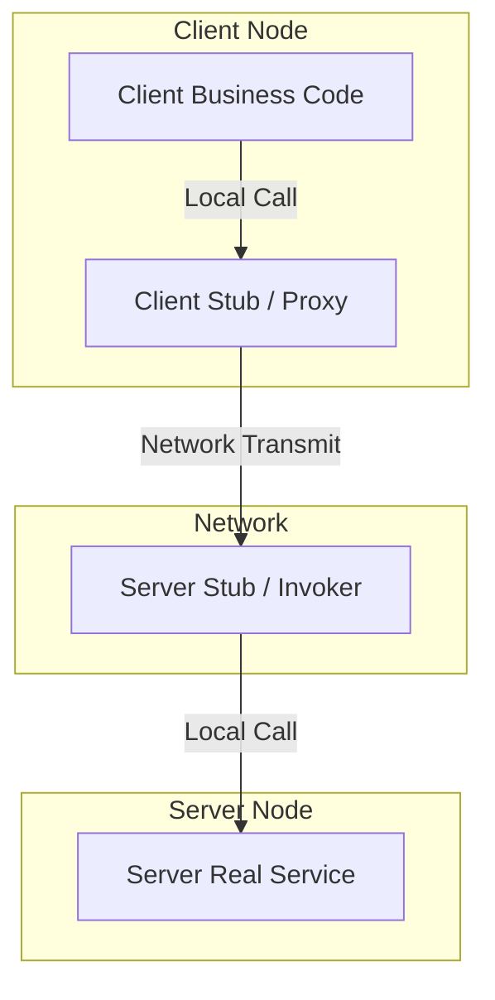
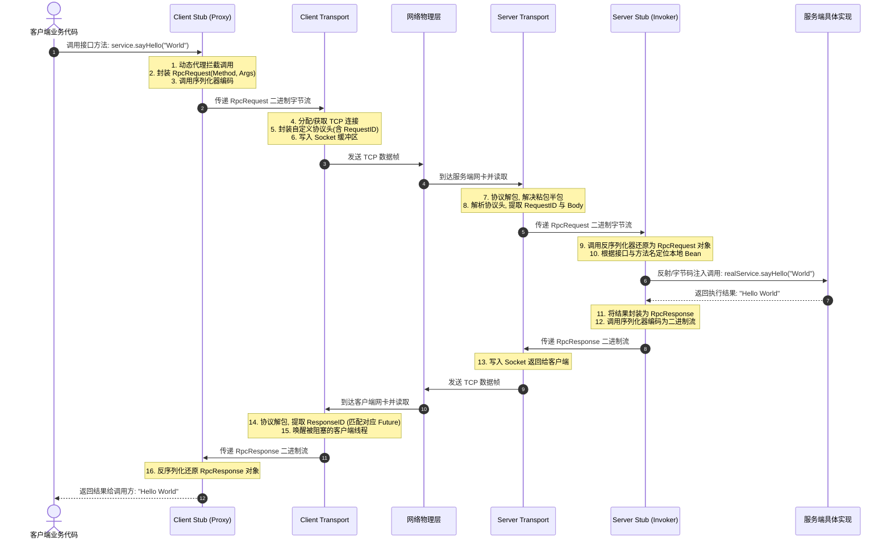

# 1.2.2.8 RPC

远程过程调用（RPC, Remote Procedure Call）是分布式系统架构中最为基石的技术之一。在单体应用向微服务架构演进的过程中，网络通信的复杂性呈指数级上升。RPC 的核心使命在于：通过抽象与封装，使得跨越物理机器、跨越操作系统的网络调用，在业务开发者眼中能够像调用本地函数一样简单、直观且安全。

然而，网络是不可靠的，物理地址空间是绝对隔离的。为了实现“让远程调用像本地调用一样简单”这一愿景，RPC 框架在底层必须解决序列化、网络 I/O、协议设计、服务寻址、负载均衡以及容错熔断等一系列极端复杂的计算机系统问题。本文将从底层的计算机系统原理出发，深入剖析 RPC 的核心架构、通信机制与服务治理原理。

---

## 1. RPC 核心概念与设计初衷

### 1.1 什么是 RPC，为什么需要它

在单体架构中，一个模块调用另一个模块的功能，是通过**本地过程调用（Local Procedure Call, LPC）**实现的。在物理层面上，本地调用的本质是：
1. **调用栈帧分配**：CPU 根据调用约定（如 `cdecl` 或 `stdcall`），将参数压入当前线程的调用栈，或者直接写入特定的 CPU 寄存器（如 `rdi`, `rsi`, `rdx`）。
2. **控制权转移**：CPU 执行 `CALL` 指令，将程序计数器（PC）修改为目标函数的内存首地址，跳转执行。
3. **栈帧销毁与返回**：函数执行完毕后，将返回值放入累加寄存器（如 `rax`），清理栈帧，执行 `RET` 指令返回原执行流。

本地调用发生在一套统一的虚拟地址空间内，其时延在纳秒（ns）级别，且由于内存物理特性的保护，这种调用是 100% 可靠的（除非发生硬件故障或内存溢出）。

然而，在分布式微服务架构下，不同的服务部署在不同的物理机器、甚至不同的数据中心上。它们拥有完全独立的操作系统、独立的 CPU 调度以及完全隔离的虚拟地址空间。在这样的物理现实下，本地调用直接失效，因为你无法在机器 A 的进程中直接跳转到机器 B 的内存地址。

此时，我们需要通过网络来传递调用的意图和数据。如果让开发者直接编写底层的 Socket 编程代码，不仅需要处理极其繁琐的 TCP 连接管理、套接字读写，还需要手动处理网络字节序转换、粘包半包、数据序列化以及丢包重传等网络细节。这会导致业务代码中充斥着大量的网络通信样板代码，严重降低了开发效率。

**RPC 的设计初衷，就是为了在分布式系统中隐去网络通信的物理细节，提供一种透明的、结构化的远程调用抽象。** 它使得开发者只需定义好接口契约，就可以像调用本地方法一样调用远程服务，而底层的网络传输、对象转换和错误处理全部由 RPC 框架代劳。



---

### 1.2 RPC 与 HTTP/RESTful 的深层对比

在现代微服务生态中，HTTP/RESTful（基于 JSON）与 RPC 是最常见的两种通信范式。许多开发者常常产生疑惑：既然 HTTP 已经能够实现跨网络的接口调用，为什么还需要专门的 RPC 框架？这两者在底层设计和应用场景上有什么深层次的区别？

我们可以从传输效率、契约耦合度、网络开销和适用场景等四个维度进行深度剖析。

#### 1.2.1 传输效率与网络开销

*   **HTTP/RESTful**：传统的 RESTful API 通常基于 HTTP/1.1 协议。HTTP/1.1 是一个无状态的、基于 ASCII 文本的协议。其网络开销极大，主要表现在：
    *   **冗余的 Header**：每一次 HTTP 请求都需要携带大量的文本头信息（如 `User-Agent`, `Accept`, `Connection: keep-alive`, `Host` 等），这些 Header 往往占用数百字节甚至数 KB，而实际携带的 Payload（业务数据）可能只有几十字节。
    *   **文本序列化开销**：RESTful 默认使用 JSON 或 XML 作为数据传输格式。JSON 同样是基于 ASCII 文本的，它包含大量的双引号、冒号、花括号等字符，冗余度高，占用大量的网络带宽。同时，文本的反序列化需要进行大量的字符串解析与类型转换，这属于 CPU 密集型操作，吞吐量较低。
*   **RPC**：RPC 框架通常基于自定义的 TCP 协议，或者基于 HTTP/2 协议（如 gRPC）。
    *   **极致压缩的协议头**：RPC 自定义协议头通常是二进制格式，长度固定且极小（通常只有 16 字节左右），仅包含魔法数、序列化类型、消息体长度和请求 ID 等关键元数据，没有任何多余的文本字符。
    *   **高效二进制序列化**：RPC 采用 Protobuf、Thrift、Hessian 等高效的二进制序列化协议，将对象直接编码为紧凑的二进制字节流，省去了字段名等大量冗余元数据，体积比 JSON 小数倍，且编解码速度快一个数量级。

#### 1.2.2 契约耦合度与强类型约束

*   **HTTP/RESTful**：HTTP 是一种**弱契约**的通信方式。虽然业界会使用 Swagger/OpenAPI 来描述接口，但这属于非强制的外部文档说明。在编译期，客户端和服务器不需要共享任何代码或接口定义。这种松耦合在跨组织、跨厂商的 API 开放中是极大的优势，但在企业内部微服务协作中却埋下了隐患。一旦服务端修改了字段类型或删除了某个接口，客户端在编译期无法感知，只有在运行期发生调用时才会抛出反序列化异常或 404 错误。
*   **RPC**：RPC 是一种**强契约**的通信方式。它通常采用 IDL（Interface Definition Language，接口定义语言，如 Protobuf 的 `.proto` 文件，Thrift 的 `.thrift` 文件）来定义接口和数据结构。
    *   **编译期校验**：开发者必须先编写 IDL 文件，然后通过编译器生成对应语言的客户端 Stub 和服务端 Skeleton 代码。客户端只能调用 Stub 中生成好的、类型安全的方法。任何契约的修改都会在编译阶段被拦截，消除了由于接口变更导致的运行期低级错误。

#### 1.2.3 网络连接与传输协议

*   **HTTP/RESTful**：传统的 HTTP/1.1 虽然支持持久连接（Persistent Connection），但其底层依旧是一问一答的半双工模式。在同一个 TCP 连接上，前一个请求的响应没有返回之前，后一个请求无法发送，这就是著名的**队头阻塞（Head-of-Line Blocking）**问题。为了解决并发问题，客户端不得不建立庞大的 TCP 连接池，导致服务器需要维持大量的套接字描述符，消耗了大量的内核内存。
*   **RPC**：RPC 框架（如 gRPC 基于 HTTP/2，Dubbo 基于自定义 TCP 协议）底层普遍采用**多路复用（Multiplexing）**技术。客户端和服务器之间通常只需要建立一个或少数几个长连接，所有的并发请求和响应都可以无序地、并发地运行在这同一个 TCP 连接上。客户端通过请求 ID（Request ID）来匹配对应的响应，彻底消除了队头阻塞，极大地节省了系统套接字资源。

#### 1.2.4 典型对比汇总表

| 维度 | HTTP/RESTful | RPC |
| :--- | :--- | :--- |
| **传输协议** | HTTP/1.1 或 HTTP/2 (主要是文本传输) | 自定义 TCP 协议，或 HTTP/2 (纯二进制流) |
| **序列化格式** | JSON, XML (文本，可读性好但体积大) | Protobuf, Thrift, Hessian (二进制，体积小) |
| **通信模式** | 单向请求-响应 (半双工) | 双向流式、多路复用 (全双工) |
| **契约机制** | 弱契约 (OpenAPI / 运行时校验) | 强契约 (IDL 编译期强类型绑定) |
| **网络开销** | 报头大，包含大量 ASCII 文本，带宽高 | 报头极其紧凑，通常为固定 10-20 字节二进制 |
| **适用场景** | 跨防火墙、面向外部异构系统、公共 API 开放 | 内部微服务高并发、低时延的节点间通信 |

---

## 2. RPC 核心架构组件与交互时序

要让远程过程调用在体验上如同本地调用，RPC 框架必须在客户端与服务端之间构建一套严密的代理、编解码与网络传输机制。

### 2.1 核心组件分工

一个完整的 RPC 框架，主要由以下五个核心组件构成：

1.  **Client (Business Code)**：发起 RPC 调用的业务代码。业务方只需通过依赖注入或工厂模式获取服务接口的代理对象，直接调用其方法。
2.  **Client Stub (客户端存根/代理)**：运行在客户端的代理模块。它的职责是拦截业务代码的方法调用，将方法签名、参数列表封装成一个统一的请求对象（Request），并交给序列化模块。
3.  **Serializer / Deserializer (序列化/反序列化器)**：
    *   在发送端（客户端请求/服务端响应），将内存中的强类型对象扁平化转换为无损的二进制字节流。
    *   在接收端（服务端请求/客户端响应），将二进制字节流还原为内存中的强类型对象。
4.  **Transport (网络传输模块)**：负责底层的网络通信。
    *   **Client Transport**：负责将序列化后的 Request 字节流写入网络 Socket，发送给服务端；并监听网络事件，接收响应字节流。
    *   **Server Transport**：在服务端监听特定端口，接收客户端的 TCP 连接与请求字节流；并在处理完毕后将 Response 字节流写回 Socket。
5.  **Server Stub / Invoker (服务端存根/调用器)**：运行在服务端的反射分发模块。它接收反序列化后的 Request 对象，解析出目标接口、方法名及参数，定位到服务端本地的具体服务实现类（Real Service），通过反射或字节码注入的方式执行本地调用，并将执行结果封装为 Response 对象。

---

### 2.2 完整的调用流转时序

下面的时序图详细展示了一次 RPC 调用从客户端发起，到网络传输，再到服务端执行并最终返回结果的完整生命周期：



---

### 2.3 动态代理在客户端 Stub 中的工作机制

在编写客户端代码时，我们手中只有服务端的**接口声明（Interface）**，并没有具体的**实现类（Implementation Class）**。那么，当我们执行 `service.sayHello("World")` 时，这段代码究竟是如何运转起来的？

这就必须依赖**动态代理（Dynamic Proxy）**技术。动态代理的本质是在程序运行期间，由 JVM 直接在内存中动态生成目标接口的实现类字节码，并实例化该对象。RPC 框架利用动态代理，将网络通信的一切脏活累活全部隐藏在代理类内部。

#### 2.3.1 常见动态代理技术剖析

在 Java 生态中，主流的动态代理技术有以下几种：

1.  **JDK 动态代理**：
    *   **原理**：基于接口的动态代理。利用 `java.lang.reflect.Proxy` 和 `java.lang.reflect.InvocationHandler`。在运行期，JVM 会读取目标接口的信息，在内存中动态生成一个名为 `$Proxy0` 的类字节码，该类继承自 `Proxy` 并实现了目标接口。
    *   **限制**：目标类必须实现至少一个接口。如果服务没有定义接口，JDK 代理将无法工作。
2.  **CGLIB / Javassist**：
    *   **原理**：基于继承的动态代理。CGLIB 底层利用 ASM（字节码操纵框架），通过直接修改和生成字节码，在运行期动态生成目标类的一个**子类**，并重写父类的方法。通过 `MethodInterceptor` 拦截父类所有方法的调用。
    *   **限制**：如果目标类或目标方法被标记为 `final`，则无法被继承或重写，CGLIB 将失效。
3.  **ByteBuddy**：
    *   **原理**：现代高性能字节码生成库，是目前 Dubbo 等前沿框架首选的代理技术。它比 CGLIB 更轻量，提供了极其优雅的流式 API，可以直接生成不依赖反射调用的字节码。

#### 2.3.2 动态代理的原理差异与性能对比

JDK 动态代理和 CGLIB 在早期版本中存在明显的性能差距：早期 JDK 动态代理在执行代理方法时，需要通过反射机制（`Method.invoke`）来寻找并执行目标方法，反射在 JVM 中存在较大的性能开销（如安全检查、参数装箱拆箱、方法表查找等）；而 CGLIB 通过 **FastClass** 机制（为代理类和被代理类各生成一个类，该类会为每一个方法分配一个索引，调用时直接根据索引通过 `switch-case` 调用目标方法），避免了反射开销。

在现代 JVM（Java 8 及以后）中，JDK 动态代理得到了极大的优化（引入了虚拟机层面的优化和内联），其字节码生成速度和运行效率已经与 CGLIB 持平，甚至由于其更加轻量而略占优势。但在 RPC 框架的客户端 Stub 中，为了追求极致性能，**Javassist** 和 **ByteBuddy** 得到了广泛应用。它们允许直接以编程方式拼接生成接近手写代码的代理类字节码，完全摒弃了运行期的反射逻辑。

#### 2.3.3 客户端 Stub 动态代理的具体实现示例

为了讲透其工作机制，以下展示一个基于 JDK 动态代理实现的简易 RPC 客户端 Stub 代理处理器。它将本地的方法调用转换为了网络请求：

```java
import java.lang.reflect.InvocationHandler;
import java.lang.reflect.Method;
import java.lang.reflect.Proxy;
import java.util.UUID;

// 1. 定义 RPC 请求传输载体
class RpcRequest implements java.io.Serializable {
    private String requestId;
    private String className;
    private String methodName;
    private Class<?>[] parameterTypes;
    private Object[] parameters;

    // Getter, Setter, Constructor...
    public RpcRequest(String className, String methodName, Class<?>[] parameterTypes, Object[] parameters) {
        this.requestId = UUID.randomUUID().toString();
        this.className = className;
        this.methodName = methodName;
        this.parameterTypes = parameterTypes;
        this.parameters = parameters;
    }
    public String getRequestId() { return requestId; }
}

// 2. 客户端动态代理处理器
public class RpcClientProxy implements InvocationHandler {

    @SuppressWarnings("unchecked")
    public static <T> T createProxy(Class<T> interfaceClass) {
        // 创建并返回动态生成的代理对象
        return (T) Proxy.newProxyInstance(
                interfaceClass.getClassLoader(),
                new Class<?>[]{interfaceClass},
                new RpcClientProxy()
        );
    }

    @Override
    public Object invoke(Object proxy, Method method, Object[] args) throws Throwable {
        // 过滤 Object 的基础方法（如 toString, hashCode, equals）
        if (Object.class.equals(method.getDeclaringClass())) {
            return method.invoke(this, args);
        }

        // 1. 将本地方法调用转化为 RpcRequest 对象（契约封装）
        RpcRequest request = new RpcRequest(
                method.getDeclaringClass().getName(),
                method.getName(),
                method.getParameterTypes(),
                args
        );

        // 2. 获取底层网络传输模块（此处为伪代码，代表网络客户端）
        RpcClientTransport transport = RpcClientTransport.getInstance();

        // 3. 序列化请求并发送网络请求（同步阻塞等待结果返回）
        // 这一步在内部完成了：对象 -> 二进制字节流 -> Socket 发送 -> 接收返回 -> 反序列化为 RpcResponse
        RpcResponse response = transport.send(request);

        if (response.hasError()) {
            throw new RuntimeException("Remote execution failed: " + response.getErrorMsg());
        }

        // 4. 返回远程执行得到的结果给业务调用方
        return response.getResult();
    }
}
```

在上面的代码中，业务开发者只需执行 `HelloService service = RpcClientProxy.createProxy(HelloService.class)`。当调用 `service.sayHello("World")` 时，实际上触发的是 `RpcClientProxy.invoke()` 方法。代理处理器将该方法的元信息打包成 `RpcRequest`，通过 `transport.send(request)` 触发网络传输，从而在无声无息中完成了远程过程调用。

---

## 3. 序列化与反序列化（Serialization）深度剖析

网络物理层只认字节流，它是无状态的二进制序列。因此，数据在进入网络管道前，必须经历一次从“对象”到“字节流”的蜕变。

### 3.1 为什么网络传输不能直接发送内存对象？

在高级编程语言（如 Java, C++）中，一个对象在内存中并不是连续且规整的文本或二进制块。它在计算机底层的表现形式非常复杂：

1.  **指针与内存地址的无效性**：
    Java 对象内部可能包含对其他对象的引用（即指针）。指针的本质是一个 64 位（在 64 位系统上）的虚拟内存地址（如 `0x7ffee3bf8a20`）。这个内存地址只在当前进程的虚拟地址空间内有效。一旦将这个内存地址直接通过网络发送到另一台物理机器上，对端试图去读取该地址的数据，由于该地址在对端可能未分配，或者存放着完全无关的数据，就会引发操作系统级别的**段错误（Segmentation Fault）**或数据错乱。
2.  **堆内存布局与对齐规则的差异**：
    JVM 在堆中存储对象时，为了提高 CPU 的内存访问效率，通常会进行**字段重排（Field Reorder）**和**内存对齐（Padding）**（例如 Java 对象头占用 12 字节，字段按 8 字节对齐）。不同 JVM 版本、不同 CPU 架构（X86 架构与 ARM 架构）、或者不同的编译器，对同一个类的内存对齐规则可能是完全不同的。直接将内存镜像复制发送过去，对端根本无法正确解析。
3.  **异构语言的障碍**：
    在分布式系统中，客户端可能是 Go 开发的，服务端可能是 Java 开发的。Java 的对象内存模型（如 Object Header, Mark Word 等）Go 语言完全无法理解。

因此，为了实现跨网络、跨进程、跨语言的对象传输，必须将内存中的网状对象图解构并扁平化（Flatten）为一套**与平台无关、与语言无关、自包含的消息格式**，这就是序列化的物理本质。

---

### 3.2 各种序列化协议对比

选择何种序列化协议，直接决定了 RPC 框架的通信效率、网络带宽消耗以及 CPU 开销。以下是目前主流序列化协议的技术细节对比：

#### 3.2.1 Java 原生序列化

*   **实现机制**：通过实现 `java.io.Serializable` 标记接口，利用 `ObjectOutputStream` 和 `ObjectInputStream` 进行编解码。
*   **致命缺陷**：
    *   **无法跨语言**：这是 Java 生态特有的协议，C++、Go、Python 等异构语言完全无法解析。
    *   **体积庞大**：为了支持 Java 语言特有的多态、继承等特性，Java 原生序列化会在字节流中写入大量的类元数据（Class Metadata），包括类全限定名、所有字段的定义、继承树关系、以及用于版本校验的 `serialVersionUID`。这导致同一个对象序列化后的字节数组极大，白白耗费了数倍的网络带宽。
    *   **反序列化安全漏洞**：这是 Java 序列化最致命的缺陷。反序列化时，`ObjectInputStream` 会根据流中的类描述符动态构建对象，这会触发类中的 `readObject()` 方法。黑客可以通过精心构造的二进制流，在反序列化期间执行恶意代码链（即 Gadget Chain，如 Apache Commons Collections 漏洞），从而控制整台服务器（RCE 漏洞）。
    *   **性能低下**：内部使用了大量的反射机制来获取字段值，编解码速度慢，CPU 开销极大。

#### 3.2.2 JSON 与 XML

*   **实现机制**：基于 ASCII/UTF-8 字符的文本序列化协议。
*   **优点**：
    *   **自解释性与极佳的可读性**：人类可以直接看懂 `{ "name": "World" }`。
    *   **跨平台与跨语言**：几乎所有主流编程语言都内置了高效的 JSON 解析库。
*   **缺点**：
    *   **冗余度高**：每一次序列化都需要把字段名（如 `"name"`, `"age"`）作为文本重复写入字节流，占用了大量额外空间。
    *   **性能开销大**：编解码过程涉及大量的字符串拼接、字符集转换（如 UTF-8 与 UTF-16 互转）、以及文本扫描解析。这些都是极度消耗 CPU 算力的操作。
    *   **类型缺失**：JSON 只有 Number、String、Boolean 等几种基础类型，无法精准表达 Java 中的 `long` 与 `int`、`float` 与 `double`，或者自定义的复杂多态类型，极易在反序列化时造成精度丢失或类型转换异常。

#### 3.2.3 Protocol Buffers (Protobuf)

Protobuf 是由 Google 开源的、目前应用最广泛的二进制序列化框架。它通过一系列精妙的设计，将压缩率和编解码速度提升到了极致。

1.  **Varint 变长整型编码**：
    传统的 32 位整型（int32）在内存中固定占用 4 个字节。即使它的值只有 `1`，在二进制中也是 `00000000 00000000 00000000 00000001`，高位的三个字节全是无效的零。
    Protobuf 引入了 Varint 编码。它规定：每个字节的最高位（Most Significant Bit, MSB）用作标志位（MSB=1 表示后续字节仍是该数字的一部分；MSB=0 表示当前字节是该数字的最后一个字节），剩下的 7 位用于存储实际的数值。
    对于数值小于 128 的整数（如 1），Varint 仅需 **1 个字节** 即可表达，相比 4 字节压缩了 75%。对于大多数分布式系统而言，传输的 ID、状态码、数量等整数大多非常小，Varint 带来了极大的空间节省。

2.  **Zigzag 编码**：
    Varint 有一个硬伤：如果数字是负数，其补码表示的最高位是 1。在 32 位系统中，`-1` 的二进制补码是全 1，如果直接用 Varint 编码，会被当作一个极大的无符号数，被迫使用最大长度（5 字节甚至 10 字节）来存储。
    为了解决负数压缩问题，Protobuf 引入了 Zigzag 编码。它通过一个数学映射，将有符号数映射为无符号数，使得绝对值较小的负数也能用很少的字节表示。其映射公式为：
    $$Zigzag(n) = (n \ll 1) \oplus (n \gg 31)$$
    （其中 $\gg$ 是算术右移，$\oplus$ 是异或）。通过该算法，`0` 映射为 `0`，`-1` 映射为 `1`，`1` 映射为 `2`，`-2` 映射为 `3`。负数和正数交替映射，绝对值越小，映射后的无符号数值越小，接着进行 Varint 编码，便完美解决了负数的体积膨胀问题。

3.  **T-V (Tag-Value) / T-L-V (Tag-Length-Value) 结构**：
    JSON 之所以大，是因为它包含了字段名。Protobuf 在 IDL 定义中，为每个字段都指定了一个唯一的整数编号（Field Number）。在序列化后的二进制流中，不包含任何字段名，只包含 **Tag**。
    Tag 的计算公式为：
    $$Tag = (FieldNumber \ll 3) \mid WireType$$
    其中 `WireType` 表示数据的传输类型（如 Varint、Fixed64、Length-delimit 等，占用 3 位）。由于去除了字段名的字符串信息，且 Tag 通常只占 1 个字节，整个数据包体积得到了极限压缩。

```
JSON 报文 (31 字节):
{"id":150,"name":"Alice"}

Protobuf 二进制流 (10 字节):
+------+-------+------+--------+------------------------+
| Tag1 | Value | Tag2 | Length | Value (String "Alice") |
| 0x08 | 0x96  | 0x12 |  0x05  | 0x41 0x6C 0x69 0x63 0x65|
+------+-------+------+--------+------------------------+
```

#### 3.2.4 Hessian 与 Thrift

*   **Hessian**：
    *   **机制**：一种动态类型的二进制序列化协议。它不依赖 IDL 文件，直接在生成的二进制流中写入类的信息，但通过引用机制避免了重复写入。例如，如果同一个类在列表中出现了多次，第二次及之后只会写入一个该类定义的引用索引。
    *   **定位**：支持跨语言，开箱即用，具有极佳的兼容性，在 Java 生态微服务（如 Dubbo 的默认序列化）中表现优异，但压缩率和速度略逊于 Protobuf。
*   **Thrift**：
    *   **机制**：由 Facebook 开发。其序列化方式与 Protobuf 类似，也是基于 IDL 生成代码，并采用 TLV 结构和 Varint 变长编码。
    *   **定位**：支持多种协议格式（如 `TBinaryProtocol` 纯二进制、`TCompactProtocol` 高度压缩二进制），与 Thrift 框架的传输层无缝结合。

---

### 3.3 序列化对 CPU 开销与网络带宽的影响

在高性能 RPC 服务中，**编解码（Serialization）往往是整个系统的 CPU 瓶颈所在**。
根据计算机系统的阿姆达尔定律（Amdahl's law），网络传输的物理带宽是在不断提升的（从百兆、千兆到万兆光纤），然而 CPU 的单核主频在近十年来几乎停滞。当网络不再是瓶颈时，序列化过程中的 CPU 开销就成了系统吞吐量（TPS）的决定性因素。

1.  **CPU 密集型开销**：
    *   **内存拷贝与分配**：不当的序列化实现会导致频繁的内存申请和垃圾回收（GC）。每次序列化生成一个新的 `byte[]`，会导致 JVM 堆中产生大量的短生命周期对象，频繁触发 Minor GC。
    *   **反射调用**：如 Java 原生序列化和某些 JSON 解析器，需要在运行期通过反射读取字段值，反射调用的 JNI 开销和无法被 JIT（即时编译器）优化，使 CPU 开销暴增。
2.  **网络带宽占用**：
    *   高体积的协议（如 XML, JSON）在千兆网卡下，会极快地将网卡带宽打满。一旦网卡达到饱和，TCP 缓冲区积压，客户端就会出现大量的调用超时。
    *   **最佳实践**：在并发量极大、对时延极度敏感的场景，应优先选择 **Protobuf** 或 **Thrift**；在内部快速迭代、接口变化频繁且并发量适中的场景，可选择 **Hessian** 或 **JSON**。

---

## 4. 网络传输与通信模型

网络传输是 RPC 的高速公路。如何在有限的系统资源下，安全、高效地吞吐海量的数据包，是网络传输模型设计的核心。

### 4.1 I/O 模型选择：为什么是 NIO 而非 BIO？

在传统的 **BIO (Blocking I/O, 阻塞 I/O)** 模型下，当我们在客户端或服务端调用 `socket.accept()` 或 `socket.read()` 时，如果当前没有数据到达，调用线程会被操作系统挂起，进入阻塞状态（Blocked），释放 CPU 调度权，直到 TCP 缓冲区中出现可读字节。

```
BIO 模型: 每一个连接对应一个线程 (Thread-per-Connection)
[Client 1] ----> [Thread 1] ----> [Read (Blocked) / Write]
[Client 2] ----> [Thread 2] ----> [Read (Blocked) / Write]
[Client N] ----> [Thread N] ----> [Read (Blocked) / Write]
```

#### 4.1.1 BIO 的致命瓶颈

在微服务场景下，一台 RPC 提供者服务器可能需要同时应对数万个客户端的长连接。若采用 BIO，就必须为每一个连接分配一个独立的物理线程。这会带来灾难性的后果：
1.  **内存溢出 (OOM)**：在 64 位 JVM 中，默认一个线程的栈大小（Thread Stack Size）是 1MB。如果维持 2 万个连接，光是线程栈内存就需要消耗 $20000 \times 1\text{MB} = 20\text{GB}$ 的物理内存，这在容器化部署中几乎必然导致进程被操作系统 OOM Killer 杀掉。
2.  **上下文切换开销**：当成千上万个线程同时存在时，CPU 时间片将主要耗费在操作系统内核的线程上下文切换（Context Switch）上，用于保存和恢复 CPU 寄存器、程序计数器等状态。这会导致 CPU Load 极高，但实际用于处理业务的有效算力却极低。

#### 4.1.2 NIO 与多路复用

**NIO (Non-blocking I/O, 非阻塞 I/O)** 彻底颠覆了这一模式。在 NIO 模型下，Socket 通道的读写操作都是非阻塞的。如果当前没有数据可读，`read()` 调用会立即返回一个特定错误码（如 `EWOULDBLOCK`），而不会挂起当前线程。

为了高效管理成千上万个非阻塞通道，NIO 引入了**多路复用（I/O Multiplexing）**技术（在 Linux 下即 `epoll` 机制）。

```
NIO 多路复用模型: 单个 Selector 线程管理成千上万个 Socket
[Client 1] --\
[Client 2] ----> [Selector / Epoll] ----> [Event Loop Thread] (只在有事件发生时分发)
[Client N] --/
```

*   **epoll 的工作机制**：
    与早期的 `select` 和 `poll` 每次都需要将所有被监视的文件描述符（File Descriptor）集合在用户态和内核态之间拷贝、并在内核中进行 $O(N)$ 轮询不同，Linux 的 `epoll` 在内核中维护了一棵**红黑树**和一个**就绪事件队列**（Double-Linked List）。
    *   通过 `epoll_ctl` 将需要监视的 Socket 注册到内核的红黑树中。
    *   当网卡接收到数据并触发硬件中断时，内核会将对应的 Socket 放入就绪事件队列中。
    *   用户线程只需调用 `epoll_wait`，这是一个 $O(1)$ 的阻塞调用，它会直接返回就绪事件的数量，而不需要遍历所有 Socket。

#### 4.1.3 为什么主流框架底层使用 Netty 而非原生 JDK NIO？

直接基于 JDK 原生的 NIO API 开发是非常痛苦的，这也是为什么 Dubbo, gRPC 等几乎所有 Java 生态的 RPC 框架都选择 **Netty** 作为底层通信库的原因：
1.  **原生的 Epoll Bug**：JDK NIO 在 Linux 平台下存在臭名昭著的 **Epoll 空轮询 Bug**，这会导致 Selector 线程在没有任何就绪事件时陷入死循环，将 CPU 占满到 100%。Netty 内部通过重建 Selector 机制彻底规避了这一问题。
2.  **开发难度大**：原生 NIO 需要开发者手动处理 TCP 半包、粘包、网络闪断重连、链路空闲检测（心跳）等极端复杂的网络情况。
3.  **零拷贝（Zero-Copy）优化**：Netty 提供了高度优化的 `ByteBuf` 缓冲区。它支持使用**堆外直接内存（Direct Memory）**，避免了网络数据在 JVM 堆内存与操作系统内核缓冲区之间的多次拷贝，极大地提升了 I/O 吞吐量。

---

### 4.2 线程模型设计：I/O 线程与业务线程池的分离

在网络框架中，合理的线程模型设计是保障高吞吐与低时延的钥匙。Netty 采用了经典的 **Reactor 模式**。在 RPC 框架中，通常会采用**主从 Reactor 多线程模型**，并引入**业务线程池**。

```
                    +----------------------------------+
                    |           Boss Group             |  (Acceptor 线程)
                    |  (负责监听并建立 TCP 物理连接)    |
                    +----------------------------------+
                                     |
                                     v (将 SocketChannel 注册到)
                    +----------------------------------+
                    |          Worker Group            |  (I/O 线程池, 数量 = CPU核数*2)
                    |  (负责读写、半包解包、反序列化)   |
                    +----------------------------------+
                                     |
                +--------------------+--------------------+
                |                                         |  (如果直接在 I/O 线程执行业务...)
                v (正常情况: 投递到业务线程池)              v  (警告: 会导致 I/O 线程被长时间阻塞)
+----------------------------------+       +----------------------------------+
|      Business Thread Pool        |       |      [Blocked I/O Thread]        |
|  (负责具体业务逻辑, 执行 DB/RPC 等) |       |  (导致该线程管理的数千个 Socket   |
+----------------------------------+       |   连接发生延迟、重试、雪崩)      |
```

#### 4.2.1 Boss Group 与 Worker Group

1.  **Boss Group（Acceptor 线程池）**：
    通常只需 1 个线程。它的唯一职责是绑定服务端口，接受客户端的 TCP 连接请求。当连接建立成功后，生成对应的 `SocketChannel`，并将其轮询注册到 Worker Group 中的某个 I/O 线程上。
2.  **Worker Group（I/O 线程池）**：
    线程数量通常默认为 `CPU 核心数 * 2`。每个 Worker 线程负责管理并监听注册在它上面的成百上千个 Socket 连接。它循环执行 `select` 操作，一旦发现通道有数据，就执行数据的读取、协议解码、反序列化，生成 RpcRequest 对象。

#### 4.2.2 为什么必须将业务线程池与 I/O 线程池分离？

**这是 RPC 框架高可用性设计的黄金法则**。

如果我们在 Worker 线程（I/O 线程）中直接执行具体的业务逻辑（例如调用数据库查询 SQL、发起对另一个微服务的 RPC 调用、或者进行本地磁盘读写），Worker 线程就会被长时间阻塞。

一旦 Worker 线程被阻塞，在它阻塞的这段时间内：
*   **网络 I/O 停滞**：注册在该 Worker 线程上的其他数千个 Socket 连接上的所有读写事件都将得不到响应。
*   **请求积压**：客户端发来的新请求会在 TCP 接收缓冲区（Receive Buffer）中积压，最终导致客户端大面积发生 `TimeoutException`。
*   **连接断开**：由于无法及时处理心跳包，框架可能会误判连接已死，导致连接大量断开和重连，系统瞬间崩溃。

因此，Worker 线程的职责必须保持极度单一和纯粹：**快速读取字节、解包、反序列化、然后立即将 RpcRequest 对象包装成一个 Runnable 任务，投递到专门的业务线程池（Business Thread Pool，如线程数较多的自定义线程池）中异步执行，接着 Worker 线程立即返回去处理下一个网络事件。** 这样，即使某个业务逻辑执行极其缓慢，也只会耗尽业务线程池的资源，而不会导致底层的网络通道瘫痪。

---

### 4.3 协议头（Protocol Header）设计

TCP 协议是一个**面向字节流（Byte Stream）**的传输层协议。这意味着在 TCP 看来，所有的数据都是无边界的字节序列。当客户端连续向服务端发送两个请求包 A 和 B 时，由于网络 MTU 的限制、TCP 窗口大小的调整以及拥塞控制算法，可能会发生以下情况：
*   **粘包（Packet Adhesion）**：A 包和 B 包被 TCP 合并成了一个物理包发送，服务端一次性读出了 A+B。
*   **半包（Packet Splitting）**：A 包被拆分成了两部分，第一部分先到，第二部分和 B 包一起到。

为了解决粘包和半包问题，应用层必须定义清晰的协议边界。这就是自定义协议帧（Protocol Frame）的设计初衷。

#### 4.3.1 自定义 RPC 协议帧结构设计

一个经典的 RPC 二进制协议帧通常由**固定长度的协议头（Header）**和**变长的消息体（Body / Payload）**组成：

```
 0                   1                   2                   3
 0 1 2 3 4 5 6 7 8 9 0 1 2 3 4 5 6 7 8 9 0 1 2 3 4 5 6 7 8 9 0 1
+-+-+-+-+-+-+-+-+-+-+-+-+-+-+-+-+-+-+-+-+-+-+-+-+-+-+-+-+-+-+-+-+
|       Magic Number (2B)       |  Version (1B) |   Flags (1B)  |
+-+-+-+-+-+-+-+-+-+-+-+-+-+-+-+-+-+-+-+-+-+-+-+-+-+-+-+-+-+-+-+-+
|   Status (1B) |                  Reserved (3B)                |
+-+-+-+-+-+-+-+-+-+-+-+-+-+-+-+-+-+-+-+-+-+-+-+-+-+-+-+-+-+-+-+-+
|                        Request ID (8B)                        |
|                                                               |
+-+-+-+-+-+-+-+-+-+-+-+-+-+-+-+-+-+-+-+-+-+-+-+-+-+-+-+-+-+-+-+-+
|                        Body Length (4B)                       |
+-+-+-+-+-+-+-+-+-+-+-+-+-+-+-+-+-+-+-+-+-+-+-+-+-+-+-+-+-+-+-+-+
|                                                               |
|                         Body (Payload)                        |
|                          (Variable)                           |
|                                                               |
+-+-+-+-+-+-+-+-+-+-+-+-+-+-+-+-+-+-+-+-+-+-+-+-+-+-+-+-+-+-+-+-+
```

#### 4.3.2 协议关键字段深度剖析

1.  **Magic Number (魔法数，2 字节)**：
    用于快速识别非法数据包。通常定义为特定的二进制数（如 Dubbo 协议是 `0xdabb`）。如果服务端接收到非魔法数开头的字节，说明该连接不是由合法的 RPC 客户端发起的（可能是恶意的网络扫描或探测），服务端可以立即安全地断开物理连接，防范 DDOS 攻击并减少无用的解码计算。
2.  **Version (版本号，1 字节)**：
    用于支持协议的向前与向后兼容。当后续 RPC 协议发生重大升级（如增加了新的字段或变更了头部布局）时，服务端可以根据 Version 字段分流到不同的解码逻辑中，避免接口升级导致旧版本的客户端不可用。
3.  **Flags (控制位，1 字节)**：
    通过位图（Bit Map）设计来节省空间：
    *   **第 1 位**：标记是请求（Request, 1）还是响应（Response, 0）。
    *   **第 2 位**：标记是否是双向调用（Two-way, 1）。如果是单向调用（One-way, 0），客户端发送请求后不需要服务端返回响应，从而节省网络带宽。
    *   **第 3 位**：标记是否为心跳包（Heartbeat, 1）。心跳包不包含业务 Body，用于链路的保活检测。
    *   **第 4-7 位**：指示使用的序列化类型（Serialization Type，如 Protobuf, Hessian, JSON 等），服务端读取后得知应该调用哪个序列化器来解开 Body。
4.  **Status Code (响应状态码，1 字节)**：
    仅在 Response 帧中有效。用于快速表达网络或框架层面的执行状态，如 OK(20)、BAD_REQUEST(40)、SERVICE_NOT_FOUND(50)、SERVER_TIMEOUT(80) 等。如果状态码非 OK，客户端可以直接抛出异常，无需反序列化 Body。
5.  **Unique Request ID (唯一请求 ID，8 字节，又称 XID)**：
    **这是多路复用连接中，将响应精准匹配回请求线程的唯一纽带。** 后面将详细展开其底层的 Future-Promise 模式。
6.  **Body Length (消息体长度，4 字节)**：
    **解决粘包/半包的核心字段。** 解码器在读取数据时，固定先读取头部的 16 个字节。解析出 `Body Length`（假设为 $L$ 字节）。接着，解码器会检查 TCP 缓冲区中是否已经积压了 $\ge L$ 字节的数据。如果不足 $L$ 字节，说明发生了半包，解码器会暂停读取，等待下一个网络数据包到达；如果满足，则一次性读取 $L$ 字节交付给反序列化模块。这种设计被称为 **LengthFieldBasedFrameDecoder**。

---

### 4.4 唯一请求 ID (XID) 与 Future-Promise 模式的线程协作模型

在高性能 RPC 中，为了最大化吞吐量，客户端通常复用同一个 TCP 长连接来并发发送请求。
假设客户端有线程 A 和线程 B 同时发起调用。线程 A 的请求 Request_1 和线程 B 的请求 Request_2 都在同一个 TCP 通道中发出。服务端收到后，由于采用了异步业务线程池处理，Request_2 的业务计算较为简单，先执行完毕并返回 Response_2；而 Request_1 执行较慢，后返回 Response_1。

在同一个 Socket 上，客户端读取线程（如 Netty I/O 线程）会无序地收到 Response_2 和 Response_1。
**客户端读取线程如何知道 Response_2 应该交给线程 B，而 Response_1 应该交给线程 A？**

这就是 `Request ID (XID)` 与 `Future-Promise` 异步改同步模型的魔力所在。其底层的线程协作机制如下：

1.  **全局并发映射表**：
    在客户端的 `Connection` 对象中，维护着一个全局的并发哈希表：
    `private final Map<Long, RpcFuture> pendingResponses = new ConcurrentHashMap<>();`
2.  **发送请求与 Future 注册**：
    客户端业务线程 A 发起 RPC 调用时：
    *   通过全局自增原子类（`AtomicLong`）生成一个唯一的 `Request ID`（如 `1001`）。
    *   构建一个 `RpcFuture`（或 `Promise`）对象。
    *   将 `(1001, RpcFuture)` 写入 `pendingResponses` 映射中。
    *   打包 Request_1（头部 RequestID = `1001`），通过 Netty 写入 Socket 发送出去。
    *   业务线程 A 调用 `RpcFuture.get(timeout)`。在它的内部，执行 `LockSupport.park(this)` 或在 `Condition` 上等待，当前线程被操作系统挂起，释放 CPU。
3.  **接收响应与线程唤醒**：
    客户端独立的 I/O 线程循环读取 Socket。当它解析出一个完整的 Response_2 二进制帧时：
    *   读取 Response_2 协议头中的 RequestID（值为 `1002`）。
    *   根据该 ID 去 `pendingResponses` 映射中进行检索并移除（`remove`）：
        `RpcFuture future = pendingResponses.remove(1002);`
    *   如果检索成功，将 Response_2 的 Body 数据写入该 `future` 的结果字段中。
    *   调用 `future.done()`。在 `done()` 方法内部，执行 `LockSupport.unpark(waitingThread)` 或调用 `Condition.signalAll()`。
    *   这会促使操作系统将原本挂起的业务线程 B 重新放入就绪队列，获得 CPU 时间片。
4.  **返回结果**：
    业务线程 B 被唤醒后，从 `RpcFuture` 中读取已填入的 Response 结果，方法安全返回。从业务视角来看，这完全就像是一次同步的本地阻塞调用。

```java
// 客户端 Future-Promise 模式的简化实现原理
public class RpcFuture<T> {
    private final long requestId;
    private final Lock lock = new ReentrantLock();
    private final Condition isDone = lock.newCondition();
    private T result;
    private Throwable error;
    private volatile boolean isCompleted = false;

    public RpcFuture(long requestId) {
        this.requestId = requestId;
    }

    // 业务线程 A 调用，同步等待
    public T get(long timeoutMs) throws InterruptedException, ExecutionException, TimeoutException {
        lock.lock();
        try {
            long remaining = timeoutMs;
            while (!isCompleted && remaining > 0) {
                long start = System.currentTimeMillis();
                // 挂起当前线程，等待被唤醒
                isDone.await(remaining, TimeUnit.MILLISECONDS);
                remaining -= (System.currentTimeMillis() - start);
            }
            if (!isCompleted) {
                throw new TimeoutException("RPC request timed out for ID: " + requestId);
            }
            if (error != null) {
                throw new ExecutionException(error);
            }
            return result;
        } finally {
            lock.unlock();
        }
    }

    // I/O 线程收到响应后调用
    public void complete(T responseResult) {
        lock.lock();
        try {
            if (isCompleted) return;
            this.result = responseResult;
            this.isCompleted = true;
            // 唤醒处于等待状态的业务线程
            isDone.signalAll();
        } finally {
            lock.unlock();
        }
    }
}
```

---

## 5. 服务治理与注册中心（Registry）

在真实的分布式生产环境下，单一节点的 RPC 调用是没有意义的。服务治理赋予了 RPC 系统在动态、复杂的集群环境中自我发现、合理避让和自我修复的能力。

### 5.1 服务注册与发现的核心逻辑

在微服务集群中，服务的提供者（Provider）和消费者（Consumer）节点的 IP 地址是频繁发生变化的（由于容器漂移、弹性扩缩容、故障下线、滚动发布等原因）。因此，不能在客户端配置文件中写死物理 IP。这就需要一个中介——**服务注册中心（Registry）**。

```
                +-------------------------+
                |    注册中心 (Registry)   |
                +-------------------------+
                  ^                     |
  1. Register (元数据) |                     | 2. Subscribe (订阅变更)
                  |                     v
      +-------------------+      3. Invoke (路由选路)     +-------------------+
      | 服务提供者 (Provider)| <------------------------ | 消费者 (Consumer)  |
      +-------------------+                             +-------------------+
```

#### 5.1.1 注册中心的角色与交互逻辑

1.  **服务注册（Register）**：
    当 Provider 节点启动时，它会向注册中心发送一个注册请求，将自身的元数据（服务接口名、当前节点的 IP、端口、权重、版本号、分组等信息）以临时的形式写入注册中心。
2.  **服务订阅与推送（Subscribe & Notify）**：
    当 Consumer 节点启动时，它会向注册中心订阅它所依赖的服务接口。注册中心会返回当前所有健康的 Provider 节点列表，并缓存在 Consumer 本地的**路由表**中。
    同时，Consumer 会与注册中心建立长连接（如监听 Watcher 机制）。一旦某个 Provider 发生宕机或主动下线，注册中心检测到心跳丢失后，会将该节点从服务列表移除，并主动**推送（Push）**变更事件给所有订阅的 Consumer，促使其刷新本地路由表。

#### 5.1.2 强一致性 (CP) 与最终一致性 (AP) 的权衡

在分布式系统 CAP 定理中，注册中心的设计通常面临 CP 还是 AP 的抉择：

*   **CP 注册中心（如 ZooKeeper, Consul, etcd）**：
    *   **特点**：使用分布式一致性协议（如 ZAB, Raft），保证注册中心集群内所有节点看到的服务列表在任意时刻都是绝对一致的。
    *   **代价**：当注册中心发生网络分区或 Leader 节点挂掉进行重新选举时，整个注册中心集群将暂时拒绝写入甚至查询，服务不可用。
*   **AP 注册中心（如 Nacos, Eureka）**：
    *   **特点**：优先保证可用性。各节点之间通过 Gossip 协议或简单的 Peer-to-Peer 异步同步数据，不追求瞬间强一致，只保证**最终一致性**。
    *   **代价**：在网络分区期间，客户端可能读到稍微过时（或已下线）的服务节点列表。

**在 RPC 服务治理的工业实践中，AP 往往优于 CP。**
因为对于 RPC 路由而言，即使 Consumer 拿到了一个包含已挂掉节点的过时路由表，也仅仅会导致一次网络调用失败。Consumer 可以通过客户端的**重试机制（Failover）**迅速规避该错误，重新选择另一个健康节点。而如果为了追求 CP 强一致性导致注册中心挂掉，Consumer 无法拉取任何路由表，整个系统的微服务调用将瞬间彻底瘫痪。

---

### 5.2 负载均衡算法在客户端选路时的实现

当客户端本地的路由表中存在多个健康的 Provider 节点（如 A、B、C）时，如何合理地分发请求，避免“旱涝不均”导致单节点过载？

RPC 客户端的**集群容错层（Cluster）**内置了多种负载均衡（Load Balancing）算法：

#### 5.2.1 轮询（Round Robin）与加权轮询

*   **轮询**：依次将请求派发给路由表中的每个节点。适用于节点物理配置完全相同的场景。
*   **平滑加权轮询（Smooth Weighted Round Robin）**：
    在普通的加权轮询中，如果节点权重为 A:4, B:2, C:1，简单的轮询器可能会连续派发 4 个请求给 A，再派发 2 个给 B，1 个给 C。这种连续的请求积压极易让 A 节点瞬间产生排队，引发时延抖动。
    Nginx 提出并实现的平滑加权轮询算法完美解决了这一问题。其数学原理为：
    *   每个节点维护两个权重变量：配置权重（`Weight`）和当前权重（`CurrentWeight`）。初始时，`CurrentWeight` 均为 0。
    *   每次选择时：
        1.  让所有节点的 `CurrentWeight` 加上自身的 `Weight`。
        2.  选出 `CurrentWeight` 最大的节点，作为本次调用的目标节点。
        3.  被选中的节点的 `CurrentWeight` 减去**所有节点的配置权重总和**（`SumOfWeights`）。
    *   重复上述过程。

**平滑轮询算法演算推导：**
设节点 A(权重4), B(权重2), C(权重1)，则权重总和为 7。

| 轮次 | 初始 CurrentWeight | 加上 Weight 后的 CurrentWeight | 选中节点 | 扣减后的 CurrentWeight |
| :--- | :--- | :--- | :--- | :--- |
| **1** | `[0, 0, 0]` | `[4, 2, 1]` | **A** | `[4-7, 2, 1] -> [-3, 2, 1]` |
| **2** | `[-3, 2, 1]` | `[1, 4, 2]` | **B** | `[1, 4-7, 2] -> [1, -3, 2]` |
| **3** | `[1, -3, 2]` | `[5, -1, 3]` | **A** | `[5-7, -1, 3] -> [-2, -1, 3]` |
| **4** | `[-2, -1, 3]` | `[2, 1, 4]` | **C** | `[2, 1, 4-7] -> [2, 1, -3]` |
| **5** | `[2, 1, -3]` | `[6, 3, -2]` | **A** | `[6-7, 3, -2] -> [-1, 3, -2]` |
| **6** | `[-1, 3, -2]` | `[3, 5, -1]` | **B** | `[3, 5-7, -1] -> [3, -2, -1]` |
| **7** | `[3, -2, -1]` | `[7, 0, 0]` | **A** | `[7-7, 0, 0] -> [0, 0, 0]` |

经过 7 轮选择，调用分布为 `A, B, A, C, A, B, A`。请求分布极其平滑地交错开来，彻底消除了瞬时流量倾斜。

#### 5.2.2 随机（Random）与加权随机

生成一个在 `[0, SumOfWeights)` 之间的随机数 $R$，利用前缀和数组（Prefix Sum）定位 $R$ 落入的区间，从而返回对应的节点。实现简单，在高并发下由于大数定律，实际请求分发比例非常接近配置比例。

#### 5.2.3 一致性哈希（Consistent Hashing）

在微服务中，有时我们希望相同的请求（如同一个用户 ID 的请求）总是路由到同一台服务器，以最大化利用服务端的本地缓存（Locality of Reference）。但如果简单地使用 `hash(userId) % NodeCount`，一旦某个节点宕机下线，`NodeCount` 改变，会导致全局所有的路由映射全部失效，引起缓存雪崩。

一致性哈希解决了这一难题：
1.  **哈希环的设计**：
    将一个 $2^{32}-1$ 大小的无符号整数空间收尾相连，形成一个哈希环（Hash Ring）。
2.  **物理节点映射**：
    计算每个 Provider 物理节点的 Hash 值（如基于 IP 或机器名），将其定位到哈希环上的特定位置。
3.  **请求选路**：
    计算请求参数（如 `userId`）的 Hash 值，同样定位到环上。顺时针寻找环上的第一个物理节点，作为调用对象。
4.  **虚拟节点（Virtual Nodes）**：
    如果物理节点较少，它们在环上的分布可能会极不均匀，导致部分物理节点承载了海量流量（数据倾斜）。一致性哈希引入了虚拟节点机制：为每个物理节点分配几十甚至上百个虚拟节点（如 `Node-A-1`, `Node-A-2` 等），并将它们散列到环上。这样，环上的区间被均匀分割，流量得以完美均摊。
    当某个节点宕机时，仅影响该节点在环上顺时针方向的相邻请求，其他绝大多数请求的路由保持不变。

```
                    [0 / 2^32-1]
                   . - ~ ~ ~ - .
               .                   .  虚拟节点均匀散列
             .                       .
            /  Node-A-1               \  Node-B-1
           .                           .
          .     * Request(userId)       .
          |      \                      |
          |       v (顺时针寻找)        |
          .        Node-C-1             .
           .                           .
            \                         /  Node-A-2
             .                       .
               .                   .
                   . - _ _ _ _ - .
```

#### 5.2.4 最小活跃数（Least Active）

这是一种**自适应的动态反馈算法**。客户端为路由表中的每个节点维护一个并发活跃请求计数器。当客户端发起 RPC 请求时，计数器加 1；当接收到响应时，计数器减 1。
在负载均衡选路时，客户端优先选择当前活跃计数器数值最小的节点。若有多个节点活跃数相同，则根据配置权重进行随机选择。这能让运行缓慢、出现 I/O 阻塞或处于 full GC 的服务器及时被避开，实现真正的动态避峰。

---

### 5.3 容错机制（Fault Tolerance）与熔断降级

在庞大的分布式集群中，节点故障、网络瞬断是绝对会发生的常态。RPC 框架必须具备极高的容错性。

#### 5.3.1 四大核心容错模式

1.  **Failover (失效转移)**：
    *   **原理**：当发生网络超时、连接断开等调用异常时，客户端框架拦截该错误，自动在本地路由表中剔除此节点，并向另一个备用节点发起重试。通常可配置最大重试次数（如 `retries=2`）。
    *   **适用场景**：**只适用于幂等性操作**。例如读接口（`getUserById`）或带有唯一防重 ID 的写接口。如果在非幂等接口（如 `createOrder` 扣款操作）上使用 Failover 重试，可能会因为网络延迟导致服务端实际已扣款成功，但客户端重试发起第二次扣款，产生重大资金资损。
2.  **Failfast (快速失败)**：
    *   **原理**：调用一旦失败，不进行任何重试，直接向业务调用方抛出异常。
    *   **适用场景**：**非幂等写操作的首选**。这能防止网络抖动导致的重复写入错误。
3.  **Failsafe (安全失败)**：
    *   **原理**：调用发生异常时，直接吞掉异常，记录一条告警日志，并返回一个空的默认值（如 `null` 或空集合）。
    *   **适用场景**：辅助非核心业务。例如：审计日志写入、旁路监控指标上报。这类操作即使失败也绝不能阻塞主业务业务流程。
4.  **Failback (失效自动恢复)**：
    *   **原理**：调用失败后，直接返回成功或将该请求丢入一个内存延迟队列或后台定时调度线程中，在后台不断重试直到成功。
    *   **适用场景**：异步通知、消息投递、或者对时效性要求不高但要求必须最终成功的写入场景。

#### 5.3.2 熔断机制（Circuit Breaker）与降级（Fallback）

当底层的某个微服务因为数据库死锁、硬件故障等原因出现大面积瘫痪时，它的响应时间可能会从 10 毫秒飙升到 10 秒，或者错误率达到 100%。如果不加限制，客户端的业务线程池会在极短的时间内被这些超时的挂起调用全部占满，进而导致整个调用链条上的上游服务全部瘫痪，这就是分布式系统中的**雪崩效应（Cascading Failure）**。

熔断器模式（Circuit Breaker）是防范雪崩的核心机制。它的工作流程类似于电路中的保险丝：

```
           +-------------------------+
           |         Closed          | <----+
           |  (所有请求流向服务端)    |      |
           +-------------------------+      |
             |                              | (少量请求成功, 恢复)
             | (错误率 > 阈值, 熔断)         |
             v                              |
           +-------------------------+      |
           |          Open           |      |
           |  (快速失败, 走向降级)    |      |
           +-------------------------+      |
             |                              |
             | (冷却时间过, 探测)           |
             v                              |
           +-------------------------+------+
           |        Half-Open        |
           |  (放行少量探测请求)      | ----+
           +-------------------------+      | (探测请求失败, 重新熔断)
                                            v
```

*   **Closed（关闭状态）**：
    系统正常。熔断器监控每一次 RPC 调用。如果在一分钟（或特定滑窗内）调用失败率超过了设定阈值（如 50%），或者超时请求数超过阈值，熔断器打开，状态切换为 **Open**。
*   **Open（打开状态）**：
    服务被熔断。**后续所有发往该服务的请求不再经过网络传输，而是直接在客户端拦截，并立即执行预先设定好的服务降级逻辑（Fallback）。** 降级逻辑通常返回一些本地 mock 数据、缓存旧数据或友好提示。这保护了下游受损服务，给其提供了喘息和自我修复的时间，同时保证了客户端线程不会被白白阻塞。
*   **Half-Open（半开状态）**：
    熔断器进入 Open 状态后，会启动一个定时器（如 5 秒后）。冷却期结束后，熔断器进入 Half-Open 状态。此时，它会放行**极少量的探测请求**去真正访问下游服务。如果这些探测请求全部执行成功，说明下游服务已经恢复健康，熔断器回到 **Closed** 状态，正常流量重新放行；如果探测请求依旧失败或超时，说明服务尚未好转，熔断器重新切回 **Open** 状态，进入下一个冷却周期。

---

## 6. 主流 RPC 框架分析

在当前工业界中，gRPC、Dubbo 以及 Thrift 是应用最为广泛的三大 RPC 框架。它们在设计哲学、通信协议和生态适配上各具特色。

### 6.1 gRPC：基于 HTTP/2 与 Protobuf

gRPC 是由 Google 开发的高性能、开源和通用的 RPC 框架。它几乎是目前云原生（Cloud Native，如 Kubernetes 内部通信、Service Mesh）生态的唯一标准。

*   **传输层与网络设计**：
    gRPC 强制基于 **HTTP/2 协议** 构建。HTTP/2 为 gRPC 带来了极其强大且现代的网络特性：
    *   **头部压缩（HPACK）**：通过在客户端和服务端维护索引表，避免了每次发送重复的文本 Header，传输效率极高。
    *   **单连接多路复用**：同一个物理连接上支持数千个并发流（Streams），解决了底层 TCP 连接管理的难题。
    *   **真正的双向流（Streaming）**：支持四种通信模式：
        1.  *Unary RPC*：经典的一问一答。
        2.  *Server Streaming*：客户端发一个请求，服务端持续返回一个数据流（如监控日志推送）。
        3.  *Client Streaming*：客户端持续向服务端发送大文件，发送完毕后服务端返回一个响应。
        4.  *Bidirectional Streaming*：双向实时流式通信（如实时聊天、多人协作游戏）。
*   **契约与序列化**：
    gRPC 强制使用 **Protocol Buffers (Protobuf)** 作为 IDL 和序列化协议。具有无可比拟的类型安全性和编解码效率。
*   **不足之处**：
    gRPC 本身是一个偏向底层的通信框架，它并不原生包含微服务治理中的核心组件（如开箱即用的服务注册发现、控制台配置管理、动态路由策略等）。通常需要开发者将其与 Consul、Kubernetes API 或 Istio 等外部服务网格相结合。

---

### 6.2 Dubbo：服务治理的集大成者

Dubbo 是阿里开源的、深受国内 Java 互联网企业喜爱的分布式服务治理框架。

*   **设计哲学：微内核 + SPI 扩展机制**：
    Dubbo 核心架构采用了高度模块化的微内核设计。它定义了一整套精密的接口，但几乎所有的具体实现都以插件（Extension）的形式存在。借助其自定义的 **SPI (Service Provider Interface)** 机制，开发者可以在不需要修改任何核心源码的情况下，通过配置文件轻松替换：
    *   网络传输实现（默认 Netty，可替换为 Mina 或 Grizzly）。
    *   序列化协议（默认 Hessian2，可替换为 Protobuf、Kryo、FST、JSON 等）。
    *   注册中心适配器（默认 Zookeeper，可替换为 Nacos、Consul 等）。
    *   负载均衡策略（Random, RoundRobin, LeastActive, ConsistentHash）。
*   **服务治理生态完善**：
    与 gRPC 不同，Dubbo 不仅是一个通信框架，更是一个完整的服务治理方案。它自带了丰富的路由规则、集群容错策略（Failover/Failfast 等）、优雅下线、动态参数配置、调用链监控分析等功能。
*   **主要局限**：
    虽然 Dubbo 3.0 开始积极支持多语言和 gRPC 协议，但由于历史包袱，Dubbo 历史上主要是一个面向 **Java 生态** 的框架。对于多语言混合开发的互联网架构，其多语言支持的成熟度和便利性不如 gRPC。

---

### 6.3 Thrift：老牌跨语言利器

Thrift 由 Facebook 开发，后捐献给 Apache 基金会，是一个极其扎实且历史悠久的跨语言 RPC 框架。

*   **纯粹的分层架构**：
    Thrift 的架构设计极其清晰，分为四个核心层：
    1.  *Compiler*：解析 `.thrift` IDL 文件并生成不同语言的 stub 代码。
    2.  *Protocol (协议层)*：定义如何将数据结构转化为内存流（如 `TBinaryProtocol` 二进制、`TCompactProtocol` 紧凑型二进制、`TJSONProtocol`）。
    3.  *Transport (传输层)*：定义数据如何在 Socket 中读写（如 `TSocket` 阻塞式、`TFramedBuffer` 帧缓存非阻塞式）。
    4.  *Server (服务模型)*：定义服务端的线程调度模型（如 `TSimpleServer` 单线程、`TThreadPoolServer` 线程池、`TNonblockingServer` 非阻塞 I/O）。
*   **特征优势**：
    Thrift 生成的代码非常底层且精简，没有任何多余的抽象层。这使得 Thrift 在跨语言通信中的执行效率和内存占用甚至略优于 gRPC 和 Dubbo。
*   **劣势**：
    与 gRPC 类似，Thrift 缺失了高层的服务注册发现和微服务治理组件，需要开发者自行二次开发或整合第三方中间件。同时，Thrift 的 IDL 编译器在某些语言的类型转换上偶尔存在兼容性小 Bug。

---

### 6.4 三大主流框架横向对比表

| 对比维度 | gRPC | Dubbo | Thrift |
| :--- | :--- | :--- | :--- |
| **发起机构** | Google | 阿里巴巴 (Alibaba) | Facebook / Apache |
| **默认网络层** | HTTP/2 | 自定义 TCP (Dubbo 协议) / 支持 gRPC | 自定义 TCP (TSocket, TFramed) |
| **默认序列化** | Protobuf | Hessian2 (Java) / 支持 Kryo, Protobuf | Thrift Binary / Compact |
| **跨语言能力** | **极强** (主流 10+ 种语言官方支持) | 较弱 (虽然 3.0+ 改善，但仍 Java 主导) | **极强** (原生支持几乎所有编程语言) |
| **网络多路复用**| 原生支持 (基于 HTTP/2 Streams) | 原生支持 (基于 Request ID 连接复用) | 原生支持 (基于 FramedTransport) |
| **服务发现与治理**| 无 (需结合 Kubernetes / Consul / Mesh) | **极强** (内置 Nacos/ZK 适配, 控制台完善) | 无 (需结合第三方组件自行搭建) |
| **双向流式通信**| 支持 (四种 Streaming 模式) | 较弱 (历史版本不支持，新版部分支持) | 支持 (利用双向通道) |
| **适用场景** | 容器化云原生服务、多语言异构服务集群 | 纯 Java 中大型微服务生态、有强治理需求 | 跨语言的高性能点对点通信、数据通道 |

---

## 7. 总结与设计思考

RPC 并非仅仅是“让网络调用看起来像本地调用”的简单工具。在它的底层，其实是计算机系统设计在分布式环境下的折中与博弈：

1.  **性能与表达力的博弈**：
    为了追求极致的吞吐量和极低的 CPU 消耗，我们必须使用 Protobuf 等紧凑的二进制序列化协议，而这付出的代价就是失去了 JSON 等文本协议的高可读性，并且需要引入繁琐的 IDL 编译步骤。
2.  **吞吐量与时延的博弈**：
    采用非阻塞 NIO 和 Reactor 多线程模型能够让单台机器轻松扛住上万个物理连接，但将请求分配给业务线程池、以及线程之间的上下文切换，必然会带来几毫秒的额外时延。
3.  **可用性与一致性的博弈**：
    在微服务治理中，将注册中心设计为 AP 模式以保障网络分区下的服务可用性，虽然需要客户端承担短暂的数据不一致并配合重试机制，但这是大型分布式系统高可用架构的必然选择。

深入理解 RPC 框架的底层网络 I/O 线程模型、协议帧结构设计、序列化二进制编码原理、以及服务治理的容错策略，能够帮助系统架构师在面对高并发、高可用和复杂的异构系统挑战时，做出最为精准、合理的技术决策。

