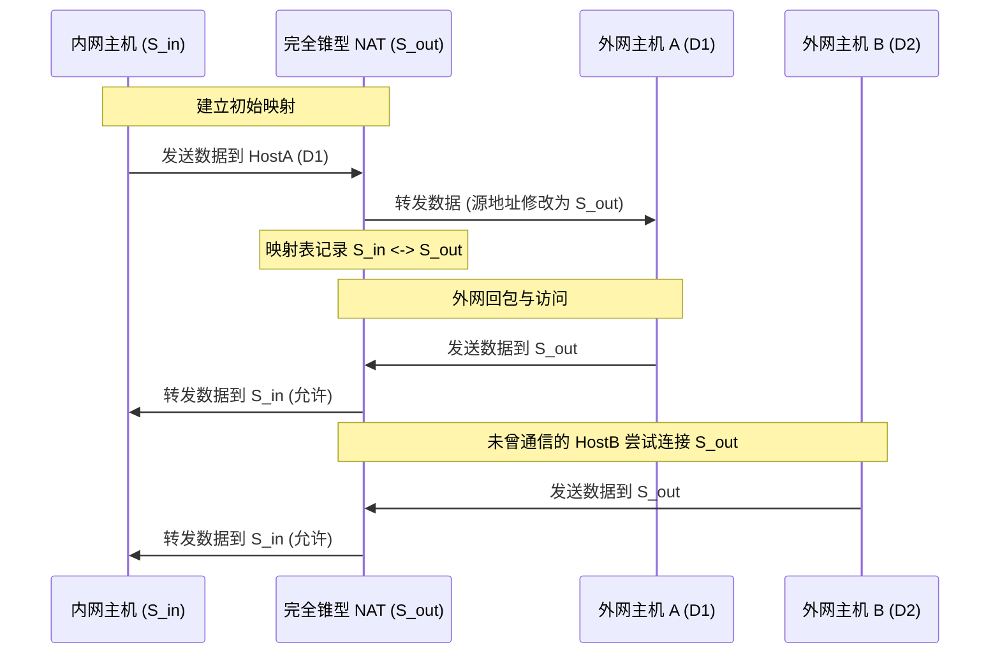
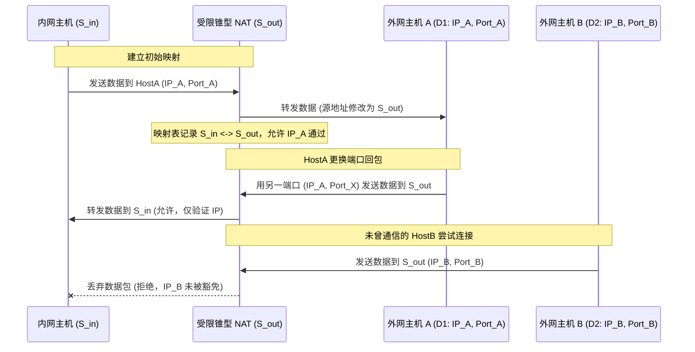
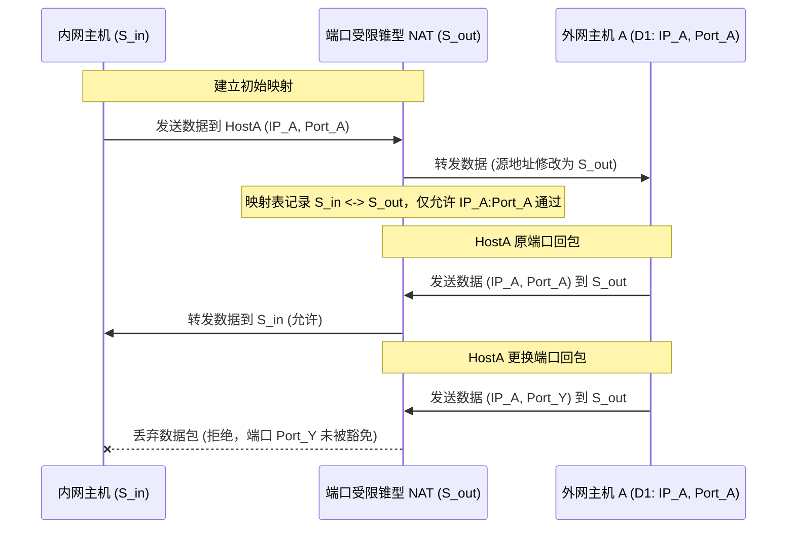
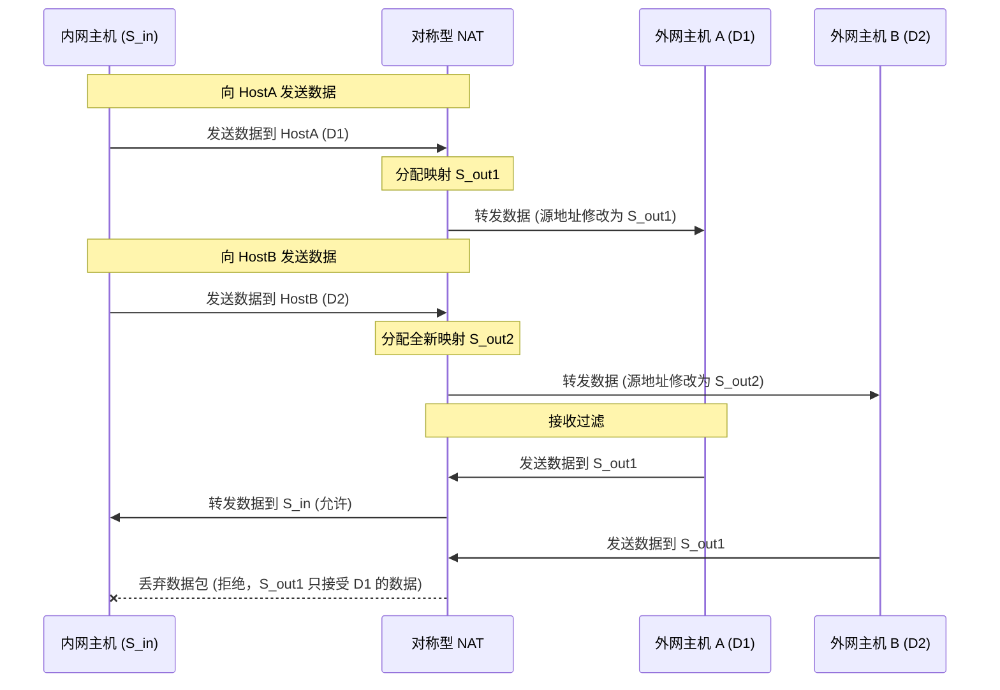
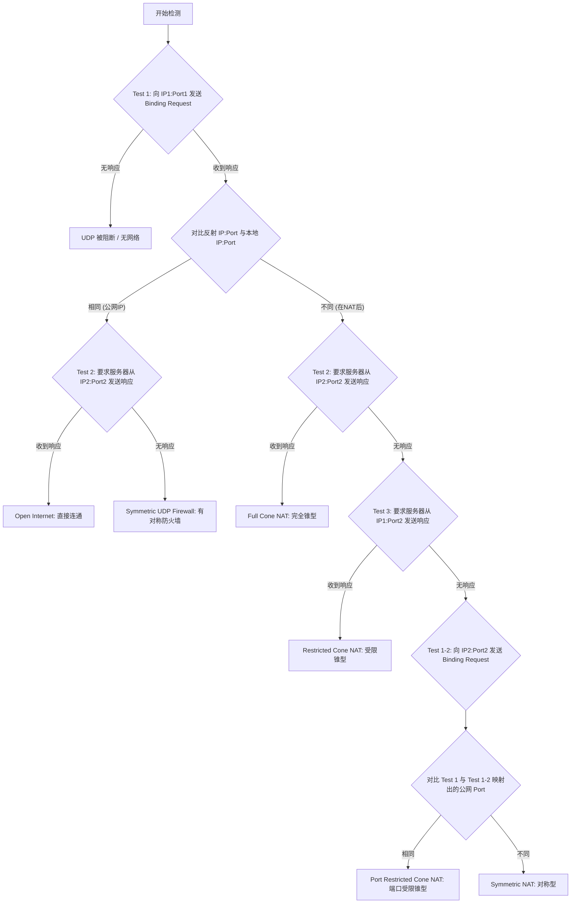

# 1.2.2.9 NAT

## 1. NAT 核心背景与工作原理

### 1.1 为什么需要 NAT
互联网在 20 世纪 70 年代末至 80 年代初设计 TCP/IP 协议族时，IPv4 地址空间被定义为 32 位（约 43 亿个地址）。在当时，这一容量被认为足够支撑全球网络的发展。然而，进入 90 年代后，互联网呈爆炸式增长，早期的“分类地址分配”（Classful Addressing，即划分 A、B、C 类网络）造成了地址空间的严重浪费。例如，一个 A 类网络包含超过 1600 万个地址，而许多获得 A 类网络分配的机构实际使用的地址仅占极小一部分，这加速了 IPv4 地址空间的枯竭危机。

为了延缓 IPv4 耗尽的进程，互联网工程任务组（IETF）相继提出了多项缓解方案：
1. **CIDR（无类别域间路由，RFC 1519）**：废除了传统的 A/B/C 类地址划分，引入子网掩码（Subnet Mask）进行任意长度的前缀匹配，大幅提升了路由聚合度和地址分配的灵活性。
2. **私有地址空间定义（RFC 1918）**：这是与 NAT 协同工作的核心规范。RFC 1918 预留了三段 IP 地址块，明确规定这些地址在公网（Public Internet）上是不具路由性的（Non-routable）。这意味着，任何公网路由器在收到目的 IP 或源 IP 为私有地址的报文时，都必须将其丢弃。这三个私有地址空间分别是：
   - **10.0.0.0/8**：单网络块，包含 1 个 A 类网络，提供 $2^{24} = 16,777,216$ 个地址。通常用于大型企业内部局域网。
   - **172.16.0.0/12**：16 个连续的 B 类网络（172.16.0.0 到 172.31.255.255），提供 $2^{20} = 1,048,576$ 个地址。
   - **192.168.0.0/16**：256 个连续 C 类网络（192.168.0.0 到 192.168.255.255），提供 $2^{16} = 65,536$ 个地址。广泛应用于家庭和小型办公室局域网。

通过将这三段地址指定为局域网内部专用，不同的机构和家庭可以在各自的内网中重复使用这些地址，从而将全球公网 IP 地址的消耗量降低了几个数量级。然而，私有地址无法直接在公共互联网中路由，为了实现内网主机与外网主机的通信，**网络地址转换（NAT，RFC 1631）**应运而生。NAT 设备（通常是路由器或防火墙）部署在私网与公网的交界处，负责在报文穿越边界时进行地址的翻译与转换。

---

### 1.2 NAT 对 IP 首部与传输层首部的修改过程
最常用的 NAT 形式是网络地址端口转换（NAPT），它不仅转换 IP 地址，还通过修改传输层端口来区分内网不同的主机与进程。以下是 NAPT 对数据报文的双向修改细节：

#### 1.2.1 出向报文（Outbound Packet）的修改
当内网主机（例如 IP: `192.168.1.100`，端口: `5000`）向外网服务器（例如 IP: `203.0.113.10`，端口: `80`）发送 TCP 请求时：
1. **拦截报文**：NAT 设备截获该 IP 数据报。
2. **分配公网端口**：NAT 从其可用的公网 IP 地址池中选择一个公网 IP（例如 `198.51.100.5`），并在公网侧动态分配一个空闲端口（例如 `12345`）。
3. **改写首部**：
   - 将 IP 首部中的 **源 IP 地址（Source IP）** 由 `192.168.1.100` 改写为 `198.51.100.5`。
   - 将 TCP 首部中的 **源端口（Source Port）** 由 `5000` 改写为 `12345`。
4. **维护映射表**：在 NAT 映射表中记录一条五元组映射项：`[TCP, 192.168.1.100:5000 <-> 198.51.100.5:12345]`。
5. **计算并更新校验和**。
6. **转发报文**：将修改后的报文送入外网。

#### 1.2.2 入向报文（Inbound Packet）的修改
当外网服务器响应此请求，发回响应报文时：
1. **匹配映射表**：报文到达 NAT 设备的外网接口，其源地址为 `203.0.113.10:80`，目的地址为 `198.51.100.5:12345`。NAT 设备在映射表中检索该目的 IP 和目的端口。
2. **改写首部**：
   - 将 IP 首部中的 **目的 IP 地址（Destination IP）** 由 `198.51.100.5` 还原为 `192.168.1.100`。
   - 将 TCP 首部中的 **目的端口（Destination Port）** 由 `12345` 还原为 `5000`。
3. **计算并更新校验和**。
4. **内网转发**：将还原后的报文发入局域网。

---

### 1.3 校验和重新计算（Checksum Recalculation）与增量算法推导
由于 IP 报头中的 IP 地址被重写，且 TCP/UDP 报头中的端口号被修改，原报文中的校验和（Checksum）将失效。

#### 1.3.1 为什么必须修改传输层校验和？
IP 校验和仅覆盖 IP 报头本身，因此修改 IP 报头后重算 IP 校验和是显而易见的。然而，TCP 和 UDP 的校验和计算包含一个**伪首部（Pseudo Header）**。伪首部是一个虚拟的数据结构，仅在计算校验和时存在，其结构如下：

| 字段 | 长度 (字节) | 描述 |
| --- | --- | --- |
| 源 IP 地址 (Source IP) | 4 | 发送端 IP |
| 目的 IP 地址 (Destination IP) | 4 | 接收端 IP |
| 保留字 (Reserved) | 1 | 全 0 |
| 协议号 (Protocol) | 1 | TCP=6, UDP=17 |
| 传输层长度 (TCP/UDP Length) | 2 | 传输层首部与数据的总长度 |

由于伪首部中包含了源 IP 和目的 IP，而这两个字段在经过 NAT 设备时被修改了，因此即使 TCP/UDP 的载荷（Payload）完全没有发生变化，**传输层的校验和也必须重新计算**。

#### 1.3.2 增量校验和更新算法（Incremental Checksum Update）
如果对每个穿越 NAT 的报文都进行完全重新计算，在千兆或万兆以太网环境下，频繁的内存遍历将对 NAT 设备的 CPU 造成灾难性的算力负担。为了提高转发效率，RFC 1624 和 RFC 3022 推荐使用增量校验和更新算法。

##### 1.3.2.1 数学公式推导
Internet 校验和算法采用的是 **16 位反码求和（Ones' Complement Sum）再取反** 的规则。
设原报文中被修改的 16 位字为 $m$，修改后的 16 位字为 $m'$。
原校验和为 $HC$，修改后的新校验和为 $HC'$。
根据反码求和的定义，原校验和 $HC$ 满足：
$$HC = \sim(S)$$
其中 $S$ 是整个报文中所有 16 位字的反码求和之和。若我们将其中某一个字 $m$ 替换为 $m'$，则新的求和值 $S'$ 为：
$$S' = S - m + m'$$
在反码算术下，求反操作 $\sim$ 满足 $\sim x = -x$。因此：
$$\sim HC' = \sim HC - m + m'$$
对等式两边取反，得到：
$$HC' = \sim(\sim HC - m + m')$$
在反码算术中，减法等同于加上被减数的反码（即 $-x = \sim x$）。因此，我们可以将减去 $m$ 改写为加上 $\sim m$：
$$HC' = \sim(\sim HC + \sim m + m')$$
这就是著名的增量校验和更新公式。该公式仅依赖于旧校验和 $HC$，旧字段值 $m$ 以及新字段值 $m'$，计算复杂度由 $O(N)$ 降为 $O(1)$。

##### 1.3.2.2 增量校验和的 C 语言实现
下面是一个用于增量更新 16 位校验和的通用 C 语言实现。此代码正确处理了反码加法中的进位回加（End-around Carry）：

```c
#include <stdint.h>

/**
 * 增量更新 16 位 Internet 校验和
 * @param old_checksum 旧的校验和值 (16位)
 * @param old_val 被替换的旧字段值 (16位)
 * @param new_val 替换后的新字段值 (16位)
 * @return 新的校验和值 (16位)
 */
uint16_t checksum_incremental_update(uint16_t old_checksum, uint16_t old_val, uint16_t new_val) {
    // 1. 将旧校验和取反，还原为累加和形式
    uint32_t sum = (uint32_t)(~old_checksum & 0xFFFF);
    
    // 2. 加上旧字段值的反码 (~old_val)
    sum += (uint32_t)(~old_val & 0xFFFF);
    
    // 3. 加上新字段值 (new_val)
    sum += (uint32_t)(new_val & 0xFFFF);
    
    // 4. 处理反码算术中的进位溢出 (End-around carry)
    // 如果累加和超过 16 位 (即高 16 位不为 0)，将高 16 位的进位加到低 16 位
    while (sum >> 16) {
        sum = (sum & 0xFFFF) + (sum >> 16);
    }
    
    // 5. 对最终累加和取反，生成新的校验和
    return (uint16_t)(~sum);
}
```

如果一个 NAT 操作同时修改了 IP 地址和端口号，可以对新校验和进行多次迭代增量更新。例如，修改源 IP（32 位，分为两个 16 位字）和源端口（16 位），只需调用三次该更新函数即可完成对 TCP Checksum 的修正。

---

## 2. NAT 核心分类与区别

根据映射的动态性、范围以及对传输层端口的复用方式，NAT 可以分为静态 NAT、动态 NAT 以及网络地址端口转换（NAPT）。

### 2.1 静态 NAT (Static NAT)
静态 NAT 是一种一对一（One-to-One）的映射机制。它将局域网内部的一个私有 IP 地址永久且唯一地绑定到外网的一个公网 IP 地址。
- **机制**：当内网主机 `192.168.1.10` 向外发送数据时，NAT 设备无条件将其转换为公网 IP `203.0.113.10`，其传输层端口保持不变。同理，外网任意主机向 `203.0.113.10` 发送的流量也会被直接路由到 `192.168.1.10`。
- **优缺点**：静态 NAT 并不节省 IP 地址。它的主要作用是保护内网敏感服务器，将内部网络拓扑屏蔽在防火墙后，同时允许外网主动发起对内网特定服务器的访问。

---

### 2.2 动态 NAT (Dynamic NAT)
动态 NAT 也是一对一的映射，但这种映射是临时的、动态的。
- **机制**：NAT 设备维护一个合法的公网 IP 地址池。当内网主机需要访问外网时，NAT 设备动态地从地址池中选择一个当前未被占用的公网 IP 地址与之绑定。一旦该内网主机的所有外网会话结束且超时，该公网 IP 地址就会被收回重新放回地址池中供其他内网主机使用。
- **局限性**：动态 NAT 只能在并发外网连接数小于或等于公网 IP 地址池大小的情况下正常工作。若内网有 100 台主机同时尝试访问公网，而地址池中只有 10 个公网 IP，则第 11 台主机将因“地址枯竭”而无法建立连接。

---

### 2.3 网络地址端口转换 (NAPT)
NAPT（又称 IP Masquerading，IP 伪装）是目前部署最为广泛的 NAT 模式。它允许多个内网主机共享同一个（或少数几个）公网 IP 地址。
- **工作原理**：NAPT 引入了传输层端口的概念。当多个内网主机同时访问外网时，NAT 设备的映射表不仅记录 IP 地址，还记录源端口号。通过将不同的内网 IP + 内网端口映射到同一个公网 IP + 不同的公网端口上，NAPT 实现了极高的地址复用率。
- **连接映射表维护与老化状态机**：
  NAPT 必须对映射表项进行精细的状态跟踪，以防止端口资源被无端耗尽。
  - **TCP 状态跟踪**：NAT 设备通过监控 TCP 的 SYN、SYN-ACK、ACK、FIN 和 RST 报文来跟踪 TCP 连接状态。
    - 当监听到 TCP SYN 时，创建映射表项，状态标记为 `SYN_SENT`。
    - 监听到 SYN-ACK 时，状态转为 `SYN_RCVD`。
    - 监听到 ACK 时，状态转为 `ESTABLISHED`。在此状态下，映射表项的生存周期较长（通常为 2 小时或更久）。
    - 监听到 FIN 或 RST 时，NAT 将启动一个简短的超时计时器（通常为几秒到几分钟），待连接彻底释放后，销毁该映射表项并回收公网端口。
  - **UDP 状态追踪**：由于 UDP 是无状态的，NAT 只能采用简单的“空闲计时器”机制。一旦某个映射表项在规定时间内（例如 RFC 4787 建议的 120 秒）没有双向数据流动，NAT 设备就会强制销毁该表项。

---

### 2.4 对称型 NAT 与 锥型 NAT 的数学与物理模型
在点对点（P2P）通信和 NAT 穿透技术中，仅区分静态/动态 NAT 和 NAPT 是不够的。根据 NAT 设备在为内网主机建立映射时，是否依赖“目的 IP”和“目的端口”，以及对入向流量的“过滤规则”，RFC 3489 将其细分为四种行为模式。

为了严谨地剖析这些模式，我们建立以下数学物理模型：
设内网主机的 Socket 二元组为 $S_{in} = (IP_{in}, Port_{in})$。
外网目的主机的 Socket 二元组为 $D = (IP_{dest}, Port_{dest})$。
NAT 设备为该会话分配的外网映射 Socket 二元组为 $S_{out} = (IP_{out}, Port_{out})$。
我们可以将 NAT 的端口映射行为表示为函数 $\Phi$：
$$S_{out} = \Phi(S_{in}, D)$$
同时，NAT 的防火墙过滤规则可以表示为判定函数 $\Psi(S_{out}, S_{src}) \to \{Accept, Drop\}$，其中 $S_{src} = (IP_{src}, Port_{src})$ 是尝试向 $S_{out}$ 发送数据的任意外部主机的 Socket 二元组。

#### 2.4.1 完全锥型 NAT (Full Cone NAT)
完全锥型 NAT 的特征是“一次映射，永久开放”。
- **映射规则**：只要内网源 Socket $S_{in}$ 不变，无论它向哪个外网目的 $D$ 发送数据，NAT 设备都会将其映射到相同的公网二元组 $S_{out}$。
  $$\Phi(S_{in}, D_1) = \Phi(S_{in}, D_2) = S_{out}$$
- **过滤规则**：一旦映射关系建立，任何外网主机 $S_{src}$ 发送给 $S_{out}$ 的数据包都会被无条件转发给内网主机 $S_{in}$。
  $$\Psi(S_{out}, S_{src}) = Accept \quad (\forall S_{src})$$



---

#### 2.4.2 受限锥型 NAT (Address Restricted Cone NAT)
受限锥型 NAT 引入了对源 IP 地址的过滤，以提高安全性。
- **映射规则**：映射函数依然与目的地址无关。
  $$\Phi(S_{in}, D_1) = \Phi(S_{in}, D_2) = S_{out}$$
- **过滤规则**：只有当内网主机 $S_{in}$ 曾经向外网主机所在的 IP 地址发送过数据时，该 IP 发送给 $S_{out}$ 的数据包才会被转发给内网主机。端口不作限制。
  $$\Psi(S_{out}, S_{src}) = \begin{cases} Accept & \text{if } \exists D \in \mathcal{H}(S_{in}) \text{ s.t. } D.IP_{dest} = S_{src}.IP_{src} \\ Drop & \text{otherwise} \end{cases}$$
  其中 $\mathcal{H}(S_{in})$ 是内网主机 $S_{in}$ 历史发送过数据的外网目的 Socket 核心集合。



---

#### 2.4.3 端口受限锥型 NAT (Port Restricted Cone NAT)
端口受限锥型 NAT 在受限锥型的基础上，进一步将过滤粒度提升至传输层端口。
- **映射规则**：映射函数依然与目的地址无关。
  $$\Phi(S_{in}, D_1) = \Phi(S_{in}, D_2) = S_{out}$$
- **过滤规则**：只有当内网主机 $S_{in}$ 曾经向特定的外网 Socket $D$ 发送过数据时，该 Socket 发送给 $S_{out}$ 的数据包才会被转发。
  $$\Psi(S_{out}, S_{src}) = \begin{cases} Accept & \text{if } S_{src} \in \mathcal{H}(S_{in}) \\ Drop & \text{otherwise} \end{cases}$$



---

#### 2.4.4 对称型 NAT (Symmetric NAT)
对称型 NAT 是安全性最高、但也最难进行 P2P 穿透的一种 NAT 类型。
- **映射规则**：映射函数与目的 Socket $D$ 紧密相关。只要目的 IP 或目的端口发生任何改变，NAT 都会为内网主机分配一个全新的公网映射 Socket。
  $$\text{若 } D_1 \neq D_2 \text{，则 } \Phi(S_{in}, D_1) \neq \Phi(S_{in}, D_2)$$
- **过滤规则**：只有当外网主机的源 Socket $S_{src}$ 恰好等于内网主机曾经发送过数据的目的 Socket $D$ 时，其数据包才被允许转发。这在行为上是“端口受限锥型”的子集，但由于其映射规则的变化，导致外部无法得知其对于新目的地的端口映射值。
  $$\Psi(S_{out}, S_{src}) = \begin{cases} Accept & \text{if } S_{src} = D \text{ 且 } S_{out} = \Phi(S_{in}, D) \\ Drop & \text{otherwise} \end{cases}$$



---

### 2.5 四类 NAT 行为特征对比表
下表总结了四种 NAT 模式在映射规则、过滤机制、端口一致性及安全等级方面的核心差异：

| NAT 类型 | 映射规则（对目的敏感度） | 过滤规则（入向流量限制） | 公网端口一致性 | 安全级别 | 打洞难易度 |
| --- | --- | --- | --- | --- | --- |
| **完全锥型 (Full Cone)** | 目的不敏感（仅取决于源） | 无限制（任何外网主机均可发送） | 极高（保持一致） | 最低 | 极易 |
| **受限锥型 (Address Restricted)** | 目的不敏感（仅取决于源） | 源 IP 必须在通信历史中 | 极高（保持一致） | 中等 | 容易 |
| **端口受限锥型 (Port Restricted)** | 目的不敏感（仅取决于源） | 源 IP + 端口必须在通信历史中 | 极高（保持一致） | 较高 | 容易 |
| **对称型 (Symmetric)** | 目的敏感（取决于源和目的） | 源 IP + 端口必须完全匹配对应映射 | 极低（每次都变） | 最高 | 极难 |

---

## 3. NAT 带来的网络瓶颈与问题

虽然 NAT 极大延缓了 IPv4 地址空间的枯竭，但它从根本上改变了互联网的设计架构，带来了诸多难以解决的技术瓶颈。

### 3.1 违反 IP 分层设计哲学
在经典的 TCP/IP 参考模型中，分层设计是网络架构的核心。每一层应该只处理本层协议头，对其上层协议内容保持透明。
- **越界解析**：NAPT 为了转换地址，必须解析并修改网络层（IP）上方的传输层（TCP/UDP）首部中的端口字段。这强行将网络层与传输层耦合在了一起。
- **阻碍新协议推广**：由于现存的大量 NAT 设备只认识 TCP 和 UDP，如果未来设计出一种新型的传输层协议（例如 SCTP 或 DCCP），这些协议在经过传统的 NAT 设备时，由于设备无法识别其端口位置并修改校验和，导致报文被直接丢弃。这直接导致了传输层协议的“僵化”（Ossification），使得任何非 TCP/UDP 的新型传输协议在公共互联网上几乎无法推广。

---

### 3.2 破坏端到端通信透明性 (End-to-End Transparency)
端到端原则是互联网设计的最重要哲学之一：网络核心只负责简单的数据包转发，而复杂的应用逻辑和状态维护应当在端系统（主机）中实现。在这个原则下，互联网上的任意两台主机都可以作为平等的对等节点，直接向对方发起连接。
- **单向连通性**：NAT 破坏了这种对称的平等关系。处于 NAT 内部的主机拥有的是私有地址，外部网络的主机在没有预先建立映射的情况下，根本无法主动定位并连接到内网主机。
- **C/S 架构固化**：这迫使几乎所有的互联网应用都向“客户机-服务器 (Client-Server)”架构妥协。内网主机只能主动向位于公网的服务器发起请求，而无法直接进行对等的点对点（P2P）通信。

---

### 3.3 对应用层协议的影响与 ALG（应用层网关）机制
最棘手的问题在于，许多设计于 NAT 诞生之前的应用层协议，会在其**应用层载荷（Payload）**中携带本机的 IP 地址和端口号。这种“载荷敏感型”协议在经过 NAT 转换时，如果仅修改 IP/TCP 头部，会导致应用层协议逻辑彻底崩溃。

#### 3.3.1 典型协议生存危机

##### 3.3.1.1 FTP 协议（主动模式）
在 FTP 主动模式（Active Mode）下，客户端连接服务器的 `21` 端口，并在发送数据传输请求前，向服务器发送一个 `PORT` 命令：
`PORT 192,168,1,100,19,136`
这个命令告诉服务器：“请连接我的 `192.168.1.100` 端口 `4999` ($19 \times 256 + 136$）来传输文件数据”。
由于客户端处于 NAT 内部，其真实的 IP `192.168.1.100` 对外网服务器是不可达的。服务器在收到该 PORT 命令后，尝试向 `192.168.1.100:4999` 发起 TCP 连接，显然会因为找不到路由而宣告失败。

##### 3.3.1.2 SIP 协议（会话发起协议）
SIP 常用于 IP 电话和视频会议。在其携带的 SDP（会话描述协议）载荷中，Alice 需要指定自己接收音频/视频媒体流的 IP 和端口：
```sdp
v=0
o=alice 2890844526 2890844526 IN IP4 192.168.1.100
c=IN IP4 192.168.1.100
m=audio 5004 RTP/AVP 0
```
如果 SIP 报文经过 NAT 时只修改了 IP 头部，对端服务器或终端在收到 SDP 时，会尝试将 RTP 语音数据流发送到 `192.168.1.100:5004`。Alice 能够听到对方说话，但对方绝对听不到 Alice 说话（形成“单通”或“无声”现象）。

#### 3.3.2 应用层网关（ALG，Application Layer Gateway）
为了修复上述问题，现代 NAT 设备通常集成了 ALG 功能。ALG 能够深度解析应用层报文（如深度包检测 DPI），并在发现载荷中包含私网 IP/Port 信息时，将其修改为 NAT 的外网 IP 和分配的公网端口。

##### 3.3.2.1 ALG 修改 FTP 载荷的机制与副作用
当 ALG 发现 FTP 命令 `PORT 192,168,1,100,19,136` 时，它会将其改写为公网映射地址，例如 `PORT 198,51,100,5,40,10`。
然而，这引入了极高昂的代价：
1. **TCP 序列号漂移（Sequence Number Offset）**：
   原始命令 `PORT 192,168,1,100,19,136` 长度为 28 字节，修改后的 `PORT 198,51,100,5,40,10` 长度为 26 字节。
   这导致该 TCP 报文的载荷长度减少了 2 字节。
   在 TCP 协议中，每个字节都有唯一的序列号。如果 NAT ALG 改变了载荷长度，那么在这条 TCP 连接的后续生命周期中，客户端发出的所有报文的 **序列号 (Sequence Number)** 都必须由 NAT 减去 2；而服务器回送的所有确认报文中的 **确认号 (Acknowledgment Number)** 都必须被 NAT 加上 2。
   NAT 设备必须在内存中为该 TCP 流维持一个动态的“序列号偏移量（Seq Offset）”，并实时重写双向 TCP 首部的 Seq/Ack 字段。
2. **流量加密与完整性保护的对抗**：
   如果应用层流量通过 TLS（如 FTPS, SIPS）进行了加密，或者使用 IPsec AH 进行了完整性校验，ALG 将由于无法解密载荷，或者由于修改载荷导致哈希校验失败，而彻底失效。

---

## 4. P2P 场景下的 NAT 穿透（打洞）技术深度剖析

由于 NAT 破坏了端到端通信，在点对点（P2P）实时通信应用中，我们必须利用特定的穿透（Hole Punching，打洞）技术，让两台处于不同 NAT 后的主机建立直接的通信通道。

### 4.1 STUN 协议 (RFC 5389 / RFC 3489)
STUN（Session Traversal Utilities for NAT，用于 NAT 的会话穿透实用工具）是 P2P 穿透的基石。它的主要任务是：**允许处于内网的主机发现自己对应的公网映射地址和端口，并探测中间 NAT 的类型**。

#### 4.1.1 STUN 报文格式
STUN 采用二进制报文格式，传输层通常使用 UDP。一个标准的 STUN 报文由一个 20 字节的头部和零个或多个属性（Attributes）组成：

```
 0                   1                   2                   3
 0 1 2 3 4 5 6 7 8 9 0 1 2 3 4 5 6 7 8 9 0 1 2 3 4 5 6 7 8 9 0 1
+-+-+-+-+-+-+-+-+-+-+-+-+-+-+-+-+-+-+-+-+-+-+-+-+-+-+-+-+-+-+-+-+
|0 0|     STUN Message Type     |         Message Length        |
+-+-+-+-+-+-+-+-+-+-+-+-+-+-+-+-+-+-+-+-+-+-+-+-+-+-+-+-+-+-+-+-+
|                         Magic Cookie                          |
+-+-+-+-+-+-+-+-+-+-+-+-+-+-+-+-+-+-+-+-+-+-+-+-+-+-+-+-+-+-+-+-+
|                                                               |
|                     Transaction ID (96 bits)                  |
|                                                               |
+-+-+-+-+-+-+-+-+-+-+-+-+-+-+-+-+-+-+-+-+-+-+-+-+-+-+-+-+-+-+-+-+
|                                                               |
|                           Attributes                          |
|                                                               |
+-+-+-+-+-+-+-+-+-+-+-+-+-+-+-+-+-+-+-+-+-+-+-+-+-+-+-+-+-+-+-+-+
```

- **前两位为 0**：保证 STUN 报文在与 RTP 协议复用同一个 UDP 端口时，能够通过头部前两位区分开。
- **STUN Message Type (14 bits)**：消息类型，分为 Class（如 Request, Success Response, Error Response）和 Method（如 Binding）。
- **Message Length (16 bits)**：指示后续属性区域的总字节数（不含 20 字节头部）。
- **Magic Cookie (32 bits)**：固定值 `0x2112A442`。引入该字段是为了让接收方能够快速且确定性地判断一个 UDP 包是否为 STUN 报文。
- **Transaction ID (96 bits)**：由客户端生成的随机数，用于唯一标识一个请求-响应事务，并用于对安全认证防重放攻击。

#### 4.1.2 XOR-MAPPED-ADDRESS 属性的工作原理
在早期的 RFC 3489 中，STUN 服务器通过 `MAPPED-ADDRESS` 属性直接返回内网主机的公网映射 IP 和 Port。
然而，许多路由器的 ALG 会扫描 UDP 载荷中的 32 位 IP 地址和 16 位端口，当发现其与 NAT 外网口 IP 匹配时，会进行改写。这导致处于多级 NAT 下的客户端无法获取其最外层的真实公网映射地址。

为了解决这个问题，RFC 5389 引入了 `XOR-MAPPED-ADDRESS` 属性。该属性对公网映射的 IP 和 Port 进行异或（XOR）混淆后再传输：
1. **端口混淆**：将真实的映射端口与 Magic Cookie 的高 16 位（即 `0x2112`）进行按位异或。
2. **IP 混淆**：将真实的映射 IP 与整个 Magic Cookie（`0x2112A442`）进行按位异或（如果是 IPv6，则与 Magic Cookie 和 Transaction ID 拼接后的 128 位进行按位异或）。

因为经过异或处理后的数据在载荷中呈现为无规律的二进制流，ALG 无法识别其为 IP 地址，因此不会对其进行干预。客户端收到响应后，只需用本地已知的 Magic Cookie 对该属性进行二次异或，即可还原出公网映射地址。

#### 4.1.3 NAT 类型检测决策树（RFC 3489 经典算法）
在 RFC 3489 规范中，定义了通过 STUN 探测 NAT 类型的经典流程。这要求 STUN 服务器部署在公网，并拥有两个独立的公网 IP 地址（IP1, IP2）和两个端口（Port1, Port2）。



##### 4.1.4 为什么 RFC 5389 废弃了此检测树？
在后续的 RFC 5389 规范中，这一套复杂的 NAT 类型检测树被废弃，STUN 被重新定位为轻量级的“获取映射地址的工具”。原因如下：
1. **网络拓扑的高度异构性**：现代网络中存在极其复杂的多级 NAT（例如运营商级 CGNAT 与家用路由器叠加），甚至防火墙的过滤规则是动态变化的。分类检测树无法涵盖所有边缘情况，极易产生误判。
2. **多 IP 资源的浪费**：该算法要求 STUN 服务器必须绑定两个公网 IP 地址，这在全球 IPv4 地址极度匮乏的背景下是非常奢侈且难以实现的。
3. **ICE 框架的兴起**：现代穿透技术不再试图预先“精确诊断”NAT 类型，而是直接通过 ICE 框架进行全路径的连通性试探，由实践结果决定最优通路。

---

### 4.2 TURN 协议 (RFC 5766 / RFC 8656)
当通信双方均处于对称型 NAT 之后，或者一方为对称型，另一方为端口受限锥型时，由于端口映射的动态改变和严格的端口过滤规则，直接打洞在数学上是不可行的。此时，必须通过一个部署在公网的中继服务器来转发所有数据。这就是 **TURN（Traversal Using Relays around NAT，围绕 NAT 的中继穿透）** 协议的作用。

#### 4.2.1 TURN 分配（Allocation）生命周期
为了在 TURN 服务器上获得一个中继端口，客户端必须经历以下分配流程：
1. **发送 Allocation 请求**：客户端发送一个 `Allocate Request` 报文给 TURN 服务器的 `3478` 端口。
2. **身份验证挑战**：服务器为了防范未授权的带宽盗用，会回送一个 `401 Unauthorized` 响应，其中包含 `NONCE` 和 `REALM` 属性。
3. **重发请求**：客户端利用预先配置的用户名、密码，结合服务器发来的 `NONCE` 算出哈希签名，重新发送 `Allocate Request`。
4. **成功分配**：服务器验证签名通过，为该客户端分配一个专属的公网传输地址，称为 **中继传输地址（Relayed Transport Address）**。同时，服务器返回 `LIFETIME` 属性（默认通常为 20 分钟），客户端必须在此期限内发送 `Refresh` 报文进行保活。

#### 4.2.2 数据的中转传输机制
一旦分配成功，客户端与对等端（Peer）的数据传输可以通过以下两种方式之一进行：

##### 4.2.2.1 Send / Data Indication 机制
这是一种无连接的封装方式：
- **发送**：客户端向 TURN 服务器发送 `Send Indication` 报文，载荷中包含 `XOR-PEER-ADDRESS`（Peer 的公网地址）和实际要发送的媒体数据。服务器收到后，剥离 STUN 头部，将纯数据包发送给 Peer。
- **接收**：当 Peer 向客户端的中继传输地址发送 UDP 数据时，TURN 服务器拦截此数据，将其封装进 `Data Indication` 报文（附带 Peer 的源地址）转发给客户端。
- **缺点**：每个数据包都带有 STUN 消息头部，封装开销极大，不适合高吞吐量的音视频流传输。

##### 4.2.2.2 通道绑定机制（Channel Binding）
为了降低封装开销，客户端可以申请通道绑定：
1. **建立绑定**：客户端向 TURN 服务器发送 `Channel Bind Request`，将 Peer 的 IP:Port 绑定到一个 16 位的通道号（Channel Number，范围 `0x4000` 到 `0x7FFF`）。
2. **数据转发**：绑定成功后，客户端和服务器之间的数据传输切换为极简的 **通道数据报文 (Channel Data Message)**。该报文仅包含 4 字节的头部（2 字节 Channel Number + 2 字节 Length），后紧跟原始数据。这相比于 Indication 方式节省了数十字节的开销，并显著降低了服务器的 CPU 解析负担。

#### 4.2.3 TURN 服务器的性能瓶颈
由于所有的音视频数据流都必须经过 TURN 服务器进行内存拷贝和网卡转发，在大规模音视频通话场景下，TURN 服务器会成为极易爆满的单点瓶颈：
- **带宽成本暴增**：每个通话用户都需要消耗双倍的服务器下行和上行带宽。
- **高并发 I/O 挑战**：服务器必须使用高效的异步 I/O 复用模型（如 Linux 的 `epoll`），并利用 `SO_REUSEPORT` 充分释放多核 CPU 的性能。
- **时延抖动**：中继转发导致传输路径拉长，引入了额外的网络物理延迟。因此，在实际工程中，TURN 应作为最后的兜底方案，只有在打洞失败时才启动。

---

### 4.3 ICE 框架 (RFC 5245 / RFC 8445)
**ICE（Interactive Connectivity Establishment，交互式连通性建立）** 不是一种单的协议，而是一个高度整合了 STUN、TURN 和本地网络接口的综合性协商框架。它为处于不同网络环境下的对等端提供了寻找最佳传输路径的标准化工作流程。

#### 4.3.1 候选地址（Candidate）的收集与分类
在 ICE 会话初始化阶段，每一端必须收集自己所有的“候选地址（Candidates）”。候选地址是一个包含 IP 地址、端口、传输协议（通常是 UDP）的三元组。

ICE 收集的候选地址分为以下四类：
1. **Host Candidate（主机候选地址）**：
   直接从本机的物理网卡或虚拟网卡（WiFi, 局域网网卡）上获取的本地真实 IP 和端口。
2. **Server Reflexive Candidate (srflx，服务器反射候选地址)**：
   内网主机通过向公网 STUN 服务器发送 Binding 请求，由服务器发现并返回的公网映射 IP 和端口。
3. **Peer Reflexive Candidate (prflx，对等端反射候选地址)**：
   在连通性检查阶段，由于对称 NAT 的存在，对等端收到的 STUN 请求的源端口与收集阶段汇报的端口不同，由对等端动态发现并创建的候选地址。
4. **Relayed Candidate (relay，中继候选地址)**：
   客户端通过向 TURN 服务器申请分配得到的专属公网中继 IP 和端口。

#### 4.3.2 SDP 中的 Candidate 描述与优先级计算
收集完毕后，客户端将这些 Candidate 按照特定的格式写入会话描述协议（SDP）中。每一行 Candidate 都包含一个计算出的优先级（Priority）数值。

##### 4.3.2.1 优先级计算公式
根据 RFC 8445，Candidate 优先级的计算公式为：
$$\text{Priority} = (2^{24} \times \text{type\_preference}) + (2^{8} \times \text{local\_preference}) + (2^{0} \times (256 - \text{component\_id}))$$

- **`type_preference` (8 bits)**：地址类型偏好值（范围 0-126）。通常，Host 设为 126，prflx 设为 110，srflx 设为 100，relay 设为 0。这确保了直连路径的优先级始终高于中继路径。
- **`local_preference` (16 bits)**：本地偏好值（范围 0-65535）。用于区分同一类型的多个 Candidate。例如，如果有线网卡的 Host 优先级高于无线网卡，可通过此字段微调。
- **`component_id` (8 bits)**：组件 ID。在网络媒体流场景中，`1` 代表 RTP 媒体流，`2` 代表 RTCP 控制流。

##### 4.3.2.2 SDP 示例片段
```sdp
a=candidate:42313574 1 udp 2130706431 192.168.1.100 5000 typ host
a=candidate:32847291 1 udp 1694498815 203.0.113.5 12345 typ srflx raddr 192.168.1.100 rport 5000
a=candidate:10283741 1 udp 16777215 198.51.100.10 3478 typ relay raddr 192.168.1.100 rport 5000
```

#### 4.3.3 连通性检查（Connectivity Checks）与候选地址对排序
双方通过信令通道（如 WebSocket）交换 SDP。获得对方的所有 Candidates 后，ICE 开始进行连通性检查：
1. **生成候选地址对（Candidate Pairs）**：
   将本端的所有 Candidate 与对端相同组件（Component）的所有 Candidate 进行两两配对。例如，本端有 3 个 Candidate，对端有 3 个，则生成 9 个 Candidate Pairs。
2. **排序（Sorting）**：
   计算每个 Pair 的合并优先级（通常是两端 Candidate 优先级之和的算术组合），并按照降序排列，放入“检查列表（Check List）”。
3. **STUN 握手（Binding Requests）**：
   ICE 引擎以一定的节奏（如每 20 毫秒发送一个，防止网络拥塞）依次向每个 Pair 发送 STUN Binding Request。
   - 当本端向对端发送请求，且收到对端返回的 Binding Success Response 时，该 Pair 的状态更新为 `Succeeded`。
4. **Peer Reflexive 地址发现**：
   当本端接收到对端的 STUN 请求时，如果发现该请求的源 IP:Port 是一个全新的地址，本端会立即将其作为 `prflx` 类型的候选地址加入本地列表，并生成新的 Candidate Pair 进行测试。这极大地提高了对称 NAT 组合下的穿透成功率。

#### 4.3.4 提名机制 (Nomination)
连通性检查成功仅仅代表物理通道是通的，但最终必须选定一条唯一的通道来传输音视频数据。这通过提名机制完成。

在 ICE 会话中，通信双方会协商出角色：一个是**控制端（Controlling Agent）**，另一个是**被控制端（Controlled Agent）**。通常，发起呼叫的客户端作为控制端。

- **常规提名（Regular Nomination）**：
  连通性检查正常进行。当控制端在 `Check List` 中发现某个 Succeeded 的 Pair 非常理想（如优先级最高），它会向该 Pair 发送一个特殊的 STUN Binding Request，其中带有 `USE-CANDIDATE` 属性。对端收到后，双方立即将该 Pair 锁定为“活动对（Active Pair）”，停止其他 Pair 的测试，开始在此通路上承载媒体数据。
- **激进提名（Aggressive Nomination）**：
  控制端发送的每一个 STUN Binding Request 中都默认带有 `USE-CANDIDATE` 属性。一旦某个 Pair 的检查首先成功，它就被立即设为活动对。如果后续有更高优先级的 Pair 检查成功，则切换到新的 Pair。这种方式收敛较快，但可能会发生通道的中途抖动，RFC 8445 中已废弃这种模式。

---

## 5. NAT 穿透组合矩阵与穿透成功率分析

在实际的网络工程应用中，两端设备所处的 NAT 类型不同，直接打洞（Hole Punching）的成功率也会产生极大的差异。

### 5.1 NAT 穿透成功率矩阵
下表展示了通信双方（内网 A 与内网 B）在各种 NAT 组合下的穿透成功率以及所能达到的最佳传输路径：

| 内网 A \ 内网 B | 完全锥型 (Full Cone) | 受限锥型 (Restricted) | 端口受限锥型 (Port Restricted) | 对称型 (Symmetric) |
| --- | --- | --- | --- | --- |
| **完全锥型 (Full Cone)** | **极高 (100%)**<br>直接直连打洞成功 | **极高 (100%)**<br>直接直连打洞成功 | **极高 (100%)**<br>直接直连打洞成功 | **极高 (100%)**<br>直接直连打洞成功 |
| **受限锥型 (Restricted)** | **极高 (100%)**<br>直接直连打洞成功 | **极高 (100%)**<br>直连打洞成功 | **极高 (100%)**<br>直连打洞成功 | **中等 / 偏低**<br>需要依赖端口预测，否则回退 TURN |
| **端口受限锥型 (Port Rest.)** | **极高 (100%)**<br>直接直连打洞成功 | **极高 (100%)**<br>直连打洞成功 | **较高 (~90%)**<br>双向打洞成功 | **极低 (<5%)**<br>绝大多数必须回退 TURN |
| **对称型 (Symmetric)** | **极高 (100%)**<br>直接直连打洞成功 | **中等 / 偏低**<br>需要端口预测 | **极低 (<5%)**<br>必须回退 TURN | **不可行 (0%)**<br>必须无缝回退至 TURN 中继 |

---

### 5.2 对称型 NAT 之间打洞失败的根本原因
为什么当双方都是对称型 NAT（或一方是对称型，另一方是端口受限锥型）时，直接打洞会彻底失效？这可以通过我们的映射函数模型进行严密的推导。

假设主机 A 位于对称型 NAT-A 后面，主机 B 位于对称型 NAT-B 后面。
1. **获取映射地址**：
   - 主机 A 向公网 STUN 服务器 $S_{stun}$ 发送请求，NAT-A 为该流分配映射端口 $P_{A\_stun}$：
     $$\Phi_A(S_{in\_A}, S_{stun}) = (IP_{out\_A}, P_{A\_stun})$$
   - 主机 B 向 STUN 服务器 $S_{stun}$ 发送请求，NAT-B 为该流分配映射端口 $P_{B\_stun}$：
     $$\Phi_B(S_{in\_B}, S_{stun}) = (IP_{out\_B}, P_{B\_stun})$$
2. **交换候选地址**：
   - 双方通过信令服务器交换了这组地址。A 认为 B 的地址是 $(IP_{out\_B}, P_{B\_stun})$，B 认为 A 的地址是 $(IP_{out\_A}, P_{A\_stun})$。
3. **尝试打洞**：
   - 主机 A 尝试向 B 的地址 $(IP_{out\_B}, P_{B\_stun})$ 发送 UDP 打洞包。由于目的 Socket 变为了 B 的 Socket，**对称型 NAT-A 必然会为其分配一个新的映射端口 $P_{A\_B}$**，且 $P_{A\_B} \neq P_{A\_stun}$：
     $$\Phi_A(S_{in\_A}, (IP_{out\_B}, P_{B\_stun})) = (IP_{out\_A}, P_{A\_B})$$
   - 此时，NAT-A 的过滤规则被设置为：只允许 $(IP_{out\_B}, P_{B\_stun})$ 发来的数据包进入 $P_{A\_B}$。
   - 与此同时，主机 B 尝试向 A 的地址 $(IP_{out\_A}, P_{A\_stun})$ 发送 UDP 打洞包。对称型 NAT-B 同样会为其分配一个新的映射端口 $P_{B\_A}$，且 $P_{B\_A} \neq P_{B\_stun}$：
     $$\Phi_B(S_{in\_B}, (IP_{out\_A}, P_{A\_stun})) = (IP_{out\_B}, P_{B\_A})$$
4. **最终的通信死锁**：
   - A 发送的包源端口是 $P_{A\_B}$，目的端口是 $P_{B\_stun}$。但是对于 B 侧的 NAT-B 而言，它所期待接收的包必须来自于 A 向其注册过的源端口，且由于 B 本身也发送了包给 A 的旧端口 $P_{A\_stun}$，它的过滤器只在 $P_{B\_A}$ 上对 $(IP_{out\_A}, P_{A\_stun})$ 放行。
   - A 发送的包到达 NAT-B 上的 $P_{B\_stun}$，而 $P_{B\_stun}$ 只允许公网 STUN 服务器发回数据。来自 A 侧的 UDP 包由于端口不匹配，被 NAT-B 防火墙无条件丢弃。
   - B 发送给 A 的包同样会因为源端口不是 $P_{A\_B}$，而在到达 NAT-A 时被无条件丢弃。

由于双方发送打洞包时，使用的都是**全新的、对方完全未知的动态端口**，且对方防火墙的过滤条件极其苛刻，这使得双方发出的所有 UDP 探测包都无一例外地被中间设备拦截。

#### 5.2.1 端口预测技术 (Port Prediction)
为了应对对称 NAT 造成的阻碍，部分 P2P 软件实现了“端口预测”技术。一些设计粗糙的 NAT 设备在分配公网端口时，采用的是线性递增规律（例如每次新建会话，端口号加 1 或加 2）。
如果 A 检测到其对 STUN-1 的端口是 `10000`，对 STUN-2 的端口是 `10001`，则 A 可以预测其向 B 发包时，NAT-A 分配的端口大概率是 `10002`。
通过这种规律，A 和 B 提前约定在预测出的端口上进行并发的 UDP 报文轰炸，有可能在极短的窗口期内打洞成功。然而，这种技术随着现代企业级防火墙和对称端口随机分配算法（例如使用密码学安全的伪随机数发生器分配端口）的普及，已经基本失效。在无法成功预测的情况下，ICE 引擎会判定直连失败，并无缝回退（Fallback）至配置好的 TURN 中继服务器。

---

## 6. 通用 P2P 打洞网络程序设计实践

为了更直观地理解 NAT 穿透的底层原理，下面提供了一套基于 Go 语言的通用点对点（P2P）UDP 打洞程序示例。程序包含两个部分：一端是部署在公网的协调服务器（Signaling / Mediator Server），负责收集并交换两端反射出的公网 IP 和 Port；另一端是处于 NAT 后的客户端。

### 6.1 协调中介服务器实现
中介服务器部署在具有独立公网 IP 的服务器上，主要逻辑是等待两个客户端连接，在获取它们的公网反射地址后，将其交叉告知对方：

```go
package main

import (
	"fmt"
	"net"
	"strings"
)

type ClientInfo struct {
	Addr *net.UDPAddr
	Name string
}

func main() {
	// 监听公网 UDP 端口 9000
	listener, err := net.ListenUDP("udp", &net.UDPAddr{IP: net.IPv4zero, Port: 9000})
	if err != nil {
		fmt.Printf("监听失败: %v\n", err)
		return
	}
	defer listener.Close()
	fmt.Println("协调中介服务器已启动，监听公网端口: 9000...")

	clients := make([]ClientInfo, 0, 2)
	buf := make([]byte, 1024)

	for {
		n, remoteAddr, err := listener.ReadFromUDP(buf)
		if err != nil {
			fmt.Printf("读取数据错误: %v\n", err)
			continue
		}

		msg := strings.TrimSpace(string(buf[:n]))
		fmt.Printf("接收到来自 [%v] 的注册消息: %s\n", remoteAddr, msg)

		// 收集客户端信息
		clients = append(clients, ClientInfo{Addr: remoteAddr, Name: msg})

		// 当两个客户端都已向中介服务器注册完毕
		if len(clients) == 2 {
			c1 := clients[0]
			c2 := clients[1]

			// 将 c2 的反射地址发送给 c1
			msgToC1 := fmt.Sprintf("PEER_ADDR:%s", c2.Addr.String())
			_, _ = listener.WriteToUDP([]byte(msgToC1), c1.Addr)

			// 将 c1 的反射地址发送给 c2
			msgToC2 := fmt.Sprintf("PEER_ADDR:%s", c1.Addr.String())
			_, _ = listener.WriteToUDP([]byte(msgToC2), c2.Addr)

			fmt.Printf("已成功交换客户端地址: %s <--> %s\n", c1.Addr.String(), c2.Addr.String())
			// 清空列表，准备接收下一对客户端
			clients = clients[:0]
		}
	}
}
```

---

### 6.2 内网客户端打洞程序实现
处于内网的客户端首先向中介服务器发送握手包以暴露自己的公网映射地址，待拿到对端的映射地址后，立即向对端发送打洞数据包：

```go
package main

import (
	"bufio"
	"fmt"
	"net"
	"os"
	"strings"
	"time"
)

const ServerAddr = "203.0.113.1:9000" // 假设的公网中介服务器地址

func main() {
	if len(os.Args) < 2 {
		fmt.Println("请输入客户端标识，例如: go run client.go ClientA")
		return
	}
	clientName := os.Args[1]

	// 本地绑定随机 UDP 端口
	localAddr := &net.UDPAddr{IP: net.IPv4zero, Port: 0}
	serverUDPAddr, err := net.ResolveUDPAddr("udp", ServerAddr)
	if err != nil {
		fmt.Printf("解析服务器地址失败: %v\n", err)
		return
	}

	conn, err := net.ListenUDP("udp", localAddr)
	if err != nil {
		fmt.Printf("本地绑定 UDP 失败: %v\n", err)
		return
	}
	defer conn.Close()

	// 1. 向中介服务器发送注册消息以获取本端的反射端口
	_, err = conn.WriteToUDP([]byte(clientName), serverUDPAddr)
	if err != nil {
		fmt.Printf("向服务器注册失败: %v\n", err)
		return
	}
	fmt.Printf("[%s] 已向中介服务器发送注册请求，等待对端加入...\n", clientName)

	buf := make([]byte, 1024)
	n, _, err := conn.ReadFromUDP(buf)
	if err != nil {
		fmt.Printf("从服务器接收消息失败: %v\n", err)
		return
	}

	resp := string(buf[:n])
	if !strings.HasPrefix(resp, "PEER_ADDR:") {
		fmt.Println("非法的协调响应报文")
		return
	}

	peerAddrStr := strings.TrimPrefix(resp, "PEER_ADDR:")
	peerUDPAddr, err := net.ResolveUDPAddr("udp", peerAddrStr)
	if err != nil {
		fmt.Printf("解析对等端地址失败: %v\n", err)
		return
	}
	fmt.Printf("成功获取对等端公网映射地址: %s\n", peerUDPAddr.String())

	// 2. 启动异步接收协程，监听可能打通并进入的 UDP 报文
	go func() {
		receiveBuf := make([]byte, 1024)
		for {
			nBytes, fromAddr, err := conn.ReadFromUDP(receiveBuf)
			if err != nil {
				return
			}
			fmt.Printf("\n[收到来自 %v 的数据]: %s\n", fromAddr, string(receiveBuf[:nBytes]))
		}
	}()

	// 3. 开始双向打洞 (Hole Punching)
	// 持续向对端发送打洞探测包。对于受限锥型，第一次发送的包会被对端防火墙丢弃，
	// 但这会在本端 NAT 设备上建立一条“允许接收来自 Peer 报文”的出向过滤豁免条目。
	// 一旦对端的探测包也发出来，打洞即告成功。
	fmt.Println("正在启动双向 UDP 打洞，发送探测包...")
	for i := 0; i < 5; i++ {
		_, _ = conn.WriteToUDP([]byte("PING_HOLE_PUNCHING"), peerUDPAddr)
		time.Sleep(1 * time.Second)
	}

	// 4. 进入交互命令行，允许用户手动发送测试消息
	reader := bufio.NewReader(os.Stdin)
	fmt.Println("打洞就绪，请输入测试消息进行通信:")
	for {
		text, _ := reader.ReadString('\n')
		text = strings.TrimSpace(text)
		if text == "" {
			continue
		}
		_, err = conn.WriteToUDP([]byte(text), peerUDPAddr)
		if err != nil {
			fmt.Printf("发送失败: %v\n", err)
		}
	}
}
```

---

## 7. 现代网络技术演进下的 NAT 穿透

随着网络架构和互联网基础设施的不断升级，NAT 及其穿透技术也在发生着深刻的变化。

### 7.1 IPv6 普及对 NAT 穿透的影响
IPv6 提供了高达 $2^{128}$ 个地址空间，彻底解决了 IPv4 地址枯竭的问题。在纯 IPv6 网络环境下，每个终端设备都可以分配到一个或多个全局唯一的公网 IP 地址，从而消除了部署 NAT 设备的底层动机。
- **NAT 消失并不等于防火墙阻断消失**：
  许多人误以为在 IPv6 时代，P2P 通信将不再需要穿透技术。然而，出于网络安全考虑，IPv6 的边缘路由器和主机防火墙通常会默认部署“状态化防火墙规则”（Stateful Firewall）。它们同样会拦截并丢弃一切未经内网主动请求而从外网涌入的入向报文。
- **ICE 依然不可或缺**：
  在 IPv6 下，两端要进行 P2P 通信，依然需要借助类似 STUN 的 Binding 机制（检测防火墙是否放行）并使用 ICE 框架进行连通性检查。只不过，IPv6 下的 Candidate 地址只包含 Host 和 Relay 类型，不再需要处理复杂的 srflx 映射及端口变动。

### 7.2 UPnP 与 PCP 协议的主动端口控制
为了消除打洞技术的盲目试探，一些局域网协议允许内网主机直接控制 NAT 设备：
- **UPnP（通用即插即用）**：
  在家庭路由器中广泛支持。处于局域网内的客户端可以通过发送 XML 格式的 UPnP 控制请求，指示路由器：“请将公网的 `12345` 端口流量，无条件转发到我的内网 IP `192.168.1.100` 的 `5000` 端口”。这相当于在 NAT 设备上动态建立了一条静态 NAT 规则。
- **PCP（端口控制协议，RFC 6887）**：
  是 UPnP 的现代升级版，广泛应用于运营商级级联 NAT（CGNAT）环境中。客户端可以通过 PCP 协议直接向运营商侧的 NAT 路由器申请保留公网端口，从而规避了打洞失败的风险。

然而，由于 UPnP 存在严重的安全漏洞（恶意内网软件可以任意控制路由器的端口映射，导致内网机器暴露给公网攻击者），许多企业级网络和高安全性环境默认会关闭这些功能。因此，**STUN/TURN/ICE 这一套基于 UDP 试探的打洞技术，依然是目前全球互联网中保障 P2P 可靠通信的终极兜底方案**。

