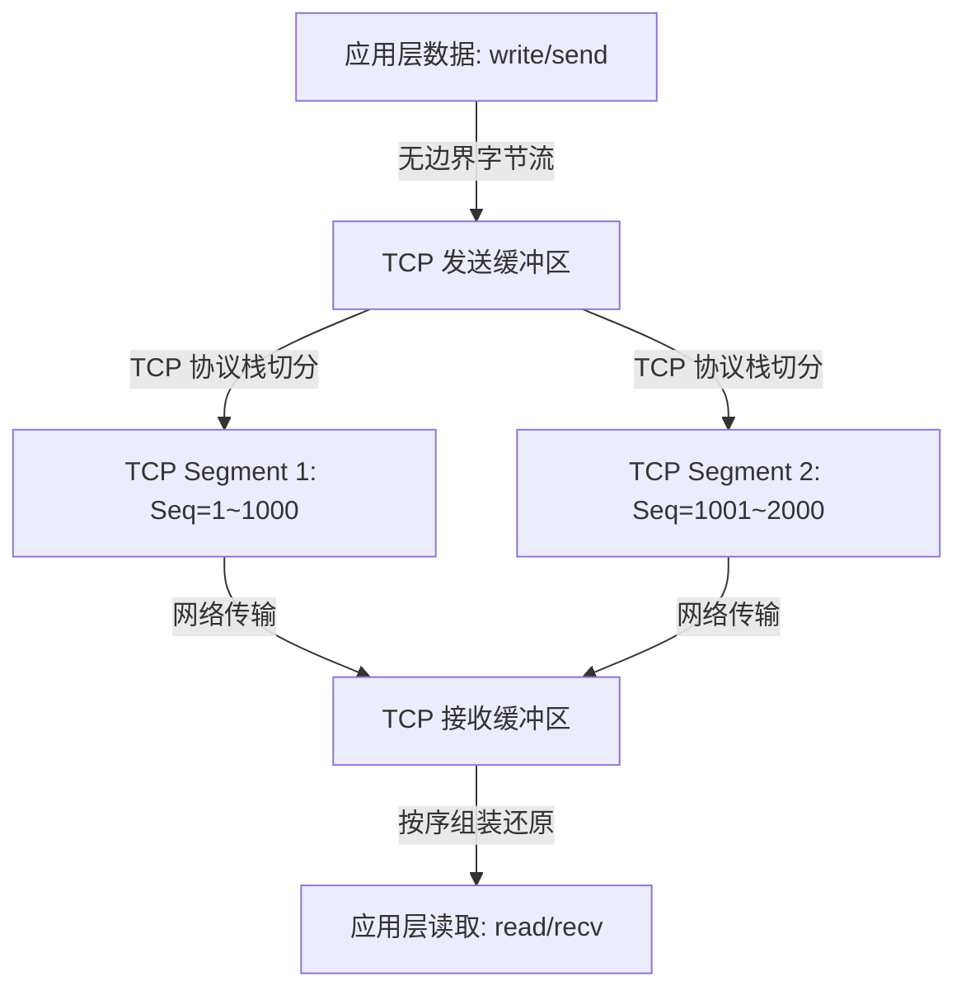

# 1.2.3.1 TCP协议

## 1. TCP 的核心设计理念与可靠性哲学

### 1.1 为什么需要 TCP？
在计算机网络体系结构中，网络层（IP 协议）被设计为一个“尽力而为”（Best-effort）的、无连接的、不可靠的分组传送系统。IP 协议的核心任务是将 IP 分组从源端主机路由到目的端主机，但它不保证分组的送达时间，不保证分组的顺序，不保证分组不重复，也不保证分组在传输过程中不被损坏或丢失。

这种设计源于经典的**端到端原则（End-to-End Principle）**：将底层的网络层尽可能简化，以提高路由和转发的效率；而将可靠性的复杂性推向两端的主机。在不可靠的 IP 网络层之上，为了向应用层提供安全、可靠、按序且无差错的数据传输通道，传输层引入了 TCP（Transmission Control Protocol，传输控制协议）。

TCP 协议的核心功能可以总结为以下几点：
1. **面向连接（Connection-oriented）**：在数据传输之前，通信双方必须通过特定的握手机制建立逻辑上的关联。这种连接并非物理上的独占通路，而是两端主机内核中相关协议控制块状态的同步与维护。
2. **可靠传输（Reliability）**：通过超时重传、选择性确认（SACK）、重复确认检测等机制，确保应用层发送的每一个字节都能且仅能一次性正确送达接收端。
3. **基于字节流（Byte Stream）**：将应用层交付的数据视为无结构的字节序列，屏蔽了底层数据报文段（Segment）的封装细节。
4. **双向端到端（Full-Duplex & End-to-End）**：在单一连接上，允许数据在两个方向上同时独立传输，每一方都拥有独立的发送和接收通道。

---

### 1.2 “面向连接”的计算机底层本质
在通俗理解中，人们常将 TCP 连接比喻为一条“管道”或“电话线”。然而在计算机底层，**连接的本质是两端主机内存中维护的“协议状态机”与“控制块”的逻辑规约**。

以 Linux 内核为例，当应用程序创建一个 TCP 套接字并成功建立连接后，内核会在内存中为其分配并初始化一个复杂的结构体（即 `struct tcp_sock`，它是 `struct inet_connection_sock` 以及 `struct sock` 的子集）。该结构体包含了以下关键控制信息：
- **连接状态（State）**：如 `TCP_ESTABLISHED`、`TCP_TIME_WAIT` 等，用于驱动协议状态机的跳转。
- **序号计数器**：
  - `snd_una` (Send Unacknowledged)：发送且未收到确认的第一个字节序号。
  - `snd_nxt` (Send Next)：下一个准备发送的字节序号。
  - `rcv_nxt` (Receive Next)：期望收到的下一个字节序号。
- **滑动窗口与拥塞控制参数**：如发送窗口大小（`snd_wnd`）、接收窗口大小（`rcv_wnd`）以及拥塞窗口（`snd_cwnd`）、慢启动阈值（`snd_ssthresh`）等。
- **重传与控制定时器**：如重传定时器（Retransmission Timer）、坚持定时器（Persist Timer）、保活定时器（Keepalive Timer）等。
- **缓冲区队列指针**：指向发送队列（`write_queue`）、接收队列（`receive_queue`）以及带外数据缓存区的链表。

网络中并不存在任何物理“连接”线，所有的物理中间设备（如路由器、交换机）仅负责将 IP 包作为独立的数据单元进行路由和转发。当发送端发出一个 TCP 报文段时，接收端根据该报文段头部的五元组（源 IP、源端口、目的 IP、目的端口、传输层协议）定位到内存中的 `struct sock`，并根据报文段中的 Seq、Ack、Flags 等字段更新该结构体的内部状态。只要双方的控制块能够按照 RFC 协议约定的规则进行同步和交互，逻辑上的“连接”就宣告存在。

---

### 1.3 字节流（Byte Stream）与报文段（Segment）的关系与边界划分

#### 1. 字节流与报文段的定义与转换
应用层与 TCP 交互时，使用的是**字节流（Byte Stream）**模型。这意味着：
- 发送方应用程序调用 `write()` 或 `send()` 写入数据时，TCP 并不保证写入的字节块会作为一个独立的网络数据包发出。写入的数据仅仅是被追加到了内核的 TCP 发送缓冲区中。
- 接收方应用程序调用 `read()` 或 `recv()` 读取数据时，也无法预知内核接收缓冲区中当前积累了多少字节。应用层只能指定读取的字节数，TCP 会将其作为无边界的连续字节序列交付。

为了在网络中实际传输，TCP 协议栈必须将发送缓冲区中的字节序列切分为若干个物理传输单元，这被称为**报文段（Segment）**。字节流向报文段的切分过程是动态的，受到以下因素的严格制约：
- **最大报文段长度（MSS, Maximum Segment Size）**：限制了单个 TCP 报文段中数据载荷的最大物理大小。
- **滑动窗口与拥塞窗口**：限制了当前允许发送的最大数据量。
- **发送时机算法（如 Nagle 算法）**：决定是立即发送小块数据，还是等待数据积累。



#### 2. “粘包”与“半包”的本质与应用层规避
在网络编程中，开发者常提及“粘包”与“半包”问题：
- **粘包**：发送方发送了两个独立的请求报文（如 "Hello" 和 "World"），但接收方一次 `read()` 读取到了 "HelloWorld"。
- **半包**：发送方发送了一个请求报文（如 "Hello"），但接收方第一次只读取到了 "He"，第二次读取到了 "llo"。

**从传输层协议的设计视角来看，“粘包”和“半包”是一个伪命题**。因为 TCP 协议本身就是基于无结构字节流的，在传输层根本不存在“包”（Packet）的概念。TCP 只保证发送的字节序列与接收的字节序列在顺序和内容上完全一致。

“包边界”是应用层业务协议的逻辑概念。因此，解决这一问题的责任完全在应用层。应用层必须自行设计报文格式以划分边界，常见的方案包括：
1. **固定长度（Fixed-Length）**：规定每个应用层协议帧的长度固定（如 1024 字节），不足部分用零填充。缺点是浪费带宽。
2. **特殊结束符（Delimiter-Based）**：在每个帧的末尾添加特定的字符或字符序列（如 `\r\n` 或 `\0`）。缺点是数据载荷内部若包含该字符，必须进行转义处理（如字符填充）。
3. **长度字段指示（Length-Field-Value / TLV）**：在协议帧的头部设定一个固定长度的字段，用于声明紧随其后的数据载荷的实际字节数（如 HTTP 的 `Content-Length` 头部，或自定义的 4 字节大端整数长度前缀）。这是目前最通用且高效的应用层设计模式。

#### 3. Nagle 算法与延迟确认（Delayed ACK）的交互冲突
**Nagle 算法**是为了解决早期互联网上大量“小分组”（Tinygram，如 Telnet 敲击一个字符产生 1 字节数据，却要封装 40 字节首部）导致网络拥塞的问题而设计的。其算法逻辑如下：

```text
if 有新数据要发送:
    if 待发送数据长度 >= MSS:
        立即发送该报文段
    else:
        if 发送缓冲区中存在“已发送但未收到确认（ACK）”的数据:
            将数据缓存在缓冲区中，直至收到前一个包的 ACK，或积累到 MSS 大小再发送
        else:
            立即发送
```

**延迟确认（Delayed ACK）**是接收端的优化机制。为了减少纯 ACK 报文对网络带宽的占用，接收端在收到数据后并不立即发送 ACK，而是延迟一段时间（通常为 40ms 至 200ms）。在这段延迟时间内：
- 如果接收端有数据要发往发送端，ACK 将搭载在数据包中一起发出（捎带确认，Piggybacking）。
- 如果在这段延迟时间内收到了第二个数据包，则立即发送一个 ACK 对这两个包进行累积确认。
- 如果延迟定时器超时，接收端不得不发送一个纯 ACK。

当 **Nagle 算法** 与 **延迟确认** 同时启用时，会发生著名的 **“40ms/200ms 延迟死锁”**：
1. 发送端应用层连续写入两个小数据块（如 10 字节和 20 字节）。
2. 根据 Nagle 算法，第一个 10 字节的数据块由于网络中没有未确认的数据，被立即发送。
3. 第二个 20 字节的数据块被放入发送缓冲区，因为第一个块的 ACK 尚未返回，Nagle 算法限制其发送。
4. 接收端收到了第一个 10 字节的数据包，由于只收到了一个包，且没有回传数据，延迟确认机制生效，接收端开始等待第二个包以触发累积确认，或者等待延迟定时器超时。
5. 此时，发送端在等 ACK，接收端在等第二个包，双方陷入死锁。直到接收端的延迟确认定时器超时（如 40ms），接收端发出纯 ACK，发送端收到 ACK 后才将第二个 20 字节的数据包发出。

这一交互冲突严重损害了交互式、低延迟应用（如实时 RPC 框架、分布式系统通信）的性能。在这些场景中，通常需要在套接字上通过系统调用（如 `setsockopt`）设置 `TCP_NODELAY` 选项来强制关闭 Nagle 算法，从而允许小包立即发送。

---

## 2. TCP 报文格式精细解析

TCP 首部的物理宽度为 32-bit，标准头部长度为 20 字节（不含 Options）。以下为 TCP 首部的比特级结构图：

```text
 0                   1                   2                   3
 0 1 2 3 4 5 6 7 8 9 0 1 2 3 4 5 6 7 8 9 0 1 2 3 4 5 6 7 8 9 0 1
+-+-+-+-+-+-+-+-+-+-+-+-+-+-+-+-+-+-+-+-+-+-+-+-+-+-+-+-+-+-+-+-+
|          Source Port          |        Destination Port       |
+-+-+-+-+-+-+-+-+-+-+-+-+-+-+-+-+-+-+-+-+-+-+-+-+-+-+-+-+-+-+-+-+
|                        Sequence Number                        |
+-+-+-+-+-+-+-+-+-+-+-+-+-+-+-+-+-+-+-+-+-+-+-+-+-+-+-+-+-+-+-+-+
|                      Acknowledgment Number                    |
+-+-+-+-+-+-+-+-+-+-+-+-+-+-+-+-+-+-+-+-+-+-+-+-+-+-+-+-+-+-+-+-+
|  Data |           |U|A|P|R|S|F|                               |
| Offset| Reserved  |R|C|S|S|Y|I|            Window             |
|       |           |G|K|H|T|N|N|                               |
+-+-+-+-+-+-+-+-+-+-+-+-+-+-+-+-+-+-+-+-+-+-+-+-+-+-+-+-+-+-+-+-+
|           Checksum            |         Urgent Pointer        |
+-+-+-+-+-+-+-+-+-+-+-+-+-+-+-+-+-+-+-+-+-+-+-+-+-+-+-+-+-+-+-+-+
|                    Options (if any) ...                       |
+-+-+-+-+-+-+-+-+-+-+-+-+-+-+-+-+-+-+-+-+-+-+-+-+-+-+-+-+-+-+-+-+
|                             Data                              |
+-+-+-+-+-+-+-+-+-+-+-+-+-+-+-+-+-+-+-+-+-+-+-+-+-+-+-+-+-+-+-+-+
```

### 2.1 源端口与目的端口（Mux/Demux 寻址）
源端口（Source Port）和目的端口（Destination Port）各占 16 位，这限制了端口号的范围为 $0 \sim 65535$。
在计算机网络中，IP 头部指明了源主机和目的主机的 IP 地址，解决了“主机到主机”的寻址。而传输层的端口号则解决了“进程到进程”的通信，实现了**多路复用（Multiplexing）与多路分解（Demultiplexing）**：

- **多路复用**：发送端不同的应用进程通过各自的套接字将数据源源不断地送入传输层，传输层为这些数据加上包含源端口和目的端口的 TCP 首部，统一交由网络层发送。
- **多路分解**：接收端的传输层根据收到报文段中的目的端口，将数据分发给特定的套接字，从而递交给对应的应用进程。

#### 内核寻址匹配机制
在操作系统内核层面，网络栈在接收到 IP 分组并剥离 IP 头部后，会提取 TCP 头部的源 IP、源端口、目的 IP、目的端口这四个字段。
对于已建立连接的套接字，内核会维护一个哈希表（Established Hash Table）。内核会使用这四个字段（加上协议类型组成五元组）作为键进行 Hash 计算，调用类似 `__inet_lookup_established()` 的函数检索哈希表，定位到对应的套接字控制块 `struct sock`。
如果未能在已建立连接的表中找到匹配项，内核会转向监听套接字哈希表（Listening Hash Table），仅根据“目的 IP + 目的端口”进行查找，以响应新的连接请求。若发送端尝试与一个未开启监听的端口建立连接，接收端的内核会在检索失败后，自动回复一个携带 `RST` 标志的复位报文段。

---

### 2.2 序号（Seq）与确认号（Ack）的累加与同步机制

#### 1. 概念物理意义
- **序号（Sequence Number, Seq）**：占 32 位。它代表本报文段所发送的数据载荷中**第一个字节在整个字节流中的绝对偏移序号**。例如，一个报文段的 Seq 为 1001，数据载荷长度为 500 字节，这说明该报文段包含了字节流中序号为 $1001 \sim 1500$ 的数据。
- **确认号（Acknowledgment Number, Ack）**：占 32 位。只有在控制位 `ACK` 为 1 时才有效。它代表**接收方期望收到对方下一个报文段的第一个字节序号**。TCP 采用的是**累积确认（Cumulative Acknowledgment）**机制。如果接收方回复的 Ack 值为 $N$，意味着接收方已经正确无误地接收了序号在 $N-1$ 之前（含 $N-1$）的所有字节数据。

#### 2. 握手与挥手期间序号消耗的逻辑
在建立连接的 SYN 报文段和释放连接的 FIN 报文段中，即使报文段不携带任何应用层数据载荷（Payload 长度为 0），它们依然需要消耗 1 个序号值。
这是因为 **SYN 和 FIN 控制位在逻辑上需要被对方确认**。如果 SYN 或 FIN 不消耗序号，那么接收方在回复 ACK 时，其确认号（Ack）将无法发生递增，发送方也就无法通过 Ack 值的变化来判定 SYN 或 FIN 是否已经被对方安全接收。
而普通的纯 ACK 确认报文段，若不携带任何数据，则不需要被确认，因此它不消耗任何序号。

#### 3. 初始化序号（ISN）的安全设计与 RFC 1948 算法
在 TCP 连接建立时，双方需要同步各自的初始序列号（ISN, Initial Sequence Number）。
**为什么 ISN 不能固定从 0 开始，或者进行简单的线性递增？**
1. **防止历史连接的数据混淆**：若网络中存在由于路由延迟滞留的旧报文段（称作“迷失的重复分组”），当旧连接释放且新连接在相同的四元组上迅速建立时，如果新连接的 ISN 依然从 0 开始，这个迟到的旧报文段其序号可能恰好落在新连接的接收窗口内。这会导致接收端错误地将其当作新数据接收，造成应用层数据的严重损坏。
2. **防范 TCP 序列号欺骗攻击（TCP Sequence Number Prediction Attack）**：
   如果 ISN 的生成算法是可预测的（例如线性递增），攻击者可以伪造一个受信任的源 IP 地址向目标服务器发送 `SYN` 包。服务器会向这个伪造的 IP（攻击者收不到此包）回复 `SYN-ACK`。如果攻击者能准确预测出服务器在此 `SYN-ACK` 中填写的 ISN，攻击者就可以直接伪造第三次握手的 `ACK` 报文段（将 Ack 设定为预测的 $ISN + 1$），从而在服务器端成功假冒信任 IP 建立起一条虚假的 TCP 连接，并可借此执行恶意的控制命令。

为了解决该安全隐患，RFC 1948 提出了基于加密哈希的 ISN 生成算法。现代操作系统内核（如 Linux）普遍实现了这一算法：

$$ISN = M + Hash(LocalIP, LocalPort, ForeignIP, ForeignPort, SecretKey)$$

其中：
- $M$ 是一个系统全局的时钟计数器，通常每 4 微秒递增 1，确保即使在相同端口复用时，ISN 也会随时间单调递增，从而避开历史报文的重叠。
- $Hash$ 是一个单向加密哈希函数（如 MD5 或 SHA-256）。
- $SecretKey$ 是操作系统内核在启动时随机生成的一个 128 位隐秘密钥，外部攻击者无法获取。

通过这种设计，对于不同的连接，其哈希值完全随机且不可预测；而对于同一个四元组的连接，其 ISN 随时间单调递增。这在数学上彻底粉碎了攻击者预测序列号的企图。

---

### 2.3 数据偏移与保留位
- **数据偏移（Data Offset）**：占 4 位。它的物理意义是 **TCP 头部的长度**。由于 4 位能表示的最大数值为 15，且该字段的单位为 **32 位字（即 4 字节）**，因此 TCP 头部的最大长度为 $15 \times 4 = 60$ 字节。因为 TCP 的固定头部占用 20 字节，这意味着 TCP 首部的 **Options（选项）字段最大只能占用 40 字节**。
- **保留位（Reserved）**：占 3 位。在 TCP 的最初设计中保留位为 6 位，但随着协议演进，其中 3 位被占用来支持 ECN（Explicit Congestion Notification，显式拥塞通知）相关标记：
  - **NS (Nonce Sum)**：用于保护 ECN 机制免受接收端恶意欺骗的实验性标志。
  - **CWR (Congestion Window Reduced)**：拥塞窗口减少标志。当发送方收到 ECE 标志时，通过设置此位告知接收方已减小拥塞窗口。
  - **ECE (ECN-Echo)**：ECN 回显标志。若在 IP 首部检测到拥塞标记（CE），接收方会置此位以通知发送方。

---

### 2.4 控制位（Flags）的精确控制语义与状态机转换驱动

TCP 头部包含了 9 个控制位（通常称为 Flags），它们用于控制 TCP 的状态跃迁和连接管理：

1. **URG (Urgent)**：紧急指针有效标志。为 1 时，表明紧急指针字段有效，提示系统此报文段中包含紧急数据。
2. **ACK (Acknowledgment)**：确认标志。为 1 时确认号有效。**除连接建立的第一个 SYN 报文段外，所有后续发送的报文段都必须将 ACK 置为 1**。
3. **PSH (Push)**：推送标志。接收端收到 `PSH=1` 的报文段后，应立即将接收缓冲区中的数据推给应用层，而不是等待缓冲区填满。
4. **RST (Reset)**：复位标志。用于强行终止一个异常连接，或者拒绝一个非法的连接请求。
5. **SYN (Synchronize)**：同步标志。在建立连接时用于同步双方的初始序列号（ISN）。
6. **FIN (Finish)**：终止标志。表示发送方已无数据发送，请求释放连接。

#### PSH 与 URG 的本质区别
- **PSH** 是为了**控制数据的交付时机**。它不改变数据的逻辑顺序，只是通知接收端的协议栈：“不要在内核中积压这些数据了，立刻把它们送给应用层”。例如，在 SSH 终端交互中，用户每敲击一次键盘，字符都需要被立即响应，此时发送的报文段就会设置 PSH 标志。
- **URG** 是为了**传递带外（Out-of-Band）的紧急控制信号**。当 URG 置 1 时，报文段中的紧急指针会指示紧急数据的位置。即使接收端当前的读取指针由于前面数据的积压而停滞，内核也会优先通知应用进程读取紧急数据（如在传输大文件时用户按下了 `Ctrl+C` 中断信号）。

#### TCP 11 种状态机变迁驱动表
TCP 的状态转换是一个严格的确定性有限状态机（FSM）。以下为核心状态跃迁的驱动逻辑：

| 当前状态 | 触发事件（收到/发送） | 动作与控制位 | 跃迁至新状态 |
| :--- | :--- | :--- | :--- |
| **CLOSED** | 应用程序主动打开 (Active Open) | 发送 `SYN=1`, 初始化 Seq | **SYN_SENT** |
| **CLOSED** | 应用程序被动打开 (Passive Open) | 创建 Listening Socket | **LISTEN** |
| **LISTEN** | 收到 `SYN=1` | 发送 `SYN=1, ACK=1` | **SYN_RCVD** |
| **SYN_SENT** | 收到 `SYN=1, ACK=1` | 发送 `ACK=1` | **ESTABLISHED** |
| **SYN_SENT** | 收到 `SYN=1` (同时打开) | 发送 `SYN=1, ACK=1` | **SYN_RCVD** |
| **SYN_RCVD** | 收到 `ACK=1` | 无 | **ESTABLISHED** |
| **ESTABLISHED**| 应用程序主动关闭 (Active Close) | 发送 `FIN=1` | **FIN_WAIT_1** |
| **ESTABLISHED**| 收到 `FIN=1` (被动关闭) | 发送 `ACK=1` | **CLOSE_WAIT** |
| **FIN_WAIT_1** | 收到 `ACK=1` | 无 | **FIN_WAIT_2** |
| **FIN_WAIT_1** | 收到 `FIN=1` | 发送 `ACK=1` | **CLOSING** |
| **FIN_WAIT_1** | 收到 `FIN=1, ACK=1` | 发送 `ACK=1` | **TIME_WAIT** |
| **FIN_WAIT_2** | 收到 `FIN=1` | 发送 `ACK=1` | **TIME_WAIT** |
| **CLOSE_WAIT** | 应用程序调用 `close()` | 发送 `FIN=1` | **LAST_ACK** |
| **LAST_ACK** | 收到 `ACK=1` | 无 | **CLOSED** |
| **CLOSING** | 收到 `ACK=1` | 无 | **TIME_WAIT** |
| **TIME_WAIT** | 2MSL 超时自动触发 | 无 | **CLOSED** |

#### TIME_WAIT 与 CLOSE_WAIT 的深层解析
在实际生产环境中，服务器经常会遇到大量的 `TIME_WAIT` 或 `CLOSE_WAIT` 状态连接，它们代表了完全不同的底层成因与系统开销：

1. **TIME_WAIT 状态（主动关闭方进入）**：
   主动关闭连接的一方在回复最后一个 ACK 后，必须在 `TIME_WAIT` 状态下等待 **2MSL（Maximum Segment Lifetime，最大报文生存时间）** 的时间才能彻底关闭。
   - **为什么需要等待 2MSL？**
     - **保证最后的 ACK 安全送达**：如果主动关闭方发送的最后一个 ACK 丢失，被动关闭方会超时重传其 FIN 报文。如果主动关闭方不等待直接关闭，收到重传的 FIN 后会回复 RST，导致被动关闭方判定为连接异常中断。TIME_WAIT 确保有足够的时间重新发送丢失的 ACK。
     - **清除网络残留分组**：2MSL 的时间足以让本次连接中产生的所有报文分组在网络中因为 TTL 过期而被丢弃，确保新建立的连接（若复用了相同的四元组）不会收到旧连接的历史失效报文。
   - **优化与隐患**：大量的 TIME_WAIT 会占用系统文件描述符和端口资源。可通过内核参数 `tcp_tw_reuse` 允许重用处于 TIME_WAIT 状态的端口，但前提是必须开启 `tcp_timestamps`，利用时间戳机制（PAWS）来过滤过期报文。注意，曾经的 `tcp_tw_recycle`（快速回收）由于在 NAT 网络下会导致大量合法客户端的同步包被服务器误丢弃，已在 Linux 4.12 中被彻底废弃。

2. **CLOSE_WAIT 状态（被动关闭方进入）**：
   当接收到对方发送的 FIN 并回复 ACK 后，本端进入 `CLOSE_WAIT` 状态。此时，TCP 的半关闭特性允许本端继续向对方发送数据。
   - **为什么会产生大量的 CLOSE_WAIT？**
     - `CLOSE_WAIT` 是**应用层代码的责任**。如果在收到对方的关闭信号后，应用层由于线程池挂起、业务逻辑阻塞或设计缺陷，**忘记调用 `close()` 系统调用**，连接将永久处于 `CLOSE_WAIT` 状态。
     - **危害**：CLOSE_WAIT 状态的连接不会被系统自动回收，它会持续占用系统文件描述符（FD）。当 FD 被耗尽时，服务器会抛出 `Too many open files` 错误，导致无法接受任何新连接。

---

### 2.5 窗口大小（Window Size）指针与滑动窗口机制
TCP 首部中的 **Window Size** 字段占 16 位，代表的是**接收端通告的接收窗口（rwnd, Receiver Window）**。它的物理意义是：**接收端当前空闲的接收缓冲区大小（以字节为单位）**。

#### 滑动窗口的物理意义
TCP 利用滑动窗口机制来实现**流量控制（Flow Control）**，防止发送端发送速度过快，导致接收端缓冲区溢出而丢包。
在发送端，发送缓冲区中的字节序列可以被划分为四个逻辑区间：

```text
  SND.UNA (发送且未被确认的第一个字节)
    |
    v
+---+-------------------+-------------------+---------------+
| 1 |  2 (已发送未确认)  |  3 (未发送可发送)  | 4 (不可发送)   |
+---+-------------------+-------------------+---------------+
                        ^                   ^
                        |                   |
                     SND.NXT             SND.UNA + SND.WND
```

1. **已发送并已收到确认**的字节。
2. **已发送但尚未收到确认**的字节（SND.UNA 至 SND.NXT 之前）。
3. **允许发送但尚未发送**的字节（SND.NXT 至窗口右边界）。
4. **不允许发送**的字节（超出滑动窗口范围）。

发送窗口的大小 $SND.WND = \min(cwnd, rwnd)$。发送端发送的数据量（即已发送未确认的字节数 $SND.NXT - SND.UNA$）在任何时刻都不能超过 $SND.WND$。

#### 零窗口探测与坚持定时器
当接收端的应用程序读取速度慢于发送速度时，接收缓冲区会被逐渐填满，此时接收端会在 ACK 报文段中通告 `Window Size = 0`（即零窗口，Zero Window）。
收到零窗口通知后，发送端必须停止发送数据。然而，一旦接收端的应用程序读取了数据，释放了缓冲区，接收端会发出一个“窗口更新”报文段。
**如果这个窗口更新报文段在传输过程中丢失，双方就会陷入死锁**：发送端在等待窗口更新，而接收端认为已经通知了发送端，也在等待新数据。

为了打破这种死锁，TCP 设计了**坚持定时器（Persist Timer）**：
- 当发送端收到零窗口宣告时，便启动坚持定时器。
- 定时器超时后，发送端会向接收端发送一个 **零窗口探测报文段（Zero Window Probe, ZWP）**。该报文段仅携带 1 字节的数据（该字节占用序号，但即使被丢弃也无伤大雅）。
- 接收端收到探测报文段后，必须回复一个 ACK，并在其中宣告当前的接收窗口大小。
- 如果接收窗口依然为 0，发送端将重置坚持定时器并加倍超时时间（指数退避），继续等待；如果窗口已恢复，则恢复正常的数据发送。

---

### 2.6 校验和（Checksum）的计算与伪首部安全设计
TCP 首部中的 **Checksum** 占 16 位。它用于检测 TCP 报文段在传输过程中是否发生了比特差错。

#### 为什么链路层和网络层有了校验，传输层还需要校验？
以太网在链路层有 FCS（Frame Check Sequence，通常为 CRC-32 校验），IP 层在网络层也有首部校验和。为什么传输层还要多此一举？
1. **端到端原则的贯彻**：以太网的 FCS 只能保证报文段在单一物理链路上的传输正确性。当报文段通过路由器时，路由器会剥离链路层首部并重新封装，此时如果路由器的内存（如缓冲队列）发生硬件比特翻转，链路层校验将无法检测出这种错误。
2. **IP 校验和只保护首部**：IP 协议的校验和仅对其 IP 首部进行校验，并不保护 IP 数据载荷（即其中的 TCP 报文段）。因此，必须由传输层来实现端到端的数据完整性校验。

#### 伪首部（Pseudo Header）的设计
为了进一步增强安全性，TCP 校验和的计算范围不仅包括 TCP 头部和数据载荷，还包含了一个逻辑上的**伪首部（Pseudo Header）**。伪首部在网络传输中并不实际存在，它仅仅在计算和验证校验和时被临时拼接到 TCP 报文段之前。

IPv4 伪首部的结构如下：

```text
 0                   1                   2                   3
 0 1 2 3 4 5 6 7 8 9 0 1 2 3 4 5 6 7 8 9 0 1 2 3 4 5 6 7 8 9 0 1
+-+-+-+-+-+-+-+-+-+-+-+-+-+-+-+-+-+-+-+-+-+-+-+-+-+-+-+-+-+-+-+-+
|          Source IPv4 Address (源 IP 地址，32 位)              |
+-+-+-+-+-+-+-+-+-+-+-+-+-+-+-+-+-+-+-+-+-+-+-+-+-+-+-+-+-+-+-+-+
|       Destination IPv4 Address (目的 IP 地址，32 位)          |
+-+-+-+-+-+-+-+-+-+-+-+-+-+-+-+-+-+-+-+-+-+-+-+-+-+-+-+-+-+-+-+-+
|    Zeros (8位)  | Protocol (8位) |     TCP Length (16 位)     |
+-+-+-+-+-+-+-+-+-+-+-+-+-+-+-+-+-+-+-+-+-+-+-+-+-+-+-+-+-+-+-+-+
```

其中：
- **Protocol**：对于 TCP 协议，该值为固定值 6（0x06）。
- **TCP Length**：TCP 报文段的总长度（TCP 头部长度 + 数据载荷长度，不含伪首部）。

**引入伪首部的核心原因**：
是为了防止 IP 路由发生错误而导致报文段被投递到错误的目的主机。如果 IP 层由于路由表的硬件差错，将发往主机 A 的数据包投递给了主机 B，而主机 B 上恰好有进程在监听相同的端口，如果没有伪首部，主机 B 的 TCP 协议栈在校验 TCP 头部和数据时会发现完全正确，从而将数据交付给应用层，导致严重的数据混乱。
引入伪首部后，由于伪首部中包含了源 IP 和目的 IP，主机 B 的 TCP 协议栈在计算校验和时，使用自己的 IP 作为目的 IP 进行计算，最终得出的校验和必然与发送端计算的校验和不一致，从而能够直接检测出路由投递错误，将该报文段丢弃。

#### 校验和算法二进制实例与计算步骤
TCP 校验和使用的是 **16 位二进制反码求和（Ones' Complement Sum）** 算法。
为了便于理解，我们用一个简化的 16 位二进制累加例子来展示其数学过程。假设待校验的 16 位字仅有三个（十六进制表示）：`0x4500`、`0x003C`、`0xFFFF`。

1. **累加过程**：
   - 累加前两个数：
     ```text
       0x4500
     + 0x003C
     ----------
       0x453C
     ```
   - 累加第三个数：
     ```text
       0x453C
     + 0xFFFF
     ----------
      0x1453B  <-- 产生了高位进位 (Carry-out = 1)
     ```
   - **循环进位（End-around Carry）**：将溢出的最高位进位 `1` 重新加到结果的最低位：
     ```text
       0x453B
     + 0x0001
     ----------
       0x453C
     ```
2. **按位取反**：
   对累加结果 `0x453C`（二进制 `0100 0101 0011 1100`）进行按位取反操作，得到 `0xBAC3`（二进制 `1011 1010 1100 0011`），这即为写入首部的 Checksum 值。
3. **接收端验证**：
   接收端收到数据后，将这三个字以及 Checksum 值 `0xBAC3` 一起进行反码求和累加：
   ```text
     0x453C (前三数字之和)
   + 0xBAC3 (校验和)
   ----------
     0xFFFF (二进制 1111 1111 1111 1111)
   ```
   累加结果为 `0xFFFF`，按位取反后为 `0x0000`，说明数据传输中未发生任何比特差错。

---

### 2.7 紧急指针与带外数据（OOB）
紧急指针（Urgent Pointer）占 16 位，只有当控制位 `URG = 1` 时才有效。它是一个相对偏移量，与当前报文段首部的序号（Seq）相加，指向该报文段中**紧急数据（Out-of-Band Data）的最后一个字节的下一个字节**。

#### 带外数据的局限性与实现冲突
虽然被称为“带外数据”，但 TCP 并没有为其开辟一条物理上的独立通道。紧急数据依然是和普通数据混杂在同一个字节流中传输的，仅仅是通过首部的紧急指针做了一个逻辑标记。

在实际应用中，紧急指针存在两个严重的缺陷：
1. **规范不一致的协议歧义**：RFC 793 规定紧急指针指向紧急数据的最后一个字节；而随后的 RFC 1122 纠正为指向紧急数据的最后一个字节的下一个字节。这一历史包袱导致了不同操作系统内核（如 Linux 与 Windows）在紧急指针的实现细节上存在兼容性差异，导致接收端在提取紧急字节时极易发生数据截断或错位。
2. **带宽限制与信道争抢**：TCP 的带外数据通道实际上只能传输 1 个字节的紧急信号，若连续发送多个 URG 包，前一个紧急字节会在内核中被后来的覆盖。此外，Linux 内核收到 URG 包时，会向拥有该套接字的进程发送 `SIGURG` 信号，进程需使用带 `MSG_OOB` 标志的 `recv` 调用来读取。这种复杂的信号中断机制使得系统极其脆弱，容易产生死锁或并发冲突。
因此，在现代网络编程中，除了极少数遗留的控制协议（如 Telnet, FTP 控制连接），几乎所有的现代应用都废弃了紧急指针，转而通过在应用层设计独立的控制信道来传输控制命令。

---

## 3. TCP 选项 (Options) 深度剖析

TCP 选项是 TCP 协议具备良好可扩展性的核心设计。每个选项都采用经典的 **TLV (Type-Length-Value)** 或 **TV (Type-Value)** 格式进行封装。由于 TCP 头部最大 60 字节的限制，扣除 20 字节固定头部，**所有启用的 Options 占用的空间总和绝对不能超过 40 字节**。

---

### 3.1 最大报文段长度 MSS (Maximum Segment Size)

#### 1. MSS 与 MTU 的物理及数学关系
- **MTU (Maximum Transmission Unit，最大传输单元)**：是数据链路层（物理网卡）对能够传输的物理帧中 IP 分组长度的限制。例如，以太网（Ethernet II）的标准 MTU 为 1500 字节。
- **MSS (Maximum Segment Size)**：是 TCP 报文段中**数据载荷部分的最大长度**，不包含 TCP 首部和 IP 首部。

在没有启用其他 TCP 选项时，两者满足如下数学关系：

$$MSS = MTU - sizeof(IPv4\ Header) - sizeof(TCP\ Base\ Header)$$

对于 IPv4，默认的 IP 头部为 20 字节，TCP 固定头部为 20 字节，因此：

$$MSS = 1500 - 20 - 20 = 1460 \text{ 字节}$$

对于 IPv6，由于其 IP 首部固定长度为 40 字节，因此在相同 MTU 下：

$$MSS = 1500 - 40 - 20 = 1440 \text{ 字节}$$

#### 2. 为什么要在三次握手时协商 MSS？
在连接建立的阶段，双方会在发送的 `SYN` 报文段中通过 MSS 选项通告自己能够接收的最大报文段大小。双方最终会选择**两者通告值中的较小者**作为该连接后续发送数据的 MSS 上限。

**协商 MSS 的核心目的，是为了避免在 IP 层发生分片（IP Fragmentation）**。

#### 3. IP 分片对 TCP 可靠性的毁灭性打击
当 IP 层需要发送一个长度大于出口物理链路 MTU 的分组时，IP 层会将该分组切分为多个较小的 IP 分片，每个分片独立路由并在目的端主机的 IP 层进行重组。
这一机制在传输层看来是完全透明的，但对 TCP 的可靠性却带来了致命威胁：
1. **无独立的重传机制**：IP 协议是不可靠的，IP 分片没有自己的传输层序号，也没有确认机制。如果一个 TCP 报文段被切分为 3 个 IP 分片，只要其中任何一个分片在传输中丢失，接收端主机的 IP 层就无法完成重组，只能将已收到的分片全部丢弃。
2. **雪崩效应**：在传输层看来，整个 TCP 报文段丢失了。TCP 将被迫重传这整个报文段。重传的报文段在经过相同的物理链路时，会再次被切分为 3 个 IP 分片。只要其中有一个分片丢失，重传便再次宣告失败。这会导致网络吞吐量呈断崖式下跌，甚至引发网络雪崩。

因此，TCP 必须在传输层通过协商 MSS，将发出的每个报文段的大小控制在路径 MTU 之内，使得 IP 层在传输过程中永远不需要进行分片。

#### 4. 路径 MTU 发现（PMTUD）机制与“ICMP 黑洞”
为了动态探测整条路径上的最小 MTU，TCP 引入了**路径 MTU 发现（PMTUD, Path MTU Discovery）**机制：
1. 发送端在发送 IP 包时，在 IP 首部的 Flags 字段中将 **DF (Don't Fragment，不分片)** 标志位置为 1。
2. 当该 IP 包经过路径中某个 MTU 较小的路由器时，路由器由于无法在不分片的情况下转发该包，会将其丢弃，并向发送端回传一个 **ICMP Type 3, Code 4 (Fragmentation Needed and DF set)** 的差错报文。该 ICMP 报文中会明确告知发送端该出口链路的 MTU 大小。
3. 发送端收到该 ICMP 报文后，会将该连接的 MSS 调小，并重新发送。
4. 重复此过程，直到 IP 包能够顺利到达目的地。

**PMTUD 黑洞问题**：
在实际网络环境中，许多安全设备会拦截并丢弃所有类型的 ICMP 报文。这导致发送端发出的 `DF=1` 的大包被丢弃后，发送端却永远收不到 ICMP 差错报文。发送端只能不断地超时重传，连接就此挂起。
为了解决这一问题，现代网络通常在边界设备上部署 **MSS Clamping（MSS 钳制）** 机制：当 SYN 报文段通过网关时，网关会直接改写 TCP 首部 Options 里的 MSS 值，使其强制不超过网关的物理链路 MTU 限制，从而规避了对物理 ICMP 路径探测的依赖。

---

### 3.2 窗口扩大因子 WSO (Window Scale Option)

#### 1. 带宽延迟积（BDP）与传统 16 位窗口的局限
**带宽延迟积（BDP, Bandwidth-Delay Product）** 定义了网络管道的物理容量：

$$BDP = Bandwidth \times RTT$$

例如，一条跨洋光缆的带宽为 $10 \text{ Gbps}$，往返时延（RTT）为 $100 \text{ ms}$。那么该链路的 BDP 为：

$$BDP = 10 \times 10^9 \text{ bits/s} \times 0.1 \text{ s} = 1 \times 10^9 \text{ bits} = 125 \text{ MB}$$

这意味着，在任何时刻，该网络管道中最多可以容纳 125 MB 的数据在“飞驰”。

然而，TCP 标准首部中的 **Window Size** 字段仅占 16 位，最大只能表示：

$$2^{16} - 1 = 65535 \text{ 字节} \approx 64 \text{ KB}$$

如果发送方在发送了 64 KB 数据后，因为滑动窗口耗尽，必须停下来等待一个 RTT（100ms）后才能收到确认并继续发送。那么该连接的最大理论吞吐量被限制为：

$$Throughput \le \frac{64 \text{ KB}}{100 \text{ ms}} = 640 \text{ KB/s}$$

对于一条物理容量为 1250 MB/s（10 Gbps）的物理光缆，其实际负载率仅为：

$$\frac{640 \text{ KB/s}}{1250 \text{ MB/s}} \approx 0.05\%$$

这就是经典的**长肥管道（LFN, Long Fat Network）**性能危机。

#### 2. WSO 工作原理
为了打破 64 KB 的接收窗口限制，RFC 1323 引入了 **Window Scale Option (WSO)** 选项（Kind=3, Length=3）。它包含了一个 1 字节的 **Shift Count（位移数）**，记作 $S$。

实际生效的接收窗口大小计算公式为：

$$Window_{actual} = Window_{header} \times 2^S$$

$S$ 的取值范围被限制为 $0 \le S \le 14$。当 $S=14$ 时，接收窗口最大可达到：

$$65535 \times 2^{14} = 65535 \times 16384 \approx 1.07 \text{ GB}$$

这足以完全填满现代超高速、长延迟的网络管道。

#### 3. 为什么 WSO 必须且只能在 SYN 报文段中协商？
1. **物理寻址与内存预分配**：启用 WSO 后，操作系统内核在分配接收缓冲区（Socket Receive Buffer）时，需要为其准备可能达到数兆甚至数十兆字节的物理内存空间。这必须在连接建立之初就做好内存管理规划。
2. **协议的一致性解析**：一旦连接建立，后续发送的所有普通 ACK 报文段其首部的 Window 字段物理长度依然是 16 位。接收端和发送端必须在握手阶段就确定好位移量 $S$，后续发送端收到 ACK 时，会自动将首部中的 16 位值左移 $S$ 位来还原真实的空闲窗口大小。如果允许在通信中途修改 $S$，会导致通信双方对窗口大小的理解发生错乱，极易引发发送超限或缓冲区溢出。

---

### 3.3 选择性确认 SACK (Selective Acknowledgment)

#### 1. 累积确认机制下的重传痛点
在传统的累积确认机制下，假设发送端发送了序号为 $1 \sim 10$ 的十个 TCP 报文段，其中第 3 个和第 5 个报文段在网络中丢失，其余均被接收端正确接收并缓存在了接收缓冲区中。

由于累积确认只报告“连续接收到的最大序号”，接收端只能向发送端持续回复 `ACK=3` 的确认报文段。
发送端连续收到 3 个冗余的 `ACK=3` 后，触发快速重传机制，重传第 3 个报文段。但此时，发送端面临一个抉择：
- **回退 N 步 (Go-Back-N)**：重传第 3 个包及之后的所有包（3, 4, 5, 6, 7, 8, 9, 10）。缺点是显而易见的，第 4、6~10 个报文段明明已经安全送达并缓存，重传它们造成了极大的带宽浪费。
- **只重传第 3 个包**：发送端在重传第 3 个包后，开始等待确认。当收到第 3 个包的确认时，接收端会回复 `ACK=5`（因为第 5 个包丢了）。发送端收到 `ACK=5` 后，才知道第 5 个包也丢了，再重传第 5 个包。这种方案的致命弱点在于，每发现一个丢包，都需要消耗一个独立的 RTT，在多包丢失场景下效率极低。

#### 2. SACK 选项的结构设计（RFC 2018）
SACK 通过在连接建立时协商 `SACK-Permitted` 选项（Kind=4, Length=2）来启用。
启用后，当接收端收到不连续的数据块时，会在其发送的 ACK 报文段中附加 **SACK 选项**（Kind=5）。

SACK 选项的数据结构由多个 **SACK 块（Block）** 组成，每个 SACK 块包含 2 个 32 位无符号整数，分别代表非连续数据块的边界：
- **Left Edge（左边界）**：该不连续数据块的第一个字节序号。
- **Right Edge（右边界）**：该不连续数据块的最后一个字节序号的下一个序号（即开区间右端点）。

```text
SACK 选项格式:
+--------+--------+-------------------------+-------------------------+
| Kind=5 | Length | Left Edge of 1st Block  | Right Edge of 1st Block |
+--------+--------+-------------------------+-------------------------+
|                 | Left Edge of 2nd Block  | Right Edge of 2nd Block |
+-----------------+-------------------------+-------------------------+
```

#### 3. 字节对齐限制与块数量上限计算
由于 TCP 首部选项字段最大只能容纳 40 字节，我们可以精确计算出单个 TCP 首部中最多能容纳的 SACK 块数量：
1. SACK 选项本身的头部占用 2 字节（1 字节 Kind=5，1 字节 Length）。
2. 每个 SACK 块（左边界 4 字节 + 右边界 4 字节）占用 8 字节。

在**不使用其他选项**的情况下，最大可容纳的块数为：

$$N_{max} = \lfloor \frac{40 - 2}{8} \rfloor = 4 \text{ 个 SACK 块}$$

在**同时启用时间戳选项**（Timestamp 占用 10 字节，为了 4 字节对齐通常会追加 2 个 NOP 字节，共占用 12 字节）的情况下，留给 SACK 选项的可用空间仅剩 $40 - 12 = 28$ 字节。此时最大可容纳的块数为：

$$N_{max} = \lfloor \frac{28 - 2}{8} \rfloor = 3 \text{ 个 SACK 块}$$

#### 4. D-SACK (Duplicate SACK) 工作原理
RFC 2883 定义了 D-SACK（重复选择性确认）。D-SACK 规定：**如果接收端收到了重复的报文段，它会利用 SACK 选项的第一个块来报告这一重复报文段的序号范围**。

D-SACK 的核心物理作用是**消除重传的二义性**，帮助发送端区分：
- 重传的包是否是因为网络延时导致的“虚假重传”（Spurious Retransmission）。
- 发送端通过分析 D-SACK，如果发现接收端报告的重复块正是自己刚刚重传的包，就说明该包并没有丢失，只是之前的 ACK 延迟了。发送端据此可以撤销（Undo）之前由于误判丢包而做出的拥塞窗口减半决策，从而维持了高吞吐量。

---

### 3.4 时间戳选项 (TCP Timestamps)与 RTT 估算算法

#### 1. RTT 估算演进与 Karn 算法的局限
精确的往返时间（RTT）估算是 TCP 动态计算超时重传时间（RTO）的基石。

在没有时间戳选项的早期 TCP 中，发送端对 RTT 的测量采用的是“采样法”：记录一个包的发送时间 $t_{send}$，当收到其确认 ACK 时记录 $t_{ack}$，则 $RTT = t_{ack} - t_{send}$。

然而，一旦发生丢包重传，这种方法就会遭遇 **重传二义性（Retransmission Ambiguity）**：
当发送端收到一个重传包的 ACK 时，它无法判定该 ACK 是对**解压前的原始发送包**的确认，还是对**重传包**的确认。
- 若误认为是原始包的确认，会使得计算出的 RTT 偏大；
- 若误认为是重传包的确认，会使得计算出的 RTT 偏小。

为了应对这一问题，**Karn 算法** 规定：**在发生重传时，不对该报文段进行 RTT 采样**。但这引入了新的漏洞：如果网络发生持续抖动，TCP 将长时间无法获取新的 RTT 样本，导致 RTO 无法及时更新，协议栈会失去对网络延迟变化的感知能力。

#### 2. 现代 RTT 估算数学公式（Jacobson/Karels 算法）
RFC 6298 规定了现代 TCP 计算 RTO 的标准 Jacobson/Karels 算法。该算法不仅维护 RTT 的加权移动平均值（SRTT），还考虑了 RTT 的方差/偏差（RTTVAR）：

- 当测量到第一个 RTT 样本 $R$ 时：
  
  $$SRTT = R$$
  
  $$RTTVAR = \frac{R}{2}$$
  
  $$RTO = SRTT + \max(G, K \times RTTVAR) \quad (\text{通常 } K=4, G \text{ 为时钟粒度})$$

- 当获得后续的 RTT 样本 $R'$ 时，进行如下迭代计算：
  
  $$RTTVAR = (1 - \beta) \times RTTVAR + \beta \times |SRTT - R'|$$
  
  $$SRTT = (1 - \alpha) \times SRTT + \alpha \times R'$$
  
  $$RTO = SRTT + 4 \times RTTVAR$$

根据规范建议，权重参数通常取值为：

$$\alpha = \frac{1}{8} = 0.125 \quad,\quad \beta = \frac{1}{4} = 0.25$$

**极佳的底层优化设计**：
这里的 $\alpha$ 和 $\beta$ 之所以被设计为 $\frac{1}{8}$ 和 $\frac{1}{4}$，是因为在早期的计算机和嵌入式芯片中，浮点数运算极其昂贵甚至不被硬件支持。选用 2 的负整数幂作为系数，使得内核在计算上述公式时，可以直接通过**二进制右移位运算（Right Shift）**来代替除法，从而以极低的 CPU 开销在内核网络栈中高频运行。

通过引入 $4 \times RTTVAR$，当网络出现剧烈抖动（即 RTT 样本的偏差很大）时，RTO 会急剧上升，从而有效避免因网络瞬时拥塞而产生的大量虚假重传；而当网络状态稳定（方差很小）时，RTO 会迅速向 SRTT 靠拢，以保证在发生真正丢包时能够快速触发超时重传。

#### 3. 时间戳测 RTT (RTTM) 工作原理
RFC 1323 引入了 **TCP Timestamps** 选项（Kind=8, Length=10），占 10 字节。它包含了两个 32 位的字段：
- **TSval (Timestamp Value)**：发送端发送报文段时写入的当前系统时钟值。
- **TSecr (Timestamp Echo Reply)**：接收端在发送确认 ACK 时，将刚刚收到的报文段中的 TSval 值复制到该字段中回传。

有了时间戳，RTT 的计算变得极其简单且精准：
发送端在收到 ACK 后，只需读取 TSecr 字段（即该包最初发送时的时钟值 $T_1$），再读取当前系统时钟 $T_2$，则：

$$RTT = T_2 - T_1$$

由于每个重传包的 TSval 都是其重传那一刻的最新时钟值，接收端回显的 TSecr 能够精确对应到具体的某一次发送，从而在数学上完美消除了重传的二义性。

#### 4. 防止回绕序号 (PAWS) 的深层安全逻辑
在 Gbps 甚至 100 Gbps 的高速网络中，32 位的 TCP 序列号（约 $4.29 \times 10^9$ 字节）在极短的时间内就会被消耗完毕并发生回绕（Wrap Around）。
例如，在 $10 \text{ Gbps}$ 的链路上，发送 4 GB 数据仅需：

$$t_{wrap} = \frac{4 \times 10^9 \times 8 \text{ bits}}{10 \times 10^9 \text{ bits/s}} \approx 3.2 \text{ 秒}$$

假设发送端发送了一个序号为 $X$ 的报文段，由于网络路由异常，该报文段在某台路由器的队列中滞留了 4 秒。
在这 4 秒内，由于发送速率极快，序列号已经发生了一次完整的回绕，发送端再次发送了一个同样序号为 $X$ 的新报文段。
此时，那段被延迟的旧报文段重新被路由器转发，并到达了接收端。如果接收端仅仅依靠传统的滑动窗口边界校验，会发现序号 $X$ 恰好在当前的接收窗口内，从而将其误收，导致应用层数据被彻底篡改和损坏。

**PAWS（Protect Against Wrapped Sequence numbers，防止回绕序号）** 算法利用了时间戳的单调递增性来解决这一问题：
1. 接收端会为当前的连接维护一个变量 $TS_{recent}$，记录上一次收到正确报文段时的 TSval。
2. 当有新报文段到达时，接收端不仅要校验其 Seq 序号是否在窗口内，还会强制校验其时间戳：

   $$TSval \ge TS_{recent}$$

3. 如果发现 $TSval < TS_{recent}$，说明该报文段是在较早的时钟周期内发出的历史滞留包，接收端会直接将其判定为过期的重复包并予以丢弃，从而在超高速网络下构筑了一道数据安全防线。

---

## 4. TCP 协议的边界局限与痛点

尽管 TCP 协议在过去的数十年中支撑起了整个互联网的繁荣，但随着网络带宽的飞速增长和应用场景的变迁，其底层设计中的一些固有缺陷逐渐暴露，成为现代网络性能演进的瓶颈。

---

### 4.1 队头阻塞 (HOL Blocking) 问题

#### 1. 可靠按序字节流语义与流的对立
TCP 的核心契约是：**为上层应用提供一条绝对可靠、严格按序的字节流**。
这意味着，接收端内核的 TCP 接收队列中，只有当所有序列号连续的字节全部安全送达后，应用层才能通过系统调用读取这些数据。如果发生丢包，即使丢失的仅仅是一个字节，后续所有已经正确到达并缓存在接收缓冲区中的数据都必须被锁死，无法交付给应用层。

#### 2. 多路复用下的“连带惩罚”
在现代应用协议（如 HTTP/2）中，为了规避重复建立 TCP 连接所带来的握手延迟和慢启动开销，引入了**多路复用（Multiplexing）**技术。应用层将不同的 HTTP 请求/响应抽象为不同的逻辑流（Streams），并将这些流的数据帧交错混杂在同一个 TCP 连接上进行传输。

如果在这个 TCP 连接中，承载 `Stream 1: Frame A` 的 TCP 报文段在网络中丢失了，而承载 `Stream 2: Frame B` 和 `Stream 3: Frame D` 的报文段顺利抵达。
由于 TCP 协议在传输层并不知道应用层流的划分，它只看到了一个统一的字节流。为了保证“按序交付”的契约，TCP 会强制阻塞后面的数据。结果，本与 `Stream 1` 毫无关联的 `Stream 2` 和 `Stream 3` 的数据，也必须被迫滞留在接收缓冲区中，直到发送端重传 `Frame A` 完毕。
这就是 **队头阻塞（HOL, Head-of-Line Blocking）** 问题。在丢包率较高的弱网环境下，多路复用的 HTTP/2 连接其延迟表现甚至不如传统的 HTTP/1.1（使用多个独立 TCP 连接），这成为了 TCP 难以逾越的物理限制。

#### 3. 破局之道：QUIC 与 HTTP/3
为了从根本上消除队头阻塞，现代互联网开始采用基于 UDP 承载的 **QUIC 协议**。
QUIC 在应用层重新实现了可靠性控制，但其与 TCP 的本质区别在于：**QUIC 将可靠性控制的粒度从“连接级”细化到了“流（Stream）级”**。
在 QUIC 连接中，每个独立的 Stream 都有自己专属的序列号和重传队列。当 Stream 1 发生丢包时，仅有 Stream 1 的读取会被阻塞，而 Stream 2 和 Stream 3 的数据由于拥有独立的序号链，可以直接交付给应用层。这彻底解决了多路复用下的连带惩罚。

---

### 4.2 协议固化 (Ossification)

#### 1. 网络中间设备（Middleboxes）对 TCP 的过度干预
随着互联网的演进，网络路径中被大量部署了防火墙、NAT 转换器、入侵检测系统（IDS）以及负载均衡器等中间设备（Middleboxes）。
这些设备为了执行安全策略或进行性能优化，不再将 TCP 包视作透明的载荷，而是会**深度解析并干预 TCP 首部**：
- 它们会维护一个简易的 TCP 状态机，监控三次握手和四次挥手。
- 它们会校验序列号和确认号，丢弃它们认为不符合状态跳转的报文段。
- 它们会过滤掉它们无法识别的 TCP Options 字段。

#### 2. 协议固化对技术演进的扼杀
这种深度的中间件入侵，导致了严重的 **协议固化（Protocol Ossification）** 现象。任何对 TCP 协议报文头部的修改、新标志位的引入或新选项的部署，在公网上都会遭遇大面积的失败：
1. **TCP Fast Open (TFO)**：允许在 SYN 包中携带数据以省去一个 RTT 的延迟。然而在实际部署中，大量防火墙会将“携带了数据的 SYN 报文段”判定为异常流量（认为是 SYN Flood 攻击的变体）而直接丢弃，导致连接建立挂起。
2. **Multipath TCP (MPTCP)**：允许一个 TCP 连接同时利用多个物理网卡（如 Wi-Fi 和网口）进行并发传输。由于 MPTCP 在选项中引入了全新的子选项类型，许多网络中间设备由于无法解析这些选项，会直接将其从头部剥离，退化为普通 TCP，甚至直接重置连接。

这使得 TCP 协议变成了网络协议栈中的一块“化石”，虽然工业界和学术界提出了许多优秀的改良方案，但在全球公网环境下几乎无法安全部署。

#### 3. QUIC 的全加密设计启示
由于 TCP 首部完全以明文形式暴露在网络中，中间设备可以随意读取并篡改。这种“协议固化”使得在传输层进行创新的代价极高。这也是直接逼迫了 QUIC 协议走向“全加密”设计——除了 UDP 首部（用于物理寻址）和极少数必需的公开标识符外，所有的传输层控制字段（如 Packet Number、ACK 帧、流量控制窗口、Stream ID 等）全部被包裹在 TLS 1.3 的加密信封中。
对于网络中的中间设备而言，它们只能看到无结构的 UDP 密文载荷，无法对其进行任何深度的状态解析或篡改。这种设计成功将传输协议的控制权与演进权重新夺回到了端系统主机的手中，为未来传输层技术的持续演进开辟了道路。

---

## 5. 总结与展望

TCP 协议作为互联网传输层的核心支柱，其设计深刻体现了“端到端可靠性保证”的工程哲学。从源/目的端口实现的多路分发，到 Seq/Ack 机制维持的累积确认；从流量控制的滑动窗口，到伪首部在校验和中的安全防护，TCP 用严密的代码规约在不可靠的 IP 层之上搭建了稳固的信任通道。

然而，网络技术的发展也无情地暴露了 TCP 固有的物理边界。队头阻塞成为了高并发多路复用场景下的瓶颈，而中间设备的广泛部署导致的“协议固化”又锁死了 TCP 自我演进的可能性。以 QUIC 协议为代表的“基于 UDP 的应用层可靠协议”的兴起，正是对 TCP 优缺点的继承与扬弃。它保留了 TCP 积累的流量控制、拥塞控制和可靠重传等核心算法，同时通过“流级可靠性”和“全加密”设计，成功解决了队头阻塞与协议固化的双重痛点。

理解 TCP 的底层设计原理、首部字段语义以及这些机制所面临的边界与局限，不仅能够帮助我们在系统开发中更高效地调优内核参数、排查连接故障，更能够为我们理解现代网络协议的架构演进提供最扎实的知识底座。

