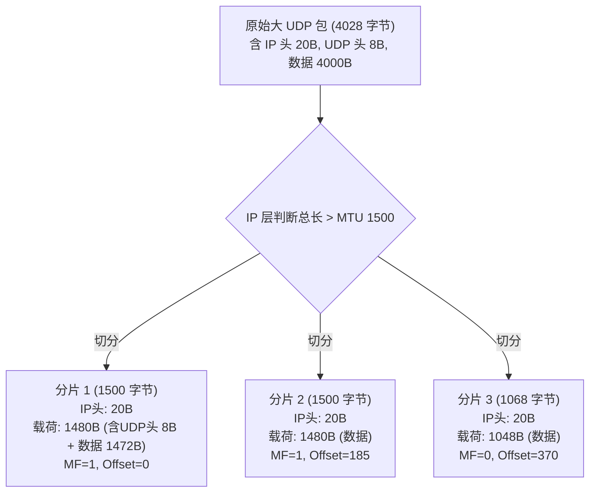
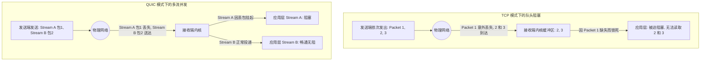

# 1.2.3.2 UDP协议

## 一、UDP 协议的核心设计哲学与网络定位

### 1. 传输层宏观图景与定位
在计算机网络体系结构中，传输层处于承上启下的核心枢纽地位。它向上支撑各种应用进程的通信逻辑（如 HTTP、DNS、SMTP 等），向下则依赖网络层提供的基础数据传输服务（即 IP 协议）。网络层解决的是“如何将一个 IP 数据报从物理主机 A 路由并递送到物理主机 B”的问题，它是逻辑上的**主机到主机（Host-to-Host）**的通信；而传输层解决的则是“如何将接收到的数据准确、安全地交付给主机 A 上的应用进程 X，或者主机 B 上的应用进程 Y”，即实现**进程到进程（Process-to-Process）**的逻辑端到端通信。

在这一分工定位下，传输层的两大核心协议——TCP（Transmission Control Protocol）与 UDP（User Datagram Protocol）走向了截然相反的设计哲学分支：
- **TCP 的哲学是“无微不至的管理”**。它假设底层的 IP 网络是极不可靠、充满丢包、乱序和拥塞的，因此通过极其复杂的序号、确认机制（ACK）、重传策略、滑动窗口流量控制以及拥塞避免控制，在不可靠的网际层之上，为应用层模拟出一个绝对可靠、按序到达的双向字节流管道。
- **UDP 的哲学则是“最小干预与端到端原则（End-to-End Principle）”**。1980 年，David P. Reed 主导并制定了 RFC 768（User Datagram Protocol）规范。UDP 的设计初衷并非为了“保证可靠”，而是提供一种极轻量级的机制，让应用程序能够几乎不受干预地直接访问底层 IP 协议的数据报发送能力。它只在 IP 协议的基础上增加了最微弱的两项功能：**端口多路复用/解复用**（将数据分发给不同的进程）以及可选的**差错校验**。UDP 不提供任何控制，它将网络流控、丢包恢复和拥塞规避的决策权完全交还给了最顶层的应用进程。

### 2. 为什么需要 UDP？与 TCP 的本质对立与互补
随着网络应用形态的多样化，TCP 的“无微不至”在某些特定场景下逐渐暴露出了物理限制，反而成为性能和实时性的累赘。UDP 正是在与 TCP 的互补与对立中体现了其不可替代的价值：

*   **极低的网络时延与系统开销**：
    TCP 为了维持可靠的连接状态，在传输任何应用数据之前，必须经历三次握手（产生至少 1 个 RTT 的建连延迟），在断开时也需要四次挥手。同时，操作系统内核必须为每一个 TCP 连接维护庞大的控制块状态机（TCB，Transmission Control Block），其中包含大量的缓冲区、定时器队列、拥塞窗口等参数，消耗显著的内核内存。
    相反，UDP 是完全**无状态（Stateless）**的。它没有建连过程，首个数据包即可携带业务载荷。内核也无需为 UDP 维护复杂的连接机制，这使得服务器能够以极低的资源占用，从容应对每秒数百万次的超高并发请求。
*   **不退让的传输控制**：
    TCP 的拥塞控制算法（如传统的 Reno 或 Cubic）体现了一种“宁可自我降速，也要保护网络不发生瘫痪”的利他主义原则。当检测到网络丢包时，TCP 会立即剧烈收缩拥塞窗口（cwnd），降低发包速度。
    然而，在实时音视频通信（如 VoIP、在线网络会议）或多人实时竞技游戏等场景中，这种强烈的避让机制是一场灾难。这类业务对数据包的“实时性”要求极高，而对少量的“丢包”具有较好的容忍度（例如，视频中某一个微小的像素块丢失或音频中出现 10 毫秒的轻微杂音，完全可以通过应用层算法进行掩盖，用户几乎感知不到）。但如果为了等待重传包，或者由于拥塞窗口剧降导致数据延迟从 50ms 飙升到 2000ms，整个实时交互体验将瞬间崩溃。UDP 天然的“不降速”特征，正迎合了此类应用对于时延的绝对追求。

### 3. 核心特征一：无连接性（Connectionless）的物理机制
在网络工程中，“连接”是一个纯粹的逻辑概念，本质上是指通信双方在各自的操作系统内核中，通过一套状态变量和定时器的协同（如 TCP 的 `ESTABLISHED`、`TIME_WAIT` 等状态）来维系的一种默契。
UDP 则是物理上的“无连接”协议：
*   **零连接建立开销**：发送端 UDP 进程只需指定目标主机的 IP 和端口，调用系统调用（如 `sendto`），数据便被封装打包投递给网卡，发送端不会与接收端进行任何前置的状态握手。
*   **无状态管理**：由于不维护任何连接状态机，UDP 在高并发通信时表现极佳。一旦发送完毕，数据包对应的内核内存立即被释放，这极大减轻了高吞吐、短连接密集型服务的系统内存负担。

### 4. 核心特征二：不可靠性（Unreliable）与尽力而为（Best-Effort）交付
在学术和工业界，UDP 的“不可靠”具有精准的学术定义，即**尽力而为（Best-Effort）**交付。它意味着协议栈会调用底层网卡尽最大努力发送每一个包，但绝不对以下结果做出任何保证：
*   **无接收确认**：接收端收到 UDP 包后，其传输层协议栈不会向发送端回传任何确认信息（ACK）。
*   **无超时重传**：发送端完全不知道自己发出的包是否已送达，也没有超时检测和重传算法。
*   **无序交付**：由于网络路由路径的多样性及动态变化，先发出的 UDP 包可能会因为路径拥堵而后到达，后发出的包反而先到达。UDP 协议栈不会对乱序到达的包进行任何缓存重排，而是直接按照物理接收顺序交付给应用层。
*   **无流量与拥塞控制**：UDP 发送端会按照应用层要求的任意速率向网卡写入数据。即使接收端缓冲区已满，或者物理网关已处于严重拥塞状态，UDP 协议本身也不会主动降低发包速率，这通常会导致接收端或中间路由因缓冲区溢出而出现物理丢包。

### 5. 核心特征三：面向报文段（Datagram-Oriented）的物理含义与内核缓冲区机制
“面向报文段”是 UDP 在物理行为上区别于 TCP“面向字节流（Byte Stream）”的核心特征，它深深影响了操作系统内核的套接字（Socket）缓冲区管理机制。

#### 发送端的物理行为
当应用层进程调用一次 `sendto()` 系统调用写入一个大小为 $N$ 字节的缓冲区数据时，UDP 协议栈会完整保留该边界，将其原封不动地封装成一个独立的 UDP 数据报（加上 8 字节的 UDP 首部），然后直接递交给底层的网络层 IP 协议。UDP **绝不会对应用层的数据进行拆分或合并**。即使应用程序连续快速地写入了三个 100 字节的数据块，网络层也会发送三个独立的 IP 数据报，而不会将它们拼装成一个 300 字节的包。

#### 接收端的内核缓冲区管理机制
在 Linux 等操作系统内核中，当网络物理帧到达网卡，经过 IP 层校验后，剥离出的 UDP 数据包会以 `sk_buff`（Socket Buffer，套接字缓冲区）的形式存在，并被挂载到该套接字的接收队列 `sk_receive_queue` 中。这是一个基于双向链表的数据结构：

```
[sock->sk_receive_queue]
       │
       ├───> [sk_buff 1 (Payload Len: 100 字节)]
       │
       ├───> [sk_buff 2 (Payload Len: 200 字节)]
       │
       └───> [sk_buff 3 (Payload Len: 150 字节)]
```

当应用层调用 `recvfrom(fd, buf, buf_size, ...)` 时，内核的执行逻辑如下：
1. 内核锁住当前 Socket 的接收队列，从链表头部取出一个完整的 `sk_buff`（例如 `sk_buff 1`）。
2. 将 `sk_buff 1` 中的数据载荷拷贝到用户态传入的缓冲区 `buf` 中。
3. **关键物理行为**：拷贝完成后，无论用户态指定的 `buf_size` 是否小于该数据包的实际长度，内核都会调用 `kfree_skb()` 将 `sk_buff 1` 的内存彻底释放。
4. 如果发送端发送了 100 字节，而接收端调用 `recvfrom` 时传入的 `buf_size` 仅为 50 字节，应用层将只能读取到前 50 字节。由于对应的 `sk_buff 1` 已被内核销毁，**剩余的 50 字节将被静默丢弃**。当下一次调用 `recvfrom` 时，内核会取出队列中的下一个节点 `sk_buff 2`，而绝对无法读到 `sk_buff 1` 被丢弃的后半部分。

与此对比，TCP 在内核中维护的是一个连续的滑动窗口环形缓冲区。TCP 的接收队列会将所有到达的物理包的数据载荷合并存放，去除一切边界。用户调用 `read(fd, buf, 50)` 时，内核只拷贝前 50 字节并移动读取指针，未读完的数据会继续留存在缓冲区中供下一次读取。

#### 为什么 UDP 天然防粘包？
粘包（Packet Clinging）是 TCP 字节流传输中不可避免的应用层痛点。因为 TCP 传输时没有包的物理边界，发送端发出的多个数据段可能被 TCP 拆分或合并成一条流，接收端必须在应用层设计边界切分算法（如使用长度前缀或特殊分隔符）来“拆包”。
而 UDP **天然防粘包**的本质原因就在于：**UDP 的数据递交是以物理报文（即 `sk_buff` 节点）为绝对界限的**。每一次 `sendto` 精确对应接收端的一次 `recvfrom`。数据包在内核中保持独立的结构，边界绝不会合并。因此，UDP 应用层程序员无需处理粘包和半包问题。

### 6. 核心特征四：支持多向交互模式（单播、广播、多播）
TCP 的可靠性依赖于“一对一”的握手与序列号确认机制，因此 TCP 只能支持点对点的**单播（Unicast）**通信。而 UDP 的无连接和无确认机制，使其天然具备了多向交互的物理基础：
*   **单播（Unicast）**：标准的点对点进程通信。
*   **广播（Broadcast）**：在局域网内，将数据包发送到特定的广播 IP 地址（如全局广播地址 `255.255.255.255` 或网段广播地址）。网卡接收到广播帧后，会检查传输层端口，并将数据分发给所有绑定了该端口的 UDP 进程。广播是发现局域网未知设备的强力手段（如 DHCP 获取 IP 地址过程）。
*   **多播/组播（Multicast）**：介于单播与广播之间，将数据包发送给订阅了特定组播组地址（使用 D 类 IP 地址，范围为 `224.0.0.0` 至 `239.255.255.255`）的主机。多播依赖网络层 IGMP 协议以及交换机和路由器的硬件多播分发树，能够显著降低视频直播等多端口下发时的链路带宽消耗。

---

## 二、UDP 报文格式精细解析与二进制级拆解

### 1. 报文整体结构与 8 字节极简头部
UDP 首部格式的设计被压缩到了极致，只有固定的 8 个字节（64 位），分为 4 个字段，每个字段占用 16 位（2 字节）。整体二进制结构如下图所示：

```
 0                   1                   2                   3
 0 1 2 3 4 5 6 7 8 9 0 1 2 3 4 5 6 7 8 9 0 1 2 3 4 5 6 7 8 9 0 1
+-+-+-+-+-+-+-+-+-+-+-+-+-+-+-+-+-+-+-+-+-+-+-+-+-+-+-+-+-+-+-+-+
|          源端口号 (Source Port)        |         目的端口号 (Destination Port)    |
+-+-+-+-+-+-+-+-+-+-+-+-+-+-+-+-+-+-+-+-+-+-+-+-+-+-+-+-+-+-+-+-+
|            长度 (Length)             |          校验和 (Checksum)            |
+-+-+-+-+-+-+-+-+-+-+-+-+-+-+-+-+-+-+-+-+-+-+-+-+-+-+-+-+-+-+-+-+
|                             数据 (Data)                        |
|                             ...                              |
+-+-+-+-+-+-+-+-+-+-+-+-+-+-+-+-+-+-+-+-+-+-+-+-+-+-+-+-+-+-+-+-+
```

相对于 TCP 报文至少 20 字节（若带 TCP 选项则可能更长）的头部，UDP 的极简首部开销极小。例如在发送仅包含 10 字节指令的数据包时，UDP 头部仅占 8 字节，整体开销显著小于 TCP。

### 2. 头部字段逐一拆解

#### 源端口号（Source Port，16 位）
标识发送端主机上的源进程端口。因为是 16 位，其物理端口范围为 `0 ~ 65535`。
如果发送端是一次性的单向数据报上报，且不需要接收任何对端的回应数据，该字段可以填 `0`。

#### 目的端口号（Destination Port，16 位）
标识接收端主机上的目标进程端口。
当物理包到达目的主机后，操作系统的网络栈会在传输层利用此字段对数据包进行**解复用（Demultiplexing）**。
内核中维护着哈希表，通过端口号查找对应的 Socket 结构。如果在哈希表中未找到匹配监听的 UDP 端口（且未开启防火墙拦截），内核会向发送方的主机回送一个 **ICMP 目标端口不可达（Port Unreachable）**差错包。

#### 长度（Length，16 位）
定义了 UDP 首部字节数与数据载荷字节数的总和。因为该字段是 16 位，UDP 报文的整体物理最大上限为 $2^{16} - 1 = 65535$ 字节。由于头部占去 8 字节，数据载荷物理上限理论为 65527 字节。
*思考：为什么 TCP 头部不需要长度字段，而 UDP 需要？*
TCP 头部包含一个 4 位的“首部长度（Data Offset）”指示 TCP 头有多长，而整个 TCP 数据流是没有边界的，TCP 的边界界定通过 IP 层总长度减去 IP 头和 TCP 头间接算得。而 UDP 是面向报文的，增加独立的长度字段允许 UDP 接收端在不知晓复杂 IP 首部格式的前提下，直接计算出数据包边界，提高了协议自身的自适应性与跨层鲁棒性。

#### 最大载荷限制计算推导
在实际的 IPv4 传输中，UDP 报文必须封装在 IP 数据报内。IP 协议首部的“总长度”字段同样限制在 16 位（即 65535 字节）。
一个标准的、不含 IP 选项（Option）的 IPv4 头部大小为 20 字节。
因此，IP 层可承载的单包最大载荷为：
$$\text{IP Max Payload} = 65535 - 20 = 65515\text{ 字节}$$
再减去固定占用的 8 字节 UDP 头部，得到 UDP 应用层能够调用的绝对最大单包数据载荷：
$$\text{UDP Max Payload} = 65515 - 8 = 65507\text{ 字节}$$
如果用户层试图通过 Socket 接口发送大于 65507 字节的数据块，操作系统底层的 Socket API 会直接阻断并抛出 `EMSGSIZE` 错误。

#### 校验和（Checksum，16 位）
用于检验数据报在经历复杂的网络交换机、路由器和传输链路后，其比特位是否发生了翻转或损坏。

### 3. 校验和计算与伪首部（Pseudo Header）设计原理
为了能够检测出可能由于 IP 路由错误导致的数据递交偏差，UDP 校验和引入了**伪首部（Pseudo Header）**的概念。

#### 为什么必须设计伪首部？
如果网络中某个路由器发生硬件故障，篡改了 IP 首部中的目标 IP 地址，将原本发往主机 C 的包送到了主机 B。如果主机 B 的相应端口恰好有一个进程在监听，且没有伪首部的加入，主机 B 上的传输层在验证校验和时，可能发现 UDP 头和 UDP 数据都是完好的，从而将这个由于路由错误送错的数据包递交给了应用层，造成严重的安全隐患。
伪首部的设计打破了严格的 OSI 分层原则，它“越界”获取了网络层的 IP 地址信息，强制将其拉入校验和计算。这保证了接收端在验证 UDP 数据时，不仅验证了数据是否损坏，还验证了“源 IP、目的 IP、协议号”是否完全正确。

伪首部并不实际存在于物理链路中传输，它只是在发送端计算校验和以及接收端验证校验和时，临时在内存中拼接出来的一个 12 字节虚拟结构：

```
 0                   1                   2                   3
 0 1 2 3 4 5 6 7 8 9 0 1 2 3 4 5 6 7 8 9 0 1 2 3 4 5 6 7 8 9 0 1
+-+-+-+-+-+-+-+-+-+-+-+-+-+-+-+-+-+-+-+-+-+-+-+-+-+-+-+-+-+-+-+-+
|                       源 IP 地址 (Source IP)                  |
+-+-+-+-+-+-+-+-+-+-+-+-+-+-+-+-+-+-+-+-+-+-+-+-+-+-+-+-+-+-+-+-+
|                     目的 IP 地址 (Destination IP)             |
+-+-+-+-+-+-+-+-+-+-+-+-+-+-+-+-+-+-+-+-+-+-+-+-+-+-+-+-+-+-+-+-+
|     零 (0)    |  协议号 (17/0x11) |       UDP 长度 (UDP Length)    |
+-+-+-+-+-+-+-+-+-+-+-+-+-+-+-+-+-+-+-+-+-+-+-+-+-+-+-+-+-+-+-+-+
```

#### 16 位反码求和（Ones' Complement Sum）二进制实例计算
校验和的算法是：将伪首部、UDP 头、UDP 数据看作一系列 16 位（2 字节）的字。若数据字节数为奇数，在末尾补充一个全 0 字节（不发送）。
首先将校验和字段置为 0，然后对所有字进行**反码加法累加**，最后对累加和取反即得到校验和。
反码加法的重要特点是：**当最高位产生进位时，必须把该进位加到最低位上（端回进位）**。

我们以 3 个 16 位的字相加为例演示这一过程：
*   字 1 ($W_1$): `0x6666` (二进制 `0110 0110 0110 0110`)
*   字 2 ($W_2$): `0x5555` (二进制 `0101 0101 0101 0101`)
*   字 3 ($W_3$): `0x8F0C` (二进制 `1000 1111 0000 1100`)

##### 第一步：计算 $W_1 + W_2$
```
    0110 0110 0110 0110  (0x6666)
  + 0101 0101 0101 0101  (0x5555)
  ---------------------
    1011 1011 1011 1011  (0xBBBB)  --> 没有最高位进位
```

##### 第二步：将上述结果加上 $W_3$
```
    1011 1011 1011 1011  (0xBBBB)
  + 1000 1111 0000 1100  (0x8F0C)
  ---------------------
  1 0100 1010 1100 0111  --> 产生了 17 位的数据，最左侧的 1 为最高位溢出进位
```

##### 第三步：端回进位（End-Around Carry）
将高位溢出的 1 截下，并加回结果的最低位：
```
    0100 1010 1100 0111  (截取的低 16 位)
  + 0000 0000 0000 0001  (加回溢出的 1)
  ---------------------
    0100 1010 1100 1000  (十六进制结果为 0x4AC8)
```

##### 第四步：取反码（取反）
对最终累加值 `0x4AC8` 的每一个比特位进行取反：
```
  ~ (0100 1010 1100 1000) = 1011 0101 0011 0111 (十六进制为 0xB537)
```
此时，得到的校验和就是 `0xB537`，它会被填入 UDP 头的校验和字段。
当接收端收到数据报后，将包含校验和在内的所有 16 位字全部相加，无误的情况下，计算出来的结果应当是 `0xFFFF`（即反码相加中的全 1，代表 `-0`）。如果结果不是全 1，则判定数据包损坏。

### 4. 校验和出错的接收端静默丢弃机制
当接收端的内核在网络层之上发现 UDP 的校验和验证失败时，它会实施**静默丢弃（Silent Discard）**：
*   **没有任何通知**：内核不会为该丢包发送任何反馈（如重传请求），也不会向发送端发送 ICMP 差错包。
*   **瞬间销毁内存**：对应的 `sk_buff` 内存被直接释放，应用层读取时完全无法察觉到有该包的存在。
*   **状态计数累加**：内核会将网络统计中的丢包计数器 `UdpInErrors` 累加。系统运维人员可以在 Linux 环境下通过执行 `netstat -su` 指令，查看到具体的丢包和校验和错误统计：

```bash
$ netstat -su
Udp:
    428543 packets received
    124 packets to unknown port received
    3251 packet receive errors   # 包含了校验和损坏等导致的静默丢包计数
    432128 packets sent
```

在 IPv4 中，计算 UDP 校验和是可选的，如果不打算计算，将校验和字段直接全填为 0 即可。但是，在 **IPv6 中，UDP 校验和被定为强制性（Mandatory）**。因为 IPv6 取消了 IP 层的校验和（为了减轻路由器转发的计算负担，提升硬件路由吞吐率），若传输层再不强推校验和，网络中的比特损坏将面临失控的局面。

---

## 三、UDP 数据包分片机制与影响

### 1. 网络层 IP 分片 (Fragmentation) 的物理行为
物理网络链路层对单帧能传输的最大字节数存在一个限制，称为 **MTU（Maximum Transmission Unit，最大传输单元）**。在绝大多数局域网和以太网中，默认的 MTU 大小是 **1500 字节**。

当 IP 层需要通过网络接口发送一个 IP 数据报时，它会检查其总长度：
- 如果该数据报的长度超过了物理链路的 MTU，且 IP 首部中的不分片标志 DF（Don't Fragment）被设为 `0`，网络层（IP 层）就必须将该数据包进行拆分，也就是**分片（Fragmentation）**。
- 分片后的每个子数据包都会被赋予独立的 IP 头部，称为一个 IP 分片（Fragment）。

#### UDP 在分片控制上的天然缺失
TCP 协议可以通过在建立连接时进行 MSS（Maximum Segment Size）协商，使得 TCP 传给 IP 层的数据段总大小始终限制在 $\text{MTU} - 40$ 字节以内，从而在传输层就规避了 IP 分片的发生。
然而，**UDP 本身是不感知物理链路 MTU 状态的**。它只是一味接收应用层的指令，如果应用层递交了一个 4000 字节的包，UDP 协议栈套上 8 字节首部便直接甩给 IP 层，使得 IP 层被迫在网络接口出方向进行物理拆分。

### 2. IP 分片与重组的底层字段机制
IP 分片的生成和在接收端的重新拼装，依赖于 IPv4 首部中的三个关键核心字段：
1.  **标识符（Identification，16 位）**：
    由发送端为当前发送的数据报赋予的一个唯一编号。分片发生后，被拆出的所有子分片都会完整复制该标识符字段的值。
2.  **标志（Flags，3 位）**：
    *   第一位：保留。
    *   第二位：DF（Don't Fragment）。如果该位被设为 `1`，则禁止网络分片。包超长时路由器会直接丢包并发送 ICMP 差错信息。
    *   第三位：MF（More Fragments）。如果为 `1`，代表其后还有未传输完的后续分片；如果为 `0`，代表该分片是当前原始大包的最后一个分片。
3.  **片偏移（Fragment Offset，13 位）**：
    *   用于指示该分片所携带的数据载荷在原始 IP 数据报净荷中的相对起始物理位置。
    *   **重要约束**：**片偏移是以 8 字节（64 位）为基本计量单位的**。因此，除最后一个分片外，所有分片的载荷长度必须是 8 字节的整数倍。

### 3. 物理分片的精细计算实例
假设应用层使用 UDP 套接字发送了一个大小为 **4000 字节**的纯数据载荷，物理出口以太网的 MTU 为 **1500 字节**，且 IP 首部不携带任何可选项（即固定为 20 字节）。

我们来推导其分片计算过程：
*   **原始 IP 数据报的总物理大小**：
    $$\text{Total Length} = 4000\text{ (UDP 载荷)} + 8\text{ (UDP 头)} + 20\text{ (IP 头)} = 4028\text{ 字节}$$
    因为 $4028 > 1500$，必须分片。
*   每个分片能携带的最大 IP 载荷空间为：
    $$\text{Max IP Payload} = 1500 - 20 = 1480\text{ 字节}$$
    由于 $1480 / 8 = 185$，刚好能被 8 整除，满足片偏移的 8 字节对齐约束。
*   分片只发生在 IP 层，因此**只有第一个分片会包含 UDP 头部（8 字节）**，后续分片全部直接封装原 UDP 数据的后续切片。

#### 物理切分结果与头部标志细节：



*   **分片 1**：
    *   IP 首部总长度：`1500` 字节。
    *   标识符 (ID)：`0x55AA`（举例）。
    *   Flags：MF = `1`（后有分片），DF = `0`。
    *   片偏移：`0`。
    *   载荷：包含 8 字节 UDP 头部及 1472 字节的 UDP 数据（总计 1480 字节）。
*   **分片 2**：
    *   IP 首部总长度：`1500` 字节。
    *   标识符 (ID)：`0x55AA`。
    *   Flags：MF = `1`（后有分片），DF = `0`。
    *   片偏移：$1480 / 8 = 185$。
    *   载荷：包含 1480 字节的 UDP 数据（覆盖原 UDP 载荷中第 1473 至 2952 字节的范围）。
*   **分片 3**：
    *   剩余载荷长度：$4008\text{ (UDP 数据及头总和)} - 1480 - 1480 = 1048\text{ 字节}$。
    *   IP 首部总长度：$1048 + 20 = 1068\text{ 字节}$。
    *   标识符 (ID)：`0x55AA`。
    *   Flags：MF = `0`（这是最后一个分片），DF = `0`。
    *   片偏移：$(1480 + 1480) / 8 = 370$。
    *   载荷：包含 1048 字节的 UDP 数据（覆盖原 UDP 载荷中第 2953 至 4000 字节的范围）。

### 4. IP 分片带来的网络性能灾难
在生产级高并发网络服务中，**发生 IP 分片是必须要规避的严重隐患**。这是因为分片机制在广域网中会引发多重性能恶化：

#### 丢包放大效应（Packet Loss Amplification）与数学推导
IP 层是一个完全无连接的、尽力而为的不可靠协议。它只负责将分片送达，重组（Reassembly）工作在目的主机的网络层完成。
若在传输路由上，**有任意一个 IP 分片发生了丢失**，目的主机的 IP 层就永远无法将这组分片完整拼接出来。
内核在等待分片重组定时器（通常为 30秒 或 60秒）超时后，会直接**把已经收到的所有其他分片全部销毁丢弃**。对于应用层而言，这意味着整整 4000 字节的数据全部损毁。如果应用层采取了重传，发送端必须将 4000 字节重发，导致网络带宽遭受惩罚性消耗。

**数学概率推导**：
设网络链路中，单个 IP 数据包的物理丢失概率为 $p$。
假定各个分片数据包之间的丢失概率相互独立。
要使接收端成功拼回一个被切分为 $n$ 个 IP 分片的 UDP 大包，所有 $n$ 个分片必须全部无误到达。
因此，整包成功重组的概率为：
$$P_{\text{success}} = (1 - p)^n$$
从而，该 UDP 大包的实际有效丢包率 $P_{\text{loss}}$ 为：
$$P_{\text{loss}} = 1 - P_{\text{success}} = 1 - (1 - p)^n$$
我们代入实际场景中的不同分片数 $n$ 来评估有效丢包率（假设单包物理丢失率 $p = 1\%$）：
*   **当 $n = 1$ 时**（无需分片，UDP 载荷控制在 1472 字节以内）：
    $$P_{\text{loss}} = 1 - (1 - 0.01)^1 = 1\%$$
*   **当 $n = 5$ 时**：
    $$P_{\text{loss}} = 1 - (0.99)^5 \approx 4.90\%$$
*   **当 $n = 10$ 时**：
    $$P_{\text{loss}} = 1 - (0.99)^{10} \approx 9.56\%$$
可以清晰看出，随着分片数量的增加，有效丢包率呈**指数级上升**。在 $n=10$ 时，网络层仅仅 1% 的抖动丢包率，被放大了近 10 倍，使得大包通信几乎处于半瘫痪状态。

#### 内核重组缓冲区的内存压力与系统开销
在目的主机端，内核必须将收到的分片保存在缓存队列中，直至所有分片凑齐。
*   **定时器及上下文开销**：内核要为每一个重组链表挂载定时器。在高并发大流量的冲击下，大量未完成的半包分片会迅速吃光系统内核缓冲区内存。
*   **拒绝服务攻击风险**：攻击者很容易利用此原理发起 **Teardrop 攻击**（故意制造重叠分片使接收端重组时内核死锁或奔溃）或分片挂起 DDoS 攻击（发送 MF=1 的分片但不发送最后一片，耗尽服务器的重组队列缓存），使服务器拒绝正常服务。

#### 防火墙与中继设备（Middleboxes）的静默拦截
许多现代状态防火墙或 NAT 中继设备为了进行安全检查，必须获取 TCP 或 UDP 的端口号。
然而在分片流中，**只有第一个分片（片偏移 = 0）携带有 8 字节的 UDP 首部**，后续的 Fragment 仅有 IP 首部。
这就导致没有保存分片重组状态的防火墙无法识别后续分片的所属端口，为防范非法渗透，很多防火墙会直接**无情地将所有非首片的分片丢弃**，造成分片包在网络边界发生永久性的重组超时失败。

### 5. 优化实践与规避策略

#### 经典限制：DNS 协议的 512 字节防御性设计
在 RFC 1035 规范中，规定基于 UDP 传输的 DNS 查询响应报文最大不得超过 **512 字节**。
这一设计的背后是有着深刻的网络底层考量的：
早期的互联网规范（RFC 791）规定，所有 IP 节点必须能够无分片接收的最小 IP 包为 **576 字节**。
如果我们将 DNS 的 UDP 载荷死死限制在 512 字节以内：
$$\text{Total Size} \le 512\text{ (UDP Data)} + 8\text{ (UDP Head)} + 20\text{ (IP Head)} = 540\text{ 字节}$$
$540 < 576$。这一数学不等式保证了该 DNS 查询包在通过地球上任何一个恶劣、老旧的网关或物理路由器时，都**绝对不会触发任何 IP 分片**，极大地保证了全球互联网根基——域名解析的超高可用性。
虽然现代通过 **EDNS0（RFC 2671）**允许协商更大的载荷（通常为 1220 或 4096 字节，1220 字节被认为是在支持 IPv6 隧道后仍能安全避开 MTU 1500 分片的最优阈值），但一旦出现中间设备丢弃大 UDP 包，DNS 仍会迅速依靠带有 TC（TrunCation）截断标志的响应，主动退化切换到 TCP 协议（DNS over TCP）进行重新查询。

#### 应用层主动切片设计模式
在现代需要大流量传输的 UDP 应用（如 RTP 实时视频流）中，通常严禁依赖底层的 IP 分片。
发送端程序必须在应用层自主进行数据块的切割。例如要发送一张 10KB 的关键帧图像：
1.  应用层将数据分割为 8 个独立的切片，每个切片小于 1400 字节（为 IP 头、UDP 头及自定义协议头预留充足的包安全裕量）。
2.  在应用层为每个切片打上专属的应用首部，包括“流序号（Frame ID）”、“片序列号（Fragment Index）”。
3.  通过独立的 `sendto` 发送 8 个完全独立的 UDP 数据包。
4.  在传输中，若第 4 个包丢失，接收端只需向发送端请求重发第 4 个包，而无须重新传输整张 10KB 的图像。这彻底规避了 IP 分片带来的丢包放大开销，保障了传输的平滑与可控。

---

## 四、UDP 在现代高并发与实时通信中的崛起

### 1. 传统 TCP 在现代超低延迟场景下的三大局限性瓶颈
随着互联网业务走向极高强交互（如多人联机射击游戏、云游戏、WebRTC 实时视频会议、万物互联低功耗传感等），TCP 曾经的可靠优势，在这些场景下演变成了无法克服的性能枷锁：

#### 队头阻塞（Head-of-Line Blocking, HoL）
这是由 TCP“面向字节流且绝对按序交付”的设计本质决定的。
假设 TCP 发送了 Packets 1, 2, 3，其中 Packet 1 因为网络瞬时噪声丢失，而 Packet 2 和 3 已经顺利抵达目的主机的内核 Socket 缓冲区。由于 TCP 必须向应用层呈现完美的字节流顺序，内核会**禁止应用层读取已到达的 Packet 2 和 3**，应用层进程只能无奈挂起等待，直到发送端重传 Packet 1 并成功送达。对于网络游戏或语音通话等场景，这种阻塞会导致数据在接收端发生剧烈的延迟抖动，画面或声音瞬间卡顿。



#### 拥塞控制对突发流量丢包的过度惩罚
TCP 拥塞控制算法的核心假设是“丢包即意味着网络链路饱和拥塞”。
但在现代无线 Wi-Fi 或 5G 移动场景中，丢包往往是因为信道切换、物理阻挡或信号衰减导致的随机乱序丢包。
TCP 面对这些情况，会盲目减半拥塞窗口，限制发送速率。这导致在带宽本身就较窄的弱网环境中，吞吐量呈现雪崩式下跌，无法维持音视频的基本码率。

#### 建立连接的高时延开销
TCP 建立连接至少需要 1 RTT。如果加上 TLS 1.2 的加密安全握手，通常需要 3 个 RTT（往返时延）才能开始正式发送首帧应用数据。这在长距离通信或移动蜂窝网环境下，会导致网络请求的首包时间（TTFB）过长。

### 2. UDP 为什么成为现代可靠协议的空白画布
UDP 的特点在于它“什么都不做”。它不包含重传、流控和排序，但这恰恰赋予了它极强的灵活性。
**它是一块空白的画布**。应用层开发者可以根据业务的核心诉求，在 UDP 之上编写自定义的控制层协议：
- **可选择的重传**：在实时视频中，I 帧（关键帧）丢失了必须重传，而 P/B 帧如果已经过期，则可以直接舍弃不予重传，避免延迟累积。
- **自定义的拥塞算法**：应用层可以采用基于延迟估计（如 BBR 的应用层简化版本）或自定义的抗丢包平滑算法，在网络抖动时依然维持相对稳定的发送速率。
- **多路复用**：在单个连接上复用多条数据流，独立纠错，互不干扰。

### 3. 基于 UDP 的应用层可靠框架实践一：QUIC 协议
QUIC（Quick UDP Internet Connections）协议最初由 Google 主导研发，经过多次演进，现已被 IETF 正式标准化为 RFC 9000，成为下一代 Web 协议 HTTP/3 的物理底座。QUIC 完全运行在 UDP 之上，它重构了整个互联网的数据传输机制：

#### 零延迟建立连接（0-RTT Handshake）
QUIC 将传统的传输层握手（类似 TCP 的 SYN）与 TLS 1.3 安全密码学协商握手进行了深度融合：
- **1-RTT 握手**：在初次建连时，客户端只需发送一个 UDP 包，内含密钥交换算法，服务器回应一个包完成握手，并同步完成 TLS 1.3 的密钥协商。这使得建连时间缩短至 1 个 RTT。
- **0-RTT 恢复**：对于之前建立过连接的客户端，它可以直接使用缓存的会话票据加密数据，在发送给服务器的第一个数据包（0-RTT）中直接携带业务数据负载，实现了真正的极速加载。

#### 彻底消除队头阻塞的多路复用（Multiplexing over UDP）
虽然底层只依赖一个 UDP Socket 通道，但 QUIC 在逻辑层设计了相互隔离的并发数据流（Stream）。
每个 Stream 拥有独立的流级别序列号和流控制。
一旦 Stream 1 中的某个数据包在网络中丢失，QUIC 的接收端只会阻塞 Stream 1 的读取进程，而 Stream 2 和 Stream 3 的包在送达后，应用层可以立即并行读取和处理。这在单一逻辑连接中彻底解决了传输层队头阻塞问题。

#### 物理级连接迁移（Connection Migration）机制
TCP 依赖四元组（源 IP、源端口、目的 IP、目的端口）来唯一确定一个套接字连接。一旦手机在 Wi-Fi 与 5G 之间切换，IP 地址改变，底层的 TCP 链路就会瞬间断开，触发重连、重新登录等一系列卡顿。
QUIC 创造性地引入了 **Connection ID（连接 ID，CID）**的概念。每个 QUIC 连接都被赋予一个 64 位或更长的唯一 ID，该 ID 不依赖底层任何四元组参数。
当客户端的网络环境发生改变、IP 发生突变时，它发送的 UDP 包只需要继续携带原本的 Connection ID，服务器内核在接收到该数据包后，直接通过 CID 定位到原本的 Socket 状态块，并自动将四元组映射关系更新为新的 IP 与端口。整个迁移过程对于上层应用完全是无感的，保证了极致的连接平滑性。

#### 单调递增的 Packet Number 与重传二义性消除
在 TCP 的设计中，当发生超时重传时，重传的数据包与原包使用的是一模一样的序列号（Sequence Number）。如果发送端随后收到了该序列号的确认 ACK，它根本无法区分这是对原包的确认还是对重传包的确认，这导致 RTT 估算极易产生偏差。
QUIC 规定，底层的 **Packet Number 必须是单调递增的**。即使当前包是用于重传 Stream 1 数据的，重传包也会被赋予一个全新的、更大的 Packet Number。通过将 Packet Number 与数据的流内偏移量（Stream Offset）剥离，QUIC 彻底消除了重传二义性，极大地提高了拥塞控制算法对网络带宽和延迟判断的精准度。

### 4. 基于 UDP 的应用层可靠框架实践二：KCP 协议
KCP 是一个在多人游戏联机、音视频实时交互等极其注重延迟的领域广泛应用的快速可靠协议。它选择**以牺牲 10% ~ 20% 的带宽为代价，换取平均延迟比 TCP 降低 30% ~ 40%，且最大延迟降低数倍**的极致低延迟体验。

KCP 的物理优化手段包括以下几个极具特点的流控机制：

#### 彻底的选择性重传（Selective Repeat）
TCP 虽然有 SACK 机制优化，但很多历史遗留的系统内核依然在丢包严重时退回到类似回退 N 步（Go-Back-N）的重传方式，把丢失包之后发送的包全部重发。
KCP 则是一以贯之的选择性重传：它能精准定位到底丢失了哪一个序号的数据包，发送端只重传那一个真正丢失的包，已收到的后续包在缓冲区中挂起，无需重复发送，极大地节省了不必要的流量重传开销。

#### 快速重传（Fast Retransmit）的跳过机制
在 KCP 中，发送端快速发送了序号为 1、2、3、4、5 的包。
- 接收端收到了包 1，回传了 ACK。
- 包 2 丢失，接收端收到包 3，回传了 ACK。此时，序号 2 被跳过了 1 次。
- 随后收到包 4，回传 ACK。此时，序号 2 被跳过了 2 次。
KCP 允许应用层配置快速重传的“跨越次数（`nodelay`）”参数。如果设为 2，发送端在收到包 4 的 ACK 并检测到包 2 被跳过了两次后，**会立刻断定包 2 已经丢失，立即发起重传**，而绝不等待包 2 的超时重传定时器（RTO）发生溢出。这一设计使得丢包恢复的速度提升到了毫秒级。

#### 连续丢包不退避的 RTO 控制
TCP 在遭遇连续丢包时，其超时重传时间（RTO）会采取指数翻倍退避（如 $1\text{s} \to 2\text{s} \to 4\text{s} \to 8\text{s} \dots$），以防加重全网拥塞。但在高对抗性游戏等场景下，这种翻倍惩罚会直接导致游戏进程死锁。
KCP 的 RTO 可以配置为非退避增长（例如每次只增加 1.5 倍，或者固定完全不增长），保持高频的快速探测和重试，用带宽换取首包的到达速度。

#### 灵活关闭拥塞控制
在多人对战游戏的独立专网或专用服务器中，网络带宽并非核心瓶颈，核心问题是丢包。
KCP 允许应用程序彻底关闭拥塞窗口（cwnd）的退避算法。此时，KCP 发送端会摆脱网络拥塞的束缚，纯粹根据应用层设定的最大滑动窗口进行发包，以满额速率将数据压入通道，彻底榨干物理带宽以换取绝对的流畅体验。

---

## 五、传输层协议选型决策与未来展望

### 1. 传输层协议选型多维度对比决策矩阵
在实际进行计算机底座和网络应用开发时，如何在 TCP、原生 UDP、QUIC 和 KCP 之间做出明智的选择？下面的对比决策表提供了系统性的判定依据：

| 评估维度 | TCP (RFC 793) | 原生 UDP (RFC 768) | QUIC (RFC 9000) | KCP |
| :--- | :--- | :--- | :--- | :--- |
| **连接状态** | 面向连接（三次握手建连） | 无连接（0-RTT） | 面向逻辑连接（0/1-RTT 握手） | 面向逻辑连接（用户态建连） |
| **可靠性** | 绝对可靠（不丢包、严格按序） | 完全不可靠（尽力而为） | 绝对可靠（Stream 内有序） | 绝对可靠（逻辑按序交付） |
| **队头阻塞** | 存在（连接级别，一包丢全包堵）| 不存在（各包完全独立） | 消除（Stream 间完全解耦） | 存在（单个逻辑流通道按序） |
| **拥塞控制** | 强制执行（内核固化，偏向保守）| 无（不感知网络拥塞状况） | 可自定义（应用层切换，如 BBR） | 可关闭拥塞退避，完全自主 |
| **首部开销** | 20 ~ 60 字节（开销适中） | 8 字节（极致轻量） | 3 ~ 20 字节（采用变长编码） | 24 字节（针对流控设计） |
| **IP 分片防范** | 优秀（通过 MSS 协商完美避开）| 极差（完全依赖应用层防御设计）| 优秀（内置 PMTUD 并自主切片） | 优秀（支持应用层分片切分） |
| **用户态/内核**| 完全在操作系统内核空间运行 | 在内核空间运行极简逻辑 | 协议栈完全运行在用户态空间 | 完全运行在用户态（应用层） |
| **适用场景** | 网页展示、大文件下载、API 调用 | 局域网广播、DNS、心跳、媒体流 | 现代 HTTP/3 网页、实时视频流 | 实时竞技游戏、音视频强交互 |

### 2. 传输层与应用层的边界模糊化趋势
在经典的 TCP/IP 网络五层协议模型中，分层是极度神圣的教条：传输层管理可靠性，网络层路由寻址，应用层专注于业务逻辑。
然而，随着互联网硬件性能的爆发式增长、全光纤骨干网和 5G 通信的普及，以及对实时性的极限追求，这一严格的边界正在变得模糊：
*   **内核升级缓慢的物理限制**：
    传统的 TCP 协议栈完全固化在操作系统内核空间中。如果发现 TCP 的拥塞算法有缺陷，或者需要增加新的握手特性，必须通过升级服务器内核（乃至操作系统版本）来完成。这在成千上万台节点的企业集群中具有极高的运维风险和极长的更新周期，严重阻碍了传输效率的进化。
*   **UDP 成为高速物理包装器**：
    在这种背景下，**UDP 已经演变成了一个被操作系统和网卡硬件高度加速的“网络层直接包装器”**。现代传输层革新的方向，不再是修改内核中的 TCP，而是利用 UDP 作为通透的传输通道，将所有关于“可靠性、加密安全（TLS）、拥塞控制”的算法和逻辑全部打包提升到**用户态（应用层）**中来实现。
    QUIC 协议的广泛落地和 HTTP/3 的普及，向我们展示了这一明确的网络技术演进路径：互联网正在从“内核统治的 TCP 时代”逐步跨入“应用层软件定义的 UDP 时代”。未来，我们将看到更多针对垂直场景进行定制的用户态可靠传输协议，而 UDP，则是承载这一切技术创新的基石。

