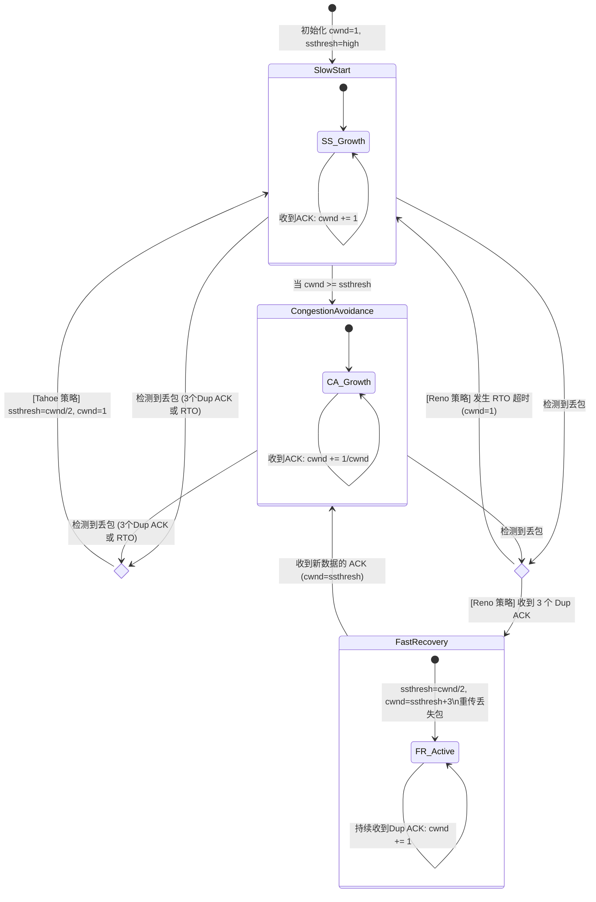
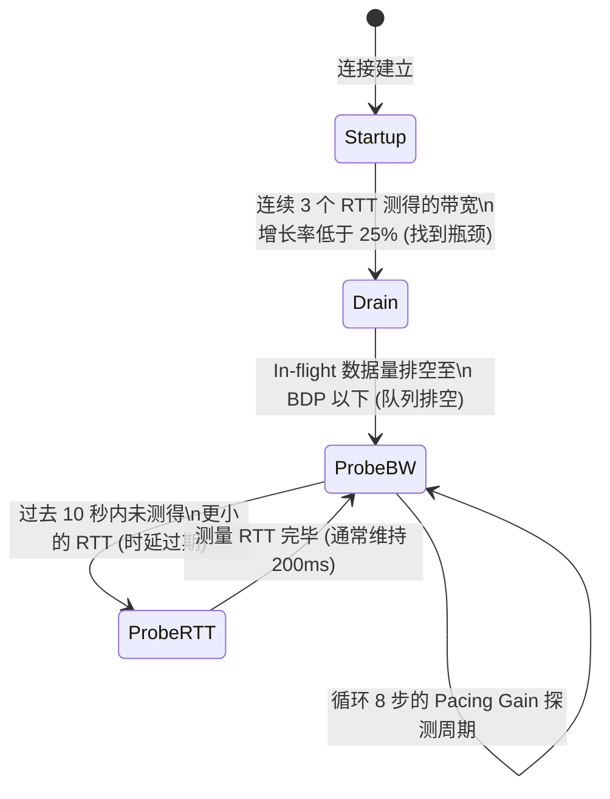

# 1.2.3.4 拥塞控制

## 一、 拥塞控制的核心背景与理论基石

在计算机网络的发展历程中，如何在高带宽、多用户共享的网状拓扑中，实现高效、公平且稳定的数据传输，始终是网络协议设计的核心挑战。作为传输层最关键的机制之一，传输控制协议（TCP）的拥塞控制（Congestion Control）承载着保障整个互联网不发生崩溃的重任。要深刻理解拥塞控制，必须首先厘清其背后的物理机制、数学模型与理论边界。

### 1.1 为什么需要拥塞控制？

#### 1.1.1 流量控制与拥塞控制的本质区别与联系

在初学网络协议时，流量控制（Flow Control）与拥塞控制常常被混淆。虽然两者的最终手段都是通过限制发送端的发送速率来保护系统的缓冲区，但它们的保护对象、反馈来源以及解决的核心问题有着本质的区别：

*   **流量控制（Flow Control）：** 这是一个**端到端（End-to-End）**的控制机制。它的保护对象是**接收端主机**。当接收端的应用程序处理速度跟不上发送端的发送速度时，接收端的接收缓冲区（Receive Buffer）就会溢出，导致数据包被丢弃。流量控制通过接收端在 TCP 报文首部中携带的“接收窗口”（rwnd）来直接告诉发送端自己还能容纳多少数据，其反馈信息是直接的、明确的、面向单一链路的。
*   **拥塞控制（Congestion Control）：** 这是一个**网络级（Network-wide）**的控制机制。它的保护对象是**中间的网络路由器、交换机及传输链路**。在多路复用的共享网络中，成千上万个发送端都在向网络发送数据，这些数据会汇聚到中间路由器的排队队列中。如果发送端的发送总量超出了中间路由器的处理能力或出口物理链路的带宽限制，路由器队列就会积压，进而发生排队延迟增长和缓冲区溢出丢包。拥塞控制的反馈信息通常是间接的（如检测到包丢失、往返时延 RTT 增大等），其目标是维持整个网络拓扑的稳定性。

两者相互交织，发送端最终所采取的发送窗口大小，必须同时兼顾这两者的限制。

#### 1.1.2 交换机队列溢出与排队延迟的微观物理机制

网络的中间节点（如路由器和交换机）本质上是执行“存储-转发”（Store-and-Forward）的排队系统。当一个数据包到达路由器时，路由器查找路由表确定其下一跳出口。如果此时该出口链路正在发送其他数据包，新到达的数据包就必须进入对应的物理输出队列（Buffer）中排队等待。

根据排队论（Queueing Theory）中的 $M/M/1$ 模型，设数据包的平均到达率为 $\lambda$（packets/sec），路由器的平均服务率（即出口带宽所对应的包处理能力）为 $\mu$（packets/sec）。定义链路利用率（系统负载）为 $\rho = \frac{\lambda}{\mu}$。排队系统中的平均队列长度 $L_q$ 以及平均排队时延 $W_q$ 的数学关系如下：

$$L_q = \frac{\rho^2}{1 - \rho}$$

$$W_q = \frac{\rho}{\mu(1 - \rho)}$$

从上述公式可以看出，当网络负载 $\rho$ 较低时，队列长度和排队时延几乎为零；但当发送端集体加速，使得到达率 $\lambda$ 逼近服务率 $\mu$（即 $\rho \to 1$）时，分母 $(1 - \rho)$ 趋近于 $0$，导致排队时延 $W_q$ 呈现灾难性的指数级增长。

当队列积压达到路由器物理内存的上限时，就会触发**尾部丢弃（Tail Drop）**策略，后续到达的所有数据包都将被直接丢弃。丢包意味着宝贵的网络带宽已经在前半程被白白消耗，而接收端却无法收到完整的数据，这直接导致了网络性能的恶化。

#### 1.1.3 拥塞崩溃（Congestion Collapse）的数学机理与历史演进

拥塞崩溃是拥塞控制理论中最著名的概念。在 1980 年代中期，互联网曾经历过数次严重的瘫痪，当时主干网的吞吐量从原本的数千 bps 骤降至每秒仅能成功传输几个字节，网络处于近乎完全不可用的状态。这种现象被称为**拥塞崩溃（Congestion Collapse）**。

其背后的物理与数学机理在于**实际吞吐量（Throughput / Goodput）与网络负载（Load）之间的非线性发散关系**。我们可以用以下模型来刻画：

1.  **理想状态：** 随着发送端送入网络的数据量（负载）增加，网络吞吐量呈线性上升；当负载达到瓶颈带宽时，吞吐量达到饱和值并保持恒定，多余的数据排队。
2.  **无拥塞控制时的真实状态：** 当负载超过瓶颈带宽后，路由器开始丢包。由于早期的 TCP 协议没有拥塞控制，发送端一旦发现丢包或超时，就会立即触发重传。重传的分组源源不断地送入已经满载的网络中，使得网络总负载进一步攀升。
3.  **负反馈失效：** 路由器队列中充斥着大量的重复数据包和即将被丢弃的无效分组。网络带宽被浪费在传输那些“注定在下一跳被丢弃”的数据包上。结果是，随着网络负载继续增加，发送端收到的确认（ACK）越来越少，从而更加疯狂地发起重传，网络有效吞吐量（Goodput）呈断崖式下跌，最终归零。

下图描绘了吞吐量与网络负载在不同控制策略下的理论演进曲线：

```
吞吐量 (Throughput)
   ^
   |                      /---------------- 理想状态 (Ideal Case)
   |                     /
   |                    / :
   |                   /  :
   |                  /   :
   |                 /    :---------------- 完美的拥塞控制 (Optimal Control)
   |                /     : 
   |               /      :   \
   |              /       :     \ 
   |             /        :       \-------- 性能退化
   |            /         :                 \
   |           /          :                  \_____ 拥塞崩溃 (Congestion Collapse)
   +----------+-----------+------------------------------> 网络负载 (Load)
            无排队       BDP点 (拐点)
```

为了避免拥塞崩溃，Van Jacobson 于 1988 年提出了奠定现代互联网基石的 TCP 拥塞控制算法（Tahoe），通过引入动态调整发送速率的反馈环路，使网络自适应地运行在临界拐点附近。

#### 1.1.4 全局同步现象与主动队列管理（AQM）

在传统的尾部丢弃（Tail Drop）缓存管理策略下，当路由器队列满时，会同时丢弃来自多个不同 TCP 连接的连续数据包。这会导致一个严重的副作用——**全局同步（Global Synchronization）**。

由于这多个 TCP 连接同时检测到丢包，它们会几乎在同一时间启动乘性减算法，缩减各自的拥塞窗口。网络负载瞬间骤降，路由器队列被排空，网络利用率变低；随后，这些连接又同时在慢启动或拥塞避免阶段逐步增大窗口，直到下一次队列再次填满并发生尾部丢弃。这种多个连接“同频共振”的现象，导致网络带宽利用率呈现周期性的剧烈震荡。

为了解决全局同步问题，现代网络引入了**主动队列管理（Active Queue Management, AQM）**，例如随机早期检测（Random Early Detection, RED）。RED 在队列长度达到设定的门限之前，就以一定的概率随机丢弃部分数据包（或设置 ECN 标记），从而使不同的 TCP 连接在不同的时间点接收到拥塞反馈，错开它们的窗口调整周期，使网络整体流量更加平滑。

---

### 1.2 滑动窗口机制下的核心窗口定义与数学物理关系

TCP 是一种基于滑动窗口（Sliding Window）的协议，在发送端和接收端分别维护着动态的数据边界指针。在拥塞控制的语境下，发送端在任意时刻能够发送的字节数，受到三个核心窗口的协同约束。

#### 1.2.1 接收窗口（rwnd）与端到端流量控制

接收窗口（Receive Window, $rwnd$），又称通告窗口（Advertised Window, $awnd$）。它是接收端根据自身应用层消费数据的速度以及物理接收缓冲区的大小，在每个 TCP 报文首部的 `Window Size` 字段中显式告知发送端的值。

若设接收缓冲区的总大小为 $MaxRcvBuf$，当前已接收但尚未被应用层读取的字节数为 $BufferedBytes$，则接收窗口的数学表达为：

$$rwnd = MaxRcvBuf - BufferedBytes$$

当应用层读取数据极慢，导致 $BufferedBytes$ 逼近 $MaxRcvBuf$ 时，$rwnd$ 将缩减至 $0$，此时发送端将停止发送数据，直到收到接收端的窗口更新通知（Window Update）。这确保了接收端不会发生缓冲区溢出。

#### 1.2.2 拥塞窗口（cwnd）的物理限制

拥塞窗口（Congestion Window, $cwnd$）是发送端内部维护的一个状态变量。它代表发送端根据对当前网络拓扑、中间节点承载能力的估计，所计算出的最大允许在途（In-flight，即已发送但尚未收到确认）的数据量。

与 $rwnd$ 不同，$cwnd$ 没有任何外部直接通知，它是发送端基于某种控制算法（如 Cubic 或 BBR），通过对网络丢包、延迟、ACK 到达规律等间接指标的持续观测与计算，在内核中动态调整的虚拟限额。其物理单位通常为字节（Bytes）或最大报文段长度（MSS, Maximum Segment Size）。

#### 1.2.3 发送窗口（swnd）的数学关系推导与边界效应

发送窗口（Send Window, $swnd$）是发送端在物理上真正被允许发送且尚未收到 ACK 的最大数据范围。它是流量控制与拥塞控制共同施加于发送端的终极限制。

其基本的数学关系为：

$$swnd = \min(cwnd, rwnd)$$

这个公式揭示了网络通信中的两大约束规律：
1.  **当 $cwnd < rwnd$ 时（拥塞受限）：** 网络的承载能力是限制传输速度的瓶颈。此时，中间链路或路由器性能较弱，或者背景流量庞大，发送方必须以拥塞控制算法计算出的 $cwnd$ 为上限，避免将中间网络压垮。
2.  **当 $rwnd < cwnd$ 时（流量受限）：** 接收端的处理能力是限制传输速度的瓶颈。此时，尽管网络管道非常空闲，但由于对端主机性能有限或应用层读取滞后，发送方必须将发送速率降至 $rwnd$，避免淹没接收端。

在发送端内核的滑动窗口边界中，这三个指针的关系可以用下图表示：

```
发送端缓冲区数据分布:
   +--------------------+------------------------+-----------------------+
   |   已发送且已确认    |    已发送但未收到ACK   | 允许发送但尚未发送    |  不可发送
   |  (Acknowledged)    |      (In-flight)       | (Ready to Send)       | (Not Allowed)
   +--------------------+------------------------+-----------------------+
   |                    |                                                |
   v                    v                                                v
SND.UNA              SND.NXT                                          SND.UNA + swnd
(发送未确认基准)     (下一个发送序号)

                        |<----------- 发送窗口 swnd ----------->|
                        |<---- = min(cwnd, rwnd) ---->|
```

当收到新的 ACK 时，`SND.UNA`（Send Unacknowledged）向右滑动，腾出新的空间供 `SND.NXT` 发送新数据；若 $cwnd$ 发生变化，滑动窗口的右边界 `SND.UNA + swnd` 也会相应伸缩。

---

### 1.3 瓶颈链路带宽时延积 (BDP) 与最佳拥塞窗口

拥塞控制的终极目标，是让发送端的数据流量能够精准填满网络物理管道，既不造成管道闲置，也不让管道内发生过剩积压。为了量化这个“精准填满”的状态，我们需要引入**带宽时延积（Bandwidth-Delay Product, BDP）**的概念。

#### 1.3.1 瓶颈带宽（Bottleneck Bandwidth）与物理时延（RTT）

在一条跨越多个路由器的复杂网络路径中，链路就像是由不同粗细、不同长度的多段水管拼接而成。

*   **瓶颈带宽（Bottleneck Bandwidth, $C$ 或 $BtlBw$）：** 是该路径上物理带宽最小的那段链路的传输速率（单位：bps 或 Bytes/sec）。它决定了整条路径吞吐量的物理上限。无论其他路段的带宽有多大，整个系统的最大流速都受限于这根最细的水管。
*   **往返传播时延（Round-Trip Propagation Time, $RTT_{prop}$ 或 $RTprop$）：** 是数据包在没有排队延迟的情况下，在发送端与接收端之间往返所需的物理传输与传播延迟之和（单位：sec）。它主要由光速在物理介质（光纤、铜缆）中的传播速度以及路由器的物理固有时延（查表、电信号转换等）决定。

#### 1.3.2 管道容量：带宽时延积（BDP）的计算与物理水管模型

带宽时延积（BDP）代表了该路径物理管道所能容纳的处于“在途”（In-flight）状态的最大数据量。其数学表达式为：

$$BDP = BtlBw \times RTprop$$

我们可以用**水管物理模型**来形象地解释这一概念：

```
               |<--------- 往返传播时延 RTprop (水管长度 L) --------->|
               +----------------------------------------------------+
发送端 =======> |                   瓶颈链路带宽 BtlBw                | ======> 接收端
(水流注入)     |                   (水管截面积 A)                   | (水流输出)
               +----------------------------------------------------+
               物理容积 (BDP) = 截面积 A x 长度 L
```

*   水管的**截面积**对应**瓶颈带宽 $BtlBw$**；
*   水管的**长度**对应**往返传播时延 $RTprop$**；
*   水管的**总体积**即为 **$BDP$**。

如果我们要让水管被水流完全填满，且没有任何水溢出（排队积压），水管中流动的总水量必须正好等于水管的容积。

#### 1.3.3 最佳拥塞窗口（Optimal Congestion Window）的数学特征

从网络效率的最大化和延迟的最小化来看，最佳拥塞窗口（Optimal $cwnd$）应当满足：

$$cwnd_{opt} = BDP = BtlBw \times RTprop$$

在这一临界点上，系统展现出极佳的数学与物理特征：
1.  **吞吐量最大化：** 物理链路的瓶颈已经被完全填满，发送端能够以最大可能的速度（$BtlBw$）传输数据。
2.  **延迟最小化：** 数据包在路由器的缓冲区中不需要排队，此时的实际往返时间 $RTT$ 等于物理固有的最小往返时延 $RTprop$。

这就是排队论和拥塞控制理论中著名的 **Kleinrock 最佳运行点**。

#### 1.3.4 不同窗口规模下的物理管道状态

当 $cwnd$ 偏离 $BDP$ 时，网络物理管道会呈现三种截然不同的状态：

| 窗口状态 | 物理管道景象 | 实际吞吐量 (Throughput) | 实际往返时延 (RTT) | 中间节点队列状态 |
| :--- | :--- | :--- | :--- | :--- |
| **$cwnd < BDP$** | 水管未填满，链路存在空置 | $< BtlBw$（随 $cwnd$ 线性增加）| $= RTprop$（无排队延迟）| 队列完全为空 |
| **$cwnd = BDP$** | 水管刚好填满，工作于 Kleinrock 点 | $= BtlBw$（达到吞吐上限）| $= RTprop$（延迟最低）| 队列为空，无积压 |
| **$cwnd > BDP$** | 水流溢出物理管壁，进入缓冲区排队 | $= BtlBw$（吞吐不再增长）| $> RTprop$（加上排队时延 $RTT_{queue}$）| 队列开始积压，若超过缓冲区上限则发生丢包 |

传统基于丢包的拥塞控制算法（如 Reno, Cubic）为了探寻物理带宽，必须不断增加 $cwnd$ 直至发生丢包，其工作点被迫停留在 $cwnd > BDP$ 甚至 $cwnd \gg BDP$ 的“缓冲区积压”区域。而现代算法（如 BBR）则通过精细测量，力求将工作点约束在 $cwnd = BDP$ 的黄金交叉点上。

---

## 二、 经典基于丢包反馈的拥塞控制算法（Loss-based）

在 TCP 几十年的演进中，最经典、应用最广泛的一类算法是**基于丢包反馈的算法（Loss-based Algorithms）**。这类算法的哲学非常直观：将“丢包”等同于“拥塞”。发送端以极具进取心的方式不断增大拥塞窗口，直到把网络路径上的路由器缓冲区撑爆，发生物理丢包，然后再大幅削减窗口以缓解网络压力。

### 2.1 Tahoe 与 Reno 算法的演进背景与四大阶段精细推演

1.  **Tahoe 算法（1988年）：** 由 Van Jacobson 提出，引入了慢启动、拥塞避免以及快重传机制。其缺点是一旦检测到丢包，不论是通过超时还是重复 ACK 检测到的，都会将 $cwnd$ 直接重置为 1，导致吞吐量产生巨大的周期性波谷。
2.  **Reno 算法（1990年）：** 在 Tahoe 的基础上进行了重大改进，引入了快恢复（Fast Recovery）阶段，允许在收到三个重复 ACK 时只将窗口减半，而不是归零，大大改善了链路的平均吞吐量。

下面我们对 Reno 算法的四大阶段进行精细推演。

#### 2.1.1 慢启动（Slow Start）的指数级增长模型与慢启动门限（ssthresh）的建立

当一个 TCP 连接建立或发生严重超时（RTO）时，发送端并不知道网络的实际状况。如果贸然以高速发送数据，可能会瞬间淹没网络。因此，TCP 采用慢启动策略，从一个极小的窗口开始温和地探测。

*   **初始状态：** 发送端的拥塞窗口 $cwnd$ 被初始化为 1 个 MSS（最大报文段长度）。同时设定一个较高的初始慢启动门限值 $ssthresh$（Slow Start Threshold）。
*   **指数增长物理机制：** 在慢启动阶段，发送端每收到一个对新报文段的有效确认（ACK），$cwnd$ 的大小就增加 1 个 MSS。
    
    让我们在一个简化的往返时间（RTT）轮次中观察其数学增长规律：
    *   **第 1 轮：** 发送 1 个 MSS 的报文。收到 1 个 ACK。$cwnd = 1 + 1 = 2$ MSS。
    *   **第 2 轮：** 发送 2 个 MSS 的报文。收到 2 个 ACK。$cwnd = 2 + 2 = 4$ MSS。
    *   **第 3 轮：** 发送 4 个 MSS 的报文。收到 4 个 ACK。$cwnd = 4 + 4 = 8$ MSS。
    *   **第 $N$ 轮：** 只要没有丢包发生，第 $N$ 轮的拥塞窗口为 $cwnd_N = 2^{N-1}$。
    
    可以看出，尽管名字叫“慢”启动，但其窗口大小是以 **RTT 为周期的指数级（Exponential）速度** 迅速膨胀的。
*   **慢启动门限的介入：** 指数增长是极其危险的，随时可能引发网络雪崩。因此，引入了 $ssthresh$。
    *   当 $cwnd < ssthresh$ 时，继续在慢启动阶段运行；
    *   当 $cwnd \ge ssthresh$ 时，必须退出慢启动，转而进入步履稳健的“拥塞避免阶段”。

#### 2.1.2 拥塞避免阶段（Congestion Avoidance）与 AIMD（加性增乘性减）的公平性博弈推导

一旦 $cwnd$ 达到或超过 $ssthresh$，表明当前的发送速率已经非常接近物理极限，继续进行指数增长必将导致剧烈丢包。此时，窗口必须转为线性平缓增长。

*   **加性增（Additive Increase）：** 在每个往返时间（RTT）内，拥塞窗口 $cwnd$ 仅增加 1 个 MSS。
    在微观的内核实现中，每收到一个有效的 ACK，发送端执行如下操作：
    
    $$cwnd = cwnd + \frac{1}{cwnd}$$
    
    假设当前 $cwnd = N$，发送端发出了 $N$ 个报文段。在无丢包的情况下，这 $N$ 个报文段会返回 $N$ 个 ACK。每个 ACK 让窗口增加 $1/N$，那么在一个 RTT 周期内，总增加额为 $N \times (1/N) = 1$ 个 MSS。这在物理上实现了完美的线性增长。
*   **乘性减（Multiplicative Decrease）：** 一旦发生拥塞（表现为丢包），发送端将立即启动惩罚机制，将当前的慢启动门限 $ssthresh$ 削减为当前拥塞窗口的一半：
    
    $$ssthresh = \frac{cwnd}{2}$$
    
    在 Reno 算法中，若丢包由重复 ACK 触发，则窗口减半；若由超时（RTO）触发，则窗口重置为 1。

##### AIMD 的博弈论收敛与公平性推导（Chiu-Jain 模型）

为什么 TCP 必须采用“加性增、乘性减”（AIMD）的组合，而不是“加性增加性减（AIAD）”或“乘性增乘性减（MIMD）”？Chiu 和 Jain 在 1989 年通过向量空间模型给出了严谨的数学证明。

设有两个并发连接用户 $x_1$ 和 $x_2$ 共享总容量为 $C$ 的瓶颈链路。我们在二维相空间中定义如下：
*   **效率线（Efficiency Line）：** $x_1 + x_2 = C$。落在该线上代表带宽被 100% 完美利用。
*   **公平线（Fairness Line）：** $x_1 = x_2$。落在该线上代表两个用户均分带宽。

```
用户2的速率 x2
   ^
   |        / 公平线 (x1 = x2)
   |       /
   |      /     / 效率线 (x1 + x2 = C)
   |     /    / 
   |    /   /   
   |   /  /     
   |  / /        
   | //   (初始不公平点 A)
   |/ \---------> 向上右移动 (加性增: 斜率为 1)
   |  \
   |   \--------> 向原点移动 (乘性减: 比例缩减)
   +---------------------------------------------> 用户1的速率 x1
```

任何控制算法的动态调整都可以分解为两个阶段的操作向量：
1.  **增加阶段（Increase Phase）：**
    *   加性增（AI）：$x_i(t+1) = x_i(t) + a_I$
    *   乘性增（MI）：$x_i(t+1) = b_I \cdot x_i(t)$
2.  **减小阶段（Decrease Phase）：**
    *   加性减（AD）：$x_i(t+1) = x_i(t) - a_D$
    *   乘性减（MD）：$x_i(t+1) = b_D \cdot x_i(t)$ （其中 $b_D < 1$）

我们可以通过分析不同组合下，状态点在相空间中的演进轨迹来探讨其收敛行为：

*   **AIAD 组合：** 加性增的斜率为 1（平行于 $x_1 = x_2 + k$），加性减的斜率也是 1。状态点的运行轨迹是一条平行于公平线的直线段往复移动，它永远无法纠正系统初始的不公平性，无法收敛到最佳工作点。
*   **MIMD 组合：** 乘性增和乘性减都是以原点为起点的放射线。这意味着虽然它们可以缩放整体大小，但两个用户的比例 $\frac{x_1}{x_2}$ 保持不变，不公平性被永久保留。
*   **AIMD 组合：**
    *   **加性增阶段：** 两个用户同时增加相同的物理增量 $a_I$。这使得状态点沿着斜率为 1 的方向（平行于公平线）向效率线方向平移。在这一步中，较小用户的相对比例得到了提高，状态点向公平线逼近。
    *   **乘性减阶段：** 触发丢包后，两个用户各自乘以比例系数 $b_D$。该向量指向坐标原点。这使得状态点在缩减的同时，保留了增幅阶段获得的“公平性改善”。
    *   **收敛轨迹：** 经过多次“加性增”与“乘性减”的锯齿状循环迭代，系统的状态点将被强力牵引到公平线与效率线的交点——即既实现了最大利用率，又实现了完全公平的物理最佳点。

因此，**AIMD 是保证分布式网络系统能够收敛到公平与效率平衡点的唯一线性控制法则**。

#### 2.1.3 快重传（Fast Retransmit）的微观触发机制：为什么是三个重复 ACK？

在 TCP 的早期版本中，如果一个报文段丢失，发送端只能通过重传定时器超时（Retransmission Timeout, RTO）来发现。

*   **RTO 的代价：** RTO 是根据测量到的 RTT 动态计算的，且为了保证稳定性，RTO 通常会被设为 $SRTT + 4 \times RTT_{var}$，这往往远大于一个正常的往返时间。在等待 RTO 超时的过程中，发送端由于没有收到确认，发送窗口无法滑动，整个网络连接陷入完全停滞，造成极大的空置和吞吐量损失。
*   **快重传机制的引入：** 接收端在收到一个失序的（Out-of-Order）报文段时，不能对其发送确认（因为 TCP 是累积确认机制），而是必须立即发送对“上一个按序收到的报文段”的重复确认（Duplicate ACK，简称 Dup ACK）。
    
    例如，发送端发送了编号为 1, 2, 3, 4, 5 的报文段。其中 2 号报文段在网络中丢失，而 3, 4, 5 顺利到达接收端。
    *   当接收端收到 3 号报文时，发现失序，立即发送对 1 号的 Dup ACK（期待收到 2）。
    *   当接收端收到 4 号报文时，继续发送对 1 号的 Dup ACK（期待收到 2）。
    *   当接收端收到 5 号报文时，继续发送对 1 号的 Dup ACK（期待收到 2）。
    
    发送端此时连续收到了 3 个针对 1 号报文段的重复 ACK（加上最初的按序确认，总共 4 个相同的 ACK）。快重传算法规定，一旦连续收到 3 个或以上的重复 ACK，发送端就判定 2 号报文段已经确凿丢失，不再等待 RTO 定时器超时，立即重传 2 号报文。
*   **为什么是三个重复 ACK？**
    网络中的 IP 数据包在传输时是无连接、逐包路由的，这极易引起数据包的**乱序（Reordering）**。
    *   如果只收到 **1 个** 重复 ACK，这极有可能是因为网络中发生了小规模的乱序（例如 3 号包比 2 号包先到了一步），2 号包实际上并未丢失。
    *   如果收到 **2 个** 重复 ACK，乱序的可能性依然存在。
    *   如果收到了 **3 个** 重复 ACK，这说明在丢失的那个包之后，至少已经有 3 个后续的包顺利越过了瓶颈节点到达了接收端。这表明网络并非发生了轻微乱序，而是 2 号包大概率已经从瓶颈路由器的队列中被“尾部丢弃”了。因此，选择 3 作为门限值，是在“避免因乱序导致误重传”与“快速恢复丢失包”之间做出的最佳概率折中。

#### 2.1.4 快恢复（Fast Recovery）的引入与 Reno 算法状态机推演

Tahoe 算法在发现三个重复 ACK 后，采取了和超时一样激进的策略：把 $cwnd$ 直接降为 1。这会导致网络带宽瞬间闲置。

Reno 算法的突破在于引入了**快恢复（Fast Recovery）**。它的物理哲学是：如果发送端还能连续收到重复 ACK，这说明尽管有数据包丢失，但后续包仍然能够顺利到达接收端，并促使其产生 ACK。这表明网络管道并没有发生完全的瘫痪（拥塞崩溃），仍然具备一定的传输能力。因此，不需要彻底重置窗口。

在 Reno 算法中，收到三个重复 ACK 后，状态机将执行如下跳转：

1.  **设置门限：** 将慢启动门限 $ssthresh$ 设定为当前拥塞窗口 $cwnd$ 的一半。
2.  **调整窗口进入快恢复：** 将拥塞窗口 $cwnd$ 设置为 $ssthresh + 3 \times MSS$（这里加 3 是因为连续收到 3 个重复 ACK，说明有 3 个在途的数据包已经离开了网络管道，并被接收端成功缓存，因此发送端可以认为管道腾出了 3 个 MSS 的容量）。
3.  **重传丢失的分组：** 立即发送那个被快重传机制判定丢失的报文段。
4.  **在快恢复阶段的临时增长：** 之后每收到一个重复 ACK，$cwnd$ 增加 1 个 MSS（表示又有一个包离开了管道）。如果新的 $cwnd$ 允许，发送端可以继续发送新的报文段。
5.  **退出快恢复：** 当收到**新数据确认的 ACK**（即该 ACK 的确认号越过了之前导致快重传的那个丢失包，确认了重传包以及之后发送的所有数据）时，表明丢失的报文已经全部被补齐。
    *   将拥塞窗口 $cwnd$ 直接恢复为 $ssthresh$ 的值（即最初减半后的值）。
    *   退出快恢复，重新进入**拥塞避免阶段**。

下面用 Mermaid 状态转移图来展现 TCP Tahoe 与 TCP Reno 在丢包触发时的关键状态流转差异：



#### 2.1.5 从 Reno 到 NewReno：解决多丢包场景下的退化问题

尽管 Reno 引入了快恢复，但它在处理**一个 RTT 周期内发生多个包丢失**的场景时，会表现出严重的退化。

*   **Reno 的致命缺陷：** 假设发送端发送了 1 到 10 号包，其中 2 号和 3 号包丢失。发送端收到 3 个 Dup ACK 后触发快重传，重传 2 号包，并进入快恢复阶段。当接收端收到重传的 2 号包后，由于 3 号包仍然缺失，它发回的 ACK 只能确认到 2 号包（确认号为 3）。
    在 Reno 算法中，只要收到对部分数据的确认（Partial ACK，即确认了部分新数据，但没有确认快恢复启动时发送的所有在途数据），就会被误判为“快恢复已完成”，从而退出快恢复。接着，由于 3 号包依然丢失，发送端会再次收到 Dup ACK，重复上述过程。这会导致 $cwnd$ 发生多次折半（乘性减），使其迅速衰减至极小值，甚至最终触发 RTO 超时，重新跌回慢启动。
*   **NewReno 算法的修正（RFC 6582）：**
    NewReno 改变了对 Partial ACK 的处理逻辑。它规定，在快恢复阶段收到 Partial ACK 时，**不退出快恢复**。
    *   发送端将该 Partial ACK 视为“另一个数据包在网络中丢失”的明确信号，立即重传 Partial ACK 指向的那个缺失包（在上例中即为 3 号包）。
    *   拥塞窗口 $cwnd$ 不仅不减半，反而会加上被该 Partial ACK 确认的字节数，继续保持快恢复状态。
    *   只有当收到一个**完全 ACK（Full ACK）**，即确认了快恢复启动时所有发送的在途数据后，发送端才正式退出快恢复阶段。这有效避免了在单窗口多包丢失时拥塞窗口的灾难性衰减。

#### 2.1.6 选择性确认（SACK）对 Loss-based 算法的优化

NewReno 虽然解决了多包丢失不退回慢启动的问题，但它在一个 RTT 内只能重传一个丢失的包。若丢失了 $N$ 个包，仍需花费 $N$ 个 RTT 才能逐一补齐，在长延迟网络中效率依然低下。

为了彻底解决这一问题，RFC 2018 引入了**选择性确认（SACK, Selective Acknowledgment）**选项。

*   **机制原理：** 接收方在 TCP 首部的选项字段（Options）中，通过携带最多 4 个非连续的已接收数据边界（Blocks），显式地告诉发送方哪些数据已经成功到达，哪些地方存在“空洞”（Gap）。
*   **优化表现：** 发送方利用 SACK 信息，可以维护一个非常精确的“在途数据图谱”。在快恢复阶段，发送方能够在一个 RTT 周期内，精准地重传所有缺失的空洞包，而不需要猜测，极大地加快了丢包恢复过程，使得 Loss-based 算法在高丢包环境下的吞吐表现得到了质的提升。

---

### 2.2 Cubic 算法：现代操作系统默认算法的深度剖析

随着光纤通信技术的发展，现代互联网的带宽呈几何级数增长，跨国骨干网、卫星通信等高带宽延迟积（High BDP）网络成为常态。在这些网络环境下，传统的 Reno/NewReno 算法暴露出了严重的物理局限性，促使了 Cubic 算法的诞生。Cubic 目前已成为 Linux、Windows 等现代操作系统中最主流的默认 TCP 拥塞控制算法。

#### 2.2.1 经典 Reno 算法在高带宽延迟积（高 BDP）网络中的物理局限

传统的 Reno 算法在拥塞避免阶段采用的是**线性加性增**（每个 RTT 增加 1 MSS）。
假设在一条物理带宽为 $10\text{ Gbps}$、往返时延为 $100\text{ ms}$ 的光纤链路上，其 $BDP$ 计算如下：

$$BDP = \frac{10 \times 10^9\text{ bps}}{8} \times 0.1\text{ s} = 125,000,000\text{ Bytes} \approx 125\text{ MB}$$

假设 $MSS = 1500\text{ Bytes}$，则该管道满载时需要容纳的在途报文段数量为：

$$cwnd_{max} = \frac{125\text{ MB}}{1500\text{ Bytes}} \approx 83,333\text{ packets}$$

当网络发生一次偶尔的随机丢包时，Reno 启动乘性减，将窗口减半，即：

$$cwnd_{new} = 41,666\text{ packets}$$

由于 Reno 在拥塞避免阶段每个 RTT 只能增加 1 个 MSS，要重新将窗口从 $41,666$ 恢复到 $83,333$，所需要的时间为：

$$T_{recovery} = (83,333 - 41,666) \times 0.1\text{ s} = 4,166.7\text{ s} \approx 69.4\text{ 分钟}$$

这是一个极其荒谬的结果。仅仅因为一次偶然的丢包，Reno 就需要花一个多小时的时间才能重新填满物理带宽，而在高速网络中，如此长的时间内不发生第二次随机丢包几乎是不可能的。这导致 Reno 在高速长距离网络下的实际带宽利用率极低，网络资源被严重浪费。

#### 2.2.2 Cubic 的三次函数窗口增长模型及核心参数推导

为了彻底解决 Reno 增长过慢的问题，Cubic（由 Sangtae Ha 等人于 2008 年提出）放弃了传统的以“每个 RTT 收到多少个 ACK”作为窗口增长的触发源，转而引入了一个**基于绝对时间 $t$ 的三次函数（Cubic Function）**来控制拥塞窗口的物理增长。

其核心窗口增长公式为：

$$W(t) = C \cdot (t - K)^3 + W_{max}$$

其中各参数的定义与物理意义如下：
*   $W_{max}$：上一次发生拥塞（丢包）时，拥塞窗口在减窗前的最大值（单位：字节或 MSS）。
*   $C$：Cubic 的缩放常数（默认为 0.4）。
*   $t$：自上一次发生拥塞减窗以来所经过的**绝对物理时间**（单位：秒）。
*   $K$：在没有发生拥塞的前提下，当前窗口从减窗状态重新回升到历史最大值 $W_{max}$ 所需要的时间。

##### 参数 $K$ 的严格数学推导

当发生丢包拥塞时，Cubic 执行乘性减。设其乘性减系数为 $\beta$（Cubic 默认 $\beta = 0.7$，相比 Reno 的 0.5 更加温和，能保留 70% 的窗口）。

此时，新的拥塞窗口被缩减为：

$$W(0) = \beta \cdot W_{max}$$

根据 $K$ 的物理物理定义，当时间 $t = K$ 时，窗口应该刚好回升到 $W_{max}$，即：

$$W(K) = W_{max}$$

将 $t = 0$ 和 $t = K$ 分别代入三次增长公式中：

当 $t = K$ 时：

$$W(K) = C \cdot (K - K)^3 + W_{max} = W_{max}$$

（这证明了公式在终点是自洽的）。

当 $t = 0$ 时：

$$W(0) = C \cdot (0 - K)^3 + W_{max} = -C \cdot K^3 + W_{max}$$

由于此时窗口大小等于 $\beta \cdot W_{max}$，我们建立等式：

$$-C \cdot K^3 + W_{max} = \beta \cdot W_{max}$$

移项整理得：

$$C \cdot K^3 = W_{max} \cdot (1 - \beta)$$

最终解得 $K$ 的表达式为：

$$K = \sqrt[3]{\frac{W_{max} \cdot (1 - \beta)}{C}}$$

这个公式表明，$K$ 是一个自适应的变量。当上一次拥塞时的窗口 $W_{max}$ 越大时，重新恢复到 $W_{max}$ 所需的时间 $K$ 也相应增大，但它是以**立方根**的速度慢速增长，这保证了高 BDP 网络下窗口回升的平稳性。

#### 2.2.3 凹增长与凸增长的物理设计优势：平稳试探与积极寻找

Cubic 增长曲线的精妙之处在于它以 $t = K$ 为对称拐点，将窗口增长划分为了两个截然不同的物理阶段：

```
拥塞窗口 W(t)
   ^
   |                                            / (凸增长阶段: 积极探测新带宽)
   |                                           /
Wmax -- - - - - - - - - - - - - - \-----------/
   |                             /| 平台期 (Plateau)
   |                            / |
   |                           /  |
   |                          /   |
   |   (凹增长阶段: 快速恢复) /    |
   |                        /     |
   |                       /      |
beta*Wmax -------------   /       |
   |                    |         |
   +--------------------+---------+-----------------------------> 绝对时间 t
   t=0 (发生丢包)                t=K
```

1.  **凹函数增长阶段（Concave Growth, $t < K$）：**
    *   在刚发生拥塞的初期（$t$ 较小），由于 $(t-K)^3$ 为负值，且其绝对值随着 $t$ 的增加而迅速减小，拥塞窗口 $W(t)$ 呈现快速回升的态势。这使得网络能够迅速填补丢包造成的带宽闲置。
    *   当时间 $t$ 逐步接近 $K$ 时，$(t-K)$ 趋于 $0$，窗口增长的斜率（导数）逐渐减小到接近零。窗口在 $W_{max}$ 附近进入一个非常平缓的**“平台期”（Plateau）**。
    *   **物理优势：** 平台期的设计极为精妙。因为 $W_{max}$ 是历史发生拥塞的交界点，这意味着当前带宽非常接近网络的物理极限。Cubic 选择在此时放慢脚步，进行精细的“微试探”，能让系统在最大吞吐量附近稳定运行较长时间，极大地减少了由于野蛮冲撞而再次引发丢包的概率。
2.  **凸函数增长阶段（Convex Growth, $t > K$）：**
    *   如果时间 $t$ 越过了 $K$ 且依然没有发生丢包，这说明网络的物理瓶颈已经发生了变化（例如其他并发流退出了，或者物理链路扩容了）。
    *   此时，随着 $t - K > 0$，函数进入凸增长区域，增长斜率随着时间的推移开始加速变陡。
    *   **物理优势：** 这种加速增长能够让发送端在网络拓扑改善时，以极快的反应速度去主动寻找并抢占新的瓶颈带宽，避免了传统 Reno 线性爬坡的低效。

#### 2.2.4 对长 RTT 链路的公平性与 TCP 友好模式（TCP-friendly）的兼容性实现

Cubic 相比于 Reno 的另外两个重大改进在于：**RTT 独立性**与**向后兼容性**。

*   **RTT 独立性（公平性改进）：**
    传统的 Loss-based 算法（如 Reno）其窗口增加是依靠 ACK 的到来触发的。这意味着往返时间（RTT）越短的连接，其窗口增大得越快；而长 RTT 连接（如跨国光纤）的窗口增大极慢。这导致了严重的 **RTT 不公平性（RTT Unfairness）**。
    Cubic 的窗口增长公式 $W(t)$ 仅与绝对物理时间 $t$ 关联，窗口的增长速度在不同的 RTT 链路上完全一致，从而打破了短 RTT 流对带宽的霸占，实现了长短 RTT 连接之间的高度公平。
*   **TCP 友好模式（TCP-friendly Mode）：**
    在普通的低 BDP、小 RTT 局域网中，Cubic 的三次函数增长速度可能反而慢于 Reno，导致其在与 Reno 共存时被 Reno 抢占带宽。
    为了解决这一问题，Cubic 内部在每次计算窗口时，都会同时运行一个虚拟的 Reno 窗口计算：
    
    $$W_{reno}(t) = W_{max} \cdot \beta + \frac{3 \cdot (1 - \beta)}{1 + \beta} \cdot \frac{t}{RTT}$$
    
    如果 Cubic 计算出的 $W(t)$ 小于 $W_{reno}(t)$，则算法会自动切换到 $W_{reno}(t)$ 的更新逻辑。这确保了 Cubic 在任何传统的网络环境下，其性能表现和带宽抢占能力都不会逊于传统 TCP，实现了完美的向下兼容。

---

## 三、 现代基于时延/瓶颈测量的拥塞控制算法（Delay-based / Bottleneck-based）

虽然 Cubic 极大地改善了高 BDP 网络下的带宽利用率，但它和 Reno 一样，本质上都是**以“丢包”作为拥塞标志**的 Loss-based 算法。随着互联网基础设施的物理演进，这类算法在现代网络场景中遇到了无法调和的宿命缺陷，从而推动了拥塞控制理论向**基于时延/瓶颈测量（Delay-based / Bottleneck-based）**的第三代算法上演进。

### 3.1 BBR (Bottleneck Bandwidth and RTT) 算法深度解析

BBR（Bottleneck Bandwidth and Round-trip propagation time）是由 Google 于 2016 年提出并开源的全新拥塞控制算法。它完全颠覆了过去几十年来以“丢包”驱动窗口变化的思路，开启了以“主动物理测量”为核心的拥塞控制新纪元。

#### 3.1.1 传统 Loss-based 算法的宿命缺陷：随机丢包与缓冲区膨胀（Bufferbloat）

为什么我们必须放弃以丢包作为拥塞判断的依据？这主要是由于现代网络环境中的两个重大物理改变：

1.  **非拥塞随机丢包（Random Loss / Wireless Loss）：**
    在早期的有线网络中，物理介质误码率极低，丢包几乎 100% 意味着路由器队列满溢。但现代网络中存在大量的无线蜂窝网络（5G/LTE）和 Wi-Fi 链路，由于电磁干扰、多径衰落、基站切换等原因，经常会发生非拥塞性质的物理丢包。
    Loss-based 算法无法区分丢包原因，一旦发生这种随机丢包，就会盲目地将拥塞窗口折半。这导致在弱网和无线网络下，TCP 吞吐量经常发生断崖式下跌。
2.  **缓冲区膨胀（Bufferbloat）现象：**
    随着半导体存储芯片成本的急剧下降，网络设备厂商为了减少随机丢包引起的 TCP 降速，在路由器和交换机中配置了极大的物理内存（称为 Deep Buffers）。
    当发送端的发送速率超过物理瓶颈带宽时，数据包不会丢失，而是源源不断地在这些深队列中排队。由于没有丢包，Loss-based 算法会继续狂妄地增大拥塞窗口，直到把这几百兆的路由器缓冲区全部填满。
    
    这导致了极其严重的后果：
    *   **高排队时延（Queuing Delay）：** 数据包在路由器队列中等待转发的时间可能长达数百毫秒甚至数秒，RTT 剧烈攀升。
    *   **时延抖动（Jitter）：** 排队长度随流量波动剧烈起伏，导致实时语音、视频会议、在线游戏等对时延敏感的应用发生频繁的卡顿与超时。

```
缓冲区膨胀的微观景象:
                                    |<---- 积压在深队列中的数据 (引发延迟增加) ---->|
               +--------------------+---------------------------------------------+
发送端 ======> | 物理在途数据 (BDP) | 路由器 Deep Buffer 积压                       | ======> 接收端
(持续超发)     +--------------------+---------------------------------------------+
               |<------------------------- 传统算法的 cwnd ------------------------->|
```

为了从根本上消除这一顽疾，必须打破“丢包才算拥塞”的旧观念。

#### 3.1.2 BBR 核心设计理念：Kleinrock 最佳运行点与传输管道分析

BBR 的核心哲学是：**主动寻找并控制网络运行在 Kleinrock 最佳工作点**。

即发送端发送数据的速率，应当恰好等于瓶颈带宽 $BtlBw$，同时在途的数据包总量（In-flight）应当恰好等于带宽时延积 $BDP$。

为了实现这一目标，BBR 抛弃了 $cwnd$ 这一绝对中枢，转而引入了**步调控制（Pacing）**机制。发送端直接控制的是**发送速率（Pacing Rate）**，而拥塞窗口 $cwnd$ 退化为一个防止系统发生超发的上边界约束（Security Limit）。

BBR 计算发送速率和拥塞窗口的基本公式如下：

$$\text{Pacing Rate} = \text{pacing\_gain} \times BtlBw$$

$$cwnd = \text{cwnd\_gain} \times BDP = \text{cwnd\_gain} \times (BtlBw \times RTprop)$$

其中：
*   $BtlBw$ 和 $RTprop$ 分别为发送端通过物理测量得到的**瓶颈带宽估计值**和**最小往返时延估计值**。
*   $\text{pacing\_gain}$ 和 $\text{cwnd\_gain}$ 是控制系数，在不同的状态机阶段有不同的取值。

#### 3.1.3 物理测量的“海森堡测不准原理”与时分复用测量设计

要在现实网络中测得准确的 $BtlBw$ 和 $RTprop$，面临着一个物理上的“测不准关系”：

*   **要测量最小往返时延 $RTprop$：** 必须让网络管道处于完全排空状态（In-flight 数据极少），这样才能排除任何排队延迟的干扰。
*   **要测量瓶颈带宽 $BtlBw$：** 必须发送足够多的数据包去填满甚至超出管道，让瓶颈路由器达到最大饱和状态，以测得其吞吐量的上限。

显然，**我们无法在同一个时刻既排空管道又填满管道**。

BBR 解决这一物理冲突的方法是采用**时分复用（Time-division Multiplexing）的异步测量策略**。它在不同的物理时间段内，通过控制发送速率的起伏，分别在时间轴的不同点测得这两个物理量，然后使用窗口过滤器（Window Filter）动态维护其最大值（对于 $BtlBw$）和最小值（对于 $RTprop$）。

#### 3.1.4 BBR 状态机深度剖析与状态转移逻辑

为了协调 $BtlBw$ 与 $RTprop$ 的交替测量，BBR 设计了一个包含四个状态的状态机：`Startup`、`Drain`、`ProbeBW`、`ProbeRTT`。



下面我们详细推演每一个状态的运行物理机制与控制逻辑。

##### 1. Startup（启动阶段）

类似于传统 TCP 的慢启动，但 Startup 阶段以 Pacing Rate 驱动发送。

*   **控制参数：** $\text{pacing\_gain} = \text{cwnd\_gain} = \frac{2}{\ln 2} \approx 2.89$。
*   **物理机制：** 发送速率在每个 RTT 周期内指数级增大 2.89 倍，迅速将网络管道注满。
*   **退出判定（Exit Condition）：**
    发送端会记录每个 RTT 测得的实际交付速率（Delivery Rate）。如果连续 3 个 RTT 测得的吞吐量增长幅度都低于 25%，说明物理链路的瓶颈带宽已被完全占满，进一步增大发送速率只会导致路由器开始排队，吞吐量不再上升。
    此时，BBR 认为已成功探测到瓶颈带宽的物理上限 $BtlBw$，随即转移到 **Drain** 状态。

##### 2. Drain（排空阶段）

在 Startup 阶段的末尾，由于指数增长的惯性，发送速率已经超发，瓶颈路由器的队列中积压了大量数据包。

*   **控制参数：** $\text{pacing\_gain} = \frac{\ln 2}{2} \approx 0.35$ （即 Startup 的倒数），$\text{cwnd\_gain} = 2.89$。
*   **物理机制：** BBR 将发送速率骤降至原有的 35%，限制发送端输出。由于注入网络的数据量远小于链路的交付能力，积压在瓶颈队列中的数据包被快速消耗排空。
*   **退出判定：**
    当发送端计算出当前处于在途状态的字节数（$Inflight$）已经回落到 $BDP$ 以下（证明队列已被彻底清空）时，状态转移到 **ProbeBW**。

##### 3. ProbeBW（探测带宽阶段）

这是 BBR 在稳定运行期最核心的阶段。为了应对网络背景流量的变化（如其他连接加入或退出），BBR 必须持续动态探测带宽上限。

*   **控制参数：** 采用一个周期的 8 步循环调度（8-step Phase Cycle）。每个周期的时长为 8 个 RTT，Pacing Gain 分别为：
    
    $$\text{pacing\_gain\_sequence} = [1.25,\; 0.75,\; 1.0,\; 1.0,\; 1.0,\; 1.0,\; 1.0,\; 1.0]$$
    
*   **8步循环微观推演：**
    *   **第 1 步（探测步, Gain=1.25）：** 此时 $\text{pacing\_gain} = 1.25$。发送端主动超发 25% 的数据，强行让网络管道轻微过载。如果瓶颈带宽变大，这一步测得的吞吐量就会上升，从而更新 $BtlBw$ 的估计值。
    *   **第 2 步（排空步, Gain=0.75）：** 此时 $\text{pacing\_gain} = 0.75$。因为第 1 步超发了 25% 的数据，队列中可能产生了积压。第 2 步主动降速 25% 进行对冲，将可能产生的队列积压迅速排空。
    *   **第 3 到 8 步（维持步, Gain=1.0）：** $\text{pacing\_gain} = 1.0$。以当前测得的 $BtlBw$ 进行平稳发送，维持管道工作在 Kleinrock 点附近。
*   **物理意义：** 通过这种小幅度的周期性“轻微注水”与“主动控水”，BBR 既能对可用带宽的增长做出毫秒级的快速响应，又避免了在瓶颈队列中形成长期的排队积压。

##### 4. ProbeRTT（探测时延阶段）

如果网络长期处于 ProbeBW 状态，由于发送端一直维持着较高的数据密度，瓶颈路由器的队列很少有机会彻底归零。长此以往，测得的 $RTprop$（最小 RTT）可能会由于背景排队流量的存在而偏大，导致 $BDP$ 的计算发生漂移。

*   **触发条件：**
    BBR 在内部维护一个滑动时间窗口。如果在过去连续的 **10秒** 物理时间内，系统都没有测到过比当前 $RTprop$ 更小的值，就判定当前的最小往返时延估计值已经过期，必须强制进入 **ProbeRTT** 状态。
*   **控制逻辑与物理收缩：**
    *   发送端将拥塞窗口 $cwnd$ 强行收缩为一个极小值（通常为 **4 个 MSS**）。
    *   限制 $cwnd = 4\text{ MSS}$ 至少持续一个往返时间（RTT），且不低于 **200 毫秒**。
    *   **物理效应：** 由于发送窗口被骤降到极致，网络管道几乎被瞬间抽空。所有队列积压消失，此时测得的 $RTT$ 代表了最纯净、无任何排队杂质的物理传播延迟。发送端借此更新 $RTprop$。
    *   **退出判定：**
        200 毫秒结束后，发送端恢复之前的状态。若之前网络带宽利用率很高，则重新跳转到 Startup，否则返回 ProbeBW。

---

## 四、 主流拥塞控制算法的性能表现与选择

为了能够在不同的工业场景下做出合理的网络架构选择，我们必须对经典 Loss-based 算法（以 Cubic 为代表）与现代 Bottleneck-based 算法（以 BBR 为代表）进行深度的多维度性能对比。

### 4.1 不同网络物理环境下的吞吐量与时延对比分析

#### 4.1.1 高带宽、低时延（数据中心）场景

*   **物理特征：** RTT 极短（通常在微秒级别，如 50$\mu s$ 到 1$ms$ 之间），光纤传输质量极高，丢包率几乎为零。
*   **Cubic 表现：** 由于几乎不发生物理丢包，Cubic 在凹凸增长阶段都能维持极高的窗口大小。虽然由于队列偶尔建立会导致 RTT 略微上升，但在浅队列交换机下，Cubic 能轻松跑满带宽，表现出极佳的吞吐稳定度。
*   **BBR 表现：** BBR 在此场景下也能跑满带宽，但由于其 ProbeRTT 机制每 10 秒要强行降窗至 4 MSS 并持续 200ms，在极短 RTT 下，这 200ms 的吞吐量波动（Dip）会占到整体流量的不小比例，导致平均吞吐量相比 Cubic 产生轻微的抖动。然而，BBR 在控制尾部延迟（Tail Latency）方面优于 Cubic，因为它限制了交换机队列的堆积。

#### 4.1.2 高带宽、高时延（跨国 WAN / 卫星网络）场景

*   **物理特征：** RTT 较长（100ms - 600ms），BDP 巨大。同时，跨国长途骨干网或无线卫星链路不可避免地存在一定比例的背景随机丢包（非拥塞丢包，如 0.5% - 2% 的丢包率）。
*   **Cubic 表现：** 遭遇灾难性下跌。由于 Cubic 本质上是将丢包归结于拥塞，面对 1% 的随机丢包，Cubic 会频繁触发拥塞避免的乘性减。由于 RTT 长，三次函数回升需要较长的时间，窗口被死死压制在低位，导致即使物理链路上有几百兆的空闲带宽，Cubic 实际的吞吐量也可能只有几兆甚至几百 KB，带宽利用率可能低于 5%。
*   **BBR 表现：** 展现出统治级的性能。BBR 根本不在乎这 1% 的丢包，它只看 Delivery Rate（实际交付速率）的趋势。只要实际带宽没有发生收缩，BBR 就会维持其高发送速率，完美跑满物理带宽，吞吐量相比 Cubic 可提升几十倍甚至上百倍。

#### 4.1.3 弱网、高丢包、抖动网络（最后一公里蜂窝/Wi-Fi）场景

*   **物理特征：** 丢包率可能高达 10% - 20%，RTT 随基站调度或多用户竞争剧烈起伏。
*   **Cubic 表现：** 彻底瘫痪。频繁触发慢启动和极度低下的拥塞避免窗口，TCP 连接随时处于停滞或频繁重连状态，吞吐量几近归零。
*   **BBR 表现：** 表现出极强的韧性。实验数据表明，当丢包率达到 20% 时，BBR 依然能保持 80% 以上的有效带宽利用率。只要随机丢包没有彻底中断物理链路，BBR 就能根据实测的 $BtlBw$ 持续注入数据，是解决弱网环境下传输性能的绝佳方案。

下图对比了 Cubic 与 BBR 在不同随机丢包率下的吞吐量维持率（以 100% 满带宽为基准）：

```
吞吐量维持率 (%)
  100 +==============================\
   90 |                              \
   80 |                               \-----------\ BBR 表现 (对随机丢包极具免疫力)
   70 |                                            \
   60 |                                             \
   50 |                                              \
   40 |       \                                       \
   30 |        \                                       \
   20 |         \                                       \
   10 |          \_______________________________________\
    0 +----------+----------+----------+----------+---------+-----> 随机物理丢包率 (%)
     0%         1%         5%        10%        15%       20%
                 |
                 +--> Cubic 吞吐量在此处发生断崖式下跌
```

---

### 4.2 公平性与共存问题

虽然 BBR 在吞吐量和时延控制上展现出了革命性的优势，但在真实的网络生态中，BBR 的部署面临着棘手的“生存博弈”与“公平性”难题。

#### 4.2.1 BBR 对 Cubic 的带宽抢占与“饥饿”机制分析

当我们在同一个瓶颈路由器下，让运行 BBR 算法的 TCP 流与运行 Cubic 算法的 TCP 流共享链路带宽时，两者的生态冲突会非常严重：

1.  **BBR 强力挤压 Cubic：**
    *   当发生由于并发带来的轻微拥塞丢包时，Cubic 能够灵敏地感知到并执行乘性减（主动让出带宽）。
    *   而 BBR 在 ProbeBW 阶段完全忽略这种丢包，它依然以既定的 $\text{Pacing Rate} = 1.0 \times BtlBw$ 继续向网络强力注入数据。
    *   结果是，Cubic 退出的空间被不退缩的 BBR 瞬间蚕食。随着周期的演进，Cubic 的拥塞窗口被越挤越小，甚至面临被完全“饿死”（Starvation）的尴尬境地。
2.  **在深队列（Deep Buffer）中的霸占：**
    在深队列网络中，BBR 的 Pacing 控速使其能紧贴物理带宽，而 Cubic 会持续超发堆积缓冲区。尽管 Cubic 试图填满 Buffer，但由于其对丢包的敏感性，一旦在排队后期发生轻微丢包，Cubic 会立刻大幅降速，把瓶颈链路的主导权拱手让给 BBR。

因此，在混合部署的网络环境中，BBR 常常表现出极强的**侵略性**，这违背了传统互联网倡导的“TCP 友好性”原则。

#### 4.2.2 BBR v2 的演进：引入丢包反馈与 ECN 以改善公平性

为了修正 BBR v1 在公平性上的缺陷，Google 和学术界在 2019 年后推出了 **BBR v2**。

BBR v2 是一次向 Loss-based 和主动队列管理（AQM）做出妥协与融合的升级，其主要设计改进包括：

1.  **引入丢包约束（Loss-based Response）：**
    BBR v2 不再完全无视丢包。它在内核中引入了一个丢包率的目标上限（例如 2%）。如果测量到的当前丢包率超过了这一阈值，BBR v2 就会主动降低 $\text{cwnd\_gain}$，限制发送窗口的大小，向同链路的 Cubic 流示好，避免过度挤压。
2.  **融合显式拥塞通知（ECN Support）：**
    BBR v2 深度支持 ECN。当中间路由器设置了 ECN 标记（表明队列开始积压但尚未丢包）时，BBR v2 会立即减小发送速率，而不是像 v1 那样一直等到测量结果发生变化才做出响应。
3.  **重新设计 ProbeRTT：**
    BBR v2 在进入 ProbeRTT 时，不再简单粗暴地降至 4 MSS，而是根据当前并发连接数的估计做出更加温和的收缩，且在收缩期间尽量与其他流错开，减少对应用层吞吐量造成的周期性扰动。

通过这些优化，BBR v2 成功在“高吞吐、低延迟”与“对经典 TCP 友好共存”之间找到了更好的平衡，成为下一代广域网传输优化的核心演进方向。

---

## 总结：主流拥塞控制算法的核心属性与选型指南

在实际的生产系统架构与网络调优中，没有绝对完美的算法，只有与物理网络环境特征最匹配的策略。下表汇总了 Tahoe/Reno、Cubic 和 BBR 各自的核心特征，供技术决策参考：

| 维度 | TCP Tahoe / Reno | TCP Cubic | BBR (v1 / v2) |
| :--- | :--- | :--- | :--- |
| **设计核心理念** | 经典的端到端丢包反馈与 AIMD 公平博弈 | 基于物理时间的三次函数窗口增长模型 | 主动寻找瓶颈带宽与最小时延的最佳平衡点 |
| **拥塞判断指标** | 超时 RTO / 三个重复 ACK 丢包 | 超时 RTO / 丢包反馈 | 瓶颈交付率 $BtlBw$ 与 $RTprop$ 变化趋势 |
| **控制手段** | 拥塞窗口限制发送窗口大小 | 三次曲线决定拥塞窗口大小 | 步调控制（Pacing Rate）直接控速，窗口作为兜底约束 |
| **高 BDP 网络适应力** | 极差（线性增长过慢，回升需要海量 RTT） | 优秀（三次函数快速回升，具有 RTT 独立性） | 极佳（直接测量链路物理容量，与 RTT 无关） |
| **抗物理丢包能力** | 差（随机丢包导致窗口严重缩死） | 差（同样将任何丢包判定为拥塞） | 极强（丢包率 20% 下依然能维持极高利用率） |
| **对时延的控制** | 差（必须撑满交换机 Buffer，导致排队延迟高）| 差（极易引发缓冲区膨胀 Bufferbloat） | 极佳（控制在无队列积压的 Kleinrock 点） |
| **公平性共存度** | 向后兼容的基准 | 良好（内部有 TCP-friendly 兼容机制） | v1 侵略性过强易饿死 Cubic；v2 引入丢包门限与 ECN 得到极大改善 |
| **典型适用场景** | 传统的局域网、低速短距离有线通信 | 现代低误码率、高带宽局域网与城域网 | 广域网跨国骨干传输、弱网无线通信、边缘分发网络（CDN） |
