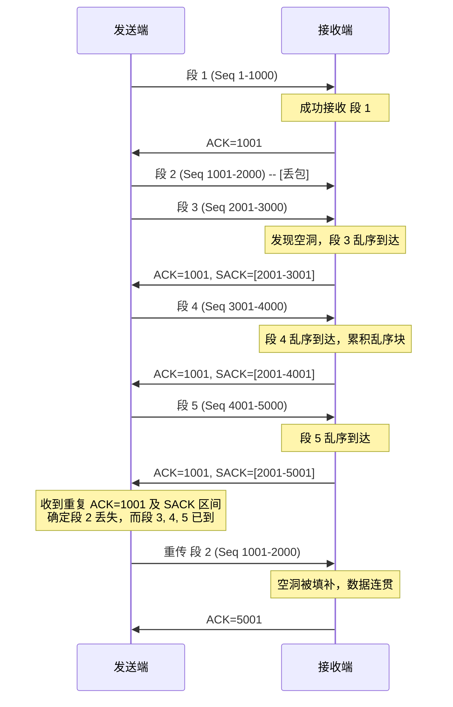
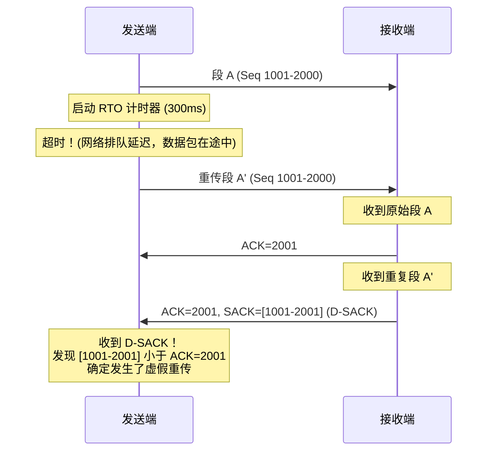
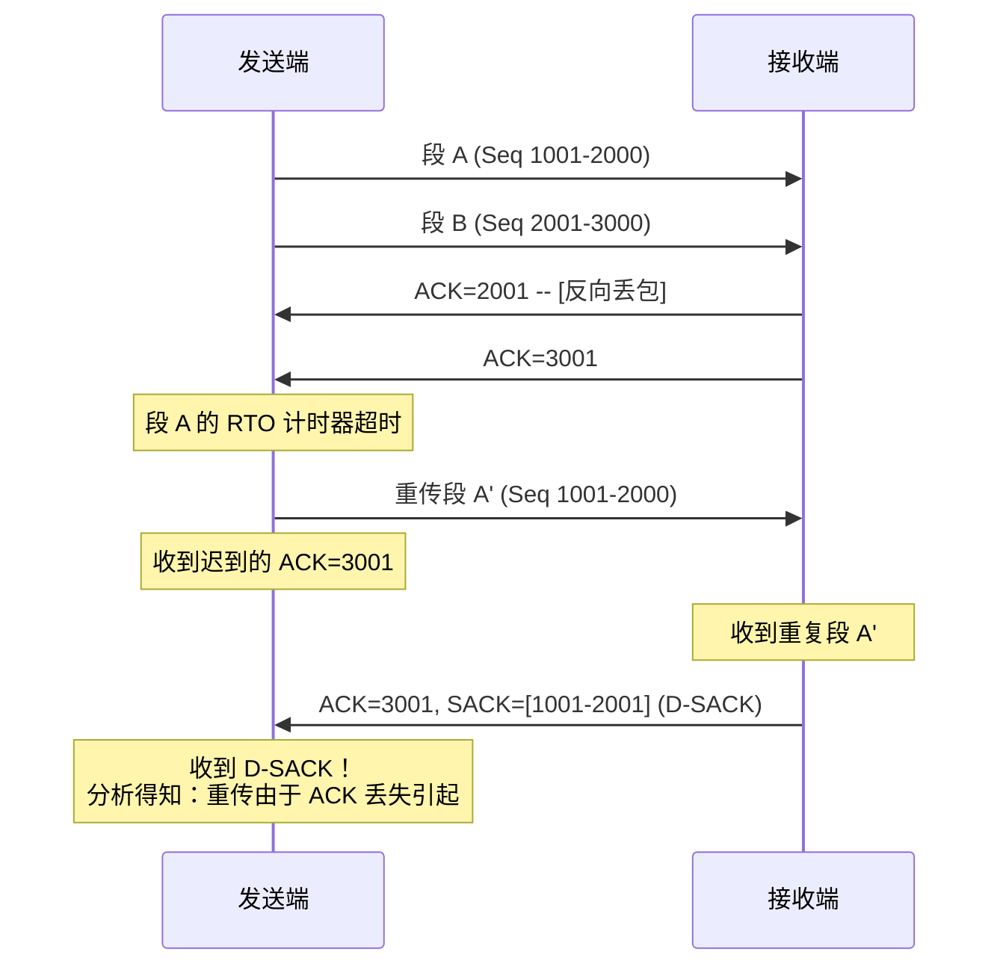
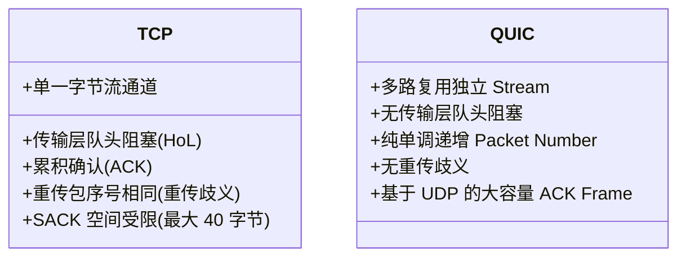

# 1.2.3.5 可靠传输

## 引言：不可靠网络之上的可靠终点

IP（Internet Protocol）协议是整个现代互联网的基石，但其本质是一个无连接、尽力而为（Best-Effort）的分组交换协议。在 IP 层，数据包面临着丢包（Packet Loss）、乱序（Out-of-Order Delivery）、重复（Duplication）以及数据损坏（Corruption）等各种不确定性。然而，上层应用（如万维网浏览、文件传输、电子邮件、数据库同步等）绝大多数都依赖于一条逻辑上无差错、按序到达的双向字节流通道。

TCP（Transmission Control Protocol，传输控制协议）通过在端系统的协议栈中实现一套精密的控制机制，在不可靠的 IP 层之上构建了可靠的传输服务。这一设计充分贯彻了计算机网络设计中的“端到端原则”（End-to-End Principle）：将复杂的可靠性保证、状态维护和流量控制功能留在网络边缘（主机），而让网络核心（路由器、交换机）保持简单、高效的无状态分组转发。

TCP 实现可靠传输的核心基石可以概括为以下三大部分：
1. **滑动窗口机制**：解决了流水线化传输与端到端流量控制的动态平衡问题，通过与带宽延迟积适配，大幅提升了网络吞吐量。
2. **超时重传与自适应计时器管理**：解决了在高度动态、抖动剧烈的广域网环境中，如何精准且及时地判定丢包并进行重传恢复的难题。
3. **确认与重传优化机制**：通过累积确认、延迟确认、选择性确认（SACK）与重复选择性确认（D-SACK），为发送方提供了高精度的网络反馈，最小化不必要的冗余传输，实现了高效的拥塞与丢包恢复。

本篇将对这些机制的底层原理、数学模型、工程实现细节以及演进历史进行深入剖析。

---

## 一、 滑动窗口 (Sliding Window) 机制：流控与吞吐的动态平衡

### 1.1 从停止-等待到流水线传输的物理意义

在最原始的可靠传输协议设计中，**停止-等待协议 (Stop-and-Wait)** 是最直观的方案：发送方发送一个数据包，然后停下来等待接收方的确认信号（ACK），收到确认后再发送下一个数据包。

#### 1.1.1 停止-等待协议的低效性分析
我们可以通过数学公式推导其信道利用率（Channel Utilization, $U$）：
设发送方发送一个分组的数据传输时延为 $T_d$，分组在网络中的单向传播时延为 $D_{prop}$，则往返传播时延为 $RTT = 2 \times D_{prop}$。接收方处理并发送确认分组的传输时延为 $T_a$。

在不考虑丢包和处理时延的情况下，发送方从开始发送一个分组到收到该分组确认的完整周期为：
$$T_{total} = T_d + RTT + T_a$$

信道利用率 $U$ 定义为发送方实际发送数据的时间占总周期的比例：
$$U = \frac{T_d}{T_d + RTT + T_a}$$

在广域网或高延迟链路（例如跨国光缆、卫星通信）中，$RTT$ 远远大于 $T_d$ 和 $T_a$。假设 $T_d = 1 \text{ ms}$，$RTT = 100 \text{ ms}$，$T_a \approx 0$，则信道利用率：
$$U \approx \frac{1}{1 + 100} \approx 0.99\%$$

这表明物理链路在 $99\%$ 的时间内都处于闲置状态，造成了极大的物理资源浪费。

#### 1.1.2 流水线传输与滑动窗口的物理本质
为了突破停止-等待协议的效率瓶颈，必须引入**流水线传输 (Pipelining)**，即允许发送方在未收到前序确认包时连续发送多个数据包。滑动窗口机制正是流水线传输在 TCP 中的具体实现，其物理意义包含三个层面：
1. **提高吞吐量**：允许发送方在等待 ACK 的“空闲时间”内继续发送数据，将网络链路的“管道”填满。
2. **流量控制 (Flow Control)**：限制发送方的发送速率，使其不会超过接收方的处理能力和缓冲区容量。通过动态通告接收窗口（Receiver Window, $rwnd$），接收方可以实时反馈自身的缓冲区剩余空间，从而动态调节发送方的窗口大小，防止接收缓冲区溢出（Buffer Overflow）。
3. **带宽延迟积 (BDP) 的适配**：带宽延迟积 $BDP = \text{Bandwidth} \times RTT$ 表示网络链路上能够容纳的最大数据量。滑动窗口的最大尺寸理论上应与 BDP 保持一致。如果窗口过小，则无法填满链路；如果窗口过大，则可能引发网络拥塞或接收缓冲区溢出。

##### 窗口缩放因子 (Window Scale Option)
在最初的 TCP 首部设计中，窗口大小（Window Size）字段仅占 16 位，这意味着最大通告窗口只能是 $2^{16} - 1 = 65535 \text{ 字节}$ (64 KB)。
在现代高带宽延迟积网络中（例如 10 Gbps 链路，100 ms RTT，其 $BDP \approx 125 \text{ MB}$），64 KB 的窗口大小会导致信道利用率仅为：
$$U \approx \frac{64 \text{ KB}}{125 \text{ MB}} \approx 0.05\%$$

为了解决该限制，RFC 1323（后被 RFC 7323 替代）引入了**窗口缩放因子 (Window Scale, WSCALE)** 选项。在三次握手阶段，双方协商一个移位值（最大为 14）。实际的接收窗口大小计算为：
$$\text{Actual Window Size} = \text{Header Window Size} \times 2^{WSCALE}$$
这使得通告窗口最大可达 $64 \text{ KB} \times 2^{14} \approx 1 \text{ GB}$，从而完美适配了高 BDP 链路的吞吐需求。

---

### 1.2 发送窗口的四个逻辑区间与边界指针

TCP 的发送缓冲区（Send Buffer）是一个循环字节数组。在任意时刻，发送缓冲区中的数据都可以被划分为四个互不重叠的逻辑区间。TCP 协议栈通过维护核心的指针（序列号）来界定这些区间：

```
发送缓冲区字节序列：
+--------------------+-----------------------+-----------------------------+--------------------+
|  已发送并已确认     |  已发送但未收到确认    |   允许发送但尚未发送         |   当前不允许发送   |
|   (区间 1)          |     (区间 2)          |      (区间 3)               |     (区间 4)       |
+--------------------+-----------------------+-----------------------------+--------------------+
                     ^                       ^                             ^
                     |                       |                             |
                  SND.UNA                 SND.NXT                    SND.UNA + SND.WND
```

1. **区间 1：已发送并确认 (Sent and Acknowledged)**
   - **状态描述**：这部分字节已经成功发送到网络，并且已经收到了接收方返回的确认（ACK）。
   - **内存管理**：这些数据已完成了它们的生命周期，TCP 协议栈可以安全地将它们从发送缓冲区中清空，释放物理内存。
   - **边界界定**：其序列号均小于 `SND.UNA` (Send Unacknowledged)。`SND.UNA` 指向发送缓冲区中第一个已发送但尚未收到确认的字节的序列号。
2. **区间 2：已发送未确认 (Sent but Not Yet Acknowledged)**
   - **状态描述**：这部分字节已经发送到网络中，但尚未收到对端的确认。
   - **内存管理**：由于这些数据可能会丢失，发送方必须在缓冲区中完整保留它们的副本，以备超时重传时使用。
   - **边界界定**：其序列号区间为 `[SND.UNA, SND.NXT)`。其中，`SND.NXT` (Send Next) 指向发送方即将发送的下一个新字节的序列号。
3. **区间 3：允许发送未发送 (Allowed to Send, Not Yet Sent / Usable Window)**
   - **状态描述**：这部分数据已经在发送缓冲区中准备就绪，且其序列号落在了接收方通告的当前接收窗口范围内。发送方无需等待任何 ACK，即可立即将它们发送出去。
   - **边界界定**：其序列号区间为 `[SND.NXT, SND.UNA + SND.WND)`。其中，`SND.WND` (Send Window) 是当前的发送窗口大小。
   - **可用窗口 (Usable Window)**：定义为当前可以立即发送的数据量，计算公式为：
     $$\text{Usable Window} = (SND.UNA + SND.WND) - SND.NXT$$
4. **区间 4：不允许发送 (Not Allowed to Send)**
   - **状态描述**：这部分数据可能已经存在于应用层的写缓冲区中，或者已经写入内核发送队列，但由于它们的序列号超出了接收方通告的接收窗口右边界，发送方绝对不能将它们发送出去。
   - **边界界定**：其序列号大于等于 `SND.UNA + SND.WND`。只有当对端确认了前面的数据（`SND.UNA` 右移）或通告了更大的窗口时，这部分数据才有可能进入区间 3。

发送窗口的大小 $SND.WND$ 在实际运行中受到两个主要因素的制约：
$$SND.WND = \min(cwnd, rwnd)$$
其中，$cwnd$ 为拥塞窗口（Congestion Window，由拥塞控制算法动态计算，代表网络当前的承载能力），$rwnd$ 为接收窗口（Receiver Window，由接收端通告，代表接收端当前的缓冲区剩余空间）。在流量控制的视角下，我们主要讨论 $rwnd$ 对发送窗口的限制。

---

### 1.3 接收窗口的三个逻辑区间与边界指针

与发送端类似，接收端的接收缓冲区（Receive Buffer）存放着已经从网络接口到达、等待被应用程序读取的数据。接收缓冲区可以划分为三个逻辑区间：

```
接收缓冲区字节序列：
+----------------------------+-----------------------------------+-----------------------------+
|   已接收、确认并已交付应用   |       允许接收但尚未完全接收       |        当前不允许接收       |
|          (区间 1)          |              (区间 2)             |           (区间 3)          |
+----------------------------+-----------------------------------+-----------------------------+
                             ^                                   ^
                             |                                   |
                          RCV.NXT                         RCV.NXT + RCV.WND
```

1. **区间 1：已接收、已确认并已交付应用 (Received, Acknowledged and Delivered)**
   - **状态描述**：这部分数据已经成功到达，经过了 TCP 的校验与按序重组，发送了 ACK 确认，并且已经被上层应用程序通过系统调用（如 `read`、`recv`）读取。
   - **内存管理**：这些数据已不在 TCP 的接收缓冲区中，其所占用的内存空间已被释放，并重新归入接收缓冲区的可用容量中。
2. **区间 2：允许接收（接收窗口内）**
   - **状态描述**：这是当前有效的接收窗口。在这个窗口内，包含了两部分数据：
     - **已到达但未交付（乱序到达的数据）**：由于前面存在尚未到达的“空洞”（丢包或乱序），这部分数据虽然已经被接收并确认（或记录在 SACK 块中），但无法交付给应用程序，必须在缓冲区中暂存，等待前面的空洞被填补。
     - **未到达但允许接收的空间**：这部分是接收缓冲区中当前真正空闲的、可以用来接收新数据的空间。
   - **边界界定**：其序列号区间为 `[RCV.NXT, RCV.NXT + RCV.WND)`。其中，`RCV.NXT` (Receive Next) 是接收方期望收到的下一个按序字节的序列号；`RCV.WND` (Receive Window) 是接收方当前通告的接收窗口大小。
3. **区间 3：不允许接收 (Not Allowed to Receive)**
   - **状态描述**：序列号大于等于 `RCV.NXT + RCV.WND` 的数据区域。这部分对应的缓冲区空间可能还没有被分配，或者超出了接收方的承受上限。
   - **边界界定**：如果接收方收到了序列号落在该区间的数据包，通常会直接将其丢弃，或者在严重的越界情况下向对端发送重置报文（RST）。

---

### 1.4 窗口的滑动与三态运动：收缩、扩张与零窗口死锁打破

#### 1.4.1 窗口的移动状态与右边界收缩风险
在连接运行过程中，随着数据的发送和确认，窗口边界会发生移动。窗口的运动可以分为三种状态：
1. **合拢 / 收缩左边界 (Close / Slide Forward)**：当收到新的确认（ACK）时，发送窗口的左边界 `SND.UNA` 向右移动。这意味着已确认的数据被移出窗口。
2. **张开 / 扩张右边界 (Open)**：当接收端读取了缓冲区中的数据，释放了空间，从而在 ACK 中通告了更大的 `rwnd` 时，窗口的右边界向右移动。
3. **收缩右边界 (Shrink)**：即窗口右边界向左移动（即 `SND.UNA + SND.WND` 减小）。

##### 右边界收缩的危害与规避
**RFC 1122 强烈建议接收端绝对不要收缩右边界**。
假设接收端收缩了右边界（例如由于系统内存紧张，强制收回了部分缓冲区，导致通告的右边界向左移动）。如果在该通告到达发送端之前，发送端已经发送了落在原窗口右侧、但现已被收缩掉的区域内的数据，这些数据到达接收端时就会因为落在窗口之外而被丢弃。这会导致严重的重传和连接卡死。

为了规避这种风险，操作系统协议栈在实现时遵循以下原则：如果必须减少缓冲区，接收端不应当主动将右边界向左拉，而是应当保持当前的右边界不动（即随着 `RCV.NXT` 的递增，相应地减小通告的 `RCV.WND` 大小），直到发送方将已通告区间内的数据全部发送并得到确认后，再在内核中实际收缩缓冲区物理空间。

#### 1.4.2 零窗口 (Zero Window) 与持续计时器 (Persist Timer)

当接收端应用程序处理速度远慢于发送端的发送速度时，接收缓冲区会被逐步填满，最终迫使接收端向发送端发送一个 `rwnd = 0` 的报文段（即零窗口通告）。此时，发送窗口大小 $SND.WND = 0$，发送端被迫停止发送数据，连接进入等待状态。

##### 零窗口死锁 (Deadlock)
当接收端应用程序读取了数据，释放了接收缓冲区后，接收端会主动发送一个**窗口更新 (Window Update)** 报文段（一个不含数据但通告了新 `rwnd > 0` 的 ACK 报文）。由于 TCP 的 ACK 确认报文本身是不需要被确认的，如果这个窗口更新报文在传输过程中丢失，就会产生如下死锁：
- **发送端**：在等待接收端的窗口更新报文，以便继续发送数据。
- **接收端**：认为自己已经发送了窗口更新，正在等待发送端发送新数据。
双方将无限期地僵持下去，连接实质上已经死锁。

##### 持续计时器 (Persist Timer) 与窗口探测 (Window Probe)
为了打破这种零窗口死锁，TCP 引入了**持续计时器 (Persist Timer)** 机制：
1. **启动时机**：当发送端收到对端通告的零窗口（`rwnd = 0`）时，立即为该连接启动持续计时器。
2. **探测报文发送**：当持续计时器超时（通常初始值为 RTO，并使用指数退避，最大可达 60 秒）时，发送方会向接收方发送一个特殊的报文段——**窗口探测 (Window Probe)** 报文。
3. **探测报文特性**：
   - 窗口探测报文只携带 1 字节的数据（该字节的序列号为当前发送窗口外侧的第一个字节，即 `SND.NXT`）。
   - 尽管该报文超出了接收方的接收窗口，但 TCP 协议规范强制要求接收端必须接收并处理该探测报文，且必须返回一个确认报文（ACK）。
4. **死锁打破**：接收端回复的 ACK 报文会携带其当前的 `rwnd` 大小。如果接收缓冲区依然为满，回复的 ACK 中 `rwnd` 仍为 0，发送端重新启动持续计时器，并在下一次超时后继续探测。如果接收缓冲区已经释放，回复的 ACK 中 `rwnd` 将大于 0，发送端的发送窗口被重新打开，死锁解除。

##### 极限边缘情况：探测报文丢失
如果网络发生了极其严重的拥塞，窗口探测报文本身也连续丢失怎么办？
TCP 协议栈对窗口探测报文的发送同样遵循指数退避。如果在连续多次（通常为 15 次，耗时数分钟）发送探测报文且未收到接收端的任何确认响应后，TCP 将判定该连接已经中断，从而发送重置（RST）报文，并向应用层抛出 `ETIMEDOUT` 或 `EPIPE` 错误，强行关闭连接。

---

### 1.5 糊涂窗口综合征 (Silly Window Syndrome, SWS)

#### 1.5.1 SWS 的本质与危害
当 TCP 连接的一端或两端表现出“小流量发送”倾向时，就会发生**糊涂窗口综合征 (SWS)**。其具体表现为：发送端每次只发送极小的数据片（如 1 字节），而接收端也每次只通告极小的接收窗口，导致网络中充斥着大量的微小报文段。

从协议开销的角度看，一个标准的 TCP/IP 报文头部至少包含：IP 头部（20 字节）与 TCP 头部（20 字节），共 40 字节。如果每次只传输 1 字节的有效数据（Payload），则信道利用率为：
$$\eta = \frac{1}{1 + 40} \approx 2.44\%$$

这意味着 $97.56\%$ 的网络带宽都被无用的头部信息占用了。如果网络中存在大量的这种微小报文，会导致路由器队列暴涨、链路极度拥塞、网络整体吞吐量呈断崖式下跌。

#### 1.5.2 发送端引起的 SWS 与 Nagle 算法
##### 成因
发送端应用程序产生数据的速度极慢（例如用户在交互式终端中敲击键盘，每次只产生 1 字节的字符数据）。如果 TCP 协议栈对这些数据不做缓存而是立即发送，就会产生海量的小报文。

##### Nagle 算法的解决方案
为了限制小报文在网络中的泛滥，John Nagle 提出了 **Nagle 算法**（RFC 896）。其核心思想是：在任意时刻，一个 TCP 连接上最多只能有一个未被确认的微小报文段（小于 MSS 的报文）。
Nagle 算法的控制逻辑如下：
1. 若发送端产生的新数据使得待发送缓冲区中的数据累积达到了**最大报文段长度 (MSS)**，或者接收端通告的窗口大小大于等于 MSS，则立即将这些数据组装成一个 MSS 大小的报文段发送出去。
2. 若上述条件不满足（即数据量小于 MSS）：
   - 如果网络中仍有“在途数据”（In-flight Data，即已发送但未收到确认的数据，即发送窗口区间 2 非空），则发送端将新产生的数据放入发送缓冲区进行缓存，直到收到之前所有已发送数据的 ACK，或者缓存的数据量累积到了 MSS 大小，才将它们发送。
   - 如果网络中没有在途数据，则立即发送当前缓冲区中的所有小数据。

我们可以用以下伪代码来描述 Nagle 算法的运行逻辑：
```c
// Nagle 算法的控制逻辑
void nagle_send(struct tcp_sock *tp, struct sk_buff *skb) {
    int size = skb->len;
    // 如果数据长度达到 MSS，或者接收窗口足够大，直接发送
    if (size >= tp->mss_cache || tcp_window_large_enough(tp)) {
        tcp_transmit_skb(skb);
    } else {
        // 如果网络中没有在途数据（已发送未确认的包）
        if (tp->packets_out == 0) {
            tcp_transmit_skb(skb);
        } else {
            // 否则，将数据排队缓存，合并小包
            tcp_enqueue_queue(tp, skb);
        }
    }
}
```

##### Nagle 算法与延迟确认 (Delayed ACK) 的致命冲突
虽然 Nagle 算法在减少小包方面表现优异，但在某些高并发、低延迟的应用场景下，它会带来严重的性能灾难。这主要是因为它与接收端的**延迟确认 (Delayed ACK)** 策略会发生死锁式的冲突。
假设客户端向服务器发送数据，使用 Nagle 算法，且启用了 Delayed ACK。
1. 客户端发送了一段小数据（请求头部），由于没有在途数据，该数据立即发出。
2. 客户端应用程序接着写入了第二段小数据（请求体）。由于前段数据的 ACK 还没有返回，Nagle 算法强制将第二段数据缓存在本地。
3. 服务器收到第一段数据。由于启用了 Delayed ACK 且此时没有反向数据要发送，服务器决定延迟发送 ACK，等待第二段数据到达以便进行累积确认或捎带确认（通常等待时间为 40ms - 200ms）。
4. **死锁发生**：客户端在等待服务器的 ACK 确认以便发送第二段数据，而服务器在等待客户端的第二段数据以便发送 ACK。
5. 直到服务器的延迟确认计时器超时（如 200ms），强行发送了 ACK，客户端收到 ACK 后才发出第二段数据。

这种长达 200ms 的不必要延迟在实时 Web 请求、在线游戏或 RPC 调用中是完全不可接受的。因此，在这些场景下，应用程序必须通过套接字选项禁用 Nagle 算法：
```c
int opt_val = 1;
setsockopt(sock_fd, IPPROTO_TCP, TCP_NODELAY, &opt_val, sizeof(opt_val));
```
禁用 `TCP_NODELAY` 后，TCP 协议栈将绕过 Nagle 算法，只要有数据就立即发送，从而消除了上述延迟。

#### 1.5.3 接收端引起的 SWS 与 Clark 规则、延迟确认
##### 成因
如果接收端应用程序读取数据的速度极慢（例如每次只用 `read(fd, buf, 1)` 读取 1 字节），当接收缓冲区满时，一旦应用程序读取了 1 字节，接收端就立即向发送端发送一个窗口更新报文，宣告 `rwnd = 1`。发送端收到后，立即发送一个包含 1 字节数据的报文段。如此往复，网络中同样充满了 1 字节的极小包。

##### Clark 规则 (Clark's Solution)
David D. Clark 提出了**接收端避免 SWS 的规则**（RFC 813）：
接收端绝对不能向发送端宣告微小的窗口。具体来说，当接收缓冲区的可用空间（即由于应用程序读取数据而新释放的空间）较小时，接收端必须强制将通告窗口 `rwnd` 设为 0。只有当以下两个条件之一满足时，接收端才能宣布窗口打开（通告实际的可用空间）：
1. 接收缓冲区的空闲空间达到了**一个最大报文段长度 (MSS)**。
2. 接收缓冲区的空闲空间达到了**接收缓冲区总容量的一半 (Rx Buffer Size / 2)**。

##### 接收端延迟确认 (Delayed ACK) 对 SWS 的抑制
延迟确认机制通过“故意不发送 ACK”来应对 SWS。当数据到达时，接收端不立即确认。在延迟的这几十到两百毫秒内，上层应用程序通常会读取更多的数据，从而使接收缓冲区释放出足够大的空间。当延迟计时器超时或满足发 ACK 条件时，接收端通告的窗口已经累积到了一个可观的尺寸，自然避开了小窗口通告的问题。

---

## 二、 超时重传 (Retransmission) 与计时器管理：自适应的时间估算

### 2.1 RTO 的自适应估算本质

TCP 是通过接收端的反馈（ACK）来确认数据是否送达的。如果在规定的时间内，发送端未能收到某数据包的确认，就会判定该数据包在网络中丢失，并触发**超时重传 (Retransmission)**。这个等待的规定时间称为**超时重传时间 (RTO, Retransmission Time-Out)**。

RTO 的设置是一个经典的两难问题：
- **RTO 设置过大**：当数据包确实丢失时，发送端需要等待极长的时间才能感知并启动重传。这会导致网络吞吐量骤降，交互式应用的响应延迟明显增高。
- **RTO 设置过小**：数据包可能并没有丢失，只是由于网络暂时拥塞导致其往返时间（RTT）变长。如果 RTO 设置过小，发送端会误判定其丢失并频繁重传。这不仅造成了带宽的严重浪费，更糟糕的是，向已经拥塞的网络中源源不断地注入重复的数据包，会导致网络彻底陷入瘫痪（即拥塞雪崩）。

由于互联网的路由路径瞬息万变、网络节点的负载动态波动，往返时间 $RTT$ 也是实时波动的。因此，RTO 绝对不能是一个固定的静态值，而必须由 TCP 协议栈根据历史测得的 $RTT$ 数据进行**自适应的动态估算**。

---

### 2.2 RTO 估算算法的历史演进与数学推导

#### 2.2.1 经典 RFC 793 算法（加权移动平均）
在 TCP 的早期规范 RFC 793 中，自适应估算算法采用的是加权移动平均数（Exponential Weighted Moving Average, EWMA）来跟踪网络 RTT 的平均水平。在信号处理学中，这本质上是一个一阶低通滤波器（Low-pass Filter），用来滤除 RTT 采样中的高频噪声，保留网络时延的低频趋势。

##### 算法步骤
1. **RTT 采样**：对每一个发送出去并收到确认的非重传数据段，测量其从发送到收到 ACK 的时间差，记为单次采样值 $RTT_k$。
2. **平滑计算**：计算平滑往返时间 $SRTT$（Smoothed RTT）：
   $$SRTT_{k} = \alpha \times SRTT_{k-1} + (1 - \alpha) \times RTT_{k}$$
   其中，$\alpha$ 是平滑因子，其推荐取值范围在 $0.8 \sim 0.9$ 之间（例如取 $0.9$）。这表明历史的 $SRTT$ 占了 $90\%$ 的权重，而当前单次的采样值只占 $10\%$ 的权重，从而避免了单次测量误差导致估算大幅跳变。
3. **计算 RTO**：
   $$RTO = \beta \times SRTT$$
   其中，$\beta$ 是延迟偏差因子，推荐值为 $1.3 \sim 2.0$（通常取 $2.0$），作为一个安全系数，以容忍 $RTT$ 的日常波动。

##### 缺陷分析
RFC 793 算法在网络拓扑简单、流量平稳的时代运行良好。但在复杂的现代多节点共享网络中，它暴露出了一个严重的缺陷：**它无法应对 RTT 的高方差（即剧烈抖动）**。
因为 $\beta$ 是一个固定的常数，算法并没有将 $RTT$ 采样的波动幅度（方差）纳入考量。
- **在 RTT 剧烈抖动的网络中**：当 $RTT$ 突然暴增（例如网络瞬时拥塞）时，由于 $\alpha$ 较大，平滑后的 $SRTT$ 上升速度极慢，而 $RTO = 2 \times SRTT$ 无法迅速拉大，导致在 $SRTT$ 还没跟上变化之前，发生大量的虚假超时重传。
- **在 RTT 相对稳定的网络中**：由于安全系数 $\beta = 2.0$ 相对保守，即使网络抖动极小，$RTO$ 依然被设为了 $SRTT$ 的两倍，导致真正丢包时，超时恢复的时间过长。

#### 2.2.2 Jacobson / Karels 算法（引入偏差波动值 DevRTT）
为了解决 RFC 793 对网络抖动反应迟钝的问题，Van Jacobson 和 Michael Karels 提出了著名的 **Jacobson / Karels 算法**。该算法将往返时间的“均值偏差”（Mean Deviation，作为标准差的低成本近似计算）显式地引入到了 RTO 计算中。
该算法成为了当今 TCP 实现的基石，并被标准化为 RFC 6298。

##### 数学模型与递推公式
在每次收到非重传报文的有效 $RTT$ 采样值（记为 $RTT_k$）时，进行如下步骤的计算：
1. **计算偏差值 ($Err$)**：当前采样值与上一次平滑值的偏差：
   $$Err = RTT_{k} - SRTT_{k-1}$$
2. **更新平滑往返时间 ($SRTT$)**：
   $$SRTT_{k} = SRTT_{k-1} + g \times Err$$
   其中 $g$ 为滤波增益系数，RFC 6298 建议 $g = 1/8 = 0.125$。这等价于：
   $$SRTT_{k} = \frac{7}{8} SRTT_{k-1} + \frac{1}{8} RTT_{k}$$
3. **更新平滑均值偏差 ($RTTVAR$)**：
   $$RTTVAR_{k} = (1 - h) \times RTTVAR_{k-1} + h \times |Err|$$
   其中 $RTTVAR$（RTT Variance）代表 RTT 的波动程度（即 DevRTT）；$h$ 是方差更新系数，推荐 $h = 1/4 = 0.25$。这等价于：
   $$RTTVAR_{k} = \frac{3}{4} RTTVAR_{k-1} + \frac{1}{4} |RTT_{k} - SRTT_{k-1}|$$
4. **计算超时重传时间 ($RTO$)**：
   $$RTO_{k} = SRTT_{k} + 4 \times RTTVAR_{k}$$
   为了防止计算出的 $RTO$ 过小，如果计算结果小于 1 秒（在 Linux 内核中通常设定最小下限 `TCP_RTO_MIN` 为 200ms），则强制将 $RTO$ 设为下限值。

##### 4 倍均值偏差 ($4 \times RTTVAR$) 的工程与统计学意义
在统计学中，对于服从正态分布的随机变量，均值加上 4 倍的标准差可以覆盖 $99.99\%$ 以上的数据样本点。
在计算机网络中，虽然 RTT 的分布不一定是严格的正态分布，但“均值 + 4 $\times$ 偏差”的估算模型在工程上被证明是一个极佳的平衡点：它既能保证在网络状况平稳时保持紧凑的 RTO，又能在网络突发抖动、偏差 $Err$ 急剧变大时，以 $4$ 倍的杠杆作用迅速推高 $RTO$，防止虚假重传发生。

##### 移位运算的工程美学
在 1980 年代末，路由器的计算性能和端主机的 CPU 算力都极为有限，浮点数乘除法是非常昂贵的操作。Jacobson / Karels 算法的参数选择充满了精妙的工程考量：
由于 $g = 1/8 = 2^{-3}$，$h = 1/4 = 2^{-2}$，在协议栈实现时，完全不需要进行浮点数计算，而是全部使用整型运算，并通过底层的二进制移位来实现：
```c
// 伪代码展示移位实现 Jacobson/Karels 算法
long err = rtt - srtt;
srtt += (err >> 3); // 相当于乘以 1/8
rttvar = rttvar + ((abs(err) - rttvar) >> 2); // 相当于乘以 1/4
rto = srtt + (rttvar << 2); // 相当于 rttvar * 4
```
这种精妙的设计使得即使在每秒处理成千上万个包的高负载网络栈中，RTO 的自适应计算也几乎不带来任何 CPU 开销。

##### 初始状态（冷启动）下的计算
当 TCP 连接刚建立时，还没有获得任何 RTT 采样值。根据 RFC 6298 规定：
- 初始 $RTO$ 被设为 $1.0\text{ 秒}$。
- 当收到第一个有效 $RTT$ 采样 $R$ 时，初始化计算如下：
  $$SRTT = R$$
  $$RTTVAR = \frac{R}{2}$$
  $$RTO = SRTT + 4 \times RTTVAR = 3R$$
- 之后收到第二个采样及后续采样时，才开始使用递推公式进行更新。

#### 2.2.3 数值模拟对比：RFC 793 vs. Jacobson/Karels

为了直观地展示 Jacobson/Karels 算法如何优于经典的 RFC 793 算法，我们进行一次简化的数值模拟。

##### 初始状态与参数设定
- 初始状态：网络稳定，$RTT = 100\text{ ms}$。此时两种算法均已收敛，且在 $t=0$ 时：
  - $SRTT = 100\text{ ms}$
  - 对于 RFC 793 算法：取 $\beta = 2.0$，计算得 $RTO = 200\text{ ms}$。
  - 对于 Jacobson/Karels 算法：假设历史波动极小，$RTTVAR = 5\text{ ms}$，计算得 $RTO = 100 + 4 \times 5 = 120\text{ ms}$。
- 从 $t=1$ 开始，网络因突发流量发生严重拥塞，$RTT$ 发生了阶跃式的剧烈抖动，实际测量到的 $RTT$ 采样如下表所示：

| 时间 $t$ | 实际测得的 $RTT_t$ (ms) | RFC 793 $SRTT_t$ (ms) (取 $\alpha=0.9$) | RFC 793 $RTO_t$ (ms) | J/K $SRTT_t$ (ms) (取 $g=0.125$) | J/K $RTTVAR_t$ (ms) (取 $h=0.25$) | J/K $RTO_t$ (ms) |
| :--- | :--- | :--- | :--- | :--- | :--- | :--- |
| **0** | - (稳定状态) | 100.0 | **200.0** | 100.0 | 5.0 | **120.0** |
| **1** | **300.0** (突变) | 120.0 | **240.0** | 125.0 | 53.75 | **340.0** |
| **2** | **350.0** | 143.0 | **286.0** | 153.1 | 96.88 | **540.6** |
| **3** | **400.0** | 168.7 | **337.4** | 184.0 | 126.6 | **690.4** |

##### 模拟结果分析
当 $RTT$ 从 $100\text{ ms}$ 动荡式骤增到 $300\text{ ms}$ 以上时：
- **RFC 793 算法**：在 $t=1$ 时，计算出的 $RTO$ 仅为 $240\text{ ms}$，而此时实际的 $RTT$ 已经达到了 $300\text{ ms}$！这意味着即使数据包在传输中没有丢失，发送端也会在 $240\text{ ms}$ 时发送**虚假超时重传**。到了 $t=2$ 和 $t=3$，$RTO$（$286\text{ ms}$，$337.4\text{ ms}$）依然小于实际 $RTT$（$350\text{ ms}$，$400\text{ ms}$），虚假重传将接连不断地发生。
- **Jacobson/Karels 算法**：在 $t=1$ 时，采样值 $RTT_1 = 300\text{ ms}$ 与历史 $SRTT$ 产生了巨大的偏差值 $Err = 200\text{ ms}$。这个偏差立刻将 $RTTVAR$ 从 $5\text{ ms}$ 拉升到了 $53.75\text{ ms}$。在 4 倍杠屈的放大作用下，计算出的 $RTO_1$ 迅速飙升到了 **$340\text{ ms}$**，成功避过了当前的实际延迟值 $300\text{ ms}$！在后续步骤中，$RTO$ 持续保持在实际 $RTT$ 之上，完美保护了网络，没有发生一次虚假重传。

#### 2.2.4 Karn 算法（重传歧义问题的终结者）

##### 重传歧义 (Retransmission Ambiguity) 的本质
RTT 采样的准确性是自适应算法的前提。然而，在丢包重传的场景下，会出现著名的重传歧义问题：
假设发送方发出了报文段 A，经过一段时间后未收到确认，于是重传了报文段 A。紧接着，发送方收到了对端对 A 的确认 ACK。
此时，发送方无法区分这个 ACK 是对第一次发送的响应还是对第二次重传的响应。

##### 重传歧义导致的反馈回路失真
如果协议栈对重传包的 ACK 采样不做特殊处理，会导致计算陷入灾难：
- **正反馈崩塌**：如果将 ACK 误判定为第一次发送的确认，测得的 $RTT$ 将异常偏大。这会导致 $RTO$ 被错误地大幅调大，系统反应变得极其迟钝。
- **负反馈死锁**：如果将 ACK 误判定为第二次重传的确认，测得的 $RTT$ 将异常偏小（因为重传到收到 ACK 的间隔极短）。这会导致 $RTO$ 被错误地缩小，从而引发下一次大面积的虚假重传，使连接陷入无休止的自我重传死锁。

##### Karn 算法规则
Phil Karn 提出了著名的 **Karn 算法**，用来规范重传情况下的 RTO 计算：
1. **不采样原则**：凡是发生过重传的报文段，其对应的 $RTT$ 采样值一律被抛弃，**绝对不用于**更新平滑值 $SRTT$ 和偏差值 $RTTVAR$。
2. **计时器避险与退避级联**：
   当某个报文段超时并发生重传时，TCP 协议栈无法获取当前的真实 $RTT$。为了安全起见，此时使用**指数退避（Exponential Backoff）**机制直接将当前的 $RTO$ 翻倍，作为下一次重传的超时上限。
3. **算法复位**：
   只有当发送端成功发送了一个**未经过任何重传**的数据包，并顺利收到了对该数据包的确认 ACK 时，TCP 才重新使用 Jacobson/Karels 算法重新计算 $RTO$。

##### 现代优化：结合 TCP 时间戳选项 (Timestamp Option)
Karn 算法通过不采样重传包虽然保证了计算的安全性，但也带来了一个副作用：在网络持续拥塞、重传比例很高时，TCP 会在很长一段时间内无法更新 $SRTT$ 和 $RTTVAR$，导致 $RTO$ 停留在某个极高值（退避后的值）无法恢复，即使网络状况已经好转。

现代 TCP 通过引入 **TCP 时间戳选项（TCP Timestamps Option, RFC 7323）** 优雅地解决了这一局限。
时间戳选项在 TCP 报文头部的 Option 字段中占用了 10 字节。其基本机制为：
1. 发送方在发送报文段时，在头部写入一个当前系统时钟的 32 位时间戳值（TSval）。
2. 接收方收到该报文段并在回复 ACK 确认时，会将该报文段中的 TSval 复制回 ACK 头部中的时间戳回显值字段（TSecr）。
3. 发送方收到 ACK 后，读取 TSecr，直接用“当前系统时钟 - TSecr”计算出精确的 $RTT$。

因为每一个报文段（包括重传包）的时间戳 TSval 都是唯一的，发送方通过 ACK 中的 TSecr 回显值，能够**绝对无歧义**地识别出这个 ACK 究竟是对哪一次发送的确认。因此，在启用了时间戳选项的 TCP 连接中，Karn 算法的限制可以被部分解除：**即使是重传报文，也可以通过时间戳回显进行精确的 RTT 采样并更新 RTO**。

---

### 2.3 超时重传的惩罚机制：指数退避 (Exponential Backoff)

当发生超时重传，并且重传的数据包在发出后再次超时，表明网络当前处于极度拥塞的状态。此时，TCP 不会继续使用原有的 $RTO$ 频率进行重传，而是采用**指数退避**策略：
每次连续超时重传，都会将当前的 $RTO$ 乘以 $2$（即翻倍）：
$$RTO_{new} = 2 \times RTO_{old}$$

通常，退避过程会设定一个最大上限值（通常在 $64\text{ 秒}$ 左右）。一旦退避后的 $RTO$ 达到该上限，后续的重传将固定使用该上限值，直到重传成功或连接超时被强行关闭（通常重传次数达到 15 次，约数分钟后放弃连接）。

##### 指数退避的哲学
指数退避体现了 TCP 对拥塞控制的“礼让哲学”。当网络路由器或交换机的缓冲区满载而导致丢包时，发送方迅速降低其重传频率，可以给网络中转节点留出足够的“排空时间”（Drain Time），防止网络陷入死锁，符合社会公共网络资源的合理利用逻辑。

---

## 三、 确认与重传优化机制：高精度反馈与快速恢复

### 3.1 累积确认 (Cumulative Acknowledgment) 机制的物理内涵与局限

#### 3.1.1 累积确认的物理内涵与容错性
TCP 的确认机制默认采用**累积确认 (Cumulative Acknowledgment)**。
接收端回复的 `ACK = N`（在报文头部的 Acknowledgment Number 字段中）代表的物理意义是：**序列号在 $N$ 之前的所有字节数据都已成功接收并校验无误，我期望收到的下一个字节序列号是 $N$**。

累积确认在面对 ACK 丢失时表现出极强的健壮性（Robustness）。
例如，发送端发送了三个数据段：段 1（Seq 1-1000）、段 2（Seq 1001-2000）、段 3（Seq 2001-3000）。
假设接收端成功收到了这三个段，并分别回复了 `ACK = 1001`、`ACK = 2001`、`ACK = 3001`。
如果在传输过程中，`ACK = 1001` 和 `ACK = 2001` 由于网络波动丢失了，但最后一个 `ACK = 3001` 成功送达了发送端。发送端根据 `ACK = 3001` 即可判定：序列号 3000 之前的所有数据均已成功送达，段 1 和段 2 已经隐含得到了确认。发送端不会进行任何无谓的重传。

#### 3.1.2 累积确认的局限性与“重传两难”
当发生“多包丢失”或“中间单包丢失”时，累积确认的局限性便会显露。
假设发送端连续发送了 5 个报文段：段 1 (Seq 1-1000)、段 2 (Seq 1001-2000，丢失)、段 3 (Seq 2001-3000)、段 4 (Seq 3001-4000)、段 5 (Seq 4001-5000)。

此时接收端成功收到了段 1、段 3、段 4、段 5。由于段 2 丢失，接收端无法针对段 3、4、5 给出新的累积确认。因为根据累积确认的定义，如果接收端发送了 `ACK = 3001`，就意味着段 2 也被收到了，这是不符合事实的。
因此，接收端在收到段 3、4、5 时，只能不断回复 **`ACK = 1001`**（即重复确认）。

发送端在超时（或者收到 3 次重复确认触发快速重传）后，它面临着两难的决策抉择：
1. **策略一（回退 N 步, Go-Back-N 思想）**：
   发送端重传段 2，并且将段 2 之后的所有数据（段 3、段 4、段 5）全部重传一遍。
   - **代价**：严重浪费带宽。段 3、4、5 实际上已经在接收端的缓冲区中静候了，重复传输这些数据是无意义的。
2. **策略二（只重传首个包）**：
   发送端只重传丢失的段 2，然后等待下一个 ACK。
   - **代价**：效率低下。如果除了段 2 之外，段 3 也丢失了，发送端在重传段 2 后收到的下一个 ACK 依然是 `ACK = 2001`（期望收到段 3）。发送端必须重新等待超时，或者再次等待重复的 ACK，导致丢包恢复过程极其漫长。

这种信息不对称（发送端不知道段 2 之后的包哪些到了，哪些没到）严重制约了 TCP 在高丢包率、高延迟网络下的性能。

---

### 3.2 延迟确认 (Delayed ACK) 策略

为了减少纯 ACK 报文（不含任何 payload 的 ACK）在网络中的传输频率，节省网络带宽和 CPU 开销，TCP 引入了**延迟确认 (Delayed ACK)** 策略。

#### 3.2.1 触发时机与核心规则
根据 RFC 1122 的规范，接收端的延迟确认必须遵循以下几条硬性规则：
1. **最大延迟时间限制**：接收端决定延迟发送 ACK 时，这个延迟时间**绝对不能超过 500 毫秒**（在实际的现代内核实现中，为了保证更高的响应性，通常将该上限设为 **200 毫秒**）。
2. **隔包立即确认（每两个最大报文段确认一次）**：当接收端收到数据包时，如果它发现之前已经收到过一个数据包且其 ACK 正在处于延迟等待状态，那么在收到当前这第二个数据包时，**必须立即**发送 ACK，不允许继续延迟。换言之，不允许连续延迟两个 full-sized 报文段的 ACK。
3. **捎带确认 (Piggybacking)**：如果接收端在决定延迟发送 ACK 的等待期内，端主机刚好自身有发往发送端的数据报文要发送，那么接收端会直接将 ACK 状态写入该数据报文的头部，与数据一同打包发送。这直接将纯 ACK 报文的数量降为了零。
4. **乱序到达立即确认**：如果收到的是一个无序/乱序的报文段（即中间有空洞），接收端必须立即发送 ACK（重复确认），以便发送端尽快启动快速重传。

#### 3.2.2 延迟确认的负面影响与控制
正如前文 SWS 章节所述，当 Delayed ACK 遇上发送端的 Nagle 算法，会产生 200ms 的死锁时延。
此外，即使禁用了 Nagle 算法，Delayed ACK 也会影响 TCP 的**拥塞窗口快速增长**。因为在连接刚建立的“慢启动（Slow Start）”阶段，拥塞窗口 $cwnd$ 是伴随着每一个收到的有效 ACK 而指数增长的。如果接收端每收到两个包才发一个 ACK，那么发送端拥塞窗口的增长速度就会直接被砍掉一半。

因此，在某些高吞吐、低延迟且由拥塞窗口主导的网络场景下，可以通过 Linux 套接字选项 `TCP_QUICKACK` 动态开启快速确认模式，禁止 Delayed ACK：
```c
int opt_val = 1;
setsockopt(sock_fd, IPPROTO_TCP, TCP_QUICKACK, &opt_val, sizeof(opt_val));
```
需要注意的是，`TCP_QUICKACK` 在 Linux 内核中是一个非持久化的选项，内核在进行某些内部状态调整时可能会重新启用 Delayed ACK，因此通常需要在每次 `recv` 之后重新设置。

---

### 3.3 选择性确认 (Selective Acknowledgment, SACK) 机制

为了彻底打破累积确认在“多包丢失”场景下的“重传两难”困境，RFC 2018 提出了 **选择性确认 (SACK)** 机制。SACK 允许接收端明确告诉发送端：“我已经收到了哪些乱序的数据块，你只需要重传那些我没有收到的空洞数据即可”。

#### 3.3.1 SACK 的协议协商与报文格式
1. **协商阶段**：
   在 TCP 建立连接的三次握手期间，主动发起方会在 SYN 报文中加入 `Sack-Permitted` 选项（Kind = 4，长度 = 2 字节）。被动接收方如果也支持 SACK，则在回复的 SYN-ACK 中同样携带 `Sack-Permitted` 选项。双方达成一致后，后续数据传输即可启用 SACK。
2. **报文携带**：
   当启用 SACK 后，若接收端收到了乱序数据，它会在回复的 ACK 报文的 TCP 头部 Options 字段中，附加一个 `SACK` 选项（Kind = 5）。

##### SACK 头部字节布局分析
TCP 头部选项的最大总长度限制为 **40 字节**。
一个 SACK 选项的格式如下：
- `Kind`: 1 字节（固定值为 5）
- `Length`: 1 字节（表示该 SACK 选项的总字节数）
- `SACK Blocks` (边界块列表)：每个边界块代表一个已经成功接收的连续数据区间，由两个 32 位的序列号组成：
  - **左边界 (Left Edge of Block)**：该数据块的首个字节序列号。
  - **右边界 (Right Edge of Block)**：该数据块最后一个字节序列号加 1（即属于该块之后的第一个未接收字节序列号，开区间）。

```
+--------+--------+--------+--------+--------+--------+--------+--------+
|  Kind  | Length |        Left Edge 1st SACK Block (32-bit)            |
|  (5)   |  (36)  |                                                     |
+--------+--------+--------+--------+--------+--------+--------+--------+
|       Right Edge 1st SACK Block (32-bit)                              |
+-----------------------------------------------------------------------+
|        Left Edge 2nd SACK Block (32-bit)                              |
+-----------------------------------------------------------------------+
|       Right Edge 2nd SACK Block (32-bit)                              |
+-----------------------------------------------------------------------+
|        Left Edge 3rd SACK Block (32-bit)                              |
+-----------------------------------------------------------------------+
|       Right Edge 3rd SACK Block (32-bit)                              |
+--------+--------+--------+--------+--------+--------+--------+--------+
```

一个 SACK 块占用：$4\text{ 字节 (左边界)} + 4\text{ 字节 (右边界)} = 8\text{ 字节}$。
SACK 选项的最大可能空间占用计算如下：
- 如果只携带 1 个 SACK 块：$1 \times 8 + 2 = 10\text{ 字节}$
- 如果携带 2 个 SACK 块：$2 \times 8 + 2 = 18\text{ 字节}$
- 如果携带 3 个 SACK 块：$3 \times 8 + 2 = 26\text{ 字节}$
- 如果携带 4 个 SACK 块：$4 \times 8 + 2 = 34\text{ 字节}$

由于 TCP Option 最大 40 字节，如果没有任何其他 Option（如时间戳），SACK 选项最多只能携带 **4 个 SACK 块**。
如果连接同时启用了 **TCP 时间戳选项（Timestamps Option）**，时间戳需要占用 10 字节。此时，剩余可用 Option 空间为 $40 - 10 = 30\text{ 字节}$。因此，SACK 选项最多只能容纳 **3 个 SACK 块**（$3 \times 8 + 2 = 26\text{ 字节} \le 30\text{ 字节}$）。

#### 3.3.2 SACK 工作机制时序分析
下面我们用一个典型的丢包时序图来解析 SACK 的运行过程。
假设发送端连续发送了 5 个报文段，每个段长度为 1000 字节：
- 段 1: `Seq 1-1000`
- 段 2: `Seq 1001-2000`（在网络中丢失）
- 段 3: `Seq 2001-3000`
- 段 4: `Seq 3001-4000`
- 段 5: `Seq 4001-5000`



##### 状态维护：记分板 (Scoreboard) 机制
当发送端收到带有 SACK 信息的确认报文时，它在内部协议栈中维护一个名为**记分板 (Scoreboard)** 的数据结构。
- 记分板标记了发送缓冲区中所有“已发送未确认”报文段的状态。
- 当收到 SACK 块 `[2001, 5001]` 时，记分板会将序列号在 2001 到 5000 之间的数据标记为“SACK-Ed”（已选择性确认）。
- 此时，发送端在启动快速重传时，会遍历发送缓冲区，**避开所有被标记为 SACK-Ed 的报文段**，只取出未被标记的、位于空洞中的报文段（即 `1001-2000`）进行重传。

##### Scoreboard 的内核优化实现
在高带宽延迟积网络中，如果发生大面积丢包，记分板中会有大量的空洞。如果协议栈在遍历记分板以寻找下一个需要重传的序列号时，时间复杂度过高，会导致 CPU 占满，这在高性能服务器上是不可接受的。现代 Linux 内核通过红黑树或区间树（Interval Tree）来维护 SACK 块，将查找和更新的时间复杂度降低至 $O(\log n)$，从而确保了在高丢包率下协议栈的稳健运行。

---

### 3.4 重复选择性确认 (Duplicate SACK, D-SACK) 机制

SACK 极大地优化了前向传输路径上的丢包恢复效率，但它没有解决反馈路径（ACK 丢失）或超时估算错误（RTO 过短）带来的虚假重传判定。为此，RFC 2883 对 SACK 进行了扩展，引入了 **D-SACK (Duplicate SACK)**。

D-SACK 的核心逻辑是：**利用 SACK 选项的第一个块，向发送端汇报收到了重复的报文段**。

#### 3.4.1 D-SACK 的判定规则
当接收端收到一个重复的数据包（即该包的序列号已经包含在接收缓冲区的已接收序列号中）时，它会发送一个 ACK，并在 SACK 选项的**第一个块 (First Block)** 中填入这个重复数据包的序列号区间。
发送端收到 ACK 后，通过对比累积确认号 `ACK` 以及后面的 SACK 块，来判定该块是否为 D-SACK 块：
1. **规则一**：如果 SACK 第一块的左边界和右边界完全被包含在**当前的累积确认号 (Acknowledgment Number)** 之下，则该块为 D-SACK 块。
2. **规则二**：如果 SACK 第一块的序列号范围完全被包含在**其后某一个普通的 SACK 块**的范围中，则该块为 D-SACK 块。

我们通过两个极其经典的物理场景，深入解析 D-SACK 的运行逻辑和诊断价值。

#### 3.4.2 场景一：RTO 估算过短导致的不必要重传判定
当网络由于暂时性的路由改变或突发排队导致延迟突然变大，超过了当前的自适应 RTO，但数据包其实并未丢失。

##### 详细时序推导与状态转移
设发送方发送了报文段 A（`Seq 1001-2000`）。
- **$t_1$**：发送端发出段 A。由于网络瞬时严重排队，RTT 增加到了 $500\text{ ms}$。但发送端的自适应 $RTO$ 当前为 $300\text{ ms}$。
- **$t_2$**：发送端启动了超时计时器。$300\text{ ms}$ 后，计时器超时。发送端判定段 A 丢失，启动超时重传，再次发出重传段 A'（`Seq 1001-2000`）。
- **$t_3$**：就在重传段 A' 发出后不久，第一次发送的段 A 终于到达了接收端。接收端收到了段 A，回复 `ACK = 2001`（表示成功收到 1001-2000 的数据）。
- **$t_4$**：重传的段 A' 也到达了接收端。接收端检测到 `Seq 1001-2000` 已经在接收缓冲区中存在，这是一次重复接收。
- **$t_5$**：根据 D-SACK 协议，接收端必须回复一个确认报文。
  - 此时累积确认号依然是 `ACK = 2001`。
  - 接收端在 SACK 选项的第一个块中，写入重复收到的段的区间：`[1001, 2001]`。
  - 报文发送给发送端。



##### 发送端的诊断与自我修正
当发送端收到包含了 `SACK Block 1: [1001, 2001]` 且累积确认号为 `ACK = 2001` 的报文时，它进行以下计算：
因为 $[1001, 2001] < 2001$（SACK 块的右边界小于等于累积确认号），发送端得出确切结论：**刚才进行的重传段 A' 是一次由于 RTO 估算过短引起的“虚假重传（Spurious Retransmission）”**。

通过这一精确诊断，发送端采取以下纠正措施：
1. **撤销拥塞控制惩罚 (Undo)**：
   由于虚假重传并非由真实网络丢包引起，发送端可以撤销由于超时而减小的拥塞窗口（如回滚到之前的 `ssthresh` 和 `cwnd`），恢复高带宽发送。
2. **调整 RTO 计算**：
   发送端意识到当前的 RTT 测量或 RTO 安全系数偏小，它会主动调大平滑偏差值 $RTTVAR$，防止后续继续发生此类虚假超时。

#### 3.4.3 场景二：反向路径 ACK 丢失导致的不必要重传判定
在这个场景中，前向路径（数据发送）是畅通的，但反向路径（ACK 确认）发生了丢包。

##### 详细时序推导
- **$t_1$**：发送端发送了段 A（`Seq 1001-2000`）和段 B（`Seq 2001-3000`）。
- **$t_2$**：接收端成功接收了段 A 和段 B。
  - 针对段 A，接收端回复 `ACK = 2001`。**但是，该 ACK 在反向传输网络中丢失了**。
  - 针对段 B，接收端回复 `ACK = 3001`。
- **$t_3$**：在发送端，针对段 A 的超时计时器超时。因为 `ACK = 2001` 丢失了，发送端只得重传段 A'（`Seq 1001-2000`）。
- **$t_4$**：在重传段 A' 到达接收端之前，段 B 的 `ACK = 3001` 终于到达了发送端。
  - 发送端收到 `ACK = 3001`，此时它知道段 A 和段 B 都已经被累积确认了。但此时段 A' 已经在途中。
- **$t_5$**：重传的段 A' 到达接收端。接收端检测到这是重复数据，于是回复：累积确认号为 `ACK = 3001`，且携带 D-SACK 块为 `[1001, 2001]`。
- **$t_6$**：发送端收到该 ACK。



##### 发送端的诊断与自我修正
发送端收到含有 `SACK Block: [1001, 2001]` 且 `ACK = 3001` 的确认时，发现重复接收的区间在累积确认号之下。
发送端据此判定：**刚才的丢包并非发生在数据前向路径上，而是发生在反向路径（ACK 丢失）上**。
- 如果是前向丢包，必须降低发送窗口以避让拥塞；
- 如果是反向 ACK 丢失，说明网络前向通路完好，发送端**不需要降低拥塞窗口**，从而保证了链路的最大吞吐率。

D-SACK 通过极其巧妙的方式，将原本单向的“接收确认”升级为了双向的“路径诊断工具”，极大地提升了 TCP 协议栈对现代复杂、动态网络环境的自适应调整精度。

---

## 总结与思考：可靠传输在现代网络中的演进与优化

TCP 的可靠传输机制在过去四十年中为互联网的繁荣奠定了坚实的基石。然而，随着网络硬件带宽从 Mbps 级跃升至 Gbps/10Gbps 级，传输介质从有线铜缆演进为高丢包率的移动无线网，TCP 经典可靠传输架构的局限性也日益凸显。

### 1. TCP 可靠传输机制的时代局限

#### 队头阻塞 (Head-of-Line Blocking, HoL Blocking)
这是 TCP 可靠传输机制最根本的结构性缺陷。
TCP 在逻辑上向应用层提供的是一条**单一且绝对按序到达的字节流**。
如果在一个 TCP 连接上承载了多个应用层逻辑流（例如 HTTP/2 中的多个并发 Stream），一旦其中某个流的数据包在网络中丢失，即使其他并发流的数据包已经顺利到达接收缓冲区，TCP 协议栈也必须强行阻塞它们，不允许交付给上层应用程序。
所有的逻辑流都必须停下来，等待丢失的那个数据包超时重传并填补空洞后，才能继续交付。这种传输层队头阻塞极大地抵消了多路复用带来的吞吐优势。

#### 重传歧义与估算失真
在无线蜂窝网和 Wi-Fi 网络中，时延抖动非常剧烈，瞬时丢包率高。
由于 TCP 协议本身的限制，尽管引入了时间戳，但在频繁丢包重传的恶劣信道中，RTO 估算仍然容易陷入失真，导致拥塞控制频繁被误触发，吞吐量大幅下滑。

---

### 2. 现代可靠传输协议的重构：以 QUIC (HTTP/3) 为例
为了解决 TCP 的历史包袱，由谷歌主导并经 IETF 标准化的 **QUIC (Quick UDP Internet Connections)** 协议（作为 HTTP/3 的底层传输协议）对可靠传输机制进行了革命性的重构。



#### 彻底消除传输层队头阻塞
QUIC 虽然基于无连接的 UDP 协议，但在其应用层实现了一套极其精密的可靠传输机制。
与 TCP 不同，QUIC 允许在同一个物理连接上并发传输多个独立的 Stream。每个 Stream 拥有独立的收发缓冲区和序号空间。
当某个 Stream 的数据包丢失时，只有该 Stream 会被阻塞并等待重传，其他未丢包的 Stream 依然可以被应用层实时读取，彻底斩断了队头阻塞链条。

#### 彻底终结重传歧义：单调递增的 Packet Number
QUIC 废除了 TCP 的序列号（Sequence Number）设计。在 QUIC 中，每一个发送的数据包都拥有一个全局唯一的、**单调递增的 Packet Number**。
- 即使是一个重传的数据包，它也会被赋予一个新的、更大的 Packet Number，而不会重复使用旧的序号。
- QUIC 帧（Frame）中的 `Stream Frame` 会包含偏移量（Offset）信息，用来在接收端进行数据拼接和去重。
- 这种设计使得发送端收到 ACK 时，能够通过 Packet Number **百分之百无歧义**地确定该 ACK 确认的是哪一次发送，重传歧义问题被彻底根除。

#### 更高精度的 RTT 估算与反馈
QUIC 的 ACK 帧不仅能通告非连续的已接收区间（类似于 TCP SACK，但没有 40 字节的头部空间限制，可以携带极多的区间信息），而且还在 ACK 帧中携带了**接收端从收到数据包到发送 ACK 之间的精确处理延迟（Ack Delay）**。
发送端在计算 RTT 时，可以减去这个 Ack Delay：
$$RTT_{precise} = RTT_{measured} - AckDelay$$
这消除了由于接收端延迟确认（Delayed ACK）带来的 RTT 计算偏差，使自适应计时器管理达到了微秒级的精度，极大地提升了网络拥塞判断与恢复的效率。

### 结语
从早期的停止-等待协议，到经典的 TCP 滑动窗口、Jacobson RTO 自适应算法，再到现代 QUIC 的单调递增序列号与多路复用可靠传输，计算机网络在“如何在不可靠的媒介上构建完美可靠性”这一命题上展现出了高超的工程智慧。理解这些底层机制的演进历程与设计哲学，不仅是掌握系统原理的关键，也为我们设计高并发、低延迟的现代分布式系统提供了永恒的架构指引。

