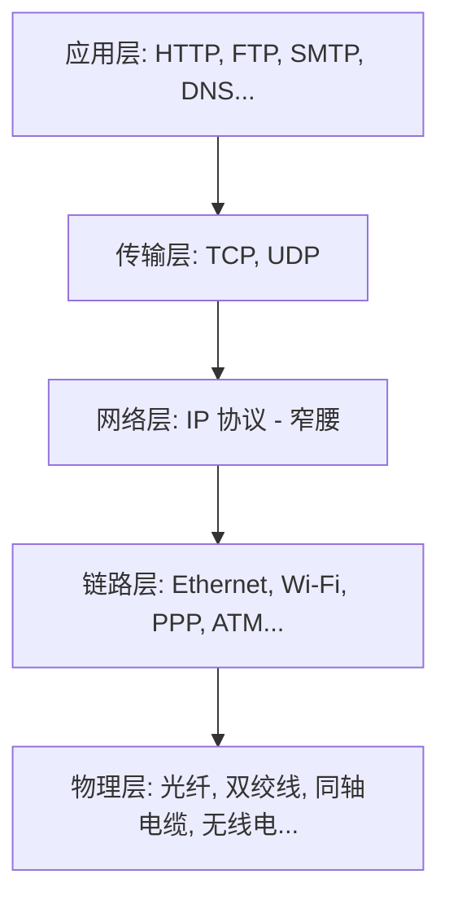

# 1.2.4.1 IP协议

## 1. IP 协议的核心定位与设计哲学

在现代计算机网络体系结构中，网际协议（Internet Protocol，简称 IP 协议）是网络层（网际层）的灵魂与基石。为了理解 IP 协议的设计初衷，必须首先探讨异构网络互连的根本矛盾，以及互联网设计先驱们是如何通过“沙漏模型”和“端到端原则”来构建这个全球性网络帝国的。

### 1.1 异构网络互连的根本矛盾与网际层诞生
在 20 世纪 70 年代互联网诞生之初，世界上面临着各种物理介质和链路层技术的无序竞争。以太网（Ethernet）使用基于载波监听多路访问/冲突检测（CSMA/CD）的共享介质技术；令牌环网（Token Ring）依靠物理环路和令牌控制访问；光纤分布式数据接口（FDDI）提供了早期的光纤环网解决方案；而广域网中则充斥着点对点协议（PPP）以及后来的 ATM（异步传输模式）和帧中继（Frame Relay）。

这些异构网络在底层设计上存在着难以调和的矛盾：
1. **寻址机制冲突**：以太网和令牌环网使用 48 位 MAC 地址，而 ATM 使用完全不同的交换虚电路标识，某些点对点链路甚至没有显式的物理层地址。
2. **帧格式与封装差异**：不同的链路层协议其报头字段、控制信息和校验和算法完全不兼容。
3. **物理传输特性不同**：不同物理介质的带宽、时延、编码方式、调制解调机制各不相同。
4. **最大传输单元（MTU）的分歧**：以太网帧的标准 MTU 是 1500 字节，FDDI 可以达到 4352 字节，而 ATM 的信元固定为 53 字节（包含 5 字节首部和 48 字节载荷）。

如果让应用层或者传输层直接去适配这些五花八门的底层硬件特性，将会导致网络协议栈的开发成本成倍增加，甚至从根本上扼杀全球互联的可能性。为了解决这一核心矛盾，网际层（网络层）应运而生。网际层通过引入统一的 IP 协议，构建了一个**统一的、逻辑的虚拟互联网络**。

IP 协议成功屏蔽了底层物理介质的千差万别。无论底层物理网络是光纤、铜线、同轴电缆还是无线电波，也无论底层链路层协议是以太网、Wi-Fi 还是 PPP，在 IP 协议看来，它们都只是用来传送 IP 数据包（IP Datagram）的承载通道。这种设计在学术界被称为**“沙漏模型”（Hourglass Model）**，也有人称其为“双锥形模型”。在这个模型中，底部是繁杂多样的物理和链路技术，顶部是百花齐放的应用层协议（如 HTTP、FTP、SMTP、DNS 等），而中间连接上下的最窄“腰部”就是统一的 IP 协议（Everything over IP, IP over Everything）。正是这一“窄腰”设计，使得底层技术的革新与高层应用的演进可以完全解耦，极大地降低了互联网技术迭代的摩擦成本。



### 1.2 无连接与尽力而为的设计哲学
在阿帕网（ARPANET）的设计初期，关于如何构建这个网络，通信界存在着两大阵营的激烈论战。一派是以传统电信运营商为代表的“面向连接”的虚电路（Virtual Circuit）服务路线；另一派则是以计算机网络先驱为代表的“无连接”的分组交换（Packet Switching）路线。

电信运营商习惯了电话交换网的运作方式。在电话网中，通信双方在通话前必须通过信令在网络中建立一条专用的物理通路（或逻辑通路，即虚电路）。在通话期间，该通路的带宽和路由器缓冲区资源被独占预留，且每个数据包无需携带完整的源/目的地址，只需携带简短的虚电路标识符。虚电路能够提供严格的顺序保证、无丢失和低延迟抖动，但其代价是显而易见的：
1. **庞大的路由器状态维护**：路由器必须在内存中维护每条虚电路的状态表。当网络规模扩展到数亿个连接时，路由器内存将因保存海量连接状态而崩溃。
2. **容灾能力极差**：一旦虚电路路径上的任何一台路由器因硬件故障、断电或外力损坏而离线，整条虚电路会立即中断，所有正在进行的通信都必须重新发起信令重建，这在军事国防和高可用网络中是无法接受的。

IP 协议最终选择了**无连接（Connectionless）与分组交换（Packet Switching）**的设计路线。在这一设计中：
1. **无连接特性**：发送端在发送数据包之前，不需要与目的端进行任何握手或信令协商。每个 IP 数据包都是一个完全独立的逻辑实体，包含了完整的源 IP 地址和目的 IP 地址。
2. **路由器无状态（Stateless）**：中间路由器不保存任何关于连接的上下文状态。它们只根据数据包中的目的 IP 地址，通过本地路由表进行独立的“下一跳”转发决策。这意味着同一条 TCP 连接中前后相邻的两个 IP 包，在通过网络时可能会由于路由表的动态收敛而选择完全不同的物理路径。
3. **尽力而为（Best-effort）服务**：IP 协议不对传输的可靠性做任何承诺。它不保证数据包是否一定能送达，不保证数据包按序到达，不进行流量控制和拥塞控制，也不保证数据包不被重复发送。当路由器的输出队列因流量暴增而溢出时，路由器会毫不犹豫地丢弃超出处理能力的数据包。

这种设计将网络的复杂性降到了最低，使中间路由器变得极其轻量和高效。由于不需要维护复杂的连接状态机，路由器可以集中全部硬件算力进行线速转发，极大地提高了网络的吞吐量和扩展性。

### 1.3 端到端原则与智愚平衡
IP 协议为什么要把可靠性从网络层剥离，交给传输层（如 TCP）或应用层去处理？这体现了计算机分布式系统设计中最经典的**“端到端原则”（End-to-End Principle）**。

1981 年，Jerome H. Saltzer、David P. Reed 和 David D. Clark 在其发表的里程碑式论文中阐述了端到端论点：
> 在一个分布式系统中，如果某种功能（例如可靠性保障、文件校验、端到端加密）最终只能由通信两端的应用层或传输层才能完整且正确地实现，那么在网络内部的中间节点去重复实现该功能不仅是多余的，而且会带来巨大的系统开销和不必要的复杂性。

例如，即使网际层实现了完美的、无丢失的包重传机制，应用层在接收文件时依然必须对最终落地的数据进行校验。因为数据有可能在发送端主机网卡的缓冲区中发生比特翻转，或者在中间路由器的内存（RAM）中发生单点损坏，甚至在接收端的内存中被篡改。网络层就算保证了线路上“无丢包”，也无法保证两端应用层数据的一致性。因此，最稳妥、最彻底的可靠性校验必须在端点（End-to-End）完成。

基于这一原则，互联网确立了**“智能在边缘，愚钝在核心”（Smart Edge, Dumb Core）**的伟大架构。网络的核心（路由器、交换机）只负责快速地、机械地搬运数据包，保持其极致的简单性与高吞吐；而诸如数据重传、拥塞控制、流量控制、加密解密和会话管理等一切复杂的控制逻辑，都被推向了网络的边缘——即运行着各种操作系统和应用程序的终端设备。这一智愚平衡的决策极大地降低了网络基础设施的建设和运行成本，也使得互联网能够接纳各种各样的新型应用，而无需对网络底层的路由器做任何修改。

---

## 2. IPv4 报文格式精细解析

IPv4（Internet Protocol Version 4）报文格式的设计是计算机协议设计史上的杰作。它用最小的开销整合了路由、分片、寻址和安全等多维度的网络控制需求。一个标准的 IPv4 数据包由“首部”（Header）和“数据”（Payload）两部分组成。首部的固定长度为 20 字节，但通过引入可选字段，其最大长度可扩展至 60 字节。

下面我们将逐个字段剖析其设计意图与底层行为。

### 2.1 版本 (Version) - 4 bit
该字段占 4 个比特，用于标识 IP 协议的版本。对于 IPv4 而言，其值固定为二进制的 `0100`（即十进制的 4）。接收端硬件网络芯片在读取 IP 数据包的第一个字节时，会首先通过这 4 bit 来分流处理管线。

### 2.2 首部长度 (IHL, Internet Header Length) - 4 bit
因为 IPv4 首部允许携带可变长度的“可选字段”（Options），因此首部本身的边界是不固定的。IHL 用于指示 IP 首部所占用的 32 位字（Double Word，即 4 字节）的个数。
- **计算关系**：首部的实际字节长度 = IHL 字段的值 × 4。
- **限制与最大值**：由于 4 bit 能够表示的最大无符号整数是 15（二进制 `1111`），因此 IPv4 首部的最大可能长度为 15 × 4 字节 = 60 字节。
- 对于不包含任何可选字段的常规数据包，首部长度固定为 20 字节，因此 IHL 的值通常为 5（二进制 `0101`）。如果接收到的 IP 包中 IHL 的值小于 5，说明首部受损，该包将被直接丢弃。

### 2.3 服务类型 (TOS / DS Field) - 8 bit
这个 8 bit 字段的演进折射出互联网从“均等转发”向“区分服务（DiffServ）”演进的历程。

#### 2.3.1 历史定义的 TOS 模式（RFC 791）
早期设计中，前 3 bit 代表 IP 优先级（IP Precedence），用于区分数据包的紧急程度（从 000 的常规划分到 111 的网络控制）。接下来的 3 bit 分别代表延迟要求（D - Delay）、吞吐量要求（T - Throughput）和可靠性要求（R - Reliability），最后 2 bit 保留。由于缺乏全局路由器调度策略的配合，这一模式在早期公网中基本未被采用。

#### 2.3.2 区分服务模型（DiffServ，RFC 2474）与 ECN（RFC 3168）
现代协议栈将这 8 bit 重新划分为两个部分：前 6 bit 称为 **DSCP（Differentiated Services Codepoint，区分服务编码点）**，后 2 bit 称为 **ECN（Explicit Congestion Notification，显式拥塞通知）**。

```
 0   1   2   3   4   5   6   7
+---+---+---+---+---+---+---+---+
|         DSCP          |  ECN  |
+---+---+---+---+---+---+---+---+
```

- **DSCP (6 bit)**：允许网络管理员为不同业务流定义不同的 PHB（Per-Hop Behavior，每跳行为）。路由器通过配置的队列调度算法（如 PQ、WFQ、CBWFQ），将不同 DSCP 值的数据包放入不同的硬件调度队列中。
  - **加速转发（EF, Expedited Forwarding, 值为 46）**：提供低延迟、低抖动、低丢包率的保证，常用于 VoIP、实时视频等交互式多媒体流量。
  - **确保转发（AF, Assured Forwarding, 包含 12 个标准值）**：定义了 4 个服务等级，每个等级有 3 个丢弃优先级。
  - **默认类（CS0 / Best-effort）**：常规的互联网流量。
- **ECN (2 bit)**：用于在路由器发生拥塞时，主动向端点通告，而不是直接丢包。其编码定义如下：
  - `00`：不支持 ECN 传输。
  - `01` / `10`：发送端支持 ECN（称为 ECT(1) 和 ECT(0)）。
  - `11`：发生了拥塞（Congestion Experienced，简称 CE）。
  - **工作流程**：当一个标记了 `01` 或 `10` 的数据包通过某台路由器时，如果路由器的输出队列长度达到了触发拥塞避免算法（如 RED/WRED）的阈值，路由器不会丢弃该包，而是使用硬件改写其 ECN 比特为 `11`（CE）。当该包到达接收端时，接收端的四层 TCP 协议栈会检测到此标记，并在发送回执 ACK 时，在 TCP 首部设置 ECN-Echo（ECE）标志。发送端收到 ECE 回执后，会像发生丢包一样主动减小其拥塞窗口（cwnd），平滑地降低发送速率，从而避免了网络发生物理丢包。

### 2.4 总长度 (Total Length) - 16 bit
指整个 IP 数据包（首部 + 数据载荷）的总长度，以字节为单位。
- 因为该字段为 16 位，所以 IPv4 数据包的理论最大长度为 2^16 - 1 = 65535 字节。
- 在发送端，IP 层的总长度等于传输层交下来的载荷长度加上 IP 首部长度。而在接收端，网卡驱动根据总长度字段来精确划定 IP 数据包的内存边界，从而剥离链路层填充的尾部字节。

### 2.5 标识 (Identification) - 16 bit
这是一个由源主机 IP 协议栈维护的递增计数器。每个发送出去的 IP 数据包都会被分配一个唯一的 Identification 值。
- **分片关联**：如果一个 IP 数据包因为体积超过链路 MTU 而被中间路由器拆分为多个分片，每一个分片在封装为独立的 IP 报文时，其首部的 `Identification` 字段都必须**完全复制**原始数据包中的该字段值。
- 终点主机在组装分片时，就是依靠 `源 IP`、`目的 IP`、`协议号` 和 `Identification` 这四元组来确定哪些零散的分片属于同一个原始包。

### 2.6 标志 (Flags) - 3 bit
用于控制和标识 IP 数据包的分片属性：
- **Bit 0**：保留位，必须置为 0。
- **Bit 1 - DF (Don't Fragment)**：不分片标志。如果 DF = 1，代表在传输路径上任何路由器都绝对不允许对该数据包进行分片。如果该包长度大于下一跳链路的 MTU，且 DF = 1，路由器会丢弃该包并返回 ICMP 差错报文。
- **Bit 2 - MF (More Fragments)**：更多分片标志。如果 MF = 1，说明该数据包是一个分片，且后面还有后续的分片；如果 MF = 0，说明它是最后一个分片，或者该报文根本没有被分片。

### 2.7 片偏移 (Fragment Offset) - 13 bit
该字段指示了当前分片的数据载荷，在原始 IP 数据载荷中的相对起始位置。
- **8字节基本单位设计**：由于片偏移字段只有 13 位，最大只能表示数值 2^13 - 1 = 8191。如果直接以字节为单位，它最大只能表示 8191 字节的偏移，无法覆盖最大 65535 字节的报文范围。为了克服这一限制，协议规定：**片偏移的数值是以 8 字节为基本单位（8-byte blocks）的**。
- 这意味着，所有分片的数据载荷长度（除最后一个分片外）必须是 8 字节的整数倍。如果片偏移的值为 200，说明当前分片的数据载荷是从原始载荷的第 1600 字节（200 × 8）处开始的。

### 2.8 生存时间 TTL (Time To Live) - 8 bit
尽管命名为“生存时间”，但在实际协议实现中，它衡量的是**最大允许转发跳数（Hop Count）**。
- **防环机制的数学原理**：由于动态路由收敛的延迟或者网络管理员的人为配置失误，网络拓扑中极易产生路由环路。如果在没有 TTL 限制的环路中，一个 IP 数据包会被路由器 A 转发到 B，B 转发到 C，C 又转发回 A。这个过程会无限循环下去。这不仅会导致该数据包永远无法送达，而且伴随不断涌入的新数据包，环路会迅速占满整条链路的带宽，使路由器接口队列溢出，造成全网崩溃。
- **跳数递减行为**：源主机在发送 IP 报文时会赋予其一个初始的 TTL 值（现代操作系统默认值通常为 64、128 或 255）。数据包每经过一台路由器进行三层转发，该路由器在将包送出输出接口之前，必须先将首部中的 TTL 值减 1。一旦发现减 1 后的 TTL 变为 0，路由器将立即丢弃该数据包，不再进行转发，并向源主机发送一个 **ICMP Time Exceeded (Type 11, Code 0 - Time to Live exceeded in transit)** 的差错控制报文。

### 2.9 协议 (Protocol) - 8 bit
该字段指出当前 IP 载荷中封装的是哪个上层协议的数据，扮演了多路分用的指示牌。当目的主机剥离 IP 首部后，它需要根据这个字段决定将载荷递交给哪个传输层或应用层模块。
常见协议号如下：
- `1`：ICMP (网际控制报文协议)
- `2`：IGMP (网际组管理协议)
- `6`：TCP (传输控制协议)
- `17`：UDP (用户数据报协议)
- `89`：OSPF (开放式最短路径优先协议)

### 2.10 首部校验和 (Header Checksum) - 16 bit
该字段仅对 IP 首部进行完整性校验，不包含后面的数据载荷。
- **计算算法**：发送端将 IP 首部中所有的 16 位字（以 2 字节为单位）设为 16 位的二进制数，并按反码加法（Ones' Complement Sum）求和。当发生进位时，将溢出的高位循环加到最低位上，最后将求得的和取反码，写入校验和字段。接收端收到包后，以相同算法对首部（含校验和本身）求和，若结果全为 1（二进制反码下的 0），则说明首部无损坏；否则说明数据包受损，予以丢弃。
- **为何仅校验首部？** 
  网络层采用这一设计的底层考量在于**线速转发性能的压倒性优先级**。路由器每转发一个数据包，都必须修改首部中的 TTL 字段（减 1），并且在 NAT 环境下还要修改源/目的 IP 和端口。这意味着路由器在每一跳都必须重新计算校验和。如果校验和覆盖了整个数据载荷（可达数千字节），路由器硬件就必须读取并计算整包数据，这对于吞吐量极大的主干网路由器而言是灾难性的延迟开销。由于四层传输层（TCP/UDP）已经提供了端到端的数据完整性校验，网络层只需确保首部（寻址和路由控制字段）在传输中没有损坏即可。

> [!NOTE]
> **校验和的增量更新（RFC 1624）**
> 实际上，现代路由器在递减 TTL 后，并不需要重新对整个 20 字节首部重新运行校验和算法。根据代数特性，它们采用增量计算算法：
> $$\text{Checksum}_{\text{new}} = \text{Checksum}_{\text{old}} + \Delta\text{TTL}$$
> 这只需一次简单的算术运算即可完成，极大地减少了硬件处理延迟。

### 2.11 源 IP 地址与目的 IP 地址 - 各 32 bit
分别占 4 字节，用于标识全球范围内的源主机接口和目的主机接口，是路由查表寻址的直接依据。

### 2.12 可选字段 (Options) 与填充 (Padding)
IPv4 可选字段被设计用来提供一些特殊服务，例如源路由（指定数据包经过特定路由器）、记录路由、时间戳等。
- **填充（Padding）**：因为 IHL 字段以 4 字节为单位，所以 IP 首部必须是 4 字节的整数倍。如果可选字段的实际字节数不符合 32 位对齐，必须在尾部使用 0（Padding）进行填充对齐。
- **工业界现状与设计弃用**：现代网络中，**几乎所有的公网路由器和防火墙都会直接过滤或丢弃携带可选字段的 IP 报文**。这是因为，现代路由器的物理转发层（Data Plane）通常由专用的 ASIC 芯片构建，硬件电路只能高效处理 20 字节固定长度的 IP 首部。一旦报文携带了可选字段，硬件芯片无法适配其变长结构，只能将报文从快速路径中提出，上送至路由器的 CPU（控制平面/慢速路径）进行软件解析。这会导致路由器转发延迟增加数十倍，且极易被黑客利用进行拒绝服务（DoS）攻击以耗尽路由器 CPU。可选字段的设计失误，为 IPv6 首部设计提供了前车之鉴。

---

## 3. IP 分片与重组机制

物理链路层的传输限制决定了 IP 数据包在传输路径上不可能无限大。当一个 IP 数据包的尺寸超出了链路的最大承载能力时，网际层必须启动分片与重组机制。

### 3.1 最大传输单元 MTU 与最大分段大小 MSS 的关系
物理链路层协议所能承载的最大帧长度，被称为 **最大传输单元（MTU, Maximum Transmission Unit）**。
在 TCP/IP 体系中，为了从源端就避免 IP 分片的发生，传输层引入了 **最大分段大小（MSS, Maximum Segment Size）**。MSS 是指 TCP 数据段中的纯数据载荷的最大限制，不包括 TCP 首部和 IP 首部。

在典型的以太网（MTU = 1500 字节）环境中：
$$\text{MSS} = \text{MTU} (1500) - \text{IP首部长度} (20) - \text{TCP首部长度} (20) = 1460 \text{ 字节}$$
TCP 在建立连接（三次握手）时，双方会在 SYN 报文中声明各自接口的 MSS。最终的通信中，双方会取两者 MSS 的最小值作为数据段的最大限制，以尽可能避免在 IP 层发生分片。

### 3.2 分片底层细节与偏移量计算
当 IP 数据包长度大于输出接口 MTU 且 DF 标志位为 0 时，分片机制启动。

假设源主机发送一个**总长度为 3200 字节**的 IPv4 数据包（含 20 字节 IP 首部，3180 字节载荷），在经过某台路由器时，需要转发到一条 **MTU 限制为 1000 字节**的链路上。

1. **分片上限计算**：每个分片也必须包含一个 20 字节的 IP 首部，因此每个分片最大能够承载的载荷长度为 $1000 - 20 = 980$ 字节。
2. **8字节对齐调整**：因为片偏移以 8 字节为单位，所以每个分片的载荷长度必须是 8 的整数倍。我们对 980 进行整除校验：
   $$980 \div 8 = 122.5$$
   无法整除。因此，我们必须向下取最接近的 8 的倍数，即：
   $$122 \times 8 = 976 \text{ 字节}$$
   因此，除最后一个分片外，第一、二个分片的最大实际载荷长度只能为 976 字节。
3. **分片切割计算**：
   - **第一分片 (Fragment 1)**：
     - 数据载荷：原始数据的前 976 字节（字节区间：$0 \sim 975$）。
     - 总长度 (Total Length)：$976 + 20 = 996$ 字节。
     - MF 标志：`1`（后面还有分片）。
     - 片偏移 (Fragment Offset)：$0 \div 8 = 0$。
   - **第二分片 (Fragment 2)**：
     - 数据载荷：原始数据的第二批 976 字节（字节区间：$976 \sim 1951$）。
     - 总长度 (Total Length)：$976 + 20 = 996$ 字节。
     - MF 标志：`1`。
     - 片偏移 (Fragment Offset)：$976 \div 8 = 122$。
   - **第三分片 (Fragment 3)**：
     - 数据载荷：原始数据的第三批 976 字节（字节区间：$1952 \sim 2927$）。
     - 总长度 (Total Length)：$976 + 20 = 996$ 字节。
     - MF 标志：`1`。
     - 片偏移 (Fragment Offset)：$1952 \div 8 = 244$。
   - **第四分片 (Fragment 4)**：
     - 剩余数据载荷长度：$3180 - (976 \times 3) = 252$ 字节（字节区间：$2928 \sim 3179$）。
     - 总长度 (Total Length)：$252 + 20 = 272$ 字节。
     - MF 标志：`0`（最后一个分片）。
     - 片偏移 (Fragment Offset)：$2928 \div 8 = 366$。

### 3.3 接收端数据包重组逻辑与重组计时器管理
在 IP 协议的设计中，**中间路由器只负责在需要时进行分片，而绝对不负责分片重组**。

重组必须在终点主机进行，其理由在于：
1. **防止路由器过载**：重组需要分配大量的缓冲区来存储先到达的分片，直到所有分片集齐。这会极大地消耗路由器的内存资源。
2. **多路径不确定性**：在动态路由中，同一个原始 IP 数据包的各个分片可能会走不同的物理路径，中间路由器根本无法保证收齐所有的分片。

**终点主机重组的核心逻辑**：
1. **分片识别与定位**：当主机的网络层收到一个 `MF = 1` 或 `Fragment Offset > 0` 的 IP 数据包时，重组机制被唤醒。IP 层利用“源 IP、目的 IP、协议号、Identification”这个四元组作为 Key，去检索本地的重组缓冲区队列（Reassembly Buffer Queue）。如果该 Key 对应的队列不存在，则创建一个新的队列，并启动一个**重组计时器（Reassembly Timer）**（标准实现通常为 30 到 60 秒）。
2. **分片插入与排序**：接收端将接收到的分片按照其首部中的 `Fragment Offset` 值，填入队列中对应的字节区间。如果遇到重叠的片，接收端会根据偏移量重新剪裁覆盖，消除冗余。
3. **完整性校验**：每次成功插入新的分片后，重组算法会从偏移量为 0 的位置开始向后扫描，检查字节流是否连续，直到扫描到一个 `MF = 0` 的分片。如果所有字节全部填满，重组成功，剥离 IP 报头，将完整载荷交付给高层协议栈，并销毁该重组队列。
4. **超时与丢弃**：如果重组计时器超时，而分片依然没有集齐，主机必须**无条件丢弃**该队列中已收到的所有分片，并释放内存。随后，主机会向源端发送一个 ICMP Time Exceeded (Type 11, Code 1 - Fragment Reassembly Time Exceeded) 报文，以此通知发送端数据已丢失。

> [!CAUTION]
> **碎片重组带来的安全威胁：分片重叠与缓冲区溢出**
> 终点主机在处理片偏移时如果逻辑不够严谨，会引发严重的安全漏洞。
> - **Teardrop (泪滴) 攻击**：攻击者故意制造出片偏移相互交织且重叠区长度出现负数的分片，导致接收端操作系统在分配内存时出现边界计算错误，引发系统崩溃。
> - **分片逃避 IDS 检测**：许多入侵检测系统（IDS）无法进行深度重组，黑客将攻击特征拆分成多个微小的重叠分片进行发送，IDS 只对其进行单个分片审计，从而漏过攻击特征，而到达终端后却重组出了恶意的攻击代码。

### 3.4 路径 MTU 发现 (PMTUD) 原理与 ICMP 黑洞
为了彻底摆脱 IP 分片带来的网络性能损耗（一旦任一分片丢失，整个传输层包都要重传），路径 MTU 发现（PMTUD, Path MTU Discovery）成为现代协议栈的标准配置。

#### 3.4.1 PMTUD 动态探测过程
1. 发送端主机在发送 IP 数据包时，将其首部标志位中的 **DF (Don't Fragment) 置为 1**。
2. 当该数据包在路径中遇到某台路由器，且该路由器的下一跳链路 MTU 小于当前包长度时，由于 DF = 1，路由器丢弃该数据包，并向发送端返回一个 **ICMP Destination Unreachable**（Type 3, Code 4 - Fragmentation Needed and Don't Fragment Was Set）的错误报文。
3. 在符合 RFC 1191 规范的实现中，该 ICMP 报文会携带一个关键的 16 位字段：`Next-Hop MTU`，告知发送端该受限链路的具体 MTU 值。
4. 发送端收到该 ICMP 报文后，更新本地路由缓存表中的 Path MTU 记录。
5. 发送端使用新的、较小的 MTU 重新封装并重传数据。该过程不断重复，直到数据包能够顺利抵达终点，从而探测出整条通路上的最小 MTU。

#### 3.4.2 PMTUD 的灾难：ICMP 黑洞
在实际工程部署中，网络管理员为了防止 DDoS 探测，经常在防火墙或路由器上配置策略，**无脑丢弃所有的 ICMP 报文**。
这导致了一个经典的网络故障：**ICMP 黑洞**。
当发送端大包被路由器丢弃后，路由器返回的 ICMP Type 3 Code 4 报文被沿途的防火墙拦截，发送端无法获取这一反馈，便会无限次地重传原大小的数据包，且每次都因为超大而在中途被丢弃。这在应用层表现为：用户能正常 Ping 通服务器，能进行小报文握手，但一旦请求大网页或下载文件，连接便会陷入无休止的挂起（卡死）状态。

#### 3.4.3 工业界救赎：TCP MSS Clamping (MSS 钳制)
为了在 ICMP 报文被屏蔽的恶劣网络环境下保障通信，网络工程师发明了 **TCP MSS Clamping（MSS 钳制）** 技术，通常部署在企业边界路由器或拨号网关（如 PPPoE 网关）上。

- **实施原理**：路由器会持续监听通过其转发的 TCP 三次握手报文（SYN 报文）。
- **篡改逻辑**：当路由器检测到 SYN 报文中的 TCP MSS 选项值过大，而自己的外网输出接口 MTU 限制较低（如 PPPoE 接口 MTU 只有 1492 字节，对应最大 TCP MSS 为 1452 字节）时，路由器会**直接在硬件上改写该 SYN 报文中的 MSS 选项值**，将其强行降低为 1452 字节，并重新计算 TCP 校验和。
- **最终效果**：通信的两端主机在完成握手后，会自动采用这个被篡改后的、较小的 MSS 进行数据分段。数据包在源头打包时就已经适应了整条链路的最低 MTU，从而在不需要 IP 分片和 PMTUD 的情况下平滑通过了受限链路。

---

## 4. IPv6 革命性升级

随着全球数以百亿计的设备接入互联网，IPv4 的地址空间枯竭问题已不可逆转。尽管网络地址转换（NAT）技术在一定程度上缓解了地址荒，但也引入了端到端连接中断、协议穿透成本高昂等结构性问题。IPv6（RFC 8200）并非 IPv4 的微调版，而是一次面向未来数十年计算机网络发展需求的重大技术革命。

### 4.1 IPv6 核心设计目标
1. **无限的地址空间**：将地址长度从 32 位（4 字节）扩展到 128 位（16 字节），提供 2^128 个 IP 地址。
2. **极简的首部结构**：通过固定首部长度，减少中间路由器的解析和处理开销，提升硬件转发效率。
3. **原生的安全机制**：在设计之初就将 IPSec 安全机制作为协议的有机组成部分，而非像 IPv4 那样以补丁形式外挂。
4. **即插即用与自动配置**：引入无状态地址自动配置（SLAAC），免去对 DHCP 服务器的绝对依赖。
5. **内建的多播与任播支持**：废除了容易引发广播风暴的广播（Broadcast）概念，将其完全融入多播（Multicast）中，并引入任播（Anycast）。

### 4.2 IPv4 与 IPv6 首部精细化对比

IPv6 的核心设计思想是**“保持基本首部尽量简单，将复杂性推迟到扩展首部中”**。为此，IPv6 将基本首部的长度固定为 **40 字节**，字段数由 IPv4 的 12 个精简为 8 个。

```
 0                   1                   2                   3
 0 1 2 3 4 5 6 7 8 9 0 1 2 3 4 5 6 7 8 9 0 1 2 3 4 5 6 7 8 9 0 1
+-+-+-+-+-+-+-+-+-+-+-+-+-+-+-+-+-+-+-+-+-+-+-+-+-+-+-+-+-+-+-+-+
|Version| Traffic Class |           Flow Label                  |
+-+-+-+-+-+-+-+-+-+-+-+-+-+-+-+-+-+-+-+-+-+-+-+-+-+-+-+-+-+-+-+-+
|         Payload Length        |  Next Header  |   Hop Limit   |
+-+-+-+-+-+-+-+-+-+-+-+-+-+-+-+-+-+-+-+-+-+-+-+-+-+-+-+-+-+-+-+-+
|                                                               |
+                                                               +
|                                                               |
+                         Source Address                        +
|                           (128 bits)                          |
+                                                               +
|                                                               |
+-+-+-+-+-+-+-+-+-+-+-+-+-+-+-+-+-+-+-+-+-+-+-+-+-+-+-+-+-+-+-+-+
|                                                               |
+                                                               +
|                                                               |
+                      Destination Address                      +
|                           (128 bits)                          |
+                                                               +
|                                                               |
+-+-+-+-+-+-+-+-+-+-+-+-+-+-+-+-+-+-+-+-+-+-+-+-+-+-+-+-+-+-+-+-+
```

下面详细对比两个版本中字段的变化：

#### 4.2.1 继承并改进的字段
1. **Version (4 bit)**：保持不变，IPv6 中其值固定为 `0110`（十进制的 6）。
2. **Traffic Class (8 bit)**：对应 IPv4 的 TOS 字段，同样用于 DSCP 优先级划分和 ECN 拥塞通告。
3. **Payload Length (16 bit)**：对应 IPv4 的 Total Length。需要注意的是，IPv4 记录的是“首部+载荷”的长度，而 IPv6 记录的是**基本首部后面所有内容（包含扩展首部和上层载荷）的长度**。由于基本首部固定为 40 字节，这一简化让硬件在处理时能更直接地进行内存边界计算。
4. **Next Header (8 bit)**：对应 IPv4 的 Protocol 字段。它不仅可以指示四层协议类型（如 TCP=6，UDP=17），还用于指向紧邻基本首部后面的**第一个扩展首部**。
5. **Hop Limit (8 bit)**：对应 IPv4 的 TTL 字段。改用这一名称更能真实反映该字段在路由器间转发时的跳数限制行为。

#### 4.2.2 新增字段
- **Flow Label (20 bit - 流标签)**：这是 IPv6 的一项重要创新。一个“流”是指从特定的源主机发送到特定的目的主机的一组特定报文序列。通过为同一流的报文分配相同的 Flow Label，中间路由器可以根据这个 20 位的流标签进行极速的哈希和快速通道转发（如 ECMP 负载均衡），而无需解开 IP 报文去读取四层 TCP/UDP 首部中的源/目的端口号。这在提高转发速度的同时，也提升了网络数据加密时的处理性能。

#### 4.2.3 彻底废除的字段
- **首部长度 IHL**：废除。由于首部固定为 40 字节，无需再动态指示其大小。
- **网络层分片控制字段（Identification, Flags, Fragment Offset）**：基本首部中不再保留这些字段。因为 IPv6 规定中间路由器禁止分片。只有当源主机主动分片时，这些信息才会通过**分片扩展首部**体现。
- **首部校验和 Header Checksum**：**彻底废除**。
  - **设计动机**：移除校验和能为路由器减少巨大的硬件计算压力。由于二层链路（如以太网）和四层协议（TCP/UDP）都有非常完善的 CRC 校验，网络层不再重复计算。
  - **四层强化**：由于网络层校验被废除，IPv6 规定**四层传输层（如 UDP）的校验和必须强制启用**，不得置为 0，以此防范网络层寻址错误导致的数据错投。
- **可选字段 Options**：基本首部中不再支持 Options，全部移至扩展首部中处理。

### 4.3 IPv6 扩展首部 (Extension Headers) 的链式设计
在 IPv4 中，可选字段紧跟在目的 IP 之后，这导致 IP 首部是变长的，使得路由器的硬件流水线极难进行固定偏移量对齐。

IPv6 引入了**扩展首部（Extension Headers）链式机制**。所有可选功能模块都被设计为独立的扩展首部，依次链接在 IPv6 基本首部的后面。

#### 4.3.1 链式链接工作原理
每个扩展首部都以一个 `Next Header` 字段开头。基本首部的 `Next Header` 指向第一个扩展首部，第一个扩展首部的 `Next Header` 指向第二个扩展首部，直到最后一个扩展首部的 `Next Header` 指向传输层协议（如 TCP 或 UDP）。

```
+--------------------+----------------------+--------------------+------------------+
| IPv6 基本首部      | 逐跳选项扩展首部      | 分片扩展首部        | TCP 首部及载荷   |
|                    |                      |                    |                  |
| Next Header = 0    | Next Header = 44     | Next Header = 6    |                  |
| (Hop-by-Hop)       | (Fragment)           | (TCP)              |                  |
+--------------------+----------------------+--------------------+------------------+
```

#### 4.3.2 常见扩展首部类型及顺序
为了使路由器能以最高效率进行处理，RFC 8200 推荐了扩展首部在数据包中的链接顺序：
1. **Hop-by-Hop Options (逐跳选项, Next Header = 0)**：必须由路径上每一台路由器解析，常用于路由器警报（Router Alert）和巨型数据包（Jumbogram）指示。
2. **Destination Options (目的选项, Next Header = 60)**：仅由目的节点处理，如果伴随路由首部出现，此扩展首部可能在路径中被目的节点多次解析。
3. **Routing (路由选择, Next Header = 43)**：指定源路由路径。
4. **Fragment (分片首部, Next Header = 44)**：当源主机主动分片时使用，携带 Identification、Offset 和 MF。
5. **AH (认证首部, Next Header = 51) / ESP (封装安全载荷, Next Header = 50)**：用于 IPSec 的完整性验证和加密。
6. **Upper-Layer (上层载荷，如 TCP=6, UDP=17)**。

**转发效率优势**：
除了“逐跳选项首部”外，路径上的中间路由器在收到 IPv6 包时，**绝不解析任何其他扩展首部**。它们只需检查 40 字节的基本首部并读取其中的目的 IP，即可直接进行硬件转发。这一设计极大地解放了骨干路由器的硬件算力，避免了 IPv4 可选字段带来的“慢速路径”灾难。

### 4.4 IPv6 无状态地址自动配置 (SLAAC) 机制
无状态地址自动配置（SLAAC，Stateless Address Autoconfiguration，RFC 4862）是 IPv6 最核心的特性之一，实现了终端设备的“即插即用”，完全免去了人工配置和 DHCPv4 服务器状态维护的繁琐。

SLAAC 的配置过程主要依赖于邻居发现协议（NDP, Neighbor Discovery Protocol）中的邻居请求（NS）、邻居广告（NA）、路由器请求（RS）和路由器广告（RA）这四种报文。

#### 4.4.1 详细工作步骤解析

##### 步骤 1：自动生成链路本地地址 (Link-Local Address)
当主机接口激活时，它会基于 `fe80::/64` 前缀，自动生成一个只在本地局域网内有效的链路本地地址。
- **接口标识符（Interface ID）的生成**：
  - **基于 EUI-64 规范**：使用网卡的 48 位物理 MAC 地址（例如 `00:11:22:33:44:55`）。在中间插入 `ff:fe` 构成 64 位，即 `0011:22ff:fe33:4455`。接着，将第 1 字节的第 7 位（U/L，全球/本地管理位）取反，从二进制 `00000000` 变成 `00000010`（即十六进制的 `02`）。最终合成的 EUI-64 接口标识符为 `0211:22ff:fe33:4455`。合成的链路本地地址为 `fe80::211:22ff:fe33:4455`。
  - **基于 RFC 7217 的随机哈希机制**：由于 EUI-64 固定暴露物理 MAC 地址，存在严重的隐私安全隐患（黑客可通过该固定 ID 跟踪终端物理位置）。现代系统普遍默认采用随机隐私地址扩展，通过哈希算法随机生成一个对外的接口标识符，定期更换，隐藏真实 MAC 地址。

##### 步骤 2：重复地址检测 (DAD, Duplicate Address Detection)
在激活任何 IPv6 地址前，主机必须确保该地址在局域网内是唯一的。
- **报文发送**：主机发送一个**邻居请求报文 (NS)**。该报文的源 IP 为未指定地址 `::`，目的 IP 为基于待检测地址生成的“被请求节点多播地址”（Solicited-Node Multicast Address，例如 `ff02::1:ff33:4455`）。
- **冲突处理**：如果局域网内有另一台主机已经占用了该地址，它在收到该 NS 后会回复一个**邻居广告报文 (NA)**。发送端收到 NA 后，判定地址冲突，接口禁用该地址并报错。如果 1 秒内无 NA 响应，说明地址唯一，正式激活该链路本地地址。

##### 步骤 3：发送路由器请求 (RS) 报文
为了获取访问局域网外部（互联网）的全局单播地址（GUA），主机激活链路本地地址后，会向链路上的所有路由器多播发送一个**路由器请求 (RS, Router Solicitation)** 报文，其目的 IP 地址为 `ff02::2`（所有路由器的链路本地多播地址）。

##### 步骤 4：接收路由器广告 (RA) 报文
链路上的路由器收到 RS 后（或者定时主动发送），会广播回复一个**路由器广告 (RA, Router Advertisement)** 报文，其目的 IP 为 `ff02::1`（所有节点的链路本地多播地址）。
RA 报文中包含以下关键控制信息：
- **全局网络前缀（Prefix）**：例如 `2001:db8:abc:1::/64`。
- **前缀生存期**：该前缀的合法使用期限。
- **默认网关地址**：发送此 RA 报文的路由器的链路本地地址（作为主机的默认路由下一跳）。
- **配置标志位 (M / O 位)**：
  - **M 位（Managed Address Configuration）**：指示终端是否需要通过有状态 DHCPv6 来申请 IP 地址。
  - **O 位（Other Configuration）**：指示终端是否需要通过无状态 DHCPv6 来获取 DNS 服务器等非地址配置信息。

##### 步骤 5：全局单播地址合成与二次 DAD
当主机接收到允许 SLAAC 配置的 RA 报文后，提取其中的 64 位前缀，并将其与自身的 64 位接口标识符（EUI-64 或 RFC 7217 随机地址）拼接，合成全球唯一的全局单播地址（例如 `2001:db8:abc:1:0211:22ff:fe33:4455`）。
主机针对该全局单播地址再次进行一次 DAD 检测，若无冲突，全局单播地址正式激活，主机便可与外网进行双向端到端通信。

---

## 5. 常见设计误区与深度思考

在围绕 IP 协议的日常开发与大型分布式系统设计中，经常会遇到一些具有迷惑性的技术误区和边缘极端案例。

### 5.1 误区：IP 分片仅在网络层进行，故对传输层性能无影响
这一心智模型的最大错误在于忽略了**重传效应**。
- **协议层隔离**：从逻辑上看，IP 分片和重组完全由网络层接管，上层 TCP/UDP 对此确实是无感的。
- **级联灾难**：然而，TCP 的重传单位是“段”（Segment），而不是 IP 层分片后的“片”。一旦某个 1460 字节的 TCP 段在 IP 层被分成了 2 个分片，如果在传输中仅丢失了第 2 个分片，接收端主机的 IP 层在超时后会丢弃整个重组队列（包含第 1 个分片）。此时对于 TCP 而言，表现为这 1460 字节的段整体丢失。TCP 只能发起重传，这导致源端的 IP 层必须把之前的 2 个分片全部重新发送一遍。这种级联放大效应会严重浪费链路带宽，并导致严重的网络吞吐抖动。这也是现代应用几乎全部开启 PMTUD 并将 MSS 钳制在安全线内的原因。

### 5.2 GTSM（通用 TTL 安全机制）与骨干网防护
在网络层安全策略中，有一个非常巧妙的利用 TTL 特性的边缘设计——**GTSM (Generalized TTL Security Mechanism, RFC 5082)**。
- **背景**：在骨干网中，核心路由器（如 BGP 邻居）之间往往是通过物理链路直接相连的。然而，黑客常常从互联网的任意位置伪造 BGP 报文发送给这些核心路由器，企图实施 BGP 会话劫持或引发 CPU 过载。
- **GTSM 设计**：
  BGP 邻居双方在发送 IP 报文时，约定将其 **TTL 初始值设为最大值 255**。
  当接收方路由器收到 BGP 报文时，它会检查 TTL 的数值。由于邻居双方是物理直连的，报文经过这一跳后，TTL 只会减 1 变成 254。因此，接收方只要验证接收到的报文 `TTL >= 254` 即可。如果黑客从 10 跳外的公网发起伪造攻击，无论他在发送时将 TTL 设为多大，报文到达核心路由器时 TTL 必然会递减至 245 甚至更低。路由器发现 `TTL < 254` 后，会在硬件转发面直接将该报文静默丢弃，根本不会将其送往控制面的 CPU 处理，从而完美抵御了伪造路由协议报文的 CPU 耗尽攻击。

---

## 6. IPv4 与 IPv6 综合演进对比总结

为了更系统地理解网际协议两个版本的差异，我们将上述所有机制和设计归纳为以下对比架构表：

| 特性维度 | IPv4 协议 | IPv6 协议 |
| :--- | :--- | :--- |
| **地址空间** | 32 bit（约 43 亿个地址），早已枯竭。 | 128 bit（约 $3.4 \times 10^{38}$ 个地址），近乎无限。 |
| **首部长度** | 变长设计（20 ~ 60 字节），含有可变 Options，处理低效。 | 固定长度（40 字节），不含 Options，处理极快。 |
| **首部字段数** | 12 个字段。 | 8 个字段（极简硬件设计）。 |
| **网络层分片** | 支持。中间路由器和源主机均可分片。 | 不支持。**中间路由器严禁分片**，必须使用 PMTUD 或由源主机配合分片首部进行分片。 |
| **网络层校验和** | 支持（Header Checksum），每跳路由器都需要重新计算并修改。 | **彻底废除**。依靠二层 CRC 和四层 TCP/UDP 强制校验保障完整性。 |
| **地址配置** | 静态配置，或使用有状态的 DHCPv4 服务。 | 静态配置，或使用有状态 DHCPv6，或使用无状态地址自动配置（SLAAC）。 |
| **防环机制** | 依靠生存时间（TTL - Time To Live）字段限制跳数。 | 依靠跳数限制（Hop Limit）字段限制跳数。 |
| **多业务保障** | TOS 字段（DSCP + ECN），早期未被广泛部署。 | Traffic Class（DSCP + ECN）+ 新增 **Flow Label（流标签）**，原生支持流量细粒度调度。 |
| **安全性** | 依靠 IPSec 扩展实现（可选）。 | 原生内建支持 IPSec 选项（强制实现）。 |
| **报头扩展** | 使用变长的 Options，导致硬件转发效率低。 | 采用**扩展首部（Extension Headers）的链式结构**，只有目的节点需要解析。 |

---
*延伸阅读参考标准*：
- *RFC 791: Internet Protocol (IPv4 Specification)*
- *RFC 8200: Internet Protocol, Version 6 (IPv6) Specification*
- *RFC 1191: Path MTU Discovery*
- *RFC 4862: IPv6 Stateless Address Autoconfiguration (SLAAC)*
- *RFC 3168: The Addition of Explicit Congestion Notification (ECN) to IP*
