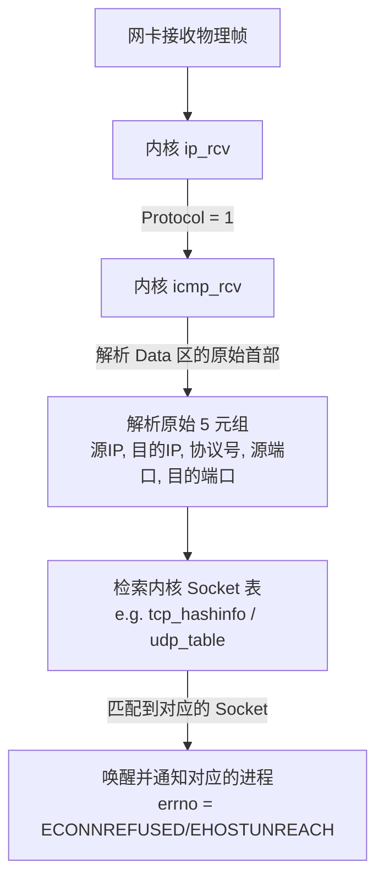

# 1.2.4.2 ICMP协议 (网际控制报文协议)

在计算机网络体系结构中，网络层（Network Layer）的核心任务是实现端到端的数据报（Datagram）寻址与路由转发。作为网络层最具代表性的基础协议，网际协议（IP，Internet Protocol）被设计为一种**无连接的、不可靠的、尽力而为（Best-effort）**的传输协议。这意味着 IP 数据报在传输过程中，可能会因为路径环路、拥塞过载、链路中断、TTL 耗尽或目标不可达等各种原因被静默丢弃，而 IP 协议自身并不提供任何机制来检测、报告或纠正这些差错。

为了在网络层建立起一种轻量级的控制与诊断反馈机制，**网际控制报文协议（ICMP，Internet Control Message Protocol）**应运而生。本文将从设计初衷、封装机制、报文结构、差错控制逻辑、经典诊断工具实现原理、现代安全博弈以及向 ICMPv6 的演进等维度，深入剖析 ICMP 协议的底层运行机制。

---

## 1. ICMP 的设计初衷与网络层定位

### 1.1 IP 协议的局限性与控制面的空白
网际协议（IP）的设计哲学遵循了因特网经典的“端到端原则”（End-to-End Principle），即将复杂的可靠性控制、流控与拥塞控制交由网络边缘的端系统（传输层如 TCP）处理，而网络内核的路由器则专注于高效的无连接分组转发。这种设计极大地提升了网络的核心转发效率与可扩展性，但也带来了控制层面（Control Plane）的空白：
1. **差错报告机制缺失**：当一个 IP 数据报在中间路由器因为某种原因（例如找不到路由条目）被丢弃时，源主机无法收到任何关于该分组丢失的具体原因反馈。源主机只能被动等待传输层超时，这会导致上层协议无法对网络发生的动态变化做出即时的策略调整。
2. **网络诊断工具匮乏**：网络管理员和主机需要一种手段来主动测试路径的可达性、评估物理链路的时延与抖动，以及探测数据报经过的每一跳（Hop）网关。如果缺乏网络层的诊断协议，这些需求将无法在通用的 IP 网络上实现。

### 1.2 为什么需要 ICMP 协议
ICMP 协议的引入，正是为了填补 IP 协议在控制与差错反馈层面的空白。它的主要职责包括：
- **报告差错**：当数据报在网络中被丢弃或损坏时，触发该差错的路由器或目的主机会向源主机发送 ICMP 差错报告报文，详细说明差错发生的原因。
- **传递控制信息**：告知主机关于网络的拓扑结构改变（如路由重定向）或源端行为建议（如源点抑制，尽管目前已废弃）。
- **网络诊断**：提供一套“请求-响应”的交互机制，允许主机或网络管理设备主动查询网络状态，例如测试两台主机之间的连通性（Echo 请求与回答）。

> [!IMPORTANT]
> ICMP 协议并不是为了使 IP 协议变得可靠而设计的。ICMP 本身并不提供重传机制，它自身也封装在 IP 数据报中进行传输，因此 ICMP 报文本身同样可能会丢失或损坏。ICMP 的定位是**“诊断与反馈”**，而非“纠错与保证”。

### 1.3 ICMP 的网络层定位与封装机制
在 TCP/IP 协议栈中，ICMP 属于网络层协议。然而，与 IP 协议直接封装在数据链路层帧（如以太网帧）中不同，ICMP 报文的封装结构表现出明显的“寄生”特征：它必须作为 **IP 数据报的数据载荷（Payload）** 进行封装。

其封装关系如图 1-1 所示：

```mermaid
flowchart LR
    subgraph 以太网帧 (Ethernet Frame)
        direction LR
        ETH_HDR["以太网首部<br/>14 字节"] --> IP_HDR["IP 首部<br/>20 字节<br/>Protocol = 1"]
        IP_HDR --> ICMP_MSG["ICMP 报文"]
        subgraph ICMP 报文 (ICMP Message)
            direction LR
            ICMP_HDR["ICMP 首部<br/>8 字节"] --> ICMP_DATA["ICMP 数据载荷"]
        end
        ICMP_MSG --> ETH_FCS["以太网尾部 FCS<br/>4 字节"]
    end
```
<center>图 1-1 ICMP 报文在以太网帧中的封装结构</center>

当 IP 首部的 8 位协议（Protocol）字段值为 `1` 时，表明该 IP 数据报的数据载荷为 ICMP 报文。这种封装设计反映了计算机网络协议分层设计中的一个折中策略：
- **为什么不直接作为链路层帧的数据？** 如果将 ICMP 设计为直接运行在数据链路层之上（类似 ARP），那么 ICMP 的作用范围将被限制在同一个局域网（Lan）或广播域内，无法跨越路由器进行多跳传输。
- **为什么不设计在传输层？** 虽然 ICMP 的封装方式类似于传输层协议（如 TCP、UDP），但它的控制和诊断职能完全是为网络层服务的，它不包含传输层的端口（Port）概念，也不负责应用进程之间的端到端数据传输。因此，它在逻辑上依然被划分为网络层协议。

### 1.4 ICMP 报文与传输层报文的区别
为了更清晰地理解 ICMP 的定位，我们将其与传输层协议进行多维度对比：

| 特性 | ICMP (网络层控制协议) | TCP / UDP (传输层协议) |
| :--- | :--- | :--- |
| **层级定位** | 网络层 (Layer 3) | 传输层 (Layer 4) |
| **封装方式** | 封装于 IP 数据报中 (Protocol = 1) | 封装于 IP 数据报中 (TCP=6, UDP=17) |
| **寻址标志** | 无端口概念，依赖 IP 地址与报文类型 | 依赖端口号 (Port) 标识具体的应用进程 |
| **通信机制** | 通常由系统内核直接生成与解析 | 由应用层进程通过套接字进行读写 |
| **核心目的** | 反馈网络层差错与辅助网络诊断 | 实现端到端进程间的可靠或不可靠数据传输 |
| **处理实体** | 路由器转发引擎及主机内核的 ICMP 模块 | 仅在通信端系统（主机）的传输层协议栈处理 |

---

## 2. ICMP 报文格式与分类体系

ICMP 报文在设计上具有高度的一致性，所有类型的 ICMP 报文都共享一个通用的前 4 字节首部，而后续的 4 字节则根据报文类型的不同而具有不同的定义。

### 2.1 通用报文首部格式
ICMP 报文的通用头部共占 8 个字节，其二进制结构如图 2-1 所示：

```
 0                   1                   2                   3
 0 1 2 3 4 5 6 7 8 9 0 1 2 3 4 5 6 7 8 9 0 1 2 3 4 5 6 7 8 9 0 1
+-+-+-+-+-+-+-+-+-+-+-+-+-+-+-+-+-+-+-+-+-+-+-+-+-+-+-+-+-+-+-+-+
|     Type      |     Code      |           Checksum            |
+-+-+-+-+-+-+-+-+-+-+-+-+-+-+-+-+-+-+-+-+-+-+-+-+-+-+-+-+-+-+-+-+
|                 Rest of Header (依赖于报文类型的字段)          |
+-+-+-+-+-+-+-+-+-+-+-+-+-+-+-+-+-+-+-+-+-+-+-+-+-+-+-+-+-+-+-+-+
|                                                               |
~                        ICMP Data (数据载荷)                    ~
|                                                               |
+-+-+-+-+-+-+-+-+-+-+-+-+-+-+-+-+-+-+-+-+-+-+-+-+-+-+-+-+-+-+-+-+
```
<center>图 2-1 ICMP 通用报文首部与布局</center>

1. **类型（Type，8 位）**：标识该 ICMP 报文的大类职能。例如，Type = 3 代表“终点不可达”，Type = 8 代表“回送请求”。
2. **代码（Code，8 位）**：在特定“Type”大类下，用于进一步细化具体的差错原因或子类型。例如，在 Type = 3 下，Code = 3 代表“端口不可达”，Code = 4 代表“需要分片但设置了 DF 比特”。
3. **校验和（Checksum，16 位）**：用于校验整个 ICMP 报文（包括 ICMP 首部以及后面的 ICMP 数据载荷）。计算算法与 IP 首部校验和一致，采用标准的网际校验和（Internet Checksum）算法：
   - 在计算校验和之前，先将 ICMP 报文的 Checksum 字段置为 0。
   - 对整个 ICMP 报文按 16 位（2 字节）进行累加。如果报文长度为奇数字节，则在末尾补一个零字节进行计算。
   - 累加过程中，高 16 位产生的溢出进位需要循环加回到低 16 位（即二进制反码求和）。
   - 最后，将累加结果按位取反，写入 Checksum 字段。
4. **依赖于报文类型的字段（Rest of Header，32 位）**：根据 Type 和 Code 的不同，这 4 个字节有着完全不同的字段划分与语义定义：
   - 在 **Echo 请求/回答** 报文中，这 4 字节被均分为 16 位的**标识符（Identifier）**和 16 位的**序号（Sequence Number）**。
   - 在 **重定向（Redirect）** 报文中，这 4 字节代表**路由器的 IP 地址（Gateway Internet Address）**。
   - 在 **参数问题（Parameter Problem）** 报文中，这 4 字节的第一字节用作**指针（Pointer）**，指出原始 IP 数据报中发生错误的具体字节偏移量，其余 3 字节保留为零。
   - 在大多数其他差错报告报文中，这 4 字节为保留字段，必须全部置为 0。

---

### 2.2 差错报告报文 (Error Reporting Messages) 详解
差错报告报文主要由中间路由器或目的主机在遇到传输故障时生成，并发送回原始 IP 数据报的**源 IP 地址**。以下是五种核心的差错报告报文：

#### 2.2.1 终点不可达 (Destination Unreachable，Type 3)
当路由器无法为数据报找到下一跳转发路由，或者目的主机无法将数据报交付给上层的传输层协议时，将产生终点不可达报文。其 Code 字段共有 16 种定义（如表 2-1 所示），详细划分了不可达的根源：

| Code 值 | 英文名称 | 中文解释与触发场景 |
| :--- | :--- | :--- |
| **0** | Net Unreachable | **网络不可达**：路由器在其路由表中检索不到任何匹配目的网络号的条目，且无默认路由。 |
| **1** | Host Unreachable | **主机不可达**：路由器属于目的网络的直连网关，但在通过 ARP 协议解析目标主机的 MAC 地址时，在超时时间内未收到响应。 |
| **2** | Protocol Unreachable | **协议不可达**：数据报到达目的主机，但其 IP 首部指定的 Protocol（如 SCTP、OSPF）在目的主机的内核协议栈中未注册或未激活。 |
| **3** | Port Unreachable | **端口不可达**：数据报到达目的主机的传输层（通常为 UDP），但目的端口上没有进程进行监听（Listen）。 |
| **4** | Fragmentation Needed and DF Set | **需要分片但设置了 DF**：数据报长度超过了下一跳链路的 MTU，但其 IP 首部的 DF (Don't Fragment) 标志位为 1。这是路径 MTU 发现的核心反馈。 |
| **5** | Source Route Failed | **源路由选择失败**：源主机使用了 IP 首部的源路由选项，但指定的下一跳网关无法到达或不可用。 |
| **6** | Destination Network Unknown | **未知的目的网络**：路由表中不存在去往该目的网络的有效路由信息。 |
| **7** | Destination Host Unknown | **未知的目的主机**：目的网络存在，但网络内无法定位到该特定的主机 IP。 |
| **9** | Communication with Dest Net Prohibited | **行政上禁止与目的网络通信**：出于安全策略（如 ACL、防火墙规则），路由器拦截并丢弃了发往该网络的数据。 |
| **10** | Communication with Dest Host Prohibited | **行政上禁止与目的主机通信**：防火墙或安全网关禁止数据报到达该特定主机。 |
| **13** | Communication Administratively Prohibited | **由于管理过滤而被禁止通信**：中间过滤设备（如防火墙）执行了拦截动作。 |

> [!TIP]
> **Code 4 的现代演进**：在早期的 RFC 792 中，Code 4 报文仅仅是报告需要分片但无法分片。而从 RFC 1191 开始，为了支持路径 MTU 发现（PMTUD），发送 Code 4 的路由器必须在 ICMP 首部的 Rest of Header 字段的后 16 位中，填入该**下一跳链路的 MTU 值**（Next-Hop MTU），这为源主机动态收敛发送数据大小提供了精确的数据支撑。

#### 2.2.2 源点抑制 (Source Quench，Type 4) —— 历史与废弃原因
- **设计原理**：在互联网早期，源点抑制报文被用来提供一种网络层的**拥塞控制（Congestion Control）**机制。当路由器或目的主机因为接收队列溢出、缓冲区耗尽而被迫丢弃 IP 数据报时，它会向源主机发送一个 Type = 4, Code = 0 的源点抑制报文，要求源主机放慢发送速率。
- **废弃背景与原因**：RFC 6633 明确指出，源点抑制报文已在现代互联网中被完全废弃。主要原因如下：
  1. **加剧拥塞**：源点抑制报文本身也需要占用带宽。在网络已经极度拥塞、缓冲区溢出的临界状态下，路由器还要额外构造并发送大量的 ICMP 报文，无异于火上浇油。
  2. **缺乏精确的流控闭环**：该机制只包含“降低速率”的单向通知，没有规定降低到什么程度，也没有相应的“窗口恢复”机制。这导致源端主机的降速策略要么过于粗暴，要么完全无效。
  3. **容易成为 DDOS 的温床**：攻击者可以通过伪造源点抑制报文，恶意向受害者主机发送，导致受害者主动将自身的发送速率降至极低，从而瘫痪正常的网络连接。
  现代网络的拥塞控制全面转移到了传输层（如 TCP 的拥塞控制算法：Cubic、BBR 等）或者利用 IP 首部 ToS 字段中的 ECN（显式拥塞通知）进行端到端的协同处理。

#### 2.2.3 时间超过/超时 (Time Exceeded，Type 11)
时间超过报文用于反馈数据报在生存期或重组期发生的超时事件。
- **Code 0: TTL Exceeded in Transit（传输过程中生存时间超时）**：
  IP 首部中的 TTL（Time to Live，生存时间）字段是一个防止数据报在网络中无限循环的防环机制。每经过一台路由器转发，该路由器的 IP 层就会将 TTL 值减 1。如果减 1 后的结果为 0，路由器必须丢弃该数据报，并向源端发送一个 Type = 11, Code = 0 的 ICMP 时间超过报文。这是网络诊断工具 Traceroute 实现的核心基础。
- **Code 1: Fragment Reassembly Time Exceeded（分片重组超时）**：
  当一个大 IP 数据报被分片后发送时，目的主机在接收到第一个分片时会启动一个分片重组定时器（通常为 30 到 60 秒）。如果定时器超时，而数据报的某些分片仍未到达（可能在途中丢失），目的主机将无法重组出完整的 IP 数据报。此时，目的主机会丢弃已经收到的所有分片，并向源端发送一个 Type = 11, Code = 1 的报文。这避免了目的主机内存被不完整的残缺分片无限期占用。

#### 2.2.4 参数问题 (Parameter Problem，Type 12)
当路由器或目的主机在解析 IP 首部（包括 IP 选项）时，发现某些字段存在语法或逻辑错误，导致无法继续进行安全的路由转发或协议解析时，会发送参数问题报文。
- **Code 0: Pointer indicates the error（指针指示出错字节）**：
  此时，ICMP 通用首部中的 32 位 Rest of Header 字段的前 8 位被用作**指针（Pointer）**。该指针的值表示原始 IP 数据报中出错字节的偏移量。例如，若指针值为 1，表示原始数据报 IP 首部的第二个字节（即 Type of Service 字段）存在非法值。
- **Code 1: Missing a Required Option（缺少必需的选项）**：
  某些特定的安全或管理策略要求 IP 首部必须包含特定选项，如果缺失，则触发该报文。
- **Code 2: Bad Length（长度错误）**：
  IP 首部中的 Total Length（总长度）与实际接收到的物理帧载荷长度不一致。

#### 2.2.5 改变路由/重定向 (Redirect，Type 5)
当主机发送数据报时，其默认路由通常指向局域网内的某台默认网关路由器。然而，在特定的网络拓扑下，该默认网关可能并非去往目的地址的最佳下一跳。

```mermaid
flowchart TD
    HostA["主机 A<br/>IP: 192.168.1.100"]
    Router1["默认网关 R1<br/>IP: 192.168.1.1"]
    Router2["优化路由器 R2<br/>IP: 192.168.1.2"]
    Target["外部目标网段<br/>10.0.0.0/24"]

    HostA -- 1. 发送数据报<br/>Dst: 10.0.0.5 --> Router1
    Router1 -- 2. 路由转发 --> Router2
    Router1 -- 3. ICMP Redirect (Type 5)<br/>告知主机 A 下一跳应为 R2 --> HostA
    HostA -. 4. 后续流量直接发送 .-> Router2
    Router2 --> Target
```
<center>图 2-2 ICMP 重定向工作机制</center>

如图 2-2 所示，ICMP 重定向的工作流程如下：
1. 主机 A 将发往外部目标网段 `10.0.0.0/24` 的数据报发送给它的默认网关 R1。
2. R1 收到数据报后，检索路由表，发现发往该网段的最佳路由应该经过 R2（R2 与主机 A、R1 处于同一物理网段 `192.168.1.0/24`）。
3. R1 将该数据报转发给 R2 以确保数据正常传输。
4. 同时，为了优化后续通信路径，R1 向主机 A 发送一个 **ICMP 重定向报文**（Type = 5），在其 Rest of Header 字段中填入 **R2 的 IP 地址（192.168.1.2）**。
5. 主机 A 收到该重定向报文后，会动态在其路由缓存（Routing Cache）中添加一条去往目的网段或主机的特定路由，使得后续发送给 `10.0.0.5` 的流量直接发往 R2，而不再经过 R1 进行中转。

ICMP 重定向包含四种 Code 值：
- **Code 0**：对网络重定向（Redirect Datagrams for the Network）。
- **Code 1**：对主机重定向（Redirect Datagrams for the Host）。
- **Code 2**：对服务类型和网络重定向（Redirect Datagrams for the Type of Service and Network）。
- **Code 3**：对服务类型和主机重定向（Redirect Datagrams for the Type of Service and Host）。

> [!WARNING]
> **重定向安全隐患**：ICMP 重定向报文本身不带有强身份认证或数字签名，局域网内的恶意主机（攻击者）可以轻易伪造一个源 IP 为网关的 ICMP 重定向报文，诱导受害者主机更新路由表，将其后续所有流量引流到攻击者设备。因此，现代操作系统（如 Linux 默认通过 `net.ipv4.conf.all.accept_redirects = 0`）对作为非路由器角色的主机，默认会关闭对重定向报文的自动接收。

---

### 2.3 询问报文 (Query Messages) 详解
询问报文通常由源端主动发起，成对出现（请求-回答），用于主动探测网络状态和连通性。

#### 2.3.1 回送请求与回答 (Echo Request/Reply，Type 8/0)
这是最著名的 ICMP 询问报文，也是诊断工具 Ping 的基石：
- **回送请求（Echo Request，Type = 8, Code = 0）**：源端构建此报文发送给目的主机。
- **回送回答（Echo Reply，Type = 0, Code = 0）**：目的主机的 IP 层在收到 Echo 请求后，必须原样复制请求报文的数据载荷，并将 Type 改为 0，Code 改为 0，发送回源端。
- **头部字段定义**：在 Echo 请求与回答中，Rest of Header 被划分为：
  - **标识符（Identifier，16 位）**：通常填入发起探测的进程 PID，用于让源端操作系统在收到 Reply 后区分是哪个本地进程发出的请求。
  - **序号（Sequence Number，16 位）**：从 0 开始递增的计数器，用于匹配每一个请求与对应的回答，进而计算丢包率。

#### 2.3.2 时间戳请求与回答 (Timestamp Request/Reply，Type 13/14)
用于测量两台主机之间的单向或双向网络时延，并支持粗粒度的时钟同步。
- **时间戳请求（Type = 13, Code = 0）**。
- **时间戳回答（Type = 14, Code = 0）**。
- **报文数据区定义**：包含三个 32 位的标准时间戳字段（单位为自午夜零点起的毫秒数）：
  1. **发起时间戳（Originate Timestamp）**：源端发送请求时写入的时间。
  2. **接收时间戳（Receive Timestamp）**：目的端接收到请求时写入的时间。
  3. **传送时间戳（Transmit Timestamp）**：目的端发送回答时写入的时间。
  这三个时间戳使得接收端可以分别计算出**去程单向时延**、**回程单向时延**以及**往返总时延**。尽管该设计很巧妙，但在现代网络中，其位置已被高精度的网络时间协议（NTP）和专门的单向主动测量协议（OWAMP）取代。

#### 2.3.3 路由器询问与通告 (Router Solicitation/Advertisement，Type 10/9)
允许主机在刚接入局域网时，主动发现同一链路上路由器的存在：
- **路由器询问（Router Solicitation，Type = 10, Code = 0）**：主机向局域网内多播或广播该报文。
- **路由器通告（Router Advertisement，Type = 9, Code = 0）**：链路上激活的路由器定时或在收到询问后，单播或多播此报文，通告自身的 IP 地址与生存期。这在 IPv4 中应用较少（通常由 DHCP 代理），但它是 IPv6 邻居发现协议的重要前身。

#### 2.3.4 其他已废弃的询问报文
- **地址掩码请求与回答（Type 17/18）**：早期主机为了在无盘启动（Diskless Boot）时获取自身的子网掩码而设计，现已被更强大的 DHCP 协议替代并废弃。
- **信息请求与回答（Type 15/16）**：用于主机发现自身所处的网络号，同样已废弃。

---

## 3. ICMP 差错报告报文的构造细节与边界条件

当路由器在网络中丢弃某个引发了差错的 IP 数据报时，它如何构造 ICMP 差错报文？其内部的内存复制和数据装填机制有何严苛的规定？

### 3.1 差错报文的装填机制与数据结构

#### 3.1.1 为什么要携带原始 IP 首部和前 8 字节？
当路由器发送一个 ICMP 差错报告报文时，它无法知道该差错数据报是由源主机的哪个应用程序、哪个套接字（Socket）发送的。因为 IP 协议本身不具备端口（Port）的概念。
为了使源主机在收到该 ICMP 差错报文后，能够精确地在内核中定位到是哪一个应用连接（如 TCP 连接或 UDP 监听套接字）触发了该差错，RFC 792 规定：**ICMP 差错报告报文的数据载荷部分，必须包含引起该差错的原始 IP 数据报的 IP 首部，以及该数据报数据载荷的前 8 个字节（即 64 位）。**

- **原始 IP 首部**：提供了原始数据报的源 IP、目的 IP 和协议字段（Protocol）。
- **原始载荷的前 8 字节**：
  - **TCP 协议**：TCP 首部的前 8 字节包含**源端口号（2 字节）**、**目的端口号（2 字节）**和**序号（Sequence Number，4 字节）**。
  - **UDP 协议**：UDP 首部的前 8 字节包含**源端口号（2 字节）**、**目的端口号（2 字节）**、**长度（2 字节）**和**校验和（2 字节）**。

当源主机的内核网络协议栈接收到该 ICMP 差错报文时，其数据分发流向如图 3-1 所示：


<center>图 3-1 内核接收并分发 ICMP 差错报文的过程</center>

1. 网卡接收到 ICMP 差错数据报，触发硬中断，将其封装为 `sk_buff`（Linux 内核中的套接字缓冲区结构）递交给 IP 层。
2. IP 层解析首部，发现 Protocol = 1，将报文递交给内核的 `icmp_rcv()` 模块。
3. `icmp_rcv()` 解析 ICMP 首部，提取 Type 与 Code。对于差错报文，内核读取 ICMP Data 部分，剥离出**原始 IP 首部**和**前 8 字节**。
4. 从这前 8 字节中解析出源端口和目的端口。结合原始 IP 首部中的源 IP 和目的 IP，构造出一个五元组。
5. 使用该五元组在内核的连接哈希表中进行检索。若原始报文是 TCP，则在 TCP 的连接控制块（TCB）表中检索对应的 `struct sock`。
6. 定位到对应的套接字后，内核调用该套接字的差错处理回调函数。它会将套接字的错误状态字（`sk->sk_err`）修改为对应的错误码（如 `ECONNREFUSED` 代表端口不可达，`EHOSTUNREACH` 代表主机不可达），并唤醒所有阻塞在 `connect()`、`send()` 或 `recv()` 系统调用上的应用线程。
7. 应用层的系统调用立刻返回 `-1`，并设置全局变量 `errno`。

这套设计构成了整个 TCP/IP 体系中“网络层触发、传输层感知、应用层处理”的差错闭环。

#### 3.1.2 差错报文的物理/逻辑结构
图 3-2 展示了一个完整的 ICMP 差错报告数据报的逻辑结构。

```
+-------------------------------------------------------------------+
|                     外层新的 IP 首部 (20 字节)                     |
|  源 IP = 发现差错的路由器/主机 IP   目的 IP = 原始数据报的源 IP      |
+-------------------------------------------------------------------+
|                     ICMP 首部 (8 字节)                            |
|  Type (如 3 或 11)   Code (具体子原因)   Checksum (校验和)         |
+-------------------------------------------------------------------+
|                     被拷贝的原始 IP 首部 (20 字节)                 |
+-------------------------------------------------------------------+
|           被拷贝的原始 IP 载荷的前 8 字节 (如 TCP/UDP 端口等)       |
+-------------------------------------------------------------------+
```
<center>图 3-2 ICMP 差错报文内部数据复制细节</center>

---

### 3.2 绝对不能发送 ICMP 差错报文的边界场景
控制面报文虽然能帮助诊断网络，但在不加限制的环境中，它们非常容易引起网络风暴。为了防止 ICMP 差错报文在因特网中无限循环或导致链路流量呈几何级数膨胀，RFC 1122 规范确立了六条**绝对不能**发送 ICMP 差错报告报文的边界红线：

#### 3.2.1 限制一：不对 ICMP 差错报告报文再次发送 ICMP 差错报告报文
- **机制**：如果一个 ICMP 差错报告报文本身在传输过程中遇到了差错（例如，在某个中间路由器因为 TTL 减到 0 被丢弃，或者找不到下一跳路由），路由器**必须静默丢弃**该报文，绝对不能再为这个 ICMP 差错报文生成一个新的 ICMP 差错报文。
- **原因**：这是最核心的防环规则。如果允许对差错报文进行二次差错报告，那么在一条路由环路上，或者两个相互不可达的节点之间，将会产生无穷递归的 ICMP 报文，导致网络被垃圾控制报文瞬间塞满。
- **特例**：如果是 ICMP 询问报文（如 Echo Request）在传输中发生差错，**可以**为其发送 ICMP 差错报告报文。

#### 3.2.2 限制二：对分片的数据报，只对第一个分片发送差错报告
- **机制**：当一个大 IP 数据报被分片为多个 Fragment 发送时，如果多个分片在传输路径中因为相同或不同的差错被丢弃，路由器**只允许对第一个分片（Fragment Offset = 0）**发送 ICMP 差错报告报文。对于后续的分片（Fragment Offset > 0），即使发生差错也必须保持静默。
- **原因**：
  1. 避免报文膨胀：如果一个被分片成 100 个片的数据报被路由器的队列丢弃，允许对每个分片都发送 ICMP 差错报文将会产生 100 个差错报文，严重浪费网络带宽。
  2. 无效定位：只有第一个分片（Offset = 0）中才携带了 TCP 或 UDP 的首部（前 8 字节）。后续的分片中只包含纯粹的应用数据段，没有端口信息。即使把后续分片的差错报文发回源主机，源主机的内核也无法通过前 8 字节将差错映射回具体的套接字，相当于发送了无用的垃圾报文。

#### 3.2.3 限制三：不对具有多播（Multicast）地址的数据报发送差错报告
- **机制**：如果被丢弃或触发差错的数据报的目的 IP 地址是一个 D 类多播地址（`224.0.0.0` 至 `239.255.255.255`），接收端或路由器必须静默丢弃，绝不能发送 ICMP 差错报文。
- **原因**：多播属于一对多通信。如果一个发往包含一万个成员的多播组的数据报在某处发生了差错（例如端口未监听），如果允许发送差错报文，这一万个目的端将会在同一时刻向源主机反射一万个 ICMP 端口不可达报文。这种被称为**“ICMP 雪崩”**或**“反射式风暴”**的现象会瞬间冲跨源主机的网卡和本地链路。

#### 3.2.4 限制四：不对具有广播（Broadcast）地址的数据报发送差错报告
- **机制**：如果数据报的目的 IP 地址是受限广播地址（`255.255.255.255`）或子网定向广播地址（如 `192.168.1.255`），绝对不能发送任何 ICMP 差错报告报文。
- **原因**：与多播类似，防范广播域内所有主机同时向源端发送差错报文而引发局域网内的广播风暴。

#### 3.2.5 限制五：不对具有特殊源地址的数据报发送差错报告
- **机制**：如果引发差错的数据报，其源 IP 地址并不是一个合法的单播主机 IP，例如：
  - 零地址（`0.0.0.0`，代表主机尚未分配 IP 地址时的自举状态）。
  - 环回地址（`127.0.0.0/8`）。
  - 多播或广播地址。
  路由器必须静默丢弃该数据报，不得生成 ICMP 差错报文。
- **原因**：向这些不合理或不存在的源地址发送 ICMP 报文在路由上是不可达的。此外，这能有效防止黑客利用伪造源地址实施“反射式 DDoS 攻击”（即伪造受害者 IP 作为源地址，向全网发送畸形广播包，使大量节点向受害者反射 ICMP 差错包）。

#### 3.2.6 限制六：不对链路层广播帧封装的数据报发送差错报告
- **机制**：即使 IP 首部中的目的 IP 地址是一个合法的单播地址，但如果该 IP 数据报是封装在以太网广播帧（目的 MAC 地址为 `FF:FF:FF:FF:FF:FF`）或组播帧中传输的，也绝对不能产生 ICMP 差错报告报文。

---

## 4. 经典诊断工具原理剖析

ICMP 协议不仅在幕后默默工作，它还是许多网络管理与排障工具的底层支撑。下面我们将深度剖析两个最经典的工具：Ping 与 Traceroute。

### 4.1 Ping 工具的底层实现原理

#### 4.1.1 交互流程与延迟计算
Ping 是测试两端网络层双向可达性最基本的工具。它的实现流程如下：
1. **构造包体**：Ping 进程运行在用户态，它通过 `socket(AF_INET, SOCK_RAW, IPPROTO_ICMP)` 创建一个原始套接字。随后在用户态内存中构建一个 ICMP Echo Request（Type = 8, Code = 0）报文。
2. **打时间戳**：在 ICMP 报文的 Data 载荷中，Ping 进程通常会写入当前的高精度系统时间戳（通常使用 `struct timeval` 结构体，精确到微秒），然后填入序列号。
3. **计算校验和**：对构建好的 ICMP 报文计算 16 位校验和并填入 Checksum 字段。
4. **内核转发**：调用 `sendto()` 发送报文。内核 IP 层封装 IP 首部，将 Protocol 置为 1，发送至物理网卡。
5. **对端响应**：目的主机的内核协议栈在收到该 IP 包后，由于 Protocol = 1，直接交由内核 ICMP 模块处理。内核识别出是 Type 8 请求，便在内核态直接构造一个 Type 0 (Echo Reply) 报文，保持 Identifier、Sequence Number 和 Data 部分完全不变，交换源目 IP 地址后发送回去。整个响应过程在目的主机的内核态完成，不经过目的主机的应用层，因而响应极其迅速。
6. **时延计算**：源主机的 Ping 进程通过 `recvfrom()` 收到该 Echo Reply 报文，剥离出 IP 首部，读取 ICMP 数据载荷中的发送时间戳。用当前系统时间减去发送时间戳，即可计算出精确的往返时延（RTT）。

#### 4.1.2 RAW Socket 原理与套接字编程实践
由于 ICMP 报文没有端口概念，标准的 TCP (`SOCK_STREAM`) 或 UDP (`SOCK_DGRAM`) 套接字无法对其进行读写。编写网络诊断程序时，必须使用**原始套接字（RAW Socket）**。
原始套接字允许程序：
- 越过传输层，直接读取和写入网络层（IP 层）的数据包。
- 构造完全自定义的 ICMP 首部与数据。
- 自主计算和填入校验和，甚至可以通过 `IP_HDRINCL` 选项自定义外层的 IP 首部。

#### 4.1.3 简易 Ping 工具的 C 语言实现示例与分析
下面是一个基于 POSIX 标准 API 实现的 C 语言简易 Ping 程序。该程序可以实际编译并运行于 Linux/macOS 环境下，演示了原始套接字的创建、ICMP 报文的装填、校验和计算以及 RTT 计算过程。

```c
#include <stdio.h>
#include <stdlib.h>
#include <string.h>
#include <unistd.h>
#include <sys/types.h>
#include <sys/socket.h>
#include <netinet/in.h>
#include <netinet/ip.h>
#include <netinet/ip_icmp.h>
#include <arpa/inet.h>
#include <sys/time.h>
#include <poll.h>

// 经典的网际校验和算法 (RFC 1071)
unsigned short calculate_checksum(unsigned short *addr, int len) {
    int nleft = len;
    int sum = 0;
    unsigned short *w = addr;
    unsigned short answer = 0;

    // 按 16 位（2 字节）累加
    while (nleft > 1) {
        sum += *w++;
        nleft -= 2;
    }

    // 处理奇数字节
    if (nleft == 1) {
        *(unsigned char *)(&answer) = *(unsigned char *)w;
        sum += answer;
    }

    // 将高 16 位与低 16 位求和，直至进位归零
    sum = (sum >> 16) + (sum & 0xffff);
    sum += (sum >> 16);
    answer = ~sum; // 取反
    return answer;
}

int main(int argc, char *argv[]) {
    if (argc != 2) {
        printf("Usage: %s <Destination IP>\n", argv[0]);
        return -1;
    }

    const char *dest_ip = argv[1];
    
    // 1. 创建原始套接字 (SOCK_RAW)，协议指定为 IPPROTO_ICMP
    // 注意：在大多数系统上，运行此程序需要 root 权限或 CAP_NET_RAW 能力
    int sock_fd = socket(AF_INET, SOCK_RAW, IPPROTO_ICMP);
    if (sock_fd < 0) {
        perror("Socket creation failed. Try running with 'sudo'");
        return -1;
    }

    struct sockaddr_in dest_addr;
    memset(&dest_addr, 0, sizeof(dest_addr));
    dest_addr.sin_family = AF_INET;
    if (inet_pton(AF_INET, dest_ip, &dest_addr.sin_addr) <= 0) {
        perror("Invalid IP address");
        close(sock_fd);
        return -1;
    }

    // 2. 构造 ICMP Echo Request 报文
    char packet[64];
    memset(packet, 0, sizeof(packet));

    // 使用系统定义的 struct icmp
    struct icmp *icmp_hdr = (struct icmp *)packet;
    icmp_hdr->icmp_type = ICMP_ECHO;               // Type = 8
    icmp_hdr->icmp_code = 0;                       // Code = 0
    icmp_hdr->icmp_id = htons(getpid() & 0xFFFF);   // 标识符填入进程 PID 的低 16 位
    icmp_hdr->icmp_seq = htons(1);                 // 序号设为 1

    // 在 ICMP 数据载荷区写入当前的系统高精度时间戳
    struct timeval tv_send;
    gettimeofday(&tv_send, NULL);
    memcpy(packet + 8, &tv_send, sizeof(tv_send));

    // 计算校验和 (8 字节首部 + timeval 结构体大小)
    int packet_len = 8 + sizeof(struct timeval);
    icmp_hdr->icmp_cksum = calculate_checksum((unsigned short *)packet, packet_len);

    // 3. 发送 ICMP 请求报文
    if (sendto(sock_fd, packet, packet_len, 0, (struct sockaddr *)&dest_addr, sizeof(dest_addr)) < 0) {
        perror("Sendto failed");
        close(sock_fd);
        return -1;
    }
    printf("Sent 64 bytes ICMP Echo Request to %s...\n", dest_ip);

    // 4. 接收响应报文 (设置 2 秒超时)
    struct pollfd pfd;
    pfd.fd = sock_fd;
    pfd.events = POLLIN;
    
    int ret = poll(&pfd, 1, 2000); // 超时时间 2000ms
    if (ret == 0) {
        printf("Request timeout for seq 1\n");
    } else if (ret < 0) {
        perror("Poll error");
    } else {
        char recv_buf[1024];
        struct sockaddr_in from_addr;
        socklen_t from_len = sizeof(from_addr);
        
        // 原始套接字接收到的数据包含了 IP 首部
        int recv_len = recvfrom(sock_fd, recv_buf, sizeof(recv_buf), 0, (struct sockaddr *)&from_addr, &from_len);
        if (recv_len < 0) {
            perror("Recvfrom failed");
        } else {
            struct timeval tv_recv;
            gettimeofday(&tv_recv, NULL);

            // 解析外层的 IP 首部以定位 ICMP 报文的起始位置
            struct ip *ip_hdr = (struct ip *)recv_buf;
            int ip_hdr_len = ip_hdr->ip_hl << 2; // IP 首部长度 (4字节为单位，左移2位得到字节数)

            // 指向 ICMP 报文起始处
            struct icmp *icmp_reply = (struct icmp *)(recv_buf + ip_hdr_len);
            
            // 5. 校验 ICMP 类型是否为 Echo Reply (Type 0) 且进程 PID 是否匹配
            if (icmp_reply->icmp_type == ICMP_ECHOREPLY) {
                if (ntohs(icmp_reply->icmp_id) == (getpid() & 0xFFFF)) {
                    // 从数据载荷区提取发送时间戳，计算双向时延 RTT
                    struct timeval tv_send_recv;
                    memcpy(&tv_send_recv, recv_buf + ip_hdr_len + 8, sizeof(struct timeval));
                    
                    double rtt = (tv_recv.tv_sec - tv_send_recv.tv_sec) * 1000.0 + 
                                 (tv_recv.tv_usec - tv_send_recv.tv_usec) / 1000.0;
                    
                    printf("Reply from %s: icmp_seq=%d, ttl=%d, time=%.2f ms\n",
                           inet_ntoa(from_addr.sin_addr),
                           ntohs(icmp_reply->icmp_seq),
                           ip_hdr->ip_ttl,
                           rtt);
                } else {
                    printf("Received ICMP packet, but Identifier mismatched.\n");
                }
            } else {
                printf("Received ICMP packet of Type %d, Code %d (Not an Echo Reply)\n", 
                       icmp_reply->icmp_type, icmp_reply->icmp_code);
            }
        }
    }

    close(sock_fd);
    return 0;
}
```

---

### 4.2 Traceroute (tracert) 工具的底层实现原理

Traceroute 工具极具创意地利用了 IP 数据报的 **TTL 机制**和 **ICMP 差错控制机制**，实现了对中间路由器节点的可达路径探测。

#### 4.2.1 TTL 耗尽与端口不可达的巧妙结合
Traceroute 探测流程分为两个核心阶段：

**第一阶段：探测路径上的中间路由器**
1. 发送端发出第一个探测包，将其 IP 首部的 TTL 设为 `1`。
2. 路径上的第一跳路由器（网关）接收到数据报，将其 TTL 减 1 变为 0。路由器根据 IP 规范丢弃该数据报，并向发送端发送一个 **ICMP Time Exceeded (Type = 11, Code = 0)** 差错报文。
3. 发送端通过读取该 ICMP 报文的源 IP 地址，即可获知第一跳路由器的 IP。
4. 随后，发送端将探测包的 TTL 设为 `2` 发送出去。第一跳路由器转发时 TTL 变为 1，第二跳路由器收到后 TTL 减 1 变为 0，丢弃数据报并向发送端发送 ICMP Time Exceeded 报文。发送端从而获取第二跳路由器的 IP。
5. 这一过程以 TTL 递增（1, 2, 3, 4...）的方式不断重复，依次诱发路径上第一跳、第二跳、第三跳……路由器的 TTL 超时，从而绘制出一条通往目的地完整网关链路图。

**第二阶段：判定是否到达目的主机（终点）**
当探测包最终到达目的主机时，情况发生了根本改变：目的主机就是终点，即使它接收到的数据报 TTL 为 1，它也**不需要再转发**该数据报，因而不会因为 TTL=0 丢弃它。也就是说，目的主机绝对不会返回 ICMP Time Exceeded 报文。
那么，发送端如何得知探测包已经到达终点，进而终止探测呢？

Traceroute 采用以下两种方式来判断终点：
1. **UDP 探测机制（Unix/Linux 系统的默认实现）**
   - 发送端发送的探测包实际上是 **UDP 数据报**。
   - 发送端在构建 UDP 头部时，故意将目的端口设置为一个**极不可能在目的主机上被监听的非常规高端口**（例如从 33434 开始，每次探测递增）。
   - 当探测包在中途被路由器丢弃时，路由器返回的是 ICMP Time Exceeded (Type 11)。
   - 当探测包成功到达目的主机时，目的主机的 IP 层发现自己就是终点，于是剥离 IP 头部将 UDP 数据交给传输层。UDP 模块检索端口监听表，发现本地并没有任何进程监听这个非常规端口（如 33434）。
   - 目的主机随即根据协议规范，向发送端返回一个 **ICMP Destination Unreachable 中的 Port Unreachable (Type = 3, Code = 3)** 差错报文。
   - 发送端一旦收到 **Port Unreachable** 报文，就意味着探测包已经到达了最终目的主机，Traceroute 随即停止 TTL 递增并结束程序。

2. **ICMP Echo 探测机制（Windows `tracert` 系统的默认实现）**
   - Windows 的 `tracert` 不发送 UDP 包，而是直接发送 **ICMP Echo Request (Type = 8, Code = 0)** 报文，并递增 TTL。
   - 中间路由器依然因为 TTL 耗尽返回 ICMP Time Exceeded。
   - 当报文到达目的主机时，目的主机作为 Echo Request 的接收端，会正常回送一个 **ICMP Echo Reply (Type = 0, Code = 0)** 报文。
   - 发送端只要收到 **Echo Reply** 报文，就判定到达终点，退出探测。

Traceroute 在 UDP 探测机制下的完整时序交互图如图 4-1 所示：

```mermaid
sequenceDiagram
    autonumber
    actor Sender as 发送端
    participant Router1 as 路由器 1 (IP1)
    participant Router2 as 路由器 2 (IP2)
    participant Dest as 目的主机 (DestIP)

    Note over Sender: 步骤 1: 发送 TTL=1, UDP DstPort=33434
    Sender->{ip}->Router1: IP (TTL=1) / UDP (Port=33434)
    Note over Router1: TTL 减 1 变为 0，丢弃
    Router1-->>Sender: ICMP Time Exceeded (Type 11, Code 0)
    Note over Sender: 记录第一跳: IP1

    Note over Sender: 步骤 2: 发送 TTL=2, UDP DstPort=33435
    Sender->{ip}->Router1: IP (TTL=2) / UDP (Port=33435)
    Router1->{ip}->Router2: IP (TTL=1) / UDP (Port=33435)
    Note over Router2: TTL 减 1 变为 0，丢弃
    Router2-->>Sender: ICMP Time Exceeded (Type 11, Code 0)
    Note over Sender: 记录第二跳: IP2

    Note over Sender: 步骤 3: 发送 TTL=3, UDP DstPort=33436
    Sender->{ip}->Router1: IP (TTL=3) / UDP (Port=33436)
    Router1->{ip}->Router2: IP (TTL=2) / UDP (Port=33436)
    Router2->{ip}->Dest: IP (TTL=1) / UDP (Port=33436)
    Note over Dest: 终点收到数据，发现 UDP 端口 33436 未监听
    Dest-->>Sender: ICMP Port Unreachable (Type 3, Code 3)
    Note over Sender: 收到端口不可达，判定到达终点！结束。
```
<center>图 4-1 Traceroute UDP 探测模式下的交互时序图</center>

#### 4.2.2 Linux (UDP) 与 Windows (ICMP) 实现差异对比
这两种机制在实际应用中各有利弊：
- **安全过滤抗性**：许多网络管理员出于安全防线考虑，会在防火墙上彻底封禁外来的 ICMP 请求（包括 Echo Request）。这意味着 Windows 的 `tracert` 很容易在途经这类防火墙或到达终点时，因为 Echo 包被静默丢弃而显示为一堆 `* * *`。相对而言，Linux 的 UDP 探测包在穿透某些边界安全设备时更具弹性，但在目的主机前可能依然会被特定防火墙拦截。
- **端口冲突概率**：Linux 的 UDP 探测依赖于目的端口未被监听。如果在极其偶然的情况下，目的主机上正好有一个应用进程绑定并监听了那个非常规端口（如 33434），目的主机将不会返回端口不可达报文，而是把数据交给了该应用进程，这会导致 Traceroute 无法正确判定到达终点。为此，Linux 的 Traceroute 每次探测都会递增端口号以规避冲突。

---

## 5. ICMP 协议与现代网络安全

作为一种基础且缺乏鉴权机制的网络层协议，ICMP 在为网络管理提供便利的同时，也被黑客广泛利用于实施各类网络攻击；与之对应，网络安全专家也围绕 ICMP 展开了长期的防御博弈。

### 5.1 ICMP 洪水攻击 (ICMP Flood)
- **攻击原理**：ICMP 洪水攻击（又称 Ping 洪水）属于分布式拒绝服务（DDoS）攻击。攻击者操纵成百上千个受控端（Bot），同时向目标服务器发送密集的 ICMP Echo Request（Ping 请求）报文。
- **系统瓶颈**：由于根据 IP 协议规范，服务器的内核 IP 栈在收到 Echo Request 后必须做出响应（回送 Echo Reply）。构造并发送响应包会极大地消耗服务器的 CPU 资源、中断处理能力以及物理链路的出口带宽，最终导致服务器无法处理正常的 TCP 握手或业务请求。
- **防御手段**：
  1. 在边界路由器或防火墙上设置 ICMP 报文限速（Rate Limiting）策略。
  2. 直接配置边界防火墙丢弃所有的入站 ICMP Echo Request，使得服务器对于 Ping 探测处于“隐身”状态。

### 5.2 死亡之 Ping (Ping of Death)
- **攻击原理**：IP 数据报的最大理论长度（包括 20 字节首部）为 65535 字节。攻击者可以通过 IP 分片机制，发送一组特殊的 IP 分片，当这些分片在目的主机重组（Reassembly）之后，拼装成的整个 ICMP 报文的总长度超出了 65535 字节。
- **系统漏洞**：早期的操作系统在分配 IP 分片重组缓冲区时，未对最终合成报文的最大长度做严格越界检查。重组超大包会导致系统内核内存发生**缓冲区溢出（Buffer Overflow）**，进而引发系统内核崩溃（死机、蓝屏）或执行攻击者的溢出代码。
- **现状**：现代操作系统内核均已修复该边界溢出漏洞，但在开发物联网设备等资源受限的嵌入式系统协议栈时，仍须高度警惕此类边界校验问题。

### 5.3 ICMP 重定向攻击与中间人劫持
正如 2.2.5 节所述，ICMP 重定向报文是路由器通知主机更新路由表以优化路径的工具。由于该报文不具备身份来源校验机制，黑客可以在局域网内发起重定向攻击：
- **原理**：黑客向目标主机发送虚假的 ICMP 重定向报文，声称“去往外部某关键网段（如银行、核心业务系统）的最佳下一跳是攻击者的 IP”。
- **后果**：目标主机如果更新了本地路由缓存，其后续发出的敏感流量都将被发送给攻击者的网卡。攻击者可以在本地对流量进行嗅探、篡改或记录后，再转发给真正的网关，实现隐蔽的**中间人攻击（MITM）**。
- **防御**：现代操作系统作为非路由器主机时，默认不接受 ICMP 重定向报文。

### 5.4 ICMP 隧道 (ICMP Tunneling) 隐蔽通道技术
在高度安全的内网环境中，企业通常会使用防火墙阻断外部所有的非必要 TCP/UDP 端口（仅放行必要的 HTTP/HTTPS 端口以供上网）。然而，为了方便网络管理员维护，防火墙往往会默许放行 ICMP 报文。
- **原理**：攻击者利用这一策略盲区，将需要传输的任意私有协议数据（如远程命令控制 Shell 流量、数据窃取流量）直接封装在 ICMP Echo Request 或 Echo Reply 报文的 **Data（数据载荷）** 部分。通过在内网和公网分别部署隧道代理程序，将 TCP 通信转换为伪装的 Ping 交互，穿透防火墙的封锁。
- **防范**：
  1. **载荷大小检测**：正常的 Ping 报文其载荷通常为固定的 32 或 56 字节。如果发现网络中存在大量接近 MTU 上限（如 1000 字节以上）的 ICMP 报文，极可能是隧道流量。
  2. **频率与内容分析**：使用深度数据包检测（DPI）技术，识别 ICMP 载荷中是否包含非标准的二进制协议特征或高熵的加密数据流。

---

### 5.5 企业安全策略：全面封禁 ICMP 的利与弊
许多企业安全管理员出于对上述安全漏洞的担忧，会在边界防火墙上配置“全面封禁所有入站和出站 ICMP 报文”的一刀切策略。虽然这可以在一定程度上免受 Ping 探测与洪水攻击，但这种做法会引发严重的网络连通性副作用，最经典的问题就是导致 **PMTUD（路径最大传输单元发现）失效**，从而引发**“黑洞路由器”**现象。

#### 5.5.1 PMTUD (路径最大传输单元发现) 的工作原理
互联网是由众多异构物理链路拼接而成的。以太网的标准最大传输单元（MTU）通常为 1500 字节，但如果中途经过了 PPPoE 拨号链路（MTU = 1492），或者经过了 GRE/IPsec 等 VPN 隧道（由于增加了封装首部，物理链路 MTU 可能会降低至 1400 字节或更低），就会产生链路 MTU 不一致的问题。

为了避免中间路由器对数据包进行分片（分片会带来昂贵的 CPU 拷贝开销和分片丢包率的成倍上升），源主机需要知道从源到目的的物理路径上的“瓶颈 MTU”（即整条路径中所有链路 MTU 的最小值，称为 **Path MTU**）。

PMTUD 的标准工作机制如下（如图 5-1 所示）：

```mermaid
sequenceDiagram
    autonumber
    actor Host as 源主机 (MTU=1500)
    participant Router as 隧道网关路由器 (MTU=1400)
    participant Dest as 目的主机

    Note over Host: 发送 TCP 大包 (1500 字节)<br/>IP 首部设置 DF=1 (禁止分片)
    Host->{ip}->Router: IP (DF=1, Len=1500)
    Note over Router: 发现转发链路 MTU=1400<br/>且 DF=1，无法转发！丢弃。
    Router-->>Host: ICMP Destination Unreachable (Type 3, Code 4)<br/>"Next-Hop MTU = 1400"
    Note over Host: 收到反馈，将此目的 IP 的 Path MTU 更新为 1400
    Note over Host: 重新打包并发送数据报
    Host->{ip}->Router: IP (DF=1, Len=1400)
    Router->{ip}->Dest: 转发成功 (Len=1400)
```
<center>图 5-1 基于 ICMP Code 4 的路径 MTU 发现 (PMTUD)</center>

1. 源主机发送一个 IP 首部中 **DF (Don't Fragment)** 标志位设为 1 的数据报，初始大小假定为本地网卡的最大值（如 1500 字节）。
2. 当该数据报到达中间某台隧道网关路由器时，路由器发现下一跳链路的 MTU 仅为 1400 字节。由于 DF = 1，路由器无法对其进行分片，必须将其丢弃。
3. 路由器向源端发回一个 **ICMP 终点不可达报文（Type = 3, Code = 4，需要分片但设置了 DF）**，并在报文中明确注明：“下一跳物理链路的 MTU 是 1400 字节”。
4. 源主机收到此 ICMP 报文，将其路由表缓存中去往该目的 IP 的 Path MTU 修改为 1400 字节，并用新大小对数据重新分段发送。
5. 如此迭代，直至数据顺利到达目的主机而不触发丢弃。

#### 5.5.2 “黑洞路由器”现象与解决方案
如果中间路由器或者目的端的边界防火墙，配置为**封禁并静默丢弃所有 ICMP 差错报文**。
那么，在上述步骤中，当 1500 字节的数据报被丢弃时，源主机将**永远收不到** Type 3, Code 4 差错报文。
这会导致非常诡异的现象：
- 源主机与目的主机之间的 TCP 三次握手可以顺利建立（因为 SYN 包通常很小，如 60 字节，不会超出链路 MTU）。
- 一旦握手完成，应用层开始发送大块的业务数据（如传输文件、拉取网页），TCP 会尝试以最大报文段长度（MSS，通常为 1460 字节，对应 1500 字节 IP 包）发送。
- 这些大包在到达那个 MTU = 1400 的路由器时被丢弃，且由于 ICMP 被封禁，路由器没有给源端任何反馈。
- 源主机的 TCP 以为数据包只是在传输中丢失，开始进行超时重传。然而，重传的大包仍然在同一处被静默丢弃。
- 最终的表现是：**连接建立成功，但无法传输业务数据，连接最终无故卡死并超时中断**。这类静默丢包且不返回 ICMP 控制报文的网关设备，在网络中被称为**“黑洞路由器（Black Hole Router）”**。

**如何解决黑洞路由器问题？**
1. **精细化安全策略（推荐）**：防火墙不应全面封禁所有 ICMP。应该放行网络运行所必需的差错控制报文，即：
   - **Type 3, Code 4** (Fragmentation Needed，路径 MTU 发现的核心)。
   - **Type 11** (Time Exceeded，超时，保障 TTL 超时正常工作)。
2. **TCP MSS Clamping（MSS 夹逼）**：
   在网络出口的路由器（如 PPPoE 拨号网关或 VPN 拨号设备）上，开启 MSS 夹逼功能。当路由器监测到过往的 TCP SYN 握手包时，会强制将 TCP 选项中的 **Max Segment Size (MSS)** 值修改为一个较小的值（例如，物理 MTU = 1492，则强行将 MSS 限制为 1452 字节）。这样，TCP 两端在建连阶段就达成了一致的较小发送规格，彻底规避了中途需要分片的问题。
3. **PLPMTUD（Packetization Layer Path MTU Discovery，RFC 4821）**：
   在传输层（如 TCP 或 QUIC 协议）直接利用不同大小的探测数据包进行 Path MTU 的主动测试，不依赖底层 IP 层的 ICMP 反馈。如果大探测包丢包而小探测包能过，传输层自动调小 MSS，从而绕过了 ICMP 被阻断的问题。

---

## 6. ICMPv6：下一代互联网控制报文协议的演进

随着 IPv4 地址空间的枯竭，网络正在向 IPv6 时代加速演进。在 IPv6 的设计中，ICMP 协议的地位得到了本质性的提升：它不仅承担原有的控制与诊断任务，更是整个 IPv6 网络层能够运转的**基本架构支柱**。

### 6.1 IPv6 时代 ICMP 的根本性变革
在 IPv4 体系中，为了保证网络层工作，存在着多个并列的辅助协议：
- **ARP**（地址解析协议）：用于 IP 到 MAC 地址的解析（运行于链路层与网络层之间）。
- **IGMP**（网际组管理协议）：用于管理多播组成员关系。
- **ICMP**：专门用于差错控制与询问。

在 IPv6 中，为了精简协议栈结构，上述协议全部被废除或合并。IPv6 规定了一个全新的控制协议——**ICMPv6（Internet Control Message Protocol for IPv6，协议号为 58）**。ICMPv6 合并了原有的 ARP、IGMP 以及 ICMPv4 的功能，网络层除了 IPv6 自身外，只剩下 ICMPv6 这一核心辅助协议。

ICMPv6 报文同样被分为两类：
1. **差错报文（Type 值为 1 至 127）**：例如 Packet Too Big (Type 2，替代了 IPv4 中 Type 3 Code 4 报文)、Time Exceeded (Type 3) 等。
2. **信息报文（Type 值为 128 至 255）**：例如 Echo Request (Type 128)、Echo Reply (Type 129)，以及邻居发现协议 NDP 的各类报文。

### 6.2 邻居发现协议 (NDP) 对 ARP/ICMP 的整合
在 IPv6 中，**邻居发现协议（NDP，Neighbor Discovery Protocol）**完全取代了 IPv4 中的 ARP，其所有控制报文都是**直接作为 ICMPv6 的信息报文**进行封装的。

NDP 主要通过以下几种 ICMPv6 报文类型工作：
- **邻居请求报文 (Neighbor Solicitation, NS，Type 135)**：
  类似于 ARP 请求。当一个节点需要获取同链路内另一个 IPv6 地址对应的 MAC 地址时，它会向目标 IPv6 对应的**被请求节点多播地址（Solicited-Node Multicast Address）**发送 NS 报文。由于不再使用广播，NDP 极大地降低了局域网内的广播垃圾流量。
- **邻居通告报文 (Neighbor Advertisement, NA，Type 136)**：
  类似于 ARP 响应。目标节点收到 NS 后，单播返回其链路层 MAC 地址。此外，节点在自身的 MAC 地址发生变更时，也会主动多播 NA 报文以更新同链路其他节点的邻居缓存表（Neighbor Cache）。
- **路由器请求报文 (Router Solicitation, RS，Type 133)**：
  主机在刚接入链路或网卡激活时，主动向所有路由器多播此报文，请求路由器通告前缀信息，以进行地址自举。
- **路由器通告报文 (Router Advertisement, RA，Type 134)**：
  路由器周期性或者在收到 RS 后，向链路上通告 IPv6 前缀、生存期、MTU 以及是否采用无状态自动配置（SLAAC）等核心配置参数。

通过将地址解析与路由器发现深度整合进 ICMPv6，IPv6 网络实现了即插即用（Plug-and-Play）的无状态自动配置。

### 6.3 多播监听发现 (MLD) 对 IGMP 的整合
在 IPv6 中，原先管理多播组的 IGMP 协议被废除，其功能由 **多播监听发现协议（MLD，Multicast Listener Discovery）** 继承。MLD 报文同样作为 ICMPv6 的子类型（如 Type 130 为多播监听查询，Type 131 为多播监听报告）进行传输。这实现了组播管理协议与网络层控制协议的完美统一。

### 6.4 路径 MTU 发现的强制化
在 IPv6 的设计中，为了最大化提升网络核心路由器的转发效率，做出了一项重大改变：**中间路由器绝对不允许对 IPv6 数据报进行分片（Fragmentation）**。
分片与重组操作被严格限制只能在**源主机**和**目的主机**上进行。
这导致了以下连锁反应：
- 如果一个 IPv6 数据报的大小超过了中间某条链路的 MTU，中间路由器**必须直接丢弃**该数据报，并向源端发回一个 **ICMPv6 Packet Too Big (Type = 2, Code = 0)** 差错报文，在该报文中写明该瓶颈链路的 MTU 值。
- 源主机收到该报文后，必须在本地对后续发送的数据进行分片（通过添加 IPv6 分片扩展首部，Fragment Extension Header）或者减小发送报文的大小。
- **结论**：在 IPv6 网络中，路径 MTU 发现（PMTUD）已经不再是一个可选的优化策略，而是**数据能够成功发送的基本前提**。如果防火墙在 IPv6 网络中彻底封禁了 ICMPv6，将会导致 IPv6 业务大范围瘫痪。因此，安全策略中对 ICMPv6 的放行规则相比 IPv4 时代要严苛和谨慎得多。

---

## 7. 总结与常见技术误区

ICMP 协议作为 TCP/IP 协议栈中的控制面基石，其重要性不言而喻。理解 ICMP，不仅需要掌握其报文格式，更需要厘清其在差错控制、诊断工具以及网络安全中的运行边界。

在学习与运维中，需要特别澄清以下几个**常见误区**：

- **误区一：Ping 成功就代表 TCP 业务一定能通**
  *事实*：Ping 基于 ICMP Echo 报文，只测试网络层的双向连通性。如果目的主机上的应用服务器进程崩溃（如 80 端口未监听），或者安全设备仅放行了 Ping 而拦截了 TCP 80 端口，就会出现“Ping 能通但网页打不开”的现象。反之，如果防火墙禁用了 Ping，但也可能由于放行了 TCP 80 而出现“Ping 不通但网页能打开”的情况。
- **误区二：Traceroute 探测到的每一跳延迟累加就是总延迟**
  *事实*：Traceroute 中每一跳显示的延迟（RTT）是发送端到该路由器之间的独立往返时延。各跳延迟不能直接相加。此外，许多路由器的控制面 CPU 处理 ICMP 超时报文的优先级极低，可能会产生人为的较高延迟显示，但这并不代表经过该路由器转发的数据流量也会产生相同的延迟。
- **误区三：为了彻底安全，应该封锁所有 ICMP 报文**
  *事实*：如前文所述，完全阻断 ICMP 会破坏 PMTUD，导致大包传输在特定的隧道或拨号链路上超时崩溃（黑洞路由器现象），这在 IPv6 时代是灾难性的。科学的做法是采用精细化过滤，放行差错报告类报文，仅拦截敏感的询问与重定向报文。
