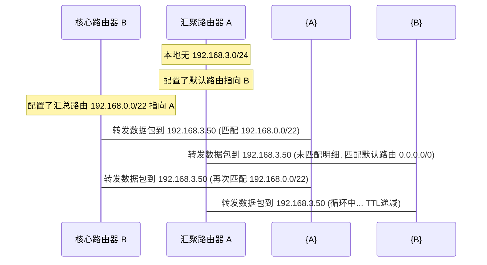

# 1.2.4.3 路由

网络层是计算机网络的桥梁，其核心任务是将分组（Packet）从源端通过错综复杂的物理网络传输到目的端。在这一过程中，**路由选择 (Routing)** 与 **分组转发 (Forwarding)** 构成了一对相辅相成但又在物理和逻辑上彻底解耦的核心机制。本篇将从计算机体系结构、硬件加速、经典图论算法、自治系统（AS）路由协议栈以及寻址机制等多个维度，深层剖析路由选择与转发控制的底层运作机理。

---

## 一、路由选择与数据转发的本质

在现代网络设备架构中，路由选择与分组转发被划分为两个逻辑上相互独立、物理上深度协同的组件：控制平面（Control Plane）与数据平面（Data Plane）。

```mermaid
graph TD
    subgraph 控制平面 (Control Plane) - 慢速通道
        RP[路由处理器 Route Processor]
        OSPF[OSPF / IS-IS 协议引擎] --> RIB[路由表 RIB]
        BGP[BGP 策略路由引擎] --> RIB
        RIB -->|编译下发| FIB_Gen[FIB 生成与下发模块]
    end

    subgraph 数据平面 (Data Plane) - 快速通道
        FIB_Gen -->|硬件驱动注入| TCAM[三态内容寻址内存 TCAM / FIB]
        InputPort[物理输入接口] -->|解析目的 IP| TCAM
        TCAM -->|匹配输出接口| SwitchFabric[高速交换矩阵 Switch Fabric]
        SwitchFabric --> OutputPort[物理输出接口]
    end
    
    InputPort -.->|无法匹配/协议报文 Punt| RP
```

### 1. 控制平面与数据平面的功能解耦

#### 控制平面 (Control Plane)
*   **职责范围**：负责“决定分组从源到目的地的路径”。它运行各种动态路由选择协议（如 OSPF、IS-IS、BGP），通过与相邻节点交换拓扑或路径向量信息，构建全局网络视图，并在此基础上通过路由算法（如 Dijkstra 算法）计算出到达所有网段的最优路径，最终维护一张完整的**路由表 (RIB, Routing Information Base)**。
*   **时间尺度与处理性能**：由于路由计算涉及到复杂的图论运算以及与邻居建立并维护协议会话（涉及 TCP/UDP/IP 协议栈层面的封装与解析），控制平面的操作属于**慢速通道 (Slow Path)**。其运算时延通常处于毫秒（ms）到秒（s）量级，主要运行在路由器的**主控板 / 路由处理器 (Route Processor, RP)** 的通用中央处理器（CPU）上。

#### 数据平面 (Data Plane)
*   **职责范围**：负责“将进入路由器的分组从合适的物理输出接口发送出去”。当一个 IP 分组到达路由器的输入端口时，数据平面通过检索由控制平面注入的**转发表 (FIB, Forwarding Information Base)**，执行快速的最长前缀匹配（LPM），修改 IP 首部中的生存时间（TTL），重新封装目的与源 MAC 地址，然后通过内部的**高速交换矩阵 (Switch Fabric)** 将分组移动到对应的输出物理端口。
*   **时间尺度与处理性能**：为了使网络设备能以“线速 (Line Rate)”转发数据包，数据平面不能受到 CPU 计算能力的牵制。以 100 Gbps 链路为例，若网络中全部是 64 字节的极小分组，则接口每秒需接收约 1.488 亿个分组，意味着每个分组的处理时间不能超过 6.7 纳秒（ns）。因此，数据平面属于**快速通道 (Fast Path)**，必须完全通过专用集成电路（ASIC）或网络处理器（NP）等硬件来实现。

#### 解耦协同机制
*   **Punt (上送)**：当数据平面遇到无法处理的特殊报文（例如 OSPF 的 Hello 报文、BGP 的 TCP 握手包，或者在 FIB 中无法匹配任何路径且没有默认路由的异常流量）时，硬件转发芯片会通过内部控制总线将这些报文上送至控制平面的 CPU 进行协议层处理。
*   **Inject (注入/下发)**：主控板的路由处理器计算出最优路径后，通过驱动程序把 RIB 中的核心转发条目编译为紧凑的 FIB 格式，通过高速背板总线下发到各个接口板（Line Card）的硬件芯片中，直接更新其本地 FIB 缓存。
*   **VOQ (Virtual Output Queuing) 与交换矩阵**：在高性能转发中，为避免多个输入端争抢同一个输出端导致头端阻塞（HOL, Head-of-Line Blocking），接口板的转发芯片通常采用 VOQ 技术。每个输入端口都为所有可能的输出端口维护独立的逻辑队列，由中央调度器在纳秒级内完成交叉开关（Crossbar）的匹配调度，实现无阻塞的数据交换。

#### FIB 硬件加速与 ASIC 转发流水线
在接口板的 ASIC 芯片内部，数据转发是一个高度并行且严格定时的“流水线 (Pipeline)”处理过程，包含以下关键硬件阶段：
1.  **帧解析器 (Frame Parser)**：提取进入物理接口的以太网帧首部，定位并解封装出 IP 报头，提取出关键的字段信息，包括版本（Version）、首部长度（IHL）、生存时间（TTL）、协议号（Protocol）、源 IP 地址（SIP）和目的 IP 地址（DIP）。
2.  **转发表检索 (FIB Lookup)**：将提取出的目的 IP 地址作为检索键值（Key），送入三态内容寻址内存（TCAM）中。TCAM 在一个时钟周期内完成与全网段前缀的并发匹配，并输出对应的物理存储索引值。转发芯片根据该索引值去 SRAM 中提取对应的下一跳（Next Hop）元数据指针和出接口标识。
3.  **邻居关系与封装解析 (Adjacency & Encapsulation)**：通过下一跳的元数据指针，芯片在本地邻居表（Adjacency Table）中检索对应的下一跳 MAC 地址。该表项是将控制平面的 ARP/ND 表在硬件中编译生成的，能保证极高速度的映射。
4.  **分组修改 (Packet Modification / Deparser)**：
    *   **TTL 递减与校验和重算**：将 IP 首部中的 TTL 值减 1。如果 TTL 变为 0，则触发“Punt”操作，将分组送往 CPU，由 CPU 回复 ICMP 超时报文。由于 TTL 的改变破坏了原先 IP 首部的完整性，ASIC 会使用片上专用的并行硬件加法器，在单周期内完成 IP 首部校验和（Header Checksum）的重新计算与填充。
    *   **链路层首部改写**：将分组前部重新封装上新的以太网帧头。原有的以太网首部被剥离，改写为：源 MAC 地址替换为本路由器出接口的物理 MAC 地址，目的 MAC 地址替换为下一跳路由器的 MAC 地址。
5.  **流量调度与输出 (Queuing & Scheduling)**：根据 IP 报头中的区分服务代码点（DSCP）或者链路层 802.1p 优先级字段，将封装好的数据帧送入输出端口对应的特定硬件队列（如严格优先级队列 SP、加权公平队列 WFQ），经过队列调度器调度后，最终通过 PHY 芯片发送到物理介质上。

---

### 2. 路由表 (RIB) 与转发表 (FIB) 的物理差异与硬件加速

在物理结构和数据表示上，控制平面维护的路由表与数据平面使用的转发表有着本质区别。

| 特征维度 | 路由表 (RIB) | 转发表 (FIB) |
| :--- | :--- | :--- |
| **存在平面** | 控制平面 (Control Plane) | 数据平面 (Data Plane) |
| **存储介质** | 主控板 of 系统内存 (DRAM) | 接口板的高速缓存、SRAM 或 TCAM |
| **包含内容** | 所有的路由候选信息、管理距离、度量值、协议来源等丰富元数据 | 仅包含目的前缀、掩码长度、最优下一跳 IP、出接口及 ARP/MAC 绑定信息 |
| **查找方式** | 软件遍历、树搜索或哈希（由 CPU 调度） | 硬件级并行查找，通常由 TCAM / ASIC 芯片实现 |
| **表项数量** | 包含备份和非活跃路径，条目多且复杂 | 只包含当前生效的最优转发路径，结构扁平紧凑 |

#### 硬件查找加速器：TCAM (三态内容寻址内存)
普通随机存取内存（RAM）是“输入物理地址，返回对应存储数据”；而内容寻址内存（CAM）则是“输入待匹配数据，返回匹配该数据的物理地址”。
*   **CAM 限制**：普通 CAM 仅能匹配二进制的 `0` 和 `1`，一般用于以太网交换机中对 MAC 地址表（48 位）的精确匹配查找。
*   **TCAM 的三态属性**：三态内容寻址内存（Ternary CAM）引入了第三种状态——`X` (Don't Care，通配/忽略)。
    *   在 TCAM 中，每个存储位（Bit）由两个静态 RAM (SRAM) 单元以及相关的比较晶体管（通常是 10T 或 12T 结构）构成。一个 SRAM 存储对应的数据值（`0` 或 `1`），另一个 SRAM 存储掩码位。如果掩码位为 `X`，则该位在比对时不论输入是 `0` 还是 `1` 均判定为匹配。
    *   这使得 TCAM 能够完美契合 IP 路由的无分类网段匹配。例如，路由前缀 `192.168.1.0/24` 在 TCAM 中存储时，前 24 位被写入具体的二进制，后 8 位主机位全部配置为 `X`。
*   **单周期并行匹配与优先级编码器 (Priority Encoder)**：
    当一个目的 IP 地址（32 位或 128 位）被送入 TCAM 的查询总线时，TCAM 的底层电路会在**一个时钟周期内**，将该 IP 与芯片内成百上千条前缀同时进行硬件并行比对。
    如果有多个条目同时判定匹配（例如目的 IP `172.16.1.130` 同时匹配了 `172.16.0.0/16`、`172.16.1.0/24` 和 `172.16.1.128/25`），TCAM 关联的**优先级编码器**将发挥作用。在芯片初始化和下发 FIB 时，控制平面通常会将掩码较长的表项排在 TCAM 的低物理地址区，掩码较短的排在高物理地址区。优先级编码器会自动挑选出物理地址最小（优先级最高，即掩码最长）的匹配结果，输出对应的 RAM 偏移量，进而读取出对应的出接口和下一跳封装数据。

---

### 3. 最长前缀匹配 (LPM) 算法原理

最长前缀匹配（Longest Prefix Match, LPM）是 IP 路由的核心原则。当路由表中存在多个能够匹配目的 IP 地址的网段时，必须优先选择掩码最长（即前缀最具体、网络范围最小）的路由表项。

#### 软件实现：Trie 树家族
在不依赖 TCAM 硬件的软件路由平台中，通常采用树形数据结构来搜索最长前缀。

```
              [Root]
             /      \
           (0)      (1)
           /          \
        (172)        (...)
          |
       (16)
       /  \
     (0)  (1)
     /      \
  [A]        [B] (172.16.1.0/24)
              \
              (128)
                \
                [C] (172.16.1.128/25)
```

##### (1) 二叉 Trie (Binary Trie)
二叉 Trie 将前缀的二进制位（从高位 MSB 到低位 LSB）作为树的分支路径。
*   **查找**：从根节点出发，根据目的 IP 的每一个比特（0 走左子树，1 走右子树）向下检索。在遍历过程中，每当遇到带有路由宣告标志（Terminal Node）的节点，就将该节点的路由信息记录下来作为“临时最长匹配项”。如果在某一级发现子节点指针为空，则查找结束，最后记录的临时最长匹配项即为最长前缀匹配结果。
*   **复杂度**：对于 IPv4，最坏情况下需要沿树深方向匹配 32 次，时间复杂度为 $O(W)$（$W = 32$ 或 $128$）。由于树的节点分布在不连续的内存空间中，这 32 次遍历会造成大量的 CPU 缓存未命中（Cache Miss），效率低下。

##### (2) 压缩 Trie (Patricia Trie)
为了消除二叉 Trie 中大量只有一个子节点的单链结构，Patricia Trie 对这些无分叉的路径节点进行了合并。
*   每个节点存储一个 `Skip` 指示器，告知查找程序在当前节点匹配通过后，接下来可以跳过多少个不影响选路分叉的比特位，直接在下一个发生分叉的位进行比较。
*   它极大地压缩了内存中节点的数量，降低了内存占用，但路由表的插入与删除逻辑变得更加繁琐。

##### (3) 多路 Trie (Multi-way Trie) 与 Lulea 算法
为了将内存访问次数降到最低，多路 Trie 每次读取多个比特位（例如使用 4 位 Stride，则每个节点拥有 16 个分支；或者采用固定的 16-8-8 跨度划分）。
*   **扩展机制**：如果某条路由是 `/18`，而我们的 Stride 采用 16-8（第一层匹配前 16 位，第二层匹配接下来的 8 位，即到 24 位），那么在第二层节点中，需要把该 `/18` 路由复制（Expand）到所有匹配这前 18 位的分支中（共 $2^{24-18} = 64$ 个叶子节点分支）。
*   **Lulea 算法优化**：为了解决多路 Trie 复制带来的空间膨胀，Lulea 算法使用**位图 (Bitmap)** 和**局部索引表**，消除了绝大部分的重复指针。它将大量的叶子分支信息压缩在几位位图中，当需要查找时，通过 CPU 的硬件级 `POPCNT`（计算二进制中 1 的个数）指令单周期计算出数组偏移量，直接读取路由信息，将 IPv4 的最差匹配查表次数压缩到 3~4 次。

下面是一个使用 Go 语言实现的标准二叉 Trie 树，用于演示最长前缀匹配的软件查找与插入逻辑：

```go
package main

import (
	"fmt"
	"net"
)

// TrieNode 定义二叉 Trie 的节点结构
type TrieNode struct {
	children [2]*TrieNode
	isTerminal bool
	value      interface{} // 存储下一跳或出接口信息
}

// LpmTrie 定义最长前缀匹配树
type LpmTrie struct {
	root *TrieNode
}

func NewLpmTrie() *LpmTrie {
	return &LpmTrie{root: &TrieNode{}}
}

// Insert 插入一条路由条目，如 192.168.1.0/24
func (t *LpmTrie) Insert(ipNet *net.IPNet, value interface{}) {
	ip := ipNet.IP.To4()
	if ip == nil {
		return
	}
	ones, _ := ipNet.Mask.Size()
	curr := t.root

	for i := 0; i < ones; i++ {
		byteIdx := i / 8
		bitIdx := 7 - (i % 8)
		bit := (ip[byteIdx] >> bitIdx) & 1

		if curr.children[bit] == nil {
			curr.children[bit] = &TrieNode{}
		}
		curr = curr.children[bit]
	}
	curr.isTerminal = true
	curr.value = value
}

// Search 执行最长前缀匹配 (LPM)
func (t *LpmTrie) Search(ip net.IP) (interface{}, bool) {
	ip4 := ip.To4()
	if ip4 == nil {
		return nil, false
	}
	curr := t.root
	var bestMatchValue interface{}
	var found bool

	// 依次向下搜索 32 个比特位
	for i := 0; i < 32; i++ {
		if curr.isTerminal {
			bestMatchValue = curr.value
			found = true
		}

		byteIdx := i / 8
		bitIdx := 7 - (i % 8)
		bit := (ip4[byteIdx] >> bitIdx) & 1

		if curr.children[bit] == nil {
			break
		}
		curr = curr.children[bit]
	}

	// 检查最后一个叶子节点是否包含路由
	if curr != nil && curr.isTerminal {
		bestMatchValue = curr.value
		found = true
	}

	return bestMatchValue, found
}

func main() {
	trie := NewLpmTrie()

	// 插入测试路由
	_, net1, _ := net.ParseCIDR("172.16.0.0/16")
	_, net2, _ := net.ParseCIDR("172.16.1.0/24")
	_, net3, _ := net.ParseCIDR("172.16.1.128/25")

	trie.Insert(net1, "NextHop-A")
	trie.Insert(net2, "NextHop-B")
	trie.Insert(net3, "NextHop-C")

	// 测试查找
	ipsToTest := []string{
		"172.16.1.5",   // 应匹配 172.16.1.0/24 -> NextHop-B
		"172.16.1.130", // 应匹配 172.16.1.128/25 -> NextHop-C
		"172.16.2.20",  // 应匹配 172.16.0.0/16 -> NextHop-A
		"10.0.0.1",     // 应不匹配
	}

	for _, ipStr := range ipsToTest {
		ip := net.ParseIP(ipStr)
		val, ok := trie.Search(ip)
		if ok {
			fmt.Printf("IP %15s matches: %s\n", ipStr, val)
		} else {
			fmt.Printf("IP %15s: No Match\n", ipStr)
		}
	}
}
```

---

## 二、路由算法核心分类与实现细节

路由算法被用于解决：当网络拓扑图 $G=(V, E)$ 确定，且每条边 $(u,v)$ 拥有特定的开销度量值 $w(u,v)$ 时，如何求取节点间最优通路的问题。

### 1. 静态路由与动态路由特征

*   **静态路由**：由网络管理员手工配置。
    *   **特征**：计算开销为零，不消耗链路带宽；配置直观，不易被恶意网络报文欺骗；收敛速度依赖于外部检测手段（如联动 BFD，Bidirectional Forwarding Detection）。
    *   **浮动静态路由 (Floating Static Route)**：这是一种基于优先级备份的工程设计。通过设置一条管理距离（AD）较高的静态备份路由，使其在正常情况下不被放入转发表。一旦主用动态路由（如 OSPF，AD 为 110）因链路断开而撤销时，该静态路由（如 AD 配置为 150）就会自动浮现并加载到 FIB 中，接管转发流量。
*   **动态路由**：路由器之间通过运行特定的路由协议，动态学习网络拓扑，自适应网络故障并自动收敛。
    *   根据其算法实质，动态路由主要分为**链路状态路由算法 (Link State)** 与 **距离矢量路由算法 (Distance Vector)**。

---

### 2. 链路状态路由算法与 Dijkstra 算法

链路状态（Link State, LS）算法要求每个路由器将自己直连的链路状态通告全网。每个节点都能通过收集到的链路状态信息构建出一致的、全局的网络拓扑地图。

#### (1) OSPF 中的 LSA 洪泛与 LSDB 同步
以 OSPF (Open Shortest Path First) 协议为例：
*   **LSA (链路状态通告)**：是描述链路状态的核心数据载体。它包含了源路由器 ID、邻居路由器 IP、子网掩码、链路带宽度量值等。
*   **可靠洪泛 (Reliable Flooding)**：当链路发生抖动或周期更新定时器到期时，路由器生成新的 LSA，并从各激活接口发送给邻居。
    *   每个收到 LSA 的路由器首先检索自己的**链路状态数据库 (LSDB)**。
    *   如果收到的是一条全新的 LSA，或者其**序列号 (Sequence Number)** 大于本地现有记录，则将其存入 LSDB，向发送源回复 **LSAck (确认报文)**，并从除接收接口以外的接口转发出去。
    *   如果收到的 LSA 序列号等于或小于本地，则直接丢弃，防止报文在环形网络中无休止地死循环洪泛。

#### (2) Dijkstra 最短路径算法的数学原理与迭代过程
当 LSDB 同步完毕后，每个路由器以自己为根节点（$s$），运行 Dijkstra 算法计算一棵单源最短路径树（SPT）。

##### 数学模型与形式化步骤
设网络拓扑为有向图 $G = (V, E)$。
*   $dist[u]$：源点 $s$ 到节点 $u$ 的当前已知最短距离。
*   $prev[u]$：路径上节点 $u$ 的直接前驱节点。
*   $S$：已确定最短路径的节点集合。
*   $U = V \setminus S$：未确定最短路径的节点集合。

1.  **初始化阶段**：
    $$dist[s] = 0; \quad \forall v \in V \setminus \{s\}, \ dist[v] = \infty; \quad \forall v \in V, \ prev[v] = -1$$
    $$S = \emptyset, \quad U = V$$
2.  **选取当前最小值节点**：
    从 $U$ 中选择一个具有最小 $dist[u]$ 的节点 $u$，并将 $u$ 移入 $S$：
    $$S = S \cup \{u\}, \quad U = U \setminus \{u\}$$
3.  **松弛操作 (Relaxation)**：
    对于 $u$ 的每一个直连邻接节点 $v \in U$，如果通过 $u$ 到达 $v$ 的开销更低，则更新其距离与前驱：
    $$\text{If } dist[u] + w(u, v) < dist[v]:$$
    $$dist[v] = dist[u] + w(u, v)$$
    $$prev[v] = u$$
4.  **循环终止**：
    重复步骤 2 和 3，直到 $U = \emptyset$。

##### Dijkstra 算法执行步骤详解
为了展示算法的动态演算，假设存在以下拓扑图，节点为 A, B, C, D, E，源节点为 **A**：
*   $w(A, B) = 2, \ w(A, C) = 4$
*   $w(B, C) = 1, \ w(B, D) = 7$
*   $w(C, D) = 3, \ w(C, E) = 5$
*   $w(D, E) = 1$

以下为 Dijkstra 算法的完整计算演进表：

| 步骤 | 被选入 $S$ 的节点 $u$ | $S$ 集合状态 | $dist[A]$ | $dist[B]$ | $dist[C]$ | $dist[D]$ | $dist[E]$ | 节点前驱状态 $prev$ |
| :--- | :--- | :--- | :--- | :--- | :--- | :--- | :--- | :--- |
| **初始化** | - | $\emptyset$ | 0 | $\infty$ | $\infty$ | $\infty$ | $\infty$ | 全部为 -1 |
| **第 1 步** | A | $\{A\}$ | 0 | 2 (来自A) | 4 (来自A) | $\infty$ | $\infty$ | $prev[B]=A, \ prev[C]=A$ |
| **第 2 步** | B | $\{A, B\}$ | 0 | 2 | 3 (通过B松弛) | 9 (通过B) | $\infty$ | $prev[C]=B, \ prev[D]=B$ |
| **第 3 步** | C | $\{A, B, C\}$ | 0 | 2 | 3 | 6 (通过C松弛) | 8 (通过C) | $prev[D]=C, \ prev[E]=C$ |
| **第 4 步** | D | $\{A, B, C, D\}$ | 0 | 2 | 3 | 6 | 7 (通过D松弛) | $prev[E]=D$ |
| **第 5 步** | E | $\{A, B, C, D, E\}$ | 0 | 2 | 3 | 6 | 7 | 算法结束 |

最终，以 A 为源点的最短路径为：
*   到 B：$A \to B$（Cost: 2）
*   到 C：$A \to B \to C$（Cost: 3）
*   到 D：$A \to B \to C \to D$（Cost: 6）
*   到 E：$A \to B \to C \to D \to E$（Cost: 7）

下面是一个用 Go 语言基于最小堆（自定义 Priority Queue）实现的 Dijkstra 算法完整代码：

```go
package main

import (
	"container/heap"
	"fmt"
	"math"
)

// Edge 定义有向图中的边
type Edge struct {
	To     int
	Weight int
}

// Graph 定义邻接表结构的图
type Graph struct {
	Vertices int
	AdjacencyList [][]Edge
}

func NewGraph(vertices int) *Graph {
	return &Graph{
		Vertices:      vertices,
		AdjacencyList: make([][]Edge, vertices),
	}
}

func (g *Graph) AddEdge(from, to, weight int) {
	g.AdjacencyList[from] = append(g.AdjacencyList[from], Edge{To: to, Weight: weight})
}

// Item 堆中的元素
type Item struct {
	vertex   int
	distance int
	index    int
}

// PriorityQueue 最小堆实现
type PriorityQueue []*Item

func (pq PriorityQueue) Len() int           { return len(pq) }
func (pq PriorityQueue) Less(i, j int) bool { return pq[i].distance < pq[j].distance }
func (pq PriorityQueue) Swap(i, j int) {
	pq[i], pq[j] = pq[j], pq[i]
	pq[i].index = i
	pq[j].index = j
}
func (pq *PriorityQueue) Push(x interface{}) {
	n := len(*pq)
	item := x.(*Item)
	item.index = n
	*pq = append(*pq, item)
}
func (pq *PriorityQueue) Pop() interface{} {
	old := *pq
	n := len(old)
	item := old[n-1]
	old[n-1] = nil
	item.index = -1
	*pq = old[0 : n-1]
	return item
}

// Dijkstra 计算单源最短路径
func Dijkstra(graph *Graph, start int) ([]int, []int) {
	dist := make([]int, graph.Vertices)
	prev := make([]int, graph.Vertices)
	for i := range dist {
		dist[i] = math.MaxInt32
		prev[i] = -1
	}
	dist[start] = 0

	pq := make(PriorityQueue, 0)
	heap.Init(&pq)
	
	// 保存堆中节点的指针以方便更新距离
	items := make([]*Item, graph.Vertices)
	for v := 0; v < graph.Vertices; v++ {
		item := &Item{vertex: v, distance: dist[v]}
		items[v] = item
		heap.Push(&pq, item)
	}

	visited := make([]bool, graph.Vertices)

	for pq.Len() > 0 {
		currItem := heap.Pop(&pq).(*Item)
		u := currItem.vertex
		if visited[u] {
			continue
		}
		visited[u] = true

		if dist[u] == math.MaxInt32 {
			break
		}

		for _, edge := range graph.AdjacencyList[u] {
			v := edge.To
			if !visited[v] {
				alt := dist[u] + edge.Weight
				if alt < dist[v] {
					dist[v] = alt
					prev[v] = u
					// 更新优先队列中的距离值
					items[v].distance = alt
					heap.Fix(&pq, items[v].index)
				}
			}
		}
	}

	return dist, prev
}

func main() {
	// 节点 0(A), 1(B), 2(C), 3(D)
	g := NewGraph(4)
	g.AddEdge(0, 1, 1) // A -> B (1)
	g.AddEdge(0, 2, 4) // A -> C (4)
	g.AddEdge(1, 2, 2) // B -> C (2)
	g.AddEdge(1, 3, 6) // B -> D (6)
	g.AddEdge(2, 3, 1) // C -> D (1)

	distances, paths := Dijkstra(g, 0)

	fmt.Println("Node\tDistance\tPrevious Node")
	for i := 0; i < len(distances); i++ {
		fmt.Printf("%d\t%d\t\t%d\n", i, distances[i], paths[i])
	}
}
```

#### (3) OSPF 邻接关系建立与 DR/BDR 选举
OSPF 建立邻接关系的过程由一个复杂的状态机管理：

```
+------+    Hello     +------+   Init    +--------+  2-Way   +---------+
| Down |------------->| Init |---------->| 2-Way  |---------->| ExStart |
+------+              +------+           +--------+          +---------+
                                                                  |
                                                                  | DD (Negotiate)
                                                                  v
+------+   Full LSA   +---------+  Loading  +----------+ Exchange+----------+
| Full |<-------------| Loading |<----------| Exchange |<--------| Exchange |
+------+              +---------+           +----------+         +----------+
```

1.  **Down**：初始关闭状态。
2.  **Init**：收到邻居发送的 Hello 报文，但对方接收列表中未包含本地的 Router ID。
3.  **2-Way**：双向会话建立。收到邻居的 Hello 报文且对方已确认我方。**在此阶段进行 DR 与 BDR 的选举**。
4.  **ExStart**：确定主从（Master/Slave）关系，协商 DD（Database Description）报文的序列号。
5.  **Exchange**：向邻居交换 DD 报文，描述本地 LSDB 的目录摘要。
6.  **Loading**：对比 DD 报文后，发现本地缺失某些链路信息，向邻居发送 **LSR (链路状态请求)**，邻居回应 **LSU (链路状态更新)** 进行数据同步。
7.  **Full**：接收到 LSU 并回复 LSAck 确认，LSDB 达到完全一致，邻接关系正式建立。

#### (4) OSPF 核心 LSA 类型剖析
在 LSDB 同步与计算中，OSPF 并不使用单一格式的 LSA，而是将拓扑信息分类表达，以下是五种最核心的 LSA 类型：
1.  **Type-1 LSA (Router LSA)**：每台运行 OSPF 的路由器均会产生。它描述了路由器各个激活接口的 IP 地址、链路类型以及开销值。Type-1 LSA **仅在产生的区域（Area）内部传播**，不允许跨越 ABR。
2.  **Type-2 LSA (Network LSA)**：仅由广播网段（如以太网）中的指定路由器（DR）产生。它描述了该广播网段中连入的所有路由器的列表以及子网掩码信息。与 Type-1 LSA 一样，它**只在产生的区域内部进行洪泛**。
3.  **Type-3 LSA (Summary LSA)**：由区域边界路由器（ABR）产生。ABR 将某个区域内部的路由前缀及开销值打包成 Type-3 LSA，向其他区域进行宣告。它的实质是将区域内的链路状态信息转换为“距离矢量”信息传递给其他区域，**在整个自治系统（除了 Stub 区域）内传播**。
4.  **Type-4 LSA (ASBR Summary LSA)**：由 ABR 产生，用于告诉其他区域的路由器，如何到达本区域的 ASBR 路由器。它在区域间进行传递。
5.  **Type-5 LSA (AS External LSA)**：由自治系统边界路由器（ASBR）产生，描述去往 AS 外部网络的路由。该类型 LSA 在**整个 OSPF 自治系统内大范围洪泛**（非 OSPF 区域除外，如 Stub/NSSA 区域）。

#### (5) OSPF 与 IS-IS 的协议数据单元 (PDU/LSA) 底层封装格式
从协议底层的封装与承载机制来看，OSPF 与 IS-IS 的设计哲学有很大的区别：
*   **OSPF 报文封装**：OSPF 报文直接封装在 IP 数据报中（IP 协议号为 89）。这使得 OSPF 需要依赖 IP 协议栈本身的可达性。OSPF 报文头（24 字节）包含 `Version`、`Type`、`Packet Length`、`Router ID`、`Area ID`、`Checksum` 和 `Authentication` 字段。因为其报文格式字段在 RFC 中是静态定义的，若要引入新的功能（如流量工程或 IPv6），往往需要重新设计报文或引入全新类型的 LSA（如 OSPFv3）。
*   **IS-IS 报文封装与 TLV 机制**：IS-IS 直接运行在数据链路层之上（如 802.3 帧格式中，使用专有的链路层 SAP 标识 CLNS/CLNP 服务）。这使 IS-IS 天然对 IP 协议栈攻击免疫。其报文结构基于 **TLV (Type-Length-Value)** 结构构建：
    *   **Type (1 字节)**：定义信息块的属性类别。
    *   **Length (1 字节)**：指示数据块的长度。
    *   **Value (可变长)**：承载具体的数据内容。
    由于采用了 TLV 这一极为灵活的设计，IS-IS 升级支持 IPv6、MPLS TE 等新特性时，不需要修改任何报文核心头部，只需定义全新的 TLV 编号并附加在原 PDU 中。这种平滑扩展的底层特性使其在超大型网络中广受欢迎。

---

### 3. 距离矢量路由算法与 Bellman-Ford 算法

距离矢量（Distance Vector, DV）路由算法是分布式、迭代式的动态选路算法。

#### (1) Bellman-Ford 算法数学模型
设 $D_i(j)$ 是从节点 $i$ 到达目的节点 $j$ 的当前最短估计开销。
Bellman-Ford 方程（动态规划状态转移方程）为：
$$D_i(j) = \min_{v \in N(i)} \{ c(i, v) + D_v(j) \}$$
其中：
*   $N(i)$ 是节点 $i$ 的所有直连邻居的集合。
*   $c(i, v)$ 是节点 $i$ 到其直连邻居 $v$ 的链路物理开销。
*   $D_v(j)$ 是邻居 $v$ 独立计算出的、去往目的节点 $j$ 的距离。

每个运行距离矢量算法（如 RIP）的路由器都会维护自身的路由矢量表，并且周期性地（例如每 30 秒）将整张表发送给它的直连邻居。邻居在收到表后，使用上述状态转移方程，对本地的路由表项执行松弛更新。

#### (2) 环路形成机理：“坏消息传得慢”现象
距离矢量协议极其容易因为局部链路的中断而产生“计数到无穷 (Count-to-Infinity)”问题。

假设有三个节点呈直线物理相连：
$$A \xleftrightarrow{1} B \xleftrightarrow{1} C$$
*   **正常情况**：
    *   $B$ 到达 $A$ 的路由为：`D_B(A) = 1`，下一跳是 $A$。
    *   $C$ 通过 $B$ 的宣告，学到到达 $A$ 的路由：`D_C(A) = c(C, B) + D_B(A) = 1 + 1 = 2`，下一跳是 $B$。
*   **链路断开**：
    *   此时，链路 $A \leftrightarrow B$ 发生故障中断。$B$ 检测到直连失效，将去往 $A$ 的开销设为无穷大（`D_B(A) = 16`，RIP 中 16 表示不可达）。
    *   **异步冲突**：在 $B$ 试图将该路由撤销信息发送给 $C$ 之前，$C$ 的更新定时器恰好到期。$C$ 向 $B$ 发送了它的路由更新：“我有去往 $A$ 的路由，距离是 2”。
    *   **环路闭合**：$B$ 收到 $C$ 的更新后，根据 Bellman-Ford 计算：
        $$D_B(A) = c(B, C) + D_C(A) = 1 + 2 = 3$$
        因为 $3 < 16$，$B$ 判定通过 $C$ 可以到达 $A$，于是将路由表更新为：去往 $A$ 的开销为 3，下一跳为 $C$。
    *   **持续爬升**：随后，$B$ 向 $C$ 更新自身状态，声称到达 $A$ 距离为 3。$C$ 收到后由于下一跳本就是 $B$，因此被动更新：
        $$D_C(A) = c(C, B) + D_B(A) = 1 + 3 = 4$$
        如此往复，数据包在 $B$ 与 $C$ 之间不断打转。由于信息在没有全局视图的情况下在两个节点之间来回“传谣”，度量值在每一次周期更新中递增 1，直至攀升到 16，两端才最终发现不可达。这种致命的收敛延迟即是“坏消息传得慢”。

```
[Time 0]  Link A-B down. B sets D_B(A) = 16.
[Time 1]  C sends update: "D_C(A) = 2".
          B calculates: D_B(A) = c(B,C) + D_C(A) = 1 + 2 = 3.
          B's Route Table: Dest A -> NextHop: C (Cost: 3)  <-- LOOP CREATED
[Time 2]  B sends update: "D_B(A) = 3".
          C calculates: D_C(A) = c(C,B) + D_B(A) = 1 + 3 = 4.
          C's Route Table: Dest A -> NextHop: B (Cost: 4)
[Time 3]  Loop escalates (5, 6, 7 ... 16).
```

#### (3) 工程防环机制剖析
1.  **触发更新 (Triggered Updates)**：
    *   一旦检测到拓扑变化，路由器立即打破 30 秒的周期限制，瞬间向邻居宣告路由的撤销或度量值变更。这缩短了环路孕育的时间窗口，但如果更新报文在链路中丢失，依然无法杜绝环路。
2.  **水平分割 (Split Horizon)**：
    *   “一条路由信息不能被发回它最初学到的那个接口”。例如，由于 $C$ 去往 $A$ 的路由是从 $B$（接口 1）学来的，因此 $C$ 不会再将去往 $A$ 的路由信息宣告给 $B$。这有效杜绝了两个直连节点之间的双向路由反馈环。
    *   *局限性*：在复杂的环形拓扑（如 A-B-C-A）中，或者在 Hub-and-Spoke 结构的帧中继/非广播多路访问（NBMA）网络中，水平分割会导致 Spoke 节点间无法互相学习路由。
3.  **毒性逆转 (Poison Reverse)**：
    *   与水平分割类似，但做法是：$C$ 依然向 $B$ 发送关于 $A$ 的更新，但强行将度量值标为最大值（如 16），明示 $B$“千万不能通过我走这条路”。这比水平分割更为主动，能加速环路条目的消除。
4.  **抑制定时器 (Hold-down Timers)**：
    *   当得知去往某个网段的链路失效时，路由器会在该网段上启动一个抑制定时器。在抑制期内，拒绝接收任何关于该网段且度量值差于（或等于）原先路由的更新，防止网络中因其他路由器“滞后”的旧路由更新而重构环路。

---

## 三、自治系统 (AS) 与域内外路由管理

为了支撑全球数十亿网络节点的互联互通，Internet 采用了层次化的自治系统划分。

### 1. 自治系统 (AS) 概念
*   **定义**：由同一个技术管理机构控制、使用统一路由选择策略的一组路由器的集合。
*   **自治系统号 (ASN)**：用于在域间路由（BGP）中唯一标识一个 AS。早期的 ASN 为 16 位（1-65535），目前已广泛升级为 32 位。
*   **AS 分类**：
    *   **Stub AS (末梢自治系统)**：仅有一个出口连接到外部 AS，不传递过境流量。
    *   **Multihomed AS (多归属自治系统)**：连接到多个外部 AS，但不允许任何过境流量穿过本 AS。
    *   **Transit AS (过境自治系统)**：连接多个外部 AS，且允许并中转外部流量。

---

### 2. 域内路由选择 (IGP) 的架构与防环

域内路由协议（Interior Gateway Protocol）运行在一个 AS 的内部。除 OSPF 外，IS-IS 也是经典的 IGP。

#### OSPF 的层次化分区与区域防环逻辑
OSPF 通过划分区域（Area）来限制 LSA 的洪泛范围，以此提高网络扩展性。
*   **骨干区域 (Area 0)**：有且仅有一个，是所有区域间路由流转的中心。
*   **非骨干区域**：必须物理上或逻辑上与 Area 0 相连。
*   **物理机制防环**：非骨干区域之间不能直接交换路由信息。例如，Area 1 的 ABR 计算出路由后，只能将其打包为 Type-3 LSA 注入 Area 0；而 Area 2 的 ABR 从 Area 0 接收该 Type-3 LSA 后再注入自己的区域。这使得整个 AS 内部的区域间关系在拓扑上呈现出无环的“星型拓扑”。
*   **水平分割法则（ABR）**：为了防止区域间路由信息的逆流，OSPF 规定：**ABR 不会将其在非骨干区域学到的 Type-3 LSA 重新注入回骨干区域 Area 0**。

#### OSPF 与 IS-IS 的深度对比

| 比较维度 | OSPF (v2/v3) | IS-IS |
| :--- | :--- | :--- |
| **承载协议层** | 承载于 IP 协议之上（协议号 89） | 直接承载于数据链路层之上（CLNS/CLNP） |
| **区域边界划分** | 边界位于**接口**上（ABR 接口跨 Area） | 边界位于**链路**上（路由器整体属于一个 Area） |
| **协议扩展性** | 较弱。报文格式固定，增加功能需要重新定义新 LSA | 极强。基于 TLV（Type-Length-Value）可变长结构，易于无缝支持 IPv6 和流量工程 (TE) |
| **拓扑计算开销** | 单区域内路由器数量较多时，LSA 种类多，Dijkstra 计算负载重 | 节点关系简单，使用 DIS 代替 DR，收敛速度较快，更适合超大规模运营商主干网 |

---

### 3. 域间路由选择 (EGP) 与 BGP 协议

域间路由选择协议（Exterior Gateway Protocol）用于在不同的 AS 之间传递路由信息。由于涉及商业契约和政策博弈，域间选路绝非仅仅挑选“最短延迟”。

#### BGP 属性的四大分类及其设计思想
BGP 协议依靠丰富的属性来管理复杂的策略选路，这些属性在设计上被严格划分为四类：
1.  **公认必选 (Well-Known Mandatory)**：所有的 BGP 协议实现都必须识别该属性，并且在每一条 BGP 更新（Update）报文中都**必须携带**该属性。
    *   *典型属性*：`AS_PATH`（记录经过的 AS 列表，用于防环和路径度量）、`NEXT_HOP`（下一跳 IP 地址）、`ORIGIN`（标记路由的起源类型，如 IGP、EGP 或 Incomplete）。
2.  **公认自选 (Well-Known Discretionary)**：所有的 BGP 实现都必须识别该属性，但在更新报文中**可以根据策略需要选择携带或不携带**。
    *   *典型属性*：`LOCAL_PREF`（控制本 AS 流量的流出策略）。
3.  **可选过渡 (Optional Transitive)**：路由器可以不识别该属性。但如果路由器不识别该属性，它依然**必须接受该属性并将其原封不动地传递**给其他的 BGP 对等体。
    *   *典型属性*：`COMMUNITY`（用于给路由打标记以进行群组策略控制）、`AGGREGATOR`（标记执行路由聚合的路由器 Router ID）。这种过渡属性保证了全球 Internet 中老旧路由器不识别新扩展属性时，新属性依然能跨越它们穿透传输。
4.  **可选非过渡 (Optional Non-Transitive)**：如果路由器不能识别该属性，它**必须忽略并从 Update 报文中将其删除**，且不得向其对等体继续传递该属性。
    *   *典型属性*：`MED`（用于建议相邻 AS 的流量流入方向）、`ORIGINATOR_ID` 与 `CLUSTER_LIST`（用于路由反射器防环）。

#### (1) BGP 的路径矢量属性
BGP (Border Gateway Protocol) 使用路径矢量进行路由传递。它的更新中携带了上述丰富的路径属性：
*   **AS_PATH**：
    *   记录该路由所经过的所有 AS 号的序列（如 `[AS 100, AS 200, AS 300]`）。
    *   **AS 级防环**：当路由器从 EBGP 邻居收到一条路由时，如果发现其 `AS_PATH` 列表中包含了本地的 ASN，则判定发生环路并直接丢弃。
    *   **选路控制**：`AS_PATH` 长度越短，优先级越高。管理员常用 `AS_PATH Prepending`（人为在列表中多次重复插入本地 ASN）来改变传入本 AS 的外部流量流向。
*   **NEXT_HOP**：
    *   指明到达该网段的下一跳 IP。在 IBGP（内部 BGP）内部传递时，为了保持真实来源不丢失，`NEXT_HOP` 默认不发生改变。这需要内部 IGP 协议来解析该下一跳的路由可达性。
*   **LOCAL_PREF (本地优先级)**：
    *   仅在 AS 内部流转。值越大越优先。用于决定本 AS 的流量“从哪个出口出去”。
*   **MED (多出口鉴别器)**：
    *   在两个相邻 AS 间传递。值越小越优先。用于建议邻居 AS“从我的哪个入口送流量进来”。

#### (2) BGP 的 13 条黄金选路法则（按序比较）
1.  **最大 Weight 优先**（仅本地有效）。
2.  **最大 Local Preference 优先**。
3.  **本地发起的路由优先**（如 `network` 或 `redistribute` 生成的路由）。
4.  **最短 AS_PATH 长度优先**。
5.  **最低 Origin 类型优先**（IGP 优于 EGP，EGP 优于 Incomplete）。
6.  **最小 MED 优先**（默认只比较来自同一个邻居 AS 的路由）。
7.  **EBGP 优于 IBGP**。
8.  **到 BGP 下一跳的 IGP 度量值最小优先**。
9.  若配置了负载均衡，执行多路径转发。
10. **最先收到的 EBGP 路由优先**（减少路由抖动）。
11. **最小 BGP Router ID 优先**。
12. **最短 Cluster List 优先**（路由反射器环境）。
13. **最小对等体 IP 优先**。

#### (3) 为什么 BGP 运行在 TCP (Port 179) 之上？
1.  **保证海量路由更新的可靠传输**：全球 BGP 路由表有数十万条目，传输如此大规模的数据包，如果使用不可靠协议，必须重头开发复杂的重传、排序、流控与拥塞控制。而 TCP 面向连接的可靠传输机制完美地承载了这一需求。
2.  **支持跨越非直连路由器建邻**：TCP 利用底层的 IP 路由实现端到端通信。因此，在 AS 内部，只要两台 IBGP 路由器之间 IP 可达，即使中间隔着数台只运行 IGP 的路由器，也可以通过 TCP 握手建立邻居关系。
3.  **降低协议开销**：TCP 提供了保活与确认机制，BGP 对等体只需周期性发送极小的 Keepalive 报文（60 秒一次），在没有拓扑变化时无需发送整张路由表，极大地减轻了网络负担。

#### (4) IBGP 水平分割与路由反射器 (RR)
*   **IBGP 水平分割**：为了防范 AS 内部产生环路，BGP 规定：**从 IBGP 邻居学到的路由，不能再转发给其他的 IBGP 邻居**。
    *   *代价*：这要求 AS 内部的所有 IBGP 路由器必须建立 **全互联 (Full Mesh)** 邻居关系，会使得建邻会话数呈 $O(N^2)$ 级爆发。
*   **路由反射器 (Route Reflector, RR)**：
    为了打破全互联限制，引入了 RR 角色。RR 允许将其从客户端（Client）学到的路由反射给其他客户端和非客户端。
    为了防范反射带来的环路风险，BGP 引入了两个专属属性：
    *   **ORIGINATOR_ID**：记录在本地 AS 内部发起该路由的路由器的 Router ID。若收到路由的路由器发现该属性与自己相同，则拒绝接收。
    *   **CLUSTER_LIST**：记录该路由在反射过程中所经过的每个 RR 的集群 ID（Cluster ID）。若 RR 收到路由时发现自己的 Cluster ID 已经在列表中，则丢弃该路由。

```
          [Route Reflector (RR)]
               /        \  (Reflects Route)
              v          v
       [Client A]      [Client B]
```

#### (5) BGP 对等体建立状态机
BGP 邻居关系的建立经过了六个严格的状态阶段，每个阶段都有其特定的控制逻辑：
1.  **Idle 状态**：初始状态。此时 BGP 拒绝任何外来邻居请求。只有当管理员激活 BGP 配置或手动建立对等体后，系统分配资源，初始化 TCP 连接，并转移到 **Connect** 状态。
2.  **Connect 状态**：BGP 试图向对等体发起 TCP 三次握手连接。如果 TCP 连接成功建立，BGP 发送 **Open 报文**并进入 **OpenSent** 状态；如果 TCP 连接失败，则转移到 **Active** 状态。
3.  **Active 状态**：BGP 尝试主动侦听来自对等体的 TCP 链接请求，并不断尝试重新主动握手。如果连接再次失败，当建邻定时器（Connect Retry Timer）超时，将再次退回 **Connect** 状态。
4.  **OpenSent 状态**：在此状态下，BGP 已经发送了本地的 Open 报文，并等待对方的 Open 报文响应。收到对方 Open 报文后，会对版本号、ASN、Router ID 等配置参数进行合法性检查。若无误，发送 **Keepalive** 报文并进入 **OpenConfirm** 状态。
5.  **OpenConfirm 状态**：BGP 等待对端的 Keepalive 报文，以确认握手参数已被对方完全接受。一旦收到，即转入 **Established** 状态。
6.  **Established 状态**：邻居关系正式激活。双方通过 **Update** 报文开始交换完整的 BGP 路由表，并周期性发送 Keepalive 报文维持 TCP 长连接。

---

## 四、路由汇聚与无分类域间路由选择 CIDR

随着互联网设备量呈指数级上升，IP 地址耗尽和主干网路由表爆炸成为了两大系统级瓶颈。

### 1. CIDR 划分子网与路由聚合的数学物理模型

#### (1) 子网划分 (Subnetting) 的位掩码模型
子网划分是通过向主机位“借位”来完成的。
设原网络地址为 $IP/N$，向主机位借 $k$ 位，则：
*   **子网掩码 (Subnet Mask)** 长度变为 $N' = N + k$。
*   可划分出的子网个数为：
    $$S = 2^k$$
*   每个子网内可分配的主机 IP 数量为：
    $$H = 2^{32 - N'} - 2$$
    *注：减去的 2 分别是主机位全 0 的网络号（Network ID）与主机位全 1 的定向广播地址（Direct Broadcast Address）。*

通过子网掩码（位掩码），路由器在收到分组时，将目的 IP 与掩码 $M$ 执行**按位与 (Bitwise AND)** 运算，即可快速提取出网络部分进行 LPM 匹配：
$$\text{Network ID} = \text{Destination IP} \ \& \ M$$

#### (2) 路由聚合 (Route Aggregation) 二进制计算
路由聚合是子网划分的逆向操作，即把多个连续的明细路由合并为一个更大网段的汇总路由（或超网 Supernet）。

##### 二进制合并推导
假设存在以下四个 C 类子网：
*   `172.16.8.0/24`
*   `172.16.9.0/24`
*   `172.16.10.0/24`
*   `172.16.11.0/24`

我们将它们第三个八位组写成二进制：
*   `8`  $\to$  $\mathbf{000010}00$
*   `9`  $\to$  $\mathbf{000010}01$
*   `10` $\to$  $\mathbf{000010}10$
*   `11` $\to$  $\mathbf{000010}11$

对比可知，前两个八位组共 16 位完全一致，第三个八位组的前 6 位（$\mathbf{000010}$）也完全相同。因此，相同的前缀长度为：
$$16 + 6 = 22 \text{ bits}$$
我们将这 22 位保留，其余后面比特补 0，即可得到聚合路由：
$$\mathbf{172.16.8.0/22}$$
这使得核心主干网路由器只需要为这一条 `/22` 路由分配 FIB 空间，而不需要分配四条 `/24` 表项，大大缩减了全球 BGP 转发表项的规模。

#### (3) VLSM (可变长子网掩码) 与 CIDR 的协同机制
*   **VLSM (Variable Length Subnet Mask)**：在同一个自治系统（AS）内部被使用。为了最大化利用被分配到的网络前缀（如运营商下发的 `/22` 地址段），网络工程师会根据不同物理局域网的实际主机规模，为其划分出掩码长度不同（如有些是 `/24` 对应办公区，有些是 `/30` 或 `/31` 对应骨干点对点链路）的子网。它属于 **AS 内部的地址精细管理**。
*   **CIDR (Classless Inter-Domain Routing)**：主要面向**域间 (Inter-AS) 路由**。它将无数通过 VLSM 划分出的、在地理上同属于某个 AS 内部物理网段的明细子网，通过缩短网络前缀的方式，汇聚成一条大规模的汇总路由宣告到互联网骨干网中。
*   **协同关系**：两者在互联网的构建中相辅相成。AS 内部通过 VLSM 深度压榨地址使用率，在 AS 的物理出口路由器（ABR 或 ASBR）上，通过 CIDR 机制把这些零碎的子网路由打包聚合，向核心网络进行通告，共同保障了主干路由表项规模的控制。

---

### 2. 超网 (Supernetting) 与主干表项压缩的扩展性优化

*   **超网**：特指将多个传统分类网络（如多个标准的 C 类网段）通过缩短掩码合并为一个更大的地址网段。而 **CIDR** 是更加普适的概念，它从根本上取消了主类网络分类，采用任意长度的无分类前缀来进行网络编址与寻址。
*   **扩展性优化**：通过全球 IP 分配机构（IANA/RIR）的层次化分配规则，大容量 of IP 网段被分配给大型服务商，大型服务商再向其下游中小型服务商分发。在向上游宣告路由时，服务商可以通过 CIDR 仅宣告汇总后的超网，使得互联网骨干路由表不至于因为海量局域网的接入而崩溃。

---

### 3. 路由黑洞与环路隐患（Null0 防环机制）

路由聚合在提升网络扩展性的同时，也隐含了致命的黑洞与环路风险。

#### 路由环路形成原理
1.  路由器 A 拥有直连网段：`192.168.1.0/24` 和 `192.168.2.0/24`。
2.  为了压缩路由表，路由器 A 向核心路由器 B 宣告了汇总路由：`192.168.0.0/22`（包含了 `192.168.0.0` $\to$ `192.168.3.0` 四个网段）。
3.  **但是，`192.168.3.0/24` 这个子网在路由器 A 下面实际上是不存在的**（即为一个**路由黑洞**）。
4.  为了访问互联网，路由器 A 配置了一条默认路由指向核心路由器 B（`0.0.0.0/0 -> B`）。
5.  此时，外部网络发送了一个发往不存在的目的 IP `192.168.3.100` 的数据包，到达核心路由器 B。
6.  核心路由器 B 查找转发表，匹配到路由 `192.168.0.0/22`，将其转发给 A。
7.  路由器 A 接收到该数据包，提取目的 IP `192.168.3.100`，并在转发表中检索明细路由。
8.  由于 `192.168.3.0/24` 并不存在，A 找不到明细匹配。
9.  于是，A 只能匹配自己的默认路由 `0.0.0.0/0`，又将数据包发送回了 B。
10. B 收到后再次通过汇总路由匹配发送给 A。数据包开始在 A 与 B 之间无限打转，吞噬背板带宽，直到 TTL 减为 0。



#### 指向 Null0 接口的黑洞防环路由
为了截断上述环路，网络工程中的核心规范是：**在进行路由聚合的设备（A）上，配置一条指向空接口（Null0 / Blackhole）的汇聚网段路由**：
```
ip route 192.168.0.0 255.255.252.0 Null0
```
因为此路由的前缀长度为 `/22`，其优先级（最长前缀匹配）高于默认路由 `/0`。
*   当 B 把发往 `192.168.3.100` 的分组送达 A 时，A 进行 LPM 匹配。
*   明细不存在，但匹配到了 `192.168.0.0/22 -> Null0`，这比默认路由的 `/0` 更精确。
*   根据最长前缀匹配原则，A 命中 `Null0` 表项，直接丢弃该数据包，环路随之在第一步被彻底切断。这是互联网路由表精简与安全防御的核心手段。
