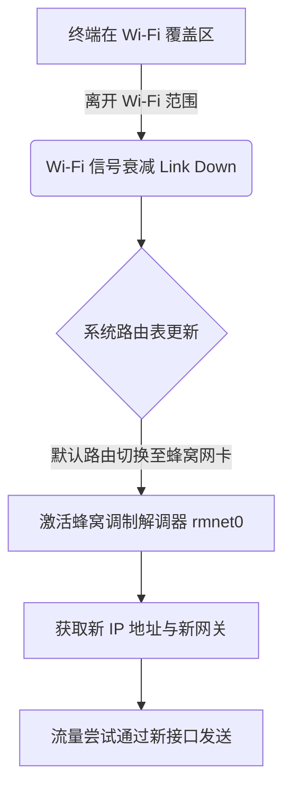
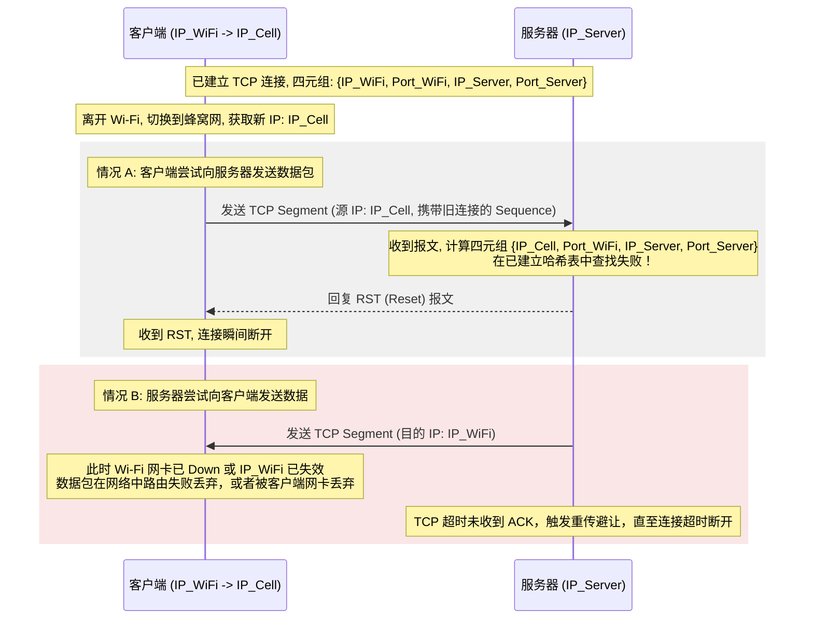
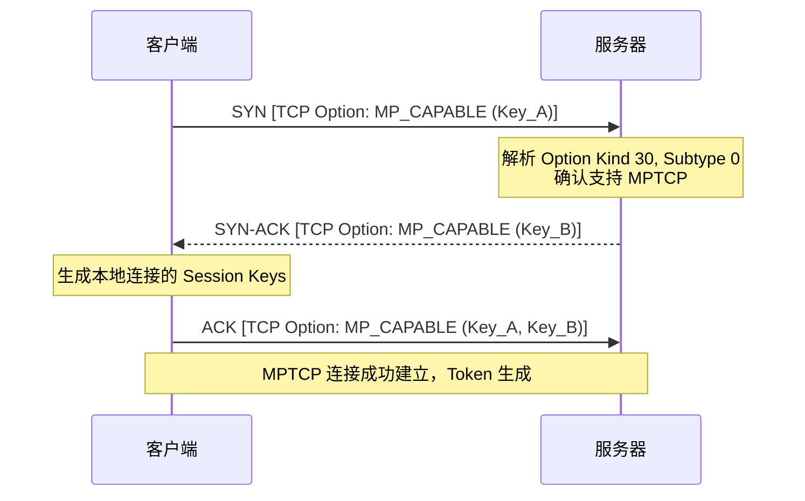
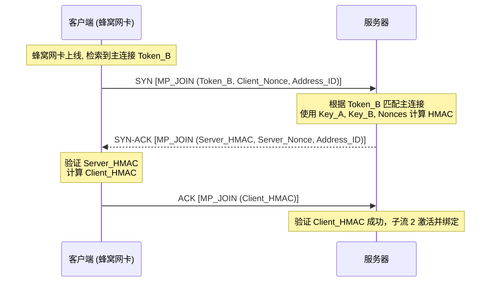
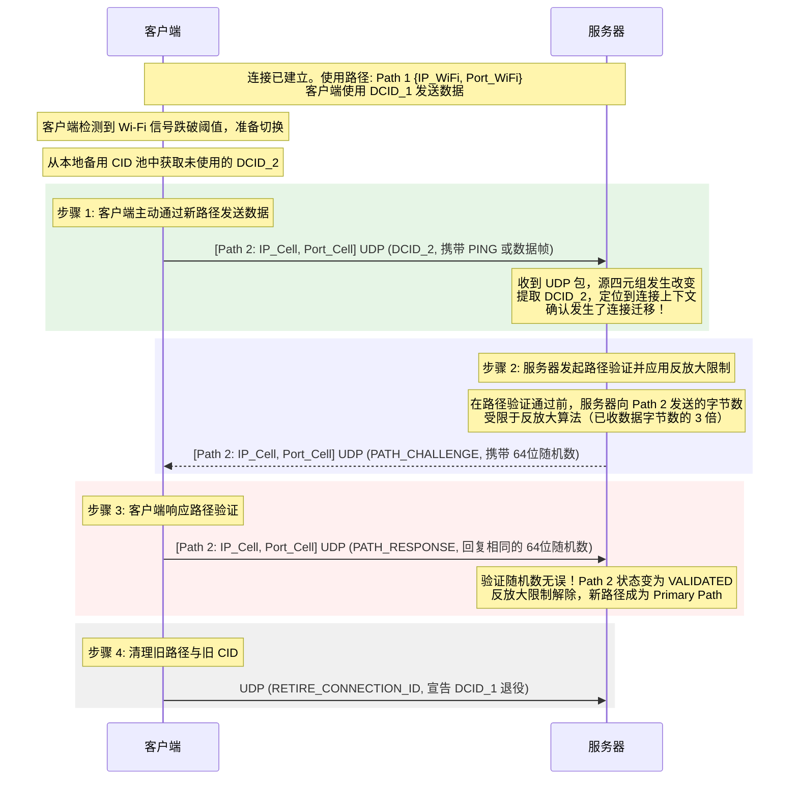
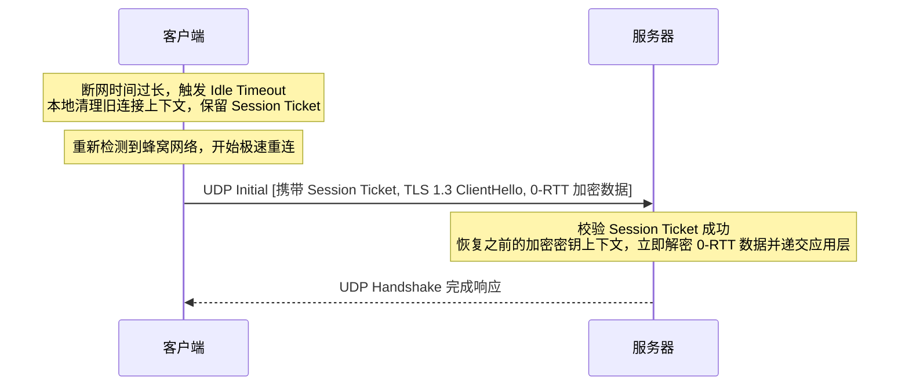

# 1.2.4.4 移动网络切换

# 1.2.4.4 移动网络切换

# 移动网络切换与通道漫游（以 WiFi 与蜂窝切换为例）

在现代移动互联网与异构网络的演进中，终端设备的移动性（Mobility）是其最根本的特征之一。用户持终端设备在无线局域网（Wi-Fi）与广域移动通信网（如 4G LTE/5G NR 蜂窝网络）之间穿梭时，网络接口的无缝切换与通道漫游决定了上层业务的连续性与用户体验。

然而，传统的以 TCP/IP 协议族为核心的互联网体系，在设计之初并未充分考虑节点的高频移动性，导致物理通道切换时伴随着剧烈的链路震荡和连接中断。为了解决这一痛点，网络界与学术界提出了诸如多路径传输技术（MPTCP）与基于用户数据报协议（UDP）的现代 QUIC 连接迁移机制。

本文将从最底层的物理冲突与经典 TCP 强绑定限制出发，逐层剖析多路径传输技术（MPTCP）与现代 QUIC 协议连接迁移（Connection Migration）的协议层设计、状态机转移、数据重排以及拥塞控制算法，全面展现移动网络切换的技术演进与底层机制。

---

## 1. 经典网络通道切换的物理冲突与传输痛点

要理解现代传输协议如何优雅地解决网络切换问题，首先必须剖析在经典的 TCP/IP 网络体系下，当终端设备从一个网络通道（如 Wi-Fi）漫游切换到另一个网络通道（如 4G/5G 蜂窝网络）时，底层到底发生了什么，以及为什么这种物理和网络层变化会给经典的传输层协议带来毁灭性的打击。

### 1.1 什么是“网络切换”？
网络切换（Handover / Hand-off），在移动通信和局域网技术中，是指终端设备在保持高层会话不中断的前提下，将其物理链路从一个接入点（Access Point, AP）或基站（Base Station）转移到另一个接入点或基站的过程。

在异构网络融合的背景下，最典型的切换场景是 **Wi-Fi 与蜂窝网络之间的双向切换**：
*   **物理链路的重构**：Wi-Fi 基于 IEEE 802.11 协议簇，工作在免授权频段（如 2.4GHz、5GHz、6GHz），采用 CSMA/CA（载波监听多路访问/冲突避免）的介质访问控制机制；而蜂窝网络基于 3GPP 规范（如 4G LTE/5G NR），工作在授权频段，采用时分/频分多址（TDMA/FDMA）以及由基站统一调度的动态资源分配机制。两者的物理层（PHY）和数据链路层（MAC）完全独立。
*   **网卡接口的更替**：在终端设备内部，Wi-Fi 模块和蜂窝调制解调器（Modem）是两个完全独立的物理网卡接口（例如 Linux 系统中的 `wlan0` 和 `rmnet_data0`）。切换意味着数据流量的物理出入口从一个硬件网卡转移到另一个硬件网卡。
*   **网络层 IP 地址与默认网关的改变**：
    *   在 Wi-Fi 网络下，终端通过 DHCP（动态主机配置协议）从本地路由器获取局域网私网 IP 地址，其默认网关通常是本地 Wi-Fi 路由器的 LAN 口 IP。
    *   在蜂窝网络下，终端通过向移动核心网（如 4G EPC 或 5G 5GC）发起附着（Attach）或会话建立请求，由移动网关（如 P-GW 或 UPF）动态分配一个公网 IP 地址或通过端到端隧道映射的私网 IP，默认网关指向核心网的用户面边缘节点。
    *   当发生切换时，新网卡就绪，操作系统内核的路由表（Routing Table）会发生剧烈变化。旧接口关联的路由度量值（Metric）被调大或路由项直接被删除，新接口的默认路由（Default Route）被建立。



### 1.2 TCP 四元组强绑定的历史局限性
在经典的 TCP（RFC 793）设计中，一个 TCP 连接的唯一性是由一个**四元组（4-Tuple）**严格决定的：

$$\text{Connection} = \{ \text{Source IP}, \text{Source Port}, \text{Destination IP}, \text{Destination Port} \}$$

四元组强绑定设计在 1980 年代初互联网诞生时是极为合理的，因为当时的计算机都是固定资产（如大型机、桌面工作站），它们通过有线电缆连接，IP 地址在相当长的时间内保持不变。然而，在移动互联时代，这一设计成为了网络切换的最大瓶颈，其深层机制包括：

#### 1.2.1 校验和（Checksum）对伪首部（Pseudo Header）的依赖
TCP 为了防止 IP 层在路由寻址过程中发生错误（例如将包送到了错误的 IP 地址，或者在 IP 首部发生传输损坏），在计算 TCP 校验和时，强制引入了一个网络层的**伪首部**。

IPv4 的 TCP 伪首部结构如下：

| 字段（宽度） | 内容 |
| :--- | :--- |
| **Source IP Address (32 bits)** | 源 IP 地址 |
| **Destination IP Address (32 bits)** | 目的 IP 地址 |
| **Reserved (8 bits)** | 填充零（0x00） |
| **Protocol (8 bits)** | 协议类型（TCP 为 0x06） |
| **TCP Length (16 bits)** | TCP 首部长度 + TCP 数据长度 |

在发送端，TCP 协议栈将伪首部拼接在 TCP 报文段之前，连同 TCP 数据一起进行二进制反码求和（Checksum 计算），并将计算结果写入 TCP 首部的 `Checksum` 字段中，然后将伪首部丢弃，把纯粹的 TCP 报文交付 IP 层封装。

在接收端，目标主机的 TCP 协议栈在收到 IP 交付的数据后，必须根据接收到的 IP 首部中的源 IP 和目的 IP 重新构建一个伪首部，然后再次计算校验和。**如果源 IP 发生了改变，而接收端仍使用新 IP 构建伪首部去校验由旧 IP 签名计算的校验和，校验必定失败。** 校验失败的数据包会被 TCP 协议栈静默丢弃（Dropped），不会向上层应用递交。

#### 1.2.2 内核 TCB 哈希表的定位限制
操作系统内核网络栈在收到一个 TCP 报文段后，需要决定将其交给哪一个 Socket 缓冲区。内核中维护着一个巨大的Established 状态哈希表（在 Linux 内核中被称为 `established_table`，由 `struct inet_hashinfo` 管理）。

内核使用收到报文的源 IP、源端口、目的 IP、目的端口作为输入，通过哈希算法（如 Jenkins Hash）计算出一个 Hash Key，以此在哈希表中检索对应的 **TCB（Transmission Block，传输控制块）** 结构体（在 Linux 中即为 `struct sock`）。

一旦发生网络切换，终端的源 IP（甚至源端口）发生改变。此时，新网络通道发送的数据包到达服务器后，服务器内核计算出的 Hash Key 无法对应任何处于 `ESTABLISHED` 状态的已有连接控制块。这意味着服务器协议栈无法识别该数据包属于哪一个现存的会话。

### 1.3 为什么网络切换会导致 TCP 连接瞬间中断？
当终端从 Wi-Fi 切换到蜂窝网络，并且客户端继续尝试发送或接收数据时，经典的 TCP 协议栈会发生级联崩溃。其微观时序和协议交互流程如下：



#### 1.3.1 服务器主动回复 RST 报文的机制
如上图情况 A 所示，当客户端切换到蜂窝网络，其源 IP 变为 $IP_{Cell}$。如果客户端此时向服务器写入数据，新网卡发出的 TCP 报文段的源 IP 将被标记为 $IP_{Cell}$。

服务器的 TCP 栈接收到该报文后：
1.  提取 IP 首部的源地址 $IP_{Cell}$ 和 TCP 首部的源端口 $Port_{WiFi}$。
2.  在内核 Established 连接哈希表中检索，未能匹配到任何连接。
3.  根据 RFC 793 规范，当接收到一个不匹配任何活动连接状态的非 SYN 报文段时，接收端必须回复一个包含 **RST (Reset)** 标志位的报文段，用以强制关闭该异常的“半开连接”或“幽灵连接”。
4.  该 RST 报文通过路由回到客户端的蜂窝网卡。
5.  客户端内核接收到 RST 报文，判定连接已被对端强制重置，立即将本地 TCB 状态从 `ESTABLISHED` 转移至 `CLOSED`，并清理连接上下文。

#### 1.3.2 应用层异常：Connection Reset 与 Broken Pipe
当 TCP 连接因为上述原因被重置时，应用层在进行 I/O 操作时会遭遇经典的 POSIX 网络异常：

*   **Connection Reset (Connection reset by peer)**：
    *   当服务器发送的 RST 报文到达客户端，客户端的内核 TCP 栈接收到该报文，会在对应的 Socket 上设置错误状态为 `ECONNRESET`。
    *   如果应用层此时正在阻塞调用 `read()` 或 `recv()` 等待接收数据，该系统调用会立即返回 `-1`，并且全局错误码 `errno` 被置为 `ECONNRESET`。在高级语言中，表现为抛出“Connection reset by peer”的 socket 异常。
*   **Broken Pipe (EPIPE)**：
    *   在 Unix/Linux 系统中，写操作的错误抛出具有延迟性。当客户端收到 RST 后，该 Socket 的写通道已被内核彻底关闭。
    *   如果应用层第一次尝试调用 `write()` 或 `send()` 向该 Socket 写入数据，由于内核本地状态已变，写操作会直接返回失败，并将错误码记录为 `EPIPE`。
    *   如果应用层无视该错误，再次调用 `write()` 写入数据，内核将不会尝试在网络上发送任何数据，而是直接向当前进程投递一个 **`SIGPIPE`** 信号。
    *   在默认情况下，`SIGPIPE` 信号会无条件地**终止当前进程**。如果应用进程为了防止崩溃而捕获或忽略了该信号，则 `write()` 系统调用会返回 `-1`，并将 `errno` 置为 `EPIPE`，在应用层表现为“Broken pipe”异常。

#### 1.3.3 重传风暴与 RTO 指数避让的雪崩效应
如果服务器或中间防火墙配置了安全策略，将不匹配连接的异常报文直接静默丢弃（不回复 RST），则会引发更糟糕的“雪崩效应”：
1.  **超时重传机制激活**：客户端发送数据包后，由于物理通道断开或 IP 校验和校验失败，服务器没有回复 ACK。客户端在等待 **RTO（Retransmission Time-out，重传超时时间）** 后，触发数据包重传。
2.  **指数退避（Exponential Backoff）**：TCP 采用指数避让算法。若首次 RTO 为 1秒，重传失败后第二次 RTO 将变为 2秒，之后依次为 4秒、8秒、16秒、32秒，通常直到达到最大值（如 64 秒或 120 秒）。
3.  **拥塞控制窗口崩溃**：重传超时（RTO）被 TCP 拥塞控制算法（如 Cubic）判定为发生了极其严重的网络拥塞。拥塞窗口（`cwnd`）瞬间被收缩到 1 个 MSS（最大报文段长度），慢启动阈值（`ssthresh`）被斩半。
4.  **长卡顿（Latency Spike）**：由于 RTO 已经退避到了数十秒，即使此时物理层切换已经彻底完成，蜂窝网络信号良好，TCP 协议栈也必须等到当前这一轮极长的 RTO 定时器溢出后，才会尝试下一次重传。这导致用户在上层应用中感受到长达数十秒的“卡顿”或“断流”，最终应用层因连接超时（Timeout）而不得不彻底放弃会话。

---

## 2. 多路径传输技术（MPTCP - Multipath TCP）

为了打破经典 TCP 只能绑定单一物理路径的桎梏，互联网工程任务组（IETF）在 2013 年发布了 **Multipath TCP（MPTCP）** 的首版规范（RFC 6824），并于 2020 年发布了修订与完善后的 MPTCP v1 标准（**RFC 8684**）。

### 2.1 MPTCP 的协议设计目标
MPTCP 并非试图去取代 TCP，而是在传输层引入一层巧妙的抽象，使得上层应用可以继续使用传统的 Socket 接口，但在协议栈底层，数据能够通过多个物理路径并行的进行传输。

```
+---------------------------------------------+
|               应用层 (Application)          |
|         使用标准的 BSD Socket (例如 TCP)    |
+---------------------------------------------+
|                   MPTCP                     |
|  负责多路径拆分、数据调度、全局序列号重排    |
+---------------------------------------------+
|    子流 1 (Subflow 1)  |   子流 2 (Subflow 2) |
|      普通的 TCP 链路   |     普通的 TCP 链路   |
|         (Wi-Fi)        |        (蜂窝网络)     |
+---------------------------------------------+
|                 IP 网络层                   |
+---------------------------------------------+
```

MPTCP 的设计核心围绕以下几个目标展开：
1.  **无缝的向后兼容性**：
    *   **对应用层透明**：上层应用程序无需进行任何代码层面的修改，不需要修改 Socket API，依然使用 `socket(AF_INET, SOCK_STREAM, 0)` 建连。
    *   **对中间设备（Middleboxes）透明**：网络中的防火墙、NAT、入侵检测系统（IDS）通常对不认识的传输层协议直接丢弃。MPTCP 的所有控制逻辑必须隐藏在标准的 TCP 首部选项（TCP Options）中，使其在中间设备看来依然是一个普通的 TCP 连接。
2.  **吞吐量聚合（Resource Pooling）**：在终端同时拥有 Wi-Fi 和蜂窝网络时，能够并行使用两者传输数据，从而使总带宽逼近两者之和。
3.  **热备无缝切换（Resilience）**：当某一条物理链路（如 Wi-Fi）因为信号衰减断开时，其上的数据流能够被瞬间重新调度到另一条健康的物理链路上（如蜂窝），高层应用对此完全无感知。

### 2.2 子流（Subflows）与连接握手初始化
MPTCP 的核心设计思想是将一个逻辑上的 **MPTCP Connection** 拆分为多个底层的 **Subflows（子流）**。每个 Subflow 在网络层和传输层表现为独立的、拥有不同四元组的普通 TCP 连接。

为了在保留 TCP 结构的前提下传递 MPTCP 的特有控制信息，IETF 申请了 TCP Option 的 **Kind = 30** 字段。MPTCP 的所有握手、加入、拆除及数据序列号映射，均通过带有该 Option 的 TCP 包头字段进行。

#### 2.2.1 首个子流（Master Subflow）的建立：`MP_CAPABLE` 握手
当客户端发起建连时，首先会尝试建立第一个 TCP 子流。此阶段的重点是确认双方是否都支持 MPTCP 协议，并安全地交换密钥。



1.  **SYN 阶段**：
    客户端发送标准的 TCP SYN 包，在其 TCP Options 中携带 `MP_CAPABLE`（Subtype = 0）：
    *   包含协议版本号（Version 1）。
    *   包含一串由客户端生成的 64 位加密随机数，作为客户端的密钥（**$Key_A$**）。
2.  **SYN-ACK 阶段**：
    如果服务器支持 MPTCP，它在回复的 SYN-ACK 包中也携带 `MP_CAPABLE` 选项，并附带服务器生成的 64 位密钥（**$Key_B$**）。如果服务器不支持 MPTCP，它会直接忽略该 Option，只回复普通 SYN-ACK，此时连接会自动优雅退化（Fallback）为普通的单路径 TCP。
3.  **ACK 阶段**：
    客户端回复 ACK 报文，再次携带 `MP_CAPABLE`，并且同时在 Option 中包含客户端密钥 $Key_A$ 和服务器密钥 $Key_B$。

在握手完成后，双方利用各自生成的 Key，通过哈希运算生成用于标识该 MPTCP 连接的 **Token**：

$$\text{Token}_A = \text{Truncated}(SHA256(\text{Key}_A), 32)$$

这个 Token 将在后续其他子流（如蜂窝网网卡建立的连接）尝试加入主连接时，用作全局检索的唯一标识符。

### 2.3 子流加入机制：`MP_JOIN` 与动态地址管理
一旦主子流（通过 Wi-Fi 建立）处于稳定运行状态，当客户端的第二块网卡（蜂窝网络）被激活并获取到新的 IP 地址时，客户端会启动子流加入流程，将蜂窝网链路绑定到同一个 MPTCP 连接中。

#### 2.3.1 新子流的关联：`MP_JOIN` 握手
客户端通过蜂窝网口向服务器的 IP 和端口发送一个新的 SYN 包，其源 IP 变为了蜂窝网的 IP。为了告诉服务器“我是来加入刚才那个连接的，而不是发起一个全新的独立连接”，客户端会在 TCP Options 中携带 **`MP_JOIN`**（Subtype = 1）选项。



1.  **`MP_JOIN` SYN 包**：
    *   **Receiver Token**：即服务器的 $Token_B$。服务器依靠这个 32 位的 Token，在全局 MPTCP 连接表中快速检索定位到由 $Key_B$ 和 $Key_A$ 维护的主连接上下文。
    *   **Client Nonce**：客户端生成的随机数，用于防御重放攻击。
    *   **Address ID**：标识当前新物理接口的本地 ID，方便后续地址删除和识别。
2.  **`MP_JOIN` SYN-ACK 包**：
    服务器找到主连接后，回复 SYN-ACK，携带：
    *   **Server Nonce**：服务器的随机数。
    *   **Server HMAC**：一个 64 位的哈希消息认证码，用于向客户端证明服务器确实是主连接的持有者（防止劫持）。其计算方式为：
        $$\text{Server HMAC} = \text{Truncated}(HMAC(\text{Key}_A \mathbin{\Vert} \text{Key}_B, \text{Server Nonce} \mathbin{\Vert} \text{Client Nonce}), 64)$$
3.  **`MP_JOIN` ACK 包**：
    客户端验证 Server HMAC 成功后，回复最后的 ACK 包，其中携带 **Client HMAC**。服务器验证通过后，这个拥有新四元组（蜂窝 IP/Port）的普通 TCP 连接就被正式确立为该 MPTCP 会话的第二条子流（Subflow 2）。

#### 2.3.2 动态地址管理：`ADD_ADDR` 与 `REMOVE_ADDR`
在漫游过程中，网卡的 IP 地址可能会动态改变或丢失。MPTCP 设计了地址通告机制，允许任何一端通过现有的子流动态通知对端关于本地 IP 的变化，而不需要立即通过该新 IP 建立子流。

*   **`ADD_ADDR` 选项**：在一端检测到新网卡就绪时，它可以在任何一个当前正在传输数据的活动子流的 TCP Options 中发送 `ADD_ADDR` 包，把新 IP 和对应的 Address ID 宣告给对端。对端收到后，可以主动根据此 IP 发起子流连接。
*   **`REMOVE_ADDR` 选项**：当某块网卡信号丢失、Link Down 或 IP 即将失效时，发送 `REMOVE_ADDR`（携带对应的 Address ID），通知对端该物理地址已被废弃，必须拆除绑定在该 Address ID 上的所有子流，释放系统资源。

### 2.4 数据序列号映射（DSN）机制
在 MPTCP 中，最核心的技术难点是如何将上层应用连续的、单一的字节流，安全且有序地拆分到多个不同的子流（Subflows）中传输，并在接收端完好无损地拼接起来。这就是 **数据序列号映射（DSN - Data Sequence Number）** 机制。

#### 2.4.1 双层序列号体系的必要性
在普通的 TCP 中，TCP 报头里的 `Sequence Number` 兼具两个作用：
1.  指示报文段在全局字节流中的逻辑顺序。
2.  接收端用于向发送端回复累积确认（ACK）。

但在多路径场景下，如果直接把全局序列号分发给各个子流，会引发灾难性的后果：
*   **中间设备（Middlebox）干预**：许多 NAT 路由器和状态防火墙（Stateful Firewall）会监控 TCP 的 `Sequence Number`。如果一个 TCP 连接中的序列号发生了断档（因为部分数据走另一条网卡子流了），中间设备会判定发生了严重的包丢失，从而拒绝后续报文通过，甚至在本地修改序列号，导致链路失效。
*   **子流重传的混乱**：当子流 A 发生丢包时，如果不分层，发送端在子流 B 上重传该序列号，子流 B 对应的防火墙和接收栈会由于序列号的不连续和乱序而发生严重的逻辑混乱。

因此，MPTCP 设计了**双层序列号体系**：
*   **全局数据序列号（DSN - Data Sequence Number）**：64 位宽，对全局逻辑字节流进行统一编号。它存在于 MPTCP 的控制层。
*   **子流序列号（SSN - Subflow Sequence Number）**：32 位宽，即传统 TCP 报头中的 Sequence Number。每个 Subflow 的 SSN 是各自独立且单调递增的。

#### 2.4.2 DSS 选项（Data Sequence Signal）
为了关联全局 DSN 与子流 SSN，MPTCP 在每个承载有效载荷的数据包中都必须携带 **DSS 选项**。

DSS 选项的结构极其关键，其包含以下几个核心映射字段：

```
+--------------------------------------------------------+
|  Kind (30)  |  Length (可变)  | Subtype (2) |  Flags    |
+--------------------------------------------------------+
|            Data ACK (32 或 64 bits, 可选)              |
+--------------------------------------------------------+
|        Data Sequence Number (DSN, 32 或 64 bits)       |
+--------------------------------------------------------+
|           Subflow Sequence Number (SSN, 32 bits)       |
+--------------------------------------------------------+
|                 Data Length (16 bits)                  |
+--------------------------------------------------------+
```

*   **Data ACK**：对应 MPTCP 会话级别的全局累积确认号。它告诉发送端，到 DSN 为止的数据均已在全局上成功接收并重组。
*   **Data Sequence Number (DSN)**：当前数据包中包含的数据，在全局字节流中的起始偏移量。
*   **Subflow Sequence Number (SSN)**：当前数据包的数据在该子流 TCP 首部中的起始序列号。它建立了全局 DSN 与当前普通 TCP 包的连接点。
*   **Data Length**：该 DSN 映射关系覆盖的数据字节数。接收端依靠这个长度来切片和还原。

#### 2.4.3 乱序重排缓冲区与跨子流重传
由于 Wi-Fi 与蜂窝网络的物理特性相差巨大，两者的往返时间（RTT）和带宽分布也极不对称（例如 Wi-Fi 的 RTT 为 15ms，蜂窝网的 RTT 为 80ms）。

这意味着，发送端以 DSN $1 \sim 1000$ 发送的数据（通过 Wi-Fi，子流 1），可能会与 DSN $1001 \sim 2000$ 发送的数据（通过蜂窝网，子流 2）同时到达，甚至由于蜂窝网高延迟，DSN 后半部分迟到。

```
发送端数据流: DSN [1 - 2000]
     |
     +------> 通过 Wi-Fi (Subflow 1, 低延时) ------> 发送 DSN [1 - 1000] -----\
     |                                                                       v
     +------> 通过 5G (Subflow 2, 高延时) ---------> 发送 DSN [1001 - 2000] --> 接收端全局重组缓冲区 [乱序重排]
```

1.  **全局重排缓冲区**：接收端内核在收到数据后，先在子流级别剥离 DSS，用子流 SSN 对当前子流的数据做本地排序和去重。接着，将数据放入全局的重组缓冲区（Reassembly Buffer），根据 DSS 提供的 DSN 映射，将数据块排列在全局缓冲区对应的绝对位置上。
2.  **线头阻塞（Head-of-Line Blocking）消除**：只有当全局缓冲区中的 DSN 序列连续无洞时，内核才会触发 Socket 可读事件，应用层才能通过 `read()` 读取。
3.  **跨子流重传（Cross-Subflow Retransmission）**：如果子流 1（Wi-Fi）发生丢包，导致 DSN $500 \sim 600$ 出现空洞，子流 2 却在全速接收后面的数据。如果一直等待子流 1 的 TCP 超时重传，会严重阻塞上层应用。MPTCP 发送端调度器会触发跨子流重传，直接将 DSN $500 \sim 600$ 的数据封装进 DSS 映射，通过子流 2（蜂窝）发送出去。接收端从子流 2 收到这部分数据后，将其填入全局缓冲区的空洞中，从而消除了因单一子流质量恶化带来的线头阻塞。

### 2.5 多路径拥塞控制算法
如果让两个子流分别独立运行传统的 TCP 拥塞控制算法（如 Cubic 或 Reno），在共享同一物理瓶颈链路（例如家庭宽带出口路由器）时，一个双通道的 MPTCP 用户会抢占两倍于单通道 TCP 用户的带宽。这种行为是“不公平的”，会导致严重的网络拥塞雪崩。

因此，MPTCP 引入了**耦合拥塞控制算法（Coupled Congestion Control）**。

#### 2.5.1 LIA 算法（Linked Increase Algorithm，链接增长算法）
LIA（RFC 6356）的设计原则是：
1.  **性能优势**：多路径 MPTCP 获得的总吞吐量应不小于其最优单路径在相同条件下的吞吐量。
2.  **公平性约束**：在共享瓶颈链路的路径上，MPTCP 不应当比单路径 TCP 占用更多的带宽。
3.  **流量转移**：自动将流量从拥堵/高丢包的路径转移到空闲/低丢包的路径上。

LIA 在每个子流 $r$ 上独立检测丢包（减小拥塞窗口 $w_r$ 的行为与普通 TCP 相同，即减半或根据算法调整），但在收到 ACK 增加拥塞窗口时，进行**耦合调整**：

对于每个子流 $r$，当其收到一个 ACK 时，其拥塞窗口 $w_r$ 的增加量 $\Delta w_r$ 计算公式为：

$$\Delta w_r = \min \left( \frac{\alpha \cdot w_r}{\sum_{i} w_i}, \frac{1}{w_r} \right)$$

其中 $\alpha$ 是一个在所有子流间共享并动态计算的耦合度量因子：

$$\alpha = \sum_{i} w_i \cdot \frac{\max_{i} (w_i / \text{RTT}_i^2)}{\left( \sum_{i} w_i / \text{RTT}_i \right)^2}$$

*   **物理意义**：从公式可以看出，$\alpha$ 的计算引入了各子流的往返时间（RTT）。高延迟和高拥包率的路径会导致其 $w_r / \text{RTT}_r^2$ 变小，从而拉低该路径的拥塞窗口增长速度，引导流量自然地流向 RTT 更低、信道质量更好的链路。

#### 2.5.2 OLIA 与 BALIA 算法
*   **OLIA (Opportunistic Linked Increase Algorithm)**：修正了 LIA 算法在网络拓扑快速变化时，对路径质量判断的滞后性，通过引入平衡因子的正负判定，使得流量转移的速度更加激进和高效。
*   **BALIA (Balanced Linked Increase Algorithm)**：在稳定性和吞吐量之间做了更精细的折中，解决了当两条路径延迟高度不对称时，LIA 容易发生的拥塞窗口周期性剧烈振荡问题。

### 2.6 MPTCP 在网络切换时的容灾表现与局限性
在 Wi-Fi 切换蜂窝网络的实战中，若系统内核配置为 MPTCP：
*   **平滑迁移**：当终端步出 Wi-Fi 覆盖区，Wi-Fi 子流的 RTT 飙升，丢包率增加。此时耦合拥塞控制算法敏锐捕获这一变化，自动限制 Wi-Fi 子流的发送量，并将数据流集中分配至蜂窝子流。
*   **零丢包体验**：Wi-Fi 彻底断开后，即便 Wi-Fi 子流关闭，由于蜂窝子流早已建立并维持在 `ESTABLISHED` 状态，全局 DSN 序列未发生中断，接收端的全局重整缓冲区继续平稳工作，高层应用感觉不到任何网络闪断。

**然而，MPTCP 在现实应用中遇到了极大的推广阻碍：**
1.  **Middlebox 兼容性灾难**：现实网络中的许多 NAT 设备和企业级深度数据包检测（DPI）防火墙，会将 TCP Options 中陌生的 Option 30 直接剥离（Stripping），导致 MPTCP 降级为单路径 TCP。更有甚者，部分防火墙会直接丢弃所有带有未知 TCP 选项的 SYN 包。
2.  **内核升级的“深沟大壑”**：由于 MPTCP 运行在操作系统的内核态（L4 传输层），它的部署和更新要求客户端（如各种个人终端操作系统）和服务器端的系统内核同步升级并开启 MPTCP 协议栈。在海量、异构且生命周期极长的服务器群和终端设备中，推动这种系统级的内核更新是一项几乎不可能完成的任务。

---

## 3. 现代 QUIC 协议连接迁移（Connection Migration）机制

由于 MPTCP 在内核态演进和中间件兼容性上的历史包袱，IETF 和业界开始寻求在应用层（用户态）解决传输层痛点的路径。这最终催生了 **QUIC 协议（RFC 9000）**。

### 3.1 为什么 QUIC 可以天然免疫网络切换导致的连接中断？
QUIC（Quick UDP Internet Connections）完全抛弃了对 TCP 的依赖，转而使用 **UDP** 作为其底层承载协议。

```
+---------------------------------------------------+
|               应用层 (Application)                |
+---------------------------------------------------+
|                     QUIC                          |
|  (多路复用流、Connection ID、TLS 1.3 强加密、迁移)  |
+---------------------------------------------------+
|                 UDP 传输层                        |
+---------------------------------------------------+
|                 IP 网络层                         |
+---------------------------------------------------+
```

QUIC 实现无缝网络切换的本质，在于它彻底剥离了“网络层标识符”与“传输层上下文”的绑定：
*   在传统 TCP 中，四元组既是**物理路径路由的依据**，又是**内核定位连接上下文的唯一标识符**。一旦 IP 变了，连接标识符就变了，连接随之崩溃。
*   在 QUIC 中，四元组**仅用于 UDP 数据报在网络中的路由分发**。连接的唯一标识符由应用层协议头中的 **连接 ID (Connection ID, CID)** 独立承载。
*   即使物理网卡切换导致客户端的 IP 和 Port 发生剧变，只要 UDP 报文头中携带的 CID 保持一致（或者属于同一个协商好的 CID 集合），服务器就能精准地匹配到原有的连接，从而在不中断高层应用会话的前提下，实现无缝切换。

### 3.2 连接 ID（CID - Connection ID）机制的深度解析
连接 ID 是 QUIC 协议设计的基石。QUIC 报文首部中包含两个核心 CID 字段：
*   **Destination Connection ID (DCID)**：目标端连接 ID，用于指示该报文应当由接收端的哪一个连接上下文处理。
*   **Source Connection ID (SCID)**：源端连接 ID，告知接收端在回复数据包时应该使用哪一个 CID。

#### 3.2.1 长度与格式的动态协商
根据 RFC 9000 规范，CID 的长度是可变的，取值范围在 0 到 20 字节之间。在握手阶段的 `Initial` 报文交互中，两端会向对方通告自己期望接收的 CID 长度及初始值。之后发送的每个数据包，都必须在头部携带对应的 DCID。

#### 3.2.2 为什么连接迁移不能一直使用同一个 CID？
虽然通过同一个固定 CID 可以最直接地实现连接迁移，但如果客户端跨网卡（从 Wi-Fi 到蜂窝）后继续在 UDP 头部使用相同的 CID，会带来严重的隐患：

1.  **隐私泄露与用户追踪（Privacy and Linkability）**：
    网络中间节点（如路由器、运营商监听器）可以通过提取 UDP 报文头中的 CID 字段，轻易地将用户在 Wi-Fi 下的活动轨迹与在蜂窝网络下的活动轨迹关联（Link）起来。这导致了严重的用户隐私泄露。
2.  **四元组哈希分流与负载均衡（Load Balancing）失效**：
    数据中心的外部负载均衡器（如四层负载均衡）通常根据五元组/四元组进行哈希路由。当四元组变化时，如果 CID 不变，负载均衡器可能会把这个包路由到另一台物理服务器上。虽然 QUIC 提出了基于 CID 路由的负载均衡方案，但若使用同一个 CID 跨越不同的网络区域，仍然可能面临边界路由策略的冲突。

#### 3.2.3 多 CID 协商机制：`NEW_CONNECTION_ID` 与 `RETIRE_CONNECTION_ID`
为了在保持连接连续性的同时解决隐私与追踪问题，QUIC 强制引入了**多 CID 轮换机制**。

当 QUIC 连接建立后，两端会在加密的 `1-RTT` 保护通道中，通过特殊的控制帧互相宣告一组各自生成的、彼此之间**没有任何数学关联**的候选 CID 集合。

```
NEW_CONNECTION_ID Frame 结构:
+--------------------------------------------------------------------------+
| Sequence Number (可变长度) - 标识此 CID 的序列号                        |
+--------------------------------------------------------------------------+
| Retire Prior To (可变长度) - 指示接收端在此序列号之前的 CID 可以全部退役  |
+--------------------------------------------------------------------------+
| Length (8 bits)           - CID 字节长度                                 |
+--------------------------------------------------------------------------+
| Connection ID (1-20 bytes) - 新的连接 ID 字节串                          |
+--------------------------------------------------------------------------+
| Stateless Reset Token (16 bytes) - 用于断网重置的安全令牌                |
+--------------------------------------------------------------------------+
```

*   **Sequence Number**：由于每个 CID 都是一串不相干的随机数，为了方便识别和管理，使用一个单调递增的序列号来标记它们。
*   **Retire Prior To**：服务器或客户端用来主动清理旧的 CID。例如，当客户端从旧路径迁移走后，会指示服务器退役之前在旧路径上使用过的所有旧 CID，以彻底斩断新旧路径之间的关联性。
*   **Stateless Reset Token**：一个 16 字节的不可预测值。如果接收端因为崩溃重启等原因丢失了该连接的所有上下文，但此时收到了带有此 CID 的数据包，接收端可以用该 Token 构建一个 `Stateless Reset` 包回复给发送端，安全地重置连接，而不会被旁路攻击者利用。

### 3.3 连接迁移流程精细推演
以下详细推演当客户端从 Wi-Fi 物理通道漫游至蜂窝网络通道时，基于 QUIC 协议的连接迁移精细时序与状态变化。



#### 3.3.1 阶段一：四元组变更识别与数据报发送
1.  **切换触发**：客户端的网络感知模块发现 Wi-Fi 连接中断（或信号质量极差），数据流转向蜂窝网卡。
2.  **备用 CID 选择**：客户端检索其在握手或运行期间缓存的、来自服务器的 `NEW_CONNECTION_ID` 备用池，获取一个当前处于闲置（Active）状态且序列号最小的候选 CID，设为 **`DCID_2`**。
3.  **发送首个数据包**：客户端直接使用蜂窝网卡，向服务器的公网 IP 和端口发送 UDP 数据报。该 UDP 报文的源 IP 变更为 $IP_{Cell}$，目的 IP 保持不变，UDP 载荷的首部 `Destination Connection ID` 字段被填入 `DCID_2`。这个包通常会包含一些探测帧（如 `PING` 帧）或正在等待传输的应用层数据帧。

#### 3.3.2 阶段二：服务器侧的连接路由与反放大防御
1.  **定位上下文**：服务器在蜂窝网络绑定的端口上收到该 UDP 数据包。服务器的网络栈解析报头，提取 `DCID_2`，并在全局映射表中检索。检索成功，直接指向之前通过 Wi-Fi 建立的连接上下文。
2.  **识别迁移**：服务器比对该报文的源四元组 $(IP_{Cell}, Port_{Cell})$ 与上下文中记录的当前活跃路径四元组 $(IP_{WiFi}, Port_{WiFi})$。发现两者不同，服务器判定该连接发生了**连接迁移**。
3.  **防范反射放大攻击（Anti-Amplification Limit）**：
    *   **攻击原理**：如果服务器直接无视源 IP 的真实性，盲目地响应客户端新 IP 的请求并向其发送大量应用层数据（如视频流），攻击者可以通过伪造受害者的 IP（$IP_{Victim}$）向服务器发送一个携带合法 CID 的微小请求包，从而诱骗服务器向受害者发送海量数据，造成反射放大拒绝服务攻击。
    *   **反放大限制算法**：根据 RFC 9000，在新路径（即蜂窝网络路径）被成功验证之前，服务器在任意时刻向新 IP 发送的**总字节数**，都绝对不能超过它从该新 IP 接收到的**总字节数的三倍**（即 3-Times Limit）：
        $$\text{Bytes}_{\text{Sent}}(Path_{New}) \le 3 \times \text{Bytes}_{\text{Received}}(Path_{New})$$
    *   在满足此约束的前提下，服务器才能在新路径上发送数据或路径验证帧。如果应用层积压了大量待发送的数据，这些数据会被强制挂起在缓冲区中，直到路径验证完成。

#### 3.3.3 阶段三：路径验证（Path Validation）机制
为了解除反放大限制并确保新路径的双向可达性，服务器必须立即发起**路径验证**：

1.  **发送挑战帧**：
    服务器向客户端的新四元组 $(IP_{Cell}, Port_{Cell})$ 发送一个 `PATH_CHALLENGE` 帧。
    *   该帧中包含一个 8 字节（64 位）的、不可预测的、高熵随机数。
    *   为了防止中间网络节点伪造或篡改，`PATH_CHALLENGE` 必须被封装在受加密保护的 `1-RTT` 报文中传输。
2.  **接收响应帧**：
    客户端在接收到 `PATH_CHALLENGE` 帧后，必须立即构建并向服务器回复一个 `PATH_RESPONSE` 帧。
    *   **核心约束**：`PATH_RESPONSE` 帧中携带的 8 字节随机数，必须与收到的 `PATH_CHALLENGE` 中的随机数**完全一致**。
    *   该响应帧也必须在客户端新网卡路径上发送，并且同样受 `1-RTT` 加密保护。
3.  **路径状态机更新**：
    服务器收到客户端的 `PATH_RESPONSE` 后，执行以下校验：
    *   比对 8 字节随机数，如果完全匹配，说明客户端确实能够接收并发送发往新 IP 地址的加密数据报，不存在地址伪造行为。
    *   服务器将该新路径的状态从 `Validating` 更新为 `Validated`。
    *   三倍反放大限制立即解除，服务器将新路径标记为 **Primary Path（主路径）**，积压的应用层数据开始以全速通过蜂窝网络发送。

#### 3.3.4 阶段四：非对称路径切换与迁移冲突处理
在复杂的移动网络环境下，连接迁移可能伴随着各种边缘案例与冲突：

*   **非主动迁移（NAT Rebinding）**：
    有时终端物理网卡并未切换，但由于通过了某个 NAT 路由器，该路由器的 NAT 会话表（Session Table）超时并发生了重写（Rebinding），导致客户端发送包的源端口在服务器侧看来发生了改变。这也属于连接迁移的一种，QUIC 同样会触发上述流程，通过验证新端口来保证传输连续性。
*   **多路径重叠挑战**：
    在验证新路径 $P_2$ 的过程中，如果旧路径 $P_1$ 上又传来了客户端的数据，服务器应当继续维持 $P_1$ 作为 Primary Path。直到 $P_2$ 上的 `PATH_RESPONSE` 到达后，再完成 Primary Path 的指针切换。这避免了网络瞬时抖动导致的传输通路频繁来回切换（“乒乓效应”）。

### 3.4 0-RTT 重连与网络极速重建
在移动漫游过程中，另一种极端的边缘案例是：终端进入了完全没有信号的盲区（如进入地下车库、电梯或隧道），且断网持续了数分钟。

#### 3.4.1 空闲超时（Idle Timeout）的触发
在断网期间，由于两端都无法向对方发送任何存活心跳，连接会触发 **Idle Timeout**。此时，客户端和服务器在本地均已默默释放了该连接的所有 CID 和上下文。在此场景下，连接迁移机制（Connection Migration）将失效，因为服务器上已经没有对应的 DCID 映射表了。

#### 3.4.2 0-RTT 会话极速恢复
重新连网后，客户端无法使用连接迁移，必须发起一个全新的连接。但 QUIC 结合 TLS 1.3 提供了 **0-RTT（Zero Round-Trip Time）** 建连技术，使得重连开销降到了极致：



1.  **Session Ticket 的保存**：在旧连接尚未中断前，两端通过 TLS 1.3 协商并保存了会话凭证（Session Ticket）以及预共享密钥（PSK）。
2.  **首包即携带数据**：客户端在新网络下发起连接时，发送的第一个 UDP 报文段（包含 `Initial` 标记）中，会直接拼装之前保存的 Session Ticket。同时，客户端使用保存的 PSK 导出加密密钥，将应用层的请求数据进行加密，作为 **0-RTT 数据**紧随其后发送。
3.  **零延迟响应**：服务器收到该包后，利用 Session Ticket 恢复出密钥，在不需要与客户端进行任何握手往返（RTT）的情况下，**当场解密 0-RTT 数据并递交给应用层处理**。这实现了物理网络就绪的瞬间，应用层的数据已经完成了解密与递交，给用户带来了“断流后瞬间无感重连”的体验。

---

## 4. MPTCP 与 QUIC 连接迁移的深度对比

通过上述两章的剖析，我们可以清晰地看到，MPTCP 和 QUIC 连接迁移是解决网络切换问题的两种完全不同的技术范式。以下从多个核心维度对其进行深入对比。

### 4.1 技术特性对比矩阵

| 对比维度 | 多路径 TCP (MPTCP - RFC 8684) | QUIC 连接迁移 (Connection Migration - RFC 9000) |
| :--- | :--- | :--- |
| **协议层级** | 传输层（Layer 4，运行在操作系统内核空间） | 应用层（运行在用户空间，基于底层的 UDP 协议） |
| **连接标识符** | 传统的 TCP 四元组 + MPTCP 握手派生的全局 Token | 独立于网络层/传输层的连接 ID（Connection ID, CID） |
| **中介穿透能力** | **极差**。易受 NAT/防火墙剥离 Option 30 或直接丢包 | **极好**。UDP 具备天然穿透性，协议头几乎完全加密 |
| **安全与隐私保护** | **弱**。握手交互及子流信息明文传输，易被中间人追踪 | **极强**。原生 TLS 1.3 强加密，多 CID 机制防止关联追踪 |
| **多路径能力** | **强**。支持多条物理路径并行传输、带宽聚合 | **弱**。目前 RFC 9000 仅支持单路径主备切换（单活） |
| **建连与迁移开销** | 建立主连接需一次握手，加入新子流需额外的三次握手 | 迁移只需发送新包并完成挑战响应，无需二次握手 |
| **部署与迭代难度** | **极高**。需要客户端与服务器双端操作系统内核的支持 | **极低**。应用内升级底层网络库（用户态）即可完成部署 |
| **CPU 与内存开销** | **低**。内核态实现，免去了频繁的用户态-内核态拷贝 | **较高**。由于用户态加密计算及 UDP 系统调用，CPU 开销大 |

### 4.2 核心技术维度的深度剖析

#### 4.2.1 部署可行性与生态壁垒
*   **MPTCP 的困境**：虽然 MPTCP 在 Linux 内核中已经有了官方支持，但在庞大的移动生态和云服务端生态中，推动系统内核的升级极其艰难。许多云服务厂商出于稳定性和内核漏洞的考量，默认关闭了 MPTCP 功能。这导致 MPTCP 在互联网上面临“空有规范，无法大范围铺开”的窘境。
*   **QUIC 的胜利**：QUIC 运行在用户态，这意味着开发者只需要升级客户端应用程序中的网络库，并升级云端 Web 服务器（如 Nginx、Caddy 或自定义网关的 QUIC 模块），就可以在不改动任何操作系统内核的前提下，完美使用连接迁移和 0-RTT 特性。这种无与伦比的“轻量级迭代速度”是其迅速占领现代互联网版图的决定性因素。

#### 4.2.2 真正的多路径并行 vs 单路径连接迁移
*   **MPTCP（多活并行）**：MPTCP 设计的初衷是**带宽聚合**。在 Wi-Fi 和蜂窝网络信号都良好的情况下，它可以真正做到将一个大文件拆分，在两条路径上同时以满速发送。它的网络切换实际上是“多路径并存状态下，一条子流死掉，另一条子流自然承载全部流量”的容灾表现。
*   **QUIC（单活迁移）**：在标准的 RFC 9000 中，QUIC 的连接迁移是**单路径主备切换**。即在任意时刻，QUIC 客户端与服务器之间只有一条 **Primary Path（主路径）** 在承载业务数据。连接迁移的本质是“当主路径变更时，把所有的流量整体从路径 A 挪到路径 B”。
*   *(注：目前 IETF 正在推进 Multipath QUIC 的标准化草案，旨在将 MPTCP 的多路径并行能力引入到 QUIC 中，未来 QUIC 将同时具备两者的优势。)*

#### 4.2.3 隐私保护的差异
在 MPTCP 握手和 `MP_JOIN` 阶段，Token、随机数以及子流的 IP 地址等信息，在 TCP 首部选项中通常是**明文**传输的。对于拥有网络监听能力的中间人（例如基站监听或公共网关监听），能够轻松重构出用户的网络行为并关联其多张网卡。

而 QUIC 协议中，除了极少数公共报头字段外（如长包头的 Version，短包头的包类型标志等），其余所有控制帧（包括 `PATH_CHALLENGE`、`PATH_RESPONSE` 以及 `NEW_CONNECTION_ID` 等加密协商内容）均被 TLS 1.3 进行对称加密。甚至连短包头的包序号（Packet Number）都进行了混淆加密。这使得中间人完全无法通过深度包检测（DPI）来关联和追踪用户。

---

## 5. 常见误区与性能优化思考

在设计和实现涉及移动网络切换的底层网络系统时，工程师常常会陷入一些理论和实践上的误区，以下进行深入剖析。

### 5.1 误区：连接迁移期间应用层可以无限制发送数据
许多开发者认为，既然 QUIC 支持连接迁移，且应用层无感知，那么当检测到网卡切换时，应用层可以如常以最大带宽发送数据。

**事实并非如此**。如前文所述，服务器在收到客户端新路径的数据包但未完成 `PATH_RESPONSE` 验证前，会受到严格的**三倍反放大限制**。如果应用层此时发送大量的数据包，服务器会被限制发送回包，这会导致发送端的滑动窗口快速填满，或者引发接收端的确认（ACK）严重积压。这在宏观上表现为：**在路径验证的 1 个 RTT 周期内，网络传输会发生短暂的限速和停顿**。

*   **优化策略**：当检测到网络切换开始（例如客户端发送首个带新 CID 的包）到路径验证完成前，客户端的应用层应暂时抑制非关键的大包（如视频预加载、文件上传分片）发送，优先发送心跳和控制帧，待路径验证通过后再恢复全力发送，以避免触发发送缓冲区的阻塞。

### 5.2 误区：网络切换越快越好，不应有任何迟滞
直觉上，当 Wi-Fi 信号一变差，就应该立刻切换到 5G 蜂窝网络，以获得最好的速率。

**事实并非如此**。在实际环境中，Wi-Fi 信号在边缘覆盖区常常会发生剧烈的“抖动”（Fluctuation）。如果切换策略过于敏感，会导致终端在 Wi-Fi 和蜂窝网络之间频繁地进行来回迁移。
*   这不仅会造成大量的 `PATH_CHALLENGE` 协议交互开销，还会由于每次迁移时都要消耗备用 CID 导致 CID 池被快速耗尽。
*   更严重的是，频繁的迁移会导致路由路径和延迟不断突变，使得拥塞控制算法（如 BBR）在估算带宽（Bdp）和最小往返时间（min_rtt）时发生严重失真，导致吞吐率发生雪崩式下跌。这被称为**“乒乓效应”（Ping-Pong Effect）**。

```
                    ┌─── Wi-Fi 信号抖动 ───┐
Wi-Fi 信号:  ███████▒▒░░▒▒██████▒▒░░▒▒████████
物理切换:      ➔ 切换 ➔ 再切换 ➔ 又切换 ➔ 频繁震荡
传输表现:     由于 RTT 频繁突变，拥塞窗口（cwnd）反复重置，吞吐率跌至冰点
```

*   **优化策略**：网络状态判定应当引入“迟滞环（Hysteresis）”算法。即当 Wi-Fi 信号强度低于阈值 $T_{low}$ 且持续时间达到 $N$ 秒后才触发向蜂窝网的迁移；而只有当 Wi-Fi 信号强度恢复到 $T_{high}$（$T_{high} > T_{low}$）以上并稳定一定时间后，才迁移回 Wi-Fi。

### 5.3 MPTCP 调度器与“包乱序”对接收端内存的压迫
在 MPTCP 多路径并行传输中，由于不同路径的 RTT 差异过大，很容易产生严重的包乱序。

如果发送端调度器不智能，盲目地向低速高时延路径（蜂窝网）和高速低时延路径（Wi-Fi）均分数据：
*   低时延路径的数据会极快到达接收端。
*   由于高速数据必须等待低速路径上迟到的数据来拼凑 DSN 的空洞，接收端内核将不得不把已经到达的大量乱序数据包**缓存在全局重组缓冲区中，无法递交给应用层**。
*   这会导致接收端的内核 TCP 缓冲区（`rmem`）迅速被填满，触发 TCP 的流量控制机制（Flow Control），向发送端发送零窗口（Zero Window）通告，使得整条高速链路被迫挂起，带宽聚合的效果适得其反。

*   **优化策略**：发送端调度器必须采用**“基于 RTT 的主动调度（RTT-Aware Scheduling）”**。调度器在分发数据时，会预测每个包到达接收端的时间。如果预测到某个包走慢速链路会导致接收端发生显著的线头阻塞，调度器会宁可让高速链路闲置一会儿，或者选择在高速链路上发送，也不走慢速链路。

---

## 6. 总结与未来演进

移动网络切换的底层演进，是一部在异构、动态的网络环境中追求“连接无缝性”与“传输高效性”的奋斗史。

从经典网络下因为 IP 地址和四元组强绑定而不得不面对的连接闪断、RST 报文以及 Broken Pipe 异常；到多路径 TCP（MPTCP）通过引入 DSS 双层序列号和耦合拥塞控制在内核态实现的带宽聚合与热备；再到现代 QUIC 协议完全剥离四元组约束，利用独立的 Connection ID 在应用层实现的极速连接迁移和隐私保护——技术路线经历了从内核态到用户态、从复杂网络兼容到原生安全加密的深刻转变。

随着未来 5G-Advanced、6G 通信技术以及泛在低轨卫星互联网的部署，终端设备将面临更加复杂的“空-天-地-海”异构网络环境。传输层协议不仅需要被动地响应物理层的网卡切换，更将与人工智能和网络预测技术相结合，在物理链路断开之前，就利用主动式连接迁移完成数据流的平滑重定向，真正实现“万物互联、无缝漫游”的终极图景。
