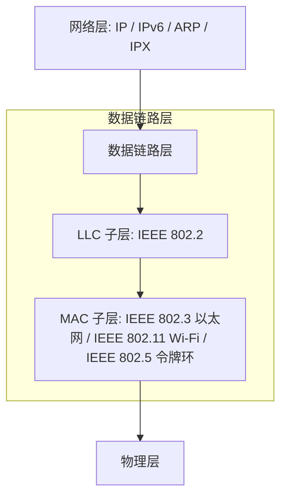
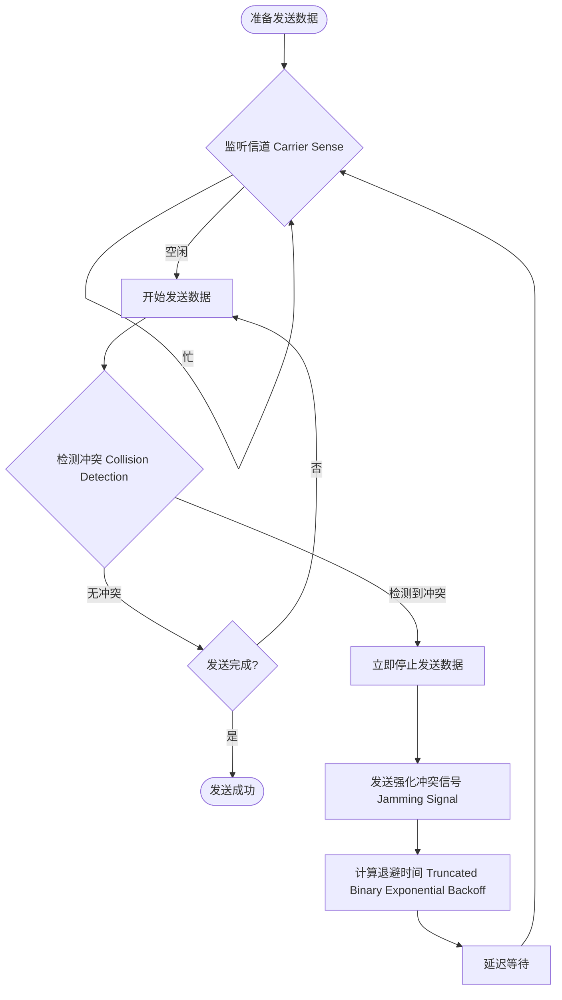

# 1.2.5.1 以太网帧

数据链路层作为 OSI 参考模型与 TCP/IP 体系结构中的关键纽带，承载着将不可靠的物理层比特流转换为可靠的、具有帧定界特性的二层数据交付服务的重任。以太网（Ethernet）作为当今有线局域网与数据中心网络中绝对统治性的二层技术，其帧格式的设计、介质访问控制的演进以及与高层协议的协同，是计算机网络底层机制的核心支撑。

本文将以以太网帧格式与数据链路层机制为核心，深入剖析其底层的物理限制、数学推导、协议规范、虚拟化扩展以及现代网络性能优化机理。

---

## 1. 数据链路层核心服务与信道控制

### 1.1 数据链路层的设计目标与分层服务

在 OSI 七层模型中，物理层负责在传输介质（如双绞线、同轴电缆、光纤等）上传输无结构的原始比特流。然而，物理信道是不可靠的，物理介质中广泛存在着热噪声（Thermal Noise）、散粒噪声（Shot Noise）、电磁干扰（EMI）、信号衰减、多径效应以及由于传输延迟引入的信号波形畸变。这些因素会直接导致物理层接收到的比特流中出现比特翻转（即“0”变成“1”或“1”变成“0”）、比特丢失或时钟失步（时钟抖动与偏移）。

数据链路层的主要设计目标，就是**在物理层提供的不可靠比特传输服务之上，通过规程与协议，为网络层提供一个点对点或多点之间无差错的帧级（Frame-level）数据交付服务**。为了实现这一目标，数据链路层必须提供以下四项核心服务：

1.  **帧定界（Framing）**：物理层传输的是连续的比特流，无法区分数据的边界。数据链路层必须通过特定的标志或机制，将比特流划分成一个个独立的“帧”，并能准确识别帧的起始与结束位置。
2.  **差错检测（Error Detection）**：通过在帧内添加冗余校验信息，使接收端能够检测出在传输过程中是否发生了比特差错。
3.  **差错控制（Error Control）**：对于检测到差错的帧，决定是丢弃并通知发送端重传（如具有确认机制的链路层），还是直接静默丢弃（如以太网），以确保交付给上层的数据是正确的。
4.  **流量控制（Flow Control）**：协调发送端与接收端之间的发送速率，防止发送端发送速率过快，导致接收端缓冲区溢出而丢包。

根据链路层对上述服务的实现深度，其服务类型可分为以下三类：
*   **无确认无连接服务（Unacknowledged Connectionless Service）**：源机器向目的机器发送独立的帧，目的机器接收到帧后不进行确认。如果因噪声丢失了帧，链路层不做恢复，重传职责交由高层（如传输层 TCP）。以太网即采用此服务。
*   **有确认无连接服务（Acknowledged Connectionless Service）**：每个发送的帧必须在规定的时间内得到接收端的确认（Ack），否则发送端将进行重传。该服务适用于高噪声信道，如 Wi-Fi (IEEE 802.11)。
*   **有确认面向连接服务（Acknowledged Connection-Oriented Service）**：发送端与接收端在传输数据前先建立逻辑连接，传输过程中对帧进行严格的编号和确认，保证帧不丢失、不重复、不乱序。

### 1.2 核心子层划分：LLC 与 MAC 的分工与历史背景

20 世纪 80 年代，IEEE 在制定 802 局域网标准系列时，面临着一个复杂多样且竞争激烈的市场。当时存在多种不同的局域网物理介质与拓扑结构，包括以太网（CSMA/CD 共享总线）、令牌环网（Token Ring, IEEE 802.5）、令牌总线网（Token Bus, IEEE 802.4）以及光纤分布式数据接口（FDDI）等。

为了让网络层协议（如 IP、DECnet、IPX 等）无需关心底层千差万别的局域网介质类型，并能实现高层的互操作性，IEEE 802 委员会决定将数据链路层划分为两个功能独立的子层：**逻辑链路控制子层（LLC, Logical Link Control）**与**介质访问控制子层（MAC, Media Access Control）**。



#### 1.2.1 逻辑链路控制子层（LLC, IEEE 802.2）
LLC 子层位于数据链路层的上半部分，直接与网络层对接。它的核心职责是**屏蔽底层物理介质的差异，向网络层提供统一的接口与服务访问点（SAP, Service Access Point）**。
*   LLC 使用 DSAP（目的服务访问点）和 SSAP（源服务访问点）来区分不同的网络层协议。例如，0x06 代表 IP 协议，0xE0 代表 Novell IPX。
*   LLC 提供了三种操作模式：I 型（无确认无连接）、II 型（面向连接的有确认）以及 III 型（无确认有连接）。这允许局域网在必要时在二层实现流控与重传。

#### 1.2.2 介质访问控制子层（MAC）
MAC 子层位于数据链路层的下半部分，直接与物理层交互。它的主要职责是**管理和控制对共享传输介质的访问权限（即解决“谁在什么时候可以发送数据”的问题），并负责物理寻址（MAC 地址）、数据帧的装配与拆卸以及差错校验**。

#### 1.2.3 历史演进与现代格局
在历史的竞争中，DEC、Intel 和 Xerox 联合提出的 **Ethernet II** 规范（即 DIX 规范）并没有像 IEEE 802.3 规范那样引入 LLC 子层，而是直接在 MAC 帧首部引入了一个 2 字节的 `Type` 字段来标识上层协议。

由于 TCP/IP 协议族的设计哲学倾向于“将复杂性留给端点（如传输层 TCP 负责流控和可靠性），保持中间网络和底层链路的极度精简”，Ethernet II 凭借其极低的开销和极高的高速转发效率，在与 IEEE 802.3/802.2 LLC 封装的竞争中大获全胜。在现代有线局域网和交换式以太网中，LLC 子层在 TCP/IP 数据传输中几乎已经完全淡出，高层 IP 数据包直接封装在 Ethernet II MAC 帧中运行。如今 LLC 主要仅用于一些遗留的局域网管理或环路控制协议（如生成树协议 STP、链路层发现协议 LLDP 等）。

---

### 1.3 共享介质访问控制机制：CSMA/CD

在交换机（Switch）诞生之前的早期以太网中，所有的主机都是通过同轴电缆（10BASE5 或 10BASE2）或集线器（Hub，物理上是星型拓扑，逻辑上仍是共享总线）连接在一起的。这种拓扑结构属于**共享介质网络（Shared Medium Network）**。在共享介质上，如果两个或多个节点同时发送电信号，它们的波形会在物理总线上叠加，产生严重的畸变与干扰，导致接收端完全无法识别，这被称为**碰撞/冲突（Collision）**。

为了解决多节点无序争用信道导致的碰撞问题，以太网设计了 **CSMA/CD（Carrier Sense Multiple Access with Collision Detection，带冲突检测的载波监听多路访问）** 协议。

#### 1.3.1 CSMA/CD 的基本工作原理
CSMA/CD 协议的核心逻辑可以总结为十六个字：**先听后发，边发边听，冲突停止，延迟重发**。



1.  **载波监听（Carrier Sense - 先听后发）**：节点在准备发送数据前，必须先监听总线上是否有其他信号在传输。
    *   以太网采用 **1-坚持 CSMA（1-persistent CSMA）** 策略：如果监听到信道忙，节点会持续监听，一旦发现信道变为空闲，则以 $100\%$ （概率 $p=1$）的概率立即发送数据。
    *   与之对比的策略还有：**非坚持 CSMA**（信道忙则随机等待一段时间再听）和 **p-坚持 CSMA**（信道空闲时以概率 $p$ 发送，以 $1-p$ 延迟到下一时隙）。1-坚持策略在低负载下延迟极小，但在高负载下容易引发大范围冲突。
2.  **冲突检测（Collision Detection - 边发边听）**：在数据发送过程中，节点必须持续监测物理介质上的信号状态。对于共享同轴电缆，发送节点会检测总线上的直流电压。若电压超过单个发送节点正常发送信号的阈值，则表明发生了电信号叠加，即发生了冲突。
3.  **冲突停止（Abort on Collision - 冲突停止）**：一旦检测到冲突，发送节点必须立即停止当前帧的发送，以避免继续无谓地占用和浪费宝贵的总线带宽。
4.  **强化冲突信号（Jamming Signal）**：停止发送后，节点会向总线发送一段 32 到 48 比特的特殊干扰信号（通常交替发送“1”和“0”），称为强化冲突信号（Jamming Signal）。目的是确保总线上的所有其他节点都能明确检测到这次冲突，从而立即丢弃它们正在接收的损坏数据帧碎片。
5.  **指数退避（Backoff - 延迟重发）**：冲突发生后，各个节点不能立即再次尝试发送，否则必定会引发二次碰撞。节点必须启动退避算法，计算一个随机的延迟时间，等待该时间耗尽后再重新进入“先听后发”的循环。

#### 1.3.2 争用期（Slot Time）与碰撞窗口的数学与物理推导
为什么发送端在发送数据时必须“边发边听”？它需要发送多久，才能确保这帧数据绝对没有发生碰撞？这就引入了**争用期（Slot Time）**的概念，也称**碰撞窗口（Collision Window）**。

设总线上物理距离最远的两个节点为 $A$ 和 $B$。信号在物理介质中的单向传播延迟为 $\tau$。

*   在时刻 $t=0$，信道空闲，节点 $A$ 开始向 $B$ 发送数据。
*   在时刻 $t = \tau - \epsilon$（$\epsilon$ 为一极小值，即 $A$ 发送的信号刚好还没有到达 $B$），节点 $B$ 准备发送数据。由于 $A$ 的信号尚未到达， $B$ 监听到信道空闲，于是开始发送。
*   在时刻 $t = \tau$， $A$ 的信号与 $B$ 的信号在物理介质上相遇并发生碰撞。
*   $B$ 几乎在碰撞发生的瞬间检测到波形畸变，立即停止发送。
*   但是，$B$ 产生的碰撞畸变波形要传回给 $A$。该波形传回 $A$ 同样需要时间 $\tau$。
*   因此，节点 $A$ 检测到碰撞的最迟时刻为 $t = 2\tau - \epsilon \approx 2\tau$。

```
时间轴演进：
t = 0:             A开始发送 -----------------------------------------------------> B(未收到)
t = τ - ε:         A信号接近B  --------------> [ B开始发送(由于尚未听到A) ]
t = τ:             碰撞发生于B端
t = 2τ:            A检测到碰撞 <-------------------------------------------------- 冲突信号传回
```

这意味着：**任何发送端在开始发送数据后，最长需要经过 $2\tau$（即信号在最远两端之间的往返时延）的时间，才能确认自己发送的帧是否与网络中的其他节点发生了冲突**。这个往返时间 $2\tau$ 就是“争用期”。如果在发送完 $2\tau$ 长度的数据后依然没有检测到冲突，就说明该帧的电信号已经铺满整条总线，其他所有节点都已监听到信道忙，后续的发送将绝对安全。

以经典以太网标准为例，对其争用期进行定量物理推导：
1.  **物理规格限制**：以太网（10BASE5）规定，单根同轴电缆的最大长度为 500 米。通过最多 4 个中继器（Repeater）连接 5 个网段，使得网络的最大物理跨度达到 $L_{\max} = 2500$ 米（即“5-4-3-2-1 规则”）。
2.  **电磁波传播速度**：电信号在同轴电缆中的传播速度 $v \approx 2 \times 10^8 \text{ m/s}$（大约为真空中光速的 $\frac{2}{3}$）。
3.  **单向理论时延**：$\tau_{\text{cable}} = \frac{2500 \text{ m}}{2 \times 10^8 \text{ m/s}} = 12.5\,\mu\text{s}$。
4.  **硬件与中继器延迟**：在实际网络中，中继器在对信号进行放大、整流和转发时，其内部电路会引入额外的处理时延；主机的收发器（Transceiver）也会带来物理开销。工程设计中，所有中继器和收发器的累加往返延迟大约为 $26.2\,\mu\text{s}$。
5.  **设计安全边界**：将物理介质延迟与硬件设备延迟相加，以太网设计规范最终确定单向最大延迟约为 $25.6\,\mu\text{s}$。
6.  **确定争用期（Slot Time）**：
    $$\text{Slot Time} = 2\tau = 2 \times 25.6\,\mu\text{s} = 51.2\,\mu\text{s}$$
7.  **换算为比特传输时间**：在速率为 $10 \text{ Mbps}$（即每秒发送 $10^7$ 比特）的以太网中， $51.2\,\mu\text{s}$ 时间内可以发送的比特数为：
    $$\text{Bits} = 10 \times 10^6 \text{ bit/s} \times 51.2 \times 10^{-6} \text{ s} = 512 \text{ bits}$$

这就是以太网的核心常数：**争用期为 512 比特时间（512 bit times）**。

#### 1.3.3 最短帧长为 64 字节的物理机制
有了争用期为 512 比特时间的结论，就可以直接推导出为什么以太网规定了“最短帧长为 64 字节”这一规则。

如果发送端发送的一个数据帧过短（例如只有 10 字节 = 80 比特），在 10 Mbps 的速率下，发送端只需要 $8\,\mu\text{s}$ 就将这个帧完全发送完毕，并关闭了冲突检测电路。如果在 $10\,\mu\text{s}$ 时，该帧在总线的远端与另一节点的信号相撞，冲突信号在 $20\,\mu\text{s}$ 时传回发送端。此时发送端由于早已发完数据、关闭了检测功能，会误以为发送成功。而接收端会收到一个被撕碎的、不完整的帧，通过 CRC 校验发现错误并将其丢弃。这就造成了帧的永久丢失，且发送端没有任何机制能感知到发生了这次碰撞。

为了避免这种严重漏洞，**以太网硬性规定：帧的发送持续时间必须大于等于争用期 $2\tau$**。
对于 10 Mbps 以太网，由于争用期为 512 比特，因此帧的长度至少必须为 512 比特。
将比特换算为字节：
$$\text{Min Frame Length} = \frac{512 \text{ bits}}{8 \text{ bits/Byte}} = 64 \text{ 字节}$$

也就是说，**以太网的最小帧长度为 64 字节**。如果上层交付的数据太短，MAC 子层必须在数据字段后面进行强制填充（Padding），使其整帧长度达到 64 字节。接收端网卡在物理层上，只要接收到一个长度小于 64 字节的帧，就会立刻判定该帧为冲突破损帧（也称“残存碎片帧”，Runt Frame）并直接予以静默丢弃。

#### 1.3.4 截断二进制指数退避算法（Truncated Binary Exponential Backoff）
当两个节点发生碰撞并停止发送后，它们需要通过退避算法来调度重新发送的时间，以最大程度避免再次碰撞。以太网采用的算法是**截断二进制指数退避算法**。其核心机制如下：

1.  **确定基本时间单位**：设定为以太网的争用期（Slot Time），即 512 比特时间。对于 10 Mbps 以太网为 $51.2\,\mu\text{s}$，对于 100 Mbps 以太网则为 $5.12\,\mu\text{s}$。
2.  **记录冲突次数**：设当前帧是第 $n$ 次尝试发送但遭遇了碰撞。
3.  **计算退避窗口指数 $k$**：
    $$k = \min(n, 10)$$
    当冲突次数 $n$ 小于等于 10 时，指数随之递增；当冲突次数大于 10 但小于 16 时，指数不再增长，锁定为 10。这称为“截断”。
4.  **产生随机数 $r$**：从离散的均匀分布集合中随机抽取一个整数 $r$：
    $$r \in \{0, 1, 2, 3, \dots, 2^k - 1\}$$
5.  **计算等待延迟时间 $T_w$**：
    $$T_w = r \times \text{Slot Time} = r \times 512 \text{ bit times}$$
6.  **尝试重发**：等待时间 $T_w$ 耗尽后，节点再次开始载波监听，准备重发。
7.  **放弃与报错**：如果一个帧连续尝试了 16 次重发（$n=16$）依然全部发生碰撞，算法终止。MAC 子层将彻底丢弃该帧，并向高层的网络层协议发送传输错误报告，由高层进行重传调度。

**退避机制的数学负反馈调节机理**：
当网络中的活动节点较少、网络空闲时，冲突次数 $n$ 极低（如 $n=1$）。此时 $k=1$， $r$ 只能在 $\{0, 1\}$ 中随机选择，等待时间为 0 或 $51.2\,\mu\text{s}$，能以极快的速度完成重发。
当网络发生严重拥堵、大量节点同时争用信道时，冲突频繁发生。多次碰撞会导致节点进入更高阶的退避阶段， $k$ 迅速变大。例如当 $n=10$ 时， $r \in \{0, \dots, 1023\}$，可选的时间跨度被极大地拉宽。通过将发送尝试在时间轴上均匀地离散摊平，算法自动降低了下一次尝试重发时的碰撞概率，实现了网络吞吐量在拥堵环境下的自适应自愈。

#### 1.3.5 全双工交换式以太网的诞生与 CSMA/CD 的退出
随着微电子技术和网络拓扑的演进，20 世纪 90 年代末，**以太网交换机（Ethernet Switch）** 彻底取代了集线器和同轴电缆。
交换机通过多端口的桥接和内部交换矩阵，将网络划分为若干个独立的物理段，每个端口都是一个独立的冲突域，这被称为**微段化（Micro-segmentation）**。

在全双工（Full-Duplex）以太网中，主机与交换机端口之间使用双绞线或光纤进行连接。其中，发送线对（Tx）和接收线对（Rx）在物理上完全独立。主机和交换机可以同时双向发送和接收信号，而不会发生任何电波重叠。
因此，**在全双工交换式以太网中，碰撞发生的概率为零，CSMA/CD 协议完全失去了存在的必要，冲突检测与随机退避机制被彻底停用**。尽管现代以太网卡与交换机端口在协商为半双工模式时仍然保留了 CSMA/CD 协议的向后兼容，但在绝大多数实际运行环境中，以太网已经蜕变为一个完全基于点对点光纤/双绞线全双工链路的包转发网络。

---

## 2. 以太网帧格式精细解析

### 2.1 两种主流格式的对比与演进

在以太网的历史演进中，存在两个被广泛记录且至今仍在使用的物理帧格式：**Ethernet II 帧格式**（又称 DIX 帧格式）和 **IEEE 802.3 帧格式**。

| 字段划分 (顺序从左至右) | Ethernet II (RFC 894 / TCP/IP 事实标准) | IEEE 802.3 (RFC 1042 / OSI 官方标准) |
| :--- | :--- | :--- |
| **物理层前导同步** | 7 字节前导码 (Preamble) + 1 字节 SFD | 7 字节前导码 (Preamble) + 1 字节 SFD |
| **目的 MAC 地址** | 6 字节 (Destination MAC) | 6 字节 (Destination MAC) |
| **源 MAC 地址** | 6 字节 (Source MAC) | 6 字节 (Source MAC) |
| **指示字段 (2 字节)** | **Type (协议类型)** | **Length (数据载荷长度)** |
| **上层多路复用封装** | 无，直接承载网络层 IP/ARP 数据 | 引入 802.2 LLC 头部 (3-4 字节) + SNAP 头部 (5 字节) |
| **数据载荷 (Payload)** | 46 ~ 1500 字节 | 38 ~ 1492 字节 (扣除 LLC/SNAP 开销) |
| **帧校验序列 (FCS)** | 4 字节 CRC-32 | 4 字节 CRC-32 |

#### 2.1.1 协议类型（Type）与数据长度（Length）的神奇兼容（0x0600 分界线）
早期，IEEE 802.3 规范将 Ethernet II 帧中的 `Type` 字段改为了 `Length` 字段。为了防止在同一物理网段中并存的这两种帧结构引发解析混乱，设计者们利用了一个极其巧妙的兼容方案——**0x0600 分界线**：

1.  以太网规范中，单帧所能承载的最大载荷（即最大传输单元 MTU）被限制为 1500 字节。换算成十六进制，即为 `0x05DC`。
2.  而 Ethernet II 的所有高层协议类型（Type），在设计分配时，其十六进制编码值全部被规定在 1536（十六进制为 `0x0600`）及以上。例如，IPv4 的 Type 值为 `0x0800`，ARP 的 Type 值为 `0x0806`，IPv6 的 Type 值为 `0x86DD`。
3.  网卡物理接收芯片在读取完目的 MAC 与源 MAC 地址后，会继续提取后面的两个字节的值 $V$。
    *   **若 $V \ge 1536$（即十六进制的 `0x0600`）**：则该字段被判定为 **Type**。该帧被识别为 Ethernet II 帧，接收端会根据此 Type 的值，直接将解封装后的数据交付给相应的网络层协议栈（如 IP 协议栈）。
    *   **若 $V \le 1500$（即十六进制的 `0x05DC`）**：则该字段被判定为 **Length**。该帧被识别为 IEEE 802.3 帧，接收端会根据此长度读取对应字节的数据载荷，并将其送往 802.2 LLC 子层进行后续处理。
    *   **若 $1500 < V < 1536$**：属于不合法区间，该帧被直接判定为错误帧并丢弃。

通过这一逻辑，以太网在不需要任何额外开销和控制开销的情况下，实现了两种帧在同一根物理介质上的完美共存与无缝识别。

#### 2.1.2 IEEE 802.3 的多路复用：LLC & SNAP 封装
因为 802.3 的第 13-14 字节被用作了 Length，导致它无法在 MAC 首部中声明高层承载的是何种协议。因此，它必须依靠 802.2 LLC 头部来进行多路复用。

传统的 802.2 LLC 头部定义如下：
*   **DSAP (Destination SAP, 1 字节)**
*   **SSAP (Source SAP, 1 字节)**
*   **Control (控制字段, 1 或 2 字节)**

但由于 DSAP 和 SSAP 只有 8 个比特，且其中包含奇偶控制和组地址控制，能支持的协议类型非常有限（仅 64 个），根本无法分配给日益膨胀的各种新型网络层协议。为此，IEEE 提出了 **SNAP（Subnetwork Access Protocol，子网访问协议）** 扩展机制：

当 DSAP 和 SSAP 的值均被固定设置为 `0xAA`，且 Control 字段的值被设置为 `0x03`（表示无编号信息帧）时，意味着该 LLC 报文后面紧跟着一个 5 字节的 SNAP 头部：
*   **OUI (Organizationally Unique Identifier, 3 字节)**：用来标识分配机构，若为 `0x000000` 则表示通用的以太网协议。
*   **Type (2 字节)**：与 Ethernet II 中的 Type 定义完全等价。

通过这种“套娃”封装，802.3/LLC/SNAP 帧得以传输 TCP/IP 数据，但这也付出了代价：
**多出了 8 字节的额外控制包头（3 字节 LLC + 5 字节 SNAP）**。这降低了有效载荷的吞吐率。因此，现代 TCP/IP 体系结构中，几乎所有的单播数据传输都直接采用 Ethernet II 帧格式。

---

### 2.2 Ethernet II 帧字段详解

以现代 TCP/IP 网络中最常见且也是最核心的 Ethernet II 帧为例，其字段的结构和物理实现细节如下：

```
+-------------------+-----------------+-----------------+-------------------+-------------------+-----------------+
|   Preamble        |      DMAC       |      SMAC       |   Type / Length   |  Data (Payload)   |     FCS         |
|   (7 Bytes) + SFD |    (6 Bytes)    |    (6 Bytes)    |     (2 Bytes)     | (46 - 1500 Bytes) |  (4 Bytes)      |
|   (1 Byte)      |                 |                 |                   |                   |                 |
+-------------------+-----------------+-----------------+-------------------+-------------------+-----------------+
|<--- 物理层同步 --->|<---------------------------- MAC 帧范围 (64 - 1518 字节) ---------------------------->|
```

#### 2.2.1 前导码（Preamble）与帧首定界符（SFD）
在 MAC 帧被放置到传输介质上之前，物理层芯片会在其头部加上 8 字节的同步信号。
*   **前导码（Preamble, 7 字节）**：每个字节的十六进制值均为 `0x55`。对应的二进制序列为 `10101010`。在物理介质上，这表现为一串规则的方波信号。物理层接收端（PHY）的锁相环电路（PLL）通过捕获这一交替变化的电平，来重建并锁定发送端的时钟频率，从而完成位同步（Bit Synchronization）。
*   **帧首定界符（SFD, Start of Frame Delimiter, 1 字节）**：其十六进制值为 `0xD5`，对应二进制二进制为 `10101011`。它与前导码的区别仅在于最后两个比特从“10”变成了“11”。这两个连续的“1”打破了原有的方波节奏，向接收端发出强烈的信号：时钟同步结束，下一个比特开始就是 MAC 帧的目的 MAC 地址首比特，即进入字节同步（Byte Alignment）状态。
*   **为什么不计入 MAC 帧长？**：前导码和 SFD 是纯粹的物理层（PHY）控制信号。当物理芯片读取完它们并建立好同步后，就会在将数据递交给 MAC 控制芯片之前，自动把这 8 字节剥离。因此，无论是操作系统的抓包软件（如 Wireshark、tcpdump），还是交换机的帧计数器，默认都无法看到前导码和 SFD。

#### 2.2.2 目的 MAC 地址与源 MAC 地址
各占 6 字节（48 比特）。它是数据链路层的二层物理寻址标识，其标准格式被称为 EUI-48。
每一张网卡在出厂时，其 MAC 地址就已经被硬烧录在网络适配器的非易失性存储器（如 EEPROM）中。

48 位的二进制 MAC 地址可以划分为两部分：
1.  **OUI (Organizationally Unique Identifier, 24 比特)**：前 3 字节，由 IEEE 注册管理机构统一向各硬件生产商收费分配，用来唯一标识设备厂商。
2.  **厂商自定义扩展 (24 比特)**：后 3 字节，由厂商自行分配，用于唯一标识具体的网卡产品。

在寻址逻辑上，MAC 地址的第 1 字节的最低有效位（LSB）和次低位具有特殊的路由机制指示意义：

```
MAC 地址第 1 字节结构 (8 bits)：
+---+---+---+---+---+---+---+---+
| 7 | 6 | 5 | 4 | 3 | 2 | U | I |
|   |   |   |   |   |   | / | / |
|   |   |   |   |   |   | L | G |
+---+---+---+---+---+---+---+---+
                              |
                              +--> I/G (Individual/Group) 位: 0-单播, 1-多播/组播
```

*   **I/G 位 (Individual/Group)**：
    *   **$0$**：表示**单播（Unicast）**地址。表示该帧只应该被网络中的某一个特定的单一节点接收。
    *   **$1$**：表示**多播/组播（Multicast）**地址。表示该帧可被网络中一组加入了该多播组的节点同时接收。
*   **U/L 位 (Universal/Local)**：
    *   **$0$**：表示**全球唯一管理（Universal Administered Address, UAA）**。这是出厂网卡的默认状态。
    *   **$1$**：表示**本地管理（Locally Administered Address, LAA）**。表示该地址被网络管理员或虚拟化软件覆盖篡改（例如虚拟机网卡的 MAC 地址生成）。

**多播 MAC 与 IP 多播的映射规则及缺陷**：
在 TCP/IP 中，IPv4 多播数据报（IP 地址范围为 `224.0.0.0` 至 `239.255.255.255`）封装在以太网帧中时，需要自动转换成二层多播 MAC 地址。
*   IANA 分配给 IPv4 多播的以太网 MAC 地址前缀为：`01-00-5E-00-00-00` 到 `01-00-5E-7F-FF-FF`。
*   由于这组前缀在 48 位中占用了前 24 位，且第 25 位被强制固定为 `0`，可用于映射的只有后面的 23 个比特。
*   而 IPv4 多播 IP 地址的后 28 位是组标识，映射时只能将 IP 地址的低 23 位直接复制到 MAC 地址的低 23 位。这导致有 $2^{28 - 23} = 2^5 = 32$ 个不同的 IPv4 多播 IP 地址会被映射到同一个以太网多播 MAC 地址上。
*   这种**32 对 1 的映射重叠**，是早期局域网交换机转发组播流时，由于 MAC 地址冲突，可能导致非意愿节点频繁接收并不得不由上层 CPU 丢弃无关组播数据的原因。
*   IPv6 多播则相对慷慨，其二层 MAC 前缀为 `33-33-00-00-00-00` 到 `33-33-FF-FF-FF-FF`。它将 IPv6 多播 IP 地址的低 32 位直接映射过去，重叠概率明显降低。

#### 2.2.3 类型字段（Type）
2 字节。用于指示以太网帧数据载荷中所封装的上层协议类型，起到了**二层向三层分流的多路分用器（Demultiplexer）**作用。接收端网卡硬件处理完 MAC 帧头后，会根据该字段，直接唤醒对应的内核协议栈处理函数。
常见协议的十六进制标识符如下：
*   `0x0800`：IPv4 数据报
*   `0x0806`：ARP（地址解析协议）报文
*   `0x86DD`：IPv6 数据报
*   `0x8100`：IEEE 802.1Q 标签帧（VLAN 标签）
*   `0x8847`：MPLS 单播流量
*   `0x88CC`：LLDP（链路层发现协议）
*   `0x88F7`：PTP（高精度时间同步协议）

#### 2.2.4 数据载荷（Data/Payload）
大小限制在 46 字节至 1500 字节之间。
*   **最大限制 1500 字节（MTU）**：这是在历史上的网络带宽（仅 10 Mbps）、昂贵的 SRAM 硬件缓冲区大小以及物理信道的误码率之间进行数学平衡所得出的折中值。如果单帧过长，一旦传输过程中发生任意 1 比特损坏，整帧丢弃并重传的物理代价太高；同时，网络节点发送长帧会过度霸占共享信道，导致其他节点的发送延迟无限增大。
*   **最小限制 46 字节**：这是由共享介质以太网中 CSMA/CD 最短帧长 64 字节的要求倒推出来的数学结果。
    $$\text{Payload}_{\min} = \text{Frame}_{\min} (64\text{B}) - \text{DMAC} (6\text{B}) - \text{SMAC} (6\text{B}) - \text{Type} (2\text{B}) - \text{FCS} (4\text{B}) = 46\text{字节}$$

#### 2.2.5 帧校验序列（FCS）与 CRC-32 的数学机理
以太网帧的尾部包含 4 字节的 FCS，它使用 **CRC-32 (32位循环冗余校验)** 对除了前导码和 SFD 以外的整个 MAC 帧的所有字段进行差错检测。

##### CRC-32 校验的数学与物理原理
CRC 校验将要传输的数据比特流视为一元多项式 $M(x)$ 的系数，在二进制有限域 $GF(2)$（即所有代数运算均不涉及进位和借位，加法与减法操作均等价于按位异或 $\oplus$ 运算）中进行模 2 除法运算。

1.  **约定生成多项式**：发送端和接收端预先约定一个特定的生成多项式 $G(x)$。以太网所采用的标准生成多项式为 IEEE 802.3 标准规定的：
    $$G(x) = x^{32} + x^{26} + x^{23} + x^{22} + x^{16} + x^{12} + x^{11} + x^{10} + x^{8} + x^{7} + x^{5} + x^{4} + x^{2} + x + 1$$
    其二进制系数表示为一个 33 位的二进制数：`1 0000 0100 1100 0001 0001 1101 1011 0111`（十六进制为 `0x104C11DB7`）。
2.  **发送端计算余数**：
    *   设待发送的 MAC 帧数据长度为 $m$ 比特，对应多项式 $M(x)$。
    *   将 $M(x)$ 乘以 $x^{32}$（即在待发送的比特流后面附加 32 个“0”），生成一个长度为 $m+32$ 的长多项式。
    *   在 $GF(2)$ 域中，用 $M(x) \cdot x^{32}$ 除以生成多项式 $G(x)$，得到余数多项式 $R(x)$：
        $$\frac{M(x) \cdot x^{32}}{G(x)} = Q(x) + \frac{R(x)}{G(x)}$$
        余数 $R(x)$ 的阶数必然低于 32，对应的二进制值即为一个 32 位（4 字节）的校验码。
    *   发送端将这 4 字节的校验码填充到帧尾的 FCS 字段中，正式发送。
3.  **接收端校验逻辑**：
    *   接收端收到该帧后，将包含 FCS 字段在内的完整帧（可表示为 $M(x) \cdot x^{32} \oplus R(x)$）在 $GF(2)$ 下除以相同的生成多项式 $G(x)$。
    *   若传输过程中没有发生比特差错，由于 $M(x) \cdot x^{32} \oplus R(x)$ 正好是 $G(x)$ 的整数倍，除法运算得到的余数必须**完全为零**。
    *   若余数不为零，说明该帧在传输时有比特位发生了翻转。

##### 链路层的静默丢弃行为
当接收端网卡硬件检测到 CRC 校验失败时，它会执行**静默丢弃（Silent Discard）**机制。
*   网卡硬件不会向发送端发出任何否定确认（NACK）报文，因为以太网二层不提供确认重传机制。
*   网卡也不会向内核 CPU 报告中断或者报错，而是直接将网卡 FIFO 接收队列中的该帧物理内存回收。
*   这种静默丢弃避免了将低级差错引入昂贵的操作系统内核，彻底贯彻了网络系统设计的端到端原则：**低层只做高效的数据管道与尽力而为（Best-effort）的数据检错，可靠交付的控制逻辑应当交由三层 IP 控制的 ICMP 机制或四层 TCP 的确认/滑动窗口/重传机制去闭环实现**。

##### C 语言实现：基于查表法（Lookup Table）计算以太网帧 CRC-32
在软件仿真或者嵌入式硬件中，如果直接进行比特级的模 2 移位除法，效率极低（每次循环处理 1 比特，耗费大量 CPU 周期）。在工程实现中，通常采用**以字节为单位的查表法（Byte-wise Lookup Table）**，将计算效率提升 8 倍。

以下是用 C 语言编写的以太网标准 CRC-32 计算代码实现：

```c
#include <stdio.h>
#include <stdint.h>
#include <stddef.h>

// 以太网 CRC-32 经典反转多项式: 0xEDB88320 (IEEE 802.3 规定多项式 0x04C11DB7 的位反转值)
#define ETHERNET_CRC32_POLY 0xEDB88320U

static uint32_t crc32_table[256];
static int table_initialized = 0;

// 初始化 CRC-32 查找表
void init_crc32_table(void) {
    for (uint32_t i = 0; i < 256; i++) {
        uint32_t crc = i;
        for (int j = 0; j < 8; j++) {
            if (crc & 1) {
                crc = (crc >> 1) ^ ETHERNET_CRC32_POLY;
            } else {
                crc >>= 1;
            }
        }
        crc32_table[i] = crc;
    }
    table_initialized = 1;
}

// 计算给定数据的以太网 CRC-32 校验值
uint32_t calculate_ethernet_crc32(const uint8_t *data, size_t length) {
    if (!table_initialized) {
        init_crc32_table();
    }
    
    // 以太网 CRC 计算的初始值规定为 0xFFFFFFFF
    uint32_t crc = 0xFFFFFFFFU;
    
    for (size_t i = 0; i < length; i++) {
        uint8_t table_index = (uint8_t)((crc ^ data[i]) & 0xFF);
        crc = (crc >> 8) ^ crc32_table[table_index];
    }
    
    // 最终输出需要按位取反
    return crc ^ 0xFFFFFFFFU;
}

// 模拟以太网帧的二层结构体定义 (取消编译器字节对齐填充，确保紧凑排列)
#pragma pack(push, 1)
struct ethernet_frame {
    uint8_t  dest_mac[6];
    uint8_t  src_mac[6];
    uint16_t type;
    uint8_t  payload[46]; // 假定一个最小填充载荷
    uint32_t fcs;
};
#pragma pack(pop)

int main(void) {
    struct ethernet_frame frame = {
        .dest_mac = {0x00, 0x11, 0x22, 0x33, 0x44, 0x55},
        .src_mac  = {0x00, 0xaa, 0xbb, 0xcc, 0xdd, 0xee},
        .type     = 0x0008, // 网络序表示 0x0800 (IPv4)
        .payload  = {0},
        .fcs      = 0
    };
    
    // 计算前 14 字节头部 + 46 字节数据载荷的总 CRC
    size_t data_len = offsetof(struct ethernet_frame, fcs);
    uint32_t calculated_fcs = calculate_ethernet_crc32((const uint8_t *)&frame, data_len);
    
    frame.fcs = calculated_fcs;
    printf("Calculated Frame FCS: 0x%08X\n", frame.fcs);
    return 0;
}
```

---

## 3. 扩展帧与虚拟局域网 VLAN (IEEE 802.1Q)

### 3.1 虚拟局域网 VLAN 的引入背景与逻辑隔离

在传统的二层以太网中，所有的主机都处于同一个物理广播域（Broadcast Domain）内。当网络规模扩大时，以太网会面临两个严峻的挑战：
1.  **广播风暴（Broadcast Storm）**：ARP 请求、DHCP 发现报文以及各种局域网发现协议，都是以广播形式发送的。在大型网络中，成千上万台主机会导致广播包呈指数级增长，消耗宝贵的链路带宽与主机的 CPU 中断资源。
2.  **安全隔离局限**：所有的网络流量在二层都可以被轻易窃听或跨部门横向渗透，财务、研发、外部访客等部门无法在物理链路上进行逻辑安全分区。

传统的做法是使用路由器划分不同的物理子网，但这缺乏灵活性且成本高昂。**VLAN（Virtual Local Area Network，虚拟局域网）** 技术应运而生。它允许网络管理员在不需要改变物理拓扑的情况下，通过软件配置，将物理局域网划分成多个逻辑上的、完全隔离的虚拟广播域，彻底控制广播泛滥并提升二层安全性。

---

### 3.2 IEEE 802.1Q 封装格式与 4 字节 VLAN Tag 结构

为了让局域网交换机能够在同一根物理链路（尤其是交换机与交换机之间的 Trunk 链路）上传输多个不同 VLAN 的流量，并能准确区分它们，IEEE 制定了 **IEEE 802.1Q** 标准。

802.1Q 标准通过在以太网帧的**源 MAC 地址字段与类型/长度字段之间**，强行插入一个 **4 字节（32 比特）的 VLAN Tag** 来修饰原有的以太网帧结构。

```
带有 802.1Q 标记的以太网帧结构：
+-------+-------+--------------------+-------+-------------------+-------+
| DMAC  | SMAC  |    VLAN Tag        | Type  |  Data (Payload)   |  FCS  |
| (6B)  | (6B)  |     (4 Bytes)      | (2B)  | (46 - 1500 Bytes) | (4B)  |
+-------+-------+--------------------+-------+-------------------+-------+
                 |
                 v 4字节标签内部精细划分:
                 +-----------------------+---------+-----+-----------------------+
                 |     TPID (16 bits)    | PCP (3) | DEI |     VLAN ID (12)      |
                 |     0x8100            | (Pri)   | (1) |     (VID)             |
                 +-----------------------+---------+-----+-----------------------+
```

这 4 个字节的 VLAN Tag 内部被精细地划分为以下四个核心字段：

#### 3.2.1 TPID (Tag Protocol Identifier, 标签协议标识符, 16 比特)
*   **固定取值**：`0x8100`。
*   当交换机或主机的网卡在读取完源 MAC 地址后，发现随后的两个字节为 `0x8100` 时，它就会判定此帧不是普通的以太网帧，而是一个**带有 802.1Q VLAN 标签的扩展帧**。原本位于此处的上层协议 `Type` 字段，被向后平移了 4 个字节。

#### 3.2.2 PCP (Priority Code Point, 优先级代码点, 3 比特)
*   **取值范围**：$0$ ~ $7$。
*   又被称为 **Class of Service (CoS)**。它定义了该帧在传输过程中的二层业务优先级。3 个比特可表达 8 种优先级级别。
*   当交换机发生拥塞时，其内部的硬件排队机制（如 SP 绝对优先级队列算法、WRR 加权轮询算法、WFQ 加权公平队列算法）会读取该字段。高 PCP 值的帧（如 VoIP 实时语音流、关键业务数据）会被优先发送，而低 PCP 值的帧（如 FTP 文件传输）则在队列中排队甚至被丢弃。这实现了二层的服务质量（QoS）控制。

#### 3.2.3 DEI (Drop Eligible Indicator, 丢弃资格指示器, 1 比特)
*   **历史背景**：在老旧标准中，该位被称为 **CFI（Canonical Format Indicator, 规范格式指示器）**，主要用于兼容令牌环网，以太网中固定为 `0`。
*   **现代功能**：在现代以太网交换中，此位被定义为 **DEI**。当网络发生严重拥塞时，若该位被置为 `1`，表明该帧具有较高的丢弃资格，交换机可以优先将其丢弃，从而保护那些 DEI 为 `0` 的核心流量。

#### 3.2.4 VID (VLAN Identifier, VLAN 标识符, 12 比特)
*   **取值范围**：$0$ ~ $4095$。
*   用于唯一标识该数据帧所属的虚拟局域网。
*   **保留值与可用范围**：
    *   `0`：保留。用于表示该帧不携带 VLAN ID，但携带 802.1p 优先级的场景（即 Priority-tagged frame）。
    *   `4095` (十六进制为 `0xFFF`)：保留。用于系统级通告或测试。
    *   **有效 VID 范围**：$1$ ~ $4094$。这意味着一个以太网二层网络中最多只能划分 $4094$ 个逻辑隔离的虚拟局域网。

---

### 3.3 VLAN 标记对以太网帧结构与网络设备处理的影响

#### 3.3.1 最大帧长度变化
插入 4 字节的 VLAN Tag 后，以太网的最大物理帧长度从原本的 1518 字节扩展到了 **1522 字节**（不含前导码和 SFD）：
$$\text{Max Frame Length} = \text{DMAC}(6\text{B}) + \text{SMAC}(6\text{B}) + \text{VLAN Tag}(4\text{B}) + \text{Type}(2\text{B}) + \text{Payload}(1500\text{B}) + \text{FCS}(4\text{B}) = 1522\text{字节}$$

在 802.1Q 诞生初期，大量老旧的非智能交换机或集线器芯片的物理接收窗口硬性死锁在 1518 字节。当它们在 Trunk 链路上接收到 1522 字节的 802.1Q 标签帧时，会将其判定为“超大帧（Baby Giant Frame）”而直接丢弃。现代网络设备从硬件层面完全支持 1522 字节甚至更大的帧长。

#### 3.3.2 交换机端口类型与 Tag 操作逻辑
二层交换机内部通过 ASIC/FPGA 芯片在报文转发时对 VLAN 标签进行增删。常见的端口类型及其对 Tag 的处理策略如下：

*   **Access 端口（接入端口）**：用于连接终端主机（主机通常不识别 Tag）。
    *   **接收帧**：当 Access 端口收到一个**不带 Tag** 的普通帧时，交换机会强行为其打上该端口默认的 VLAN ID 标签（称为 PVID），然后放入交换机内部进行二层交换。若收到带 Tag 的帧且 Tag 与 PVID 不同，则直接丢弃。
    *   **发送帧**：当交换机将数据帧从 Access 端口发送出去给终端主机时，会**剥离（Untag）** 4 字节的 VLAN Tag，还原为标准 Ethernet II 帧发送给主机。
*   **Trunk 端口（干道端口）**：用于交换机与交换机、或交换机与路由器之间的互联。
    *   **接收帧**：收到带 Tag 的帧时，检查其 VID 是否在允许通过的 VLAN 列表中。如果在，则保留 Tag 予以转发；如果不在，则丢弃。收到不带 Tag 的帧时，为其打上该端口的 PVID 标签。
    *   **发送帧**：发送帧时，若帧的 VID 与 Trunk 端口的 PVID 相同，则**剥离** Tag 发送（通常针对 Native VLAN）；若不同且在允许通过列表中，则**保留**原有 Tag 发送。
*   **Hybrid 端口（混合端口）**：
    *   综合了 Access 和 Trunk 的特点，支持通过配置列表精细控制哪些 VLAN 帧在发送时保留 Tag，哪些剥离 Tag。

---

### 3.4 双重 VLAN 标记 QinQ (IEEE 802.1ad)

随着电信级城域网（Metro Ethernet）和公有云多租户网络的发展，4094 个 VLAN 标识符在面对成千上万个企业客户时显得杯水车薪。为了解决二层扩展空间不足的问题，IEEE 802.1ad 标准提出了 **QinQ（即 VLAN Stack，VLAN 堆叠）** 技术。

```
QinQ 帧结构：
+------+------+---------------+---------------+------+-----------+------+
| DMAC | SMAC |  Outer S-Tag  |  Inner C-Tag  | Type |  Payload  | FCS  |
| (6B) | (6B) |   (4 Bytes)   |   (4 Bytes)   | (2B) | (Payload) | (4B) |
+------+------+---------------+---------------+------+-----------+------+
               |               |
               |               +-> TPID: 0x8100 (客户内网 VLAN)
               v
               TPID: 0x88A8 / 0x9100 (运营商骨干网 VLAN)
```

QinQ 技术在原有 802.1Q 帧的基础上，在源 MAC 地址前再打上一层新的 802.1Q 标记：
1.  **内层 Tag (C-Tag, Customer Tag)**：TPID 固定为 `0x8100`，表示用户私网内部划分的 VLAN ID。
2.  **外层 Tag (S-Tag, Service Tag)**：TPID 通常为 `0x88A8`（IEEE 802.1ad 规定）或某些旧设备私有标准的 `0x9100` / `0x9200`，代表运营商骨干网分配给该用户的 VLAN ID。

*   **二层标识空间扩展**：QinQ 提供了 $4096 \times 4096 \approx 1600$ 万个逻辑隔离的二层通道，这极大地满足了运营商在二层城域网中对不同企业专线流量进行隔离的需求。
*   **最大帧长进一步增大**：双重标记的引入使得帧长度再次累加 4 字节，达到 **1526 字节**，网络设备的 MTU 设置必须相应增大以避免分片或丢弃。

---

## 4. 巨型帧 (Jumbo Frames) 机制

### 4.1 高带宽下的 CPU 中断风暴与协议开销

从 20 世纪 80 年代的 10 Mbps、90 年代的 100 Mbps Fast Ethernet，到后来的 1 Gbps、10 Gbps (万兆)、40 Gbps 甚至当今主流的 100 Gbps 乃至 400 Gbps 超高速网络，物理传输速率提升了数万倍。然而，**以太网 1500 字节的 MTU 限制却维持了数十年未变**。在高带宽时代，这一历史包袱给主机的 CPU 带来了灾难性的网络 I/O 压力。

#### 4.1.1 10Gbps/40Gbps/100Gbps 线速下的包转发率（PPS）与中断风暴推导
为了衡量网络数据的包吞吐密度，我们需要计算**包转发率（PPS, Packets Per Second）**。
物理层传输一个以太网帧时，不仅包含 MAC 帧本体，还必须包含：
*   前导码与 SFD：$8$ 字节（64 比特）
*   帧间隙（IPG, Inter-Packet Gap）：为了让接收端能对两帧进行物理区隔和电路复位，以太网规定帧与帧之间必须留有至少 12 字节（96 比特时间）的静默无信号期。

因此，一个标称载荷为 1500 字节的以太网帧，在物理链路上实际占用的比特空间为：
$$\text{Physical Frame Size} = 1500(\text{Payload}) + 18(\text{Header/FCS}) + 8(\text{Preamble/SFD}) + 12(\text{IPG}) = 1538 \text{ 字节} = 12304 \text{ 比特}$$

在不同的物理线速下，满负荷传输此物理大小的帧时，计算其极限包转发率：

1.  **10 Gbps 物理链路**：
    $$\text{PPS}_{10\text{G}} = \frac{10 \times 10^9 \text{ bit/s}}{12304 \text{ bits/packet}} \approx 812,743 \text{ pps} \approx 81\text{ 万个包/秒}$$
2.  **40 Gbps 物理链路**：
    $$\text{PPS}_{40\text{G}} = \frac{40 \times 10^9 \text{ bit/s}}{12304 \text{ bits/packet}} \approx 3,250,975 \text{ pps} \approx 325\text{ 万个包/秒}$$
3.  **100 Gbps 物理链路**：
    $$\text{PPS}_{100\text{G}} = \frac{100 \times 10^9 \text{ bit/s}}{12304 \text{ bits/packet}} \approx 8,127,438 \text{ pps} \approx 812\text{ 万个包/秒}$$

**中断风暴（Interrupt Storm）与系统开销分析**：
在传统网卡驱动架构中，网卡每接收到一个物理帧，就会向 CPU 发送一个硬件中断（MSI-X/MSI）。CPU 收到中断后暂停当前正在运行的任务，保存现场，切换到中断服务程序（ISR），从网卡 DMA 缓冲区中拷贝数据包至内存中，并调用网络协议栈进行逐层解析（以太网头 $\to$ IP 头 $\to$ TCP 头 $\to$  socket 缓冲区）。

*   **CPU 耗时**：现代操作系统处理一次硬件中断加软中断的整体上下文切换延迟在几微秒级。如果在 10 Gbps 线下，每秒产生 81 万次中断，CPU 即使不处理任何用户业务逻辑，其全部算力也将彻底淹没在中断处理中。
*   **内存与缓存开销**：由于包尺寸小，CPU 需要频繁地从主存中分配和释放 `sk_buff`（Linux 内核数据包容器结构），造成严重的内核内存分配器抖动，且高频的中断会导致 CPU 的 L1/L2 Cache 频繁失效（Cache Miss），内存总线带宽极易饱和。

#### 4.1.2 现代硬件优化技术的协同与局限性
为了缓解中断风暴，业界引入了多种网卡层面的硬件卸载与聚合技术：
*   **中断聚合（Interrupt Coalescing/Moderation）**：网卡不再“每包必报”，而是累积一定数量的包（如 32 个）或者等待一个固定的微秒时间段后再统一向 CPU 触发一次中断。这降低了中断频率，但会增加数据包的传输延迟。
*   **RSS（Receive Side Scaling，接收端多队列分发）**：利用网卡多队列硬件，将流量分发给 CPU 的不同核心，避免单核过载。
*   **TSO（TCP Segmentation Offload）与 LRO/GRO（Large Receive/Generic Receive Offload）**：
    *   **TSO（发送端）**：操作系统协议栈向下发送一个高达 64KB 的超级 TCP 大包，在越过 IP 层后，由网卡物理硬件芯片自动将其切割成若干个 1500 字节的物理帧发送。
    *   **LRO/GRO（接收端）**：网卡硬件或网络驱动层在接收到多个连续的、属于同一个 TCP 连接的 1500 字节帧时，在内存中将它们的载荷拼接成一个超级大包，只向 CPU 协议栈上报一次。

**核心痛点依然存在**：虽然 TSO/LRO 减少了主 CPU 在网络栈中的上下文切换，但**在物理网段和传输链路中，数据包依然是以 1500 字节的微小颗粒度被频繁拆分和拼装传输的**。在交换机交换矩阵中，海量的物理包头解析工作（ASIC 的包头查表转发）依然维持在 812 万 pps（100G）的恐怖高位，且 TSO 拆包与 GRO 拼包本身的 CPU/网卡硬件硬件算力损耗仍然十分显著。

---

### 4.2 Jumbo Frames 的规格与优化原理

为了在根本上解决高吞吐网络下的传输瓶颈，**巨型帧（Jumbo Frames）** 机制应运而生。它允许将以太网的 MTU 限制从 1500 字节直接扩展至通常的 **9000 字节**。

#### 4.2.1 为什么偏偏选择 9000 字节？
网络界并没有像 IEEE 802 那样为 Jumbo Frames 制定一个严格的国际通用标准，但各大网络厂商（如 Cisco、Juniper、Intel）经过长期的工程实践和理论推导，达成了将 **9000 字节作为 Jumbo 帧事实标准**的默契。这背后的物理与数学约束如下：

1.  **CRC-32 的数学纠错极限**：
    *   以太网所采用的 CRC-32 校验码，在检测传输差错时，其漏检率（将有错的帧误认为正确的概率）与待校验的数据块大小成正比。
    *   根据数学理论推导与检错概率模型分析，当数据包长度在 **12000 字节以内**时，CRC-32 能够保证极高的多比特错和突发差错检测率。一旦数据长度超过 12000 字节，CRC-32 的漏检率会急剧上升。因此，9000 字节是一个非常安全的、在检错可靠性与大包优势之间的数学上限折中。
2.  **以太网交换机 Buffer 大小的限制**：
    *   交换机接口芯片内部用于缓存报文的 Packet Buffer（通常是昂贵的片上 SRAM）是按 Cell 分配的。过大的帧长会占用过多的 Buffer 空间，导致在网络拥塞时少量的 Jumbo 帧就将 Buffer 耗尽，引发严重的尾部丢包（Tail Drop）。
3.  **排队延迟（Serialization Delay）控制**：
    *   在低速电缆上，发送超长帧会导致排队延迟过大，阻塞后续的实时流量。在高速网络下，这一影响被削弱，但仍需控制在安全范围。

#### 4.2.2 物理层带宽利用率与 CPU 效率的量化计算对比

下面我们量化对比传统 1500 字节 MTU 与 9000 字节 Jumbo 帧在 10 Gbps 线路上的物理传输效率和 CPU 开销。

##### 1. 带宽净荷比（Payload-to-Header Ratio）量化推导

*   **传统 1500 字节 MTU 帧**：
    *   用户应用层通过 TCP 发送数据，TCP 报头为 20 字节，IP 报头为 20 字节。
    *   有效应用层数据（即 TCP MSS）：$1500 - 20 - 20 = 1460$ 字节。
    *   物理层实际消耗：$1500 + 18(\text{二层头尾}) + 8(\text{前导}) + 12(\text{IPG}) = 1538$ 字节。
    *   **物理层应用载荷效率**：
        $$\eta_{\text{std}} = \frac{1460 \text{ 字节}}{1538 \text{ 字节}} \approx 94.93\%$$
*   **9000 字节 Jumbo 帧**：
    *   有效应用层数据：$9000 - 20 - 20 = 8960$ 字节。
    *   物理层实际消耗：$9000 + 18 + 8 + 12 = 9038$ 字节。
    *   **物理层应用载荷效率**：
        $$\eta_{\text{jumbo}} = \frac{8960 \text{ 字节}}{9038 \text{ 字节}} \approx 99.14\%$$
    *   **结论**：启用 Jumbo 帧后，仅因为剥离了冗余的物理前导码、帧间隙和二/三/四层包头，物理介质传输效率就**直接提升了超过 $4.2\%$**。在万兆及更高速的数据中心中，这能节省巨大的物理带宽开销。

##### 2. 包转发率与中断频率降低幅度的量化

在 10 Gbps 线速下满载传输时：
*   **1500 字节 MTU 帧**：物理 PPS 为 $812,743 \text{ pps}$。
*   **9000 字节 Jumbo 帧**：
    $$\text{PPS}_{\text{jumbo}} = \frac{10 \times 10^9 \text{ bit/s}}{9038 \times 8 \text{ bits/packet}} \approx 138,304 \text{ pps}$$
*   **对比分析**：
    $$\text{中断和包头处理次数降幅} = \frac{812,743 - 138,304}{812,743} \approx 82.98\%$$

这意味着，主机的 CPU 在解析包头、分配内核内存描述符、响应网卡中断等核心开销上，**开销直降 $83\%$**。大量的 CPU 算力得以从琐碎的二层包解析中解放出来，用于应用层的核心计算。

---

### 4.3 现代数据中心与局域网内的网络性能优化机理

Jumbo Frames 在现代企业局域网、云计算中心以及高性能计算（HPC）网络中扮演着不可替代的角色。

#### 4.3.1 存储局域网（SAN）与分布式存储系统
在数据中心内，存储协议（如基于 TCP/IP 的 **iSCSI**、基于以太网的 **FCoE**、面向网络的 **NFS**、**SMB** 以及分布式存储系统如 **Ceph**、**GlusterFS** 的内部 OSD 间数据复制流量）具有典型的“高吞吐、大块读写”特征。
*   存储网络在读写磁盘块时，一次性写入的数据往往是 4KB、8KB 乃至上兆字节。
*   在 1500 字节 MTU 下，一个普通的 8KB 磁盘写操作会被强行分割成 6 个 IP 报文，带来 6 次网络封包与解包开销。
*   在 9000 字节 Jumbo 帧下，8KB 的写入操作只需**封装进一个 Jumbo 帧**即可一气呵成。这降低了存储服务器的 CPU 负载，使磁盘 I/O 和网络 I/O 达到了高度的颗粒度对齐，吞吐量可提升 $30\%$ 至 $50\%$。

#### 4.3.2 覆盖网络（Overlay Network / VxLAN 封装）
在云计算虚拟化网络中，为了实现租户的逻辑隔离与跨物理子网迁移，网络广泛采用了 **VxLAN**、**Geneve** 或 **NVGRE** 等三层隧道封装协议。

以最普遍的 **VxLAN 封装** 为例，它要求在虚拟机发送的标准以太网帧外部，包裹上如下包头：
$$\text{Outer Eth Header}(14\text{B}) + \text{Outer IP Header}(20\text{B}) + \text{UDP Header}(8\text{B}) + \text{VxLAN Header}(8\text{B}) = 50\text{字节}$$

```
VxLAN 封装后的报文结构：
+-------------+-------------+------------+-------------+------------------------------------+
| 外层 Eth 头 | 外层 IP 头  | 外层 UDP 头| VxLAN 头部  | 原始以太网帧                       |
| (14 Bytes)  | (20 Bytes)  | (8 Bytes)  | (8 Bytes)   | (包含 DMAC/SMAC/IP/Payload 共1514B)|
+-------------+-------------+------------+-------------+------------------------------------+
|<----------------------- 额外包头开销 50 字节 ----------------------->|<------- 虚拟机原始包 1500B MTU -------->|
```

*   如果虚拟机发送的原始以太网帧是标准的 1500 字节，经过 VxLAN 封包后，物理网卡发送的实际帧长将达到 **1550 字节**。
*   如果物理网络（Underlay）的交换机和物理网卡依然维持 1500 字节的 MTU 限制，物理网卡就无法直接发送这个 1550 字节的包。
*   此时，物理网卡只有两种极其低效的选择：
    1.  **物理网卡/协议栈在 Underlay IP 层进行 IP 分片（Fragmentation）**：将该包撕开为两个 IP 包传输。这会导致接收端重组时 CPU 极度过载，且一旦丢失其中一个分片，整包就必须重传，这会使网络吞吐崩溃。
    2.  **向虚拟机发送 ICMP "Fragmentation Needed" 报文**：强制将虚机的 MTU 降低到 1450 字节。虽然避免了 Underlay 分片，但由于虚拟机发送的包变小，虚拟网络的性能开销进一步增加。
*   **解决方案**：在物理数据中心网络（Underlay）中，**全面将物理交换机和网卡端口的 MTU 设为 9000 字节的 Jumbo Frames**。这样，1550 字节的 VxLAN 包在 Underlay 物理链路上就能畅通无阻，避免了分片，彻底释放了云网络的性能。

---

### 4.4 部署 Jumbo Frames 的挑战与“网络黑洞”

尽管 Jumbo 帧能带来极高的性能红利，但由于其缺乏统一的强制性二层标准，且互联网物理节点异构性极大，它的部署被严格限制在**受控的局部网络（如局域网、数据中心内部、专线承载网）**中。在广域网（WAN）和互联网中盲目启用会带来灾难性的后果。

#### 4.4.1 MTU 不一致引起的“网络黑洞”（MTU Black Hole）
当一条链路上的发送端主机和接收端主机都配置了 9000 字节的 MTU，但在它们之间的传输路径上，只要存在**任意一台不支持 Jumbo 帧的普通二层交换机，或者由于配置失误导致某个接口的 MTU 被设为了 1500 字节**，就会产生“MTU 黑洞”。

1.  **握手阶段**：在 TCP 连接建立时，双方发送 SYN 报文（包长极小，通常小于 100 字节），顺利越过中间所有的交换机，三次握手成功。
2.  **大数据传输阶段**：发送端开始向接收端发送 9000 字节的 TCP 大包。
3.  **丢包点**：大包到达中间那台 MTU 为 1500 的二层交换机。由于**以太网二层没有分片机制**（只有三层 IP 才能分片，且交换机作为二层设备，不解析 IP 头更不会执行 IP 分片），交换机面对超长帧，别无选择，**只能将其当作非法 Oversized 帧直接丢弃**。
4.  **死锁表现**：发送端迟迟收不到接收端的 TCP 确认报文（ACK），触发 TCP 超时重传，再次发送 9000 字节大包，再次被丢弃。用户的直观体验是：TCP 连接能建立，小包数据（如 ping、控制台敲指令）能通，但一旦传输大块数据（如复制文件、查看大网页），网络就会瞬间僵死，连接超时中断。这就是典型的 **MTU 黑洞** 故障。

```
MTU黑洞示意图：
[ Host A (MTU=9000) ] --- 9000B ---> [ Switch A (MTU=9000) ] --- 9000B ---> [ Switch B (MTU=1500) ] -X- (丢弃) -X- [ Host B (MTU=9000) ]
```

#### 4.4.2 PMTUD 机制的局限性与 ICMP 过滤冲突
为了解决跨网关 MTU 不一致的问题，IP 协议设计了 **PMTUD（Path MTU Discovery，路径 MTU 发现）** 机制。

*   **工作流程**：发送端发送 IP 数据报时，在 IP 头部将 **DF (Don't Fragment，不可分片)** 标志位置为 `1`。如果该报文在越过三层网关/路由器时，路由器的出口 MTU 较小，由于 DF=1，路由器无法对其分片，只能将该包丢弃，并向发送端回送一个 ICMP 差错控制报文：**ICMPv4 Type 3 Code 4 (Destination Unreachable: Fragmentation Needed and DF Set)**，并在该 ICMP 报文中带上自己的出口 MTU 值。发送端收到后，自动调小本地的发送 MTU 值，重新封包发送，直至找到一条通往目的地的端到端最小 MTU 路径。
*   **PMTUD 失败导致的黑洞**：在现代企业内网或互联网中，系统管理员为了防范 DDoS 扫描攻击，经常会在防火墙、ACL 安全组中**简单粗暴地将所有 ICMP 报文全部封杀过滤**。这直接导致发送端永远接收不到 ICMP Type 3 Code 4 报文，PMTUD 机制彻底瘫痪，网络再次陷入“TCP 能握手但大数据传输挂死”的黑洞深渊。

#### 4.4.3 为什么互联网和广域网（WAN）拒绝 Jumbo Frames
互联网历经数十年的演进，至今其主干网依然将 1500 字节作为通用的 MTU 上限。不建议在 WAN 中部署 Jumbo 帧的原因包括：

1.  **排队时延与抖动（Serialization & Jitter）**：
    *   设在一条速率为 $10 \text{ Mbps}$ 的广域网专线链路上。
    *   发送一个 1500 字节的帧，传输耗时（串行化延迟）：
        $$t_{\text{1500}} = \frac{1500 \times 8 \text{ bits}}{10 \times 10^6 \text{ bps}} = 1.2\,\text{ms}$$
    *   发送一个 9000 字节的 Jumbo 帧，传输耗时：
        $$t_{\text{9000}} = \frac{9000 \times 8 \text{ bits}}{10 \times 10^6 \text{ bps}} = 7.2\,\text{ms}$$
    *   如果此时网络中混杂着敏感的 VoIP 语音电话（语音包通常极小，如 60 字节），一旦它排在一台正在发送 9000 字节 Jumbo 帧的设备的后面，它就必须被迫多等待 $7.2\,\text{ms}$。这会引发严重的网络抖动（Jitter），导致通话音质破损和延迟。
2.  **异构网络兼容性代价巨大**：
    *   互联网跨越了全球无数个运营商、各种复杂的物理介质（微波、卫星链路、ADSL、光纤等），强行推行 Jumbo 帧会导致全球网络基础设施升级成本不可估量，兼容性差错率呈现几何级上升。

---

## 5. 总结、常见误区与性能优化思考

### 5.1 协议封装与层级关系图

在复杂的网络栈中，数据从应用层流向物理介质，各层包头与封装边界如下所示：

```
+-----------------------------------------------------------------------------------------------+
| 物理层传输 (实际物理介质占用空间, 共 9038 字节，以 9000 MTU Jumbo 帧为例)                     |
| +-----------+---------+------------------------------------------------------------+--------+ |
| | Preamble  |   SFD   |  Ethernet MAC Frame (以太网 MAC 帧实际数据，共 9018 字节)  |  IPG   | |
| | (7 Bytes) | (1B)    |                                                            |  (12B) | |
| +-----------+---------+------------------------------------------------------------+--------+ |
|                       |                                                                       |
|                       v  以太网 MAC 帧内部结构拆解 (以 802.1Q 标记帧为例)                     |
|                       +-------+-------+-----------+-------+------------------------+--------+ |
|                       | DMAC  | SMAC  | 802.1Q Tag| Type  |  IP Datagram (Payload) |  FCS   | |
|                       | (6B)  | (6B)  | (4 Bytes) | (2B)  |  (共 9000 字节)        |  (4B)  | |
|                       +-------+-------+-----------+-------+------------------------+--------+ |
|                                                           |                                 |
|                                                           v 三层 IP 数据报内部结构          |
|                                                           +------------+--------------------+ |
|                                                           | IP Header  | TCP Segment        | |
|                                                           | (20 Bytes) | (共 8980 字节)     | |
|                                                           +------------+--------------------+ |
|                                                                        |                    |
|                                                                        v 四层 TCP 报文段    |
|                                                                        +------------+-------+ |
|                                                                        | TCP Header |  MSS  | |
|                                                                        | (20 Bytes) | (8960)| |
|                                                                        +------------+-------+ |
+-----------------------------------------------------------------------------------------------+
```

---

### 5.2 核心概念误区辨析

#### 误区一：IP MTU 与物理以太网帧长的混淆
很多初学者容易将三层的 MTU（最大传输单元）直接等同于二层帧在物理网线上传输的长度。
*   **MTU (Maximum Transmission Unit)** 属于网络层（IP 层）的概念，它规定了**IP 数据报的最大字节数**（例如 1500 字节）。
*   而在二层以太网中，加上以太网帧首部（6B DMAC + 6B SMAC + 2B Type = 14 字节）和尾部（4B FCS = 4 字节）共 18 字节，标准的以太网 MAC 帧长度其实是 **1518 字节**。
*   如果加上 802.1Q Tag，则是 **1522 字节**。
*   如果再加上物理层专用的 8 字节前导码/SFD 和 12 字节的帧间隙（IPG），在物理链路上实际上会占用 **1538 字节** 的电磁波传输空间。

#### 误区二：链路层差错检测与可靠传输的等价性误区
由于以太网帧尾部存在 4 字节的 FCS 并且使用了高精度的 CRC-32 校验，许多人会认为以太网提供了可靠的数据传输服务。
这是不正确的。以太网提供的服务是 **无差错接收（Error-free receiver）**，但并不是 **可靠传输（Reliable transmission）**。
*   **无差错接收**：是指接收端通过 CRC 校验，保证所有接收并递交给网络层的数据包在 $99.999999\%$ 的概率下是没有发生比特翻转的，破损的数据帧一律被当场丢弃。
*   **可靠传输**：是指保证发送端发送的每个数据包都必须成功送达目的端，不丢包、不重复、不乱序。
*   由于以太网在丢弃损坏帧后，**不做任何重传记录，不向发送端反馈信息**，所以它在二层层面上是会丢包的。以太网将“可靠传输”的复杂性完全推给了四层的 TCP 协议（通过 ACK 机制和重传定时器来实现）。

---

### 5.3 物理吞吐量上限折算与计算（1000BASE-T 实例）

为了量化不同帧长度对网络最大传输吞吐性能的影响，我们以标准的 **千兆以太网 (1000BASE-T，线速 $1 \text{ Gbps}$)** 为例，计算在纯应用层流量下，分别配置 1500 字节 MTU 和 9000 字节 MTU 时的理论最大吞吐率限制。

#### 计算参数准备：
*   物理线速 $C = 10^9 \text{ bps}$
*   物理前导码与 SFD：$8$ 字节
*   帧间隙（IPG）：$12$ 字节
*   二层固定包头（无 VLAN Tag）：$18$ 字节
*   三层 IP 包头：$20$ 字节
*   四层 TCP 包头：$20$ 字节

#### 1. 1500 字节 MTU 下的最大理论应用层吞吐量计算

单个包在物理线路上占用的总空间：
$$\text{Size}_{\text{phy1}} = 1500 + 18 + 8 + 12 = 1538 \text{ 字节} = 12304 \text{ 比特}$$
线速状态下，每秒可以传输的最大包数：
$$\text{PPS}_{\text{std}} = \frac{10^9 \text{ bps}}{12304 \text{ bits/packet}} \approx 81,274.3 \text{ pps}$$
应用层在单个包内所能传输的 TCP 净荷：
$$\text{MSS}_{\text{std}} = 1500 - 20 - 20 = 1460 \text{ 字节}$$
每秒传输的应用层总有效比特数（吞吐量）：
$$\text{Throughput}_{\text{std}} = 81274.3 \text{ packets/s} \times 1460 \text{ Bytes/packet} \times 8 \text{ bits/Byte} \approx 949,283,824 \text{ bps} \approx 949.28 \text{ Mbps}$$

在千兆以太网下，受限于 1500 字节的 MTU，即使物理介质没有任何损耗和拥塞，TCP 应用层所能达到的理论极限速度也只有 **$949.28 \text{ Mbps}$**，其余 $5.07\%$ 的带宽被协议控制开销（Overhead）白白消耗。

#### 2. 9000 字节 Jumbo 帧下的最大理论应用层吞吐量计算

单个包在物理线路上占用的总空间：
$$\text{Size}_{\text{phy2}} = 9000 + 18 + 8 + 12 = 9038 \text{ 字节} = 72304 \text{ 比特}$$
线速状态下，每秒可以传输的最大包数：
$$\text{PPS}_{\text{jumbo}} = \frac{10^9 \text{ bps}}{72304 \text{ bits/packet}} \approx 13,830.49 \text{ pps}$$
应用层在单个包内所能传输的 TCP 净荷：
$$\text{MSS}_{\text{jumbo}} = 9000 - 20 - 20 = 8960 \text{ 字节}$$
每秒传输的应用层总有效比特数（吞吐量）：
$$\text{Throughput}_{\text{jumbo}} = 13830.49 \text{ packets/s} \times 8960 \text{ Bytes/packet} \times 8 \text{ bits/Byte} \approx 991,416,293 \text{ bps} \approx 991.41 \text{ Mbps}$$

当启用 Jumbo 帧后，最大理论应用层吞吐量跃升至 **$991.41 \text{ Mbps}$**。
**性能提升结论**：通过增大 MTU 到 9000 字节，在千兆网络下可以净得约 **$4.2\%$** 的纯物理带宽红利，在万兆及十万兆网络下，配合 CPU 中断次数骤降 $83\%$ 的极高软硬件效率，网络整体吞吐性能将呈现倍数级的飞跃。
