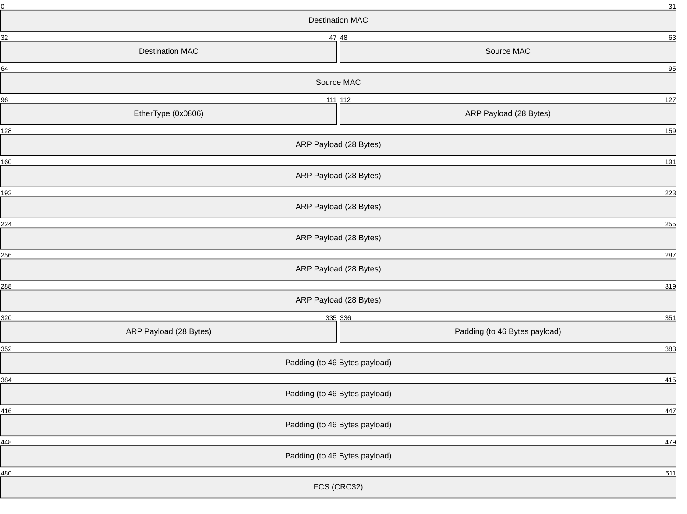
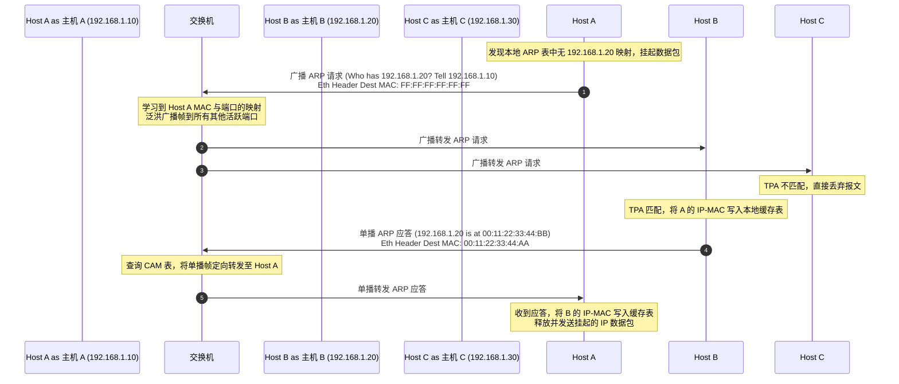
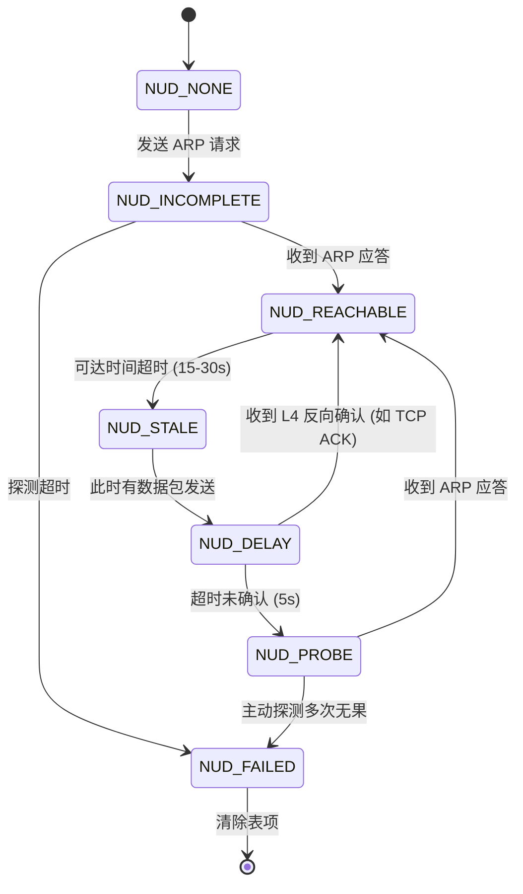
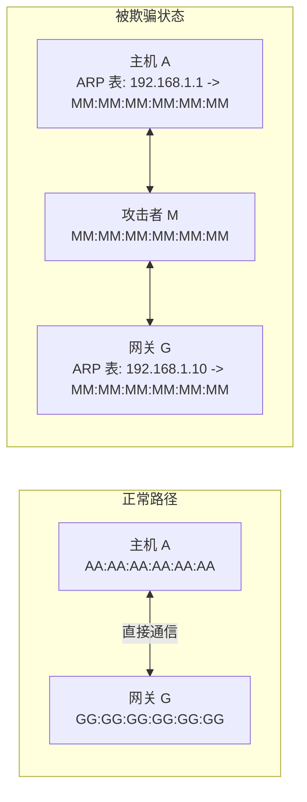
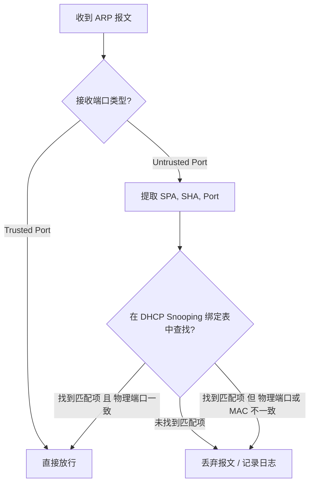

# 1.2.5.2 ARP

## 1. 数据链路层与网络层的边界纽带：ARP 核心背景与映射逻辑

### 1.1 分层架构下的寻址困局：逻辑地址与物理地址的鸿沟
在计算机网络的分层体系结构中，网络层（Network Layer / Layer 3）与数据链路层（Data Link Layer / Layer 2）分工明确，互为支撑。网络层负责在复杂的全球互联网络拓扑中进行端到端（End-to-End）的逻辑寻址与路由选择，其核心协议是 IP 协议，而寻址载体是 IP 地址。与之相对，数据链路层则负责在同一个物理链路或局部局域网（LAN）内进行相邻节点之间的点到点（Hop-by-Hop）物理寻址与数据帧传输，其寻址载体是 MAC 地址（Media Access Control Address，媒体访问控制地址）。

那么，为什么我们不能在网络中仅使用 IP 地址或者仅使用 MAC 地址，而必须同时维持这两套截然不同的地址体系，并引入动态的翻译机制呢？

这首先源于网络分层设计中“解耦与抽象”的核心哲学。IP 地址是位置相关的逻辑地址，根据网络拓扑结构进行层次化分配（通常分为网络号和主机号）。这种设计使得全球范围内的路由器可以通过聚合路由表项，极其高效地转发数据包。如果全球网络直接使用扁平化、无层次的 MAC 地址进行路由，那么每一台路由器都必须维护一个包含数十亿条 MAC 地址记录的路由表，这在硬件存储、路由表更新及检索效率上是完全不可行的。

然而，在局域网的物理介质上传输数据时，底层的物理网卡（NIC）以及二层交换机并不理解 IP 协议的逻辑结构，也无法解析网络层协议头的 IP 地址。物理网卡只在物理层和数据链路层工作，其芯片（如 PHY 芯片与 MAC 芯片）在硬件级别通过识别物理信号中的前导码（Preamble）和帧起始定界符（SFD）来定位数据帧。网卡内置的 MAC 芯片中包含一个硬件比较器（Hardware Comparator），它能以纳秒级的速度判定接收到的以太网帧头中的目的 MAC 地址是否与该网卡自身的物理 MAC 地址相匹配，或者是广播/组播地址。如果目的 MAC 地址不匹配，网卡会在硬件层面直接将该帧过滤并丢弃，而不会产生任何硬件中断来打扰主机的 CPU。

如果去掉物理寻址，直接以 IP 地址作为网卡的硬件过滤条件，会给系统带来灾难性的“中断风暴（Interrupt Storm）”。因为 IP 地址是封装在以太网帧载荷内部的逻辑首部，网卡必须先将整个以太网帧通过物理层接收下来，通过 DMA 拷贝到主内存中，然后产生硬件中断通知 CPU。接着，操作系统内核的中断服务例程（ISR）和驱动程序会被唤醒，剥离帧头，将 IP 包送入内核协议栈的接收函数（如 Linux 内核的 `ip_rcv` 函数）中进行软件层面的 IP 地址比对。如果发现 IP 地址不匹配，再将其丢弃。如果在一个拥有上千个节点的大型局域网中，高频的广播包和单播包都必须经过这样的软件比对，主机的 CPU 资源将被完全耗尽在无用的协议栈解封装上，导致严重的网络卡顿和系统假死。

因此，为了结合“IP 路由的高效层次化”与“MAC 地址的硬件级过滤”，IP 数据包在到达本网段的出口、准备在以太网物理介质上传送给相邻节点时，必须将其封装成以太网帧，并在帧头填入接收端网卡的物理 MAC 地址。如果发送端只知道接收端的逻辑 IP 地址，而不知道其物理 MAC 地址，物理层的数据传输就根本无法开始。这就产生了“逻辑地址向物理地址动态翻译”的迫切需求，ARP（Address Resolution Protocol，地址解析协议）正是为了打破这一寻址困局而诞生的。

### 1.2 物理地址与逻辑地址的异同对比
为了更清晰地理解地址解析的必要性，我们需要对这两类地址进行多维度的深度对比：

| 维度 | IP 地址（逻辑地址） | MAC 地址（物理地址） |
| :--- | :--- | :--- |
| **工作层级** | 网络层（Network Layer / Layer 3） | 数据链路层（Data Link Layer / Layer 2） |
| **寻址范围** | 全局寻址，用于跨网段路由 | 局部寻址，用于单跳/同一链路内的节点定位 |
| **地址结构** | 层次化结构（IPv4 为 32 位，IPv6 为 128 位），包含网络前缀与主机标识 | 扁平化结构（EUI-48 为 48 位，EUI-64 为 64 位），包含厂商组织唯一标识符（OUI）与网卡扩展标识符 |
| **分配方式** | 动态分配（通过 DHCP）或静态配置，随设备物理位置的改变而改变 | 烧录在网卡 ROM 中，全球唯一，通常终身不变（除软件层面的 MAC 伪造克隆外） |
| **转发设备** | 路由器（Router）、三层交换机，基于 IP 路由表转发 | 二层交换机（Bridge/Switch），基于 MAC 地址表（CAM 表）转发 |
| **终端硬件处理** | 操作系统 TCP/IP 协议栈内核态软件处理 | 网卡（NIC）硬件芯片直接比较与过滤 |

### 1.3 ARP 的协议定位与层级悖论
为了解决上述地址映射问题，RFC 826 定义了地址解析协议。ARP 的主要职责是将已知的网络层 IPv4 地址动态地解析为数据链路层的 MAC 地址。

在网络协议族的划分中，ARP 存在着一种“层级悖论（Layering Paradox）”：
* 从**服务对象**和**逻辑功能**来看，ARP 解决的是 IP 地址到 MAC 地址的映射，它是 IP 协议能够正常工作的基础支撑，因此许多教科书将其归类为网络层（Layer 3）协议。
* 从**报文封装**和**传输机理**来看，ARP 报文并不像 ICMP 或 OSPF 那样封装在 IP 报文体内（它不需要 IP 首部，也不经过网络层的 IP 路由封装），而是直接作为数据链路层的载荷（Payload）封装在以太网帧中。在以太网帧头中，表示上层协议类型的“以太网帧类型”（EtherType）字段值为 `0x0806`，这与 IPv4 的 `0x0800` 是平级并列的。



如上图所示，ARP 直接运行在以太网帧之上。这种直接面向链路层的报文设计，使得 ARP 在网络层协议尚未完全初始化或 IP 地址未配置生效时（例如设备刚开机处于配置阶段），依然能够通过链路层广播完成必要的地址宣告与冲突检测。

---

## 2. ARP 报文格式精细解析

要深入理解 ARP 的工作机制，必须对其在网线上传输的比特流进行微观剖析。RFC 826 规定了通用的 ARP 报文格式，虽然它设计时考虑了对多种网络层和链路层协议的兼容性，但在实际的以太网 + IPv4 环境中，其报文结构是固定且紧凑的。

### 2.1 32-bit 对齐的以太网 ARP 报文结构
下面是标准以太网封装下，ARP 报文在内存中的 32 位对齐视图：

```
 0                   1                   2                   3
 0 1 2 3 4 5 6 7 8 9 0 1 2 3 4 5 6 7 8 9 0 1 2 3 4 5 6 7 8 9 0 1
+-+-+-+-+-+-+-+-+-+-+-+-+-+-+-+-+-+-+-+-+-+-+-+-+-+-+-+-+-+-+-+-+
|          硬件类型 (Hardware Type)      |          协议类型 (Protocol Type)      |
+-+-+-+-+-+-+-+-+-+-+-+-+-+-+-+-+-+-+-+-+-+-+-+-+-+-+-+-+-+-+-+-+
| 硬件地址长度 (HLEN) | 协议地址长度 (PLEN) |          操作码 (Opcode)               |
+-+-+-+-+-+-+-+-+-+-+-+-+-+-+-+-+-+-+-+-+-+-+-+-+-+-+-+-+-+-+-+-+
|                      源硬件地址 (Sender Hardware Address - SHA) (前 4 字节)     |
+-+-+-+-+-+-+-+-+-+-+-+-+-+-+-+-+-+-+-+-+-+-+-+-+-+-+-+-+-+-+-+-+
| SHA (后 2 字节)                 |      源协议地址 (Sender Protocol Address - SPA) (前 2 字节) |
+-+-+-+-+-+-+-+-+-+-+-+-+-+-+-+-+-+-+-+-+-+-+-+-+-+-+-+-+-+-+-+-+
| SPA (后 2 字节)                 |      目的硬件地址 (Target Hardware Address - THA) (前 2 字节)|
+-+-+-+-+-+-+-+-+-+-+-+-+-+-+-+-+-+-+-+-+-+-+-+-+-+-+-+-+-+-+-+-+
|                      THA (后 4 字节)                                         |
+-+-+-+-+-+-+-+-+-+-+-+-+-+-+-+-+-+-+-+-+-+-+-+-+-+-+-+-+-+-+-+-+
|                      目的协议地址 (Target Protocol Address - TPA) (4 字节)     |
+-+-+-+-+-+-+-+-+-+-+-+-+-+-+-+-+-+-+-+-+-+-+-+-+-+-+-+-+-+-+-+-+
```

### 2.2 字段定义与协议语义
我们对上述报文中的每个字段进行逐一精细拆解：

1. **硬件类型（Hardware Type, 16 bits）**
   * **作用**：定义发送方所使用的物理网络/数据链路层技术类型。
   * **典型值**：在以太网（Ethernet）环境中，该值固定为 `0x0001`（即类型为 1）。对于其他链路层技术（如令牌环、帧中继），该值会有所不同。
2. **协议类型（Protocol Type, 16 bits）**
   * **作用**：定义发送方想要解析的网络层/逻辑地址的协议类型。
   * **典型值**：在 IPv4 环境中，该字段值固定为 `0x0800`（即网络层使用的是 IPv4 协议）。这与以太网帧头中的 EtherType 字段采用相同的编码标准。
3. **硬件地址长度（Hardware Address Length / HLEN, 8 bits）**
   * **作用**：指示物理地址的长度，以字节（Octet）为单位。
   * **典型值**：以太网 MAC 地址为 48 位（6 字节），因此该值在以太网中固定为 `0x06`。
4. **协议地址长度（Protocol Address Length / PLEN, 8 bits）**
   * **作用**：指示网络层逻辑地址的长度，以字节为单位。
   * **典型值**：IPv4 地址为 32 位（4 字节），因此该值在 IPv4 网络中固定为 `0x04`。
5. **操作码（Opcode, 16 bits）**
   * **作用**：指示当前 ARP 报文的具体类型，决定了接收方对该报文的逻辑处理分支。
   * **核心取值**：
     * `0x0001` (1)：ARP 请求（ARP Request），用于查询某个 IP 地址对应的 MAC 地址。
     * `0x0002` (2)：ARP 应答（ARP Reply），用于响应 ARP 请求，将自身的 IP 与 MAC 映射关系告知请求者。
     * `0x0003` (3) 和 `0x0004` (4)：反向 ARP（RARP）请求与应答（现已基本淘汰）。
6. **源硬件地址（Sender Hardware Address / SHA, 48 bits）**
   * **作用**：发送本 ARP 报文的设备的物理 MAC 地址。
7. **源协议地址（Sender Protocol Address / SPA, 32 bits）**
   * **作用**：发送本 ARP 报文的设备的逻辑 IP 地址。
8. **目的硬件地址（Target Hardware Address / THA, 48 bits）**
   * **作用**：接收本 ARP 报文的目标设备的物理 MAC 地址。
   * **特殊语义**：在 **ARP 请求报文** 中，由于发送端正在寻求目标的 MAC 地址，该字段是未知的。因此，在请求报文中，THA 字段通常会被填充为 `00:00:00:00:00:00`，并在发送时通过以太网帧头的广播 MAC 地址（`FF:FF:FF:FF:FF:FF`）进行传输。而在 **ARP 应答报文** 中，该字段会被正确填充为请求发起方的 MAC 地址。
9. **目的协议地址（Target Protocol Address / TPA, 32 bits）**
   * **作用**：接收本 ARP 报文的目标设备的逻辑 IP 地址。在请求报文中，这是被查询者的 IP；在应答报文中，这是请求发起方的 IP。

> [!NOTE]
> 虽然在以太网+IPv4中，`HLEN` 和 `PLEN` 分别是 6 和 4，但 RFC 826 将它们设计成可变长度字段，目的是为了使 ARP 具有极强的兼容普适性。例如，在旧的令牌环网络中，硬件地址长度可能不同；或者在早期试验过在以太网上传输其他网络层协议时，`PLEN` 可以是其它数值。这充分体现了早期网络设计的“泛型思想（Generic Design）”，即一种解析协议可以支持多种底层硬件与多种上层协议。

### 2.3 以太网帧填充（Padding）机制与最小帧限制
标准的以太网物理层与 MAC 子层规定，以太网帧在物理介质上传输时，其最小长度（不包含前导码 Preamble 和帧起始定界符 SFD，但包含帧头和帧尾 FCS）必须达到 **64 字节**。

这个 64 字节的限制是由共享式以太网的 **冲突检测机制（CSMA/CD）** 决定的：
在 10 Mbps 的以太网中，电信号在同轴电缆或双绞线中的传播速度约为光速的 2/3。为了确保网络中任何一个节点在发送数据帧的过程中，如果发生碰撞冲突（Collision），都能在“发送完毕之前”检测到碰撞，帧的传输时延必须大于两倍的最大网络传播时延（即碰撞槽时间 Slot Time，对应 51.2 微秒）。在 10 Mbps 的速率下，51.2 微秒正好可以发送 512 个比特，即 64 字节。随着技术向百兆、千兆以太网演进，为了保持向下兼容性，这一最小帧限制被严格保留了下来。

我们来计算一个以太网 ARP 报文在不填充情况下的总长度：
$$\text{以太网首部 (14 字节)} + \text{ARP 载荷 (28 字节)} + \text{以太网尾部 FCS (4 字节)} = 46 \text{ 字节}$$

这 46 字节远小于以太网规定的 64 字节最小帧宽。为了满足以太网控制芯片的硬件传输要求，当数据链路层驱动将这 28 字节的 ARP 载荷传递给网卡 MAC 芯片时，MAC 芯片（或驱动程序）会自动在 ARP 载荷的末尾填充 **18 字节**的 `0x00`（Padding），使得数据链路层帧载荷从 28 字节补足到 **46 字节**。

$$\text{以太网首部 (14B)} + \text{ARP Payload (28B)} + \text{Padding (18B)} + \text{FCS (4B)} = 64 \text{ 字节}$$

当接收端网卡收到该帧并校验 FCS 无误后，会剥离以太网帧头，将 46 字节的载荷送往操作系统的 ARP 模块。ARP 模块会根据报文内部的“硬件地址长度（HLEN=6）”和“协议地址长度（PLEN=4）”计算出实际的 ARP 数据仅占 28 字节，从而自动忽略末尾的 18 字节 Padding 数据。

另外，在以太网 802.3 物理介质上传输时，每个以太网帧前还会附带 7 字节的前导码（Preamble）、1 字节的帧起始定界符（SFD），以及帧发送完毕后必需的 12 字节帧间距（IFG，Interpacket Gap）。因此，物理介质在传输一个 ARP 包时，实际消耗的时钟周期等效于传输了下面的总字节数：
$$8\text{ (Preamble/SFD)} + 14\text{ (Eth Header)} + 28\text{ (ARP)} + 18\text{ (Padding)} + 4\text{ (FCS)} + 12\text{ (IFG)} = 84 \text{ 字节}$$

### 2.4 底层 C 语言结构体定义
在通用的 UNIX-like 系统或嵌入式网络协议栈（如 lwIP）中，ARP 报文通常由紧凑对齐的 C 结构体进行定义。为了防止编译器因 32 位或 64 位对齐在结构体内部插入空洞（Padding Byte），必须使用 `#pragma pack(1)` 或 `__attribute__((packed))` 对结构体进行强制字节对齐。

以下是一个经典的底层网络开发中，以太网帧首部与 ARP 报文合并定义的 C 语言实现：

```c
#include <stdint.h>

/* 启用 1 字节紧凑对齐 */
#pragma pack(push, 1)

/* 以太网帧首部 (14 字节) */
struct eth_header {
    uint8_t  dest_mac[6];   /* 目的 MAC 地址 */
    uint8_t  src_mac[6];    /* 源 MAC 地址 */
    uint16_t ether_type;    /* 帧类型，ARP 协议为 0x0806 (大端字节序) */
};

/* ARP 报文首部与载荷 (28 字节) */
struct arp_packet {
    uint16_t hw_type;       /* 硬件类型，以太网为 0x0001 (大端) */
    uint16_t proto_type;    /* 协议类型，IPv4 为 0x0800 (大端) */
    uint8_t  hw_len;        /* 硬件地址长度，固定为 6 */
    uint8_t  proto_len;     /* 协议地址长度，固定为 4 */
    uint16_t opcode;        /* 操作码：1-请求，2-应答 (大端) */
    
    uint8_t  sender_mac[6]; /* 源 MAC 地址 (SHA) */
    uint32_t sender_ip;     /* 源 IP 地址 (SPA) (大端) */
    uint8_t  target_mac[6]; /* 目的 MAC 地址 (THA) */
    uint32_t target_ip;     /* 目的 IP 地址 (TPA) (大端) */
};

/* 完整的以太网 ARP 帧结构 */
struct ethernet_arp_frame {
    struct eth_header eth;
    struct arp_packet arp;
    /* 注意：网卡发送时会在末尾自动填充 18 字节 Padding 并附带 4 字节 FCS */
};

#pragma pack(pop)
```

> [!IMPORTANT]
> 在编写网络协议栈代码或使用 Raw Socket 发送 ARP 包时，所有的 16 位和 32 位整数字段（如 `hw_type`、`proto_type`、`opcode`、`sender_ip`、`target_ip` 等）都必须通过 `htons()` 或 `htonl()` 函数转换为网络字节序（大端字节序，Big-Endian）后写入。接收端解析时，也必须使用 `ntohs()` 或 `ntohl()` 进行转换，否则会导致解析逻辑混乱。

---

## 3. ARP 工作流程与广播/单播机制

ARP 协议的运转依赖于动态的“请求-应答”交互模型。在实际局域网中，这一交互过程经历了从链路层广播（Broadcast）到单播（Unicast）的转换。

### 3.1 同一网段内的 ARP 交互全生命周期
为了让讨论具体化，我们假定在同一个以太网局域网（VLAN 10，子网 `192.168.1.0/24`）中，有两台主机：
* **主机 A**：IP 地址为 `192.168.1.10`，MAC 地址为 `00:11:22:33:44:AA`
* **主机 B**：IP 地址为 `192.168.1.20`，MAC 地址为 `00:11:22:33:44:BB`

主机 A 的应用层发起了一个向主机 B 的 TCP 连接（或 Ping 请求），但在封装网络层 IP 包后，主机 A 发现本地 ARP 缓存表中没有目标 IP `192.168.1.20` 对应的 MAC 地址。以下是完整的解析流程：

#### 第一步：高速缓存检索与中断挂起（Cache Miss）
主机 A 的网络协议栈首先检索内核中的 ARP 缓存表。
* 如果命中（Cache Hit），直接取出对应的 MAC 地址完成以太网帧头封装并发送。
* 如果未命中（Cache Miss），协议栈将挂起（Queue）该待发送的 IP 数据包，并为该 IP 地址启动 ARP 请求流程。

#### 第二步：构造并发送 ARP 请求报文（广播查询）
主机 A 动态构建一个 ARP 请求报文，其主要字段填充如下：
* `Opcode` = `1`（ARP Request）
* `SHA` = `00:11:22:33:44:AA`（主机 A 的 MAC）
* `SPA` = `192.168.1.10`（主机 A 的 IP）
* `THA` = `00:00:00:00:00:00`（填充零，表示未知）
* `TPA` = `192.168.1.20`（目标主机 B 的 IP）

接着，将该报文封装进以太网帧：
* **目的 MAC 地址** = `FF:FF:FF:FF:FF:FF`（链路层广播地址）
* **源 MAC 地址** = `00:11:22:33:44:AA`
* **EtherType** = `0x0806`

主机 A 的网卡将该广播帧发送到物理介质上。

#### 第三步：交换机泛洪与物理网卡过滤
局域网内的二层交换机（Switch）从输入端口收到该帧后，检查其目的 MAC 地址。
1. 交换机识别出该帧的目的 MAC 是 `FF:FF:FF:FF:FF:FF`。
2. 交换机不会对广播帧进行单播查表转发，而是执行 **泛洪（Flood）** 机制，将该广播帧复制并转发到除了该输入端口之外的同 VLAN 所有其他物理端口上。
3. 局域网内的所有主机（包括主机 B 以及其他无关主机 C、D）的网卡都会物理上接收到这一广播电信号。由于以太网帧头是广播地址，所有网卡都不会在硬件层面过滤它，而是通过 DMA 将其拷入内存并向系统内核发送硬件中断，由操作系统的数据链路层驱动接收。

#### 第四步：主机处理与本地缓存预更新
所有收到该帧的非目标主机（例如主机 C）将该帧递交给内部的 ARP 协议处理器：
1. 处理器首先检查以太网帧类型，确认是 ARP 报文。
2. 检查 `TPA`（目的 IP）是否与自身的网卡配置 IP 一致。
3. 主机 C 发现 `TPA`（`192.168.1.20`）与自身 IP（例如 `192.168.1.30`）不匹配，于是**直接丢弃**该报文，不再做任何响应。

目标主机 B 收到该帧并进行相同的检查：
1. 主机 B 发现 `TPA`（`192.168.1.20`）与自身绑定的 IP 地址完全一致。
2. 主机 B 的 ARP 模块会首先将请求方的映射关系（`192.168.1.10` $\to$ `00:11:22:33:44:AA`）写入或更新到自己的本地 ARP 缓存表中。这一步骤属于“顺带优化”：既然 A 马上要和 B 通信，B 提前缓存 A 的地址，可以有效避免 B 随后向 A 回发数据时再次发起一次 ARP 广播。

#### 第五步：构造并发送 ARP 应答报文（单播响应）
主机 B 转换为发送方，构建一个 ARP 应答报文：
* `Opcode` = `2`（ARP Reply）
* `SHA` = `00:11:22:33:44:BB`（主机 B 自己的 MAC 地址）
* `SPA` = `192.168.1.20`（主机 B 的 IP 地址）
* `THA` = `00:11:22:33:44:AA`（主机 A 的 MAC 地址，从请求包的 SHA 字段中提取）
* `TPA` = `192.168.1.10`（主机 A 的 IP 地址）

接着，将应答报文封装进以太网帧：
* **目的 MAC 地址** = `00:11:22:33:44:AA`（主机 A 的物理 MAC，此时已知）
* **源 MAC 地址** = `00:11:22:33:44:BB`
* **EtherType** = `0x0806`

主机 B 将该帧以 **单播（Unicast）** 形式发往交换机。

#### 第六步：交换机单播转发与主机 A 缓存写入
交换机收到主机 B 发回的单播帧后，查询自身的 MAC 地址表（CAM 表）：
1. 交换机找到目的 MAC `00:11:22:33:44:AA` 对应的物理端口（因为 A 此前发送过广播，交换机已经学习到了 A 的端口位置）。
2. 交换机将该帧精准地从对应端口单播转发给主机 A，而网络中的其他主机（如 C、D）完全收不到该应答帧，这降低了局域网的整体冲突和监听风险。
3. 主机 A 的网卡收到该帧，识别出目的 MAC 是自己，接收并解封装后送达 ARP 模块。
4. 主机 A 解析出 B 的物理 MAC 地址 `00:11:22:33:44:BB`，将其与 IP `192.168.1.20` 绑定，写入本地的 ARP 缓存表中。
5. 主机 A 唤醒此前挂起的数据包发送队列，将缓存的 MAC 填入 IP 包的外层以太网帧头中，正式开始向主机 B 发送应用层数据。

以下是完整的时序图：



### 3.2 跨网段的 ARP 解析流程（网关的角色）
如果主机 A（`192.168.1.10/24`）需要向外网的某个服务器 D（IP 地址为 `8.8.8.8`）发送数据，由于两者处于不同的网络，主机 A 无法通过 ARP 广播直接获取 D 的 MAC 地址（路由器会隔离广播包）。

此时，ARP 与 IP 路由模块的协作机制如下：
1. **网络层判定**：主机 A 的 IP 协议栈将目的 IP `8.8.8.8` 与本地子网掩码 `255.255.255.0` 进行按位与运算，判定目标主机与自己在不同的网段。
2. **路由查询**：主机 A 检索本地路由表，确定需要通过默认网关（Default Gateway，例如路由器 LAN 口 IP `192.168.1.1`）来转发该数据包。
3. **网关 ARP 解析**：
   * 主机 A 检索本地 ARP 缓存，查看是否有网关 IP `192.168.1.1` 对应的 MAC 地址。
   * 如果没有，主机 A 发起一个针对网关 IP `192.168.1.1` 的 ARP 广播请求，获得网关的 MAC 地址（例如 `00:11:22:33:44:GW`）。
4. **链路封装**：主机 A 构建发送给外网的 IP 包，其 IP 首部中的**源 IP** 为 `192.168.1.10`，**目的 IP** 始终为终点 `8.8.8.8`。然而，在封装以太网帧头时，**目的 MAC 地址** 被填入网关的 MAC `00:11:22:33:44:GW`，而**非**目标主机的 MAC。
5. **网关转发与下一跳 ARP**：
   * 路由器从 LAN 口收到该帧，识别出目的 MAC 是自己，解封装以太网帧头，将 IP 包送入网络层路由引擎。
   * 路由引擎修改 TTL 值（减 1），重新计算校验和，并通过路由查表判定下一跳（Next Hop）的 IP 地址。
   * 路由器在其 WAN 口（或其他输出物理接口）上，针对下一跳的 IP 地址，再次发起 ARP 解析过程，封装新的二层帧头，将其发送给下一个路由器。

> [!TIP]
> 在整个数据传输路径中，**源 IP 地址和目的 IP 地址在不经过 NAT 转换的情况下保持不变**，用于实现全球范围内的端到端传输；而**源 MAC 地址和目的 MAC 地址在经过每一个三层网络设备（路由器）时都会被剥离并重新封装**，用于实现相邻物理节点间的单跳传输。

### 3.3 ARP 缓存表（ARP Cache Table）管理机制与状态机
ARP 缓存表是操作系统网络协议栈中的一个关键数据结构。为了避免为每个发送的 IP 包都启动一次低效的 ARP 广播，系统会将学习到的映射关系暂存在内存中。

#### 3.3.1 为什么需要动态老化机制？
如果 ARP 表项永久有效，会带来严重的网络通信故障：
* **IP 地址漂移**：在开启 DHCP 的局域网中，主机 A 下线后，其原本持有的 IP 可能在数小时后被分配给主机 B。如果其他主机中对应的旧 ARP 映射不老化，发往该 IP 的数据包依然会被发送给已被释放的旧 MAC 地址，导致通信彻底中断。
* **硬件更换**：若某台服务器损坏更换了网卡，其 MAC 地址发生变化，但 IP 保持不变，过期的 ARP 缓存会使用旧 MAC 封装帧，导致无法送达。
* **缓存表膨胀**：对于大型网络或网关设备，可能每天有大量临时设备（如访客设备）接入后离开。如果不清理过期映射，内存中的 ARP 表会无限膨胀，耗尽系统资源。

#### 3.3.2 邻居子系统的核心状态机（Linux 视角）
在内核级的网络邻居管理中（以通用 Linux 内核的邻居子系统 Neighbor Subsystem 为代表），ARP 表项并不是简单的“存在/不存在”的二值逻辑，而是一个有着精细状态机的动态管理模块。

Linux 在 `struct neighbour` 结构体中定义了表项的状态。常见的状态变迁如下：

1. **`NUD_NONE` (无状态)**：表项刚创建时的初始状态，尚无任何地址信息。
2. **`NUD_INCOMPLETE` (未完成)**：正在发送 ARP 请求，但尚未收到应答。此时发送队列中可能缓存了待发送的数据包（通常由 `arp_queue` 队列管理，避免应用层发包线程因等待二层地址解析而阻塞）。
3. **`NUD_REACHABLE` (可达)**：最近收到过 ARP 应答或从其他三层反向确认了邻居的存活。此状态下，表项完全可信，可以直接用来封装数据包。该状态会在经过随机时间（通常在 15 到 30 秒之间，由内核参数 `gc_stale_time` 及随机抖动因子决定）后自动老化，迁移至 `STALE`。
4. **`NUD_STALE` (陈旧)**：表项已超过 reachable 时间，映射关系变得不可靠，但此时如果有数据包需要发送，系统**依然允许**使用该表项中的 MAC 直接封装发送，同时状态会立即迁移到 `DELAY`。这一设计是 Linux 内核极其核心的“乐观主义优化”：既然两台主机此前一直在通信，二层 MAC 地址在短时间内发生改变的概率极低。直接发包可以避免每次缓存超时都引起数据包发送延迟（即首包延迟）。
5. **`NUD_DELAY` (延迟)**：系统在使用陈旧表项发送数据后，等待上层协议（如 TCP 收到 ACK，或者收到其它指向该主机的连接确认）在指定时间内（通常为 5 秒，对应 `delay_probe_time` 参数）反馈确认邻居是否依然存活。
   * 如果收到上层确认，说明该 MAC 依然正确，状态迁回 `REACHABLE`。这一机制被称为“四层反向确认（Reachability Confirmation）”，它打破了严格的 OSI 七层模型限制，通过上层协议的活跃度直接推断二层拓扑的有效性，极大地节省了链路上的 ARP 广播/单播开销。
   * 如果超时未收到任何确认，状态迁移到 `PROBE`。
6. **`NUD_PROBE` (探测)**：系统开始主动发送 ARP 请求以检测邻居状态。为了不干扰局域网内的其它设备，系统在此状态下默认会发送**单播（Unicast）** ARP 请求（直接发给已知的旧 MAC）。系统会连续发送数次（如 3 次，对应 `ucast_probes` 参数）探测包，间隔 1 秒。
   * 若收到应答，状态迁回 `REACHABLE`。
   * 若多次探测后仍无应答，状态迁至 `NUD_FAILED`。
7. **`NUD_FAILED` (失败)**：确认邻居不可达，清除该表项，待发送队列中的数据包被丢弃，并向上层报告“主机不可达（Host Unreachable）”错误。
8. **`NUD_PERMANENT` (永久)**：静态配置的 ARP 映射，永不老化，只有手动删除时才会失效。

下图展示了 Linux 邻居状态机的核心迁移路径：



---

## 4. ARP 衍生协议与高级变种

随着网络技术的多样化发展，在标准的“请求-应答”机制之外，ARP 协议延伸出了多种变种，用于解决 IP 冲突检测、跨网段无网关互通以及历史上的无盘引导等特定场景下的寻址问题。

### 4.1 免费 ARP (Gratuitous ARP)
免费 ARP（Gratuitous ARP）是 ARP 协议中一个非常特殊但极为关键的机制。所谓“免费”，是指发送方在没有受到任何 ARP 请求的情况下，主动向网络中广播发送的 ARP 宣告。

#### 4.1.1 免费 ARP 的报文特征
免费 ARP 报文在格式上与标准 ARP 请求完全一致，但在字段内容上具有以下典型特征：
* **`Opcode`** = `1`（ARP Request）或 `2`（ARP Reply，RFC 允许这两种形式，但以 Request 居多）。
* **`SPA`（源 IP）与 `TPA`（目的 IP）完全相同**，都是发送方本机的 IP 地址。
* **`THA`（目的 MAC）** 被设为 `00:00:00:00:00:00`（若 Opcode 为 1）。
* 在以太网帧头中，**目的 MAC 地址** 封装为广播地址 `FF:FF:FF:FF:FF:FF`。

```
以太网帧头: Dest MAC = FF:FF:FF:FF:FF:FF, Source MAC = Sender_MAC
ARP 载荷: 
  SPA = 192.168.1.10
  TPA = 192.168.1.10 (相同!)
  SHA = Sender_MAC
  THA = 00:00:00:00:00:00
```

#### 4.1.2 核心应用场景与运作机理

##### 场景一：IP 冲突检测（Address Conflict Detection）
当一台主机重新配置了 IP 地址、或者物理网卡由禁用转为启用时，其协议栈必须确保该 IP 地址在当前局域网内是独占的。RFC 5227 详细规范了利用 ARP 进行冲突检测的流程，该过程分为两个关键阶段：
1. **ARP Probe 阶段**：设备在正式启用拟用 IP 之前，会发送一个特殊的 ARP 请求。在该请求中，`SPA` 字段被强制填充为 `0.0.0.0`，而 `TPA` 填充为拟用的 IP 地址。之所以不将 `SPA` 填入自己的拟用 IP，是为了防范“先入为主”的污染：如果该 IP 此时已经被网络中另一台设备合法持有，直接填入该 IP 会导致网段内其它主机的 ARP 缓存表瞬间被错误更新（因为它们收到了来自新 MAC 的该 IP 宣告），导致正在进行的合法通信中断。如果发送数次 Probe 包后没有收到任何应答，说明网络中没有人持有该 IP。
2. **ARP Announcement 阶段（即免费 ARP）**：设备确认无冲突后，正式将该 IP 绑定到网卡上，并立即向全网广播发送一个 `SPA` 和 `TPA` 均填入该 IP 地址的 ARP 请求（即标准的免费 ARP）。这一宣告告诉局域网内的所有设备：“我已正式接管此 IP”。

如果另一台设备正在使用该 IP，它会在 Probe 阶段就回发 ARP 应答。发起检测的设备收到应答后，确认发生 IP 冲突，操作系统会生成系统日志并向用户报警，同时通常会自动停用该网卡接口。

##### 场景二：更新相邻设备的 ARP 缓存
当某台设备的网卡损坏被更换、但系统配置的 IP 地址保持不变时，它需要即时通知局域网内的所有邻居更新缓存。
根据 ARP 协议的规则，网段内所有主机接收到该广播后，会在解析报文时检查 `SPA`。如果本地 ARP 缓存表中已经存在该 `SPA` 对应的表项，即使当前没有和该主机通信，也会**强制将该表项的 MAC 地址更新**为免费 ARP 报文中携带的最新的 `SHA`。这保证了邻居主机的 ARP 缓存表能够瞬间与物理世界的硬件变更同步，避免随后的发包走向旧的物理地址。

##### 场景三：防止二层交换机 MAC 表陈旧（网络拓扑物理漂移）
这在服务器虚拟化集群（如虚拟机热迁移）、网卡 Bonding（主备切换）或 VRRP（虚拟路由器冗余协议）主备倒换场景中至关重要。
* **虚拟机热迁移**：当一台虚拟机（IP 为 `192.168.1.100`，MAC 地址为 `00:11:22:33:44:VM`）从物理宿主机 A 热迁移到物理宿主机 B 时，虽然虚拟机的 IP 和 MAC 都没变，但它所连接的物理交换机端口发生了改变。二层交换机的 CAM 表（MAC 地址-端口映射表）依然认为该 MAC 对应宿主机 A 所在的物理端口。
* **VRRP 主备切换**：当主路由器挂掉，备份路由器接管虚拟 IP（如 `192.168.1.254`，虚拟 MAC `00:00:5E:00:01:01`）时，核心交换机必须得知该 MAC 现在应当引流到备路由器的物理接口。

在这类情况下，设备在完成迁移或切换的瞬间，会立即向交换机端口发送免费 ARP 报文。交换机收到该帧后，提取源 MAC 地址，并立即更新自己的 MAC 地址表，将该 MAC 绑定到接收到免费 ARP 的新物理端口上。这一过程被称为“刷新 MAC 地址表”，它避免了网络流量继续发往旧的物理路径而造成的流量黑洞。

### 4.2 代理 ARP (Proxy ARP)
通常情况下，ARP 广播帧无法跨越路由器或三层网关。但是，在特定的网络拓扑设计中，我们可以让处于不同物理网段的主机在不配置网关的情况下进行互通，这就是 **代理 ARP（Proxy ARP）** 技术。

#### 4.2.1 代理 ARP 的工作机制
当源主机 A 与目的主机 B 处于不同的物理网段，但因为以下原因：
* 主机 A 掩码配置错误（例如本应是 `/24` 却配成了 `/16`），误以为主机 B 与自己处于同一局域网内。
* 主机 A 根本没有配置默认网关。

此时，主机 A 会直接针对主机 B 的 IP（例如 `10.2.2.2`）在本地网段内发起 ARP 广播请求（`Who has 10.2.2.2?`）。
在正常的网络中，由于 B 不在当前网段，没有人会回应此广播，通信将会失败。
但是，如果连接这两个网段的路由器开启了 **代理 ARP** 功能，且满足以下三个严格的触发条件，路由器就会代为响应：
1. **路由器接收到该 ARP 请求的物理接口上必须使能了 Proxy ARP 功能**。
2. **路由器的路由表中必须存在到达目标 IP `10.2.2.2` 的有效路由**。
3. **ARP 请求的源 IP 地址与目标 IP 地址在路由表中指向不同的物理接口/网段**。

如果满足这些条件：
1. 路由器决定“扮演”目标主机 B，将其接收该 ARP 请求的 LAN 口的 **自己的 MAC 地址**（例如 `00:11:22:33:44:R_LAN`）封装在 ARP 应答报文中回发给主机 A。
2. 主机 A 收到该应答后，将映射关系记录在本地：`10.2.2.2` $\to$ `00:11:22:33:44:R_LAN`。
3. 随后，主机 A 发往主机 B 的所有数据包，都会将目的 MAC 填为路由器的 MAC。路由器收到后，在三层进行正常的 IP 路由转发，将包送达真正的 B。

```mermaid
sequenceDiagram
    autonumber
    participant Host A as 主机 A (10.1.1.1/16)<br/>误以为全网是一整个大局域网
    participant Router as 路由器 (开启 Proxy ARP)<br/>LAN1: 10.1.1.254 | LAN2: 10.2.2.254
    participant Host B as 主机 B (10.2.2.2/24)

    Note over Host A: 判定 10.2.2.2 在同网段<br/>不走网关，直接发 ARP 广播
    Host A->>Router: 广播 ARP 请求 (Who has 10.2.2.2? Tell 10.1.1.1)
    Note over Router: 接收到请求，发现有去往 10.2.2.2 的路由<br/>决定代理应答
    Router->>Host A: 单播 ARP 应答 (10.2.2.2 is at Router_LAN1_MAC)
    Note over Host A: 本地 ARP 表记录: 10.2.2.2 -> Router_LAN1_MAC
    Host A->>Router: 发送数据帧 (Dest MAC = Router_LAN1_MAC, Dest IP = 10.2.2.2)
    Note over Router: 解封装帧头，路由查表，重新封装<br/>在 LAN2 口解析 B 的 MAC
    Router->>Host B: 转发数据包给真正的主机 B
```

#### 4.2.2 代理 ARP 的分类
* **普通代理 ARP（Routed Proxy ARP）**：如上所述，用于连接处于不同物理网段、不同 IP 子网的主机，路由器基于路由表进行代理。
* **本地代理 ARP（Local Proxy ARP）**：用于处于**相同 IP 子网但不同物理/逻辑隔离区域**的主机。例如，在交换机上启用了端口隔离（Port Isolation）或私有 VLAN（Private VLAN）时，同网段的主机 A 和 B 在物理二层是无法直接互通的。如果我们在网关上开启本地代理 ARP，当 A 发起针对 B 的 ARP 请求时，网关会以自己的 MAC 回应，使得 A 和 B 的二层流量必须绕经网关路由器进行三层转发，从而让网关可以对流量进行 ACL 过滤、审计或计费。

#### 4.2.3 代理 ARP 的安全性隐患与局限性
虽然代理 ARP 可以在不修改客户端配置的情况下实现透明互通，但在现代企业网设计中，**一般建议关闭代理 ARP**。其主要原因如下：
1. **隐藏网络配置错误**：代理 ARP 的存在会让配置了错误子网掩码或缺失默认网关的主机依然能够正常上网。这虽然短期内看起来“运行正常”，但会掩盖底层严重的网络拓扑配置混乱，增加后期的排查难度。
2. **ARP 缓存表膨胀与内存耗尽**：这是最严重的潜在威胁。如果一台主机 A 连接到一个开启了代理 ARP 的路由器，并且 A 运行了某种网络扫描程序（例如利用扫描工具探测 `10.0.0.0/8` 网络中活跃的 IP），路由器会对每一个它有路由可达的 IP 回应自己的 MAC。这会导致主机 A 的内核 ARP 缓存表中产生数万条不同的 IP 映射记录，但它们的 MAC 地址全部相同。在 Linux 内核中，每个邻居条目大概占用几百字节的内存空间，大量的条目会触发垃圾回收（GC），甚至引发内存耗尽或协议栈假死。
3. **增加安全攻击面**：代理 ARP 的逻辑是“只要有路由，我就代替应答”。这极易被局域网内的攻击者利用进行中间人攻击或实施拓扑探测。
4. **单点故障与泛洪开销**：当网络中存在大量误配的主机时，高频的 ARP 广播会消耗巨大的网络带宽，同时加重网关路由器的 CPU 协议栈负荷。

### 4.3 翻转 ARP（RARP）与逆向 ARP（InARP）的演进与消亡
在网络演进的历史长河中，还有两个基于 ARP 结构定义的协议：

* **RARP（Reverse ARP，反向地址解析协议，RFC 903）**：
  * **逻辑**：已知自身的物理 MAC 地址，向网络中的 RARP 服务器请求分配一个逻辑 IP 地址（即物理地址 $\to$ 逻辑地址）。
  * **应用背景**：常用于 20 世纪 80-90 年代的“无盘工作站”（Diskless Workstation）。这类设备开机时没有本地硬盘，无法持久化存储 IP 地址，必须通过网卡 ROM 中的 MAC 发送 RARP 广播来获取临时 IP，进而引导系统。
  * **现状**：由于 RARP 只能分配 IP，无法提供子网掩码、默认网关、DNS 服务器等关键配置，它很快被 BOOTP 协议取代，并最终演进为如今统治性的 **DHCP 协议**。目前 RARP 已完全退出历史舞台。
* **InARP（Inverse ARP，逆向地址解析协议，RFC 2390）**：
  * **逻辑**：在非广播多路访问（NBMA）网络（如帧中继 Frame Relay、ATM 网络）中，已知本地的虚电路连接标识符（如 Frame Relay 中的 DLCI），用来查询对端节点的 IP 地址。
  * **现状**：随着帧中继和 ATM 技术被宽带以太网、MPLS 和光纤通信彻底取代，InARP 也已经成为历史文献中的陈旧概念。

---

## 5. ARP 安全风险、攻击模型与工业级防御策略

由于设计时代的局限性，RFC 826 并没有加入任何安全认证机制。这使得 ARP 协议成为局域网内最脆弱的环节之一，各种基于 ARP 的攻击行为层出不穷。

### 5.1 ARP 协议的本质缺陷（无状态性）
ARP 协议存在一个致命的设计缺陷——**无状态性（Stateless）**。
具体表现为：
1. **缺乏请求与应答的关联校验**：一个主机在没有主动发送 ARP 请求的情况下，如果接收到了一个 ARP 应答（ARP Reply），它的网络协议栈**依然会无条件接收**，并使用该应答中的 `SPA-SHA` 映射关系直接更新本地的 ARP 缓存表。
2. **缺乏身份源认证与数字签名**：ARP 报文中没有任何字段可以用来验证发送方的真实身份。接收端无法确认发送该应答的物理设备是否真的拥有该 IP 地址，也无法确认报文在传输过程中是否被第三方篡改。

这一设计原则在 20 世纪 80 年代网络规模极小、网络成员彼此绝对信任的环境下是高效且简单的。但在如今开放复杂的局域网环境中，这给攻击者留下了巨大的可乘之机。

### 5.2 典型 ARP 攻击模型深度剖析

#### 5.2.1 ARP 欺骗与投毒（ARP Spoofing / Poisoning）
ARP 欺骗的核心手段是：攻击者向网络中的目标设备（如某台主机或网关）发送伪造的、虚假的 ARP 应答报文，迫使目标设备的 ARP 缓存表中写入错误的 IP-MAC 映射。

##### 攻击场景一：中间人攻击（Man-in-the-Middle - MITM）
假定局域网内有三台设备：
* **合法主机 A**：IP 为 `192.168.1.10`，MAC 为 `AA:AA:AA:AA:AA:AA`
* **网关路由器 G**：IP 为 `192.168.1.1`，MAC 为 `GG:GG:GG:GG:GG:GG`
* **攻击者主机 M**：IP 为 `192.168.1.50`，MAC 为 `MM:MM:MM:MM:MM:MM`



为了窃听或篡改主机 A 与外网之间的所有通信，攻击者 M 实施如下步骤：
1. **对主机 A 进行投毒**：M 构造一个伪造的 ARP 应答包发给主机 A，宣称 `192.168.1.1`（网关）对应的 MAC 地址是 `MM:MM:MM:MM:MM:MM`（攻击者 M 自己的 MAC）。由于 ARP 的无状态性，A 收到后，将其本地的网关 MAC 映射覆盖为 M 的 MAC。
2. **对网关 G 进行投毒**：M 构造另一个伪造的 ARP 应答包发给网关 G，宣称 `192.168.1.10`（主机 A）对应的 MAC 地址是 `MM:MM:MM:MM:MM:MM`。网关 G 收到后，也将其本地的 A 的 MAC 映射覆盖为 M 的 MAC。
3. **流量拦截与转发**：
   * 主机 A 想访问外网时，使用 M 的 MAC 封装二层帧头，帧被交换机发送给 M。
   * 攻击者 M 的网卡以混杂模式（Promiscuous Mode）接收该帧，通过抓包工具读取、记录敏感数据。
   * M 随后在网络层将该包的源 MAC 改为自己，目的 MAC 改为网关的真实 MAC，转发给网关 G，确保 A 的网络不断开。
   * 当外网的回包到达网关时，网关也用 M 的 MAC 封装并发送，再次被 M 拦截。
4. **危害**：在这种状态下，攻击者可以对局域网内的流量进行完全掌控，窃取未加密的账号密码、劫持会话（Session Hijacking），甚至在传输的 HTTP 流中注入恶意脚本。

##### 攻击场景二：拒绝服务攻击（Denial of Service - DoS / 流量黑洞）
如果攻击者的目的不是窃听，而是彻底瘫痪某台主机的网络：
1. 攻击者持续向目标主机 A 发送伪造的 ARP 应答，宣称网关 `192.168.1.1` 对应的 MAC 地址是一个 **不存在的虚假 MAC**（如 `00:00:00:DE:AD:BE`）或网络中其他无关主机的 MAC。
2. 主机 A 的 ARP 表被污染。
3. 当 A 试图向网关发送所有外网流量时，数据链路层会使用该不存在的 MAC 进行封装。
4. 交换机收到该帧后，由于在其 CAM 表中找不到该不存在的 MAC，或者将其发往了错误的物理端口，最终导致这些数据帧被直接丢弃。主机 A 表现为“网络完全瘫痪，无法访问任何外部资源”。

### 5.3 工业级安全防护技术深度方案
针对 ARP 协议的固有缺陷，网络安全界和交换机厂商开发了多种工业级的防御手段。在实际的企业网和数据中心中，通常会将这些手段进行多层叠加。

#### 5.3.1 静态 ARP 绑定（Static ARP Binding）
* **原理**：管理员手动登录每台主机和网络设备，在操作系统中强制写入永久的（Permanent/Static）IP-MAC 映射表项。
* **效果**：由于静态 ARP 优先级高于动态学习，当系统收到任何声称要修改该映射的 ARP 应答时，系统内核会直接将其忽略，从而完全免疫动态 ARP 投毒。
* **局限性**：
  * **维护成本高**：在有成百上千台设备的企业网中，手动配置和更新每台设备的静态映射极其繁琐。
  * **缺乏灵活性**：一旦设备更换网卡、或者通过 DHCP 重新获取 IP，必须重新手动调整静态绑定关系，否则会立刻引起网络中断。
  * **结论**：静态绑定只适用于服务器机房、静态 IP 的关键网关等网络结构极其固定的场景，不适用于员工办公网或高动态网络。

#### 5.3.2 动态 ARP 检查（DAI - Dynamic ARP Inspection）
这是目前企业级接入交换机（Access Switch）上部署最广泛、最行之有效的 ARP 安全防御技术。

##### 1. 技术基石：DHCP 监听（DHCP Snooping）
DAI 并不是独立工作的，它极度依赖于交换机上的 **DHCP Snooping** 功能。
当交换机开启 DHCP Snooping 后，它会监听网络中所有通过它转发的 DHCP 交互过程。当某台客户端主机通过正常的 DHCP 请求从合法的 DHCP 服务器获取 IP 地址时，交换机会拦截并读取该 DHCP Ack 报文，并在交换机内部建立并维护一张动态的 **DHCP Snooping 绑定表（Binding Table）**。

这张表记录了以下关键四元组关系：
$$\{\text{分配的逻辑 IP, 客户端物理 MAC, 接入的物理端口, 所在的 VLANID}\}$$

由于 DHCP 服务器是可信的，这张 Snooping 绑定表就被视为局域网内物理设备与 IP 地址真实关系的“真理之源”。同时，为了防范非法 DHCP 服务器（Rogue DHCP Server）分配假 IP 造成钓鱼攻击，交换机也会区分“信任端口”和“非信任端口”：只有连接合法 DHCP 服务器的端口被设为 Trusted，任何在 Untrusted 端口上出现的 DHCP Offer/Ack 响应包都会被交换机在硬件层面直接丢弃。

##### 2. DAI 的工作原理与校验流程
当交换机使能 DAI 特性后，对于所有设置为 **非信任端口（Untrusted Port）**（即连接普通终端用户的端口）上进入的每一帧 ARP 报文，交换机都会强行拦截，并利用硬件 ASIC 或 CPU 将该 ARP 报文内部的字段与 DHCP Snooping 绑定表进行比对：

1. 交换机提取 ARP 报文载荷中的 `SPA`（源 IP）和 `SHA`（源 MAC）。
2. 在 DHCP Snooping 绑定表中查找是否存在对应的表项。
3. **三级验证逻辑**：
   * **MAC 一致性校验**：检查以太网帧首部源 MAC 是否与 ARP 载荷内部的 `SHA` 一致，防止攻击者在外层以太网帧头使用自己的真实 MAC，但在 ARP 载荷里欺骗性地填入网关 MAC。若不一致，直接丢弃。
   * **四元组查表校验**：检查在 Snooping 绑定表中是否存在 `SPA-SHA` 的映射条目。若找不到对应 IP 的记录，或者找到了记录但对应的 MAC 不匹配，判定为非法。
   * **物理端口/VLAN 校验**：如果表项中存在该映射，但表项记录的物理接口（例如 Port 1）与当前接收到该 ARP 报文的物理接口（例如 Port 5）不吻合（即发生了物理端口漂移但没有合法的 DHCP 交互），判定为非法。
4. **惩罚机制**：一旦判定非法，交换机立即在物理接口丢弃该 ARP 报文，不予转发，同时生成对应的日志，并可以通过 SNMP Trap 向网管中心报警，甚至可以将恶意端口直接置于 `Error-Disable` 状态进行物理隔离。

##### 3. 性能与部署考量
由于每个 ARP 报文都需要被交换机进行深度解析与查表，这使得开启 DAI 可能会对接入交换机的转发性能产生挑战。为了优化这一性能瓶颈，现代企业级交换机通常将 DHCP Snooping 绑定表下沉到硬件 TCAM（三叉态内容寻址内存）中，由 ASIC 芯片在硬件流水线中以线速（Line-rate）进行匹配校验，从而避免了将所有 ARP 包上传给交换机 CPU 处理所引起的延迟和 CPU 过载。



#### 5.3.3 其他防御辅助技术

##### 1. ARP 限速（ARP Rate Limiting）
* **背景**：攻击者可能会利用自动工具发送高频的 ARP 请求/应答（例如每秒数万个），试图通过洪泛攻击（Flood）耗尽交换机的 CPU 处理资源或撑爆交换机的缓存区，导致交换机死机或降级。
* **机制**：在接入端口配置 ARP 限速策略（如限制每个端口每秒最多只允许通过 15 个 ARP 报文）。一旦某个端口的 ARP 报文速率超过阈值，交换机会自动关闭该物理端口。

##### 2. 严格的 ARP 学习模式（Strict ARP Learning）
* **机制**：在一些企业级路由器和三层交换机上，可以配置“只有当本设备主动发起了 ARP 请求后，才接受对应的 ARP 应答”。如果是没有请求而主动送达的 ARP 应答（如免费 ARP 或伪造应答），设备拒绝更新自己的 ARP 缓存表。这在一定程度上防止了网关级别的被动污染。

---

## 6. 无线局域网（Wi-Fi）环境下的 ARP 优化

在传统的以太网双绞线或光纤介质中，广播包对链路带宽的开销相对较小。然而，在以 **Wi-Fi（802.11 协议族）** 为底座的无线局域网中，ARP 广播包会给整个空口（Airtime）带来难以承受的开销与性能恶化。

### 6.1 Wi-Fi 广播传输机制的天然缺陷
根据 802.11 物理层和 MAC 层的规定，无线空口是一个共享的半双工介质，其广播帧和单播帧的传输逻辑有着本质的区别：

1. **无物理层确认（No ACK）**：单播帧在空口发送时，接收端（客户端或 AP）收到后必须立刻回复一个物理层的 ACK 帧，如果发送端没有收到 ACK，就会在空口发起退避重传。而广播帧是发送给网络中所有设备的，在空口无法让所有接收者同时回复 ACK（这会引起严重的信道碰撞）。因此，无线广播帧是没有空口确认机制的，为了保证传输可靠性，系统只能通过粗暴的“重传多次”来对抗无线信道的衰落，这占用了宝贵的信道时间。
2. **最低基础速率限制（Basic Rate Limit）**：为了确保距离无线接入点（AP）最远、信道质量最差的客户端也能成功接收到广播包，802.11 标准规定，所有的广播帧和组播帧必须使用 **最低的强制基础速率**（通常为 1 Mbps、6 Mbps 或 11 Mbps）在空口进行传输。而正常的单播帧可以使用空间流和高阶调制（如 256-QAM 或 1024-QAM），以数百兆甚至上千兆的速率发送。
3. **空口占有率（Airtime Occupancy）的指数级增加**：由于速率极低，一个 64 字节的 ARP 广播包在无线信道中所占据的空口发送时间，往往是一个数百兆速率单播大包的数十倍。如果局域网内存在大量的 ARP 广播风暴，无线的空口信道将被这些低速的广播帧彻底填满，导致高吞吐量的单播数据包无法获取信道控制权，终端表现为极高的延迟抖动和丢包。

### 6.2 工业级无线 ARP 优化方案

为了解决这一无线底座的瓶颈，现代企业级无线控制器（AC）和接入点（AP）引入了两种核心优化机制：

#### 6.2.1 ARP 广播转单播（ARP Unicast Conversion）
* **原理**：当 AP 从某个无线客户端收到一个目的 MAC 为 `FF:FF:FF:FF:FF:FF` 的 ARP 请求时，AP 不会直接在空口将该帧作为广播发送。
* **机制**：AP 的芯片和驱动程序会解析 ARP 载荷中的目标 IP 地址（TPA），并在 AP 本地维护的“在线无线客户端列表（Association Table）”中进行高速检索。如果 AP 发现目标客户端恰好也连在自己（或同一个无线控制器）之下，且知晓其对应的物理 MAC 地址，AP 就会在封装空口 802.11 帧头时，**将目的 MAC 替换为目标客户端的真实 MAC**，把广播帧转化为一个高阶速率的单播帧进行空口传输。
* **效果**：该帧可以使用数十倍于基础速率的高速进行发送，且拥有了物理层的 ACK 确认机制，大幅节省了空口时间。

#### 6.2.2 代理 ARP 功能在 AP 的实现（ARP Proxy in AP）
* **原理**：AP 作为一个“二层网桥加智能网关”的混合体，主动代理网段内所有无线客户端的 ARP 响应。
* **机制**：AP 会在内存中持续监听和学习所有下挂客户端的 IP-MAC 绑定关系。当有线侧网络或其它无线客户端发送 ARP 请求查询某个无线终端的 MAC 时，AP 检测到该 IP 在自己的表中，便不再进行空口转发，而是**直接在 AP 侧伪造目标的身份回发 ARP 应答**。
* **效果**：这使得 ARP 交互直接在 AP 的有线口或无线侧的协议栈内部终结，彻底杜绝了 ARP 广播包在空口的泛滥，网络性能得到了跨越式的提升。

---

## 7. 深入思考：从 IPv4 ARP 到 IPv6 NDP 的演进

随着互联网向 IPv6 时代的全面迈进，ARP 协议在 IPv6 中被完全废除，取而代之的是运行在网络层的 **邻居发现协议（NDP - Neighbor Discovery Protocol, RFC 4861）**。这一重大的架构调整，是计算机网络在历经数十年工程实践后，对效率与安全性反思的结晶。

### 7.1 为什么 IPv6 要废除 ARP？
IPv6 废除 ARP，主要基于以下设计上的深思熟虑：

#### 1. 彻底消除广播风暴的隐患（引入组播寻址）
* **IPv4 的局限**：在 IPv4 中，ARP 请求依靠链路层广播发送，这迫使网段内的每一台主机的网卡都必须接收该广播并中断 CPU 来处理报文。在超大型局域网或扁平化数据中心中，高频的广播包会带来难以忽视的 CPU 开销，严重时会引起“广播风暴”。
* **IPv6 的改进**：IPv6 彻底取消了广播这一概念，所有的“一对多”通信全部被细化为组播（Multicast）。NDP 进行地址解析时，使用 **请求节点组播地址（Solicited-Node Multicast Address）**。该组播地址是根据目标 IPv6 地址的后 24 位自动生成的（前缀固定为 `FF02::1:FF00:0/104`）。
* 由于请求节点组播地址与目标 IP 强绑定，只有与该地址哈希匹配的少数几台主机的网卡会接收报文。局域网内的其它设备在网卡硬件的组播 MAC 过滤器层面就会直接将该帧过滤丢弃，完全不向 CPU 发送中断。这在物理机制上彻底避免了全网广播导致的性能抖动。

#### 2. 统一协议栈层级，简化实现
* **IPv4 的局限**：ARP 是一个运行在二层的独立协议，其报文结构与 IP 完全不同。这要求操作系统内核中必须维持一套单独的 ARP 处理状态机。
* **IPv6 的改进**：IPv6 的 NDP 协议直接封装在 **ICMPv6（Internet Control Message Protocol for IPv6）** 报文体内，这意味着 NDP 共享了 IPv6 的通用报文结构、路由机制以及安全性校验（如 IPSec）。这种“全三层封装”的设计极大地简化了网络协议栈的代码复杂度，降低了底层驱动的开发成本。

#### 3. 内置增强安全机制
* **IPv4 的局限**：由于 ARP 缺乏签名和认证，防范 ARP 欺骗高度依赖于二层交换机上的 DAI 和 DHCP Snooping。如果网络中存在静态 IP 的设备，或者交换机不支持 DAI，防御就会失效。
* **IPv6 的改进**：由于 NDP 基于 ICMPv6，它可以原生使用 **安全邻居发现协议（SEND - Secure Neighbor Discovery, RFC 3971）**。SEND 利用非对称加密和加密生成地址（CGA - Cryptographically Generated Addresses）来对邻居关系进行数字签名校验。这从根本上彻底解决了 IPv4 ARP 协议中无状态性的安全漏洞，使得伪造邻居应答在 IPv6 环境下变得极其困难。

### 7.2 技术映射对比

| 功能维度 | IPv4 机制 | IPv6 机制 (NDP) |
| :--- | :--- | :--- |
| **地址解析** | ARP 请求（广播）与应答（单播） | 邻居请求（NS - Neighbor Solicitation，组播）与邻居通告（NA - Neighbor Advertisement，单播） |
| **地址冲突检测 (ACD)** | 免费 ARP（Gratuitous ARP，广播） | 重复地址检测（DAD - Duplicate Address Detection，使用 NS/NA 组播进行） |
| **网关重定向** | ICMP Redirect | NDP 重定向（Redirect） |
| **无状态地址配置** | 依赖 DHCPv4 | 路由器请求（RS）与路由器通告（RA）实现 SLAAC（无状态自动配置） |
| **安全性** | 静态绑定、DAI（二层拦截） | SEND（安全邻居发现协议，三层加密签名机制） |

IPv4 ARP 到 IPv6 NDP 的这一演进，生动展示了计算机网络架构设计理念的深刻提升与蜕变。无论物理寻址的技术如何改变，理解 ARP 协议的设计逻辑、状态转移和防御手段，依然是每一位系统级网络专家必不可少的底层功底。
