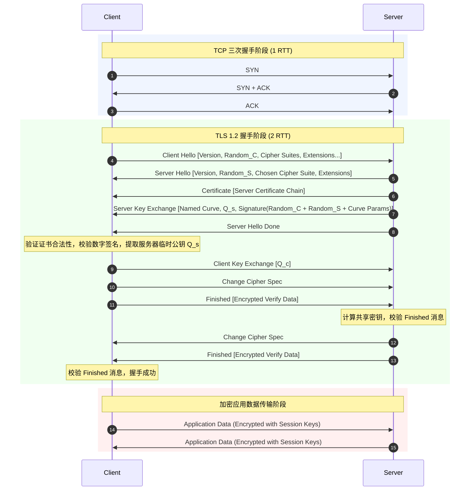
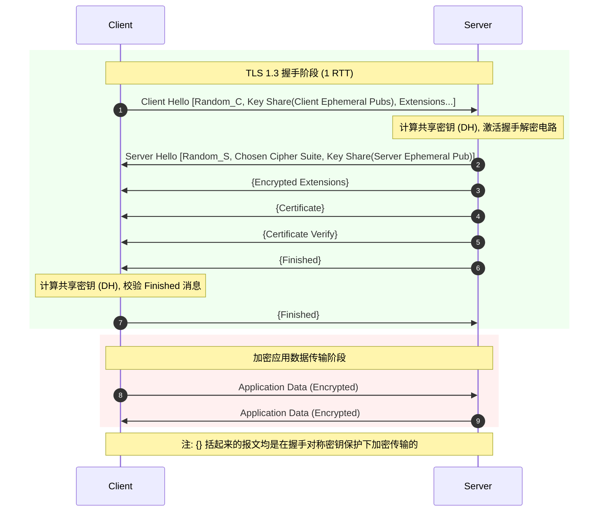

# 1.2.6.1 TLS基础

TLS（Transport Layer Security，传输层安全协议）是现代互联网通信的安全基石。它诞生于对不安全物理信道上进行可信通信的迫切需求。从 Netscape 最初开发的 SSL（Secure Sockets Layer）1.0/2.0/3.0，到 IETF 标准化后的 TLS 1.0/1.1/1.2，再到进行革命性重构的 TLS 1.3，该协议历经了近三十年的安全攻防演进。

在 TCP/IP 五层网络模型中，TLS 通常被认为运行于传输层（TCP）之上、应用层（如 HTTP、SMTP）之下。在概念上，它提供了一个“安全会话层”，通过将上层应用数据分块、压缩（可选）、加密并计算消息认证码，然后封装在 TCP 报文中传输，实现了对应用层的完全透明。本文将自底向上、由浅入深地剖析 TLS 协议的核心原理解密机制、握手流程演进、数学机理以及安全防御哲学。

---

## 1. 网络传输面临的安全威胁与防御哲学

在开放式的互联网络中，任何两点之间的 IP 数据报文都需要经过数量众多的中间路由器、交换机、网关以及物理光缆。这一链路天然具有公开性和易受攻击性。密码学将网络通信面临的安全威胁总结为三大类：**窃听（Eavesdropping）**、**篡改（Tampering）**与**冒充（Spoofing）**。TLS 协议正是为了对抗这三种威胁而设计的，其防御哲学构筑在机密性、完整性与身份认证三大密码学支柱之上。

```
                    ┌────────────────────────────────────────┐
                    │        网络传输面临的三大安全威胁        │
                    └───────────────────┬────────────────────┘
                                        │
         ┌──────────────────────────────┼──────────────────────────────┐
         ▼                              ▼                              ▼
┌─────────────────┐            ┌─────────────────┐            ┌─────────────────┐
│  窃听 (机密性)   │            │  篡改 (完整性)   │            │  冒充 (身份认证) │
└────────┬────────┘            └────────┬────────┘            └────────┬────────┘
         │                              │                              │
         ▼                              ▼                              ▼
┌─────────────────┐            ┌─────────────────┐            ┌─────────────────┐
│    混合加密     │            │    双重哈希     │            │   CA 证书体系    │
│  (对称+非对称)   │            │   (HMAC/AEAD)   │            │   (数字签名)    │
└─────────────────┘            └─────────────────┘            └─────────────────┘
```

### 1.1 窃听风险与机密性（Confidentiality）的构建

#### 1.1.1 窃听的本质与技术路径
窃听是指攻击者在不干扰通信双方正常传输的前提下，旁路获取传输报文副本的行为。在局域网内，攻击者可通过 ARP 欺骗（ARP Spoofing）或 MAC 地址泛洪将流量重定向至自身的监听网卡；在广域网或骨干网节点，通过光纤分光器（Optical Splitter）等物理设备，可以在完全不影响光信号传输的情况下复制完整的光纤信号。如果传输采用明文，攻击者使用网络抓包分析工具（如 Wireshark、tcpdump）即可将协议栈的所有内容（包括敏感的用户凭证、会话令牌、业务数据）一览无遗。

防御窃听的核心手段是构建**机密性（Confidentiality）**，其本质是通过数学方法将明文（Plaintext）转换为攻击者无法理解的密文（Ciphertext）。

#### 1.1.2 对称加密的优势与密钥分发难题
对称加密（Symmetric Cryptography）是指加密和解密使用同一个密钥 $K$ 的密码体制。其基本数学表达为：
$$C = E_K(P), \quad P = D_K(C)$$
其中 $P$ 为明文，$C$ 为密文，$E$ 和 $D$ 分别为加密和解密算法。

在现代 TLS 中，主流的对称加密算法是 **AES（Advanced Encryption Standard，高级加密标准）** 和 **ChaCha20**。
*   **AES** 属于分组密码（Block Cipher），它将明文划分为固定长度（128 位）的数据库，支持 128、192 或 256 位的密钥长度。AES 的内部结构基于 SPN（Substitution-Permutation Network，代换-置换网络），通过字节代换（SubBytes）、行移位（ShiftRows）、列混淆（MixColumns）和轮密钥加（AddRoundKey）的多轮迭代（AES-128 为 10 轮，AES-256 为 14 轮），在数学上实现了极高的混淆（Confusion）与扩散（Diffusion）性。
*   **对称加密的绝对优势**在于其卓越的**计算效率**与**高吞吐量**。在拥有 CPU 硬件加速指令集（如 Intel 的 AES-NI 指令集）的现代处理器上，对称加解密的速度可以达到每秒数吉字节（GB/s）级别，CPU 开销微乎其微。
*   **对称加密的致命缺陷**在于**密钥分发难题（Key Distribution Problem）**。在互联网万维网（WWW）的千亿级连接节点中，任何客户端与任意未知服务器首次通信时，如果直接在物理信道中发送对称密钥，该密钥必然会被窃听者捕获。若无法安全地分发密钥，对称加密的安全性就形同虚设。另外，若采用静态共享密钥，当系统中有 $N$ 个用户两两通信时，密钥管理的复杂度将呈 $O(N^2)$ 级爆炸增长。

#### 1.1.3 非对称加密的引入与混合加密体系
非对称加密（Asymmetric Cryptography，又称公钥密码学）彻底打破了密钥分发难题的死锁。它使用一对密钥：**公钥（Public Key）**与**私钥（Private Key）**。公钥是公开的，任何人都可以用于加密数据；而私钥是私密保留的，只有私钥的所有者才能解密被公钥加密的数据。其基本数学表达为：
$$C = E_{Pub}(P), \quad P = D_{Priv}(C)$$

非对称加密依赖于密码学中的**单向陷门函数（Trapdoor One-way Function）**。即对于函数 $y = f(x)$，在给定 $x$ 计算 $y$ 很容易，但在只知道 $y$ 的情况下计算 $x$ 极其困难；除非知道某些额外的信息（即“陷门”），这时逆向计算也会变得非常容易。
*   **RSA 算法**：基于大整数因子分解难题。将两个大质数 $p$ 和 $q$ 相乘得到 $n$ 是平庸的计算，但给定一个 2048 位的复合数 $n$，在多项式时间内将其分解为 $p$ 和 $q$ 在计算上是不可行的。这里，$n$ 和加密指数 $e$ 构成公钥，而解密指数 $d$（依赖于对欧拉函数 $\phi(n) = (p-1)(q-1)$ 的计算）则是只有知道 $p$ 和 $q$ 才能求出的私钥。
*   **ECC（Elliptic Curve Cryptography，椭圆曲线密码学）**：基于椭圆曲线离散对数难题（ECDLP）。在定义在有限域 $GF(p)$ 上的椭圆曲线群中，给定一个基点 $G$ 和一个点 $Q$，寻找一个整数 $k$ 使得 $Q = k \cdot G$（即点 $G$ 自身相加 $k$ 次）是计算极其困难的。在此，整数 $k$ 作为私钥，点 $Q$ 作为公钥。

然而，非对称加密的计算复杂度高昂。它涉及到数千位大整数的模幂运算（RSA）或复杂的椭圆曲线点加、倍点乘法（ECC），其执行效率比对称加密慢 3 到 4 个数量级。若直接使用非对称加密来保护大流量的应用层通信，会使服务器的 CPU 资源瞬间枯竭，导致严重的网络性能瓶颈。

为了兼顾“安全分发密钥”与“高效数据加密”，TLS 采用了**混合加密体系（Hybrid Cryptosystem）**。其核心哲学是：
1.  **阶段一（密钥协商）**：在连接建立之初，利用非对称加密（或基于非对称体系的密钥交换算法）在不安全的信道上安全地协商出一个临时的、高强度的对称密钥（即会话密钥，Session Key）。
2.  **阶段二（对称传输）**：一旦对称密钥协商完毕，后续的大规模应用层数据全部使用该对称密钥进行对称加密传输，从而在保障机密性的同时获得极高的吞吐率。

---

### 1.2 篡改风险与完整性（Integrity）的校验

#### 1.2.1 篡改的本质与传统校验的漏洞
篡改是指中间人（Man-in-the-Middle, MITM）截获传输数据包后，恶意修改其中的某些字段，或者注入/删除数据包，再将其发送给接收方的行为。TCP 协议的头部虽然包含了校验和（Checksum），但该校验和仅用于防御物理信道中的热噪声或电磁干扰导致的偶发性比特反转（使用简单的 16 位二进制反码求和算法），攻击者只需在修改数据的同时重新计算 TCP 校验和，即可完美欺骗 TCP 协议栈。

防御篡改的核心是构建**完整性（Integrity）**校验，确保接收端能够检测出任何哪怕是 1 个比特的非授权变动。

#### 1.2.2 单向散列函数与雪崩效应
单向散列函数（One-way Hash Function）可以将任意长度的输入消息 $M$ 压缩并映射为固定长度的输出值，即散列值（或哈希值）$H(M)$。它具备四个核心特性：
1.  **单向性（抗原像性）**：给定散列值 $h$，在计算上无法找出满足 $H(M) = h$ 的原消息 $M$。
2.  **弱抗碰撞性**：给定消息 $M_1$，在计算上无法找出另一个不同的消息 $M_2$ 使得 $H(M_1) = H(M_2)$。
3.  **强抗碰撞性**：在计算上无法找出任意两个不同的消息 $M_1$ 和 $M_2$ 使得 $H(M_1) = H(M_2)$。
4.  **雪崩效应（Avalanche Effect）**：输入数据的微小改变（如修改 1 个比特），其输出的散列值会发生天翻地覆的、不可预测的变化（通常每个输出比特有 50% 的概率发生翻转）。

然而，**单纯的散列函数无法防御恶意的篡改**。因为哈希算法是完全公开的，如果 Alice 将明文 $M$ 和 $Hash(M)$ 发送给 Bob，中间人 Eve 拦截后，可以将 $M$ 篡改为 $M'$，并自行计算 $Hash(M')$。当 Bob 收到篡改后的 $M'$ 与 $Hash(M')$，经过比对依然会认为数据是完整且正确的。

#### 1.2.3 消息认证码（MAC）与 HMAC 的构造防范
为了防止哈希值被攻击者同步篡改，必须在校验过程中引入“密钥”，这便诞生了**消息认证码（MAC, Message Authentication Code）**。MAC 必须由知道共享密钥 $K$ 的实体才能计算和验证。

一种直观的设计是直接拼接密钥与消息进行哈希，如 $Hash(K \parallel M)$（Prefix-MAC）或 $Hash(M \parallel K)$（Suffix-MAC）。然而，在密码学上，这些简单的组合存在严重的漏洞：
*   **长度扩展攻击（Length Extension Attack）**：对于像 MD5、SHA-1、SHA-256 这类基于 **Merkle-Damgård** 结构构建的迭代哈希函数，其计算是将消息划分为固定大小的块（如 512 位），并将前一块的计算输出作为当前块计算的输入（初始输入为常数 $IV$），最后的哈希值就是最后一个块的输出值。
    如果攻击者截获了消息 $M$ 和对应的 $MAC = Hash(K \parallel M)$，由于他知道该哈希值就是哈希函数内部状态的快照，因此即使攻击者完全不知道密钥 $K$，也可以将该 $MAC$ 作为哈希计算的初始状态（取代默认的 $IV$），继续拼接其自定义的追加消息 $M_{ext}$ 进行哈希计算。最终，攻击者在不知道 $K$ 的情况下，依然可以成功构造出一个合法的新消息 $M' = M \parallel Padding \parallel M_{ext}$ 以及其对应的有效 MAC 值。

为了彻底消除长度扩展攻击，密码学家设计了 **HMAC（Hash-based Message Authentication Code，基于哈希的消息认证码）**。其数学构造公式如下：
$$HMAC(K, m) = H\Big((K^+ \oplus opad) \parallel H\big((K^+ \oplus ipad) \parallel m\big)\Big)$$

其中：
*   $H$ 是基础的单向散列函数（如 SHA-256）。
*   $K^+$ 是将原始密钥 $K$ 进行处理后的密钥：若 $K$ 长度大于哈希分组长度，则先计算 $H(K)$，然后在其后填充 0 直至与哈希分组长度一致；若 $K$ 长度小于分组长度，则直接填充 0。
*   $ipad$（Inner Pad，内部填充值）是重复字节 `0x36` 构成的一个与哈希分组等长的常数块。
*   $opad$（Outer Pad，外部填充值）是重复字节 `0x5c` 构成的一个与哈希分组等长的常数块。
*   $\oplus$ 表示按位异或运算，$\parallel$ 表示字符串拼接。

```
                              ┌─────────────┐
                              │    密钥 K   │
                              └──────┬──────┘
                                     ▼
                              ┌─────────────┐
                              │  填充为 K+  │
                              └──────┬──────┘
                                     │
                 ┌───────────────────┴───────────────────┐
                 ▼                                       ▼
           ┌───────────┐                           ┌───────────┐
           │   ipad    │                           │   opad    │
           └─────┬─────┘                           └─────┬─────┘
                 ▼                                       ▼
               (异或)                                  (异或)
                 │                                       │
                 ▼                                       ▼
        ┌─────────────────┐                     ┌─────────────────┐
        │  K+ ⊕ ipad      │                     │  K+ ⊕ opad      │
        └────────┬────────┘                     └────────┬────────┘
                 │                                       │
                 │   ┌───────────┐                       │
                 │   │ 消息明文 m │                       │
                 │   └─────┬─────┘                       │
                 ▼         ▼                             │
               (字符串拼接)                               │
                 │                                       │
                 ▼                                       │
           ┌───────────┐                                 │
           │  内部 Hash │                                 │
           └─────┬─────┘                                 │
                 ▼                                       ▼
           ┌───────────┐                         ┌───────────────┐
           │ 内部散列值 ├────────────────────────►│  (字符串拼接)  │
           └───────────┘                         └───────┬───────┘
                                                         ▼
                                                   ┌───────────┐
                                                   │  外部 Hash │
                                                   └─────┬─────┘
                                                         ▼
                                                   ┌───────────┐
                                                   │ HMAC 输出 │
                                                   └───────────┘
```

HMAC 的巧妙之处在于其**双重哈希结构**。内部哈希首先将消息 $m$ 与混淆后的密钥 $K^+ \oplus ipad$ 绑定计算，输出一个中间散列值；外部哈希再次将该中间散列值与另一个混淆密钥 $K^+ \oplus opad$ 进行拼接哈希。由于外部哈希的输入是内部哈希生成的固定长度散列值，攻击者试图在 $m$ 后追加数据进行长度扩展攻击时，只能作用于内部哈希，而内部哈希的输出又要在外部哈希中与密钥进行二次混合，这彻底切断了攻击者利用哈希迭代状态进行伪造的路径。

---

### 1.3 冒充风险与身份认证（Authentication）的解决

#### 1.3.1 冒充的本质与信任链崩溃
冒充是指攻击者假冒目标服务器或客户端的身份，与通信另一方建立连接的行为。典型手段包括 DNS 污染（DNS Cache Poisoning），使得用户请求的域名被解析到攻击者的 IP 地址；或者在公共 Wi-Fi 环境下使用 ARP 欺骗，拦截所有网关流量并进行伪装响应。
如果客户端无法对服务器的身份进行**强认证（Authentication）**，即使后续通信采用了最先进的加密算法，客户端也只是在一个完全被攻击者掌控的安全通道中传输机密信息，其安全防线在起点即已崩溃。

#### 1.3.2 数字签名的数学与逻辑机理
数字签名（Digital Signature）是解决身份认证的核心工具。它是非对称加密算法的逆向应用，具有**不可伪造性**和**不可否认性（Non-repudiation）**。
其工作流程如下：
1.  **签名生成**：发送方（如服务器）使用单向散列函数对消息 $M$ 计算出摘要 $H(M)$，然后使用自己的**非对称私钥（Private Key）**对摘要进行加密，生成数字签名 $S$：
    $$S = Enc_{Priv}(H(M))$$
2.  **签名验证**：接收方（如客户端）收到消息 $M$ 和数字签名 $S$ 后，首先使用发送方的**公开公钥（Public Key）**对签名进行解密，得到摘要值 $H_{dec}$。同时，接收方对收到的消息 $M$ 重新计算哈希摘要 $H_{calc}$：
    $$H_{dec} = Dec_{Pub}(S), \quad H_{calc} = H(M)$$
    如果 $H_{dec} == H_{calc}$，则证明两点：
    *   该消息确实是由持有该私钥的发送方发送的（因为只有其私钥才能生成能被该公钥成功解密的签名）。
    *   消息在传输过程中未被篡改。

#### 1.3.3 证书信任体系（PKI - Public Key Infrastructure）与 CA 的诞生
数字签名虽然精妙，但它依然依赖于一个致命的前提：**客户端持有的公钥必须是真正属于服务器的**。如果服务器在连接开始时直接把自己的公钥以明文发送给客户端，中间人 Eve 可以拦截该公钥，并将其替换为 Eve 自己的公钥。此后，Eve 就可以用自己的私钥对伪造的消息进行签名，客户端使用接收到的“服务器公钥”（实际上是 Eve 的公钥）验证也会成功。这被称为“公钥的分发悖论”。

为了打破这个死循环，互联网引入了公信力极高的受信任第三方机构——**CA（Certificate Authority，证书颁发机构）**，并构筑了完整的 **PKI（公钥基础设施）** 体系。

服务器运营者不直接向客户端分发公钥，而是向 CA 申请一份**数字证书（Digital Certificate，符合 X.509 标准）**。
X.509 证书的物理结构包含了以下核心字段：

| 字段名称 | 描述 |
| :--- | :--- |
| **Version** | 证书版本，目前广泛采用的是 V3 版本，支持丰富的扩展字段。 |
| **Serial Number** | 由 CA 颁发的唯一序列号，用于标识和追溯证书。 |
| **Signature Algorithm** | CA 用于对本证书进行签名所使用的算法组合，例如 `sha256WithRSAEncryption` 或 `ecdsa-with-SHA256`。 |
| **Issuer** | 颁发此证书的 CA 的 Distinguished Name (DN)，代表 CA 的身份。 |
| **Validity** | 证书的有效期，包含起始时间（Not Before）与截止时间（Not After）。 |
| **Subject** | 证书持有者的身份信息，如域名（Common Name, CN，例如 `*.example.com`）或组织名称。 |
| **Subject Public Key Info** | 证书持有者的公钥算法标识及公钥的二进制数据。 |
| **Issuer Unique ID / Subject Unique ID**| 颁发者和持有者的唯一标识符（可选）。 |
| **Extensions** | 关键扩展，例如 `Subject Alternative Name`（SAN，允许证书绑定多个域名），以及证书基本约束（指示是否为 CA 证书）。 |
| **Signature Value** | CA 使用其私钥对上述所有字段计算哈希后进行加密所生成的**数字签名**。 |

#### 1.3.4 证书链的构建与递归校验工作机制
在实际部署中，客户端（如操作系统、浏览器）不可能内置世界上所有网站的证书，也不可能内置所有次级 CA 的公钥。PKI 采用**证书链（Certificate Chain）**实现分级授权。
证书链通常包含三个层次：
1.  **根证书（Root Certificate）**：由顶级根 CA 自签名（Self-signed）的证书。这些根证书的公钥被绝对信任，并被硬编码内置在主流操作系统和浏览器的“受信任的根证书颁发机构”列表中（被称为 Trust Anchor，信任锚）。
2.  **中间证书（Intermediate Certificate）**：由根 CA 或上一级中间 CA 签发。中间 CA 的存在是为了隔离根 CA，防止根 CA 私钥因为频繁的在线签发操作而面临泄露风险。根 CA 往往常年处于完全物理隔离的离线状态。
3.  **叶子证书（End-Entity Certificate，用户证书）**：由中间 CA 签发给具体域名的证书，不能用于签发其他证书。

当客户端与服务器建立连接时，服务器会发送一个完整的证书链：
$$\text{[叶子证书} \rightarrow \text{中间证书 1} \rightarrow \text{中间证书 2} \rightarrow \dots \rightarrow \text{根证书(可选)]}$$

客户端对证书链的验证逻辑是一个**自下而上的递归校验过程**：

```
客户端内置信任锚: [ Root CA 根证书 (含有 Root_Pub) ]
                          ▲
                          │ 验证 Root CA 对 Intermediate CA 的签名 (使用 Root_Pub)
               ┌──────────┴──────────┐
               │ Intermediate CA 证书 │ (含有 Inter_Pub)
               └──────────▲──────────┘
                          │ 验证 Intermediate CA 对 Server 的签名 (使用 Inter_Pub)
               ┌──────────┴──────────┐
               │  Server 叶子证书    │ (含有 Server_Pub)
               └──────────▲──────────┘
                          │ 验证连接实体的拥有权 (握手密钥交换)
                      [ 服务器 ]
```

1.  **步骤一：域名与有效期检查**
    客户端检查服务器发送的叶子证书中的 `Subject`（CN）或 `SAN` 字段是否与当前请求访问的域名匹配，并校验当前系统时间是否处于证书的 `Validity` 有效期内。
2.  **步骤二：叶子证书签名验证**
    客户端从叶子证书中提取签名，同时获取中间证书 1 的公钥。使用中间证书 1 的公钥解密叶子证书的签名，并与叶子证书内容的计算哈希值比对。若比对一致，说明叶子证书确实由该中间 CA 签发且未被修改。
3.  **步骤三：递归校验中间证书**
    客户端继续向上校验中间证书 1。提取中间证书 1 的签名，并使用中间证书 2（或根证书）的公钥进行解密验签。此过程递归进行。
4.  **步骤四：回溯至受信任根证书**
    递归的终点是匹配到客户端本地信任库中的某一个 Root CA。客户端直接提取本地保存的、不可篡改的 Root CA 公钥，来验证证书链中最后一个中间证书的签名。由于根证书是自签名的，且客户端本地信任该根证书，因此整条信任链条形成闭环。若链条上的每一步验签均成功，则客户端确认该叶子证书中的 `Server_Pub`（服务器公钥）是真实合法且属于目标域名的。

#### 1.3.5 证书吊销校验机制的演进与对比
证书在有效期内可能由于私钥泄露、域名所有权变更或 CA 错误签发等原因，必须提前失效。PKI 提供了三种主流的吊销检查机制：

##### A. CRL（Certificate Revocation List，证书吊销列表）
CRL 是由 CA 定期发布的一个被吊销证书序列号的列表，带有 CA 的数字签名。
*   **校验过程**：客户端在验证证书时，定期下载对应的 CRL 文件，并在本地缓存中检索当前证书的序列号是否在列表中。
*   **缺陷**：CRL 的体积会随着被吊销证书数量的增加而无限膨胀（有时可达数十兆字节），这会带来极大的网络带宽开销；同时，CRL 的更新通常有时间周期（如 24 小时或 7 天），在更新窗口期内，已被吊销的证书依然会被客户端信任，存在巨大的安全滞后窗口。

##### B. OCSP（Online Certificate Status Protocol，在线证书状态协议）
OCSP 改变了全量下载的模式，采用按需在线查询。
*   **校验过程**：客户端在握手过程中，提取服务器证书的序列号，直接向该证书指定的 CA OCSP 服务器（Responder）发送一个实时的查询请求。OCSP 服务器返回该证书的最新状态（Good/Revoked/Unknown）以及带有 CA 签名的响应数据。
*   **缺陷**：
    1.  **延迟开销**：在建立加密通道前，客户端必须先向 CA 发起一次额外的 HTTP 请求，若 CA 响应较慢，会显著延长连接建立的延迟。
    2.  **隐私泄露**：每次用户访问一个网站，都会向 CA 暴露该证书的查询请求，CA 能够借此追踪用户的全部上网浏览足迹。
    3.  **单点故障**：如果 CA 的 OCSP 服务因遭受攻击而宕机，客户端为了保证安全通常会采用“Fail-Closed”策略拒绝连接，导致网站无法访问。

##### C. OCSP Stapling（OCSP 状态装订）
OCSP Stapling 是目前最优的工业界解决方案。
*   **工作原理**：服务器自己定期（如每隔 1 小时）向 CA 的 OCSP 服务器发起查询，获取当前证书的最新的、带有 CA 数字签名和时间戳的 OCSP 响应，并将其缓存在本地。当客户端与服务器建立 TCP 连接并进行 TLS 握手时，服务器将该缓存的 OCSP 响应包与证书链一起发送给客户端（“Staple”在证书旁边）。
*   **安全防范**：客户端只需使用 CA 的公钥来验证这个 OCSP 响应的签名和有效期。因为该响应是由 CA 签名且有时效限制的（例如生存期 24 小时），服务器无法自行伪造。这既消除了客户端的延迟，又彻底避免了向 CA 暴露用户的访问隐私，同时消除了单点故障风险。

---

## 2. TLS 1.2 完整握手流程（Full Handshake）与交互时序

TLS 协议的握手过程是混合加密体系的核心体现。其核心任务是：协商协议版本、选择密码套件、验证服务器身份，并安全地生成用于后续对称传输的会话密钥。在 TLS 1.2 中，如果客户端和服务器是首次建立连接，通常采用 **2-RTT（Round-Trip Time，往返时延）** 的完整握手流程。

### 2.1 2-RTT 完整握手时序图与步骤拆解

下图展示了基于 ECDHE 密钥交换算法的 TLS 1.2 完整握手时序及参数交换过程：



#### 2.1.1 握手各阶段报文及携带参数深度剖析

##### 1. Client Hello (客户端发起)
这是 TLS 握手的起点，由客户端向服务端发送，包含客户端支持的配置列表：
*   **Version**：客户端支持的最高 TLS 协议版本（如 TLS 1.2）。
*   **Client Random（Random_C）**：客户端生成的 32 字节高强度随机数。其中前 4 字节通常是客户端当前系统的时间戳，后 28 字节为密码学安全伪随机数（PRNG）。该随机数将直接参与最终对称会话密钥的推导，并用于防止重放攻击。
*   **Session ID**：会话标识符。若是首次连接，该字段为空；若此前建立过连接，客户端可填入旧的 Session ID 尝试进行快速会话恢复。
*   **Cipher Suites**：客户端支持的密码套件列表，按客户端偏好降序排列（如 `TLS_ECDHE_RSA_WITH_AES_128_GCM_SHA256`）。
*   **Compression Methods**：客户端支持的压缩算法列表（由于 CRIME 攻击等安全漏洞，现代配置通常将其设为 Null，不启用压缩）。
*   **Extensions**：扩展字段。最关键的包括：
    *   `Server Name Indication (SNI)`：指定客户端正在请求访问的物理域名。这解决了在单台物理服务器（单 IP）上托管多个虚拟主机时，服务器无法在解密前确定应返回哪张数字证书的难题。
    *   `Supported Elliptic Curves` (Supported Groups)：声明客户端支持的椭圆曲线类型（如 secp256r1, X25519）。
    *   `Signature Algorithms`：客户端支持的数字签名算法及哈希组合（如 RSA-SHA256, ECDSA-SHA256）。

##### 2. Server Hello (服务端响应)
服务器在收到 Client Hello 后，评估客户端的配置，并确定本次连接所使用的具体参数：
*   **Version**：服务器确定使用的 TLS 版本（必须小于或等于客户端支持的最高版本）。
*   **Server Random（Random_S）**：服务器生成的 32 字节高强度随机数（同样包含时间戳和随机比特），用于后续会话密钥的派生。
*   **Session ID**：若服务器同意后续通过 Session ID 恢复会话，会返回一个 Session ID。
*   **Cipher Suite**：服务器从客户端支持列表中挑选出的、安全性最高且服务器也支持的唯一密码套件。
*   **Extensions**：对应客户端扩展的协商结果确认。

##### 3. Certificate (发送证书)
服务器发送其数字证书链给客户端。该消息包含一个证书数组，首元素为服务器的叶子证书，后续为签发它的中间证书，直至根证书（根证书通常由客户端内置，服务器可省略发送以节省流量）。

##### 4. Server Key Exchange (服务器密钥交换 - 关键差异点)
该步骤只有在选定的密钥协商算法需要服务器主动提供参数时才会发送（例如 DHE、ECDHE）。**如果选择 RSA 密钥交换算法，则绝对不发送此消息**。
对于基于 ECDHE 的密钥协商，服务器在此消息中发送：
*   选定的椭圆曲线群参数（Named Curve）。
*   服务器的临时公钥 $Q_s$。
*   **数字签名**：服务器使用其证书中对应的**静态私钥**（如静态 RSA 私钥），对客户端随机数（Random_C）、服务器随机数（Random_S）以及服务器临时公钥参数进行签名。该签名用于向客户端证明：发送临时公钥 $Q_s$ 的实体确实是证书的所有者，防止中间人拦截并伪造 $Q_s$。

##### 5. Server Hello Done (服务端握手准备完毕)
服务器发送该消息，通知客户端其 Hello 阶段及密钥参数的发送已经结束，接下来等待客户端发送其密钥参数。

##### 6. Client Key Exchange (客户端密钥交换)
客户端在收到 Server Hello Done 后，首先会对服务器的证书链进行严格验证（如 1.3.4 节所述）。验证通过后，客户端向服务器发送计算共享秘密所需的数据。
*   **在 RSA 密钥协商模式下**：客户端在本地生成一个 48 字节的随机数——**Pre-master Secret（预主密钥）**。然后，客户端从服务器证书中提取静态公钥，对该 Pre-master Secret 进行加密，并通过 Client Key Exchange 发送给服务器。
*   **在 ECDHE 密钥协商模式下**：客户端在本地生成一个临时私钥 $d_c$，计算出其临时公钥 $Q_c = d_c \cdot G$。客户端在 Client Key Exchange 中仅发送其临时公钥 $Q_c$ 的数据，无需进行加密。

##### 7. Change Cipher Spec (客户端宣告切换加密)
客户端发送此单字节消息（它不是握手协议消息，而是独立的 TLS 记录层协议消息），通知服务器：“从此刻开始，我发送的所有数据都将使用刚刚协商好的对称加密算法和对称密钥进行加密传输。”

##### 8. Finished (客户端完成验证)
客户端向服务器发送 Finished 消息。该消息包含一个校验数据包（Verify Data），其内容是对之前所有握手步骤中发送和接收的全部报文（Client Hello 到 Change Cipher Spec 之前的所有数据）进行哈希运算后，使用协商出的对称密钥和 MAC 算法计算出的认证值。
*   如果服务器收到该消息并能成功解密和通过 MAC 校验，说明握手数据在传输中没有被中间人篡改，且客户端与服务器算出的对称会话密钥是一致的。

##### 9. Change Cipher Spec & Finished (服务端宣告切换并验证)
服务器收到客户端的 Finished 消息并验证通过后，也相继发送其自己的 Change Cipher Spec 和 Finished 消息。客户端同样对服务端的 Finished 消息进行解密和 MAC 校验。一旦双方的 Finished 校验都成功，TLS 握手宣告正式完成，安全通道建立，开始传输加密的应用层数据（Application Data）。

---

### 2.2 密钥协商算法演进与数学机理

TLS 的安全性完全建立在密钥交换（Key Exchange）过程的数学安全性之上。密钥交换算法的目标是：在完全公开的物理网络信道中，客户端和服务器能够共同计算出一个只有他们两者知道的 Pre-master Secret，而任何窃听者即使记录了所有的传输报文，也无法计算出该密钥。

#### 2.2.1 基于 RSA 的密钥协商及其前向安全性缺陷
基于 RSA 的密钥交换是 TLS 早期的默认选择，其机制直观：

```
客户端                                                  服务端
  │                                                       │
  │ 1. 验证证书合法性，获取服务器静态公钥 Pub_S           │
  │ 2. 生成随机的 48 字节 Pre-master Secret               │
  │ 3. 用 Pub_S 加密 Pre-master Secret                    │
  │                                                       │
  ├────────────────── Client Key Exchange ───────────────►│
  │                  (密文 = Enc_Pub_S(PMS))              │ 4. 使用静态私钥 Priv_S
  │                                                       │    解密密文，得到 PMS
  ▼                                                       ▼
双方利用 PMS + Random_C + Random_S 派生出最终的会话密钥 Session Keys
```

*   **漏洞本质——不支持完美前向安全（Perfect Forward Secrecy, PFS）**：
    前向安全是指即使长期使用的静态私钥（如服务器的静态私钥 `Priv_S`）发生泄露，攻击者也无法解密历史上已经发生并被记录的加密通信流量。
    在基于 RSA 的密钥协商中：
    1.  攻击者可以在主干网节点部署存储设备，长期监听并持久化存储客户端与服务器之间的所有 TLS 通信数据（包括握手报文和后续的所有加密应用流量）。
    2.  由于 Pre-master Secret（PMS）是由客户端生成并用服务器公钥加密发送的，**其唯一的安全防线完全依赖于服务器的静态私钥 `Priv_S` 的机密性**。
    3.  若在未来的某一天，服务器运营者因为配置失误（如被入侵）、CA 吊销管理漏洞、甚至是强力的量子计算破解，导致服务器私钥 `Priv_S` 泄露。
    4.  攻击者即可拿出当年记录的历史报文，对 `Client Key Exchange` 消息进行解密，得到对应的 PMS。结合公开记录的 `Random_C` 和 `Random_S`，攻击者即可完美推导出历史所有连接的会话密钥，将当年所有的历史流量彻底解密。这在金融、政府以及高敏感度通信中是无法接受的灾难。

#### 2.2.2 基于 Diffie-Hellman (ECDHE) 的密钥交换与 PFS 的数学机理
为了彻底根治静态私钥泄露危及历史流量的硬伤，TLS 引入了临时 Diffie-Hellman（DHE / ECDHE）密钥协商算法。其根本改变是：**密钥的产生不再依赖静态公私钥对的加解密，而是通过非对称数学变换由双方临时计算得出。**

##### 1. 经典 DH 的数学基础（离散对数问题 DLP）
设 $p$ 是一个极大的素数，$g$ 是模 $p$ 的一个原根（生成元）。所有算术运算均在有限循环群 $\mathbb{Z}_p^*$ 上进行。
*   Alice 选择一个秘密的临时私钥 $a \in [1, p-2]$，计算其临时公钥：
    $$A = g^a \pmod p$$
*   Bob 选择一个秘密的临时私钥 $b \in [1, p-2]$，计算其临时公钥：
    $$B = g^b \pmod p$$
*   Alice 与 Bob 在网络中公开交换 $A$ 和 $B$。
*   计算共享密钥：
    *   Alice 计算：$S = B^a \pmod p = (g^b)^a \pmod p = g^{ab} \pmod p$
    *   Bob 计算：$S = A^b \pmod p = (g^a)^b \pmod p = g^{ab} \pmod p$
    根据模幂运算的幂乘性质，Alice 与 Bob 得到了完全相同的共享秘密 $S$。
*   **数学难点**：窃听者在网络上只能拦截到公开的 $p, g, A, B$。要计算出 $S$，窃听者必须解方程 $A = g^a \pmod p$ 或 $B = g^b \pmod p$ 以获取私钥 $a$ 或 $b$。这属于**离散对数难题（DLP）**。当 $p$ 的长度达到 2048 位或更高时，目前人类已知的最佳算法（如数域筛法 GNFS）在现有的超级计算机上需要计算数万年，因此在计算上是完全安全的。

##### 2. ECDHE 的椭圆曲线机理（ECDLP）
ECDHE 是 DH 算法在椭圆曲线群上的投影。与经典 DH 相比，它在同等安全强度下所需的密钥长度小得多（例如，256 位 ECC 密钥的安全性等价于 3072 位 RSA/DH 密钥），极大地降低了计算开销与网络传输负担。
其数学交换机理如下：
1.  **参数约定**：客户端与服务器约定一条公共的椭圆曲线 $E$（如 SECG 推荐的 secp256r1 曲线，其方程为 $y^2 = x^3 - 3x + b \pmod p$）以及该曲线上的一个基点 $G$。
2.  **客户端生成**：客户端生成一个高强度的随机大整数 $d_c$ 作为其**临时私钥**，计算其**临时公钥点** $Q_c$：
    $$Q_c = d_c \cdot G \quad (\text{椭圆曲线标量乘法})$$
3.  **服务器生成**：服务器生成一个高强度的随机大整数 $d_s$ 作为其**临时私钥**，计算其**临时公钥点** $Q_s$：
    $$Q_s = d_s \cdot G$$
4.  **公钥交换与身份绑定**：
    *   服务器将临时公钥 $Q_s$ 发送给客户端（`Server Key Exchange`）。为了防止中间人仿冒该公钥，服务器必须使用其**静态私钥**（如证书中的 RSA 或 ECDSA 私钥）对参数 $Q_s$ 进行数字签名。
    *   客户端使用服务器证书中的**静态公钥**验证签名，确认 $Q_s$ 确实来自于该服务器。
    *   客户端将临时公钥 $Q_c$ 发送给服务器（`Client Key Exchange`）。
5.  **共享秘密计算**：
    *   客户端计算：
        $$S = d_c \cdot Q_s = d_c \cdot (d_s \cdot G) = (d_c \cdot d_s) \cdot G$$
    *   服务器计算：
        $$S = d_s \cdot Q_c = d_s \cdot (d_c \cdot G) = (d_s \cdot d_c) \cdot G$$
    由于阿贝尔群标量乘法的交换律与结合律，双方算得的曲线点 $S(x, y)$ 是同一个点。取该点坐标的 $x$ 轴分量的字节数组，即作为本次连接的 **Pre-master Secret**。

```
客户端                                                        服务端
  │                                                             │
  │ 1. 验证证书签名，提取服务器静态公钥 Pub_S                    │
  │ 2. 验证 Server Key Exchange 签名                           │
  │ 3. 提取服务器临时公钥 Q_s = d_s * G                         │
  │ 4. 生成客户端临时密钥对: d_c, Q_c = d_c * G                  │
  │                                                             │
  ├─────────────────── Client Key Exchange (Q_c) ──────────────►│
  │                                                             │
  │ 5. 计算共享点: S = d_c * Q_s                                │ 5. 计算共享点: S = d_s * Q_c
  │    (S = d_c * d_s * G)                                      │    (S = d_s * d_c * G)
  ▼                                                             ▼
双方最终计算出一致的 Pre-master Secret = S.x 坐标，并立即从内存中销毁临时私钥 d_c 和 d_s
```

##### 3. 完美前向安全（PFS）的实现本质
为什么 ECDHE 能天然实现 PFS？
其关键在于“**临时性（Ephemeral，即 'E' 的含义）**”。
*   在每次连接中，客户端的 $d_c$ 和服务器的 $d_s$ 都是完全随机、即时生成并仅存在于内存中的。一旦握手完成、Pre-master Secret 派生完毕，**这两个临时私钥就会被操作系统从内存中彻底擦除和销毁，永远不会写入非易失性存储介质（磁盘）中**。
*   即使未来的某一天，攻击者拿到了服务器的静态私钥（如证书对应的 RSA 私钥），该私钥在 ECDHE 握手过程中**仅用于对临时公钥进行签名验签，不参与任何数据加密与密钥计算**。
*   攻击者无法使用泄露的静态私钥来计算或还原历史通信中的 $d_c$ 和 $d_s$。由于椭圆曲线离散对数难题的存在，攻击者同样无法从网络中截获的公开公钥 $Q_c$ 和 $Q_s$ 推导出 $d_c$ 和 $d_s$。
*   因此，历史会话对应的共享点 $S$ 无法被任何第三方恢复，历史流量的安全性得到了数学层面的绝对保障。

---

### 2.3 密钥派生体系：从 Pre-master Secret 到 Session Keys

在 TLS 1.2 中，完成密钥协商后得到的 Pre-master Secret 是不能直接作为对称加密算法的密钥使用的。为了保证密钥的强度、单向隔离性以及防御重放、反射等攻击，TLS 1.2 采用了一个严密的分层密钥派生体系。

```
              ┌───────────────────────────────────┐
              │      Pre-master Secret (PMS)      │ (由密钥协商算法得出)
              └─────────────────┬─────────────────┘
                                │
                                ▼
                       ┌─────────────────┐
                       │ 伪随机函数 PRF  │◄─── 拼接 Client Random (Random_C)
                       └────────┬────────┘     与 Server Random (Random_S)
                                │
                                ▼
              ┌───────────────────────────────────┐
              │        Master Secret (MS)         │ (固定 48 字节)
              └─────────────────┬─────────────────┘
                                │
                                ▼
                       ┌─────────────────┐
                       │ 伪随机函数 PRF  │◄─── 颠倒拼接 Server Random (Random_S)
                       └────────┬────────┘     与 Client Random (Random_C)
                                │
                                ▼
              ┌───────────────────────────────────┐
              │             Key Block             │ (派生出的长密钥流)
              └────────┬───┬───┬───┬───┬──────────┘
                       │   │   │   │   │
  ┌────────────────────┘   │   │   │   │   └────────────────────┐
  ▼                        ▼   ▼   ▼   ▼                        ▼
client_write_MAC_key       │   │   │   │      server_write_MAC_key (完整性校验密钥)
                     ┌─────┘   │   │   └─────┐
                     ▼         │   │         ▼
              client_write_key │   │ server_write_key (对称加密密钥)
                               ▼   ▼
                     client_write_IV server_write_IV (初始化向量，用于分组模式)
```

#### 2.3.1 伪随机函数（PRF - Pseudo-Random Function）的构造
TLS 1.2 依赖 PRF 来生成和扩展密钥。PRF 是以 HMAC 为基础进行构造的反馈式随机比特扩展器，其定义如下：
$$PRF(secret, label, seed) = P\_hash(secret, label \parallel seed)$$

其中 $P\_hash$ 函数是一个利用 HMAC 迭代产生任意长度伪随机流的函数：
$$P\_hash(secret, seed) = HMAC\_hash(secret, A(1) \parallel seed) \parallel HMAC\_hash(secret, A(2) \parallel seed) \parallel HMAC\_hash(secret, A(3) \parallel seed) \parallel \dots$$

其内部状态 $A(i)$ 定义为：
$$A(0) = seed, \quad A(i) = HMAC\_hash(secret, A(i-1))$$

这个构造使用类似瀑布式的机制，只要 $secret$（如 Pre-master Secret）不泄露，即使 $label$ 和 $seed$ 完全公开，输出的比特流也具有极佳的密码学统计均匀性，外界无法预测。

#### 2.3.2 步骤一：派生主密钥（Master Secret）
双方首先将 Pre-master Secret 转化为固定 48 字节的 **Master Secret**：
$$Master\ Secret = PRF(Pre\_master\ Secret, \text{"master secret"}, Random\_C \parallel Random\_S)$$

这里引入 `Random_C` 和 `Random_S` 的目的是**提供时变性（Replay Protection）**。由于 Pre-master Secret 的产生仅依赖于非对称数学运算，如果客户端的随机数发生器出现偏差（或者被截获），攻击者在重放握手请求时，如果能够复用 Pre-master Secret，引入两个完全不同的实时随机数 `Random_C` 和 `Random_S` 可以保证即使 Pre-master Secret 相同，最终派生出的 Master Secret 也绝对不一致。

#### 2.3.3 步骤二：派生最终会话密钥（Session Keys）
有了 48 字节的 Master Secret 后，双方使用 PRF 将其扩展为一个长密钥块（Key Block）：
$$Key\ Block = PRF(Master\ Secret, \text{"key expansion"}, Random\_S \parallel Random\_C)$$
*   **注意**：在派生 Key Block 时，客户端和服务器的随机数拼接顺序被特意颠倒为 $Random\_S \parallel Random\_C$。这是为了在协议层面制造非对称的熵流，避免密钥派生算法受到对称反射类攻击。

接下来，系统根据当前密码套件所需的密钥长度，将 Key Block 从前往后进行切割，分派给不同的用途：
1.  **`client_write_MAC_key`**：客户端发送数据时的消息认证码密钥。
2.  **`server_write_MAC_key`**：服务端发送数据时的消息认证码密钥。
3.  **`client_write_key`**：客户端发送数据时的对称加密密钥（如 AES 密钥）。
4.  **`server_write_key`**：服务端发送数据时的对称加密密钥。
5.  **`client_write_IV`**：客户端初始化向量（IV，在使用 CBC 或 GCM 分组加密模式时需要）。
6.  **`server_write_IV`**：服务端初始化向量。

*   **双向独立密钥设计的防御哲学**：
    TLS 显式地将发送和接收方向的密钥进行剥离（即 `client_write_key` 与 `server_write_key` 完全不同，MAC 密钥亦然）。
    这种设计是为了防御**反射攻击（Reflection Attack）**。在反射攻击中，攻击者拦截了客户端发送给服务端的密文数据包 $C_{c \rightarrow s}$，然后将其原封不动地作为服务端的响应包发送给客户端。如果发送和接收采用相同的加密密钥，客户端在接收到这个包后，会使用该密钥解密成功，并认为这是服务端发来的合法响应。双向独立密钥确保了客户端发出的密文，自己用读密钥（即服务端写密钥）是绝对无法成功解密和校验的，从而彻底在网络协议层堵死了此类攻击路径。
    *   **注**：若选用了 AEAD 认证加密套件（如 AES-GCM），由于 AEAD 在加密原语内部直接集成了完整性校验，因此不需要显式派生 `client_write_MAC_key` 和 `server_write_MAC_key`，这两部分的长度在密钥切割时被设为 0。

---

## 3. TLS 1.3 的革命性重构

虽然 TLS 1.2 在工业界统治了十余年，但其架构存在两个显著痛点：**握手慢（2-RTT 带来不可忽视的连接建立延迟）** 以及 **包袱重（支持大量已经过时且存在严重安全漏洞的密码套件和加密模式）**。为此，IETF 在 2018 年发布了 RFC 8446，即 **TLS 1.3**。这是一次彻底颠覆性的重构。

### 3.1 1-RTT 握手设计与状态机演进

在 TLS 1.2 中，为了进行密钥交换，客户端和服务器必须经历“Hello 阶段协商算法 $\rightarrow$ Key Exchange 阶段交换参数”的两轮往返。
TLS 1.3 通过“**前置协商（盲猜）**”的思想，将这两次往返压缩为一次往返，实现了 **1-RTT 握手**。



#### 3.1.1 1-RTT 握手步骤详解

1.  **Client Hello 盲猜与前置密钥分享**：
    客户端不再单纯发送支持的算法列表，而是“盲猜”服务器可能支持的椭圆曲线类型（现代网络中，几乎 99% 的服务器都支持 `X25519` 或 `P-256` 曲线）。
    客户端在发送 Client Hello 时，除了常规的 `Random_C` 外，通过 `supported_groups` 声明支持的椭圆曲线，并通过 **`key_share`** 扩展，直接生成这几条可能曲线上自己的临时公钥点（如客户端的 $Q_{c\_X25519}$ 和 $Q_{c\_P256}$）一并发送给服务器。
2.  **Server Hello 确认并完成协商**：
    服务器收到 Client Hello 后，选择双方共同支持的曲线（例如 `X25519`）。由于客户端在第一步中已经把该曲线的公钥 $Q_{c\_X25519}$ 发过来了，服务器立即生成自己的临时私钥 $d_s$ 和临时公钥 $Q_s$。
    服务器在 Server Hello 中，通过 `key_share` 扩展返回其临时公钥 $Q_s$。
    **此时，关键时刻发生**：在 Server Hello 发送完毕的这一瞬间，**客户端和服务器双方都已经拿到了彼此的临时公钥参数，它们在本地已经能够直接计算出共享的 Pre-master Secret 以及派生出握手会话密钥**。
3.  **握手全加密阶段**：
    在 Server Hello 之后的后续所有服务端握手报文：
    *   `Encrypted Extensions`（加密扩展信息，声明其他非安全关键的协议扩展项）
    *   `Certificate`（服务器证书链）
    *   `Certificate Verify`（服务器使用其**静态私钥**对全部握手历史记录进行的数字签名，用以向客户端证明身份）
    *   `Finished`（服务端握手校验值）
    **均使用刚才计算出的握手对称密钥进行加密传输**。
4.  **客户端 Finished 确认**：
    客户端收到后，解密并验证服务器的证书签名和 Finished 消息，如果无误，则向服务器发送其自己的 Finished 消息（同样加密）。握手宣告完成。

#### 3.1.2 1-RTT 带来的安全与性能提升
*   **网络延迟降低 50%**：握手由 2-RTT 缩减为 1-RTT，这对移动网络和长距离高延迟链路的首次连接性能提升立竿见影。
*   **握手隐私保护**：在 TLS 1.2 中，服务器的证书（Certificate）以及客户端的协商响应都是明文发送的。由于证书中包含域名的 CN 字段，任何网络嗅探者都能轻易获知用户正在访问哪个网站。而 TLS 1.3 实现了“全握手加密”，证书和除 Server Hello 之外的所有协商数据均在加密状态下传输，窃听者除了能看到 IP 之外，无法得知任何应用层的具体域名或配置细节。

#### 3.1.3 降级与兜底机制（Hello Retry Request）
如果客户端“盲猜”失败（例如客户端只发送了 $Q_{c\_X25519}$，而服务器是一台老旧服务器，只支持 `P-256` 曲线），服务器会向客户端发送一个 **`Hello Retry Request (HRR)`** 报文。
HRR 通知客户端：“我无法接收你提供的 key_share，请使用 P-256 曲线重新生成参数。”
客户端根据 HRR 的指示，重新生成 P-256 的临时公钥，发送第二次 Client Hello，后续握手继续。此时，握手退化为 2-RTT，但该机制成功保障了协议的向后兼容性与灵活性。

---

### 3.2 0-RTT 会话重建（0-RTT Resumption）与重放攻击防御

对于曾经建立过连接的客户端和服务器，TLS 1.3 引入了基于 PSK（Pre-Shared Key，预共享密钥）的 **0-RTT 会话重建** 机制，使得客户端可以在发送 Client Hello 的第一包数据中，就直接夹带加密的应用层业务数据（如 HTTP GET），将连接时延降低为零。

#### 3.2.1 PSK 机制的工作原理
1.  **会话票据分发**：在首次 1-RTT 握手成功后，服务器会向客户端发送一个 **`New Session Ticket`** 报文。该 Ticket 中包含了一个使用服务器内部密钥加密的加密结构体（包含了协商好的 PSK、会话算法、失效时间等），或者是一个指向服务器内存 Session 缓存的索引 ID。
2.  **快速会话恢复**：当客户端再次需要与该服务器通信时，客户端在 Client Hello 的 `pre_shared_key` 扩展中填入该 Ticket。
3.  **0-RTT 数据发送**：客户端在发送 Client Hello 的同时，利用先前会话缓存中保留的 PSK 衍生出的对称加密密钥，对应用层数据（0-RTT Data）进行加密，并紧随 Client Hello 发往服务端。
4.  **服务端接收**：服务端收到 Client Hello 后，解密 Ticket 提取出 PSK，确认其合法，随后直接使用该 PSK 的派生密钥解密 0-RTT Data 并处理，同时在 Server Hello 中向客户端确认接受 PSK 恢复。

#### 3.2.2 0-RTT 面临的致命威胁：重放攻击（Replay Attack）
由于 0-RTT 数据是在服务器确认客户端连接并参与协商之前发送的，它不需要依赖服务器在本次连接中产生的随机数 Challenge。这意味着，**0-RTT 请求报文在网络物理层是完全幂等的、可复制的。**

```
客户端 (Alice)                  攻击者 (Eve)                  服务端 (Bank)
  │                                │                             │
  │ ─── 0-RTT Client Hello + ──────┼────────────────────────────►│
  │     Ticket + Encrypted Data ───┼─►                           │
  │     ("提现 100 元")            │                             │ 1. 验证 Ticket 成功
  │                                │                             │ 2. 解密并处理提现
  │                                │                             │ 3. 响应成功
  │                                │                             │
  │                                │ ── 重放截获的数据 ─────────►│
  │                                ├────────────────────────────►│ (半小时后)
  │                                │ (0-RTT Client Hello +       │ 4. 再次验证 Ticket 成功
  │                                │  Ticket + Encrypted Data)   │ 5. 再次处理提现
  │                                │                             ▼ 造成双倍资金损失!
```

1.  **截获**：用户 Alice 在公共 Wi-Fi 环境下向银行网关发送了一个 0-RTT 报文，包含了 Client Hello、Ticket 以及加密的应用层业务数据 $E_{PSK}(\text{"POST /transfer?to=Bob&amount=100"})$。
2.  **复制**：攻击者 Eve 虽然无法解密这些数据，但她可以通过抓包完整截获这一串 TCP 载荷。
3.  **重放**：在 Alice 连接断开后，Eve 将截获的这串二进制报文原封不动地重新发送给银行服务器。
4.  **执行**：由于 Ticket 依然在有效期内，银行服务器收到后，解密 Ticket 成功，成功还原出 PSK，随后使用该 PSK 成功解密了 $E_{PSK}(\text{"POST /transfer?to=Bob&amount=100"})$。对于服务器而言，该请求的所有格式、证书标签、MAC 校验完全合法，因此服务器会将其作为一个全新的独立请求再次执行，导致 Alice 被二次扣款。

#### 3.2.3 协议层与应用层防范逻辑
重放攻击是 0-RTT 的天然附带风险，为了规避这一威胁，TLS 1.3 规范与应用架构设计必须协同实施多层防御体系：

##### A. 业务层面限制：仅允许安全的幂等请求（Safe & Idempotent）
TLS 1.3 明确建议：**0-RTT 数据只能携带绝对幂等的请求。**
*   在 HTTP 协议中，`GET`、`HEAD`、`OPTIONS` 被认为是安全的幂等请求，它们仅用于读取数据，不应改变服务器的后端状态。
*   对于带有状态修改副作用的请求（如 `POST`、`PUT`、`DELETE`），客户端必须禁止使用 0-RTT 发送，而必须等待 1-RTT 握手完全完成、双方产生全新的时变会话密钥后，才能在常规的加密信道中发送。

##### B. 服务器端防重放缓存（Anti-Replay Cache）
服务器在内存或分布式缓存（如 Redis）中建立一个近期接收到的 0-RTT 请求唯一哈希（如 Client Hello 中的密钥分享或票据指纹）的白名单过滤器：
*   当服务器收到 0-RTT 连接时，首先检索该连接的唯一指纹是否已存在于过滤器中。
*   若存在，说明该请求为重复发送，服务器将**拒绝 0-RTT 状态**。此时服务器不会断开连接，而是将该连接退化为标准的 1-RTT 握手，要求客户端在握手完成后重新发送数据；若指纹不存在，则将其写入过滤器（设定与 Ticket 相同的生存周期）并接受 0-RTT。

##### C. 混淆 Ticket 生存时间校验（Obfuscated Ticket Age）
Ticket 内部包含了 CA 颁发该票据时的绝对时间戳。
*   客户端在发送 0-RTT 连接时，必须在 Client Hello 中附带一个扩展字段 `obfuscated_ticket_age`，声明该 Ticket 从产生到当前发送时，具体流逝了多少毫秒（该值加上了一个由服务器生成并包含在 Ticket 内的随机偏移量，用以防止中间人通过流逝时间推测用户首次访问网站的绝对时间，保护隐私）。
*   服务器在收到请求后，解密 Ticket 提取出原始生成时间戳和偏移量，计算出客户端声明的流逝时间，并与服务器本地时钟计算出的实际流逝时间进行比对。若两个流逝时间差值超出了合理的网络传输延迟范围（例如相差了数秒甚至数分钟），服务器判定为重放攻击，拒绝 0-RTT 数据。

---

### 3.3 废除的历史包袱与安全加固

TLS 1.3 的另一项核心重构是实施了彻底的“瘦身”，清除了多年来由于向后兼容而保留的、已被密码学界攻破或证明存在隐患的“历史垃圾”。

#### 3.3.1 强制完美前向安全（废除静态 RSA 密钥交换）
在 TLS 1.3 中，所有支持的密钥交换机制必须具备完美前向安全。因此，**静态 RSA 密钥交换以及静态 DH 密钥交换被明令禁止**。所有的密钥协商必须通过基于椭圆曲线或有限域的临时密钥交换（ECDHE / DHE）完成。

#### 3.3.2 废除 CBC 模式与流密码 RC4
*   **RC4 的废除**：RC4 作为经典的流密码，因为在密钥流的前几百个字节中存在明显的偏差（Bias），攻击者可以通过收集大量重复会话解密出明文，已被全面禁用。
*   **CBC（Cipher Block Chaining）模式的废除**：
    CBC 模式是一种分组密码工作模式，在解密时，前一个密文块会参与当前密文块的解密异或：
    $$P_i = Dec_K(C_i) \oplus C_{i-1}$$
    为了使明文长度适配分组大小（通常为 16 字节），必须采用填充（如 PKCS#7 标准：缺 $N$ 个字节就填充 $N$ 个数值为 $N$ 的字节）。
    由于其设计采用了“**MAC-then-Encrypt**”或者在解密逻辑中将填充校验与 MAC 校验分离，这导致了致命的 **Padding Oracle（填充提示）攻击**。
    如果攻击者发送篡改后的密文，服务器在解密后：
    *   若填充格式错误，服务器返回解密失败/填充错误。
    *   若填充正确但 MAC 校验失败，服务器返回校验错误。
    *   即使服务器返回相同的错误提示，由于处理填充校验（只看最后几个字节）和处理 MAC 校验（计算整个报文的哈希）的 CPU 指令周期不同，攻击者可以通过高精度的时间测量（Side-Channel Timing Attack，侧信道时序攻击，如 **POODLE** 和 **BEAST** 攻击），逐字节猜测并破解密文的明文内容。为此，TLS 1.3 彻底废除了 CBC 模式。

#### 3.3.3 认证加密（AEAD）的全面统治
为了防止上述因为对称加密与消息认证分步执行、人为组合产生的逻辑漏洞，TLS 1.3 规定：**所有对称加密算法必须采用 AEAD（Authenticated Encryption with Associated Data，认证加密）模式**。

AEAD 在密码学原语级别，将机密性加密和完整性校验融合成了一个单一的、原子化的数学运算步骤。
以 **AES-GCM（Galois/Counter Mode）** 为例：
*   **加密与计数（CTR 模式）**：通过对计数器进行加密并与明文异或生成密文，具有极佳的并行计算性能。
*   **认证与完整性（Galois 域乘法）**：在加密的同时，利用专门的乘法散列算法（GHASH）在伽罗瓦域 $GF(2^{128})$ 上计算密文和关联数据（AAD，如 TCP 头部、TLS 头部等不需要加密但需要防篡改的信息）的认证标签（Tag）。
*   **原子化校验**：解密时，AEAD 接收端必须同时验证密文与 Tag。若密文或关联数据在传输中哪怕发生 1 个比特的改动，解密算法在校验 Tag 时会直接报错并终止，不会将解密到一半的数据传递给应用层，从而彻底在底层杜绝了时序攻击与 Padding Oracle 攻击的土壤。

```
AEAD (如 AES-GCM) 加密流程:
明文 (Plaintext) ────► [ 计数器模式加密 (CTR) ] ───► 密文 (Ciphertext) ───┐
                                                                         ▼
关联数据 (AAD) ────────────────────────────────────────────────────► [ Galois 域乘法 (GHASH) ] ──► 认证标签 (Tag)
                                                                         ▲
密钥 (Key) ──────────────────────────────────────────────────────────────┴───────────────
```

TLS 1.3 经过瘦身，仅保留了 5 个安全性极高的 AEAD 密码套件，大幅降低了配置失误导致的安全崩溃概率。

---

## 4. 加密套件（Cipher Suite）的物理构成与含义

加密套件是 TLS 握手协商的核心载体。它就像是一套密码学工具箱的清单，详细声明了本次安全通道所涉及的各种算法规范。

### 4.1 拆解 TLS 1.2 加密套件

以经典的高安全强度套件 **`TLS_ECDHE_RSA_WITH_AES_128_GCM_SHA256`** 为例，其物理构成和含义拆解如下：

```
 TLS _ ECDHE _ RSA _ WITH _ AES_128_GCM _ SHA256
──┬─   ──┬──   ─┬─   ──┬──   ─────┬────   ──┬───
  │      │      │      │          │         │
 协议   密钥   数字   连接符     对称加密  消息认证与
 标识   交换   签名              与工作模式  PRF散列
```

#### 1. 协议标识 (`TLS`)
表明该加密套件属于 TLS 协议族。

#### 2. 密钥交换算法 (`ECDHE`)
指定在握手阶段使用**临时椭圆曲线 Diffie-Hellman 密钥交换（Elliptic Curve Diffie-Hellman Ephemeral）**。
*   其职责是在不安全的物理信道中安全地协商出 Pre-master Secret，并确保完美前向安全（PFS）。

#### 3. 身份认证/数字签名算法 (`RSA`)
指定服务器在握手过程中，使用其数字证书中的 **RSA 私钥** 对临时椭圆曲线参数（包括服务器的临时公钥 $Q_s$）进行数字签名。
*   客户端使用服务器证书中的 RSA 公钥进行验签，以确认与其进行 ECDHE 交换的服务器身份是真实的，而非中间人冒充。

#### 4. 对称加密算法与工作模式 (`AES_128_GCM`)
这是用于保护后续应用层流量的对称加密配置。
*   `AES_128`：使用高级加密标准（AES），且对称会话密钥长度为 128 位（16 字节）。
*   `GCM`：指定分组密码的工作模式为伽罗瓦/计数器模式。这是一种高吞吐量的 AEAD（认证加密）模式，在现代处理器上有极强的并行硬件加速性能。

#### 5. 消息认证与 PRF 散列算法 (`SHA256`)
在 TLS 1.2 中，该字段具有双重功能：
*   **消息认证**：在使用 AEAD 算法之前，它指示了用于完整性校验的散列函数；在 AEAD 中，它主要指代在 TLS 握手结束时，对历史握手报文进行 `Finished` 阶段哈希校验时所用的散列函数（即计算 Finished 报文中的摘要）。
*   **密钥派生**：指定了派生主密钥和会话密钥时，伪随机函数（PRF）内部所使用的基础散列算法为 **SHA-256**（安全散列算法，输出 256 位）。

---

### 4.2 TLS 1.3 密码套件的极致简化

在 TLS 1.3 中，密码套件的命名发生了极大的简化。例如：
`TLS_AES_256_GCM_SHA384`

对比 TLS 1.2，**TLS 1.3 的加密套件中完全消失了密钥交换算法（如 ECDHE）与身份认证签名算法（如 RSA）的字样**。这一简化的背后是 TLS 1.3 彻底的“解耦”设计哲学：
1.  **密钥交换与套件分离**：在 TLS 1.3 中，密钥交换算法是通过 Client Hello 和 Server Hello 中的 `key_share` 与 `supported_groups` 扩展直接进行协商的，它不再和对称加密算法捆绑在加密套件的定义中。
2.  **身份认证与套件分离**：服务器的数字签名算法是由其证书类型（如拥有 RSA 证书还是 ECDSA 证书）以及 `signature_algorithms` 扩展字段独立决定的。
3.  **职责聚焦**：TLS 1.3 的加密套件仅需定义对称传输阶段的安全参数：
    *   **对称加密算法及长度**（如 `AES_256`）。
    *   **AEAD 工作模式**（如 `GCM`）。
    *   **HKDF 密钥派生所使用的散列函数**（如 `SHA384`）。

这避免了 TLS 1.2 中由于密钥交换、签名算法、对称加密、哈希函数的排列组合而产生多达数百个密码套件的混乱局面（许多组合在实际中极少使用甚至存在安全缺陷），TLS 1.3 仅保留的 5 个套件不仅让协议实现更加轻量，也让网络管理员的配置工作变得更加安全和纯粹。

---

## 5. 总结：TLS 1.2 与 TLS 1.3 的关键特性对比表

为了直观呈现 TLS 协议的演进，下表从多个维度对比了 TLS 1.2 与 TLS 1.3 的底层机制差异：

| 维度 | TLS 1.2 | TLS 1.3 |
| :--- | :--- | :--- |
| **标准发布规范** | RFC 5246 (2008 年) | RFC 8446 (2018 年) |
| **首次建立连接 RTT** | **2-RTT** | **1-RTT** |
| **会话恢复重建 RTT** | 1-RTT (通过 Session ID / Ticket) | **0-RTT** (通过 PSK / Ticket) |
| **完美前向安全 (PFS)** | 可选。若使用 RSA 密钥协商则不具备 | **强制**。所有会话必须具备 PFS |
| **握手报文隐私保护** | 证书链、密钥参数及扩展信息明文传输 | **全握手加密**。除 Hello 报文外全部加密 |
| **密钥协商与套件关系** | 密钥协商算法绑定在加密套件名称中 | 密钥协商算法与加密套件完全解耦 |
| **对称加密模式支持** | 支持流加密、分组 CBC、分组 AEAD 等 | **仅支持 AEAD** 模式，废除 CBC 和 RC4 |
| **安全隐患防范** | 易受 Padding Oracle、时序攻击影响 | 底层阻断时序攻击，业务层防范 0-RTT 重放 |
| **数字签名算法地位** | 与套件绑定，策略较为死板 | 剥离为独立扩展，自适应证书类型 |
