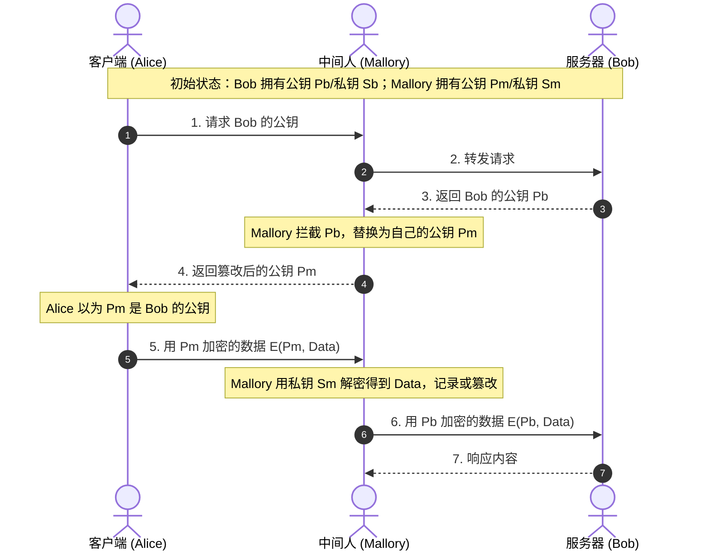
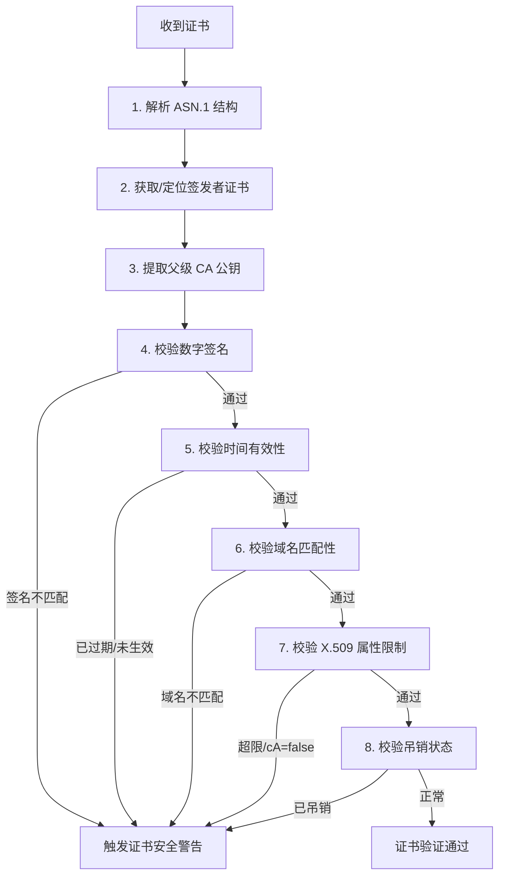
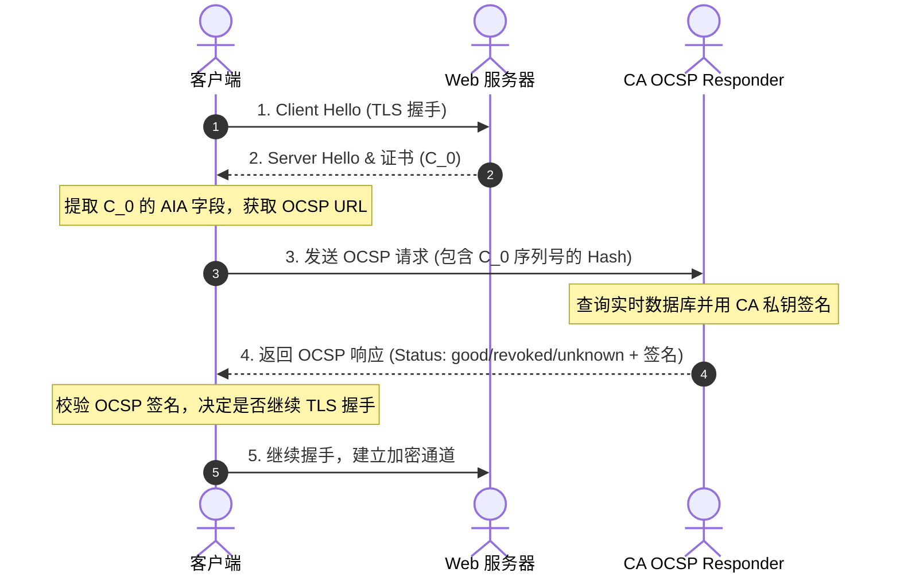
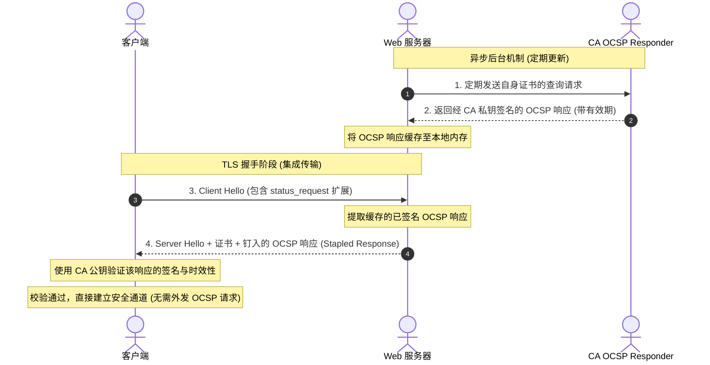

# 1.2.6.2 证书体系

## PKI 证书体系与信任链管理

### 一、公钥密码学的信任困境与第三方 CA 的诞生背景

#### 1. 非对称加密的核心逻辑与阿喀琉斯之踵
非对称加密（Asymmetric Cryptography）的诞生是现代密码学史上的里程碑，它解决了对称加密在开放网络中面临的“密钥分发通道安全”难题。非对称加密的核心逻辑在于将密钥分为两部分：公开的公钥（Public Key）和私密保留的私钥（Private Key）。
*   **加密与解密**：任何实体都可以使用公钥对数据进行加密，但只有持有对应私钥的实体才能将其解密。
*   **签名与验证**：私钥持有者可以使用私钥生成数字签名，任何拥有公钥的实体都可以验证该签名的真实性，从而确认消息确由私钥持有者发送且未被篡改。

然而，这种精妙的数学机制存在一个致命的逻辑漏洞：**纯粹的非对称密码学无法提供“公钥与身份的绑定关系”**。也就是说，虽然客户端可以通过数学方法验证某个签名确实是由某个公钥对应的私钥所生成，但客户端无法在物理和逻辑上确认这个公钥到底属于谁。

#### 2. 中间人攻击（MITM）的数学与物理本质
在没有第三方可信机构的场景下，通信双方直接交换公钥会面临经典的中间人攻击（Man-in-the-Middle Attack, MITM）。我们可以通过以下时序图和数学推导来剖析其本质：



*   **攻击推导**：
    1.  客户端 Alice 试图向服务器 Bob 发送一条敏感信息 $M$。Bob 的真实公钥为 $P_b$，私钥为 $S_b$。
    2.  在公钥分发阶段，Bob 将 $P_b$ 发送给 Alice。
    3.  攻击者 Mallory 拦截了该通信，截获了 $P_b$，并生成了自己的一对公私钥 $P_m$ 和 $S_m$。
    4.  Mallory 将自己的公钥 $P_m$ 伪装成 Bob 的公钥发给 Alice。由于缺乏验证机制，Alice 误以为 $P_m$ 就是 Bob 的公钥。
    5.  Alice 使用 $P_m$ 对敏感信息 $M$ 进行加密，计算出密文 $C = \text{Encrypt}(P_m, M)$ 并发送出去。
    6.  Mallory 拦截该密文，使用自己的私钥 $S_m$ 轻易解密：$M = \text{Decrypt}(S_m, C)$。此时，Mallory 窃取了明文 $M$。
    7.  为了不让 Alice 和 Bob 察觉，Mallory 甚至可以篡改 $M$ 得到 $M'$，然后用 Bob 的真实公钥 $P_b$ 加密：$C' = \text{Encrypt}(P_b, M')$，并将其发送给 Bob。
    8.  Bob 收到 $C'$ 后使用 $S_b$ 解密，得到 $M'$。整个通信链条在数学上是完全成立且合法的，但安全性已彻底崩溃。

中间人攻击之所以能成功，根本原因在于**公钥的分发缺乏身份认证（Authentication）**。Alice 无法判断收到的公钥是否真正属于 Bob。

#### 3. 信任中介：为什么需要第三方证书机构（CA）？
为了解决上述“公钥分发中的冒充问题”，必须引入一个独立于通信双方、且被双方共同信任的第三方机构，即**证书颁发机构（Certificate Authority, CA）**。

CA 的核心作用是扮演一个“数字公证处”。它通过严格的身份审查（例如验证域名的控制权、企业的工商信息等），将一个特定的实体身份（如域名 `example.com`）与其公钥进行绑定，并将这种绑定关系写入一个结构化文件中，再使用 CA 自身的私钥对该文件进行数字签名。这个经过签名的文件就是**数字证书（Digital Certificate）**。

当客户端拿到证书后，它不再需要直接去信任服务器发送的裸公钥，而是去验证该证书上的 CA 签名。因为 CA 的公钥已经以安全的方式预置在客户端本地，客户端只要验证签名合法，就可以推导出：
1.  该证书是由受信任的 CA 签发的。
2.  证书内容（包含服务器域名和服务器公钥）未被篡改。
3.  服务器确实拥有证书中所声明的域名，且其公钥是真实可信的。

通过这种信任传递机制，公钥的分发问题被转化为“如何安全地分发 CA 公钥”的问题，从而极大地缩小了信任漏洞的边界。

---

### 二、PKI 体系与 CA 的层级架构

#### 1. 公钥基础设施（PKI）的完整拼图
数字证书的运作并非孤立的，而是依赖于一个完整的技术和管理体系——**公钥基础设施（Public Key Infrastructure, PKI）**。PKI 是由硬件、软件、人员、策略和规程组成的集合，旨在实现公钥加密的创建、管理、分发、使用、存储和撤销。其核心组件包括：

*   **证书颁发机构（CA）**：PKI 的核心。负责证书的签发、更新、吊销和发布。它管理着整个体系中最关键的私钥。
*   **注册机构（Registration Authority, RA）**：CA 的前置审核机构。RA 负责接收用户的证书申请，验证申请者的身份和资质（例如检查域名所有权 DNS 记录、验证组织机构代码等）。一旦 RA 确认申请者身份真实可靠，就会向 CA 发出签发证书的指令。RA 使得 CA 可以专注于核心的签名操作，而将繁琐的身份审核工作剥离。
*   **证书库/目录服务**：用于公开发布已签发证书和证书吊销列表（CRL）的存储库，通常基于 LDAP、HTTP 或 DNS 协议，供客户端进行状态查询和公钥获取。
*   **凭证持有者/终端实体（End Entity）**：证书的使用主体，可以是 Web 服务器、客户端软件、IPSec 网关或个人。
*   **凭证依赖方（Relying Party）**：信任并使用证书来验证对方身份的实体，例如浏览器、操作系统内核、API 网关等。

#### 2. CA 的分层组织体系：根 CA 与中间 CA
在实际的 PKI 部署中，CA 并不是单一的物理实体，而是采用**树状的分层拓扑结构**（Hierarchical Trust Model）。这种设计主要是出于安全性、灵活性和管理便利性的考量。

```
              ┌─────────────────────────┐
              │      Root CA            │ (根 CA：物理离线，自签名证书)
              │  (Private Key in HSM)   │
              └────────────┬────────────┘
                           │ 签发
            ┌──────────────┴──────────────┐
            ▼                             ▼
┌───────────────────────┐     ┌───────────────────────┐
│   Intermediate CA 1   │     │   Intermediate CA 2   │ (中间 CA：日常在线签名)
│  (Private Key in HSM)   │     │  (Private Key in HSM)   │
└───────────┬───────────┘     └───────────┬───────────┘
            │ 签发                        │ 签发
            ▼                             ▼
┌───────────────────────┐     ┌───────────────────────┐
│  End-Entity Certificate│     │  End-Entity Certificate│ (终端实体证书：
│     (example.com)     │     │     (api.domain.com)  │  Web 服务器使用)
└───────────────────────┘     └───────────────────────┘
```

##### 根 CA（Root CA）
根 CA 处于信任链的最高端。它的特征包括：
*   **自签名（Self-Signed）**：根 CA 的证书是自签名的，即证书的颁发者（Issuer）和使用者（Subject）完全相同，且签名是用根 CA 自己的私钥生成的。
*   **至高信任源**：它是整个信任链的“信任锚（Trust Anchor）”。客户端必须在本地无条件信任根 CA 的公钥，才能展开后续的证书校验。
*   **物理离线（Offline）**：由于根 CA 的私钥一旦泄露将导致整个 PKI 体系彻底覆灭，因此根 CA 的私钥绝不接入任何网络，甚至不保存在日常运行的服务器中，而是保存在物理隔离的、极高安全级别的环境（如防爆保险库）中的硬件安全模块（HSM）里。只有在签发中间 CA 证书或定期生成根 CRL 时才会短暂开机。

##### 中间 CA（Intermediate CA）
中间 CA 由根 CA（或更高级别的中间 CA）签发。它的特征包括：
*   **日常在线签名**：中间 CA 负责日常的证书签发请求，它们的服务器通常是在线运行的，以便对 RA 提交的申请做出快速响应。
*   **风险隔离与限制**：引入中间 CA 的首要目的是**减小攻击面**。如果某个中间 CA 的私钥泄露，根 CA 只需要在离线状态下签发一个吊销该中间 CA 的声明即可，整个 PKI 的其他分支和根信任锚完全不受影响。
*   **分类管理**：不同的中间 CA 可以用于不同的业务场景。例如，可以针对不同的验证级别（DV - 域名验证、OV - 组织验证、EV - 扩展验证）设立不同的中间 CA；也可以按地理区域、业务部门（如邮件安全、代码签名、Web TLS）分别设立。

##### 下属/终端实体证书（End-Entity Certificate）
这是签发给最终用户的证书。它处于树状结构的叶子节点，**不具备再签发其他证书的权限**。在 X.509 标准中，其基本限制（Basic Constraints）字段中的 `cA` 属性被显式设置为 `false`。

#### 3. 根 CA 与中间 CA 的物理与运营隔离机制
为了确保 PKI 的根基不被动摇，根 CA 的管理和运行遵循极度严苛的安全规范。
*   **根密钥典礼（Root Ceremony）**：这是根 CA 生成公私钥对和自签名证书的法宝仪式。仪式必须在高度物理安全的审计房间内进行，由多位具有不同职责的受信任人员（Key Custodians）共同参与。每个步骤都被摄像记录，并由独立的第三方审计师进行全程现场审计。
*   **HSM（硬件安全模块）保护**：CA 密钥不以软件文件的形式存在于普通硬盘上，而是存储在符合 FIPS 140-2 Level 3 或 Level 4 标准的专用硬件安全模块（HSM）中。HSM 内部有物理防探测、防篡改机制（例如检测到外壳被强行打开、温度/电压异常时，会自动擦除内部敏感密钥）。HSM 的加密芯片可以直接在硬件内部执行签名运算，私钥永远无法被导出至硬件外部。
*   **M-of-N 多重控制（Secret Sharing）**：启用根 CA 的私钥通常需要满足多控制原则。例如，将控制 HSM 的物理钥匙或智能卡分给 5 个不同的受信任官员（Key Holders），必须至少有 3 个人（3-of-5）同时到场插入智能卡并输入口令，HSM 才能被激活并执行签名操作。这种机制彻底防范了单一内部人员作恶的风险。

---

### 三、X.509 数字证书标准与物理结构解析

#### 1. X.509 标准的历史与 ASN.1/DER 编码规范
X.509 是由国际电信联盟（ITU-T）制定的数字证书格式标准，自 1988 年作为 X.500 目录服务标准的一部分发布以来，已经历了三个版本：
*   **v1 (1988)**：确立了证书的基本结构，包括版本、序列号、发行者、有效期、主体和公钥。
*   **v2 (1993)**：引入了发行者唯一标识符和主体唯一标识符（目前极少使用）。
*   **v3 (1996)**：引入了极其关键的**扩展字段（Extensions）**，使证书能够携带更多的元数据（如域名别名、密钥用途、策略约束等），这也是当今互联网所使用的标准格式。

##### ASN.1 (Abstract Syntax Notation One)
ASN.1 是一种国际标准的数据描述语言，用于定义与平台、语言和底层传输语法无关的复杂数据结构。X.509 证书的逻辑结构正是用 ASN.1 语法定义的。例如，一个简化的证书 ASN.1 定义如下：

```asn
Certificate ::= SEQUENCE {
     tbsCertificate      TBSCertificate,
     signatureAlgorithm  AlgorithmIdentifier,
     signatureValue      BIT STRING
}
```

##### DER (Distinguished Encoding Rules)
由于 ASN.1 只是抽象的语法定义，在进行网络传输或数字签名时，必须将其转换为具体的二进制流。X.509 证书强制使用 **DER 编码规范**。
DER 是 ASN.1 的一种具体编码规则，属于 **TLV（Tag-Length-Value）** 格式。它的核心特点是**唯一性（Canonicality）**：对于给定的 ASN.1 数据结构，其 DER 二进制编码结果是唯一确定的（排除了多余的填充字节、可选字段的多种排列顺序等）。这种唯一性对密码学至关重要，因为如果编码不唯一，即使数据内容完全相同，其哈希值也会因编码差异而改变，导致签名校验失败。

##### PEM (Privacy-Enhanced Mail) 格式
由于 DER 编码是纯二进制数据，不便于在邮件、文本配置文件或网页中复制传输，因此通常会使用 **PEM 格式** 进行包装。PEM 格式的物理本质是：
1.  对 DER 编码的二进制字节流进行 **Base64** 编码。
2.  在编码后的文本前后加上头部和尾部边界标识行：
    `-----BEGIN CERTIFICATE-----`
    `[Base64 Encoded Data]`
    `-----END CERTIFICATE-----`

#### 2. X.509 v3 证书的物理构成详解
一个标准的 X.509 v3 证书在 DER 编码后，物理上由三大主要部分组成：**TBSCertificate（待签名证书内容）**、**SignatureAlgorithm（签名算法标识）** 和 **SignatureValue（签名值）**。

下面是 TBSCertificate 内部各字段的详细解构：

| 字段名称 | ASN.1 类型 | 物理含义与技术细节 |
| :--- | :--- | :--- |
| **Version** | `[0] EXPLICIT Version DEFAULT v1` | 版本号。对于 v3 证书，该值编码为整数 `2`（0代表v1，1代表v2，2代表v3）。 |
| **Serial Number** | `CertificateSerialNumber` | 证书序列号。由 CA 签发时分配的唯一正整数。根据 RFC 5280，其最大长度为 20 字节。为防止预测性碰撞攻击（如哈希碰撞构造），现代 CA 会在此处使用高强度的随机数生成器。 |
| **Signature** | `AlgorithmIdentifier` | 签发该证书所使用的签名算法标识符。必须与证书最外层的签名算法字段完全一致，以防止算法替换攻击（如：`sha256WithRSAEncryption`，其 OID 为 `1.2.840.113549.1.1.11`）。 |
| **Issuer** | `Name` | 证书颁发者的可识别名称（DN, Distinguished Name）。由一系列属性键值对（RDN, Relative DN）组成，如：`C=US, O=Let's Encrypt, CN=R3`。 |
| **Validity** | `Validity` | 有效期。包含两个时间字段：`notBefore`（证书生效时间）和 `notAfter`（证书失效时间）。现代 Web 证书的有效期通常被限制在 398 天以内，以缩短受损证书的生存窗口。 |
| **Subject** | `Name` | 证书持有者的可识别名称（DN）。标识该公钥绑定的实体身份。例如：`CN=www.example.com, O=Example Inc, L=Shenzhen, C=CN`。 |
| **Subject Public Key Info**| `SubjectPublicKeyInfo` | 证书承载的公钥信息。包含两个子字段：<br>1. `algorithm`：公钥的算法类型（如 RSA、ECDSA）及参数（如曲线名称 `secp256r1`）。<br>2. `subjectPublicKey`：具体的公钥数据（对于 RSA 是模数 $n$ 和指数 $e$；对于 ECC 是曲线上的点坐标）。 |
| **Issuer Unique ID** | `UniqueIdentifier` | 颁发者唯一标识符（v2/v3 可选，现代证书已不再使用）。 |
| **Subject Unique ID** | `UniqueIdentifier` | 使用者唯一标识符（v2/v3 可选，现代证书已不再使用）。 |
| **Extensions** | `[3] EXPLICIT Extensions` | 扩展字段（v3 独有）。以键值对形式存在，是现代证书实现复杂控制的核心。 |

#### 3. X.509 v3 关键扩展字段（Extensions）解析
扩展字段采用结构化定义，每个扩展包含三个要素：**Extension ID (OID)**、**Critical Flag (关键性标志，Boolean)** 和 **Extension Value (OCTET STRING)**。
> [!IMPORTANT]
> **关键性标志（Critical）的底层处理逻辑**：
> 如果一个扩展被标记为 `Critical = TRUE`，而客户端在解析证书时**无法理解或不支持**该扩展，客户端必须**强制判定证书验证失败**。如果标记为 `FALSE`，则客户端在不支持该扩展时可以选择忽略它，继续校验。这提供了一种向后兼容与强制安全约束的平衡机制。

以下是互联网中最核心的几个扩展字段：

##### Basic Constraints（基本限制）
*   **OID**: `2.5.29.19`
*   **是否关键**: 通常为 `TRUE`（在 CA 证书中必须为关键）。
*   **作用**: 声明该证书是否为 CA 证书（`cA = TRUE` 或 `cA = FALSE`），以及限制该证书下属的信任链最大路径长度（`pathLenConstraint`）。如果 `pathLenConstraint = 0`，代表该中间 CA 只能直接签发终端实体证书，不能再签发下级中间 CA。

##### Key Usage（密钥用法）
*   **OID**: `2.5.29.15`
*   **是否关键**: 通常为 `TRUE`。
*   **作用**: 限制公钥的密码学用途。它通过位图（Bit String）定义，常见取值包括：
    *   `digitalSignature`：用于数字签名（如客户端认证、机密性校验）。
    *   `keyEncipherment`：用于加密对称密钥（如 RSA 握手模式中的密钥协商）。
    *   `keyCertSign`：用于验证其他证书上的签名（**CA 证书必须开启此位**）。
    *   `cRLSign`：用于验证吊销列表（CRL）上的签名。

##### Extended Key Usage (EKU, 扩展密钥用法)
*   **OID**: `2.5.29.37`
*   **是否关键**: 可选。
*   **作用**: 进一步限制公钥的特定应用场景。常用的 OID 包括：
    *   `serverAuth` (`1.3.6.1.5.5.7.3.1`)：Web 服务器 TLS 身份验证。
    *   `clientAuth` (`1.3.6.1.5.5.7.3.2`)：客户端 TLS 身份验证。
    *   `codeSigning` (`1.3.6.1.5.5.7.3.3`)：可执行代码数字签名。

##### Subject Alternative Name (SAN, 使用者可选名称)
*   **OID**: `2.5.29.17`
*   **是否关键**: 通常为 `FALSE`。
*   **作用**: 现代 Web 证书中**最关键**的字段。它允许将多个标识符与同一个证书绑定，支持域名（DNS Name）、IP 地址（IP Address）、电子邮件（RFC822Name）和 URI。
> [!NOTE]
> 历史上的 X.509 证书使用 Subject 字段中的 Common Name (CN) 来校验域名。但 CN 存在只能指定单一域名、不支持 IP 地址、格式定义模糊等缺陷。现代浏览器和 TLS 实现已**彻底废弃对 CN 的校验**，转为强制要求在 SAN 字段中指定域名。

##### Authority Key Identifier (AKI) 与 Subject Key Identifier (SKI)
*   **AKI OID**: `2.5.29.35` | **SKI OID**: `2.5.29.14`
*   **作用**: SKI 是当前证书公钥的哈希值（通常是 SHA-1 计算的 160 位值）。AKI 是签发该证书的父级证书公钥的哈希值。在客户端构建证书链时，通过比对当前证书的 `AKI` 是否等于父级证书的 `SKI`，可以极大地加速证书链的匹配与构建过程。

##### CRL Distribution Points (CDP, CRL 分发点)
*   **OID**: `2.5.29.31`
*   **作用**: 提供一个或多个 URL，指向 CA 定期发布的证书吊销列表（CRL）的二进制文件下载地址，协议通常为 HTTP 或 LDAP。

##### Authority Information Access (AIA, 权威信息访问)
*   **OID**: `1.3.6.1.5.5.7.1.1`
*   **作用**: 提供两个极其重要的辅助信息：
    *   `caIssuers`：父级 CA 证书的下载 URL（方便客户端在缺失中间证书时动态下载构建证书链）。
    *   `ocsp`：该证书对应的在线证书状态协议（OCSP）响应服务器的 URL。

---

### 四、数字证书的签名与验证机制：数学与物理原理

数字证书的核心防篡改和身份认证能力完全建立在数字签名的密码学基础之上。本节将从底层数学推导和物理时序两方面对这一机制进行剖析。

#### 1. 数字签名的数学逻辑与密码学推导

数字签名是基于非对称加密算法的逆向应用。由于非对称解密计算（私钥计算）非常消耗资源，且直接对大文件进行加密存在安全隐患（容易受到选择明文攻击），因此数字签名总是先将任意长度的输入通过密码学哈希函数（散列函数）压缩为固定长度的摘要，再对摘要进行私钥加密。

目前，互联网中最常用的签名算法为 **SHA-256 with RSA** 和 **ECDSA**（基于椭圆曲线）。下面分别展开其数学推导。

##### 方案 A：RSA 签名算法数学推导

1.  **密钥对生成**：
    *   CA 选择两个互异的大质数 $p$ 和 $q$。
    *   计算模数 $n = p \times q$。
    *   计算欧拉函数 $\varphi(n) = (p - 1)(q - 1)$。
    *   选择一个与 $\varphi(n)$ 互质的整数 $e$ 作为公钥指数（现代标准通常取固定值 $e = 65537$）。
    *   利用同余方程 $e \cdot d \equiv 1 \pmod{\varphi(n)}$ 计算私钥指数 $d$（模反元素）。
    *   **公钥**为 $(e, n)$，**私钥**为 $(d, n)$。
2.  **签名生成（CA 私钥操作）**：
    *   待签名数据（TBSCertificate 编码流）为 $M$。
    *   使用哈希算法计算摘要：$h = \text{SHA-256}(M)$。
    *   **填充（Padding）**：由于直接对哈希值 $h$ 进行指数运算存在代数同态攻击风险，必须对 $h$ 进行格式化填充。常用的填充标准是 **PKCS#1 v1.5** 或更安全的 **PSS（Probabilistic Signature Scheme）**。
        *   以 PKCS#1 v1.5 签名为例，填充后的数据块格式为：`00 || 01 || PS || 00 || T`。其中 `01` 代表私钥签名操作，`PS` 是全为 `0xFF` 的填充字节，`T` 是包含哈希算法 OID 和哈希值 $h$ 的 ASN.1 结构体。填充后的整数字为 $m$（要求 $m < n$）。
    *   计算签名值 $S$：
        $$S \equiv m^d \pmod n$$
    *   $S$ 即为证书末尾的二进制签名值。
3.  **签名校验（客户端公钥操作）**：
    *   客户端获取证书内容 $M$ 和签名值 $S$。
    *   提取 CA 证书中的公钥 $(e, n)$。
    *   计算恢复值 $m'$：
        $$m' \equiv S^e \pmod n$$
    *   根据填充标准解析 $m'$，提取其中的哈希值 $h'$，并检查填充格式（如 `PS` 字段等）是否正确。
    *   独立计算证书内容的哈希值 $h = \text{SHA-256}(M)$。
    *   比对：若 $h' == h$，则签名通过，证明证书内容合法且确由 CA 私钥持有者签发。

##### 方案 B：ECDSA（椭圆曲线数字签名算法）数学推导

基于椭圆曲线的签名在保证相同安全强度的前提下，密钥长度和签名大小都远小于 RSA。
1.  **参数与密钥生成**：
    *   选择一条特定的椭圆曲线 $E$（如 `secp256r1`），其基点（生成元）为 $G$，群的阶（素数）为 $n$。
    *   CA 选择一个随机整数 $d \in [1, n-1]$ 作为**私钥**。
    *   计算椭圆曲线点乘得到**公钥**：$Q = d \cdot G$（$Q$ 是曲线上的一个点坐标 $(x_Q, y_Q)$）。
2.  **签名生成（CA 私钥操作）**：
    *   计算待签名数据 $M$ 的哈希值，并将其截断为与 $n$ 的比特长度相同，得到整数 $e$。
    *   选择一个临时的随机整数 $k \in [1, n-1]$（**注意：$k$ 绝不能泄露，且每次签名必须完全随机，否则会导致私钥 $d$ 被直接推导出来**）。
    *   计算椭圆曲线点 $R = k \cdot G$，其坐标为 $(x_1, y_1)$。
    *   计算签名分量 $r$：
        $$r = x_1 \pmod n$$
        若 $r = 0$，则重新选择随机数 $k$。
    *   计算签名分量 $s$：
        $$s = k^{-1} \cdot (e + r \cdot d) \pmod n$$
        若 $s = 0$，则重新选择随机数 $k$。
    *   最终的数字签名为整数对 $(r, s)$。
3.  **签名校验（客户端公钥操作）**：
    *   客户端获取证书内容 $M$、签名对 $(r, s)$ 及公钥 $Q$。
    *   验证 $r, s \in [1, n-1]$ 是否成立，若不成立则直接拒绝。
    *   计算哈希值并将之转化为整数 $e$。
    *   计算 $w = s^{-1} \pmod n$。
    *   计算两个参数：
        $$u_1 = e \cdot w \pmod n$$
        $$u_2 = r \cdot w \pmod n$$
    *   计算曲线上的新点 $X = u_1 \cdot G + u_2 \cdot Q$，其坐标为 $(x_2, y_2)$。
    *   验证比对：检查 $r \equiv x_2 \pmod n$ 是否成立。若一致，则签名合法。

#### 2. 数字证书签名的物理生成流程
CA 签发证书的物理过程可分为四个严密的步骤：

```
┌──────────────────────────────────────────────────────────────┐
│ 1. 组装待签名数据 (TBSCertificate)                           │
│  [Version, SerialNumber, Issuer, Subject, PublicKeyInfo...]   │
└──────────────────────────────┬───────────────────────────────┘
                               │ ASN.1 DER 编码
                               ▼
┌──────────────────────────────────────────────────────────────┐
│ 2. 计算哈希值 (Message Digest)                               │
│  Hash = SHA-256(DER_TBSCertificate)                          │
└──────────────────────────────┬───────────────────────────────┘
                               │
                               ▼
┌──────────────────────────────────────────────────────────────┐
│ 3. 密码学签名生成 (Signature Generation)                     │
│  Signature = CA_Private_Key_Encrypt(Hash)                    │
└──────────────────────────────┬───────────────────────────────┘
                               │
                               ▼
┌──────────────────────────────────────────────────────────────┐
│ 4. 封装最终 X.509 证书 (Packaging)                           │
│  Certificate = SEQUENCE { TBSCertificate, AlgID, Signature } │
└──────────────────────────────────────────────────────────────┘
```

1.  **组装待签名数据**：将证书除最外层的签名算法和签名值以外的所有结构化信息（版本、序列号、颁发者、有效期、主体、公钥、扩展字段等）按 ASN.1 定义组织好。
2.  **DER 编码规范化**：将组装好的 TBSCertificate 进行 DER 二进制编码，输出字节流。这一步确保了无论在什么平台上，计算出来的哈希都是针对完全相同的二进制数据。
3.  **计算哈希值**：对 DER 编码字节流进行哈希运算（例如 SHA-256），生成 32 字节（256 位）的摘要。
4.  **执行私钥签名**：将摘要进行密码学填充，然后送入 HSM 芯片内部，使用 CA 的私钥进行加密/签名运算，生成签名值。
5.  **结构体组装**：将 TBSCertificate 二进制数据、签名算法标识符、签名值三部分封装进一个外层的 ASN.1 SEQUENCE 中，再次进行 DER 编码，即得到最终的 `.der` 格式证书。

#### 3. 客户端校验证书的精密八步时序
当客户端（如浏览器、安全连接库）通过 TLS 握手接收到服务器发来的证书后，会立即在内存中启动一条高强度、精密的校验流水线。这八个步骤必须严格按时序执行，任何一步校验失败都会直接中断连接并触发安全警报：



##### 步骤一：解析 ASN.1 结构
客户端对收到的证书二进制数据进行 DER 解码，将其还原为结构化的内存对象。如果数据损坏、格式不符合 X.509 标准，直接拒绝连接。

##### 步骤二：定位签发者证书（Issuer Certificate）
客户端读取证书的 `Issuer`（颁发者 DN）和 `AKI`（权威密钥标识符），在本地系统信任库（Trust Store）或服务器附带发送的证书链中寻找对应的父级 CA 证书。如果在当前链和本地库中都找不到该 CA，客户端会尝试通过证书 AIA 扩展字段中的 `caIssuers` 地址发起 HTTP 请求动态下载父级证书。若最终仍无法获取，报“证书链不完整/无法寻源”错误。

##### 步骤三：提取父级 CA 公钥
获取到父级 CA 证书后，客户端首先验证该父级证书本身是可信的（通过递归验证直到根证书）。随后，从父级证书的 `Subject Public Key Info` 字段中提取出父级 CA 的公钥。

##### 步骤四：校验数字签名
这是防篡改校验的核心：
1.  客户端提取当前证书外层的签名算法标识符。
2.  使用该算法和父级 CA 的公钥，解密（或通过算法验证）当前证书的 `signatureValue`，恢复出 CA 写入的哈希摘要 $h_{decrypted}$。
3.  客户端对当前证书的 `TBSCertificate` 字节流执行相同的哈希计算，得到 $h_{calculated}$。
4.  比对 $h_{decrypted}$ 与 $h_{calculated}$。若两者不完全一致，说明证书内容在签发后被篡改过，或者根本不是由该 CA 签发的，直接报“签名非法”错误。

##### 步骤五：校验时间有效性
客户端读取当前系统的准确时钟（需防范系统时间回拨攻击），并与证书的 `validity` 字段进行比对：
$$\text{notBefore} \le \text{CurrentTime} \le \text{notAfter}$$
如果系统时间不在该区间内，报“证书未生效”或“证书已过期”错误。

##### 步骤六：校验域名匹配性（Domain Verification）
客户端将自己试图访问的域名（如在浏览器地址栏输入的 `example.com`）与证书的使用者身份进行比对。
*   根据 **RFC 6125** 标准，客户端必须首先读取 `Subject Alternative Name (SAN)` 扩展字段。
*   遍历 SAN 中的所有 `dNSName` 条目。
*   支持通配符匹配（例如 `*.example.com` 可匹配 `www.example.com`，但不能匹配 `example.com` 或 `a.b.example.com`，且通配符只能出现在最左侧的标签中）。
*   若 SAN 存在，则完全忽略 Subject 中的 Common Name (CN)。若 SAN 不存在且客户端策略允许向后兼容，才退而比对 CN。
*   若无一匹配，报“证书名称不匹配”错误，防范攻击者用合法的“A网站证书”去冒充“B网站”。

##### 步骤七：校验 X.509 属性限制（Constraints Verification）
*   **CA 标志校验**：检查父级证书的 `Basic Constraints` 中 `cA` 属性是否确为 `TRUE`。如果为 `FALSE`，说明父级证书只是一张终端证书，无权签发子证书，判定当前证书非法。
*   **路径长度限制**：检查从根证书到当前证书的深度是否超过了沿途各级中间 CA 的 `pathLenConstraint` 限制。
*   **密钥用法限制**：检查父级证书的 `Key Usage` 是否声明了 `keyCertSign` 权限；同时检查当前证书的 `Extended Key Usage` 是否包含当前场景所需的用途（如 `serverAuth`）。

##### 步骤八：校验吊销状态（Revocation Check）
在前七步都通过后，证书在静态上是合法的，但还需要检查 CA 是否在有效期内提前声明了该证书废弃。客户端将通过 CRL 或 OCSP 协议向 CA 查询该证书的实时状态。如果被判定为 `Revoked`，立即中断握手。

---

### 五、证书信任链（Certificate Chain of Trust）递归验证

#### 1. 信任链的物理结构与追溯模型
在实际的网络通信中，服务器几乎从不只发送一张单张证书，而是发送一个**证书链（Certificate Chain）**。这是一个有序的证书数组：
$$[C_0, C_1, C_2, \dots, C_n]$$
其中：
*   $C_0$ 是服务器自身的终端实体证书（End-Entity Certificate）。
*   $C_i$（当 $0 < i < n$）是中间 CA 证书（Intermediate CA Certificate）。
*   $C_n$ 是最顶层的根证书（Root Certificate），或者是由本地受信任根证书签发的最后一级中间证书。

在物理上，链条中每一级证书的 `Issuer`（颁发者）字段都指向其上一级证书的 `Subject`（使用者）字段。同时，通过公钥标识符（AKI / SKI）建立严格的单向指针关联：
$$\forall i \ge 0, \quad C_i.\text{AKI} == C_{i+1}.\text{SKI}$$

#### 2. 递归验证算法
客户端在验证证书链时，会执行一个递归或循环的验证算法。该算法可以形式化描述如下：

```
function verify_chain(chain, trust_store):
    current_cert = chain[0]
    depth = 0
    max_depth = 10 // 防范循环证书链拒绝服务攻击
    
    while current_cert is not self_signed:
        if depth > max_depth:
            return ERROR_CHAIN_TOO_LONG
            
        // 1. 寻找父级证书
        parent_cert = find_parent_certificate(current_cert, chain, trust_store)
        if parent_cert is null:
            return ERROR_UNKNOWN_ISSUER
            
        // 2. 静态属性与签名校验
        if not verify_signature(current_cert, parent_cert.public_key):
            return ERROR_BAD_SIGNATURE
        if not check_validity_period(current_cert):
            return ERROR_EXPIRED
        if not check_basic_constraints(parent_cert, depth):
            return ERROR_INVALID_CA_CONSTRAINTS
            
        // 3. 递归向上
        current_cert = parent_cert
        depth = depth + 1
        
    // 4. 到达信任锚点（自签名证书）
    if is_in_trust_store(current_cert):
        return SUCCESS
    else:
        return ERROR_UNTRUSTED_ROOT
```

##### 路径长度（Path Length）衰减校验逻辑
在递归过程中，算法需要特别处理 `pathLenConstraint` 约束。如果在第 $k$ 级中间证书 $C_k$ 中定义了 `pathLenConstraint = L`，则从该证书往下的终端实体证书之间，最多只能允许有 $L$ 个中间证书。算法在递归时，会维护一个最大允许剩余深度的计数器，每往下一步就递减，一旦小于 0 则抛出异常。这防止了被授权的中间 CA 滥发下级 CA。

#### 3. 根证书的自签名特征与预置机制
信任链的递归不能无限进行，它必须终止于一个“信任源头”，即**根证书（Root Certificate）**。

##### 自签名（Self-Signed）物理特征
根证书是自签名的。这意味着它的 `Issuer` 字段和 `Subject` 字段完全一致，且证书最后的数字签名值是使用该证书内置的公钥所对应的私钥生成的。
> [!WARNING]
> 从纯数学角度看，自签名证书的签名验证**没有任何防篡改和防伪造的实际安全作用**。因为任何人都可以随意生成一对公私钥，组装一个自签名的根证书（例如将 Subject 命名为 `DigiCert Root CA`），并用自己的私钥给它签名。在数学上，这个虚假的根证书也是完全自洽且能通过签名验证的。

##### 根证书库预置（Trust Store）
由于自签名证书无法通过数学逻辑向上追溯信任，因此根证书的信任必须建立在**物理安全分发**的基础之上。
操作系统、浏览器和运行环境在出厂或更新时，会将经过极其严格安全审查的权威 CA 机构的根证书（如 DigiCert, Sectigo, GlobalSign 等）硬编码预置在系统内部的“受信任根证书颁发机构库”（Trust Store）中。

当客户端在解析证书链并追溯到某个自签名根证书 $C_{\text{root}}$ 时，它**不会**仅仅因为该证书的签名是合法的就信任它，而是会提取该根证书的唯一指纹（Thumbprint / Fingerprint，即对整个证书 DER 数据的 SHA-256 哈希值），并在本地系统的受信任根证书库中进行检索。
*   若指纹匹配成功，说明该根证书是系统管理员或厂商在出厂时安全预置的，信任建立，整条链校验通过。
*   若指纹匹配失败，说明该根证书是用户自主导入的未知根，或是网络中的攻击者伪造的，客户端会立即弹出严重的“证书不可信”警告。

---

### 六、证书吊销检查机制

证书在被签发时都会写入有效期，但在实际运行中，可能会发生各种意外情况：服务器私钥泄露、域名所有权失效、公司破产、算法被破解等。在这些情况下，即使证书还未过期，CA 也必须向全世界宣告该证书失效。这就是 **证书吊销（Certificate Revocation）**。

吊销机制经历了从静态离线到动态在线，再到安全优化的三代演进：

#### 1. 第一代：证书吊销列表 CRL (Certificate Revocation List)
CRL（RFC 5280）是 CA 定期签名并发布的一个被吊销证书的列表。

##### 物理机制与格式
CRL 是一个独立的 ASN.1 结构体，其 DER 编码流主要包含：
*   `thisUpdate`：本次 CRL 发布的时间。
*   `nextUpdate`：下次 CRL 发布的时间（在此时间之前，客户端应缓存此 CRL）。
*   `revokedCertificates`：一个已吊销证书的数组，每一条包含：
    *   `userCertificate`：被吊销证书的序列号（SerialNumber）。
    *   `revocationDate`：吊销发生的时间。
    *   `crlEntryExtensions`：吊销原因（如 `keyCompromise` 私钥泄露）。
*   `signature`：CA 对整个列表的数字签名。

当客户端校验证书时，它会读取证书扩展字段中的 `CRL Distribution Points (CDP)` 得到一个 URL，下载该 CRL，验证其签名和有效期，然后使用二分查找等算法在 `revokedCertificates` 列表中查找当前证书的序列号。如果找到，说明证书已废弃。

##### 局限性与瓶颈
*   **体积臃肿（Bandwidth & Storage Explosion）**：随着互联网规模的扩大和证书生命周期的流转，被吊销的证书数量呈指数级上升。一个大型 CA 的 CRL 文件可能达到数兆甚至数十兆字节。客户端为了校验一张几千字节的证书，不得不下载巨大的 CRL 列表，造成了带宽的严重浪费。
*   **实时性极差（Time Window Vulnerability）**：CRL 是定期发布的（例如每 24 小时或每 7 天）。如果在两次发布之间，某张证书的私钥被窃取且 CA 已经接收了吊销申请，客户端在下载到下一个周期的 CRL 之前，仍然会认为该证书是合法的。这个时间差为攻击者留下了极大的攻击窗口。
*   **单点故障与降级风险**：如果 CDP 服务因高并发或 DDoS 攻击宕机，客户端将无法获取 CRL。此时，客户端面临两难：
    *   **硬失败（Hard Fail）**：拒绝连接。这保证了安全，但会因为 CA 的故障导致用户无法访问合法的网站，严重影响可用性。
    *   **软失败（Soft Fail）**：忽略 CRL 检查，继续连接。这保障了体验，但攻击者可以通过人为阻断客户端与 CDP 之间的通信，轻易绕过吊销检查，使吊销机制形同虚设。目前绝大多数主流浏览器在 CRL 失败时都默认采用软失败策略。

#### 2. 第二代：在线证书状态协议 OCSP (Online Certificate Status Protocol)
为了克服 CRL 的体积和实时性瓶颈，RFC 6960 引入了 OCSP，将“拉取完整列表”改为“单点按需查询”。

##### 工作原理与时序
OCSP 是一种基于 HTTP 的轻量级请求-响应协议。



1.  客户端收到服务器证书后，提取证书中 `Authority Information Access (AIA)` 扩展字段的 `ocsp` 属性，获得 CA 的 OCSP 响应服务器（OCSP Responder）的 URL。
2.  客户端向该 URL 发起 HTTP 请求（可以使用 POST，也可以使用 GET 并将请求进行 Base64 编码拼接在 URL 后面）。请求体中不直接发送证书明文，而是发送证书序列号、发行者名称的哈希和发行者公钥的哈希，以压缩数据体积。
3.  OCSP Responder 接收请求，在后台数据库中检索该证书的实时状态，生成一个结构化的响应体（OCSP Response），其包含：
    *   证书的状态（`good` - 正常、`revoked` - 已吊销、`unknown` - 未知）。
    *   本次查询的有效期（`thisUpdate` 和 `nextUpdate`）。
    *   **OCSP 响应的签名**：由 CA 专门的在线签名私钥（或 CA 根私钥）对该响应进行的数字签名。
4.  客户端收到响应，验证签名的合法性。如果状态为 `good`，则继续握手。

##### 局限性分析
虽然 OCSP 解决了列表体积庞大的问题，但它带来了新的、更为严重的系统级问题：
*   **隐私泄露（Privacy Leakage）**：这是 OCSP 最受诟病的缺点。客户端在访问任何 HTTPS 网站时，都必须向对应的 CA 发送 OCSP 查询。这意味着 **CA 能够实时追踪并记录用户的上网行为**（哪个 IP 在什么时间访问了哪个域名）。这在信息安全和用户隐私层面是不可接受的。
*   **握手延迟（Connection Latency）**：在 TLS 握手的关键路径上，客户端必须暂停握手，等待一次与 CA OCSP 服务器的 HTTP 往返（RTT）。如果客户端与 CA 服务器之间的网络连接较差，可能会导致几百毫秒甚至数秒的延迟，极大地恶化了用户体验。
*   **高并发压力与单点故障**：每一个客户端的连接都会转化为对 CA 的实时查询，CA 的 OCSP Responder 面临巨大的并发请求压力。如果 CA 的 OCSP 服务宕机，客户端同样面临软失败和硬失败的痛苦抉择。大部分浏览器为了性能和可用性，在 OCSP 查询超时或报错时依然会退化为“软失败”，这使得中间人攻击者可以通过干扰 OCSP 的网络包来轻松绕过防线。

#### 3. 第三代：OCSP Stapling (OCSP 封套) 优化
为了彻底解决 OCSP 的隐私泄露和握手延迟问题，RFC 6066 提出了 **OCSP Stapling（在线证书状态封套）** 扩展。

##### 物理机制与工作原理
OCSP Stapling 的核心哲学是：**将查询状态的职责从“客户端”转移到“服务器端”**。



1.  **服务器异步轮询与缓存**：Web 服务器（如 Nginx、Apache、HAProxy）配置开启 OCSP Stapling 后，会在后台定期（例如每小时）向 CA 的 OCSP Responder 发起状态查询。
2.  **获取并缓存响应**：服务器获取到 CA 返回的、带有 CA 数字签名的 OCSP 响应（通常有效期为数天），并将其存入本地内存缓存中。
3.  **握手集成传输**：
    *   客户端在发起 TLS 握手时，在 `Client Hello` 数据包中加入 `status_request` 扩展标识，明确告知服务器“我支持并希望接收 OCSP Stapling 数据”。
    *   服务器在返回证书链的同时，将本地缓存的、由 CA 签名的 OCSP 响应体“钉（Staple）”在证书包后面，通过 `CertificateStatus` 握手消息一并发送给客户端。
4.  **客户端本地验证**：客户端收到证书和 Stapled OCSP 响应后，直接使用本地已经信任的 CA 公钥来验证该 OCSP 响应的签名。由于响应中包含有效的时间戳（`thisUpdate` / `nextUpdate`），且有 CA 的权威签名，客户端可以绝对确信该响应的真实性。

##### 核心优势
*   **零隐私泄露**：客户端在整个握手和访问过程中，不需要与 CA 发生任何直接通信，CA 无法得知是哪个客户端在访问该网站，完美保护了用户隐私。
*   **零握手延迟**：OCSP 响应随 TLS 握手数据包一同到达客户端，消除了额外的 DNS 解析和 HTTP 网络 RTT，握手效率与无吊销检查时完全一致。
*   **无单点故障与降级风险**：即使 CA 的 OCSP 服务器短时间宕机，Web 服务器依然可以使用缓存的、仍在有效期内的 OCSP 响应，保证服务的连续性。

##### 进阶：Must-Staple 扩展
虽然 OCSP Stapling 非常完美，但它在逻辑上仍存在一个漏洞：如果中间人攻击者获取了某张被吊销的证书，并在发起 MITM 攻击时故意在握手过程中**不发送** Stapled OCSP 响应，客户端在收不到响应时，为了可用性通常会选择降级去进行常规的在线 OCSP 查询（软失败）。如果攻击者同时把常规 OCSP 查询的网络通道截断，客户端就会判定“状态未知”并继续建立连接。

为了堵住这个降级漏洞，RFC 7633 引入了 **Must-Staple 扩展**（扩展名 `status_request`）。
*   如果在证书中包含了 Must-Staple 属性（`Critical = TRUE`），则客户端在校验此证书时**强制要求**必须在 TLS 握手中看到合法的 Stapled OCSP 响应。
*   如果服务器没有提供 Stapled 响应，或者响应已过期，客户端将**直接拒绝连接（硬失败）**，不允许任何降级。这彻底封死了中间人通过撕掉 OCSP 状态包来进行欺骗的可能性。

---

### 七、证书体系的安全边界与前沿防御机制

尽管 PKI 证书体系是现代网络安全的基石，但其自身的安全设计并非完美无缺。随着密码分析技术、社会工程学以及地缘政治的演进，PKI 体系面临着各种维度的挑战，也催生了更为严密的安全防御技术。

#### 1. CA 信任危机与滥发证书风险
PKI 分层模型的核心假设是：**所有内置在客户端根证书库中的 CA 都是绝对诚实且安全无虞的**。然而在现实中，这一假设多次被打破：
*   **黑客入侵 CA**：2011 年，荷兰 CA 机构 DigiNotar 遭到入侵，黑客利用其系统签发了针对 `google.com` 等数个敏感域名的伪造证书，导致数十万用户面临 MITM 监控。DigiNotar 随后倒闭。
*   **内部管理混乱/政策违规**：某些 CA 会为了商业利益违规向不受控制的中间机构签发“无限制的中间 CA 证书”，或者未经过严格的域名验证就错误地签发了别人的证书。
*   **国家级/组织级干预**：根证书库中的某些根 CA 可能会受到地缘政治力量的胁迫，签发用于特定解密网关的拦截证书。

因为客户端的根证书库通常包含上百个根 CA，根据“木桶理论”，**只要其中任何一个 CA 发生妥协或作恶，整个全球证书信任体系的安全性就会退化到那个最弱 CA 的水平**。因为任何一个合法的 CA 都可以为网络上的任意域名签发证书，而浏览器在验证时无法区分这张证书到底是由“合法的 CA 签发的”还是由“被妥协的 CA 签发的”。

#### 2. 前沿防御：证书透明度 (Certificate Transparency, CT)
为了解决 CA 滥发证书且无法被审计的问题，Google 于 2013 年主导制定了 **证书透明度（Certificate Transparency, CT，RFC 6962）** 机制。

##### 物理机制与 Merkle 树审计
CT 的核心思想是：**所有的证书签发行为必须“在阳光下运行”**。它建立了一系列公开、只增不改（Append-only）、可独立审计的**证书日志服务器（CT Logs）**。

```
                       ┌─────────────────────────┐
                       │       CA 机构           │
                       └───────────┬─────────────┘
                                   │ 1. 提交 Pre-Certificate
                                   ▼
                       ┌─────────────────────────┐
                       │     CT Log 服务器       │
                       │    (Merkle Tree)        │
                       └───────────┬─────────────┘
                                   │ 2. 返回 SCT
                                   ▼
                       ┌─────────────────────────┐
                       │       CA 机构           │
                       └───────────┬─────────────┘
                                   │ 3. 将 SCT 嵌入证书
                                   ▼
                       ┌─────────────────────────┐
                       │    终端 X.509 证书      │
                       │ (包含 SCT 扩展数据)     │
                       └─────────────────────────┘
```

1.  **Pre-Certificate 提交**：CA 在正式签发证书之前，必须先生成一个“预证书（Pre-Certificate）”并将其提交给符合资格的 CT Log 服务器。
2.  **SCT 生成**：CT Log 服务器接收到预证书后，会将其写入一条基于 **Merkle Tree（默克尔树）** 的只增不改数据库中，并向 CA 返回一个**有符号证书时间戳（Signed Certificate Timestamp, SCT）**。SCT 是该 Log 服务器做出的“我承诺会在 24 小时内将此证书写入公开日志”的数字签名凭证。
3.  **SCT 嵌入**：CA 将收到的 SCT 作为扩展字段（`1.3.6.1.4.1.11129.2.4.2`）嵌入到最终的 X.509 证书中，然后再将证书发送给用户。
4.  **客户端审计校验**：
    *   客户端在校验证书时，不仅验证常规的证书链，还会提取证书中的 SCT。
    *   客户端会检查 SCT 是否来自已知受信任的 CT Log 服务器，并验证 SCT 的签名。根据现代浏览器的安全策略（如 Apple/Chrome CT Policy），Web 证书必须包含至少两个来自不同独立运营方（如 Google、Cloudflare 等）的 SCT，否则即使证书链完全合法，浏览器也会直接报错并拒绝连接。
5.  **全局监控**：域名所有者（如 `example.com` 的安全团队）可以订阅并实时监控全球公开的 CT Log 列表。一旦发现有任何未授权的 CA 签发了自己域名的证书，可以立即定位并联系 CA 进行吊销，极大地降低了 MITM 攻击的存活周期。

#### 3. 证书固定 (Certificate Pinning)
为了在特定客户端-服务器通信场景下构建更高级别的安全性，通常会使用 **证书固定（Certificate Pinning）** 机制。

##### 工作原理
证书固定改变了客户端常规的“只要根证书库信任就信任证书”的逻辑。它要求客户端在发布时，将服务器特定的证书指纹、公钥哈希（SPKI Pinning）甚至是特定 CA 的公钥直接**静态写入/硬编码**在客户端程序中。
*   在建立连接时，客户端不仅要求证书链通过系统根证书库的合法性校验，还强制要求证书链中的某个证书（通常是终端证书本身的公钥，或特定中间 CA 的公钥）必须与本地硬编码的“Pin”完全匹配。
*   即使攻击者通过安装恶意根证书、或者入侵了系统证书库中的某个 CA，生成了一张伪造的合法证书，但由于伪造证书的公钥无法匹配客户端硬编码的 Pin，客户端依然会识破攻击并强制中断连接。

##### 双刃剑效应
虽然证书固定提供了极强的防 MITM 性能，但它是一把双刃剑：
*   **证书过期与轮转故障**：如果服务器证书由于过期、泄露需要紧急更换，且更换后的新证书公钥不在客户端硬编码的 Pin 列表中，那么所有旧版本的客户端将**彻底无法连接服务器**，造成严重的生产事故。
*   **运维负担**：它要求开发团队与运维团队保持高度同步，在证书轮换前必须提前发布包含新公钥 Pin 的客户端版本，灵活性极差。因此，目前在开放的 Web 浏览器环境（HPKP 协议已因此被废弃）中不再推荐使用，但在可控的客户端与后端 API 通信中，它依然是防御高等级监听的重要手段。

---

### 八、总结

PKI 证书体系是建立在非对称密码学、散列算法和分层管理基础上的信任大厦。它通过将加密算法与物理世界的身份审查、层级隔离、离线保护紧密结合，解决了开放式网络中数字身份的验证难题。从 X.509 标准的 ASN.1/DER 二进制编码，到 RSA/ECDSA 签名的数学校验，再到 CRL/OCSP/OCSP Stapling 以及证书透明度（CT）的工程演进，每一个机制的设计都在安全性、实时性、隐私保护与系统性能之间寻找着最佳的工程平衡。深刻理解这一体系的底层机制，是掌握现代网络安全架构与协议分析的必备根基。

