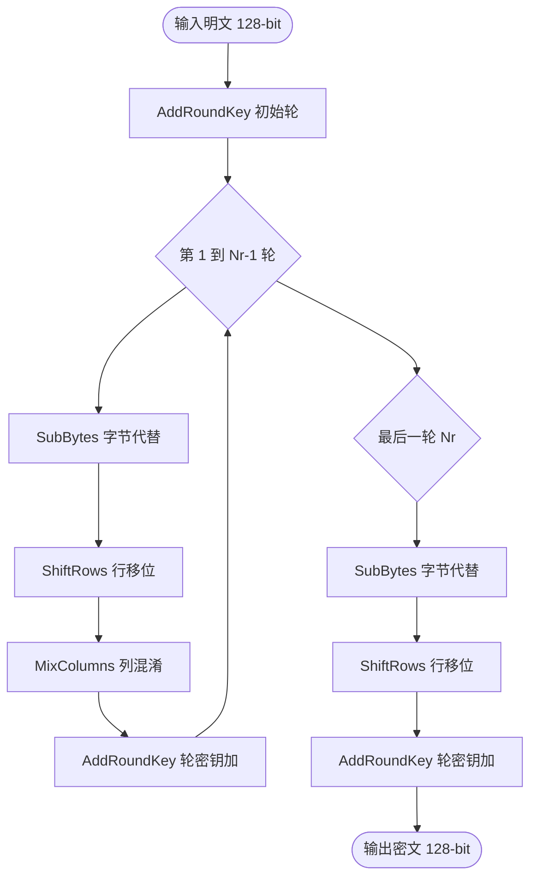
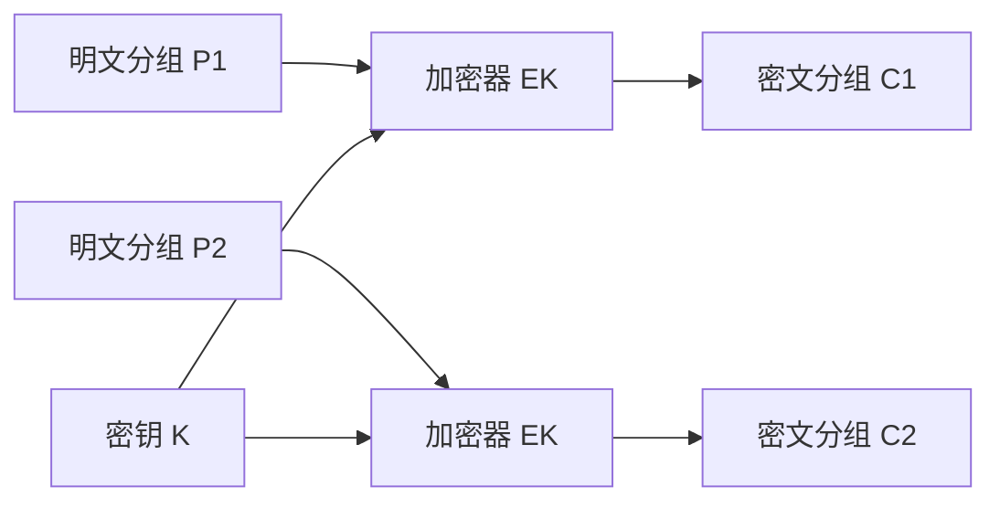
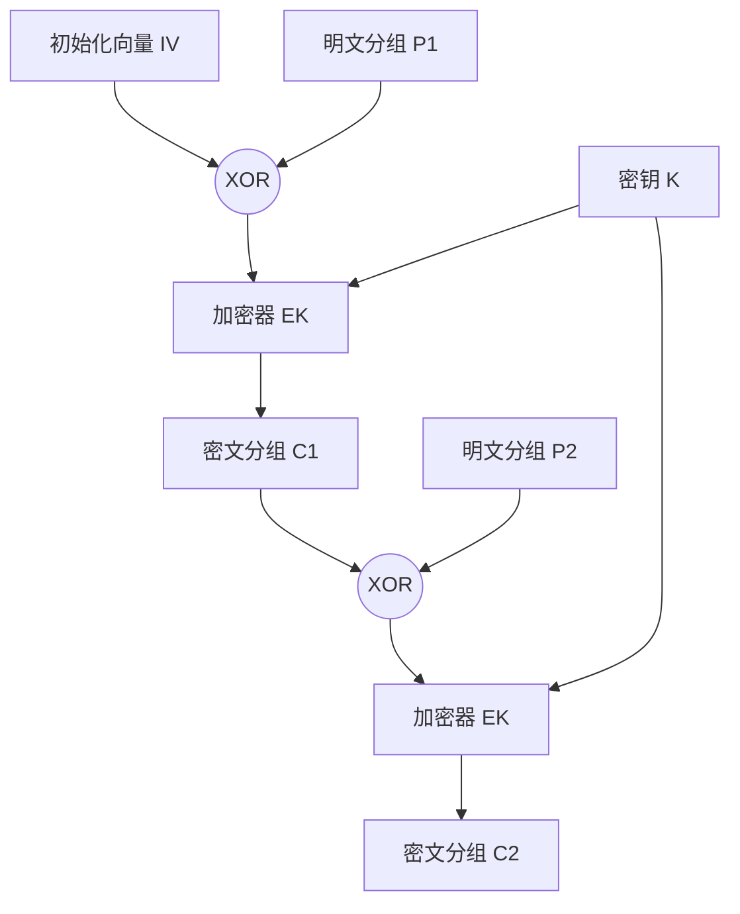
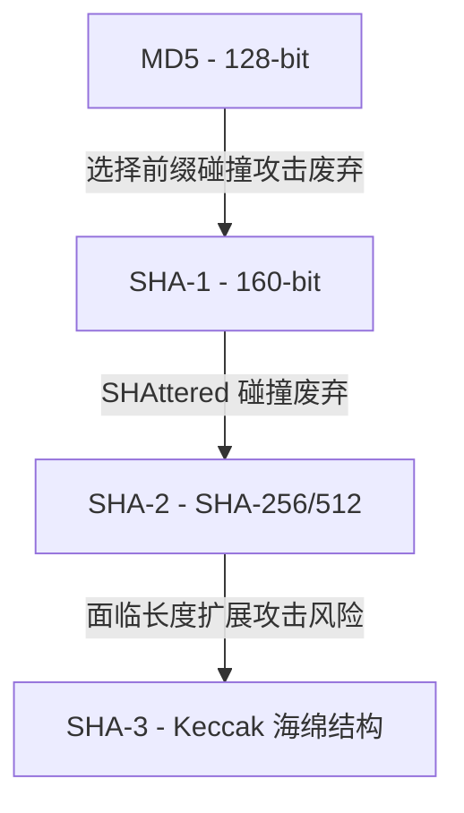
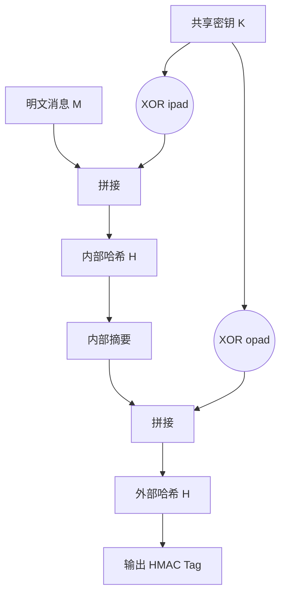
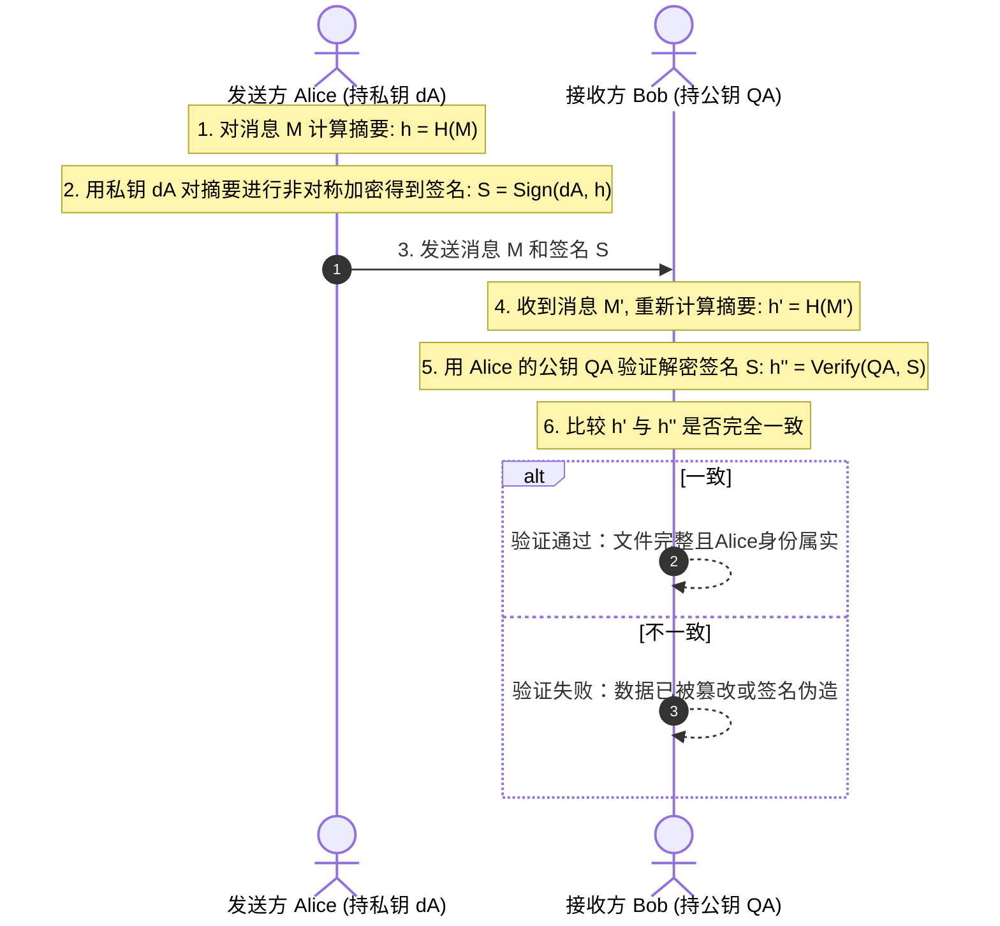
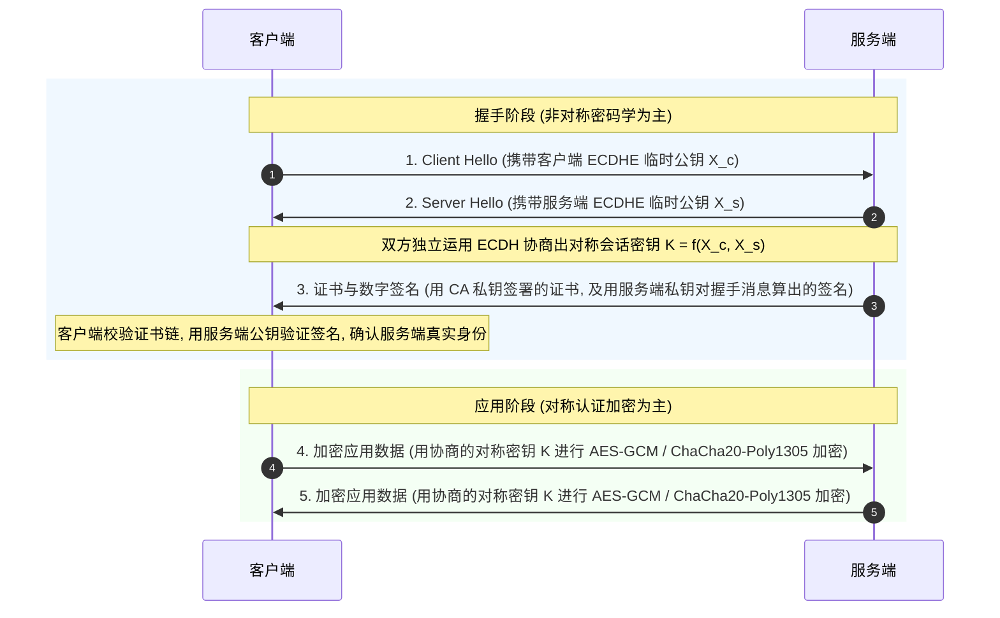

# 1.2.6.3 加密基础

## 现代密码学的三支柱

现代密码学是保障网络空间安全、数据机密性、系统完整性及身份真实性的理论基石。从历史上的古典密码学（如凯撒密码、维吉尼亚密码等主要依赖于“算法保密”与简单的字母替换/错位技术）走向现代密码学，最重要的分水岭是香农（Claude Shannon）的《保密系统的通信理论》的发表，它将密码学从一门“艺术”提升为建立在严谨数学与信息论基础上的“科学”。

现代密码学的核心构建不再依赖于加密算法的隐蔽性。根据著名的**柯克霍夫原则（Kerckhoffs's principle）**，一个密码系统的安全性应该仅仅依赖于密钥（Key）的保密，而算法本身（包括加密机理、变换逻辑、多项式方程）应当是完全公开的，且必须能够经受住全球密码分析学家的恶意审视。

为了解决不可信信道上的安全通信，现代密码学演化出了三支柱体系：
1. **对称密码学**：以 AES 等算法为代表，利用共享的单一密钥实现海量数据极速、大吞吐量的保密传输。
2. **非对称密码学（公钥密码学）**：以 RSA、ECC 等算法为代表，利用基于数论难题（如大素数分解困难性、有限域上椭圆曲线离散对数困难性）的单向陷门函数，解决密钥分发与数字签名的防篡改、不可否认性问题。
3. **密码学单向散列与消息认证**：以 SHA-256、SHA-3 和 HMAC 为代表，负责压缩任意长度的消息并提取出不可伪造的特征值，以低成本提供快速的完整性检验。

本篇将从底层的数学原理、算法设计机制、分组模式安全性以及典型安全漏洞入手，深入剖析这三大支柱的底层逻辑与工业实践。

---

## 一、对称加密算法 (Symmetric Cryptography) 的计算特征与演进

### 1.1 基本概念与计算特征
在对称加密体系中，发送方（加密端）与接收方（解密端）共享同一个对称密钥 $K$。其加密函数 $E$ 与解密函数 $D$ 满足如下严格的对称数学关系：
$$C = E_K(P)$$
$$P = D_K(C)$$

对称加密算法在计算特征上表现为**极高的处理效率**。这种高效率的底层本质在于其变换逻辑绝大部分依赖于现代 CPU 极为擅长的**字/位级基本运算**。这些运算包括：
- **按位异或（XOR）**：在数字电路中仅需单门触发，执行速度为单时钟周期。
- **循环移位与置换（Rotation & Permutation）**：直接通过寄存器移位指令或硬件连线即可在极短时间内完成。
- **查表操作（LUT - Look-Up Table）**：用于非线性的 S-Box 替换。

相比非对称加密算法中涉及上千位大整数的多精度乘除法以及模幂运算，对称加密对 CPU 的算力消耗微乎其微。正因如此，在处理文件系统加密（如全盘加密 FDE）、数据库保密存储以及高速网络包加密（如 TLS 数据传输阶段）时，对称加密是绝对的性能担当。

为了进一步榨干处理器的性能，现代计算机架构通常在指令集级别直接集成对称加密的硬件加速。例如，Intel 与 AMD 的 **AES-NI (AES New Instructions)**，它将 AES 的每一轮关键变换（如 SubBytes、ShiftRows、MixColumns、AddRoundKey）直接封装为 CPU 的硬编码指令（如 `AESENC`、`AESDEC`）。使用 AES-NI 指令集后，对称加密的计算速度提升可达数倍至数十倍，加密吞吐量可轻易突破数 GB/s，且彻底消除了软件实现 S-Box 查表时由于 Cache 命中差异导致的 Cache 侧信道攻击风险。

然而，对称加密的致命痛点在于**密钥分发悖论（Key Distribution Paradox）**：如果双方必须在完全公开、且可能被监听的网络信道中建立安全连接，它们如何安全地把同一把密钥分发到对方手中？在没有公钥密码学介入之前，这一问题是无解的。

### 1.2 经典对称加密算法的历史演进：从 DES/3DES 到 AES

#### 1. DES (Data Encryption Standard)
DES 是 1977 年由美国国家标准局（NBS，现 NIST）正式确立的联邦对称加密标准。其分组长度固定为 64 位（8 字节），密钥总长度为 64 位，但其中包含了 8 位用于校验的奇偶校验位，因此**有效密钥长度仅为 56 位**。

DES 的核心算法基于经典的 **Feistel 网络结构**。在 Feistel 网络中，64 位的输入被等分为左右两部分 $L_0$ 和 $R_0$。在每一轮迭代中（共 16 轮），计算流程如下：
$$L_i = R_{i-1}$$
$$R_i = L_{i-1} \oplus F(R_{i-1}, K_i)$$
其中 $F$ 为轮函数（包含扩展置换、S-Box 替换、P-Box 置换等），$K_i$ 是从 56 位主密钥派生出的第 $i$ 轮子密钥（48 位）。

Feistel 网络最大的设计优势在于：**加密和解密可以使用完全相同的硬件结构**，解密时只需将 16 组子密钥反向输入即可。这是因为在异或（XOR）运算的自反性下，解密端可以自然抵消非线性轮函数 $F$ 的输出，而不要求 $F$ 本身必须可逆：
$$L_{i-1} = R_i \oplus F(L_i, K_i) = R_i \oplus F(R_{i-1}, K_i)$$

随着计算机并行算力的飞速发展，56 位密钥的物理空间（仅 $2^{56} \approx 7.2 \times 10^{16}$ 个可能密钥）在暴力破解攻击面前变得不堪一击。1998 年，电子前哨基金会（EFF）定制了专用的硬件破解机，在 56 小时内便通过穷举法攻破了 DES 密文。目前，DES 已被判定为不安全算法，退出历史舞台。

#### 2. 3DES (Triple DES)
为了在不推翻银行、金融机构大量既有 DES 硬件系统的前提下紧急提升安全强度，密码学界设计了 3DES（三重数据加密算法）。3DES 的标准加密流程采用了看似奇特的 **EDE (Encrypt-Decrypt-Encrypt)** 三重加密步骤：
$$C = E_{K_3}(D_{K_2}(E_{K_1}(P)))$$
对应的解密过程为：
$$P = D_{K_1}(E_{K_2}(D_{K_3}(C)))$$

为什么中间的一步是**解密**（D）而不是加密（E）？这体现了向下兼容的设计智慧。当 $K_1 = K_2 = K_3$ 时，中间的解密动作刚好抵消了第一步的加密，整个 3DES 系统退化为单次 DES。这使得 3DES 系统可以直接与只支持单次 DES 的旧系统无缝通信。

根据密钥的选择方式，3DES 的有效安全强度如下：
- **第一种密钥选择（3-Key 3DES）**：$K_1, K_2, K_3$ 互不相同。名义密钥长度 168 位，在防范针对两重加密的相遇攻击（Meet-in-the-middle attack）后，其实际有效安全强度为 112 位。
- **第二种密钥选择（2-Key 3DES）**：$K_1 \neq K_2$，且 $K_3 = K_1$。名义密钥长度 112 位，有效安全强度约为 80 位。
- **第三种密钥选择**：$K_1 = K_2 = K_3$，等同于普通 DES（不安全）。

虽然 3DES 的安全性得到了提升，但它存在严重的缺陷：首先，3DES 运行了三次 DES 运算，**计算效率极低**，速度缓慢；其次，它的分组大小仍然是 DES 遗留的 64 位。在生日攻击（Birthday Attack）的原理下，当使用同一个密钥加密约 $2^{32}$ 个分组（约 32GB 数据）时，密文分组发生碰撞的概率便超过了 50%（即 **Sweet32 漏洞**）。因此，3DES 也被现代密码学彻底淘汰。

### 1.3 AES (高级加密标准) 的数学与算法设计机制
1997 年，NIST 启动了下一代对称加密标准的征集项目。2001 年，由比利时密码学家 Joan Daemen 和 Vincent Rijmen 提交的 Rijndael 算法脱颖而出，被正式确立为 **AES (Advanced Encryption Standard)**。

不同于 DES 的 Feistel 网络，AES 采用了全新的**替代-置换网络 (SPN, Substitution-Permutation Network)**。SPN 网络在每一轮迭代中，对输入分组的所有比特同时进行混淆和扩散，因此它的扩散效率极高。

AES 的分组大小固定为 128 位（16 字节），密钥长度支持 128 位、192 位或 256 位，分别对应 10 轮、12 轮和 14 轮的轮迭代（不含初始轮，最后一轮不进行列混淆）。

#### AES 有限域 $GF(2^8)$ 数学背景
AES 的所有运算均建立在二元有限域（伽罗瓦域）$GF(2^8)$ 之上。该域中的每个字节元素都可以表示为一个最高次数为 7 的多项式：
$$b_7 x^7 + b_6 x^6 + b_5 x^5 + b_4 x^4 + b_3 x^3 + b_2 x^2 + b_1 x + b_0 \quad (b_i \in \{0, 1\})$$
- **加法运算**：对应于多项式系数的模 2 加法，在计算机硬件中就是两字节的**按位异或（XOR）**。
- **乘法运算**：多项式相乘，并模一个不可约多项式 $m(x) = x^8 + x^4 + x^3 + x + 1$（十六进制表示为 `0x11B`）。这种乘法通常可以通过移位和异或的组合（在 Rijndael 算法中称为 `xtime` 运算）在硬件中极速完成。

AES 的加密过程通过维护一个 4x4 的字节状态矩阵（State）进行。每一轮标准的 SPN 变换均由以下四个基本步骤组成：

#### 1. SubBytes (字节代替)
这是 AES 中**唯一的非线性变换**，用于破坏代数结构，抵抗差分密码分析和线性密码分析。
对状态矩阵中的每个字节 $S_{i,j}$，其映射过程为：
- 首先，求出其在有限域 $GF(2^8)$ 上的**乘法逆元** $S_{i,j}^{-1}$，其中值 `0x00` 的逆元映射为其自身。
- 其次，对该逆元进行一次模 2 的仿射变换：
  $$S'_{i,j} = M \cdot S_{i,j}^{-1} + C \pmod 2$$
  其中 $M$ 是一个精心设计的 $8 \times 8$ 二进制循环矩阵，$C$ 是常数字节 `0x63`。仿射变换的设计目的是进一步复杂化乘法逆元的纯代数特性，防止攻击者通过解析多项式方程组直接求出密钥。

#### 2. ShiftRows (行移位)
这是一个字节级的置换操作，负责在状态矩阵的各行之间提供**横向的扩散**。
具体规则是：
- 第 0 行保持不变。
- 第 1 行循环左移 1 字节。
- 第 2 行循环左移 2 字节。
- 第 3 行循环左移 3 字节。

#### 3. MixColumns (列混淆)
这是列内进行的线性代数变换，在状态矩阵的各列内提供**纵向的扩散**。
将状态矩阵的每一列视为 $GF(2^8)$ 上的多项式，与一个固定的循环矩阵 $C$ 相乘：
$$\begin{bmatrix} S'_{0,j} \\ S'_{1,j} \\ S'_{2,j} \\ S'_{3,j} \end{bmatrix} = \begin{bmatrix} 02 & 03 & 01 & 01 \\ 01 & 02 & 03 & 01 \\ 01 & 01 & 02 & 03 \\ 03 & 01 & 01 & 02 \end{bmatrix} \begin{bmatrix} S_{0,j} \\ S_{1,j} \\ S_{2,j} \\ S_{3,j} \end{bmatrix}$$
这里的乘法是 $GF(2^8)$ 上的多项式乘法。列混淆具有极佳的扩散特性：当某列中的某一个字节发生微小改变时，经过该变换后，这一列的全部四个字节都会完全改变。

#### 4. AddRoundKey (轮密钥加)
这是将对称密钥引入状态矩阵的唯一步骤。它将当前的状态矩阵与经过密钥扩展算法生成的轮密钥（Round Key）进行逐比特异或（XOR）运算：
$$S'_{i,j} = S_{i,j} \oplus K_{i,j}$$

经过这一轮密钥加，前几步混淆和扩散后的状态被彻底隐藏。AES 的密钥扩展算法（Key Expansion）会根据主密钥，利用循环移位、S-Box 替换和轮常数异或（Rcon），为加密的每一轮（加初始轮共 $N_r + 1$ 轮）衍生出专门的子密钥矩阵。

由于 SPN 网络的扩散率极高，AES 仅需两轮，明文中任何一个比特的改变，就会通过行移位与列混淆的交叉作用，彻底扩散并影响到输出密文状态矩阵中的每一个比特。

---

## 二、分组密码工作模式 (Block Cipher Modes of Operation) 深度剖析

分组密码算法（如 AES）只能对固定长度（如 128 位）的单块数据进行加密。当面对任意长度的文件或网络数据流时，必须采用分组密码工作模式。不同的工作模式决定了分组之间的依赖关系、对填充的依赖以及防篡改的能力。

### 2.1 电子密码本模式 (ECB, Electronic Codebook)
ECB 是最原始的分组模式。它简单地将明文数据切分为若干个大小与分组大小相同的独立块，对每一个块使用相同的密钥 $K$ 进行独立加密：
$$C_i = E_K(P_i)$$
解密过程同样彼此独立：
$$P_i = D_K(C_i)$$

#### 缺乏扩散性与安全性缺陷
ECB 模式的致命缺陷在于**缺乏块之间的扩散性（Diffusion）**。由于每个分组独立加密，如果在输入中明文分组 $P_i = P_j$，那么在相同密钥 $K$ 下加密产生的密文分组必然也完全相同，即 $C_i = C_j$。
这意味着密文保留了明文的所有结构和分布特征。如果网络传输协议中包含了固定的文件头、重复的填充零区或固定的指令字段，攻击者即使无法解密，也能够通过观察相同密文块的分布，轻易推测出协议的报文结构甚至明文内容。

#### 图像重构风险与重排攻击
为了直观展现这一缺陷，密码学界常用一幅未经压缩的 bmp 格式企鹅图片（Tux）进行加密实验。因为企鹅腹部的大片白色和背景的单一色块在内存中是大量连续且相等的像素分组，在经过 ECB 加密后，这些相同的明文块变成了相同的密文块。在渲染加密后的图片时，虽然像素颜色变得凌乱，但企鹅的身体轮廓、线条和阶梯状边缘仍然清晰可见。

此外，ECB 模式完全无法抵御**分组重排与重放攻击**。由于各块独立，攻击者可以拦截网络流量并直接交换或替换密文分组的顺序（例如调换转账报文中的付款人账号块和收款人账号块），解密端解密时仍然会判定合法，这会导致重大的安全业务漏洞。

### 2.2 密码分组链接模式 (CBC, Cipher Block Chaining)
为了打破 ECB 的重复性，CBC 模式引入了前向链接机制。在加密当前块之前，将其与前一个密文分组进行异或，然后再送入加密器加密：
$$C_i = E_K(P_i \oplus C_{i-1})$$
对于第一个分组，由于没有“前一个密文分组”，必须引入一个初始化向量 $C_0 = IV$。
解密过程则为：
$$P_i = D_K(C_i) \oplus C_{i-1}$$

#### 初始化向量 IV 的关键作用
IV 确保了相同的明文消息在多次加密时也能产生完全不同的密文。**IV 必须具有不可预测性（密码学安全随机数）**。
如果 IV 是可预测的（如递增序号），系统就会面临**选择明文攻击（CPA）**。著名的 TLS 1.0 的 BEAST 攻击正是利用了 CBC 模式中可预测 IV 的漏洞（TLS 1.0 使用上一个包的最后一个密文块直接作为下一个包的 IV），通过精心构造明文首字节，逐步猜测出了受保护的 Cookie 敏感信息。

#### 前向依赖与容错特征
- **加密的串行性**：由于加密当前分块 $C_i$ 必须先获得前一个密文分块 $C_{i-1}$，加密过程无法进行多线程并行化处理，其吞吐量受限于单核 CPU 的加密速度。
- **解密的半并行性**：从解密公式 $P_i = D_K(C_i) \oplus C_{i-1}$ 可以看出，解密当前块仅依赖于当前密文块 $C_i$ 和前一个密文块 $C_{i-1}$。因此，解密器可以同时启动多个核心，并行解密所有密文块。
- **错误传播特征**：如果密文块 $C_i$ 在网络传输中损坏了 1 个比特：
  1. 解密 $P_i$ 时，由于 $C_i$ 损坏，解密器输出的 $D_K(C_i)$ 会彻底损坏，导致明文块 $P_i$ 彻底崩坏。
  2. 解密 $P_{i+1} = D_K(C_{i+1}) \oplus C_i$ 时，由于 $C_{i+1}$ 完好，$D_K(C_{i+1})$ 正确，与损坏的 $C_i$ 异或后，导致明文 $P_{i+1}$ 中仅在 $C_i$ 损坏的对应比特位上发生单比特翻转。
  3. $P_{i+1}$ 之后的明文分组（如 $P_{i+2}$）则完全不受影响。

#### 填充攻击风险 (Padding Oracle Attack)
CBC 作为分组模式，当明文长度不满足分组大小（如 16 字节）的整数倍时，必须进行填充。最常用的填充标准是 **PKCS#7**。
PKCS#7 规定：若需要填充 $N$ 个字节（$1 \le N \le \text{BlockSize}$），则填充的每个字节的值均为 $N$。例如，缺失 3 字节，则末尾填充 `03 03 03`；若刚好是整数倍，也必须额外填充一整个块（例如 16 个 `10`），以便解密端能无歧义地移除填充。

Padding Oracle 攻击是一种针对 CBC 模式的侧信道攻击。如果解密端在解密并校验解填充时，会在填充非法时返回特定的提示（如 HTTP 500 或特定错误码），而在填充合法但业务逻辑错误时返回不同的响应（如 HTTP 200），这就会构成一个 **Oracle（提示器）**。

攻击者可以通过篡改密文倒数第二块 $C_{n-1}$ 的末尾字节，发送给服务器。通过枚举修改值（0-255），攻击者总能使解密后 $P_n$ 的最后一个字节刚好为合法填充 `01`。
数学原理如下：
$$P_n[\text{last}] = D_K(C_n)[\text{last}] \oplus C_{n-1}[\text{last}]$$
如果通过尝试某个修改值 $X$，服务器没有报错填充非法，意味着此时解密后的填充结果为 `01`：
$$D_K(C_n)[\text{last}] \oplus X = \text{0x01} \implies D_K(C_n)[\text{last}] = X \oplus \text{0x01}$$
由于 $X$ 已知，攻击者即可直接算出 $D_K(C_n)[\text{last}]$ 的值。结合原始未篡改的密文 $C_{n-1,\text{real}}[\text{last}]$，即可还原出明文：
$$P_{\text{real}}[\text{last}] = D_K(C_n)[\text{last}] \oplus C_{n-1,\text{real}}[\text{last}]$$

通过将解密目标调整为 `02 02`、`03 03 03` 等，并在前面几位进行配合修改，攻击者可以在不知道密钥 $K$ 的情况下，以平均每个字节尝试 128 次的极低代价完全破解 CBC 模式的密文。

### 2.3 计数器模式 (CTR, Counter)
CTR 模式将分组密码彻底转化为**流密码**（Stream Cipher）。它不再加密明文本身，而是加密一个唯一的计数器值，并将产生的“密钥流”与明文进行异或：
$$KS_i = E_K(\text{Counter}_i)$$
$$C_i = P_i \oplus KS_i$$
解密过程完全一致，且解密时仍然使用的是**加密器** $E_K$：
$$P_i = C_i \oplus KS_i \quad (\text{where } KS_i = E_K(\text{Counter}_i))$$

#### 高度并发化特征
在 CTR 模式下，所有的计数器值 $\text{Counter}_i$ 都是预先确定的（通常由 Nonce 和自增序号拼装而成）。因此，无论是加密还是解密，各个分组密钥流的计算彼此完全独立。多核 CPU 可以并行地并行计算出所有的密钥流分块，再进行异或。这使其在高并发读写中成为首选。

#### 无填充风险
由于密文是通过异或产生的，如果明文的最后一包不足 16 字节，系统只需生成完整的密钥流，并截取前段进行异或。因此，**CTR 模式完全不需要填充**，彻底免疫 Padding Oracle 攻击。

#### Nonce 重用灾难（Two-Time Pad）
流密码的死穴在于密钥流的重用。如果同一密钥下，使用了相同的 Nonce（及相同的 Counter 序列）加密了两个不同的明文 $P_A$ 和 $P_B$：
$$C_A = P_A \oplus KS$$
$$C_B = P_B \oplus KS$$
攻击者只需将两组密文进行异或：
$$C_A \oplus C_B = P_A \oplus P_B$$
这彻底消除了加密算法的保护，攻击者利用字母频率分析、已知明文猜测等，可以在极短时间内恢复出 $P_A$ 和 $P_B$。

### 2.4 伽罗瓦/计数器模式 (GCM, Galois/Counter Mode) 与认证加密
由于只提供机密性保护的加密模式（如 CBC、CTR）无法防范密文被翻转或修改（例如在 CTR 模式下翻转密文的第 $x$ 位，解密后明文的第 $x$ 位也会被翻转），密码学界提出了 **AEAD (Authenticated Encryption with Associated Data, 认证加密)**。而 **GCM** 是目前使用最广泛的 AEAD 工业标准。

GCM 模式融合了 **CTR 模式**（提供高效率的机密性加密）和 **GMAC（伽罗瓦消息认证码）**（提供完整性校验与防篡改）。

GCM 支持**关联数据 AAD (Associated Data)**。AAD 是指那些不需要加密、但必须防止被中间人篡改的数据（例如网络协议包中的明文 IP 头部和 TCP 端口）。
在有限域 $GF(2^{128})$ 中，乘法运算定义在不可约多项式 $g(x) = x^{128} + x^7 + x^2 + x + 1$ 之上。利用该域的代数性质，将密文和 AAD 块通过多项式求值的方式快速算出一个 128 位的认证标签（Tag）。

这种数学设计的优势在于，有限域 $GF(2^{128})$ 上的多项式无进位乘法（Carry-Less Multiplication）非常适合硬件并行优化。现代 CPU 内部普遍集成了专用的乘法指令（如 Intel 的 `PCLMULQDQ` 指令），能在极少时钟周期内完成计算。这使得 GCM 模式在同时执行加密和完整性校验时，依然能保持与纯 CTR 模式相同的极致速率。因此，GCM 模式成为了 TLS 1.3 协议中不可动摇的黄金基石。

---

## 三、非对称加密算法 (Asymmetric Cryptography) 理论与数学推导

非对称加密（公钥密码学）通过巧妙的数论难题，解决了对称加密体系中密钥分发与数字证书的防篡改/不可否认性问题。

### 3.1 基本概念与计算特征
非对称加密基于**密钥对**的设计：
- **公钥 (Public Key)**：公开。用于加密明文，或者验证发送方的数字签名。
- **私钥 (Private Key)**：严格保密。用于解密公钥加密的密文，或者生成数字签名。

非对称加密依靠**单向陷门函数 (Trapdoor One-way Function)**。单向陷门函数的数学定义是：给定函数 $y = f_K(x)$，已知输入 $x$ 时计算 $y$ 极容易；但在已知 $y$ 且不知秘密“陷门”时，反向计算出 $x$ 在数学上是计算不可行的。只有在拥有那个秘密信息（私钥）时，反向计算才变得极容易。

在计算特征上，非对称加密的计算开销极大。为了保障安全性，其数域宽度极高（RSA 至少 2048 位；ECC 至少 256 位）。大数的多轮移位、乘法和模幂运算超出了 CPU 寄存器的直接处理极限，必须使用多精度大数库在软件层模拟。因此，非对称加密的速度比对称加密慢数千倍。通常，我们只在握手协商阶段使用非对称加密协商对称密钥，再用对称加密传输数据。

### 3.2 RSA 算法的数学原理与完整推导
RSA 安全性基于**大整数素因子分解的困难性**：在数学上，将两个足够大的素数相乘得到一个合数是极其简单的，但想要反向找出它的两个素因子，目前在经典计算机上是不可能的。

#### 核心数论定理
- **欧拉函数 $\phi(n)$**：对于正整数 $n$，$\phi(n)$ 表示小于或等于 $n$ 的正整数中与 $n$ 互质的数的个数。若 $p, q$ 为两个互质的素数，且 $n = p \cdot q$，则：
  $$\phi(n) = (p-1)(q-1)$$
- **欧拉定理**：若正整数 $a$ 与 $n$ 互质，则有：
  $$a^{\phi(n)} \equiv 1 \pmod n$$
- **费马小定理**：若 $p$ 为质数，且 $a$ 与 $p$ 互质，则有：
  $$a^{p-1} \equiv 1 \pmod p$$

#### 密钥生成过程
1. 随机选择两个足够大（如大于 1024 位）的独立素数 $p$ 和 $q$。
2. 计算模数：
  $$n = p \cdot q$$
3. 计算欧拉函数值：
  $$\phi(n) = (p-1)(q-1)$$
4. 选择公钥指数 $e$（通常固定为 **$65537$**，其二进制含有的“1”极少，能有效加速模幂计算）。需要满足 $1 < e < \phi(n)$ 且 $\gcd(e, \phi(n)) = 1$。
5. 计算私钥指数 $d$，使其满足 $e$ 模 $\phi(n)$ 的模逆元：
  $$e \cdot d \equiv 1 \pmod{\phi(n)}$$
  使用**扩展欧几里得算法**求解出 $d$。
6. 公钥为 $(e, n)$，私钥为 $(d, n)$。将 $p, q, \phi(n)$ 彻底销毁。

#### 加密与解密过程
- **加密**：
  $$c = m^e \pmod n$$
- **解密**：
  $$m = c^d \pmod n$$

#### RSA 正确性的严格数学证明
我们要证明，对于任意 $m < n$，都有：
$$(m^e)^d \equiv m^{ed} \equiv m \pmod n$$
已知 $e \cdot d \equiv 1 \pmod{\phi(n)}$，即存在某个整数 $k$，使得 $ed = k \cdot \phi(n) + 1$。
因此，我们需要证明：
$$m^{k \cdot \phi(n) + 1} \equiv m \pmod n$$
由于 $n = p \cdot q$，根据中国剩余定理，只要我们能分别证明以下两个式子在模 $p$ 和模 $q$ 下成立即可：
1. $m^{k(p-1)(q-1)+1} \equiv m \pmod p$
2. $m^{k(p-1)(q-1)+1} \equiv m \pmod q$

针对模 $p$ 的情况，我们根据 $m$ 是否能被 $p$ 整除进行分类讨论：
- **情况一：$m$ 不能被 $p$ 整除**
  此时 $\gcd(m, p) = 1$（$m$ 与 $p$ 互质）。根据费马小定理：
  $$m^{p-1} \equiv 1 \pmod p$$
  我们将 $m^{k(p-1)(q-1)+1}$ 展开：
  $$m^{k(p-1)(q-1)+1} = (m^{p-1})^{k(q-1)} \cdot m \equiv (1)^{k(q-1)} \cdot m \equiv m \pmod p$$
  式子在模 $p$ 下成立。

- **情况二：$m$ 能被 $p$ 整除**
  这意味着 $m \equiv 0 \pmod p$。由于任何 $0$ 的正整数次幂仍然是 $0$，因此：
  $$m^{k(p-1)(q-1)+1} \equiv 0 \equiv m \pmod p$$
  式子同样成立。

同理，由于 $p$ 和 $q$ 的对称性，在模 $q$ 下，必然也有 $m^{k(p-1)(q-1)+1} \equiv m \pmod q$。
这意味着 $m^{ed} - m$ 同时能被 $p$ 和 $q$ 整除。又因为 $p, q$ 为不同的素数，因此 $p$ 和 $q$ 互质，所以 $m^{ed} - m$ 必然能被两者的乘积 $p \cdot q = n$ 整除。
所以：
$$m^{ed} \equiv m \pmod n$$
RSA 算法解密正确性得证。

#### 实际应用中的填充标准 (OAEP)
如果直接运行 Textbook RSA，如果明文 $m$ 很小，且公钥 $e = 3$，加密结果为 $c = m^3 \pmod n$。因为 $m^3 < n$，攻击者只需在实数域上直接对 $c$ 开立方根，就能恢复出明文，根本不需要私钥。
因此，现代 RSA 必须配合填充协议使用。**OAEP (Optimal Asymmetric Encryption Padding, 最优非对称加密填充)** 是目前主流的填充方案。它在加密前引入高强度的随机盐和掩码生成函数，将明文与伪随机数据进行复杂的非对称异或融合。这保证了即使多次加密相同的明文，产生的密文也是完全不同的，实现了**语义安全**。

### 3.3 椭圆曲线密码学 (ECC) 及 ECDSA

#### 椭圆曲线数学定义与 Weierstrass 方程
ECC 运行在有限域 $\mathbb{F}_p$ 之上的 Weierstrass 方程定义的曲线点群中：
$$y^2 = x^3 + a x + b \pmod p$$
其中 $a, b \in \mathbb{F}_p$，且满足 $4a^3 + 27b^2 \neq 0 \pmod p$（保证曲线无奇点，处处光滑）。

#### 椭圆曲线上的群论性质
为了让椭圆曲线的坐标点能够参与加密，必须在曲线上定义“加法”运算，使其构成一个阿贝尔群（Abelian Group）。
- **群的单位元**：引入一个虚拟的“无穷远点” $O$，满足 $P + O = P$。
- **逆元**：若 $P = (x, y)$，则 $-P = (x, -y \pmod p)$，且 $P + (-P) = O$。
- **点加 (Point Addition)**：设曲线上的两点 $P(x_1, y_1)$ 和 $Q(x_2, y_2)$，且 $P \neq Q$。连接 $P, Q$ 的直线与椭圆曲线必交于第三点 $R'(x_3, -y_3)$。将 $R'$ 关于 $X$ 轴翻转，得到点 $R(x_3, y_3)$。定义加法运算为 $P + Q = R$。
- **倍点 (Point Doubling)**：当 $P = Q$ 时，作曲线在 $P$ 点的切线，该切线与曲线交于 $R'$，其关于 $X$ 轴的翻转点 $R$ 即为 $2P = R$。

在有限域 $\mathbb{F}_p$ 上，点加和倍点的代数坐标推导公式如下：
设斜率为 $\lambda$：
- 若 $P \neq Q$：
  $$\lambda = \frac{y_2 - y_1}{x_2 - x_1} \pmod p$$
- 若 $P = Q$（且 $y_1 \neq 0$）：
  $$\lambda = \frac{3x_1^2 + a}{2y_1} \pmod p$$
利用斜率，新交点 $R(x_3, y_3)$ 的坐标为：
$$x_3 = \lambda^2 - x_1 - x_2 \pmod p$$
$$y_3 = \lambda(x_1 - x_3) - y_1 \pmod p$$

#### 椭圆曲线离散对数问题 (ECDLP)
利用上述点加和倍点规则，计算一个点被“加”了 $k$ 次（即标量乘法 $Q = kG$，其中 $G$ 是曲线上的基点），在已知 $k$ 和 $G$ 时，通过二进制定点相加（Double-and-Add 算法）可以在 $\mathcal{O}(\log k)$ 的时间内快速计算出 $Q$。
然而，如果已知基点 $G$ 以及最终运算出来的点 $Q$，想要反推这个累加的次数 $k$，在数学上是极其困难的。因为这些点在有限域 $\mathbb{F}_p$ 的模数约束下，坐标像噪声一样随机分布在有限的空间里，没有任何连续性的规律可循。目前已知的最快算法（如 Pollard's rho 算法）也需要指数级的时间复杂度 $\mathcal{O}(\sqrt{p})$。这就是**椭圆曲线离散对数问题 (ECDLP)**。

#### ECC 的高强度优势
ECC 密钥长度与安全强度的对比优势极其明显。要达到 128 位的安全强度，RSA 需要 3072 位的密钥，而 ECC 仅需要 256 位。这使得 ECC 在传输数字证书时能节省大量的网络带宽，并显著降低移动端和物联网芯片的 CPU 解密开销。

#### ECDSA 签名与验签数学过程
- **签名过程**（签名者持私钥 $d_A$，公钥 $Q_A = d_A G$）：
  1. 选择一个随机数 $k \in [1, n-1]$，其中 $n$ 为基点 $G$ 的阶。
  2. 计算点 $R = kG = (x_1, y_1)$。
  3. 计算 $r = x_1 \pmod n$。若 $r = 0$，则重新选择 $k$。
  4. 计算 $s = k^{-1}(z + r \cdot d_A) \pmod n$，其中 $z$ 是消息摘要的截断。若 $s = 0$，则重新选择 $k$。
  5. 输出签名对 $(r, s)$。
- **验签过程**（验签者持公钥 $Q_A$ 和消息 $M$）：
  1. 确认 $r, s \in [1, n-1]$。
  2. 计算 $w = s^{-1} \pmod n$。
  3. 计算 $u_1 = z \cdot w \pmod n$ 和 $u_2 = r \cdot w \pmod n$。
  4. 计算点 $X = u_1 G + u_2 Q_A = (x_0, y_0)$。
  5. 验证 $r \equiv x_0 \pmod n$ 是否成立，若成立则验签通过。

---

## 四、单向散列函数 (Cryptographic Hash Functions) 的密码学特征与算法演进

单向散列函数负责将任意长度的数据映射为固定长度的特征值（摘要），是构建数字签名与完整性校验的核心组件。

### 4.1 核心特征与安全性定义
- **单向性 (One-wayness / 第一抗原像性)**：给定任意哈希值 $h$，在计算上无法在合理时间内找到一个明文 $m$，使得 $H(m) = h$。
- **弱抗碰撞性 (Second Preimage Resistance / 第二抗原像性)**：给定一个特定的明文 $m_1$，在计算上无法找到另一个不同的明文 $m_2 \neq m_1$，使得 $H(m_2) = H(m_1)$。
- **强抗碰撞性 (Collision Resistance)**：在计算上无法找到**任意**两个不同的明文 $m_1 \neq m_2$，使得它们的哈希值发生碰撞：$H(m_1) = H(m_2)$。
- **雪崩效应 (Avalanche Effect)**：输入数据中哪怕仅仅改变了 1 个比特，其输出的哈希值也必须产生剧烈的变化（通常 50% 左右的输出比特会发生翻转）。

#### 生日攻击的数学原理
为什么强抗碰撞性如此脆弱？这源于概率论中的**生日悖论**。

我们用概率公式进行推导。设哈希函数的输出空间大小为 $N$（如果是 $n$ 位的哈希值，则 $N = 2^n$）。我们随机选择 $k$ 个不同的明文，计算它们中没有任意两个发生碰撞的概率 $P_{no}(k)$：
$$P_{no}(k) = 1 \cdot \left(1 - \frac{1}{N}\right) \cdot \left(1 - \frac{2}{N}\right) \cdots \left(1 - \frac{k-1}{N}\right) = \prod_{i=0}^{k-1} \left(1 - \frac{i}{N}\right)$$
利用近似关系 $1 - x \approx e^{-x}$，代入式中：
$$P_{no}(k) \approx \prod_{i=0}^{k-1} e^{-\frac{i}{N}} = e^{-\sum_{i=0}^{k-1} \frac{i}{N}} \approx e^{-\frac{k^2}{2N}}$$
因此，存在至少两个明文发生哈希碰撞的概率 $P_{col}(k)$ 为：
$$P_{col}(k) = 1 - P_{no}(k) \approx 1 - e^{-\frac{k^2}{2N}}$$
我们令碰撞发生概率为 50%，即 $P_{col}(k) = 0.5$：
$$1 - e^{-\frac{k^2}{2N}} = 0.5 \implies e^{-\frac{k^2}{2N}} = 0.5 \implies k \approx 1.18 \sqrt{N}$$
由于 $N = 2^n$，我们得到：
$$k \approx 1.18 \cdot 2^{n/2}$$
这表明，**寻找任意碰撞所需的尝试次数仅为输出空间维度的平方根级别 $\mathcal{O}(2^{n/2})$**。因此，128 位的 MD5 散列函数在强抗碰撞性上只相当于 $2^{64}$ 次计算，在如今的并行算力面前很容易发生碰撞。

### 4.2 典型散列算法设计机制与演进

#### 1. MD5 与 SHA-1 的衰落
MD5（输出 128 位）和 SHA-1（输出 160 位）都采用了 **Merkle-Damgård 链式结构**。2004 年王小云教授团队宣布攻破了 MD5 的强抗碰撞性，可以在几秒内生成具有相同 MD5 的不同文件。2017 年，谷歌团队发布了 SHAttered 攻击，成功碰撞了两个不同的 PDF 文件。这两者已被现代安全协议彻底淘汰。

#### 2. SHA-2 家族与长度扩展攻击缺陷
为了代替 SHA-1，设计了 SHA-2 家族（包括 SHA-256 和 SHA-512）。虽然目前尚无有效的碰撞方法，但它们依然沿用了 Merkle-Damgård 链式结构。
这使得它们容易受到**长度扩展攻击（Length Extension Attack）**：攻击者在只知道已知消息哈希值（即链式状态输出）的情况下，直接将其作为中间状态，可以在后面追加任意数据并计算出合法的新哈希，而无需知道用于认证消息的共享密钥。

#### 3. SHA-3 (Keccak) 的海绵结构革命
为了预防 SHA-2 的潜在危机，NIST 举办了新算法征集，最终 **Keccak** 算法胜出并被命名为 SHA-3。
SHA-3 采用了**海绵结构 (Sponge Construction)**。其内部状态宽达 $b = r + c$ 位，其中 $r$ 称为速率（Rate），而 $c$ 称为容量（Capacity）。

- **吸入阶段 (Absorbing)**：输入的消息被分块后，仅与内部状态的前 $r$ 位进行异或，然后整个 $b$ 位状态送入复杂的非线性置换函数 $f$ 进行混合。后 $c$ 位状态从不直接与输入的数据发生接触。
- **挤出阶段 (Squeezing)**：吸入结束后，通过置换函数 $f$ 迭代状态，每次仅输出状态的前 $r$ 位，直到拼凑成所需长度。

由于**容量 $c$ 部分被隐藏在内部状态的深处**，攻击者仅通过观察输出的哈希值（仅为前 $r$ 位），完全无法还原内部隐藏的 $c$ 位状态信息。这使得 SHA-3 在结构上**天然免疫长度扩展攻击**。

---

## 五、消息认证码 (MAC) 与数字签名 (Digital Signature) 深度解析

### 5.1 消息认证码 HMAC (Hash-based Message Authentication Code)
如果我们将密钥和消息直接拼接后计算哈希，例如 $H(K \mathbin{\Vert} M)$，在 Merkle-Damgård 结构下会直接引发**长度扩展攻击**。因为攻击者已知最终哈希输出，可直接将其作为初始状态 $IV'$ 对恶意数据 $X$ 计算一轮压缩函数，从而伪造一个消息认证码。

为了解决此问题，RFC 2104 定义了 **HMAC**：
$$\text{HMAC}(K, M) = H\Big( (K \oplus \text{opad}) \mathbin{\Vert} H\big( (K \oplus \text{ipad}) \mathbin{\Vert} M \big) \Big)$$
- **$\text{ipad}$ (Inner Pad, 内平铺常数)**：十六进制为 `0x36`，重复填充至哈希分组长度。
- **$\text{opad}$ (Outer Pad, 外平铺常数)**：十六进制为 `0x5c`，重复填充至哈希分组长度。

HMAC 实际上执行了两个阶段的哈希：内部哈希算出一个摘要值，外部哈希再将这个摘要值拼在 $K \oplus \text{opad}$ 后面再次计算哈希。
即使攻击者想要对最终的 HMAC 输出进行长度扩展攻击，他拿到的也是外部哈希的终结状态。他尝试在后面拼接数据，相当于企图修改外部哈希的输入。但外部哈希的输入只能是内部哈希生成的固定长度摘要，攻击者无法操纵外部哈希的输入内部去改变原始明文 $M$。这一双层哈希结构，使得 HMAC 能够完美免疫长度扩展攻击。

### 5.2 数字签名 (Digital Signature) 安全模型
HMAC 依赖对称的“共享密钥”，这意味着通信双方都拥有修改和生成 MAC 码的权力。为了确保**不可否认性 (Non-repudiation)**（发送方发送消息后无法抵赖，且接收方只能验证、无权伪造签名），必须引入**非对称加密**构建数字签名体制。

数字签名结合非对称加密与哈希，其完整业务时序如下：

#### 随机数 $k$ 对 DSA/ECDSA 签名的致命隐患
在 DSA 或 ECDSA 签名中，签名公式包含一个临时随机数 $k$。**这个随机数 $k$ 必须严格保密且绝不能重复使用**。
如果同一私钥在对两个不同的消息签名时，使用了相同的随机数 $k$，攻击者只需将两个签名的数学式子进行联立消元，就可以直接反算出私钥 $d_A$。索尼 PS3 的私钥破解正是因为其系统在生成 ECDSA 签名时，代码错误地将 $k$ 设为了一个固定常数。
为了避免该隐患，**RFC 6979** 规定了**确定性 ECDSA**，通过将私钥和待签名消息再次进行哈希运算来生成临时标量 $k$，从而在协议设计层面消除了随机数发生器（RNG）失效带来的安全隐患。

---

## 六、综合对比与混合加密体系的实际应用

### 6.1 核心密码学技术多维度矩阵对比

| 技术大类 | 典型算法 / 模式 | 机密性 (保密) | 完整性 (防篡改) | 身份认证 (防伪造) | 不可否认性 | 相对计算开销 | 核心应用场景 |
| :--- | :--- | :---: | :---: | :---: | :---: | :---: | :--- |
| **对称加密** | AES-CBC / CTR | **有** | 无 | 无 | 无 | **极低** (微秒级) | 大吞吐量文件加密、磁盘全盘加密 |
| **认证加密** | AES-GCM (AEAD) | **有** | **有** | **有** (限共享密钥者) | 无 | **极低** (硬件优化) | TLS 1.3 数据传输、现代安全通信协议 |
| **单向散列** | SHA-256 / SHA-3 | 无 | **有** (防损坏) | 无 | 无 | **极低** (纳米级) | 软件完整性校验、区块指针、密码哈希 |
| **消息认证码**| HMAC-SHA256 | 无 | **有** | **有** (限共享密钥者) | 无 | **极低** (微秒级) | API 签名鉴权、Cookie 状态防篡改校验 |
| **非对称加密**| RSA-4096 / ECC | **有** | 无 | 无 | 无 | **极高** (毫秒级) | 少量敏感数据加密、密钥协商通道保护 |
| **数字签名** | RSA-PSS / ECDSA| 无 | **有** | **有** | **有** | **极高** (毫秒级) | SSL证书链校验、软件签名发布、代码审计 |

### 6.2 现代网络协议（以 TLS 1.3 为例）的混合加密编排模式
在实际的互联网安全通信中，现代安全协议普遍采用**混合加密体系**，将对称加密、非对称加密、散列函数与数字签名结合在一起，优势互补。

在 TLS 1.3 握手机制中，各密码学组件分工明确：
1. **密钥协商（Key Exchange）**：
   客户端和服务端在握手阶段通过 **ECDHE（临时椭圆曲线迪菲-赫尔曼密钥交换）** 协议交换临时公钥，并协商出对称密钥。这具备**前向安全性 (Forward Secrecy)**：即使服务端长期的非对称私钥泄露，黑客也无法解密历史通信流量。
2. **身份鉴权（Authentication）**：
   服务端会使用其**非对称私钥**对本次握手的重要参数计算**数字签名（如 ECDSA 或 RSA-PSS）**，客户端通过证书链验证其身份，确认服务端真实性，防止中间人攻击。
3. **数据加密与防篡改（Bulk Encryption & Integrity）**：
   握手成功后，双方使用高效的 **AEAD 算法（如 AES-GCM 或 ChaCha20-Poly1305）** 对所有后续传输的 HTTP 应用层数据进行高吞吐量的加密传输。
4. **防降级攻击（Transcript Hash）**：
   从第一步到最后一步的所有握手报文都会实时送入哈希函数计算累计的哈希值，握手即将结束时双方校验该哈希值是否一致，以防范中间人篡改明文协商参数。

