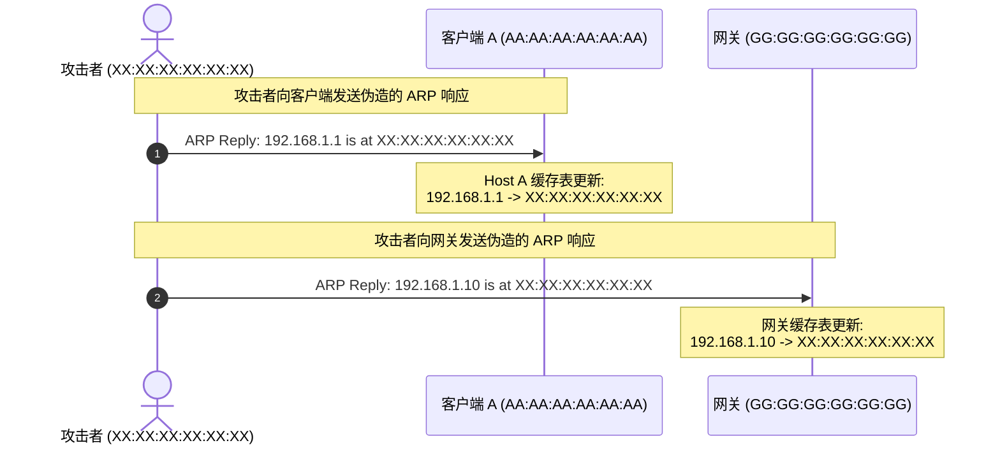
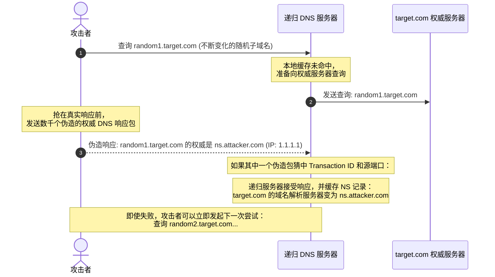
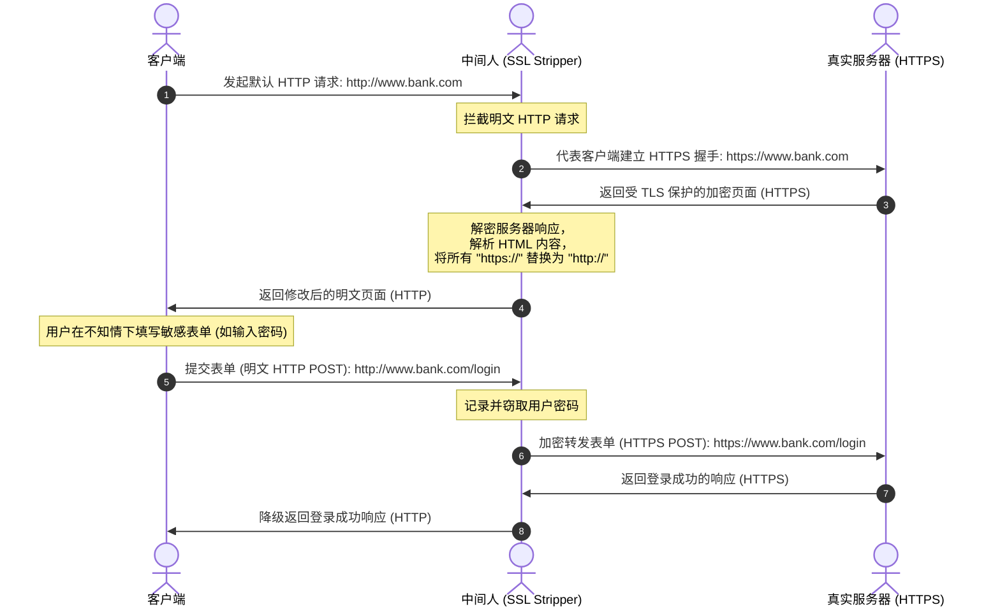
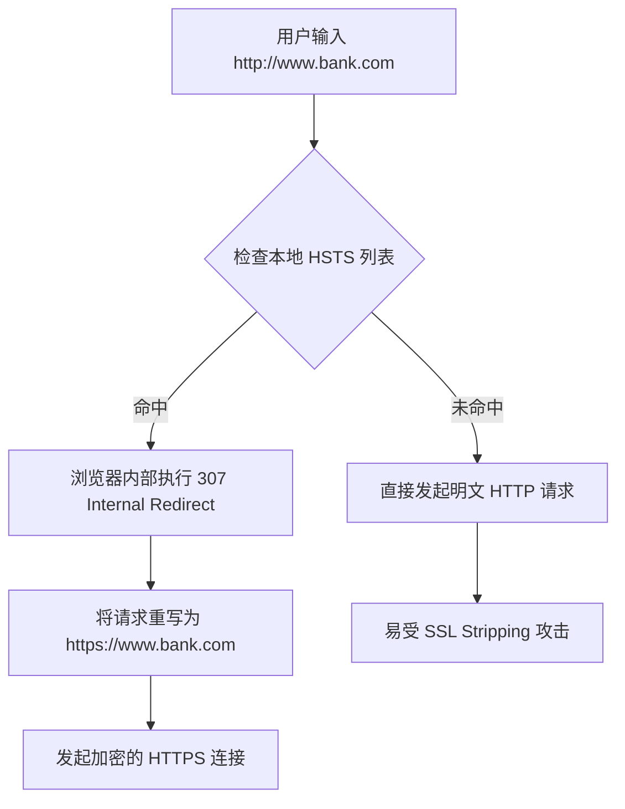
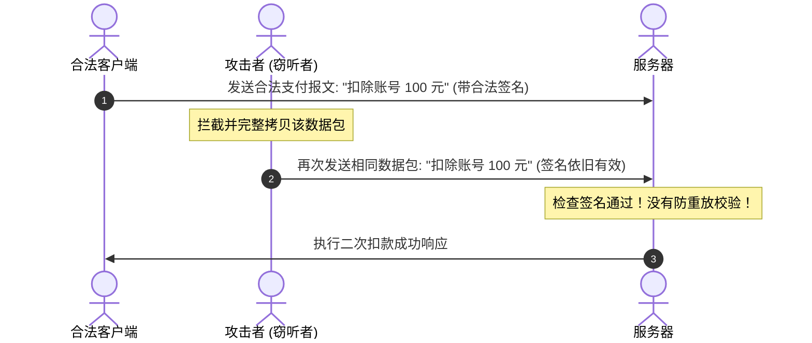
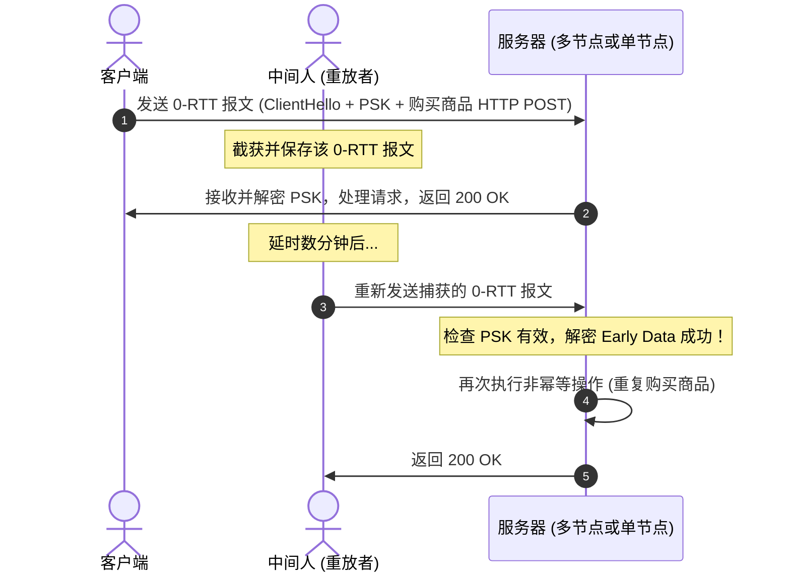
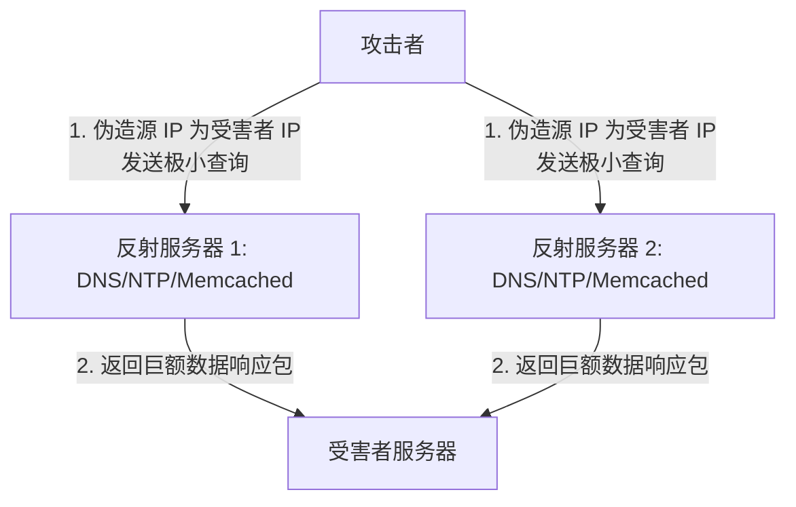
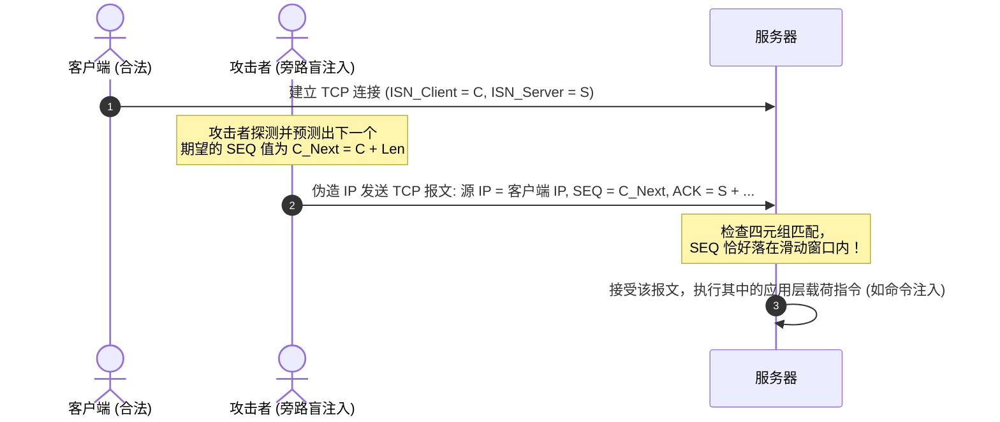

# 1.2.6.4 网络攻击面

## 1. 网络攻击面概述与协议设计的原罪

在现代计算机网络体系结构中，网络攻击面（Network Attack Surface）是指恶意主体可以尝试对网络系统进行未授权访问、数据窃听、数据篡改或破坏的物理与逻辑接触点的总和。网络攻击面的形成并非偶然，其根源往往可以追溯到互联网初期协议设计时的“信任假设”与“安全性滞后”。

在 TCP/IP 协议栈设计的早期阶段（如 20 世纪 70 至 80 年代），网络连接的主要参与者多为学术机构、科研院所和军事单位。这一时期的网络设计哲学优先考虑的是**连通性、鲁棒性（在节点损毁时保证路由可达）和计算开销的最小化**。这导致许多核心协议在设计上引入了脆弱的信任假设：

1. **源地址真实性假设**：网络层与数据链路层默认信任报文中的源 IP 地址或源 MAC 地址，缺乏内建的源地址验证（Source Address Validation）机制。
2. **通信信道明文假设**：应用层与传输层交互默认使用明文传输，没有考虑中间节点（如路由器、交换机、代理服务器）的恶意性。
3. **状态机的简化假设**：TCP/IP 协议栈的状态机设计在面对海量并发请求与畸形报文时，未能充分考虑内存、CPU 等关键系统资源的边界限制。

随着互联网的商用化和对抗性的加剧，这些设计缺陷逐渐演变成了攻击者利用的天然通道。本篇将从中间人攻击、重放攻击、拒绝服务攻击以及传输层会话劫持等维度，深入剖析网络协议的底层缺陷、攻击者实施渗透的物理/逻辑链路，以及现代网络工程中的防御与缓解设计。

---

## 2. 中间人攻击 (MITM) 与欺骗技术

中间人攻击（Man-In-The-Middle, MITM）是网络攻击中最经典也是最危险的模式之一。其核心目标是让攻击者（Attacker）成功地将自己插入到通信双方（Client 与 Server）的数据链路之间，使双方误以为他们是在直接与对方进行安全通信，而实际上所有的交互流量都必须经过攻击者的控制、修改或监听。

在局域网（LAN）与广域网（WAN）环境中，攻击者通常通过欺骗底层地址解析协议或域名系统来实现流量的非授权重定向。以下将深入分析 ARP 欺骗与 DNS 劫持/投毒的底层工作机理。

### 2.1 ARP 欺骗的底层机制、无状态漏洞与防御

#### 2.1.1 ARP 协议的无状态漏洞
地址解析协议（ARP, Address Resolution Protocol）是运行在 TCP/IP 协议栈第二层（数据链路层）与第三层（网络层）之间的适配协议，其主要任务是将网络层的 IP 地址动态解析为数据链路层的物理 MAC 地址。

ARP 协议的核心安全设计缺陷在于其**无状态性（Stateless）**。ARP 缓存表（ARP Cache）的更新规则极其宽松：
* **无匹配验证**：当主机收到一个 ARP 响应（ARP Reply）时，即使该主机之前从未发送过对应的 ARP 请求（ARP Request），它也会无条件接受该响应，并将响应中的 IP-MAC 映射关系写入或更新到本地的 ARP 缓存表中。
* **免费 ARP (Gratuitous ARP) 的滥用**：主机可以通过主动发送目标 IP 与自身 IP 相同的 ARP 请求/应答来宣告其 MAC 地址的变更。这一设计本用于 IP 冲突检测或网卡热备，但在恶意环境下却成为了攻击者的欺骗利器。

#### 2.1.2 ARP 欺骗的底层运作流程
假设在同一个局域网内有三台主机：
* **合法客户端 (Host A)**：IP = `192.168.1.10`，MAC = `AA:AA:AA:AA:AA:AA`
* **默认网关 (Gateway)**：IP = `192.168.1.1`，MAC = `GG:GG:GG:GG:GG:GG`
* **攻击者主机 (Attacker)**：IP = `192.168.1.50`，MAC = `XX:XX:XX:XX:XX:XX`

ARP 欺骗的攻击步骤如下：



1. **构造伪造以太网帧**：攻击者利用原始套接字（Raw Socket）或数据包注入工具构造两个 ARP 应答包。
   * **发送给 Host A 的伪造报文**：
     * 以太网帧源 MAC：`XX:XX:XX:XX:XX:XX`
     * 以太网帧目的 MAC：`AA:AA:AA:AA:AA:AA`
     * ARP Payload 中的源 IP：`192.168.1.1`（伪造网关）
     * ARP Payload 中的源 MAC：`XX:XX:XX:XX:XX:XX`（攻击者 MAC）
   * **发送给 Gateway 的伪造报文**：
     * 以太网帧源 MAC：`XX:XX:XX:XX:XX:XX`
     * 以太网帧目的 MAC：`GG:GG:GG:GG:GG:GG`
     * ARP Payload 中的源 IP：`192.168.1.10`（伪造客户端）
     * ARP Payload 中的源 MAC：`XX:XX:XX:XX:XX:XX`（攻击者 MAC）
2. **ARP 缓存投毒成功**：由于 ARP 的无状态特征，Host A 和网关在接收到上述虚假响应后，分别更新了自己的 ARP 缓存。
   * Host A 认为网关 `192.168.1.1` 的物理地址为 `XX:XX:XX:XX:XX:XX`。
   * 网关认为客户端 `192.168.1.10` 的物理地址为 `XX:XX:XX:XX:XX:XX`。
3. **流量截获与双向转发**：此后，Host A 发往外网的所有 IP 数据包，其以太网目标 MAC 地址都会被填写为 `XX:XX:XX:XX:XX:XX`。数据包到达交换机后，交换机根据 MAC 地址转发表将其投递给攻击者主机。攻击者通过开启系统内核的 IP 转发（IP Forwarding）功能，修改 MAC 头部并重新向真正的网关发送数据，实现“隐蔽的流量代理”。

#### 2.1.3 ARP 欺骗的缓解与防护技术
在现代企业网中，防范 ARP 欺骗主要依赖以下三项技术：
1. **静态 ARP 绑定 (Static ARP Entries)**：
   在主机和交换机上手动硬编码 IP 与 MAC 地址的映射关系。然而，这种方法的维护成本随主机数量呈指数级上升，无法适应大规模或动态的局域网环境。
2. **DHCP 侦听 (DHCP Snooping)**：
   交换机通过监听客户端与 DHCP 服务器之间的四步握手过程（Discover、Offer、Request、Ack），动态构建一张受信任的 **DHCP Snooping 绑定表**（包含 MAC 地址、IP 地址、租约时间、绑定类型、VLAN 和接口信息）。所有未通过 DHCP 分配的静态配置或冲突 IP 的映射都无法通过该表的验证。
3. **动态 ARP 检查 (DAI - Dynamic ARP Inspection)**：
   当交换机接收到 ARP 数据包时，将其与 DHCP Snooping 绑定表进行比对。如果发现 ARP 报文中的源 IP 与源 MAC 的对应关系与绑定表不符，交换机将直接丢弃该 ARP 报文，并记录日志。这是目前局域网内防御 ARP 欺骗最有效、最普遍的二层防护手段。

---

### 2.2 DNS 劫持与缓存投毒的底层机制、Kaminsky 攻击与防御

与局域网内物理 MAC 层面的欺骗不同，域名系统（DNS）欺骗主要在网络层与应用层针对“域名-IP”的映射关系展开。

#### 2.2.1 DNS 缓存投毒的基本局限与 16 位 Transaction ID 的脆弱性
经典 DNS 协议运行在 UDP 协议之上（端口 53）。DNS 客户端发起的每次查询，其报文头部包含一个 16 位的**交易标识符（Transaction ID, TXID）**。
* 当递归 DNS 服务器（Recursive Resolver）向权威 DNS 服务器（Authoritative Name Server）发起迭代查询时，其期待的响应报文必须满足：
  1. 响应包的源 IP 等于权威服务器的 IP。
  2. 响应包的目的端口等于递归服务器发送查询时的随机源端口。
  3. 响应包头部的 Transaction ID 必须与查询报文中的 Transaction ID 完全一致。

在早期实现中，递归服务器使用的 UDP 源端口通常是固定的（如固定的 53 端口），或者采用简单的顺序递增算法。这使得攻击者只需暴力穷举 $2^{16} = 65536$ 个可能的 Transaction ID 即可完成伪造。然而，传统的缓存投毒存在一个严重的时间窗口限制：**如果权威服务器的真实响应报文抢先一步到达递归服务器，递归服务器就会将正确的结果写入缓存。在缓存的生存时间（TTL）过期之前，递归服务器不会再向外部发起相同的查询，攻击者也将失去再次投毒的机会。**

#### 2.2.2 革命性的突破：Kaminsky 缓存投毒攻击原理
2008 年，安全专家 Dan Kaminsky 提出了一个突破性的 DNS 缓存投毒变种，成功绕过了 TTL 限制，其核心思想是**“通过查询不存在的随机子域名来争取无限次投毒尝试机会”**。

具体攻击流程如下：



1. **发起随机域名查询**：攻击者向目标递归解析器持续发送大量解析请求，解析的域名形如：`random1.target.com`，`random2.target.com`，…… `randomN.target.com`。
2. **强制穿透缓存**：由于这些子域名完全是随机且不存在的，递归解析器的本地缓存中绝对不会命中，因此它必须针对每一个请求向 `target.com` 的权威 DNS 服务器发起新的迭代查询。
3. **高并发抢跑与权威重定向**：在递归解析器向真正的权威 DNS 发送查询的瞬间，攻击者向递归解析器发送数万个伪造的响应数据包，试图猜中 Transaction ID 和 UDP 源端口。在这些伪造的响应报文中：
   * 攻击者不仅为 `randomX.target.com` 提供了一个假 IP。
   * 更为关键的是，攻击者在响应报文的**授权段（Authority Section）**中写入了：`target.com` 的域名服务器（NS 记录）是 `ns.attacker.com`。
   * 在**附加段（Additional Section）**中写入了：`ns.attacker.com` 的 A 记录对应的 IP 地址是攻击者控制的恶意 IP `1.1.1.1`。
4. **劫持整个域**：一旦在某一次尝试中，攻击者抢在真实响应到来之前成功猜中了 TXID 和端口，递归解析器就会接受这个伪造的响应。结果是：递归解析器不仅在缓存中写入了该随机域名的记录，更顺理成章地将整个 `target.com` 的 NS（Name Server）权威服务器更新为了 `ns.attacker.com`（IP: `1.1.1.1`）。
5. **攻击完成**：在接下来的缓存生存时间（TTL）内，任何用户向该递归解析器查询 `www.target.com`、`mail.target.com` 或 `target.com` 下的任何子域名，递归解析器都会直接向攻击者的恶意服务器 `1.1.1.1` 发起查询。这宣告了整个域名的控制权彻底落入攻击者之手。

#### 2.2.3 DNS 欺骗的现代防御体系
为应对日益严峻的 DNS 篡改问题，互联网工程界部署了多层次的防御链：
* **源端口随机化（Source Port Randomization）**：
  根据 RFC 5452 建议，递归服务器发起查询时，必须在 $49152$ 到 $65535$ 的范围内随机选择 UDP 源端口。这使得攻击者需要猜测的空间从 16 位（仅 TXID）陡增到约 30 位（$2^{16} \times 2^{14} \approx 10^9$），极大地提高了暴力穷举的算力门槛。
* **DNSSEC (Domain Name System Security Extensions)**：
  DNSSEC 引入了公钥密码学来保障 DNS 数据的完整性与不可伪造性。权威 DNS 服务器使用其私钥对资源记录集（RRset）进行数字签名，生成 RRSIG（Resource Record Signature）记录。递归解析器通过链式信任结构（从根域名服务器的公钥（DS 记录）开始，逐级向下验证），使用公钥验证接收到的 RRSIG 记录。如果数字签名验证失败，说明数据在传输过程中遭到篡改或投毒，解析器将直接丢弃该数据并返回 `SERVFAIL` 错误。
* **加密 DNS 协议 (DoH & DoT)**：
  * **DoT (DNS over TLS)**（RFC 7858）：将 DNS 流量封装在 TLS 隧道中，默认使用 853 端口，从根本上杜绝了网络中间节点的明文监听与篡改。
  * **DoH (DNS over HTTPS)**（RFC 8484）：将 DNS 查询以 HTTP/2 或 HTTP/3 的形式发送，在 443 端口的 HTTPS 流量中进行混淆，使网络中间节点更难拦截和识别 DNS 数据流。

---

### 2.3 深度对比：ARP 欺骗与 DNS 劫持流量劫持链路差异

虽然 ARP 欺骗和 DNS 劫持的最终表现都是“客户端访问了被重定向的目标”，但在网络拓扑、所处协议层级、攻击生效边界以及底层转发逻辑上存在着本质的差异。

#### 2.3.1 协议层级与拓扑机制的对比
* **ARP 欺骗：发生在数据链路层（L2）**。它攻击的是**局域网（广播域）内部的 MAC 地址表**。ARP 欺骗不能跨越三层路由器，攻击者必须与受害者处于同一个二层网络拓扑中（同一个广播域）。在整个攻击过程中，受害者发出的数据包，其 IP 层的目标 IP 地址并没有发生改变（依然是目的服务器的 IP，或者网关的 IP），改变的仅仅是数据链路层帧头部的“目的 MAC 地址（Dst MAC）”。
* **DNS 劫持/投毒：发生在应用层（L7）**。它篡改的是**域名与 IP 地址的映射关系**。DNS 劫持不受物理距离与局域网的限制，可以发生在互联网的任何地方（例如跨国投毒、修改公共 DNS 服务器缓存等）。在攻击成功后，受害者在网络层封装 IP 报文时，其“目标 IP 地址（Dst IP）”就已经被直接替换为了攻击者准备好的恶意服务器 IP。

#### 2.3.2 流量劫持物理路径对比

以下图表直观展示了在两类攻击中，客户端向目标服务器发送数据包时，物理与逻辑路由路径的变化：

```mermaid
graph TD
    subgraph 正常网络链路
        C1[客户端] -->|MAC: 网关 MAC<br/>IP: 目标 IP| G1(默认网关)
        G1 -->|路由转发| S1(目标服务器)
    end

    subgraph ARP 欺骗局域网拓扑 (二层物理拦截)
        C2[客户端] -->|MAC: 攻击者 MAC<br/>IP: 目标 IP| A2(攻击者主机)
        A2 -->|代理修改 MAC<br/>转发网关| G2(默认网关)
        G2 -->|路由转发| S2(目标服务器)
    end

    subgraph DNS 缓存投毒拓扑 (三层 IP 级偏航)
        C3[客户端] -->|通过被投毒的 DNS<br/>解析出攻击者 IP| C3_REQ[发起 IP 请求]
        C3_REQ -->|MAC: 网关 MAC<br/>IP: 攻击者 IP| G3(默认网关)
        G3 -->|直接路由| A3(攻击者恶意服务器)
    end

    style A2 fill:#ff9999,stroke:#333,stroke-width:2px
    style A3 fill:#ff9999,stroke:#333,stroke-width:2px
```

#### 2.3.3 ARP 欺骗与 DNS 劫持的核心差异矩阵

| 对比维度 | ARP 欺骗 (ARP Spoofing) | DNS 缓存投毒 (DNS Cache Poisoning) |
| :--- | :--- | :--- |
| **工作协议层级** | 数据链路层 (Layer 2) | 应用层 (Layer 7) / 传输层 (Layer 4) |
| **攻击目标对象** | 交换机端口 MAC 学习机制与主机 ARP 缓存 | 递归 DNS 解析服务器或客户端主机的本地 DNS 缓存/主机 Hosts |
| **网络拓扑限制** | 必须在同一个广播域（二层网络）内，无法跨路由器 | 可以在全球任何能够进行网络互通的节点发起（三层/七层） |
| **IP 头部变化** | 客户端发出的 IP 报文中，Dst IP 依然是目标服务器的真实 IP | 客户端发出的 IP 报文中，Dst IP 在封装时已被修改为攻击者 IP |
| **MAC 头部变化** | Dst MAC 被篡改为攻击者的 MAC 地址，绕过物理端口分发 | 依然填写本地网关的 MAC，数据包正常路由至伪造的 IP 目的地 |
| **生存周期 (TTL)** | 受到主机 ARP 缓存老化时间限制（通常几分钟）或被持续的 ARP 欺骗报文刷新 | 受到 DNS 记录的 TTL 限制（可长达数小时或数天） |
| **检测手段** | 检查物理交换机上的 MAC 地址冲突、抓包检测异常 ARP 流量 | 使用 `dig` 或 `nslookup` 校验权威解析链路、检查 DNS 报文签名 |
| **主要防御机制** | DHCP Snooping、Dynamic ARP Inspection (DAI)、静态 ARP | DNSSEC 签名验证、DoH/DoT 加密传输、源端口随机化 |

---

## 3. TLS 剥离攻击 (SSL Stripping) 与 HSTS 防御机制

随着 HTTPS 的普及，明文数据嗅探的门槛大幅提升。然而，网络协议在向后兼容与人性化设计上的妥协，催生出了针对加密握手阶段的降级攻击——TLS 剥离攻击。

### 3.1 SSL Stripping 攻击的降级机制与交互步骤

TLS 剥离攻击（SSL Stripping）由安全研究员 Moxie Marlinspike 在 2009 年的 Black Hat 大会上首次公开。该攻击的绝妙之处在于：**攻击者无需攻破 TLS 协议本身的密码学算法，而是利用用户访问习惯与中间人代理技术，将整条通信链条中的一部分强制降级为明文的 HTTP，从而实现无感知窃听。**

#### 3.1.1 用户访问行为的先天安全漏洞
绝大多数用户在浏览网页时，很少会主动在浏览器地址栏中输入完整的 `https://www.bank.com`，而是倾向于直接输入 `www.bank.com` 或者通过第三方友情链接进行跳转。
根据浏览器的默认行为，在不指定协议的情况下，浏览器会首先向服务器发起明文的 **HTTP 请求**（`http://www.bank.com`，端口 80）。服务器收到该 HTTP 请求后，通常会返回一个 `301 Moved Permanently` 或 `302 Found` 的重定向响应，指示浏览器重定向至 HTTPS 版本的安全页面：

```http
HTTP/1.1 301 Moved Permanently
Location: https://www.bank.com/
```

这个**首次连接时的明文 HTTP 重定向过程**就是 SSL Stripping 攻击发生的黄金窗口。

#### 3.1.2 攻击者介入后的详细交互时序

假设攻击者已经通过 ARP 欺骗成功将自己置于客户端与真实服务器的通信链路上。此时，攻击者的主机充当了一个**透明的反向代理**。具体的剥离过程如下：



1. **发起明文请求**：客户端浏览器向 `http://www.bank.com` 发送 HTTP GET 请求。
2. **中间人拦截与上行握手**：中间人截获该请求，阻止其流向外网。同时，中间人代表客户端与 `www.bank.com` 服务器建立合法的 HTTPS 握手。由于服务器和中间人之间使用的是正规的 TLS 协议，服务器完全信任该连接。
3. **下行数据解析与替换**：服务器通过 HTTPS 将网页内容发送给中间人。中间人接收并解密数据，然后扫描 HTML 源代码，**将其中的所有 `https://` 链接与资源引用（如图片、JS、CSS、表单提交的目标 Action URL）全部强行修改为 `http://`**。
4. **明文响应下发**：中间人将修改后的明文 HTML 页面发送给客户端。
5. **持续明文交互**：客户端浏览器看到的所有页面元素都是 HTTP 的。当用户在网页中输入账号、密码并点击提交时，数据将以明文的 HTTP POST 方式发送到中间人。中间人完成敏感数据记录后，再通过已建立的 HTTPS 链路将请求加密发送给真实服务器。

在此过程中，用户的浏览器不会弹出任何证书警告，因为与浏览器建立连接的本身就是明文 HTTP，不存在任何不合法的证书。唯一的异常是地址栏上的绿色锁头标志消失了（但大部分普通用户很难察觉这一变化）。

---

### 3.2 HSTS 机制与响应头参数解析

为了彻底堵死 SSL Stripping 的攻击通道，万维网联盟（W3C）推出了 **HSTS (HTTP Strict Transport Security, HTTP 严格传输安全)** 协议（RFC 6797）。

#### 3.2.1 HSTS 的核心工作原理
HSTS 是一个安全策略保护机制，它允许 Web 服务器通过特定的 HTTP 响应头向浏览器宣告：**在未来指定的时间内，该浏览器在访问本域名及其子域名时，必须强制且仅能使用 HTTPS 协议，绝对不允许降级为明文 HTTP。**

当浏览器首次通过安全通道（HTTPS）访问一个配置了 HSTS 的网站时，服务器会在响应头中携带以下字段：

```http
Strict-Transport-Security: max-age=31536000; includeSubDomains; preload
```

#### 3.2.2 HSTS 头部关键参数详解
* **`max-age=<expire-time>`**：
  以秒为单位，指定浏览器必须严格使用 HTTPS 访问该网站的有效期。例如，`31536000` 代表一年。在此有效期内，即使发生网络物理重置，只要浏览器本地缓存未清空，该规则就会一直生效。
* **`includeSubDomains`**（可选）：
  指示该 HSTS 规则同样适用于当前域名下的所有子域名（例如，若 `example.com` 设置了此项，则 `mail.example.com` 和 `api.example.com` 也会强制启用 HTTPS）。
* **`preload`**（可选）：
  用于申请将域名硬编码加入浏览器的 HSTS 预载入列表（Preload List）。

#### 3.2.3 浏览器的内部状态机转移
一旦浏览器接收到了合法的 HSTS 响应头，它会在本地数据库中记录该域名的状态。此后，当用户在地址栏再次输入 `http://www.bank.com` 并尝试访问时，浏览器的底层处理机制如下：



由于 **307 内部重定向（Internal Redirect）** 完全发生在浏览器内部，**没有任何明文 HTTP 数据包流向物理网络**，中间人也就没有机会拦截、降级或者篡改该初始请求。这就完美地终结了 SSL Stripping。

---

### 3.3 HSTS Preload List 与部署边界条件

虽然 HSTS 机制非常强大，但在实际工程落地中，依然存在一些边际漏洞和部署挑战。

#### 3.3.1 首次访问（TOFU）的安全空窗期与 HSTS Preload List
HSTS 有一个致命的天然逻辑缺陷，被称为 **TOFU (Trust On First Use, 首次使用信赖)** 问题。
如果一个用户是在全新的电脑、全新的浏览器上**第一次**访问目标网站，或者网站的 `max-age` 刚刚过期，此时浏览器的本地缓存中还没有该网站的 HSTS 记录。如果第一次访问时的初始请求刚好是明文 HTTP，中间人依然可以通过 SSL Stripping 实施拦截并阻止 HSTS 响应头的到达。

为了解决这个“首次访问空窗期”的问题，主流浏览器（如 Chrome、Firefox、Safari 等）联合维护了一个 **HSTS Preload List（预载入列表）**。
* **工作机制**：网站管理员可以将自己的域名提交到 [hstsprelists.org](https://hstsprelists.org/)。经审核符合要求后，该域名会被**直接硬编码**在各大浏览器的发行包源码中。
* **效果**：当用户首次安装浏览器并访问该域名时，浏览器即使在没有任何本地缓存的情况下，通过查询硬编码列表，也能立刻得知该网站只支持 HTTPS，从而在第一次连接时就强制发起 HTTPS 握手。

#### 3.3.2 HSTS 部署的边界与潜在风险
在实际网络运维中，部署 HSTS 必须格外小心，否则可能引发严重的“自我拒绝服务（Self-Dos）”或安全隐患：
1. **证书吊销与链失效时的致命错误（Hard Failures）**：
   对于普通 HTTPS 网站，如果出现证书过期、域名不匹配或证书颁发机构（CA）不可信等情况，浏览器通常会弹出一个警告页面，并允许高级用户点击“继续访问（忽略警告）”。
   但在 **HSTS 模式下，这种“忽略并继续”的逃生通道被强制关闭**。一旦证书链验证失败，浏览器将立即阻断连接，绝对不允许用户继续访问。如果运维团队在证书更新时出错，或者 CA 发生故障，会导致该域名在 `max-age` 期限内对所有已存用户造成无法挽回的访问中断。
2. **子域名继承引发的崩溃（includeSubDomains 风险）**：
   如果主域名配置了 `includeSubDomains`，但公司内部某些遗留的内网服务（如 `http://legacy-system.corp.com`）因为技术限制无法支持 HTTPS，那么一旦主域名的 HSTS 头被浏览器捕获，这些明文子域名服务将彻底无法被该浏览器访问。
3. **利用 HSTS 的网络追踪隐患（HSTS Supercookies）**：
   由于 HSTS 状态是持久化保存在浏览器本地的，有些恶意广告追踪商利用这一点，通过向浏览器加载几十个独特的子域名（例如 `123.track.com`、`456.track.com`），根据浏览器在请求这些子域名时是发送 HTTP 还是自动升级为 HTTPS，来探测本地的 HSTS 写入状态。以此构建一串二进制的唯一标识符（如 `10101001...`），从而绕过浏览器的传统 Cookie 清理机制，实现对用户的跨站追踪。

---

## 4. 重放攻击 (Replay Attack) 与会话安全

重放攻击（Replay Attack），也被称为“回放攻击”，是一种在传输层和应用层极其常见的被动与主动结合的攻击手段。攻击者在网络上拦截并记录合法的敏感数据包（例如一次认证请求、一个支付交易指令），随后在不破坏数据包内容、不破解加密算法的前提下，将捕获的数据包原封不动地重新发送给服务器。

由于数据包的签名或加密状态依然完好，如果服务器缺乏对数据包**唯一性**和**时效性**的校验机制，就会误将该重放请求视为来自合法用户的又一次真实操作，从而批准授权或执行重复动作。



---

### 4.1 握手重放与连接重放风险：TLS 1.3 0-RTT PSK 隐患

在安全传输协议的演进中，**降低时延（Latency）** 与 **提高安全性（Security）** 往往是一对不可调和的矛盾。TLS 1.3 协议为了极致优化握手延迟，引入了 0-RTT（Zero Round-Trip Time）连接恢复模式，但这同时也带来了严峻的连接重放风险。

#### 4.1.1 TLS 1.3 0-RTT 的工作机理 (会话恢复与 Early Data)
在传统的 TLS 1.2 甚至 TLS 1.3 的完整握手中，客户端和服务器必须经历至少一次或两次往返（RTT）才能完成密钥协商并开始发送应用层加密数据。
为了加速连接，TLS 1.3 允许客户端在与服务器的**首次完整握手**期间，获取一个由服务器使用对称密钥加密的凭证，称为**预共享密钥（Pre-Shared Key, PSK）票据（Ticket）**。

当客户端与服务器断开连接并尝试重新建立连接时：
1. 客户端在发送握手首包 `ClientHello` 的同时，附带这个 PSK 票据。
2. 客户端不需要等待服务器回应，可以立即使用该 PSK 加密其应用层数据（如 HTTP 请求），并紧随 `ClientHello` 发送给服务器。这部分应用层数据被称为 **Early Data**。
3. 服务器收到后，解密 PSK，并使用提取出的对称密钥解密 Early Data。服务器在返回 `ServerHello` 的同时即可直接返回 Early Data 的响应。整个过程对于客户端而言，发送数据不需要等待任何握手确认，实现了 $0\text{-RTT}$。

#### 4.1.2 0-RTT 中的重放攻击路径
0-RTT 的设计缺陷在于：**在 0-RTT 握手阶段，服务器在解密并处理 Early Data 时，尚未与客户端完成基于临时非对称密钥交换（如 Diffie-Hellman）的全新密钥协商。这导致 0-RTT 的数据包完全依赖于静态的 PSK。**

如果攻击者在链路中间截获了客户端的 0-RTT 数据包（包含包含 PSK 的 `ClientHello` 和加密的 `Early Data`），攻击者可以将该数据包完全复制，并发送给同一个服务器（或者该服务器处于多活数据中心内的另一个副本）。



如果 Early Data 中封装的是一个非幂等的 HTTP 请求（例如：`POST /api/v1/payment` 购买商品），服务器接收到重放包后，会误以为是用户重新发起的请求，从而导致重复扣款或生成重复订单。

#### 4.1.3 TLS 1.3 对 0-RTT 重放的协议层防御方案
为了缓解这一问题，RFC 8446 规定了服务器在支持 0-RTT 时必须实施以下防御机制之一：

1. **单次票据序列号 (Single-Use Tickets / PSK Obfuscated Ticket Age)**：
   服务器维护一个最近使用的 PSK 票据的唯一标识符（ID）数据库。在票据的生存期内，一旦发现某个票据已被使用过，后续收到的相同票据将被判定为重放攻击而直接拒绝。
   * **工程局限性**：这种方法需要强一致性的分布式内存数据库（如全局共享的 Redis 集群）来记录已使用的票据。这在大规模、跨地域的 CDN 或分布式边缘节点中会带来高昂的同步开销，与 0-RTT 降低延迟的初衷背道而驰。
2. **时钟偏差检测 (Client Hello Age)**：
   客户端在 `ClientHello` 中需要包含一个 `obfuscated_ticket_age` 字段，表明客户端自收到该 Ticket 到发送当前请求所流逝的微秒数。服务器在接收到包时，对比本地时间，如果发现客户端报告的票据年龄与服务器计算出的差值超出合理的时间窗口（如大出数秒，说明包在网络上被滞留或故意延迟），则拒绝 0-RTT，回退到普通的 1-RTT 重新协商。
3. **应用层协议协商与幂等性限制（最推荐的工程实践）**：
   在应用层对 0-RTT 数据施加严格限制。**只允许绝对幂等的请求（如 HTTP GET）包含在 Early Data 中**。对于任何带有副作用的非幂等操作（如 HTTP POST、PUT、DELETE），即使客户端发送在 Early Data 中，服务器也必须拒绝处理该数据，并发送重试警告，强制客户端在 1-RTT 握手完成后再重新发送。

---

### 4.2 防御技术设计：时间戳校验、一次性随机数与挑战-应答

在应用系统和自定义协议的设计中，针对重放攻击通常采用三类经典的防重放防护技术：**时间戳校验（Timestamping）**、**一次性随机数（Nonce）** 以及 **挑战-应答机制（Challenge-Response）**。下面我们将深入这三类机制的数学逻辑与系统实现细节。

#### 4.2.1 时间戳校验 (Timestamping)
* **核心原理**：客户端在发送的数据包中，除业务数据外，强制附带一个当前系统时间的绝对时间戳（Timestamp, $T_{client}$）。客户端对“业务数据 + 时间戳”进行整体哈希或数字签名（如使用 HMAC），防止攻击者篡改时间戳。
* **校验逻辑**：服务器收到数据包后，读取 $T_{client}$ 并与自身当前的系统时间 $T_{server}$ 进行对比。定义一个允许的时钟偏差偏差窗口（Window Size, $\Delta t$）。校验条件为：
  $$|T_{server} - T_{client}| \le \Delta t$$
  如果超出该范围，则直接判定为过期包或重放包予以丢弃。
* **核心缺陷与工程痛点**：
  1. **高度依赖时钟同步**：如果客户端与服务器的时钟没有严格通过 NTP（Network Time Protocol）进行同步，或者因时区配置错误，可能导致正常用户的请求被大面积拒绝。
  2. **“窗口内重放”漏洞**：在 $\Delta t$ 的有效期内（例如 60 秒内），攻击者如果以极快的速度截获并重新发送报文，服务器的时钟检查依然能通过。因此，时间戳通常不能单独使用，而需要结合 Nonce 双重校验。

#### 4.2.2 一次性随机数 (Nonce)
* **核心原理**：Nonce 是一个只能使用一次的唯一标识符（通常是一个高熵的伪随机数或 UUID 结合高精度时间戳）。客户端每次请求生成一个全新的 $Nonce$，同样将 $Nonce$ 纳入签名范围发给服务器。
* **校验逻辑**：服务器在内存或缓存（如 Redis）中记录所有已接收并处理过的 $Nonce$ 集合 $\mathcal{S}$。当收到新请求时，服务器检查当前请求的 $Nonce_{new}$ 是否存在于 $\mathcal{S}$ 中。
  * 若 $Nonce_{new} \in \mathcal{S}$：判定为重放攻击，拒绝执行。
  * 若 $Nonce_{new} \notin \mathcal{S}$：将该 $Nonce_{new}$ 加入 $\mathcal{S}$，通过校验并执行。
* **高并发分布式系统下的存储雪崩痛点与解决方案**：
  如果无限制地记录所有历史 Nonce，服务器的存储空间会随着请求量上升而耗尽。
  * **优化的复合方案（Nonce + Timestamp）**：
    将 Nonce 的生命周期与时间戳窗口相结合。假设时间戳允许的最大时钟偏差为 $\Delta t = 5\text{ 分钟}$。
    服务器仅需要在内存中缓存这 5 分钟之内的 $Nonce$。任何时间戳超过 5 分钟的请求会因为时间戳失效直接被拒；而在 5 分钟之内的请求，则去 Redis 查找 Nonce 冲突。这样，Redis 中缓存的 Nonce 只需要设置一个 5 分钟的过期时间（TTL = 300s），大幅降低了存储压力。
  * **布隆过滤器（Bloom Filter）的引入**：
    为了极致追求查询性能与降低空间占用，分布式系统通常会在内存中部署一个**带过期时间的布隆过滤器**（如基于 Redis RedisBloom 的滑动窗口布隆过滤器）。布隆过滤器能够以极小的内存开销判定一个 Nonce 是否“绝对没有出现过”或“可能出现过”，有效过滤绝大部分 Nonce 重放。

#### 4.2.3 挑战-应答 (Challenge-Response) 机制
与前两者的客户端“单向声明”不同，挑战-应答机制是一个典型的**双向交互式**防御模型。
* **核心步骤**：
  1. **请求令牌**：客户端向服务器发起请求，声称要进行某项操作。
  2. **生成挑战**：服务器随机生成一个临时的、一次性的挑战码（Challenge，通常称为 $Salt$ 或 $Nonce$），并将其与会话 ID 绑定，发送回客户端。同时服务器将此值存入本地临时状态。
  3. **计算应答**：客户端接收到挑战码后，必须将自身的共享密钥（Password/Key）与该挑战码进行拼接，通过不可逆哈希算法（如 SHA-256）计算出应答值（Response），并发送给服务器：
     $$Response = H(Password \parallel Challenge)$$
  4. **校验应答**：服务器使用保存在后端的密钥副本，以同样的算法计算期望的应答值：
     $$Expected = H(Password_{backend} \parallel Challenge)$$
     对比 $Response$ 与 $Expected$。如果匹配，则授权通过，并立即废弃该 $Challenge$。
* **优点**：不需要任何时钟同步，且防重放强度最高。由于每次的 Challenge 都是服务器实时生成的随机数，攻击者即使录制了上一次完整的交互数据，也无法在下一次遇到不同的 Challenge 时计算出正确的 Response。
* **局限性**：增加了网络的往返次数（RTT），对于追求高吞吐、低延迟的 API 交互并不友好，因此多用于敏感的用户登录与认证阶段（如 CHAP、NTLM 协议）。

#### 4.2.4 三大防重放技术差异化对比

| 对比维度 | 时间戳校验 (Timestamping) | 一次性随机数 (Nonce) | 挑战-应答 (Challenge-Response) |
| :--- | :--- | :--- | :--- |
| **时钟依赖性** | 极高（需全局精准的时钟同步） | 无 | 无 |
| **网络交互往返** | 1 RTT (单向携带发送) | 1 RTT (单向携带发送) | 2 RTT (请求->挑战->应答) |
| **服务器存储开销**| 极低 (仅进行数值对比) | 高 (需记录历史 Nonce，常用 Redis 维护) | 中等 (需临时记录发出的 Challenge 状态) |
| **防御缺陷** | 在时间窗口内依然存在被重放的空窗期 | 若不结合时间戳，Nonce 库面临无限膨胀风险 | 实现逻辑复杂，增加了网络延迟 |
| **适用场景** | 基础 API 防篡改、对时钟有把握的系统 | 现代 Web API 设计（常与时间戳复合使用） | 用户登录认证、网络设备认证（CHAP/WPA2 等） |

---

## 5. 拒绝服务攻击 (DoS / DDoS) 与传输层缺陷

拒绝服务攻击（Denial of Service, DoS）及其分布式版本（DDoS）的本质，是**通过消耗系统和网络资源来使服务不可用**。攻击者不需要获取目标系统的控制权限，只需制造大量的无效流量或发起特定的畸形请求，从而抢占服务端的带宽、CPU 算力、内存或应用层线程资源，导致合法用户的正常请求被拒绝。

以下将剖析三种针对传输层 TCP 状态机缺陷、网络层路由特征以及应用层连接模型的经典 DoS 攻击手段。

---

### 5.1 SYN Flood 攻击：利用 TCP 半连接队列状态驻留，造成服务端资源耗尽

#### 5.1.1 TCP 三次握手中的双队列机制
在 Linux 等操作系统内核的 TCP/IP 协议栈实现中，当服务端（处于 LISTEN 状态）接收客户端连接时，会使用两个队列来管理连接状态：

```
                    客户端发送 SYN 包
                           │
                           ▼
┌────────────────────────────────────────────────────────┐
│ 半连接队列 (SYN Queue)                                  │
│ 状态: SYN_RECV                                          │
│ 此时系统在内存中为该连接分配传输控制块 (TCB)             │
└──────────────────────────┬─────────────────────────────┘
                           │ 客户端回复 ACK 报文
                           ▼
┌────────────────────────────────────────────────────────┐
│ 全连接队列 (Accept Queue)                               │
│ 状态: ESTABLISHED                                      │
│ 等待应用程序调用 accept() 系统调用获取该 Socket        │
└────────────────────────────────────────────────────────┘
```

1. **半连接队列（SYN Queue / Incomplete Connection Queue）**：
   当服务端收到客户端的 `SYN` 报文时，系统会为该连接创建一个处于 `SYN_RECV` 状态的半连接条目，并将该连接放入半连接队列。此时，内核会为该连接分配内存空间以维护 **TCB (Transmission Control Block, 传输控制块)** 状态。
2. **全连接队列（Accept Queue / Complete Connection Queue）**：
   当服务端向客户端发送 `SYN-ACK` 并最终收到客户端回复的 `ACK` 报文后，该连接的状态变更为 `ESTABLISHED`。内核将该连接从半连接队列中移出，放入全连接队列，等待用户态应用程序（如 Nginx、Tomcat）调用 `accept()` 将其取走。

#### 5.1.2 SYN Flood 攻击的底层机理
SYN Flood 攻击的核心在于**“只握手，不确认”**。
* 攻击者使用原始套接字生成大量的 `SYN` 包发送给目标服务器。
* 在这些 `SYN` 包中，**源 IP 地址被随机伪造成不存在的 IP，或者不可达的 IP 地址**。
* 服务端收到 `SYN` 后，会将其存入半连接队列，分配 TCB 资源，并按照 TCP 规范向被伪造的源 IP 地址发送 `SYN-ACK`。
* 由于被伪造的 IP 实际上并不存在，或者对该 `SYN-ACK` 不予理睬，服务端将永远等不到最后一步的 `ACK`。
* 此时，根据 TCP 协议的重传规范，服务端会以为 `SYN-ACK` 在网络中丢失，从而发起数次重传（Linux 默认尝试重传 5 次，遵循指数退避算法：$1s, 2s, 4s, 8s, 16s$，总维持时间往往长达 $63s$ 左右）。

在这些未完成握手的“半连接”在半连接队列中“驻留”的期间，攻击者正以极快的速度不断送入新的伪造 `SYN`。由于半连接队列的容量限制（由内核参数 `tcp_max_syn_backlog` 决定），**队列很快会被这些垃圾半连接占满**。一旦队列爆满，服务端将直接丢弃后续到来的所有新 `SYN` 报文，导致真实、合法的客户端无法与服务端建立任何 TCP 连接。

#### 5.1.3 深度剖析防护机制：SYN Cookies 的哈希编码数学实现
为了解决半连接队列易被占满的问题，安全界设计了 **SYN Cookies** 机制。其核心思想是：**当半连接队列溢出时，服务端在收到 SYN 时不为其分配任何内存（不写入半连接队列），而是将连接的状态信息全部编码到返回给客户端的初始序列号（ISN）中，从而实现“无状态”接收。**

##### 1. SYN Cookies 编码初始序列号 (ISN) 的数学公式
当 SYN 队列满时，服务端计算一个 32 位的加密值，作为发送的 `SYN-ACK` 的 `ISN`（即 Cookie）：
$$ISN = Cookie = (t \ll 24) \mid (MSS_{idx} \ll 21) \mid (Hash(src\_ip, dst\_ip, src\_port, dst\_port, secret, t) \ \& \ 0x1FFFFF)$$

* **时间计数器 $t$（3位）**：
  由于 TCP 的 ISN 必须不断变化，这里使用一个缓慢递增的时间计数器（例如，以 64 秒为周期递增的值），将其左移 24 位放入 ISN 的最高 8 位中（实际上为了腾出空间给哈希，高位往往只占用其中的几位，具体视内核版本而定，通常使用 5 到 8 位）。
* **最大报文段大小索引 $MSS_{idx}$（3位）**：
  由于不能在内存中保存客户端的 `MSS` 值，服务端将客户端发送的 `SYN` 里的 `MSS` 映射为一个 3 位的索引值（0 到 7，对应 8 种常用的 MSS 大小如 1460, 1420 等），将其放入 ISN 的第 21 到 23 位。
* **密码学哈希值（21位）**：
  使用一个单向加密哈希函数（如 SHA-1 或经过魔改的哈希），对连接的四元组（源 IP、源端口、目的 IP、目的端口）、服务器启动时生成的临时密钥 `secret` 以及时间计数器 $t$ 进行计算，将结果截断为低 21 位放入 ISN 的低端。

##### 2. 校验与连接重建流程
当合法的客户端收到 `SYN-ACK` 后，会递增该序列号并向服务端回复 `ACK`，其报文头部的确认号为：
$$ack\_seq = Cookie + 1$$
服务端收到该 `ACK` 时，由于半连接队列中没有该连接的记录，服务端会认为这是一个通过 SYN Cookies 建立的连接。它进行如下解密与验证：
1. 提取并计算：
   $$Cookie' = ack\_seq - 1$$
2. 提取最高位的计数器 $t$，对比服务端当前的时间计数器。如果时间差超过合理限度（例如超过 2 分钟），说明连接已超时，予以丢弃。
3. 使用提取出的 $t$、当前接收到的四元组以及本地 `secret` 重新计算哈希值，将其与 $Cookie'$ 中的低 21 位进行对比。
4. 如果哈希校验完全一致，则说明该 ACK 的确是对先前发出的合法 SYN-ACK 的确认。服务端立即提取出 $MSS_{idx}$ 还原出 MSS 选项，并在全连接队列中动态为该连接分配 TCB，直接使连接进入 `ESTABLISHED` 状态。

##### 3. SYN Cookies 的工程局限性
虽然 SYN Cookies 极为精妙，但它也存在一些技术局限性：
* **丢失其他 TCP 选项**：因为 ISN 只有 32 位，在塞入时间戳、哈希值和 MSS 后，空间所剩无几。这导致常规的 TCP 选项（如窗口缩放因子 Window Scale、选择性确认 SACK 等）在握手阶段全部丢失，除非开启 TCP 时间戳（TCP Timestamps）并在时间戳的低位中塞入这些选项。
* **CPU 算力消耗**：对于每个传入的 SYN 报文，服务端都必须执行一次昂贵的哈希计算。如果攻击流量极其庞大，可能会导致 CPU 满载而崩溃。

---

### 5.2 UDP 放大攻击：利用 UDP 无连接特性与源 IP 伪造进行灌水攻击

#### 5.2.1 UDP 协议的先天安全缺陷
用户数据报协议（UDP, User Datagram Protocol）是传输层的无连接协议。与 TCP 相比，UDP 具备两个极易被攻击者利用的特征：
1. **无握手验证，允许源 IP 伪造**：UDP 没有三次握手，服务器收到 UDP 报文时，直接将其递交给应用层。因此，攻击者可以极其轻松地修改 IP 报文头部的 `Source IP`，伪造成受害者的 IP 地址发往公共服务。
2. **“反射”效应**：向公共 UDP 服务发送请求时，响应包必然会被送往数据包头部所填写的“源 IP”（即被攻击的受害者主机）。

#### 5.2.2 放大系数（Amplification Factor）与放大机制
UDP 放大攻击的核心在于**非对称的数据交互体积**。
攻击者选择那些支持**“小请求、大响应”**的应用层协议。定义放大系数 $F_A$ 为：
$$F_A = \frac{\text{响应报文字节数}}{\text{请求报文字节数}}$$
攻击者向公共服务器（称为“反射器 Reflectors”）发送极小的查询，反射器会产生数十倍甚至上万倍的巨型响应，并将这些海量的数据包全部“灌水（Flood）”到受害者的网络带宽中，瞬间将链路管道占满。



#### 5.2.3 典型 UDP 放大服务分析
1. **DNS 放大攻击（DNS Amplification）**：
   * **原理**：攻击者利用支持 EDNS0 (Extension Mechanisms for DNS) 扩展协议的开放 DNS 解析器。发送一个查询目标为某个拥有极长 TXT 记录或 DNSKEY 签名记录的域名请求。
   * **效果**：一个 60 字节的 UDP 查询请求，能引发权威 DNS 返回 3000 到 4000 字节的 DNSSEC 加密响应，**放大倍数可达 50 到 70 倍**。
2. **NTP 放大攻击（NTP Amplification）**：
   * **原理**：网络时间协议（NTP）历史上支持一个名为 `monlist` 的管理命令。当向 NTP 服务器发送 `monlist` 请求时，服务器会返回其最近通信过的最多 600 个客户端的 IP 地址列表。
   * **效果**：由于数据量巨大，NTP 响应会拆分为多个 UDP 包发送。一个仅 234 字节的请求包可以引发超过 48,000 字节的响应包，**放大倍数高达 200 倍以上**。
3. **Memcached 放大攻击**：
   * **原理**：高性能内存缓存系统 Memcached 默认开启了 UDP 监听端口（11211）。攻击者先向开放的 Memcached 服务器中上传一个大体积的 Key-Value 键值对，随后伪造受害者 IP 发送 `get` 请求获取该 Key。
   * **效果**：极小的 `get` 指令可以引发出兆字节（MB）级别的超大 UDP 响应，**放大倍数最高可达 10,000 到 50,000 倍**。这在 2018 年引发了峰值高达 1.35 Tbps 的史上最大 DDoS 攻击之一。

#### 5.2.4 UDP 放大攻击的缓减对策
* **BCP 38 (Best Common Practice 38) 与入口过滤**：
  这是一种网络层面的防御。要求所有的互联网服务提供商（ISP）在网络边缘交换机或路由器上部署**源 IP 验证规则**（Ingress Filtering）。如果从某个客户网络接口流出的 IP 数据包，其源 IP 并不属于该接口所分配的 IP 网段，路由器必须无条件丢弃。这从源头上杜绝了源 IP 的伪造。
* **响应速率限制 (RRL, Response Rate Limiting)**：
  在 DNS 服务器和 NTP 服务器上配置 RRL，如果检测到向同一个目标 IP 发送响应包的速率超出阀值，服务器会主动降级、截断响应或丢弃请求。
* **关闭不必要的管理命令与 UDP 支持**：
  在现代软件配置中，Memcached 默认已禁用了 UDP 协议支持（仅开启 TCP 11211）；NTP 服务也已废弃或默认禁用了 `monlist` 功能。

---

### 5.3 HTTP 慢速攻击 (Slowloris / Slow HTTP POST)：利用并发连接池占满的轻量级攻击

传统的 DDoS 攻击（如 SYN Flood、UDP 放大）都是暴力型、带宽消耗型的。然而，HTTP 慢速攻击却是一种**极其优雅、低带宽消耗的“致命死锁”攻击**。它不需要大流量，只需要几台机器以极低的速率发送畸形 HTTP 请求，就能让一台高性能的 Web 服务器彻底瘫痪。

#### 5.3.1 攻击的背景原理：Web 服务器的并发连接池限制
无论是多线程模型（如 Apache、Tomcat 每个连接对应一个线程）还是多路复用模型（如 Nginx、Node.js 采用事件驱动的 Epoll，但内部依然有最大连接数 `worker_connections` 限制），操作系统和 Web 服务器能同时保持的并发连接数量都是有限的。
Web 服务器在收到客户端的 TCP 连接后，会等待客户端发送完整的 HTTP 请求报文，在未收到完整报文之前，该连接对应的 Socket 和线程资源会被一直占用。

#### 5.3.2 Slowloris 攻击机制（慢速发送 HTTP 头部）
HTTP 协议规定，HTTP 请求的头部是以两个连续的 `CRLF`（即 `\r\n\r\n`，空行）来宣告结束的。
* **攻击步骤**：
  1. 攻击者与服务器建立 TCP 连接。
  2. 攻击者发送一个 HTTP 请求行（如 `GET /index.html HTTP/1.1\r\n`）以及部分常规头部字段（如 `Host: www.target.com\r\n`）。
  3. **关键点**：攻击者故意不发送最后一个 `\r\n\r\n`。
  4. 为了防止连接因为超时（Keep-Alive 超时或读取超时）被 Web 服务器主动关闭，攻击者会以极慢的速度（例如每隔 10 到 15 秒），在这个连接上发送一个自定义的无害头部字段：
     `X-MyHeader: random_number\r\n`
  5. 只要这个定时发送不间断，Web 服务器就会认为“客户端依然在发送头部，只是网络慢”，从而在连接池中无限期地等待下去。
  6. 攻击者并发建立数千个这样的“慢速连接”，将 Web 服务器的所有连接池插槽占满，使得正常用户发起的全新 HTTP 请求无法获得服务。

#### 5.3.3 Slow HTTP POST 攻击机制（慢速发送 HTTP 请求体）
类似地，Slow HTTP POST 攻击（也被称为 Slow Read 攻击的变种）针对的是 HTTP POST 请求。
* **攻击步骤**：
  1. 攻击者与服务器建立 TCP 连接，并发送一个合法的 HTTP POST 请求头。
  2. 在请求头中，声明一个非常庞大的实体主体长度：
     `Content-Length: 1000000`（声明发送 1MB 数据）
  3. 发送完头部后，攻击者在发送请求体时，**以极其缓慢的速率（如每隔 30 秒发送 1 个字节）**下发数据。
  4. 服务器为了接收这 1MB 的完整请求体，必须维持这个 Socket 处于读取状态，直到连接池被彻底榨干。

#### 5.3.4 针对 HTTP 慢速攻击的防御配置与 Nginx 实践
防御慢速攻击的关键在于**限制客户端发送完整报文的时间**以及**动态识别低速连接**。

以 Nginx 为例，可以通过以下指令配置来有效缓解 HTTP 慢速攻击：

```nginx
# 1. 限制读取 HTTP 请求头的超时时间。
# 如果客户端在 10 秒内没有发送完整个 HTTP 头部，Nginx 将直接返回 408 Request Time-out 并关闭连接。
client_header_timeout 10s;

# 2. 限制读取 HTTP 请求体的超时时间。
# 如果客户端在此时间内没有向 Nginx 写入任何数据，连接将被关闭。
client_body_timeout 10s;

# 3. 启用速率限制模块 (ngx_http_limit_conn_module)
# 限制单个客户端 IP 可以同时建立的并发连接数，防止单台攻击机无限制发起连接。
limit_conn_zone $binary_remote_addr zone=addr_limit:10m;
server {
    listen 80;
    server_name www.example.com;
    
    # 限制单个 IP 的并发连接数为 20
    limit_conn addr_limit 20;
}
```

此外，在复杂的企业网络架构中，通常会在 Web 服务器前部署**反向代理（如 Nginx、HAProxy）**或应用交付控制器（如 F5 LTM）。反向代理服务器会将客户端发送的请求**全部缓存在本地内存中**，只有当接收到完整的 HTTP 头部和请求体后，才会建立一条与后端应用服务器（如 Tomcat）的快速连接并转发过去。这种缓冲机制使后端的业务服务完全免受慢速攻击的影响。

---

## 6. 传输层会话劫持：TCP 序列号预测攻击与现代防护

在传输层，即使攻击者无法在通信链路中进行持续的流量监听（嗅探），但通过利用 TCP 报文头的状态序列号验证机制，也可能实现对会话的劫持与非法命令注入。

---

### 6.1 TCP 序列号验证原理与劫持条件

TCP（传输控制协议）为了在不可靠的 IP 网络上提供可靠的字节流传输，在报文头部设计了 **序列号（Sequence Number, SEQ）** 与 **确认号（Acknowledgment Number, ACK）**。
* **SEQ**：代表发送方发送的字节流中，本报文段数据载荷的第一个字节在整条连接中的相对字节偏移量。
* **ACK**：代表接收方期望收到的下一个字节的序列号。

当 TCP 连接建立时，每一端都会随机协商一个初始序列号（Initial Sequence Number, ISN）。在连接建立后的通信过程中，接收端操作系统内核的 TCP 协议栈会根据以下规则判定一个接收到的 TCP 报文是否合法：
1. **四元组匹配**：报文的源 IP、源端口、目的 IP、目的端口必须与当前的 TCB 状态完全一致。
2. **滑动窗口匹配**：报文的序列号（SEQ）必须落入当前连接的接收滑动窗口 $[RCV.NXT, RCV.NXT + RCV.WND]$ 范围内。
3. **校验和（Checksum）正确**：报文在传输中未发生位翻转。

如果攻击者能够**预测**出下一个合法的序列号，即使攻击者无法直接读取服务器返回的数据包（例如攻击者处于单向路由伪造的盲劫持状态），他也可以向服务器发送一个伪造的 TCP 报文，假冒客户端身份向服务器下达恶意指令。



---

### 6.2 历史 ISN 生成算法的缺陷与 RFC 6528 安全随机 ISN 算法的数学实现

#### 6.2.1 早期 TCP 协议栈的线性递增缺陷
在早期的 TCP 协议栈实现中（如经典的 RFC 793 规定），初始序列号（ISN）是由一个全局的、基于时钟周期的 32 位计数器驱动的。计数器每秒递增固定的数值（例如每秒递增 $250,000$）。
这带来了一个致命的安全隐患：**如果攻击者先与目标服务器建立几次合法的 TCP 连接，记录下服务器返回的几次 ISN，然后根据两次连接之间的时间差，就能以极高精度推断出服务器的 ISN 步进速度，从而精准预测下一次新连接的 ISN。**

#### 6.2.2 现代解决方案：RFC 6528 安全随机 ISN 算法
为了彻底消除 ISN 被预测的风险，Steven M. Bellovin 提出了针对 ISN 生成机制的重新设计，该设计在现代被标准化为 **RFC 6528（Defending Against Sequence Number Attacks）**。

RFC 6528 规定，ISN 的计算必须实现**“全局递增性与针对单一连接的不可预测性相结合”**。具体数学公式如下：
$$ISN = M(t) + F(\text{local\_ip}, \text{local\_port}, \text{remote\_ip}, \text{remote\_port}, K)$$

* **$M(t)$（时钟分量）**：
  一个系统全局的时钟计数器，它以每 4 微秒加 1 的速率递增，用以确保对于任何 TCP 连接，ISN 在时间轴上保持单调递增，防止旧连接的报文延迟到达后在新连接中产生序列号重叠冲突。
* **$F(\dots)$（伪随机哈希分量）**：
  这是一个密码学安全的伪随机函数（PRF），通常采用哈希算法（如 HMAC-SHA256 或 SipHash）。其输入包含：
  1. 当前 TCP 连接的四元组：$\text{local\_ip}, \text{local\_port}, \text{remote\_ip}, \text{remote\_port}$。
  2. 一个系统启动时随机生成的密钥 $K$（Key）。这个密钥在操作系统内核启动时利用物理熵源生成，并在系统生存期内完全保密。
* **防预测机理**：
  因为引入了只对系统内核可见的随机密钥 $K$，外部攻击者即使能监控并获悉四元组以及时间戳 $t$，也由于缺乏对密钥 $K$ 的知情，绝对无法通过计算预测出函数 $F(\dots)$ 的输出值。这使得对 TCP 序列号的暴力盲预测在数学上变得不可行。

---

### 6.3 现代传输层与加密层联动防护

仅仅依靠 TCP 层的 ISN 随机化，只能防止攻击者在**旁路（Off-path）**状态下进行伪造。如果攻击者本身就处于通信的**主干链路（On-path）**上，能够通过实时流量分析直接嗅探并复制当前的 SEQ/ACK 值，那么再随机的 ISN 也无法阻挡劫持。

因此，现代安全架构摒弃了单纯依赖网络层/传输层机制来保护会话安全的设想，转而推行**传输层与密码学加密层的联合联动防御**：
1. **基于 TLS 的应用层强加密（强力推荐）**：
   在 TCP 连接之上嵌套 TLS 协议。在 TLS 握手完成后，所有在 TCP 载荷中传输的数据都会经过对称密钥的加密，并且每个 TLS 记录都包含基于 AEAD（关联数据的认证加密）的 MAC 校验标签。
   即使攻击者劫持了 TCP 序列号并成功向 TCP 流中注入了伪造的数据包，由于**攻击者无法生成合法的 TLS 密文及对应的 MAC 验证标签**，客户端或服务器在 TLS 解密阶段会立即发现数据被篡改，从而抛出 `Decrypt Error` 异常并瞬间关闭整个 TCP Socket 连接。
2. **TCP-AO (TCP Authentication Option)**（RFC 5925）：
   对于一些无法轻易部署 TLS 的底层路由协议（如 BGP 邻居连接），现代路由器开启 TCP-AO。该机制在 TCP 报文的 Options 中加入一个由共享密钥和哈希算法计算得出的数字签名，对整个 TCP 头和载荷进行完整性校验，防止主干网路由器会话被中途劫持。

---

## 7. 总结与现代零信任网络安全架构思考

综上所述，传统的网络协议栈设计带来了繁多且高度关联的物理与逻辑攻击面：
* 数据链路层的 ARP 协议和应用层的 DNS 协议，由于设计时的**无状态与无验证假设**，催生了形形色色的流量劫持与缓存投毒攻击；
* TLS 剥离等降级技术则巧妙利用了**协议迁移阶段的明文重定向缺陷**；
* 0-RTT 的引入和 TCP 握手机制则把**性能与资源管理的妥协**转化为了重放攻击和 SYN Flood 的温床；
* 传输层的固定或线性初始序列号规则更是在历史上给会话劫持留下了后门。

```mermaid
graph TD
    subgraph 传统边界安全防御
        FW[防火墙/内网信任边界] -->|边界内默认信任| L2[L2 ARP/L3 IP/L7 DNS]
    end

    subgraph 现代零信任架构 (Zero Trust)
        A[持续验证] -->|1. 加密一切通道| TLS[TLS 1.3 / DoH / DoT]
        A -->|2. 防篡改验证| DAI[DAI / BCP 38 / DNSSEC]
        A -->|3. 逻辑与应用防重放| Nonce[Nonce + HSTS + 幂等请求限制]
    end

    style FW fill:#f9f,stroke:#333,stroke-width:2px
    style A fill:#bbf,stroke:#333,stroke-width:2px
```

在现代网络安全工程中，仅仅依靠“构筑企业边界防护墙”的传统网络安全思维已无法应对上述攻击面。为此，安全业界正向 **零信任架构（Zero Trust Architecture）** 全面演进：
1. **持续验证，永不信任**：
   不再默认信任任何物理局域网（LAN）内的设备。DAI、DHCP Snooping、802.1X 准入控制被广泛部署在二层链路；
2. **加密一切传输通道**：
   强制推行全链路 HTTPS，普及 HSTS 预载入列表；将 DNS 查询全面迁移至 DoH/DoT；将传统的明文协议（如 HTTP、FTP、Telnet）彻底废弃，用强加密、双向认证的协议（如 HTTPS、SFTP、SSH）全面取而代之；
3. **结合业务属性做协议限制**：
   针对底层协议（如 TLS 1.3 0-RTT）存在的重放隐患，在业务层严格遵循“读写分离，非幂等方法强制要求安全协商”的开发准则。

网络攻击面的防范是一个持续的、动态对抗的系统工程。深入理解底层协议的每个字节设计、每个状态转移分支，是构建高安全级别网络和稳健软件底座的基石。

