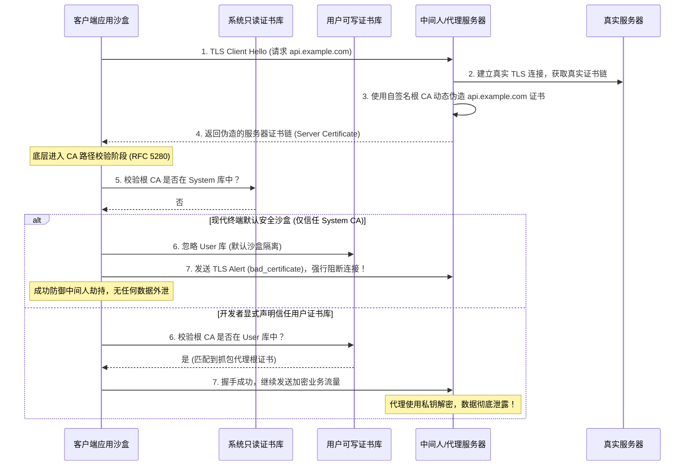
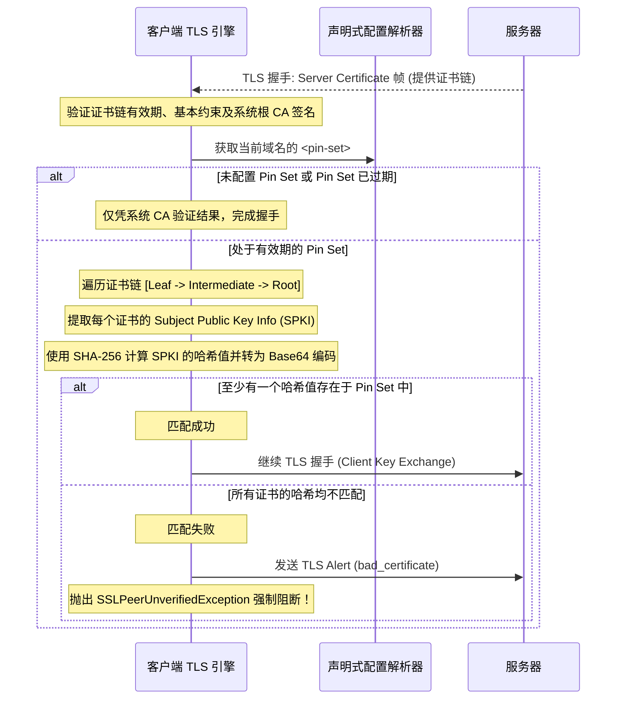

# 1.2.6.5 Android网络安全配置

## 现代终端声明式网络安全策略与底层设计解密

在分布式、开放的网络通信环境中，传输层安全协议（TLS/SSL）是保障端到端数据完整性、机密性与真实性的基石。然而，即便有强大的密码学算法支撑，安全通信的有效性依然高度依赖于客户端的信任策略管理。在传统的客户端-服务器（C/S）架构中，网络安全策略的管理经历了从“粗放命令式”向“现代声明式”的范式转变。本篇将深入剖析现代智能终端声明式网络安全控制的设计哲学、底层 CA 证书信任控制、明文流量拦截机制、证书固定（Certificate Pinning）原理及其底层网络库与操作系统的协议栈级整合方案。

---

### 一、 现代终端网络安全演进与声明式控制设计哲学

在早期应用开发与传统的桌面操作系统中，网络通信的安全机制通常由开发者在代码层面通过命令式（Imperative）的方式显式管理。这种命令式编程范式在实际应用中暴露出了诸多致命的安全缺陷与工程维护困境。

#### 1.1 传统命令式网络安全控制的局限性

在命令式网络安全控制下，若需要修改默认的证书信任策略，开发者必须手动实例化密钥库（`KeyStore`）、初始化证书信任管理器工厂（`TrustManagerFactory`）、并重写证书校验回调接口（如 Java JSSE 体系下的 `X509TrustManager`）。

1. **“信任所有证书”的代码级后门与中间人攻击（MITM）隐患**
   In internal development or debugging phases, developers often wrote "trust all" managers to bypass verification errors from self-signed certificates:
   ```java
   // 传统命令式开发中极具安全隐患的“Trust All”实现示例
   TrustManager[] trustAllCerts = new TrustManager[] {
       new X509TrustManager() {
           @Override
           public void checkClientTrusted(X509Certificate[] chain, String authType) {}
           @Override
           public void checkServerTrusted(X509Certificate[] chain, String authType) {
               // 空实现：绕过了证书有效期、吊销状态、CA 签名链及域名一致性等所有关键校验
           }
           @Override
           public X509Certificate[] getAcceptedIssuers() {
               return new X509Certificate[0];
           }
       }
   };
   ```
   此类代码片段一旦由于分支管理混乱、条件编译标记失效或人为疏忽被带入生产环境包中，应用对外的所有 HTTPS 加密通道将形同虚设。中间人（MITM）只需使用任意一张自签名的无效证书进行劫持，即可轻易获取、篡改通信数据。这类安全隐患隐藏在复杂的业务代码深处，传统的静态应用审计（SAST）工具在面对多态性混淆或动态反射加载的代码时，往往容易产生漏报。

2. **多套网络组件碎片化与安全策略一致性灾难**
   现代复杂客户端通常集成了数十个第三方 SDK（如推送、地图、支付、广告等）。这些 SDK 内部往往自行封装了底层的网络连接逻辑（如独立的 OKHttp 客户端、原生套接字、底层的 C++ 封装或 Rust 编译库）。
   如果安全合规部门要求应用全局“禁用明文 HTTP 传输”或“执行证书公钥固定”，架构师必须找到每一个第三方 SDK 提供的网络配置接口，依次注入自定义的 SocketFactory 或信任管理器。如果某些闭源 SDK 未提供相应的代理配置，就无法保证网络安全策略的一致性，系统安全直接退化至“最薄弱环（Weakest Link）”水平。

3. **主机名校验（Hostname Verification）的普遍性疏漏**
   在命令式代码编写中，很多开发者为了避开“证书域名与请求域名不匹配”的握手错误，会编写极其危险的自定义主机名校验器：
   ```java
   // 无条件通过主机名校验的错误代码
   HttpsURLConnection.setDefaultHostnameVerifier(new HostnameVerifier() {
       @Override
       public boolean verify(String hostname, SSLSession session) {
           return true; // 忽略主机名不匹配，极易遭受同CA下不同域名的越权劫持
       }
   });
   ```
   这种操作彻底丧失了 TLS 防御“伪造域名劫持”的能力。即使中间人返回的是由权威受信任 CA 签发的证书，只要证书对应的域名并非当前请求的主机域名，网络栈也本应切断连接；而重写 `verify` 返回 `true` 会导致客户端无条件建立连接。

4. **硬编码证书固定的“生命周期炸弹”**
   早期的证书固定机制通常是将证书的二进制数据（DER 编码）或公钥哈希硬编码在应用程序的类变量或资源静态常量中。当服务器证书由于私钥泄露、CA 机构信誉危机强制吊销或常规过期需要紧急更换时，客户端如果不发布更新补丁，将无法与服务器建立任何 TLS 连接。在软件分发渠道长、用户更新不及时的背景下，硬编码会导致漫长的业务中断故障。

#### 1.2 声明式网络安全配置（Declarative Network Security Configuration）的概念

针对上述缺陷，现代操作系统与网络框架引入了**声明式网络安全配置**机制。其核心思想是：**安全策略与业务代码彻底解耦，通过静态配置文件声明安全意图，由底层系统网络栈统一、透明且 Fail-Safe 地执行。**

- **解耦设计**：开发人员无需在代码中涉及 `SSLContext`、`TrustManager` 或 `SocketFactory` 的逻辑。企业安全专家或架构师仅需在一份静态配置文件（如 XML、JSON 等结构化文本）中声明应用的域名信任锚点、明文拦截策略及固定公钥集。
- **域名层级树匹配**：声明式策略天然支持基于域名（Domain-based）的分层控制。可以通过配置前缀或通配域名构建内存匹配树，将特定的安全规则限制在精准的目标范围内，遵循了安全设计中的“最小特权（Least Privilege）”原则。
- **平台级透明拦截**：操作系统或应用网络框架的核心底层（如连接发起处、套接字握手前）会直接加载此配置文件，在通信链路最底层统一拦截不合规连接。这种“安全防线后移”的方法，即便在高层业务代码失误或引入有漏洞的第三方 SDK 时，依然能确保系统不跌破安全底线。

---

### 二、 基础 CA 证书信任控制与沙盒隔离机制

数字证书链的验证体系（Chain of Trust）是 TLS 安全通信的枢纽。现代智能终端在其底座设计上，通过沙盒化的存储架构，对不同的 CA（Certificate Authority）证书来源实施了严密的信任隔离。

#### 2.1 智能终端的 CA 证书存储架构

在一个具备现代安全防御能力的终端操作系统中，CA 证书通常被物理隔离在两个不同的信任库（Trust Store）中：

| 维度 | 系统证书库 (System Trust Store) | 用户证书库 (User Trust Store) |
| :--- | :--- | :--- |
| **存储物理路径** | 系统的只读系统分区（如 `/system/etc/security/cacerts/` 或 `/etc/ssl/certs/`） | 用户可写的数据分区或系统钥匙串（KeyChain）的受限隔离区 |
| **写入权限** | 仅系统最高管理员或操作系统内核可写，普通应用与用户无法篡改 | 用户可以通过系统设置手动导入安装，或由企业 MDM（移动设备管理）策略下发 |
| **信誉准入标准** | 由系统厂商严格审核，必须符合 WebTrust 审计等国际最高安全规范的商业 CA | 任意第三方自签名根证书、公司内部私有 CA 等 |
| **更新周期** | 绑定操作系统安全更新或系统核心组件包的静默更新 | 用户随时手动管理、添加或删除 |

#### 2.2 防御用户证书重装代理的 MITM 威胁演进

早期智能系统由于安全沙盒边界模糊，默认无差别地信任系统库与用户库中的所有根证书。这导致了一个在网络渗透与监控领域被广泛利用的中间人劫持路径：

1. **导入劫持证书**：攻击者通过社会工程学手段诱导用户，或者安全研究人员在测试设备中，将抓包代理工具（如 Charles、Fiddler、Mitmproxy 等）的自签名 CA 根证书导入到设备的用户证书库中。
2. **流量重定向**：将该设备的网络流量通过代理服务器路由。
3. **动态证书伪造**：代理服务器截获客户端 HTTPS 请求（例如访问 `api.example.com`）时，利用自身持有的用户库根 CA 私钥，动态签发一张假冒 `api.example.com` 的服务器证书，返回给客户端。
4. **验证通过与明文泄露**：由于早期应用默认信任用户证书库，客户端在回溯证书链时发现该假冒证书能成功追溯至用户库中的根 CA，进而判定连接合法，TLS 握手成功。这导致应用的所有加密业务流量在代理服务器处被解密并处于完全暴露状态。



为了彻底封堵这一安全破口，现代移动操作系统（以 Android 7.0+ 和 iOS 现代安全沙盒为代表）重构了默认的信任锚点逻辑：**在默认状态下，应用沙盒只信任系统证书库（System CA），不再信任用户证书库（User CA）。** 这一设计从根本上遏制了利用用户库证书执行中间人抓包与劫持的攻击路径。即使设备上安装了恶意的用户 CA，应用也会因为底层校验器将用户库“剪枝隔离”而拒绝连接，极大程度地保障了应用内核心业务数据的端到端加密属性。

#### 2.3 自定义信任锚点与子域约束

虽然默认隔离用户 CA 大幅提升了生产环境的抗劫持能力，但在实际的工程研发和特殊的内网环境下，开发团队依然需要连接企业内网的自签名服务器或供开发调试用的网关。声明式配置架构允许开发者在安全配置文件中精确声明自定义信任锚点，并在域名层级实施严格的访问控制。

以下为一例典型声明式 XML 配置文件的核心逻辑解构：
```xml
<?xml version="1.0" encoding="utf-8"?>
<network-security-config>
    <!-- 全局基置策略：强制要求全站禁用明文 HTTP 传输，且仅信任系统级 CA -->
    <base-config cleartextTrafficPermitted="false">
        <trust-anchors>
            <certificates src="system" />
        </trust-anchors>
    </base-config>

    <!-- 针对特定子域的定制化例外配置 -->
    <domain-config>
        <!-- 限制该规则只在开发测试域名及其子域名下生效 -->
        <domain includeSubdomains="true">dev.internal.example.com</domain>
        <trust-anchors>
            <!-- 仍旧信任系统 CA -->
            <certificates src="system" />
            <!-- 信任硬编码打包进应用包的私有根 CA（如 /res/raw/test_ca.crt） -->
            <certificates src="@raw/test_ca" />
            <!-- 仅在匹配该域名时，临时信任设备的用户证书库 -->
            <certificates src="user" />
        </trust-anchors>
    </domain-config>
</network-security-config>
```

##### 域名约束（Domain Constraints）的路径验证算法（RFC 5280）
在底层，当 TLS 握手引擎（如 BoringSSL 的验证器）接收到服务器发来的证书链时，它会启动 RFC 5280 规定的证书路径验证算法：
- **匹配评估**：网络栈解析当前请求的主机域名 `dev.internal.example.com`，发现匹配了配置中的 `domain-config`。
- **锚点重构**：本次握手专用的 `X509_STORE` 被重构，包含了 `system` 根证书、`user` 根证书以及 `@raw/test_ca`。
- **约束边界保护**：如果攻击者尝试在公网的生产域名 `api.example.com` 上利用泄露的 `test_ca`进行签名劫持，由于请求域名不满足该 `domain-config` 的子域约束，底层校验引擎将仅使用全局的 `base-config`，从而剔除 `test_ca`，握手在证书链构建阶段即告失败。这充分体现了“域名细粒度隔离”的防御深度。

---

### 三、 证书吊销检查与 TLS 握手层集成（CRL vs OCSP）

在证书验证路径中，除了通过 CA 确认签名的正确性，客户端还必须在握手阶段判定当前证书链中是否有任何证书已被 CA 机构吊销（Revoked）。

#### 3.1 证书吊销列表（CRL）的客户端局限性
CRL（Certificate Revocation List）是由 CA 机构定期更新并签名的已吊销证书序列号清单。
- **性能痛点**：CRL 文件由于包含大量已吊销证书，文件体积可能达到数兆字节。移动端或物联网终端在握手期间去发起独立的 HTTP 链路下载 CRL 列表，会引入严重的网络延迟，并消耗网卡带宽。
- **隐私问题**：向 CA 下载 CRL 时，CA 的 CDP 服务器能通过 IP 嗅探知晓客户端正在连接哪家商业机构，存在隐私泄露风险。

#### 3.2 在线证书状态协议（OCSP）与 OCSP Stapling（封套）
为了解决 CRL 的包体积问题，OCSP（Online Certificate Status Protocol）被引入，允许客户端仅查询当前证书的单条吊销状态。但在客户端直接发起 OCSP 查询时，仍然会产生“三次握手之外的额外网络交互”和“ Responder 服务可用性依赖（DDoS 风险）”。

为了达成最佳的网络性能与安全防线，现代网络引擎大多采用 **OCSP Stapling** 机制：
1. **服务器缓存**：服务器定期向 CA Responder 请求获取带有 CA 数字签名的 OCSP 响应，并将其缓存在服务器本地。
2. **握手随航发送**：在 TLS 握手阶段，服务器在发送 `Certificate` 消息时，将这份已签名且具有时效性的 OCSP 响应作为封套（Staple）一并发送给客户端。
3. **本地零耗时验证**：客户端底层网络库（如配置了安全策略的 TLS 实现）直接利用本地已信任的 CA 公钥去验证该封套的签名。如果签名合法且指示证书状态为 `Good`，则通过验证。整个过程完全在本地内存中进行，消除了网络延迟，同时隐蔽了用户的访问去向。

---

### 四、 清晰文本（Cleartext / 明文 HTTP）拦截机制与原理解密

明文协议通信（HTTP）在任何公共或专有网络路径上都存在数据暴露与完整性被破坏的极高风险。实施明文拦截不仅是合规的硬性要求，更是防患于未然的关键举措。

#### 4.1 明文拦截的设计价值
有些开发团队试图在应用层的 HTTP Client（如 Retrofit / OkHttp 的 Interceptor 层）实现明文拦截。但这种拦截是“被动”且“滞后”的。如果某些底层的 JNI 第三方组件避开了高级 HTTP 客户端，直接使用底层 socket 通信，拦截策略便会失效。
声明式安全策略在底层设计的明文拦截是**“前置的主动拦截”**。其设计宗旨在于：**在任何一个明文 TCP 数据包（如 HTTP 请求的头部或内容）被拼装发送到物理网卡之前，从操作系统网络协议栈的物理管道处切断连接。**

#### 4.2 底层工作原理：套接字工厂与安全策略引擎的挂钩

在底层实现上，声明式明文拦截并不是在网络连接建立后读取返回数据时发现是 HTTP 才进行报错，而是在**套接字物理创建并准备发起 connect() 系统调用之前**提前执行拦截的。

其底层的调用流程可以通过下述机制解密：

1. **域名查找前缀树的建立**
   应用初始化或操作系统安全框架加载声明式安全配置文件时，会将所有的域名限制规则构建为高效的域名树状检索结构。
2. **底层套接字工厂的钩子挂载（Socket Factory Hooking）**
   以底层的网络通信调用为例，高级网络库或底层的 API 发起 HTTP 请求时，需要请求套接字工厂（`SocketFactory`）创建套接字并连接目标主机名。
   系统的安全策略控制类（如系统级的 `NetworkSecurityPolicy`）会充当拦截的审判者。以下为底层实现机制的通用逻辑伪代码：
   ```java
   // 抽象底座层安全套接字工厂对明文流量的 Early Block（握手前拦截）实现
   public class SecurityDelegatingSocketFactory extends SocketFactory {
       private final SocketFactory delegate;
       private final NetworkSecurityPolicy policy;

       public SecurityDelegatingSocketFactory(SocketFactory delegate) {
           this.delegate = delegate;
           this.policy = NetworkSecurityPolicy.getInstance();
       }

       @Override
       public Socket createSocket(String host, int port) throws IOException {
           // 检查当前连接是否满足明文特征 (例如 80 端口或显式声明的 http 协议类型)
           if (isPlaintextConnection(port)) {
               // 核心判断：向全局安全配置策略查询该目标域名是否禁用了明文
               if (!policy.isCleartextTrafficPermitted(host)) {
                   throw new SecurityException("Cleartext HTTP traffic to " + host 
                       + " is not permitted by network security policy config.");
               }
           }
           // 只有未被拦截时，才会真正向操作系统内核发起创建 socket 的系统调用
           return delegate.createSocket(host, port);
       }

       private boolean isPlaintextConnection(int port) {
           return port == 80 || port == 8080; // 经典的非加密 HTTP 通信端口
       }
   }
   ```
3. **零网络损耗（Zero Network Cost）的 Early Block 优势**
   在这种精细的底层挂钩下，如果业务层误用了一个 `http://` 链接去连接一个被禁止明文传输的主机：
   - **绝不发起 TCP 握手**：客户端不会向网关发送任何 SYN 数据包，攻击者和运营商无法在局域网或链路中通过嗅探感知到该连接尝试。
   - **敏感头部物理隔离**：由于 `connect()` 根本没有调用，携带用户 Cookie、Authorization 凭证或 API 签名等敏感数据的 HTTP 头部根本无法离开应用的用户空间，在物理层面达成了零数据泄露的安全状态。

#### 4.3 边界控制：本地回环与私有 IP 豁免
在全站推行 `cleartextTrafficPermitted="false"` 时，客户端常会遇到一些必须明文通信的合理边缘场景，如与设备本地运行的其他服务进行通信（如跨进程调用的本地 `127.0.0.1` 服务）或连接未配备证书的局域网物联网硬件（如 RFC 1918 规定的私有网段 IP，如 `192.168.1.1`）。

为此，底层的声明式安全决策器在匹配域名树时，维护了以下过滤分支：
- **回环地址自动豁免**：当且仅当目标解析 IP 为 `localhost`、`127.0.0.1` 或 IPv6 的 `::1` 时，由于数据完全不经物理网卡外泄，系统策略引擎会自动豁免其明文拦截规则。
- **局部网络例外配置**：支持对本地特定的局域网网段或后缀域名（如 `*.local`）独立声明配置项以开放明文，保证了业务的灵活性。

---

### 五、 证书固定/锚定（Certificate Pinning / Pin Sets）原理与配置

证书固定是将特定域名的合法公钥直接锚定在客户端配置中的终极防御手段。即使中间人攻破或控制了客户端信任的某家受信任的 CA 机构，只要攻击者伪造证书链的公钥哈希与客户端本地配置不符，连接依然会被强制斩断。

#### 5.1 证书固定的物理工作过程

在 TLS 握手阶段（通常在服务器向客户端发送 `Certificate` 握手消息后），底层的验证流程会与传统的 CA 链验证并行或在其之后执行：



1. **提取公钥（SPKI）字段**：客户端在接收到证书链后，依次对证书链中的证书调用提取函数（如 X509 规范下的 `getPublicKey().getEncoded()` ），该操作提取的是 **Subject Public Key Info (SPKI)** 的 ASN.1 DER 编码字节流。
2. **计算 SHA-256 并 Base64 编码**：使用密码学哈希算法计算该字节流的摘要值，为了在文本配置文件中便于展示和匹配，将其转化为 Base64 字符串（即配置文件中常见的 `<pin digest="SHA-256">Base64_Value</pin>`）。
3. **哈希组匹配比对**：将计算得到的哈希值与当前域名对应的 Pin 集合进行字符串逐一比对。只要服务器证书链中从“叶子证书（Leaf）”、“中间证书（Intermediate）”到“根证书（Root）”的公钥哈希中，有**至少一个**与客户端配置项重合，即判定证书固定通过；如果整条链中没有任何一个公钥哈希命中配置，即使其证书链在系统 CA 层面绝对合法，底层也会立即抛出 `SSLPeerUnverifiedException`，主动终止握手。

#### 5.2 为什么固定 SPKI 而非完整证书文件？
证书中包含了许多非公钥的元数据（如有效期 `NotBefore/NotAfter`、证书序列号 `SerialNumber` 等）。即使服务器的私钥（即公私钥对）完全不变，重新向 CA 申请签发新证书时，这些元数据的变动也会导致整个证书文件的二进制 MD5/SHA-256 哈希值发生根本性的改变。
如果客户端固定的是整个证书（Certificate Pinning），在服务器轮转证书时，客户端将立即发生连接瘫痪。
- **SPKI 固定** 仅表示公钥数据及其算法类型（由 RFC 5280 规范定义）。只要服务端团队保留原始密钥对，并通过 CSR（证书签名请求）在相同公钥下进行后续证书签发，新旧证书的 SPKI 就会完全一致。这种设计保证了在不牺牲安全性的情况下，服务端能够进行无缝的证书轮转。

#### 5.3 备份 Pin（Backup Pin）策略与冷存储容灾

因为证书固定将应用的可用性绑定在特定的公钥上，一旦发生诸如“服务器私钥意外损毁”、“私钥遭物理盗取必须作废更换”等单点故障，而客户端又没有配置备份 Pin，将导致全局性的“安全死锁”。

为了防御此容灾短板，符合业界规范的解析引擎通常会**强制约束**配置中必须提供至少一个备份 Pin（Backup Pin），且备份 Pin 的密钥必须与主 Pin 不同。

##### 策略一：离线冷备份密钥对（Air-gapped Cold Backup Key）
企业安全团队在生成主密钥 Key A 的同时，在物理隔离的冷存储环境（如硬件安全模块 HSM 或冷备份服务器）中生成另一对密钥 Key B。
- 将 Key A 的 SPKI 哈希填入主 Pin，Key B 的 SPKI 哈希填入备份 Pin（Backup Pin）。
- 平时，Key B 的私钥静静躺在冷存储中，不部署在任何联网的服务器上。
- 一旦在线的 Key A 私钥泄露，运维团队启用冷存储中的 Key B 私钥重新签发证书并部署至生产服务器。此时，客户端由于内置了 `pin-B` 的哈希，能无缝通过 TLS 校验，业务得以瞬间恢复，同时也赢得了版本升级的宝贵缓冲时间。

##### 策略二：固定备用商业 CA 信任链
如果企业无法实施高成本的冷备份密钥管理，亦可将第二个备份 Pin 设置为另一家信誉良好的商业 CA 机构的根证书公钥哈希。当主 CA 出现违规签发信誉危机时，应用能无缝切换为第二家 CA 签发的证书链，无需紧急发版。

#### 5.4 证书固定的到期与软降级机制

即使有备份 Pin，如果运维失误导致多套密钥在生命周期交替时均失效，证书固定极易成为不可挽回的灾难。为了规避此系统性崩溃风险，声明式配置引入了`<pin-set expiration="YYYY-MM-DD">` 的绝对到期设计。

当客户端 TLS 引擎执行 Pin 匹配时，会首先比对当前系统的时钟：
- **系统时间未过有效期**：强制校验。哈希不匹配则抛出异常，断开网络。
- **系统时间已过有效期**：判定该域名的证书固定校验失效。引擎会将该连接自动退化（Fall back）为**常规的系统 CA 信任链验证**。只要证书由合法的公开 CA 签发，即可成功建立连接。

这种设计在“高强度抗劫持”与“极端情况下防死锁”之间建立了弹性的容灾缓冲，在系统工程中被视为保障业务连续性（Business Continuity）的黄金准则。

---

### 六、 密码学迁移与后量子时代（PQC）下的 SPKI 挑战

随着密码学理论的演进，声明式证书固定底层在处理不同加密算法（如 RSA 迁移至 ECC/ECDSA）及未来的后量子密码学时代，也面临着设计上的升级。

#### 6.1 RSA 迁移至 ECC 算法下的 SPKI 匹配
- **结构与开销**：RSA-3072/4096 的 SPKI 编码包含极其庞大的模数和指数，而基于 `secp256r1` 曲线的 ECC 公钥其 SPKI 长度仅不到 100 字节。
- **迁移隐患**：即使私钥持有人和域名不变，如果服务器将加密算法从 RSA 升级至 ECC，生成的 SPKI DER 编码其 ASN.1 头部与格式会发生根本性改变。这意味着主 Pin 配置如果没有提前兼容 ECC 密钥，握手将直接失败。

#### 6.2 后量子密码学（PQC）时代的前瞻性升级
Shor 算法在量子计算机成熟后将对 RSA 和 ECC 实现瞬间破解。为此，国际标准化组织正全力推进后量子签名算法（如 ML-DSA、Kyber/ML-KEM 等）。
- **公钥体积膨胀**：PQC 证书的公钥指纹通常长达数千字节，这对于提取 SPKI 字节流并进行 SHA-256 摘要计算的客户端 TLS 引擎提出了更高的内存与 CPU 负载要求。
- **哈希强度升级**：在 PQC 时代，为了防御量子算法对抗哈希碰撞的能力，声明式安全框架的指纹比对算法必须从传统的 SHA-256 升级到 SHA-384 或 SHA-3（Keccak-384）等高阶摘要算法，并优化底层的密码学硬件加速硬件扩展指令集（如 ARMv8 SHA 扩展指令）。

---

### 七、 声明式安全配置的安全边界、局限性与对抗机制

没有绝对的安全，只有不断提高的攻击成本。理解声明式安全策略的边界，是安全加固的关键。

#### 7.1 运行时 Hook 对抗

声明式网络安全配置建立在应用沙盒隔离未被攻破的假设之上。一旦运行设备被 Root、越狱，或处于受控的动态逆向分析环境中，攻击者可通过 Frida 或 Xposed 框架，直接在系统内存中对解析策略的核心类进行运行时插桩：
- Hook `isCleartextTrafficPermitted` 强制使其无条件返回 `true`，绕过明文拦截。
- Hook `checkServerTrusted` 屏蔽其对证书链与 SPKI 哈希的比对验证，实现假证书的强制通过。

##### 应对策略
对于极高安全等级的应用，仅靠声明式配置是不够的。必须引入多重防御：
1. **防篡改与完整性校验（Integrity Checks）**：在 Native 语言层对网络配置 XML/JSON 进行编译期静态签名 and 哈希校验，防止应用包被重签名和二次打包修改。
2. **环境完整性验证（Environment Attestation）**：应用启动时结合硬件可信环境（TEE）对运行系统进行完整性度量，一旦检测到环境已被破坏，立即主动终止服务。

#### 7.2 自定义网络栈（C/C++ 原生层库）的“法外之地”
如果应用在代码中打包了自主编译的 BoringSSL/OpenSSL 库并直接发起 C 标准库的 socket 连接，这些网络请求直接绕过了系统的安全配置解析服务，声明式安全策略将对其完全失效。

##### 应对策略
在这种场景下，开发团队必须自建**安全配置同步适配器**。
自建的底层网络栈在初始化时，必须解析应用的声明式 XML/JSON 安全配置，将其中的域名树、信任 CA 文件句柄以及 SPKI Hash 指纹同步写入到 BoringSSL 的 `SSL_CTX` 结构体及自定义握手回调中，以此保证 Native 层网络库与系统原生库安全规则的全局一致性。

---

### 八、 总结与现代终端安全设计展望

声明式网络安全控制将传统的命令式、易出错的代码配置剥离，提炼为统一的声明式规范。这一进化使得网络安全的管理由“开发者个人素质”转化为“平台底座与安全标准的工程化控制”。

通过在网络底层套接字工厂实施明文拦截、在 TLS 握手阶段集成 SPKI 哈希校验与备份 Pin 容灾机制，现代终端成功在系统边界上筑起了一道坚实的安全铁壁。掌握这一整套声明式策略的底层原理、运行机制与边界对抗方案，是实现现代化客户端-服务器通信链路端到端安全的必经之路。随着密码学与操作系统的不断发展，声明式策略必将朝向更智能、更动态的零信任（Zero Trust）架构方向大步迈进。
