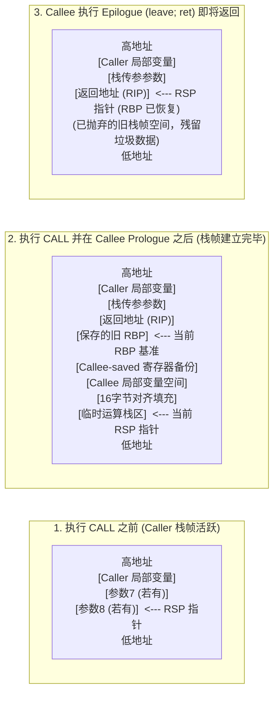

# 1.3.1.3 栈

## 1. 栈的核心定义与设计初衷

### 1.1 受限线性表的代数本质与形式化定义
在经典数据结构与程序设计理论中，栈（Stack）被定义为一种**受限的线性表**（Restricted Linear List）。其“受限”特征的数学本质在于：对于线性表中的元素插入与删除操作，其操作的物理或逻辑地址被严格限制在表的同一端——这一端被称为**栈顶（Top）**，而另一端则被称为**栈底（Bottom）**。

形式化地，我们可以将栈定义为一个三元组 $S = (L, T, B)$，其中：
- $L = (a_1, a_2, \dots, a_n)$ 是一个包含 $n$ 个元素的线性序列（$n \ge 0$，当 $n=0$ 时栈为空）。
- $T \in \{1, 2, \dots, n\}$ 表示栈顶的索引，它指向序列的尾部元素 $a_n$。
- $B = 1$ 表示栈底的固定索引，指向序列的首个元素 $a_1$。

在代数结构上，栈的生存期可以被视为一组操作序列的复合。栈的元素存取规则遵循**先进后出**（Last-In-First-Out, LIFO）的原则。若我们定义栈上的代数运算，每一个元素的压栈（Push）和出栈（Pop）都是对该线性序列的变换。定义一个初始为空的栈为 $S_0$，任意时刻的状态 $S_i$ 均可通过一系列基元操作转换而来。

### 1.2 先进后出（LIFO）的置换特征与卡特兰数推导
栈的 LIFO 特征决定了输入流与输出流之间的强约束置换关系。设输入序列为定长升序序列 $X = \langle 1, 2, 3, \dots, n \rangle$，通过一个栈的 Push 与 Pop 操作的交错组合，我们可以获得多种不同的输出序列 $Y = \langle y_1, y_2, \dots, y_n \rangle$。然而，并非所有 $n!$ 种置换都是合法的出栈序列。

#### 出栈序列的置换判定定理
一个输出序列 $Y$ 是由输入序列 $X$ 通过栈操作生成的合法出栈序列，当且仅当对于任意的索引三元组 $1 \le i < j < k \le n$，不存在这样的输出关系：
$$y_k < y_i < y_j$$
也就是说，如果一个较小的数 $y_k$ 在两个较大的数 $y_i$ 和 $y_j$ 之后输出，那么必定不可能出现 $y_i < y_j$ 的情况（因为按照 LIFO 规则，在 $y_k$ 被压入并出栈的过程中，先入栈的 $y_i$ 必定比后入栈的 $y_j$ 更晚出栈，即若 $y_i$ 和 $y_j$ 都在 $y_k$ 之前输出，则必然是 $y_j$ 先于 $y_i$ 输出，即满足 $y_j > y_i$）。

#### 合法出栈序列总数的卡特兰数推导
为了求得大小为 $n$ 的输入序列所能产生的合法出栈序列总数 $f(n)$，我们可以通过划分子问题来建立递推关系。
设想输入序列中的第一个元素 $a_1$。在整个 Push 和 Pop 操作序列中，假设 $a_1$ 是第 $k$ 个从栈中被弹出的元素（其中 $1 \le k \le n$）。
- 在 $a_1$ 出栈之前，必定有 $k-1$ 个元素已经进栈并出栈完毕。这些元素必然是紧随 $a_1$ 之后的 $a_2, a_3, \dots, a_k$。这部分子问题对应的合法出栈序列数为 $f(k-1)$。
- 在 $a_1$ 出栈之后，剩余的 $n-k$ 个元素 $a_{k+1}, \dots, a_n$ 才开始进入栈并陆续出栈。这部分子问题对应的合法出栈序列数为 $f(n-k)$。

由于这两部分子问题的操作在逻辑上是完全解耦且独立的，因此当 $a_1$ 在第 $k$ 个位置出栈时，其组合数等于两个子问题方案数的乘积，即：
$$f(k-1) \cdot f(n-k)$$

因为 $a_1$ 的出栈位置 $k$ 可以是 $1$ 到 $n$ 之间的任意整数，我们将所有可能互斥的 $k$ 值所对应的方案数相加，即可得到完整的递推关系式：
$$f(n) = \sum_{k=1}^{n} f(k-1)f(n-k), \quad n \ge 1$$
规定初始边界条件为 $f(0) = 1$。该递推关系对应的经典代数解即为**卡特兰数**（Catalan Number）$C_n$。

为了求解此递推式，引入生成函数（Generating Function）：
$$G(x) = \sum_{n=0}^{\infty} f(n)x^n$$

将递推式代入生成函数中：
$$G(x) = f(0) + \sum_{n=1}^{\infty} \left( \sum_{k=1}^{n} f(k-1)f(n-k) \right) x^n$$
$$G(x) = 1 + x \sum_{n=1}^{\infty} \sum_{k=1}^{n} f(k-1)f(n-k) x^{n-1}$$
由于右侧的二重求和项正好是生成函数本身的平方展开，即：
$$G(x) = 1 + x [G(x)]^2$$

这反映出一个二次方程关系：
$$x [G(x)]^2 - G(x) + 1 = 0$$

求解该方程可得：
$$G(x) = \frac{1 \pm \sqrt{1 - 4x}}{2x}$$

根据极限条件，当 $x \to 0$ 时，$\lim_{x \to 0} G(x) = f(0) = 1$。若取分子中为加号，则分子趋于 2，分母趋于 0，极限为无穷大，不符合物理事实；因此必须取减号：
$$G(x) = \frac{1 - \sqrt{1 - 4x}}{2x}$$

利用牛顿广义二项式定理展开 $\sqrt{1-4x}$：
$$\sqrt{1 - 4x} = (1 - 4x)^{1/2} = \sum_{n=0}^{\infty} \binom{1/2}{n} (-4x)^n$$
其中，二项式系数为：
$$\binom{1/2}{n} = \frac{\frac{1}{2}\left(\frac{1}{2}-1\right)\dots\left(\frac{1}{2}-n+1\right)}{n!} = \frac{(-1)^{n-1} (2n-2)!}{2^{2n-1} n! (n-1)!}$$

代入展开式后进行代数整理，可得 $G(x)$ 的系数通项公式，即卡特兰数的显式代数表达式：
$$f(n) = C_n = \frac{1}{n+1}\binom{2n}{n} = \frac{(2n)!}{(n+1)!n!}$$
该公式从代数本征层面上，给出了受限于 LIFO 规则的线性表在进行排列变换时所表现出的最大组合承载边界。

### 1.3 设计初衷：计算模型中的嵌套、回溯与生命周期管理
在图灵机与现代冯·诺伊曼计算架构的演进过程中，栈的引入并非出于偶然，而是为了解决计算任务中天然存在的**多层次嵌套结构（Nested Structure）**与**回溯（Backtracking）需求**。

在不支持栈的早期计算系统（例如只支持扁平跳转的汇编程序，或仅依赖有限状态自动机 DFA 的模型）中，系统无法保留对“历史路径”的无限记忆。例如，考虑以下计算场景：
1. **嵌套括号匹配**：对于字符串 `(((...))...)`，当遇到右括号 `)` 时，系统必须匹配与之距离最近的未匹配左括号 `(`。这种“邻近配对”的逻辑本质上就是 LIFO 的物理实现。
2. **函数嵌套调用**：函数 $A$ 调用函数 $B$，$B$ 又调用 $C$。当 $C$ 执行完毕后，控制流必须返回到 $B$ 被中断的下一条指令处，随后再返回到 $A$ 中。在内存中，每一个函数调用的生存期（Lifetime）表现为严格的树状嵌套关系——先开始的最后结束，后开始的最先结束。
3. **图的深度优先搜索（DFS）中的回溯**：当探索一条路径遭遇死胡同后，系统需要退回到上一个决策点。上一个决策点恰好是所有已访问过但尚未完成邻接点遍历的决策点中“最近”的那一个。

栈的设计初衷，正是通过将复杂的状态管理抽象为单一指针（栈顶）的单向位移，提供了一种以 $O(1)$ 复杂度维护“当前最活跃状态”及“回溯路径”的普适方法。它完美映射了动态规划和递归求解中状态空间树的深度方向遍历过程。

---

## 2. 栈的底层实现对比与系统级考量

要在物理内存中实现栈的抽象数据类型，有两种基础的物理拓扑方案：基于连续物理存储的**顺序栈（Array-based Stack）**和基于离散物理存储的**链式栈（Linked-list-based Stack）**。这两者在寻址机制、常数项开销、扩容代价以及现代 CPU 微架构下的硬件缓存（Cache）表现上有着迥然不同的表现。

### 2.1 顺序栈（Array-based Stack）：连续物理内存的极致寻址

#### 2.1.1 内存布局与两种指针语义的汇编寻址差异
顺序栈在底层分配一块连续的物理内存空间。在高级语言中，它通常被声明为一个固定大小或可动态重分配的数组：

```c
typedef struct {
    ElemType *data; // 连续存储区基址
    int top;        // 栈顶指针/索引
    int capacity;   // 当前最大容量
} SeqStack;
```

在机器代码级别，栈顶指针 `top` 的语义定义不同，会导致编译器生成的汇编寻址代码产生关键差异：

##### 语义 A：`top` 指向栈顶元素
初始化时 `top = -1`。
- **Push 操作**：先递增指针，再写入数据。对应 C 代码：`stack->data[++(stack->top)] = val;`
  在 x86-64 汇编下，其底层执行指令流大致如下：
  ```assembly
  mov eax, dword ptr [rdi+8]   ; 读取 stack->top 到 eax
  inc eax                      ; eax = eax + 1
  mov dword ptr [rdi+8], eax   ; 将更新后的 top 写回 stack->top
  mov rdx, qword ptr [rdi]     ; 获取 stack->data 的基地址
  cdqe                         ; 将 eax 符号扩展为 64 位的 rax
  mov qword ptr [rdx+rax*8], rsi ; 将待写入的值 rsi 写入 data[top] (假设 ElemType 为 8 字节)
  ```
- **Pop 操作**：先读取数据，再递减指针。对应 C 代码：`val = stack->data[(stack->top)--];`

##### 语义 B：`top` 指向下一个待写入的空闲位置（即当前栈内元素个数）
初始化时 `top = 0`。
- **Push 操作**：直接在 `top` 处写入数据，写入后递增 `top`。对应 C 代码：`stack->data[(stack->top)++] = val;`
  在汇编级，这种语义省去了一次递增后的中间同步，能够直接寻址写入：
  ```assembly
  mov rdx, qword ptr [rdi]     ; 获取 stack->data 的基址到 rdx
  movsxd rax, dword ptr [rdi+8] ; 将 stack->top (当前空闲偏移) 符号扩展载入 rax
  mov qword ptr [rdx+rax*8], rsi ; 直接将值 rsi 写入 data[top]
  inc eax                      ; top 递增
  mov dword ptr [rdi+8], eax   ; 写回 stack->top
  ```
- **Pop 操作**：先递减指针，再读取数据。对应 C 代码：`val = stack->data[--(stack->top)];`

可以看出，顺序栈的 Push 与 Pop 操作在没有任何扩容发生的前提下，其机器指令数量固定，没有任何跳转分支，寻址仅仅是基址寄存器与偏移量寄存器的乘加操作（如 `[rdx + rax * 8]`），其时间复杂度是严格的常数阶 $O(1)$。

#### 2.1.2 动态扩容的势能法（Potential Method）平摊分析证明
顺序栈在初始化时必须指定容量 `capacity`。当栈满（`top + 1 == capacity`）时，若继续执行 Push，则必须通过内存分配函数（如 `realloc`）开辟一片更大的连续空间，并将旧数据拷贝至新地址。单次扩容需要拷贝所有的 $N$ 个旧元素，因此单次最坏情况时间复杂度为 $O(N)$。

为了证明动态扩容顺序栈在长期操作序列下的真实性能，我们采用算法导论中的**势能法（Potential Method）**进行平摊分析（Amortized Analysis）。

假设顺序栈的初始容量为 $K$。当栈满时，我们采用**翻倍扩容（2倍）**策略。
定义第 $i$ 次操作后的顺序栈状态为 $D_i$。定义势函数（Potential Function） $\Phi(D_i)$ 为：
$$\Phi(D_i) = 2 \cdot size(D_i) - capacity(D_i)$$
其中：
- $size(D_i)$ 为当前栈中的元素数量。
- $capacity(D_i)$ 为当前栈的最大容量。

我们来检验该势函数的合理性：
- 初始状态 $D_0$：栈为空，此时 $size(D_0) = 0$，$capacity(D_0) = K$，则 $\Phi(D_0) = 2(0) - K = -K$。为了保证在任意时刻势能非负（即 $\Phi(D_i) \ge \Phi(D_0)$ 且对任意 $i$ 有 $\Phi(D_i) \ge 0$），我们可以将势函数修正为：
  $$\Phi(D_i) = \max(0, 2 \cdot size(D_i) - capacity(D_i))$$
  在栈元素个数达到容量的一半以上时，$\Phi(D_i) = 2 \cdot size(D_i) - capacity(D_i)$ 必然成立且大于等于 0。
- 当栈刚刚完成扩容时，假设此时容量为 $2M$，元素个数为 $M+1$（从 $M$ 个元素扩容过来，并新压入一个元素）。此时：
  $$\Phi(D_i) = 2(M+1) - 2M = 2$$
  势能处于极低状态。
- 当栈即将发生下一次扩容前，此时栈已满，元素个数为 $2M$，当前容量为 $2M$。此时：
  $$\Phi(D_{i-1}) = 2(2M) - 2M = 2M$$
  势能累积到最大值，准备释放以支付昂贵的内存拷贝代价。

现在我们计算第 $i$ 次 Push 操作的平摊代价（Amortized Cost） $\hat{c}_i$。平摊代价公式定义为：
$$\hat{c}_i = c_i + \Phi(D_i) - \Phi(D_{i-1})$$
其中 $c_i$ 为第 $i$ 次操作的实际物理代价。

##### 情况一：第 $i$ 次 Push 操作未触发扩容
此时，$size(D_i) = size(D_{i-1}) + 1$ 且 $capacity(D_i) = capacity(D_{i-1}) = C$。
- 实际代价 $c_i = 1$（仅执行一次元素写入）。
- 势能变化：
  $$\Phi(D_i) - \Phi(D_{i-1}) = [2 \cdot size(D_i) - C] - [2(size(D_i) - 1) - C] = 2$$
- 因此平摊代价为：
  $$\hat{c}_i = 1 + 2 = 3$$

##### 情况二：第 $i$ 次 Push 操作触发了翻倍扩容
此时，前一状态已满，即 $size(D_{i-1}) = capacity(D_{i-1}) = M$。
操作后，容量翻倍为 $capacity(D_i) = 2M$，元素个数为 $size(D_i) = M + 1$。
- 实际代价 $c_i = M + 1$（包含分配内存、将旧有的 $M$ 个元素复制到新空间、以及新写入的 1 个元素）。
- 势能变化：
  $$\Phi(D_i) - \Phi(D_{i-1}) = [2(M+1) - 2M] - [2M - M] = 2 - M$$
- 因此平摊代价为：
  $$\hat{c}_i = (M + 1) + (2 - M) = 3$$

**结论**：无论是无需扩容的普通压栈操作，还是代价巨大的扩容拷贝操作，其平摊时间复杂度均为常数常项 $\hat{c}_i = 3 = O(1)$。这证明了只要采用几何级数扩容（如 2 倍），顺序栈的长期性能表现就等同于常数级操作。

#### 2.1.3 2倍与1.5倍扩容的内存分配与碎片重用代价
在很多工业级 C++ 标准库（如 GCC 的 `std::vector`，其底层内存管理策略与顺序栈完全一致）或底层运行时实现中，开发者往往选择 **1.5 倍扩容** 而非 **2 倍扩容**。这主要是出于操作系统内存碎片重用与虚拟内存分配效率的深层次考虑。

若采用 2 倍扩容，假设初始分配大小为 $C$，后续扩容分配的内存大小依次为：
$$C, 2C, 4C, 8C, 16C, \dots$$
在大部分堆内存管理器（如 ptmalloc）的物理布局中，当释放之前旧的内存块时，这些释放的物理块会被标记为空闲。然而，由于 2 倍增长速度过快，在任何一次新的扩容请求中，新申请的内存块大小都大于之前所有已释放的旧内存块的大小之和：
$$\sum_{i=0}^{k-1} 2^i C = (2^k - 1) C < 2^k C$$
这意味着，即便以前释放的旧内存块空间是连续的，也绝对无法重用它们来满足当前 $2^k C$ 大小的申请请求。堆管理器不得不总是向操作系统申请更靠后的新虚拟地址，从而导致显著的内存碎片化与局部性恶化。

如果采用 **1.5 倍扩容**，分配大小序列为：
$$C, 1.5C, 2.25C, 3.375C, 5.0625C, 7.59375C, \dots$$
我们可以发现：
$$C + 1.5C = 2.5C > 2.25C$$
这表明，在进行第四次扩容（申请 $3.375C$）或第五次扩容（申请 $5.0625C$）时，前面几步释放掉的内存空间的总和已经大于当前所需的新空间。只要堆管理器策略得当，并且这几块内存在物理上是相邻的，它们就可以被合并，从而重新分配给当前请求，大大提高了内存复用率，减轻了向内核频繁调用 `brk` 或 `mmap` 的系统开销。

### 2.2 链式栈（Linked-list-based Stack）：离散物理存储的开销与局限

#### 2.2.1 头插法实现的天然契合度与 $O(1)$ 严格性分析
链式栈利用离散的链表节点来承载数据。每个节点包含数据域与指向下一个节点的指针域：

```c
typedef struct StackNode {
    ElemType data;
    struct StackNode *next;
} StackNode, *LinkStack;
```

对于链式栈，栈顶通常被安排在链表的**头部**。这样安排的决定性原因在于，单链表头部的插入与删除操作可以在常数级时间内完成，而尾部操作则需要 $O(N)$ 遍历（除非维护额外的尾指针，但即便有尾指针，单链表在尾部删除时也无法在 $O(1)$ 时间内获取前驱节点，依然需要遍历）。

- **Push（头插法）**：
  ```c
  void push(LinkStack *top, ElemType val) {
      StackNode *new_node = (StackNode *)malloc(sizeof(StackNode));
      new_node->data = val;
      new_node->next = *top;
      *top = new_node;
  }
  ```
- **Pop（头部删除）**：
  ```c
  ElemType pop(LinkStack *top) {
      StackNode *temp = *top;
      ElemType val = temp->data;
      *top = temp->next;
      free(temp);
      return val;
  }
  ```

从逻辑时间复杂度看，链式栈的 Push 和 Pop 的核心指针交换操作均只涉及 $2 \sim 3$ 个指针的重新赋值，其算法理论复杂度是无条件的、非平摊的严格 $O(1)$。

#### 2.2.2 动态内存分配（malloc/new）的堆管理器级开销
然而，链式栈的“严格 $O(1)$”只是算法分析层面的理论抽象。在真实的计算机系统运行中，每一次 Push 都伴随着 `malloc` 动态内存分配，每一次 Pop 都伴随着 `free` 释放。这隐藏了巨大的系统级软件开销：

1. **堆管理器锁竞争**：堆内存（Heap）是进程内多线程共享的资源。当执行 `malloc` 时，底层的内存分配器（如 Linux 中的 glibc ptmalloc）必须检索空闲链表（如 fastbins, unsorted bin 等）。如果存在多个线程并发分配内存，则需要获取互斥锁（Arena Lock），在多核高并发场景下，锁竞争会导致严重的线程挂起。
2. **内核态切换与分配延时**：如果当前进程持有的空闲堆内存不足以满足分配需求，分配器会通过系统调用 `brk` 或 `mmap` 向操作系统内核申请扩展堆空间。这将导致用户态到内核态的上下文切换，执行 MMU 页表映射更新，其开销比普通的寄存器偏移或内存写入高出几个数量级。

#### 2.2.3 空间效率赤字：数据/指针比与对齐填充
链式栈存在极高的空间开销赤字。在 64 位操作系统下，一个指针的大小固定为 8 字节。

假设栈中存储的元素是基本数据类型，如 `char`（1 字节）或 `int`（4 字节）：
- 对于 `ElemType = char`，理想情况下只需 1 字节。但在链式栈节点中，为了存放 `next` 指针，必须额外占用 8 字节。
- 此外，现代硬件和编译器为了提高 CPU 访存对齐效率，会强制实行**内存对齐（Memory Alignment）**。64 位系统下，结构体通常按照 8 字节边界对齐。
- 因此，`struct StackNode` 的实际大小将被编译器填充为 16 字节（1 字节数据 + 7 字节填充 padding + 8 字节指针）。
- 这种情况下，有效数据载荷（Payload）仅占总内存的：
  $$\frac{1\text{ 字节}}{16\text{ 字节}} = 6.25\%$$
  其余 $93.75\%$ 的物理内存全部浪费在指针和对齐填充上。对于海量数据的栈操作，链式栈会引发严重的内存膨胀。

### 2.3 CPU Cache 亲和性与访存层次结构深度对比

#### 2.3.1 局部性原理与 Cache Line 预取机制
现代 CPU 依靠多级缓存架构（L1, L2, L3 Cache）来弥补 CPU 核心执行速度与 DRAM 物理内存读写延时之间的巨大鸿沟（“内存墙”）。CPU 访存遵循**局部性原理（Principle of Locality）**：
- **时间局部性**：最近被访问的信息很可能在不久的将来再次被访问。
- **空间局部性**：最近被访问的信息相邻的信息很可能在不久的将来被访问。

当 CPU 试图读取某个特定物理地址的内存数据时，硬件并不是单字节传输，而是将包含该地址在内的一整块连续内存区域一次性加载到 Cache 中。这个传输的最小物理单位被称为**缓存行（Cache Line）**，在主流的 x86-64 处理器上通常为 **64 字节**。

同时，CPU 内部集成了**硬件预取器（Hardware Prefetcher）**。当预取器检测到程序正在以固定的步长（例如在连续内存中递增或递减寻址）访问内存时，它会在 CPU 核心发出读指令之前，提前异步地将后续的内存块从主存搬运到 L2/L1 Cache 中。

#### 2.3.2 链式栈的 Pointer Chasing 与 Cache Miss 惩罚
在 Cache 友好度方面，顺序栈与链式栈表现出决定性的差异：

| 评估维度 | 顺序栈 (Array-based Stack) | 链式栈 (Linked-list-based Stack) |
| :--- | :--- | :--- |
| **内存连续性** | 绝对连续，物理地址紧邻。 | 离散，节点在堆区随机分布。 |
| **空间局部性** | 极佳。单次加载 Cache Line 即可容纳多个相邻元素。 | 极差。每个节点可能散落在不同的内存页上。 |
| **硬件预取效率** | 极高。预取器能精准识别并提前加载后续栈空间。 | 预取失效。由于无法预测指针指向，无法提前加载。 |
| **Pointer Chasing** | 无需指针跳转，直接通过索引偏移寻址。 | 存在“追逐指针”现象，必须先读指针才能获得下一节点。 |
| **Cache Miss 发生率** | 极低。仅在跨越 Cache Line 边界时可能发生一次。 | 极高。几乎每一次 Pop 沿着指针寻址都会导致 Miss。 |

当 CPU 遭遇一次 Cache Miss 时，执行引擎必须停滞（Stall），等待数据从主存（DRAM）读取。一次 L1 访问仅需约 $1 \sim 2$ 纳秒（约 4 个时钟周期），而一次 DRAM 访存则需要高达 $60 \sim 100$ 纳秒（数百个时钟周期）。

对于链式栈，由于存在大量的堆分配，节点物理地址极其分散，每一次 `temp = temp->next` 都是一次典型的 Pointer Chasing，CPU 几乎必然要承受主存访问延迟的惩罚。在海量高频运算中，这会导致 CPU 流水线出现大面积空转，其实际运行速度往往比顺序栈慢 $5 \sim 10$ 倍以上。

---

## 3. 计算机系统级硬件与软件栈机制

在操作系统内核与硬件 CPU 微架构的协同下，“栈”不仅是一种高级程序设计语言中的数据结构，更是计算机执行指令流、管理控制权跳转与维护运行时环境的核心基石。本章将深入 x86-64 架构，剖析硬件级栈机制的底层工作原理。

### 3.1 硬件级寄存器体系与调用规约（Calling Conventions）

#### 3.1.1 RSP 与 RBP 的硬件职责与交互
在 x86-64 CPU 的寄存器体系中，有两个通用寄存器被专门赋予了硬件层面的栈指针职责：

1. **`RSP` (Stack Pointer - 栈指针寄存器)**：
   - 始终指向当前调用栈的最顶端（即当前栈帧中已分配内存的最低地址，因为栈向下增长）。
   - RSP 是由 CPU 硬件指令直接修改的。例如，执行 `push` 指令时，RSP 硬件上会自动递减 8 字节，然后将数据写入 RSP 所指向的内存地址；执行 `pop` 时，先从 RSP 指向的内存读出数据，然后 RSP 自动递减 -8（即加 8 字节）。
2. **`RBP` (Base Pointer - 栈基址/帧指针寄存器)**：
   - 指向当前活跃函数栈帧的底部（高地址端）。
   - 在传统的非优化编译中，RBP 作为基准点，为函数内部访问局部变量和函数参数提供相对固定的寻址基准。即使 RSP 因为中间的计算压栈而不断波动，局部变量在内存中的偏移相对于 RBP 依然是恒定不变的（例如 `[rbp - 0x10]` 对应第一个局部变量）。

#### 3.1.2 栈向下增长的历史渊源与现代系统设计
在 x86、ARM 等主流微处理器中，物理栈在内存空间中均表现为**高地址向低地址增长**的特征（即压栈时栈顶指针 RSP 变小，出栈时 RSP 变大）。这种设计的历史背景可以追溯到 20 世纪 70 年代。

在早期的 PDP-11 等计算机中，物理内存极其昂贵，往往只有几千字节。为了在同一个进程的地址空间中同时容纳动态增长的**堆（Heap）**与**栈（Stack）**，系统架构设计者决定：
- 将**堆**安排在虚拟内存的低地址端，使其**向上（高地址）**增长。
- 将**栈**安排在虚拟内存的高地址端，使其**向下（低地址）**增长。

```
+------------------------------------+  高地址 (0x7FFFFFFFFFFF)
|          内核虚拟内存空间           |
+------------------------------------+
|             栈 (Stack)             |  <--- RSP 递减增长
|                 |                  |
|                 v                  |
|                                    |
|                 ^                  |
|                 |                  |
|             堆 (Heap)              |  <--- 向上增长
+------------------------------------+
|        BSS 段 / 数据段 / 代码段     |
+------------------------------------+  低地址 (0x000000000000)
```

这种两端相对增长的设计，使得堆和栈可以共享中间那片未分配的空闲地址空间。只要堆和栈没有在中间相撞，程序就可以在不调整边界的情况下，最大化、最灵活地利用整个物理内存。现代操作系统继承了这一布局。

### 3.2 函数调用栈帧（Stack Frame）的分配与销毁全时序剖析
当程序执行函数调用时，系统会在栈区为被调用函数分配一块独立的内存区域，称为**栈帧（Stack Frame）**。栈帧承载了函数执行所需的全部局部状态。

我们以符合 **System V AMD64 ABI** 规范（Linux 平台的 x86-64 默认调用约定）的调用过程为例，深度剖析其全时序生命周期。

#### 3.2.1 参数传递（System V AMD64 ABI 寄存器与溢出栈传参）
当调用者（Caller）准备调用一个函数（Callee）时：
1. **寄存器传参**：前 6 个整型或指针类型的参数按顺序依次放入指定的寄存器中：`RDI`, `RSI`, `RDX`, `RCX`, `R8`, `R9`。
2. **栈传参**：如果函数的参数个数多于 6 个，那么从第 7 个参数开始，Caller 必须将这些多出的参数**从右向左**依次压入自己的栈帧中。

#### 3.2.2 返回地址的硬件压栈原理（CALL/RET 的微指令执行）
当参数准备完毕后，Caller 执行 `CALL <callee_label>` 指令。这是一个硬件级的微操作：
- CPU 将紧随 `CALL` 之后的下一条机器指令的地址（即函数返回后的执行点，称为 **返回地址（Return Address）**）自动压入栈中。也就是说，RSP 递减 8，并将返回地址写入该内存。
- 随后，CPU 的指令指针寄存器 `RIP` 被修改为被调用函数的首地址，控制流正式跳转。

#### 3.2.3 栈帧构建（Prologue）与寄存器保存（Callee/Caller-saved）
Callee 被执行的第一时间，编译器会生成一段被称为 **Prologue（序幕）**的汇编指令流，用来构建 Callee 自己的栈帧：

```assembly
push rbp            ; 将 Caller 的 rbp 压入栈中保存（为当前栈帧的底部）
mov rbp, rsp        ; 将此时的 rsp 赋予 rbp。此时 rbp 成为 Callee 的栈帧基址
sub rsp, 0x30       ; RSP 递减一个常数（这里假设是 48 字节），在栈上开辟局部变量空间
```

为了确保 CPU 内的寄存器不被 Callee 的计算污染，在 Prologue 之后，还需要根据调用约定保存寄存器：
- **Callee-saved 寄存器**（如 `RBX`, `RBP`, `R12`, `R13`, `R14`, `R15`）：如果 Callee 打算使用这些寄存器，就必须先将它们 `push` 压栈保护起来，在返回前再 `pop` 恢复。
- **Caller-saved 寄存器**（如 `RAX`, `RCX`, `RDX` 等）：Callee 可以自由覆盖，若 Caller 后面还需要用，Caller 在调用前就已自行在自己栈帧中备份过了。

#### 16字节栈对齐硬性要求
根据 System V ABI 要求，在执行 `CALL` 指令进入任何函数之前，栈指针 `RSP` 必须满足 **16 字节对齐**（即 `RSP` 必须是 16 或者是 16 的倍数）。
由于 `CALL` 指令会压入一个 8 字节的返回地址，这意味着在 Callee 的入口处，`RSP` 会偏离 16 字节对齐（变成形如 `16n + 8` 的状态）。因此，Callee 在 Prologue 中通常会额外分配 8 字节的填充垫片（如 `sub rsp, 8`），或者通过其局部变量分配的大小来确保在调用下一个子函数之前，`RSP` 恢复到 16 字节边界。
这一对齐要求对于现代 CPU 执行 SSE/AVX 向量多媒体指令极其关键，否则会导致内存对齐硬件异常（General Protection Fault）。

#### 3.2.4 局部变量的自动分配与瞬间回收的硬件本质
局部变量为什么被称为**自动变量（Automatic Variables）**？为什么它们的生命周期在离开作用域后就立刻终止了？其底层的硬件逻辑令人叹为观止：
1. **分配**：仅通过一条 `sub rsp, X` 汇编指令，将栈顶指针向下移动 $X$ 字节。这一瞬间，这 $X$ 字节的物理内存空间就被宣称为局部变量所占有了。
2. **回收（Epilogue）**：当函数即将执行完毕，编译器生成 **Epilogue（尾声）**汇编代码：
   ```assembly
   mov rsp, rbp     ; 将 rsp 重新拉回到 rbp，这瞬间丢弃了栈帧中所有的局部变量和临时计算空间
   pop rbp          ; 弹出之前保存的 Caller 的 rbp，恢复 Caller 的栈帧基址
   ret              ; 弹出栈顶的返回地址到 RIP，控制流返回 Caller
   ```
   或者，可以使用一条等效的硬件指令 `leave` 代替 `mov rsp, rbp; pop rbp`。
   在这一步中，局部变量的“释放”本质上仅仅是将寄存器 `RSP` 的值增加（向上移动），操作系统和 CPU **根本不会去清空、抹除这片内存区域中的残留数据**。这也就是为什么在 C 语言中，未初始化的局部变量会含有随机的“垃圾值”（实际上是前一个被销毁函数留下的栈帧残留物）。

#### 3.2.5 栈帧的时序跃迁布局图

以下利用 Mermaid 详尽展示一个典型的函数调用栈帧变化过程：



### 3.3 栈溢出 (Stack Overflow) 的成因与系统级预防机制

#### 3.3.1 导致栈溢出的典型软件模式
栈是一个大小受限的内存区域。如果 `RSP` 指针持续递减，超出了系统为该线程分配的栈空间底界，就会发生**栈溢出（Stack Overflow）**。其触发模式通常分为两类：
1. **非终止的递归调用（Infinite Recursion）**：每一次递归都会压入一个新的栈帧。在没有终止条件的情况下，栈帧像多米诺骨牌一样堆叠，极快地耗尽所有物理/虚拟栈空间。
2. **大尺寸栈上局部变量（Stack Allocation Abuse）**：在函数中声明超大的局部数组，例如 `char buffer[10 * 1024 * 1024]`（10MB）。由于大多数进程的线程栈默认大小仅为 8MB（由内核配置），这单次栈帧分配的 `sub rsp, 0xa00000` 就会直接导致 RSP 越界。

#### 3.3.2 哨兵页（Guard Page）物理缺页中断捕获逻辑
为了防止栈越界覆盖进程的其他内存段（如堆区或代码段），现代操作系统在虚拟内存层面引入了 **Guard Page（哨兵页 / 保护页）** 机制。

##### 运行机制与缺页捕获流程：
1. 当进程或线程创建时，操作系统内核为其分配一段虚拟地址空间作为栈（例如在地址 `0x7FFF00000000` 到 `0x7FFF00800000` 之间，共 8MB）。
2. 内核在栈的物理生长底端（低地址处），特意划出一个或多个物理页（通常为 4KB 的整数倍），不在物理内存（DRAM）中映射它们。同时，内核在页表项（Page Table Entry, PTE）中将这几页的访问权限标记为 `PROT_NONE`（不可读、不可写、不可执行）。这片特殊的虚拟地址带就是 **Guard Page**。
3. 当程序由于深层递归或过大局部变量导致 `RSP` 减小并踏入 Guard Page 的地址范围，程序随后进行压栈写入时，CPU 的硬件 **MMU（内存管理单元）** 拦截到这一写操作。
4. MMU 进行虚拟地址到物理地址的转换，发现该 PTE 权限为 `PROT_NONE`。MMU 立即向 CPU 核心发送一个硬件异常信号——**页保护错误（Page Fault / 缺页中断）**。
5. CPU 挂起当前流水线，保存现场，自动从用户态切换到内核态，并跳转到操作系统内核的缺页中断处理程序（在 Linux 下为 `do_page_fault`）。
6. 内核的异常处理程序分析引发错误的虚拟地址：
   - 如果该地址落在栈正常的、可动态自动增长的虚存区间内，内核会分配一个新的物理页框（Page Frame），将其填入页表，然后返回用户态让程序继续执行。
   - 但如果该地址**落在了 Guard Page 区域内**，内核判定这属于非法越界（栈溢出）。
7. 内核拒绝为 Guard Page 映射物理内存，而是转而向产生该异常的用户态进程发送 **`SIGSEGV`（Segmentation Violation，段错误）** 信号。
8. 进程如果未注册自定义的信号处理器（大多数情况下由于栈已毁坏，也无法在当前栈上安全执行处理器，必须使用 `sigaltstack` 注册独立的信号栈），则默认会被系统强制杀死，并报告 `Segmentation fault`。

```
虚拟内存空间 (从高到低)
+------------------------------------+
| 正常的栈内存 (RSP 在此区域移动)      |  可读可写
+------------------------------------+
|  Guard Page (哨兵页, 4KB)           |  无访问权限 (PROT_NONE) <--- 踏入此处立即触发 Page Fault
+------------------------------------+
| 未映射的无效虚拟空间                 |  
```

#### 3.3.3 编译器级安全屏障：Stack Canaries (栈金丝雀) 原理
为了应对**缓冲区溢出攻击（Stack Smashing Attack）**——即攻击者利用 `strcpy` 等不安全函数，向栈上的局部变量写入超出其容量的数据，从而越界向上覆盖返回地址，诱导 CPU 跳转执行恶意代码（Shellcode）——编译器（如 GCC）引入了 **Stack Canaries（栈金丝雀 / 栈饼干）** 机制。

##### GCC 的 `-fstack-protector` 编译选项原理：
1. **Canary 插入**：当编译器检测到函数内含有局部数组、缓冲区或敏感结构体时，它会在生成的 Prologue 中，紧邻保存的 RBP 寄存器上方（即局部变量区与返回地址之间），插入一个随机值（Canary）。这个随机值是在程序启动时由操作系统生成的，并存放在线程本地存储（TLS，x86-64 下通常通过段寄存器基址 `fs:[0x28]` 访问）中。
   ```assembly
   mov rax, qword ptr fs:[0x28] ; 从全局 TLS 读取原始 Canary 值
   mov qword ptr [rbp-8], rax   ; 将其保存在栈帧中 RBP 下方 8 字节处
   ```
2. **Canary 校验**：在函数返回的 Epilogue 阶段，程序在执行 `RET` 之前，会重新读取栈中的这个值，并与 TLS 中的原始值进行异或或减法对比：
   ```assembly
   mov rax, qword ptr [rbp-8]   ; 从栈中读取 Canary 副本
   xor rax, qword ptr fs:[0x28] ; 与 TLS 里的原始值异或
   je .L_return                 ; 若结果为 0，说明没被篡改，正常返回
   call __stack_chk_fail        ; 否则，说明发生了越界覆盖，跳转到系统崩溃处理程序
   ```
3. **安全拦截**：`__stack_chk_fail` 会立即终止程序运行，打印 `*** stack smashing detected ***`。这防止了被篡改的非法返回地址被载入 `RIP` 寄存器，从而从编译器与运行时的联合层面扼杀了栈溢出攻击。

---

## 4. 栈在算法与编译原理中的典型应用

作为一种基础且强大的受限线性表，栈不仅是硬件运行的骨架，在编译技术、表达式求值以及算法状态机的控制流程改造中，也发挥着无可替代的核心作用。

### 4.1 逆波兰表达式（Postfix）与中缀转后缀算法

#### 4.1.1 调度场算法（Shunting-yard）的优先级与结合性处理
在人类日常的书写习惯中，我们使用的是**中缀表达式**（Infix Expression），如 `a + b * c`。这种表达式中，算术运算符位于两个操作数中间。中缀表达式虽然符合人类直觉，但对计算机程序而言，其解析极其复杂，因为必须显式处理**括号优先级**和**运算符优先级（如乘除先于加减）**以及**结合性（如左结合或右结合）**。

为了使计算机能够实现无括号、单次线性扫描的即时求值，迪杰斯特拉（Edsger Dijkstra）发明了**调度场算法（Shunting-yard Algorithm）**，用于将中缀表达式转换为**后缀表达式（Postfix Expression，又称逆波兰表达式 RPN）**。在后缀表达式中，运算符始终位于操作数的后面，如 `a b c * +`。

##### 调度场算法的详尽执行步骤：
1. 初始化一个空的操作符栈 `OpStack`，以及一个空的输出序列 `OutputQueue`。
2. 从左到右依次读取中缀表达式中的每一个标记（Token）：
   - **如果 Token 是操作数（数值）**：直接追加到 `OutputQueue` 中。
   - **如果 Token 是左括号 `(`**：直接压入 `OpStack`。
   - **如果 Token 是右括号 `)`**：不断将 `OpStack` 顶部的操作符弹出并追加到 `OutputQueue`，直到碰到左括号 `(` 为止。最后将左括号 `(` 弹出丢弃。若栈空仍未找到左括号，说明括号不匹配，报语法错误。
   - **如果 Token 是运算符 $O_1$**：
     - 当 `OpStack` 非空且栈顶存在操作符 $O_2$（且 $O_2$ 不是左括号 `(`）时，如果满足以下任一条件：
       - $O_2$ 的优先级高于 $O_1$；
       - $O_2$ 的优先级等于 $O_1$，且 $O_1$ 是左结合的。
     - 则将 $O_2$ 弹出并追加到 `OutputQueue`。重复此比较过程。
     - 将 $O_1$ 压入 `OpStack`。
3. 当中缀表达式扫描完毕后，将 `OpStack` 中残留的所有操作符依次弹出并追加到 `OutputQueue`。

#### 4.1.2 后缀表达式求值的大表追踪过程
求值逆波兰表达式的算法非常优雅：从左到右扫描后缀表达式，若遇到操作数则压入数据栈；若遇到运算符，则从数据栈中弹出所需数量的操作数进行计算，并将计算结果重新压入栈中。

我们以中缀表达式 `(3 + 4) * 5 - 6 / 2` 为例。
- 其转换后的逆波兰表达式为：`3 4 + 5 * 6 2 / -`
- 以下为求值过程的数值状态大表追踪：

| 步骤 | 读取 Token | 当前操作 / 算法动作 | 数据栈状态 (自底向上) | 说明 |
| :--- | :--- | :--- | :--- | :--- |
| 1 | `3` | 操作数，直接压栈 | `[3]` | - |
| 2 | `4` | 操作数，直接压栈 | `[3, 4]` | - |
| 3 | `+` | 运算符，弹出 4 和 3，计算 `3 + 4 = 7`，结果压栈 | `[7]` | 双目运算符，后弹出的作左操作数 |
| 4 | `5` | 操作数，直接压栈 | `[7, 5]` | - |
| 5 | `*` | 运算符，弹出 5 和 7，计算 `7 * 5 = 35`，结果压栈 | `[35]` | - |
| 6 | `6` | 操作数，直接压栈 | `[35, 6]` | - |
| 7 | `2` | 操作数，直接压栈 | `[35, 6, 2]` | - |
| 8 | `/` | 运算符，弹出 2 和 6，计算 `6 / 2 = 3`，结果压栈 | `[35, 3]` | 注意除数与被除数的物理位置 |
| 9 | `-` | 运算符，弹出 3 和 35，计算 `35 - 3 = 32`，结果压栈 | `[32]` | 计算结束 |

最终，栈内唯一的元素 `32` 即为整个表达式的计算结果。

#### 4.1.3 工业级 C 语言实现
下面给出一段纯 C 语言编写的、设计严谨的中缀转后缀及后缀求值程序：

```c
#include <stdio.h>
#include <stdlib.h>
#include <string.h>
#include <ctype.h>
#include <stdbool.h>

#define MAX_SIZE 100

// 操作符栈结构
typedef struct {
    char data[MAX_SIZE];
    int top;
} OpStack;

// 数值数据栈结构
typedef struct {
    double data[MAX_SIZE];
    int top;
} NumStack;

void push_op(OpStack *s, char val) {
    if (s->top < MAX_SIZE - 1) {
        s->data[++(s->top)] = val;
    }
}

char pop_op(OpStack *s) {
    if (s->top >= 0) {
        return s->data[(s->top)--];
    }
    return '\0';
}

char peek_op(OpStack *s) {
    if (s->top >= 0) {
        return s->data[s->top];
    }
    return '\0';
}

void push_num(NumStack *s, double val) {
    if (s->top < MAX_SIZE - 1) {
        s->data[++(s->top)] = val;
    }
}

double pop_num(NumStack *s) {
    if (s->top >= 0) {
        return s->data[(s->top)--];
    }
    return 0.0;
}

// 获取运算符优先级
int get_precedence(char op) {
    if (op == '+' || op == '-') return 1;
    if (op == '*' || op == '/') return 2;
    return 0;
}

// 判定是否为运算符
bool is_operator(char c) {
    return (c == '+' || c == '-' || c == '*' || c == '/');
}

// 中缀表达式转后缀表达式
bool infix_to_postfix(const char *infix, char *postfix) {
    OpStack s;
    s.top = -1;
    int j = 0;
    int len = strlen(infix);

    for (int i = 0; i < len; i++) {
        char token = infix[i];

        // 忽略空白字符
        if (isspace(token)) continue;

        // 如果是数字，读取完整数值（支持多位数）
        if (isdigit(token) || token == '.') {
            while (i < len && (isdigit(infix[i]) || infix[i] == '.')) {
                postfix[j++] = infix[i++];
            }
            postfix[j++] = ' '; // 用空格做数的分隔符
            i--; 
        } 
        else if (token == '(') {
            push_op(&s, token);
        } 
        else if (token == ')') {
            char top_op = pop_op(&s);
            while (top_op != '\0' && top_op != '(') {
                postfix[j++] = top_op;
                postfix[j++] = ' ';
                top_op = pop_op(&s);
            }
            if (top_op == '\0') return false; // 括号不匹配
        } 
        else if (is_operator(token)) {
            while (s.top >= 0 && peek_op(&s) != '(' && 
                   get_precedence(peek_op(&s)) >= get_precedence(token)) {
                postfix[j++] = pop_op(&s);
                postfix[j++] = ' ';
            }
            push_op(&s, token);
        }
    }

    while (s.top >= 0) {
        char top_op = pop_op(&s);
        if (top_op == '(') return false; // 括号不匹配
        postfix[j++] = top_op;
        postfix[j++] = ' ';
    }

    if (j > 0) postfix[j - 1] = '\0'; // 去掉末尾空格
    else postfix[0] = '\0';
    return true;
}

// 计算后缀表达式
double evaluate_postfix(const char *postfix) {
    NumStack s;
    s.top = -1;
    int len = strlen(postfix);

    for (int i = 0; i < len; i++) {
        char token = postfix[i];

        if (isspace(token)) continue;

        if (isdigit(token) || token == '.') {
            char num_str[20];
            int k = 0;
            while (i < len && (isdigit(postfix[i]) || postfix[i] == '.')) {
                num_str[k++] = postfix[i++];
            }
            num_str[k] = '\0';
            i--;
            push_num(&s, atof(num_str));
        } 
        else if (is_operator(token)) {
            double val2 = pop_num(&s);
            double val1 = pop_num(&s);
            switch (token) {
                case '+': push_num(&s, val1 + val2); break;
                case '-': push_num(&s, val1 - val2); break;
                case '*': push_num(&s, val1 * val2); break;
                case '/': 
                    if (val2 == 0.0) {
                        fprintf(stderr, "Division by zero error\n");
                        exit(EXIT_FAILURE);
                    }
                    push_num(&s, val1 / val2); 
                    break;
            }
        }
    }
    return pop_num(&s);
}

int main() {
    const char *infix = "(3 + 4) * 5 - 6 / 2";
    char postfix[200];

    if (infix_to_postfix(infix, postfix)) {
        printf("Infix:   %s\n", infix);
        printf("Postfix: %s\n", postfix);
        double result = evaluate_postfix(postfix);
        printf("Result:  %.2f\n", result);
    } else {
        printf("Invalid Infix Expression\n");
    }
    return 0;
}
```

### 4.2 语法解析与下推自动机（PDA）

#### 4.2.1 上下文无关文法与 Dyck 语言的形式化
在编译原理中，词法分析器（Scanner）可以通过有限状态自动机（FSA/DFA）来进行标记（Token）切分，因为词法规则通常属于正则文法。然而，语法分析器（Parser）必须能够处理更复杂的结构——**上下文无关文法（Context-Free Grammar, CFG）**。

例如，Dyck 语言（即多重括号配对文法）定义为：
$$S \to \epsilon \mid S S \mid ( S ) \mid [ S ]$$
由于括号嵌套深度在理论上是无限的，它无法由没有辅助存储空间的 DFA 识别。因为 DFA 的状态数是有限的，它无法计数到任意大的深度。要识别此类语言，自动机必须配备一个后进先出的“栈”作为其外挂存储介质。这种计算模型即为**下推自动机（Pushdown Automaton, PDA）**。

#### 4.2.2 下推自动机（PDA）的 7 元组定义与括号匹配状态转移
下推自动机 $M$ 是一个 7 元组：
$$M = (Q, \Sigma, \Gamma, \delta, q_0, Z_0, F)$$
其中各元组的具体含义及括号匹配实现如下：

1. **$Q$：状态的有限集合**。在括号匹配任务中，我们可以定义 $Q = \{q_0, q_1, q_f\}$。
2. **$\Sigma$：输入字母表**。$\Sigma = \{(, ), [, ]\}$。
3. **$\Gamma$：栈字母表**。$\Gamma = \{X, Y, Z_0\}$，其中 $X$ 代表左圆括号记号，$Y$ 代表左方括号记号，$Z_0$ 代表栈底标记。
4. **$\delta$：状态转移关系**：
   $$\delta: Q \times (\Sigma \cup \{\epsilon\}) \times \Gamma \to \mathcal{P}(Q \times \Gamma^*)$$
   它表示在当前状态下，读取当前输入字符和当前栈顶字符，跳转到下一个新状态并写入栈的符号串集合。
5. **$q_0 \in Q$：初始状态**。本例中为 $q_0$。
6. **$Z_0 \in \Gamma$：初始栈顶标记**。用来识别栈是否已经被清空。
7. **$F \subseteq Q$：接受（终止）状态集合**。本例中 $F = \{q_f\}$。

##### 状态转移关系表 $\delta$ 的数学定义（以括号匹配为例）：
- **初始化过渡**：在起始状态 $q_0$，当读取到左括号时，直接进入工作状态 $q_1$，并在栈底标记上压入配对符：
  $$\delta(q_0, '(', Z_0) = \{(q_1, X Z_0)\}$$
  $$\delta(q_0, '[', Z_0) = \{(q_1, Y Z_0)\}$$
- **括号压栈转换**（在状态 $q_1$ 下，持续读入左括号）：
  $$\delta(q_1, '(', X) = \{(q_1, X X)\}, \quad \delta(q_1, '[', X) = \{(q_1, Y X)\}$$
  $$\delta(q_1, '(', Y) = \{(q_1, X Y)\}, \quad \delta(q_1, '[', Y) = \{(q_1, Y Y)\}$$
  这表明：每当读入 `(`，就往栈内压入 $X$；每当读入 `[`，就压入 $Y$，状态保持 $q_1$ 不变。
- **括号弹出消解**（在状态 $q_1$ 下，读取到对应的右括号，将其与栈顶消解）：
  $$\delta(q_1, ')', X) = \{(q_1, \epsilon)\}$$
  $$\delta(q_1, ']', Y) = \{(q_1, \epsilon)\}$$
  其中弹出操作由向栈中压入空串 $\epsilon$ 来表示。
- **成功匹配接受**：当输入流全部扫描完毕（即输入端呈现 $\epsilon$），且栈顶正好是初始栈底标记 $Z_0$ 时，转移到接受状态 $q_f$ 并清空栈：
  $$\delta(q_1, \epsilon, Z_0) = \{(q_f, \epsilon)\}$$

下推自动机正是现代语法分析算法（如 LL(k) 预测分析法和 LR(k) 移进-规约分析法）的理论原型。所有的分析表驱动和规约过程，底层的动力核心都是这样一个受限的栈。

### 4.3 递归调用的非递归化手工栈转换原理

#### 4.3.1 递归本质与显式栈模拟的通用模型
在计算机体系结构中，递归调用（Recursion）的物理支撑是操作系统的**函数调用栈**（即系统栈）。当我们在高级语言中编写递归代码时，编译器在底层把每一次递归都编译成 `CALL` 指令，这会导致当前函数的环境被源源不断地压入系统栈中。

##### 为什么要将递归改写为非递归的迭代形式？
1. **防止系统级栈溢出**：系统栈（Thread Stack）的大小通常是受限的（几MB）。当递归层数过多（如百万量级），程序会崩溃。而改写为显式迭代后，我们使用的栈是**堆区（Heap）分配的用户自定义栈**。堆空间通常非常庞大（可达 GB 级），能够安全承载极深的状态记录。
2. **细粒度控制与状态恢复**：在实现诸如协程（Coroutines）、异步生成器或调试器单步跟踪时，我们需要让函数在特定执行位置中断退出，并在未来某个时刻原样恢复现场。递归函数无法做到这一点，而显式栈状态机则能实现完美的挂起与重入。

##### 显式栈模拟的通用数学模型：
在系统栈中，一个被保存的函数活动记录（即栈帧）主要包含三部分：
1. **形参和局部变量**：当前调用层级的数据。
2. **返回地址（PC 模拟）**：指示在退出当前层级后，应该跳转到上一层级的哪一行代码执行。

我们可以定义一个显式的结构体 `StackFrame`，并使用一个 `while` 循环配合 `switch(frame.stage)` 分发器来全面模拟 CPU 指令指针（RIP）的跳转：

```c
typedef struct {
    // 1. 函数的局部变量和形参副本
    VarType vars;
    // 2. 模拟程序计数器 PC，标记当前帧执行到的阶段 (Stage)
    int stage; 
} StackFrame;
```

#### 4.3.2 汉诺塔问题递归与手工栈非递归的完整 C 语言代码对比与执行剖析
汉诺塔（Hanoi）是一个包含**双重递归调用**的非平凡递归程序。对于这类双递归问题，不能像简单的单尾递归（如阶乘、斐波那契单分支等）那样仅靠一个 `while` 循环加几个变量覆盖就能解决，必须完整模拟返回点。

##### 方案 A：经典递归实现
```c
#include <stdio.h>

void hanoi_recursive(int n, char from, char to, char aux) {
    if (n == 1) {
        printf("Move disk 1 from %c to %c\n", from, to);
        return;
    }
    // 递归调用 1
    hanoi_recursive(n - 1, from, aux, to);
    
    // 中间操作
    printf("Move disk %d from %c to %c\n", n, from, to);
    
    // 递归调用 2
    hanoi_recursive(n - 1, aux, to, from);
}
```

##### 方案 B：显式手工栈与状态机迭代实现
为了在非递归版本中精确重现这三个执行阶段，我们设计如下的栈帧 `stage` 状态转化图：
- **`STAGE_0`**：刚进入函数。检查边界条件（`n == 1`），若成立则执行移动并退出；若不成立，准备执行第一次递归调用。在此之前，需要将当前栈帧的状态更新为 `STAGE_1`，以便未来返回时继续执行，然后将子问题的新栈帧（参数为 `n-1`, `from`, `aux`, `to`）压入栈中。
- **`STAGE_1`**：代表第一次递归调用返回后的断点。此时执行当前层级的 `printf` 移动操作。随后，准备执行第二次递归。在此之前，将当前帧状态更新为 `STAGE_2`，并将子问题的新栈帧（参数为 `n-1`, `aux`, `to`, `from`）压栈。
- **`STAGE_2`**：代表第二次递归调用返回后的断点。此时当前函数的全部流程已跑完，直接将其对应的帧从栈顶弹出即可。

```c
#include <stdio.h>
#include <stdlib.h>

#define STAGE_0 0  // 刚进入函数阶段
#define STAGE_1 1  // 第一次递归返回后，打印并准备第二次递归阶段
#define STAGE_2 2  // 第二次递归返回后，准备清理并返回上一层阶段

typedef struct {
    int n;
    char from;
    char to;
    char aux;
    int stage;
} HanoiFrame;

typedef struct {
    HanoiFrame *data;
    int top;
    int capacity;
} HanoiStack;

HanoiStack* create_stack(int cap) {
    HanoiStack *s = (HanoiStack*)malloc(sizeof(HanoiStack));
    s->data = (HanoiFrame*)malloc(sizeof(HanoiFrame) * cap);
    s->top = -1;
    s->capacity = cap;
    return s;
}

void push_frame(HanoiStack *s, int n, char from, char to, char aux, int stage) {
    if (s->top < s->capacity - 1) {
        s->top++;
        s->data[s->top].n = n;
        s->data[s->top].from = from;
        s->data[s->top].to = to;
        s->data[s->top].aux = aux;
        s->data[s->top].stage = stage;
    }
}

void pop_frame(HanoiStack *s) {
    if (s->top >= 0) {
        s->top--;
    }
}

void hanoi_iterative(int n, char from, char to, char aux) {
    // 假设最大栈深度足以容纳计算，一般 n 对应的递归最大深度为 n
    HanoiStack *stack = create_stack(n + 2);
    
    // 初始化压入第一帧（主调用帧）
    push_frame(stack, n, from, to, aux, STAGE_0);
    
    while (stack->top >= 0) {
        // 获取当前正在执行的栈帧引用
        HanoiFrame *curr = &stack->data[stack->top];
        
        switch (curr->stage) {
            case STAGE_0:
                if (curr->n == 1) {
                    printf("Move disk 1 from %c to %c\n", curr->from, curr->to);
                    // 完成后，该帧工作已完成，直接弹出
                    pop_frame(stack);
                } else {
                    // 标记当前帧在未来返回时，应该跳转到 STAGE_1 执行
                    curr->stage = STAGE_1;
                    
                    // 模拟第一次递归：hanoi(n-1, from, aux, to)
                    // 压入子问题帧，并设置子帧的初始状态为 STAGE_0
                    push_frame(stack, curr->n - 1, curr->from, curr->aux, curr->to, STAGE_0);
                }
                break;
                
            case STAGE_1:
                // 此时代表 hanoi(n-1, from, aux, to) 执行完毕已返回
                // 运行当前层级的核心业务：
                printf("Move disk %d from %c to %c\n", curr->n, curr->from, curr->to);
                
                // 标记当前帧在未来第二次返回时，跳转到 STAGE_2
                curr->stage = STAGE_2;
                
                // 模拟第二次递归：hanoi(n-1, aux, to, from)
                push_frame(stack, curr->n - 1, curr->aux, curr->to, curr->from, STAGE_0);
                break;
                
            case STAGE_2:
                // 此时代表第二次递归 hanoi(n-1, aux, to, from) 也已返回
                // 当前层级的函数完全执行完毕，弹出本帧，将控制权交回上一个栈帧（即 Caller）
                pop_frame(stack);
                break;
        }
    }
    
    // 释放自定义栈物理空间
    free(stack->data);
    free(stack);
}

int main() {
    int n = 3;
    printf("--- 递归版本执行结果 ---\n");
    hanoi_recursive(n, 'A', 'C', 'B');
    
    printf("\n--- 迭代（手工显式栈）版本执行结果 ---\n");
    hanoi_iterative(n, 'A', 'C', 'B');
    
    return 0;
}
```

##### 执行流深度剖析：
1. **状态压栈**：在迭代版本中，当 $n=3$ 时，栈内最底端为 `(3, 'A', 'C', 'B', STAGE_1)`（已自 `STAGE_0` 跃迁）。其上方不断压栈，依次为 `(2, 'A', 'B', 'C', STAGE_1)`，直至 `(1, 'A', 'C', 'B', STAGE_0)`。
2. **分支回溯与状态恢复**：当最顶上的子问题被 Pop 弹出后，`while` 循环再次获取当前栈顶帧——也就是它的 Caller。此时，该 Caller 的 `stage` 为 `STAGE_1`。`switch-case` 引导执行流直接跳过 `STAGE_0` 的分支，直接进入 `STAGE_1` 执行打印，并顺理成章地将下一条指令对应的 `STAGE_2` 绑定到自己身上，同时将第二次递归子问题压栈。
3. 这种精密的逻辑流控制，在不依赖 CPU `CALL/RET` 汇编微指令和系统寄存器 RSP 的情况下，完全通过手工数据结构中的成员变量 `stage` 模拟了硬件级指令计数器（PC）的行为，从而为任何多路复杂递归的去递归化改造，提供了通用且坚实的工程实现范式。

