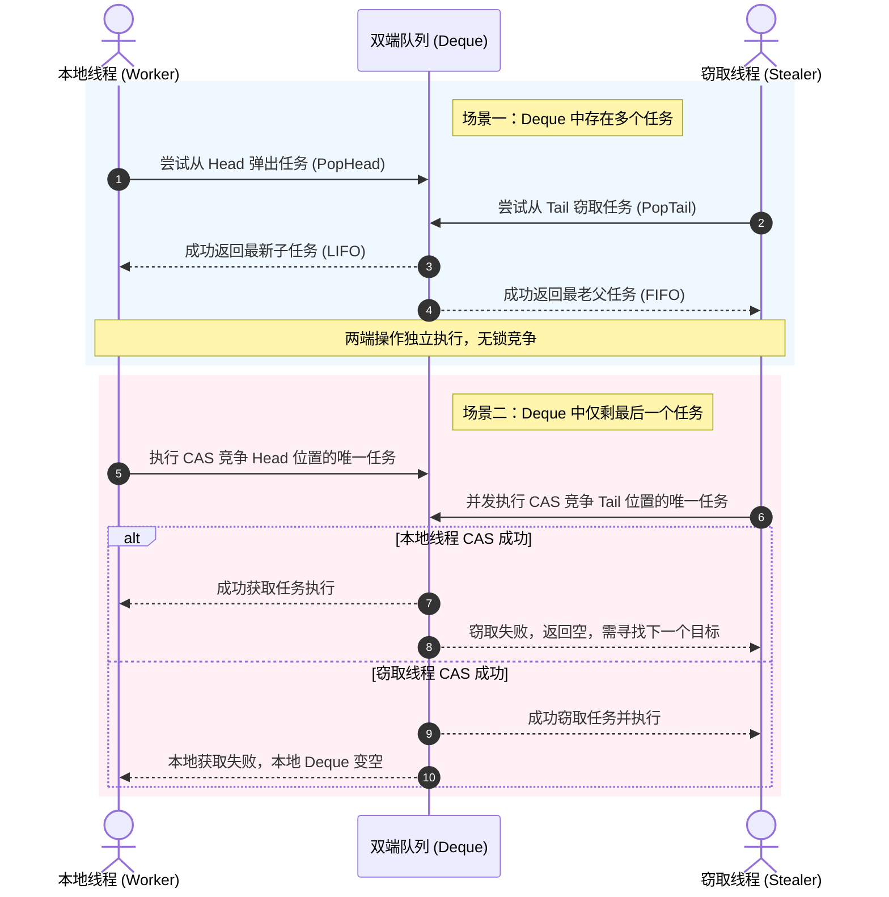

# 1.3.1.4 队列

## 1. 队列的核心定义与设计初衷

### 1.1 队列的数学模型与抽象数据类型 (ADT)

队列（Queue）是一种受限的线性表，其核心特征在于“先进先出”（First In First Out, FIFO）的存取规则。与允许在任意位置进行插入和删除操作的通用线性表（如顺序表、链表）不同，队列将数据的写操作限制在表的一端（称为队尾，Rear），而将读/删除操作限制在表的另一端（称为队头，Front）。

从抽象代数的视角出发，队列可以被形式化地定义为一个五元组 $Q = (D, S, s_0, F, P)$：
- $D$（Data Domain）：队列中允许存放的数据元素集合。
- $S$（State Space）：队列所有可能状态的集合。在任意时刻，队列的状态可以表示为一个序列 $s = \langle e_1, e_2, \dots, e_n \rangle$，其中 $e_i \in D$。
- $s_0$（Initial State）：初始空状态，即 $s_0 = \langle \rangle$。
- $F$（Transition Functions）：状态转移函数族，包含入队（Enqueue）和出队（Dequeue）映射。
- $P$（Predicates）：断言集合，如判空（IsEmpty）与判满（IsFull）。

我们可以使用代数规约（Algebraic Specification）来定义队列的基本操作及其语义约束。设 $Q$ 是所有队列状态的集合，$T$ 是数据元素的类型。队列的抽象操作集定义如下：

1. **`Init()`** $\to Q$：创建并初始化一个空队列。
2. **`Enqueue(Q, x)`** $Q \times T \to Q$：将元素 $x$ 插入队尾，返回更新后的队列。
3. **`Dequeue(Q)`** $Q \to Q \times T$：移除队头元素，返回更新后的队列与该被移除的元素。若队列为空，则抛出异常或返回特定错误状态。
4. **`Front(Q)`** $Q \to T$：获取队头元素的值，但不移除该元素。
5. **`IsEmpty(Q)`** $Q \to \text{Boolean}$：判断队列是否为空。
6. **`Size(Q)`** $Q \to \mathbb{N}$：返回队列中当前元素的个数。

在数学上，这些操作满足以下公理（其中 $q \in Q$，$x, y \in T$）：
- $\text{IsEmpty}(\text{Init}()) = \text{True}$
- $\text{IsEmpty}(\text{Enqueue}(q, x)) = \text{False}$
- $\text{Dequeue}(\text{Enqueue}(\text{Init}(), x)) = (\text{Init}(), x)$
- $\text{Dequeue}(\text{Enqueue}(\text{Enqueue}(q, x), y)) = \text{let } (q', z) = \text{Dequeue}(\text{Enqueue}(q, x)) \text{ in } (\text{Enqueue}(q', y), z)$

上述最后一项公理通过递归定义，保证了先入队的元素 $z$ 必定先被出队，确立了 FIFO 的严格数学序关系。在算法复杂度期望上，队列的物理实现应当确保 `Enqueue`、`Dequeue`、`Front` 和 `IsEmpty` 的时间复杂度均为 $O(1)$。

---

### 1.2 双端队列 (Deque) 扩展与变体

双端队列（Double-Ended Queue，简称 Deque）是队列的一种重要泛化扩展。在双端队列中，数据的插入和删除操作不再局限于固定的两端，而是允许在“左端”（Left / Front）和“右端”（Right / Rear）同时执行入队与出队操作。

```
              双端队列 (Deque) 的双向存取模型
           
            Insert Left                  Insert Right
               │                              │
               ▼                              ▼
        ┌───────────┬───────────┬───────────┬───────────┐
  Left  │  Element  │  Element  │  Element  │  Element  │ Right
        └───────────┴───────────┴───────────┴───────────┘
               │                              │
               ▼                              ▼
            Delete Left                  Delete Right
```

因为 Deque 在两端均提供了对称的存取接口，它在数学上既可以作为 FIFO 队列使用，也可以作为 LIFO 栈（Last In First Out）使用，甚至可以作为两者的复合体。

#### 1.2.1 双端队列的受限变体

在实际的算法设计与系统构建中，根据具体场景对并发冲突或输入输出流向的控制需求，常使用 Deque 的两种受限变体：

1. **输入受限双端队列（Input-Restricted Deque）**
   - **定义**：只允许在一端进行插入操作（如仅允许在右端插入），但允许在两端进行删除操作。
   - **数学性质**：若输入序列为 $\langle 1, 2, \dots, n \rangle$，通过输入受限双端队列所能得到的输出排列集合，是通用 Deque 输出排列集合的子集。它可以有效限制写入冲突，适用于单生产者、双消费者的拓扑结构。
2. **输出受限双端队列（Output-Restricted Deque）**
   - **定义**：允许在两端进行插入操作，但只允许在一端进行删除操作（如仅允许在左端删除）。
   - **数学性质**：适用于多生产者、单消费者的调度模型，可保证出队操作的绝对单线化，从而简化消费端的同步开销。

#### 1.2.2 Deque 在经典算法中的深层机理

Deque 不仅仅是一个便利的通用数据结构，它也是解决许多复杂算法问题的关键工具：

##### 1. 图的 0-1 BFS 遍历

在图论中，求解单源最短路径（SSSP）时，若所有边的权值仅为 0 或 1，传统的 Dijkstra 算法会引入优先队列，导致 $O(E \log V)$ 的时间复杂度。而使用双端队列，可以将复杂度优化至 $O(V + E)$。

**算法机理**：
当遍历节点 $u$ 的邻接边时：
- 若边权为 0，说明目标节点 $v$ 与源点的距离与当前节点 $u$ 相同，应当优先遍历。此时将 $v$ 插入到 Deque 的 **头部**（`insertFront`）。
- 若边权为 1，说明目标节点 $v$ 的距离比当前节点大 1，应当延后遍历。此时将 $v$ 插入到 Deque 的 **尾部**（`insertLast`）。

这保证了 Deque 中的节点距离值始终保持单调递增，且最大差值不超过 1（即满足 Dijkstra 算法的松弛序关系），从而避免了排序开销。

##### 2. 滑动窗口最值与单调队列优化

对于长度为 $N$ 的数组，寻找大小为 $K$ 的滑动窗口在每个位置的最大值。如果对每个窗口重新寻最值，复杂度为 $O(N \cdot K)$。引入基于 Deque 的单调队列，可将时间复杂度降至 $O(N)$。

**单调队列的设计逻辑**：
- 维护一个 Deque，其内部存储数组的索引，且对应的数组元素值从头部到尾部呈严格单调递减关系。
- 每次滑动窗口右边界移入新元素 $x$ 时：
  - 从 Deque 的 **尾部** 依次比较，若尾部索引对应的元素小于或等于 $x$，则将其从尾部弹出（因为它们永远不可能成为当前及后续窗口的最大值）。这一步确保了单调性。
  - 将当前索引插入 Deque 的 **尾部**。
- 检查 Deque **头部** 的索引。若头部索引已经超出了当前滑动窗口的左边界（即 $\text{index} < \text{current\_right} - K + 1$），则将其从头部弹出。这一步确保了时效性。
- 此时，Deque **头部** 的索引对应的元素即为当前滑动窗口的最大值。

在这个过程中，每个元素的索引最多入队一次、出队一次，因此整体时间复杂度为均摊 $O(1)$。

---

## 2. 队列的底层实现分类与系统级优化

根据内存物理存储介质的连续性，队列的底层实现主要分为基于数组的**顺序队列**和基于指针连接的**链式队列**。在工业级系统设计中，为了压榨硬件性能，需要针对这两种结构实施精细的底层优化。

### 2.1 顺序队列 (Array-based Queue)

顺序队列使用一片连续的物理内存地址空间来存储元素。其物理承载通常为静态或动态分配的一维数组。

#### 2.1.1 顺序队列的“假溢出”及其系统开销

在最直观的顺序队列设计中，我们定义一个数组 `data[capacity]`，并使用两个整型变量 `front` 与 `rear` 记录状态。初始时 `front = rear = 0`。
- **入队**：`data[rear] = value; rear++;`
- **出队**：`value = data[front]; front++;`

随着入队与出队操作的交替进行，`front` 与 `rear` 指针不断单调递增向右移动。当 `rear` 达到 `capacity` 时，即使数组的前半部分因为元素早已出队而处于闲置状态（即 `front > 0`），新元素也无法继续入队。这种物理空间尚未耗尽但因寻址受限导致无法写入的现象称为**假溢出（Pseudo-overflow）**。

为了消除假溢出，有两种直接但低效的方案：
1. **数据平移**：每次执行出队操作后，将 `data[front]` 到 `data[rear-1]` 之间的所有元素整体向左平移 `front` 个单位，然后将 `front` 归零，`rear` 相应递减。该方案使出队操作的时间复杂度退化为 $O(N)$，且在频繁读写时会引起巨大的 CPU 内存拷贝开销。
2. **延迟平移**：仅在 `rear == capacity` 且 `front > 0` 时，才触发一次整体平移。这种设计虽然均摊了部分开销，但会导致系统吞吐量出现周期性的严重抖动（Latency Spikes）。

#### 2.1.2 循环队列 (Circular Queue) 的数学与物理映射

循环队列通过将顺序数组的线性空间在逻辑上首尾相连，形成一个虚拟的环形拓扑，彻底消除了假溢出。

```
                       逻辑环形结构
                          [0]
                       /       \
                    [7]         [1]
                   /               \
                 [6]               [2]  <-- rear (指向下一个写入位置)
                   \               /
                    [5]         [3]  <-- front (指向当前队头)
                       \       /
                          [4]
```

##### 1. 取模运算的开销与二进制按位与优化

在循环队列中，索引的移动通过取模运算（Modulo Operation）实现：
$$\text{next\_index} = (\text{current\_index} + 1) \bmod \text{capacity}$$

然而，在现代 CPU 指令集架构（如 x86-64 或 ARMv8）中，除法与求余指令（如 `div` / `idiv`）的执行代价极高。一次除法运算通常需要消耗 30 到 80 个 CPU 时钟周期，而加法、减法或位运算仅需 1 个时钟周期。在每秒需要处理数百万次入队/出队的高吞吐量系统（如网卡收发包缓冲区）中，取模运算会成为明显的 CPU 瓶颈。

**二进制按位与优化**：
如果我们将队列的容量 `capacity` 限制为 2 的幂次方，即满足 $\text{capacity} = 2^k$（其中 $k \in \mathbb{N}$），那么取模运算可以等价转换为一次位运算：
$$x \bmod \text{capacity} \equiv x \text{ \& } (\text{capacity} - 1)$$

*证明*：当 $\text{capacity} = 2^k$ 时，其二进制表示为 $1$ 后面跟着 $k$ 个 $0$。而 $\text{capacity} - 1$ 的二进制表示则为 $k$ 个连续的 $1$（即掩码）。任何整数 $x$ 与该掩码进行按位与操作，实际上保留了 $x$ 的低 $k$ 位二进制值，舍弃了所有高位，这与 $x$ 除以 $2^k$ 取余数的数学结果完全一致。

由于位运算 `&` 可以在 1 个 CPU 时钟周期内完成，此项优化能使索引回绕的计算速度提升数十倍。

##### 2. 判空与判满的边界设计

在循环队列中，`front` 与 `rear` 的相对位置是循环变化的。若不进行特殊处理，当队列全空和全满时，都会满足 `front == rear`。为了在 $O(1)$ 时间内区分这两种边界状态，系统设计中通常采用以下三种方案：

| 方案 | 判空条件 | 判满条件 | 空间利用率 | 系统额外开销 | 适用场景 |
| :--- | :--- | :--- | :--- | :--- | :--- |
| **方案一：牺牲一个存储空间** | `front == rear` | `(rear + 1) % capacity == front` | $\frac{\text{capacity} - 1}{\text{capacity}}$ | 无额外控制变量，设计极其简洁 | 嵌入式开发、实时通信缓冲区 |
| **方案二：维护 `size` 计数器** | `size == 0` | `size == capacity` | $100\%$ | 每次入/出队均需更新 `size` 变量 | 单线程环境、读写非高度并发场景 |
| **方案三：引入 `tag`/`flag` 状态位** | `front == rear && tag == 0` | `front == rear && tag == 1` | $100\%$ | 每次操作更新最后一次动作状态位 | 状态机驱动系统、空间极度敏感场景 |

##### 3. 循环队列的 C++ 严谨模板类实现

以下是一个采用**方案一（牺牲一个空间）**与**二进制按位与优化**的循环队列 C++ 实现：

```cpp
#include <stdexcept>
#include <cstddef>
#include <new>

template <typename T>
class CircularQueue {
private:
    T* data;
    size_t capacity; // 必须是 2 的幂
    size_t capacity_mask; // capacity - 1
    size_t front;
    size_t rear;

    // 判断是否为 2 的幂
    bool isPowerOfTwo(size_t n) {
        return n > 0 && (n & (n - 1)) == 0;
    }

    // 向上取整到最近的 2 的幂
    size_t roundUpToPowerOfTwo(size_t n) {
        if (n == 0) return 1;
        n--;
        n |= n >> 1;
        n |= n >> 2;
        n |= n >> 4;
        n |= n >> 8;
        n |= n >> 16;
        #if defined(__LP64__) || defined(_WIN64)
        n |= n >> 32;
        #endif
        return n + 1;
    }

public:
    explicit CircularQueue(size_t init_capacity) : front(0), rear(0) {
        capacity = roundUpToPowerOfTwo(init_capacity);
        capacity_mask = capacity - 1;
        data = new T[capacity];
    }

    ~CircularQueue() {
        delete[] data;
    }

    bool isEmpty() const {
        return front == rear;
    }

    bool isFull() const {
        return ((rear + 1) & capacity_mask) == front;
    }

    size_t size() const {
        return (rear - front) & capacity_mask;
    }

    void enqueue(const T& value) {
        if (isFull()) {
            throw std::overflow_error("Queue is full");
        }
        data[rear] = value;
        rear = (rear + 1) & capacity_mask;
    }

    T dequeue() {
        if (isEmpty()) {
            throw std::underflow_error("Queue is empty");
        }
        T value = data[front];
        front = (front + 1) & capacity_mask;
        return value;
    }

    const T& peek() const {
        if (isEmpty()) {
            throw std::underflow_error("Queue is empty");
        }
        return data[front];
    }
};
```

#### 2.1.3 顺序队列扩容的数据拷贝重排逻辑

当循环队列存储空间不足需要动态扩容时，不能直接利用简单的内存拷贝（如 `memcpy` 或 `std::realloc`）将旧数组的数据原封不动地复制到新数组的前半部分。

**原因分析**：
在循环队列中，如果发生过回绕（即 `rear < front`），数据的逻辑顺序与数组的物理索引顺序是不一致的。例如，设旧容量为 4，元素入队出队后，`front = 2`，`rear = 1`。逻辑队列的真实顺序为：`data[2] -> data[3] -> data[0]`。
如果直接分配新容量 8，并执行 `memcpy(new_data, old_data, 4 * sizeof(T))`，新数组的物理分布将是 `[data[0], data[1], data[2], data[3], nullptr, ...]`。此时若沿用原来的 `front = 2` 和 `rear = 1`，由于新数组中间插入了未分配的连续空间，逻辑链条被打破，读取顺序和边界判定将完全错乱。

**系统级扩容重排策略**：
在分配更大的连续空间（设新容量为 `new_capacity`）后，必须重新排列数据，使它们在新空间中恢复逻辑上的线性连续性。常见的拷贝重排逻辑有两种：

- **策略 A（物理首地址对齐法）**：
  将旧队列中从 `front` 到数组末尾的部分（第一段）拷贝到新数组的 `0` 字节偏移处；将旧队列中从 `0` 到 `rear` 的部分（第二段，即折回来的部分）拷贝到新数组紧随其后的位置。最后重置 `front = 0`，`rear = old_size`。

```
 旧数组 (Capacity = 4):
 ┌───────────┬───────────┬───────────┬───────────┐
 │  data[0]  │  data[1]  │  data[2]  │  data[3]  │    (front = 2, rear = 1)
 └───────────┴───────────┴───────────┴───────────┘
   ▲           ▲           ▲
   │           │           └─ 逻辑第1个   
   │           └─ 逻辑第3个 (rear)
   └─ 逻辑第2个 

 新数组 (Capacity = 8, 物理首地址对齐重排):
 ┌───────────┬───────────┬───────────┬───┬───┬───┬───┬───┐
 │  data[2]  │  data[3]  │  data[0]  │   │   │   │   │   │  (front = 0, rear = 3)
 └───────────┴───────────┴───────────┴───┴───┴───┴───┴───┘
```

- **策略 B（尾部追加拉平法）**：
  保持 `front` 指向的新物理位置不变。若 `rear < front`，说明发生折回，此时仅将 `0` 到 `rear` 的这部分数据，拷贝到新数组中从 `old_capacity` 开始的空闲区域。这样旧的折回数据被“拉平”延长到了新物理空间的后半段。最后更新 `rear` 指针为 `rear + old_capacity`。

下面给出基于 **策略 A** 扩容重排的 C++ 代码实现：

```cpp
template <typename T>
void expandQueue(T*& old_data, size_t& front, size_t& rear, size_t& capacity, size_t new_capacity) {
    T* new_data = new T[new_capacity];
    size_t old_mask = capacity - 1;
    size_t size = (rear - front) & old_mask;

    if (front < rear) {
        // 数据在物理上本身就是连续的，没有发生回绕
        std::copy(old_data + front, old_data + rear, new_data);
    } else {
        // 数据发生了回绕，分两段拷贝
        size_t first_part_len = capacity - front;
        // 1. 拷贝 front 到旧数组末尾的数据到新数组开头
        std::copy(old_data + front, old_data + capacity, new_data);
        // 2. 拷贝旧数组开头到 rear 的数据紧随其后
        std::copy(old_data, old_data + rear, new_data + first_part_len);
    }

    delete[] old_data;
    old_data = new_data;
    capacity = new_capacity;
    front = 0;
    rear = size;
}
```

---

### 2.2 链式队列 (Linked-list-based Queue)

链式队列使用离散的物理存储节点，通过指针链表将元素关联起来。它在物理上不需要连续的地址空间，能有效适应动态的内存变化。

#### 2.2.1 头尾双指针设计与 $O(1)$ 操作证明

普通的单向链表若只维护头指针 `head`：
- 在头部执行出队（删除）：$O(1)$。
- 在尾部执行入队（添加）：必须从 `head` 开始遍历整个链表以寻寻找尾节点，时间复杂度退化为 $O(N)$。

为了实现高效的 $O(1)$ 存取，链式队列必须同时维护指向链表首节点的头指针 `head` 和指向链表末尾节点的尾指针 `tail`。

```
            链式队列的双指针模型
            
          ┌─────────────┐
          │  Queue Head │ ────┐
          └─────────────┘     │
                              ▼
                        ┌───────────┐      ┌───────────┐      ┌───────────┐
                        │   Node 1  │ ───> │   Node 2  │ ───> │   Node 3  │ ───> nullptr
                        └───────────┘      └───────────┘      └───────────┘
                                                                ▲
          ┌─────────────┐                                       │
          │  Queue Tail │ ──────────────────────────────────────┘
          └─────────────┘
```

**时间复杂度为 $O(1)$ 的数学证明**：
设链式队列当前状态为 $Q$，入队元素为 $x$，创建的新节点为 $N_x$。
- **入队操作（Enqueue）步骤**：
  1. $\text{tail.next} \leftarrow N_x$ (一次指针写入)
  2. $\text{tail} \leftarrow N_x$ (一次指针覆写)
  这两个步骤均只涉及固定数量的指针寻址和赋值操作。不随队列长度 $n$ 的增加而增加，因此操作步数 $C_1$ 为常数，其时间复杂度 $\lim_{n \to \infty} \frac{C_1}{n} = 0$，即 $O(1)$。
- **出队操作（Dequeue）步骤**：
  1. $T \leftarrow \text{head}$
  2. $\text{head} \leftarrow \text{head.next}$ (一次指针覆写)
  3. $\text{Free}(T)$ (一次节点内存释放)
  同理，这一系列操作只与常数项操作有关，执行步数 $C_2$ 与队列长度 $n$ 无关，因此时间复杂度为 $O(1)$。

#### 2.2.2 哨兵节点 (Dummy Node) 优化分支预测

在常规的链式队列中，当队列为空时，`head` 和 `tail` 均指向 `nullptr`。在进行入队和出队操作时，我们不得不编写大量的条件分支语句来处理边界情况。

例如，常规入队逻辑：
```cpp
void enqueue(const T& value) {
    Node* new_node = new Node(value);
    if (head == nullptr) { // 分支判断 1
        head = tail = new_node;
    } else {
        tail->next = new_node;
        tail = new_node;
    }
}
```
常规出队逻辑：
```cpp
T dequeue() {
    if (head == nullptr) { // 分支判断 2
        throw std::underflow_error("Empty");
    }
    Node* temp = head;
    T val = temp->data;
    head = head->next;
    if (head == nullptr) { // 分支判断 3
        tail = nullptr;
    }
    delete temp;
    return val;
}
```

这些分支判断在微观层面上会对 CPU 性能产生不利影响。现代 CPU 内部采用高度并行的指令流水线（Instruction Pipeline）技术。为了防止流水线因等待分支跳转结果而停顿，CPU 配备了**分支预测器（Branch Predictor）**，尝试提前猜测分支的走向并预先装载指令。

当队列空/非空状态频繁交替时，分支预测器的准确率会大幅下降。一旦预测失败，CPU 必须清空整条流水线（Pipeline Flush），重新加载正确分支的指令，造成大约 10 到 20 个时钟周期的延迟浪费。

**引入哨兵节点的优化方案**：
通过在队列初始化时，放入一个不携带任何有效数据的“哨兵节点”（Dummy Node / Sentinel），使得 `head` 和 `tail` 在任何时候都非空。

- 初始状态：`head` 和 `tail` 共同指向哨兵节点 `S`，且 `S->next = nullptr`。
- 判空条件：`head == tail`。
- 入队逻辑：
  ```cpp
  void enqueue(const T& value) {
      tail->next = new Node(value); // 永远无需判断 tail 是否为空
      tail = tail->next;
  }
  ```
- 出队逻辑：
  ```cpp
  T dequeue() {
      if (head == tail) { // 仅需一次判空
          throw std::underflow_error("Empty");
      }
      Node* first_real = head->next; // 真正的数据节点
      T val = first_real->data;
      head->next = first_real->next; // 越过该节点
      if (first_real == tail) {      // 如果出队的是最后一个节点，重置 tail
          tail = head;
      }
      delete first_real;
      return val;
  }
  ```

引入哨兵节点后，入队操作彻底消除了分支语句，出队操作的分支判定数量也显著减少，极大地提升了流水线的执行流畅度。

#### 2.2.3 系统级缺陷分析：堆分配与 Cache Locality

尽管链式队列在逻辑上具有动态伸缩、无物理上限（仅受系统内存限制）的优势，但在需要低时延、高吞吐的工业级系统底层设计中，它存在两个致命的缺陷：

##### 1. 垃圾回收/内存释放与频繁的堆分配开销

每入队一个元素，系统就需要调用 `malloc` 或 `new` 从操作系统的物理内存堆中申请一块存储空间。在多线程环境中，主流的内存分配器（如 Linux 标准的 `ptmalloc`）需要在堆的管理结构上加锁以防止并发破坏，这就导致内存申请成为一个严重的全局同步锁竞争瓶颈。出队时的 `free` 或 `delete` 亦需要将内存块回收、合并，引入高昂的算法开销。

##### 2. 严重缺乏缓存局部性（Cache Locality）

现代计算机采用多级缓存架构（L1, L2, L3 Cache）。CPU 访问各级存储的时间开销差异巨大：

```
 [CPU Core] ──(1-4 cycles)──> [L1 Cache] ──(10-12 cycles)──> [L2 Cache] ──(30-40 cycles)──> [L3 Cache] ──(200+ cycles)──> [物理主存]
```

当 CPU 访问内存中的某个地址时，硬件预取器会一次性将包含该地址的整个 **Cache Line**（通常为 64 字节）全部加载到 L1 缓存中。如果数据在物理内存上是连续存储的（如顺序队列），则对下一个元素的读取有极概率直接命中 L1 缓存。

指针队列的节点是在堆中离散分配的，物理地址极其随机。每访问一个节点，CPU 都需要根据其 `next` 指针中的地址去寻找下一块物理内存，这导致频繁发生 **Cache Miss**。CPU 绝大多数的执行时间都浪费在等待从物理内存拉取数据的总线延迟上，造成严重的流水线空转。此外，由于物理地址跨度大，还会导致快表（TLB, Translation Lookaside Buffer）高频未命中，增加了虚拟地址到物理地址转换的损耗。

##### 3. 工业级替代方案

为了克服链式队列的性能缺陷，高性能系统通常采用以下替代方案：
- **对象池（Object Pool）**：预先分配一大块连续的数组空间作为空闲节点的集合。入队时直接从池中取出一个预分配的节点（修改索引），出队时将其放回空闲节点列表。这避免了与操作系统的频繁交互，且保持了相对集中的内存物理分布。
- **块状链表（Block Linked List）**：将链表的每个节点从存储“单个元素”改为存储“一个小型的连续数组（如包含 16 或 64 个元素的块）”。这在保留了链表动态插入优势的同时，使内部数据具备了优秀的 CPU Cache Locality。

---

## 3. 系统级高并发队列机制与无锁设计

在多核 CPU、多线程并发执行的系统级应用中，队列是实现线程间数据传递、任务调度的核心通信信道。并发队列的设计质量直接决定了系统的并发吞吐上限。

### 3.1 阻塞队列 (Blocking Queue) 与同步原语

阻塞队列（Blocking Queue）是解决“生产者-消费者模式”最经典的同步通道。它的核心规则是：
- 当队列为空时，尝试读取（出队）的消费者线程将被挂起阻塞，直到有生产者向队列中写入了数据。
- 当队列已满时，尝试写入（入队）的生产者线程将被挂起阻塞，直到有消费者从队列中读取了数据并释放了空间。

#### 3.1.1 读写阻塞的实现机制

在操作系统底层，这种读写阻塞协作通常借助于**互斥锁（Mutex）**与**条件变量（Condition Variable）**两种同步原语实现。

- **互斥锁（Mutex）**：用于保护队列内部状态结构（如 front, rear 指针，数据数组等）在多线程并发读写时的完整性，防止数据发生竞态冲突（Race Condition）。
- **条件变量（Condition Variable）**：提供线程挂起与唤醒的通知机制。阻塞队列需要两个条件变量：
  - `notEmpty`（非空条件）：消费者线程在该条件上等待；当生产者写入数据后，在此条件上发送信号（Signal/Notify）唤醒消费者。
  - `notFull`（非满条件）：生产者线程在该条件上等待；当消费者取出数据后，在此条件上发送信号唤醒生产者。

#### 3.1.2 为什么必须在 `while` 循环中判断条件？

在编写条件变量的等待逻辑时，初学者常犯的一个错误是使用 `if` 分支来包裹等待语句：

```cpp
// 错误的写法
if (queue.isEmpty()) {
    notEmpty.wait(lock);
}
```

而在生产环境的工业级代码中，必须使用 `while` 循环包裹等待语句：

```cpp
// 正确的写法
while (queue.isEmpty()) {
    notEmpty.wait(lock);
}
```

必须使用 `while` 循环的原因在于以下两点：

##### 1. 虚假唤醒（Spurious Wakeup）
在底层操作系统（如基于 POSIX 线程标准的 Linux 系统）中，即使没有任何生产者线程显式调用条件变量的唤醒方法（如 `pthread_cond_signal`），正在条件变量上阻塞等待的线程也有可能被系统内核自动唤醒。这通常是由底层硬件中断处理、信号发送（Signal Delivery）或者内核调度机制的副作用引起的。
若使用 `if`，被虚假唤醒的消费者线程将越过判断直接执行出队操作，此时队列实际上仍为空，这会导致程序发生未定义的行为（如空指针异常、内存越界）。

##### 2. 消费者之间的竞态条件（Race Condition）
假设队列中当前为空，有两个消费者线程 $C_1$ 和 $C_2$ 均在 `notEmpty` 条件变量上等待。
- 此时，一个生产者线程 $P$ 写入了一个元素，并调用 `notEmpty.signal()`。
- 操作系统内核接收到信号后，唤醒了正在等待的 $C_1$.
- 在 $C_1$ 成功重新获取互斥锁并开始处理之前，第三个刚运行到此的消费者线程 $C_3$ 抢先获取了互斥锁，并在队列中将这唯一的元素取走，然后释放了锁。
- 此时被唤醒的 $C_1$ 终于获取到了互斥锁，重新进入临界区。如果 $C_1$ 使用的是 `if` 判断，它会想当然地认为既然自己被唤醒了，队列里就必定有数据，从而执行读取，导致程序崩溃。而如果使用 `while` 循环，$C_1$ 会再次检查 `queue.isEmpty()`，发现队列重新变空，从而再次安全地挂起自己。

#### 3.1.3 工业级阻塞队列的 C++ 实现

以下是基于 C++11 标准库 `std::mutex` 和 `std::condition_variable` 实现的线程安全并发阻塞队列：

```cpp
#include <mutex>
#include <condition_variable>
#include <vector>
#include <stdexcept>

template <typename T>
class BlockingQueue {
private:
    std::vector<T> buffer;
    size_t capacity;
    size_t front;
    size_t rear;
    size_t count;

    mutable std::mutex mtx;                 // 保护临界区的互斥锁
    std::condition_variable notEmpty;      // 队列非空条件变量
    std::condition_variable notFull;       // 队列非满条件变量

public:
    explicit BlockingQueue(size_t max_size) 
        : buffer(max_size), capacity(max_size), front(0), rear(0), count(0) {}

    void put(const T& item) {
        std::unique_lock<std::mutex> lock(mtx);
        
        // 当队列满时，阻塞生产者线程，必须使用 while 循环防范虚假唤醒
        while (count == capacity) {
            notFull.wait(lock);
        }

        buffer[rear] = item;
        rear = (rear + 1) % capacity;
        count++;

        // 写入数据后，唤醒可能正在等待的消费者线程
        notEmpty.notify_one();
    }

    T take() {
        std::unique_lock<std::mutex> lock(mtx);

        // 当队列空时，阻塞消费者线程，必须使用 while 循环防范虚假唤醒
        while (count == 0) {
            notEmpty.wait(lock);
        }

        T item = buffer[front];
        front = (front + 1) % capacity;
        count--;

        // 取出数据后，唤醒可能正在等待的生产者线程
        notFull.notify_one();
        return item;
    }

    size_t size() const {
        std::lock_guard<std::mutex> lock(mtx);
        return count;
    }
};
```

---

### 3.2 任务调度中的双端队列与工作窃取算法

在现代多核 CPU 的高并发任务调度器（如线程池调度器、高性能协程运行时）中，全局任务队列由于锁竞争激烈，往往成为限制多核扩展性的瓶颈。工作窃取算法（Work-Stealing Algorithm）结合双端队列（Deque），完美地解决了这一核心痛点。

#### 3.2.1 工作窃取调度器的核心设计原则

在工作窃取架构中，调度器不再采用单一的全局集中式任务队列，而是为每一个工作线程（Worker Thread）配置一个独立的、私有的双端队列（Deque）。

```
 工作线程 1 (Worker 1)                         工作线程 2 (Worker 2)
  ┌─────────────┐                               ┌─────────────┐
  │   执行任务   │                               │   执行任务   │
  └──────┬──────┘                               └──────┬──────┘
         │                                             │
      (从头部) LIFO                                  (从头部) LIFO
         ▼                                             ▼
 ┌──────────────┐                              ┌──────────────┐
 │ Deque Head   │                              │ Deque Head   │
 ├──────────────┤                              ├──────────────┤
 │  Local Task  │                              │              │
 ├──────────────┤                              ├──────────────┤
 │  Local Task  │                              │              │
 ├──────────────┤                              ├──────────────┤
 │ Deque Tail   │                              │ Deque Tail   │
 └──────────────┘                              └──────────────┘
         ▲                                             ▲
         │                                             │
         └─────────────────── (从尾部) FIFO ────────────┘
                            [窃取线程 (Stealer)]
```

其运作机制遵循以下规则：

1. **本地任务生成**：当工作线程 $W_i$ 正在执行任务，并分解产生了子任务（如分治递归）时，它会将这些新生成的子任务放入自己私有 Deque 的 **头部（Head）**。
2. **本地任务提取**：工作线程 $W_i$ 在处理完当前任务后，会优先从自己 Deque 的 **头部（Head）** 提取下一个任务执行。这种本地操作通常采用后进先出（LIFO）的模式。
   - *设计优势*：后进先出的本地任务提取模式具有极佳的 **CPU 缓存局部性**。新产生的子任务对应的数据很可能还在 CPU 的一级或二级缓存中，立即执行它能避免昂贵的主存寻址损耗。
3. **工作窃取**：当工作线程 $W_j$ 自己的 Deque 已经没有任务（变为空闲）时，为了不浪费多核 CPU 的算力，它会转为“窃取者”角色。它会随机选择另一个繁忙的工作线程 $W_i$，并从 $W_i$ 的 Deque **尾部（Tail）** 强行“窃取”一个任务来执行。窃取操作采用先进先出（FIFO）的模式。
   - *设计优势*：
     - **锁分离与竞争避让**：本地线程操作 Deque 的头部，窃取线程操作尾部。在绝大多数情况下，它们访问的是队列的不同两端。这种天然的物理空间分离，使得两端操作可以并行进行，极大地消除了锁冲突。
     - **大任务优先**：Deque 尾部的任务通常是较早时间生成的、粒度较粗（可能含有大量子分治工作）的父任务。窃取一个粗粒度任务，意味着窃取者可以在后续本地生成许多子任务，从而减少了再次去其他线程窃取的频率。

#### 3.2.2 任务窃取的并发协作时序

下面是工作窃取过程中，本地线程与窃取线程并发竞争同一个队列的 Mermaid 流程时序图。在 Deque 元素大于 1 时，两者几乎互不干扰；只有在 Deque 仅剩 1 个任务时，才会发生激烈的并发竞争，需要通过无锁 CAS（Compare-And-Swap）或轻量级自旋锁进行原子仲裁。



这种通过双端队列将竞争热点一分为二的设计，是现代超高性能并行计算框架（如分治线程池调度引擎、协程分发器）能够实现接近线性多核加速比的底层基石。

---

### 3.3 高性能环形缓冲区 (Ring Buffer) 与无锁并发队列

在高频交易、内核网络协议栈、系统底层高容量日志收集器等对于延迟（Latency）有着极致追求（要求控制在几百纳秒甚至几十纳秒内）的场景下，任何传统的基于互斥锁的阻塞队列设计都是不可接受的。

**锁的致命缺陷**：
当线程由于竞争互斥锁失败时，操作系统内核会将该线程的状态从“运行态”（Running）切换为“挂起等待态”（Blocked），将其从 CPU 调度队列中剥离，并在后续锁释放时通过内核调度器将其重新唤醒。这一过程伴随着进程/线程上下文切换（Context Switch），需要保存和恢复处理器的寄存器状态、刷新地址空间映射（页表 cache），其开销通常为数百纳秒到数微秒级别，并会引入无法预测的延迟抖动（Jitter）。

无锁（Lock-Free）队列，特别是基于物理数组的**环形缓冲区（Ring Buffer）**，利用 CPU 底层的硬件特性实现高吞吐、超低时延的无锁通信。

#### 3.3.1 单生产者单消费者 (SPSC) 无锁设计与内存屏障

在单生产者单消费者（Single Producer Single Consumer, SPSC）的限定场景下，我们甚至不需要复杂的 CAS 操作，就能实现完全无锁的并行读写。

##### 1. SPSC 无锁队列的核心指针逻辑
- 仅维护两个原子整型变量：写指针 `write_index` 与读指针 `read_index`。
- `write_index` 仅由生产者线程单向递增写入。
- `read_index` 仅由消费者线程单向递增写入。
- 在逻辑上，生产者只需读取 `read_index` 的拷贝来计算剩余空间，决定是否可写；消费者只需读取 `write_index` 的拷贝来计算当前可读元素数量。

##### 2. 内存模型（Memory Model）与指令重排

在多核 CPU 架构下，为了优化指令吞吐，编译器和 CPU 核心都会执行**指令重排（Instruction Reordering）**。即在不改变单线程执行结果语义的前提下，调整内存读写指令的实际执行顺序。

例如，在生产者代码中：
```cpp
buffer[write_index] = item;      // 写入数据 (A)
write_index.store(next_write);  // 更新写指针 (B)
```
如果 CPU 将指令 (B) 重排到指令 (A) 之前执行，那么当消费者线程观察到 `write_index` 被更新后，立刻去读取 `buffer`，此时真实的数据其实还没有从 CPU 的 Store Buffer 刷入共享内存，消费者将会读到垃圾数据。

为了防止这种灾难性的后果，无锁设计必须使用**内存屏障（Memory Barrier / Memory Fence）**或显式指定原子操作的**内存顺序（Memory Order）**：

- **发布语义（Release Semantics）**：在生产者更新 `write_index` 时，使用 `std::memory_order_release`。这保证了在当前写指针更新之前，所有之前的内存写入操作（包括向 `buffer` 中写入数据元素）都已经提交并对其他核心可见。
- **获取语义（Acquire Semantics）**：在消费者读取 `write_index` 时，使用 `std::memory_order_acquire`。这保证了在读取到最新的写指针之后，后续的所有内存读取操作（包括从 `buffer` 中读取数据元素）都必须在此之后执行，绝不能被重排到读取指针之前。

##### 3. SPSC 无锁队列代码实现

```cpp
#include <atomic>
#include <cstddef>
#include <vector>
#include <stdexcept>

template <typename T>
class SpscRingBuffer {
private:
    std::vector<T> buffer;
    size_t capacity;
    size_t capacity_mask;
    
    // 采用原子变量保证线程间的可见性与时序性
    std::atomic<size_t> write_index;
    std::atomic<size_t> read_index;

public:
    explicit SpscRingBuffer(size_t size) 
        : capacity(size), write_index(0), read_index(0) {
        // 强制要求容量为 2 的幂
        if (size == 0 || (size & (size - 1)) != 0) {
            throw std::invalid_argument("Capacity must be a power of 2");
        }
        capacity_mask = capacity - 1;
        buffer.resize(capacity);
    }

    bool enqueue(const T& item) {
        const size_t current_write = write_index.load(std::memory_order_relaxed);
        // 使用 acquire 确保读取到消费者最新的 read_index
        const size_t current_read = read_index.load(std::memory_order_acquire);

        // 如果队列已满
        if ((current_write - current_read) >= capacity) {
            return false;
        }

        buffer[current_write & capacity_mask] = item;
        // 使用 release 确保数据先写入，然后更新 write_index并发布给消费者
        write_index.store(current_write + 1, std::memory_order_release);
        return true;
    }

    bool dequeue(T& item) {
        const size_t current_read = read_index.load(std::memory_order_relaxed);
        // 使用 acquire 确保读取到生产者最新的 write_index
        const size_t current_write = write_index.load(std::memory_order_acquire);

        // 如果队列为空
        if (current_read == current_write) {
            return false;
        }

        item = buffer[current_read & capacity_mask];
        // 使用 release 确保数据读取完成后，再更新 read_index 并发布给生产者
        read_index.store(current_read + 1, std::memory_order_release);
        return true;
    }
};
```

#### 3.3.2 CPU 缓存一致性风暴与伪共享 (False Sharing) 优化

当我们将上述 SPSC 队列投入高负载测试时，会发现虽然无锁，但其多核整体吞吐率依然无法达到物理极限，且 CPU 总线流量异常高昂。这背后的物理硬件根源是 **伪共享（False Sharing）**。

##### 1. 伪共享的硬件机制与 MESI 协议

现代多核处理器中，每个 CPU 核心都有独立的 L1/L2 缓存。这些缓存与主内存之间通过 **缓存一致性协议（如 MESI 协议）** 保持数据同步。MESI 协议规定缓存行（Cache Line，通常是 64 字节）具有四种状态：
- **M（Modified）**：该缓存行被修改，且与主存不一致，仅存在于当前 CPU 核心的缓存中。
- **E（Exclusive）**：该缓存行独占，且与主存一致，仅存在于当前 CPU 核心的缓存中。
- **S（Shared）**：该缓存行在多个 CPU 核心中都存在副本，且与主存一致。
- **I（Invalid）**：该缓存行失效，不能使用。

在上述 `SpscRingBuffer` 中， `write_index` 和 `read_index` 两个变量在内存中是连续分配的。它们的大小各占 8 字节（64位系统），极易被装载进同一个 64 字节的 Cache Line 中。

当生产者核心 $C_P$ 写入更新 `write_index` 时，它会向总线发送失效信号，将所有其他核心中包含该 `write_index` 的 Cache Line 状态强行标记为 **I（Invalid）**。
此时，消费者核心 $C_C$ 即使仅仅想要读取 `read_index`（其值根本没有改变），但由于 `read_index` 所在的整个 Cache Line 已经被核心 $C_P$ 的写入动作强行作废，$C_C$ 必须挂起当前流水线，重新通过系统总线向主存或 $C_P$ 的缓存请求最新的数据行。

这种由于不同核心频繁修改**处于同一 Cache Line 上的不同不相关变量**，导致缓存行在多核之间不断来回传递、失效、重读的现象，称为 **伪共享（False Sharing）**。它会产生可怕的“缓存一致性风暴”，拖垮 CPU 的总线带宽。

##### 2. 伪共享的系统级优化：字节填充（Padding）与物理对齐

消除伪共享的唯一方法，是破坏这组并发变量在物理内存上的紧邻分布，确保它们被强行划分在不同的 Cache Line 中。

- **C++11 之前的传统方法**：
  在变量之间插入无意义的占位符（Padding），使得两个指标之间的物理地址间距大于或等于 64 字节：
  ```cpp
  std::atomic<size_t> write_index;
  char padding[56]; // 填充 56 字节，凑齐一个 Cache Line 的大小
  std::atomic<size_t> read_index;
  ```
- **C++11 现代标准对齐方法**：
  使用 `alignas` 关键字显式声明变量的物理对齐边界为 64 字节（现代 x86 CPU 标准的缓存行大小）：
  ```cpp
  alignas(64) std::atomic<size_t> write_index;
  alignas(64) std::atomic<size_t> read_index;
  ```

使用 `alignas(64)` 对齐后，内存分配器在为对象分配空间时，会强制使这两个原子变量的起始地址均为 64 的整数倍。这从物理结构上确保了 `write_index` 和 `read_index` 永远不可能共存于同一个 Cache Line 内，从而彻底斩断了多核缓存间的伪共享干扰，使队列的并发吞吐能力实现成倍提升。

#### 3.3.3 MPMC 无锁队列与 CAS 机制的 ABA 痛点

当系统的通信拓扑从“单生产者单消费者（SPSC）”升级为“多生产者多消费者（MPMC, Multi-Producer Multi-Consumer）”时，仅靠两个读写指针的原子增减和内存屏障将无法保障数据的绝对正确性。

因为在 MPMC 中，可能有多个生产者同时尝试向 `write_index` 指向的同一个物理插槽写入数据，也会有多个消费者同时尝试提取同一个元素。这必须引入 **CAS（Compare-And-Swap）** 循环来自旋更新指针。

##### 1. CAS 无锁自旋逻辑
```cpp
// 多生产者并发入队时申请写空间的 CAS 逻辑
size_t current_write;
size_t next_write;
do {
    current_write = write_index.load(std::memory_order_relaxed);
    if ((current_write - read_index.load(std::memory_order_acquire)) >= capacity) {
        return false; // 队满
    }
    next_write = current_write + 1;
} while (!write_index.compare_exchange_weak(current_write, next_write, 
                                            std::memory_order_release, 
                                            std::memory_order_relaxed));
// 只有成功执行 CAS 的线程，才获得了在 current_write 索引处写入数据的独占所有权。
```

##### 2. ABA 问题解析与底层防范机制

在 MPMC 无锁队列的设计中（特别是基于链表的无锁并发队列，如著名的 Michael & Scott 无锁队列），CAS 面临一个经典的逻辑漏洞——**ABA 问题**。

- **ABA 场景演进**：
  1. 消费者线程 $T_1$ 准备将一个节点出队，它读取了当前队头 `head` 指针，其指向内存地址为 `A`。同时读取了下一个节点 `head->next` 指向地址 `B`。
  2. 此时，操作系统剥夺了 $T_1$ 的 CPU 执行权，挂起该线程。
  3. 另一个线程 $T_2$ 运行，成功执行了出队操作，将节点 `A` 移除并释放。随后它又执行了某些操作，重新申请了内存，由于内存分配器地址复用的机制，新节点恰好拿到了刚才释放的地址 `A`。然后 $T_2$ 将新的 `A` 入队。
  4. 随后另一个线程 $T_3$ 又将一些新节点挂在 `A` 后面，使得 `head->next` 指向了全新的地址 `C`（而非先前的 `B`）。
  5. 此时 $T_1$ 被内核唤醒恢复执行。它执行 CAS 操作：`compare_and_swap(&head, A, B)`。它发现 `head` 指针的值依然是 `A`，于是 CAS 成功，将 `head` 更新为了 `B`。
  6. **灾难发生**：而实际上，中间节点 `B` 早就已经被释放或挪作他用，现在的物理逻辑结构早已经不是 $T_1$ 挂起时的状态。$T_1$ 的错误替换导致整个链式队列陷入了内存越界访问或野指针崩溃。

- **系统级防范方案**：
  - **带版本号的标签指针（Tagged Pointer / Stamped Pointer）**：
    在 64 位寻址系统下，虚拟地址空间实际上只使用了其中的 48 位（即高 16 位通常全为 0 或 1）。我们可以利用这高 16 位存储一个版本序列号（Epoch / Stamp）。每次对指针进行操作时，版本号自增 1。在执行 CAS 时，不仅比较指针地址，还必须同时比较版本号（通过双字 CAS，如 x86-64 的 `cmpxchg16b` 指令）。即使地址重新变回 `A`，但由于版本号已经改变，CAS 依然会宣告失败，从而彻底避免了 ABA 问题。
  - **风险指针（Hazard Pointer）**：
    当消费者线程想要读取某个节点时，它会将该节点的地址登记到全局的“风险指针列表”中，宣称自己正在引用此内存。其他线程在试图释放任何节点时，必须先比对该节点地址是否被列在任何存活线程的风险指针列表中。如果是，则暂时不能释放，而是将其放入一个延迟回收列表中。只有当消费线程处理完毕、注销了风险指针后，节点内存才能被真正安全地释放。
  - **基于世代的内存回收机制（Epoch-based Reclamation, EBR）**：
    将系统时间划分为不同的“世代（Epoch）”。线程只在当前活跃的世代中注册。被移除的节点根据移除时的世代存入对应的垃圾库，只有当所有活跃的线程都已经步入更新的世代时，旧世代中收集的节点内存才被集中释放。这是一种高效的、针对无锁数据结构的非阻塞内存管理（Memory Management）技术。

通过对循环队列的二进制位运算优化、链式队列的分支预测与缓存局部性改造，再到阻塞队列的多核竞争退避、环形缓冲区的无锁内存屏障与伪共享规避，队列这一经典的数据结构在系统级工程实践中被推向了性能的极致。
