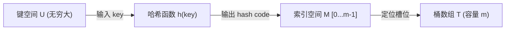
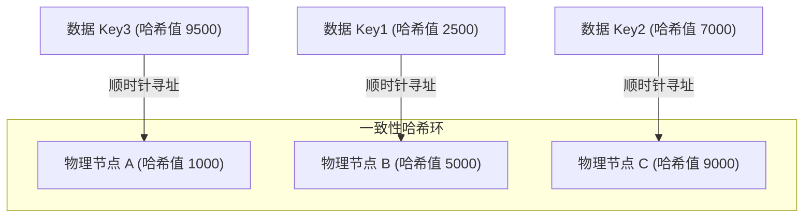

# 1.3.1.5 哈希表

哈希表（Hash Table，又称散列表）是计算机科学中最具革命性的数据结构之一。它在底层的数组随机访问特性之上，通过数学映射构建了一套接近 $O(1)$ 平均时间复杂度的任意键值对存取机制。本篇专著级文章将从物理寻址本质、哈希函数的数学设计、冲突解决策略的深度剖析、动态扩容与负载因子的数理平衡，以及在现代高级系统中的变种应用等多个维度，对哈希表进行全面且底层的深度解构。

---

## 1. 哈希表的核心定义与设计初衷

### 1.1 从直接寻址到空间折叠
在探索哈希表之前，我们必须首先理解计算机物理内存的本质——直接寻址表（Direct-address Table）。
在现代计算机体系结构中，内存可以被看作一个巨大的连续字节数组。CPU 通过地址总线发送物理或虚拟内存地址，片选信号选中对应的内存颗粒，并在恒定的时间周期内完成指定数据的读取或写入。这种基于物理偏移量的随机访问特性，使得数组在已知下标的情况下，访问的时间复杂度为绝对的 $O(1)$。

直接寻址表正是这一特性的直接应用。假设我们需要存储一组元素，每个元素都关联着一个来自较小键集 $U = \{0, 1, \dots, N-1\}$ 的非负整数键（Key）。我们只需申请一个大小为 $N$ 的数组 $T$（槽数组 / Bucket Array），将键为 $k$ 的元素存放在 $T[k]$ 的位置。此时，插入、查找、删除操作均只需要一步数组索引定位，性能无懈可击。

然而，直接寻址表在实际工程应用中面临着难以调和的两个致命缺陷：
1. **键空间爆炸（Key Space Explosion）**：如果键的取值范围 $U$ 非常庞大，例如 64 位整型（最大值约 $1.84 \times 10^{19}$）或者任意长度的字符串（如用户名、URL 等），我们根本不可能分配一个如此庞大的物理数组。即便可用物理内存允许，而我们实际存储的元素数量 $K$ 却远远小于 $U$（即 $|K| \ll |U|$），这会导致极大的空间浪费。例如，为了存储 10,000 个用户的资料，却要分配一个支持百亿级键空间的数组，内存利用率趋近于零。
2. **非数值型键（Non-numeric Keys）**：当键的类型是字符串、多维向量或复杂的自定义结构体时，它无法直接作为物理内存的整型下标使用。

为了在 $|K| \ll |U|$ 的现实背景下，依然保留 $O(1)$ 的数组随机访问优势，哈希表应运而生。它引入了“哈希函数”（Hash Function）$h$，将巨大的、甚至是非数值型的关键字空间 $U$，映射到一个相对较小的紧凑整数槽位空间 $M = \{0, 1, \dots, m-1\}$：

$$h: U \to \{0, 1, \dots, m-1\} \quad (\text{其中 } m \ll |U|)$$

通过这种映射，原本存储在 $T[k]$ 的元素，现在被存储在 $T[h(k)]$ 中。这相当于将庞大的键空间“折叠”到了一个有限的桶数组中，用极小的空间开销换取了几乎恒定的存取性能。



### 1.2 鸽巢原理与冲突的必然性
由于哈希函数将一个极大的集合 $U$ 映射到了一个极小的集合 $M$，根据数学中的**鸽巢原理（Pigeonhole Principle，或称抽屉原理）**：若有 $n$ 个鸽子飞进 $m$ 个鸽笼，且 $n > m$，则至少有一个鸽笼里含有两只或两只以上的鸽子。

在哈希表中，因为 $|U| > m$，必然存在两个不同的键 $k_1, k_2 \in U$ 且 $k_1 \ne k_2$，使得：

$$h(k_1) = h(k_2)$$

这种不同的输入产生相同输出的现象，被称为**哈希冲突（Hash Collision）**。只要哈希表的键空间大于其物理桶容量，冲突就是无法规避的数学事实。因此，一个完备的哈希表系统，必须由两个核心部分组成：
* 一套能够将数据尽可能打散、计算高效的**哈希函数**。
* 一套在发生冲突时，能够妥善安置冲突数据并保证检索正确性的**冲突解决策略**。

---

## 2. 哈希函数 (Hash Function) 的数学设计

哈希函数的好坏直接决定了哈希表空间利用率的高低和时间性能的优劣。如果哈希函数设计不当，导致大量不同的键被映射到相同的槽位，哈希表就会迅速退化为链表或连续探测区间，使原本 $O(1)$ 的时间复杂度向 $O(n)$ 倾斜。

### 2.1 优秀哈希函数的金标准
设计一个工业级的哈希函数，通常需要遵循以下三个黄金准则：
1. **计算简单且高效**：哈希函数的计算处于每次存取操作的最前端。它必须能够被快速计算出来，最好能直接映射为计算机底层的位运算和加减乘法，避免使用高昂的浮点运算或复杂的循环。
2. **散列均匀分布（Uniform Distribution）**：对于任意给定的键集，哈希函数计算出的哈希值应当以相同的概率均匀分布在 $\{0, 1, \dots, m-1\}$ 范围内。在理论研究中，这被称为**简单均匀散列假设（Simple Uniform Hashing Assumption, SUHA）**。
3. **雪崩效应（Avalanche Effect）**：键的微小变化（例如二进制表示中仅改变了一个比特位），应当引起其哈希值发生剧烈、随机、不可预测的变化。这可以防止相似的输入数据在哈希表中扎堆聚集。

### 2.2 经典哈希构造方法与数理分析

#### 2.2.1 除留余数法 (Division Method)
除留余数法是哈希表中最直观、最常用的构造方法。其基本公式为：

$$h(k) = k \bmod m$$

其中，$k$ 为关键字的整数值，$m$ 为哈希表的桶容量。

##### 模数 $m$ 的选择深度剖析
在除留余数法中，$m$ 的取值对哈希的散列效果起着决定性作用。如果我们简单地将 $m$ 设为某些特定类型的值，会带来严重的冲突隐患：
* **如果 $m$ 为 $2^p$（2 的幂次方）**：在二进制下，进行 $k \bmod 2^p$ 运算相当于直接截取了整型 $k$ 的最低 $p$ 个比特位，而将高位的所有比特信息完全抛弃。如果输入的关键字在低 $p$ 位具有某种规律（例如所有键都是偶数，或者代表某种具有固定低位偏移量的指针地址），哈希碰撞将会呈指数级上升。
* **如果 $m$ 为 $10^p$（10 的幂次方）**：同理，这相当于只取决于 $k$ 在十进制下的最后 $p$ 位数字，完全忽略了高位数字的特征。

##### 为什么必须选择素数（质数）？
为了最大程度地利用关键字的所有位信息，并消除关键字本身的周期性规律对哈希分布的影响，我们通常选择一个**不接近 2 的幂的素数（Prime Number）**作为哈希表的容量 $m$。我们通过数论来证明这一结论：

假设关键字在实际应用中具有某种周期规律（例如由数组步长或循环产生），呈现为等差数列：

$$k, \ k + d, \ k + 2d, \ k + 3d, \ \dots, \ k + i \cdot d$$

当我们将这些键通过除留余数法映射到大小为 $m$ 的哈希表时，其对应的映射槽位序列为：

$$s_i = (k + i \cdot d) \bmod m$$

我们需要计算这个序列在模 $m$ 空间内能够覆盖多少个不同的槽位。根据同余理论，序列 $(i \cdot d) \bmod m$ 在 $i$ 循环增加时，能产生的不重复的余数个数（即哈希表槽位数）为：

$$N_{\text{unique}} = \frac{m}{\gcd(d, m)}$$

其中 $\gcd(d, m)$ 表示步长 $d$ 与表长 $m$ 的最大公约数。
* **如果 $m$ 是一个合数**：它必定拥有多个非平凡因子。一旦我们输入的关键字步长 $d$ 恰好与 $m$ 有公共因子（即 $\gcd(d, m) = g > 1$），那么 $N_{\text{unique}} = m / g < m$。这意味着，大量的关键字只会落入哈希表中一部分特定槽位上，而其他槽位永远无法被该等差序列访问到。
  
  例如，设表长 $m = 12$（合数，因子有 2, 3, 4, 6），数据步长 $d = 4$（例如存储 32 位浮点数或特定步长的数据结构）。它们的公约数 $\gcd(4, 12) = 4$。此时，能够映射到的不同槽位个数为 $12 / 4 = 3$ 个。无论我们插入多少个数据，它们都只会被挤在 $\{0, 4, 8\}$（假设 $k=0$）这 3 个槽位里，而其余 9 个槽位全部闲置。冲突率高至 $100\%$，有效空间利用率仅为 $25\%$。
* **如果 $m$ 是一个素数**：因为素数只有 1 和它本身两个正因子，所以只要数据的周期步长 $d$ 不是 $m$ 的倍数，就有 $\gcd(d, m) = 1$。此时：

$$N_{\text{unique}} = \frac{m}{1} = m$$

这意味着，关键字能够完美、均匀地映射到哈希表的所有 $m$ 个槽位上。素数的引入，从数学原理上强行打断了输入数据可能存在的任何非 $m$ 倍数的周期性重叠，从而实现了最均匀的散列。

#### 2.2.2 乘法哈希法 (Multiplication Method)
乘法哈希法由著名计算机科学家唐纳德·克努特（Donald Knuth）推广。其工作原理不依赖于数论中的模数选择，而是分为两步：
1. 用关键字 $k$ 乘以一个常数 $A$（其中 $0 < A < 1$），并提取乘积的小数部分。
2. 用这个小数乘以哈希表容量 $m$，然后向下取整，得到最终的映射索引。

其数学公式为：

$$h(k) = \lfloor m \cdot (k \cdot A \bmod 1) \rfloor$$

其中 $k \cdot A \bmod 1 = k \cdot A - \lfloor k \cdot A \rfloor$，即 $k \cdot A$ 的小数部分。

##### 黄金分割数的奥秘
乘法哈希法的优势在于，它对哈希表容量 $m$ 的选择不敏感。我们完全可以选择 $m = 2^p$ 这一便于计算机存取的值。
克努特指出，常数 $A$ 的选择会影响散列的均匀性。他推荐使用**黄金分割比**相关的常数：

$$A \approx \frac{\sqrt{5} - 1}{2} \approx 0.6180339887$$

这个常数能够将连续的关键字非常均匀地散布到整个哈希表中。

##### 计算机底层的高效移位实现
在底层的汇编语言或硬件电路中，浮点数运算和向下取整的代价是相当高昂的。乘法哈希最精妙的地方在于，可以通过无符号整数乘法和位移操作，在单指令周期内完成全部计算。

设计算机字长为 $w$ 位（例如 32 位或 64 位），且关键字 $k$ 可以存放在一个字中。我们将 $m$ 选择为 $2^p$。
我们首先将实数常数 $A$ 放大 $2^w$ 倍，并取整为一个 $w$ 位的无符号整数 $s$：

$$s = \lfloor A \cdot 2^w \rfloor$$

在 32 位系统（$w=32$）中，若采用黄金分割数，则 $s = \lfloor 0.6180339887 \times 2^{32} \rfloor = 2654435769$。

当我们计算 $k$ 的哈希值时，在 CPU 中执行无符号整数乘法 $k \cdot s$。由于这是两个 $w$ 位整数的乘法，其结果是一个 $2w$ 位的整数：

$$k \cdot s = r_1 \cdot 2^w + r_0$$

在这个乘积中，高位字 $r_1$ 实际上对应了 $k \cdot A$ 的整数部分，而低位字 $r_0$ 则对应了 $k \cdot A$ 的小数部分。
因为我们需要将结果映射到容量为 $2^p$ 的表中，也就是需要提取小数部分的最高 $p$ 位。在二进制下，这刚好等于无符号低位字 $r_0$ 的最高 $p$ 个比特。
因此，我们只需将整个乘积 $k \cdot s$ 的低位字 $r_0$ 向右逻辑右移 $w - p$ 位即可。

```java
// 乘法哈希法的 32 位高效 Java 底层示例
public int multiplicationHash(int key, int p) {
    long s = 2654435769L; // 黄金分割数放大 2^32 倍
    long product = (key & 0xFFFFFFFFL) * s;
    long r0 = product & 0xFFFFFFFFL; // 获取低 32 位
    return (int) (r0 >>> (32 - p));   // 右移提取高 p 位
}
```

由于位移和按位与操作在 CPU 内只需要一个时钟周期，这使得乘法哈希非常适合用在吞吐量要求极高的系统底层。

#### 2.2.3 平方取中法 (Mid-square Method)
平方取中法分为两步：
1. 首先计算关键字的平方值 $k^2$。
2. 提取 $k^2$ 的中间若干位作为哈希地址。

其数学原理在于：一个数平方后，其乘积的中间几位通常受到原关键字中几乎所有比特位的影响。因此，即使原关键字中只有某一位发生变化，其平方值的中间位也会发生显著且不可预测的剧变。这种方法对具有高度局部相似性的键集具有非常好的散列效果。

#### 2.2.4 字符串哈希与经典乘数 31 
在实际编程中，我们处理的数据有很大一部分是字符串。要将字符串映射为哈希码（Hash Code），最常用的方法是**多项式累加法**。
例如，对于一个字符串 $s = c_0 c_1 \dots c_{n-1}$，我们计算其哈希值：

$$h(s) = \sum_{i=0}^{n-1} c_i \cdot P^{n-1-i} = c_0 \cdot P^{n-1} + c_1 \cdot P^{n-2} + \dots + c_{n-1}$$

这里，$P$ 是一个乘数因子。在许多标准库（如 Java JDK）中，对于字符串哈希的计算，乘数 $P$ 被硬性选择为 **31**。

为什么选择 31？
1. **奇素数属性**：31 是一个素数，并且是一个奇数。使用奇素数作为乘数，可以避免因乘法溢出而丢失最低位的信息。如果使用偶数（例如 2 的幂），乘法运算在计算机底层会转化为左移操作，当发生溢出时，高位会被直接丢弃，导致哈希值的低位全为 0，哈希信息大量丢失。
2. **底层指令优化**：31 具有非常特殊的二进制结构：$31 = 2^5 - 1$。这使得乘法运算 $31 \cdot i$ 在现代 CPU 编译优化中，不需要调用真正的乘法器指令，而是被等价地替换为位移和减法：

$$31 \cdot i == (i \ll 5) - i$$

这在早期 CPU 乘法指令周期较长的时代，极大地提升了字符串哈希的生成效率。
3. **经验散列平衡**：根据经典的研究实验，使用 31 作为乘数对数万个英文单词进行散列测试，其碰撞率和分布均匀性均表现得非常优异，恰好处于效率和均匀度折中的黄金甜点区。

---

## 3. 冲突解决策略 (Collision Resolution) 深度剖析

冲突解决策略是哈希表设计中最核心、最复杂的工程部分。在长期的演进中，逐渐形成了两大主流阵营：**开放寻址法（Open Addressing）**和**链地址法（Chaining）**。

### 3.1 开放寻址法 (Open Addressing)
在开放寻址法中，所有的元素都物理存储在同一个连续的桶数组中，没有任何链表或外部节点。这意味着：
* 每一个数组槽位要么包含一个元素，要么为空，要么被标记为“已删除”。
* 哈希表的物理容量 $m$ 限制了能够存储的最大元素个数，负载因子 $\alpha = n/m$ 永远不可能超过 $1.0$。

当发生碰撞时，开放寻址法会利用某种**探测序列（Probe Sequence）**，在数组中按顺序寻找下一个空闲的槽位。其公式可表述为：

$$h(k, i) = (h'(k) + f(i)) \bmod m \quad (i = 0, \ 1, \ \dots, \ m-1)$$

其中 $h'(k)$ 是基本的哈希函数，$i$ 是探测步数，$f(i)$ 是控制探测跨度的冲突函数。

#### 3.1.1 线性探测 (Linear Probing)
线性探测是开放寻址法中最简单的一种。它的探测步长是线性的，即 $f(i) = i$：

$$h(k, i) = (h'(k) + i) \bmod m$$

如果初始映射槽位 $h'(k)$ 被占用，系统就会依次检查下一个邻近槽位：$h'(k)+1$，$h'(k)+2$，依此类推，直到找到一个空槽位。

##### 缓存局部性（Cache Locality）优势
线性探测在硬件性能上有一个无与伦比的优势——**极高的 CPU 缓存命中率**。
现代计算机内存架构以“缓存行”（Cache Line，通常为 64 字节）为基本单位进行数据存取。当 CPU 访问数组中的某一个位置时，它会顺便将该位置附近的一整块内存加载到 L1/L2 缓存中。线性探测每次只移动到相邻的物理内存槽位，这几乎保证了后续所有的探测步骤都在 CPU 缓存中完成，消除了昂贵的主存随机访问开销。

##### “一次聚集 (Primary Clustering)”的物理成因与灾难
然而，线性探测致命的缺陷在于**一次聚集（Primary Clustering）**。
当哈希表中的元素越来越多时，连续被占用的槽位会逐渐融合成一条条长长的“阻塞区（Clusters）”。任何新元素只要初始哈希值落入了这个阻塞区的头部或内部，都会被迫探测整个阻塞区，并在该区块的尾部追加新元素。

```
[ 已占用 ] [ 已占用 ] [ 已占用 ] [ 已占用 ] [ 空闲槽位 ]
    ^           ^           ^
  h'(k1)      h'(k2)      h'(k3) -> 全部都会被推到最后的空闲槽位，使阻塞区更长
```

这会导致阻塞区像雪球一样越滚越大，使得后续发生冲突的概率呈指数级增加。
从数学期望来看，在线性探测中，一次成功的查找和一次失败的查找所需要遍历的平均探测次数分别为：

$$S \approx \frac{1}{2} \left( 1 + \frac{1}{1 - \alpha} \right)$$

$$U \approx \frac{1}{2} \left( 1 + \frac{1}{(1 - \alpha)^2} \right)$$

当负载因子 $\alpha = 0.5$ 时，失败查找的探测次数为 2.5 次；而当 $\alpha = 0.9$ 时，平均探测次数暴增至 50.5 次。这使得哈希表原本的 $O(1)$ 检索性能完全丧失。

#### 3.1.2 二次探测 (Quadratic Probing)
为了打散线性探测中长条状的阻塞区，二次探测引入了二次方递增的探测步长，公式为：

$$h(k, i) = (h'(k) + c_1 i + c_2 i^2) \bmod m$$

其中 $c_1$ 和 $c_2$ 为辅助常数，$i$ 为探测步数。典型的取值如 $c_1 = 0, c_2 = 1$，则探测序列为：

$$h(k, i) = (h'(k) + i^2) \bmod m$$

通过平方项的引入，探测跨度会随着步数迅速扩大（例如依次跨越 $+1, +4, +9, +16$ 步）。这种跨步跳跃能够轻易穿透连续占用的线性阻塞区，有效消除了线性探测的一次聚集问题。

##### “二次聚集 (Secondary Clustering)”的局限
然而，二次探测带来了另一种较轻的聚集现象——**二次聚集（Secondary Clustering）**。
二次聚集的根源在于：探测的步长依然完全取决于探测步数 $i$，而与关键字本身无关。
如果两个不同的关键字 $k_1$ 和 $k_2$ 具有相同的初始哈希值，即 $h'(k_1) = h'(k_2)$，那么它们的整个探测路径将完全重合：

$$h(k_1, i) = h(k_2, i) \quad (\text{对所有 } i \text{ 成立})$$

虽然它们不会形成一条连续的物理物理岛屿，但它们依然会在相同的特定槽位序列上展开竞争。

##### 遍历完整性与数理约束
二次探测面临的另一个严重挑战是，它无法保证能够遍历哈希表中的所有槽位。
在模 $m$ 的余数系统中，当探测次数 $i$ 增加时，由于二次项的周期性对称，会产生重复的槽位索引。
例如，设表长 $m = 7$（素数），采用 $f(i) = i^2$ 的二次探测：
* $i = 1 \implies 1^2 \equiv 1 \pmod 7$
* $i = 2 \implies 2^2 \equiv 4 \pmod 7$
* $i = 3 \implies 3^2 \equiv 2 \pmod 7$
* $i = 4 \implies 4^2 = 16 \equiv 2 \pmod 7$ (重复)
* $i = 5 \implies 5^2 = 25 \equiv 4 \pmod 7$ (重复)
* $i = 6 \implies 6^2 = 36 \equiv 1 \pmod 7$ (重复)

可以看出，探测序列只能覆盖 $\{1, 2, 4\}$ 这 3 个槽位。如果哈希表中刚好只剩第 3, 5, 6 号槽位是空闲的，二次探测将永远无法找到它们，导致即使表中有空槽，插入操作也会陷入死循环。

为了保证二次探测能够至少遍历哈希表的一半槽位，我们需要满足以下数学条件之一：
1. $m$ 是素数，且探测限制在 $i < m/2$ 范围内。此时，前 $m/2$ 次探测所产生的地址互不相同。
2. $m$ 是 2 的幂次方（$m = 2^p$），且选择常数 $c_1 = 1/2, c_2 = 1/2$。根据数论同余定理，这能确保无重复地遍历表中的所有 $m$ 个槽位。

#### 3.1.3 双重哈希 (Double Hashing)
双重哈希是开放寻址法中最优秀的碰撞解决方案。它引入了第二个独立的哈希函数 $h_2(k)$ 来动态控制探测步长，公式为：

$$h(k, i) = (h_1(k) + i \cdot h_2(k)) \bmod m$$

在这里，不仅初始映射位置由 $h_1(k)$ 决定，而且每一次探测的跨度也由 $h_2(k)$ 根据键值动态生成。
这使得即使两个键 $k_1$ 和 $k_2$ 发生了碰撞（即 $h_1(k_1) = h_1(k_2)$），只要它们的 $h_2(k_1) \ne h_2(k_2)$，它们的探测序列就会走向完全不同的分叉路径。
双重哈希彻底消除了线性探测的一次聚集和二次探测的二次聚集，其散列特性最接近理论上的“独立随机散列”。

##### 互质要求的数理保障
为了让双重哈希能够遍历表中的所有槽位，步长 $h_2(k)$ 必须与表长 $m$ 互质，即最大公约数 $\gcd(h_2(k), m) = 1$。
如果它们不互质，设公约数为 $g > 1$，则探测序列只能访问到 $m/g$ 个槽位，随后就会陷入死循环。
在工程中，有以下两种保证互质的成熟数学设计：
1. **素数设计法**：选择表长 $m$ 为素数。设置第一个哈希函数 $h_1(k) = k \bmod m$；第二个哈希函数 $h_2(k) = 1 + (k \bmod (m-1))$。由于 $h_2(k)$ 的返回值在 $[1, m-1]$ 之间，且 $m$ 是质数，它们必然互质。
2. **2 的幂设计法**：选择表长 $m = 2^p$。设置 $h_2(k)$ 的计算结果必须是一个**奇数**，例如 $h_2(k) = 2 \cdot g(k) + 1$。因为任何奇数与 2 的幂次方都必定互质。

#### 3.1.4 开放寻址法的删除操作与“墓碑机制”
在开放寻址法中，我们绝对不能将一个被删除元素所在的槽位直接清空（设为 `null` 或空闲状态）。
我们用一个具体的例子来说明原因：

假设哈希表采用线性探测解决冲突：
1. 插入键为 A 的元素，计算 $h'(A) = 3$，放入槽位 3。
2. 插入键为 B 的元素，计算 $h'(B) = 3$，发生碰撞，线性探测将其放入槽位 4。
3. 插入键为 C 的元素，计算 $h'(C) = 3$，发生碰撞，线性探测将其放入槽位 5。

现在的物理内存布局为：
`槽位3: A` -> `槽位4: B` -> `槽位5: C`

如果我们要删除元素 B。如果我们直接将槽位 4 设为 `null`。
当我们接下来要查找元素 C 时，系统计算 $h'(C) = 3$，访问槽位 3（不是 C），继续探测槽位 4。由于槽位 4 已经变为了 `null`，系统探测到空槽就会判定“该元素不存在”，导致查找操作错误地中断并返回失败，而实际上 C 依然安然无恙地存放在槽位 5 中。

##### “墓碑标记（Tombstone / Deleted）”的引入
为了解决这一问题，开放寻址法必须引入**“墓碑机制”**。当删除一个元素时，我们不将槽位清空，而是将其打上一个特殊的标记——“墓碑（Deleted）”。
* **查找操作**：当探测遇到“墓碑”时，系统**不能停止**，必须继续向下探测，因为可能的目标元素在墓碑之后。
* **插入操作**：当探测遇到“墓碑”时，系统可以将其视为“可复用空槽”，将新元素直接覆盖在墓碑槽位上，以复用空间。

##### 墓碑污染与系统重构
虽然墓碑机制解决了查找链断裂的问题，但它也带来了严重的副作用——“墓碑污染”。
如果哈希表经历了海量的交替插入和删除，表内会充斥着大量的墓碑。即使表内实际存储的元素非常少，查找操作也会因为沿途有大量墓碑而必须进行漫长的探测遍历，导致存取性能大幅退化。
因此，当哈希表中的墓碑比例达到某一临界阈值时，必须对哈希表进行**就地整理**或**强制 Rehash**，将所有存活元素重新打包迁移，彻底清除无用的墓碑。

---

### 3.2 链地址法 (Chaining)
与开放寻址法不同，链地址法（又称拉链法）在槽数组中不直接存储数据元素，而是存储一个指向外部数据结构的指针（通常是单链表或双向链表的头指针）。所有映射到相同槽位的冲突元素，都会被链接到该槽位对应的链表中。

```
槽位 0: [指针] -> [Node A] -> [Node B] -> null
槽位 1: [null]
槽位 2: [指针] -> [Node C] -> null
```

#### 3.2.1 拉链法的性能分析
设哈希表的容量为 $m$，当前存储的元素个数为 $n$，负载因子为 $\alpha = n/m$。
在链地址法中，$\alpha$ 可以大于 1。
* **最好情况**：元素分布极度均匀，每个槽位关联的链表长度大约为 $\alpha$。查找操作的时间复杂度为 $O(1 + \alpha)$。只要我们将 $\alpha$ 控制在常数范围内，哈希表的存取依然是恒定的 $O(1)$。
* **最坏情况**：哈希函数完全失效，所有 $n$ 个元素都被映射到了同一个槽位中。此时，哈希表彻底退化为一条长度为 $n$ 的单链表，检索和删除的时间复杂度直线退化为 $O(n)$。

#### 3.2.2 安全隐患：哈希碰撞拒绝服务攻击 (Hash Collision DoS)
这种最坏情况下的 $O(n)$ 退化，在分布式网络服务中带来了一个重大的安全漏洞——**哈希碰撞拒绝服务攻击（Hash Collision DoS）**。

在早期的 Web 框架和解析器中，HTTP 请求中的 Query 参数、Cookie 或 POST 请求体中的 JSON 字段在被反序列化时，会被自动装入一个底层的哈希表中。
如果底层的哈希算法是公开且确定性的（例如 Java 早期的默认 String 哈希），攻击者可以通过算法逆向，轻松构造出成千上万个**哈希值完全相同但内容不同**的字符串参数（例如 "AaAaAa", "BBAaAa" 等）。

当攻击者将这些精心构造的恶性碰撞键打包在一个普通的 HTTP 请求中发送给服务器时，服务器在解析这些参数并存入内部哈希表的过程中，由于所有的键都打在同一个槽位上，导致哈希表瞬间退化为极长的单链表。每一次插入新键都需要遍历整条长链表以查重，插入 $N$ 个恶意参数的累积计算代价为：

$$\text{Time} = \sum_{i=1}^{N} i = \frac{N(N-1)}{2} \approx O(N^2)$$

当 $N$ 达到数万级别时，原本只需几毫秒的解析工作会直接演变为长达数分钟的 CPU 满载计算，仅仅几个并发请求就能让整台物理服务器彻底丧失响应能力，造成服务瘫痪。

#### 3.2.3 动态红黑树（自平衡二叉搜索树）退避优化机制
为了彻底根治 Hash DoS 攻击，并在极端数据不均的情况下依然提供高可用的存取性能，现代高级哈希表实现引入了**链表向自平衡红黑树的动态树化退避机制**。

##### 树化转换与阈值设计
在这一机制中，桶数组的初始槽位依然指向单链表。但是，当某个槽位中冲突元素的数量超过了**树化阈值（Treeify Threshold，经典值为 8）**，且哈希表的总容量大于**最小树化容量（Min Treeify Capacity，经典值为 64）**时，系统就会自动将该槽位的单链表重构为一颗**红黑树（Red-Black Tree）**。

```
[槽位i] -> [红黑树根节点]
             /      \
        [Node A]   [Node B]
```

当由于删除元素使得该桶中的节点数降至**退化阈值（Untreeify Threshold，经典值为 6）**时，红黑树又会被重新拆解并降级为普通的单链表。

##### 为什么树化阈值是 8，退化阈值是 6？
这一阈值对的设计体现了严谨的数理逻辑与避免抖动（Oscillation）的工程智慧：
* **为什么树化是 8？**：根据前面的泊松分布推导，在负载因子为 0.75 且哈希映射完全随机的正常状态下，单个桶中碰撞元素个数达到 8 的概率仅为 0.00000006（大约 1600 万分之一）。这意味着，如果链表长度真的达到了 8，大概率是因为哈希函数遇到了严重的问题（数据畸变或恶意攻击）。此时，进行树化重构可以将最坏时间复杂度从 $O(n)$ 强行拉低至 $O(\log n)$，彻底抵消了 $O(N^2)$ 的级联碰撞风险。
* **为什么退化是 6 而不是 7？**：如果将退化阈值也设为 8，或者设为相邻的 7，那么当用户的操作使得该槽位的元素个数在 7 和 8 之间来回交替（例如在临界点频繁地插入和删除）时，系统就会在每次操作中频繁地进行“链表转树，树转链表”的结构重建。这种频繁的重组会带来巨大的额外 CPU 开销，形成性能黑洞。通过设置一个缓冲区间隔（从 8 树化，降到 6 才退化），可以有效平滑临界点附近的波动，杜绝抖动现象。

##### 链表与红黑树的开销权衡对比
既然红黑树在最坏情况下性能更好，为什么不全量采用红黑树？
这是一个关于“空间利用率”与“时间性能”的经典权衡：
1. **内存空间开销**：普通的单链表节点只需要存储 `hash`、`key`、`value` 和 `next` 指针。而红黑树节点由于要维持自平衡二叉树的性质，需要额外存储 `left`、`right`、`parent` 指针以及一个表示颜色的 `color` 状态位。在 64 位 JVM 或 64 位 C++ 编译环境下，由于对象头的对齐边界限制，一个红黑树节点的物理内存开销几乎是普通链表节点的一倍到两倍。
2. **小数据量下的时间开销**：红黑树的查找虽然是 $O(\log k)$，但是在节点数极少（如少于 6 个）时，由于红黑树查找需要进行复杂的左右指针跳转以及颜色判断，而单链表只是简单的连续内存顺序指针遍历，且具有更好的数据局部性，链表在小数据量下的实际执行速度反而快于红黑树。

因此，“平时链表省内存，极端红黑保安全”的自适应转换，是工业界极其高级且精巧的折中方案。

---

## 4. 动态扩容与负载因子 (Load Factor)

哈希表的高性能必须建立在桶容量 $m$ 与元素个数 $n$ 保持合理比例的前提下。如果数据量不断增长而表容量保持不变，无论是开放寻址还是链地址法，其冲突率都会呈线性或指数级增长。因此，哈希表必须具备**动态扩容**的能力。

### 4.1 负载因子 (Load Factor) 的定义与数理折中
负载因子（Load Factor）是衡量哈希表满盈程度的数学指标，定义为：

$$\alpha = \frac{n}{m}$$

其中 $n$ 是当前已存储的元素个数，$m$ 是哈希表的最大槽位数。

#### 为什么 0.75 是绝佳的平衡点？
对于链地址法，工业界（例如 Java 的 HashMap）通常将默认的最大负载因子限制在 **0.75**。当实际负载因子超过这一临界点时，系统就会自动触发动态扩容。
为什么偏偏选择 0.75，而不是 0.5 或者 0.9？
* **如果选择较小的负载因子（如 0.5）**：哈希桶空置率高，元素碰撞概率极低，哈希表的平均查找效率会非常高。但是，这会导致内存利用率过低，大量物理空间处于闲置状态，是一种奢侈的“空间换时间”行为。
* **如果选择较大的负载因子（如 0.9）**：空间利用率达到了极致。但根据泊松分布和概率累积，此时桶中发生 2 次以上碰撞的概率将急剧上升，链表长度变长，检索时间变久。在开放寻址法中，0.9 的负载因子还会导致严重的阻塞区聚集，甚至可能导致存取彻底恶化。

0.75 恰好是在**空间浪费率（约 25% 的空桶）**和**时间损耗率（平均冲突深度低于 3）**之间做出的最佳经验折中。

### 4.2 动态扩容与重新哈希 (Rehashing) 的底层代价
当满足条件 $n > m \cdot \alpha$ 时，哈希表将自动启动扩容程序。扩容并非简单地增大数组大小，它包含一个极其繁重的底层操作——**重新哈希（Rehashing）**。
其标准流程如下：
1. **新桶分配**：在物理内存中重新申请一块更大容量（通常是原容量的 2 倍）的连续桶数组。
2. **元素重映射**：遍历老哈希表中的每一个槽位，提取其中的所有存活节点。对于每一个节点，都必须根据新容量重新计算其哈希值和在新桶中的定位索引。
3. **元素插入**：将节点逐个挂入新桶数组的对应位置。
4. **内存回收**：释放老哈希表的物理内存空间，并将表的内部管理指针指向新桶。

重新哈希的渐进时间复杂度为 $O(n)$。这意味着在扩容发生的瞬间，会产生一个显著的 CPU 耗时峰值。如果这发生在高并发的实时系统中，可能会导致部分请求出现严重的响应超时（Latency Spike）。

### 4.3 翻倍扩容中的位运算平移优化
对于选择 $m = 2^p$ 这一特定容量规则的哈希表，在进行翻倍扩容（即 $m \to 2m$）时，系统利用了一套极其惊艳的**位运算平移优化**，完全规避了昂贵的重新计算哈希和求模运算。

假设原表容量为 $16$（$2^4$），扩容后的新容量为 $32$（$2^5$）。
我们在定位槽位时：
* 老容量下的索引计算：`index = hash & 15`（二进制按位与 `0000 1111`）
* 新容量下的索引计算：`index = hash & 31`（二进制按位与 `0001 1111`）

可以看出，新索引的计算比老索引只多包含了一个二进制高位（即第 5 个比特位）。这为我们带来了极其精简的二分选择：
* 如果该元素的哈希值在第 5 个比特位上是 **0**，即 `(hash & 16) == 0`，那么新索引值与老索引值完全一致。该元素在扩容后**依然留在原桶位置**。
* 如果该元素的哈希值在第 5 个比特位上是 **1**，即 `(hash & 16) != 0`，那么新索引值刚好等于原索引值加上老容量，即 `new_index = old_index + 16`。该元素在扩容后**平移到原索引 + 老容量的位置**。

```
老数组槽位 [i] 中的链表
    |
    +--> [Node A] (hash 第 5 位为 0) --> 保持原位置，挂入新数组槽位 [i]
    |
    +--> [Node B] (hash 第 5 位为 1) --> 平移，挂入新数组槽位 [i + 16]
```

通过这一巧妙的性质，在扩容 Rehashing 时，系统完全不需要对每个元素重新调用复杂的哈希函数，也不需要进行乘除求模。它只需要通过简单的按位与操作 `(hash & oldCapacity)`，就能迅速将原槽位中的单链表分割拆装成“留在原地”和“平移”的两条新链表。这极大地降低了扩容阶段的 CPU 开销。

### 4.4 渐进式哈希 (Incremental Rehashing) 的引入
对于超大规模、超低延迟的键值存储引擎（例如 Redis 等分布式缓存），如果在一瞬间执行包含数百万个元素的 $O(n)$ 重新哈希，整个服务将会阻塞数百毫秒甚至数秒，这在工业界是不可接受的。因此，系统必须采用**渐进式哈希（Incremental Rehashing）**。

#### 渐进式哈希的底层运行机制
渐进式哈希的核心思想是：**化整为零，分摊迁移**。它的工作流程如下：
1. **双表并存**：哈希表底层同时维持两个槽数组：`table[0]`（当前工作的表）和 `table[1]`（新申请的、容量翻倍的表）。
2. **引入步进指针**：系统内部维护一个名为 `rehashidx` 的索引变量。初始化为 -1，当扩容被动触发时，将 `rehashidx` 设为 0。
3. **分摊搬迁**：在扩容运行期间，每当外部发起一次增、删、改、查操作时，系统除了处理当前请求本身外，还会顺便将 `table[0]` 在 `rehashidx` 槽位上的所有元素一次性搬迁到 `table[1]` 中，随后将 `rehashidx` 递增 1。
4. **后台定时辅助**：除了结合读写操作分摊搬迁外，系统通常会启动一个后台轻量级定时任务，在 CPU 空闲时，每次定量迁移十几个槽位，加速扩容的完成。
5. **双表路由规则**：
   * **插入操作（Insert）**：直接将新元素写入新表 `table[1]`。这保证了旧表 `table[0]` 的元素只减不增。
   * **查找/删除/更新操作（CRUD）**：系统会首先在旧表 `table[0]` 中检索，如果找不到，则立即转向新表 `table[1]` 进行检索。
6. **结构合并**：随着时间推移，旧表 `table[0]` 中的数据最终会被蚕食并完全转移到 `table[1]` 中（即 `rehashidx` 达到了旧表长度）。此时，系统释放旧表 `table[0]` 的内存，将 `table[1]` 重新命名为 `table[0]`，并将 `rehashidx` 重置为 -1。扩容平稳结束。

通过这种“细水长流”式的渐进搬迁，单次操作的均摊时间复杂度依然完美契合 $O(1)$，从根本上消除了扩容期间的系统卡顿。

---

## 5. 变种与高级系统应用

随着计算机底层和分布式系统的演进，哈希表衍生出了许多非常强大、面向特定极端场景的数学变种。

### 5.1 分布式一致性哈希 (Consistent Hashing)

#### 传统分布式路由的雪崩困境
在分布式系统设计中，如果我们需要将海量的数据分布式地存储在 $N$ 台独立的缓存服务器上，最直观的路由方法是：

$$\text{Server\_Index} = \text{hash}(\text{key}) \bmod N$$

然而，这种传统的模数路由在系统弹性伸缩时会引发灾难：
* 一旦其中一台服务器突然宕机，服务器节点数变为了 $N-1$。
* 或者我们需要紧急横向扩容，增加一台服务器，节点数变为了 $N+1$。

此时，由于模数 $N$ 发生了改变，几乎所有的 Key 计算出来的 $\text{Server\_Index}$ 都会发生错位。
这意味着，整个分布式缓存网络中 $99\%$ 以上的缓存瞬间全部失效（无法命中原节点），这会导致海量的数据读取操作在同一时间击穿物理缓存层，全部倾泻到后端的底层关系型数据库上，引发**缓存雪崩**。

#### 一致性哈希环的工作原理
一致性哈希完美解决了上述雪崩问题。它将哈希值空间组织成一个虚拟的、闭合的圆环。
1. **哈希环的构建**：假设哈希空间为 $0 \sim 2^{32}-1$。整个环从 0 开始，顺时针延伸，直到 $2^{32}-1$，并且首尾相接，形成一个逻辑闭环。
2. **节点映射**：对每台服务器的 IP 地址或主机名计算哈希值，将其映射到哈希环的某个特定弧度位置。
3. **数据映射与顺时针查找**：当需要定位一个 Key 时，首先计算该 Key 的哈希值，将其映射到环上的某个位置。然后，**从该位置出发，顺时针方向在环上寻找碰到的第一台服务器节点**。数据就存放在该节点上。



##### 节点动态变动下的开销控制
* **如果删除节点 B**：原本路由到 B 的数据（落在 A 和 B 之间的数据）现在只需顺时针顺延，改由节点 C 承载。而在 B 之后的数据（落在 B 和 C 之间的数据）完全不受影响。
* **如果新增节点**：新节点也只会分摊其前驱节点的一小部分数据，其他节点的数据完好无损。
这就将数据迁移的范围从全局 $100\%$ 的动荡，缩小到了局部极小的一部分，消除了缓存雪崩风险。

#### 虚拟节点（Virtual Nodes）消除数据倾斜
如果系统中的物理节点数量较少，它们经过哈希计算后，在环上的物理分布可能极不均匀，从而导致部分服务器承受了过载的数据区间（数据倾斜）。

为了实现完美的负载均衡，一致性哈希引入了“虚拟节点”机制：
* 系统不对物理服务器直接进行哈希，而是为每台物理服务器创建多个虚拟副本（例如 100 或 200 个），通过拼接序号（如 `Node-A#1`，`Node-A#2`）来计算哈希。
* 几百个虚拟节点会错落有致、极其均匀地散落在哈希环的各个角度。
* 当数据定位到一个虚拟节点时，再由内部映射表将其重定向到实际的物理服务器。
这使得各服务器所承载的数据区间达到了数学上的近乎等分，极大地提高了分布式存储的稳定性和吞吐量。

---

### 5.2 布隆过滤器 (Bloom Filter)

布隆过滤器是一种空间效率极高、由位数组与多个随机哈希函数共同构建的概率型数据结构。它主要用于在海量数据环境下，快速判断一个元素是否在一个集合中。

#### 核心结构与操作
布隆过滤器由一个长度为 $m$ 的二进制位数组（比特位全部初始化为 0）和 $k$ 个相互独立的哈希函数组成。
* **插入（Insert）**：当把一个元素加入布隆过滤器时，分别用 $k$ 个哈希函数对该元素计算哈希值，得到 $k$ 个索引位置。随后，将位数组中这 $k$ 个位置的比特值全部强制置为 1。
* **查询（Query）**：当判断一个元素是否存在时，同样计算其 $k$ 个索引位置。
  * 如果这 $k$ 个位置中，**有任何一个位置的值为 0**，那么该元素**绝对不存在**于集合中。
  * 如果所有位置的值**全为 1**，系统会判定该元素**可能存在**于集合中。

#### 假阳性率（False Positive Rate）的数学证明与推导
由于不同的元素可能由于哈希碰撞，刚好共同把某些比特位置为了 1。因此，布隆过滤器存在一定的误判率——**假阳性率**。我们来进行严谨的数学推导：

设位数组长度为 $m$，哈希函数个数为 $k$，当前已经插入的元素数量为 $n$。我们假定哈希函数将元素完全随机地映射到各个比特位。
1. 在插入一个元素时，某一个特定的比特位被某一个哈希函数选中并置 1 的概率为 $1/m$。因此，它未被选中的概率为：

$$1 - \frac{1}{m}$$

2. 插入一个元素时，经过 $k$ 个独立的哈希函数处理后，该比特位依然没有被置 1 的概率为：

$$\left(1 - \frac{1}{m}\right)^k$$

3. 在连续插入 $n$ 个不同的元素之后，该特定的比特位仍然保持为 0 的概率为：

$$p_0 = \left(1 - \frac{1}{m}\right)^{kn}$$

根据高等数学中的重要极限 $\lim_{x \to \infty} (1 - 1/x)^x = e^{-1}$，当 $m$ 非常大时，上式可以近似表示为：

$$p_0 \approx e^{-\frac{kn}{m}}$$

4. 相应地，在插入 $n$ 个元素后，该比特位被成功置为 1 的概率为：

$$p_1 = 1 - p_0 \approx 1 - e^{-\frac{kn}{m}}$$

5. 现在，我们对一个从未插入过集合的新元素进行查询。该查询会计算 $k$ 个哈希地址。如果这 $k$ 个位置在位数组中刚好全部被置为了 1，就会导致布隆过滤器产生假阳性误判。
   因此，误判率 $f$ 可以表示为：

$$f = (p_1)^k \approx \left(1 - e^{-\frac{kn}{m}}\right)^k$$

##### 如何选择最佳哈希函数个数 $k$？
在给定的位数组长度 $m$ 和元素数量 $n$ 的前提下，我们希望选择一个最佳的哈希函数数量 $k$，使得假阳性率 $f$ 达到极小值。
我们对函数 $f(k)$ 求极值。令 $y = e^{-\frac{kn}{m}}$，则有：

$$k = -\frac{m}{n} \ln y$$

代入假阳性率公式，两边取自然对数：

$$\ln f = k \ln(1-y) = -\frac{m}{n} \ln y \ln(1-y)$$

要使 $\ln f$ 最小，等价于使函数 $g(y) = \ln y \ln(1-y)$ 达到极大值。
根据代数对称性，当且仅当 $y = 1/2$ 时，函数 $g(y)$ 取得最大值。即：

$$e^{-\frac{kn}{m}} = \frac{1}{2} \implies -\frac{kn}{m} = \ln\left(\frac{1}{2}\right) = -\ln 2$$

解得最佳哈希函数个数为：

$$k = \frac{m}{n} \ln 2 \approx 0.693 \cdot \frac{m}{n}$$

此时，位数组中大约刚好有一半的比特位被置为了 1，一半保持为 0。
将最佳值 $k$ 代回假阳性率公式：

$$f_{\text{min}} = \left(1 - \frac{1}{2}\right)^k = \left(\frac{1}{2}\right)^k = 2^{-k} \approx 0.6185^{\frac{m}{n}}$$

这个推导是一切工业级布隆过滤器设计的基础。它告诉我们在可接受的误判率下，应当开辟多大的内存空间，以及配置多少个哈希函数以实现空间与性能的最佳契合。

---

### 5.3 布谷鸟哈希 (Cuckoo Hashing)

布谷鸟哈希（Cuckoo Hashing）是 2001 年提出的一种解决碰撞的新颖算法。它的设计初衷非常简单纯粹：**在最坏情况下，依然能实现严格 $O(1)$ 的查找和删除时间复杂度。**

#### 数据结构与候选槽
布谷鸟哈希使用两个大小完全相同、相互独立的桶数组 $T_1$ 和 $T_2$，以及两个不同的独立哈希函数 $h_1(x)$ 和 $h_2(x)$。
对于任何一个需要存储的键 $x$，它在整个哈希表中有且仅有两个合法的候选槽位：

$$\text{位置 1: } T_1[h_1(x)] \quad \text{与} \quad \text{位置 2: } T_2[h_2(x)]$$

#### 查找与删除的极速 $O(1)$
由于一个元素只可能存在于这两个确定的位置之一，因此：
* **查找操作**：只需并行或顺序访问这两个数组的指定下标，检查是否匹配。
* **删除操作**：同样只需在这两个槽位中检查，若存在则直接清空。
这使得查找和删除在最坏情况下，也只需访问最多两次内存。相比于链地址法中链表过长时的 $O(n)$ 退化，布谷鸟哈希在最坏性能上具有铁一般的理论保证。

#### 踢出（Eviction）插入机制与骨牌效应
布谷鸟哈希的核心难点在于其插入机制。当插入新元素 $x$ 时：
1. 检查 $T_1[h_1(x)]$ 是否为空。若为空，则直接放入，插入完成。
2. 若该槽位已被元素 $y$ 占用，则 $x$ 会强行占领这个位置，并将 $y$ 踢出。
3. 被踢出的 $y$ 必须寻找其备用槽位。因为 $y$ 之前存在于 $T_1$ 中，它现在必须去往 $T_2[h_2(y)]$。
4. 若 $T_2[h_2(y)]$ 为空，则将 $y$ 存入，插入完成。
5. 若该位置已被 $z$ 占用，则 $y$ 会把 $z$ 踢出。被踢出的 $z$ 又不得不回到 $T_1[h_1(z)]$ 寻找空间。
6. 这个过程会像骨牌一样连锁反应下去。

```
插入 x 
  |
  v
T1[h1(x)] 冲突 -> 踢出 y 
                    |
                    v
                  T2[h2(y)] 冲突 -> 踢出 z
                                      |
                                      v
                                    T1[h1(z)] 寻找空闲或继续踢出
```

##### 循环检测与强制 Rehash
这种驱逐踢出链可能会发生陷入无限循环的极端情况。例如，当有三个键 $a, b, c$ 都在相同的两个位置发生冲突时，它们的踢出路径会形成闭环，导致程序死锁。

为了防止无限循环，插入算法会设定一个最大的踢出深度（Max_Loop，通常与 $\log n$ 同阶）。一旦踢出次数超过这一阈值，说明当前哈希表中的桶已经极度拥挤，无法再容纳冲突。此时，系统会立刻中断插入，并对整个哈希表进行扩容，同时重新选择一组哈希函数，进行全局 Rehash。

从数学期望上来看，只要我们将负载因子控制在 0.5 以下，布谷鸟哈希的均摊（Amortized）插入时间复杂度依然是极佳的 $O(1)$。

---

## 6. 冲突解决策略对比与选择

在实际的软件架构设计中，面对不同的业务场景，我们需要在开放寻址法和链地址法之间做出理性的决策。下表总结了两者的核心差异：

| 维度对比 | 开放寻址法 (Open Addressing) | 链地址法 (Chaining) |
| :--- | :--- | :--- |
| **物理存储结构** | 纯连续数组，无外部节点指针 | 槽数组 + 外部链表/自平衡树 |
| **内存开销** | 极低（不包含任何指针字段，内存极其紧凑） | 较高（链表指针或树节点指针会产生额外开销） |
| **CPU 缓存友好度**| 极高（连续内存访问，缓存命中率极高） | 较低（链表指针寻址导致多次随机内存访问） |
| **最大负载因子 $\alpha$**| 严格 $\le 1.0$（通常控制在 $0.5 \sim 0.7$ 之间） | 可以大于 $1.0$（通常限制在 $0.75$ 左右） |
| **性能退化表现** | 随着负载增加，探测次数呈指数级恶化 | 随着负载增加，链表呈线性变长 |
| **删除操作复杂度**| 较繁琐（需维护墓碑标记，面临墓碑污染） | 极简（普通的链表/树节点摘除即可） |
| **适用场景** | 小对象存储、内存敏感、写少读多、缓存友好型系统 | 大对象存储、频繁删除、高可靠性高防御型系统 |

---

## 7. 常见设计误区与性能调优

### 7.1 `hashCode` 与 `equals` 的强一致性法则
在现代面向对象编程语言中，如果我们要将一个自定义对象作为哈希表的键（Key），必须重写该对象的哈希码生成函数（如 `hashCode`）以及等值比较函数（如 `equals`）。

这里存在一个极易忽视的灾难性设计误区：**只重写其中一个，或者两个函数的逻辑在语义上不一致。**

* **只重写 `equals` 而不重写 `hashCode`**：如果两个自定义对象在业务上是完全等价的（`equals` 返回 `true`），但由于没有重写 `hashCode`，它们在底层默认使用对象的内存物理地址生成哈希码，这会导致这两个等价的对象计算出不同的哈希值。此时，把第一个对象存入哈希表后，使用第二个等价的对象将**永远无法读取出数据**，在逻辑上产生了极难察觉的静默 Bug。
* **重写了 `hashCode` 却忽略了 `equals`**：此时，两个具有相同业务含义的键在存入哈希表时，虽然被成功映射到了同一个槽位，但由于没有重写 `equals`，系统在槽位内进行链表遍历比较时，无法识别出它们是相同的，从而导致哈希表在同一个槽内挂接了多个业务逻辑完全重复的元素。

##### 核心法则
1. 如果两个对象通过 `equals()` 判定为相等，那么它们的 `hashCode()` 必须返回完全相同的整数值。
2. 反之，如果两个对象的 `hashCode()` 相同，它们不一定相等（碰撞），但如果 `equals()` 返回相等，则有利于哈希表快速结束检索。
3. 作为 Key 的对象应当是**不可变的（Immutable）**。如果一个对象在存入哈希表后，其参与计算 `hashCode` 的成员变量被外部静默修改了，那么该对象的哈希码也会随之改变。这意味着该对象在哈希表内彻底“失联”，无法被查询，也无法被删除，形成了隐蔽的**内存泄漏**。

### 7.2 初始容量 (Initial Capacity) 的估算与避坑
动态扩容虽然保证了哈希表的弹性，但其代价是非常昂贵的。如果我们在创建哈希表时能够预估将要存储的数据规模，就应当显式指定哈希表的初始容量，以规避运行期间的多次 Rehash 带来的 CPU 震荡。

设我们预估存储的数据量为 `expectedSize`，默认的负载因子阈值为 `loadFactor`（通常为 0.75）。
如果我们将初始容量设为 `expectedSize`，那么当元素存入到 `expectedSize * loadFactor` 时，哈希表就会立刻触发扩容。
因此，为了保证存入所有数据后哈希表依然不需要扩容，初始容量的计算公式应当为：

$$\text{InitialCapacity} = \left\lceil \frac{\text{expectedSize}}{\text{loadFactor}} \right\rceil$$

例如，如果我们预计要存入 100 个元素，负载因子为 0.75：

$$\text{InitialCapacity} = \left\lceil \frac{100}{0.75} \right\rceil = 134$$

对于强制要求容量为 2 的幂次方的哈希表，系统会自动将这个值上调至最接近的 2 的幂，即 256。这样，在存入全部 100 个元素的过程中，底层数组将保持稳定，不会发生任何内存重新分配和元素迁移操作。

### 7.3 防御性哈希设计与扰动种子 (Hash Seed)
正如前文所述，公开且固定的哈希算法是 Hash DoS 攻击的温床。为了实现工业级的防御，现代底层的哈希表系统在初始化时，通常会引入一个**随机扰动种子（Hash Seed / Salt）**。

这个种子在进程启动时由安全随机数发生器动态生成，并在计算哈希码时作为扰动项加入计算公式。这使得即使攻击者知道系统的源代码，也无法预测当前运行的实例中具体的哈希映射规则，从根本上杜绝了恶意的离线哈希碰撞计算，保障了核心基础架构的安全稳定运行。

---

## 8. 总结

哈希表是计算机底层科学与工程设计妥协的完美结合体。它巧妙地通过哈希函数将无限的键空间映射为有限的数组下标，利用鸽巢原理之下的各种冲突解决策略在空间与时间中寻找到精妙的平衡。从基于质数取模的传统除留余数法，到硬件级极速优化的乘法哈希；从线性探测对 CPU 缓存局部性的极致压榨，到自平衡红黑树防范恶意攻击的自适应退避；再到在大数据分布式场景下大放异彩的一致性哈希与布隆过滤器。

理解哈希表底层的数学原理与工程实践，是每一个优秀工程师迈向系统级架构开发与底层性能调优的必经之路。

