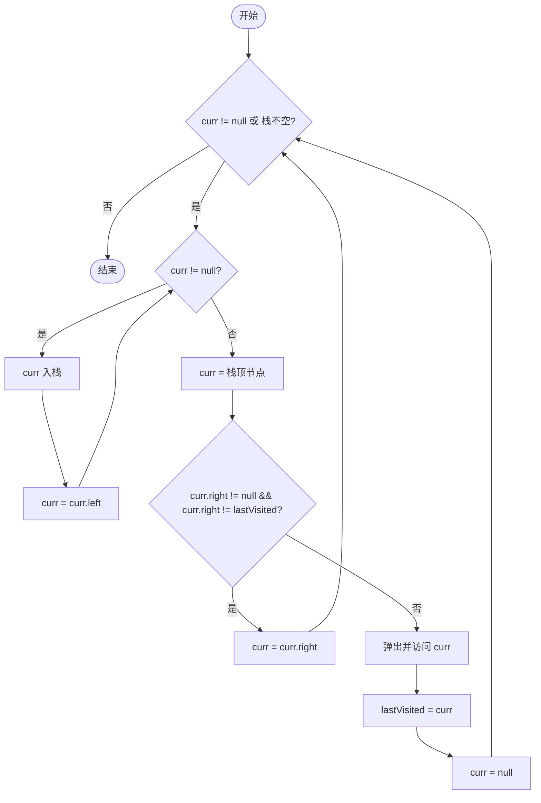
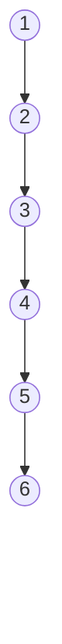
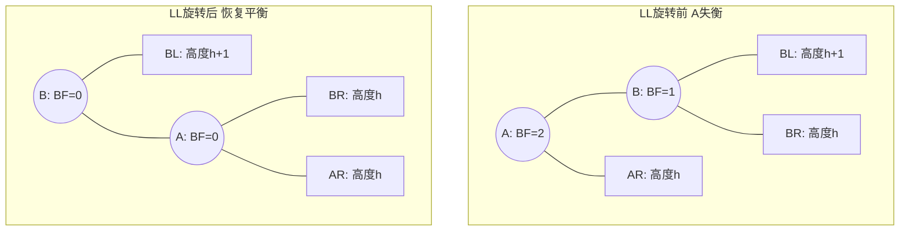
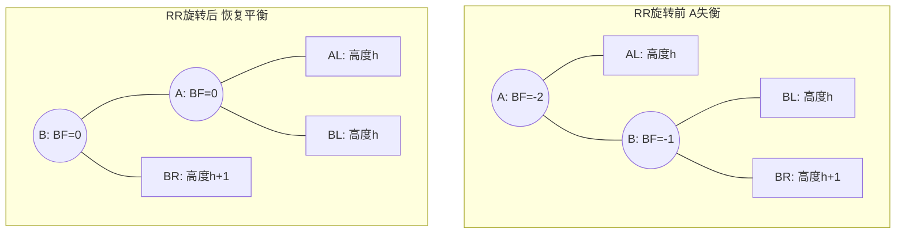
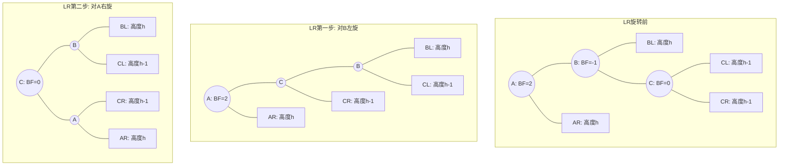
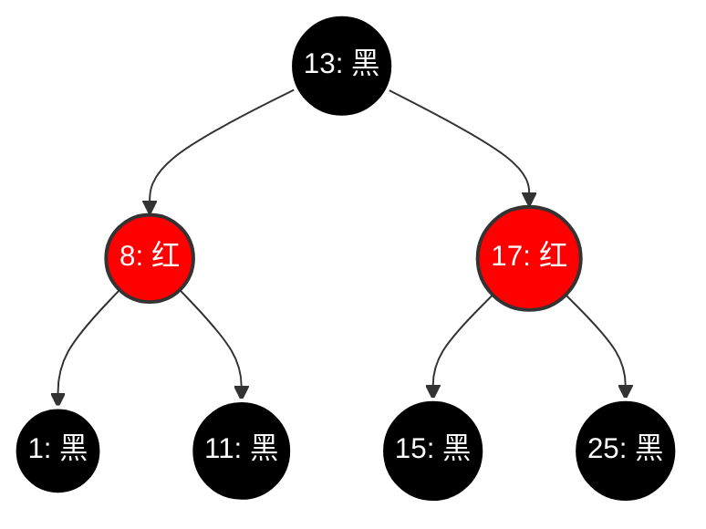
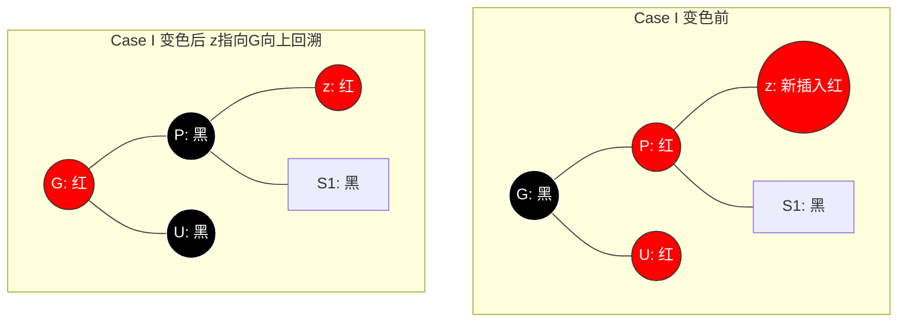
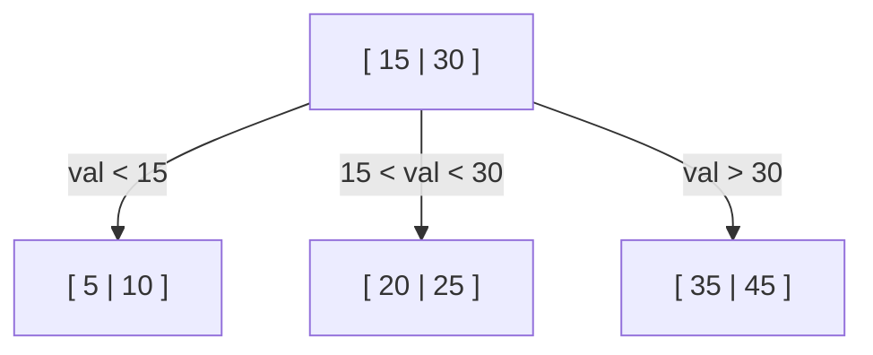
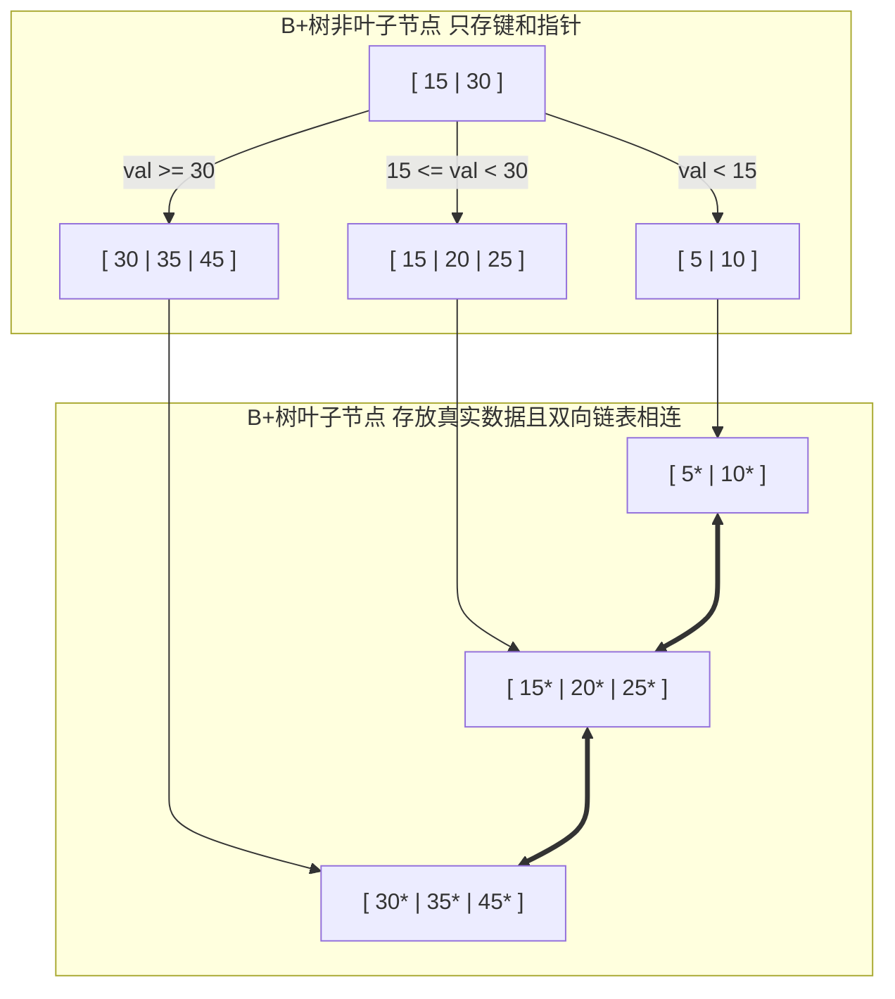

# 1.3.1.6 树

## 1. 树与二叉树的基础概念

### 1.1 树的数学与逻辑定义
在计算机科学与离散数学中，**树（Tree）**是一种极其重要的非线性数据结构，也是图论中一类特殊的无向图。
从图论的视角出发，一个无向简单图 $G = (V, E)$ 被定义为一棵树，当且仅当它满足以下等价条件之一：
- $G$ 是连通的，并且不包含任何回路（即无环连通图）。
- $G$ 是连通的，且其边数 $|E|$ 与顶点数 $|V|$ 满足代数关系 $|E| = |V| - 1$。
- $G$ 是无环的，且其边数 $|E|$ 与顶点数 $|V|$ 满足代数关系 $|E| = |V| - 1$。
- $G$ 中任意两个不同的顶点之间，存在且仅存在一条唯一的简单路径。

在实际的软件工程与应用开发中，我们最常用的是**有根树（Rooted Tree）**。在有根树中，有一个被称为**根（Root）**的特定节点，其余节点被分为若干个互不相交的有限集合，每一个集合本身又是一棵树，称为根的**子树（Subtree）**。这种递归的定义方式决定了树形数据结构的许多算法都天然地具有递归特性。

为了准确描述树的结构，离散数学与计算机科学定义了一套完整的术语体系：
- **节点（Node）**：包含一个数据元素及若干指向其子树的分支信息。
- **节点的度（Degree of a Node）**：该节点拥有的子树（或直接子节点）的数量。
- **树的度（Degree of a Tree）**：树中所有节点度的最大值。例如，二叉树的树度最大为 2。
- **叶子节点（Leaf / Terminal Node）**：度为 0 的节点，即没有子树的末梢节点。
- **分支节点（Branch / Non-terminal Node）**：度大于 0 的节点。除根节点外，分支节点也称为内部节点（Internal Node）。
- **祖先与子孙**：从根节点到该节点所经路径上的所有节点都称为该节点的祖先（Ancestor）；以某节点为根的子树中的任意节点都称为该节点的子孙（Descendant）。
- **双亲与孩子**：节点的子树的根称为该节点的孩子（Child），该节点称为其孩子的双亲（Parent）或父节点。
- **兄弟（Sibling）**：具有相同双亲节点的节点互为兄弟。
- **堂兄弟（Cousins）**：双亲在同一层的节点互为堂兄弟。

#### 深度与高度的数学定义及边界共识
在文献和实际工程中，对于节点的**深度（Depth）**和**高度（Height）**的起点存在两种定义方式：`0-based` 和 `1-based`。为避免学术上的歧义，本文统一约定采用 **1-based** 定义，并在下表中给出两种体系的对比：

| 物理概念 | 1-based 定义（经典教科书体系） | 0-based 定义（现代算法体系，如《算法导论》） |
| :--- | :--- | :--- |
| **根节点的深度** | 1 | 0 |
| **叶子节点的高度** | 1 | 0 |
| **空树的高度** | 0 | -1 |
| **深度递推公式** | $\text{Depth}(child) = \text{Depth}(parent) + 1$ | $\text{Depth}(child) = \text{Depth}(parent) + 1$ |
| **高度递推公式** | $\text{Height}(node) = \max(\text{Height}(left), \text{Height}(right)) + 1$ | $\text{Height}(node) = \max(\text{Height}(left), \text{Height}(right)) + 1$ |

**高度（Height）与深度（Depth）的几何方向性差异**：
- **深度（Depth）**是**自顶向下**累加的。它表示从根节点到该节点的最长路径上的节点数（或边数）。深度反映了该节点在树中所处的“纵向位置”。
- **高度（Height）**是**自底向上**累加的。它表示从该节点到其子树中最远叶子节点的最长路径上的节点数（或边数）。高度反映了以该节点为根的子树的“最大垂直厚度”。
- **树的高度（Height of Tree）**与**树的深度（Depth of Tree）**在数值上是相等的，均等于树中节点的最大层次。

---

### 1.2 二叉树 (Binary Tree) 的性质与定义
**二叉树（Binary Tree）**是每个节点最多有两个子树的有序树。它并非树的特例，而是与之有着本质区别的独立数学模型。

#### 二叉树与度为 2 的有序树的本质区别
许多初学者容易混淆“度为 2 的有序树”与“二叉树”的概念。其核心差异体现在以下三个维度：
1. **空树的可能性**：二叉树可以为空树（即节点数为 0）；而度为 2 的树作为一种具体的树，根据图论定义，其节点数必须大于等于 1，且必须至少有一个节点的度为 2（因此至少有 3 个节点）。
2. **子树的左右极性**：二叉树的子树有严格的“左”和“右”之分。即使某个节点仅有一个子节点，也必须明确它是左子节点还是右子节点。而在有序树中，若某个节点只有一个子节点，则无需区分左右，不存在“左子树”或“右子树”的概念。
3. **拓扑结构的多样性**：由于左右极性的存在，对于包含 2 个节点的二叉树，其拓扑结构有两种（根节点带左孩子，或根节点带右孩子）；而对于包含 2 个节点的度为 2 的有序树，其拓扑结构仅有一种（根节点带一个孩子）。

#### 二叉树的五大基本性质及严谨代数推导
- **性质 1**：在二叉树的第 $i$ 层上最多有 $2^{i-1}$ 个节点 ($i \ge 1$)。
  *证明（数学归纳法）*：
  - 当 $i=1$ 时，只有根节点，最多有 $2^{1-1} = 2^0 = 1$ 个节点，显然成立。
  - 假设当 $i=k$ 时命题成立，即第 $k$ 层最多有 $2^{k-1}$ 个节点。
  - 根据二叉树的定义，每个节点最多有两个孩子，因此第 $k+1$ 层的节点数最多是第 $k$ 层最大节点数的 2 倍。
  - 故第 $k+1$ 层最多有 $2 \times 2^{k-1} = 2^k$ 个节点，命题在 $i=k+1$ 时也成立。证毕。

- **性质 2**：高度为 $h$ 的二叉树最多有 $2^h - 1$ 个节点 ($h \ge 1$)。
  *证明*：
  要使高度为 $h$ 的二叉树节点数最多，其每一层 $i$ ($1 \le i \le h$) 都必须达到最大节点数 $2^{i-1}$。
  利用等比数列求和公式，总节点数 $N_{\max}$ 为：
  $$N_{\max} = \sum_{i=1}^h 2^{i-1} = 2^0 + 2^1 + 2^2 + \dots + 2^{h-1} = \frac{1 \cdot (2^h - 1)}{2 - 1} = 2^h - 1$$
  因此，高度为 $h$ 的二叉树节点数满足 $N \le 2^h - 1$。证毕。

- **性质 3**：对于任意一棵二叉树，若其叶子节点数为 $N_0$，度为 2 的节点数为 $N_2$，则必有 $N_0 = N_2 + 1$。
  *证明（分支数平衡法）*：
  设二叉树的总节点数为 $N$，度为 1 的节点数为 $N_1$。从节点类别的维度来看，有：
  $$N = N_0 + N_1 + N_2 \quad \text{(等式 1)}$$
  再从物理分支（边）的维度进行考量。由于除了根节点外，每个节点都有且仅有一条指向它的入边，因此整棵树的总边数 $B$ 与总节点数 $N$ 满足：
  $$B = N - 1$$
  同时，所有的边都是由度为 1 的节点（发出 1 条边）和度为 2 的节点（发出 2 条边）向下延伸出来的。因此总边数 $B$ 也可以表示为：
  $$B = N_1 + 2N_2$$
  联立上述两式可得：
  $$N - 1 = N_1 + 2N_2 \implies N = N_1 + 2N_2 + 1 \quad \text{(等式 2)}$$
  将等式 1 代入等式 2 中，消去 $N$ 和 $N_1$：
  $$N_0 + N_1 + N_2 = N_1 + 2N_2 + 1 \implies N_0 = N_2 + 1$$
  此定理表明：**二叉树中叶子节点的数量完全由度为 2 的节点数量决定，与度为 1 的节点数量无关**。这一结论在评估二叉树拓扑结构、设计线索二叉树时具有极其基础的指导意义。证毕。

- **性质 4**：具有 $n$ 个节点的完全二叉树的深度为 $\lfloor\log_2 n\rfloor + 1$。
  *证明*：
  设完全二叉树的深度为 $h$。根据完全二叉树的结构特征，其前 $h-1$ 层是满的，而最后一层可以不满但必须从左向右连续排列。因此，节点总数 $n$ 必然满足：
  $$2^{h-1} - 1 < n \le 2^h - 1$$
  不等式两边同时加 1，可得：
  $$2^{h-1} \le n < 2^h$$
  由于对数函数 $f(x) = \log_2 x$ 在其定义域内单调递增，对不等式取以 2 为底的对数：
  $$h - 1 \le \log_2 n < h$$
  因为树的深度 $h$ 必须为整数，故对 $\log_2 n$ 进行向下取整：
  $$h - 1 = \lfloor\log_2 n\rfloor \implies h = \lfloor\log_2 n\rfloor + 1$$
  证毕。

- **性质 5**：对于一棵包含 $n$ 个节点的完全二叉树，若对其节点按照层序从 0 开始连续编号（0 至 $n-1$），则对于任意节点 $i$ ($0 \le i < n$)，其亲子关系满足以下精准映射：
  1. 若 $i=0$，则节点 $i$ 为根节点，无父节点；若 $i > 0$，则其双亲节点的索引为 $\lfloor(i-1)/2\rfloor$。
  2. 若 $2i + 1 \ge n$，则节点 $i$ 无左孩子（且必无右孩子，是叶子节点）；否则其左孩子的索引为 $2i + 1$。
  3. 若 $2i + 2 \ge n$，则节点 $i$ 无右孩子；否则其右孩子的索引为 $2i + 2$。

---

### 1.3 四种遍历方式的递归与非递归算法逻辑

二叉树的遍历是将非线性结构线性化的核心手段。根据访问根节点 `D`、遍历左子树 `L`、遍历右子树 `R` 的顺序不同，经典的深度优先遍历分为前序（DLR）、中序（LDR）和后序（LRD）三种。此外，还有按物理层次逐层扫描的层序遍历。

#### 1.3.1 递归遍历的本质与局限性
递归遍历的实现极度契合二叉树的数学定义，其核心逻辑如下：
```java
// 递归中序遍历示例
public void inorderRecursive(TreeNode root) {
    if (root == null) return;
    inorderRecursive(root.left);  // 递归处理左子树
    visit(root);                  // 访问当前节点
    inorderRecursive(root.right); // 递归处理右子树
}
```
**递归的底层物理本质**：编译器利用操作系统或虚拟机提供的**运行时函数调用栈（Runtime Stack）**来保存当前函数的局部变量、形参以及返回地址。在每一次向子节点延伸时，都会进行一次压栈操作（Push Frame）；而在遇到空指针回溯时，则进行出栈操作（Pop Frame）。

**局限性分析**：
1. **栈溢出风险（Stack Overflow）**：递归的深度等于当前树的高度 $h$。在极端情况下（如二叉树退化为单链表），$h$ 达到 $n$。如果 $n$ 较大（如数十万），运行时栈的空间会被迅速耗尽，从而导致进程异常崩溃。
2. **额外的上下文开销**：每一次递归调用都需要保存寄存器状态、分配新的栈帧，这在 CPU 层面会产生较多的指令开销，影响运行效率。

因此，在高性能、高可靠性的底层系统研发中，我们通常采用**手工栈迭代算法（Non-recursive Traversal）**，通过在内存堆区手动模拟一个栈，来规避系统调用栈的深度限制。

#### 1.3.2 手工栈迭代算法的控制流状态机推导
为了编写出健壮的非递归遍历代码，我们需要分析遍历过程中节点“进栈”与“出栈”的精确状态转移。

##### 1. 前序遍历非递归（DLR）
**算法物理逻辑**：
1. 初始化一个手工栈 `Stack`，将根节点 `root` 压入栈。
2. 当栈不为空时，循环执行：
   - 弹出栈顶节点 `curr` 并访问它。
   - 由于栈是“后进先出（LIFO）”的，为了先访问左孩子、后访问右孩子，我们必须**先将右孩子压入栈**（若存在），**再将左孩子压入栈**（若存在）。
```java
public List<Integer> preorderTraversal(TreeNode root) {
    List<Integer> result = new ArrayList<>();
    if (root == null) return result;
    
    Deque<TreeNode> stack = new ArrayDeque<>();
    stack.push(root);
    
    while (!stack.isEmpty()) {
        TreeNode curr = stack.pop();
        result.add(curr.val); // 访问节点
        
        // 先右后左入栈
        if (curr.right != null) {
            stack.push(curr.right);
        }
        if (curr.left != null) {
            stack.push(curr.left);
        }
    }
    return result;
}
```

##### 2. 中序遍历非递归（LDR）
**算法物理逻辑**：
中序遍历要求在左子树完全访问后，才能访问当前节点。因此，在遍历过程中，我们需要沿着左侧链一路向下，将沿途遇到的所有节点都压入栈中，直到触底（遇到空节点）。然后弹出栈顶节点并访问，接着将指针切换到该节点的右孩子，重复上述压栈过程。
```java
public List<Integer> inorderTraversal(TreeNode root) {
    List<Integer> result = new ArrayList<>();
    Deque<TreeNode> stack = new ArrayDeque<>();
    TreeNode curr = root;
    
    while (curr != null || !stack.isEmpty()) {
        // 1. 一路向左，将沿途节点入栈
        while (curr != null) {
            stack.push(curr);
            curr = curr.left;
        }
        // 2. 此时左子树已空，弹出并访问栈顶
        curr = stack.pop();
        result.add(curr.val);
        
        // 3. 转向右子树
        curr = curr.right;
    }
    return result;
}
```

##### 3. 后序遍历非递归（LRD）—— 单栈法与双栈法深度剖析
后序遍历是非递归遍历中复杂度最高的，因为根节点需要被“触碰”三次：第一次是向下探索左子树前，第二次是左子树遍历完毕返回时，第三次是右子树遍历完毕返回准备访问根节点时。我们必须确保**只有在右子树被访问完毕后，才能弹出并访问根节点**。

###### 方案 A：双栈法（逆向思维构建）
**物理推导**：
后序遍历的访问顺序为：`左 -> 右 -> 根`。
如果我们将其逆序，得到：`根 -> 右 -> 左`。
这与前序遍历（`根 -> 左 -> 右`）极其相似，唯一的区别在于左右孩子的压栈顺序。因此，我们可以使用一个辅助栈 `stack1` 进行类似于前序遍历的探索（先压左孩子，再压右孩子，从而弹出时先右后左），并将弹出的节点压入另一个收集栈 `stack2` 中。当 `stack1` 为空时，`stack2` 中从栈顶到栈底的顺序正好就是 `左 -> 右 -> 根` 的后序遍历顺序。
```java
public List<Integer> postorderTraversalDoubleStack(TreeNode root) {
    List<Integer> result = new ArrayList<>();
    if (root == null) return result;
    
    Deque<TreeNode> stack1 = new ArrayDeque<>();
    Deque<TreeNode> stack2 = new ArrayDeque<>();
    stack1.push(root);
    
    while (!stack1.isEmpty()) {
        TreeNode curr = stack1.pop();
        stack2.push(curr); // 存入收集栈
        
        // 先左后右入栈，使得弹出顺序为先右后左
        if (curr.left != null) {
            stack1.push(curr.left);
        }
        if (curr.right != null) {
            stack1.push(curr.right);
        }
    }
    
    // 依次弹出 stack2 的内容，即为后序遍历结果
    while (!stack2.isEmpty()) {
        result.add(stack2.pop().val);
    }
    return result;
}
```

###### 方案 B：单栈法（状态机精确回溯控制）
为了实现真正的单栈空间控制，我们需要引入一个辅助指针 `lastVisited`，用来记录**上一个刚刚被访问过的节点**。
当我们在栈顶审视节点 `curr` 时：
- 如果 `curr.right == null`，说明没有右子树，可以直接访问 `curr`。
- 如果 `curr.right == lastVisited`，说明右子树刚刚被访问完毕，现在可以回溯访问 `curr` 本身。
- 否则，说明右子树尚未处理，我们必须将指针 `curr` 切换到 `curr.right`，继续向右子树的左下角摸索。

下面是基于单栈法的后序遍历状态转移流程图：



以下是单栈法后序遍历的 Java 实现：
```java
public List<Integer> postorderTraversalSingleStack(TreeNode root) {
    List<Integer> result = new ArrayList<>();
    Deque<TreeNode> stack = new ArrayDeque<>();
    TreeNode curr = root;
    TreeNode lastVisited = null; // 记录上一次访问的节点
    
    while (curr != null || !stack.isEmpty()) {
        if (curr != null) {
            stack.push(curr);
            curr = curr.left; // 一路向左
        } else {
            TreeNode peekNode = stack.peek(); // 审视栈顶，不弹出
            // 如果右子树存在且未被访问过，则转向右子树
            if (peekNode.right != null && lastVisited != peekNode.right) {
                curr = peekNode.right;
            } else {
                // 右子树为空或已被访问，此时弹出并访问当前节点
                TreeNode popped = stack.pop();
                result.add(popped.val);
                lastVisited = popped; // 标记已访问
            }
        }
    }
    return result;
}
```

##### 4. 层序遍历 (Level Order Traversal)
层序遍历是典型的广度优先搜索（BFS）。我们使用队列（Queue）来实现逐层剥离。
```java
public List<List<Integer>> levelOrder(TreeNode root) {
    List<List<Integer>> result = new ArrayList<>();
    if (root == null) return result;
    
    Queue<TreeNode> queue = new ArrayDeque<>();
    queue.offer(root);
    
    while (!queue.isEmpty()) {
        int levelSize = queue.size(); // 当前层的节点数
        List<Integer> currentLevel = new ArrayList<>();
        
        for (int i = 0; i < levelSize; i++) {
            TreeNode curr = queue.poll();
            currentLevel.add(curr.val);
            
            if (curr.left != null) queue.offer(curr.left);
            if (curr.right != null) queue.offer(curr.right);
        }
        result.add(currentLevel);
    }
    return result;
}
```

---

### 1.4 满二叉树与完全二叉树
理解满二叉树与完全二叉树的区别及其特有的数组紧凑存储特性，是掌握高级数据结构（如二叉堆、线段树）的基石。

#### 满二叉树 (Full Binary Tree) 的概念差异
在学术界，关于“满二叉树”的定义在国内外教材中存在细微的差异，在阅读文献时需要特别注意：
1. **国内主流定义（Perfect Binary Tree）**：一棵深度为 $h$ 且有 $2^h - 1$ 个节点的二叉树。即每一层都排满，没有任何空闲位置，叶子节点全部在最底层。这在国际上通常被称为**完美二叉树（Perfect Binary Tree）**。
2. **国际/经典定义（Strictly Binary Tree / Full Binary Tree）**：所有非终端节点（内部节点）都拥有占有且仅有两个子节点的二叉树。也就是说，树中不存在度为 1 的节点。这棵树的叶子节点可以分布在不同的层上。

本文在后续讨论中，若无特别说明，均采用国内常用的定义（即完美二叉树）。

#### 完全二叉树 (Complete Binary Tree) 的数组紧凑存储特性
完全二叉树的定义是：高度为 $h$ 的、拥有 $n$ 个节点的二叉树，当且仅当其每一个节点都与高度为 $h$ 的满二叉树中编号从 0 到 $n-1$ 的节点一一对应时，称为完全二叉树。

这意味着，完全二叉树除了最底层外，其余各层都是满的，且最底层的节点从左向右连续排列，中间不能有任何“空档”。

##### 数组索引映射与位运算优化
由于完全二叉树没有任何空档，我们可以完全放弃传统的链式存储（即左右子节点指针），转而使用一维数组进行**紧凑连续存储**。
假设我们将节点按层序从左到右依次存入数组中：

- **若数组索引从 `0` 开始**。对于索引为 `i` 的任意节点：
  - **左子节点索引**：$2i + 1$
  - **右子节点索引**：$2i + 2$
  - **双亲节点索引**：$\lfloor (i - 1) / 2 \rfloor$
  
  在底层系统实现中，为了极致提高性能，我们可以使用**位运算（Bitwise Operations）**来代替相对昂贵的乘除法：
  - 左子节点：`(i << 1) | 1` (等效于 $2i+1$，其中左移 1 位表示乘以 2，按位或 1 表示加 1)
  - 右子节点：`(i << 1) + 2` 或 `(i + 1) << 1`
  - 双亲节点：`(i - 1) >> 1` (右移 1 位等效于向下取整除以 2)

- **若数组索引从 `1` 开始**（如某些经典教科书的伪代码）。对于索引为 `i` 的任意节点：
  - **左子节点索引**：$2i$ (位运算：`i << 1`)
  - **右子节点索引**：$2i + 1$ (位运算：`(i << 1) | 1`)
  - **双亲节点索引**：$\lfloor i / 2 \rfloor$ (位运算：`i >> 1`)

##### 数组存储的优势与堆排序的应用
1. **零指针开销（Zero Pointer Overhead）**：在 64 位操作系统中，每个指针占用 8 字节。对于一个包含 1000 万个整型数据（每个 4 字节）的二叉树，如果使用链式存储，仅指针开销就高达 $2 \times 8 \text{B} \times 10^7 = 160\text{MB}$，是数据本身大小的 4 倍。而数组存储的指针开销为 0。
2. **CPU 缓存友好（CPU Cache Friendly）**：由于数据在物理内存上是连续分布的，当 CPU 访问节点 `i` 时，现代 CPU 的**预取器（Prefetcher）**会将节点后面的相邻节点一同加载进 L1/L2 缓存中。这极大地提高了 Cache 命中率，避免了链式节点在物理堆区乱序分布导致的 Cache Miss。
3. **典型应用：二叉堆（Binary Heap）**：堆排序及优先队列的核心就是一棵完全二叉树。由于需要高频执行上滤（Sift Up）和下滤（Sift Down）的亲子交换操作，利用数组紧凑存储的位运算定位能力，堆的物理结构非常高效。

##### 非完全二叉树用数组存储的空间崩溃（稀疏性退化）
如果一棵树不是完全二叉树，但我们仍强行使用数组进行索引存储，就必须为缺失的节点留出“占位符”（如存入 null 或 dummy 值）。
考虑一棵极度退化的单支树（即每个非终端节点只有右孩子），其高度为 $h$，实际节点数仅为 $h$。
如果用数组进行索引映射，最后一个节点的索引将是 $2^{h-1} - 1$。
这意味着我们需要分配一个长度为 $2^{h-1}$ 的数组来存储这 $h$ 个数据。
- 当 $h = 31$ 时，实际数据只有 31 个。
- 所需数组大小为 $2^{30} \approx 10^9$ 个元素。如果每个元素为 4 字节，则需要 **4GB** 的内存空间。
- 此时**空间利用率**为 $31 / 2^{30} \approx 0.0000028\%$。

这种空间上的断崖式崩溃（稀疏性退化）表明：**对于一般的非完全二叉树，链式存储是唯一的合理选择。**

---

## 2. 二叉搜索树与平衡树体系 (BST & AVL & Red-Black Tree)

### 2.1 二叉搜索树 (Binary Search Tree, BST)
二叉搜索树又称二叉排序树，是一种对检索操作进行过拓扑优化的二叉树。

#### 物理搜索、插入与删除的逻辑推导
- **检索逻辑（Search）**：
  给定值 `key`：
  1. 若当前节点为空，则查找失败。
  2. 若 `key == curr.val`，查找成功，返回该节点。
  3. 若 `key < curr.val`，说明目标值只可能在左子树中，递归进入左子节点。
  4. 若 `key > curr.val`，递归进入右子节点。
- **插入逻辑（Insertion）**：
  插入总是发生在叶子节点上。沿着检索路径向下摸索，直到遇到空节点位置，新建节点并将其挂载到父节点相应的左右指针上。
- **删除逻辑（Deletion）**：
  删除操作是 BST 中最具挑战的物理变换。当我们找到待删除节点 `z` 时，必须分三种拓扑情况讨论以保持 BST 的性质：
  - **Case 1：`z` 为叶子节点**。
    - 处理：直接将其从父节点的指针中切断，释放 `z`。
  - **Case 2：`z` 只有一个孩子（左孩子或右孩子）**。
    - 处理：将 `z` 的这个唯一孩子直接挂载到 `z` 的父节点上，替换 `z` 的位置，然后释放 `z`。
  - **Case 3：`z` 有两个孩子**。
    - 处理：为了不破坏二叉搜索树的物理顺序，我们需要找到 `z` 的**中序后继节点 `y`**（即 `z` 的右子树中的最左节点，也是右子树中键值最小的节点，当然也可以选择中序前驱）。
    - 将 `y` 的键值和数据复制到 `z` 中。
    - 此时，问题转化为删除节点 `y`。因为 `y` 是其所在子树的最左节点，所以它**绝对不可能有左孩子**。因此，对 `y` 的删除必然属于 **Case 1** 或 **Case 2**，可以直接将其右孩子（若存在）挂载到 `y` 的父节点上。

以下是二叉搜索树核心操作的 Java 实现：
```java
public class BinarySearchTree {
    private TreeNode root;

    public TreeNode search(int key) {
        TreeNode curr = root;
        while (curr != null) {
            if (key == curr.val) return curr;
            curr = (key < curr.val) ? curr.left : curr.right;
        }
        return null;
    }

    public void insert(int key) {
        if (root == null) {
            root = new TreeNode(key);
            return;
        }
        TreeNode curr = root;
        TreeNode parent = null;
        while (curr != null) {
            parent = curr;
            if (key < curr.val) {
                curr = curr.left;
            } else if (key > curr.val) {
                curr = curr.right;
            } else {
                return; // 不允许插入重复值
            }
        }
        if (key < parent.val) {
            parent.left = new TreeNode(key);
        } else {
            parent.right = new TreeNode(key);
        }
    }

    public void delete(int key) {
        root = deleteNode(root, key);
    }

    private TreeNode deleteNode(TreeNode root, int key) {
        if (root == null) return null;
        if (key < root.val) {
            root.left = deleteNode(root.left, key);
        } else if (key > root.val) {
            root.right = deleteNode(root.right, key);
        } else {
            // 找到目标节点，执行删除
            if (root.left == null) return root.right; // Case 1 & 2
            if (root.right == null) return root.left;  // Case 2
            
            // Case 3: 左右孩子均不为空
            TreeNode successor = getMin(root.right); // 寻找中序后继
            root.val = successor.val;               // 复制值
            root.right = deleteNode(root.right, successor.val); // 递归删除后继节点
        }
        return root;
    }

    private TreeNode getMin(TreeNode node) {
        while (node.left != null) {
            node = node.left;
        }
        return node;
    }
}
```

#### BST 在最坏情况下的退化缺陷
二叉搜索树的检索效率与树的高度 $h$ 呈正比。若输入数据是随机分布的，树的期望高度为 $O(\log n)$，检索效率极高。
然而，**BST 存在对输入顺序的极度敏感性**。
如果我们将一个有序序列（例如 `[1, 2, 3, 4, 5, 6]`）依次插入到一棵初始为空的 BST 中，每次插入的值都是当前树中的最大值，因此新节点都会被挂载到前一个节点的右指针上。
此时，BST 会彻底退化为一根**单链表**：



##### 退化后的 ASL（平均查找长度）代数推导
平均查找长度（Average Search Length, ASL）是衡量树形结构检索性能的关键指标：
$$ASL = \sum_{i=1}^n P_i \times C_i$$
其中 $P_i$ 是查找第 $i$ 个节点的概率，通常假定每个节点的查找概率均等，即 $P_i = \frac{1}{n}$；$C_i$ 是查找第 $i$ 个节点时所需的比较次数，在数值上等于该节点在树中的深度（1-based）。

- **完美平衡情况下的 ASL**：
  若树是满二叉树，其高度 $h \approx \log_2 n$。第 $k$ 层包含 $2^{k-1}$ 个节点，每个节点的比较次数为 $k$。
  $$ASL_{\text{balanced}} = \frac{1}{n} \sum_{k=1}^h k \cdot 2^{k-1} \approx \log_2 n - 1 = O(\log n)$$
- **退化为单链表情况下的 ASL**：
  若退化为单链表，第 $i$ 个节点的比较次数就是 $i$：
  $$ASL_{\text{degenerate}} = \frac{1}{n} \sum_{i=1}^n i = \frac{1}{n} \cdot \frac{n(n + 1)}{2} = \frac{n + 1}{2} = O(n)$$

**结论**：当 BST 退化后，其时间复杂度从理想的 $O(\log n)$ 恶化到了 $O(n)$，彻底丧失了二叉树的高效检索优势。为了抵御这种退化，学术界引入了“自平衡机制”，其中最具代表性的是 AVL 树和红黑树。

---

### 2.2 自平衡二叉搜索树：AVL 树
AVL 树（由 Adelson-Velsky 和 Landis 于 1962 年提出）是历史上第一种自平衡二叉搜索树。

#### 平衡因子的数学定义
对于 AVL 树中的任意节点 $N$，其**平衡因子（Balance Factor, BF）**定义为该节点左子树的高度与右子树的高度之差：
$$BF(N) = \text{Height}(N.\text{left}) - \text{Height}(N.\text{right})$$
AVL 树的自平衡性质要求，对于树中的每一个节点，其平衡因子的绝对值必须不超过 1：
$$\forall N \in \text{Tree}, \quad BF(N) \in \{-1, 0, 1\}$$
一旦某个节点的 $|BF(N)| \ge 2$，即表明该子树已经失衡，必须通过旋转操作将其重新拉回到平衡范围内。

#### LL, RR, LR, RL 旋转调整的几何推导与拓扑变换
失衡的根源在于在某个节点的子树中插入（或删除）了节点，导致高度差增大。根据失衡节点与新插入节点在空间上的相对位置，自平衡旋转分为四种基本形态：

##### 1. LL 型失衡（左左型）：向右单旋
- **触发场景**：节点 $A$ 的 $BF = 2$，其左孩子 $B$ 的 $BF = 1$。说明不平衡是由于新节点插入到了 $A$ 的左孩子的左子树上引起的。
- **变换逻辑**：以 $B$ 为轴，将 $A$ 向右下方压下。$B$ 成为这棵子树的新根，$B$ 的右子树 $B_R$ 挂载到 $A$ 的左指针上，而 $A$ 成为 $B$ 的右孩子。



##### 2. RR 型失衡（右右型）：向左单旋
- **触发场景**：节点 $A$ 的 $BF = -2$，其右孩子 $B$ 的 $BF = -1$。由于新节点插入到了右孩子的右子树上。
- **变换逻辑**：以 $B$ 为轴，将 $A$ 向左下方拉下。$B$ 成为新根，$B$ 的左子树 $B_L$ 挂载到 $A$ 的右指针上，而 $A$ 成为 $B$ 的左孩子。



##### 3. LR 型失衡（左右型）：先左旋后右旋
- **触发场景**：节点 $A$ 的 $BF = 2$，其左孩子 $B$ 的 $BF = -1$。由于新节点插入到了左孩子 $B$ 的右子树 $C$ 上。
- **变换逻辑**：无法通过一次单旋解决。我们需要先对 $B$ 进行**左单旋**（这会将 $B$ 和 $C$ 的关系转换为类似 LL 的形态），然后再对 $A$ 进行**右单旋**。



##### 4. RL 型失衡（右左型）：先右旋后左旋
- **触发场景**：节点 $A$ 的 $BF = -2$，其右孩子 $B$ 的 $BF = 1$。新节点插入到右孩子 $B$ 的左子树 $C$ 上。
- **变换逻辑**：先对 $B$ 进行**右单旋**，使右孩子这一侧转化为类似 RR 的形态；再对 $A$ 进行**左单旋**。

---

### 2.3 红黑树 (Red-Black Tree)

虽然 AVL 树在查找性能上表现卓越，但在面临高频的写操作（插入与删除）时，为了强行维系极度严苛的平衡约束，其频繁的旋转调整会带来严重的CPU指令浪费。红黑树（Red-Black Tree）通过引入“着色规则”和“大致平衡”的设计哲学，完美平衡了“读效率”与“写效率”。

#### 红黑树的五大核心着色与平衡性质
一棵合法的红黑树必须满足以下五条基本红黑规则：
1. **每个节点要么是红色的，要么是黑色的**。
2. **根节点是黑色的**。
3. **所有的外部空节点（NIL 叶子节点哨兵）都是黑色的**。
4. **如果一个节点是红色的，则它的两个子节点必须都是黑色的**。换言之，在整棵树的任意路径上，绝对不能出现两个相邻的红色节点。
5. **对任意节点，从该节点到其所有后代叶子节点（NIL）的简单路径上，均包含相同数量的黑色节点**。这一数量被称为该节点的**黑高（Black Height, $bh$）**。



#### 红黑树的最大树高上界性质证明
为什么这五条简单的着色规则能确保红黑树的高度始终被限制在对数级别？我们进行严格的数学证明。

- **引理**：一棵以 $x$ 为根节点的子树，若其黑高为 $bh(x)$，则该子树至少包含 $2^{bh(x)} - 1$ 个内部非空节点。
  *证明（数学归纳法）*：
  - **基础步**：若 $x$ 的高度为 0，则 $x$ 必然是 NIL 节点，其黑高 $bh(x) = 0$。此时它包含的内部节点数为 $2^0 - 1 = 0$，结论成立。
  - **归纳步**：假设对于高度小于 $h$ 的节点结论均成立。考虑高度为 $h$ 且黑高为 $bh(x)$ 的内部节点 $x$。它拥有左右两个孩子 $x_L$ 和 $x_R$。
    根据着色规则，如果孩子节点是红色的，其自身的黑高与父节点相同，即为 $bh(x)$；如果孩子节点是黑色的，其黑高为 $bh(x) - 1$。
    无论如何，左右孩子的黑高至少为 $bh(x) - 1$。
    因为左右孩子的高度都小于 $x$ 的高度，根据归纳假设，以 $x_L$ 和 $x_R$ 为根的子树所包含的内部节点数分别至少为 $2^{bh(x)-1} - 1$。
    那么，以 $x$ 为根的整棵子树包含的内部节点数 $N$ 至少为：
    $$N \ge (2^{bh(x)-1} - 1) + (2^{bh(x)-1} - 1) + 1 = 2 \cdot 2^{bh(x)-1} - 1 = 2^{bh(x)} - 1$$
    归纳成立。引理证毕。

- **高度定理**：一棵包含 $n$ 个内部节点的红黑树，其最大高度 $h$ 满足：
  $$h \le 2 \log_2(n + 1)$$
  *证明*：
  根据**性质 4**，在从根节点到 NIL 叶子的任意路径上，红色节点不能相邻。这意味着在任意路径上，红色节点的数量不可能多于黑色节点的数量。
  因此，根节点的黑高 $bh(\text{root})$ 必须至少是树高 $h$ 的一半：
  $$bh(\text{root}) \ge \frac{h}{2}$$
  将此关系代入前面的引理中：
  $$n \ge 2^{bh(\text{root})} - 1 \ge 2^{h/2} - 1$$
  两边同时加 1：
  $$n + 1 \ge 2^{h/2}$$
  两边取以 2 为底的对数：
  $$\log_2(n + 1) \ge \frac{h}{2} \implies h \le 2 \log_2(n + 1)$$
  定理证毕。

**结论分析**：在最极端的情况下（即路径上全是黑色节点与红色节点交替分布），红黑树的最大高度也不过是 $2\log_2(n+1)$。这保证了在最坏情况下，红黑树的查找时间复杂度依然是极其稳定的 $O(\log n)$。

#### 为什么红黑树的插入/删除性能优于 AVL 树？
这是系统架构设计中极为经典的问题。红黑树并非在所有指标上都优于 AVL 树，而是做了一次精妙的性能权衡：

1. **平衡约束精度的差异**：
   - **AVL 树**追求**严格的高度平衡**。任何子树的高度差都不能超过 1。
   - **红黑树**追求**黑高平衡（大致平衡）**。它只保证最长路径不会超过最短路径的两倍。
2. **查找效率对比**：
   - 由于 AVL 树更加扁平，其平均查找长度稍低于红黑树。在**只读（Read-Only）**的静态数据集场景中，AVL 树的检索性能比红黑树略微优秀（大约快数个百分点）。
3. **动态调整成本（旋转与变色）对比**：
   - **插入操作**：
     - AVL 树最多需要 **2 次旋转** 来恢复平衡。
     - 红黑树最多需要 **2 次旋转**，大部分情况通过快速变色就能化解。
   - **删除操作（关键分水岭）**：
     - **AVL 树**删除节点后，不平衡信号可能会一直向上回溯到根节点，在回溯路径上导致多次旋转。在最坏情况下，AVL 树删除节点需要 **$O(\log n)$ 次旋转**。
     - **红黑树**删除节点后，通过复杂的着色规则进行局部消解，在最坏情况下也**仅需要 3 次旋转**。
4. **变色与旋转的底层开销差异**：
   - **变色（Coloring）**仅仅是在内存中修改节点的一个颜色标志位，这几乎是瞬间完成的。
   - **旋转（Rotation）**则不同，它需要修改多个指针的指向。在现代 CPU 架构下，修改指针意味着打乱了分支预测（Branch Prediction），会导致 CPU 流水线停顿，并且由于破坏了内存的邻近读取，会导致 L1/L2 缓存产生局部的失效。
   - 此外，AVL 树由于高度控制过于苛刻，高频的插入删除会引发大范围的连锁旋转。

**总结**：在真实的工程环境中（例如 C++ STL 的 `std::map` / `std::set`、Linux 内核的虚拟内存区域管理、或者高并发的定时器任务调度等），数据经常被高频增删改。红黑树凭借在插入/删除时极低的旋转频次和用变色替代旋转的特性，综合性能表现显著优于 AVL 树。

#### 插入与删除的调优状态机详尽推导
在红黑树的变色与旋转调优中，其核心思想是：**将打破红黑规则的“红色违规”或“黑高亏空”在树的局部进行吸收；若本地无法吸收，则将其染色并“推给”父辈节点，引导冲突向上追溯，直到根节点或者被某一次旋转彻底消解。**

##### 1. 插入状态机分析
当我们向红黑树插入一个新节点 $z$ 时，我们**默认将 $z$ 涂为红色**。
*原因*：若涂为黑色，会立刻直接违反**性质 5**（导致经过该路径的黑高增加 1，这会破坏所有简单路径的平衡，调整难度极大）。而涂为红色，只会可能违反**性质 4**（如果其父节点本来就是红色的，则会出现连续的红色节点，这属于局部冲突，极易通过变色和旋转在局部化解）。

我们以 **$z$ 的父节点 $P$ 是其祖父节点 $G$ 的左孩子** 为例（右孩子完全对称）。当 $P$ 为红色时，冲突发生（此时 $G$ 必然存在且必为黑色）：

###### Case I：$z$ 的叔叔节点 $U$ 是红色的
- **状态特征**：$P$ 和 $U$ 都是红色。
- **调整逻辑**：黑高平衡转移。将 $P$ 和 $U$ 都染成黑色，将祖父 $G$ 染成红色。由于 $G$ 变成了红色，它可能会与其自身的父节点发生连续红色冲突，因此我们需要将当前待调整指针 $z$ 指向 $G$，继续向上回溯。



###### Case II：$z$ 的叔叔节点 $U$ 是黑色的（或为空），且 $z$ 是其父节点的右孩子（LR 型）
- **状态特征**：无法通过一次单旋拉直。
- **调整逻辑**：降维拉直。以父节点 $P$ 为轴进行**一次左单旋**，将待调整指针 $z$ 重新指向原来的父节点 $P$。此时，状态转化为 **Case III**（LL 型）。

###### Case III：$z$ 的叔叔节点 $U$ 是黑色的（或为空），且 $z$ 是其父节点的左孩子（LL 型）
- **状态特征**：连续红节点偏向一侧。
- **调整逻辑**：旋转终结。将 $P$ 染为黑色，将 $G$ 染为红色，然后以 $G$ 为轴进行**一次右单旋**。经过这次操作后，原冲突的红色被两边黑色完美包夹，红黑规则全部恢复，状态机终止。

---

##### 2. 删除状态机分析
删除操作的平衡调整非常复杂。只有当被删除的节点是**黑色节点**时，才会导致包含该节点的路径上的黑高串联减少 1，从而打破**性质 5**。
我们通过引入一个“**双黑（Double Black）**”节点的概念来解决问题：将缺失的黑色临时“叠加”到该节点的子节点 $N$ 上（使 $N$ 携带两个单位的黑色，即双黑）。我们的核心目标是**通过变色和旋转，将这一重额外的黑色逐步向上推，或者在局部与红色节点相遇并“消解”掉。**

以 $N$ 是其父节点 $P$ 的左孩子为例，设其兄弟节点为 $S$：

###### Case 1：兄弟节点 $S$ 是红色的
- **状态特征**：由于 $S$ 是红的，父节点 $P$ 和 $S$ 的孩子必然都是黑色的。
- **调整逻辑**：交换 $P$ 和 $S$ 的颜色，对 $P$ 进行一次**左单旋**。此时 $N$ 的新兄弟变成了原 $S$ 的黑孩子，成功将问题转化为兄弟节点为黑色的 Case 2, 3, 4 之一。

###### Case 2：兄弟节点 $S$ 是黑色的，且 $S$ 的两个孩子都是黑色的
- **状态特征**：兄弟这一侧没有多余的红色节点可以供我们挪用。
- **调整逻辑**：我们将兄弟 $S$ 染成红色（这相当于将 $S$ 这一侧的黑高也人为降低了 1，此时 $S$ 与 $N$ 站在了同一起跑线上）。然后，由于两边都亏空，我们需要让父节点 $P$ 来共同承担这一重亏空。
  - 若 $P$ 原来是红色的，直接将 $P$ 染成黑色即可，多余的黑色被吸收，调整结束。
  - 若 $P$ 本身就是黑色的，则 $P$ 变成了新的“双黑”节点，我们需要将 $N$ 指针移动到 $P$，向上继续回溯。

###### Case 3：兄弟节点 $S$ 是黑色的，且 $S$ 的近端孩子（左孩子）是红色的，远端孩子（右孩子）是黑色的
- **状态特征**：红色节点位置偏向内侧。
- **调整逻辑**：交换 $S$ 和其左孩子的颜色，对 $S$ 进行一次**右单旋**。这使得红色节点来到了远端（右侧），状态完美转化为 **Case 4**。

###### Case 4：兄弟节点 $S$ 是黑色的，且 $S$ 的远端孩子（右孩子）是红色的
- **状态特征**：红色节点在最外侧，可以直接通过单旋和变色吸收亏空。
- **调整逻辑**：我们将 $S$ 的颜色修改为父节点 $P$ 的颜色，将父节点 $P$ 和远端红孩子都染成黑色。然后对 $P$ 进行一次**左单旋**。
  通过这一系列极其精妙的指针互换，原有的“双黑”亏空被远端红孩子的黑色所吸收，树的局部黑高彻底恢复平衡，调整终结。

---

## 3. 多路查找树与外存索引机制 (B-Tree & B+ Tree)

### 3.1 为什么内存中的红黑树不适合作为磁盘/外存索引？

在现代数据库系统（如 MySQL, PostgreSQL）与文件系统（如 NTFS, ext4）中，我们需要存储和检索数十亿级别的数据。虽然红黑树在内存中检索的时间复杂度是极其出色的 $O(\log n)$，但将其直接移植到磁盘等外存中时，其性能会发生断崖式下跌。这源于计算机体系结构中**物理存储金字塔的硬件鸿沟**。

#### 物理存储金字塔与局部性原理
计算机的存储体系是由不同介质层层递叠的，越靠近 CPU 的介质速度越快、成本越高、容量越小：
- **CPU 寄存器 / L1 & L2 Cache**：延迟在 **0.5ns - 5ns**。
- **内存（RAM）**：延迟在 **50ns - 100ns**。
- **固态硬盘（SSD）**：延迟在 **10μs - 100μs**（比内存慢 1000 倍）。
- **机械硬盘（HDD）**：由于需要磁头物理寻道和盘片旋转，延迟在 **5ms - 10ms**（比内存慢 **100,000** 倍）。

根据**局部性原理（Principle of Locality）**，操作系统与磁盘交互时，绝对不会为了读取 1 字节的数据而启动一次物理 I/O。磁盘 I/O 的最小物理和逻辑单位是**页（Page）**，通常为 **4KB** 或 **8KB**（而在商业数据库中如 InnoDB，默认页大小为 **16KB**）。即使你只需要读取一个整型数，系统也会将包含该整数的整整一页数据全部载入内存中。

#### 二叉树在外存中的致命缺陷
假设我们有 1000 万条数据记录，如果采用红黑树进行存储：
- 红黑树的每个节点包含一个键（Key）、一个指向实际数据的指针，以及左右子节点的指针。
- 此时红黑树的高度为 $h \approx \log_2(10^7) \approx 24$。
- 在堆区中，红黑树的节点是离散分布的。这意味着我们在沿着树向下查找时，每触碰一个子节点，该节点大概率分布在不同的磁盘页上。
- **24 次指针跳转可能意味着 24 次随机磁盘 I/O**。
- 在机械硬盘下，24 次随机 I/O 需要花费约 $24 \times 10\text{ms} = 240\text{ms}$。如果在一秒内有 100 个并发查询，系统就会因为磁盘 I/O 队列堆积而彻底陷入瘫痪。

#### B 树的度数革命
如何解决这个问题？既然 I/O 开销是由于树的高度 $h$ 导致的，那么我们就必须**极大地降低树的高度**。
由对数换底公式可知：
$$\log_a N = \frac{\log_b N}{\log_b a}$$
如果我们将树的每一个节点的分支数（即度数/阶数 $m$）从 2 提升到 1000：
- 同样是 1000 万条数据，树的高度将锐减为：
  $$h \approx \log_{1000}(10^7) \approx 3$$
- 这意味着仅需要 **3 次磁盘 I/O** 即可完成检索！这便是**多路查找树（B-Tree）**的设计根源。

---

### 3.2 B 树 (B-Tree) 核心概念与分裂/合并原理
B 树（Balanced Tree）是由 Rudolf Bayer 和 Edward M. McCreight 于 1972 年提出的一种多路平衡查找树。

#### B 树的严格数学性质
一棵 $m$ 阶的 B 树必须满足以下拓扑约束：
1. 每个节点最多拥有 $m$ 个子节点（即最多包含 $m-1$ 个键）。
2. 每一个非终端节点（除根节点外）至少拥有 $\lceil m/2 \rceil$ 个子节点（即至少包含 $\lceil m/2 \rceil - 1$ 个键）。
3. 根节点若不是叶子节点，则至少拥有 2 个子节点。
4. 一个包含 $k$ 个子节点的非叶子节点，正好包含 $k-1$ 个按升序排列的键 $K_1, K_2, \dots, K_{k-1}$。这些键作为分水岭，将子节点指针划分为 $k$ 个区间。
5. **所有叶子节点都位于同一层**。这意味着 B 树是绝对完美平衡的，绝不会像二叉搜索树那样出现长短分支悬殊的情况。



#### B 树节点的分裂（Split）机制
当我们向 B 树中插入一个新键时，我们总是首先将其定位到某个叶子节点。若插入后该节点的键数量超过了 $m-1$，则会发生**上溢（Overflow）**，必须执行分裂操作：
1. **定位中间元素**：找到该节点中排在第 $\lceil m/2 \rceil$ 位置的中间键 $K_{\text{mid}}$。
2. **切分节点**：以 $K_{\text{mid}}$ 为分界线，将原节点切分为左右两个新节点。左侧节点包含 $K_{\text{mid}}$ 之前的键，右侧节点包含其后的键。
3. **提升中间元素**：将 $K_{\text{mid}}$ 向上提取并插入到其父节点中。原节点的左右两个新子节点分别作为 $K_{\text{mid}}$ 在父节点中的左右孩子指针。
4. **连锁反应**：如果父节点在并入 $K_{\text{mid}}$ 后也发生了上溢，则对父节点继续执行上述分裂，直至波及到根节点。若根节点也需要分裂，则会产生一个新的根节点，此时**整棵树的高度加 1**。

```mermaid
graph TD
    subgraph 插入 18 导致节点上溢 (以 3 阶 B 树为例)
        node1["[ 10 | 15 | 18 ] (Overflow)"]
    end
    
    subgraph 分裂后
        parent["[ 15 ]"]
        left_child["[ 10 ]"]
        right_child["[ 18 ]"]
        parent --> left_child
        parent --> right_child
    end
```

#### B 树节点的合并（Merge）与借键（Borrow）机制
当从 B 树中删除一个键时，若该节点（非根）内的键数低于 $\lceil m/2 \rceil - 1$，则发生了**下溢（Underflow）**，我们需要通过以下逻辑恢复平衡：

1. **借键（Borrow / Rotate）**：
   - 审视该节点的左邻和右舍兄弟节点。若其中有兄弟节点的键数较为宽裕（键数 $> \lceil m/2 \rceil - 1$），则可以通过父节点进行一次“旋转借键”。
   - **操作**：将父节点中夹在它们之间的键下移至下溢节点，再将兄弟节点中靠近下溢节点的那一侧的键上移至父节点，完成借键。
2. **合并（Merge）**：
   - 若左邻右舍兄弟节点的键数也都已经达到了最低限度（无法再借），则必须执行合并。
   - **操作**：将当前下溢节点、其某个兄弟节点、以及父节点中夹在它们之间的那个键，三者联合合并为一个包含更多键的新节点。
   - 由于父节点中的一个键被拉下来合并，父节点的键数也会减 1。如果父节点也因此发生了下溢，则对父节点继续递归进行上述借键或合并调整，直到根节点。如果根节点的最后一个键也被合并掉了，则根节点消失，**整棵树的高度减 1**。

---

### 3.3 B+ 树 (B+ Tree) 的改良优势

尽管 B 树相比二叉树极大地降低了 I/O 频次，但在大规模关系型数据库的实际落地中，人们更多使用的是它的改良版——**B+ 树（B+ Tree）**。B+ 树在两处关键的物理设计上进行了彻底的重构。

#### B+ 树与 B 树的核心技术差异

##### 1. 数据的存放位置不同（数据分离设计）
- **B 树**：非叶子节点与叶子节点**无差别地**存储键值以及与其对应的实际数据记录（或指向数据行的指针）。
- **B+ 树**：所有的非叶子节点都退化为纯粹的“**索引路由节点**”，它们仅存储键值（Key）以及指向下一层子节点的指针，绝对不存放任何实际的数据记录。所有的实际数据行（Payload）或数据指针，都**被强制存放在最底层的叶子节点中**。

##### 2. 叶子节点的横向通路设计
- **B 树**：叶子节点之间是孤立的，没有直接链接。
- **B+ 树**：所有的叶子节点按照键值的大小顺序排列，并且彼此之间通过**双向链表**链接在一起，构成了一条水平的“高速公路”。



#### 数据库索引首选 B+ 树的深层原因

为什么现代高并发的磁盘数据库（如 MySQL InnoDB 存储引擎）毫不犹豫地选择 B+ 树？这要从以下三个维度进行定量的技术对比：

##### 1. 极致的分支因子与超扁平的树高（单页载入效率）
由于磁盘的物理读写单位是固定大小的页（以 InnoDB 默认的 16KB 页为例），我们来计算一个节点能容纳的分支数：
- 假设我们的主键是 `bigint`（8 字节），指针占用 8 字节，而单行数据记录的大小为 **1KB**（这在关系型数据库中是非常保守的估算）。
- **B 树计算**：
  因为 B 树节点中每个键都必须绑定其对应的数据行。因此一个键值对占用的空间为：
  $$\text{Size} = 8\text{B(Key)} + 8\text{B(Pointer)} + 1024\text{B(Data)} = 1040\text{B}$$
  一个 16KB 的 B 树节点能容纳的分支数 $m$ 为：
  $$m_{\text{B-Tree}} \approx \frac{16 \times 1024\text{B}}{1040\text{B}} \approx 15$$
  如果存储 1000 万条数据，B 树所需的高度 $h$ 至少为：
  $$h_{\text{B-Tree}} \approx \log_{15}(10^7) \approx 6 \text{ 层}$$
- **B+ 树计算**：
  由于 B+ 树的非叶子节点不存储数据行，一个键值对在非叶子节点中仅占用：
  $$\text{Size} = 8\text{B(Key)} + 8\text{B(Pointer)} = 16\text{B}$$
  一个 16KB 的非叶子节点能容纳的分支数 $m$ 为：
  $$m_{\text{B+-Tree}} \approx \frac{16 \times 1024\text{B}}{16\text{B}} \approx 1024$$
  如果存储 1000 万条数据，B+ 树所需的高度 $h$ 为：
  $$h_{\text{B+-Tree}} \approx \log_{1024}(10^7) \approx 3 \text{ 层}$$

**定量对比结论**：B+ 树的高度只有 3 层，而 B 树需要 6 层。在实际数据库运行中，B+ 树的根节点和第二层节点往往由于被频繁访问而**常驻内存**。因此，B+ 树在查找 1000 万条数据时，真正触发的物理磁盘 I/O 往往**仅有 1 次（即读取最底层的叶子节点页）**；而 B 树依然需要 4 次左右的物理磁盘 I/O。两者的响应时间相差数倍。

##### 2. 区间扫描与范围查询的高效支持（物理决定设计）
在数据库的日常运行中，范围查询（Range Query）是非常高频的操作，例如：
`SELECT * FROM users WHERE age BETWEEN 18 AND 35;`

- **在 B 树中进行范围查询**：
  1. 通过根节点向下搜索，定位到 `age = 18` 的节点。
  2. 由于 B 树的数据是零散分布在各个层级的节点中的，为了获取接下来的 `19, 20, ..., 35`，我们必须对 B 树执行繁琐的**中序遍历**。
  3. 中序遍历意味着我们的检索路径需要在不同的分支节点、叶子节点之间**反复上下折返**。
  4. 每一次折返都代表着重新读取一个不同的磁盘页，这会在磁盘中产生大量的**随机 I/O**，性能急剧衰退。
- **在 B+ 树中进行范围查询**：
  1. 通过纯粹的索引节点，以 $O(\log n)$ 的极速定位到存放 `age = 18` 数据的底层叶子节点。
  2. 此时，不需要再返回父节点进行任何回溯！
  3. 因为所有的叶子节点都通过双向链表相连，我们只需要**顺着链表的 `next` 指针，在线性时间内向后进行物理扫描**，直到遇到 `age > 35` 的节点为止。
  4. 这种横向通路的设计，将跨磁盘页的复杂树遍历操作，退化为了最简单的**顺序流读取（Sequential Read）**。而在现代磁盘硬件中，顺序读写的吞吐量是随机读写的数十倍。

##### 3. 查询性能的绝对稳定性
- 在 **B 树**中，由于非叶子节点也保存着真实数据，若我们要查找的键节点正好位于靠近根节点的层级，就可以立刻“提前返回”，而不需要走到最底层。这导致不同键的查找路径长度不同（从 1 次 I/O 到 $h$ 次 I/O 不等），表现为数据库查询时延迟的局部波动。
- 在 **B+ 树**中，任何查找都必须一路向下，直到叶子节点才能读取到真正的数据。这意味着**所有键的查找路径长度是完全等长的（均为 $h$ 次 I/O）**。这种绝对的稳定性在分布式系统或企业级数据库这种对响应延迟波动极度敏感的场景中是至关重要的。

